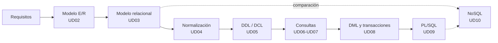

# Bases de Datos · Módulo 0484

Apuntes del módulo profesional **0484. Bases de datos**, común a los ciclos formativos de grado superior **Desarrollo de Aplicaciones Multiplataforma (DAM)** y **Desarrollo de Aplicaciones Web (DAW)**. Curso **2026/27**.

| Característica | Valor |
|---|---|
| **Referencia curricular** | Real Decreto 405/2023, de 29 de mayo (actualiza los títulos de DAM y DAW) |
| **Duración** | 105 horas (enseñanzas mínimas) · 12 créditos ECTS · 160 horas de aula en el centro |
| **Resultados de aprendizaje** | 7 (RA1 a RA7) con 57 criterios de evaluación |
| **SGBD relacional** | Oracle AI Database 26ai Free (23.26) |
| **SGBD no relacional** | MongoDB Community Server 8.0 |
| **Proyecto común** | [EduGest: gestión de un centro educativo](/guia/proyecto-edugest) |

> [!NOTE]
> Estos apuntes **no son un manual de SQL**. Están organizados para que alcances los resultados de aprendizaje oficiales del módulo. Recorren el ciclo de vida completo de una base de datos:
> **análisis → modelo conceptual → modelo lógico → normalización → diseño físico → implementación → consultas → modificación → programación → optimización → NoSQL.**

## El ciclo de trabajo con una base de datos

## Guía didáctica del curso 2026/27

El módulo se imparte con una carga de **160 horas de aula** (5 horas semanales, una por día lectivo) entre el **9 de septiembre de 2026** y el **18 de junio de 2027**. Las horas se reparten en tres evaluaciones y se han ajustado al calendario escolar y a las fechas de pruebas y de Formación en Empresa (FE) comunicadas por el centro.

> [!NOTE]
> Las enseñanzas mínimas del RD 405/2023 fijan 105 horas para el módulo. Las 160 horas son las de **horario del centro**; el exceso sobre el mínimo se dedica a la práctica guiada, al proyecto EduGest y al refuerzo. Todos los criterios de evaluación se cubren en las unidades; el reparto de horas es orientativo y puede ajustarse a cada grupo.



### Reparto de horas por evaluación

| Evaluación | Unidad | Horas | Del | Al | RA principal |
|---|---|:-:|---|---|---|
| **1ª** (65 h) | UD01 · Sistemas de almacenamiento y SGBD | 12 | 09/09/2026 | 24/09/2026 | RA1 |
| | UD02 · Modelo Entidad/Relación | 19 | 25/09/2026 | 23/10/2026 | RA6 |
| | UD03 · Modelo relacional | 17 | 26/10/2026 | 17/11/2026 | RA6 · RA2 |
| | UD04 · Normalización | 14 | 18/11/2026 | 07/12/2026 | RA6 |
| | Prueba y revisión de la 1ª evaluación | 3 | 09/12/2026 | 11/12/2026 | |
| **2ª** (43 h) | UD05 · Definición y control de datos | 17 | 14/12/2026 | 21/01/2027 | RA2 |
| | UD06 · Consultas sobre una tabla | 23 | 22/01/2027 | 23/02/2027 | RA3 · RA5 |
| | Prueba y revisión de la 2ª evaluación | 3 | 24/02/2027 | 26/02/2027 | |
| **3ª** (52 h) | UD07 · Consultas avanzadas | 17 | 01/03/2027 | 24/03/2027 | RA3 |
| | *Pascua y Formación en Empresa (abril)* | | 25/03/2027 | 30/04/2027 | |
| | UD08 · DML, transacciones y concurrencia | 9 | 03/05/2027 | 13/05/2027 | RA4 |
| | UD09 · Programación con PL/SQL | 11 | 14/05/2027 | 28/05/2027 | RA5 |
| | UD10 · Bases de datos NoSQL | 7 | 31/05/2027 | 08/06/2027 | RA7 |
| | Prueba y revisión de la 3ª evaluación y final | 3 | 09/06/2027 | 11/06/2027 | |
| | Refuerzo, recuperación y margen | 5 | 14/06/2027 | 18/06/2027 | |
| | **Total** | **160** | | | |

La evaluación extraordinaria está prevista para el **21 de junio de 2027**.

### Criterios de la planificación

- **Teoría y práctica en la misma unidad.** Cada unidad indica en su página de teoría una *temporalización* con el reparto de sesiones entre teoría (T) y práctica (P). La suma de horas de cada unidad coincide con la de esta tabla.
- **Práctica guiada en el aula, práctica autónoma fuera de ella.** Las prácticas guiadas y la tarea del proyecto EduGest se hacen en clase. Las prácticas autónomas, los retos y las ampliaciones son trabajo personal, y el profesorado resuelve las dudas en las sesiones de práctica.
- **Pruebas de evaluación.** Cada evaluación reserva 3 horas a la prueba y a su revisión, en la semana indicada por el centro para los ciclos de grado superior.
- **Un día lectivo equivale a una hora.** Los festivos y los días sin docencia no cuentan. El tiempo previsto para el refuerzo final absorbe los días que se pierdan por fiestas locales o actividades del centro.

> [!WARNING]
> **Abril y la Formación en Empresa.** Se ha previsto que el alumnado esté en FE durante todo abril, por lo que **no se programa docencia** entre el 6 y el 30 de abril. Si algún alumno o grupo permanece en el centro, ese mes aporta 19 horas adicionales, que se dedicarían a ampliar la práctica de las unidades UD07 a UD10 (consultas avanzadas, transacciones, PL/SQL y NoSQL), las más cortas del curso respecto a su dificultad.

> [!CAUTION]
> **Calendario provisional.** Las fechas proceden del calendario escolar provisional 2026/27 y de las fechas de evaluación comunicadas por el centro. Los festivos locales y los tres días no lectivos que fije el centro **no están descontados**: se resolverán con la semana de refuerzo. Cuando se publique el calendario definitivo debe revisarse el archivo `data/planificacion.json`; la tabla y el calendario se actualizan solos y la compilación falla si las horas de una unidad dejan de sumar.

## Unidades didácticas

Cada unidad tiene dos páginas: **teoría** (conceptos, ejemplos y autoevaluación) y **prácticas** (prácticas guiadas, autónomas, retos y la tarea del proyecto EduGest).

  
RA1<h3>UD01 · Sistemas de almacenamiento y SGBD</h3>
Ficheros frente a bases de datos, arquitectura y funciones de un SGBD, tipos de bases de datos, distribución, Big Data y protección de datos.

<a href="ud01-introduccion/ud01-teoria/">Teoría</a> · <a href="ud01-introduccion/ud01-practicas/">Prácticas</a>

  
RA6<h3>UD02 · Modelo Entidad/Relación</h3>
Análisis de requisitos, entidades, atributos, relaciones, cardinalidades, entidades débiles y extensiones EER.

<a href="ud02-modelo-er/ud02-teoria/">Teoría</a> · <a href="ud02-modelo-er/ud02-practicas/">Prácticas</a>

  
RA6 · RA2<h3>UD03 · Modelo relacional</h3>
Relaciones, claves, restricciones, integridad y transformación del modelo E/R al modelo relacional.

<a href="ud03-modelo-relacional/ud03-teoria/">Teoría</a> · <a href="ud03-modelo-relacional/ud03-practicas/">Prácticas</a>

  
RA6<h3>UD04 · Normalización</h3>
Anomalías, dependencias funcionales, 1FN, 2FN, 3FN y FNBC. Restricciones que el diseño lógico no puede expresar.

<a href="ud04-normalizacion/ud04-teoria/">Teoría</a> · <a href="ud04-normalizacion/ud04-practicas/">Prácticas</a>

  
RA2<h3>UD05 · Definición y control de datos</h3>
DDL en Oracle: tablas, tipos, restricciones, índices, vistas y secuencias. DCL: usuarios, roles y privilegios.

<a href="ud05-ddl-dcl/ud05-teoria/">Teoría</a> · <a href="ud05-ddl-dcl/ud05-practicas/">Prácticas</a>

  
RA3<h3>UD06 · Consultas sobre una tabla</h3>
SELECT, proyección, selección, ordenación, operadores, valores nulos y funciones de fila.

<a href="ud06-consultas-basicas/ud06-teoria/">Teoría</a> · <a href="ud06-consultas-basicas/ud06-practicas/">Prácticas</a>

  
RA3<h3>UD07 · Consultas avanzadas</h3>
Agrupamiento, composiciones internas y externas, subconsultas, operadores de conjuntos y optimización.

<a href="ud07-consultas-avanzadas/ud07-teoria/">Teoría</a> · <a href="ud07-consultas-avanzadas/ud07-practicas/">Prácticas</a>

  
RA4<h3>UD08 · Manipulación de datos y transacciones</h3>
INSERT, UPDATE, DELETE, MERGE, transacciones, ACID, concurrencia y bloqueos.

<a href="ud08-dml-transacciones/ud08-teoria/">Teoría</a> · <a href="ud08-dml-transacciones/ud08-practicas/">Prácticas</a>

  
RA5<h3>UD09 · Programación con PL/SQL</h3>
Bloques, variables, control de flujo, procedimientos, funciones, cursores, excepciones, triggers y tareas programadas.

<a href="ud09-plsql/ud09-teoria/">Teoría</a> · <a href="ud09-plsql/ud09-practicas/">Prácticas</a>

  
RA7<h3>UD10 · Bases de datos NoSQL</h3>
Tipos de bases de datos no relacionales, modelado documental y operaciones CRUD y de agregación con MongoDB.

<a href="ud10-nosql/ud10-teoria/">Teoría</a> · <a href="ud10-nosql/ud10-practicas/">Prácticas</a>

## Relación entre unidades y resultados de aprendizaje

| Unidad | RA1 | RA2 | RA3 | RA4 | RA5 | RA6 | RA7 |
|---|:-:|:-:|:-:|:-:|:-:|:-:|:-:|
| UD01 Sistemas de almacenamiento y SGBD | ● | ○ | | | | | ○ |
| UD02 Modelo Entidad/Relación | | | | | | ● | |
| UD03 Modelo relacional | | ○ | | | | ● | |
| UD04 Normalización | | | | | | ● | |
| UD05 Definición y control de datos | | ● | | | | ○ | |
| UD06 Consultas sobre una tabla | | | ● | | ○ | | |
| UD07 Consultas avanzadas | | ○ | ● | | | | |
| UD08 Manipulación y transacciones | | | | ● | | ○ | |
| UD09 Programación PL/SQL | | | | ○ | ● | ○ | |
| UD10 Bases de datos NoSQL | ○ | | | | | | ● |

● contribución principal · ○ contribución secundaria. El detalle por criterio de evaluación está en [Resultados de aprendizaje y criterios de evaluación](/guia/ra-ce).

## Cómo leer estos apuntes

Los apuntes usan cuadros de colores para destacar información:

> [!TIP]
> **Consejo.** Una forma más cómoda o profesional de hacer algo.

> [!WARNING]
> **Atención.** Un error habitual o algo que puede dar problemas.

> [!IMPORTANT]
> **Clave.** Un concepto imprescindible para el resultado de aprendizaje.

> [!CAUTION]
> **Peligro.** Una operación que puede destruir o exponer datos.

{}
Las pistas y las **soluciones** de los ejercicios aparecen plegadas. Intenta resolver el ejercicio antes de abrirlas.
{}

Los fragmentos de código indican siempre el gestor al que corresponden, por ejemplo ,  o .

Consulta también la [guía del módulo](/guia): el proyecto EduGest, la instalación del entorno y las convenciones de las prácticas.

## Fuentes

- [Real Decreto 405/2023, de 29 de mayo](https://www.boe.es/buscar/act.php?id=BOE-A-2023-13221). Texto consolidado en el BOE.
- [Documentación de Oracle AI Database 26ai](https://docs.oracle.com/en/database/oracle/oracle-database/26/).
- [Manual de MongoDB](https://www.mongodb.com/docs/manual/).
