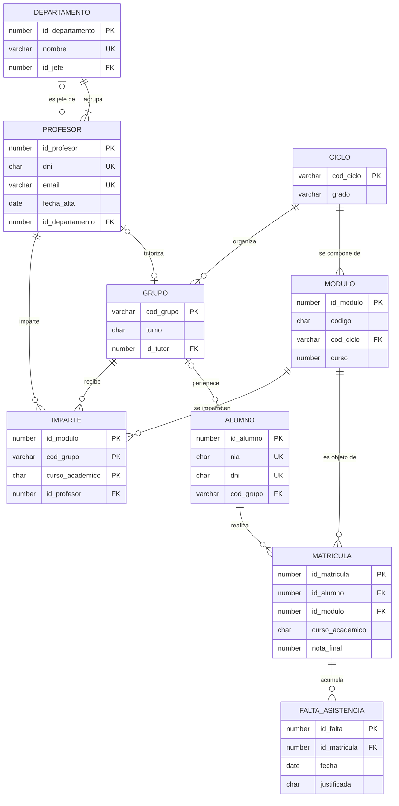

# Proyecto transversal: EduGest

**EduGest** es la base de datos de gestión académica de un instituto de Formación Profesional ficticio, el *IES Serra Gelada*. Es el hilo conductor del curso: empieza como una entrevista con el cliente y termina como una base de datos relacional completa, programada y con una versión documental en MongoDB.

> [!IMPORTANT]
> Diseñar y administrar una base de datos no es un conjunto de temas aislados. Es un proceso continuo. Cada unidad añade una capa a EduGest y **usa lo que se hizo en la anterior**. Guarda tu trabajo en un repositorio Git desde el primer día.

## 1. Enunciado: entrevista con la jefatura de estudios

> «En el instituto impartimos varios **ciclos formativos** (DAM, DAW, ASIR y, el año que viene, SMR). De cada ciclo guardamos un código, el nombre, el grado (básico, medio o superior) y su duración total en horas.
>
> Cada ciclo se compone de **módulos profesionales**. Un módulo tiene un código oficial de cuatro cifras, un nombre, el curso en el que se imparte (primero o segundo) y sus horas. **Ojo:** hay módulos con el mismo código que están en varios ciclos, como *0484 Bases de datos*, que está en DAM y en DAW. Para nosotros son módulos distintos, porque tienen grupos y profesorado distintos.
>
> El alumnado se organiza en **grupos** (1DAM, 2DAW...). Cada grupo pertenece a un ciclo y a un curso, tiene turno de mañana o de tarde y puede tener un **tutor**, que es un profesor. Un profesor solo puede tutorizar un grupo.
>
> De cada **alumno** necesitamos el NIA (número de identificación del alumnado, obligatorio y único), el DNI o NIE si lo tiene, nombre, apellidos, fecha de nacimiento, correo, teléfono, localidad y su grupo de referencia. Algunos alumnos acaban de llegar y todavía no tienen grupo.
>
> El alumno se **matricula** en módulos, cada curso académico (2025-26, 2026-27...). Guardamos la fecha de matrícula, la convocatoria (de la 1 a la 4) y la nota final, que puede no existir todavía. Un alumno no puede matricularse dos veces del mismo módulo en el mismo curso.
>
> Del **profesorado** guardamos DNI, nombre, apellidos, correo, fecha de alta en el centro, especialidad y el **departamento** al que pertenece. Cada departamento tiene un nombre único y un jefe de departamento, que es uno de sus profesores.
>
> Necesitamos saber **qué profesor imparte cada módulo a cada grupo** en cada curso académico y cuántas horas semanales.
>
> Por último, el profesorado registra las **faltas de asistencia**: día, número de horas y si está justificada. Una falta se refiere a la matrícula de un alumno en un módulo concreto.»

## 2. Evolución del proyecto durante el curso

| Unidad | Lo que se añade a EduGest | Entregable |
|---|---|---|
| UD01 | Análisis del sistema actual (hojas de cálculo) y justificación de un SGBD. Datos personales y RGPD. | Informe de análisis |
| UD02 | Modelo conceptual: diagrama E/R a partir del enunciado. | Diagrama E/R + diccionario de datos |
| UD03 | Modelo lógico: transformación al modelo relacional. | Esquema relacional con PK, FK y restricciones |
| UD04 | Normalización del esquema y de la hoja heredada de matrículas. | Informe de normalización hasta 3FN |
| UD05 | Implementación en Oracle: tablas, restricciones, índices, vistas, usuarios y roles. | Scripts `01_esquema.sql` y `03_seguridad.sql` |
| UD06 | Consultas sobre una tabla para el día a día de secretaría. | Script de consultas comentado |
| UD07 | Informes: actas, estadísticas por grupo, consultas con JOIN y subconsultas. Optimización. | Script de informes + planes de ejecución |
| UD08 | Altas, bajas y cambios. Promoción de curso dentro de una transacción. | Guion transaccional probado |
| UD09 | Lógica en el servidor: funciones, procedimientos, triggers de auditoría y tarea programada. | Paquete PL/SQL + pruebas |
| UD10 | Versión documental del expediente del alumnado en MongoDB y comparación con el modelo relacional. | Colección + consultas + informe comparativo |

## 3. Modelo de referencia

El diagrama siguiente es la **solución de referencia** que se publica cuando termina la UD04. Hasta entonces, cada estudiante trabaja con su propio diseño.

{}



**Esquema relacional** (subrayado = clave primaria, *cursiva* = clave ajena):

- DEPARTAMENTO(<u>id_departamento</u>, nombre, *id_jefe*)
- PROFESOR(<u>id_profesor</u>, dni, nombre, apellidos, email, fecha_alta, especialidad, *id_departamento*)
- CICLO(<u>cod_ciclo</u>, nombre, grado, horas_totales)
- MODULO(<u>id_modulo</u>, codigo, nombre, *cod_ciclo*, curso, horas) · UNIQUE(codigo, cod_ciclo)
- GRUPO(<u>cod_grupo</u>, *cod_ciclo*, curso, turno, *id_tutor*) · UNIQUE(id_tutor)
- ALUMNO(<u>id_alumno</u>, nia, dni, nombre, apellidos, fecha_nacimiento, email, telefono, localidad, *cod_grupo*)
- MATRICULA(<u>id_matricula</u>, *id_alumno*, *id_modulo*, curso_academico, fecha_matricula, convocatoria, nota_final) · UNIQUE(id_alumno, id_modulo, curso_academico)
- IMPARTE(<u>*id_modulo*, *cod_grupo*, curso_academico</u>, *id_profesor*, horas_semanales)
- FALTA_ASISTENCIA(<u>id_falta</u>, *id_matricula*, fecha, horas, justificada) · UNIQUE(id_matricula, fecha)

{}

### Restricciones que no recoge el diagrama

Algunas reglas de negocio no se pueden expresar con claves ni con `CHECK` de una sola fila. Se documentan en la UD04 (RA6.h) y se implementan en la UD09 con PL/SQL:

1. El jefe de un departamento debe **pertenecer** a ese departamento.
2. Un alumno solo puede matricularse en módulos del **ciclo de su grupo**, salvo autorización.
3. No se puede registrar una falta en una fecha **anterior a la matrícula**.
4. Un profesor no debería superar **20 horas lectivas** semanales en un curso académico.
5. La nota final solo puede modificarse si el módulo está **en un curso académico abierto**.

## 4. Scripts descargables

Los scripts están escritos para **Oracle AI Database 26ai Free**. También funcionan en 23ai y, salvo lo que se indica en sus comentarios, en 19c y 21c.

| Script | Contenido | Se ejecuta como |
|---|---|---|
| [edugest_00_usuario.sql](recursos/sql/edugest_00_usuario.sql) | Crea el usuario/esquema `EDUGEST` | `SYSTEM` en `FREEPDB1` |
| [edugest_01_esquema.sql](recursos/sql/edugest_01_esquema.sql) | Tablas, restricciones, índices y comentarios | `EDUGEST` |
| [edugest_02_datos.sql](recursos/sql/edugest_02_datos.sql) | Datos de ejemplo del curso 2025-26 | `EDUGEST` |

```bash
# Desde la carpeta donde hayas descargado los scripts (SQLcl)
sql system/<contraseña>@//localhost:1521/FREEPDB1 @edugest_00_usuario.sql
sql edugest/Edugest_2026@//localhost:1521/FREEPDB1 @edugest_01_esquema.sql
sql edugest/Edugest_2026@//localhost:1521/FREEPDB1 @edugest_02_datos.sql
```

Al final del script 02 se muestra un recuento de filas. Si todo ha ido bien debes obtener:

| tabla | filas |
|---|---:|
| departamento | 5 |
| profesor | 12 |
| ciclo | 4 |
| modulo | 24 |
| grupo | 6 |
| alumno | 32 |
| matricula | 143 |
| imparte | 24 |
| falta_asistencia | 46 |

> [!TIP]
> Los datos están preparados para que las consultas den resultados interesantes. Hay un departamento sin profesorado (Matemáticas), un ciclo sin módulos ni grupos (SMR), un grupo sin alumnado ni tutor (2ASIR), un profesor que no imparte clase, alumnado sin grupo, sin DNI, sin correo o sin teléfono, y notas sin calificar (`NULL`). Así se pueden practicar las composiciones externas y el tratamiento de los valores nulos.

> [!WARNING]
> Todos los datos personales de EduGest son **ficticios**. En un proyecto real, los datos del alumnado son datos personales protegidos por el RGPD y la LOPDGDD (UD01). Nunca uses datos reales en entornos de prueba.
