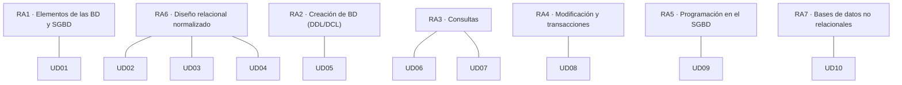

# Resultados de aprendizaje y criterios de evaluación

El módulo **0484. Bases de datos** se rige por el **Real Decreto 405/2023, de 29 de mayo**, que actualiza los títulos de Técnico Superior en DAM y en DAW. El módulo es idéntico en los dos ciclos: tiene **12 créditos ECTS**, una duración mínima de **105 horas** y **7 resultados de aprendizaje (RA)** con **57 criterios de evaluación (CE)**.

> [!IMPORTANT]
> Un **resultado de aprendizaje** describe lo que sabrás hacer al terminar el módulo. Un **criterio de evaluación** es una evidencia concreta que demuestra que lo has conseguido. Cada unidad, práctica y ejercicio de estos apuntes indica qué CE trabaja.

## Mapa de contribución

> [!NOTE]
> El orden de las unidades no coincide con el número de los RA. Primero se **diseña** (RA6) y después se **implementa** (RA2). El currículo describe *qué* hay que conseguir, no el orden en que se enseña.

## Criterios de evaluación por resultado de aprendizaje

Texto literal de las enseñanzas mínimas. La última columna indica en qué unidades se trabaja cada criterio.

## RA1. Reconoce los elementos de las bases de datos analizando sus funciones y valorando la utilidad de los sistemas gestores.

| CE | Criterio de evaluación | Unidades |
|---|---|---|
| RA1.a | Se han analizado los sistemas lógicos de almacenamiento y sus características. | [UD01](/ud01-introduccion) |
| RA1.b | Se han identificado los distintos tipos de bases de datos según el modelo de datos utilizado. | [UD01](/ud01-introduccion), [UD10](/ud10-nosql) |
| RA1.c | Se han identificado los distintos tipos de bases de datos en función de la ubicación de la información. | [UD01](/ud01-introduccion) |
| RA1.d | Se ha evaluado la utilidad de un sistema gestor de bases de datos. | [UD01](/ud01-introduccion) |
| RA1.e | Se ha reconocido la función de cada uno de los elementos de un sistema gestor de bases de datos. | [UD01](/ud01-introduccion) |
| RA1.f | Se han clasificado los sistemas gestores de bases de datos. | [UD01](/ud01-introduccion) |
| RA1.g | Se ha reconocido la utilidad de las bases de datos distribuidas. | [UD01](/ud01-introduccion) |
| RA1.h | Se han analizado las políticas de fragmentación de la información. | [UD01](/ud01-introduccion) |
| RA1.i | Se ha identificado la legislación vigente sobre protección de datos. | [UD01](/ud01-introduccion) |
| RA1.j | Se han reconocido los conceptos de Big Data y de la inteligencia de negocios. | [UD01](/ud01-introduccion) |

## RA2. Crea bases de datos definiendo su estructura y las características de sus elementos según el modelo relacional.

| CE | Criterio de evaluación | Unidades |
|---|---|---|
| RA2.a | Se ha analizado el formato de almacenamiento de la información. | [UD01](/ud01-introduccion), [UD03](/ud03-modelo-relacional), [UD05](/ud05-ddl-dcl) |
| RA2.b | Se han creado las tablas y las relaciones entre ellas. | [UD05](/ud05-ddl-dcl) |
| RA2.c | Se han seleccionado los tipos de datos adecuados. | [UD05](/ud05-ddl-dcl) |
| RA2.d | Se han definido los campos clave en las tablas. | [UD03](/ud03-modelo-relacional), [UD05](/ud05-ddl-dcl) |
| RA2.e | Se han implantado las restricciones reflejadas en el diseño lógico. | [UD03](/ud03-modelo-relacional), [UD05](/ud05-ddl-dcl) |
| RA2.f | Se han creado vistas. | [UD05](/ud05-ddl-dcl), [UD07](/ud07-consultas-avanzadas) |
| RA2.g | Se han creado los usuarios y se les han asignado privilegios. | [UD05](/ud05-ddl-dcl) |
| RA2.h | Se han utilizado asistentes, herramientas gráficas y los lenguajes de definición y control de datos. | [UD05](/ud05-ddl-dcl) |

## RA3. Consulta la información almacenada en una base de datos empleando asistentes, herramientas gráficas y el lenguaje de manipulación de datos.

| CE | Criterio de evaluación | Unidades |
|---|---|---|
| RA3.a | Se han identificado las herramientas y sentencias para realizar consultas. | [UD06](/ud06-consultas-basicas), [UD07](/ud07-consultas-avanzadas) |
| RA3.b | Se han realizado consultas simples sobre una tabla. | [UD06](/ud06-consultas-basicas) |
| RA3.c | Se han realizado consultas sobre el contenido de varias tablas mediante composiciones internas. | [UD07](/ud07-consultas-avanzadas) |
| RA3.d | Se han realizado consultas sobre el contenido de varias tablas mediante composiciones externas. | [UD07](/ud07-consultas-avanzadas) |
| RA3.e | Se han realizado consultas resumen. | [UD07](/ud07-consultas-avanzadas) |
| RA3.f | Se han realizado consultas con subconsultas. | [UD07](/ud07-consultas-avanzadas) |
| RA3.g | Se han realizado consultas que implican múltiples selecciones. | [UD07](/ud07-consultas-avanzadas) |
| RA3.h | Se han aplicado criterios de optimización de consultas. | [UD07](/ud07-consultas-avanzadas) |

## RA4. Modifica la información almacenada en la base de datos utilizando asistentes, herramientas gráficas y el lenguaje de manipulación de datos.

| CE | Criterio de evaluación | Unidades |
|---|---|---|
| RA4.a | Se han identificado las herramientas y sentencias para modificar el contenido de la base de datos. | [UD08](/ud08-dml-transacciones) |
| RA4.b | Se han insertado, borrado y actualizado datos en las tablas. | [UD08](/ud08-dml-transacciones) |
| RA4.c | Se ha incluido en una tabla la información resultante de la ejecución de una consulta. | [UD08](/ud08-dml-transacciones) |
| RA4.d | Se han diseñado guiones de sentencias para llevar a cabo tareas complejas. | [UD08](/ud08-dml-transacciones), [UD09](/ud09-plsql) |
| RA4.e | Se ha reconocido el funcionamiento de las transacciones. | [UD08](/ud08-dml-transacciones) |
| RA4.f | Se han anulado parcial o totalmente los cambios producidos por una transacción. | [UD08](/ud08-dml-transacciones) |
| RA4.g | Se han identificado los efectos de las distintas políticas de bloqueo de registros. | [UD08](/ud08-dml-transacciones) |
| RA4.h | Se han adoptado medidas para mantener la integridad y consistencia de la información. | [UD08](/ud08-dml-transacciones), [UD09](/ud09-plsql) |

## RA5. Desarrolla procedimientos almacenados evaluando y utilizando las sentencias del lenguaje incorporado en el sistema gestor de bases de datos.

| CE | Criterio de evaluación | Unidades |
|---|---|---|
| RA5.a | Se han identificado las diversas formas de automatizar tareas. | [UD09](/ud09-plsql) |
| RA5.b | Se han reconocido los métodos de ejecución de guiones. | [UD09](/ud09-plsql) |
| RA5.c | Se han identificado las herramientas disponibles para editar guiones. | [UD09](/ud09-plsql) |
| RA5.d | Se han definido y utilizado guiones para automatizar tareas. | [UD09](/ud09-plsql) |
| RA5.e | Se ha hecho uso de las funciones proporcionadas por el sistema gestor. | [UD06](/ud06-consultas-basicas), [UD09](/ud09-plsql) |
| RA5.f | Se han definido procedimientos y funciones de usuario. | [UD09](/ud09-plsql) |
| RA5.g | Se han utilizado estructuras de control de flujo. | [UD09](/ud09-plsql) |
| RA5.h | Se han definido eventos y disparadores. | [UD09](/ud09-plsql) |
| RA5.i | Se han utilizado cursores. | [UD09](/ud09-plsql) |
| RA5.j | Se han utilizado excepciones. | [UD09](/ud09-plsql) |

## RA6. Diseña modelos relacionales normalizados interpretando diagramas entidad/relación.

| CE | Criterio de evaluación | Unidades |
|---|---|---|
| RA6.a | Se han utilizado herramientas gráficas para representar el diseño lógico. | [UD02](/ud02-modelo-er), [UD03](/ud03-modelo-relacional), [UD05](/ud05-ddl-dcl) |
| RA6.b | Se han identificado las tablas del diseño lógico. | [UD03](/ud03-modelo-relacional), [UD04](/ud04-normalizacion) |
| RA6.c | Se han identificado los campos que forman parte de las tablas del diseño lógico. | [UD03](/ud03-modelo-relacional), [UD04](/ud04-normalizacion) |
| RA6.d | Se han analizado las relaciones entre las tablas del diseño lógico. | [UD02](/ud02-modelo-er), [UD03](/ud03-modelo-relacional) |
| RA6.e | Se han identificado los campos clave. | [UD02](/ud02-modelo-er), [UD03](/ud03-modelo-relacional), [UD04](/ud04-normalizacion) |
| RA6.f | Se han aplicado reglas de integridad. | [UD03](/ud03-modelo-relacional), [UD05](/ud05-ddl-dcl), [UD08](/ud08-dml-transacciones) |
| RA6.g | Se han aplicado reglas de normalización. | [UD04](/ud04-normalizacion) |
| RA6.h | Se han analizado y documentado las restricciones que no pueden plasmarse en el diseño lógico. | [UD02](/ud02-modelo-er), [UD03](/ud03-modelo-relacional), [UD04](/ud04-normalizacion), [UD09](/ud09-plsql) |

## RA7. Gestiona la información almacenada en bases de datos no relacionales, evaluando y utilizando las posibilidades que proporciona el sistema gestor.

| CE | Criterio de evaluación | Unidades |
|---|---|---|
| RA7.a | Se han caracterizado las bases de datos no relacionales. | [UD01](/ud01-introduccion), [UD10](/ud10-nosql) |
| RA7.b | Se han evaluado los principales tipos de bases de datos no relacionales. | [UD10](/ud10-nosql) |
| RA7.c | Se han identificado los elementos utilizados en estas bases de datos. | [UD10](/ud10-nosql) |
| RA7.d | Se han identificado distintas formas de gestión de la información según el tipo de base de datos no relacionales. | [UD10](/ud10-nosql) |
| RA7.e | Se han utilizado las herramientas del sistema gestor para la gestión de la información almacenada. | [UD10](/ud10-nosql) |
## Evidencias de aprendizaje

Para cada criterio de evaluación se recogen evidencias de distintos tipos:

| Tipo de evidencia | Ejemplos | CE en los que se usa sobre todo |
|---|---|---|
| Cuestionarios y preguntas de razonamiento | Autoevaluaciones de cada unidad, preguntas de justificación | RA1, RA7.a-b |
| Diagramas y documentos de diseño | Diagrama E/R, esquema relacional, informe de normalización | RA6 |
| Scripts SQL ejecutables | Scripts DDL, DCL, de consulta y de modificación | RA2, RA3, RA4 |
| Código PL/SQL con pruebas | Procedimientos, funciones, triggers con su batería de pruebas | RA5 |
| Capturas y registros de ejecución | Planes de ejecución, sesiones concurrentes, salidas de `mongosh` | RA3.h, RA4.g, RA7.e |
| Entregas del proyecto EduGest | Una tarea de proyecto al final de cada unidad | Todos |

## Fuente

- [Real Decreto 405/2023, de 29 de mayo, por el que se actualizan los títulos de DAM y DAW (BOE-A-2023-13221)](https://www.boe.es/buscar/act.php?id=BOE-A-2023-13221).
