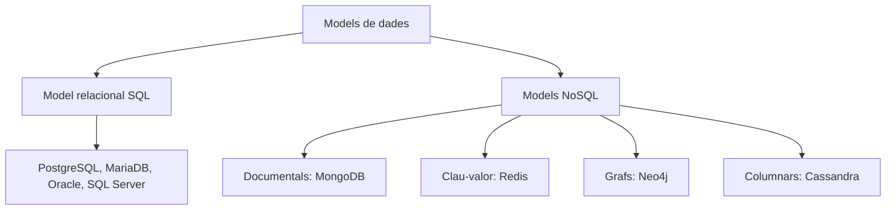
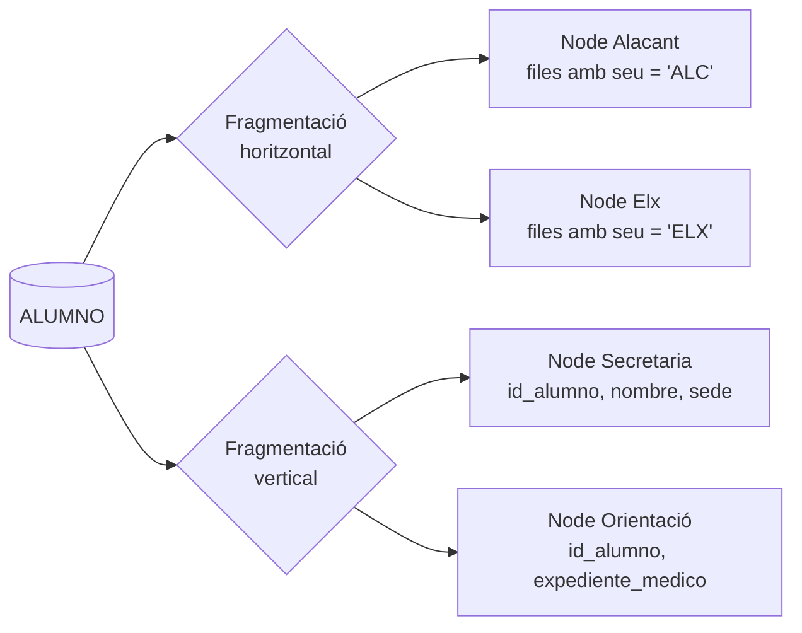
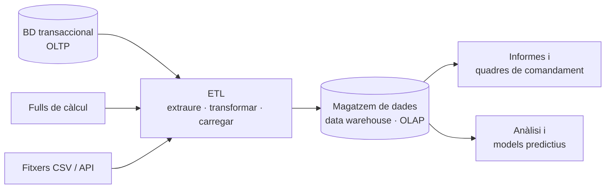

# UD01 · Sistemes d'emmagatzematge i SGBD


## Resum del tema

**Visió general:**
Un **sistema gestor de bases de dades (SGBD)** és el component de programari essencial que centralitza, organitza, consulta, manté i protegix la informació en les organitzacions modernes. En els inicis de la informàtica, les aplicacions gestionaven les dades directament mitjançant **sistemes de fitxers independents**, cosa que provocava greus problemes de redundància, incoherència, acoblament físic i lògic, i fallades de seguretat.

Aquesta unitat tracta en profunditat la transició històrica des dels suports físics primitius (targetes perforades, cintes magnètiques i discos plans) fins als SGBD relacionals i NoSQL actuals. S'hi analitzen detalladament els mètodes d'organització de fitxers (seqüencials, d'accés aleatori mitjançant el càlcul de l'*offset* i indexats amb arbres B), l'arquitectura estàndard de tres nivells **ANSI/SPARC**, els components interns d'un motor de base de dades, les regles d'integritat referencial i de domini, la gestió de la concurrència mitjançant **transaccions ACID**, les polítiques de seguretat i recuperació, així com les topologies de desplegament i els subconjunts del llenguatge SQL.


### Temporalització

La unitat ocupa **12 hores d'aula** (8 de teoria i 4 de pràctica).


items:
  - {h: 2, tipo: T, t: "Dades i informació. Història. Sistemes basats en fitxers", ref: "§1 a §3"}
  - {h: 1, tipo: P, t: "Del full de càlcul al SGBD", ref: "Pràctica 1.1"}
  - {h: 2, tipo: T, t: "Bases de dades i SGBD. Arquitectura i components", ref: "§4 i §5"}
  - {h: 2, tipo: P, t: "Primer contacte amb Oracle", ref: "Pràctica 1.2"}
  - {h: 2, tipo: T, t: "Integritat, concurrència i transaccions. Seguretat. Models de dades i llenguatges", ref: "§6 a §8"}
  - {h: 1, tipo: T, t: "Classificació dels SGBD. Bases de dades distribuïdes i fragmentació", ref: "§9 i §10"}
  - {h: 1, tipo: T, t: "Big Data, intel·ligència empresarial i protecció de dades", ref: "§11 i §12"}
  - {h: 1, tipo: P, t: "Informe d'anàlisi d'EduGest", ref: "Projecte EduGest-1"}
autonomo:
  - "Pràctiques 1.3 (triar un SGBD), 1.4 (distribució de dades), 1.5 (auditoria de protecció de dades) i 1.6"
  - "Exercicis resolts i autoavaluació"



### Objectius d'aprenentatge

En acabar aquesta unitat, seràs capaç de:

- Explicar la diferència entre dada, informació i coneixement, i entre fitxer i base de dades.
- Analitzar els problemes dels sistemes basats en fitxers i valorar la utilitat d'un SGBD.
- Descriure l'arquitectura ANSI/SPARC, els components d'un SGBD i els perfils d'usuari.
- Classificar els SGBD segons el model de dades, la ubicació de la informació i altres criteris.
- Reconéixer la utilitat de les bases de dades distribuïdes i les polítiques de fragmentació.
- Reconéixer els conceptes de Big Data i d'intel·ligència empresarial.
- Identificar la legislació de protecció de dades que afecta el disseny d'una base de dades.

> [!NOTE]
> Aquesta unitat és **conceptual**: encara no instal·lem res ni escrivim SQL de manera sistemàtica. Els fragments SQL que hi apareixen són il·lustratius i utilitzen una sintaxi genèrica. A partir de la UD05 treballarem amb Oracle.



---


Dades, història i fitxers

## 1. Dades, informació i representació

### 1.1 La cadena de valor: dada, informació i coneixement

En l'àmbit de les ciències de la computació i de la gestió de bases de dades, és fonamental distingir amb precisió entre **dada**, **informació** i **coneixement**:

- **Dada (Data):** És una representació simbòlica (numèrica, alfabètica, espacial o algorítmica) d'un atribut, un esdeveniment o un fet del món real. Aïllada, una dada no té context, semàntica ni una finalitat que es puga avaluar.
  - *Exemples de dades:* `2026-10-01`, `1200`, `B`.
- **Informació (Information):** Apareix quan un conjunt de dades processades, estructurades i contextualitzades adquirix significat per a una persona o per a un sistema informàtic i permet reduir la incertesa i prendre decisions.
  - *Exemple d'informació:* «La cita mèdica del pacient Juan Pérez amb el Dr. Martínez (`B`) està programada per al `2026-10-01` a les `12:00`».
- **Coneixement (Knowledge):** És la integració de diversos fluxos d'informació combinats amb l'experiència, les regles de negoci i les inferències lògiques, que permet predir comportaments o automatitzar accions complexes.
  - *Exemple de coneixement:* «El 85 % dels pacients que demanen cita a les 12.00 durant el mes d'octubre hi arriben puntualment si reben un recordatori per SMS 24 hores abans».

---

### 1.2 Representació tabular i tipatge de dades

Perquè un ordinador interprete i emmagatzeme la informació de manera eficient, les dades s'organitzen en models tabulars formats per **files (registres, tuples o ocurrències)** i **columnes (atributs o camps)**:

| Atribut / camp | Tipus de dada lògic | Restricció de domini / regla | Exemple de valor vàlid |
| :--- | :--- | :--- | :--- |
| `id_cliente` | Enter (`INT / BIGINT`) | Clau primària (`PRIMARY KEY`), autoincremental, no nul·la. | `10045` |
| `nombre` | Cadena variable (`VARCHAR(100)`) | No nul (`NOT NULL`), text en format UTF-8. | `'Laura Gomez'` |
| `email` | Cadena (`VARCHAR(150)`) | Única (`UNIQUE`), adreça de correu vàlida. | `'laura@ejemplo.com'` |
| `saldo_cuenta` | Decimal fix (`DECIMAL(12,2)`) | Major o igual que zero (`CHECK (saldo_cuenta >= 0)`). | `1250.75` |
| `fecha_alta` | Data estàndard (`DATE`) | Format ISO `YYYY-MM-DD`, no futura. | `'2026-10-01'` |

#### La importància de triar correctament els tipus de dades

Triar un tipus de dada inadequat durant el disseny de la base de dades pot tindre conseqüències greus:

1. **Pèrdua de capacitat de filtratge i ordenació:** Si les dates s'emmagatzemen com a text pla (`"01/10/2026"`), el SGBD no pot aplicar-hi operadors cronològics (`WHERE fecha BETWEEN ...`) ni ordenar-les correctament (en ordre alfabètic, `"01/10/2026"` apareixeria abans que `"02/01/2020"`).
2. **Malbaratament de memòria secundària i RAM:** Utilitzar `CHAR(255)` per a guardar un codi numèric de dos dígits malbarata centenars de bytes per fila, penalitza la memòria cau del motor (*Buffer Pool*) i multiplica els accessos al disc (*I/O Operations*).
3. **Impossibilitat de garantir la integritat:** Si es permeten cadenes de text en camps numèrics, no s'hi poden aplicar directament operacions aritmètiques (`SUM`, `AVG`) i la base de dades queda exposada a incoherències de format causades per errors de l'aplicació client.

---

## 2. Història i evolució de les bases de dades

Al llarg del darrer segle, l'emmagatzematge de la informació ha experimentat una transformació profunda: ha passat de dispositius purament mecànics i analògics a plataformes relacionals molt optimitzades i arquitectures distribuïdes al núvol.



### 2.1 Antecedents mecànics i cintes magnètiques (1884-1950)

- **1884 — Màquina tabuladora de targetes perforades (Herman Hollerith):**
  Es va desenvolupar per a processar el cens dels Estats Units de 1890. Hollerith va inventar un sistema que codificava les dades demogràfiques mitjançant perforacions en targetes de cartó, que es llegien elèctricament. Aquesta fita va reduir de huit anys a només dos el temps necessari per a processar el cens i va donar origen a la companyia que més tard es convertiria en **IBM**.

- **Anys cinquanta — Cintes magnètiques i processament per lots (*batch*):**
  Amb l'arribada dels primers ordinadors comercials, com l'UNIVAC I, les targetes es van substituir per **cintes magnètiques**. Les dades s'organitzaven en **fitxers seqüencials**. Per a processar les nòmines o la comptabilitat, l'ordinador havia de llegir la cinta de principi a fi, sense interrupcions. Per a trobar el registre número 5.000, calia avançar físicament i llegir abans els 4.999 registres anteriors.

---

{}
La Tabulating Machine Company de Herman Hollerith, que va tabular el cens dels EUA de 1890 amb targetes perforades, es va fusionar el 1911 en la Computing-Tabulating-Recording Company, que el 1924 va passar a dir-se **IBM**.
{}

### 2.2 Suports de disc i models prerelacionals (anys seixanta)

La invenció del **disc magnètic de capçal mòbil**, com l'IBM 350, va revolucionar la informàtica perquè va fer possible l'**accés aleatori o directe**: en mil·lisegons, el capçal podia saltar a qualsevol pista i sector del disc sense haver de recórrer la resta del fitxer.

Aquesta innovació tècnica va donar lloc als primers **sistemes de gestió de bases de dades (SGBD) prerelacionals**:

- **Model jeràrquic (IBM IMS, 1966):** Les dades s'organitzaven en forma d'arbre, amb registres «pare» i «fills». Cada registre fill només podia tindre un pare. Aquest sistema va ser la columna vertebral del programa espacial **Apollo** de la NASA.
- **Model en xarxa (CODASYL DBTG, 1969):** Va permetre crear estructures de grafs més complexes, en què un registre «fill» podia tindre diversos registres «pare» (relacions $N:M$).
- **Sistema SABRE (*Semi-Automated Business Research Environment*):** Creat conjuntament per IBM i American Airlines, va ser el primer sistema de base de dades OLTP (*Online Transaction Processing*) capaç de gestionar reserves de vols en temps real i a escala mundial.

*Principal inconvenient:* tant el model jeràrquic com el model en xarxa exigien que els programadors conegueren l'estructura física exacta dels punters del disc per a escriure el codi de navegació (*navegació manual pels enllaços*). Qualsevol canvi en l'estructura del disc podia inutilitzar les aplicacions.

---

{}
El sistema jeràrquic **IMS** d'IBM es va començar a desenvolupar cap a 1966 per a gestionar la llista de materials del programa Apollo. Seixanta anys després encara s'usa en bancs i companyies aèries.
{}

### 2.3 La revolució relacional d'E. F. Codd (anys setanta)

Al juny de 1970, el matemàtic i investigador d'IBM **Edgar Frank Codd** va publicar un article fonamental titulat *«A Relational Model of Data for Large Shared Data Banks»*. Codd proposava abstraure completament l'emmagatzematge físic i representar les dades per mitjà de **relacions matemàtiques (taules)** formades per files i columnes.

#### Principis de la revolució relacional

1. **Independència de les dades:** L'usuari indica *QUINES* dades vol obtindre (llenguatge declaratiu), no *COM* ha de recórrer físicament el disc per a trobar-les.
2. **Fonament matemàtic:** Es basa en la teoria de conjunts i en la lògica de predicats de primer orde.
3. **Prototips destacats (1974-1979):**
   - **System R (IBM):** Projecte d'investigació a San José que va donar lloc al llenguatge **SEQUEL**, anomenat més tard **SQL**.
   - **Ingres (UC Berkeley):** Sota la direcció de Michael Stonebraker, va desenvolupar el llenguatge QUEL i va demostrar la viabilitat dels SGBD relacionals de codi obert, precursors de PostgreSQL.

---

### 2.4 Consolidació de SQL, NoSQL i el núvol (des dels anys huitanta)

- **Anys huitanta — Estandardització i comercialització:** **ANSI (1986)** i **ISO (1987)** van adoptar SQL com a estàndard oficial. Empreses com **Oracle, IBM (DB2), Sybase i Microsoft (SQL Server)** van convertir els SGBD relacionals en l'estàndard indiscutible de la indústria.
- **Anys noranta i dos mil — Codi obert i web:** Van aparéixer motors relacionals de codi obert, lleugers i d'alt rendiment, com **PostgreSQL, MySQL i SQLite**, que van impulsar l'expansió de la World Wide Web i dels sistemes CMS.
- **Anys 2010 — L'era de NoSQL i Big Data:** El volum massiu de dades no estructurades (*Big Data*), la necessitat d'escalar horitzontalment entre milers de servidors i la demanda de baixa latència van donar lloc a les bases de dades **NoSQL (Not Only SQL)**:
  - *Documentals:* MongoDB i CouchDB.
  - *Clau-valor:* Redis i DynamoDB.
  - *Orientats a grafs:* Neo4j.
  - *Columnars:* Apache Cassandra.
- **Actualment — Bases de dades multimodel i natives del núvol:** Els motors actuals combinen la compatibilitat estricta amb SQL amb tipus semiestructurats (JSONB), extensions vectorials per a la intel·ligència artificial (pgvector) i arquitectures escalables sense servidor (*Serverless/Distributed SQL*), com les de CockroachDB o Amazon Aurora.

---

## 3. Sistemes tradicionals basats en fitxers

Abans que es generalitzaren els SGBD, les organitzacions gestionaven les dades en fitxers independents i individuals, administrats directament per les rutines d'entrada i d'eixida del sistema operatiu.

### 3.1 El concepte de fitxer i la classificació dels formats

Un **fitxer** és un conjunt homogeni d'informació estructurada, creat per una aplicació o per un usuari i emmagatzemat de manera no volàtil en un suport de memòria secundària (disc dur, SSD o cinta).

#### Classificació segons el contingut i la finalitat

- **Fitxers de configuració:** `.ini`, `.conf`, `.json`, `.yaml`, `.xml`.
- **Codi font i scripts:** `.sql`, `.py`, `.c`, `.java`, `.sh`.
- **Documents de text i pàgines web:** `.html`, `.css`, `.docx`, `.pdf`, `.txt`.
- **Formats multimèdia:** `.jpg`, `.png`, `.svg`, `.mp4`, `.wav`.
- **Fitxers executables i de dades:** `.exe`, `.bin`, `.dat`, `.zip`, `.tar.gz`.

---

### 3.2 Mètodes d'organització i accés físic

El mètode d'organització física determina com es disposen els registres dins del fitxer i quins algorismes s'utilitzen per a recuperar la informació.



#### 1. Fitxers seqüencials

Els registres s'escriuen l'un darrere de l'altre, en l'ordre en què es creen.

- **Mecanisme d'accés:** Per a llegir el registre $N$, el sistema ha de recórrer necessàriament els $N-1$ registres anteriors.
- **Suport físic habitual:** cintes magnètiques i fitxers de registre pla (*logs*).
- **Eficiència:** Són molt adequats per a processar grans volums de dades per lots (*batch processing*), quan cal tractar-les totes. En canvi, el rendiment és molt baix per a consultes interactives puntuals ($\mathcal{O}(N)$).

#### 2. Fitxers d'accés aleatori (directe)

Permeten situar el capçal de lectura i escriptura directament en la posició física desitjada, sense llegir la resta del fitxer.

- **Requisit tècnic:** Tots els registres del fitxer han de tindre exactament la **mateixa longitud fixa** ($L$).
- **Fórmula per a calcular el desplaçament físic (*offset*):**
  $$Posició\_Byte = N \times L$$
  *On $N$ és l'índex del registre que es vol llegir (començant per 0) i $L$ és la longitud fixa del registre, expressada en bytes.*

  > [!WARNING]
  > L'índex comença en **0**: el primer registre està en el byte 0 i el registre amb índex 10 es troba a una distància de deu longituds, no de nou. La fórmula només és vàlida si tots els registres tenen la mateixa longitud.

> **Exemple detallat de càlcul del desplaçament físic:**
> Suposem que definim l'estructura d'un client amb codificació de caràcters ANSI (1 byte per caràcter):
>
> - `nombre`: cadena fixa de 80 bytes.
> - `direccion`: cadena fixa de 100 bytes.
> - `localidad`: cadena fixa de 50 bytes.
>
> **Longitud fixa total del registre ($L$):**
> $$L = 80 + 100 + 50 = 230\text{ bytes}$$
>
> Si l'aplicació necessita llegir directament el **registre número 10** (índex $N=10$):
> $$Posició\_Byte = 10 \times 230 = 2300\text{ bytes}$$
> El sistema operatiu executa la crida `fseek(file_ptr, 2300, SEEK_SET)` i llig exactament els 230 bytes compresos entre les posicions 2300 i 2529.
>
> *Inconvenient de l'esborrament:* Si s'elimina el registre 5, no es poden desplaçar tots els registres posteriors perquè es desquadraria l'índex $N$. Se sol deixar un buit marcat amb una **marca d'esborrament (*tombstone*)** i omplir-lo de zeros, cosa que fragmenta molt l'espai del disc.

#### 3. Fitxers indexats

Combinen un fitxer de dades (que pot contindre registres de longitud variable) amb un o més fitxers auxiliars anomenats **índexs**.

- **Índex:** Fitxer secundari molt optimitzat, format per parelles `(Clave_de_Búsqueda, Puntero_Físico_a_Disco)`.
- **Estructura física:** S'organitzen amb estructures de dades avançades, com ara **arbres B (B-Trees / B+ Trees)** o taules hash.
- **Rendiment:** Permeten buscar dades mitjançant una cerca binària o un arbre, amb complexitat logarítmica ($\mathcal{O}(\log N)$), i accedir immediatament a la posició exacta del disc.

---

#### Laboratori: per què importen els índexs

Mou el control i compara quants blocs de disc llig una cerca amb i sense índex.



### 3.3 Inconvenients de la gestió tradicional basada en fitxers

Quan cada aplicació informàtica gestiona els seus fitxers sense un SGBD centralitzat, apareixen problemes d'arquitectura difícils de resoldre:



1. **Redundància i inconsistència de les dades:**
   Les mateixes dades es dupliquen en diversos fitxers gestionats per departaments diferents (per exemple, el telèfon d'un client es guarda tant al fitxer de vendes com al de facturació). Si el client canvia de número i només s'actualitza el fitxer de vendes, les dades globals esdevenen **incoherents**.

2. **Dependència física i lògica (acoblament fort):**
   L'estructura exacta del fitxer (camps, desplaçaments i tipus de dades) està codificada directament en els programes. Si el departament de TI decidix afegir-hi el camp `codigo_postal`, cal modificar, recompilar i tornar a provar **tots** els programes que el lligen.

3. **Rigidesa i dificultat per a obtindre informació nova:**
   Per a respondre una consulta no prevista en el disseny inicial, cal escriure un programa nou en un llenguatge de baix nivell que recórrega els fitxers.

4. **Manca de control de concurrència (modificació perduda):**
   Si dos usuaris obrin alhora el mateix fitxer i intenten actualitzar el mateix registre, qui el guarde en últim lloc pot sobreescriure els canvis de l'altre sense que ningú se n'adone (*lost update*).

5. **Vulnerabilitat davant de fallades i pèrdua d'atomicitat:**
   Si se'n va la llum mentre l'aplicació modifica un fitxer, aquest pot quedar escrit només a mitges, inutilitzable o corrupte, sense cap mecanisme automàtic per a desfer els canvis (*rollback*).

6. **Seguretat deficient i absència de regles d'integritat:**
   El sistema operatiu només oferix permisos bàsics sobre el fitxer sencer (lectura o escriptura). No permet restringir l'accés a columnes concretes (per exemple, amagar el salari) ni imposar regles de negoci complexes (com ara que el preu no puga ser negatiu).

---

SGBD i arquitectura

## 4. Bases de dades i sistemes gestors (SGBD)

### 4.1 Definició, conceptes clau i funcions d'un SGBD

Una **base de dades (BD)** és un conjunt integrat, estructurat i interrelacionat de dades compartides, emmagatzemades de manera permanent en memòria secundària amb la menor redundància possible, que dona servei simultàniament a diverses aplicacions.

Un **sistema gestor de bases de dades (SGBD / DBMS)** és un conjunt complex de programari especialitzat que actua com a capa intermèdia entre la base de dades física, els usuaris i les aplicacions client, i que proporciona un accés controlat i segur.

> [!NOTE]
> Una **base de dades** és el conjunt organitzat de dades; un **SGBD** és el programari que permet definir-les, consultar-les i administrar-les. No són termes intercanviables.

```text
[ Usuaris / aplicacions web / mòbils ]
                   │
                   ▼ (Consultes SQL / API)
┌─────────────────────────────────────────────────────────┐
│         SGBD / DBMS (Engine, Parser, Optimizer)        │
└─────────────────────────────────────────────────────────┘
                   │
                   ▼ (Lectura / escriptura de pàgines)
[ Fitxers físics de dades + diccionari de metadades ]
```

#### Funcions fonamentals que oferix un SGBD

- **Definició d'esquemes (funció DDL):** Permet especificar estructures, camps, tipus, claus i índexs.
- **Manipulació de dades (funció DML):** Proporciona un motor de consultes declaratiu d'alt nivell (SQL) per a cercar, inserir, modificar i eliminar dades.
- **Control de seguretat i permisos (funció DCL):** Autentica els usuaris i verifica els privilegis a escala de taula, fila o columna.
- **Manteniment de la integritat:** Aplica automàticament les regles de clau primària i forana, així com les validacions de rang.
- **Gestió de transaccions i concurrència:** Garantix l'execució segura d'operacions concurrents mitjançant bloquejos i aïllament.
- **Resiliència i recuperació davant de fallades:** Manté registres de diari (*Write-Ahead Logging*) per a evitar que es perda cap canvi confirmat si falla el servidor.

---

### 4.2 Comparació: fitxers tradicionals i SGBD

| Característica / criteri | Gestió tradicional amb fitxers plans | Sistema gestor de bases de dades (SGBD) |
| :--- | :--- | :--- |
| **Redundància de dades** | Alta i descontrolada (fitxers duplicats per aplicació). | Mínima, centralitzada i estrictament controlada. |
| **Coherència / consistència** | Molt baixa; risc constant d'incoherències. | Garantida amb transaccions i regles centralitzades. |
| **Acoblament físic i lògic** | Total; els canvis físics obliguen a reescriure el codi. | Inexistent; independència física i lògica de les dades. |
| **Accés concurrent** | Insegur; bloquejos rudimentaris de tot el fitxer. | Control detallat i granular (files/pàgines) mitjançant ACID/MVCC. |
| **Seguretat i privacitat** | Control bàsic del sistema operatiu sobre el fitxer. | Control avançat per rols, usuaris, vistes i columnes. |
| **Consultes ad hoc** | Molt complexes; cal programar rutines senceres. | Senzilles, ràpides i declaratives, amb SQL. |
| **Recuperació davant de fallades** | Manual, lenta i dependent de còpies de seguretat. | Automàtica i immediata, mitjançant fitxers de registre (*logs*). |

---

### 4.3 Aplicacions i impacte en diferents sectors

1. **Banca i plataformes financeres:**
   Les transferències bancàries internacionals es processen en temps real. Cal respectar estrictament la propietat d'**atomicitat**: descomptar els diners del compte d'origen i ingressar-los en el compte de destinació ha de ser una única operació indivisible.

2. **Cadenes de supermercats i TPV:**
   Quan es llija un codi de barres en caixa, el SGBD consulta el preu actualitzat de la taula de productes, descompta de l'inventari del magatzem la unitat venuda i registra la venda en una única transacció.

3. **Sistemes sanitaris i hospitalaris:**
   La història clínica electrònica centralitzada permet que el personal d'urgències, els especialistes i els laboratoris consulten alhora la mateixa informació, amb controls estrictes de privacitat. Per exemple, el personal administratiu de recepció pot veure la cita, però no la història clínica detallada.

4. **Comerç electrònic global:**
   Permet gestionar catàlegs amb milions de referències, carrets de compra persistents, pagaments a través de passarel·les externes i recomanacions personalitzades en temps real.

---

## 5. Arquitectura i components d'un SGBD

### 5.1 L'arquitectura ANSI/SPARC de tres nivells

En 1975, el comité **ANSI/X3/SPARC** (Study Group on Data Base Management Systems) va proposar una arquitectura de referència amb tres nivells d'abstracció, per tal de separar les aplicacions de l'emmagatzematge físic:



1. **Nivell extern (esquema extern / vistes d'usuari):**
   És el nivell més pròxim als usuaris finals i als desenvolupadors. Definix diverses **vistes externes**, adaptades a cada perfil. Cada vista mostra només la part de la base de dades que interessa a l'usuari i n'amaga la resta per motius de simplicitat i seguretat.

2. **Nivell conceptual (esquema conceptual):**
   És la representació lògica global i completa de la base de dades. Descriu totes les entitats, els atributs i les relacions, així com els tipus de dades i les restriccions d'integritat. És independent dels detalls de l'emmagatzematge físic al disc.

3. **Nivell intern (esquema intern / físic):**
   És la representació física de la base de dades en els suports d'emmagatzematge secundari. Especifica com s'organitzen els fitxers, la mida de les pàgines de memòria, els punters del disc, els índexs (B-Tree/Hash), les tècniques de compressió i el xifratge físic.

---

### 5.2 Tipus d'independència de les dades

La principal aportació de l'arquitectura ANSI/SPARC és la **independència de les dades**: la capacitat de modificar l'esquema d'un nivell d'abstracció sense haver de canviar el del nivell immediatament superior:

```text
[ NIVELL EXTERN ]   <--- (Vistes / Aplicacions)
       ▲
       │  ===> INDEPENDÈNCIA LÒGICA DE LES DADES
       ▼
[ NIVELL CONCEPTUAL ] <--- (Taules / Relacions / Regles)
       ▲
       │  ===> INDEPENDÈNCIA FÍSICA DE LES DADES
       ▼
[ NIVELL INTERN ]   <--- (Fitxers / Pàgines / Índexs B-Tree)
```

- **Independència lògica de les dades:**
  És la possibilitat de modificar l'esquema conceptual (per exemple, afegir una taula o una columna, o canviar una regla de domini) sense haver de modificar les vistes externes ni reescriure les aplicacions client que no utilitzen els camps afectats.

- **Independència física de les dades:**
  És la possibilitat de modificar l'esquema intern d'emmagatzematge (per exemple, traslladar els fitxers a una unitat SSD més ràpida, reorganitzar els índexs B-Tree, canviar el factor d'empaquetament o comprimir les dades) sense alterar l'esquema conceptual ni els programes SQL de les aplicacions.

---

{}
{}
Una aplicació (o una persona des d'una eina com SQL Developer) envia una sentència, per exemple `SELECT nom FROM alumne WHERE id = 7;`, al SGBD per mitjà d'una connexió.
{}
{}
El SGBD comprova la sintaxi, que la taula i les columnes existisquen (consulta el **diccionari de dades**) i que l'usuari tinga privilegis.
{}
{}
L'**optimitzador** genera diversos plans possibles i tria el de menor cost estimat: per exemple, usar un índex o llegir la taula sencera.
{}
{}
El motor executa el pla i demana blocs al gestor de memòria intermèdia (*buffer*). Si no hi són en memòria, es llegeixen del disc.
{}
{}
Les files tornen a l'aplicació. Si la sentència modifica dades, el gestor de transaccions i el registre (*log*) garanteixen les propietats ACID.
{}
{}

### 5.3 Mòduls i components interns del motor

Un motor de base de dades relacional actual es compon de diversos mòduls interns optimitzats:

1. **Diccionari de dades (catàleg del sistema / metadades):**
   És la «base de dades de la base de dades». Guarda informació essencial sobre l'estructura del sistema: noms de taules i columnes, tipus de dades, claus primàries i foranes, definicions de vistes, usuaris, rols, privilegis i estadístiques sobre la distribució de les dades.

2. **Compilador i processador de consultes (SQL Parser & Translator):**
   Rep les instruccions SQL dels usuaris o de les aplicacions, en comprova la sintaxi, valida els noms de les taules i les columnes consultant el diccionari de dades i verifica que es tenen els permisos necessaris per a executar-les.

3. **Optimitzador de consultes (Query Optimizer):**
   És el «cervell» del SGBD. Analitza la consulta SQL i genera diversos plans d'execució possibles. Amb les estadístiques del catàleg (nombre de files, cardinalitat i índexs disponibles), estima el cost d'entrada/eixida i de CPU de cada pla, i tria el **pla d'execució de cost més baix**.

4. **Gestor d'emmagatzematge (Storage Engine / Buffer Manager):**
   Gestiona l'intercanvi de pàgines de dades entre l'emmagatzematge secundari (disc o SSD) i la zona de memòria RAM d'alta velocitat del servidor (**Buffer Pool**).

5. **Gestor de transaccions i bloquejos (Transaction & Lock Manager):**
   Coordina l'execució simultània de transaccions mitjançant algorismes de bloqueig (*Locking*) o de control de versions múltiples (*MVCC*), per a garantir-ne l'aïllament.

6. **Gestor de recuperació i registre de diari (Recovery Manager & WAL):**
   Garantix la durabilitat i l'atomicitat: abans d'actualitzar definitivament una pàgina de dades, anota cada modificació en un fitxer de diari persistent al disc (*Write-Ahead Log*).

---

### 5.4 Perfils d'usuari i rols professionals

En la gestió de bases de dades participen professionals amb perfils i responsabilitats diferents:

- **Administrador de bases de dades (DBA - Database Administrator):**
  S'encarrega de la instal·lació i configuració, de l'ajust del rendiment, de les polítiques de seguretat i de les còpies de seguretat (*backups*), així com d'instal·lar actualitzacions i mantindre el SGBD disponible.

- **Dissenyadors de bases de dades:**
  Analitzen les necessitats del negoci i elaboren els esquemes conceptuals (diagrames EER) i lògics (normalització relacional).

- **Programadors d'aplicacions:**
  Desenvolupen la lògica de negoci amb llenguatges com Python, Java, C# o Go, i interactuen amb la base de dades mitjançant instruccions SQL o biblioteques ORM (*Object-Relational Mapping*).

- **Usuaris avançats / analistes de dades:**
  Formulen consultes SQL complexes per a obtindre mètriques, informes d'intel·ligència empresarial (BI) i models analítics.

- **Usuaris finals:**
  Interactuen amb la base de dades a través de formularis i interfícies gràfiques web o mòbils, sense necessitat de conéixer la sintaxi SQL.

---

Integritat, seguretat i models

## 6. Integritat, concurrència i transaccions

### 6.1 Regles d'integritat del model relacional

Les regles d'integritat són restriccions semàntiques definides en l'esquema per a garantir que les dades emmagatzemades siguen sempre exactes, vàlides i coherents:

1. **Regla d'integritat d'entitat (clau primària):**
   Tota taula relacional ha de tindre una **clau primària (*Primary Key* - PK)**. Cap atribut que en forme part no pot tindre un valor nul (`NULL`) ni repetir-se en diverses files.

2. **Regla d'integritat referencial (clau forana):**
   Si una taula $B$ conté una **clau forana (*Foreign Key* - FK)** que fa referència a la clau primària d'una taula $A$, qualsevol valor que s'hi emmagatzeme ha d'existir en la clau primària de $A$. També pot ser nul (`NULL`) si la participació és opcional.

3. **Regla d'integritat de domini:**
   Tots els valors d'una columna han de pertànyer al conjunt permés pel tipus de dada i complir les restriccions establides (per exemple, `NOT NULL`, `CHECK (precio > 0)` o `UNIQUE`).



```sql
-- Exemple complet en SQL DDL amb regles d'integritat
CREATE TABLE departamento (
    id_departamento INT PRIMARY KEY,
    nombre_dep VARCHAR(100) NOT NULL UNIQUE
);

CREATE TABLE empleado (
    id_empleado INT PRIMARY KEY,
    nombre VARCHAR(100) NOT NULL,
    email VARCHAR(150) NOT NULL UNIQUE,
    salario DECIMAL(10,2) CHECK (salario >= 1080.00),
    id_departamento INT NOT NULL,
    CONSTRAINT fk_emp_dep FOREIGN KEY (id_departamento)
        REFERENCES departamento(id_departamento)
        ON DELETE RESTRICT ON UPDATE CASCADE
);
```

---

### 6.2 Control de concurrència i anomalies de lectura i escriptura

Quan desenes o centenars d'usuaris lligen i escriuen alhora en una mateixa base de dades, el SGBD ha d'intervindre per a evitar **anomalies de concurrència**:

- **Modificació perduda (*Lost Update*):**
  Es produïx quan la transacció $T_1$ llig un registre i, tot seguit, la transacció $T_2$ llig el mateix registre. $T_1$ el modifica i guarda els canvis; després, $T_2$ guarda la seua modificació, basada en la lectura inicial, i **sobreescriu i anul·la** el treball de $T_1$.

- **Lectura bruta (*Dirty Read*):**
  Es produïx quan $T_1$ modifica una fila però encara no ha confirmat els canvis (`COMMIT`) i $T_2$ llig la fila modificada. Si després es produïx un error i $T_1$ executa `ROLLBACK`, $T_2$ haurà treballat amb dades que mai no han arribat a formar part de la base de dades.

- **Lectura no repetible (*Unrepeatable Read*):**
  $T_1$ llig una fila. Després, $T_2$ la modifica o l'elimina i executa `COMMIT`. Si $T_1$ torna a llegir-la durant la mateixa sessió, obté valors diferents dels de la primera lectura.

- **Lectura fantasma (*Phantom Read*):**
  $T_1$ executa una consulta que retorna les files que complixen una condició (per exemple, `WHERE salario > 2000`). $T_2$ inserix una fila nova que també la complix i confirma els canvis. Si $T_1$ repetix la consulta, hi apareix una fila «fantasma».

---

### 6.3 Transaccions i propietats ACID

Una **transacció** és una unitat lògica de treball (ULT) formada per un conjunt d'instruccions SQL que s'han d'executar com un bloc atòmic i indivisible.



Per a garantir la fiabilitat, tot SGBD transaccional ha de complir estrictament les quatre **propietats ACID**:

- **A — Atomicitat (*Atomicity*):**
  Principi del «tot o res»: o s'executen correctament totes les operacions de la transacció, o el SGBD les desfà amb `ROLLBACK` i deixa intacta la base de dades.

- **C — Consistència (*Consistency*):**
  La transacció porta la base de dades d'un estat vàlid i coherent a un altre. Durant l'execució no es pot incomplir cap regla d'integritat.

- **I — Aïllament (*Isolation*):**
  Les transaccions concurrents no han de poder interferir entre elles abans de confirmar-se. El resultat d'executar-ne diverses alhora ha de ser el mateix que si s'hagueren executat una darrere de l'altra.

- **D — Durabilitat (*Durability*):**
  Quan una transacció es confirma (`COMMIT`), els canvis esdevenen permanents en l'emmagatzematge i es conserven fins i tot si es produïx un tall elèctric o falla el sistema operatiu.

#### Control pràctic de transaccions amb SQL



```sql
-- Inici explícit d'una transacció bancària
BEGIN TRANSACTION;

-- Pas 1: restar 500 € del compte d'origen
UPDATE cuenta 
SET saldo = saldo - 500.00 
WHERE id_cuenta = 101 AND saldo >= 500.00;

-- Pas 2: sumar 500 € al compte de destinació
UPDATE cuenta 
SET saldo = saldo + 500.00 
WHERE id_cuenta = 202;

-- Comprovació de seguretat: si tot ha anat bé
COMMIT;

-- Si hi ha hagut una fallada de xarxa o no hi ha prou saldo:
-- ROLLBACK;
```

> [!NOTE]
> La manera d'**iniciar** una transacció depén del SGBD: `BEGIN TRANSACTION` (SQL Server), `START TRANSACTION` (MySQL/MariaDB) o `BEGIN` (PostgreSQL). **Oracle** no té cap d'aquestes ordres: la transacció comença automàticament amb la primera instrucció DML i acaba amb `COMMIT` o `ROLLBACK`. Ho veurem en la UD08.

> [!IMPORTANT]
> Abans d'executar `COMMIT`, l'aplicació ha de comprovar que **les dues actualitzacions** han afectat una fila. Si alguna falla, cal executar `ROLLBACK`: obrir una transacció no valida per si mateix el resultat de les operacions.

---

## 7. Seguretat, recuperació i administració

### 7.1 Control d'accés, autenticació i xifratge

El SGBD protegix la confidencialitat, la disponibilitat i la integritat de les dades amb mecanismes de diverses capes:

- **Autenticació:** Verificació rigorosa de la identitat dels usuaris mitjançant un nom d'usuari i una contrasenya, certificats digitals SSL/TLS, tokens d'accés o integració amb serveis de directori LDAP/Active Directory.
- **Autorització i control d'accés basat en rols (RBAC):** Definició de privilegis detallats. Es creen rols específics (per exemple, `rol_ventas` o `rol_auditor`) i se'ls assignen permisos sobre taules o vistes concretes (`GRANT SELECT, INSERT ON ventas TO rol_ventas`).
- **Xifratge de les dades:**
  - *Xifratge en trànsit:* Protegix les dades que viatgen per la xarxa entre l'aplicació i la base de dades mitjançant TLS/SSL.
  - *Xifratge en repòs (TDE - Transparent Data Encryption):* Xifra els fitxers de dades i els registres del disc dur per a impedir-ne la lectura si algú sostrau físicament el disc.

---

### 7.2 Gestió segura de les contrasenyes (*hashing* i sal)

> [!CAUTION]
> **Regla d'or de la seguretat de les bases de dades:** les contrasenyes dels usuaris **MAI** no s'han de guardar en text pla ni xifrar amb algoritmes simètrics reversibles (com AES o RSA), perquè es podrien desxifrar si s'exposara la clau mestra.

#### La manera correcta d'emmagatzemar les contrasenyes

1. **Ús de funcions criptogràfiques *hash* unidireccionals:** S'utilitzen funcions dissenyades específicament per a contrasenyes, com **Argon2id, bcrypt o PBKDF2**.
2. **Addició d'una sal aleatòria (*salt*):** Abans de calcular el *hash*, el sistema genera una cadena aleatòria única per a cada usuari i la concatena amb la contrasenya. Així s'evita l'ús de **taules *rainbow*** (taules de contrasenyes precalculades) i s'aconseguix que dos usuaris amb la mateixa contrasenya tinguen *hashes* diferents en la base de dades.

```text
Contrasenya de l'usuari ("Secreta123") + sal aleatòria ("x9$kL2")
                      │
                      ▼
       [ Funció hash especialitzada: Argon2id ]
                      │
                      ▼
 Hash resultant: "$argon2id$v=19$m=65536,t=3,p=4$x9$kL2$..."
```

---

### 7.3 Còpies de seguretat, registres (WAL) i recuperació davant de desastres

Un pla professional d'administració ha de combinar diversos tipus de còpies de seguretat:

1. **Còpia de seguretat completa (*Full Backup*):** Còpia íntegra de la base de dades i de les metadades.
2. **Còpia diferencial:** Guarda només els blocs de dades modificats des de l'última còpia completa.
3. **Còpia incremental:** Guarda només els canvis fets des de l'última còpia, completa o incremental.
4. **Registres de diari i recuperació fins a un instant determinat (PITR):** El SGBD guarda contínuament els registres de transaccions (**Write-Ahead Log - WAL**). Si es produïx un desastre, es restaura l'última còpia completa i s'hi apliquen els registres WAL en ordre, per a recuperar la base de dades fins a l'instant immediatament anterior a l'avaria.

> [!IMPORTANT]
> **Principi de verificació:** una còpia de seguretat no és fiable fins que se n'ha provat periòdicament la **restauració completa** en un servidor de proves aïllat.

---

## 8. Models de dades, arquitectures i llenguatges

### 8.1 Models de dades (relacional i NoSQL)



- **Model relacional (SQL):** Es basa en taules i esquemes estrictes, i complix les propietats ACID. És ideal per a dades estructurades que requerixen molta integritat, com les dels sistemes bancaris, ERP i CRM.
- **Models NoSQL:** Segons el sistema i el cas d'ús, prioritzen l'escalabilitat horitzontal o la flexibilitat per a gestionar dades semiestructurades, encara que poden oferir garanties transaccionals diferents o no requerir un esquema rígid:
  - *Documentals:* Emmagatzemen informació en format JSON/BSON (MongoDB).
  - *Clau-valor:* Utilitzen estructures hash en memòria d'alta velocitat (Redis).
  - *Orientats a grafs:* Representen de manera nativa els nodes i les relacions (Neo4j).
  - *Columnars:* Agrupen les dades en famílies de columnes per a llegir-les i escriure-les a gran escala (Cassandra).

La UD10 estudia amb detall els models NoSQL i en quins casos convé utilitzar-los.

> [!WARNING]
> **NoSQL no vol dir necessàriament «sense ACID»**: les garanties transaccionals varien segons el producte i la configuració. Abans de triar un sistema, comprova quines propietats oferix.

---

### 8.2 Topologies i arquitectures de desplegament



1. **Arquitectura centralitzada:**
   El SGBD, la base de dades física i les aplicacions residixen en un únic servidor. És habitual en entorns antics o de proves. El principal inconvenient és que hi ha un únic punt de fallada (*Single Point of Failure*).

2. **Arquitectura client-servidor (dos o tres nivells):**
   Els usuaris executen clients lleugers o aplicacions web als seus dispositius (nivell 1). Aquestes aplicacions es connecten per xarxa a un servidor d'aplicacions (nivell 2), que consulta de manera centralitzada el servidor de bases de dades (nivell 3).

3. **Arquitectura distribuïda (replicació i fragmentació):**
   La base de dades es reparteix entre diversos nodes connectats per xarxa i situats en diferents llocs. Pot utilitzar **replicació primària-rèplica** per a càrregues amb moltes lectures i **fragmentació horitzontal (*sharding*)** per a repartir grans volums de dades.

---

{}
El llenguatge va nàixer a IBM als anys setanta amb el nom **SEQUEL** (*Structured English Query Language*). Es conta que es va abreujar a SQL per un conflicte de marca registrada; per això encara hi ha qui el pronuncia «síquel».
{}

### 8.3 El llenguatge estàndard SQL: DDL, DML i DCL

El llenguatge **SQL (Structured Query Language)** és l'estàndard universal per a treballar amb bases de dades relacionals. S'estructura en tres subconjunts funcionals:

#### 1. DDL (*Data Definition Language* - llenguatge de definició de dades)

S'utilitza per a crear, modificar o eliminar les estructures i els esquemes de la base de dades:



```sql
CREATE TABLE producto (
    id_producto INT PRIMARY KEY,
    nombre VARCHAR(100) NOT NULL,
    precio DECIMAL(10,2) CHECK (precio > 0)
);

ALTER TABLE producto ADD COLUMN stock INT DEFAULT 0;
DROP TABLE producto;
```

> [!WARNING]
> Aquest exemple utilitza tipus i sintaxi genèrics. En Oracle, els tipus habituals són `NUMBER` i `VARCHAR2`, i `ALTER TABLE ... ADD` no inclou la paraula `COLUMN`. Ho veuràs en la UD05.

#### 2. DML (*Data Manipulation Language* - llenguatge de manipulació de dades)

S'utilitza per a consultar, inserir, modificar i eliminar files de dades:

```sql
INSERT INTO producto (id_producto, nombre, precio, stock) 
VALUES (1, 'Teclado Mecánico', 59.90, 25);

SELECT nombre, precio FROM producto WHERE precio < 100.00 ORDER BY precio ASC;

UPDATE producto SET precio = 49.90 WHERE id_producto = 1;

DELETE FROM producto WHERE stock = 0;
```

#### 3. DCL (*Data Control Language* - llenguatge de control de dades)

S'utilitza per a administrar els permisos i controlar l'accés dels usuaris:

```sql
GRANT SELECT, INSERT ON producto TO usuario_ventas;

REVOKE DELETE ON producto FROM usuario_ventas;
```

---

Classificació i distribució

## 9. Classificació dels sistemes gestors de bases de dades

Hi ha centenars de SGBD. Per a triar-ne un, cal saber **classificar-los** segons criteris que responguen a les necessitats del projecte (RA1.f).

| Criteri | Tipus | Exemples |
|---|---|---|
| **Model de dades** | Jeràrquic, en xarxa, relacional, objecte-relacional, documental, clau-valor, columnar, grafs, multimodel | IMS (jeràrquic), Oracle i PostgreSQL (objecte-relacionals), MongoDB (documental), Redis (clau-valor), Cassandra (columnar), Neo4j (grafs) |
| **Nombre d'usuaris** | Monousuari o multiusuari | SQLite (incrustat, una aplicació) davant d'Oracle o SQL Server (milers de sessions) |
| **Ubicació de les dades** | Centralitzades o distribuïdes | Una instància de MariaDB davant de CockroachDB o Oracle RAC/Sharding |
| **Arquitectura d'execució** | Incrustada (biblioteca dins de l'aplicació) o client/servidor (procés independent) | SQLite, H2 o DuckDB (incrustats) davant de MySQL o PostgreSQL (servidor) |
| **Llicència** | Propietària, lliure (*open source*) o doble llicència | Oracle, SQL Server (propietaris, amb edicions gratuïtes); PostgreSQL, MariaDB (lliures); MySQL (doble llicència) |
| **Model de desplegament** | Local (*on-premise*) o al núvol com a servei (*DBaaS*) | Instal·lació pròpia davant d'Amazon RDS, Azure SQL Database, Oracle Autonomous Database o MongoDB Atlas |
| **Propòsit** | Transaccional (OLTP), analític (OLAP), d'ús específic (sèries temporals, cerca, vectors) | Oracle o PostgreSQL (OLTP), Snowflake o ClickHouse (OLAP), InfluxDB (sèries temporals), Elasticsearch (cerca) |

> [!TIP]
> Un mateix producte pot pertànyer a diverses categories. Oracle AI Database 26ai és relacional, però també emmagatzema documents JSON, grafs i vectors: és **multimodel**. En comparar productes, fixa't en l'**ús principal** i en les garanties que oferix (transaccions, escalabilitat, llicència).

### 9.1 Com es tria un SGBD?

Triar un SGBD és una decisió tècnica **i** econòmica. Estes preguntes ajuden a justificar-la:

1. **Com són les dades?** Molt estructurades i relacionades (relacional) o d'estructura variable (documental).
2. **Quines garanties necessite?** Transaccions ACID estrictes (banca, matrícules) o disponibilitat amb consistència eventual (xarxes socials, catàlegs).
3. **Quin volum i quin creixement espere?** Uns quants milers de files o milers de milions repartides entre diversos servidors.
4. **Quin cost total té?** Llicències, suport, maquinari, núvol i formació de l'equip.
5. **Què coneix l'equip i què exigix el client?** Cal tindre en compte tant la tecnologia ja implantada com la que l'empresa pot mantindre.

---

## 10. Bases de dades distribuïdes i fragmentació

### 10.1 Bases de dades segons la ubicació de la informació

Segons **on** s'emmagatzemen les dades (RA1.c), una base de dades pot ser:

- **Centralitzada:** totes les dades estan en un únic servidor o emplaçament. És senzilla d'administrar, però el servidor és un **punt únic de fallada** i la seua capacitat té un límit.
- **Distribuïda:** les dades estan repartides en diversos **nodes** connectats per xarxa, sovint en ubicacions geogràfiques diferents. Per a l'usuari funciona com **una única base de dades lògica**: no necessita saber en quin node està cada dada. Esta propietat s'anomena **transparència d'ubicació**.

### 10.2 Utilitat de les bases de dades distribuïdes

Una base de dades distribuïda és útil quan (RA1.g):

- L'organització està **repartida geogràficament** (seus, delegacions, països) i cada seu treballa sobretot amb les seues pròpies dades.
- Es necessita **alta disponibilitat**: si un node falla, els altres continuen donant servei.
- El **volum** de dades o de peticions supera el que pot atendre un únic servidor (escalabilitat horitzontal).
- Es vol **reduir la latència** acostant les dades als usuaris.

A canvi, el sistema és més complex: cal coordinar les transaccions entre nodes (per exemple, amb el protocol de **confirmació en dues fases**, *two-phase commit*), mantindre la coherència de les còpies i tolerar les fallades de xarxa.

> [!IMPORTANT]
> **Teorema CAP.** Quan falla la xarxa entre nodes (*Partition*), un sistema distribuït ha de triar entre continuar responent amb dades possiblement desactualitzades (*Availability*) o rebutjar peticions fins que es garantisca que tots els nodes coincidixen (*Consistency*). No hi ha cap sistema distribuït que garantisca les tres propietats alhora. Esta decisió explica moltes diferències entre els SGBD relacionals i els NoSQL (UD10).

### 10.3 Polítiques de fragmentació

**Fragmentar** és dividir una taula en parts (*fragments*) que s'emmagatzemen en nodes diferents (RA1.h). Tota fragmentació ha de complir tres regles:

1. **Completitud:** cada dada de la taula original està en algun fragment.
2. **Reconstrucció:** la taula original es pot recompondre a partir dels fragments.
3. **Disjunció:** una dada no es repetix en diversos fragments (excepte la clau en la fragmentació vertical).

Considerem la taula `ALUMNO` d'una xarxa d'instituts amb seus a Alacant i Elx:

| id_alumno | nombre | sede | expediente_medico | foto |
|---|---|---|---|---|
| 1 | Ana | ALC | … | … |
| 2 | Luis | ELX | … | … |
| 3 | Marta | ALC | … | … |



| Política | Com dividix | Com es reconstruïx | Quan s'utilitza |
|---|---|---|---|
| **Horitzontal** | Per **files**, segons una condició (`sede = 'ALC'`) | Unió (`UNION ALL`) dels fragments | Cada seu consulta sobretot les seues pròpies files. En NoSQL s'anomena *sharding*. |
| **Vertical** | Per **columnes**. Cada fragment conté la clau primària | Composició (`JOIN`) per la clau | Grups de columnes amb usos o nivells de confidencialitat diferents |
| **Mixta** | Primer s'aplica una i després l'altra | Combinació d'unions i composicions | Sistemes grans amb necessitats combinades |

A més de fragmentar, es poden **replicar** les dades: guardar-ne còpies completes o parcials en diversos nodes. La replicació millora la disponibilitat i la velocitat de lectura, però cada escriptura s'ha de propagar a totes les còpies.

> [!NOTE]
> La **partició** de taules (*partitioning*) és una idea molt semblant que s'aplica **dins d'un únic servidor**: Oracle pot dividir una taula de matrícules per curs acadèmic perquè les consultes d'un curs només lligen la seua partició. És una decisió de disseny físic.

---

Big Data i protecció de dades

## 11. Big Data i intel·ligència empresarial

### 11.1 Big Data

**Big Data** és el conjunt de tècniques i tecnologies que permeten emmagatzemar i analitzar volums de dades tan grans, ràpids o variats que no es poden tractar amb les eines tradicionals (RA1.j). Se sol descriure amb les **V**:

| V | Significat | Exemple |
|---|---|---|
| **Volum** | Terabytes o petabytes de dades | Historial de totes les compres d'una cadena de supermercats |
| **Velocitat** | Dades que arriben contínuament i s'han de processar quasi en temps real | Sensors d'una fàbrica, clics en una web |
| **Varietat** | Dades estructurades, semiestructurades (JSON, XML) i no estructurades (text, imatges) | Tiquets, ressenyes, fotos de productes |
| **Veracitat** | Qualitat i fiabilitat de les dades | Dades duplicades o errònies que distorsionen l'anàlisi |
| **Valor** | Utilitat real per a l'organització | Predir la demanda per a reduir l'estoc |

Les tecnologies de Big Data es basen en el **processament distribuït**: sistemes de fitxers distribuïts, motors de processament com Apache Spark, bases de dades NoSQL i emmagatzematge al núvol (*data lakes*).

### 11.2 Intel·ligència empresarial (BI)

La **intel·ligència empresarial** (*Business Intelligence*) és el procés de transformar les dades d'una organització en **informació útil per a prendre decisions**. Un sistema de BI típic té estes parts:



| | Sistemes transaccionals (OLTP) | Sistemes analítics (OLAP) |
|---|---|---|
| **Ús** | Operacions del dia a dia: matricular, facturar | Anàlisi i presa de decisions |
| **Operacions** | Moltes insercions i modificacions menudes | Consultes complexes de lectura sobre moltes dades |
| **Disseny** | Normalitzat (UD04) per a evitar redundàncies | Desnormalitzat (esquemes en estrela) per a consultar més de pressa |
| **Dades** | Actuals | Històriques i integrades de diverses fonts |
| **Exemple en EduGest** | Registrar una falta d'assistència | Evolució de la taxa d'abandonament per cicle durant els últims 10 anys |

> [!TIP]
> Les consultes de resum amb `GROUP BY` que faràs en la UD07 són la base de qualsevol informe de BI. Eines com Power BI, Tableau o Looker Studio generen internament consultes SQL molt semblants.

---

## 12. Legislació sobre protecció de dades

Les bases de dades emmagatzemen moltes **dades personals**: nom, DNI, correu electrònic, notes, salut... El seu tractament està regulat per llei (RA1.i). Com a desenvolupador o administrador, eres responsable de dissenyar sistemes que complisquen la normativa.

### 12.1 Normativa vigent

| Norma | Àmbit | Idea clau |
|---|---|---|
| **Reglamento (UE) 2016/679, Reglamento General de Protección de Datos (RGPD)** | Tota la Unió Europea, des del 25 de maig de 2018 | Regula el tractament de dades de persones físiques i els drets de les persones interessades |
| **Ley Orgánica 3/2018, de Protección de Datos Personales y garantía de los derechos digitales (LOPDGDD)** | Espanya | Adapta el RGPD a l'ordenament espanyol i incorpora drets digitals |
| **Agencia Española de Protección de Datos (AEPD)** | Autoritat de control a Espanya | Supervisa el compliment, atén reclamacions i imposa sancions |

### 12.2 Conceptes que afecten el disseny d'una base de dades

- **Dada personal:** qualsevol informació sobre una persona física identificada o identificable (nom, DNI, correu electrònic, adreça IP, fotografia...).
- **Categories especials de dades:** salut, origen ètnic, religió, dades biomètriques, orientació sexual... Tenen una protecció reforçada. En EduGest, un informe mèdic d'un alumne seria una categoria especial.
- **Responsable del tractament:** qui decidix per a què i com es tracten les dades (l'institut). **Encarregat del tractament:** qui les tracta per compte del responsable (l'empresa que desenvolupa o allotja EduGest).

### 12.3 Principis del RGPD i la seua aplicació tècnica

| Principi (art. 5 RGPD) | Què significa | Com es reflectix en la base de dades |
|---|---|---|
| Licitud, lleialtat i transparència | Tractar les dades amb una base legal i informar-ne la persona interessada | Registrar el consentiment o la base legal |
| Limitació de la finalitat | Utilitzar les dades només per a la finalitat per a la qual s'han recollit | Vistes i privilegis segons el perfil d'usuari (UD05) |
| **Minimització de dades** | Recollir només les dades necessàries | No crear columnes «per si de cas» en el disseny (UD02) |
| Exactitud | Mantindre les dades correctes i actualitzades | Restriccions `CHECK`, validacions i processos d'actualització |
| Limitació del termini de conservació | No guardar les dades més temps del necessari | Procediments d'esborrament o anonimització periòdica (UD09) |
| Integritat i confidencialitat | Protegir les dades davant d'accessos no autoritzats i pèrdues | Usuaris, rols, xifratge, còpies de seguretat, auditoria |
| Responsabilitat proactiva | Poder demostrar que es complix la normativa | Documentació del disseny, registre d'accessos |

**Protecció de dades des del disseny i per defecte** (art. 25 RGPD): la privacitat es té en compte **des del primer diagrama**, no s'afig al final. Algunes tècniques són la **seudonimització** (substituir el DNI per un identificador intern, com fa `id_alumno` en EduGest), el xifratge de columnes sensibles i la separació de les dades sensibles en taules amb accés restringit (fragmentació vertical).

### 12.4 Drets de les persones interessades

El sistema ha de permetre atendre els drets d'**accés**, **rectificació**, **supressió** («dret a l'oblit»), **limitació del tractament**, **portabilitat** i **oposició**. En la pràctica, això significa que la base de dades ha de poder localitzar, exportar, corregir i esborrar totes les dades d'una persona.

> [!CAUTION]
> Una **bretxa de seguretat** (pèrdua, robatori o accés no autoritzat a dades personals) s'ha de notificar a l'AEPD en un termini màxim de **72 hores** des que se'n té coneixement, llevat que siga improbable que supose un risc per a les persones. Un servidor de bases de dades exposat a Internet sense contrasenya és una de les causes més habituals d'estes bretxes.

---


- t: "Dada"
  d: "Representació simbòlica d'un fet, sense context."
- t: "Informació"
  d: "Dades processades i amb context que permeten decidir."
- t: "SGBD"
  d: "Programa que gestiona l'emmagatzematge, l'accés, la seguretat i la integritat de les dades."
- t: "Independència lògica"
  d: "Canviar l'esquema conceptual sense modificar les aplicacions (vistes externes)."
- t: "Independència física"
  d: "Canviar com s'emmagatzemen les dades sense alterar l'esquema conceptual."
- t: "Transacció"
  d: "Conjunt d'operacions que s'executa com una unitat: tot o res."
- t: "Fragmentació"
  d: "Repartir les dades d'una base de dades distribuïda entre diversos nodes."


## 13. Resum i conclusions

- Els **SGBD** van substituir amb èxit la gestió tradicional amb fitxers independents en eliminar la redundància descontrolada, garantir la consistència i desacoblar l'estructura física del codi de les aplicacions.
- Els mètodes d'accés als fitxers han evolucionat des de la lectura **seqüencial** estricta fins a l'**accés directe** mitjançant el càlcul de l'offset ($Posició = N \times L$) i els **fitxers indexats** estructurats amb arbres B.
- L'**arquitectura ANSI/SPARC de 3 nivells** establix la independència lògica i física de les dades i permet evolucionar l'emmagatzematge sense trencar les aplicacions existents.
- La integritat de les dades es basa en les regles de **clau primària (PK)**, **clau forana (FK)** i les **restriccions de domini**.
- Les **transaccions ACID** són la garantia contra les anomalies de concurrència i les fallades d'alimentació en sistemes crítics.
- Els SGBD es **classifiquen** segons el model de dades, el nombre d'usuaris, la ubicació, l'arquitectura, la llicència, el desplegament i el propòsit. Triar-ne un és una decisió tècnica i econòmica que cal justificar.
- Les **bases de dades distribuïdes** aporten disponibilitat i escalabilitat a canvi d'una complexitat més gran. Les dades es reparteixen mitjançant **fragmentació** horitzontal, vertical o mixta, i se'n guarden còpies amb la **replicació**.
- **Big Data** i la **intel·ligència empresarial** aprofiten grans volums de dades per a prendre decisions; els sistemes analítics (OLAP) es dissenyen de manera diferent dels transaccionals (OLTP).
- El **RGPD** i la **LOPDGDD** obliguen a dissenyar les bases de dades amb la protecció de dades incorporada des del principi: minimització, control d'accés, conservació limitada i seguretat.

---

## 14. Exercicis resolts

### 1. Pregunta teòrica: justificació dels SGBD davant dels fitxers

**Pregunta:** Expliqueu dues raons fonamentals per les quals una aplicació bancària no pot emmagatzemar directament les dades en fitxers plans `.dat`.
{}
1. *Falta de control de concurrència i de transaccions (ACID):* Si dos clients retiren diners alhora del mateix compte en fitxers plans, es produiria l'anomalia de la *modificació perduda* (*Lost Update*). Si el servidor es queda sense alimentació durant l'escriptura, el fitxer podria quedar corrupte i no hi hauria cap possibilitat de fer `ROLLBACK`.
2. *Absència de regles d'integritat centralitzades:* En els fitxers plans, la validació perquè el saldo no siga negatiu s'ha de programar manualment en cada aplicació. Si es crea un programa nou i s'oblida esta validació, la base de dades queda exposada a incoherències difícils de corregir.
{}

---

### 2. Exercici pràctic de càlcul físic de l'offset

**Enunciat:** Un fitxer de dades d'accés aleatori emmagatzema registres de clients amb una longitud fixa de $180\text{ bytes}$ per registre (indexats a partir del registre $0$).

- a) Calculeu el byte exacte on comença el registre número 15.
- b) Mostreu la fórmula aplicada i expliqueu quin requisit tècnic és imprescindible perquè este càlcul siga vàlid.

{}
- a) **Càlcul del desplaçament (offset):**
  $$Posició\_Byte = N \times L$$
  $$Posició\_Byte = 15 \times 180 = 2700\text{ bytes}$$
  *El registre número 15 comença exactament en el byte 2700 de l'estructura del fitxer.*

- b) **Requisit tècnic:** és imprescindible que **tots els registres del fitxer tinguen exactament la mateixa longitud fixa ($L = 180\text{ bytes}$)**. Si hi haguera un sol registre de longitud variable, la fórmula matemàtica no funcionaria i el capçal llegiria bytes corruptes.
{}

---

### 3. Anàlisi de la independència en ANSI/SPARC

**Pregunta:** Si un administrador de bases de dades (DBA) crea un índex B-Tree nou sobre la columna `email` per a accelerar les consultes:

- Quin nivell de l'arquitectura ANSI/SPARC es modifica?
- Cal reescriure les instruccions SQL `SELECT` de les aplicacions web que consulten per correu electrònic? Quin principi d'independència es complix?

{}
- Es modifica el **nivell intern (esquema físic)** en afegir una estructura d'accés nova al disc.
- **No** cal reescriure cap instrucció SQL. Les consultes continuen sent exactament iguals (`SELECT * FROM usuario WHERE email = ...`). L'optimitzador de consultes detectarà automàticament l'índex nou i l'utilitzarà. Això demostra el principi d'**independència física de les dades**.
{}

---

## 15. Autoavaluació

Respon les preguntes i prem el botó de correcció. Cada resposta inclou una explicació.


- q: "Una acadèmia guarda l'alumnat en un full de càlcul i les factures en un altre, i copia el nom i l'adreça de cada alumne en cada factura. Quin problema dels sistemes de fitxers es produïx **directament**?"
  options: ["Falta d'independència física", "Redundància i incoherència de les dades", "Bloqueig de registres", "Fragmentació vertical"]
  answer: 1
  explain: "En repetir el nom i l'adreça en diversos fitxers, un canvi de domicili obliga a actualitzar-ne totes les còpies. Si se n'oblida alguna, les dades queden **incoherents**."
- q: "Un DBA crea un índex sobre la columna `email`. Les aplicacions continuen funcionant sense canvis. Quina propietat ho permet?"
  options: ["Independència lògica", "Atomicitat", "Independència física", "Transparència d'ubicació"]
  answer: 2
  explain: "L'índex és un canvi en el **nivell intern** de l'arquitectura ANSI/SPARC. Que les aplicacions no canvien demostra la independència física."
- q: "Quin mòdul del SGBD decidix **com** s'executa una consulta, per exemple, si utilitza un índex o recorre tota la taula?"
  options: ["El gestor de transaccions", "L'optimitzador de consultes", "El diccionari de dades", "El gestor de còpies de seguretat"]
  answer: 1
  explain: "L'**optimitzador** genera diversos plans d'execució possibles i tria el de cost estimat més baix. Ho estudiaràs en la UD07."
- q: "Una cadena de clíniques guarda en el servidor de cada ciutat només els pacients d'eixa ciutat. Quina política s'hi aplica?"
  options: ["Fragmentació vertical", "Replicació total", "Fragmentació horitzontal", "Normalització"]
  answer: 2
  explain: "Es repartixen **files** segons una condició (la ciutat). És una fragmentació horitzontal. La taula completa es reconstruïx amb la unió dels fragments."
- q: "Quina d'estes afirmacions sobre les bases de dades distribuïdes és correcta?"
  options: ["L'usuari ha de saber en quin node està cada dada", "Eliminen la necessitat de transaccions", "Milloren la disponibilitat, però compliquen la coordinació entre nodes", "Només existixen en les bases de dades NoSQL"]
  answer: 2
  explain: "Si un node falla, els altres continuen donant servei. A canvi, cal coordinar les transaccions i les còpies entre nodes. Gràcies a la transparència d'ubicació, l'usuari no necessita saber on està cada dada."
- q: "SQLite s'integra com una biblioteca dins de l'aplicació i no necessita cap procés servidor. Com es classifica segons la seua arquitectura?"
  options: ["SGBD distribuït", "SGBD incrustat", "SGBD documental", "Magatzem de dades OLAP"]
  answer: 1
  explain: "Un SGBD **incrustat** s'executa dins del procés de l'aplicació. És habitual en aplicacions mòbils i d'escriptori."
- q: "Un quadre de comandament mostra l'evolució de les matrícules per cicle durant els últims deu anys. A quin tipus de sistema correspon?"
  options: ["OLTP", "OLAP / intel·ligència empresarial", "Clau-valor", "Fitxer seqüencial"]
  answer: 1
  explain: "Analitza dades **històriques** agregades per a prendre decisions: és un ús analític (OLAP), propi de la intel·ligència empresarial."
- q: "Segons el RGPD, l'institut decidix per a què i com es tracten les dades de l'alumnat. De quina figura es tracta?"
  options: ["Encarregat del tractament", "Delegat de protecció de dades", "Responsable del tractament", "Autoritat de control"]
  answer: 2
  explain: "El **responsable** decidix les finalitats i els mitjans del tractament. L'empresa que desenvolupa o allotja l'aplicació seria l'**encarregada** del tractament."
- q: "En dissenyar la taula de l'alumnat, algú proposa afegir-hi la religió, el pes i l'alçada «per si de cas algun dia fan falta». Quin principi del RGPD incomplix?"
  options: ["Minimització de dades", "Portabilitat", "Exactitud", "Durabilitat"]
  answer: 0
  explain: "Només s'han de recollir les dades **necessàries** per a la finalitat. A més, la religió és una categoria especial de dades amb protecció reforçada."
- q: "En quin termini màxim cal notificar a l'AEPD una bretxa de seguretat que comporte un risc per a les persones?"
  options: ["24 hores", "72 hores", "15 dies", "No és obligatori notificar-la"]
  answer: 1
  explain: "L'article 33 del RGPD establix un màxim de **72 hores** des que el responsable té constància de la bretxa."


## Referències

- Silberschatz, A., Korth, H. F. i Sudarshan, S. *Fundamentos de bases de datos*. McGraw-Hill.
- [Reglamento (UE) 2016/679 (RGPD)](https://eur-lex.europa.eu/legal-content/ES/TXT/?uri=CELEX:32016R0679).
- [Ley Orgánica 3/2018 (LOPDGDD)](https://www.boe.es/buscar/act.php?id=BOE-A-2018-16673).
- [Agencia Española de Protección de Datos](https://www.aepd.es/).
