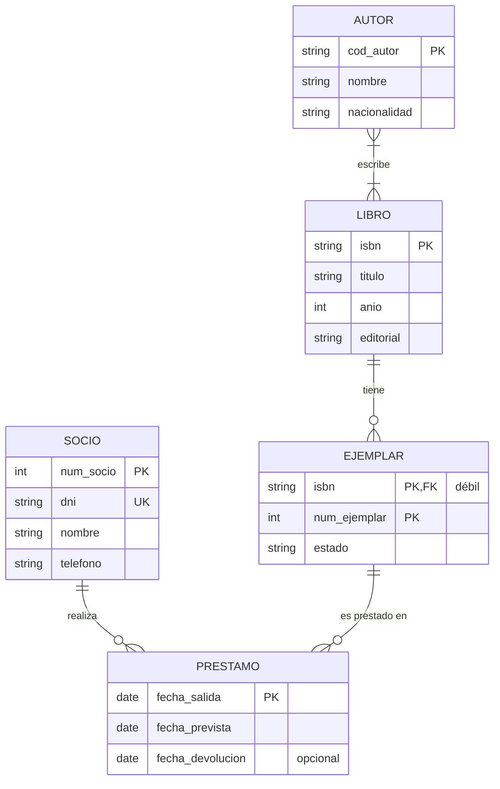
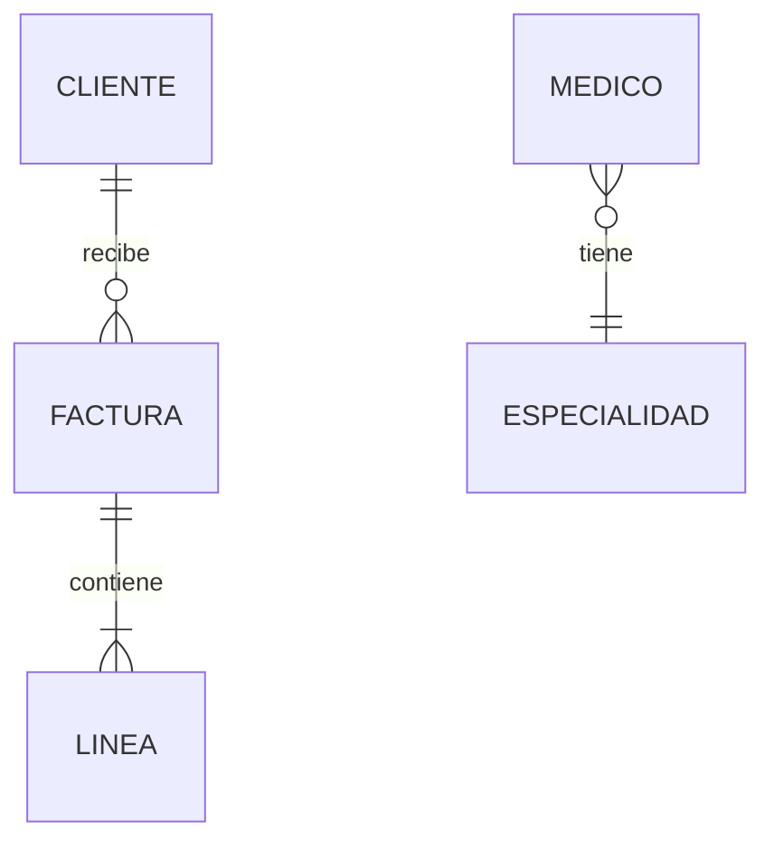
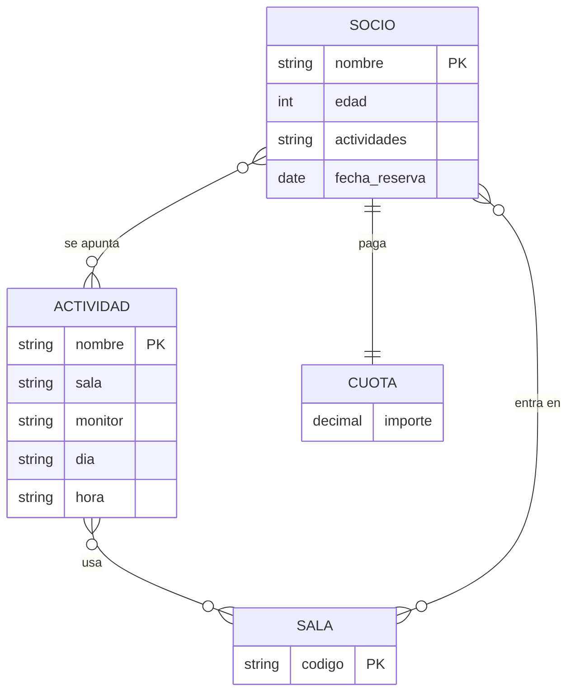
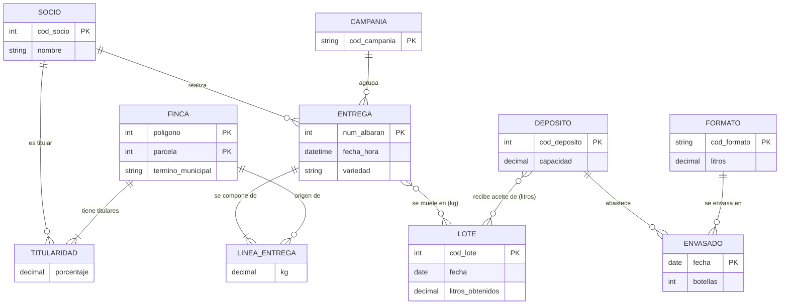
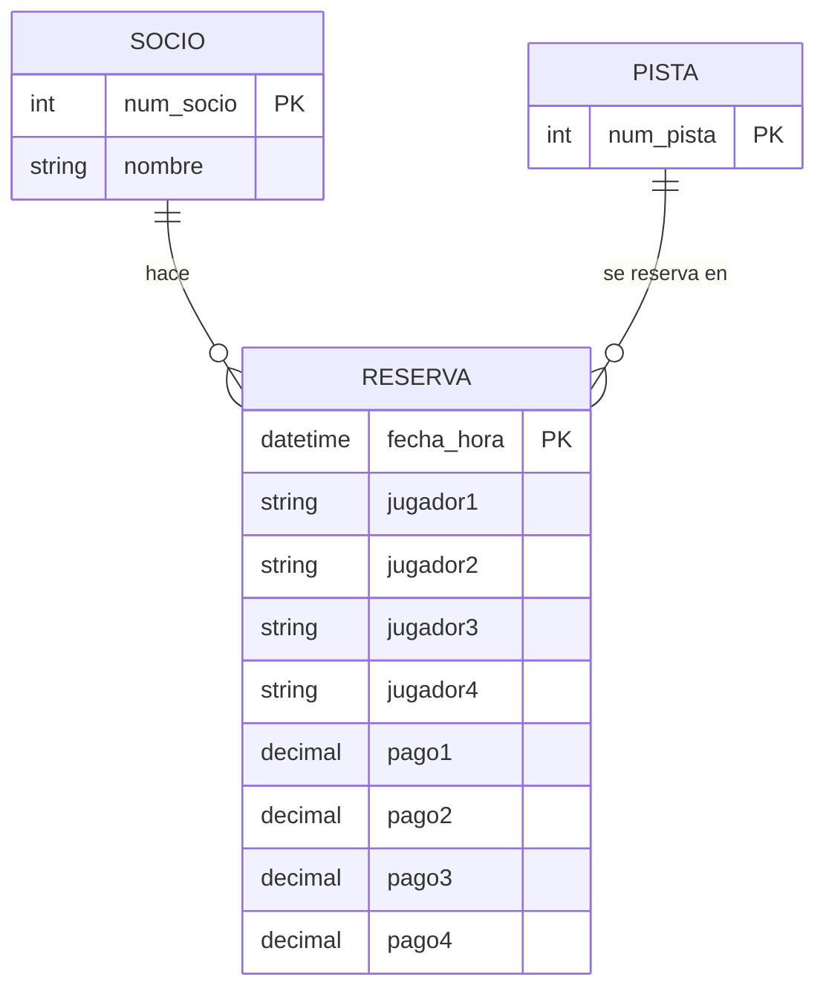
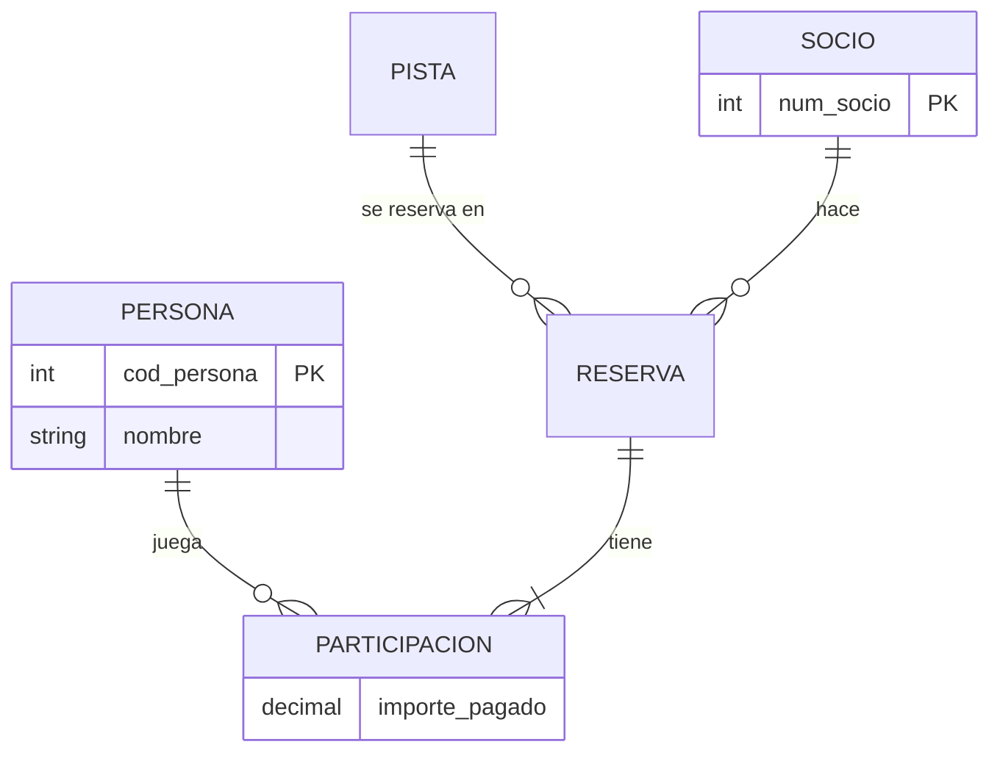

# UD02 · Prácticas



| Práctica | Tipo | Nivel | CE principales |
|---|---|---|---|
| [2.1 Biblioteca municipal: del enunciado al diagrama](#práctica-21--biblioteca-municipal-del-enunciado-al-diagrama) | Guiada | ●○○ | RA6.a, RA6.d, RA6.e |
| [2.2 Leer y escribir cardinalidades](#práctica-22--leer-y-escribir-cardinalidades) | Guiada | ●○○ | RA6.d |
| [2.3 Plataforma de streaming](#práctica-23--plataforma-de-streaming) | Autónoma | ●●○ | RA6.a, RA6.d, RA6.e |
| [2.4 Clínica veterinaria con jerarquías](#práctica-24--clínica-veterinaria-con-jerarquías) | Autónoma | ●●○ | RA6.d, RA6.e, RA6.h |
| [2.5 Revisión de un diseño defectuoso](#práctica-25--revisión-de-un-diseño-defectuoso) | Reto | ●●● | RA6.d, RA6.h |
| [2.6 Autoescuela: ternaria o agregación](#práctica-26--autoescuela-ternaria-o-agregación) | Reto | ●●● | RA6.d |
| [2.7 Almazara: la entrevista que no lo dice todo](#práctica-27--almazara-la-entrevista-que-no-lo-dice-todo) | Reto | ●●● | RA6.a, RA6.d, RA6.e, RA6.h |
| [2.8 Alquiler de coches: el modelo que recuerda](#práctica-28--alquiler-de-coches-el-modelo-que-recuerda) | Reto | ●●● | RA6.d, RA6.e, RA6.h |
| [2.9 Ingeniería inversa: del albarán a las entidades](#práctica-29--ingeniería-inversa-del-albarán-a-las-entidades) | Reto | ●●● | RA6.a, RA6.d, RA6.h |
| [2.10 Dos diseños, un ganador](#práctica-210--dos-diseños-un-ganador) | Reto | ●●● | RA6.d, RA6.h |
| [Proyecto EduGest · UD02](#proyecto-edugest--ud02-modelo-conceptual) | Proyecto | ●●○ | RA6.a, RA6.d, RA6.e, RA6.h |
| [Banco · Fundamentos (ejercicios 1-5)](#bloque-1--fundamentos) | Autónoma | ●○○ | RA6.a, RA6.d, RA6.e, RA6.h |
| [Banco · Intermedio (ejercicios 6-15)](#bloque-2--intermedio) | Autónoma | ●●○ | RA6.a, RA6.d, RA6.e, RA6.h |
| [Banco · Integración (ejercicios 16-23)](#bloque-3--integración) | Autónoma | ●●○ → ●●● | RA6.a, RA6.d, RA6.e, RA6.h |
| [Banco · EER avanzado (ejercicios 24-30)](#bloque-4--eer-avanzado) | Autónoma | ●●● | RA6.a, RA6.d, RA6.e, RA6.h |

> [!NOTE]
> **Cómo están organizadas estas páginas.** El enunciado se presenta como lo contaría una persona del negocio, no como una lista de entidades: **decidir qué es una entidad, un atributo o una relación forma parte del trabajo**. Las tareas, la comprobación y los errores habituales están plegados: despliégalos cuando los necesites, no antes de pensar.

> [!TIP]
> **Método para todos los ejercicios.** (1) Subraya sustantivos y verbos; (2) decide entidades e identificadores; (3) relaciones y cardinalidades en **los dos sentidos**; (4) atributos, incluidos los de las relaciones; (5) revisa redundancias y escribe los **supuestos** que hayas tenido que hacer.

---

## Práctica 2.1 · Biblioteca municipal: del enunciado al diagrama



#### Objetivo

Aplicar la metodología de cinco pasos para construir un diagrama E/R completo a partir de un relato de una persona del negocio.

#### Contexto

La biblioteca de un barrio quiere dejar el cuaderno y pasar a una base de datos. Su responsable te cuenta cómo trabaja.

#### Enunciado

> «Cuando llega un libro nuevo lo apunto con su ISBN, el título, la editorial y el año. Hay libros escritos por varias personas y autores con muchos libros en nuestro catálogo; de cada autor anoto cómo se llama y de dónde es, y a los que se repiten les pongo un código para no confundirlos.
>
> De cada libro suelo comprar varias copias. Las distingo con un número que les pego en el lomo (la 1, la 2, la 3...), y ese número empieza otra vez en cada libro. Apunto también si la copia está nueva, usada o deteriorada.
>
> Los vecinos se hacen socios con su DNI, su nombre y un teléfono, y les doy un número de carné. Cuando alguien se lleva una copia a casa, anoto el día que se la lleva, hasta cuándo puede tenerla y el día en que la devuelve de verdad. Hay libros que llevan meses prestados y otros que nunca han salido. A algunos socios los tengo que llamar muchas veces.»

#### Desarrollo

Sigue los cinco pasos y responde a las preguntas antes de abrir las respuestas.

{}

1. **Entidades.** Subraya sustantivos y verbos. ¿Cuáles tienen propiedades propias? ¿Hay algún «hecho» que parezca una entidad pero en realidad relacione otras dos cosas?

2. **Identificadores.** Para cada entidad, ¿qué dato la distingue de las demás? ¿Alguna se identifica con un número que se repite de unas a otras? ¿Qué dato candidato queda como alternativa?

3. **Relaciones y cardinalidades.** Para cada pareja, formula las dos preguntas, una en cada sentido, y decide el mínimo y el máximo. ¿Qué dice el relato sobre libros que «nunca han salido»?

4. **Atributos de las relaciones.** ¿A qué pertenecen las fechas? ¿Puede el mismo socio llevarse la misma copia en dos ocasiones? ¿Qué implica eso para identificar cada préstamo?

5. **Dibuja** el diagrama en draw.io con la notación de Chen (*Más formas* → *Entity Relation*) y compáralo con la solución.

{}

{}

1. **Entidades:** `LIBRO`, `AUTOR`, `EJEMPLAR` y `SOCIO`. «Préstamo» no tiene propiedades propias más allá de fechas: es el hecho que relaciona un socio con un ejemplar, así que se modela como **relación**. La editorial se queda como atributo mientras no haya que guardar datos suyos.
2. **Identificadores:** `LIBRO` → ISBN; `AUTOR` → código; `SOCIO` → número de carné (el DNI es **clave alternativa**). `EJEMPLAR`: su número solo es único dentro del libro, por lo que es una **entidad débil** identificada por (ISBN, número).
3. **Cardinalidades:**

    | Relación | Lectura | Tipo |
    |---|---|---|
    | AUTOR *escribe* LIBRO | un autor escribe (1, N) libros; un libro lo escriben (1, N) autores | N:M |
    | LIBRO *tiene* EJEMPLAR | un libro tiene (0, N) ejemplares; un ejemplar es de (1, 1) libro | 1:N identificadora |
    | SOCIO *toma prestado* EJEMPLAR | un socio tiene (0, N) préstamos; un ejemplar tiene (0, N) préstamos | N:M |

    El mínimo 0 de socio y ejemplar refleja «libros que nunca han salido» y socios que aún no han llevado nada.
4. **Atributos de relación:** las fechas no son ni del socio ni del ejemplar: son del préstamo. Como el mismo socio puede llevarse la misma copia varias veces, la **fecha de salida** forma parte de la identificación de cada préstamo (atributo discriminador de la relación).
5. La frase «a algunos socios los tengo que llamar muchas veces» es **ruido**: no genera ningún requisito de datos (podría generar uno si se quisiera guardar un historial de avisos). Saber descartar información es parte del análisis.

{}

{}

**Supuestos semánticos** (lo que el relato no dice y hemos decidido):

1. Un libro registrado tiene al menos un autor conocido.
2. Puede existir un libro sin ejemplares (pedido, pero todavía no recibido).
3. La fecha real de devolución es opcional: está vacía mientras el préstamo sigue abierto.
4. La editorial se guarda como atributo; si hiciera falta guardar más datos de ella, sería una entidad.

{}

{}

{}
- [ ] Hay 4 entidades y `EJEMPLAR` está marcada como débil (doble rectángulo en Chen).
- [ ] Las dos relaciones N:M tienen la cardinalidad máxima N en los dos lados.
- [ ] Las fechas del préstamo están en la relación, no en `SOCIO` ni en `EJEMPLAR`.
- [ ] Has descartado la información que no genera datos.
- [ ] Has escrito al menos tres supuestos semánticos.
{}

{}

{}

> [!WARNING]
> - Relacionar `SOCIO` con `LIBRO` en lugar de con `EJEMPLAR`. Lo que se presta es una copia física, no la obra.
> - Poner `fecha_prestamo` como atributo de `SOCIO`. Un socio tiene muchos préstamos, así que ese atributo solo podría guardar uno.

{}

#### Ampliación

La biblioteca quiere gestionar **reservas**: un socio puede reservar un **libro** (no un ejemplar concreto) y se guarda la fecha de reserva. Añade esta relación y justifica por qué se relaciona con `LIBRO` y no con `EJEMPLAR`.

---

## Práctica 2.2 · Leer y escribir cardinalidades



#### Objetivo

Determinar las cardinalidades mínima y máxima de una relación a partir de frases del lenguaje natural, y al revés.

#### Desarrollo

Para cada frase, escribe la relación en notación (mín, máx) en los **dos sentidos** y el tipo de correspondencia (1:1, 1:N o N:M). Despliega la solución para comprobarla.

| # | Frase |
|---|---|
| a | Todo empleado trabaja en un único departamento; un departamento puede no tener empleados todavía. |
| b | Cada país tiene una capital; cada capital lo es de un único país. |
| c | Un pedido contiene al menos un producto; un producto puede no haberse pedido nunca o aparecer en muchos pedidos. |
| d | Un empleado puede supervisar a varios empleados; todo empleado salvo el director tiene un supervisor. |
| e | Un vehículo de empresa puede estar asignado a un empleado como máximo; un empleado puede no tener vehículo y nunca tiene más de uno. |

{}
| # | Lado A | Lado B | Tipo |
|---|---|---|---|
| a | Un empleado está en (1, 1) departamento | Un departamento tiene (0, N) empleados | 1:N |
| b | Un país tiene (1, 1) capital | Una capital lo es de (1, 1) país | 1:1 |
| c | Un pedido tiene (1, N) productos | Un producto está en (0, N) pedidos | N:M |
| d | Un empleado supervisa a (0, N) empleados | Un empleado es supervisado por (0, 1) empleado | 1:N **reflexiva** |
| e | Un vehículo está asignado a (0, 1) empleado | Un empleado tiene (0, 1) vehículo | 1:1 |

En (d) el mínimo es 0 porque el director no tiene supervisor. Si el enunciado dijera «todo empleado tiene supervisor», el diagrama obligaría a que exista un ciclo infinito de jefes.
{}

#### Segunda parte: del diagrama a la frase

Escribe en lenguaje natural lo que expresa cada diagrama:

{}
- Un cliente recibe cero o muchas facturas; cada factura es de exactamente un cliente.
- Una factura contiene una o muchas líneas; cada línea pertenece a exactamente una factura.
- Cada médico tiene exactamente una especialidad; una especialidad puede tener cero o muchos médicos.
{}

---

## Práctica 2.3 · Plataforma de streaming



#### Contexto

Tres amigos preparan el lanzamiento de un servicio de vídeo bajo demanda y te piden el modelo conceptual. Este es el correo que te mandan.

#### Enunciado

> «Hola. Os cuento cómo queremos que funcione *Cinefilia*.
>
> La gente se registra con su NIF, su nombre y apellidos, un correo (no queremos dos cuentas con el mismo) y una dirección de facturación: calle, código postal y ciudad. Habrá tres tarifas —básica, estándar y premium— que se diferencian en lo que cuestan al mes y en cuántas pantallas se pueden usar a la vez. Cada cliente tiene contratada una.
>
> En el catálogo, cada película tiene su título, año y duración. La clasificamos por géneros porque la gente busca «comedia romántica» o «ciencia ficción», y también queremos que se pueda buscar por actor y que en la ficha se vea quién hace de quién.
>
> Necesitamos saber qué ve cada cliente y cuándo —a qué hora empezó y hasta qué minuto llegó— para ofrecer «continuar viendo». Sí, hay quien ve tres veces la misma peli. Y los clientes podrán puntuarlas de 1 a 5 estrellas, pero una sola vez por película, que si no se manipulan las medias.»

{}

1. Diagrama E/R completo en la notación que prefieras (indica cuál).
2. **Diccionario de datos**: tabla con entidad o relación, atributo, descripción, tipo de dato conceptual (texto, número, fecha...) y si es obligatorio.
3. Lista de **supuestos semánticos**.
4. Dos **restricciones** que el diagrama no pueda expresar.

{}

{}

{}
- [ ] `género` está modelado como **entidad** o como **atributo multivaluado**, y justificas la elección.
- [ ] `personaje` es un atributo de la relación actor–película.
- [ ] *Visualización* y *valoración* son relaciones **distintas**: una se repite y la otra no.
- [ ] La dirección aparece como atributo **compuesto**.
- [ ] La tarifa es una entidad con sus propios datos, no un texto en el cliente.
- [ ] Entre las restricciones textuales está «la puntuación está entre 1 y 5» u otra similar.
{}

{}

{}

Las dos relacionan `CLIENTE` y `PELICULA`, pero la visualización puede repetirse (se identifica también por la fecha y hora), mientras que la valoración es única por pareja cliente-película. Son dos hechos distintos: dos relaciones distintas.

{}

#### Ampliación

Añade **series**, compuestas por temporadas (1, 2, 3...) y episodios numerados dentro de cada temporada. ¿Cuántas entidades débiles aparecen? ¿De quién depende cada una?

---

## Práctica 2.4 · Clínica veterinaria con jerarquías



#### Contexto

Una clínica veterinaria de tamaño medio estrena sistema de gestión. La gerente describe su día a día.

#### Enunciado

> «Aquí trabajamos once personas, y de todas guardo el DNI, el nombre, el teléfono y el día que empezaron. Los que pasan consulta son veterinarios, con su número de colegiado y su especialidad; los auxiliares tienen una titulación; y en el mostrador están los administrativos, de los que apunto los idiomas que hablan porque los extranjeros lo agradecen. Nadie hace dos cosas: o es una o es otra.
>
> A los clientes los conocemos por sus mascotas: chip, nombre, fecha de nacimiento y especie. Cada mascota es de un cliente, aunque un cliente puede traer varias. De los perros anoto la raza y si la ley los considera potencialmente peligrosos; de los gatos, si están esterilizados. Con el resto (conejos, tortugas...) no hace falta nada especial.
>
> Cada consulta la pasa un veterinario a una mascota un día concreto. Anoto el motivo, el diagnóstico y lo que receta, con la dosis de cada medicamento (nombre comercial y un código interno). A veces un auxiliar echa una mano.»

{}

1. Diagrama EER con todas las jerarquías.
2. Clasifica cada jerarquía como total/parcial y disyunta/solapada y **justifícalo con una frase del texto**.
3. Decide si `CONSULTA` es una entidad o una relación. Razona las dos opciones.
4. Escribe las restricciones que no puede recoger el diagrama (por ejemplo, sobre la dosis o sobre quién puede recetar).
5. Identifica qué información del texto **no** da lugar a ningún dato que haya que guardar.

{}

{}

{}
- [ ] La jerarquía de empleados es **total y disyunta**.
- [ ] La jerarquía de mascotas es **parcial y disyunta**.
- [ ] Los atributos comunes están en la superclase y solo los específicos en las subclases.
- [ ] El cliente aparece como entidad aunque el texto «lo conoce por sus mascotas».
- [ ] La dosis es un atributo de la relación consulta–medicamento.
{}

{}

{}

- **Empleados:** superclase `EMPLEADO` (DNI, nombre, teléfono, fecha de alta) con tres subclases. *Total* («los que pasan consulta son… los auxiliares… los administrativos… de todas») y *disyunta* («nadie hace dos cosas»).
- **Mascotas:** `MASCOTA` con subclases `PERRO` y `GATO`. *Parcial* («con el resto no hace falta nada especial») y *disyunta* (un animal no es perro y gato a la vez).
- **Cliente:** no se enumeran sus atributos en el texto. Es una entidad con identificador a decidir (supuesto: DNI) porque «cada mascota es de un cliente» (1:N).
- **Consulta:** puede ser entidad (con identificador propio) o relación ternaria veterinario–mascota–fecha. Es entidad si se quiere colgar de ella a los auxiliares y los medicamentos con facilidad; la dosis siempre va en la relación *receta* entre consulta y medicamento.
- **Auxiliar en consulta:** relación 0..N, opcional («a veces»).
- **Información descartada:** «once personas» es un dato puntual, no un requisito.

{}

#### Ampliación

¿Cómo cambiaría el modelo si un empleado pudiera ser a la vez auxiliar y administrativo? ¿Y si se quisiera guardar el **historial de puestos** de cada empleado con sus fechas?

---

## Práctica 2.5 · Revisión de un diseño defectuoso



#### Contexto

Un compañero ha diseñado el modelo de un **gimnasio** y te pide que lo revises antes de pasar a tablas. El enunciado es: *«Los socios se apuntan a actividades (spinning, yoga...) que se imparten en salas. Cada sesión de una actividad tiene día, hora, sala y monitor. Un socio reserva plaza en sesiones concretas. Cada socio tiene una cuota mensual»*.

#### Enunciado

Haz la revisión como la haría un compañero senior: no sabes cuántos problemas hay. Para cada uno que encuentres indica el elemento afectado, el tipo de error, su consecuencia y la corrección. Después dibuja el diagrama corregido y decide si hay algo que **no** puedes corregir sin preguntar al cliente.

{}
Identificadores inestables, atributos derivados, atributos multivaluados escondidos en un texto, atributos colocados en la entidad equivocada, entidades que no tienen identificador, conceptos que deberían ser entidades (monitor, sesión), relaciones redundantes.
{}

{}
1. `nombre` como clave de `SOCIO`: los nombres se repiten. → Añadir `num_socio`.
2. `edad`: atributo derivado que se desactualiza. → `fecha_nacimiento`.
3. `actividades` como texto en `SOCIO`: multivaluado escondido y redundante con la relación. → Eliminarlo.
4. `fecha_reserva` en `SOCIO`: es un atributo de la reserva. → Moverlo a la relación.
5. `dia`, `hora`, `sala` y `monitor` en `ACTIVIDAD`: una actividad tiene muchas sesiones. → Crear `SESION` (débil de `ACTIVIDAD` o con identificador propio) con día y hora, relacionada con `SALA` y `MONITOR`.
6. `monitor` como texto: tiene datos propios y participa en relaciones. → Entidad `MONITOR`.
7. `CUOTA` sin identificador y en relación 1:1 obligatoria: si solo guarda el importe, es un atributo de `SOCIO`; si se quiere el historial de pagos, es una entidad débil `PAGO` con mes y año.
8. `SOCIO` *entra en* `SALA`: redundante; se deduce de las sesiones reservadas.
9. El socio no se apunta a una actividad sino que **reserva sesiones**: la relación debe ser SOCIO–SESION.
{}

---

## Práctica 2.6 · Autoescuela: ternaria o agregación



#### Enunciado

> «En nuestra autoescuela cada alumno da las prácticas con el profesor que le asignamos, siempre en uno de nuestros coches (cada uno con su matrícula, marca y modelo). Apuntamos el día y la hora de cada clase y los kilómetros que hacen. A lo largo del curso un alumno puede dar clase con varios profesores, y un profesor puede dar clase en varios coches.
>
> Cuando un alumno ha terminado con un profesor y este lo considera preparado, pedimos examen ante la DGT: se anota la fecha y si aprueba o suspende. Hay alumnos que nunca llegan a presentarse, y los que se presentan pueden hacerlo más de una vez.»

{}

1. Modela las clases prácticas como una relación **ternaria** alumno–profesor–vehículo. Calcula la cardinalidad de cada entidad fijando las otras dos.
2. Modela el examen. Explica por qué una **agregación** de la relación alumno–profesor es mejor que una ternaria con `EXAMEN`, y qué cambia porque pueda repetirse.
3. Explica qué información se perdería si sustituyes la ternaria del punto 1 por tres relaciones binarias.

{}

{}

{}
- [ ] La ternaria incluye la fecha y la hora como atributos y justificas su cardinalidad (con varios alumnos, profesores y vehículos suele ser N:M:P).
- [ ] La agregación permite que haya parejas alumno–profesor **sin** examen.
- [ ] Has identificado cada examen con algo más que la pareja alumno–profesor (la fecha).
- [ ] Se explica con un ejemplo concreto la pérdida de información de las binarias.
{}

{}

{}

- **Ternaria `clase`:** un alumno recibe clase de muchos (profesor, vehículo); un profesor de muchos (alumno, vehículo); un vehículo de muchos (alumno, profesor). Cardinalidad N:M:P con atributos `fecha`, `hora` y `kilometros`; `fecha` y `hora` forman parte de la identificación porque la misma terna se repite.
- **Agregación:** `MATRICULA` = relación alumno–profesor tratada como entidad. Se relaciona con `EXAMEN` (0,N), de modo que hay matrículas sin examen y matrículas con varios. Con una ternaria alumno–profesor–examen la pareja estaría obligada a participar.
- **Tres binarias:** se pierde *qué alumno dio clase con qué profesor en qué coche*. Si Ana ha dado clase con Luis y con Marta, y Luis y Marta han usado el coche 1, no se sabe si Ana usó el coche 1 con Luis o con Marta.

{}

---

## Práctica 2.7 · Almazara: la entrevista que no lo dice todo



#### Contexto

Una cooperativa de aceite quiere registrar la trazabilidad de su producción. Esta es la transcripción de la reunión con el gerente. Como ocurre en la realidad, **el cliente no te lo cuenta todo, se contradice y mezcla cosas que no son de tu sistema**.

#### Enunciado

> **Gerente:** Somos unos ciento veinte socios. Cada uno tiene sus fincas, aunque hay fincas que son de dos hermanos y entonces cada uno tiene su parte. Una finca se identifica por su polígono y su parcela, y está en un término municipal.
>
> **Tú:** ¿Qué entregan los socios?
>
> **Gerente:** En campaña, que va de octubre a enero, traen la aceituna en remolque. Se pesa a la entrada y se les da un albarán con su número. Normalmente es de una sola finca, pero a veces un socio mezcla dos fincas en el mismo viaje. Lo que no queremos es que se mezcle aceituna de variedades distintas, eso se rechaza.
>
> **Tú:** ¿Y después?
>
> **Gerente:** Se muele por lotes. En cada lote entra lo de varios socios, a veces de varios días. Del lote queremos saber cuánto aceite ha salido, que se nos pregunta mucho por el rendimiento. El aceite va a un depósito, y de ahí se envasa en botellas de distinto tamaño. Cada tanda de envasado la anoto con su fecha y el número de botellas.
>
> **Tú:** ¿La venta también va en el sistema?
>
> **Gerente:** No, eso lo llevamos con el programa de facturación. Pero sí me importa que, si un cliente se queja de una botella, yo pueda decir de qué fincas viene el aceite que lleva. Eso nos lo exige la inspección.
>
> **Tú:** ¿Y el aceite de un lote puede acabar en varios depósitos?
>
> **Gerente:** Pues… depende. Casi siempre uno, pero si el depósito se llena, se pasa al siguiente.

{}

1. Redacta una lista de **al menos cinco preguntas** que harías al gerente porque la entrevista deja cabos sueltos. Para cada una, indica qué decisión de diseño depende de la respuesta.
2. Delimita el **alcance**: qué parte de la conversación **no** pertenece a tu modelo y por qué.
3. Elabora el diagrama E/R eligiendo la opción más razonable en cada ambigüedad y recogiéndola como **supuesto**.
4. Demuestra la **trazabilidad**: escribe, como una secuencia de relaciones, el camino que recorres en tu diagrama desde una botella hasta las fincas de origen. ¿Qué parte del camino pierde precisión?
5. Escribe tres restricciones que tu diagrama no puede expresar (por ejemplo, sobre la variedad o sobre quién entrega de qué finca).

{}

{}

{}
- [ ] Hay una relación entre `SOCIO` y `FINCA` que admite el reparto del porcentaje de propiedad.
- [ ] La entrega y la molturación son **relaciones N:M con atributos**: una entrega puede alimentar varios lotes y un lote recoge varias entregas.
- [ ] La relación entre lote y depósito se ha justificado con una pregunta al cliente.
- [ ] La venta y la facturación no aparecen en el diagrama.
- [ ] Has identificado el tramo del camino botella → finca que pierde precisión y por qué.
{}

{}

{}

| Pregunta | Qué decide |
|---|---|
| ¿Cuánto pesa cada finca en una entrega que mezcla dos fincas? | Si el peso se guarda **por finca** (la entrega se divide en líneas) o solo por entrega. Afecta a la trazabilidad. |
| ¿Se registra el porcentaje de propiedad de cada hermano? ¿Puede cambiar con los años? | Atributo `porcentaje` en la relación socio–finca; si cambia, necesita historia (ver práctica 2.8). |
| ¿Cuánto aceite de cada lote va a cada depósito? | Relación lote–depósito 1:N o N:M con cantidad. |
| ¿Se mezcla aceite de lotes distintos en un depósito? ¿Y se envasa desde depósitos mezclados? | Trazabilidad hacia atrás: pasa de ser un árbol a un grafo. Hay que decidir hasta dónde se garantiza. |
| ¿Quién entrega, el titular de la finca o cualquier socio? | Restricción de integridad: el entregador debe ser titular de la finca, no expresable en el diagrama. |
| ¿La «campaña» tiene identidad propia (fechas, precio) o es solo un año? | Entidad `CAMPAÑA` o atributo. |

{}

{}

- `LINEA_ENTREGA` es una entidad débil de `ENTREGA`: guarda los kilos de **cada finca** en un viaje y es lo que permite la trazabilidad por finca.
- La trazabilidad es **botella → envasado → depósito → lote → entrega → línea → finca**. La parte *depósito → lote* es la que pierde precisión: si un depósito mezcla lotes, solo se puede afirmar que el aceite procede de **alguno** de ellos.
- Restricciones: (1) el socio de la entrega es titular de todas las fincas de sus líneas; (2) la variedad de todas las líneas de una entrega es la misma; (3) la suma de litros de un lote repartidos en depósitos coincide con los litros obtenidos.
- Fuera del alcance: pedidos, clientes y facturas.

{}

---

## Práctica 2.8 · Alquiler de coches: el modelo que recuerda



#### Contexto

Un diseño que solo guarda «lo que es verdad ahora» olvida lo que ya pasó. Una empresa de alquiler de coches necesita poder explicar una factura de hace tres años.

#### Enunciado

> «Tenemos varias sucursales y una flota de coches. Cada coche está asignado a una sucursal, aunque lo movemos entre ellas según la temporada; para las auditorías necesitamos saber dónde estuvo cada coche en cada momento.
>
> Los coches se agrupan por categoría (económico, familiar, de lujo) y cada categoría tiene una tarifa diaria que revisamos cada año. Cuando un cliente firma un contrato, se queda con el precio que había ese día, aunque luego suba. Si alguien reclama, tenemos que demostrar qué tarifa estaba vigente.
>
> De los clientes guardamos nombre, documento y la dirección donde se les envían las facturas. Las facturas deben mostrar la dirección que tenía el cliente cuando se emitieron, no la actual.
>
> Los empleados tienen una categoría profesional (agente, supervisor, director) que puede cambiar con los años; el sueldo depende de ella. Nos piden informes del tipo «cuántos supervisores había en marzo de 2024».
>
> Un contrato es de un cliente, para un coche, entre dos fechas, y lo gestiona un empleado de la sucursal desde la que se entrega el coche.»

{}

1. Localiza **todas las frases** del enunciado que exigen conservar el pasado y clasifícalas: relación que cambia, atributo que cambia, o valor que debe «congelarse» en un documento.
2. Para cada una, decide cómo se modela (atributos de fecha en la relación, entidad histórica, copia del valor en el documento) y cómo cambia la **cardinalidad** al incorporar el tiempo (por ejemplo, una relación 1:N ahora, ¿qué es a lo largo del tiempo?).
3. Escribe la restricción que **no puedes expresar** con el diagrama y que garantiza que los periodos de una misma entidad no se solapan.
4. Elabora el diagrama E/R final.
5. Razona en qué caso se acepta **repetir** un dato (el precio en el contrato) y por qué eso no se considera redundancia dañina.

{}

{}

{}
- [ ] La asignación coche–sucursal es una relación **N:M con fecha de inicio y de fin** (o una entidad histórica), no un atributo del coche.
- [ ] La tarifa es una entidad vinculada a la categoría con una fecha de vigencia, y el contrato guarda su propia copia del precio.
- [ ] La dirección de facturación está versionada, o copiada en la factura.
- [ ] La categoría profesional del empleado tiene historial.
- [ ] Has escrito la restricción de no solapamiento de periodos.
{}

{}

{}

| Frase del enunciado | Tipo | Modelado |
|---|---|---|
| «Dónde estuvo cada coche en cada momento» | Relación que cambia | `COCHE`–`SUCURSAL` N:M con `fecha_inicio` y `fecha_fin` (la actual tiene fin nulo). Un coche está en **una** sucursal en cada instante, pero **a lo largo del tiempo** en muchas. |
| «Tarifa que revisamos cada año» | Atributo que cambia | Entidad `TARIFA` (categoría, fecha de vigencia, precio día). Identificada por (categoría, fecha de inicio). |
| «Se queda con el precio de ese día» | Valor que se congela | Atributo `precio_dia` **en el contrato**: copia deliberada de la tarifa vigente. No es redundancia dañina: es un dato firmado que no debe cambiar cuando cambie la tarifa. |
| «Dirección que tenía el cliente cuando se emitió la factura» | Atributo que cambia | O bien `DIRECCION_CLIENTE` con periodo de vigencia, o bien copia de la dirección en la `FACTURA`. Se prefiere la copia en el documento si no se necesita el historial de domicilios. |
| «Categoría profesional que cambia con los años» | Atributo que cambia | Relación `EMPLEADO`–`CATEGORIA` N:M con periodo. El sueldo depende de la categoría, no del empleado. |

**Restricciones textuales:** (1) los periodos de un mismo coche en sucursales no se solapan y no hay huecos; (2) la tarifa de una categoría no se solapa con otra de la misma categoría; (3) el contrato debe ser gestionado por un empleado que, en la fecha de entrega, estaba en la sucursal desde la que se entrega el coche.

**Lectura crítica:** tratar el tiempo multiplica el número de relaciones N:M. Antes de aplicarlo a todo, pregunta al negocio qué historia necesita realmente.

{}

---

## Práctica 2.9 · Ingeniería inversa: del albarán a las entidades



#### Contexto

En muchas empresas no hay requisitos escritos: hay **documentos** (albaranes, facturas, hojas de cálculo) y la gente que los usa. Un buen analista sabe leer un documento y deducir el modelo que hay detrás.

#### Enunciado

Una distribuidora de bebidas para hostelería te entrega dos documentos reales con los datos sensibles sustituidos.

**Documento A: albarán de entrega**

| | |
|---|---|
| **Distribuciones Marina S. L.** · CIF B-12345678 | **Albarán n.º 2026/004871** |
| Fecha: 14/09/2026 | Ruta: R-03 (Costa Norte) · Repartidor: M. Soler · Furgoneta 4512-KLM |
| **Cliente:** 00418 · Bar La Gamba · CIF B-98765432 | **Entregar en:** C/ del Puerto, 12 · 03700 Dénia |

| Ref. | Descripción | Formato | Uds. | Precio | Dto. | Importe |
|---|---|---|---:|---:|---:|---:|
| 1021 | Cerveza rubia 33 cl | Caja 24 | 10 | 17,40 | 0 % | 174,00 |
| 1045 | Agua mineral 50 cl | Pack 12 | 6 | 3,90 | 0 % | 23,40 |
| 2310 | Ginebra premium 70 cl | Botella | 4 | 19,50 | 10 % | 70,20 |
| 2310 | Ginebra premium 70 cl (promoción 3×2) | Botella | 2 | 0,00 | 0 % | 0,00 |

Base imponible: 267,60 € · IVA 10 % sobre 23,40 €: 2,34 € · IVA 21 % sobre 244,20 €: 51,28 € · **Total: 321,22 €** · Pago: transferencia a 30 días · Recibí del cliente: firma y DNI

**Documento B: hoja de ruta del repartidor (fragmento de hoja de cálculo)**

| Fecha | Repartidor | Furgoneta | Cliente | Hora llegada | Hora salida | Incidencias |
|---|---|---|---|---|---|---|
| 14/09 | M. Soler | 4512-KLM | 00418 | 09:42 | 09:58 | – |
| 14/09 | M. Soler | 4512-KLM | 00533 | 10:15 | 10:31 | Cliente cerrado, se deja en vecino |
| 15/09 | M. Soler | 7781-HTB | 00418 | 09:30 | 09:41 | Faltan 2 cajas |

{}

1. Deduce las **entidades** que hay detrás de los dos documentos y sus identificadores. ¿Qué entidades aparecen en los dos?
2. Distingue en el albarán los **atributos básicos** de los **derivados** (que se calculan a partir de otros) y los que son **copia** de un dato que podría cambiar (por ejemplo, el precio).
3. Identifica el **grupo repetido** del albarán y decide si es un atributo multivaluado o una entidad/relación.
4. Descubre al menos **dos inconsistencias o preguntas** que el documento deja abiertas (por ejemplo, el IVA).
5. Dibuja el diagrama E/R y escribe el diccionario de datos con una columna «derivado / copia / básico».

{}

{}

{}
- [ ] El albarán es una entidad y sus líneas forman una relación N:M con atributos entre albarán y producto (o una entidad débil de línea).
- [ ] `importe`, `base imponible`, `IVA` y `total` están marcados como derivados.
- [ ] El precio de la línea se trata como copia del precio de catálogo en el momento de la entrega.
- [ ] Repartidor, furgoneta y ruta forman un conjunto que se repite en los dos documentos y no se repite como texto.
- [ ] Has señalado qué hace que los dos documentos describan dos hechos distintos (entrega y visita).
{}

{}

{}

**Entidades y relaciones:** `CLIENTE` (código; CIF como alternativa, dirección de entrega), `PRODUCTO` (referencia, descripción, formato), `ALBARAN` (número, fecha, forma de pago, firma), `LINEA_ALBARAN` (débil de `ALBARAN`: nº de línea, unidades, precio, descuento), `REPARTIDOR`, `FURGONETA` (matrícula), `RUTA`, y la relación `VISITA` (documento B) entre cliente, repartidor y furgoneta con hora de llegada, hora de salida e incidencias.

**Derivados:** `importe` = unidades × precio × (1 − descuento); `base imponible` = suma de importes; `IVA` = suma por tipo; `total` = base + IVA.

**Copias:** `precio` y `descuento` de la línea son copias del catálogo vigente: si cambia el catálogo, el albarán no debe cambiar.

**Preguntas abiertas que el documento deja:**
1. El albarán mezcla **dos tipos de IVA** (10 % para el agua y 21 % para el resto): el tipo depende del producto. Falta saber si `tipo_iva` es atributo de `PRODUCTO` (y entonces cambia con la ley) o debe copiarse en la línea para que el albarán no cambie.
2. La línea de promoción «3×2» tiene precio 0: ¿es una línea más del albarán o un descuento? Afecta al modelo (¿entidad `PROMOCION`?).
3. ¿El cliente tiene una dirección de entrega distinta de la fiscal? Se imprime una sola.
4. ¿Es lo mismo el albarán y la visita? No: un albarán se entrega en una visita, pero puede haber visitas sin albarán (cliente cerrado) y un día puede haber varios albaranes en una misma visita.

**Hecho clave:** el documento A y el B parecen hablar de lo mismo, pero describen hechos distintos. El análisis consiste en separar lo que se entrega (albarán) de lo que se visita (visita).

{}

---

## Práctica 2.10 · Dos diseños, un ganador



#### Contexto

Un buen diseño no se valora por cómo se ve, sino por si **soporta las situaciones reales** del negocio. Una técnica útil es escribir casos de prueba y comprobar si el diseño puede representarlos.

#### Enunciado

Un club de pádel ha recibido dos propuestas de modelo y no sabe cuál elegir. El club describe así su operativa:

> «Los socios reservan una pista para una hora concreta. En cada reserva juegan cuatro personas, pero a veces solo dos. Los que no son socios son invitados, y de ellos solo apuntamos el nombre. Cada jugador paga su parte, aunque a veces uno paga por todos. Con el tiempo, algunos invitados acaban haciéndose socios. Queremos poder contestar a: ¿cuántas veces ha jugado cada persona?, ¿quién juega habitualmente con quién? y ¿qué debe cada uno?»

**Propuesta A**

**Propuesta B**

{}

1. Escribe una tabla con **al menos ocho casos de prueba** extraídos del enunciado (por ejemplo: partido de dos jugadores, invitado que se hace socio, pagos cruzados…) y marca, para cada propuesta, si puede representarlo, si lo representa con dificultad o si no puede.
2. Responde, para cada pregunta del club, qué diseño la resuelve sin esfuerzo y cuál no.
3. Redacta las **tres correcciones** que haría falta incorporar a la propuesta ganadora para soportar todos los casos.
4. Dibuja el diseño final.

{}

{}

{}
- [ ] Has detectado que A contiene un grupo repetido (`jugador1..4`) y que no admite partidos de dos ni de cinco.
- [ ] Has visto que B resuelve «¿cuántas veces ha jugado cada persona?», pero no distingue quién pagó por quién.
- [ ] Tu diseño final trata a socios e invitados como **especialización** de persona (o con un atributo de condición).
- [ ] Has propuesto cómo registrar que un invitado se hace socio sin perder su historial.
{}

{}

{}

| Caso de prueba | A | B |
|---|---|---|
| Partido de dos jugadores | Deja columnas vacías | Sí |
| Cuatro jugadores | Sí | Sí |
| Invitado sin ficha | No hay entidad: el nombre es solo un texto | Sí (`PERSONA`) |
| Invitado que se hace socio | Pierde su historial al cambiar de texto a socio | Sí: se le añade la especialización de socio |
| Un jugador paga por todos | Hay que sumar las columnas | Parcialmente: falta saber **quién** pagó |
| ¿Cuántas veces ha jugado cada persona? | Hay que buscar en cuatro columnas | Sí |
| ¿Quién juega con quién? | Muy difícil | Sí (autoconsulta sobre la participación) |
| ¿Qué debe cada uno? | Mezclado con `pagoN` | Sí, si el importe se separa de «lo pagado por otro» |

**Mejoras a B:**
1. `PERSONA` es la superclase; `SOCIO` es una especialización parcial. Así el invitado se convierte en socio sin cambiar de identidad.
2. `PARTICIPACION` guarda `importe_a_pagar`, y se añade una relación `PAGO` entre participación y persona pagadora para representar «paga por todos».
3. La reserva guarda como atributo quién la hace, sin obligar a que sea socio si el club decidiera permitirlo.

**Lección:** el grupo repetido es la forma habitual de hacer que un modelo no escale. La señal de alarma son atributos numerados (`jugador1`, `jugador2`...).

{}

---

## Proyecto EduGest · UD02: modelo conceptual



#### Objetivo

Construir el modelo conceptual completo del proyecto transversal.

#### Enunciado

Lee la [entrevista con la jefatura de estudios](/guia/proyecto-edugest#1-enunciado-entrevista-con-la-jefatura-de-estudios) como lo haría un analista: ahí no se enumeran las entidades y hay detalles que se mencionan de pasada. El [caso guiado de la teoría](/ud02-modelo-er/ud02-teoria#8-caso-guiado-el-modelo-er-de-edugest) resuelve una parte.

{}

1. El **diagrama E/R** con todas las entidades, relaciones, cardinalidades, atributos e identificadores. Complétalo hasta cubrir todo lo que cuenta la entrevista.
2. El **diccionario de datos** (entidad, atributo, descripción, dominio, obligatorio, identificador).
3. Los **supuestos semánticos**.
4. Las **restricciones textuales**: al menos cinco reglas que el diagrama no puede representar.
5. Una lista de **preguntas que harías a la jefatura de estudios** porque la entrevista no las resuelve.

{}

{}

{}
- [ ] La relación *es jefe de* entre `PROFESOR` y `DEPARTAMENTO` es distinta de *pertenece a*.
- [ ] *Imparte* relaciona profesor, módulo y grupo, e incluye el curso académico. Justificas si es ternaria.
- [ ] Las faltas de asistencia dependen de la matrícula, no solo del alumno.
- [ ] Todas las decisiones dudosas están en la lista de supuestos.
{}

{}

> [!IMPORTANT]
> No consultes todavía la solución de referencia del proyecto. Tu diseño se revisará en clase y lo usarás en la UD03. Las diferencias con la referencia se discutirán en la UD04.

---

## Banco de ejercicios

30 ejercicios para practicar el diseño conceptual, **ordenados de menor a mayor dificultad** en cuatro bloques. Cada ejercicio tiene el mismo formato que las prácticas: contexto y enunciado a la vista, y **objetivo, tareas, comprobación, errores habituales y solución plegados** (dibujada con la notación EER que usamos en clase). Los enunciados están escritos sin resaltar las entidades: reconocerlas es parte del ejercicio.

| Bloque | Ejercicios | Qué introduce | Además del diagrama se pide |
|---|---|---|---|
| Fundamentos ●○○ | 1-5 | Entidades, atributos, identificadores, relaciones 1:N y N:M, atributos de relación y una primera relación reflexiva. | Diagrama y supuestos |
| Intermedio ●●○ | 6-15 | Relaciones 1:1, N:M reflexivas, entidades débiles, atributos compuestos, multivaluados y derivados, y varias relaciones entre las mismas entidades. | Justificar decisiones y escribir restricciones textuales |
| Integración ●●○ → ●●● | 16-23 | Relaciones ternarias, agregación, dos relaciones entre las mismas entidades, listas de materiales, cardinalidades máximas concretas y primera generalización. | Clasificar jerarquías, comparar ternaria y agregación, diccionario parcial |
| EER avanzado ●●● | 24-30 | Varias especializaciones en un mismo modelo, cadenas de entidades débiles, ternarias con atributos y casos de integración completos. | Diccionario de datos, restricciones y tablas previstas |



> [!IMPORTANT]
> **Cómo se lee el rombo.** Cada mitad del rombo mira a una entidad. La mitad es **negra** si el máximo escrito junto a esa entidad es N (o un número mayor que 1) y **blanca** si es 1. Así, un rombo blanco es 1:1, uno mitad blanco y mitad negro es 1:N y uno negro entero es N:M. En las ternarias se divide un triángulo en tres sectores con el mismo criterio. Junto a cada punta se repite el máximo (1 o N).

> [!IMPORTANT]
> **Convenio de cardinalidades.** El par (mín, máx) escrito **junto a una entidad** indica con cuántas instancias de **esa** entidad se relaciona una instancia de la otra. Es el mismo convenio de la [teoría](/ud02-modelo-er/ud02-teoria#71-equivalencia-entre-la-notación-de-chen-y-la-pata-de-gallo). En una relación ternaria, el par junto a una entidad cuenta cuántas instancias de ella corresponden a cada pareja de las otras dos.

> [!TIP]
> **Cómo trabajar un ejercicio.** Aplica el método de arriba, dibuja en papel o en draw.io, rellena la lista de comprobación y solo entonces despliega la solución. Si tu diagrama difiere, no significa que esté mal: compara los **supuestos**. Dos diseños distintos son válidos si responden igual a las reglas del enunciado.

> [!NOTE]
> Los atributos se escriben en `snake_case` para que sirvan de nombres de columna en la [UD03](/ud03-modelo-relacional/ud03-teoria). Las entidades débiles llevan doble rectángulo y la etiqueta **ID** (dependencia en identificación) o **E** (dependencia en existencia) junto a la relación de la que dependen. El subrayado discontinuo marca el discriminador de una entidad débil y el atributo de una relación que permite repetir la misma combinación de entidades (por ejemplo, la fecha de una multa). El subrayado de puntos marca una clave alternativa. En las generalizaciones, **T/P** indica total o parcial y **D/S**, disjunta o solapada.

---

## Bloque 1 · Fundamentos

Entidades, atributos, identificadores, relaciones 1:N y N:M, atributos de relación y una primera relación reflexiva.

### Ejercicio 1 · Ventas: clientes, productos y proveedores



{}

Identificar entidades, atributos e identificadores y distinguir una relación 1:N de una N:M.

{}

#### Contexto

Una pequeña empresa de distribución quiere informatizar sus ventas y sus compras a proveedores.

#### Enunciado

> Una empresa comercializa productos a clientes finales y se abastece mediante proveedores externos.
>
> De cada cliente se conocen el DNI, el nombre, los apellidos, la dirección y la fecha de nacimiento. Un cliente puede comprar varios productos y un mismo producto puede ser adquirido por diferentes clientes.
>
> De cada producto se almacena un código identificativo, el nombre y el precio unitario.
>
> Los productos los suministran proveedores. Cada producto lo suministra un único proveedor (exclusivo), mientras que un proveedor puede suministrar varios productos. De cada proveedor se desea conocer el NIF, el nombre y la dirección.

{}

1. Dibuja el diagrama EER en notación de Chen: entidades, atributos, claves y relaciones con su cardinalidad (mín, máx).
2. Explica con una frase por qué *comprar* es N:M y *suministrar* es 1:N.
3. Anota los supuestos sobre las cardinalidades **mínimas**, que el enunciado no indica.

{}

{}

{}
- [ ] Hay tres entidades y dos relaciones, cada una con su rombo.
- [ ] El máximo es 1 junto a `PROVEEDOR` (cada producto tiene un único proveedor) y N junto a `PRODUCTO`.
- [ ] Cada entidad tiene su identificador subrayado.
- [ ] Has escrito al menos dos supuestos.
{}

{}

{}

> [!WARNING]
> - Dibujar *compra* como 1:N porque «un cliente compra productos». Formula siempre la pregunta en **los dos sentidos**.
> - Poner el NIF del proveedor como atributo de `PRODUCTO`. Repetirías los datos del proveedor en cada producto.

{}

#### Ampliación

La empresa quiere guardar la **fecha** y la **cantidad** de cada compra. ¿Dónde colocas esos atributos? ¿Qué problema aparece si un cliente compra el mismo producto en dos días distintos?

{}



**Decisiones de diseño**

- *Compra* es **N:M**: un cliente compra muchos productos y un producto lo compran muchos clientes.
- *Suministra* es **1:N**: el máximo es 1 en el lado del proveedor. Por eso no hace falta una tabla intermedia cuando se pase al modelo relacional (UD03).
- Los atributos de cada entidad son los del enunciado; el DNI, el código y el NIF identifican.

**Supuestos semánticos**

1. Un cliente puede estar registrado sin haber comprado todavía: (0,N).
2. Todo producto tiene proveedor: (1,1).
3. Un proveedor puede estar dado de alta sin productos: (0,N).
4. El DNI, el código del producto y el NIF no se repiten.

{}

---

### Ejercicio 2 · Películas en streaming



{}

Convertir en entidades los datos por los que se busca (actor, género) y descubrir que un hecho («haber visto») es una relación, no un atributo booleano.

{}

#### Contexto

Una plataforma de cine bajo demanda quiere recomendar películas y avisar al cliente de lo que ya ha visto.

#### Enunciado

> Se desea crear una base de datos para una plataforma de películas en *streaming*.
>
> A los clientes se les piden sus datos personales (NIF, nombre, apellidos, correo electrónico y dirección) y el sistema mantiene el saldo disponible de su cuenta.
>
> Los clientes pueden buscar películas por género, por actores y por título. De cada película se guarda un código, el título, el año de estreno y la duración en minutos. De los actores se conoce un código, el nombre completo y la nacionalidad. Cada película pertenece a un género (comedia, drama, terror…).
>
> La plataforma debe avisar al cliente si una película ya la ha visto. Para ello registra qué películas ha visto cada cliente, la fecha y la valoración (de 1 a 5) que le ha dado.

{}

1. Dibuja el diagrama EER en notación de Chen.
2. Explica por qué `ACTOR` y `GÉNERO` son entidades y no atributos de `PELÍCULA`.
3. ¿Hace falta un atributo `vista (sí/no)`? Razona la respuesta.
4. Anota los supuestos.

{}

{}

{}
- [ ] Hay cuatro entidades: `CLIENTE`, `PELÍCULA`, `ACTOR` y `GÉNERO`.
- [ ] *Ve* es N:M y lleva `fecha` y `valoración`.
- [ ] *Actúa en* es N:M y *pertenece a* es 1:N.
- [ ] No existe ningún atributo booleano «vista».
{}

{}

{}

> [!WARNING]
> - Añadir `vista (sí/no)` a la relación: si existe la pareja cliente–película, ya la ha visto; si no existe, no. El booleano es redundante.
> - Guardar `actor` y `género` como atributos de `PELÍCULA`: una película tiene varios actores y buscar por ellos obligaría a recorrer texto libre.
> - Poner el `saldo` en una entidad aparte: es un dato de cada cliente.

{}

#### Ampliación

Una película puede pertenecer a **varios géneros** (comedia romántica, terror psicológico…). ¿Qué cambia en la relación *pertenece a*? ¿Y en el color del rombo?

{}



**Decisiones de diseño**

- *Ve* es **N:M** con `fecha` y `valoración`: la existencia de la pareja (cliente, película) ya indica que la ha visto. Si se quiere guardar cada visionado, la fecha pasa a formar parte de la identificación (subrayado discontinuo).
- *Actúa en* es N:M: un actor participa en muchas películas y una película tiene muchos actores.
- *Pertenece a* es 1:N: cada película tiene un género y un género agrupa muchas películas. El rombo tiene la mitad blanca junto a `GÉNERO` (máximo 1) y la negra junto a `PELÍCULA` (máximo N).

**Supuestos semánticos**

1. Un cliente puede no haber visto ninguna película todavía: (0,N).
2. Toda película tiene al menos un actor registrado: (1,N).
3. Se guarda cada visionado, de modo que un cliente puede ver la misma película en fechas distintas.
4. La valoración es un entero entre 1 y 5 (restricción de dominio).

{}

---

### Ejercicio 3 · Multas de tráfico municipales



{}

Decidir si un hecho repetible (la multa) se modela como relación con atributos o como entidad.

{}

#### Contexto

Un ayuntamiento quiere gestionar las infracciones de tráfico y las multas asociadas.

#### Enunciado

> De cada vehículo se registra la matrícula, el tipo, la marca y el modelo. Un vehículo pertenece a un propietario registrado. De los propietarios interesa guardar el DNI, el nombre, los apellidos y la dirección. Un propietario puede tener varios vehículos.
>
> Existe un catálogo de infracciones con su código, una descripción y la cuantía a pagar.
>
> Cuando un vehículo comete una infracción se genera la multa correspondiente, con la fecha de la sanción y la fecha de pago. Un mismo vehículo puede recibir varias multas a lo largo del tiempo y una infracción del catálogo puede cometerse muchas veces por distintos vehículos.

{}

1. Dibuja el diagrama EER en notación de Chen.
2. ¿La multa es una **relación** o una **entidad**? Razona las dos opciones y quédate con una.
3. Un vehículo puede cometer **la misma infracción** dos veces. ¿Qué atributo tiene que formar parte de la identificación de la multa?
4. Anota los supuestos.

{}

{}

{}
- [ ] Existen tres entidades: `PROPIETARIO`, `VEHÍCULO` e `INFRACCIÓN`.
- [ ] `cuantía` está en `INFRACCIÓN`, no en la multa (es del catálogo).
- [ ] Has resuelto la repetición de la misma infracción en el mismo vehículo.
- [ ] `fecha_pago` puede estar vacía y lo has anotado.
{}

{}

{}

> [!WARNING]
> - Guardar la cuantía en la multa **y** en la infracción: si cambia el catálogo, ¿qué cuantía es la correcta?
> - Modelar la multa como atributo de `VEHÍCULO`. Un vehículo tiene muchas multas.

{}

#### Ampliación

La multa puede **recurrirse** varias veces (fecha del recurso y resolución). ¿Sigue siendo adecuada una relación con atributos? Razona por qué la multa pasaría a ser entidad.

{}



**Decisiones de diseño**

- *Posee* es 1:N: el máximo es 1 en el lado del propietario.
- *Se sanciona con* es una N:M entre `VEHÍCULO` e `INFRACCIÓN` con `fecha_sanción` (discriminador) y `fecha_pago`. Es la opción más compacta si la multa no tiene vida propia.
- Alternativa válida: `MULTA` como entidad con un número de multa y dos relaciones 1:N. Es preferible si la multa se recurre, se notifica o se fracciona (ver ampliación).

**Supuestos semánticos**

1. Un propietario puede estar registrado sin vehículos.
2. Un vehículo tiene siempre un propietario.
3. Un vehículo no recibe dos multas por la misma infracción en la misma fecha.
4. `fecha_pago` está vacía mientras la multa está pendiente.

{}

---

### Ejercicio 4 · Naviera: capitanes, contenedores, puertos y barcos



{}

Encadenar varias relaciones 1:N y modelar un histórico mediante una relación N:M con atributos propios.

{}

#### Contexto

Una naviera internacional necesita gestionar su flota y las mercancías que transporta.

#### Enunciado

> De los capitanes se quiere guardar el DNI, el nombre, el teléfono, la dirección, el salario y la población de residencia. Un capitán transporta muchos contenedores y cada contenedor lo transporta un único capitán.
>
> De los contenedores interesa conocer el código, una descripción, la dirección del remitente y la dirección del destinatario. Cada contenedor tiene como destino un único puerto, pero a un puerto pueden llegar muchos contenedores. De los puertos se guarda el código y el nombre.
>
> De los barcos se conoce la matrícula, el nombre, la potencia del motor y el astillero. Un capitán puede gobernar distintos barcos en fechas diferentes (se registra la fecha de inicio y la de fin) y un barco puede ser gobernado por varios capitanes a lo largo del tiempo.

{}

1. Dibuja el diagrama EER en notación de Chen.
2. Indica qué relaciones son 1:N y cuál es N:M, y justifícalo con las preguntas en los dos sentidos.
3. Decide dónde van `fecha_inicio` y `fecha_fin` y explica por qué no pueden ser atributos de `CAPITÁN` ni de `BARCO`.
4. Anota los supuestos.

{}

{}

{}
- [ ] Hay cuatro entidades y tres relaciones.
- [ ] Las fechas están en la relación *gobierna*, no en las entidades.
- [ ] Has pensado qué ocurre si el **mismo** capitán gobierna el **mismo** barco en dos periodos distintos.
- [ ] `dirección_remitente` y `dirección_destinatario` están en `CONTENEDOR`.
{}

{}

{}

> [!WARNING]
> - Poner `fecha_inicio` en `BARCO`: un barco tiene muchos capitanes y solo podría guardar una fecha.
> - Relacionar directamente `CAPITÁN` con `PUERTO`. El puerto se deduce del contenedor.

{}

{}
Si el mismo capitán puede volver a gobernar el mismo barco, la pareja (capitán, barco) **no basta** para distinguir cada periodo. La `fecha_inicio` debe formar parte de la identificación. En el diagrama se marca con subrayado discontinuo.
{}

#### Ampliación

La naviera quiere saber en qué **barco** viaja cada contenedor. ¿Cómo se modifica el modelo? ¿Sigue siendo necesaria la relación entre capitán y contenedor?

{}



**Decisiones de diseño**

- *Transporta* y *llega a* son 1:N en cadena: capitán → contenedor → puerto.
- *Gobierna* es N:M y lleva `fecha_inicio` y `fecha_fin`. `fecha_inicio` se marca como discriminador (subrayado discontinuo) porque permite repetir la pareja capitán-barco en periodos distintos.
- El puerto de destino es una entidad: tiene datos propios (código y nombre) y varios contenedores comparten el mismo puerto.

**Supuestos semánticos**

1. Todo contenedor tiene capitán y puerto de destino: (1,1).
2. Un capitán puede no haber transportado aún ningún contenedor.
3. `fecha_fin` está vacía mientras el capitán sigue al mando del barco.
4. Un capitán no gobierna dos barcos a la vez (restricción que el diagrama no recoge).

{}

---

### Ejercicio 5 · Parentesco y filiación



{}

Modelar una relación **reflexiva** con roles, detectar una cardinalidad mínima imposible y fijar un máximo concreto (2).

{}

#### Contexto

Un registro genealógico quiere guardar quién es progenitor de quién.

#### Enunciado

> Se desea diseñar una base de datos que registre las relaciones de parentesco entre personas. De cada persona se conocen el DNI, el nombre, la dirección y el teléfono.
>
> Una persona puede ser progenitora (padre o madre) de varios hijos o hijas, o de ninguno. Toda persona registrada en el sistema debe tener registrada obligatoriamente su filiación directa con su progenitor o progenitora.

{}

1. Dibuja el diagrama EER con una **relación reflexiva** y los **roles** (progenitor, hijo).
2. Escribe las cardinalidades (mín, máx) de cada rol. ¿Cuántos progenitores puede tener una persona como máximo?
3. Razona si el mínimo que pide el enunciado («obligatoriamente») se puede mantener en una base de datos real y propón uno viable.
4. Colorea el rombo según la notación del módulo y explica por qué queda entero en negro.

{}

{}

{}
- [ ] Solo hay una entidad y la relación sale y vuelve a ella.
- [ ] Los dos extremos de la relación tienen **rol**.
- [ ] El máximo del rol *progenitor* es **2** (padre y madre), no 1 ni N.
- [ ] Has detectado el problema de las personas sin ascendientes registrados y el mínimo del rol *progenitor* es 0.
{}

{}

{}

> [!WARNING]
> - Crear dos entidades `PADRE` e `HIJO`. Ambos son `PERSONA` y una persona puede ser a la vez padre e hijo.
> - Poner (1,1) en el rol de progenitor: solo permitiría registrar a uno de los dos progenitores y, además, obligaría a que todas las personas tuvieran uno registrado.
> - Dibujar el rombo mitad blanco y mitad negro: los dos máximos (2 y N) son mayores que 1, así que las dos mitades van en negro.

{}

{}
Si todas las personas deben tener progenitor registrado y la base de datos es finita, la cadena de ascendientes tendría que cerrarse en un ciclo. Esto es imposible. El mínimo del rol *progenitor* tiene que ser 0.
{}

#### Ampliación

Se quiere distinguir la filiación **biológica** de la **adoptiva** y registrar la fecha de adopción. ¿Dónde colocas esos atributos? ¿Sigue siendo 2 el máximo del rol *progenitor*?

{}



**Decisiones de diseño**

- *Tiene hijos* es una relación reflexiva **N:M**: una persona tiene hasta 2 progenitores registrados y puede tener muchos hijos. Por eso el rombo es negro entero.
- El enunciado pide que la filiación sea obligatoria (mínimo 1), pero eso es insostenible: se corrige a **(0,2)** y se documenta como restricción de negocio (RA6.h).
- El máximo 2 es una cardinalidad concreta: se escribe tal cual en el diagrama. Al pasar al modelo relacional (UD03) no se puede controlar solo con claves; necesitará un `CHECK` o un disparador.
- Los roles distinguen los dos extremos de la misma entidad.

**Supuestos semánticos**

1. Las personas fundadoras del árbol no tienen progenitor registrado: mínimo 0.
2. Una persona tiene como máximo dos progenitores registrados (padre y madre).
3. Una persona no puede ser progenitora de sí misma ni de sus ascendientes (restricción que el diagrama no recoge).

{}

---

---

## Bloque 2 · Intermedio

Relaciones 1:1, N:M reflexivas, entidades débiles, atributos compuestos, multivaluados y derivados, y varias relaciones entre las mismas entidades.

### Ejercicio 6 · Instituto: módulos, matrículas, delegados y casilleros



{}

Distinguir una relación 1:1 opcional, una N:M reflexiva y una 1:N reflexiva en un mismo modelo.

{}

#### Contexto

Un instituto de Educación Secundaria y Formación Profesional diseña su base de datos de docencia.

#### Enunciado

> De los profesores se guarda el DNI, el nombre, la dirección y el teléfono. Los profesores imparten módulos, cada uno con un código y un nombre. Un profesor puede impartir varios módulos, pero cada módulo lo imparte un único profesor.
>
> Algunos módulos tienen como prerrequisito haber cursado otros. Un módulo puede exigir varios módulos previos y, a su vez, ser requisito de otros.
>
> De cada alumno se almacena el número de expediente, el nombre, los apellidos, la fecha de nacimiento y el curso. Un alumno se matricula en uno o varios módulos y se registra la fecha de matriculación.
>
> Cada curso cuenta con un grupo de alumnos. Dentro de cada grupo se elige a uno de ellos como delegado, que representa a sus compañeros.
>
> Los alumnos que lo soliciten pueden disponer de un casillero (número y tamaño en metros). Un casillero pertenece a un único alumno y un alumno tiene como máximo un casillero.

{}

1. Dibuja el diagrama EER en notación de Chen.
2. Modela al delegado **sin crear una entidad nueva**. ¿Qué tipo de relación necesitas? Escribe sus roles.
3. Calcula las cardinalidades de la relación con el casillero y razona por qué el mínimo es 0 en los dos lados.
4. Escribe al menos **dos restricciones** que el diagrama no puede expresar.

{}

{}

{}
- [ ] *Es requisito de* es una N:M **reflexiva** sobre `MÓDULO` con dos roles.
- [ ] *Es delegado de* es una 1:N **reflexiva** sobre `ALUMNO`.
- [ ] La relación alumno–casillero es 1:1 con (0,1) en los dos lados: el rombo es blanco entero.
- [ ] `fecha_matrícula` está en la relación *se matricula*, no en `ALUMNO`.
{}

{}

{}

> [!WARNING]
> - Usar un atributo `es_delegado` en `ALUMNO`: no dice a quién representa ni garantiza un único delegado por grupo.
> - Dibujar *es requisito de* como 1:N. Un módulo puede tener varios previos y ser previo de varios.
> - Poner la fecha de matrícula en `ALUMNO`: un alumno se matricula de varios módulos, quizá en fechas distintas.

{}

{}
Cuando una entidad se relaciona consigo misma se usa una **relación reflexiva**. Un alumno (rol *delegado*) representa a muchos alumnos (rol *representado*) y cada alumno tiene, como mucho, un delegado.
{}

#### Ampliación

El centro decide guardar los **grupos** como entidad (código, curso, aula). Rediseña la parte del delegado: ¿qué relaciones aparecen entre `ALUMNO` y `GRUPO`? ¿Por qué no pueden fusionarse en una sola?

{}



**Decisiones de diseño**

- *Imparte* es 1:N; *se matricula* es N:M con atributo; *es requisito de* es N:M reflexiva.
- *Es delegado de* es una reflexiva 1:N: un alumno delegado representa a (0,N) compañeros y cada alumno tiene (0,1) delegado (0 mientras no se haya elegido).
- *Tiene* (casillero) es 1:1 con mínimos 0: no todos los alumnos piden casillero y puede haber casilleros libres. Este caso, con (0,1) en los dos lados, se transforma en la UD03 con una tabla propia.
- El curso es un atributo de `ALUMNO`. Si el grupo tuviera más datos, pasaría a ser una entidad (ver ampliación).

**Supuestos semánticos**

1. Todo módulo tiene profesor asignado: (1,1).
2. Un alumno matriculado lo está al menos de un módulo: (1,N).
3. El delegado y sus representados son del mismo curso (restricción textual).
4. Un módulo no puede ser prerrequisito de sí mismo ni formar ciclos (restricción textual).

{}

---

### Ejercicio 7 · Hospital: pacientes, ingresos y médicos



{}

Reconocer una **entidad débil** y su identificación por dependencia con un atributo compuesto.

{}

#### Contexto

Una clínica quiere controlar los ingresos de sus pacientes y los médicos que los atienden.

#### Enunciado

> De cada paciente se guarda el código, el nombre, los apellidos, la dirección (calle, población, provincia y código postal), el teléfono y la fecha de nacimiento.
>
> De cada médico se conserva el código, el nombre, los apellidos, el teléfono y la especialidad.
>
> Se controlan los ingresos de cada paciente. Cada ingreso se identifica con un número que empieza en 1 para cada paciente, e incluye el número de habitación, la cama y la fecha de ingreso. Un paciente puede ingresar varias veces y un ingreso no puede existir sin el paciente al que corresponde.
>
> Cada ingreso lo atiende un único médico responsable, aunque un médico puede atender muchos ingresos de pacientes distintos.

{}

1. Dibuja el diagrama EER con la entidad débil, la relación identificadora y el atributo compuesto.
2. Escribe el **identificador completo** de `INGRESO` y explica por qué el número de ingreso no basta.
3. Anota los supuestos.
4. Escribe una restricción que el diagrama no pueda expresar.

{}

{}

{}
- [ ] `INGRESO` es una entidad débil (doble rectángulo) y depende de `PACIENTE` en identificación (etiqueta ID junto a la entidad débil).
- [ ] El número de ingreso es un discriminador (subrayado discontinuo).
- [ ] `dirección` es un atributo compuesto.
- [ ] *Atiende* es 1:N entre `MÉDICO` e `INGRESO`.
{}

{}

{}

> [!WARNING]
> - Usar el número de ingreso como clave: el ingreso 1 lo tienen todos los pacientes.
> - Relacionar `MÉDICO` con `PACIENTE`. Quien atiende cada ingreso puede cambiar de uno a otro.

{}

#### Ampliación

Un ingreso puede ser atendido por **varios médicos** que se turnan. ¿Cómo cambia *atiende*? ¿Qué atributo habría que guardar en la relación?

{}



**Decisiones de diseño**

- `INGRESO` depende de `PACIENTE`: su identificador es (código de paciente, número de ingreso).
- *Realiza* es identificadora, 1:N; el paciente tiene (1,1) en el lado del ingreso y el ingreso (0,N) en el del paciente.
- *Atiende* conecta `MÉDICO` con `INGRESO` y es 1:N.

**Supuestos semánticos**

1. Un paciente puede estar registrado sin ingresos (pre-registro).
2. Todo ingreso tiene médico responsable.
3. La cama y la habitación se guardan como texto simple; no hay entidad `HABITACIÓN`.
4. No pueden existir dos ingresos activos en la misma cama (restricción textual).

{}

---

### Ejercicio 8 · Clínica veterinaria: calendario de vacunación



{}

Separar los datos que se **calculan** (edad, próxima vacuna) de los que se guardan y evitar relaciones redundantes.

{}

#### Contexto

Una clínica veterinaria quiere avisar a los dueños de las vacunas pendientes de sus animales.

#### Enunciado

> Queremos crear una base de datos para una clínica veterinaria con el fin de controlar el calendario de vacunación de los animales y avisar al dueño cuándo debe acudir a la clínica.
>
> De cada cliente (dueño) se guardan el DNI, el nombre, los apellidos, la dirección, el teléfono y el correo electrónico. Un cliente puede tener varios animales.
>
> De cada animal se conoce un código, el nombre, el tipo (perro, gato…), la raza y la fecha de nacimiento; también se quiere mostrar su edad.
>
> De cada vacuna se guarda un código, el nombre y cada cuántos días hay que repetirla. Cuando se administra una vacuna a un animal se registra la fecha; la próxima fecha de vacunación se calcula a partir de la última administración y del tipo de vacuna.
>
> La clínica envía notificaciones: de cada una se guarda un número, la fecha de envío, la vacuna pendiente y la fecha prevista de administración.
>
> Se registran también las visitas de cada animal: fecha, tipo de visita (vacunación, consulta…) y notas.

{}

1. Dibuja el diagrama EER en notación de Chen.
2. Marca los atributos **derivados** y explica de qué datos se obtienen.
3. ¿Debe relacionarse `NOTIFICACIÓN` directamente con `CLIENTE`? Razona la respuesta.
4. Decide si `VISITA` es una entidad débil y escribe su identificador completo.

{}

{}

{}
- [ ] `edad` y `próxima_fecha` son derivados (óvalo discontinuo).
- [ ] *Se vacuna* es N:M entre `ANIMAL` y `VACUNA` y la fecha permite repetir la misma vacuna.
- [ ] `NOTIFICACIÓN` se relaciona con `ANIMAL` y con `VACUNA`, no con `CLIENTE`.
- [ ] `VISITA` es débil de `ANIMAL` (etiqueta ID).
{}

{}

{}

> [!WARNING]
> - Guardar la edad: cambia cada día. Se calcula a partir de la fecha de nacimiento.
> - Guardar «tipo de vacuna pendiente» como texto en la notificación: debe ser una relación con `VACUNA`.
> - Relacionar la notificación con el cliente **y** con el animal: el dueño se obtiene a partir del animal, y las dos relaciones podrían contradecirse.

{}

#### Ampliación

Algunas vacunas se ponen **durante una visita**. ¿Cómo relacionarías la administración de la vacuna con la visita? ¿Qué problema aparece si una visita incluye dos vacunas?

{}



**Decisiones de diseño**

- *Es dueño de* es 1:N: cada animal tiene un único dueño registrado.
- *Se vacuna* es N:M con `fecha` como discriminador (una vacuna se repite cada cierto tiempo) y `próxima_fecha` como atributo derivado.
- `NOTIFICACIÓN` es una entidad con identificador propio relacionada 1:N con `ANIMAL` y con `VACUNA`; el cliente se deduce del animal.
- `VISITA` es débil: se identifica por (código del animal, fecha).

**Supuestos semánticos**

1. Todo animal tiene dueño: (1,1).
2. Un animal no recibe dos veces la misma vacuna el mismo día.
3. Un animal no tiene dos visitas en la misma fecha.
4. La próxima fecha = última administración + periodicidad de la vacuna (regla de cálculo).

{}

---

### Ejercicio 9 · Tienda online: pedidos, líneas y categorías



{}

Combinar entidad débil, relación reflexiva, atributos multivaluados, compuestos y derivados en un caso de comercio electrónico.

{}

#### Contexto

Una tienda de ropa online quiere sustituir su hoja de cálculo por una base de datos.

#### Enunciado

> De cada cliente se guarda el correo electrónico (único), el nombre, los apellidos, una dirección de facturación (calle, código postal y ciudad) y uno o varios teléfonos.
>
> Los productos tienen un código, un nombre, una descripción, un precio y las unidades en stock. Cada producto pertenece a una categoría. Las categorías se organizan en árbol: una categoría puede ser subcategoría de otra (*Ropa → Camisetas*).
>
> Los clientes realizan pedidos. De cada pedido se guarda el número, la fecha, el estado y el importe total, que se calcula a partir de las líneas. Un pedido contiene una o varias líneas numeradas dentro del pedido (1, 2, 3…). Cada línea corresponde a un producto y guarda la cantidad y el precio unitario en el momento de la compra.

{}

1. Dibuja el diagrama EER en notación de Chen.
2. Clasifica cada atributo: simple, compuesto, multivaluado o derivado.
3. Explica por qué `precio_unitario` está en la línea y no solo en `PRODUCTO`.
4. Escribe dos restricciones que el diagrama no recoge (por ejemplo, sobre el stock).

{}

{}

{}
- [ ] `LÍNEA_PEDIDO` es una entidad débil de `PEDIDO`.
- [ ] `teléfono` es multivaluado y `dirección` es compuesto.
- [ ] `importe_total` es un atributo derivado.
- [ ] La relación entre categorías es reflexiva con los roles *categoría* y *subcategoría*.
{}

{}

{}

> [!WARNING]
> - Guardar `importe_total` como atributo normal: se desincroniza si cambia una línea.
> - Obtener el precio de la línea siempre desde `PRODUCTO`: los pedidos antiguos cambiarían de importe cuando suba el precio.

{}

#### Ampliación

Un producto puede pertenecer a **varias categorías** a la vez. ¿Cambia la cardinalidad? ¿Qué tabla aparecerá al pasar al modelo relacional?

{}



**Decisiones de diseño**

- `LÍNEA_PEDIDO` depende de `PEDIDO`: su identificador es (número de pedido, número de línea).
- `precio_unitario` guarda el precio **histórico** de la venta. Es un dato distinto del precio actual del producto.
- *Subcategoría* es reflexiva 1:N: una categoría tiene como mucho una categoría padre y puede tener muchas hijas.

**Supuestos semánticos**

1. Un cliente puede registrarse sin haber hecho pedidos.
2. Un pedido tiene al menos una línea: (1,N).
3. Un producto pertenece a una sola categoría.
4. La cantidad pedida no puede superar el stock (restricción textual).

{}

---

### Ejercicio 10 · Concesionario: ventas, revisiones y mecánicos



{}

Combinar una entidad débil con una relación reflexiva de supervisión y decidir cómo guardar los trabajos de una revisión.

{}

#### Contexto

Un concesionario gestiona la venta de coches y las revisiones de su taller.

#### Enunciado

> De cada coche se conoce la matrícula, la marca, el modelo, el color y el precio de venta. De cada cliente se registra un código interno, el NIF, el nombre, la dirección, la ciudad y el teléfono. Un cliente puede comprar varios coches, pero cada coche lo compra un único cliente.
>
> En el taller se realizan revisiones. Cada revisión se identifica por un número secuencial dentro de cada coche (1, 2, 3…). De cada revisión se quiere saber si se ha cambiado el filtro, el aceite o los frenos, y si se ha hecho algún otro trabajo. Un coche puede pasar muchas revisiones.
>
> Cada revisión la realiza un único mecánico, del que se conoce el código de empleado, el DNI, el nombre, el teléfono y la dirección. Un mecánico realiza muchas revisiones. Entre los mecánicos hay un supervisor que coordina el trabajo de otros mecánicos.

{}

1. Dibuja el diagrama EER con la entidad débil y la relación reflexiva.
2. Decide cómo guardar los trabajos de la revisión (booleanos o atributo multivaluado) y justifica la elección.
3. El cliente tiene un **código interno** y un **NIF**. ¿Cuál eliges como identificador? ¿Qué papel tiene el otro y cómo se marca en el diagrama?
4. Anota los supuestos y una restricción textual.

{}

{}

{}
- [ ] `REVISIÓN` es débil de `COCHE` y su discriminador es el número de revisión.
- [ ] El supervisor se modela con una relación **reflexiva** sobre `MECÁNICO`.
- [ ] Has indicado qué clave es candidata y cuál es alternativa en `CLIENTE`.
- [ ] Un coche recién fabricado, no vendido aún, es posible en tu modelo.
{}

{}

{}

> [!WARNING]
> - Crear una entidad `SUPERVISOR` aparte. Un supervisor es un mecánico.
> - Dar al coche un identificador artificial y olvidar que la matrícula ya identifica.

{}

#### Ampliación

El taller quiere guardar **qué piezas** se cambiaron en cada revisión y cuántas. ¿Qué entidad y qué relación añades? ¿Qué atributo lleva la relación?

{}



**Decisiones de diseño**

- `REVISIÓN` es débil porque su número solo es único dentro de cada coche.
- Un mecánico tiene como mucho un supervisor, y un supervisor puede coordinar a muchos mecánicos: relación reflexiva 1:N con roles.
- En `CLIENTE`, el código interno es el identificador elegido; el NIF es una **clave alternativa** (subrayado de puntos): único, pero no se usa para relacionar.

**Supuestos semánticos**

1. Un coche puede estar sin vender: (0,1) del lado del cliente.
2. Una revisión siempre la hace un mecánico.
3. Los trabajos de la revisión se guardan como cuatro atributos booleanos más un texto libre `otros`.
4. Un mecánico no puede supervisarse a sí mismo (restricción textual).

{}

---

### Ejercicio 11 · Casas rurales: provincias, ciudades y habitaciones



{}

Encadenar dos entidades débiles por identificación y modelar una estancia repetible con fechas.

{}

#### Contexto

Una central de reservas de turismo rural quiere gestionar su oferta de alojamientos.

#### Enunciado

> De cada provincia se guarda el nombre, el área y la población. En cada provincia hay ciudades, de las que se conoce el nombre y el número de habitantes. El nombre de una ciudad solo es único dentro de su provincia (hay varias ciudades llamadas «Villanueva»).
>
> Las casas rurales tienen un nombre único, una localización y si ofrecen desayuno. Cada casa está en una ciudad y en una ciudad puede haber varias casas.
>
> Cada casa tiene varias habitaciones, numeradas dentro de la casa (1, 2, 3…), con una descripción y un precio por noche.
>
> Los clientes (DNI, nombre, dirección y teléfono) se alojan en habitaciones. De cada estancia se guarda la fecha de entrada y la de salida. Un cliente puede alojarse varias veces en la misma habitación.

{}

1. Dibuja el diagrama EER en notación de Chen.
2. Escribe el **identificador completo** de `CIUDAD` y de `HABITACIÓN`.
3. ¿Qué atributo permite que un cliente repita la misma habitación? Márcalo en el diagrama.
4. Anota los supuestos.

{}

{}

{}
- [ ] `CIUDAD` es débil de `PROVINCIA` y `HABITACIÓN` es débil de `CASA_RURAL` (etiqueta ID).
- [ ] *Está en* (casa–ciudad) es 1:N y **no** es identificadora: el nombre de la casa ya es único.
- [ ] *Se aloja* es N:M y `fecha_entrada` forma parte de la identificación.
- [ ] `desayuno` es un atributo de `CASA_RURAL`.
{}

{}

{}

> [!WARNING]
> - Dar a `CIUDAD` el nombre como clave: dos provincias pueden tener una ciudad con el mismo nombre.
> - Relacionar al cliente con la casa en lugar de con la habitación: se pierde qué habitación ocupó.
> - Identificar la estancia solo con (cliente, habitación): impide alojarse dos veces en la misma habitación.

{}

#### Ampliación

Variante: además de alquilar, se quiere saber qué **personas viven** en cada casa (cada persona vive en una sola) y qué personas **son propietarias** (una casa puede tener varios propietarios y se guarda la fecha de compra). Las casas tienen ahora un identificador propio y **no pueden existir sin su ciudad** (dependencia en existencia, etiqueta E). Dibuja el diagrama de esta variante.

{}



**Decisiones de diseño**

- `CIUDAD` depende de `PROVINCIA` en identificación: su identificador es (nombre de la provincia, nombre de la ciudad).
- `HABITACIÓN` depende de `CASA_RURAL`: su identificador es (nombre de la casa, número).
- *Se aloja* es N:M con `fecha_entrada` (discriminador) y `fecha_salida`.
- El rombo de *está en* tiene la mitad blanca junto a `CIUDAD` (máximo 1) y la negra junto a `CASA_RURAL`.

**Supuestos semánticos**

1. Toda casa está en una ciudad: (1,1).
2. Una ciudad puede no tener casas rurales: (0,N).
3. Una casa tiene al menos una habitación: (1,N).
4. La fecha de salida es posterior a la de entrada (restricción textual).

{}

---

### Ejercicio 12 · Consultora de software: proyectos, tareas y desarrolladores



{}

Modelar una jerarquía de dependencia (cliente → proyecto → tarea) con una N:M con atributos y una relación reflexiva.

{}

#### Contexto

Una consultora tecnológica quiere controlar sus proyectos y las horas de su equipo.

#### Enunciado

> De los clientes se registra el CIF, la razón social, el sitio web y el teléfono. Un cliente puede encargar varios proyectos, pero cada proyecto pertenece a un único cliente.
>
> De cada proyecto se conoce el código, el nombre, la fecha de inicio y el presupuesto. Un proyecto se descompone en varias tareas, numeradas dentro del proyecto (1, 2, 3…). De cada tarea se guarda la descripción, las horas estimadas y su estado (*pendiente*, *en proceso* o *completada*).
>
> De los desarrolladores se guarda el número de empleado, el DNI, el nombre, la especialidad y el nivel. Un desarrollador se asigna a varias tareas y en una tarea trabajan varios desarrolladores, con las horas reales dedicadas. Algunos desarrolladores senior ejercen de mentores de desarrolladores junior.

{}

1. Dibuja el diagrama EER en notación de Chen.
2. ¿Por qué `TAREA` es una entidad débil y `PROYECTO` no? Escribe el identificador de cada una.
3. Explica por qué `horas_reales` está en la relación y `horas_estimadas` en la entidad.
4. Escribe dos restricciones: una sobre el estado de la tarea y otra sobre los mentores.

{}

{}

{}
- [ ] `TAREA` depende de `PROYECTO`; `PROYECTO` depende (solo por relación) de `CLIENTE`.
- [ ] *Trabaja en* tiene el atributo `horas_reales`.
- [ ] *Tutela* es reflexiva sobre `DESARROLLADOR`.
- [ ] El estado de la tarea tiene un dominio cerrado de tres valores y lo has anotado.
{}

{}

{}

> [!WARNING]
> - Hacer `PROYECTO` débil de `CLIENTE`. El código del proyecto ya lo identifica.
> - Poner `horas_reales` en `TAREA`: ¿de qué desarrollador serían?

{}

#### Ampliación

Se quiere que cada desarrollador tenga **un único rol** por proyecto (jefe de proyecto, analista, programador…). ¿Dónde se guarda este dato? ¿Es un atributo de la relación o hay que añadir una entidad?

{}



**Decisiones de diseño**

- *Se descompone en* es identificadora: (código de proyecto, número de tarea).
- *Trabaja en* es N:M con `horas_reales`: el dato depende de la pareja desarrollador-tarea.
- *Tutela* es una reflexiva 1:N: un junior tiene como mucho un mentor; un mentor puede tutelar a varios.

**Supuestos semánticos**

1. Un proyecto tiene al menos una tarea: (1,N).
2. Una tarea recién creada puede no tener desarrolladores asignados.
3. Solo un desarrollador de nivel *senior* puede ser mentor (restricción textual).
4. El estado de la tarea solo admite *pendiente*, *en proceso* o *completada* (restricción de dominio).

{}

---

### Ejercicio 13 · Cadena hotelera: hoteles, habitaciones y reservas



{}

Modelar un caso de reservas con entidad débil, N:M repetible entre las mismas entidades y supervisión reflexiva.

{}

#### Contexto

Una cadena hotelera estructura el sistema central de reservas de sus establecimientos.

#### Enunciado

> De cada hotel se conoce el código, el nombre, la categoría (estrellas), la dirección y la ciudad.
>
> Un hotel dispone de varias habitaciones. Cada habitación se identifica por su número dentro del hotel (101, 102, 201…); se guarda el tipo (*individual*, *doble* o *suite*) y el precio por noche.
>
> De los clientes se registra el DNI, el nombre, el correo y el teléfono. Un cliente reserva habitaciones concretas para un periodo, con la fecha de entrada, la fecha de salida y el precio total de la estancia. Un cliente puede alojarse varias veces en la misma habitación.
>
> De los empleados se conoce el código, el nombre y el puesto. Cada empleado está asignado a un hotel. Las gobernantas de planta supervisan al personal de limpieza de su hotel.

{}

1. Dibuja el diagrama EER en notación de Chen.
2. Identifica por completo la entidad débil `HABITACIÓN` y razona por qué el número de habitación no basta.
3. Un cliente reserva la misma habitación dos veces. ¿Qué atributo permite distinguir las reservas?
4. Escribe tres restricciones que el diagrama no recoge (solapes de fechas, salida posterior a entrada, supervisión dentro del mismo hotel…).

{}

{}

{}
- [ ] `HABITACIÓN` es débil de `HOTEL`.
- [ ] *Reserva* es una N:M entre `CLIENTE` y `HABITACIÓN` con `fecha_entrada` como discriminador.
- [ ] La supervisión es una relación reflexiva con roles.
- [ ] Has anotado la restricción sobre solapes de fechas.
{}

{}

{}

> [!WARNING]
> - Relacionar `CLIENTE` con `HOTEL` y no con `HABITACIÓN`: no sabrías qué habitación se ha reservado.
> - Usar el número de habitación como clave global: la 101 existe en todos los hoteles.

{}

#### Ampliación

Una reserva puede incluir **varias habitaciones** (una familia reserva dos). ¿Qué entidad intermedia se introduce y qué cambia en la relación con las habitaciones?

{}



**Decisiones de diseño**

- `HABITACIÓN` se identifica por (código de hotel, número de habitación).
- *Reserva* lleva `fecha_entrada` como discriminador: permite repetir cliente y habitación en estancias distintas.
- *Supervisa* es una reflexiva 1:N: una gobernanta supervisa a varios empleados de limpieza.

**Supuestos semánticos**

1. Un hotel tiene al menos una habitación: (1,N).
2. Todo empleado está asignado a un único hotel.
3. `precio_total` se guarda para conservar el precio pactado aunque cambie la tarifa.
4. La fecha de salida es posterior a la de entrada y no hay dos reservas solapadas para la misma habitación (restricciones textuales).

{}

---

### Ejercicio 14 · Universidad: facultades, departamentos y cátedras



{}

Combinar una cadena de dependencias jerárquicas, una relación 1:1 con condiciones y una reflexiva.

{}

#### Contexto

Una universidad pública organiza su estructura académica e investigadora.

#### Enunciado

> De las facultades se guarda el código y el nombre. Una facultad engloba varios departamentos, de los que se conoce el código y el área de conocimiento.
>
> Dentro de cada departamento se crean cátedras de investigación. Cada cátedra se identifica por un número interno dentro de su departamento y tiene un nombre y un presupuesto.
>
> De los profesores se guarda el número de registro, el DNI, el nombre, la categoría docente y la fecha de incorporación. Un profesor pertenece a un único departamento. Un profesor con categoría de *catedrático* puede ser nombrado director de una cátedra. Además, los profesores veteranos son tutores de los profesores noveles.

{}

1. Dibuja el diagrama EER en notación de Chen.
2. Identifica la entidad débil, su propietaria y el identificador completo.
3. Calcula las cardinalidades de *dirige* y razona por qué una cátedra siempre tiene director pero un profesor puede no dirigir ninguna.
4. Escribe las restricciones textuales: quién puede dirigir una cátedra y de qué departamento.

{}

{}

{}
- [ ] `CATEDRA` es débil de `DEPARTAMENTO`.
- [ ] *Dirige* es 1:1: la cátedra tiene (1,1) director y el profesor (0,1) cátedra.
- [ ] *Tutoriza* es reflexiva con roles *veterano* y *novel*.
- [ ] Has indicado que el director debe ser catedrático y del mismo departamento.
{}

{}

{}

> [!WARNING]
> - Convertir `CATEDRÁTICO` en una entidad sin plantearte que es un profesor con una categoría concreta.
> - No exigir que el director pertenezca al departamento de la cátedra.

{}

#### Ampliación

Los **catedráticos** tienen datos propios (año de oposición, sexenios). Convierte esta situación en una **especialización** de `PROFESOR` y razona qué restricción desaparece del texto.

{}



**Decisiones de diseño**

- Cadena 1:N: facultad → departamento → cátedra (la última, identificadora).
- *Dirige* es 1:1 con mínimo 1 en la cátedra y 0 en el profesor.
- *Tutoriza* es una reflexiva 1:N.

**Supuestos semánticos**

1. Todo profesor pertenece a un departamento: (1,1).
2. Una cátedra siempre tiene director.
3. Solo un catedrático puede dirigir una cátedra y debe ser del departamento de la cátedra (restricciones textuales).
4. Un novel tiene como mucho un tutor.

{}

---

### Ejercicio 15 · Centro de menores: residentes, educadores e informes



{}

Modelar una entidad débil con borrado en cascada y valorar la protección de datos de menores.

{}

#### Contexto

Un centro de acogida de menores necesita un registro informatizado de residentes y de sus expedientes.

#### Enunciado

> De cada menor residente se conoce el número de expediente, el nombre, los apellidos, la fecha de nacimiento y los datos de contacto de sus tutores legales (nombre del padre, nombre de la madre y teléfono).
>
> De cada educador se registra el número de colegiado, el DNI, el nombre, los apellidos y la especialidad (*psicología*, *trabajo social* o *educación social*). Un educador tutela a varios menores, pero cada menor tiene un único educador tutor principal. Además, un educador coordinador supervisa al resto del equipo técnico.
>
> Para cada menor se abren informes de seguimiento. Cada informe se identifica con un número correlativo para ese menor (1, 2, 3…) y recoge la fecha, la valoración evolutiva y las incidencias. Si el expediente de un menor se cancela por cumplimiento de la medida, todos sus informes se eliminan.

{}

1. Dibuja el diagrama EER en notación de Chen.
2. Explica qué significa «se eliminan todos sus informes» en el modelo y dónde se documenta.
3. Clasifica `datos_tutores`: ¿atributo compuesto o entidad? Razona la decisión.
4. Redacta una nota sobre qué datos serían **especialmente sensibles** y qué medidas pedirías (RGPD y LOPDGDD).

{}

{}

{}
- [ ] `INFORME` es débil de `MENOR`.
- [ ] *Coordina* es reflexiva: un educador supervisa a varios.
- [ ] El educador tutor principal es obligatorio: (1,1) junto a `EDUCADOR`.
- [ ] La nota de protección de datos cita al menos el principio de minimización.
{}

{}

{}

> [!WARNING]
> - Guardar la lista de informes como atributo multivaluado de `MENOR`: cada informe tiene atributos propios.
> - Perder de vista que borrar un menor borra sus informes. Es una regla de integridad, no un detalle de implementación.

{}

#### Ampliación

Un menor puede ser **trasladado** a otro centro y volver años después. ¿Cómo cambiaría el identificador del menor y qué entidad nueva harías aparecer para conservar el historial?

{}



**Decisiones de diseño**

- `INFORME` depende de `MENOR`: (nº expediente, nº informe).
- El borrado en cascada se documenta como restricción: el diagrama solo muestra la dependencia.
- `datos_tutores` es un atributo compuesto porque no se consulta de forma independiente.

**Supuestos semánticos**

1. Todo menor tiene un educador tutor: (1,1).
2. El coordinador no tiene supervisor; el resto tiene uno como máximo.
3. Los informes de menores se cancelan en cascada al cerrar el expediente (restricción de borrado).
4. Los datos de menores requieren medidas reforzadas de acceso y confidencialidad.

{}

---

---

## Bloque 3 · Integración

Relaciones ternarias, agregación, dos relaciones entre las mismas entidades, listas de materiales, cardinalidades máximas concretas y primera generalización.

### Ejercicio 16 · Transporte urbano: líneas, paradas y turnos



{}

Introducir una relación **ternaria** junto a una entidad débil y una N:M reflexiva con atributos.

{}

#### Contexto

La empresa municipal de autobuses gestiona su red, su flota y los turnos de conducción.

#### Enunciado

> De las líneas se conoce el código (L1, L5…), el nombre del trayecto y la frecuencia de paso en minutos.
>
> Cada línea hace sus paradas en un orden. Cada parada se identifica por su número de orden dentro de la línea (1, 2, 3…); se guarda el nombre de la calle o marquesina y si tiene pantalla de información.
>
> Entre líneas se habilitan transbordos, con el tiempo estimado a pie entre las dos líneas conectadas.
>
> De los autobuses se guarda la matrícula, el modelo y la capacidad de pasajeros de pie. De los conductores, el DNI, el nombre y el tipo de licencia. Un conductor conduce un autobús asignado a una línea en un turno de trabajo concreto.

{}

1. Dibuja el diagrama EER en notación de Chen.
2. Modela *conduce* como relación **ternaria** (conductor, autobús, línea) con el atributo `turno`. Indica su cardinalidad (N:M:P) y explica qué pasaría con tres relaciones binarias.
3. Razona por qué `PARADA` es débil y por qué *transbordo* es reflexiva con atributo.
4. Escribe dos restricciones: una sobre el número mínimo de paradas y otra sobre los turnos.

{}

{}

{}
- [ ] *Conduce* es un único rombo conectado a tres entidades.
- [ ] `PARADA` es débil de `LÍNEA`; su discriminador es el número de orden.
- [ ] *Transbordo* tiene el atributo `tiempo_a_pie`.
- [ ] Has explicado qué información se pierde con tres binarias.
{}

{}

{}

> [!WARNING]
> - Dibujar tres relaciones binarias (conductor–autobús, autobús–línea, conductor–línea): no sabrías quién conducía qué autobús en qué línea.
> - Colocar `turno` en `CONDUCTOR`. El turno depende de la combinación de los tres.

{}

{}
Si el hecho «el conductor C conduce el autobús A en la línea L en el turno T» no se puede reconstruir a partir de tres hechos parciales, necesitas la ternaria. Prueba con dos conductores, dos autobuses y dos líneas.
{}

#### Ampliación

El transbordo se produce realmente **entre paradas**, no entre líneas. Redibuja la relación entre `PARADA` y `PARADA` y razona cómo se identifica ahora.

{}



**Decisiones de diseño**

- *Conduce* es ternaria porque el hecho involucra a las tres entidades a la vez y no se puede descomponer.
- *Tiene* (línea–parada) es identificadora; una línea tiene al menos dos paradas.
- *Transbordo* es una N:M reflexiva con `tiempo_a_pie`; los roles son los dos extremos de la conexión.

**Supuestos semánticos**

1. Cada línea tiene como mínimo dos paradas: (2,N).
2. Un autobús puede cambiar de línea de un turno a otro.
3. El tiempo de transbordo es simétrico entre líneas.
4. Un conductor no puede conducir dos autobuses en el mismo turno (restricción textual).

{}

---

### Ejercicio 17 · Federación deportiva: equipos, partidos e incidencias



{}

Modelar **dos relaciones entre las mismas entidades** (local y visitante), una relación circular (capitán) y una entidad débil con discriminador compuesto.

{}

#### Contexto

Una federación deportiva informatiza el control de sus competiciones oficiales.

#### Enunciado

> De los equipos se conoce el código, el nombre del club y la ciudad. De los jugadores, el número de ficha federativa, el DNI, el nombre y el dorsal. Un jugador pertenece a un único equipo y cada equipo designa a uno de sus jugadores como capitán.
>
> De los partidos se guarda el código, la fecha y hora y la jornada. En cada partido se enfrentan dos equipos distintos: uno como local y otro como visitante.
>
> En el acta de cada partido se registran las incidencias. Cada incidencia se identifica por el minuto de juego y un número de secuencia dentro del partido; se anota el tipo (*gol*, *tarjeta amarilla*, *expulsión* o *sustitución*) y el jugador que protagoniza la acción. Si se anula un partido, se eliminan las incidencias de su acta.

{}

1. Dibuja el diagrama EER en notación de Chen.
2. Explica por qué entre `EQUIPO` y `PARTIDO` hay **dos** relaciones y no una con un atributo `rol`.
3. Escribe el identificador de `INCIDENCIA` y razona por qué el discriminador tiene dos atributos.
4. Escribe al menos tres restricciones que el diagrama no recoge (capitán del propio equipo, local distinto de visitante, jugador de uno de los dos equipos).

{}

{}

{}
- [ ] Hay dos relaciones con roles distintos entre `EQUIPO` y `PARTIDO`.
- [ ] *Capitán* es 1:1 y distinta de *pertenece*.
- [ ] `INCIDENCIA` es débil de `PARTIDO` con discriminador (minuto, número de secuencia).
- [ ] Has escrito la restricción «el jugador pertenece a uno de los equipos del partido».
{}

{}

{}

> [!WARNING]
> - Relacionar `PARTIDO` con `EQUIPO` mediante una sola N:M: no distingues quién juega en casa.
> - Usar solo el minuto como discriminador: puede haber dos incidencias en el mismo minuto.

{}

#### Ampliación

La federación quiere guardar los **jugadores convocados** en cada partido y los minutos que juega cada uno. ¿Qué relación añades y con qué atributos? ¿Cómo se relaciona con la incidencia?

{}



**Decisiones de diseño**

- *Local* y *visitante* son dos relaciones 1:N entre `EQUIPO` y `PARTIDO`: dan información distinta.
- *Capitán* (1:1) y *pertenece* (1:N) son relaciones distintas entre `JUGADOR` y `EQUIPO`.
- `INCIDENCIA` es débil de `PARTIDO`: (código de partido, minuto, nº de secuencia).

**Supuestos semánticos**

1. Todo partido tiene equipo local y visitante: (1,1) en cada relación.
2. Una incidencia la protagoniza un único jugador.
3. El capitán pertenece al equipo que capitanea (restricción textual).
4. El equipo local y el visitante de un partido son distintos (restricción textual).

{}

---

### Ejercicio 18 · Red de gimnasios: salas, reservas y entrenadores



{}

Gestionar varias relaciones N:M con atributos repetibles junto a una entidad débil y una supervisión reflexiva.

{}

#### Contexto

Una cadena de gimnasios gestiona sus centros, sus socios y los entrenamientos personalizados.

#### Enunciado

> De cada gimnasio se conoce el código, el nombre comercial, la dirección, la ciudad y la superficie en m².
>
> Cada gimnasio dispone de salas. Cada sala se identifica por un número o letra propio del gimnasio (101, Sala A…); se guarda el tipo de actividad (*musculación*, *cardio*, *pilates*, *spinning*) y el aforo máximo.
>
> De los socios se almacena el número, el DNI, el nombre, los apellidos, el teléfono y la fecha de alta. Un socio está inscrito en un gimnasio principal, pero puede reservar plaza en las salas de cualquier centro de la cadena (se registra la fecha, la hora y la plaza).
>
> De los entrenadores se conoce el código de empleado, el nombre, la especialidad y la titulación. Cada entrenador trabaja en un gimnasio y diseña rutinas para los socios, con la fecha de asignación y el objetivo. En cada gimnasio, un director técnico coordina al resto de entrenadores.

{}

1. Dibuja el diagrama EER en notación de Chen.
2. Distingue las dos relaciones entre `SOCIO` y `GIMNASIO`/`SALA`: la inscripción y la reserva. Justifica sus cardinalidades.
3. Identifica qué atributos de las dos relaciones N:M permiten que se repitan entre las mismas entidades.
4. Escribe tres restricciones textuales (aforo, un único director por gimnasio, reservas solapadas).

{}

{}

{}
- [ ] `SALA` es débil de `GIMNASIO`.
- [ ] *Reserva* conecta `SOCIO` con `SALA` y la fecha y la hora forman parte de su identificación.
- [ ] *Diseña* es N:M con `fecha_asignación` y `objetivo`.
- [ ] *Dirige* es una relación reflexiva sobre `ENTRENADOR`.
{}

{}

{}

> [!WARNING]
> - Relacionar `SOCIO` con `GIMNASIO` para las reservas. La reserva se hace sobre una sala concreta.
> - Olvidar que un socio puede reservar la misma sala muchas veces.

{}

#### Ampliación

Las reservas de clase **tienen un entrenador** responsable. ¿La reserva pasa a ser una ternaria o puede resolverse con una binaria adicional? Razona con el aforo y la sesión.

{}



**Decisiones de diseño**

- La inscripción (socio → gimnasio) es 1:N; la reserva es N:M entre `SOCIO` y `SALA` con fecha, hora y plaza.
- `SALA` se identifica por (código de gimnasio, número de sala).
- El director técnico es un entrenador que coordina a otros: relación reflexiva 1:N con roles.

**Supuestos semánticos**

1. Un gimnasio tiene al menos una sala.
2. Un entrenador trabaja en un único gimnasio.
3. En cada gimnasio hay un solo director técnico (restricción textual).
4. El número de reservas de una sala en una franja no supera su aforo (restricción textual).

{}

---

### Ejercicio 19 · Repostería PAVA S.A.: recetas, formatos, pedidos y competencia



{}

Resolver un caso con siete entidades, una composición con porcentajes y un formato dependiente del producto.

{}

#### Contexto

Una gran empresa de dulces necesita una base de datos centralizada para su producción, ventas y promociones.

#### Enunciado

> La empresa elabora productos a partir de ingredientes. De cada ingrediente se conoce el nombre (único), la cantidad de vitaminas A, B y C por cada 100 g, las calorías y el coste por kilo.
>
> Con ellos fabrica productos («Filipondios», «Barridulces»…), conocidos por su nombre comercial. Interesa la composición de cada producto y el porcentaje de cada ingrediente en la receta.
>
> Cada producto se comercializa en formatos de peso (40 g, 150 g, 250 g…), y cada formato tiene un precio de venta.
>
> De los clientes se guarda el CIF, el nombre, la dirección, la población, la provincia y el teléfono. Los clientes hacen pedidos de unidades de productos en formatos concretos (200 unidades de Barridulces en formato de 250 g).
>
> La empresa prevé las promociones del año («2x1», «Vale descuento»). Cada tipo de promoción se pone en marcha una vez al año, con fecha de inicio, fecha de fin y la cantidad máxima de productos de cada formato que pueden beneficiarse.
>
> Por último, se registran los productos competidores (nombre comercial único, marca y año de lanzamiento), vinculando cada uno al producto de la empresa al que más se parece.

{}

1. Dibuja el diagrama EER en notación de Chen.
2. Decide si el formato es una entidad débil de `PRODUCTO` o una entidad independiente. Justifícalo con un ejemplo (40 g de Barridulces frente a 40 g de Filipondios).
3. Elabora el **diccionario de datos** de `INGREDIENTE` y de la relación de composición.
4. Escribe tres restricciones: suma de porcentajes, cantidad máxima de promoción y fechas.

{}

{}

{}
- [ ] La composición es una N:M con atributo `porcentaje`.
- [ ] El formato depende del producto: `FORMATO` es una entidad débil.
- [ ] El pedido se relaciona con el **formato**, no solo con el producto.
- [ ] *Se parece a* es 1:N desde el producto hacia los competidores.
{}

{}

{}

> [!WARNING]
> - Relacionar `PEDIDO` con `PRODUCTO` sin indicar el formato. No sabrías qué se ha pedido.
> - Poner el precio en `PRODUCTO`: cada formato tiene el suyo.

{}

#### Ampliación

El **precio** de cada formato cambia con el tiempo y se quiere conservar el histórico. ¿Qué entidad o atributo añadirías? ¿Dónde se guardaría el precio con el que se vendió cada pedido?

{}



**Decisiones de diseño**

- `FORMATO` es débil de `PRODUCTO`: (nombre comercial, peso).
- *Se compone de* es N:M con `porcentaje`; el porcentaje depende de la pareja producto-ingrediente.
- *Solicita* relaciona `PEDIDO` con `FORMATO` y guarda las unidades; *se aplica a* lo hace con `PROMOCIÓN` y guarda la cantidad máxima.

**Supuestos semánticos**

1. Todo producto tiene al menos un ingrediente: (1,N).
2. Un competidor se parece a un solo producto de la empresa.
3. Los porcentajes de una receta suman 100 (restricción textual).
4. La fecha de fin de la promoción no es anterior a la de inicio (restricción textual).

{}

---

### Ejercicio 20 · Planta industrial: lista de materiales e inspecciones



{}

Modelar una estructura de **lista de materiales (BOM)** con una N:M reflexiva y detectar restricciones de integridad que el diagrama no recoge (ciclos y borrado).

{}

#### Contexto

Una planta de maquinaria pesada gestiona su proceso de producción y sus controles de calidad.

#### Enunciado

> De las fábricas se conoce el código, la ubicación y el teléfono. Cada fábrica alberga varias líneas de montaje. El código de línea es correlativo dentro de cada fábrica (la línea 1 de Valencia y la línea 1 de Sevilla son distintas) y se guarda la denominación.
>
> De las piezas se registra el código, el nombre, el peso en gramos y el coste estándar. Una pieza se ensambla a partir de otras piezas componentes y una pieza puede formar parte de muchas piezas superiores. De cada componente interesa la cantidad de unidades necesarias. Cada pieza se fabrica en una línea de montaje.
>
> Cada pieza pasa inspecciones de calidad. Cada inspección se identifica con un número dentro de la pieza y guarda la fecha, el resultado (*aprobado* o *rechazado*) y las observaciones. Si una pieza se descataloga, sus inspecciones se eliminan automáticamente.

{}

1. Dibuja el diagrama EER en notación de Chen.
2. Explica la relación reflexiva *compone* con sus dos roles y su atributo.
3. Identifica las **dos** entidades débiles y escribe sus identificadores completos.
4. Escribe las restricciones: ausencia de ciclos en la lista de materiales, borrado en cascada y dominio del resultado.

{}

{}

{}
- [ ] *Compone* es una N:M reflexiva con el atributo `cantidad`.
- [ ] `LÍNEA` e `INSPECCIÓN` son entidades débiles.
- [ ] La pieza se relaciona con la línea de montaje (que a su vez depende de la fábrica).
- [ ] Entre las restricciones aparece «una pieza no puede contenerse a sí misma, directa o indirectamente».
{}

{}

{}

> [!WARNING]
> - Dar a `LÍNEA` un código global: el enunciado dice que es correlativo por fábrica.
> - Modelar la lista de materiales con una relación 1:N: una pieza componente participa en muchos ensamblajes.

{}

#### Ampliación

Algunas piezas se **compran a proveedores** en lugar de fabricarse. ¿Cómo modelarías esta distinción? Plantea una especialización de `PIEZA` y decide si es total o parcial, disyunta o solapada.

{}



**Decisiones de diseño**

- `LÍNEA` se identifica por (código de fábrica, código de línea) e `INSPECCIÓN` por (código de pieza, número).
- *Compone* es una reflexiva N:M: una pieza tiene muchos componentes y es componente de muchas piezas.
- La pieza se fabrica en una línea: relación N:1 con la entidad débil.

**Supuestos semánticos**

1. Todas las piezas se fabrican en una línea: (1,1).
2. Una pieza simple (sin componentes) es válida.
3. No se admiten ciclos en la lista de materiales (restricción textual).
4. Al eliminar una pieza se eliminan sus inspecciones (borrado en cascada).

{}

---

### Ejercicio 21 · Comandancia de Starship Troopers



{}

Combinar siete relaciones con cardinalidades máximas concretas, atributos de N:M y una jerarquía reflexiva.

{}

#### Contexto

La comandancia de la fuerza de defensa quiere registrar su operativa interna.

#### Enunciado

> De los troopers se conoce el número de placa, el DNI, el nombre, la categoría y la función (piloto, agente…). Cada trooper tiene un único jefe directo y un trooper puede ser jefe de varios subordinados.
>
> El arsenal contiene armas con código único, clase y nombre. Un trooper puede usar varias armas; interesa la habilidad (de 1 a 10) de cada trooper con cada arma.
>
> De los bichos capturados se conoce el identificador, la raza, la localización de origen y el peso. Un bicho es detenido por uno o varios troopers y se guarda la fecha de detención. El mismo trooper puede detener al mismo bicho en fechas distintas.
>
> Cada bicho que permanece en la comandancia se encierra en una mazmorra (código y ubicación). En una mazmorra puede haber varios bichos, nunca más de cuatro.
>
> Los bichos participan en delitos (número de asalto y juzgado instructor), y se anota el cargo principal de cada bicho en cada delito. Uno o varios troopers investigan cada delito.

{}

1. Dibuja el diagrama EER en notación de Chen.
2. Escribe las cardinalidades (mín, máx) de las siete relaciones y justifica la de la mazmorra.
3. Indica qué atributos pertenecen a relaciones N:M y por qué (habilidad, fecha de detención, cargo principal).
4. Escribe las restricciones: la habilidad entre 1 y 10, y el máximo de cuatro bichos por mazmorra.

{}

{}

{}
- [ ] La jerarquía de jefes es una reflexiva 1:N.
- [ ] `cargo_principal` está en la relación *implicado en*.
- [ ] La mazmorra tiene máximo 4 bichos en la cardinalidad.
- [ ] `fecha_detención` forma parte de la identificación de *detiene*.
{}

{}

{}

> [!WARNING]
> - Poner `cargo_principal` en `BICHO`: un bicho puede estar implicado en varios delitos con cargos distintos.
> - Expresar «máximo cuatro» solo en el texto y no en la cardinalidad.

{}

#### Ampliación

Cada trooper tiene una **especialidad** (piloto, agente, médico…) con datos propios. Plantea una **especialización** de `TROOPER`, decide si es total o parcial, disyunta o solapada, y redibuja la parte afectada.

{}



**Decisiones de diseño**

- *Jefe* es una reflexiva 1:N; un trooper sin jefe es la cúspide de la cadena.
- *Usa*, *detiene*, *implicado en* e *investiga* son N:M. Los tres primeros llevan atributos.
- *Encierra* es 1:N con máximo 4 en el lado del bicho: (0,4).

**Supuestos semánticos**

1. Un bicho puede estar capturado y no encerrado: (0,1) mazmorra.
2. Un delito tiene al menos un bicho implicado.
3. La habilidad es un entero entre 1 y 10 (restricción de dominio).
4. Una mazmorra no aloja a más de cuatro bichos a la vez (restricción textual).

{}

---

### Ejercicio 22 · Casas de Juego de Tronos: castillos, arquitectos y mecenazgos



{}

Usar una **agregación** para relacionar una entidad con una relación N:M, junto con una entidad débil y una reflexiva.

{}

#### Contexto

George R. R. Martin quiere documentar los castillos de las grandes casas de Poniente.

#### Enunciado

> De cada casa (Stark, Tully, Lannister…) se guarda un número de orden según el año de fundación, el nombre (que es único), el año de fundación, la localización, la dirección (valle, montaña y arroyo) y los metros cuadrados.
>
> Cada casa tiene una serie de castillos. De cada castillo se guarda un código establecido por cada casa, el nombre, las medidas, la fecha y el estilo de construcción (gótico, románico…) y una descripción de la técnica utilizada.
>
> Cada castillo lo crea un arquitecto, del que se conoce el nombre, la nacionalidad, la fecha de nacimiento y la de fallecimiento. Un arquitecto puede tener como maestro a otro arquitecto de la base de datos; a su vez, un maestro puede serlo de varios o de ninguno. Los arquitectos pueden pertenecer o no a una escuela (nombre, país, fecha de aparición y estilo).
>
> Los arquitectos pueden tener uno o varios mecenas (nombre, que puede repetirse, país y ciudad de nacimiento, fecha de nacimiento y de fallecimiento), y un mecenas puede serlo de varios arquitectos. De cada mecenazgo se quiere saber la fecha de inicio, la de fin y la población donde tuvo lugar, y qué castillos resultaron de cada mecenazgo.

{}

1. Dibuja el diagrama EER en notación de Chen.
2. Escribe el identificador completo de `CASTILLO`.
3. Los castillos se relacionan con el **mecenazgo**, que es una relación. Compara dos soluciones: una ternaria (arquitecto, mecenas, castillo) y una **agregación**. ¿Cuál representa mejor el enunciado?
4. ¿Qué identificador das a `MECENAS` si su nombre puede repetirse?

{}

{}

{}
- [ ] `CASTILLO` es débil de `CASA` (etiqueta ID).
- [ ] *Es maestro de* es una reflexiva 1:N sobre `ARQUITECTO`.
- [ ] *Mecenazgo* es N:M y queda dentro de un recuadro de **agregación**.
- [ ] La relación *resulta de* une `CASTILLO` con la agregación, no con `ARQUITECTO` ni con `MECENAS` por separado.
- [ ] `MECENAS` tiene un código artificial como identificador.
{}

{}

{}

> [!WARNING]
> - Usar una ternaria: obligaría a que todo mecenazgo tuviera un castillo, y el enunciado admite mecenazgos sin castillos.
> - Relacionar `CASTILLO` solo con `MECENAS`: se pierde qué arquitecto trabajó para él en ese mecenazgo.
> - Usar el nombre del mecenas como clave: se repite.

{}

{}
En el modelo E/R una relación solo une entidades. Cuando necesitas relacionar una entidad con el **hecho** de que dos entidades estén relacionadas (el mecenazgo), encierra esa relación en una **agregación** y trátala como si fuera una entidad.
{}

#### Ampliación

Un castillo puede ser fruto de **varios mecenazgos** (por ejemplo, empezado con un mecenas y terminado con otro). ¿Cómo cambia la cardinalidad de *resulta de*? ¿Y el color del rombo?

{}



**Decisiones de diseño**

- `CASTILLO` depende de `CASA` en identificación: (nº de orden de la casa, código del castillo).
- El nombre de la casa es **clave alternativa** (subrayado de puntos): es único, pero se identifica por el número de orden.
- *Mecenazgo* es N:M con `fecha_inicio` como discriminador, `fecha_fin` y `población`. Se agrega para poder relacionarlo con `CASTILLO`.
- *Resulta de* es 1:N entre la agregación y `CASTILLO`: cada castillo procede como mucho de un mecenazgo; un mecenazgo puede producir varios castillos o ninguno.
- La solución con ternaria (la del primer borrador) es válida solo si todo mecenazgo produce castillos.

**Supuestos semánticos**

1. Todo castillo tiene un arquitecto creador: (1,1).
2. Un arquitecto puede no pertenecer a ninguna escuela: (0,1).
3. Un arquitecto no puede ser maestro de sí mismo (restricción textual).
4. El arquitecto que construye el castillo es el del mecenazgo del que resulta (restricción textual).

{}

---

### Ejercicio 23 · Campeonato de Quidditch



{}

Integrar una **generalización** con atributos propios, dos entidades débiles, una reflexiva, un atributo multivaluado y una cardinalidad máxima concreta (2).

{}

#### Contexto

Se va a celebrar un campeonato de *quidditch* entre selecciones de distintos países.

#### Enunciado

> En el campeonato participan jugadores y árbitros. De todos ellos se quiere conocer el número de mago, el nombre, la dirección y los campeonatos en los que han participado. De los jugadores se guarda además el nivel de juego (numérico) y de los árbitros, la categoría (nacional o internacional). Ningún árbitro puede participar como jugador.
>
> Los países envían al campeonato equipos y árbitros, aunque no todos los países envían selección. Todo equipo y todo árbitro es enviado por un único país. Un país puede estar representado por otro país. Cada país se identifica por un número correlativo según su orden alfabético y se guarda su nombre y el número de clubes de quidditch que existen en él. Cada equipo tiene un nombre y está formado por varios jugadores.
>
> Cada juego (partida) se identifica por un número correlativo (Cod-Q). Lo juegan dos equipos y lo arbitra un árbitro. Todo equipo participa al menos en un juego. Un árbitro no puede arbitrar a equipos enviados por su mismo país.
>
> Los participantes se alojan en los castillos donde se desarrollan las partidas y se quiere saber en qué castillo y en qué fechas se ha alojado cada uno; pueden alojarse varias veces, en el mismo o en distinto castillo. De cada castillo se guarda el nombre, la dirección y el teléfono.
>
> El campeonato se desarrolla a lo largo de una serie de jornadas (fecha). Cada juego tiene lugar en una jornada, aunque puede haber jornadas de descanso.
>
> Cada juego se celebra en un estadio de uno de los castillos (los estadios se numeran dentro de cada castillo) y se guarda el número de entradas vendidas. De cada estadio se conoce la capacidad y los medios de que dispone para la retransmisión (radio, televisión, vídeo…).
>
> De cada juego se registran todos los movimientos, identificados por un número de orden dentro del juego; de cada uno se guarda la jugada y un breve comentario de un experto.

{}

1. Dibuja el diagrama EER en notación de Chen.
2. Clasifica la generalización de `PARTICIPANTE` (total/parcial, disjunta/solapada) y justifícalo con frases del enunciado.
3. ¿Qué cardinalidad tiene `EQUIPO` en la relación *juega*? ¿Qué color tiene esa mitad del rombo?
4. Escribe las restricciones que el diagrama no puede expresar.

{}

{}

{}
- [ ] `PARTICIPANTE` se generaliza en `JUGADOR` y `ÁRBITRO` con **T,D**.
- [ ] *Juega* tiene (2,2) junto a `EQUIPO`.
- [ ] `ESTADIO` es débil de `CASTILLO` y `MOVIMIENTO` es débil de `JUEGO` (etiqueta ID).
- [ ] `campeonato` (de los participantes) y `medios` (de los estadios) son multivaluados.
- [ ] *Se aloja* es N:M y la fecha de entrada forma parte de la identificación.
{}

{}

{}

> [!WARNING]
> - Repetir número de mago, nombre y dirección en `JUGADOR` y en `ÁRBITRO`: van en la superclase.
> - Guardar las entradas vendidas en `ESTADIO`: dependen de cada juego.
> - Hacer de la fecha un atributo de `JUEGO` y olvidar que el enunciado pide jornadas sin juegos (de descanso).
> - Relacionar `JUGADOR` directamente con `PAÍS`: el país se obtiene a través del equipo.

{}

{}
Cuando el número de participantes es fijo se escribe el número en la cardinalidad: (2,2) junto a `EQUIPO`. La mitad del rombo que mira a `EQUIPO` es negra, porque el máximo (2) es mayor que 1.
{}

#### Ampliación

Se quiere distinguir el equipo **local** del **visitante**. Propón dos alternativas (dos relaciones 1:N o una relación con un atributo `papel`) y explica qué restricción textual necesita cada una.

{}



**Decisiones de diseño**

- Generalización **total y disjunta**: todo participante es jugador o árbitro y «ningún árbitro puede participar como jugador».
- *Juega* es N:M con máximo 2 en el lado del equipo; *arbitra*, *tiene lugar* y *se celebra en* son 1:N.
- *Se celebra en* lleva `entradas_vendidas`, que depende del juego y del estadio.
- *Representa a* es una reflexiva 1:N sobre `PAÍS`.
- `JORNADA` es entidad porque existen jornadas sin juegos.

**Supuestos semánticos**

1. Un equipo tiene al menos un jugador: (1,N).
2. Un país puede no enviar equipo ni árbitros: (0,N).
3. Un árbitro no arbitra juegos de equipos de su país (restricción textual).
4. Los dos equipos de un juego son distintos (restricción textual).
5. Un participante no está alojado en dos castillos a la vez (restricción textual).

{}

---

---

## Bloque 4 · EER avanzado

Varias especializaciones en un mismo modelo, cadenas de entidades débiles, ternarias con atributos y casos de integración completos.

### Ejercicio 24 · Seguridad bancaria: vigilantes, bandas y atracos



{}

Integrar una especialización con atributos propios, una ternaria con atributos, una reflexiva y un atributo derivado.

{}

#### Contexto

La Policía y la asociación de entidades bancarias quieren una base de datos sobre seguridad y delitos.

#### Enunciado

> De las entidades bancarias se conoce el código y la dirección de la sede. Una entidad tiene varias sucursales, identificadas por un código dentro de la entidad, con dirección y número de empleados.
>
> Las sucursales contratan vigilantes: código, DNI, nombre y fecha de nacimiento (la edad se calcula). Un vigilante es obligatoriamente armado (puntuación de tiro y calibre) o no armado (si tiene titulación en artes marciales). Un vigilante puede ser contratado por distintas sucursales en fechas diferentes y se registra si el contrato es con arma o no.
>
> Se controla a los detenidos por atracar sucursales (código y nombre completo). Algunos pertenecen a bandas (número y número de miembros). Una banda puede estar subordinada a otra banda matriz.
>
> Cada atraco vincula al detenido, a la sucursal atracada y al juez instructor (clave del juzgado, nombre y años de servicio), con la fecha, la condena en años y la indemnización.

{}

1. Dibuja el diagrama EER en notación de Chen.
2. Clasifica la jerarquía de vigilantes y explica dónde se coloca cada atributo.
3. Modela el atraco como **ternaria** y razona sus cardinalidades. ¿Qué atributo permite repetir la misma terna?
4. Escribe el diccionario de datos de `VIGILANTE` y tres restricciones: contrato con arma solo para armados, `num_miembros` coherente y condena no negativa.

{}

{}

{}
- [ ] La especialización es **total y disyunta**.
- [ ] `edad` y `num_miembros` son atributos derivados.
- [ ] *Atraco* es una ternaria con `fecha`, `condena` e `indemnización`.
- [ ] `SUCURSAL` es débil de `ENTIDAD_BANCARIA`.
{}

{}

{}

> [!WARNING]
> - Guardar `edad` como atributo normal: cambia cada año.
> - No relacionar el contrato con la especialización: un contrato «con arma» solo puede firmarlo un vigilante armado.

{}

#### Ampliación

Un detenido puede pertenecer a **varias bandas** a lo largo del tiempo. ¿Qué atributo necesita ahora la relación y cómo cambia la reflexiva de subordinación?

{}



**Decisiones de diseño**

- Especialización de `VIGILANTE`: total y disyunta, con atributos propios en cada subclase.
- *Contrata* es N:M entre `SUCURSAL` y `VIGILANTE` con `fecha_inicio` y `con_arma`.
- *Atraco* es ternaria (detenido, sucursal, juez) y la fecha forma parte de su identificación.

**Supuestos semánticos**

1. Todo vigilante es armado o no armado.
2. Un detenido puede no pertenecer a ninguna banda.
3. Un contrato con arma solo es válido para vigilantes armados (restricción textual).
4. `num_miembros` equivale al número de detenidos de la banda (atributo derivado).

{}

---

### Ejercicio 25 · Club hípico: caballos, boxes y lecciones



{}

Modelar dos especializaciones, una genealogía reflexiva, una cadena de entidad débil y una ternaria de lecciones.

{}

#### Contexto

Un club hípico gestiona su cuadra, sus socios, sus instructores y las clases de equitación.

#### Enunciado

> De los caballos se conoce el microchip, el nombre, la raza y la fecha de nacimiento. Son propios del club (fecha de adquisición y coste mensual de mantenimiento) o de un socio (cuota de pupilaje y socio propietario). Se mantiene la genealogía: un caballo puede ser progenitor (padre o madre) de varios potros nacidos en el club.
>
> Los establos se dividen en pabellones (código y nombre). Cada pabellón tiene varios boxes, numerados correlativamente dentro del pabellón (Box 1, Box 2…). Cada caballo ocupa un único box y un box aloja como máximo un caballo.
>
> De los socios se guarda el DNI y el nombre. De los instructores, el número de colegiado, el DNI, el nombre y la titulación. Son titulares o en prácticas; cada instructor en prácticas es supervisado por un titular.
>
> Las lecciones reúnen a un socio, un instructor y un caballo, con la fecha, la hora, la pista y el nivel (*iniciación*, *doma* o *salto*).

{}

1. Dibuja el diagrama EER en notación de Chen.
2. Clasifica las dos jerarquías y justifica por qué la relación con el socio propietario sale de una subclase y no de `CABALLO`.
3. Modela la lección como ternaria y calcula sus cardinalidades.
4. Escribe el diccionario de datos de `CABALLO` y tres restricciones (dos progenitores como máximo, instructor en prácticas supervisado, box libre).

{}

{}

{}
- [ ] Hay dos jerarquías **totales y disyuntas**.
- [ ] La genealogía es una reflexiva con máximo 2 progenitores por potro.
- [ ] `BOX` es débil de `PABELLÓN`.
- [ ] *Supervisa* sale de la subclase *en prácticas* hacia *titular*.
{}

{}

{}

> [!WARNING]
> - Relacionar `SOCIO` con todos los caballos: solo con los que son de socio.
> - Dibujar la genealogía como 1:N: un potro tiene dos progenitores.

{}

#### Ampliación

Un caballo cambia de box con el tiempo y se quiere conservar el **historial de ubicaciones**. ¿Qué relación pasa a ser N:M y con qué atributos?

{}



**Decisiones de diseño**

- `CABALLO` se especializa en propio y de socio; `INSTRUCTOR`, en titular y en prácticas.
- *Genealogía*: reflexiva N:M con máximo 2 en el rol de progenitor.
- *Lección*: ternaria con fecha y hora en su identificación.

**Supuestos semánticos**

1. Todo caballo es del club o de un socio.
2. Un potro tiene como máximo dos progenitores registrados.
3. Un instructor en prácticas tiene un único titular supervisor.
4. Un caballo no recibe dos lecciones a la misma hora (restricción textual).

{}

---

### Ejercicio 26 · Hotel-balneario: alojados, habitaciones y tratamientos



{}

Combinar dos especializaciones, una especialización parcial con reflexiva, una entidad débil y una ternaria con atributos.

{}

#### Contexto

Un hotel-balneario termal automatiza la gestión de huéspedes, instalaciones y tratamientos.

#### Enunciado

> De los clientes se almacena el DNI, el nombre, los apellidos y la fecha de nacimiento. Son alojados (tarjeta de crédito y fecha de salida prevista) o ambulantes (teléfono de emergencia), y no pueden ser ambas cosas.
>
> El hotel se divide en plantas (número, nombre y número de habitaciones). Las habitaciones se numeran correlativamente dentro de cada planta (existe la habitación 1 de la planta 3 y la habitación 1 de la 8) y tienen una capacidad. Son suites (jacuzzis y metros cuadrados) o estándar (si admiten cama supletoria y el tipo de baño). Un cliente alojado se asigna a una habitación en una fecha.
>
> De los empleados se conoce el código, el nombre y el puesto. Algunos son terapeutas, y entre ellos existe una jerarquía: un terapeuta *senior* coordina a terapeutas *junior*.
>
> Los tratamientos (código y nombre) se prestan de forma conjunta entre el cliente, el terapeuta y el tratamiento, con la fecha, la hora, la duración y las observaciones médicas.

{}

1. Dibuja el diagrama EER en notación de Chen.
2. Clasifica las tres jerarquías (cliente, habitación, empleado) y justifica cada clasificación con una frase del enunciado.
3. Razona por qué el número de habitaciones de la planta es un atributo derivado y por qué la habitación es débil.
4. Escribe el diccionario de datos de `CLIENTE` y tres restricciones (solo los alojados se asignan a habitación, capacidad, fecha de salida).

{}

{}

{}
- [ ] La jerarquía de empleados es **parcial** y las otras dos son **totales y disyuntas**.
- [ ] *Asignación* sale de la subclase `ALOJADO`.
- [ ] `HABITACIÓN` es débil de `PLANTA`.
- [ ] *Presta* es una ternaria con cuatro atributos.
{}

{}

{}

> [!WARNING]
> - Relacionar la habitación con `CLIENTE` en lugar de con `ALOJADO`: un ambulante no tiene habitación.
> - Hacer que todos los empleados sean terapeutas: la jerarquía es parcial.

{}

#### Ampliación

Una suite puede **reformarse** y pasar a estándar. ¿Es compatible con una especialización disyunta? ¿Qué decisión de diseño habría que tomar?

{}



**Decisiones de diseño**

- Tres jerarquías: clientes (total, disyunta), habitaciones (total, disyunta) y empleados (parcial).
- `HABITACIÓN` depende de `PLANTA`; `nº_habitaciones` es derivado.
- *Presta* es ternaria (cliente, terapeuta, tratamiento) con fecha y hora.

**Supuestos semánticos**

1. Todo cliente es alojado o ambulante.
2. Un terapeuta senior coordina a varios juniors; un junior tiene como mucho un coordinador.
3. Solo los alojados tienen habitación asignada (restricción textual).
4. La fecha de salida prevista es posterior a la de asignación (restricción textual).

{}

---

### Ejercicio 27 · Red eléctrica: centrales, nodos y suministro



{}

Resolver una especialización con tres subclases, una entidad débil, una reflexiva N:M con atributos y una ternaria.

{}

#### Contexto

El Ministerio quiere un sistema para controlar la producción, el transporte y el suministro de electricidad.

#### Enunciado

> Las centrales se identifican por un código; se guarda también el nombre (único), la producción media y la fecha de entrada en funcionamiento. Son obligatoriamente hidroeléctricas (río, embalse y volumen útil), térmicas (combustible y emisiones) o renovables (número de generadores y superficie de captación).
>
> Cada central mantiene un registro de partes de mantenimiento, identificados por un número de incidencia dentro de la central (1, 2, 3…), con la fecha de la revisión, la empresa mantenedora y el coste.
>
> La transmisión se realiza a través de nodos de la red (código y nombre) unidos entre sí por líneas de transmisión, con su capacidad en kV y la distancia en km.
>
> El suministro mayorista es un acuerdo conjunto entre la central, la comercializadora (CIF y nombre) y la zona de distribución (código y nombre), con los MWh contratados, la tarifa y la fecha del contrato.

{}

1. Dibuja el diagrama EER en notación de Chen.
2. Clasifica la jerarquía de centrales y explica por qué el atributo común `producción_media` va en la superclase.
3. Modela el suministro como ternaria. ¿Qué atributo permite repetir el acuerdo entre las mismas tres entidades?
4. Escribe tres restricciones: el nombre único, la capacidad positiva y el parte con fecha posterior a la puesta en marcha.

{}

{}

{}
- [ ] La jerarquía es **total y disyunta** con tres subclases.
- [ ] *Línea* es una reflexiva N:M con dos atributos.
- [ ] `PARTE` es débil de `CENTRAL`.
- [ ] *Suministro* es una ternaria.
{}

{}

{}

> [!WARNING]
> - Crear una entidad `LÍNEA` aparte sin necesidad: es una relación entre nodos con atributos.
> - Meter río y embalse en `CENTRAL`: solo tienen sentido en las hidroeléctricas.

{}

#### Ampliación

Las centrales renovables se dividen a su vez en **solares** y **eólicas** con atributos propios. Añade una segunda jerarquía bajo `RENOVABLE` y razona cómo se clasificaría.

{}



**Decisiones de diseño**

- `CENTRAL` se especializa en tres subclases con atributos propios.
- `PARTE` depende de `CENTRAL`: (código de central, nº de incidencia).
- *Línea* es N:M reflexiva sobre `NODO` con `capacidad_kv` y `distancia_km`; *suministro* es ternaria.

**Supuestos semánticos**

1. Toda central pertenece a una de las tres clases.
2. Un nodo puede no tener líneas aún.
3. Una línea une dos nodos distintos (restricción textual).
4. La capacidad y la distancia son positivas (restricción de dominio).

{}

---

### Ejercicio 28 · Festival de música: ediciones, escenarios y actuaciones



{}

Modelar una **cadena de entidades débiles** (festival → edición → escenario), una especialización y una actuación repetible.

{}

#### Contexto

Un promotor organiza un festival que se repite cada año y quiere guardar todo su histórico.

#### Enunciado

> Un festival (código, nombre y ciudad) se celebra cada año. Cada edición se identifica por el año dentro del festival y tiene fecha de inicio, fecha de fin y aforo.
>
> Cada edición monta varios escenarios, identificados por su nombre dentro de la edición (*Principal*, *Electrónica*…), con su capacidad.
>
> Los artistas (código, nombre artístico y país) son solistas (instrumento) o grupos (número de componentes). Cada artista actúa en escenarios; de cada actuación se guarda la fecha, la hora de inicio, la duración y el caché. Un artista puede actuar varias veces en el mismo escenario.
>
> Los asistentes (DNI, nombre y correo) compran entradas para una edición. Cada entrada se numera dentro de la edición y tiene un tipo (*general*, *vip* o *abono*) y un precio. Una entrada la compra un único asistente, aunque puede estar sin vender.

{}

1. Dibuja el diagrama EER en notación de Chen.
2. Escribe el identificador completo de `ESCENARIO` y explica por qué necesita tres componentes.
3. Razona por qué la *actuación* es una relación con atributos y qué atributos forman parte de su identificación.
4. Escribe tres restricciones: solapes de actuaciones en el mismo escenario, fechas dentro de la edición y entradas vendidas frente al aforo.

{}

{}

{}
- [ ] `EDICIÓN` es débil de `FESTIVAL` y `ESCENARIO` es débil de `EDICIÓN`.
- [ ] `ENTRADA` es débil de `EDICIÓN`.
- [ ] La especialización de artistas es **total y disyunta**.
- [ ] *Actúa* tiene la fecha y la hora de inicio como discriminador.
{}

{}

{}

> [!WARNING]
> - Identificar el escenario solo por su nombre: «Principal» existe en todas las ediciones.
> - Relacionar al artista con la edición y no con el escenario: pierdes dónde y cuándo actúa.

{}

#### Ampliación

Los festivales tienen **patrocinadores** que aportan un importe por edición. Añade esta relación y decide con qué entidad se establece. ¿Qué atributos lleva?

{}



**Decisiones de diseño**

- Cadena de dependencias: `FESTIVAL` → `EDICIÓN` → `ESCENARIO`. El identificador del escenario es (festival, año, nombre).
- *Actúa* es N:M repetible: fecha y hora de inicio forman parte de su identificación.
- `ENTRADA` depende de la edición y se asigna opcionalmente a un asistente.

**Supuestos semánticos**

1. Un festival tiene al menos una edición.
2. Una entrada puede estar sin vender: (0,1) asistente.
3. Las actuaciones de un escenario no se solapan (restricción textual).
4. Las fechas de las actuaciones están dentro de las fechas de la edición (restricción textual).

{}

---

### Ejercicio 29 · Grupos de supervivientes del apocalipsis zombi



{}

Combinar una especialización con atributos propios, un atributo derivado, una entidad débil y una reflexiva sobre la entidad débil.

{}

#### Contexto

Año 2050: tras una invasión zombi, los supervivientes se organizan en grupos y el informático superviviente quiere una base de datos con ellos.

#### Enunciado

> Se necesita almacenar información sobre cada grupo, los integrantes que lo componen, las tareas (proyectos) que realiza y sus trabajadores.
>
> De los grupos se guarda el identificador, la denominación, la dirección, la provincia y el tipo (recolectores, creadores de munición, atacantes…).
>
> Cada grupo está formado por integrantes, de los que se conoce el DNI, el nombre, la dirección, la provincia, la fecha de alta en el grupo, la cuota mensual con que colaboran y la aportación anual (que se obtiene multiplicando la cuota mensual por los meses del año).
>
> Los grupos tienen también trabajadores. Cada trabajador se identifica por un ID y tiene un nombre y una fecha de ingreso. Los trabajadores son de dos tipos: mantenidos, que cobran un sueldo en especie y ocupan un cargo (se guarda la cantidad total que se les ha dado), y voluntarios, de los que se guarda la edad, la profesión y las horas que dedican al grupo. Un integrante no puede ser trabajador del grupo.
>
> Los grupos realizan tareas. Cada tarea se identifica por un número dentro del grupo y se guarda en qué zona libre de zombis se realiza y en qué parte de ella, el objetivo y el número de beneficiarios. Una tarea se compone a su vez de subtareas, que también son tareas.

{}

1. Dibuja el diagrama EER en notación de Chen.
2. Clasifica la especialización de `TRABAJADOR` y justifícala.
3. Indica qué atributo es derivado y cómo se calcula.
4. Modela las subtareas y escribe el identificador completo de `TAREA`.
5. Escribe las restricciones que el diagrama no puede expresar.

{}

{}

{}
- [ ] `TRABAJADOR` se especializa en `MANTENIDO` y `VOLUNTARIO` con **T,D**.
- [ ] `aportación_anual` es derivado (óvalo discontinuo).
- [ ] `TAREA` es débil de `GRUPO` (etiqueta ID).
- [ ] *Se compone de* es una reflexiva 1:N sobre `TAREA`.
{}

{}

{}

> [!WARNING]
> - Crear una entidad `SUBTAREA`: una subtarea es una tarea, se modela con una relación reflexiva.
> - Guardar la aportación anual: se calcula como `cuota_mensual × 12`.
> - Poner `edad` y `profesión` en `TRABAJADOR`: solo los tienen los voluntarios.

{}

#### Ampliación

Un integrante puede pertenecer a **varios grupos** con una cuota distinta en cada uno. ¿Qué cambia en la relación *forma parte de*? ¿Dónde van ahora `fecha_alta`, `cuota_mensual` y `aportación_anual`?

{}



**Decisiones de diseño**

- Especialización **total y disjunta**: todo trabajador es mantenido o voluntario, nunca ambos.
- *Forma parte de* y *trabaja en* son 1:N con `GRUPO`.
- `TAREA` se identifica por (id del grupo, nº de tarea). *Se compone de* es reflexiva 1:N con los roles *tarea* y *subtarea*.
- «Un integrante no puede ser trabajador» no se representa en el diagrama: integrantes y trabajadores son entidades distintas con identificadores distintos. Se documenta como restricción textual.

**Supuestos semánticos**

1. Todo integrante pertenece a un grupo: (1,1).
2. Una subtarea pertenece al mismo grupo que su tarea (restricción textual).
3. Una persona no puede ser a la vez integrante y trabajador (restricción textual).
4. Las horas de los voluntarios son un número positivo.

{}

---

### Ejercicio 30 · Muestra gastronómica: provincias, platos, restaurantes y vinos



{}

Resolver un caso de integración con tres entidades débiles dependientes de la misma propietaria, una especialización y tres relaciones N:M, y justificar cada decisión.

{}

#### Contexto

Se organiza una muestra de platos típicos de España con información de las localidades, los restaurantes, las visitas y los vinos que los acompañan.

#### Enunciado

> De las provincias se conoce el nombre, la extensión y la capital. De las localidades (nombre, tamaño y habitantes), dos localidades de provincias distintas pueden llamarse igual.
>
> De los platos típicos se guarda el nombre, los ingredientes básicos (varios) y la forma de preparación. Un plato puede ser típico de varias localidades y una localidad puede conservar varios platos típicos. Para cada pareja plato-localidad se anotan las variaciones locales de la receta.
>
> En las localidades hay restaurantes (nombre, dirección, teléfono, precio del menú del día y capacidad). Los nombres pueden repetirse entre localidades, nunca dentro de una. Cada restaurante debe estar especializado en al menos uno de los platos típicos.
>
> En cada localidad se planifican visitas guiadas (nombre del lugar, único por localidad). Las visitas culturales tienen horario; las industriales (fábricas de embutidos, sidra…) tienen persona de contacto y teléfono.
>
> Las bodegas patrocinadoras (CIF, nombre del director, dirección de la sede y teléfono) ofrecen vinos (código, cosecha, grado, color y textura). Un grupo de expertos aconseja qué vinos servir con cada plato.

{}

1. Dibuja el diagrama EER en notación de Chen.
2. Identifica las tres entidades débiles y escribe sus identificadores completos. Explica por qué `LOCALIDAD` es débil de `PROVINCIA`.
3. Clasifica la jerarquía de visitas y justifica la clasificación con una frase del enunciado.
4. Elabora el **diccionario de datos** de `LOCALIDAD`, `RESTAURANTE` y de la relación plato-localidad.
5. Escribe cuatro restricciones y propón qué lista de tablas saldría al pasar al modelo relacional (adelanto de la UD03).

{}

{}

{}
- [ ] `LOCALIDAD`, `RESTAURANTE` y `VISITA` son entidades débiles.
- [ ] *Es típico de* es una N:M con el atributo `variación_local`.
- [ ] La jerarquía de visitas es **total y disyunta**.
- [ ] `ingredientes_básicos` es multivaluado.
{}

{}

{}

> [!WARNING]
> - Identificar la localidad solo por su nombre: Villanueva existe en muchas provincias.
> - Relacionar el restaurante con el plato sin exigir el mínimo 1: «debe estar especializado en al menos uno».

{}

#### Ampliación

Los expertos aconsejan un vino **distinto según la temporada** (invierno o verano). ¿Cómo cambia la relación entre `PLATO` y `VINO`? ¿Se convierte en ternaria?

{}



**Decisiones de diseño**

- `PROVINCIA` es propietaria de `LOCALIDAD` (identificador: provincia + nombre) y `LOCALIDAD`, de `RESTAURANTE` y `VISITA`.
- *Es típico de* (N:M con `variación_local`), *especializado en* (N:M con mínimo 1 para el restaurante) y *aconseja* (N:M) son tres relaciones distintas.
- Visitas: especialización total y disyunta en culturales (horario) e industriales (contacto y teléfono).
- Variante del borrador de clase: si interesa saber **qué experto** aconsejó cada vino, se agrega la relación plato–vino y se relaciona la agregación con una entidad `EXPERTO`. Con el enunciado tal como está (un único grupo de expertos), basta la N:M *aconseja*.

**Supuestos semánticos**

1. Toda localidad pertenece a una provincia.
2. Un restaurante está especializado en al menos un plato: (1,N).
3. El plato en que se especializa un restaurante debe ser típico de su localidad (restricción textual).
4. Cada vino pertenece a una única bodega.

{}
