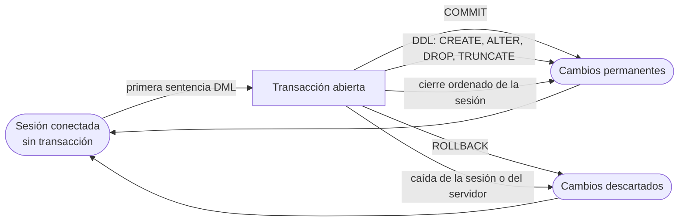
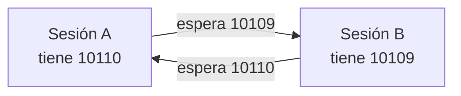

# UD08 · Manipulación de datos, transacciones y concurrencia

## Resumen del tema

Hasta aquí hemos **diseñado** (UD02 a UD04), **implementado** la estructura (UD05) y **consultado** los datos (UD06 y UD07). En esta unidad aprendemos a **modificar** el contenido de la base de datos: dar de alta, cambiar y borrar filas, cargar en una tabla el resultado de una consulta y fusionar datos que llegan de un fichero externo.

Una consulta mal escrita devuelve un resultado incorrecto: se corrige y se vuelve a ejecutar. Una modificación mal escrita **destruye información real**, y el SGBD no pide confirmación. Por eso la segunda mitad de la unidad no trata de sentencias nuevas, sino de la red de seguridad que las rodea: la **transacción**. Una transacción permite agrupar varias modificaciones para que se apliquen **todas o ninguna**, deshacerlas si algo va mal y aislar nuestro trabajo del de las demás personas que están usando la base de datos en ese mismo momento.

La unidad reutiliza intensamente lo aprendido en la UD07: dentro de un `UPDATE` o de un `DELETE` escribiremos las mismas composiciones y subconsultas que usábamos en el `SELECT`. Y prepara la UD09: cuando un guion de mantenimiento se repite cada curso, deja de ser un fichero `.sql` y se convierte en un **procedimiento almacenado** con control de errores.

Todos los ejemplos se ejecutan sobre el esquema de referencia **EDUGEST** cargado con los [scripts del proyecto](/guia/proyecto-edugest#4-scripts-descargables) y sobre sus datos del curso 2025-26 (32 alumnos, 143 matrículas, 46 faltas). Cada ejemplo indica el número de filas afectadas que debes obtener.



### Objetivos de aprendizaje

Al terminar esta unidad serás capaz de:

- Identificar las herramientas y las sentencias que modifican el contenido de una base de datos.
- Insertar, modificar y borrar filas con SQL comprobando siempre el número de filas afectadas.
- Escribir modificaciones cuyas condiciones y valores provienen de otras tablas mediante subconsultas.
- Volcar en una tabla el resultado de una consulta y fusionar datos externos con `MERGE`.
- Explicar qué es una transacción y las cuatro propiedades ACID sobre un caso real.
- Confirmar y deshacer, total o parcialmente, los cambios de una transacción con `COMMIT`, `ROLLBACK` y `SAVEPOINT`.
- Reconocer los problemas del acceso concurrente y los efectos de las políticas de bloqueo de Oracle.
- Diagnosticar y prevenir esperas por bloqueo e interbloqueos.
- Diseñar guiones de mantenimiento transaccionales, verificables y repetibles.

### Temporalización

La unidad ocupa **9 horas de aula** (5 de teoría y 4 de práctica). Es la unidad más
corta del curso en relación con su importancia profesional: aprovecha las sesiones
prácticas, que requieren **dos sesiones de Oracle abiertas a la vez**.


items:
  - {h: 2, tipo: T, t: "DML: INSERT, UPDATE, DELETE y TRUNCATE", ref: "§1 a §4"}
  - {h: 1, tipo: P, t: "Altas, cambios y bajas en EduGest", ref: "Práctica 8.1"}
  - {h: 1, tipo: T, t: "INSERT … SELECT y MERGE", ref: "§5"}
  - {h: 1, tipo: P, t: "Copias, históricos y carga de notas con MERGE", ref: "Prácticas 8.2 y 8.6"}
  - {h: 1, tipo: T, t: "Transacciones, ACID y SAVEPOINT", ref: "§6 y §7 · laboratorio de transacciones"}
  - {h: 1, tipo: P, t: "Laboratorio de transacciones", ref: "Práctica 8.4"}
  - {h: 1, tipo: T, t: "Concurrencia, bloqueos, interbloqueos y restricciones diferidas", ref: "§8 a §10"}
  - {h: 1, tipo: P, t: "Dos sesiones, un dato: concurrencia y bloqueos", ref: "Práctica 8.5"}
autonomo:
  - "Práctica 8.3 (modificaciones con subconsultas)"
  - "Práctica 8.7 (reto: guion de promoción de curso)"
  - "Proyecto EduGest · UD08 (guiones de mantenimiento)"


> [!IMPORTANT]
> Estudia esta unidad con **dos sesiones de Oracle abiertas**. La mitad de los conceptos (bloqueos, esperas, interbloqueos, consistencia de lectura) solo se entienden viendo cómo una sesión afecta a la otra. Y adquiere desde hoy un reflejo profesional: **antes de cada `UPDATE` o `DELETE`, ejecuta el `SELECT` con el mismo `WHERE`**. Si el `SELECT` no devuelve exactamente lo que esperas, la modificación tampoco lo hará.

---

DML: INSERT, UPDATE, DELETE y TRUNCATE

## 1. Modificar datos: herramientas y responsabilidad

### 1.1 El lenguaje de manipulación de datos

El **DML** (*Data Manipulation Language*) es la parte de SQL que trabaja con el **contenido** de las tablas, no con su estructura:

| Sentencia | Qué hace | Unidad |
|---|---|---|
| `SELECT` | Consulta filas (no las modifica) | UD06, UD07 |
| `INSERT` | Añade filas nuevas | §2, §5 |
| `UPDATE` | Cambia valores de filas existentes | §3 |
| `DELETE` | Elimina filas | §4 |
| `MERGE` | Inserta, actualiza o borra según si la fila existe | §5 |

A su lado está el **TCL** (*Transaction Control Language*): `COMMIT`, `ROLLBACK`, `SAVEPOINT` y `SET TRANSACTION`, que deciden **cuándo** los cambios se vuelven definitivos (§6 y §7).

### 1.2 Por qué una modificación es más peligrosa que una consulta

Compara estas dos sentencias, que se diferencian en una sola palabra:

```sql
SELECT * FROM matricula WHERE id_alumno = 7;   -- 5 filas: información
DELETE FROM matricula WHERE id_alumno = 7;     -- 5 filas: menos información
```

Un `SELECT` equivocado **no deja rastro**. Un `DELETE` equivocado:

- no pide confirmación: Oracle ejecuta exactamente lo que le pides;
- puede arrastrar filas de otras tablas por las claves ajenas `ON DELETE CASCADE` (§4.5);
- si otra persona ejecuta un `COMMIT` desde su herramienta gráfica, se vuelve **irreversible**;
- y en una tabla grande puede tardar lo bastante como para bloquear a toda la aplicación (§8).

El error más caro de todos es también el más fácil de cometer: **olvidar el `WHERE`**.

```sql
UPDATE matricula SET nota_final = 5;   -- 143 filas: todas las notas del centro a 5
```

> [!CAUTION]
> `UPDATE` y `DELETE` **sin `WHERE`** afectan a **todas** las filas de la tabla. No es un error de sintaxis, así que Oracle no avisa: es SQL perfectamente válido. En un servidor de producción, este descuido es un incidente que se comunica a dirección.

### 1.3 La regla profesional: primero el SELECT

Antes de escribir una modificación, escribe la consulta que **selecciona las mismas filas** y comprueba que son las que crees:

```sql
-- 1. ¿Qué filas voy a borrar? (comprobación previa)
SELECT id_falta, id_matricula, fecha, horas, justificada
FROM   falta_asistencia
WHERE  justificada = 'S'
AND    fecha < DATE '2025-11-01'
ORDER  BY id_falta;
```



| ID_FALTA | ID_MATRICULA | FECHA | HORAS | JUSTIFICADA |
|---|---|---|---|---|
| 1 | 10060 | 31/10/2025 | 2 | S |
| 17 | 10136 | 10/10/2025 | 1 | S |
| 31 | 10143 | 29/10/2025 | 1 | S |
| 36 | 10129 | 29/09/2025 | 1 | S |
| 39 | 10099 | 18/09/2025 | 1 | S |

*5 filas*

```sql
-- 2. La modificación, con el MISMO WHERE
DELETE FROM falta_asistencia
WHERE  justificada = 'S'
AND    fecha < DATE '2025-11-01';
-- 5 filas suprimidas

-- 3. Comprobación posterior
SELECT COUNT(*) FROM falta_asistencia;   -- 41 (eran 46)
```

Si el número de filas afectadas **no coincide** con el de la comprobación previa, no confirmes: haz `ROLLBACK` y revisa la condición.

> [!TIP]
> Convierte un `SELECT` en `DELETE` sin reescribir nada: escribe primero el `SELECT ... FROM ... WHERE ...`, pruébalo y después sustituye solo `SELECT lista FROM` por `DELETE FROM`. Para un `UPDATE`, mantén el `WHERE` intacto y añade el `SET`. Es la forma más fiable de no equivocarse en la condición.

### 1.4 Herramientas

El criterio RA4.a pide identificar las **herramientas y sentencias** para modificar datos. En Oracle las habituales son:

| Herramienta | Cómo se modifican los datos | Qué debes vigilar |
|---|---|---|
| **Hoja de trabajo SQL** (SQL Developer, VS Code con *Oracle SQL Developer Extension*) | Escribiendo DML y ejecutando con `Ctrl+Intro` | El estado de *autoconfirmación* y el contador de filas afectadas |
| **Pestaña *Datos*** de una tabla (edición en rejilla) | Escribiendo directamente sobre las celdas, como en una hoja de cálculo; `F11` confirma, `F12` deshace | Que la herramienta genera DML por ti: revísalo en el *Log de sentencias* |
| **Asistente de importación** (*Importar datos* desde CSV o Excel) | Genera `INSERT` o carga por lotes | El tipo de cada columna y las filas rechazadas |
| **SQLcl / SQL\*Plus** | Guiones `.sql` ejecutados con `@fichero` | `WHENEVER SQLERROR`, `SPOOL` y el `COMMIT` explícito |
| **Data Pump** (`expdp`, `impdp`) | Carga y descarga masiva de esquemas completos | Es una operación de administración, no de uso diario |

La edición en rejilla es cómoda para corregir un dato puntual, pero **no es trazable**: nadie puede revisarla, repetirla en otro servidor ni ponerla bajo control de versiones. Todo cambio que forme parte de un procedimiento del centro debe estar en un guion `.sql` (§11).

> [!WARNING]
> **Desactiva la autoconfirmación.** En SQL Developer: *Herramientas → Preferencias → Base de datos → Hoja de Trabajo → Confirmación automática*. Con la autoconfirmación activada, cada sentencia se confirma sola y **`ROLLBACK` deja de servirte de nada**: pierdes la red de seguridad justo cuando más la necesitas. En SQLcl se comprueba con `SHOW AUTOCOMMIT` y se desactiva con `SET AUTOCOMMIT OFF`.

### 1.5 Entorno de pruebas y copia previa

| Antes de modificar… | Pregúntate |
|---|---|
| ¿A qué base de datos estoy conectado? | `SELECT sys_context('USERENV','DB_NAME'), user FROM dual;` |
| ¿Tengo una copia de las filas que voy a tocar? | `CREATE TABLE bak_matricula AS SELECT * FROM matricula;` (§5.2) |
| ¿He probado el guion en un entorno de pruebas? | Nunca estrenes un guion en producción |
| ¿Puedo deshacerlo? | Mientras no haya `COMMIT`, sí; después, solo con la copia o con *Flashback* |
| ¿Lo ha revisado otra persona? | En cambios masivos, la revisión por pares evita incidentes |

{}
Oracle ofrece **Flashback Query**, que consulta el estado pasado de una tabla mientras la información de deshacer (*undo*) siga disponible:

```sql
SELECT * FROM matricula AS OF TIMESTAMP SYSTIMESTAMP - INTERVAL '10' MINUTE
WHERE  id_alumno = 7;
```

Con esa consulta se pueden reinsertar las filas perdidas. También existe `FLASHBACK TABLE matricula TO TIMESTAMP ...`, que requiere `ROW MOVEMENT` activado y privilegios. **No es una copia de seguridad**: depende del tamaño y la retención del *tablespace* de *undo* y, pasado ese tiempo, los datos ya no se pueden recuperar (§7.5).
{}

---

## 2. Insertar filas: `INSERT`

### 2.1 Finalidad y sintaxis

`INSERT` añade filas a una tabla. Tiene dos formas: una fila con valores literales (`VALUES`) o tantas filas como devuelva una consulta (`SELECT`, §5.1).

```text
INSERT INTO tabla [(columna1, columna2, ...)]
VALUES (valor1, valor2, ...);
```

| Componente | Significado |
|---|---|
| `INSERT INTO tabla` | Tabla (o vista actualizable) que recibe la fila |
| `(columna1, ...)` | **Lista de columnas** que se van a rellenar, en el orden que quieras |
| `VALUES (...)` | Un valor por cada columna de la lista, en el mismo orden y del tipo adecuado |
| columnas omitidas | Toman su `DEFAULT` si lo tienen y `NULL` si no |

### 2.2 Ejemplo sencillo: con lista de columnas



```sql
INSERT INTO alumno (nia, dni, nombre, apellidos, fecha_nacimiento,
                    email, localidad, cod_grupo)
VALUES ('10452001', '48123456J', 'Marina', 'López Ortega', DATE '2007-03-14',
        'marinalopez@alu.edugest.es', 'Alicante', '1DAM');
-- 1 fila creada

SELECT id_alumno, nia, nombre, apellidos, telefono, cod_grupo
FROM   alumno
WHERE  nia = '10452001';
```

| ID_ALUMNO | NIA | NOMBRE | APELLIDOS | TELEFONO | COD_GRUPO |
|---|---|---|---|---|---|
| 1001 | 10452001 | Marina | López Ortega | *(null)* | 1DAM |

*1 fila*

Fíjate en dos cosas:

1. **No hemos indicado `id_alumno`** y, sin embargo, la fila tiene el valor `1001`. Es la **columna identidad** de EduGest, declarada en la UD05 como `GENERATED BY DEFAULT ON NULL AS IDENTITY (START WITH 1001)`: Oracle genera el identificador. Los datos de ejemplo usan los números 1 a 32 porque se cargaron con identificadores explícitos, y la secuencia interna sigue en 1001.
2. **`telefono` ha quedado a `NULL`**, porque no aparece en la lista de columnas y no tiene valor por defecto.

> [!IMPORTANT]
> En código profesional la **lista de columnas es obligatoria**, aunque SQL permita omitirla. Sin ella, el `INSERT` depende del orden físico de las columnas: el día en que alguien añada una columna con `ALTER TABLE`, todas las inserciones de la aplicación dejarán de funcionar o, peor, guardarán los valores en las columnas equivocadas.

### 2.3 Sin lista de columnas

```sql
-- Válido, pero frágil: hay que dar un valor para TODAS las columnas, en su orden exacto
INSERT INTO ciclo VALUES ('COME', 'Comercio Internacional', 'SUPERIOR', 2000);
-- 1 fila creada
```

Solo es aceptable en guiones de carga inicial generados automáticamente, donde el orden se garantiza.

### 2.4 Valores por defecto, `DEFAULT` y `NULL`

La tabla `MATRICULA` de EduGest tiene tres columnas con comportamiento propio: `id_matricula` (identidad desde 20001), `fecha_matricula` (`DEFAULT SYSDATE`) y `convocatoria` (`DEFAULT 1`).

```sql
INSERT INTO matricula (id_alumno, id_modulo, curso_academico)
VALUES (1001, 2, '2026-27');
-- 1 fila creada: id_matricula = 20001, fecha_matricula = hoy,
--                convocatoria = 1, nota_final = NULL
```

| Forma de escribirlo | Resultado |
|---|---|
| Omitir la columna | Se aplica el `DEFAULT`; si no tiene, `NULL` |
| `DEFAULT` como valor | Se aplica el `DEFAULT` explícitamente: `VALUES (..., DEFAULT, ...)` |
| `NULL` como valor | Se guarda `NULL` **aunque la columna tenga `DEFAULT`**… |
| …salvo con `DEFAULT ON NULL` | Entonces un `NULL` explícito también activa el valor por defecto |

```sql
-- convocatoria explícitamente nula: ORA-01400, porque la columna es NOT NULL
INSERT INTO matricula (id_alumno, id_modulo, curso_academico, convocatoria)
VALUES (1001, 3, '2026-27', NULL);
-- ORA-01400: cannot insert NULL into ("EDUGEST"."MATRICULA"."CONVOCATORIA")

-- Forma correcta de pedir el valor por defecto
INSERT INTO matricula (id_alumno, id_modulo, curso_academico, convocatoria)
VALUES (1001, 3, '2026-27', DEFAULT);
-- 1 fila creada: convocatoria = 1
```

> [!WARNING]
> `DEFAULT` y `NULL` no son equivalentes. `DEFAULT SYSDATE` solo actúa si la columna **no aparece** en el `INSERT`. Si escribes `NULL`, Oracle guarda el nulo y, si la columna es `NOT NULL`, la sentencia falla con **ORA-01400**. Recuerda además que en Oracle la cadena vacía `''` **es** `NULL` (UD05): `VALUES (..., '')` en una columna obligatoria produce el mismo ORA-01400.

### 2.5 Buscar la clave ajena con una subconsulta

Escribir `id_modulo = 2` funciona, pero obliga a conocer de memoria los identificadores artificiales. Es más robusto obtenerlos de los datos:

```sql
INSERT INTO matricula (id_alumno, id_modulo, curso_academico, fecha_matricula)
VALUES ((SELECT id_alumno FROM alumno WHERE nia = '10452001'),
        (SELECT id_modulo FROM modulo WHERE codigo = '0484' AND cod_ciclo = 'DAM'),
        '2026-27', DATE '2026-09-10');
-- 1 fila creada
```

Las dos subconsultas son **escalares**: deben devolver exactamente una fila y una columna. Si devolvieran varias, Oracle daría `ORA-01427: single-row subquery returns more than one row`. Por eso es importante que `(codigo, cod_ciclo)` sea una clave alternativa `UNIQUE` del diseño (UD05).

### 2.6 Insertar varias filas de una vez: `INSERT ALL`

SQL estándar permite `INSERT INTO t (...) VALUES (...), (...), (...)`, pero **Oracle no admite esa sintaxis**. Su equivalente es `INSERT ALL`:



```sql
-- Tres faltas de asistencia en una sola sentencia
INSERT ALL
    INTO falta_asistencia (id_matricula, fecha, horas)
         VALUES (10110, DATE '2026-03-02', 2)
    INTO falta_asistencia (id_matricula, fecha, horas)
         VALUES (10110, DATE '2026-03-09', 1)
    INTO falta_asistencia (id_matricula, fecha, horas)
         VALUES (10109, DATE '2026-03-10', 3)
SELECT * FROM dual;
-- 3 filas creadas
```

La cláusula `SELECT * FROM dual` es obligatoria: `INSERT ALL` es en realidad un **inserción multitabla** alimentada por una consulta, y `DUAL` aporta la única fila que necesita. Al ser **una sola sentencia**, si una de las tres filas incumple una restricción, **ninguna** se inserta (§6.3).

> [!NOTE]
> En MySQL y PostgreSQL el equivalente es `INSERT INTO t (c1, c2) VALUES (1, 'a'), (2, 'b');`. Es una de las diferencias de dialecto que hay que tener presentes al portar un guion.

### 2.7 Recuperar la clave generada: `RETURNING … INTO`

Cuando la clave primaria la genera Oracle, la aplicación necesita conocerla para insertar las filas hijas. La cláusula `RETURNING` devuelve valores de la fila recién insertada; requiere un contexto PL/SQL (una variable donde guardarlos), así que se usa desde un bloque o desde una variable de enlace del cliente:



```sql
VARIABLE v_id NUMBER

BEGIN
    INSERT INTO alumno (nia, nombre, apellidos, fecha_nacimiento, cod_grupo)
    VALUES ('10452002', 'Hugo', 'Server Lledó', DATE '2007-01-09', '1DAW')
    RETURNING id_alumno INTO :v_id;
END;
/

PRINT v_id
-- V_ID
-- ----
-- 1002

-- Ahora ya se puede matricular sin volver a consultar la tabla
INSERT INTO matricula (id_alumno, id_modulo, curso_academico)
VALUES (:v_id, 12, '2026-27');
```

La alternativa artesanal (`SELECT MAX(id_alumno) FROM alumno`) **es incorrecta** en cuanto hay dos sesiones insertando a la vez: la otra sesión puede haber insertado su fila entre tu `INSERT` y tu `SELECT`. En la UD09 verás la misma idea dentro de un procedimiento almacenado.

### 2.8 Errores habituales del `INSERT`

| Error de Oracle | Significado | Causa típica en EduGest |
|---|---|---|
| `ORA-00001: unique constraint (EDUGEST.UQ_MATRICULA) violated` | Clave primaria o única repetida | Matricular dos veces al mismo alumno en el mismo módulo y curso |
| `ORA-01400: cannot insert NULL into (...)` | Falta un valor obligatorio | Olvidar `nia`, `fecha_nacimiento` o escribir `''` |
| `ORA-02291: integrity constraint (EDUGEST.FK_MATRICULA_MODULO) violated - parent key not found` | La fila padre no existe | `id_modulo = 99`, o insertar la matrícula antes que el alumno |
| `ORA-02290: check constraint (EDUGEST.CK_MATRICULA_CURSO) violated` | Incumple un `CHECK` | `curso_academico = '2026/27'` en lugar de `'2026-27'` |
| `ORA-12899: value too large for column "EDUGEST"."ALUMNO"."NIA" (actual: 9, maximum: 8)` | Texto más largo que la columna | NIA de 9 cifras en una columna `CHAR(8)` |
| `ORA-01438: value larger than specified precision allowed for this column` | Número con demasiados dígitos enteros | `nota_final = 100` en `NUMBER(4,2)` |
| `ORA-00947: not enough values` / `ORA-00913: too many values` | La lista de columnas y la de valores no coinciden | Añadir una columna y olvidar su valor |
| `ORA-01858: a non-numeric character was found where a numeric was expected` | Conversión implícita de fecha fallida | `'14/03/2007'` con otro `NLS_DATE_FORMAT`; usa `DATE '2007-03-14'` |


- q: "¿Qué valor tendrá `convocatoria` tras `INSERT INTO matricula (id_alumno, id_modulo, curso_academico) VALUES (1001, 2, '2026-27')`?"
  options: ["`NULL`, porque no se indica", "1, por el `DEFAULT 1` de la columna", "0, porque es numérica", "Error ORA-01400"]
  answer: 1
  explain: "Al omitir la columna se aplica su `DEFAULT`. Si en lugar de omitirla escribiéramos `NULL` explícitamente sí tendríamos ORA-01400, porque la columna es `NOT NULL` y su `DEFAULT` no es `ON NULL`."
- q: "¿Por qué `INSERT INTO alumno VALUES ('10452003', ...)` es una mala práctica aunque funcione?"
  options: ["Porque Oracle no lo admite", "Porque depende del orden físico de las columnas y se rompe al cambiar la tabla", "Porque no permite insertar fechas", "Porque siempre genera ORA-00947"]
  answer: 1
  explain: "Sin lista de columnas el `INSERT` queda atado al orden del `CREATE TABLE`. Un `ALTER TABLE ... ADD` posterior lo rompe, o —mucho peor— guarda los datos en columnas equivocadas sin dar error."


---

## 3. Modificar filas: `UPDATE`

### 3.1 Finalidad y sintaxis

`UPDATE` cambia los valores de una o más columnas en las filas que cumplen una condición.

```text
UPDATE tabla
SET    columna1 = expresión1,
       columna2 = expresión2, ...
[WHERE condición];
```

| Componente | Significado |
|---|---|
| `SET columna = expresión` | Nuevo valor. La expresión puede usar columnas de **la propia fila**, funciones y subconsultas |
| `WHERE condición` | Filas que se modifican. **Si falta, se modifican todas** |
| filas afectadas | El cliente informa: *«n filas actualizadas»*. Compruébalo siempre |

### 3.2 Ejemplo sencillo y varias columnas a la vez



```sql
-- Una columna de una fila
UPDATE alumno
SET    telefono = '612345678'
WHERE  id_alumno = 1001;
-- 1 fila actualizada

-- Varias columnas en una sola sentencia (mejor que dos UPDATE seguidos)
UPDATE alumno
SET    localidad = 'Elche',
       email     = 'marinalopez@alu.edugest.es',
       cod_grupo = '1DAW'
WHERE  nia = '10452001';
-- 1 fila actualizada
```

Las asignaciones del `SET` se evalúan **todas sobre los valores anteriores** de la fila: el orden en que las escribes no importa y no se «ven» entre sí.

### 3.3 Expresiones que usan el valor anterior

Esta es la diferencia esencial entre decidir el valor **dentro** o **fuera** de la base de datos (volveremos a ella en §8.4):

```sql
-- Comprobación previa
SELECT id_modulo, codigo, nombre, horas
FROM   modulo
WHERE  cod_ciclo = 'DAW' AND curso = 2
ORDER  BY id_modulo;
```

| ID_MODULO | CODIGO | NOMBRE | HORAS |
|---|---|---|---|
| 16 | 0612 | Desarrollo web en entorno cliente | 140 |
| 17 | 0613 | Desarrollo web en entorno servidor | 160 |
| 18 | 0614 | Despliegue de aplicaciones web | 80 |
| 19 | 0615 | Diseño de interfaces web | 120 |

*4 filas*

```sql
-- Subida del 10 % de las horas, redondeada al entero
UPDATE modulo
SET    horas = ROUND(horas * 1.1)
WHERE  cod_ciclo = 'DAW' AND curso = 2;
-- 4 filas actualizadas
```

| ID_MODULO | CODIGO | HORAS |
|---|---|---|
| 16 | 0612 | 154 |
| 17 | 0613 | 176 |
| 18 | 0614 | 88 |
| 19 | 0615 | 132 |

*4 filas*

```sql
-- Otro ejemplo: subir 0,25 a las notas del módulo 0615 de DAW
UPDATE matricula
SET    nota_final = nota_final + 0.25
WHERE  id_modulo = 19;
-- 5 filas actualizadas
```

| ID_MATRICULA | ANTES | DESPUÉS |
|---|---|---|
| 10102 | 9.25 | 9.5 |
| 10106 | 4.25 | 4.5 |
| 10110 | 7 | 7.25 |
| 10114 | 7.25 | 7.5 |
| 10118 | 6 | 6.25 |

*5 filas*

> [!WARNING]
> Si alguna fila tuviera `nota_final` a `NULL`, `NULL + 0.25` sería `NULL` (UD06): la fila se «actualizaría» a nulo sin error. Protégete con `WHERE nota_final IS NOT NULL` o con `NVL`. Y recuerda que `nota_final + 0.25` no puede superar 10: la restricción `CK_MATRICULA_NOTA` lo rechazaría con ORA-02290.

### 3.4 `UPDATE` con subconsulta en el `SET`

La expresión de un `SET` puede ser una **subconsulta escalar**. Así se traen valores de otras tablas sin escribir identificadores a mano:

```sql
-- Asignar como tutor de 2ASIR al único profesor de Informática que no imparte clase
UPDATE grupo
SET    id_tutor = (SELECT p.id_profesor
                   FROM   profesor p
                   WHERE  p.id_departamento = 1
                   AND    NOT EXISTS (SELECT 1 FROM imparte i
                                      WHERE  i.id_profesor = p.id_profesor))
WHERE  cod_grupo = '2ASIR';
-- 1 fila actualizada

SELECT g.cod_grupo, p.nombre || ' ' || p.apellidos AS tutor
FROM   grupo g JOIN profesor p ON p.id_profesor = g.id_tutor
WHERE  g.cod_grupo = '2ASIR';
```

| COD_GRUPO | TUTOR |
|---|---|
| 2ASIR | Pablo Lillo Martí |

*1 fila*

> [!CAUTION]
> Si la subconsulta del `SET` **no devuelve ninguna fila**, no da error: devuelve `NULL` y la columna se pone a nulo. Es una forma silenciosa de borrar datos. Añade siempre al `WHERE` una condición que garantice que la subconsulta encuentra algo, por ejemplo `WHERE EXISTS (…)`.

La forma **correlacionada** copia, fila a fila, un valor de otra tabla. Es el patrón de restauración desde una copia:

```sql
UPDATE matricula m
SET    nota_final = (SELECT b.nota_final FROM bak_matricula b
                     WHERE  b.id_matricula = m.id_matricula)
WHERE  EXISTS        (SELECT 1 FROM bak_matricula b
                      WHERE  b.id_matricula = m.id_matricula);
-- 143 filas actualizadas
```

Oracle admite además actualizar **varias columnas con una sola subconsulta**:

```sql
UPDATE matricula m
SET   (nota_final, convocatoria) = (SELECT b.nota_final, b.convocatoria
                                    FROM   bak_matricula b
                                    WHERE  b.id_matricula = m.id_matricula)
WHERE  m.curso_academico = '2025-26';
```

### 3.5 `UPDATE` con subconsulta en el `WHERE`

La condición también puede depender de otras tablas. Aquí la sintaxis es la misma que ya conoces de la UD07:

```sql
-- Subir a 5 las notas de Bases de datos de DAM comprendidas en [4,5 , 5)
SELECT id_matricula, id_alumno, nota_final          -- comprobación previa
FROM   matricula
WHERE  nota_final >= 4.5 AND nota_final < 5
AND    id_modulo = (SELECT id_modulo FROM modulo
                    WHERE  codigo = '0484' AND cod_ciclo = 'DAM');
```

| ID_MATRICULA | ID_ALUMNO | NOTA_FINAL |
|---|---|---|
| 10002 | 1 | 4.75 |
| 10007 | 2 | 4.75 |

*2 filas*

```sql
UPDATE matricula
SET    nota_final = 5
WHERE  nota_final >= 4.5 AND nota_final < 5
AND    id_modulo = (SELECT id_modulo FROM modulo
                    WHERE  codigo = '0484' AND cod_ciclo = 'DAM');
-- 2 filas actualizadas
```

Con `IN` o `EXISTS` se llega a tablas más lejanas. Las faltas no guardan el alumno: hay que pasar por la matrícula.

```sql
-- Justificar todas las faltas de Martina Alemany Vidal
UPDATE falta_asistencia
SET    justificada = 'S'
WHERE  id_matricula IN (SELECT m.id_matricula
                        FROM   matricula m JOIN alumno a ON a.id_alumno = m.id_alumno
                        WHERE  a.apellidos = 'Alemany Vidal' AND a.nombre = 'Martina');
-- 3 filas actualizadas
```

| ID_FALTA | ID_MATRICULA | FECHA | JUSTIFICADA (antes) | JUSTIFICADA (después) |
|---|---|---|---|---|
| 2 | 10045 | 25/02/2026 | N | S |
| 12 | 10044 | 29/04/2026 | N | S |
| 33 | 10044 | 11/03/2026 | S | S |

*3 filas*

{}
Porque el `WHERE` no excluye las ya justificadas: Oracle actualiza las tres y cuenta tres filas afectadas, aunque en una de ellas el valor nuevo coincida con el viejo. Si añades `AND justificada = 'N'` se actualizan **2 filas** y el resultado final es idéntico.

La versión con `AND justificada = 'N'` es preferible por tres razones: el recuento refleja el trabajo real, se escribe menos información en el fichero de *redo* y se bloquean menos filas (§8.3). Es el mismo criterio que aplicaremos al `MERGE` en §5.4.
{}

### 3.6 Errores habituales del `UPDATE`

```sql
-- Poner a NULL una columna obligatoria
UPDATE alumno SET nia = NULL WHERE id_alumno = 1001;
-- ORA-01407: cannot update ("EDUGEST"."ALUMNO"."NIA") to NULL

-- Cambiar una clave primaria que tiene filas hijas
UPDATE grupo SET cod_grupo = '1DAM-A' WHERE cod_grupo = '1DAM';
-- ORA-02292: integrity constraint (EDUGEST.FK_ALUMNO_GRUPO) violated
--            - child record found
```

| Error | Significado |
|---|---|
| `ORA-01407` | `UPDATE` que pone a `NULL` una columna `NOT NULL` |
| `ORA-02290` | El nuevo valor incumple un `CHECK` (`nota_final = 11`) |
| `ORA-02291` | El nuevo valor de una clave ajena no existe en la tabla padre |
| `ORA-02292` | Se modifica una clave referenciada que tiene filas hijas |
| `ORA-01438` / `ORA-12899` | El nuevo valor no cabe en el tipo de la columna |
| `ORA-01722: invalid number` | Comparación o asignación entre texto y número |

> [!IMPORTANT]
> **Oracle no implementa `ON UPDATE CASCADE`.** En la definición de una clave ajena solo admite `ON DELETE CASCADE` y `ON DELETE SET NULL`. Si necesitas cambiar el valor de una clave primaria referenciada tienes tres opciones:
>
> 1. **No necesitarlo**: usa claves primarias artificiales e inmutables (es lo que hace EduGest con `id_alumno`, `id_modulo` o `id_matricula`). Un identificador que nunca cambia no hay que propagarlo.
> 2. Hacerlo **en una transacción** con la restricción declarada `DEFERRABLE INITIALLY DEFERRED` (§10): se actualiza el padre, se actualizan los hijos y la comprobación se aplaza al `COMMIT`.
> 3. Desactivar la restricción (`ALTER TABLE ... DISABLE CONSTRAINT`), actualizar y volver a activarla. Es la opción menos recomendable: durante ese intervalo la base de datos admite datos inconsistentes, y el `ENABLE` fallará si queda alguna fila huérfana.

---

## 4. Borrar filas: `DELETE` y `TRUNCATE`

### 4.1 `DELETE`

```text
DELETE FROM tabla [WHERE condición];
```

`DELETE` elimina filas **completas**: no se puede «borrar una columna» de una fila (eso es un `UPDATE` que pone `NULL`).

```sql
-- Baja de un profesor que no imparte clase ni es tutor ni jefe de departamento
SELECT id_profesor, nombre, apellidos FROM profesor WHERE id_profesor = 108;
DELETE FROM profesor WHERE id_profesor = 108;
-- 1 fila suprimida
```

### 4.2 `DELETE` condicionado por una subconsulta

```sql
-- Borrar las faltas de una alumna concreta
DELETE FROM falta_asistencia
WHERE  id_matricula IN (SELECT m.id_matricula
                        FROM   matricula m JOIN alumno a ON a.id_alumno = m.id_alumno
                        WHERE  a.nia = '10450333');
-- 3 filas suprimidas
```

```sql
-- Borrar las matrículas de módulos que ya no se ofertan en el ciclo
DELETE FROM matricula m
WHERE  NOT EXISTS (SELECT 1 FROM imparte i
                   WHERE  i.id_modulo = m.id_modulo
                   AND    i.curso_academico = m.curso_academico);
```

> [!TIP]
> `NOT EXISTS` es más seguro que `NOT IN` cuando la subconsulta puede devolver `NULL`: `x NOT IN (1, NULL)` nunca es verdadero y la sentencia **no borra nada** sin avisar (UD06, lógica de tres valores). Si una sentencia de borrado afecta a 0 filas cuando esperabas varias, ese es el primer sospechoso.

### 4.3 `DELETE` frente a `TRUNCATE`

| | `DELETE FROM tabla` | `TRUNCATE TABLE tabla` |
|---|---|---|
| Sublenguaje | **DML** | **DDL** |
| Filas que borra | Las del `WHERE`, o todas | **Siempre todas** |
| Transaccional | Sí: `ROLLBACK` lo deshace | **No**: lleva `COMMIT` implícito |
| Disparadores (UD09) | Lanza los `BEFORE/AFTER DELETE` | **No** los lanza |
| Espacio liberado | Mantiene el espacio asignado a la tabla | Libera las extensiones y baja la *marca de agua* |
| Velocidad en tablas grandes | Lenta: escribe *undo* y *redo* fila a fila | Muy rápida: no registra fila a fila |
| Claves ajenas | Respeta `ON DELETE CASCADE` | **Falla** si hay FK activas apuntando a la tabla |
| Vuelve a cero una identidad | No | Solo con `TRUNCATE TABLE t ... ` y `ALTER TABLE t MODIFY (id GENERATED ... START WITH 1)` |

```sql
TRUNCATE TABLE matricula;
-- ORA-02266: unique/primary keys in table referenced by enabled foreign keys
```

El error aparece porque `FALTA_ASISTENCIA` tiene una clave ajena activa hacia `MATRICULA`. Para vaciarla habría que truncar primero la tabla hija, o desactivar la restricción:

```sql
TRUNCATE TABLE falta_asistencia;   -- primero la hija
TRUNCATE TABLE matricula;          -- ahora sí
```

> [!CAUTION]
> `TRUNCATE` **no se puede deshacer**: es DDL y confirma la transacción en curso. Úsalo solo para vaciar tablas de trabajo, de carga o de prueba, nunca «porque va más rápido» en una tabla con datos reales. Y recuerda que, al ser DDL, también confirma cualquier `INSERT` o `UPDATE` que tuvieras pendiente (§6.4).

### 4.4 Diferencias con `DROP`

| Sentencia | Filas | Estructura | ¿Reversible? |
|---|---|---|---|
| `DELETE FROM t WHERE ...` | Algunas | Se mantiene | Sí, con `ROLLBACK` |
| `DELETE FROM t` | Todas | Se mantiene | Sí, con `ROLLBACK` |
| `TRUNCATE TABLE t` | Todas | Se mantiene | No |
| `DROP TABLE t` | Todas | Desaparece | Solo desde la papelera (`FLASHBACK TABLE ... TO BEFORE DROP`) |
| `DROP TABLE t PURGE` | Todas | Desaparece | No |

### 4.5 Borrado en cascada en EduGest

En la UD05 declaramos dos claves ajenas con `ON DELETE CASCADE` y una con `ON DELETE SET NULL`:

```sql
-- matricula
CONSTRAINT fk_matricula_alumno FOREIGN KEY (id_alumno)
    REFERENCES alumno (id_alumno) ON DELETE CASCADE
-- falta_asistencia
CONSTRAINT fk_falta_matricula FOREIGN KEY (id_matricula)
    REFERENCES matricula (id_matricula) ON DELETE CASCADE
-- grupo
CONSTRAINT fk_grupo_tutor FOREIGN KEY (id_tutor)
    REFERENCES profesor (id_profesor) ON DELETE SET NULL
```

Esto convierte un `DELETE` de una sola fila en un borrado **en dos niveles**:


```sql
-- Comprobación previa: ¿cuántas filas desaparecerán de cada tabla?
SELECT 'matricula' AS tabla, COUNT(*) AS filas FROM matricula WHERE id_alumno = 1
UNION ALL
SELECT 'falta_asistencia', COUNT(*)
FROM   falta_asistencia f JOIN matricula m ON m.id_matricula = f.id_matricula
WHERE  m.id_alumno = 1;
```

| TABLA | FILAS |
|---|---|
| matricula | 5 |
| falta_asistencia | 3 |

*2 filas*

```sql
DELETE FROM alumno WHERE id_alumno = 1;
-- 1 fila suprimida   (pero han desaparecido 1 + 5 + 3 = 9 filas)

SELECT COUNT(*) FROM matricula;          -- 138 (eran 143)
SELECT COUNT(*) FROM falta_asistencia;   --  43 (eran 46)
```

> [!CAUTION]
> El contador del cliente dice **«1 fila suprimida»** porque solo cuenta las filas de la tabla a la que apuntaste. Las 8 filas borradas en cascada **no se cuentan y no se avisan**. Antes de borrar una fila padre, consulta siempre `USER_CONSTRAINTS` para saber qué cascadas existen:
>
> ```sql
> SELECT table_name, constraint_name, delete_rule
> FROM   user_constraints
> WHERE  r_constraint_name = 'PK_ALUMNO';
> ```

El caso de `ON DELETE SET NULL` es distinto: no se pierden filas, se pierde una referencia.

```sql
DELETE FROM profesor WHERE id_profesor = 105;
-- ORA-02292: integrity constraint (EDUGEST.FK_IMPARTE_PROFESOR) violated
--            - child record found
```

La clave ajena de `IMPARTE` **no** tiene regla de borrado, así que protege al profesor: hay que reasignar antes sus tres asignaciones docentes. Si lo hiciéramos y después lo borrásemos, la fila del grupo `1ASIR` del que es tutor **no se borraría**: su `id_tutor` pasaría a `NULL`.

> [!IMPORTANT]
> **Criterio profesional:** en un sistema de gestión académica no se borra al alumnado. Un expediente es un documento con valor administrativo y plazos legales de conservación. Lo correcto es la **baja lógica**: añadir una columna `fecha_baja` y filtrar por ella en las vistas. El `DELETE` se reserva para corregir errores de grabación recientes.


- q: "Se ejecuta `DELETE FROM alumno WHERE id_alumno = 1;` y el cliente informa de «1 fila suprimida». ¿Cuántas filas han desaparecido realmente de la base de datos?"
  options: ["1", "6", "9, por las cascadas de MATRICULA y FALTA_ASISTENCIA", "Ninguna hasta el COMMIT"]
  answer: 2
  explain: "`ON DELETE CASCADE` propaga el borrado en dos niveles: 1 alumno + 5 matrículas + 3 faltas. El contador solo cuenta la tabla indicada en el `DELETE`. Los cambios existen desde el `DELETE`, aunque sean reversibles hasta el `COMMIT`."
- q: "¿Cuál de estas afirmaciones sobre `TRUNCATE` es correcta en Oracle?"
  options: ["Se puede deshacer con `ROLLBACK` porque borra filas", "Admite una cláusula `WHERE`", "Es DDL: confirma la transacción en curso y no se puede deshacer", "Lanza los disparadores `AFTER DELETE`"]
  answer: 2
  explain: "`TRUNCATE` es DDL: lleva `COMMIT` implícito, no admite `WHERE` y no dispara *triggers* de fila. Esa es precisamente la razón de que sea rápido y de que sea peligroso."


---

INSERT … SELECT y MERGE

## 5. Insertar desde consultas y `MERGE`

El criterio RA4.c pide **incluir en una tabla la información resultante de la ejecución de una consulta**. Es una operación cotidiana: copias de seguridad, históricos, tablas de resumen para informes y cargas de datos que llegan de otro sistema.

### 5.1 `INSERT … SELECT`

```text
INSERT INTO tabla_destino (columnas)
SELECT  expresiones
FROM    ...;
```

La consulta puede ser tan compleja como quieras (composiciones, agrupaciones, subconsultas), pero debe devolver **tantas columnas como las de la lista, en el mismo orden y con tipos compatibles**. La tabla destino **debe existir**.



```sql
-- Tabla de histórico, con su propio diseño desnormalizado para consulta rápida
CREATE TABLE historico_nota (
    curso_academico  CHAR(7),
    nia              CHAR(8),
    alumno           VARCHAR2(130),
    cod_ciclo        VARCHAR2(5),
    cod_modulo       CHAR(4),
    nota_final       NUMBER(4,2),
    fecha_archivo    DATE DEFAULT SYSDATE,
    CONSTRAINT pk_historico_nota PRIMARY KEY (curso_academico, nia, cod_ciclo, cod_modulo)
);

INSERT INTO historico_nota (curso_academico, nia, alumno, cod_ciclo, cod_modulo, nota_final)
SELECT m.curso_academico,
       a.nia,
       a.apellidos || ', ' || a.nombre,
       mo.cod_ciclo,
       mo.codigo,
       m.nota_final
FROM   matricula m
       JOIN alumno a  ON a.id_alumno  = m.id_alumno
       JOIN modulo mo ON mo.id_modulo = m.id_modulo
WHERE  m.curso_academico = '2025-26';
-- 143 filas creadas

COMMIT;
```

La clave primaria del histórico hace el proceso **seguro frente a repeticiones**: si alguien ejecuta el archivado dos veces, la segunda falla con `ORA-00001` en lugar de duplicar el curso entero. Incluye `cod_ciclo` porque el módulo `0484` existe en DAM y en DAW: sin él, dos filas distintas tendrían la misma clave.

### 5.2 `CREATE TABLE … AS SELECT` (CTAS)

Cuando la tabla destino **no existe todavía**, Oracle puede crearla y llenarla en una sola sentencia:

```sql
-- Copia de seguridad rápida antes de un cambio delicado
CREATE TABLE bak_matricula AS SELECT * FROM matricula;
SELECT COUNT(*) FROM bak_matricula;   -- 143
```

| Qué copia CTAS | Qué **no** copia |
|---|---|
| Nombres, tipos y tamaños de las columnas | Clave primaria, `UNIQUE`, claves ajenas y `CHECK` |
| Las restricciones `NOT NULL` | Los valores `DEFAULT` |
| Los datos que devuelve el `SELECT` | Índices, disparadores, comentarios y privilegios |

```sql
CREATE TABLE bak_matricula_vacia AS SELECT * FROM matricula WHERE 1 = 0;  -- solo estructura
```

> [!WARNING]
> `CREATE TABLE ... AS SELECT` es **DDL**: confirma implícitamente la transacción en curso. Por eso **nunca** debe aparecer en medio de un guion transaccional: haz las copias **antes** de abrir la transacción (§11). Una copia CTAS tampoco es una copia de seguridad del sistema: vive en la misma base de datos y desaparece con ella. Para eso están Data Pump y RMAN (UD05).

### 5.3 Tablas de resumen

```sql
CREATE TABLE resumen_modulo (
    id_modulo    NUMBER(5)  CONSTRAINT pk_resumen_modulo PRIMARY KEY,
    matriculas   NUMBER(5)  CONSTRAINT nn_resumen_matriculas NOT NULL,
    aprobadas    NUMBER(5),
    media        NUMBER(4,2),
    calculado    DATE DEFAULT SYSDATE,
    CONSTRAINT fk_resumen_modulo FOREIGN KEY (id_modulo) REFERENCES modulo (id_modulo)
);

INSERT INTO resumen_modulo (id_modulo, matriculas, aprobadas, media)
SELECT id_modulo,
       COUNT(*),
       COUNT(CASE WHEN nota_final >= 5 THEN 1 END),
       ROUND(AVG(nota_final), 2)
FROM   matricula
GROUP  BY id_modulo;
-- 24 filas creadas

SELECT * FROM resumen_modulo WHERE id_modulo BETWEEN 16 AND 19 ORDER BY id_modulo;
```

| ID_MODULO | MATRICULAS | APROBADAS | MEDIA |
|---|---|---|---|
| 16 | 5 | 4 | 6.38 |
| 17 | 5 | 5 | 5.8 |
| 18 | 5 | 2 | 4.9 |
| 19 | 5 | 4 | 6.75 |

*4 filas*

> [!NOTE]
> El módulo 16 tiene 5 matrículas pero su media se calcula con **4 notas**: `AVG` ignora los nulos, mientras que `COUNT(*)` los cuenta (UD07). La media exacta es 6,375 y `ROUND(..., 2)` la deja en **6,38**, porque Oracle redondea el 5 hacia arriba en valor absoluto. Documenta siempre en el diccionario qué significa cada columna de un resumen:
> `COMMENT ON COLUMN resumen_modulo.media IS 'Media de las notas no nulas';`
>
> Una **vista materializada** (`CREATE MATERIALIZED VIEW ... REFRESH ON DEMAND`) hace lo mismo y además sabe refrescarse sola. Las tablas de resumen hechas a mano siguen siendo útiles cuando el cálculo es complejo o debe quedar «congelado».

### 5.4 `MERGE`: insertar, actualizar o borrar en una sola sentencia

`MERGE` (SQL estándar desde SQL:2003) resuelve el problema del **«inserta si no existe, actualiza si existe»**, conocido como *upsert*. Es la sentencia natural para **cargar datos que llegan de fuera**: un CSV de notas, un fichero de matrícula de la conselleria, una exportación de otra aplicación.

```text
MERGE INTO tabla_destino alias
USING  origen alias_origen            -- tabla, vista o subconsulta
ON    (condición de emparejamiento)
WHEN MATCHED THEN
     UPDATE SET columna = valor, ...
     [DELETE WHERE condición]
WHEN NOT MATCHED THEN
     INSERT (columnas) VALUES (valores);
```

| Cláusula | Qué hace |
|---|---|
| `USING` | De dónde vienen los datos nuevos. Suele ser una subconsulta |
| `ON (...)` | Cómo se decide si una fila del origen **ya existe** en el destino. Sus columnas **no se pueden modificar** |
| `WHEN MATCHED` | Qué hacer con las que existen: `UPDATE` (opcionalmente con su propio `WHERE`) |
| `DELETE WHERE` | Borra, **después** de aplicar el `UPDATE`, las filas que cumplan la condición |
| `WHEN NOT MATCHED` | Qué hacer con las que no existen: `INSERT` |

Las dos cláusulas `WHEN` son opcionales, pero al menos una debe aparecer.

#### Caso real: cargar las notas de un fichero

El profesorado de Bases de datos de DAW entrega las notas en un CSV. Lo importamos a una **tabla de carga** (una tabla temporal de trabajo, sin restricciones, cuyo único fin es recibir el fichero) y lo fusionamos.

```sql
CREATE TABLE carga_notas (
    nia   CHAR(8),
    nota  NUMBER(4,2)
);
-- Se rellena con el asistente «Importar datos» de SQL Developer o con SQL*Loader
```

| NIA | NOTA (del fichero) | Nota actual en EduGest | Efecto del `MERGE` |
|---|---|---|---|
| 10450518 | 5.5 | 5 | se actualiza |
| 10450555 | 6 | 6 | sin cambios |
| 10450592 | 7.25 | 5.5 | se actualiza |
| 10450629 | 6 | 6 | sin cambios |
| 10450666 | 8 | 7.25 | se actualiza |
| 10450777 | 5 | *(no está matriculada)* | incidencia |

*6 filas en el fichero*

```sql
MERGE INTO matricula m
USING (SELECT mt.id_matricula, c.nota
       FROM   carga_notas c
              JOIN alumno a     ON a.nia        = c.nia
              JOIN matricula mt ON mt.id_alumno = a.id_alumno
              JOIN modulo mo    ON mo.id_modulo = mt.id_modulo
       WHERE  mo.codigo = '0484'
       AND    mo.cod_ciclo = 'DAW'
       AND    mt.curso_academico = '2025-26') o
ON (m.id_matricula = o.id_matricula)
WHEN MATCHED THEN
     UPDATE SET m.nota_final = o.nota
     WHERE  m.nota_final IS NULL OR m.nota_final <> o.nota;
-- 3 filas fusionadas
```

Resultados:

- **3 filas fusionadas**, no 5: el `WHERE` de la cláusula `UPDATE` descarta las dos notas que no han cambiado. Sin ese `WHERE` serían 5 filas, con el mismo resultado final pero más trabajo, más *redo* y más filas bloqueadas.
- **Ejecutar el `MERGE` por segunda vez fusiona 0 filas.** Esta propiedad se llama **idempotencia** y es lo que permite relanzar una carga interrumpida sin miedo (§11.3).
- El NIA `10450777` (Elena Carbonell, de 2DAW) **no aparece en el origen**: la composición con `MATRICULA` lo descarta, porque no está matriculada en ese módulo. El `MERGE` no lo inserta ni avisa, así que la incidencia hay que buscarla aparte:

```sql
-- Notas del fichero que no se han podido aplicar
SELECT c.nia, c.nota
FROM   carga_notas c
WHERE  NOT EXISTS (SELECT 1
                   FROM   alumno a
                          JOIN matricula mt ON mt.id_alumno = a.id_alumno
                          JOIN modulo mo    ON mo.id_modulo = mt.id_modulo
                   WHERE  a.nia = c.nia
                   AND    mo.codigo = '0484' AND mo.cod_ciclo = 'DAW'
                   AND    mt.curso_academico = '2025-26');
```

| NIA | NOTA |
|---|---|
| 10450777 | 5 |

*1 fila*

> [!IMPORTANT]
> Una carga de datos externos **no termina cuando el `MERGE` acaba sin error**. Termina cuando has comprobado tres números: filas del fichero, filas fusionadas y filas rechazadas. Si no suman, hay información que se ha perdido en silencio. Deja esa comprobación escrita en el propio guion.

#### `MERGE` completo con `INSERT` y `DELETE`

En un destino que puede crecer, las dos cláusulas `WHEN` se usan juntas. Así se refresca la tabla de resumen anterior sin volver a crearla:

```sql
MERGE INTO resumen_modulo r
USING (SELECT id_modulo,
              COUNT(*)                                    AS matriculas,
              COUNT(CASE WHEN nota_final >= 5 THEN 1 END) AS aprobadas,
              ROUND(AVG(nota_final), 2)                   AS media
       FROM   matricula
       GROUP  BY id_modulo) o
ON (r.id_modulo = o.id_modulo)
WHEN MATCHED THEN
     UPDATE SET r.matriculas = o.matriculas,
                r.aprobadas  = o.aprobadas,
                r.media      = o.media,
                r.calculado  = SYSDATE
     DELETE WHERE o.matriculas = 0
WHEN NOT MATCHED THEN
     INSERT (r.id_modulo, r.matriculas, r.aprobadas, r.media)
     VALUES (o.id_modulo, o.matriculas, o.aprobadas, o.media);
-- 24 filas fusionadas
```

`DELETE WHERE` actúa **sobre las filas ya emparejadas y después del `UPDATE`**: aquí eliminaría del resumen los módulos que se hubieran quedado sin matrículas. No puede borrar filas que la cláusula `ON` no haya emparejado.

#### Cuándo `MERGE` es mejor que dos sentencias

| Situación | Solución recomendada |
|---|---|
| Hay que decidir fila a fila si existe o no | `MERGE`: una sola pasada, una sola transacción, un solo recorrido del origen |
| Solo hay que actualizar lo que existe | `UPDATE` con subconsulta: más legible |
| Solo hay que añadir lo que falta | `INSERT … SELECT … WHERE NOT EXISTS` |
| El origen puede tener **claves repetidas** | Ninguna de las dos: primero hay que deduplicar el origen |

```sql
-- Si el CSV trae dos notas distintas para el mismo NIA:
-- ORA-30926: unable to get a stable set of rows in the source tables
```

> [!WARNING]
> `ORA-30926` es el error más habitual del `MERGE` y significa que el origen contiene **más de una fila para la misma fila del destino**. Oracle no puede decidir cuál gana, así que no aplica ninguna. La solución está en el origen: agrupa (`GROUP BY` con `MAX`), filtra por fecha de modificación o rechaza el fichero y pide uno correcto. Si en cambio intentas modificar una columna que aparece en el `ON`, el error será `ORA-38104: Columns referenced in the ON Clause cannot be updated`.


- q: "Se ejecuta por segunda vez, sin cambiar nada, el `MERGE` de carga de notas. ¿Cuántas filas se fusionan?"
  options: ["Las mismas 3", "0, porque ninguna nota es distinta de la del fichero", "6, una por fila del fichero", "Error ORA-00001"]
  answer: 1
  explain: "El `WHERE` de la cláusula `UPDATE` exige que la nota sea distinta. Tras la primera ejecución ya coinciden, así que no se modifica nada: el `MERGE` es **idempotente**. Esa propiedad es la que permite relanzar una carga interrumpida."
- q: "¿Qué restricciones de la tabla original conserva `CREATE TABLE bak AS SELECT * FROM matricula`?"
  options: ["Todas", "Ninguna", "Solo las `NOT NULL`", "Solo la clave primaria"]
  answer: 2
  explain: "CTAS copia los tipos y las restricciones `NOT NULL`, pero no la clave primaria, ni `UNIQUE`, ni las claves ajenas, ni los `CHECK`, ni los `DEFAULT`. Una copia CTAS admite datos que la tabla original rechazaría."


---

Transacciones, ACID y SAVEPOINT

## 6. Transacciones y propiedades ACID

### 6.1 Qué problema resuelve una transacción

Imagina que matricular a una alumna exige dos modificaciones: insertar la matrícula y descontar una plaza del grupo. Supongamos que creamos la tabla que lleva la cuenta de las plazas:



```sql
CREATE TABLE plaza_grupo (
    cod_grupo       VARCHAR2(10) CONSTRAINT pk_plaza_grupo PRIMARY KEY,
    plazas_totales  NUMBER(3)    CONSTRAINT nn_plaza_totales NOT NULL,
    plazas_libres   NUMBER(3)    CONSTRAINT nn_plaza_libres NOT NULL,
    CONSTRAINT ck_plaza_libres CHECK (plazas_libres BETWEEN 0 AND plazas_totales),
    CONSTRAINT fk_plaza_grupo  FOREIGN KEY (cod_grupo) REFERENCES grupo (cod_grupo)
);

INSERT INTO plaza_grupo (cod_grupo, plazas_totales, plazas_libres)
SELECT g.cod_grupo, 30, 30 - COUNT(a.id_alumno)
FROM   grupo g LEFT JOIN alumno a ON a.cod_grupo = g.cod_grupo
GROUP  BY g.cod_grupo;
-- 6 filas creadas
COMMIT;

SELECT * FROM plaza_grupo ORDER BY cod_grupo;
```

| COD_GRUPO | PLAZAS_TOTALES | PLAZAS_LIBRES |
|---|---|---|
| 1ASIR | 30 | 25 |
| 1DAM | 30 | 23 |
| 1DAW | 30 | 24 |
| 2ASIR | 30 | 30 |
| 2DAM | 30 | 24 |
| 2DAW | 30 | 25 |

*6 filas*

Matricular es ahora una operación **compuesta**:

```sql
INSERT INTO alumno (nia, nombre, apellidos, fecha_nacimiento, cod_grupo)
VALUES ('10452010', 'Lucía', 'Server Mas', DATE '2007-05-02', '1DAM');

UPDATE plaza_grupo SET plazas_libres = plazas_libres - 1 WHERE cod_grupo = '1DAM';
```

¿Qué ocurre si entre las dos sentencias se corta la red, se cae el servidor o la segunda falla porque no quedaban plazas? La base de datos queda **inconsistente**: hay una alumna en el grupo que nadie ha descontado del contador. Nadie podrá saber después cuál de los dos datos es el correcto.

Una **transacción** es una **unidad lógica de trabajo**: un conjunto de sentencias que se aplican **todas o ninguna**. Mientras no se confirme, los cambios son provisionales; cuando se confirma, pasan a formar parte permanente de la base de datos.

{}
El acrónimo **ACID** lo acuñaron Theo Härder y Andreas Reuter en 1983. La teoría de las transacciones se debe en gran parte a Jim Gray, que recibió el Premio Turing en 1998 por este trabajo.
{}

### 6.2 Las cuatro propiedades ACID

| Propiedad | Qué garantiza | En el caso de la matrícula |
|---|---|---|
| **A** · Atomicidad | La transacción es indivisible: se aplica entera o se descarta entera | No puede quedar la alumna sin descontar la plaza |
| **C** · Consistencia | Al terminar, la base de datos cumple **todas** sus restricciones | `plazas_libres` nunca es negativo, ni hay matrículas sin alumno |
| **I** · Aislamiento | Las transacciones concurrentes no se interfieren; el resultado es como si se hubieran ejecutado una detrás de otra | Otra sesión no ve media matrícula a medio hacer |
| **D** · Durabilidad | Una vez confirmada, el cambio sobrevive a un corte de luz | Tras el `COMMIT`, la matrícula está garantizada aunque el servidor se apague |

El caso clásico, el de la **transferencia bancaria**, es exactamente el mismo:

```sql
UPDATE cuenta SET saldo = saldo - 500 WHERE id_cuenta = 'A';   -- cargo
UPDATE cuenta SET saldo = saldo + 500 WHERE id_cuenta = 'B';   -- abono
COMMIT;                                                        -- o ROLLBACK
```

Sin atomicidad, el dinero podría salir de A y no llegar a B. Sin durabilidad, podría desaparecer al reiniciar el servidor. Sin aislamiento, un informe de saldos ejecutado en medio sumaría mal.

> [!NOTE]
> La **durabilidad** se consigue en Oracle con el *redo log*. Al confirmar, Oracle escribe la información de recuperación en los ficheros de *redo* **antes** de responder «confirmado», y solo después (en otro momento) guarda los bloques de datos en disco. Si el servidor cae, al arrancar reaplica el *redo* de las transacciones confirmadas y deshace las no confirmadas con la información de *undo*. Por eso un `COMMIT` tarda lo que tarda un acceso a disco: está comprando una garantía.

### 6.3 Atomicidad de sentencia

Oracle garantiza la atomicidad a **dos niveles**, y conviene no confundirlos:

- **Atomicidad de transacción**: `ROLLBACK` deshace todo lo hecho desde el inicio de la transacción.
- **Atomicidad de sentencia**: si una sentencia falla a mitad, se deshace **ella sola**; el resto de la transacción permanece.

```sql
UPDATE matricula SET nota_final = nota_final + 1;
-- ORA-02290: check constraint (EDUGEST.CK_MATRICULA_NOTA) violated
SELECT COUNT(*) FROM matricula WHERE nota_final > 10;   -- 0: no se ha aplicado nada
```

Aunque la sentencia había empezado a modificar filas, al llegar a una nota de 10 falla y Oracle **deshace sus propios cambios**. La transacción, en cambio, sigue abierta: si antes habías hecho otro `UPDATE` correcto, **sigue pendiente de confirmación**.

> [!WARNING]
> La atomicidad de sentencia es la trampa de la que nacen la mitad de las inconsistencias de las aplicaciones mal escritas: ejecutan tres sentencias, una falla, **no comprueban el error** y lanzan `COMMIT`. El resultado es una transacción a medias confirmada. Toda aplicación debe comprobar el resultado de cada sentencia y decidir `COMMIT` o `ROLLBACK` en consecuencia (práctica 8.4).

### 6.4 Cuándo empieza y cuándo acaba una transacción en Oracle

Oracle **no tiene** una sentencia `BEGIN TRANSACTION`: la transacción es implícita.



| La transacción… | …empieza con | …termina con |
|---|---|---|
| Implícitamente | La primera sentencia `INSERT`, `UPDATE`, `DELETE`, `MERGE` o `SELECT … FOR UPDATE` | — |
| Explícitamente | `SET TRANSACTION` (para fijar el aislamiento) | `COMMIT` o `ROLLBACK` |
| Por sorpresa | — | **Cualquier sentencia DDL**, que lleva `COMMIT` implícito |
| Por desconexión ordenada | — | `COMMIT` (en SQL\*Plus y SQLcl con `EXIT`) |
| Por caída | — | `ROLLBACK` automático al recuperar |

> [!CAUTION]
> **Cada sentencia DDL ejecuta un `COMMIT` implícito** (UD05). Por tanto:
>
> ```sql
> UPDATE matricula SET nota_final = 10;      -- 143 filas, pendientes
> CREATE TABLE prueba (x NUMBER);            -- COMMIT implícito: ¡ya está confirmado!
> ROLLBACK;                                  -- no deshace nada
> ```
>
> Un `CREATE TABLE`, un `TRUNCATE` o incluso un `COMMENT ON` en medio de un guion de datos convierte en permanente lo que creías provisional. **Nunca mezcles DDL y DML en la misma transacción.**

Y un último mecanismo que conviene conocer: la **autoconfirmación de la herramienta**. No es una característica de Oracle, sino del cliente: si está activada, el cliente lanza un `COMMIT` después de cada sentencia. Desactívala (§1.4).

---

{}
{}
Cuenta A: **1.000 €**. Cuenta B: **500 €**. Queremos mover 100 € de A a B.
{}
{}
`UPDATE cuenta SET saldo = saldo - 100 WHERE id = 'A';` Dentro de la transacción A vale 900 €, pero **otras sesiones siguen viendo 1.000 €** (aislamiento).
{}
{}
Antes del segundo `UPDATE` se cae la conexión o salta un error. Si no hubiera transacciones, se habrían perdido 100 €.
{}
{}
El SGBD deshace el primer `UPDATE`. A vuelve a **1.000 €** y B sigue en **500 €**: la suma total no cambia (atomicidad y consistencia).
{}
{}
Si el segundo `UPDATE` (B = 600 €) funciona, se ejecuta `COMMIT`: ambos cambios se confirman a la vez y son **permanentes** (durabilidad).
{}
{}

## 7. Control de la transacción: `COMMIT`, `ROLLBACK` y `SAVEPOINT`

### 7.1 `COMMIT` y `ROLLBACK`

| Sentencia | Efecto |
|---|---|
| `COMMIT;` | Hace **permanentes** todos los cambios de la transacción, los hace visibles al resto de sesiones y **libera los bloqueos** |
| `ROLLBACK;` | **Descarta** todos los cambios de la transacción y libera los bloqueos |
| `SAVEPOINT nombre;` | Marca un punto intermedio al que se podrá volver |
| `ROLLBACK TO SAVEPOINT nombre;` | Deshace **solo** lo posterior a ese punto; la transacción **sigue abierta** |

```sql
UPDATE plaza_grupo SET plazas_libres = plazas_libres - 1 WHERE cod_grupo = '1DAM';
SELECT plazas_libres FROM plaza_grupo WHERE cod_grupo = '1DAM';   -- 22 (solo yo lo veo)
ROLLBACK;
SELECT plazas_libres FROM plaza_grupo WHERE cod_grupo = '1DAM';   -- 23 otra vez
```

### 7.2 `SAVEPOINT` y `ROLLBACK TO SAVEPOINT`

Un punto de guardado permite retroceder **parcialmente**, sin perder el trabajo anterior. Es lo que necesita un guion largo que debe poder abandonar un paso opcional:

```sql
-- Paso 1: matrícula (imprescindible)
INSERT INTO matricula (id_alumno, id_modulo, curso_academico)
VALUES (1001, 2, '2026-27');

SAVEPOINT tras_matricula;

-- Paso 2: ajuste de plazas (opcional, puede fallar si no quedan)
UPDATE plaza_grupo SET plazas_libres = plazas_libres - 1 WHERE cod_grupo = '1DAM';

-- Nos hemos equivocado de grupo: deshacemos SOLO el paso 2
ROLLBACK TO SAVEPOINT tras_matricula;

-- La matrícula sigue pendiente y se confirma
COMMIT;
```

Reglas de los puntos de guardado:

- Son **locales a la sesión** y desaparecen al terminar la transacción.
- Volver a un punto **no lo destruye**: puedes retroceder a él varias veces. Los puntos creados **después** sí se descartan.
- Si reutilizas un nombre, el nuevo punto sustituye al anterior.
- `ROLLBACK TO SAVEPOINT s1` sobre un nombre que no existe da `ORA-01086: savepoint 's1' never established in this session or is invalid`.
- Oracle **libera los bloqueos adquiridos después** del punto de guardado y **conserva los anteriores**. Pero una sesión que ya estaba esperando uno de esos bloqueos **sigue esperando** hasta que la transacción termine con `COMMIT` o `ROLLBACK`.

#### Laboratorio de transacciones y concurrencia

Este simulador reproduce **dos sesiones de Oracle** (A y B) trabajando sobre dos matrículas reales de EduGest: la `10110` (nota 7) y la `10109` (nota 4,5). Ejecuta las sentencias por turnos y observa en todo momento tres cosas distintas: el **valor comprometido** en la base de datos, lo que **ve cada sesión** y **quién tiene bloqueada** cada fila.

Empieza por el escenario **«SAVEPOINT y ROLLBACK parcial»** y sigue con **«Lectura consistente»**. Los escenarios de bloqueo e interbloqueo se explican en §8 y §9.



{}
Porque el `UPDATE` de A **no está confirmado**. Oracle no muestra a nadie los datos no comprometidos de otra transacción: reconstruye para B la última versión confirmada a partir de la información de *undo*. Es la **consistencia de lectura multiversión** (§8.2). La consecuencia práctica es doble: B obtiene un resultado coherente **sin esperar**, y nunca puede tomar decisiones basadas en un cambio que después se deshaga.
{}

### 7.3 `SET TRANSACTION`

Antes de la primera sentencia de una transacción se puede fijar su comportamiento:

```sql
SET TRANSACTION READ ONLY;                 -- informe consistente, sin modificar nada
SET TRANSACTION ISOLATION LEVEL SERIALIZABLE;
SET TRANSACTION READ WRITE;                -- el valor por omisión
SET TRANSACTION NAME 'promocion_2026_27';  -- nombre visible en V$TRANSACTION
```

Una transacción `READ ONLY` ve la base de datos **congelada en el instante en que empezó**: todas sus consultas devuelven el mismo estado, aunque otras sesiones estén confirmando cambios. Es la forma correcta de sacar un informe cuyos totales deben cuadrar entre sí.

```sql
SET TRANSACTION READ ONLY;
SELECT COUNT(*) FROM matricula;                            -- 143
SELECT COUNT(*) FROM matricula WHERE nota_final >= 5;      -- 110
SELECT COUNT(*) FROM matricula WHERE nota_final <  5;      --  27
SELECT COUNT(*) FROM matricula WHERE nota_final IS NULL;   --   6
COMMIT;   -- cierra la transacción de solo lectura
```

Los cuatro recuentos cuadran (110 + 27 + 6 = 143) **aunque secretaría esté matriculando a la vez**. Sin `READ ONLY`, cada consulta vería un estado distinto y el informe podría no sumar.

### 7.4 Transacciones largas: por qué son un problema

Una transacción debe ser **lo más corta posible**. Mantenerla abierta mucho tiempo —por ejemplo, porque la aplicación espera a que una persona rellene un formulario— provoca:

| Consecuencia | Por qué |
|---|---|
| Bloqueos prolongados | Las filas modificadas quedan bloqueadas hasta el `COMMIT` y otras sesiones esperan (§8.3) |
| Crecimiento del *undo* | Oracle debe conservar las versiones antiguas de los datos mientras la transacción viva |
| `ORA-01555` en otras sesiones | Las consultas largas pueden no encontrar la versión antigua que necesitan |
| Mayor probabilidad de interbloqueo | Más tiempo con bloqueos = más posibilidades de cruzarse con otra sesión (§9) |
| Pérdida de trabajo al caer | Una sesión que termina de forma anómala hace `ROLLBACK` de todo |

> [!IMPORTANT]
> **Regla profesional:** una transacción empieza cuando se tienen **todos** los datos necesarios y acaba inmediatamente después. Nunca se abre una transacción y se espera a la interacción de una persona. Si la aplicación necesita que nadie toque un dato mientras el usuario lo edita, no se usa un bloqueo de base de datos: se usa **bloqueo optimista** con una columna de versión (§8.5).

### 7.5 `ORA-01555: snapshot too old`

Es la consecuencia más visible de mezclar transacciones largas con mucha actividad de escritura:

```text
ORA-01555: snapshot too old: rollback segment number 7 with name "_SYSSMU7_..." too small
```

Una consulta que lleva minutos ejecutándose necesita ver los datos **tal como estaban al empezar**. Para eso Oracle reconstruye las versiones antiguas con la información de *undo*. Si mientras tanto otras sesiones han escrito tanto que esa información se ha reutilizado, la versión antigua ya no existe y la consulta **no puede devolver un resultado consistente**: en lugar de devolver datos mezclados, Oracle prefiere fallar.

| Causa | Medida |
|---|---|
| Consulta o informe muy largo | Reducir su duración; ejecutarlo en horas de baja actividad |
| Retención de *undo* insuficiente | Aumentar `UNDO_RETENTION` y el tamaño del *tablespace* de *undo* (administración) |
| Bucle que lee y escribe la misma tabla | Rediseñarlo: una sola sentencia conjunta en lugar de fila a fila (UD09) |
| `COMMIT` dentro de un bucle que recorre un cursor | Nunca confirmar dentro del bucle que se está leyendo |


- q: "Una sesión ejecuta `UPDATE`, después `SAVEPOINT s1`, después otro `UPDATE` y finalmente `ROLLBACK TO SAVEPOINT s1`. ¿Qué queda pendiente de confirmación?"
  options: ["Nada: la transacción se ha cerrado", "El primer `UPDATE`, y la transacción sigue abierta", "Los dos `UPDATE`", "Solo el segundo `UPDATE`"]
  answer: 1
  explain: "`ROLLBACK TO SAVEPOINT` deshace únicamente lo posterior al punto de guardado y **no cierra la transacción**: el primer `UPDATE` sigue pendiente y hay que decidir `COMMIT` o `ROLLBACK`."
- q: "Tras `UPDATE matricula SET nota_final = 10;` se ejecuta `CREATE INDEX ix_tmp ON alumno (localidad);` y después `ROLLBACK;`. ¿Qué notas quedan en la base de datos?"
  options: ["Las originales: el `ROLLBACK` deshace el `UPDATE`", "Todas a 10: el DDL confirmó la transacción", "Error: no se puede crear un índice con cambios pendientes", "Depende de la autoconfirmación del cliente"]
  answer: 1
  explain: "`CREATE INDEX` es DDL y lleva `COMMIT` implícito. El `UPDATE` quedó confirmado antes de ejecutarse el índice y el `ROLLBACK` llega tarde. Es el motivo de no mezclar nunca DDL y DML en una misma transacción."


---

Concurrencia, bloqueos, interbloqueos y restricciones diferidas

## 8. Concurrencia y bloqueos

En EduGest trabajan a la vez secretaría, el profesorado poniendo notas, los tutores registrando faltas y jefatura sacando informes. El criterio RA4.g pide **identificar los efectos de las distintas políticas de bloqueo**; el RA4.h, **adoptar medidas para mantener la integridad y la consistencia**. Las dos cosas se aprenden provocando los problemas a propósito.

### 8.1 Los cuatro problemas del acceso concurrente

| Problema | En qué consiste | Ejemplo en EduGest |
|---|---|---|
| **Lectura sucia** (*dirty read*) | Una transacción lee un cambio **no confirmado** de otra, que después se deshace | Un boletín imprime un 9 que luego vuelve a ser 7 |
| **Lectura no repetible** (*non-repeatable read*) | La misma consulta, dentro de la misma transacción, devuelve valores distintos porque otra confirmó un cambio | Un informe calcula la media dos veces y obtiene dos resultados |
| **Lectura fantasma** (*phantom read*) | Una consulta repetida devuelve **filas nuevas** que otra transacción ha insertado | Un recuento de matriculados crece a mitad de informe |
| **Actualización perdida** (*lost update*) | Dos sesiones leen el mismo dato, calculan un valor nuevo y escriben: el segundo pisa al primero | Dos profesores suben la nota de la misma matrícula y solo queda un cambio |

{}
Gracias a la consistencia de lectura multiversión, en Oracle las lecturas no bloquean a las escrituras ni las escrituras a las lecturas: una consulta ve una «foto» coherente de los datos del instante en que empezó.
{}

### 8.2 Qué permite Oracle: consistencia de lectura multiversión

Oracle resuelve estos problemas de una forma distinta a la de otros SGBD: en lugar de bloquear a quien lee, **le reconstruye la versión que le corresponde**. De cada bloque modificado conserva, en el *tablespace* de *undo*, la información necesaria para reproducir su estado anterior.

Las dos consecuencias son el fundamento de todo lo que viene después:

> [!IMPORTANT]
> 1. **Los lectores no bloquean a los escritores y los escritores no bloquean a los lectores.** Un `SELECT` nunca espera, nunca bloquea y nunca ve datos no comprometidos.
> 2. **Los escritores sí se bloquean entre sí** sobre la misma fila: solo una transacción puede tener modificada una fila sin confirmar.

Además, la consistencia se garantiza a dos niveles:

| Nivel | Qué ve la consulta | Cuándo se usa |
|---|---|---|
| **De sentencia** | Los datos confirmados en el instante en que **la sentencia** empezó | Siempre, por omisión (`READ COMMITTED`) |
| **De transacción** | Los datos confirmados en el instante en que **la transacción** empezó | Con `SET TRANSACTION READ ONLY` o `ISOLATION LEVEL SERIALIZABLE` |

Por eso una consulta que tarda cinco minutos devuelve un resultado **coherente**, no una mezcla de datos de instantes distintos.

### 8.3 Niveles de aislamiento

El estándar SQL define cuatro niveles. Oracle implementa dos, más el modo de solo lectura:

| Nivel | Lectura sucia | Lectura no repetible | Lectura fantasma | ¿En Oracle? |
|---|---|---|---|---|
| `READ UNCOMMITTED` | Posible | Posible | Posible | **No existe**: Oracle nunca permite lecturas sucias |
| `READ COMMITTED` | Imposible | Posible | Posible | **Sí, por omisión** |
| `REPEATABLE READ` | Imposible | Imposible | Posible | No existe como tal |
| `SERIALIZABLE` | Imposible | Imposible | Imposible | Sí |
| `READ ONLY` (Oracle) | Imposible | Imposible | Imposible | Sí, pero no permite modificar |

```sql
SET TRANSACTION ISOLATION LEVEL SERIALIZABLE;
-- ... sentencias ...
-- Si otra sesión confirmó un cambio en una fila que esta transacción quiere modificar:
-- ORA-08177: can't serialize access for this transaction
```

Con `SERIALIZABLE`, Oracle no hace esperar: **falla** y la aplicación debe reintentar la transacción completa. Es el precio del aislamiento máximo, y por eso solo se usa cuando el cálculo exige una foto absolutamente estable.

> [!NOTE]
> Ningún nivel de aislamiento evita la **actualización perdida** si la aplicación lee, calcula fuera de la base de datos y escribe un valor absoluto. `SERIALIZABLE` la detecta (`ORA-08177`), pero en `READ COMMITTED` —el modo normal— hay que evitarla explícitamente (§8.5).

### 8.4 Bloqueo de fila automático

Toda sentencia `INSERT`, `UPDATE`, `DELETE` o `MERGE` adquiere automáticamente:

- un **bloqueo exclusivo de fila** (*TX row lock*) sobre cada fila que modifica, que se mantiene **hasta el `COMMIT` o el `ROLLBACK`**;
- un **bloqueo de tabla compartido** (modo *row exclusive*), que no estorba a otras sentencias DML pero **impide el DDL** sobre esa tabla mientras la transacción viva.

Oracle **no** escala los bloqueos de fila a bloqueos de tabla, y el número de filas bloqueadas no tiene límite práctico: la información del bloqueo se guarda en el propio bloque de datos.

Qué ocurre cuando dos sesiones escriben la misma fila:

| t | Sesión A (secretaría) | Sesión B (tutoría) |
|---|---|---|
| 1 | `UPDATE matricula SET nota_final = nota_final + 1 WHERE id_matricula = 10110;` | |
| 2 | | `SELECT nota_final FROM matricula WHERE id_matricula = 10110;` → **7**, sin esperar |
| 3 | | `UPDATE matricula SET nota_final = nota_final + 2 WHERE id_matricula = 10110;` → **queda en espera** |
| 4 | `COMMIT;` | → se desbloquea, **relee 8** y escribe 8 + 2 = **10** |
| 5 | | `COMMIT;` |

Observa lo esencial del paso 4: al desbloquearse, B **no** aplica su cambio sobre el 7 que vio antes, sino que **vuelve a leer** el valor actual. Por eso `SET nota_final = nota_final + 2` **no pierde** el incremento de A: el resultado es 10 y no 9. Compruébalo en el laboratorio de §7.2 con el escenario **«Sesión bloqueada»**.

Para ver quién bloquea a quién hace falta una tercera sesión con privilegios de administración:

```sql
-- Sesiones bloqueadas y quién las bloquea
SELECT sid, username, blocking_session, event, seconds_in_wait
FROM   v$session
WHERE  blocking_session IS NOT NULL;
```

| Vista | Para qué sirve |
|---|---|
| `V$SESSION` | Columna `blocking_session` y evento `enq: TX - row lock contention` |
| `V$LOCK` | Bloqueos concedidos (`LMODE`) y solicitados (`REQUEST`); tipo `TX` para transacciones y `TM` para tablas |
| `DBA_BLOCKERS` / `DBA_WAITERS` | Lista directa de sesiones bloqueadoras y bloqueadas |
| `V$TRANSACTION` | Transacciones activas y el espacio de *undo* que consumen |

### 8.5 Bloqueo pesimista: `SELECT … FOR UPDATE`

Si la aplicación necesita leer un dato **con la intención de modificarlo**, puede bloquearlo ya en la lectura. Es el **bloqueo pesimista**: se asume que habrá conflicto y se previene.

```sql
-- Bloquea las filas que devuelve, como si las hubiera modificado
SELECT nota_final FROM matricula WHERE id_matricula = 10110 FOR UPDATE;
-- ... la aplicación calcula ...
UPDATE matricula SET nota_final = 8 WHERE id_matricula = 10110;
COMMIT;                                   -- aquí se libera el bloqueo
```

| Variante | Comportamiento si la fila ya está bloqueada |
|---|---|
| `FOR UPDATE` | **Espera** indefinidamente |
| `FOR UPDATE NOWAIT` | Falla al instante: `ORA-00054: resource busy and acquire with NOWAIT specified or timeout expired` |
| `FOR UPDATE WAIT 5` | Espera 5 segundos y después falla: `ORA-30006: resource busy; acquire with WAIT timeout expired` |
| `FOR UPDATE SKIP LOCKED` | **Omite** las filas bloqueadas y devuelve el resto: patrón de cola de trabajo |
| `FOR UPDATE OF m.nota_final` | En una consulta con varias tablas, bloquea solo las filas de la tabla de esa columna |

> [!TIP]
> En una aplicación interactiva, `FOR UPDATE` sin más es casi siempre un error: deja una ventana colgada bloqueando filas. Usa `NOWAIT` o `WAIT n` y muestra a la persona un mensaje comprensible («otro usuario está editando esta nota, inténtalo en unos segundos») en lugar de una pantalla congelada.

### 8.6 Bloqueo optimista: columna de versión

El **bloqueo optimista** no bloquea nada: supone que el conflicto es raro y se limita a **detectarlo** al escribir. Es la estrategia de casi todas las aplicaciones web, porque no mantiene transacciones abiertas entre peticiones.

```sql
-- Se añade una columna de versión a la tabla
ALTER TABLE matricula ADD (version NUMBER(10) DEFAULT 0 NOT NULL);
```

1. La aplicación **lee** el dato y su versión: `nota_final = 7`, `version = 3`.
2. La persona edita y envía el formulario (pueden pasar minutos; no hay transacción abierta).
3. La aplicación **escribe comprobando la versión**:

```sql
UPDATE matricula
SET    nota_final = 8,
       version    = version + 1
WHERE  id_matricula = 10110
AND    version = 3;
```

- Si devuelve **1 fila**, nadie más ha tocado el dato: `COMMIT`.
- Si devuelve **0 filas**, otra persona lo modificó entre la lectura y la escritura. La aplicación no pisa nada: avisa, vuelve a leer y ofrece reintentar.

```sql
-- Variante sin columna nueva: comprobar el valor leído
UPDATE matricula SET nota_final = 8
WHERE  id_matricula = 10110 AND nota_final = 7;   -- 0 filas = conflicto
```

| Estrategia | Cuándo conviene | Inconveniente |
|---|---|---|
| **Pesimista** (`FOR UPDATE`) | Conflicto probable, edición corta, operaciones críticas (reservar la última plaza) | Bloquea a otras sesiones; no sirve entre peticiones web |
| **Optimista** (versión) | Conflicto poco probable, edición larga, aplicaciones web y móviles | El trabajo del segundo usuario se pierde y hay que repetirlo |
| **Cálculo dentro del SGBD** (`SET x = x + 1`) | Siempre que el nuevo valor se pueda expresar en función del anterior | No vale si el cálculo necesita lógica externa |

> [!IMPORTANT]
> La tercera opción es la más barata y la más olvidada. `UPDATE plaza_grupo SET plazas_libres = plazas_libres - 1 WHERE cod_grupo = '1DAM' AND plazas_libres > 0` resuelve de una vez el bloqueo, el cálculo y la validación: si devuelve 0 filas, no quedaban plazas. Siempre que puedas, **deja que la base de datos lea el valor que va a modificar**.


- q: "La sesión A hace `UPDATE` sobre la matrícula 10110 y no confirma. ¿Qué ocurre si la sesión B ejecuta `SELECT nota_final FROM matricula WHERE id_matricula = 10110;`?"
  options: ["Espera hasta que A confirme", "Devuelve el valor nuevo de A", "Devuelve el último valor comprometido, sin esperar", "Error ORA-00054"]
  answer: 2
  explain: "La consistencia de lectura multiversión reconstruye para B la última versión confirmada con la información de *undo*. Los lectores no esperan y nunca ven datos no comprometidos; esperar o leer el valor nuevo sería el comportamiento de un SGBD con bloqueo de lectura."
- q: "Dos profesores leen `nota_final = 7` y escriben, uno `SET nota_final = 8` y el otro `SET nota_final = 9`, confirmando ambos. ¿Qué problema se ha producido?"
  options: ["Lectura sucia", "Lectura fantasma", "Actualización perdida", "Interbloqueo"]
  answer: 2
  explain: "Es la **actualización perdida**: el segundo `UPDATE` pisa el primero porque calculó el valor nuevo con una lectura ya obsoleta. Ningún nivel de aislamiento de Oracle lo evita en `READ COMMITTED`: hay que usar `FOR UPDATE`, una columna de versión o expresar el cálculo dentro del `UPDATE`."


---

## 9. Interbloqueos

### 9.1 Qué es un interbloqueo

Un **interbloqueo** (*deadlock*) se produce cuando dos transacciones esperan la una a la otra y ninguna puede avanzar. Cada una tiene lo que la otra necesita.

| t | Sesión A | Sesión B |
|---|---|---|
| 1 | `UPDATE matricula SET nota_final = nota_final + 1 WHERE id_matricula = 10110;` | |
| 2 | | `UPDATE matricula SET nota_final = nota_final + 1 WHERE id_matricula = 10109;` |
| 3 | `UPDATE ... WHERE id_matricula = 10109;` → **espera a B** | |
| 4 | | `UPDATE ... WHERE id_matricula = 10110;` → espera a A: **ciclo** |
| 5 | `ORA-00060: deadlock detected while waiting for resource` | sigue esperando |



Al contrario que una espera normal, un interbloqueo **no se resuelve solo con el tiempo**. Por eso Oracle lo detecta automáticamente (en unos segundos) y lo rompe.

### 9.2 Qué hace Oracle exactamente

> [!IMPORTANT]
> Oracle deshace **la sentencia** de una de las dos sesiones, **no su transacción completa**. La sesión elegida recibe `ORA-00060`, sigue teniendo su transacción abierta y **conserva los bloqueos que ya había adquirido**. La otra sesión **continúa esperando** hasta que la primera haga `COMMIT` o `ROLLBACK`.

Esto tiene una consecuencia práctica muy importante: **recibir `ORA-00060` no te deja en un estado limpio**. Si la aplicación ignora el error y continúa, puede confirmar media operación. El tratamiento correcto es:

1. Capturar el error.
2. Hacer `ROLLBACK` de la transacción completa (así se libera a la otra sesión).
3. Reintentar la operación desde el principio, una o dos veces, con una pequeña espera.
4. Si vuelve a fallar, informar y registrar el incidente.

Oracle escribe además un **fichero de traza** en el directorio de diagnóstico con el grafo de espera, las sentencias implicadas y las filas en conflicto. Es la primera fuente que hay que consultar cuando un interbloqueo se repite en producción.

### 9.3 Cómo se previene

| Medida | Por qué funciona |
|---|---|
| **Acceder a los recursos en el mismo orden** en toda la aplicación | Si todas las transacciones bloquean primero la 10109 y después la 10110, no puede formarse un ciclo |
| **Transacciones cortas** | Menos tiempo con bloqueos es menos probabilidad de cruzarse |
| Agrupar las modificaciones en **una sola sentencia** | Una sentencia con un `WHERE` que abarque todas las filas adquiere los bloqueos de una vez |
| **Indexar las claves ajenas** (UD05) | Sin índice, borrar una fila padre bloquea la tabla hija completa y multiplica los conflictos |
| Evitar interacción humana dentro de la transacción | Un formulario abierto es un bloqueo abierto |
| Usar `NOWAIT` o `WAIT n` donde la espera no sea aceptable | Falla rápido y de forma controlada en lugar de acumular esperas |

> [!TIP]
> Para comprobar la primera medida, repite el escenario del laboratorio haciendo que **las dos sesiones modifiquen primero la 10110 y después la 10109**. El interbloqueo desaparece: la segunda sesión simplemente espera. Es la demostración de que un interbloqueo casi nunca es un problema del SGBD, sino del **orden** en que la aplicación toca los datos.

> [!WARNING]
> **No confundas una espera con un interbloqueo.** Una sesión que lleva un minuto «colgada» casi siempre está esperando un bloqueo que alguien ha dejado abierto sin confirmar (compañero que se fue a comer con el `COMMIT` pendiente, herramienta gráfica con una celda a medio editar). Eso no es `ORA-00060`: se diagnostica con `V$SESSION.blocking_session` y se resuelve confirmando o deshaciendo la otra transacción.

Repite el escenario **«Interbloqueo (ORA-00060)»** del [laboratorio de transacciones](#laboratorio-de-transacciones-y-concurrencia) y lee el registro cronológico paso a paso: fíjate en que, después del error, la sesión B **sigue en espera** y solo avanza cuando A hace `ROLLBACK`.

---

## 10. Integridad referencial y restricciones diferidas

El criterio RA6.f (*aplicar reglas de integridad*) y el RA4.h (*mantener la integridad y la consistencia*) se cruzan en este apartado: las restricciones que declaramos en la UD05 actúan **durante** las modificaciones de esta unidad.

### 10.1 Cuándo comprueba Oracle una restricción

Por omisión, las restricciones son **`NOT DEFERRABLE`**: Oracle las comprueba **al final de cada sentencia**. Si la sentencia las incumple, la deshace entera (atomicidad de sentencia) y la transacción continúa.

| Momento de comprobación | Declaración | Si falla |
|---|---|---|
| Al final de cada sentencia | `NOT DEFERRABLE` (por omisión) | Falla la **sentencia**; la transacción sigue abierta |
| En el `COMMIT` | `DEFERRABLE INITIALLY DEFERRED` | Falla el `COMMIT` y se deshace **toda la transacción** |
| Configurable en cada transacción | `DEFERRABLE INITIALLY IMMEDIATE` | Según cómo se haya puesto con `SET CONSTRAINTS` |

### 10.2 Cuándo son imprescindibles las restricciones diferidas

**Caso 1 · Referencias circulares.** En EduGest, `DEPARTAMENTO.ID_JEFE` apunta a `PROFESOR` y `PROFESOR.ID_DEPARTAMENTO` apunta a `DEPARTAMENTO`. Para dar de alta un departamento nuevo con su jefe, con restricciones inmediatas hay que hacerlo en tres pasos:

```sql
-- Con restricciones inmediatas: hay que insertar el departamento sin jefe
INSERT INTO departamento (id_departamento, nombre) VALUES (6, 'Comercio y Marketing');
INSERT INTO profesor (id_profesor, dni, nombre, apellidos, email, id_departamento)
VALUES (113, '48777111K', 'Irene', 'Mas Gomis', 'imas@edugest.es', 6);
UPDATE departamento SET id_jefe = 113 WHERE id_departamento = 6;
COMMIT;
```

Funciona porque `ID_JEFE` admite nulos. Si fuera obligatorio, **no habría ningún orden válido** y las restricciones diferidas serían la única solución:

```sql
ALTER TABLE departamento DROP CONSTRAINT fk_departamento_jefe;
ALTER TABLE departamento ADD CONSTRAINT fk_departamento_jefe
    FOREIGN KEY (id_jefe) REFERENCES profesor (id_profesor)
    DEFERRABLE INITIALLY DEFERRED;

-- Ahora el orden da igual: la comprobación se hace en el COMMIT
INSERT INTO departamento (id_departamento, nombre, id_jefe)
VALUES (7, 'Imagen y Sonido', 114);                       -- el profesor 114 aún no existe
INSERT INTO profesor (id_profesor, dni, nombre, apellidos, email, id_departamento)
VALUES (114, '48777222L', 'Óscar', 'Prats Bou', 'oprats@edugest.es', 7);
COMMIT;                                                   -- todo correcto
```

**Caso 2 · Cargas masivas.** Al cargar un fichero que trae padres e hijos mezclados, diferir las claves ajenas evita tener que ordenarlo previamente y acelera la carga.

**Caso 3 · Reasignación de claves.** Al reordenar identificadores (`UPDATE` sobre un padre y sobre sus hijos), diferir permite que la base de datos esté temporalmente inconsistente **dentro** de la transacción, nunca fuera.

### 10.3 `SET CONSTRAINTS`

Una restricción `DEFERRABLE INITIALLY IMMEDIATE` se comporta como una normal, pero se puede aplazar cuando interese:

```sql
SET CONSTRAINTS fk_matricula_modulo DEFERRED;
SET CONSTRAINTS ALL DEFERRED;                       -- todas las diferibles de la transacción
SET CONSTRAINTS fk_matricula_modulo IMMEDIATE;      -- comprueba ya lo hecho hasta ahora
ALTER SESSION SET CONSTRAINTS = DEFERRED;           -- para toda la sesión
```

`SET CONSTRAINTS ... IMMEDIATE` es muy útil a mitad de un guion: comprueba en ese punto, y si algo está mal lo sabes antes de seguir, en lugar de descubrirlo al final.

### 10.4 Qué pasa si la comprobación diferida falla

```sql
INSERT INTO matricula (id_alumno, id_modulo, curso_academico)
VALUES (1001, 999, '2026-27');      -- el módulo 999 no existe, pero la FK está diferida
-- 1 fila creada  (¡sin error!)
COMMIT;
-- ORA-02091: transaction rolled back
-- ORA-02291: integrity constraint (EDUGEST.FK_MATRICULA_MODULO) violated - parent key not found
```

> [!CAUTION]
> Fíjate en la diferencia: una restricción inmediata deshace **la sentencia** y te deja seguir; una restricción diferida que falla en el `COMMIT` deshace **toda la transacción** (`ORA-02091`). Si tu guion llevaba cuatro horas de carga, se pierde entero. Por eso, cuando difieras restricciones, ejecuta `SET CONSTRAINTS ALL IMMEDIATE` en puntos intermedios para detectar el problema cuanto antes.

### 10.5 Otras medidas para mantener la integridad

| Medida | Dónde se implanta | Ejemplo en EduGest |
|---|---|---|
| Restricciones declarativas | En el esquema (UD05) | `UQ_MATRICULA`, `CK_MATRICULA_NOTA`, claves ajenas |
| Transacciones | En el guion o la aplicación | Matrícula + ajuste de plazas |
| Reglas que un `CHECK` no puede expresar | Disparadores (UD09) | «Un profesor no puede tener más de 20 horas semanales» |
| Validación de entrada | En la aplicación | Formato del NIA antes de llegar a la base de datos |
| Permisos mínimos | DCL (UD05) | El profesorado solo puede actualizar `nota_final` |
| Comprobaciones periódicas | Guiones de auditoría (§11) | Buscar faltas sin matrícula, notas fuera de rango |

> [!NOTE]
> Una restricción `DEFERRABLE` de tipo `PRIMARY KEY` o `UNIQUE` usa un índice **no único** (debe admitir duplicados temporales dentro de la transacción). Esto puede cambiar los planes de ejecución de algunas consultas, así que no conviene declarar diferibles todas las restricciones «por si acaso»: hazlo solo donde el diseño lo exija.

---

## 11. Guiones de mantenimiento

El criterio RA4.d pide **diseñar guiones de sentencias para llevar a cabo tareas complejas**. Un guion de mantenimiento es un fichero `.sql` que una persona ejecuta en un servidor real: debe poderse **leer, revisar, repetir y auditar**.

### 11.1 Estructura de un guion profesional

```sql
-- =====================================================================
-- Guion    : justificar_faltas_huelga.sql
-- Autor    : Lorena L. Resusta
-- Fecha    : 2027-05-10
-- Entorno  : FREEPDB1 · esquema EDUGEST
-- Objetivo : Justificar las faltas del 12/03/2026 (huelga de transporte)
-- Reversión: ROLLBACK antes del COMMIT final; después, restaurar desde
--            BAK_FALTA_20270510 con el guion deshacer_faltas_huelga.sql
-- Filas esperadas: 1 (según comprobación previa del 09/05/2027)
-- =====================================================================

WHENEVER SQLERROR EXIT SQL.SQLCODE ROLLBACK   -- cualquier error aborta y deshace
SET ECHO ON FEEDBACK ON TIMING ON
SPOOL justificar_faltas_huelga.log

-- 0. ¿Dónde estoy? (queda en la traza)
SELECT sys_context('USERENV','DB_NAME') AS bd, user AS esquema, SYSDATE FROM dual;

-- 1. Copia de seguridad de las filas afectadas  (DDL: ANTES de la transacción)
CREATE TABLE bak_falta_20270510 AS
SELECT * FROM falta_asistencia WHERE fecha = DATE '2026-03-12';

-- 2. Comprobación previa: las filas que se van a modificar
SELECT id_falta, id_matricula, fecha, horas, justificada
FROM   falta_asistencia
WHERE  fecha = DATE '2026-03-12' AND justificada = 'N';

-- 3. Transacción
SAVEPOINT antes_de_justificar;

UPDATE falta_asistencia
SET    justificada = 'S'
WHERE  fecha = DATE '2026-03-12'
AND    justificada = 'N';

-- 4. Comprobación posterior: no debe quedar ninguna sin justificar
SELECT COUNT(*) AS pendientes
FROM   falta_asistencia
WHERE  fecha = DATE '2026-03-12' AND justificada = 'N';   -- debe ser 0

-- 5. Registro de lo hecho
INSERT INTO log_mantenimiento (guion, filas, observaciones)
VALUES ('justificar_faltas_huelga.sql', SQL%ROWCOUNT,
        'Huelga de transporte del 12/03/2026');

-- 6. Confirmación
COMMIT;

SPOOL OFF
```

| Elemento | Para qué sirve |
|---|---|
Cabecera con autor, fecha, entorno y objetivo | Que quien lo lea en 2029 sepa qué hace y quién responde |
| `WHENEVER SQLERROR EXIT ... ROLLBACK` | Que un error **detenga** el guion y no deje medias tintas |
| `SPOOL` | Dejar traza de todo lo ejecutado y de sus resultados: es la evidencia de la intervención |
| Copia previa con CTAS | Poder volver atrás después del `COMMIT` |
| `SELECT` de comprobación previa | Verificar las filas antes de tocarlas |
| `SAVEPOINT` | Poder retroceder un paso sin perder el resto |
| `SELECT` de comprobación posterior | Confirmar que el resultado es el esperado |
| Registro en una tabla de auditoría | Saber qué se ejecutó, cuándo y con qué resultado |
| `COMMIT` **al final y una sola vez** | Que todo el guion sea una única unidad de trabajo |

```sql
-- Tabla de auditoría de los guiones de mantenimiento
CREATE TABLE log_mantenimiento (
    id_log         NUMBER(8) GENERATED BY DEFAULT ON NULL AS IDENTITY
                   CONSTRAINT pk_log_mantenimiento PRIMARY KEY,
    guion          VARCHAR2(80) CONSTRAINT nn_log_guion NOT NULL,
    ejecutado      TIMESTAMP DEFAULT SYSTIMESTAMP CONSTRAINT nn_log_fecha NOT NULL,
    usuario        VARCHAR2(30)  DEFAULT USER CONSTRAINT nn_log_usuario NOT NULL,
    filas          NUMBER(8),
    observaciones  VARCHAR2(400)
);
```

> [!WARNING]
> El `CREATE TABLE` del paso 1 es **DDL**: lleva `COMMIT` implícito. Por eso está **antes** de la transacción y nunca en medio. Si lo colocaras entre el `UPDATE` y el `COMMIT`, confirmarías el `UPDATE` sin querer y el `WHENEVER SQLERROR ... ROLLBACK` ya no podría deshacerlo.

### 11.2 Idempotencia

Un guion es **idempotente** si ejecutarlo dos veces produce el mismo resultado que ejecutarlo una. Es una propiedad valiosísima: permite relanzar sin miedo un proceso interrumpido.

| Forma de conseguirla | Ejemplo |
|---|---|
| Condición que ya no se cumple tras la primera pasada | `WHERE justificada = 'N'`: la segunda vez afecta a 0 filas |
| `MERGE` en lugar de `INSERT` | Actualiza lo que ya está y añade lo que falta (§5.4) |
| `INSERT … WHERE NOT EXISTS` | No duplica las filas ya insertadas |
| Clave primaria que impide el duplicado | `HISTORICO_NOTA` falla con `ORA-00001` en el segundo archivado |
| Comprobación de guarda al principio | Si ya existen matrículas de 2026-27, el guion se detiene |

```sql
-- Guarda: detener el guion si ya se ejecutó
DECLARE
    v_n NUMBER;
BEGIN
    SELECT COUNT(*) INTO v_n FROM matricula WHERE curso_academico = '2026-27';
    IF v_n > 0 THEN
        RAISE_APPLICATION_ERROR(-20100, 'Ya existen ' || v_n || ' matrículas de 2026-27');
    END IF;
END;
/
```

### 11.3 Cómo se prueba un guion antes de ejecutarlo en producción

- [ ] Se ejecuta en un **entorno de pruebas** con una copia reciente de los datos reales.
- [ ] Se anota el número de filas afectadas de **cada** sentencia y se compara con lo previsto.
- [ ] Se ejecuta **dos veces** para comprobar la idempotencia.
- [ ] Se provoca un error a mitad (renombrando una tabla, por ejemplo) y se verifica que **no queda ningún cambio** aplicado.
- [ ] Se comprueba que existe y funciona el guion de reversión.
- [ ] Se revisa que no haya DDL dentro de la transacción.
- [ ] Se ejecuta en producción con `SPOOL` activo, y el `.log` se archiva junto al guion.

> [!TIP]
> En la UD09 estos guiones se convertirán en **procedimientos almacenados** con `EXCEPTION ... WHEN OTHERS THEN ROLLBACK`, parámetros y control de errores. La diferencia práctica es grande: un guion lo ejecuta una persona desde su equipo; un procedimiento lo puede invocar la aplicación, un trabajo programado o un disparador, siempre con el mismo comportamiento.

---


- t: "Transacción"
  d: "Secuencia de operaciones que se ejecuta como una unidad: todo o nada."
- t: "COMMIT"
  d: "Confirma los cambios de la transacción y los hace permanentes."
- t: "ROLLBACK"
  d: "Deshace todos los cambios no confirmados de la transacción."
- t: "SAVEPOINT"
  d: "Punto intermedio al que se puede volver sin deshacer toda la transacción."
- t: "Bloqueo"
  d: "Reserva de una fila para que otra sesión no la modifique a la vez."
- t: "Interbloqueo"
  d: "Dos sesiones que se esperan mutuamente: el SGBD aborta una."


## 12. Errores frecuentes

| Síntoma | Causa | Solución |
|---|---|---|
| «He modificado más filas de las que quería» | `UPDATE` o `DELETE` sin `WHERE` o con un `WHERE` demasiado amplio | `ROLLBACK` inmediato. Y a partir de ahora, el `SELECT` con el mismo `WHERE` primero (§1.3) |
| Otra sesión no ve mis cambios | Falta el `COMMIT` | `COMMIT` cuando hayas comprobado el resultado |
| «`ROLLBACK` no deshace nada» | Autoconfirmación activada, o hay un DDL por medio | Desactiva la autoconfirmación (§1.4) y saca el DDL de la transacción |
| La sentencia se queda colgada sin error | Espera por un bloqueo de fila de otra sesión sin confirmar | `SELECT sid, blocking_session, event FROM v$session WHERE blocking_session IS NOT NULL` y pide a la otra sesión que confirme |
| `ORA-00060: deadlock detected while waiting for resource` | Dos sesiones se esperan en orden cruzado | `ROLLBACK`, reintentar y revisar el **orden** de acceso a los datos (§9.3) |
| `ORA-00054` / `ORA-30006` | `NOWAIT` o `WAIT n` sobre una fila bloqueada | Reintentar más tarde; es el comportamiento buscado |
| `ORA-02291: parent key not found` | Clave ajena hacia una fila que no existe | Inserta primero la fila padre, o corrige el valor |
| `ORA-02292: child record found` | Se borra o se modifica un padre con filas hijas | Borra o reasigna antes las hijas, o declara `ON DELETE CASCADE` si tiene sentido |
| `ORA-02266` al truncar | Hay claves ajenas activas apuntando a la tabla | Trunca primero las tablas hijas |
| `ORA-30926: unable to get a stable set of rows in the source tables` | El origen del `MERGE` tiene varias filas por cada fila destino | Deduplica el origen con `GROUP BY` o rechaza el fichero |
| `ORA-01555: snapshot too old` | Consulta larga mientras hay mucha escritura | Acorta la consulta; no hagas `COMMIT` dentro de un bucle que lee (§7.5) |
| `ORA-02091` + `ORA-02291` en el `COMMIT` | Restricción diferida incumplida | La transacción se ha deshecho entera: corrige los datos y usa `SET CONSTRAINTS ... IMMEDIATE` en puntos intermedios |
| «Se ha perdido el cambio de un compañero» | Actualización perdida | Bloqueo pesimista, columna de versión o cálculo dentro del `UPDATE` (§8.6) |

---

## 13. Buenas prácticas

- **Escribe siempre el `SELECT` antes del `UPDATE` o el `DELETE`**, con la misma condición, y compara el número de filas.
- **Nunca escribas un `UPDATE` o un `DELETE` sin `WHERE`** si no quieres afectar a toda la tabla; si de verdad lo quieres, déjalo comentado y justificado.
- **Lista siempre las columnas** en los `INSERT`, aunque SQL permita omitirlas.
- **Desactiva la autoconfirmación** y confirma de forma explícita, cuando hayas comprobado el resultado.
- **Una transacción = una unidad lógica de trabajo.** Ni una sentencia por transacción, ni un guion entero sin puntos de comprobación.
- **Transacciones cortas y sin interacción humana.** Si hay que esperar a una persona, usa bloqueo optimista.
- **Nunca mezcles DDL y DML** en la misma transacción: el DDL confirma sin avisar.
- **Accede a las tablas y las filas siempre en el mismo orden** en toda la aplicación: es la mejor prevención del interbloqueo.
- **Deja que la base de datos lea el valor que va a modificar** (`SET x = x - 1`) en lugar de calcularlo fuera.
- **Copia antes de modificar** (`CREATE TABLE bak_... AS SELECT ...`) y conserva la copia hasta haber verificado el resultado.
- **Guiones versionados, con cabecera, `SPOOL`, comprobaciones e idempotencia.** Nada de cambios a mano en la rejilla para tareas que se repiten.
- **No borres información con valor administrativo**: usa la baja lógica y conserva el expediente.
- **Registra lo que haces** en una tabla de auditoría: fecha, usuario, guion y filas afectadas.

---

## 14. Resumen

| Idea clave | Detalle |
|---|---|
| El DML modifica el contenido | `INSERT`, `UPDATE`, `DELETE`, `MERGE`. El TCL decide cuándo es definitivo |
| La condición es lo crítico | Primero el `SELECT` con el mismo `WHERE`; sin `WHERE`, se afecta a toda la tabla |
| `INSERT` | Lista de columnas obligatoria en código profesional; `DEFAULT` ≠ `NULL`; `INSERT ALL` para varias filas; `RETURNING … INTO` para la clave generada |
| `UPDATE` | Varias columnas a la vez; expresiones sobre el valor anterior; subconsultas en el `SET` y en el `WHERE`. Oracle **no** tiene `ON UPDATE CASCADE` |
| `DELETE` frente a `TRUNCATE` | `DELETE` es DML, admite `WHERE` y se deshace; `TRUNCATE` es DDL, vacía todo y **no** se deshace |
| Cascadas | `ON DELETE CASCADE` borra filas que el contador no muestra; consulta `USER_CONSTRAINTS` antes de borrar un padre |
| Consultas a tablas | `INSERT … SELECT` carga una tabla existente; CTAS la crea (pero no copia las restricciones) |
| `MERGE` | *Upsert* en una sola sentencia; con `WHERE` en el `UPDATE` es idempotente; `ORA-30926` avisa de orígenes duplicados |
| Transacción | Unidad lógica de trabajo con las propiedades **ACID**. En Oracle empieza con la primera DML y acaba con `COMMIT`, `ROLLBACK` o **cualquier DDL** |
| Atomicidad de sentencia | Una sentencia que falla se deshace sola; la transacción sigue abierta. Comprueba los errores antes de confirmar |
| `SAVEPOINT` | Retroceso parcial; conserva los bloqueos anteriores y no cierra la transacción |
| Consistencia de lectura | Multiversión: los lectores no bloquean a los escritores ni ven datos no comprometidos. `READ COMMITTED` por omisión; `SERIALIZABLE` y `READ ONLY` disponibles |
| Bloqueos | Exclusivos de fila, hasta el `COMMIT`. `FOR UPDATE [NOWAIT \| WAIT n \| SKIP LOCKED]` para el bloqueo pesimista; columna de versión para el optimista |
| Interbloqueo | `ORA-00060`: Oracle deshace **una sentencia**, no la transacción. Se previene ordenando los accesos y acortando las transacciones |
| Restricciones diferidas | `DEFERRABLE INITIALLY DEFERRED` comprueba en el `COMMIT`; si falla, se deshace **toda** la transacción (`ORA-02091`) |
| Guiones | Cabecera, copia previa, comprobaciones, `SAVEPOINT`, `COMMIT` único, `SPOOL` e idempotencia |

---

## 15. Autoevaluación


- q: "¿Cuál es la comprobación que debe preceder **siempre** a un `DELETE` en una base de datos real?"
  options: ["Contar las filas de la tabla", "Ejecutar el `SELECT` con el mismo `WHERE` y verificar las filas", "Hacer `COMMIT` para fijar el estado", "Crear un índice sobre la columna del `WHERE`"]
  answer: 1
  explain: "El `SELECT` con la misma condición muestra exactamente las filas que se van a borrar. Hacer `COMMIT` antes es justo lo contrario de lo deseable: cierra la puerta al `ROLLBACK`."
- q: "`INSERT INTO matricula (id_alumno, id_modulo, curso_academico, fecha_matricula) VALUES (1001, 2, '2026-27', NULL);` sobre el esquema EduGest…"
  options: ["Guarda la fecha de hoy por el `DEFAULT SYSDATE`", "Falla con ORA-01400 porque la columna es `NOT NULL`", "Guarda `NULL` en la fecha", "Falla con ORA-00947"]
  answer: 1
  explain: "`DEFAULT` solo actúa si la columna **se omite**. Al escribir `NULL` explícitamente, Oracle intenta guardar el nulo y la restricción `NN_MATRICULA_FECHA` lo rechaza. Para pedir el valor por defecto se escribe la palabra `DEFAULT` o se omite la columna."
- q: "Quieres subir un 5 % las horas de cuatro módulos. ¿Qué sentencia es correcta y segura?"
  options: ["`UPDATE modulo SET horas = horas * 1.05;`", "`UPDATE modulo SET horas = ROUND(horas * 1.05) WHERE cod_ciclo = 'DAW' AND curso = 2;`", "`UPDATE modulo SET horas = horas + 5;`", "`MERGE INTO modulo USING modulo ...`"]
  answer: 1
  explain: "La expresión usa el valor anterior de cada fila, redondea (la columna es `NUMBER(3)`) y **tiene `WHERE`**. La primera opción modificaría los 24 módulos y la tercera sumaría 5 horas, no un 5 %."
- q: "¿En qué se diferencian `DELETE FROM falta_asistencia;` y `TRUNCATE TABLE falta_asistencia;`?"
  options: ["En nada: las dos vacían la tabla", "`DELETE` es DML y reversible con `ROLLBACK`; `TRUNCATE` es DDL, confirma y no se puede deshacer", "`TRUNCATE` admite `WHERE` y `DELETE` no", "`DELETE` elimina también la estructura de la tabla"]
  answer: 1
  explain: "`TRUNCATE` es DDL: lleva `COMMIT` implícito, no admite `WHERE`, no lanza disparadores y libera el espacio. `DELETE` escribe *undo* fila a fila y por eso se puede deshacer."
- q: "Se ejecuta `DELETE FROM profesor WHERE id_profesor = 105;` y Oracle responde ORA-02292. ¿Qué significa?"
  options: ["El profesor no existe", "Hay filas hijas que lo referencian (en `IMPARTE`) y su clave ajena no permite el borrado", "Falta un `COMMIT`", "La tabla está bloqueada por otra sesión"]
  answer: 1
  explain: "ORA-02292 es *child record found*: existe al menos una fila hija. `FK_IMPARTE_PROFESOR` no tiene regla de borrado, así que protege la fila padre. El grupo del que es tutor sí se habría resuelto, porque `FK_GRUPO_TUTOR` es `ON DELETE SET NULL`."
- q: "Un `MERGE` lleva `WHEN MATCHED THEN UPDATE SET nota_final = o.nota WHERE nota_final <> o.nota`. ¿Qué aporta ese `WHERE`?"
  options: ["Evita el error ORA-30926", "Hace la sentencia idempotente y reduce las filas modificadas y bloqueadas", "Permite insertar las filas que no existen", "Es obligatorio en Oracle"]
  answer: 1
  explain: "Solo se actualiza lo que realmente cambia: la segunda ejecución fusiona 0 filas, se escribe menos *redo* y se bloquean menos filas. `ORA-30926` se debe a orígenes duplicados y se corrige en el `USING`."
- q: "La sesión A hace `UPDATE` sobre una fila sin confirmar. La sesión B ejecuta un `UPDATE` sobre **la misma** fila. ¿Qué ocurre?"
  options: ["B recibe un error inmediato", "B sobreescribe el valor de A", "B queda en espera hasta que A haga `COMMIT` o `ROLLBACK`", "B lee el valor no comprometido de A"]
  answer: 2
  explain: "Los escritores se bloquean entre sí sobre la misma fila. B espera (evento `enq: TX - row lock contention`) y, al desbloquearse, **relee** el valor actual antes de aplicar su cambio. Con `NOWAIT` sí recibiría un error inmediato (ORA-00054)."
- q: "Oracle detecta un interbloqueo y devuelve ORA-00060 a la sesión A. ¿Qué estado queda?"
  options: ["La transacción de A se ha deshecho por completo y sus bloqueos están liberados", "Solo se ha deshecho la última sentencia de A; su transacción sigue abierta y conserva los bloqueos", "Las dos transacciones se han deshecho", "A continúa y la otra sesión recibe el error"]
  answer: 1
  explain: "Oracle rompe el ciclo deshaciendo **una sentencia**, no la transacción. Por eso la aplicación debe capturar ORA-00060 y hacer `ROLLBACK` explícito: hasta entonces, la otra sesión sigue esperando."
- q: "¿Cuál de estas estrategias evita la actualización perdida **sin** mantener bloqueos entre peticiones web?"
  options: ["`SELECT ... FOR UPDATE` al cargar el formulario", "`SET TRANSACTION ISOLATION LEVEL READ COMMITTED`", "Bloqueo optimista: `UPDATE ... WHERE id = :id AND version = :v` y comprobar que afecta a 1 fila", "Aumentar `UNDO_RETENTION`"]
  answer: 2
  explain: "El bloqueo optimista detecta el conflicto al escribir (0 filas afectadas) sin tener nada bloqueado mientras la persona rellena el formulario. `FOR UPDATE` sería bloqueo pesimista y dejaría filas bloqueadas durante minutos."
- q: "Una clave ajena está declarada `DEFERRABLE INITIALLY DEFERRED` y se inserta una fila huérfana. ¿Cuándo falla y con qué alcance?"
  options: ["En el `INSERT`, deshaciendo solo esa sentencia", "En el `COMMIT`, deshaciendo **toda** la transacción (ORA-02091)", "Nunca: la restricción está desactivada", "En el siguiente `SELECT` sobre la tabla"]
  answer: 1
  explain: "La comprobación se aplaza al `COMMIT`. Si falla, Oracle no puede deshacer solo una sentencia: deshace la transacción completa (`ORA-02091: transaction rolled back`, acompañado del ORA-02291 concreto)."


## Referencias

- [Oracle AI Database 26ai: SQL Language Reference, *INSERT*](https://docs.oracle.com/en/database/oracle/oracle-database/26/sqlrf/INSERT.html).
- [Oracle AI Database 26ai: SQL Language Reference, *UPDATE*](https://docs.oracle.com/en/database/oracle/oracle-database/26/sqlrf/UPDATE.html).
- [Oracle AI Database 26ai: SQL Language Reference, *DELETE*](https://docs.oracle.com/en/database/oracle/oracle-database/26/sqlrf/DELETE.html).
- [Oracle AI Database 26ai: SQL Language Reference, *MERGE*](https://docs.oracle.com/en/database/oracle/oracle-database/26/sqlrf/MERGE.html).
- [Oracle AI Database 26ai: SQL Language Reference, *COMMIT*, *ROLLBACK*, *SAVEPOINT* y *SET TRANSACTION*](https://docs.oracle.com/en/database/oracle/oracle-database/26/sqlrf/).
- [Oracle AI Database 26ai: Database Concepts, *Transactions*](https://docs.oracle.com/en/database/oracle/oracle-database/26/cncpt/transactions.html).
- [Oracle AI Database 26ai: Database Concepts, *Data Concurrency and Consistency*](https://docs.oracle.com/en/database/oracle/oracle-database/26/cncpt/data-concurrency-and-consistency.html).
- [Oracle AI Database 26ai: Database Development Guide, *Maintaining Data Integrity in Database Applications*](https://docs.oracle.com/en/database/oracle/oracle-database/26/adfns/maintaining-data-integrity.html).
- [Real Decreto 405/2023, de 29 de mayo (módulo profesional 0484 Bases de datos)](https://www.boe.es/buscar/act.php?id=BOE-A-2023-13221).
