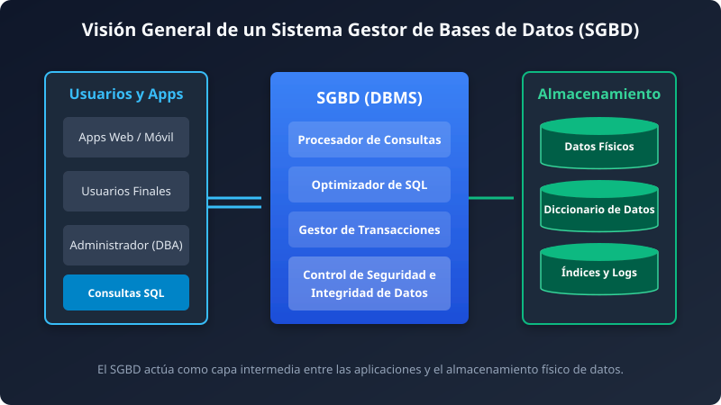
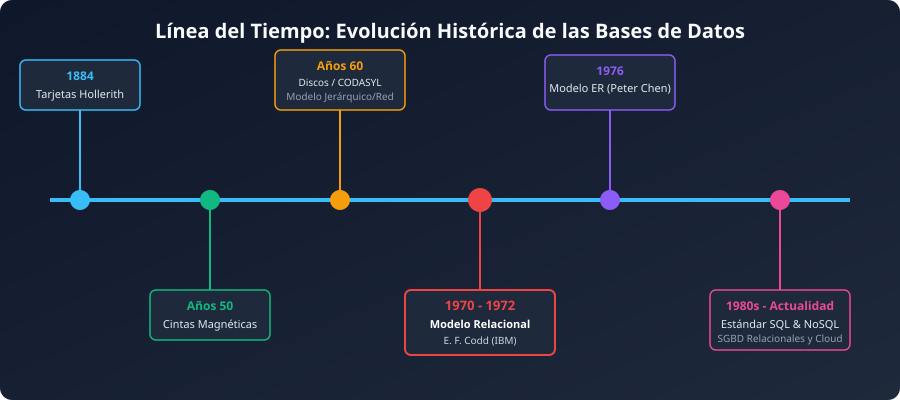
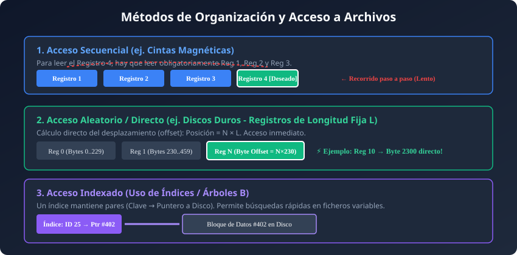
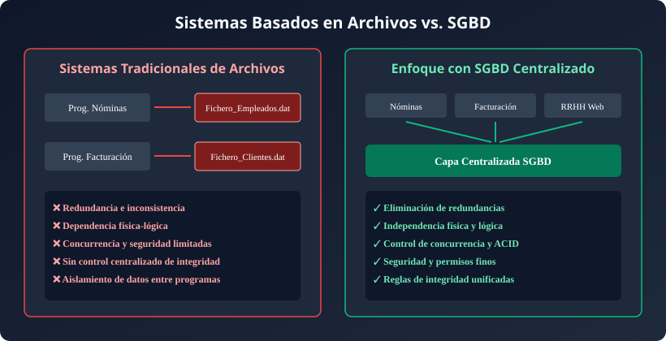
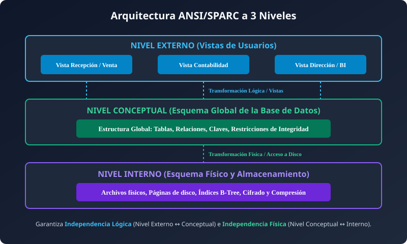
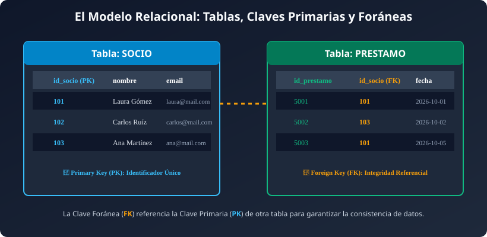
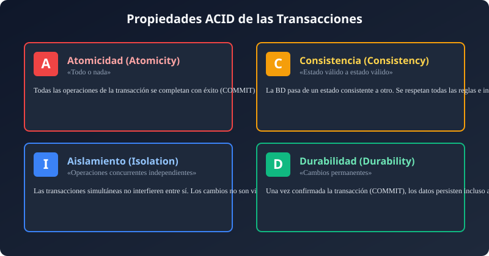
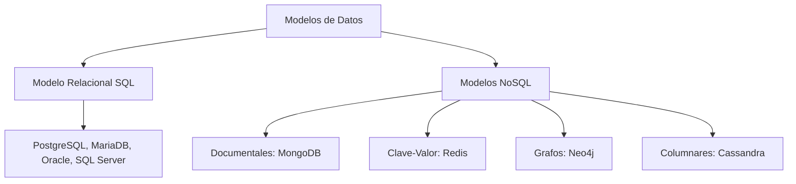
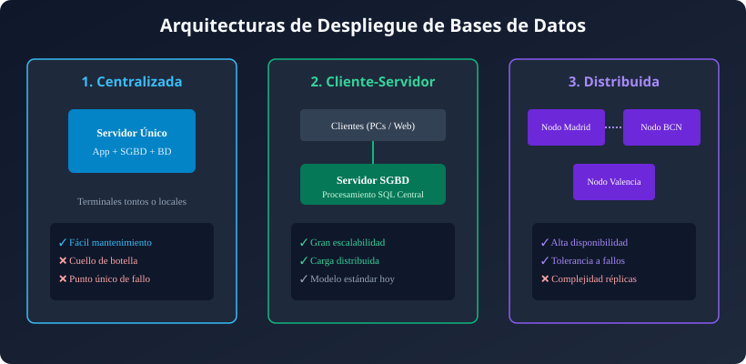

## Resumen del Tema

**Visión General:**
Un **Sistema Gestor de Bases de Datos (SGBD)** es el componente software neurálgico que centraliza, organiza, consulta, mantiene y protege la información en las organizaciones modernas. En los albores de la informática, las aplicaciones gestionaban los datos directamente a través de **sistemas de archivos independientes**, lo que provocaba graves problemas de redundancia, inconsistencia, acoplamiento físico-lógico y fallos de seguridad.

Esta unidad aborda en profundidad la transición histórica desde los soportes físicos primitivos (tarjetas perforadas, cintas magnéticas y discos planos) hacia los SGBD relacionales y NoSQL actuales. Se analizan detalladamente los métodos de organización de archivos (secuenciales, de acceso aleatorio por cálculo de *offset* e indexados mediante árboles B), la arquitectura estándar de tres niveles **ANSI/SPARC**, los componentes internos de un motor de base de datos, las reglas de integridad referencial y de dominio, la gestión de la concurrencia mediante **transacciones ACID**, las políticas de seguridad y recuperación, así como las topologías de despliegue y los subconjuntos del lenguaje SQL.



---

## Índice de Contenidos

- [1. Datos, Información y Representación](#1-datos-información-y-representación)
  - [1.1 La cadena de valor: Dato, Información y Conocimiento](#11-la-cadena-de-valor-dato-información-y-conocimiento)
  - [1.2 Representación Tabular y Tipado de Datos](#12-representación-tabular-y-tipado-de-datos)
- [2. Historia y Evolución de las Bases de Datos](#2-historia-y-evolución-de-las-bases-de-datos)
  - [2.1 Antecedentes Mecánicos y Cintas Magnéticas (1884 - 1950s)](#21-antecedentes-mecánicos-y-cintas-magnéticas-1884---1950s)
  - [2.2 Soportes de Disco y Modelos Pre-Relacionales (1960s)](#22-soportes-de-disco-y-modelos-pre-relacionales-1960s)
  - [2.3 La Revolución Relacional de E. F. Codd (1970s)](#23-la-revolución-relacional-de-e-f-codd-1970s)
  - [2.4 Consolidación de SQL, NoSQL y Cloud (1980s - Actualidad)](#24-consolidación-de-sql-nosql-y-cloud-1980s---actualidad)
- [3. Sistemas Basados en Archivos Tradicionales](#3-sistemas-basados-en-archivos-tradicionales)
  - [3.1 Concepto de Archivo y Clasificación de Formatos](#31-concepto-de-archivo-y-clasificación-de-formatos)
  - [3.2 Métodos de Organización y Acceso Físico](#32-métodos-de-organización-y-acceso-físico)
  - [3.3 Inconvenientes Críticos de la Gestión por Archivos Tradicionales](#33-inconvenientes-críticos-de-la-gestión-por-archivos-tradicionales)
- [4. Bases de Datos y Sistemas Gestores (SGBD)](#4-bases-de-datos-y-sistemas-gestores-sgbd)
  - [4.1 Definición, Conceptos Clave y Funciones de un SGBD](#41-definición-conceptos-clave-y-funciones-de-un-sgbd)
  - [4.2 Análisis Comparativo: Archivos Tradicionales vs SGBD](#42-análisis-comparativo-archivos-tradicionales-vs-sgbd)
  - [4.3 Casos de Uso e Impacto Sectorial en el Mundo Real](#43-casos-de-uso-e-impacto-sectorial-en-el-mundo-real)
- [5. Arquitectura y Componentes de un SGBD](#5-arquitectura-y-componentes-de-un-sgbd)
  - [5.1 La Arquitectura ANSI/SPARC a Tres Niveles](#51-la-arquitectura-ansisparc-a-tres-niveles)
  - [5.2 Tipos de Independencia de Datos](#52-tipos-de-independencia-de-datos)
  - [5.3 Módulos y Componentes Internos del Motor](#53-módulos-y-componentes-internos-del-motor)
  - [5.4 Perfiles de Usuarios y Roles de Trabajo](#54-perfiles-de-usuarios-y-roles-de-trabajo)
- [6. Integridad, Concurrencia y Transacciones](#6-integridad-concurrencia-y-transacciones)
  - [6.1 Reglas de Integridad del Modelo Relacional](#61-reglas-de-integridad-del-modelo-relacional)
  - [6.2 Control de Concurrencia y Anomalías de Lectura/Escritura](#62-control-de-concurrencia-y-anomalías-de-lecturaescritura)
  - [6.3 Transacciones y Propiedades ACID](#63-transacciones-y-propiedades-acid)
- [7. Seguridad, Recuperación y Administración](#7-seguridad-recuperación-y-administración)
  - [7.1 Control de Acceso, Autenticación y Cifrado](#71-control-de-acceso-autenticación-y-cifrado)
  - [7.2 Gestión Segura de Contraseñas (Hashing y Sal)](#72-gestión-segura-de-contraseñas-hashing-y-sal)
  - [7.3 Estrategias de Backup, Logs (WAL) y Recuperación ante Desastres](#73-estrategias-de-backup-logs-wal-y-recuperación-ante-desastres)
- [8. Modelos de Datos, Arquitecturas y Lenguajes](#8-modelos-de-datos-arquitecturas-y-lenguajes)
  - [8.1 Modelos de Datos (Relacional vs NoSQL)](#81-modelos-de-datos-relacional-vs-nosql)
  - [8.2 Topologías y Arquitecturas de Despliegue](#82-topologías-y-arquitecturas-de-despliegue)
  - [8.3 El Lenguaje Estándar SQL: DDL, DML y DCL](#83-el-lenguaje-estándar-sql-ddl-dml-y-dcl)
- [9. Resumen y Conclusiones](#9-resumen-y-conclusiones)
- [10. Autoevaluación y Ejercicios Prácticos Resueltos](#10-autoevaluación-y-ejercicios-prácticos-resueltos)

---

## 1. Datos, Información y Representación

### 1.1 La cadena de valor: Dato, Información y Conocimiento

En el ámbito de las ciencias de la computación y la gestión de bases de datos, es fundamental establecer una distinción conceptual rigurosa entre **dato**, **información** y **conocimiento**:

- **Dato (Data):** Es una representación simbólica (numérica, alfabética, espacial o algorítmica) de un atributo, evento o hecho del mundo real. Por sí solo, un dato carece de contexto, semántica o propósito evaluable.
  - *Ejemplos de datos:* `2026-10-01`, `1200`, `B`.
- **Información (Information):** Nace cuando un conjunto de datos procesados, estructurados y contextualizados adquiere significado para un receptor humano o para un sistema informático, permitiendo reducir la incertidumbre y tomar decisiones.
  - *Ejemplo de información:* "La cita médica del paciente Juan Pérez con el Dr. Martínez (`B`) está programada para el `2026-10-01` a las `12:00` horas".
- **Conocimiento (Knowledge):** Es la integración de múltiples flujos de información combinados con experiencia, reglas de negocio e inferencias lógicas que permiten predecir comportamientos o automatizar acciones complejas.
  - *Ejemplo de conocimiento:* "El 85% de los pacientes que programan citas a las 12:00 horas en el mes de octubre asisten puntualmente si reciben un recordatorio por SMS 24 horas antes".

---

### 1.2 Representación Tabular y Tipado de Datos

Para que un ordenador interprete y almacene la información eficientemente, los datos se organizan en modelos tabulares formados por **filas (registros, tuplas u ocurrencias)** y **columnas (atributos o campos)**:

| Atributo / Campo | Tipo de Dato Lógico | Restricción de Dominio / Regla | Ejemplo de Valor Válido |
| :--- | :--- | :--- | :--- |
| `id_cliente` | Entero (`INT / BIGINT`) | Clave Primaria (`PRIMARY KEY`), Autoincremental, No Nulo. | `10045` |
| `nombre` | Cadena Variable (`VARCHAR(100)`) | No Nulo (`NOT NULL`), Texto en formato UTF-8. | `'Laura Gomez'` |
| `email` | Cadena (`VARCHAR(150)`) | Único (`UNIQUE`), Formato de e-mail válido. | `'laura@ejemplo.com'` |
| `saldo_cuenta` | Decimal Fijo (`DECIMAL(12,2)`) | Mayor o igual a cero (`CHECK (saldo_cuenta >= 0)`). | `1250.75` |
| `fecha_alta` | Fecha Estándar (`DATE`) | Formato ISO `YYYY-MM-DD`, no futura. | `'2026-10-01'` |

#### La Importancia Crítica del Tipado de Datos Correcto

Elegir un tipo de dato inadecuado durante el diseño de la base de datos acarrea consecuencias graves:

1. **Pérdida de Capacidad de Filtrado y Ordenación:** Almacenar fechas como texto plano (`"01/10/2026"`) impide al SGBD aplicar operadores cronológicos (`WHERE fecha BETWEEN ...`) o realizar ordenaciones correctas (en texto, `"01/10/2026"` iría antes que `"02/01/2020"` por orden alfabético).
2. **Desperdicio Masivo de Memoria Secundaria y RAM:** Usar `CHAR(255)` para guardar un código numérico pequeño de 2 dígitos desperdicia cientos de bytes por cada fila, penalizando la memoria caché del motor (*Buffer Pool*) y multiplicando los accesos a disco (*I/O Operations*).
3. **Incapacidad de Garantizar la Integridad:** Permitir cadenas en campos numéricos impide aplicar operaciones aritméticas directas (`SUM`, `AVG`) y expone la base de datos a incoherencias de formato por errores de la aplicación cliente.

---

## 2. Historia y Evolución de las Bases de Datos

El almacenamiento de la información ha experimentado una transformación profunda a lo largo del último siglo, evolucionando desde dispositivos puramente mecánicos y analógicos hasta plataformas relacionales altamente optimizadas y arquitecturas distribuidas en la nube.



### 2.1 Antecedentes Mecánicos y Cintas Magnéticas (1884 - 1950s)

- **1884 — Máquina Tabuladora de Tarjetas Perforadas (Herman Hollerith):**
  Desarrollada para procesar el censo de los Estados Unidos de 1890. Hollerith inventó un sistema donde los datos demográficos se codificaban mediante perforaciones en tarjetas de cartón que eran leídas eléctricamente. Este hito redujo el tiempo de cómputo del censo de 8 años a solo 2, dando origen a la compañía que posteriormente se convertiría en **IBM**.

- **Años 50 — Cintas Magnéticas y Procesamiento en Lote (Batch):**
  Con la llegada de los primeros ordenadores comerciales (como el UNIVAC I), las tarjetas fueron sustituidas por **cintas magnéticas**. Los datos se organizaban en **archivos secuenciales**. Para procesar las nóminas o la contabilidad, el ordenador debía leer la cinta de principio a fin de forma ininterrumpida. Si se requería buscar el registro número 5.000, era físicamente obligatorio avanzar y leer los 4.999 registros precedentes.

---

### 2.2 Soportes de Disco y Modelos Pre-Relacionales (1960s)

El invento del **disco magnético de cabeza móvil** (como el IBM 350) revolucionó la informática al permitir el **acceso aleatorio o directo**: el cabezal podía saltar a cualquier pista y sector de la superficie del disco en milisegundos sin necesidad de recorrer el resto del archivo.

Esta innovación técnica dio lugar a los primeros **Sistemas de Gestión de Bases de Datos (SGBD) pre-relacionales**:

- **Modelo Jerárquico (IBM IMS - 1966):** Los datos se organizaban en una estructura en árbol enraizado formado por registros "padre" y "hijos". Un registro hijo solo podía tener un único padre. Este sistema fue la columna vertebral del programa espacial **Apolo** de la NASA.
- **Modelo en Red (CODASYL DBTG - 1969):** Permitió estructuras de grafos más complejas donde un registro "hijo" podía tener múltiples registros "padres" (relaciones $N:M$).
- **Sistema SABRE (Semi-Automated Business Research Environment):** Creado conjuntamente por IBM y American Airlines, fue el primer sistema de base de datos OLTP (*Online Transaction Processing*) en tiempo real a escala global para la gestión de reservas de vuelos.

*Inconveniente principal:* Tanto el modelo jerárquico como el de red requerían que los programadores conocieran la estructura física exacta de punteros en el disco para escribir código de navegación (*navegación manual de enlaces*). Cualquier cambio en la estructura del disco rompía completamente las aplicaciones.

---

### 2.3 La Revolución Relacional de E. F. Codd (1970s)

En junio de 1970, el matemático e investigador de IBM **Edgar Frank Codd** publicó un artículo histórico titulado *"A Relational Model of Data for Large Shared Data Banks"*. Codd propuso abstraer por completo el almacenamiento físico y representar los datos mediante **relaciones matemáticas (tablas)** formadas por filas y columnas.

#### Principios de la Revolución Relacional

1. **Independencia de Datos:** El usuario declara *QUÉ* datos desea obtener (lenguaje declarativo) y no *CÓMO* navegar físicamente por el disco para encontrarlos.
2. **Fundamentación Matemática:** Basado en la teoría de conjuntos y la lógica de predicados de primer orden.
3. **Prototipos Clave (1974-1979):**
   - **System R (IBM):** Proyecto de investigación en San José que dio origen al lenguaje **SEQUEL** (posteriormente denominado **SQL**).
   - **Ingres (UC Berkeley):** Liderado por Michael Stonebraker, desarrolló el lenguaje QUEL y demostró la viabilidad de los SGBD relacionales de código abierto (origen de PostgreSQL).

---

### 2.4 Consolidación de SQL, NoSQL y Cloud (1980s - Actualidad)

- **Años 80 — Estandarización y Comercialización:** SQL fue adoptado como estándar oficial por **ANSI (1986)** e **ISO (1987)**. Empresas como **Oracle, IBM (DB2), Sybase y Microsoft (SQL Server)** convirtieron los SGBD relacionales en el estándar industrial indiscutible.
- **Años 90 y 2000 — Código Abierto y Web:** Aparición de motores relacionales ligeros y de alto rendimiento de código abierto como **PostgreSQL, MySQL y SQLite**, que impulsaron la explosión de la World Wide Web y los sistemas CMS.
- **Años 2010s — La Era NoSQL y Big Data:** El volumen masivo de datos no estructurados (*Big Data*), la necesidad de escalabilidad horizontal distribuida en miles de servidores y la baja latencia dieron origen a las bases de datos **NoSQL (Not Only SQL)**:
  - *Documentales:* (MongoDB, CouchDB).
  - *Clave-Valor:* (Redis, DynamoDB).
  - *Orientadas a Grafos:* (Neo4j).
  - *Columnares:* (Apache Cassandra).
- **Actualidad — Bases de Datos Multimodelo y Cloud Native:** Motores modernos que combinan soporte SQL estricto con tipos semiestructurados (JSONB), extensiones vectoriales para Inteligencia Artificial (pgvector) y arquitectura escalable sin servidor en la nube (*Serverless/Distributed SQL* como CockroachDB o Amazon Aurora).

---

## 3. Sistemas Basados en Archivos Tradicionales

Antes de la consolidación de los SGBD, las organizaciones gestionaban sus datos mediante ficheros individuales independientes administrados directamente por las rutinas de entrada/salida del Sistema Operativo.

### 3.1 Concepto de Archivo y Clasificación de Formatos

Un **archivo o fichero** es una colección de información estructurada homogénea creada por una aplicación o usuario, almacenada de forma no volátil en un soporte de memoria secundaria (disco duro, SSD, cinta).

#### Clasificación según su Contenido y Propósito

- **Archivos de Configuración:** `.ini`, `.conf`, `.json`, `.yaml`, `.xml`.
- **Código Fuente y Scripts:** `.sql`, `.py`, `.c`, `.java`, `.sh`.
- **Documentos de Texto y Páginas Web:** `.html`, `.css`, `.docx`, `.pdf`, `.txt`.
- **Formatos Multimedia:** `.jpg`, `.png`, `.svg`, `.mp4`, `.wav`.
- **Ejecutables y Archivos de Datos:** `.exe`, `.bin`, `.dat`, `.zip`, `.tar.gz`.

---

### 3.2 Métodos de Organización y Acceso Físico

El método de organización física determina cómo se disponen los registros dentro del archivo y qué algoritmos se utilizan para recuperar la información.



#### 1. Archivos Secuenciales

Los registros se graban uno a continuación de otro en el orden en que son creados.

- **Mecanismo de Acceso:** Para leer el registro $N$, el sistema debe recorrer obligatoriamente los $N-1$ registros precedentes.
- **Medio Físico Típico:** Cintas magnéticas y archivos de registro plano (*Logs*).
- **Eficiencia:** Excelente para procesamientos en lote masivos (*Batch processing*) donde se debe procesar el 100% de los datos. Sin embargo, su rendimiento para consultas interactivas puntuales es desastroso ($\mathcal{O}(N)$).

#### 2. Archivos de Acceso Aleatorio (Directo)

Permiten posicionar el cabezal de lectura/escritura directamente en la ubicación física deseada sin leer el resto del archivo.

- **Requisito Técnico:** Todos los registros dentro del archivo deben tener estrictamente la **misma longitud fija** ($L$).
- **Fórmula Matemática del Desplazamiento Físico (Offset):**
  $$Posición\_Byte = N \times L$$
  *Donde $N$ es el índice del registro deseado (comenzando en 0) y $L$ es la longitud fija del registro expresada en bytes.*

> **Ejemplo Detallado de Cálculo de Offset Físico:**
> Supongamos que definimos la estructura de un cliente con codificación de caracteres ANSI (1 byte por carácter):
>
> - `nombre`: Cadena fija de 80 bytes.
> - `direccion`: Cadena fija de 100 bytes.
> - `localidad`: Cadena fija de 50 bytes.
>
> **Longitud total fija del registro ($L$):**
> $$L = 80 + 100 + 50 = 230\text{ bytes}$$
>
> Si la aplicación necesita leer de forma directa el **Registro número 10** (índice $N=10$):
> $$Posición\_Byte = 10 \times 230 = 2300\text{ bytes}$$
> El sistema operativo ejecuta una llamada al sistema `fseek(file_ptr, 2300, SEEK_SET)` y lee exactamente los 230 bytes comprendidos entre la posición 2300 y 2529.
>
> *Inconveniente del borrado:* Al eliminar el registro 5, no se pueden desplazar todos los registros posteriores porque se rompería el índice $N$. Se suele emplear una técnica de **marca de borrado (Tombstone)** dejando el hueco vacío (relleno de ceros), lo que provoca una alta fragmentación del espacio en disco.

#### 3. Archivos Indexados

Combinan un archivo de datos (que puede contener registros de longitud variable) con uno o varios archivos auxiliares denominados **Índices**.

- **Índice:** Es un archivo secundario altamente optimizado formado por pares `(Clave_de_Búsqueda, Puntero_Físico_a_Disco)`.
- **Estructura Física:** Se organizan mediante estructuras de datos avanzadas como **Árboles B (B-Trees / B+ Trees)** o Tablas Hash.
- **Rendimiento:** Permite realizar búsquedas binarias o por árbol en el índice con complejidad logarítmica ($\mathcal{O}(\log N)$) y saltar inmediatamente a la posición exacta del dato en el disco.

---

### 3.3 Inconvenientes Críticos de la Gestión por Archivos Tradicionales

Cuando cada aplicación informática gestiona sus propios archivos independientes sin la mediación de un SGBD centralizado, surgen problemas de arquitectura insuperables:



1. **Redundancia e Inconsistencia de Datos:**
   Los mismos datos se duplican en múltiples ficheros administrados por distintos departamentos (ej. el teléfono de un cliente se guarda en el archivo del programa de Ventas y en el archivo de Facturación). Si el cliente cambia su número y solo se actualiza en Ventas, la base de datos global entra en estado de **inconsistencia**.

2. **Dependencia Física-Lógica (Acoplamiento Fuerte):**
   La estructura exacta del archivo (campos, desplazamientos, tipos de datos) está codificada directamente en el código fuente de los programas de aplicación. Si el departamento de TI decide añadir el campo `codigo_postal` al fichero, **todos** los programas que leen dicho archivo deben ser modificados, recompilados y testeados de nuevo.

3. **Rigidez y Dificultad para Obtener Nueva Información:**
   Responder a una consulta no prevista en el diseño inicial exige escribir un nuevo programa completo en lenguaje de bajo nivel para recorrer los archivos.

4. **Falta de Control de Concurrencia (Modificación Perdida):**
   Si dos usuarios abren simultáneamente el mismo archivo plano e intentan actualizar el mismo registro al mismo tiempo, el último en guardar sobrescribirá completamente los cambios del primero sin que nadie se percate (*lost update*).

5. **Vulnerabilidad ante Fallos y Pérdida de Atomicidad:**
   Si el sistema sufre un corte de energía mientras la aplicación está modificando un archivo plano, el fichero queda a medio escribir en un estado inservible o corrupto, sin mecanismos automáticos de restauración (*Rollback*).

6. **Seguridad Deficiente e Inexistencia de Reglas de Integridad:**
   Los permisos son los básicos que ofrece el sistema operativo sobre el archivo completo (lectura/escritura). No es posible restringir el acceso a columnas específicas (ej. ocultar el salario) ni forzar reglas de negocio complejas (ej. "el precio no puede ser negativo").

---

## 4. Bases de Datos y Sistemas Gestores (SGBD)

### 4.1 Definición, Conceptos Clave y Funciones de un SGBD

Una **Base de Datos (BD)** es una colección integrada, estructurada e interrelacionada de datos compartidos, almacenados de forma persistente en memoria secundaria con la menor redundancia posible, sirviendo a múltiples aplicaciones de forma simultánea.

Un **Sistema Gestor de Bases de Datos (SGBD / DBMS)** es el conjunto complejo de software especializado que se sitúa como capa intermedia entre la base de datos física, los usuarios y las aplicaciones clientes, proporcionando acceso controlado y seguro.

```text
[ Usuarios / Aplicaciones Web / Móviles ]
                   │
                   ▼ (Consultas SQL / APIs)
┌─────────────────────────────────────────────────────────┐
│         SGBD / DBMS (Engine, Parser, Optimizer)        │
└─────────────────────────────────────────────────────────┘
                   │
                   ▼ (Lectura / Escritura de Páginas)
[ Archivos Físicos de Datos + Diccionario de Metadatos ]
```

#### Funciones Fundamentales que Otorga un SGBD

- **Definición de Esquemas (Función DDL):** Permite especificar estructuras, campos, tipos, claves e índices.
- **Manipulación de Datos (Función DML):** Proporciona un motor de consultas declarativo de alto nivel (SQL) para buscar, insertar, modificar y eliminar datos.
- **Control de Seguridad y Permisos (Función DCL):** Autentica a los usuarios y verifica privilegios a nivel de tabla, fila o columna.
- **Mantenimiento de la Integridad:** Aplica automáticamente las reglas de clave primaria, clave foránea y validaciones de rango.
- **Gestión de Transacciones y Concurrencia:** Garantiza la ejecución segura de operaciones concurrentes mediante bloqueos y aislamiento.
- **Resiliencia y Recuperación ante Fallos:** Mantiene registros de diario (*Write-Ahead Logging*) para asegurar que ningún cambio confirmado se pierda tras un fallo del servidor.

---

### 4.2 Análisis Comparativo: Archivos Tradicionales vs SGBD

| Característica / Criterio | Gestión Tradicional por Archivos Planos | Sistema Gestor de Bases de Datos (SGBD) |
| :--- | :--- | :--- |
| **Redundancia de Datos** | Alta e incontrolada (ficheros duplicados por app). | Mínima, centralizada y estrictamente controlada. |
| **Coherencia / Consistencia** | Muy baja; riesgo constante de incoherencias. | Garantizada mediante transacciones y reglas centralizadas. |
| **Acoplamiento Físico-Lógico** | Total; los cambios físicos exigen reescritura de código. | Inexistente; independencia física y lógica de datos. |
| **Acceso Concurrente** | Inseguro; bloqueos rudimentarios de archivo entero. | Control fino y granular (filas/páginas) mediante ACID/MVCC. |
| **Seguridad y Privacidad** | Control tosco a nivel de fichero por el SO. | Control avanzado por roles, usuarios, vistas y columnas. |
| **Consultas Ad-hoc** | Muy complejas; requieren programar rutinas completas. | Sencillas, rápidas y declarativas mediante lenguaje SQL. |
| **Recuperación ante Fallos** | Manual, lenta y dependiente de copias de seguridad. | Automática e instantánea mediante archivos de diario (*Logs*). |

---

### 4.3 Casos de Uso e Impacto Sectorial en el Mundo Real

1. **Banca y Plataformas Financieras:**
   Procesamiento de transferencias bancarias internacionales en tiempo real. Se exige cumplimiento estricto de la propiedad de **Atomicidad**: restar el dinero de la cuenta origen y sumarlo en la cuenta destino debe ocurrir de forma indivisible.

2. **Cadenas de Supermercados y TPVs:**
   Al escanear un código de barras en la caja registradora, el SGBD lee el precio actualizado de la tabla de productos, descuenta en tiempo real la unidad vendida del inventario del almacén e inserta el ticket en la tabla de ventas dentro de una única transacción.

3. **Sistemas Sanitarios y Hospitalarios:**
   Centralización de la historia clínica electrónica del paciente. Permite que médicos de urgencias, especialistas y laboratorios accedan de forma concurrente a la misma información garantizando niveles de privacidad estrictos (un administrativo de recepción ve la cita pero no el historial médico detallado).

4. **Comercio Electrónico Global (E-Commerce):**
   Gestión de catálogos con millones de referencias, carritos de compra persistentes, procesamiento de pagos con pasarelas externas y recomendaciones personalizadas en tiempo real.

---

## 5. Arquitectura y Componentes de un SGBD

### 5.1 La Arquitectura ANSI/SPARC a Tres Niveles

En 1975, el comité **ANSI/X3/SPARC** (Study Group on Data Base Management Systems) propuso una arquitectura de referencia estructurada en tres niveles de abstracción con el objetivo primario de separar las aplicaciones del almacenamiento físico real:



1. **Nivel Externo (Esquema Externo / Vistas de Usuario):**
   Es el nivel más cercano a los usuarios finales y desarrolladores. Define múltiples **vistas externas** adaptadas a cada perfil. Cada vista muestra únicamente la parcela de la base de datos relevante para dicho usuario, ocultando el resto del esquema por razones de simplicidad y seguridad.

2. **Nivel Conceptual (Esquema Conceptual):**
   Es la representación lógica global y completa de la base de datos. Describe todas las entidades, sus atributos, relaciones, tipos de datos y restricciones de integridad. Es totalmente independiente de los detalles de almacenamiento físico en el disco.

3. **Nivel Interno (Esquema Interno / Físico):**
   Es la representación física de la base de datos en los soportes de almacenamiento secundario. Especifica cómo se organizan físicamente los archivos, el tamaño de las páginas de memoria, los punteros a disco, los índices (B-Tree/Hash), las técnicas de compresión y el cifrado físico.

---

### 5.2 Tipos de Independencia de Datos

El logro fundamental de la arquitectura ANSI/SPARC es la **independencia de datos**, definida como la capacidad de modificar el esquema en un nivel de abstracción sin tener que alterar el esquema del nivel inmediatamente superior:

```text
[ NIVEL EXTERNO ]   <--- (Vistas / Aplicaciones)
       ▲
       │  ===> INDEPENDENCIA LÓGICA DE DATOS
       ▼
[ NIVEL CONCEPTUAL ] <--- (Tablas / Relaciones / Reglas)
       ▲
       │  ===> INDEPENDENCIA FÍSICA DE DATOS
       ▼
[ NIVEL INTERNO ]   <--- (Archivos / Páginas / Índices B-Tree)
```

- **Independencia Lógica de Datos:**
  Es la capacidad de modificar el esquema conceptual (ej. añadir una nueva tabla, agregar una columna a una tabla existente o modificar una regla de dominio) sin obligar a cambiar las vistas externas ni reescribir las aplicaciones clientes que no utilizan dichos campos modificados.

- **Independencia Física de Datos:**
  Es la capacidad de modificar el esquema interno de almacenamiento físico (ej. cambiar los archivos a una nueva unidad SSD más rápida, reorganizar los índices B-Tree, cambiar el factor de empaquetamiento o comprimir datos) sin tener que alterar en absoluto el esquema conceptual ni los programas SQL de las aplicaciones.

---

### 5.3 Módulos y Componentes Internos del Motor

Un motor de base de datos relacional moderno se divide en varios componentes internos altamente optimizados:

1. **Diccionario de Datos (Catálogo del Sistema / Metadatos):**
   Es la "base de datos de la propia base de datos". Guarda información crítica sobre la estructura del sistema: nombres de tablas, columnas, tipos de datos, claves primarias y foráneas, definiciones de vistas, usuarios, roles, privilegios y estadísticas de distribución de datos.

2. **Compilador y Procesador de Consultas (SQL Parser & Translator):**
   Recibe las sentencias SQL escritas por usuarios o aplicaciones, comprueba la sintaxis, valida los nombres de tablas y columnas consultando el Diccionario de Datos y verifica los permisos de ejecución.

3. **Optimizador de Consultas (Query Optimizer):**
   Es el "cerebro" del SGBD. Analiza la consulta SQL y genera múltiples planes de ejecución posibles. Utilizando estadísticas del catálogo (número de filas, cardinalidad, índices disponibles), calcula el coste estimado de E/S y CPU de cada plan y selecciona el **plan de ejecución de menor coste**.

4. **Gestor de Almacenamiento (Storage Engine / Buffer Manager):**
   Administra el intercambio de páginas de datos entre el almacenamiento secundario en disco/SSD y el área de memoria RAM dinámica de alta velocidad del servidor (**Buffer Pool**).

5. **Gestor de Transacciones y Bloqueos (Transaction & Lock Manager):**
   Coordina la ejecución simultánea de transacciones concurrentes aplicando algoritmos de bloqueo (*Locking*) o control de versiones múltiples (*MVCC*) para garantizar el aislamiento.

6. **Gestor de Recuperación y Registro de Diario (Recovery Manager & WAL):**
   Garantiza la durabilidad y la atomicidad escribiendo cada modificación en un archivo de diario persistente en disco (*Write-Ahead Log*) antes de actualizar la página de datos definitiva en la base de datos.

---

### 5.4 Perfiles de Usuarios y Roles de Trabajo

En la gestión de bases de datos intervienen diferentes perfiles profesionales con distintas responsabilidades:

- **Administrador de la Base de Datos (DBA - Database Administrator):**
  Responsable técnico de la instalación, configuración, tuning de rendimiento, políticas de seguridad, estrategia de copias de seguridad (backups), actualización de parches y disponibilidad continua del SGBD.

- **Diseñadores de Bases de Datos:**
  Encargados del análisis de requisitos del negocio y de la elaboración de los esquemas conceptuales (diagramas EER) y lógicos (normalización relacional).

- **Programadores de Aplicaciones:**
  Desarrolladores que construyen la lógica de negocio en lenguajes como Python, Java, C# o Go, interactuando con la base de datos mediante sentencias SQL o librerías ORM (Object-Relational Mapping).

- **Usuarios Avanzados / Analistas de Datos:**
  Profesionales que formulan consultas SQL complejas de forma ad-hoc para extraer métricas, informes de Business Intelligence (BI) y modelos analíticos.

- **Usuarios Finales:**
  Personas que interactúan de forma indirecta con la base de datos a través de formularios e interfaces gráficas web o móviles sin necesidad de conocer la sintaxis SQL.

---

## 6. Integridad, Concurrencia y Transacciones

### 6.1 Reglas de Integridad del Modelo Relacional

Las reglas de integridad son restricciones semánticas fijadas en la definición del esquema para asegurar que los datos almacenados sean siempre exactos, válidos y coherentes:

1. **Regla de Integridad de Entidad (Clave Primaria):**
   Toda tabla relacional debe poseer obligatoriamente una **Clave Primaria (Primary Key - PK)**. Ningún atributo que forme parte de la clave primaria puede tomar valores nulos (`NULL`) ni repetidos en distintas filas.

2. **Regla de Integridad Referencial (Clave Foránea):**
   Si una tabla $B$ contiene una **Clave Foránea (Foreign Key - FK)** que referencia a la clave primaria de una tabla $A$, cualquier valor almacenado en dicha clave foránea debe existir obligatoriamente en la clave primaria de $A$, o bien ser nulo (`NULL`) si la participación es opcional.

3. **Regla de Integridad de Dominio:**
   Todos los valores almacenados en una columna deben pertenecer estrictamente al conjunto de valores permitidos para su tipo de dato y cumplir las restricciones específicas definidas (ej. `NOT NULL`, `CHECK (precio > 0)`, `UNIQUE`).



```sql
-- Ejemplo completo en SQL DDL aplicando reglas de integridad
CREATE TABLE departamento (
    id_departamento INT PRIMARY KEY,
    nombre_dep VARCHAR(100) NOT NULL UNIQUE
);

CREATE TABLE empleado (
    id_empleado INT PRIMARY KEY,
    nombre VARCHAR(100) NOT NULL,
    email VARCHAR(150) NOT NULL UNIQUE,
    salario DECIMAL(10,2) CHECK (salario >= 1080.00),
    id_departamento INT NOT NULL,
    CONSTRAINT fk_emp_dep FOREIGN KEY (id_departamento)
        REFERENCES departamento(id_departamento)
        ON DELETE RESTRICT ON UPDATE CASCADE
);
```

---

### 6.2 Control de Concurrencia y Anomalías de Lectura/Escritura

Cuando decenas o cientos de usuarios ejecutan operaciones de lectura y escritura de forma simultánea sobre la misma base de datos, el SGBD debe intervenir para evitar **anomalías de concurrencia**:

- **Modificación Perdida (Lost Update):**
  Ocurre cuando la transacción $T_1$ lee un registro y la transacción $T_2$ lee el mismo registro inmediatamente después. $T_1$ modifica el registro y guarda. Acto seguido, $T_2$ guarda su modificación basada en la lectura inicial, **sobrescribiendo y anulando** completamente el trabajo realizado por $T_1$.

- **Lectura Sucia (Dirty Read):**
  Ocurre cuando la transacción $T_1$ modifica una fila pero aún no ha confirmado los cambios (`COMMIT`). La transacción $T_2$ lee dicha fila modificada. Si posteriormente $T_1$ sufre un error y ejecuta un `ROLLBACK`, la transacción $T_2$ habrá trabajado con datos falsos que nunca llegaron a existir en la base de datos.

- **Lectura No Repetible (Unrepeatable Read):**
  La transacción $T_1$ lee una fila. A continuación, $T_2$ modifica o elimina esa fila y ejecuta `COMMIT`. Si $T_1$ vuelve a leer la misma fila dentro de su misma sesión, obtendrá valores distintos a los de su primera lectura.

- **Lectura Fantasma (Phantom Read):**
  La transacción $T_1$ ejecuta una consulta que devuelve un conjunto de filas que cumplen una condición (ej. `WHERE salario > 2000`). La transacción $T_2$ inserta una nueva fila que cumple esa condición y confirma. Si $T_1$ repite la consulta, verá aparecer una nueva fila "fantasma".

---

### 6.3 Transacciones y Propiedades ACID

Una **transacción** es una unidad lógica de trabajo (ULT) constituida por un conjunto de sentencias SQL que deben ejecutarse como un bloque atómico e indivisible.



Para garantizar la fiabilidad absoluta, todo SGBD transaccional debe asegurar el cumplimiento estricto de las 4 **propiedades ACID**:

- **A — Atomicidad (Atomicity):**
  Principio del "todo o nada". O se ejecutan con éxito el 100% de las operaciones de la transacción o el SGBD revierte el 100% de las modificaciones mediante un `ROLLBACK`, dejando la base de datos intacta.

- **C — Consistencia (Consistency):**
  La transacción hace pasar la base de datos de un estado consistente válido a otro estado consistente válido. Durante la ejecución de la transacción no se puede violar ninguna regla de integridad de la base de datos.

- **I — Aislamiento (Isolation):**
  Las transacciones ejecutadas de forma concurrente deben ser invisibles entre sí hasta que sean confirmadas. El resultado de ejecutar múltiples transacciones simultáneamente debe ser exactamente el mismo que si se hubieran ejecutado de forma secuencial una tras otra.

- **D — Durabilidad (Durability):**
  Una vez que una transacción se confirma con éxito (`COMMIT`), sus cambios se convierten en permanentes e irreversibles en el almacenamiento persistente, sobreviviendo incluso a caídas totales de alimentación eléctrica o fallos del sistema operativo.

#### Control Práctico de Transacciones mediante SQL

```sql
-- Inicio explícito de transacción bancaria
BEGIN TRANSACTION;

-- Paso 1: Restar 500€ de la Cuenta de Origen
UPDATE cuenta 
SET saldo = saldo - 500.00 
WHERE id_cuenta = 101 AND saldo >= 500.00;

-- Paso 2: Sumar 500€ a la Cuenta de Destino
UPDATE cuenta 
SET saldo = saldo + 500.00 
WHERE id_cuenta = 202;

-- Comprobación de seguridad: Si todo ha ido bien
COMMIT;

-- Si ha ocurrido un fallo de red o falta de saldo:
-- ROLLBACK;
```

---

## 7. Seguridad, Recuperación y Administración

### 7.1 Control de Acceso, Autenticación y Cifrado

El SGBD protege la confidencialidad, disponibilidad e integridad de los datos mediante mecanismos multicapa:

- **Autenticación:** Comprobación rigurosa de la identidad de los usuarios mediante usuario/contraseña, certificados digitales SSL/TLS, tokens de acceso o integración con servicios de directorio LDAP/Active Directory.
- **Autorización y Control de Acceso Basado en Roles (RBAC):** Definición de privilegios granulares. Se crean roles específicos (ej. `rol_ventas`, `rol_auditor`) asignándoles permisos sobre tablas o vistas concretas (`GRANT SELECT, INSERT ON ventas TO rol_ventas`).
- **Cifrado de Datos:**
  - *Cifrado en Tránsito:* Protección de los datos que viajan por la red entre la aplicación y la base de datos mediante TLS/SSL.
  - *Cifrado en Reposo (TDE - Transparent Data Encryption):* Cifrado de los archivos físicos de datos y logs en el disco duro para evitar lecturas si el disco es robado físicamente.

---

### 7.2 Gestión Segura de Contraseñas (Hashing y Sal)

> **Regla de Oro en Seguridad de Bases de Datos:**
> Las contraseñas de los usuarios **NUNCA** deben almacenarse en texto claro ni cifradas mediante algoritmos simétricos reversibles (como AES o RSA) que puedan ser desencriptados si la clave maestra es expuesta.

#### El Esquema Correcto de Almacenamiento de Contraseñas

1. **Uso de Funciones Hash Criptográficas Unidireccionales:** Se aplican funciones diseñadas específicamente para contraseñas como **Argon2id, bcrypt o PBKDF2**.
2. **Inclusión de Sal Aleatoria (Salt):** Antes de calcular el hash, el sistema genera una cadena aleatoria única (*Sal*) para cada usuario y la concatena con la contraseña. Esto evita el uso de **Tablas Rainbow** (tablas precomputadas de contraseñas) y garantiza que dos usuarios con la misma contraseña tengan hashes completamente diferentes almacenados en la base de datos.

```text
Contraseña Usuario ("Secreta123") + Sal Aleatoria ("x9$kL2") 
                      │
                      ▼
       [ Función Hash Especializada: Argon2id ]
                      │
                      ▼
 Hash Resultante: "$argon2id$v=19$m=65536,t=3,p=4$x9$kL2$..."
```

---

### 7.3 Estrategias de Backup, Logs (WAL) y Recuperación ante Desastres

Un plan de administración profesional debe combinar varios tipos de copias de seguridad:

1. **Copia de Seguridad Completa (Full Backup):** Copia íntegra de toda la base de datos y metadatos.
2. **Copia Diferencial:** Guarda únicamente los bloques de datos modificados desde la última copia completa.
3. **Copia Incremental:** Guarda únicamente los cambios producidos desde la última copia (ya sea completa o incremental).
4. **Archivos de Diario y Recuperación en el Punto en el Tiempo (PITR):** El SGBD guarda de forma continua los archivos de transacciones (**Write-Ahead Log - WAL**). En caso de desastre, se restaura la última copia completa y se aplican secuencialmente los logs WAL para recuperar la base de datos exactamente al milisegundo previo a la avería.

> **Principio de Verificación:** Una copia de seguridad no existe realmente hasta que se prueba periódicamente su procedimiento de **restauración completa** en un servidor de pruebas aislado.

---

## 8. Modelos de Datos, Arquitecturas y Lenguajes

### 8.1 Modelos de Datos (Relacional vs NoSQL)



- **Modelo Relacional (SQL):** Basado en tablas, esquemas estrictos y cumplimiento de las propiedades ACID. Ideal para datos estructurados de alta integridad (sistemas bancarios, ERPs, CRM).
- **Modelos NoSQL:** Sacrifican algunas propiedades ACID o el esquema rígido para lograr escalabilidad horizontal masiva en clusters y flexibilidad de datos semiestructurados:
  - *Documentales:* Almacenan información en formato JSON/BSON (MongoDB).
  - *Clave-Valor:* Estructuras Hash en memoria de ultra-alta velocidad (Redis).
  - *Orientados a Grafos:* Modelan nodos y relaciones de forma nativa (Neo4j).

---

### 8.2 Topologías y Arquitecturas de Despliegue



1. **Arquitectura Centralizada:**
   El SGBD, la base de datos física y las aplicaciones residen en un único servidor físico. Típica de entornos legados o de pruebas. Inconveniente: Punto único de fallo (*Single Point of Failure*).

2. **Arquitectura Cliente-Servidor (2 Niveles / 3 Niveles):**
   Los usuarios ejecutan clientes ligeros o aplicaciones web en sus dispositivos (Nivel 1). Estas aplicaciones se conectan a través de la red a un servidor de aplicaciones (Nivel 2) que consulta de forma centralizada al servidor de base de datos (Nivel 3).

3. **Arquitectura Distribuida (Replicación y Fragmentación):**
   La base de datos se distribuye entre múltiples nodos interconectados en red en distintas ubicaciones geográficas. Soporta **Replicación Primario-Réplica** (para lectura intensiva) y **Fragmentación Horizontales/Sharding** (para distribuir grandes volúmenes de datos).

---

### 8.3 El Lenguaje Estándar SQL: DDL, DML y DCL

El lenguaje **SQL (Structured Query Language)** es el estándar universal para interactuar con bases de datos relacionales. Se estructura en tres subconjuntos funcionales:

#### 1. DDL (Data Definition Language - Lenguaje de Definición de Datos)

Utilizado para crear, alterar o eliminar las estructuras y esquemas de la base de datos:

```sql
CREATE TABLE producto (
    id_producto INT PRIMARY KEY,
    nombre VARCHAR(100) NOT NULL,
    precio DECIMAL(10,2) CHECK (precio > 0)
);

ALTER TABLE producto ADD COLUMN stock INT DEFAULT 0;
DROP TABLE producto;
```

#### 2. DML (Data Manipulation Language - Lenguaje de Manipulación de Datos)

Utilizado para consultar, insertar, modificar y borrar las filas de datos:

```sql
INSERT INTO producto (id_producto, nombre, precio, stock) 
VALUES (1, 'Teclado Mecánico', 59.90, 25);

SELECT nombre, precio FROM producto WHERE precio < 100.00 ORDER BY precio ASC;

UPDATE producto SET precio = 49.90 WHERE id_producto = 1;

DELETE FROM producto WHERE stock = 0;
```

#### 3. DCL (Data Control Language - Lenguaje de Control de Datos)

Utilizado para administrar permisos y seguridad de acceso de los usuarios:

```sql
GRANT SELECT, INSERT ON producto TO usuario_ventas;

REVOKE DELETE ON producto FROM usuario_ventas;
```

---

## 9. Resumen y Conclusiones

- Los **SGBD** sustituyeron con éxito a la gestión tradicional por archivos independientes al eliminar la redundancia incontrolada, garantizar la consistencia y desacoplar la estructura física del código de las aplicaciones.
- Los métodos de acceso a archivos evolucionaron desde la lectura **secuencial** estricta hasta el **acceso directo** por cálculo de offset ($Posición = N \times L$) y los **archivos indexados** estructurados mediante árboles B.
- La **arquitectura ANSI/SPARC a 3 niveles** establece la independencia lógica y física de datos, permitiendo evolucionar el almacenamiento sin romper las aplicaciones existentes.
- La integridad de los datos se sostiene sobre las reglas de **Clave Primaria (PK)**, **Clave Foránea (FK)** y **restricciones de Dominio**.
- Las **transacciones ACID** son la garantía absoluta contra las anomalías de concurrencia y los fallos de energía en sistemas críticos.

---

## 10. Autoevaluación y Ejercicios Prácticos Resueltos

### 1. Pregunta Teórica: Justificación de SGBD vs Archivos

**Pregunta:** Explique dos razones fundamentales por las cuales una aplicación bancaria no puede implementar su almacenamiento directamente sobre archivos planos `.dat`.
> **Solución Explicada:**
>
> 1. *Falta de Control de Concurrencia y Transacciones (ACID):* Si dos clientes realizan reintegros simultáneos sobre la misma cuenta en archivos planos, se produciría la anomalía de *Modificación Perdida* (*Lost Update*), o si el servidor sufre un apagón durante la escritura, el archivo quedaría corrupto sin posibilidad de `ROLLBACK`.
> 2. *Inexistencia de Reglas de Integridad Centralizadas:* En archivos planos, la validación de que el saldo no sea negativo debe programarse manualmente en cada aplicación. Si se crea un nuevo programa y se olvida dicha validación, la base de datos queda expuesta a inconsistencias insalvables.

---

### 2. Ejercicio Práctico de Cálculo Físico de Offset

**Enunciado:** Un archivo de datos de acceso aleatorio almacena registros de clientes con una longitud fija de $180\text{ bytes}$ por registro (indexados a partir del registro $0$).

- a) Calcule el byte exacto donde comienza el registro número 15.
- b) Muestre la fórmula aplicada y explique qué requisito técnico es obligatorio para que este cálculo sea válido.

> **Solución Paso a Paso:**
>
> - a) **Cálculo del desplazamiento (Offset):**
>   $$Posición\_Byte = N \times L$$
>   $$Posición\_Byte = 15 \times 180 = 2700\text{ bytes}$$
>   *El registro número 15 comienza exactamente en el byte 2700 de la estructura del archivo.*
>
> - b) **Requisito Técnico:** Es estrictamente obligatorio que **TODOS los registros del archivo tengan exactamente la misma longitud fija ($L = 180\text{ bytes}$)**. Si existiera un solo registro de longitud variable, la fórmula matemática fallaría y el cabezal leería bytes corruptos.

---

### 3. Análisis de Independencia en ANSI/SPARC

**Pregunta:** Si un Administrador de Base de Datos (DBA) crea un nuevo índice B-Tree sobre la columna `email` para acelerar las consultas:

- ¿Qué nivel de la arquitectura ANSI/SPARC se modifica?
- ¿Es necesario reescribir las sentencias SQL `SELECT` de las aplicaciones web que consultan por email? ¿Qué principio de independencia se cumple?

> **Solución Explicada:**
>
> - Se modifica el **Nivel Interno (Esquema Físico)** al añadir una nueva estructura de acceso en el disco.
> - **NO** es necesario reescribir ninguna sentencia SQL. Las consultas siguen siendo exactamente iguales (`SELECT * FROM usuario WHERE email = ...`). El optimizador de consultas detectará automáticamente el nuevo índice y lo utilizará. Esto demuestra el principio de **Independencia Física de Datos**.
