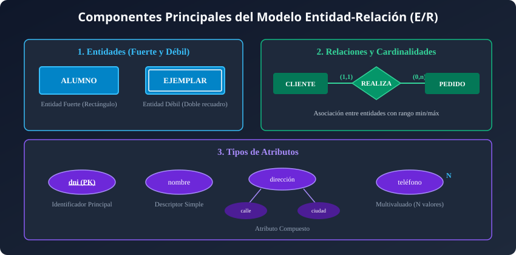
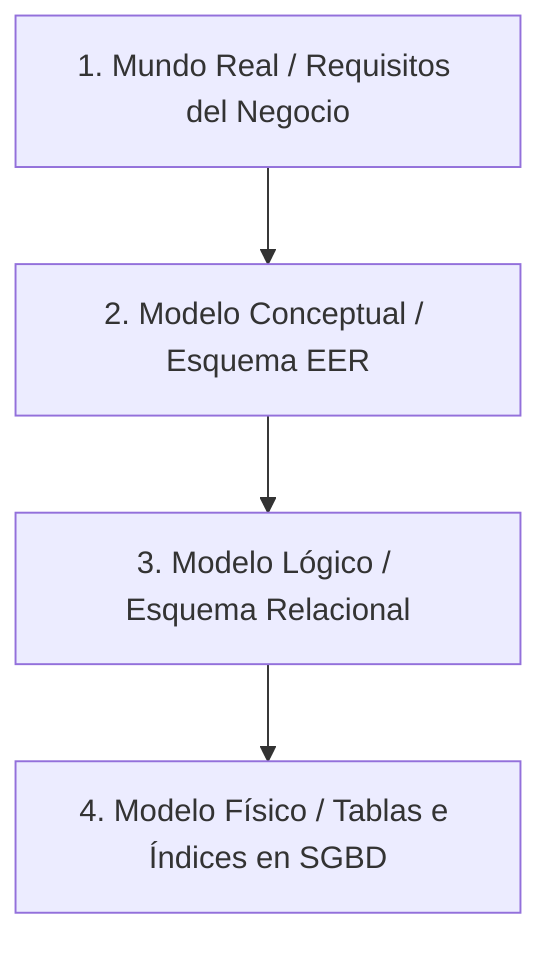
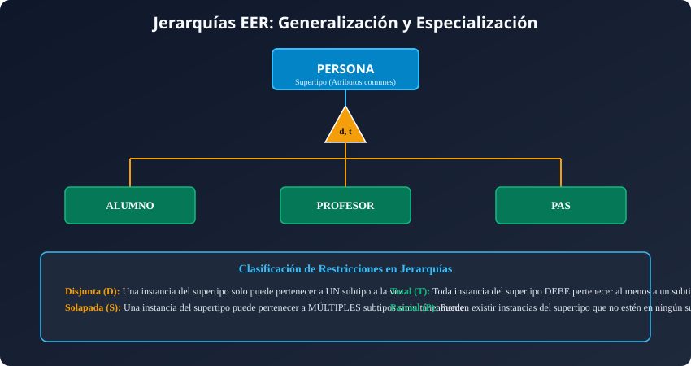
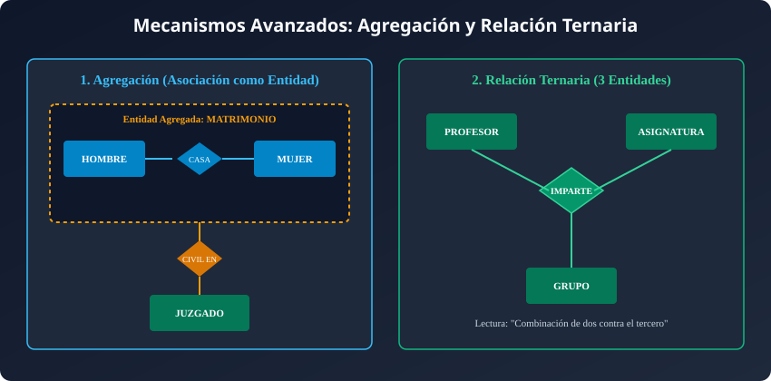
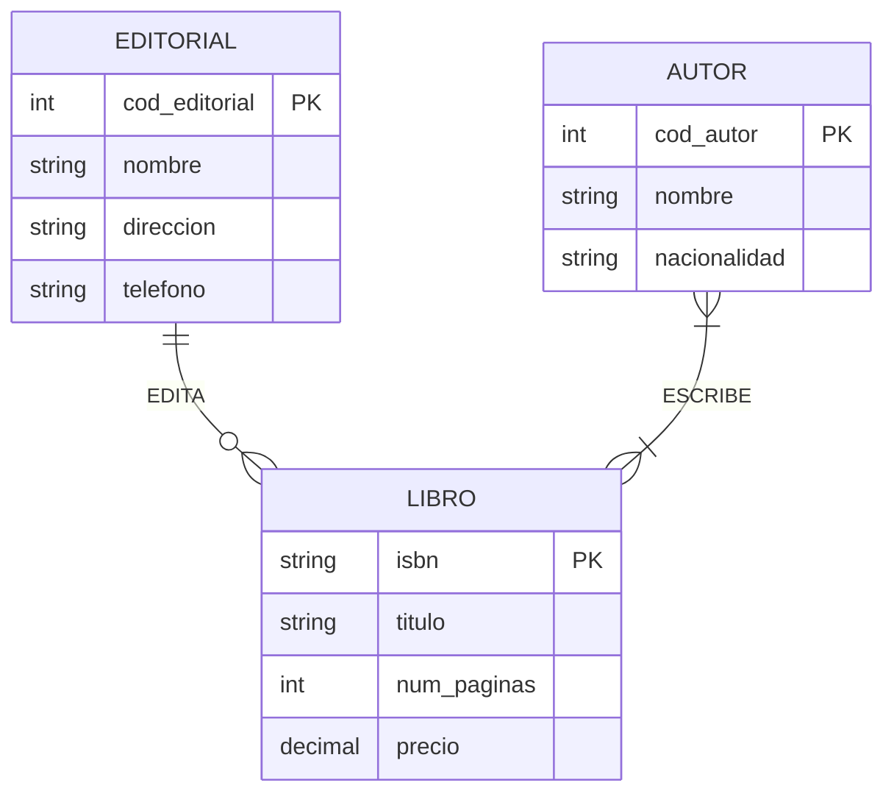
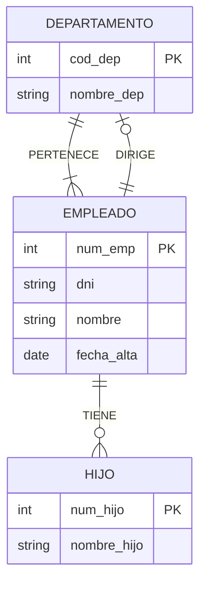
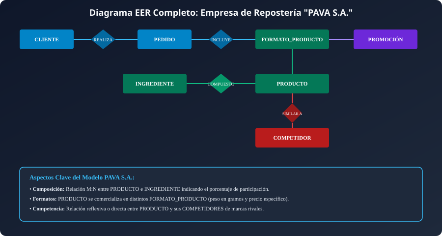

## Resumen del Tema

**Visión General:**
El **Modelo Entidad-Relación Extendido (EER)**, introducido originalmente por Peter Chen en 1976 y refinado posteriormente con potentes mecanismos semánticos de abstracción de datos, constituye el estándar de industria indiscutible para el **diseño conceptual de bases de datos**.

Su objetivo prioritario es modelar y estructurar la semántica de la información del mundo real de forma completamente abstracta e independiente del software informático o Sistema Gestor de Bases de Datos (SGBD) que se utilice en la fase de implementación. En esta unidad se analiza de forma exhaustiva el flujo de trabajo del diseño de datos, los componentes elementales del modelo (**entidades fuertes y débiles, atributos clasificatorios y relaciones**), las reglas minuciosas de **cardinalidad e integridad**, las jerarquías de **generalización y especialización** con herencia de atributos, el concepto de **agregación**, el cálculo formal de cardinalidades en **relaciones ternarias** y una metodología estructurada en 5 pasos respaldada por casos prácticos reales completos.



---

## Índice de Contenidos

- [Resumen del Tema](#resumen-del-tema)
- [Índice de Contenidos](#índice-de-contenidos)
- [1. Etapas en el Análisis y Diseño de Datos](#1-etapas-en-el-análisis-y-diseño-de-datos)
  - [1.1 El Ciclo de Vida del Diseño de Bases de Datos](#11-el-ciclo-de-vida-del-diseño-de-bases-de-datos)
  - [1.2 Los Cuatro Niveles de Abstracción](#12-los-cuatro-niveles-de-abstracción)
- [2. El Modelo Conceptual Entidad-Relación (E/R)](#2-el-modelo-conceptual-entidad-relación-er)
  - [2.1 Entidades: Fuertes, Débiles e Instancias](#21-entidades-fuertes-débiles-e-instancias)
    - [Clasificación de Entidades por su Dependencia de Existencia](#clasificación-de-entidades-por-su-dependencia-de-existencia)
  - [2.2 Atributos: Clasificación, Estructura y Dominio](#22-atributos-clasificación-estructura-y-dominio)
    - [Clasificación Completa de Atributos](#clasificación-completa-de-atributos)
  - [2.3 Relaciones: Grado, Semántica y Nombres de Rol](#23-relaciones-grado-semántica-y-nombres-de-rol)
    - [El Grado de la Relación](#el-grado-de-la-relación)
  - [2.4 Restricciones de Cardinalidad (Mínima y Máxima)](#24-restricciones-de-cardinalidad-mínima-y-máxima)
    - [1. Cardinalidad Mínima ($0$ o $1$)](#1-cardinalidad-mínima-0-o-1)
    - [2. Cardinalidad Máxima ($1$ o $N$)](#2-cardinalidad-máxima-1-o-n)
- [3. Restricciones Avanzadas sobre Relaciones](#3-restricciones-avanzadas-sobre-relaciones)
  - [3.1 Exclusividad y Exclusión](#31-exclusividad-y-exclusión)
  - [3.2 Inclusividad e Inclusión](#32-inclusividad-e-inclusión)
- [4. Extensiones del Modelo (EER)](#4-extensiones-del-modelo-eer)
  - [4.1 Generalización y Especialización (Mecanismo de Herencia)](#41-generalización-y-especialización-mecanismo-de-herencia)
  - [4.2 Clasificación de Jerarquías (Total/Parcial, Disjunta/Solapada)](#42-clasificación-de-jerarquías-totalparcial-disjuntasolapada)
    - [Dimensión 1: Cobertura (Total o Parcial)](#dimensión-1-cobertura-total-o-parcial)
    - [Dimensión 2: Solapamiento (Disjunta o Solapada)](#dimensión-2-solapamiento-disjunta-o-solapada)
    - [Combinación de las Cuatro Clases de Jerarquía](#combinación-de-las-cuatro-clases-de-jerarquía)
  - [4.3 Agregación: Modelado de Asociaciones como Entidades](#43-agregación-modelado-de-asociaciones-como-entidades)
    - [¿Por qué es necesaria la Agregación?](#por-qué-es-necesaria-la-agregación)
  - [4.4 Relaciones Ternarias y Análisis Formal de Cardinalidad](#44-relaciones-ternarias-y-análisis-formal-de-cardinalidad)
    - [Metodología Formal de Cálculo](#metodología-formal-de-cálculo)
    - [Clasificación por Conectividad Máxima](#clasificación-por-conectividad-máxima)
- [5. Fases en la Construcción del Esquema Conceptual](#5-fases-en-la-construcción-del-esquema-conceptual)
- [6. Ejemplos Prácticos Completos Resueltos](#6-ejemplos-prácticos-completos-resueltos)
  - [6.1 Ejemplo 1: Gestión de Librería y Editoriales](#61-ejemplo-1-gestión-de-librería-y-editoriales)
  - [6.2 Ejemplo 2: Gestión Interna de Empresa y Departamentos](#62-ejemplo-2-gestión-interna-de-empresa-y-departamentos)
  - [6.3 Ejemplo 3: Organización de un Congreso Científico](#63-ejemplo-3-organización-de-un-congreso-científico)
  - [6.4 Ejemplo 4: Empresa de Repostería "PAVA S.A."](#64-ejemplo-4-empresa-de-repostería-pava-sa)
    - [Especificaciones del Modelo PAVA S.A](#especificaciones-del-modelo-pava-sa)
- [7. Resumen y Conclusiones](#7-resumen-y-conclusiones)
- [8. Autoevaluación y Ejercicios Prácticos Resueltos](#8-autoevaluación-y-ejercicios-prácticos-resueltos)
  - [1. Pregunta Teórica: Entidades Débiles](#1-pregunta-teórica-entidades-débiles)
  - [2. Análisis de Jerarquía EER](#2-análisis-de-jerarquía-eer)
  - [3. Ejercicio Práctico de Diseño EER](#3-ejercicio-práctico-de-diseño-eer)

---

## 1. Etapas en el Análisis y Diseño de Datos

### 1.1 El Ciclo de Vida del Diseño de Bases de Datos

El diseño de una base de datos no es una actividad improvisada, sino un proceso de ingeniería de software estructurado que traduce un problema del mundo real en estructuras de información eficientes y sin redundancias.

Intentar construir una base de datos directamente en el SGBD (escribiendo código SQL `CREATE TABLE`) sin realizar previamente un modelado conceptual riguroso conduce inevitablemente a **errores graves de arquitectura**: tablas mal estructuradas, claves duplicadas, pérdida de relaciones esenciales y redundancia incontrolada.

---

### 1.2 Los Cuatro Niveles de Abstracción

El proceso completo de diseño se divide en cuatro fases sucesivas e interconectadas:



1. **Entorno del Mundo Real (Fase de Requisitos):**
   Consiste en la recolección, análisis e interpretación de las necesidades de información de la organización a través de entrevistas con los usuarios, formularios existentes, albaranes y reglas de negocio. El resultado de esta fase es un documento en lenguaje natural denominado **Especificación de Requisitos de Software (ERS)**.

2. **Modelo Conceptual (Esquema Conceptual EER):**
   Se sintetizan las especificaciones del mundo real en un diagrama gráfico normalizado (Diagrama Entidad-Relación Extendido). Este esquema representa la estructura semántica de los datos de forma totalmente **independiente del SGBD** y del soporte tecnológico que se vaya a utilizar.

3. **Modelo Lógico (Esquema Lógico / Relacional):**
   Se transforma el esquema conceptual EER a las estructuras propias del paradigma del SGBD elegido. En las bases de datos relacionales, esto implica aplicar reglas formales de paso de E/R a tablas, claves primarias (`PK`), claves foráneas (`FK`) y procesos de **normalización** (1FN, 2FN, 3FN).

4. **Modelo Físico (Esquema Físico SQL):**
   Se traducen las tablas lógicas a código ejecutable en el SGBD destino (sentencias SQL DDL) definiendo los tipos de datos físicos concretos (`VARCHAR`, `NUMERIC`), métodos de almacenamiento, factor de empaquetamiento, particionamiento e índices B-Tree/Hash.

---

## 2. El Modelo Conceptual Entidad-Relación (E/R)

### 2.1 Entidades: Fuertes, Débiles e Instancias

Una **entidad** es cualquier objeto, persona, lugar, concepto abstracto o evento del mundo real que posee existencia distinguible y sobre el cual la organización necesita almacenar información en la base de datos.

- **Tipo de Entidad (Clase o Conjunto de Entidades):** Es la abstracción genérica que define la estructura común de un grupo de objetos homogéneos. Se representa gráficamente mediante un **rectángulo** con el nombre en letras mayúsculas, formato singular y sin abreviaturas (ej. `ALUMNO`, `EMPLEADO`, `FACTURA`).
- **Instancia u Ocurrencia:** Es un elemento individual concreto que pertenece a dicho tipo de entidad (ej. dentro de la entidad `ALUMNO`, una instancia específica es el alumno con DNI `12345678A` llamado *Juan Pérez*).

#### Clasificación de Entidades por su Dependencia de Existencia

- **Entidad Fuerte (Regular o Principal):**
  Posee existencia propia e independiente en el sistema. Sus instancias se identifican unívocamente mediante sus propios atributos identificadores (clave primaria) sin requerir la presencia de otras entidades (ej. `CLIENTE`, `PRODUCTO`, `LIBRO`).

- **Entidad Débil:**
  No puede exigit rm -r --ignore-unmatch content.es/UD01 content.es/UD02 content.es/UD03 content.es/UD04 content.es/UD05 content.es/UD06 content.val/U01stir de forma autónoma en la base de datos. Su presencia depende de la existencia previa de una entidad fuerte principal (denominada *Entidad Propietaria* o *Padre*). Si una instancia de la entidad fuerte es eliminada, todas las instancias de la entidad débil vinculadas a ella carecen de sentido y deben ser eliminadas en cascada. Se representa gráficamente mediante un **doble recuadro**.

> **Ejemplo de Entidad Débil:**
> La entidad `EJEMPLAR` respecto a la entidad fuerte `LIBRO`. La biblioteca posee la obra intelectual "Don Quijote de la Mancha" (`LIBRO` fuerte), pero físicamente dispone de 5 copias en la estantería (`EJEMPLAR` débil). Si la obra deja de prestarse y se borra de la base de datos, todos sus ejemplares físicos asociados desaparecen automáticamente.

---

### 2.2 Atributos: Clasificación, Estructura y Dominio

Un **atributo** es cada una de las propiedades, características o cualidades cualitativas o cuantitativas que describen a un tipo de entidad o a una relación.

El **dominio** de un atributo es el conjunto de todos los valores atómicos válidos que dicho atributo puede tomar legalmente (ej. el dominio de `fecha_nacimiento` es el conjunto de fechas válidas no futuras).

#### Clasificación Completa de Atributos

1. **Atributo Identificador Principal (Clave Primaria - PK):**
   Atributo o conjunto mínimo de atributos cuyos valores garantizan distinguir de forma única e irrepetible cada instancia dentro de la entidad. Se representa mediante el **nombre del atributo subrayado**. Un identificador no puede tomar nunca valores nulos (`NOT NULL`).

2. **Atributo Identificador Alternativo (Clave Alternativa):**
   Atributo candidato que también podría identificar unívocamente a cada instancia pero no ha sido seleccionado como clave primaria. Se representa mediante **subrayado discontinuo** (ej. en `PERSONA`, si el `id_persona` es la PK, el `dni` o el `num_seguridad_social` son claves alternativas).

3. **Atributo Descriptor (Simple o Escalar):**
   Atributo convencional que aporta información descriptiva no identificadora y almacena un único valor atómico (ej. `nombre`, `precio`, `edad`).

4. **Atributo Compuesto (Estructurado):**
   Atributo que se puede descomponer de forma jerárquica en varios sub-atributos simples con significado propio. Se representa como un árbol de elipses (ej. el atributo `dirección` se subdivide en `calle`, `número`, `piso`, `código_postal` y `ciudad`).

5. **Atributo Multivaluado:**
   Atributo que puede albergar una lista de múltiples valores para una misma instancia de entidad. Se indica mediante una etiqueta $N$ sobre la línea del atributo o mediante una doble elipse (ej. una persona que posee varios números de `teléfono` o varias direcciones de `email`).

6. **Atributo Derivado (Calculado):**
   Atributo cuyo valor no se almacena físicamente, sino que se calcula dinámicamente a partir de otros atributos guardados en la base de datos (ej. el atributo `edad` se calcula restando la `fecha_nacimiento` de la fecha actual). Se representa con una **elipse discontinua**.

---

### 2.3 Relaciones: Grado, Semántica y Nombres de Rol

Una **relación** es una asociación o interrelación semántica que conecta dos o más tipos de entidades dentro del modelo. Se representa gráficamente mediante un **rombo** etiquetado con un verbo descriptivo en mayúsculas (ej. `COMPRA`, `TRABAJA`, `PERTENECE`).

#### El Grado de la Relación

El **grado** indica el número de entidades distintas que participan en la asociación:

- **Grado 1 — Relación Reflexiva (Recursiva):** Asocia instancias de una misma entidad consigo misma. En estas relaciones es obligatorio especificar el **nombre de rol** que desempeña cada participante en la asociación.
  - *Ejemplo:* La relación `SUPERVISA` sobre la entidad `EMPLEADO`. Un empleado juega el rol de *Jefe* y otros empleados juegan el rol de *Subordinados*.
- **Grado 2 — Relación Binaria:** Asocia dos entidades distintas (es la forma más habitual en el modelado, ej. `CLIENTE` `REALIZA` `PEDIDO`).
- **Grado 3 — Relación Ternaria:** Asocia simultáneamente tres entidades distintas (ej. `PROFESOR`, `ASIGNATURA` y `GRUPO` en la relación `IMPARTE`).

---

### 2.4 Restricciones de Cardinalidad (Mínima y Máxima)

La **cardinalidad** de una relación expresa los límites cuantitativos de participación de las instancias de las entidades en la asociación.

Para cada entidad que participa en una relación, la cardinalidad se define como un par de valores expresado en el formato:
$$(Cardinalidad\_Mínima, Cardinalidad\_Máxima)$$

```text
ENTIDAD_A ──────(min_a, max_a)────── < RELACIÓN > ──────(min_b, max_b)────── ENTIDAD_B
```

#### 1. Cardinalidad Mínima ($0$ o $1$)

- **$0$ (Participación Opcional o Parcial):** Una instancia de la entidad puede existir en la base de datos sin necesidad de estar asociada con ninguna instancia de la otra entidad.
- **$1$ (Participación Obligatoria, Total o Existencial):** Toda instancia de la entidad debe estar asociada obligatoriamente al menos con una instancia de la otra entidad.

#### 2. Cardinalidad Máxima ($1$ o $N$)

- **Relación Uno a Uno ($1:1$):** Una instancia de $A$ se relaciona como máximo con una instancia de $B$, y viceversa.
- **Relación Uno a Muchos ($1:N$):** Una instancia de $A$ puede relacionarse con múltiples instancias de $B$, pero una instancia de $B$ solo puede relacionarse con una de $A$.
- **Relación Muchos a Muchos ($N:M$):** Una instancia de $A$ se relaciona con múltiples instancias de $B$, y una de $B$ se relaciona con múltiples instancias de $A$.

> **Regla Mnemotécnica de Lectura de Cardinalidades:**
> Para determinar la cardinalidad de la `ENTIDAD_A` respecto a la `ENTIDAD_B` en la relación `R`, nos formulamos dos preguntas situándonos mentalmente en una instancia de `ENTIDAD_A`:
>
> 1. *¿Con cuántas instancias de `ENTIDAD_B` puede asociarse como MÍNIMO una instancia de `ENTIDAD_A`?* $
ightarrow Cardinalidad\_Mínima$.
> 2. *¿Con cuántas instancias de `ENTIDAD_B` puede asociarse como MÁXIMO una instancia de `ENTIDAD_A`?* $
ightarrow Cardinalidad\_Máxima$.

---

## 3. Restricciones Avanzadas sobre Relaciones

En modelos conceptuales complejos donde existen múltiples relaciones cruzadas entre entidades, se pueden especificar restricciones semánticas avanzadas:

### 3.1 Exclusividad y Exclusión

- **Restricción de Exclusividad:**
  Se aplica entre dos o más relaciones ($R_1$ y $R_2$) que parten de una misma entidad $A$. Indica que una instancia de $A$ puede participar en la relación $R_1$ o en la relación $R_2$, pero **nunca en ambas al mismo tiempo**.

  - *Ejemplo Real:* Un `PROFESOR` puede la relación `IMPARTE` respecto a un `CURSO` o la relación `RECIBE` (como alumno), pero si en un cuatrimestre imparte un curso, no puede simultáneamente recibirlo como estudiante.
- **Restricción de Exclusión:**
  Indica que si un par específico de instancias $(A_1, B_1)$ está vinculado a través de la relación $R_1$, ese mismo par exacto tiene prohibido estar vinculado mediante la relación $R_2$.

---

### 3.2 Inclusividad e Inclusión

- **Restricción de Inclusividad:**
  Indica que para que una instancia de la entidad $A$ participe en la relación $R_1$, es condición obligatoria que participe también en la relación $R_2$.

- **Restricción de Inclusión:**
  Se aplica sobre los pares de instancias relacionadas. Si la pareja $(A_1, B_1)$ está asociada mediante la relación $R_1$, es estrictamente obligatorio que dicha pareja $(A_1, B_1)$ esté previamente relacionada en $R_2$.

---

## 4. Extensiones del Modelo (EER)

### 4.1 Generalización y Especialización (Mecanismo de Herencia)

El Modelo Entidad-Relación Extendido (EER) incorpora conceptos orientados a objetos para gestionar jerarquías de clases de entidades:



- **Supertipo (Entidad Genérica):** Es la entidad de nivel superior que contiene los atributos comunes (incluyendo la clave primaria) y las relaciones generales que comparten todas las variantes.
- **Subtipo (Entidad Especializada):** Es una entidad de nivel inferior que representa una subclase o variante específica del supertipo.
- **El Principio de Herencia:** Todo subtipo hereda automáticamente **todos los atributos** (identificadores y descriptores) y **todas las relaciones** del supertipo. Los subtipos solo deben definir sus atributos y relaciones exclusivos.
- **Especialización (Enfoque Top-Down):** Proceso de diseño descendente en el que se parte de una entidad supertipo y se identifican subgrupos especializados con propiedades exclusivas.
- **Generalización (Enfoque Bottom-Up):** Proceso de diseño ascendente en el que se observan múltiples entidades con atributos repetidos y se abstrae una entidad supertipo común.

---

### 4.2 Clasificación de Jerarquías (Total/Parcial, Disjunta/Solapada)

Atendiendo a las reglas de pertenencia de las instancias del supertipo a los subtipos, se definen dos dimensiones independientes:

#### Dimensión 1: Cobertura (Total o Parcial)

- **Total ($T$):** Toda instancia del supertipo DEBE pertenecer obligatoriamente al menos a uno de los subtipos.
- **Parcial ($P$):** Pueden existir instancias en el supertipo que no pertenezcan a ningún subtipo especializado.

#### Dimensión 2: Solapamiento (Disjunta o Solapada)

- **Disjunta ($D$):** Una instancia del supertipo puede pertenecer como MÁXIMO a un único subtipo (subtipos mutuamente excluyentes).
- **Solapada ($S$):** Una instancia del supertipo puede pertenecer SIMULTÁNEAMENTE a varios subtipos.

#### Combinación de las Cuatro Clases de Jerarquía

1. **Total y Disjunta $(T, D)$:** Toda instancia del supertipo pertenece a **un y solo un** subtipo.
   - *Ejemplo:* La entidad `PERSONA` dividida en `HOMBRE` y `MUJER`.
2. **Parcial y Disjunta $(P, D)$:** Una instancia del supertipo puede no estar en ningún subtipo, pero si está, solo puede pertenecer a **uno**.
   - *Ejemplo:* La entidad `VEHÍCULO` especializada en `TURISMO` y `CAMIÓN` (pueden existir vehículos en la base de datos que sean motocicletas sin subtipo específico).
3. **Parcial y Solapada $(P, S)$:** Una instancia puede no estar en ningún subtipo o pertenecer a **múltiples** a la vez.
   - *Ejemplo:* La entidad `EMPLEADO` especializada en `PROGRAMADOR` y `DIRECTOR` (un empleado puede ser solo programador, o simultáneamente programador y director).
4. **Total y Solapada $(T, S)$:** Toda instancia debe pertenecer al menos a un subtipo y puede estar en **múltiples** simultáneamente.

---

### 4.3 Agregación: Modelado de Asociaciones como Entidades



La **agregación** es una abstracción que permite considerar una relación entre dos entidades junto con dichas entidades como si fuera una **entidad de orden superior (entidad agregada)**, haciendo posible que esta estructura completa se relacione a su vez con otra tercera entidad.

#### ¿Por qué es necesaria la Agregación?

Cuando se intenta modelar una situación donde una relación solo tiene sentido para ciertas combinaciones sin forzar una relación ternaria completa.

> **Ejemplo Clásico de Agregación:**
> Consideremos la relación `CASADO_CON` entre las entidades `HOMBRE` y `MUJER`. Un matrimonio civil requiere ser registrado en un `JUZGADO`. No todas las parejas se casan por lo civil (algunas lo hacen por la iglesia). Si creáramos una relación ternaria entre `HOMBRE`, `MUJER` y `JUZGADO`, obligaríamos erróneamente a que *todos* los matrimonios registraran un juzgado.
> **Solución con Agregación:** Encapsulamos la relación `CASADO_CON` dentro de una caja de **Entidad Agregada** llamada `MATRIMONIO`. Posteriormente, relacionamos la entidad agregada `MATRIMONIO` con la entidad `JUZGADO` mediante la relación opcional `REGISTRADO_EN`.

---

### 4.4 Relaciones Ternarias y Análisis Formal de Cardinalidad

Una **relación ternaria** asocia tres entidades de forma indivisible. Para determinar sus cardinalidades con rigor, se aplica el método de **fijar un par de entidades y analizar el rango del extremo libre**:

#### Metodología Formal de Cálculo

Fijamos una instancia de $A$ y una instancia de $B$ simultáneamente, y nos preguntamos:

- *¿Con cuántas instancias de $C$ se puede asociar la pareja $(A, B)$ como mínimo y como máximo?* $
ightarrow (min, max)$ sobre $C$.

#### Clasificación por Conectividad Máxima

1. **Conectividad $1:1:1$:**
   Cualquier combinación de dos entidades se asocia como máximo con **una** instancia de la tercera entidad.

2. **Conectividad $1:1:N$:**
   La pareja de entidades $(A, B)$ se asocia con **múltiples** instancias de $C$. Sin embargo, las parejas $(A, C)$ y $(B, C)$ se asocian con como máximo **una** instancia de la entidad restante.

3. **Conectividad $1:N:M$:**
   La pareja $(A, B)$ se asocia con múltiples instancias de $C$, y la pareja $(A, C)$ se asocia con múltiples instancias de $B$. Solo la pareja $(B, C)$ se limita a una única instancia de $A$.

4. **Conectividad $N:M:P$:**
   Cualquier combinación de parejas de dos entidades puede asociarse con **múltiples** instancias de la tercera entidad libre.

---

## 5. Fases en la Construcción del Esquema Conceptual

Para elaborar un esquema conceptual EER profesional a partir de un texto de requisitos, se debe aplicar una metodología en 5 pasos:

1. **Paso 1: Identificación y Selección de Entidades:**
   Buscar sustantivos comunes que representen objetos con propiedades de interés. Descartar sustantivos que representen valores simples o instancias.

2. **Paso 2: Definición de Claves Primarias e Identificadores:**
   Asignar atributos identificadores unívocos (`PK`) a cada entidad. Identificar si existen entidades débiles que requieran claves compuestas con la entidad fuerte.

3. **Paso 3: Establecimiento de Relaciones y Cardinalidades:**
   Identificar verbos de acción que conecten las entidades. Para cada relación, calcular minuciosamente las cardinalidades $(min, max)$ en ambos sentidos.

4. **Paso 4: Asignación de Atributos y Dominio:**
   Colocar los atributos descriptores en sus entidades correspondientes. Si un atributo depende de la combinación de dos entidades (ej. `fecha_alquiler` o `nota_examen`), debe colocarse directamente en la **relación**.

5. **Paso 5: Optimización y Eliminación de Redundancias:**
   Revisar el diagrama para detectar relaciones transitivas redundantes (relaciones que pueden deducirse combinando otras asociaciones) y simplificar el modelo.

---

## 6. Ejemplos Prácticos Completos Resueltos

### 6.1 Ejemplo 1: Gestión de Librería y Editoriales

**Enunciado de Requisitos:**
Se requiere diseñar el esquema conceptual para la gestión de una librería. De cada `LIBRO` se conoce su ISBN (clave primaria), título, número de páginas y precio. Cada libro es editado por una única `EDITORIAL` (código, nombre, dirección y teléfono). Una editorial puede editar muchos libros. Un libro puede ser escrito por varios `AUTOR` (código, nombre, nacionalidad) y un autor puede escribir varios libros.



---

### 6.2 Ejemplo 2: Gestión Interna de Empresa y Departamentos

**Enunciado de Requisitos:**
Diseñar la base de datos de una empresa. Se almacena información de `EMPLEADO` (número de empleado, DNI, nombre, dirección y fecha de alta). Los empleados están adscritos a un `DEPARTAMENTO` (código de departamento, nombre). Un empleado pertenece a un único departamento y en un departamento trabajan varios empleados. Un empleado puede ser jefe de un departamento. De los empleados se registran sus `HIJO` (entidad débil con número de hijo y nombre) para el control de beneficios sociales.



---

### 6.3 Ejemplo 3: Organización de un Congreso Científico

**Enunciado de Requisitos:**
Un congreso científico necesita organizar sus actividades. Se registran los `PARTICIPANTE` (código, nombre, dirección, país). Los participantes pueden presentar `PONENCIA` (título identificador, número de páginas). Una ponencia es escrita por uno o varios participantes. A cada ponencia se le asignan varios participantes como revisores. Las ponencias se presentan en `SESIÓN` (número de sesión, fecha, hora). Una sesión alberga varias ponencias pero una ponencia solo se expone en una sesión.

---

### 6.4 Ejemplo 4: Empresa de Repostería "PAVA S.A."



#### Especificaciones del Modelo PAVA S.A

1. **PRODUCTO e INGREDIENTE:** Relación $N:M$ denominada `COMPUESTO_POR` que contiene el atributo descriptor `porcentaje` para indicar la participación de cada ingrediente en la receta.
2. **FORMATOS:** La entidad `PRODUCTO` se comercializa en distintos `FORMATO_PRODUCTO` (peso en gramos y precio específico de venta).
3. **CLIENTE y PEDIDO:** Un `CLIENTE` realiza múltiples `PEDIDO`. Cada pedido incluye varias líneas de detalle solicitando unidades específicas de un producto en un formato determinado.
4. **COMPETIDORES:** Relación de seguimiento de productos similares lanzados por marcas rivales en el mercado.

---

## 7. Resumen y Conclusiones

- El **Modelo EER** es el lenguaje gráfico conceptual estándar para abstraer los requisitos del mundo real hacia un esquema de base de datos riguroso.
- Las **entidades débiles** dependen de una entidad fuerte y forman claves compuestas para garantizar la integridad existencial.
- Las **jerarquías de generalización/especialización** evitan la duplicación de código mediante el principio de **herencia de atributos**.
- La **agregación** y las **relaciones ternarias** permiten resolver semánticas de asociación complejas sin distorsionar las cardinalidades.
- Una metodología rigurosa en 5 pasos garantiza que la posterior traducción al **modelo relacional** produzca tablas bien estructuradas y normalizadas.

---

## 8. Autoevaluación y Ejercicios Prácticos Resueltos

### 1. Pregunta Teórica: Entidades Débiles

**Pregunta:** Explique la diferencia entre dependencia de existencia y dependencia de identificación en una entidad débil.
> **Solución Explicada:**
>
> - *Dependencia de Existencia:* Ocurre cuando las instancias de la entidad débil no pueden sobrevivir en la base de datos si se elimina la instancia de la entidad fuerte relacionada (ej. si se elimina un `CONTRATO`, desaparecen sus `PAGOS` asociados).
> - *Dependencia de Identificación:* Ocurre cuando la entidad débil no posee un atributo identificador propio suficiente para ser clave primaria, por lo que necesita combinar su identificador parcial (discriminador) con la clave primaria de la entidad fuerte propietaria.

---

### 2. Análisis de Jerarquía EER

**Pregunta:** En una empresa, la entidad `EMPLEADO` se especializa en `INFORMÁTICO` y `ADMINISTRATIVO`. Clasifique la jerarquía según sus restricciones si se establece que:

- a) Todo empleado debe ser obligatoriamente informático o administrativo.
- b) Un empleado puede desempeñar simultáneamente labores de informático y administrativo.

> **Solución Explicada:**
>
> - a) Dado que todo empleado debe estar al menos en una subclase, la cobertura es **Total ($T$)**.
> - b) Dado que puede pertenecer a ambas subclases a la vez, el solapamiento es **Solapado ($S$)**.
> - **Clasificación Resultante:** Jerarquía **Total y Solapada $(T, S)$**.

---

### 3. Ejercicio Práctico de Diseño EER

**Enunciado:** Diseñe el esquema conceptual para un hospital. Se registran `PACIENTE` (NSS, nombre) y `MÉDICO` (número de colegiado, nombre, especialidad). Un médico atiende a múltiples pacientes y un paciente puede ser atendido por distintos médicos. De cada atención médica se desea registrar la `fecha_consulta` y el `diagnóstico`.

> **Solución Explicada:**
>
> - **Entidades:** `PACIENTE` (PK: `NSS`) y `MÉDICO` (PK: `num_colegiado`).
> - **Relación:** `ATIENDE` entre `MÉDICO` y `PACIENTE`.
> - **Cardinalidades:**
>   - `MÉDICO` respecto a `ATIENDE`: $(0, N)$ (un médico puede no haber atendido pacientes aún o atender a muchos).
>   - `PACIENTE` respecto a `ATIENDE`: $(1, N)$ (un paciente debe haber sido atendido al menos una vez y puede ser visto por varios médicos).
> - **Atributos de la Relación:** Como un mismo médico puede atender al mismo paciente en fechas distintas con diagnósticos diferentes, los atributos `fecha_consulta` y `diagnóstico` se colocan directamente en la relación $N:M$ `ATIENDE`.
