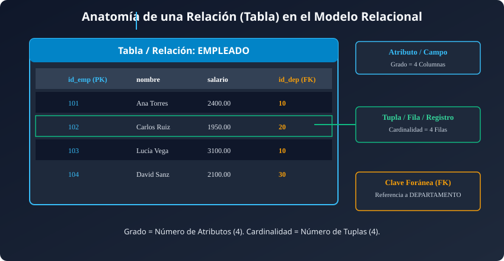
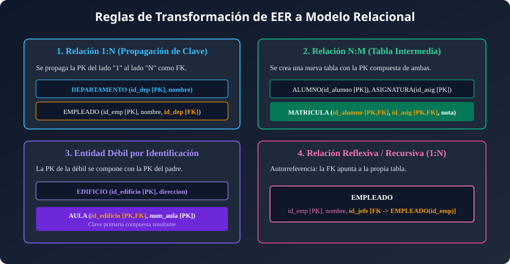

## Resumen del Tema

**Visión General:**
El **Modelo Relacional**, ideado por Edgar F. Codd en IBM en 1970, es el modelo de datos lógico más extendido y utilizado comercialmente en el mundo de las bases de datos. A diferencia del Modelo Entidad-Relación (EER), que es una herramienta de abstracción conceptual para representar la información del mundo real de forma independiente del software, el Modelo Relacional representa la estructura lógica de los datos mediante **relaciones (tablas)** compuestas por **tuplas (filas)** y **atributos (columnas)**.

En esta unidad se estudian minuciosamente los conceptos matemáticos y pragmáticos que sustentan el modelo relacional: la estructura formal de una tabla, el dominio y tipado de atributos, el grado y la cardinalidad, las claves (candidatas, primarias, alternativas y foráneas), la semántica de los valores nulos (`NULL`) y las reglas de integridad (inherentes y semánticas). Además, se detalla un catálogo completo de **reglas de transformación para convertir esquemas conceptuales EER en esquemas relacionales lógicos**, ilustrado con abundantes ejemplos reales, esquemas formales, sentencias SQL DDL y tablas con datos reales.



---

## Índice de Contenidos

- [1. Conceptos Fundamentales del Modelo Relacional](#1-conceptos-fundamentales-del-modelo-relacional)
  - [1.1 Definición de Relación (Tabla)](#11-definición-de-relación-tabla)
  - [1.2 Atributos, Dominios, Grado y Cardinalidad](#12-atributos-dominios-grado-y-cardinalidad)
  - [1.3 Tuplas (Filas) y Semántica de Valores Nulos (NULL)](#13-tuplas-filas-y-semántica-de-valores-nulos-null)
- [2. Estudio Exhaustivo de Claves](#2-estudio-exhaustivo-de-claves)
  - [2.1 Clave Candidata y Clave Primaria (Primary Key - PK)](#21-clave-candidata-y-clave-primaria-primary-key---pk)
  - [2.2 Claves Alternativas](#22-claves-alternativas)
  - [2.3 Clave Foránea / Ajena (Foreign Key - FK)](#23-clave-foránea--ajena-foreign-key---fk)
  - [2.4 Claves Primarias Compuestas](#24-claves-primarias-compuestas)
- [3. Restricciones del Modelo Relacional](#3-restricciones-del-modelo-relacional)
  - [3.1 Restricciones Inherentes al Modelo](#31-restricciones-inherentes-al-modelo)
  - [3.2 Restricciones Semánticas o de Usuario (PK, UNIQUE, NOT NULL, CHECK)](#32-restricciones-semánticas-o-de-usuario-pk-unique-not-null-check)
  - [3.3 Integridad Referencial y Políticas de Borrado/Modificación](#33-integridad-referencial-y-políticas-de-borradomodificación)
- [4. Reglas de Transformación del Modelo EER al Modelo Relacional](#4-reglas-de-transformación-del-modelo-eer-al-modelo-relacional)
  - [4.1 Transformación de Entidades Fuertes](#41-transformación-de-entidades-fuertes)
  - [4.2 Transformación de Entidades Débiles (por Identificación y Existencia)](#42-transformación-de-entidades-débiles-por-identificación-y-existencia)
  - [4.3 Transformación de Atributos Compuestos y Multivaluados](#43-transformación-de-atributos-compuestos-y-multivaluados)
  - [4.4 Transformación de Relaciones Binarias 1:N](#44-transformación-de-relaciones-binarias-1n)
  - [4.5 Transformación de Relaciones Binarias N:M](#45-transformación-de-relaciones-binarias-nm)
  - [4.6 Transformación de Relaciones Binarias 1:1](#46-transformación-de-relaciones-binarias-11)
  - [4.7 Transformación de Relaciones Reflexivas / Recursivas](#47-transformación-de-relaciones-reflexivas--recursivas)
  - [4.8 Transformación de Relaciones Ternarias](#48-transformación-de-relaciones-ternarias)
  - [4.9 Transformación de Jerarquías de Generalización / Especialización](#49-transformación-de-jerarquías-de-generalización--especialización)
- [5. Colección Abundante de Ejemplos de Transformación Completa](#5-colección-abundante-de-ejemplos-de-transformación-completa)
  - [5.1 Ejemplo Completo 1: Gestión de Departamento y Empleados](#51-ejemplo-completo-1-gestión-de-departamento-y-empleados)
  - [5.2 Ejemplo Completo 2: Sistema Académico (Alumnos, Asignaturas y Matriculación)](#52-ejemplo-completo-2-sistema-académico-alumnos-asignaturas-y-matriculación)
  - [5.3 Ejemplo Completo 3: Edificios y Aulas (Entidad Débil por Identificación)](#53-ejemplo-completo-3-edificios-y-aulas-entidad-débil-por-identificación)
  - [5.4 Ejemplo Completo 4: Jerarquía de Empleados y Jefes (Relación Reflexiva)](#54-ejemplo-completo-4-jerarquía-de-empleados-y-jefes-relación-reflexiva)
  - [5.5 Ejemplo Completo 5: Venta de Automóviles y Revisiones en Taller](#55-ejemplo-completo-5-venta-de-automóviles-y-revisiones-en-taller)
- [6. Resumen y Conclusiones](#6-resumen-y-conclusiones)
- [7. Autoevaluación y Ejercicios Prácticos Resueltos](#7-autoevaluación-y-ejercicios-prácticos-resueltos)

---

## 1. Conceptos Fundamentales del Modelo Relacional

### 1.1 Definición de Relación (Tabla)

En el Modelo Relacional, la unidad básica de almacenamiento es la **relación**, término matemático que en la práctica informática se denomina **tabla**.

Una relación se define como un subconjunto del producto cartesiano de una familia de dominios $D_1 \times D_2 \times \dots \times D_n$. Gráficamente, una relación es una estructura bidimensional formada por filas y columnas:

- **Diferencia Crucial de Términos:** En el Modelo Entidad-Relación (EER), la palabra *"Relación"* se refiere a una asociación o vínculo entre dos entidades (ej. el cliente `COMPRA` productos). En cambio, en el Modelo Relacional, la palabra *"Relación"* designa a una **tabla completa de datos**.

---

### 1.2 Atributos, Dominios, Grado y Cardinalidad

Para caracterizar matemáticamente una tabla se utilizan los siguientes conceptos:

1. **Atributo (Campo o Columna):** Representa una propiedad o característica de la entidad o relación que describe la tabla. Cada columna tiene un nombre único en la tabla y un tipo de dato especificado.
2. **Dominio:** Es el conjunto finito de todos los valores atómicos válidos del mismo tipo que un atributo puede albergar. Varios atributos distintos pueden compartir el mismo dominio (por ejemplo, `fecha_contrato` y `fecha_nacimiento` comparten el dominio `DATE`).
3. **Grado:** Es el número total de atributos (columnas) que componen la tabla. Una tabla con 5 columnas tiene un **grado de 5**.
4. **Cardinalidad:** Es el número total de tuplas (filas o registros) almacenadas en un momento determinado en la tabla. A diferencia del grado (que es fijo una vez diseñado el esquema), la cardinalidad es dinámica y varía constantemente a medida que se insertan o borran filas.

---

### 1.3 Tuplas (Filas) y Semántica de Valores Nulos (NULL)

- **Tupla (Fila, Registro u Ocurrencia):** Cada fila individual de la tabla representa una instancia concreta de la entidad o relación del mundo real. Cada tupla está formada por una lista ordenada de valores, donde cada valor corresponde a un atributo específico.
- **Valores Nulos (`NULL`):** Representan la **ausencia de valor**, valor desconocido o no aplicable.
  - *Diferencia Semántica Importante:* El valor `NULL` no equivale al número cero (`0`) ni a una cadena de texto vacía (`""`). Un cero en `saldo` significa que el saldo es de 0 euros; un `NULL` en `saldo` significa que se desconoce el saldo.

---

## 2. Estudio Exhaustivo de Claves

Las claves constituyen el pilar fundamental para garantizar la unicidad de las filas y establecer vínculos de integridad entre tablas.



### 2.1 Clave Candidata y Clave Primaria (Primary Key - PK)

- **Clave Candidata:** Es un atributo o conjunto mínimo de atributos cuyos valores identifican de forma única e unívoca cada tupla de una relación, sin que ningún subconjunto propio de dichos atributos pueda identificarla.
- **Clave Primaria (Primary Key - PK):** Es la clave candidata elegida explícitamente por el diseñador de la base de datos como el identificador principal de las tuplas de la tabla. Por regla absoluta del modelo relacional, **ningún atributo de la clave primaria puede contener valores nulos (`NOT NULL`) ni duplicados**.

---

### 2.2 Claves Alternativas

Cualquier clave candidata que no haya sido elegida como clave primaria pasa a ser una **clave alternativa**. En el esquema relacional y en la implementación SQL, las claves alternativas se protegen mediante la restricción de unicidad `UNIQUE`.

> **Ejemplo:** En la tabla `CLIENTE`, si disponemos del campo `id_cliente` (autoincremental interno) y del campo `dni`, ambos son claves candidatas. Elegimos `id_cliente` como **Clave Primaria (PK)** e indicamos que `dni` es una **Clave Alternativa (`UNIQUE`)**.

---

### 2.3 Clave Foránea / Ajena (Foreign Key - FK)

Una **Clave Foránea (Foreign Key - FK)** es un atributo (o conjunto de atributos) en una tabla cuyos valores deben coincidir obligatoriamente con los valores de la clave primaria de otra tabla (o de la misma tabla en relaciones reflexivas), o bien ser nulos si la participación es opcional.

Las claves foráneas representan las relaciones del modelo EER en el esquema relacional lógico.

---

### 2.4 Claves Primarias Compuestas

Cuando una única columna no basta para identificar de forma unívoca a una fila, la clave primaria se compone de dos o más atributos combinados.

> **Ejemplo de Clave Compuesta:**
> En una tabla de matrícula universitaria `MATRICULA`, la clave primaria se compone de `(id_alumno, id_asignatura)`. Un alumno puede matricularse en varias asignaturas y en una asignatura hay varios alumnos, pero la combinación de un alumno concreto en una asignatura concreta es única.

---

## 3. Restricciones del Modelo Relacional

### 3.1 Restricciones Inherentes al Modelo

Son reglas estructurales impuestas automáticamente por la propia definición matemática del modelo relacional:

1. **Unicidad de Tuplas:** No pueden existir dos tuplas idénticas en una misma relación (deben diferenciarse al menos en la clave primaria).
2. **Desorden de Tuplas:** El orden en que se almacenan las filas no es significativo. La consulta devuelve los mismos datos independientemente de cómo se dispongan en el disco.
3. **Desorden de Atributos:** El orden de las columnas no altera el significado semántico de la relación.
4. **Atomicidad de Atributos (Atributos Escalares):** Cada celda de la tabla en la intersección de una fila y una columna solo puede albergar un **único valor atómico** perteneciente al dominio (no se permiten listas ni matrices dentro de una celda).

---

### 3.2 Restricciones Semánticas o de Usuario (PK, UNIQUE, NOT NULL, CHECK)

Son reglas de negocio definidas explícitamente por el diseñador de la base de datos utilizando el lenguaje SQL DDL:

- `PRIMARY KEY`: Define la clave primaria (garantiza unicidad y no nulidad).
- `UNIQUE`: Define claves alternativas (garantiza que no haya valores duplicados, aunque admite nulos si la norma del SGBD lo permite).
- `NOT NULL`: Obliga a que un atributo sea siempre informado.
- `CHECK`: Define una condición lógica que debe cumplirse para cada fila (ej. `CHECK (precio > 0)` o `CHECK (edad >= 18)`).

---

### 3.3 Integridad Referencial y Políticas de Borrado/Modificación

La **Integridad Referencial** exige que los valores almacenados en una clave foránea (`FK`) existan previamente en la clave primaria (`PK`) de la tabla referenciada.

Cuando se intenta eliminar o actualizar una fila en la tabla padre (la tabla que contiene la `PK`), el SGBD puede aplicar una de las siguientes 4 **políticas de integridad referencial**:

1. **En Cascada (`ON DELETE CASCADE / ON UPDATE CASCADE`):**
   Al borrar o modificar una tupla en la tabla padre, el SGBD borra o actualiza automáticamente todas las tuplas de la tabla hija que contenían esa clave foránea.

2. **Restringido (`ON DELETE RESTRICT / ON UPDATE RESTRICT`):**
   El SGBD impide y rechaza el borrado o modificación de la tupla padre mientras existan tuplas hijas que la estén referenciando.

3. **Puesta a Nulos (`ON DELETE SET NULL / ON UPDATE SET NULL`):**
   Al borrar o actualizar la tupla padre, el SGBD establece automáticamente a `NULL` el valor de la clave foránea en todas las tuplas hijas afectadas.

4. **Puesta a Valor por Defecto (`ON DELETE SET DEFAULT / ON UPDATE SET DEFAULT`):**
   Al borrar o actualizar la tupla padre, el SGBD asigna un valor por defecto previamente configurado a la clave foránea en las tuplas hijas.

---

## 4. Reglas de Transformación del Modelo EER al Modelo Relacional

Para transformar de forma metódica un diagrama EER conceptual a un esquema relacional lógico, se aplican las siguientes reglas estandarizadas:

---

### 4.1 Transformación de Entidades Fuertes

- **Regla:** Cada entidad fuerte del diagrama EER se convierte en una **tabla (relación)** independiente.
  - Los atributos simples de la entidad pasan a ser **columnas** de la tabla.
  - El atributo identificador principal de la entidad pasa a ser la **Clave Primaria (PK)** de la tabla.
  - Las claves alternativas pasan a protegerse con la restricción `UNIQUE`.

#### Esquema Notacional Formal

$$\text{ENTIDAD}(\underline{\text{id\_entidad}}, \text{atributo1}, \text{atributo2})$$

---

### 4.2 Transformación de Entidades Débiles (por Identificación y Existencia)

- **Regla:** Una entidad débil se convierte en una **tabla independiente**.
  - **Débil por Identificación:** La clave primaria de la tabla resultante es una **clave compuesta** formada por la clave primaria de la entidad fuerte propietaria (que se propaga como `FK`) combinada con el discriminador parcial de la entidad débil.
  - **Débil por Existencia:** Si la entidad débil posee su propio identificador único, la clave primaria de la entidad fuerte se propaga como `FK NOT NULL` con política de borrado en cascada (`ON DELETE CASCADE`).

#### Esquema Notacional Formal (Débil por Identificación)

$$\text{ENTIDAD\_DÉBIL}(\underline{\text{id\_padre}}, \underline{\text{id\_parcial\_débil}}, \text{atributo1})$$
$$\text{FK: id\_padre } \rightarrow \text{ENTIDAD\_PADRE}(\text{id\_padre}) \text{ ON DELETE CASCADE}$$

---

### 4.3 Transformación de Atributos Compuestos y Multivaluados

1. **Atributos Compuestos:** Se eliminan desplegando cada uno de sus sub-atributos simples como columnas individuales de la propia tabla.
2. **Atributos Multivaluados ($N$):** Se crea una **nueva tabla independiente** para albergar el atributo multivaluado. La clave primaria de esta nueva tabla será la combinación de la clave primaria de la entidad originaria y el propio atributo multivaluado.

#### Esquema Notacional Formal (Atributo Multivaluado)

$$\text{ENTIDAD\_TELÉFONO}(\underline{\text{id\_persona}}, \underline{\text{numero\_telefono}}, \text{tipo\_linea})$$
$$\text{FK: id\_persona } \rightarrow \text{PERSONA}(\text{id\_persona}) \text{ ON DELETE CASCADE}$$

---

### 4.4 Transformación de Relaciones Binarias 1:N

- **Regla (Propagación de Clave):** No se crea una nueva tabla. Se toma la clave primaria de la entidad del lado "1" y se **propaga como clave foránea (`FK`)** a la tabla resultante de la entidad del lado "N".
- Si la relación contenía atributos descriptores propios, estos se trasladan también como columnas a la tabla del lado "N".
- Si la participación del lado "N" es obligatoria (cardinalidad mínima 1), la `FK` debe configurarse como `NOT NULL`.

---

### 4.5 Transformación de Relaciones Binarias N:M

- **Regla (Tabla Intermedia / Junta):** Se crea obligatoriamente una **nueva tabla de relación**.
  - La clave primaria de esta nueva tabla es una **clave compuesta** formada por la unión de las claves primarias de ambas entidades participantes.
  - Cada una de estas claves funciona por separado como clave foránea (`FK`) hacia su tabla correspondiente.
  - Los atributos propios de la relación $N:M$ se incorporan como columnas de esta nueva tabla.

---

### 4.6 Transformación de Relaciones Binarias 1:1

Existen 3 alternativas según las cardinalidades mínimas de participación:

1. **Participación (0,1) en ambos lados:** Se crea una tabla intermedia de relación con la clave primaria de cualquiera de las dos entidades como `PK` y la otra como `UNIQUE` (clave alternativa).
2. **Participación (0,1) en un lado y (1,1) en el otro:** Se propaga la clave de la entidad con participación (1,1) hacia la tabla de la entidad con participación (0,1) como `FK` protegida con `UNIQUE`.
3. **Participación (1,1) en ambos lados:** Ambas entidades pueden unificarse en una **única tabla sólida** que agrupa todos los atributos de ambas entidades.

---

### 4.7 Transformación de Relaciones Reflexivas / Recursivas

1. **Reflexiva 1:N:** Se añade una columna de clave foránea (`FK`) en la propia tabla que **apunta a la clave primaria de la misma tabla** (autorreferencia).
2. **Reflexiva N:M:** Se crea una **tabla intermedia** cuya clave primaria se compone de dos columnas que hacen clave foránea hacia la clave primaria de la propia tabla (representando el rol origen y el rol destino).

---

### 4.8 Transformación de Relaciones Ternarias

- **Ternaria N:N:N:** Se crea una tabla intermedia cuya `PK` es la combinación de las claves primarias de las tres entidades participantes.
- **Ternaria 1:1:1 o 1:1:N:** Se crea una tabla intermedia de relación propagando las tres claves primarias, determinando la `PK` compuesta según los lados de cardinalidad máxima $N$.

---

### 4.9 Transformación de Jerarquías de Generalización / Especialización

Existen 3 estrategias relacionales para transformar jerarquías EER:

1. **Opción A (Tabla Única para toda la Jerarquía):** Se crea una sola tabla con todos los atributos del supertipo y de los subtipos, añadiendo una columna discriminadora de tipo (`tipo_subtipo`). Válida para especializaciones disjuntas.
2. **Opción B (Tablas para el Supertipo y cada Subtipo):** Se crea una tabla para el supertipo (con la `PK` principal) y una tabla por cada subtipo (cuya `PK` y `FK` es la clave del supertipo). Es la solución más limpia y flexible.
3. **Opción C (Tablas únicamente para los Subtipos):** Solo se crean tablas para las entidades especializadas, duplicando los atributos del supertipo en cada una. Solo válida si la jerarquía es Total y Disjunta $(T,D)$.

---

## 5. Colección Abundante de Ejemplos de Transformación Completa

A continuación se presentan 5 ejemplos prácticos completos que ilustran minuciosamente cada una de las reglas de transformación vistas.

---

### 5.1 Ejemplo Completo 1: Gestión de Departamento y Empleados

#### Enunciado Semántico (5.1)

Un `DEPARTAMENTO` (identificado por `id_dep`, con `nombre_dep`) emplea a múltiples `EMPLEADO` (identificado por `id_emp`, con `nombre`, `salario` y `fecha_alta`). Un empleado trabaja en un único departamento (Relación $1:N$).

#### Esquema Relacional Formal (5.1)

- $\text{DEPARTAMENTO}(\underline{\text{id\_dep}}, \text{nombre\_dep})$
- $\text{EMPLEADO}(\underline{\text{id\_emp}}, \text{nombre}, \text{salario}, \text{fecha\_alta}, \text{id\_dep*})$
  - $\text{FK: id\_dep } \rightarrow \text{DEPARTAMENTO}(\text{id\_dep}) \text{ ON DELETE RESTRICT}$

#### Sentencias SQL DDL (5.1)

```sql
CREATE TABLE departamento (
    id_dep INT PRIMARY KEY,
    nombre_dep VARCHAR(100) NOT NULL UNIQUE
);

CREATE TABLE empleado (
    id_emp INT PRIMARY KEY,
    nombre VARCHAR(100) NOT NULL,
    salario DECIMAL(10,2) CHECK (salario >= 1080.00),
    fecha_alta DATE NOT NULL,
    id_dep INT NOT NULL,
    CONSTRAINT fk_empleado_departamento FOREIGN KEY (id_dep)
        REFERENCES departamento(id_dep)
        ON DELETE RESTRICT ON UPDATE CASCADE
);
```

#### Contenido de Datos Reales en Tablas (5.1)

**Tabla: `departamento`**

| `id_dep` (PK) | `nombre_dep` |
| :--- | :--- |
| `10` | `'Tecnología e Innovación'` |
| `20` | `'Recursos Humanos'` |
| `30` | `'Finanzas y Contabilidad'` |

**Tabla: `empleado`**

| `id_emp` (PK) | `nombre` | `salario` | `fecha_alta` | `id_dep` (FK) |
| :--- | :--- | :--- | :--- | :--- |
| `101` | `'Ana Torres'` | `2400.00` | `'2024-01-15'` | `10` |
| `102` | `'Carlos Ruiz'` | `1950.00` | `'2024-03-01'` | `20` |
| `103` | `'Lucía Vega'` | `3100.00` | `'2022-06-10'` | `10` |

---

### 5.2 Ejemplo Completo 2: Sistema Académico (Alumnos, Asignaturas y Matriculación)

#### Enunciado Semántico (5.2)

Un `ALUMNO` (`id_alumno`, `nombre`, `email`) se matricula en múltiples `ASIGNATURA` (`id_asig`, `nombre_asig`, `creditos`). Una asignatura acoge a múltiples alumnos (Relación $N:M$). De cada matriculación se guarda la `nota_final` alcanzada.

#### Esquema Relacional Formal (5.2)

- $\text{ALUMNO}(\underline{\text{id\_alumno}}, \text{nombre}, \text{email})$
- $\text{ASIGNATURA}(\underline{\text{id\_asig}}, \text{nombre\_asig}, \text{creditos})$
- $\text{MATRICULA}(\underline{\text{id\_alumno*}}, \underline{\text{id\_asig*}}, \text{nota\_final})$
  - $\text{FK1: id\_alumno } \rightarrow \text{ALUMNO}(\text{id\_alumno}) \text{ ON DELETE CASCADE}$
  - $\text{FK2: id\_asig } \rightarrow \text{ASIGNATURA}(\text{id\_asig}) \text{ ON DELETE CASCADE}$

#### Sentencias SQL DDL (5.2)

```sql
CREATE TABLE alumno (
    id_alumno INT PRIMARY KEY,
    nombre VARCHAR(100) NOT NULL,
    email VARCHAR(150) NOT NULL UNIQUE
);

CREATE TABLE asignatura (
    id_asig INT PRIMARY KEY,
    nombre_asig VARCHAR(100) NOT NULL,
    creditos INT CHECK (creditos > 0)
);

CREATE TABLE matricula (
    id_alumno INT,
    id_asig INT,
    nota_final DECIMAL(4,2) CHECK (nota_final BETWEEN 0.00 AND 10.00),
    PRIMARY KEY (id_alumno, id_asig),
    CONSTRAINT fk_mat_alumno FOREIGN KEY (id_alumno) REFERENCES alumno(id_alumno) ON DELETE CASCADE,
    CONSTRAINT fk_mat_asig FOREIGN KEY (id_asig) REFERENCES asignatura(id_asig) ON DELETE CASCADE
);
```

#### Contenido de Datos Reales en Tablas (5.2)

**Tabla: `alumno`**

| `id_alumno` (PK) | `nombre` | `email` |
| :--- | :--- | :--- |
| `1` | `'Juan Pérez'` | `'juan@universidad.edu'` |
| `2` | `'María López'` | `'maria@universidad.edu'` |

**Tabla: `asignatura`**

| `id_asig` (PK) | `nombre_asig` | `creditos` |
| :--- | :--- | :--- |
| `501` | `'Bases de Datos'` | `6` |
| `502` | `'Sistemas Operativos'` | `6` |

**Tabla: `matricula` (Tabla Intermedia N:M)**

| `id_alumno` (PK,FK) | `id_asig` (PK,FK) | `nota_final` |
| :--- | :--- | :--- |
| `1` | `501` | `8.50` |
| `1` | `502` | `7.00` |
| `2` | `501` | `9.25` |

---

### 5.3 Ejemplo Completo 3: Edificios y Aulas (Entidad Débil por Identificación)

#### Enunciado Semántico (5.3)

Un `EDIFICIO` (`id_edificio`, `nombre_edificio`, `direccion`) contiene múltiples `AULA` (`num_aula`, `capacidad`). El aula es una **entidad débil por identificación** respecto al edificio: el número de aula `num_aula` (101, 102...) se repite en distintos edificios, por lo que su clave primaria relacional se compone conjuntamente con el código del edificio.

#### Esquema Relacional Formal (5.3)

- $\text{EDIFICIO}(\underline{\text{id\_edificio}}, \text{nombre\_edificio}, \text{direccion})$
- $\text{AULA}(\underline{\text{id\_edificio*}}, \underline{\text{num\_aula}}, \text{capacidad})$
  - $\text{FK: id\_edificio } \rightarrow \text{EDIFICIO}(\text{id\_edificio}) \text{ ON DELETE CASCADE}$

#### Sentencias SQL DDL (5.3)

```sql
CREATE TABLE edificio (
    id_edificio INT PRIMARY KEY,
    nombre_edificio VARCHAR(100) NOT NULL,
    direccion VARCHAR(200) NOT NULL
);

CREATE TABLE aula (
    id_edificio INT,
    num_aula INT,
    capacidad INT CHECK (capacidad > 0),
    PRIMARY KEY (id_edificio, num_aula),
    CONSTRAINT fk_aula_edificio FOREIGN KEY (id_edificio) 
        REFERENCES edificio(id_edificio) ON DELETE CASCADE
);
```

#### Contenido de Datos Reales en Tablas (5.3)

**Tabla: `edificio`**

| `id_edificio` (PK) | `nombre_edificio` | `direccion` |
| :--- | :--- | :--- |
| `1` | `'Edificio Polivalente A'` | `'Campus Sur, Av. Universidad 1'` |
| `2` | `'Edificio de Laboratorios'` | `'Campus Norte, C/ Ciencia 4'` |

**Tabla: `aula` (Entidad Débil)**

| `id_edificio` (PK,FK) | `num_aula` (PK) | `capacidad` |
| :--- | :--- | :--- |
| `1` | `101` | `45` |
| `1` | `102` | `30` |
| `2` | `101` | `60` |

---

### 5.4 Ejemplo Completo 4: Jerarquía de Empleados y Jefes (Relación Reflexiva)

#### Enunciado Semántico (5.4)

En una empresa, de cada `EMPLEADO` (`id_emp`, `nombre`, `cargo`) se conoce su jefe directo. Un empleado tiene como máximo un único jefe directo (que es a su vez otro empleado de la propia empresa) y un jefe puede supervisar a varios empleados (**Relación Reflexiva $1:N$**).

#### Esquema Relacional Formal (5.4)

- $\text{EMPLEADO}(\underline{\text{id\_emp}}, \text{nombre}, \text{cargo}, \text{id\_jefe*})$
  - $\text{FK: id\_jefe } \rightarrow \text{EMPLEADO}(\text{id\_emp}) \text{ ON DELETE SET NULL}$

#### Sentencias SQL DDL (5.4)

```sql
CREATE TABLE empleado (
    id_emp INT PRIMARY KEY,
    nombre VARCHAR(100) NOT NULL,
    cargo VARCHAR(100) NOT NULL,
    id_jefe INT,
    CONSTRAINT fk_empleado_jefe FOREIGN KEY (id_jefe)
        REFERENCES empleado(id_emp) ON DELETE SET NULL
);
```

#### Contenido de Datos Reales en Tablas (5.4)

**Tabla: `empleado` (Con autorreferencia reflexiva)**

| `id_emp` (PK) | `nombre` | `cargo` | `id_jefe` (FK -> `empleado.id_emp`) |
| :--- | :--- | :--- | :--- |
| `1` | `'Elena Blanco'` | `'Directora General'` | `NULL` |
| `2` | `'Roberto Gómez'` | `'Jefe de Desarrollo'` | `1` |
| `3` | `'Marta Vidal'` | `'Programadora Senior'` | `2` |
| `4` | `'Santi Castro'` | `'Programador Junior'` | `2` |

---

### 5.5 Ejemplo Completo 5: Venta de Automóviles y Revisiones en Taller

#### Enunciado Semántico (5.5)

Un concesionario vende `COCHE` (`matricula`, `modelo`, `precio`) a `CLIENTE` (`id_cliente`, `nombre`, `telefono`). Un cliente puede comprar varios coches ($1:N$). Cada coche pasa `REVISION` periódicas en el taller. La revisión se identifica de forma débil por un `num_revision` relativo a la matrícula del coche (`matricula`, `num_revision`), registrando `fecha_revision` y `coste`.

#### Esquema Relacional Formal (5.5)

- $\text{CLIENTE}(\underline{\text{id\_cliente}}, \text{nombre}, \text{telefono})$
- $\text{COCHE}(\underline{\text{matricula}}, \text{modelo}, \text{precio}, \text{id\_cliente*})$
  - $\text{FK: id\_cliente } \rightarrow \text{CLIENTE}(\text{id\_cliente}) \text{ ON DELETE RESTRICT}$
- $\text{REVISION}(\underline{\text{matricula*}}, \underline{\text{num\_revision}}, \text{fecha\_revision}, \text{coste})$
  - $\text{FK: matricula } \rightarrow \text{COCHE}(\text{matricula}) \text{ ON DELETE CASCADE}$

#### Sentencias SQL DDL (5.5)

```sql
CREATE TABLE cliente (
    id_cliente INT PRIMARY KEY,
    nombre VARCHAR(100) NOT NULL,
    telefono VARCHAR(20) NOT NULL
);

CREATE TABLE coche (
    matricula VARCHAR(15) PRIMARY KEY,
    modelo VARCHAR(100) NOT NULL,
    precio DECIMAL(10,2) CHECK (precio > 0),
    id_cliente INT NOT NULL,
    CONSTRAINT fk_coche_cliente FOREIGN KEY (id_cliente)
        REFERENCES cliente(id_cliente) ON DELETE RESTRICT
);

CREATE TABLE revision (
    matricula VARCHAR(15),
    num_revision INT,
    fecha_revision DATE NOT NULL,
    coste DECIMAL(8,2) CHECK (coste >= 0),
    PRIMARY KEY (matricula, num_revision),
    CONSTRAINT fk_revision_coche FOREIGN KEY (matricula)
        REFERENCES coche(matricula) ON DELETE CASCADE
);
```

#### Contenido de Datos Reales en Tablas (5.5)

**Tabla: `cliente`**

| `id_cliente` (PK) | `nombre` | `telefono` |
| :--- | :--- | :--- |
| `10` | `'Gonzalo Navarro'` | `'600112233'` |

**Tabla: `coche`**

| `matricula` (PK) | `modelo` | `precio` | `id_cliente` (FK) |
| :--- | :--- | :--- | :--- |
| `'1234-BBB'` | `'Sedán Familiar'` | `22500.00` | `10` |

**Tabla: `revision` (Entidad Débil por Identificación)**

| `matricula` (PK,FK) | `num_revision` (PK) | `fecha_revision` | `coste` |
| :--- | :--- | :--- | :--- |
| `'1234-BBB'` | `1` | `'2025-02-10'` | `120.00` |
| `'1234-BBB'` | `2` | `'2026-02-15'` | `250.00` |

---

## 6. Resumen y Conclusiones

- El **Modelo Relacional** estructura lógicamente la información mediante relaciones (tablas), tuplas (filas) y atributos (columnas), basándose en la teoría matemática de conjuntos.
- Las **claves primarias (PK)** y **claves alternativas (`UNIQUE`)** garantizan la unicidad de las tuplas, mientras que las **claves foráneas (FK)** representan los vínculos e imponen integridad referencial.
- Las políticas de integridad referencial (`CASCADE`, `RESTRICT`, `SET NULL`) determinan la respuesta del SGBD ante borrados o modificaciones de claves primarias.
- El paso de EER a Relacional se rige por un catálogo estricto de reglas de transformación que mapea entidades a tablas, relaciones $1:N$ a propagaciones de clave, relaciones $N:M$ a tablas intermedias de enlace y entidades débiles a claves compuestas.

---

## 7. Autoevaluación y Ejercicios Prácticos Resueltos

### 1. Pregunta Teórica: Claves en el Modelo Relacional

**Pregunta:** ¿Cuál es la diferencia entre una clave candidata, una clave primaria y una clave foránea?
> **Solución Explicada:**
>
> - *Clave Candidata:* Cualquier conjunto mínimo de atributos que identifica de forma única a cada tupla de una tabla.
> - *Clave Primaria (PK):* La clave candidata elegida por el diseñador como identificador principal. No admite valores nulos ni repetidos.
> - *Clave Foránea (FK):* Atributo en una tabla cuyos valores hacen referencia a la clave primaria de otra tabla para representar un vínculo.

---

### 2. Análisis de Políticas de Integridad Referencial

**Pregunta:** Si eliminamos la fila de un `DEPARTAMENTO` con `id_dep = 10` y la clave foránea en la tabla `EMPLEADO` tiene configurada la política `ON DELETE CASCADE`, ¿qué ocurre con los empleados pertenecientes a dicho departamento?
> **Solución Explicada:**
> El SGBD eliminará automáticamente de la tabla `EMPLEADO` todas las tuplas que tengan `id_dep = 10`.

---

### 3. Ejercicio Práctico de Transformación Relacional

**Enunciado:** Un `AUTOR` (`id_autor`, `nombre`) escribe múltiples `LIBRO` (`isbn`, `titulo`, `precio`). Un libro puede ser escrito por varios autores. Exprese el esquema relacional formal resultante y las sentencias SQL DDL para implementar esta relación $N:M$.

**Solución Paso a Paso:**

1. **Esquema Relacional Formal:**
   - $\text{AUTOR}(\underline{\text{id\_autor}}, \text{nombre})$
   - $\text{LIBRO}(\underline{\text{isbn}}, \text{titulo}, \text{precio})$
   - $\text{ESCRIBE}(\underline{\text{id\_autor*}}, \underline{\text{isbn*}})$

2. **Sentencias SQL DDL:**

```sql
CREATE TABLE autor (
    id_autor INT PRIMARY KEY,
    nombre VARCHAR(100) NOT NULL
);

CREATE TABLE libro (
    isbn VARCHAR(20) PRIMARY KEY,
    titulo VARCHAR(150) NOT NULL,
    precio DECIMAL(8,2) CHECK (precio > 0)
);

CREATE TABLE escribe (
    id_autor INT,
    isbn VARCHAR(20),
    PRIMARY KEY (id_autor, isbn),
    CONSTRAINT fk_esc_autor FOREIGN KEY (id_autor) REFERENCES autor(id_autor) ON DELETE CASCADE,
    CONSTRAINT fk_esc_libro FOREIGN KEY (isbn) REFERENCES libro(isbn) ON DELETE CASCADE
);
```
