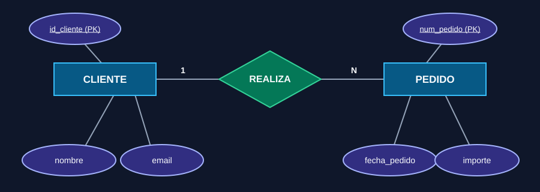
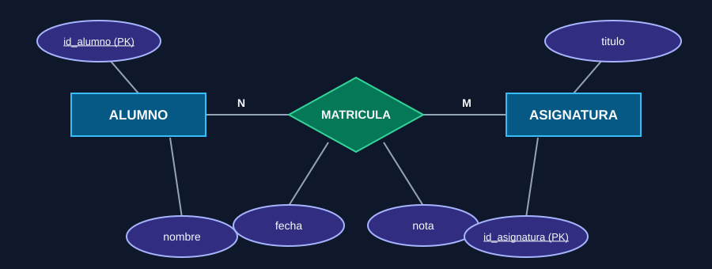
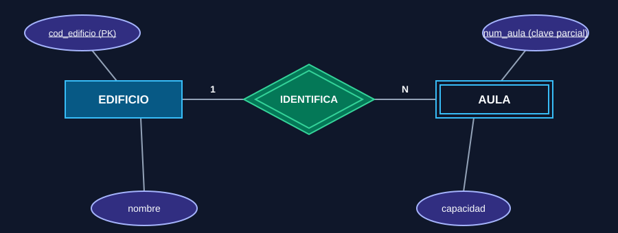
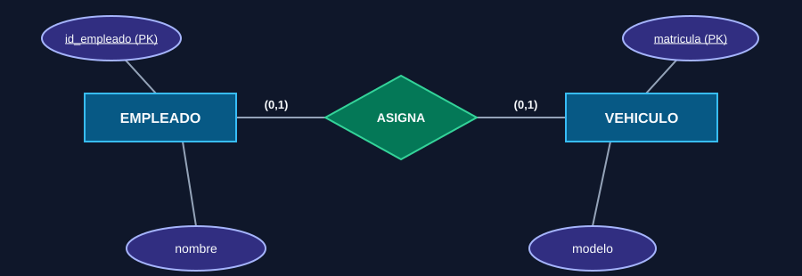
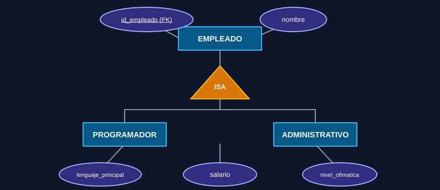
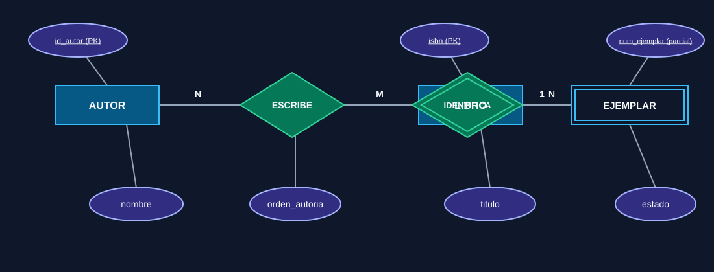
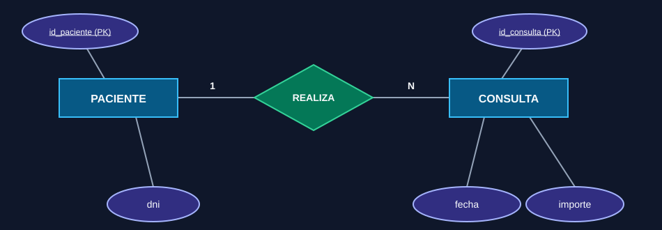
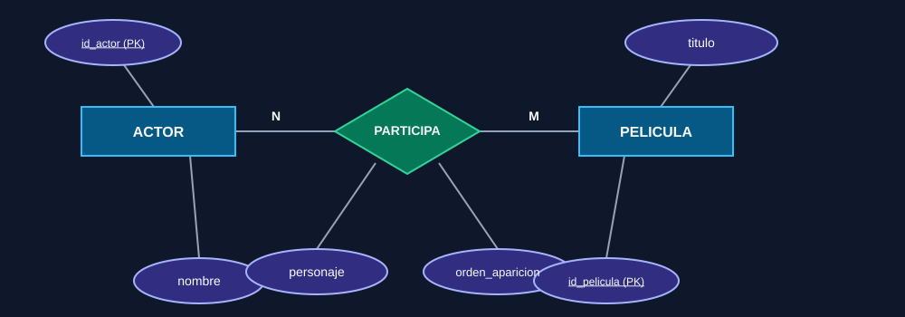
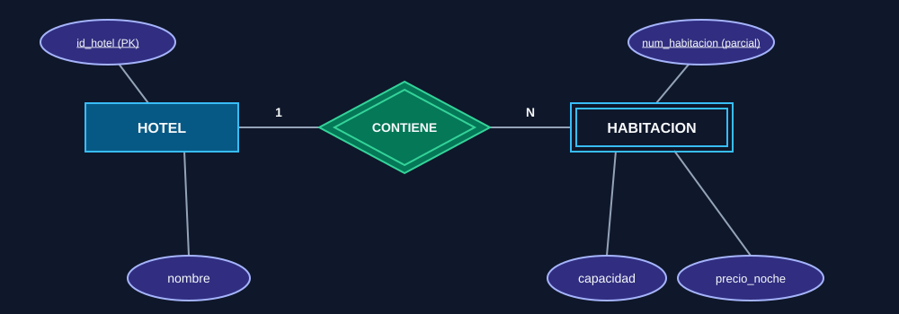

## Del diagrama EER al SQL DDL

En estas prácticas partiremos de diagramas **Entidad-Relación Extendido (EER) con notación de Chen** y construiremos las tablas con SQL DDL. Los ejemplos usan **MySQL 8.0.16 o posterior** (para que se apliquen las restricciones `CHECK`) y el motor `InnoDB`.

En los diagramas, los rectángulos representan entidades, los rombos relaciones y las formas ovaladas atributos. `PK` indica la clave primaria; `1` y `N` muestran cardinalidades. Una relación N:M se convierte en una tabla propia.



## Ejemplo 1: relación 1:N

**Regla:** un cliente puede realizar muchos pedidos; cada pedido pertenece a un único cliente. La clave foránea se coloca en el lado N, es decir, en `PEDIDO`.

```sql
CREATE TABLE cliente (
	id_cliente INT PRIMARY KEY,
	nombre VARCHAR(100) NOT NULL,
	email VARCHAR(254) NOT NULL UNIQUE
) ENGINE = InnoDB;

CREATE TABLE pedido (
	num_pedido INT PRIMARY KEY,
	fecha_pedido DATE NOT NULL,
	importe DECIMAL(10, 2) NOT NULL,
	id_cliente INT NOT NULL,
	CONSTRAINT chk_pedido_importe CHECK (importe >= 0),
	CONSTRAINT fk_pedido_cliente
		FOREIGN KEY (id_cliente)
		REFERENCES cliente (id_cliente)
		ON UPDATE CASCADE
		ON DELETE RESTRICT
) ENGINE = InnoDB;
```

`NOT NULL` expresa obligatoriedad, `UNIQUE` evita emails repetidos, `CHECK` limita el dominio del importe y la clave foránea impide pedidos sin cliente. `RESTRICT` evita borrar un cliente que todavía tenga pedidos.

## Ejemplo 2: relación N:M con atributos

Un alumno se matricula en varias asignaturas y cada asignatura puede tener muchos alumnos. La nota y la fecha pertenecen a la **relación** `SE MATRICULA`, no a una entidad por separado: por eso aparecen en `matricula`.



```sql
CREATE TABLE alumno (
	id_alumno INT PRIMARY KEY,
	nombre VARCHAR(100) NOT NULL
) ENGINE = InnoDB;

CREATE TABLE asignatura (
	id_asignatura INT PRIMARY KEY,
	titulo VARCHAR(120) NOT NULL,
	creditos TINYINT NOT NULL,
	CONSTRAINT chk_asignatura_creditos CHECK (creditos > 0)
) ENGINE = InnoDB;

CREATE TABLE matricula (
	id_alumno INT NOT NULL,
	id_asignatura INT NOT NULL,
	fecha DATE NOT NULL,
	nota DECIMAL(4, 2),
	PRIMARY KEY (id_alumno, id_asignatura),
	CONSTRAINT chk_matricula_nota CHECK (nota IS NULL OR nota BETWEEN 0 AND 10),
	CONSTRAINT fk_matricula_alumno FOREIGN KEY (id_alumno)
		REFERENCES alumno (id_alumno) ON DELETE CASCADE ON UPDATE CASCADE,
	CONSTRAINT fk_matricula_asignatura FOREIGN KEY (id_asignatura)
		REFERENCES asignatura (id_asignatura) ON DELETE CASCADE ON UPDATE CASCADE
) ENGINE = InnoDB;
```

La PK compuesta impide duplicar la matrícula de un alumno en una asignatura. Si se permiten varias convocatorias o cursos académicos, añade `curso_academico` a la PK.

## Ejemplo 3: entidad débil y clave compuesta

El número de aula solo identifica un aula dentro de su edificio. `AULA` depende de `EDIFICIO`, y su PK combina la clave del edificio con la clave parcial `num_aula`.



```sql
CREATE TABLE edificio (
	cod_edificio VARCHAR(10) PRIMARY KEY,
	nombre VARCHAR(100) NOT NULL
) ENGINE = InnoDB;

CREATE TABLE aula (
	cod_edificio VARCHAR(10) NOT NULL,
	num_aula SMALLINT NOT NULL,
	capacidad SMALLINT NOT NULL,
	PRIMARY KEY (cod_edificio, num_aula),
	CONSTRAINT chk_aula_capacidad CHECK (capacidad > 0),
	CONSTRAINT fk_aula_edificio FOREIGN KEY (cod_edificio)
		REFERENCES edificio (cod_edificio)
		ON DELETE CASCADE ON UPDATE CASCADE
) ENGINE = InnoDB;
```

Al borrar un edificio se borran sus aulas. La PK compuesta también hace imposible que dos aulas con el mismo número pertenezcan al mismo edificio.

## Ejemplo 4: relación 1:1 opcional

Un empleado puede tener asignado como máximo un vehículo y un vehículo puede estar asignado como máximo a un empleado. La asignación es opcional en ambos extremos. Situamos la FK en `vehiculo` y la hacemos `UNIQUE` para garantizar el 1:1.



```sql
CREATE TABLE empleado (
	id_empleado INT PRIMARY KEY,
	nombre VARCHAR(100) NOT NULL
) ENGINE = InnoDB;

CREATE TABLE vehiculo (
	matricula VARCHAR(10) PRIMARY KEY,
	modelo VARCHAR(80) NOT NULL,
	id_empleado INT UNIQUE,
	CONSTRAINT fk_vehiculo_empleado FOREIGN KEY (id_empleado)
		REFERENCES empleado (id_empleado)
		ON DELETE SET NULL ON UPDATE CASCADE
) ENGINE = InnoDB;
```

Como la participación es opcional, `id_empleado` admite `NULL`. `UNIQUE` garantiza que un empleado no reciba dos vehículos. Al eliminar al empleado se conserva el vehículo sin asignación.

## Ejemplo 5: jerarquía EER

Una empresa distingue empleados programadores y administrativos. La estrategia elegida crea una tabla para el supertipo y otra para cada subtipo. La PK de cada subtipo también es una FK al supertipo.



```sql
CREATE TABLE empleado (
	id_empleado INT PRIMARY KEY,
	nombre VARCHAR(100) NOT NULL
) ENGINE = InnoDB;

CREATE TABLE programador (
	id_empleado INT PRIMARY KEY,
	lenguaje_principal VARCHAR(60) NOT NULL,
	CONSTRAINT fk_programador_empleado FOREIGN KEY (id_empleado)
		REFERENCES empleado (id_empleado) ON DELETE CASCADE ON UPDATE CASCADE
) ENGINE = InnoDB;

CREATE TABLE administrativo (
	id_empleado INT PRIMARY KEY,
	nivel_ofimatica VARCHAR(40) NOT NULL,
	CONSTRAINT fk_administrativo_empleado FOREIGN KEY (id_empleado)
		REFERENCES empleado (id_empleado) ON DELETE CASCADE ON UPDATE CASCADE
) ENGINE = InnoDB;
```

Las claves foráneas garantizan que todo subtipo tenga un empleado válido. Si la especialización es disjunta, estas tablas por sí solas no impiden que el mismo empleado aparezca en ambos subtipos; esa regla requiere lógica adicional o una estrategia de tabla única con discriminador.

## DDL para modificar y eliminar

`CREATE` crea objetos, `ALTER` modifica su estructura y `DROP` elimina objetos. Antes de ejecutar `DROP`, comprueba que realmente quieres borrar la tabla y sus datos.

```sql
-- Añadir una columna
ALTER TABLE cliente
	ADD COLUMN telefono VARCHAR(20);

-- Añadir una restricción de unicidad
ALTER TABLE cliente
	ADD CONSTRAINT uq_cliente_telefono UNIQUE (telefono);

-- Cambiar el nombre de una columna (MySQL 8)
ALTER TABLE cliente
	RENAME COLUMN telefono TO telefono_contacto;

-- Eliminar una tabla (operación destructiva)
DROP TABLE IF EXISTS matricula;
```

## Práctica guiada: biblioteca

Una biblioteca registra libros, autores y ejemplares. Un libro puede tener varios autores y un autor puede escribir varios libros. Cada ejemplar pertenece a un solo libro; se identifica por un número que solo es único dentro de ese libro.



**Resuelto: esquema relacional**

- `AUTOR(id_autor PK, nombre)`
- `LIBRO(isbn PK, titulo, anio_publicacion)`
- `ESCRIBE(id_autor PK/FK, isbn PK/FK, orden_autoria)`
- `EJEMPLAR(isbn PK/FK, num_ejemplar PK, estado)`

**Una posible implementación DDL:**

```sql
CREATE TABLE autor (
	id_autor INT PRIMARY KEY,
	nombre VARCHAR(120) NOT NULL
) ENGINE = InnoDB;

CREATE TABLE libro (
	isbn CHAR(13) PRIMARY KEY,
	titulo VARCHAR(200) NOT NULL,
	anio_publicacion SMALLINT
) ENGINE = InnoDB;

CREATE TABLE escribe (
	id_autor INT NOT NULL,
	isbn CHAR(13) NOT NULL,
	orden_autoria TINYINT NOT NULL,
	PRIMARY KEY (id_autor, isbn),
	CONSTRAINT uq_escribe_orden UNIQUE (isbn, orden_autoria),
	CONSTRAINT fk_escribe_autor FOREIGN KEY (id_autor)
		REFERENCES autor (id_autor) ON DELETE CASCADE ON UPDATE CASCADE,
	CONSTRAINT fk_escribe_libro FOREIGN KEY (isbn)
		REFERENCES libro (isbn) ON DELETE CASCADE ON UPDATE CASCADE
) ENGINE = InnoDB;

CREATE TABLE ejemplar (
	isbn CHAR(13) NOT NULL,
	num_ejemplar SMALLINT NOT NULL,
	estado VARCHAR(20) NOT NULL,
	PRIMARY KEY (isbn, num_ejemplar),
	CONSTRAINT chk_ejemplar_estado
		CHECK (estado IN ('disponible', 'prestado', 'reparacion')),
	CONSTRAINT fk_ejemplar_libro FOREIGN KEY (isbn)
		REFERENCES libro (isbn) ON DELETE CASCADE ON UPDATE CASCADE
) ENGINE = InnoDB;
```

## Ejercicios para resolver

En cada caso: dibuja o interpreta el diagrama EER, decide las PK y FK, añade las restricciones necesarias y escribe el DDL en el orden correcto. Comprueba al final qué sucede al borrar o modificar una fila referenciada.

### 1. Clínica: consultas y pacientes

Una consulta corresponde a un único paciente; un paciente puede tener varias consultas. De cada consulta se guarda fecha, motivo e importe. El importe no puede ser negativo. No se permite borrar pacientes con consultas registradas.



Escribe el DDL para las dos tablas con tipos, `NOT NULL`, `UNIQUE`, `CHECK` y clave foránea.

### 2. Cine: películas y actores

Una película tiene varios actores y un actor puede actuar en muchas películas. En la relación se guarda el personaje interpretado y el orden de aparición. El mismo actor no puede aparecer dos veces en una misma película.



Escribe el DDL de las tres tablas. Define una PK compuesta para `PARTICIPA` y evita repetir el orden de aparición dentro de una película.

### 3. Hotel: habitaciones débiles

Cada habitación se identifica por su número dentro de un hotel. Guarda capacidad y precio por noche; ambos deben ser mayores que cero. Si se elimina un hotel, se eliminan sus habitaciones.



Escribe las tablas con PK compuesta, `CHECK` y borrado en cascada.

### 4. Empresa: empleados y departamentos

Cada empleado trabaja en un departamento; cada departamento puede tener varios empleados. Un departamento puede existir antes de contratar empleados. Guarda el nombre del departamento y la fecha de contratación del empleado.

Decide en qué tabla colocar la FK y cómo representar `fecha_contratacion`. Escribe el DDL y justifica qué política `ON DELETE` sería adecuada.

### 5. Tienda: pedidos y productos

Un pedido puede incluir varios productos y cada producto puede aparecer en muchos pedidos. Por cada línea de pedido se guarda cantidad y precio unitario aplicado. La cantidad debe ser positiva. Un pedido no puede repetir el mismo producto en dos líneas.

Diseña `PEDIDO`, `PRODUCTO` y la entidad asociativa `DETALLE_PEDIDO`. Define PK, FK y restricciones; explica por qué `precio_unitario` se guarda en el detalle aunque `PRODUCTO` ya tenga un precio actual.

### 6. Especialización EER: personal de un centro

Todo miembro del personal es profesor o técnico, y nunca ambos. Un profesor tiene `especialidad`; un técnico tiene `area_soporte`.

Dibuja la jerarquía EER e implementa una solución con tabla para el supertipo y tablas para los subtipos. Indica qué regla del enunciado no queda garantizada únicamente por las claves foráneas.
