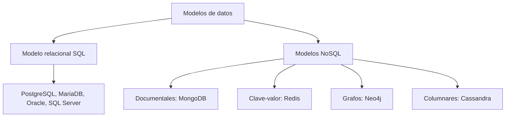
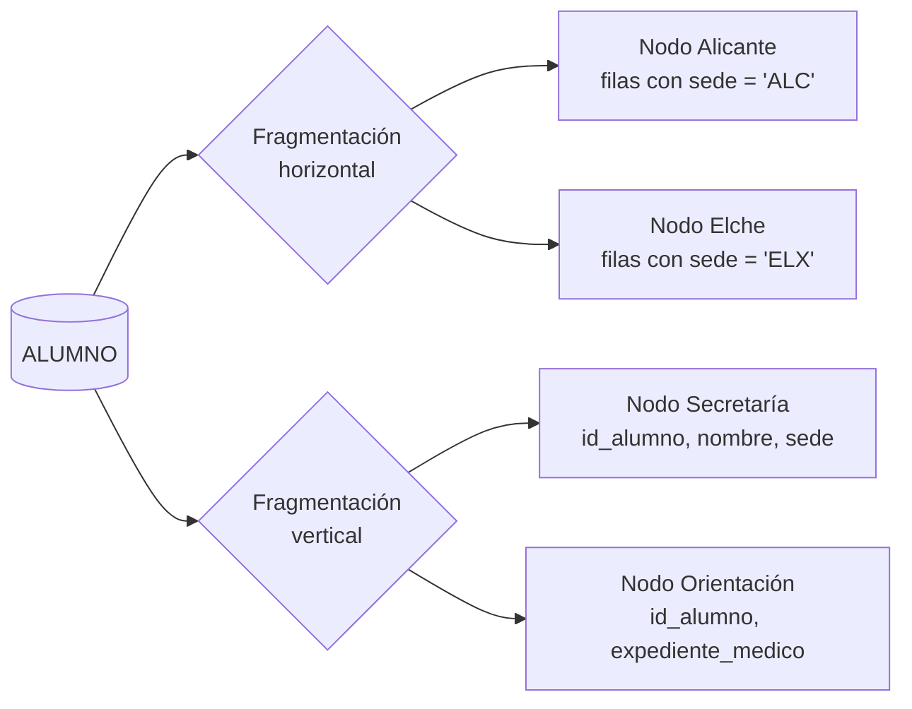
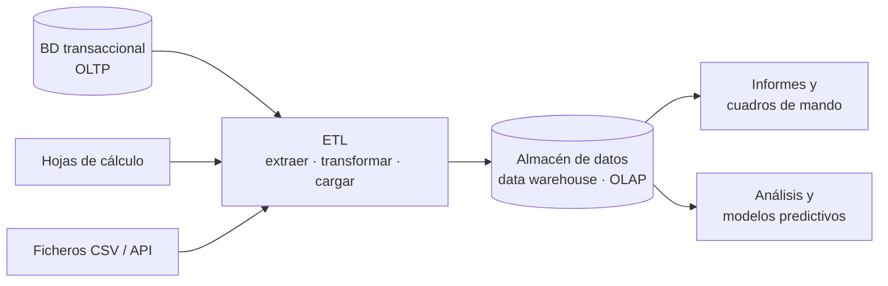

# UD01 · Sistemas de almacenamiento y SGBD


## Resumen del tema

**Visión general:**
Un **sistema gestor de bases de datos (SGBD)** es el componente de software esencial que centraliza, organiza, consulta, mantiene y protege la información en las organizaciones modernas. En los inicios de la informática, las aplicaciones gestionaban los datos directamente mediante **sistemas de ficheros independientes**, lo que provocaba graves problemas de redundancia, incoherencia, acoplamiento físico y lógico, y fallos de seguridad.

Esta unidad trata en profundidad la transición histórica desde los soportes físicos primitivos (tarjetas perforadas, cintas magnéticas y discos planos) hasta los SGBD relacionales y NoSQL actuales. Se analizan en detalle los métodos de organización de ficheros (secuenciales, de acceso aleatorio mediante el cálculo del *offset* e indexados con árboles B), la arquitectura estándar de tres niveles **ANSI/SPARC**, los componentes internos de un motor de base de datos, las reglas de integridad referencial y de dominio, la gestión de la concurrencia mediante **transacciones ACID**, las políticas de seguridad y recuperación, así como las topologías de despliegue y los subconjuntos del lenguaje SQL.


### Temporalización

La unidad ocupa **12 horas de aula** (8 de teoría y 4 de práctica).


items:
  - {h: 2, tipo: T, t: "Datos e información. Historia. Sistemas basados en ficheros", ref: "§1 a §3"}
  - {h: 1, tipo: P, t: "De la hoja de cálculo al SGBD", ref: "Práctica 1.1"}
  - {h: 2, tipo: T, t: "Bases de datos y SGBD. Arquitectura y componentes", ref: "§4 y §5"}
  - {h: 2, tipo: P, t: "Primer contacto con Oracle", ref: "Práctica 1.2"}
  - {h: 2, tipo: T, t: "Integridad, concurrencia y transacciones. Seguridad. Modelos de datos y lenguajes", ref: "§6 a §8"}
  - {h: 1, tipo: T, t: "Clasificación de los SGBD. Bases de datos distribuidas y fragmentación", ref: "§9 y §10"}
  - {h: 1, tipo: T, t: "Big Data, inteligencia empresarial y protección de datos", ref: "§11 y §12"}
  - {h: 1, tipo: P, t: "Informe de análisis de EduGest", ref: "Proyecto EduGest-1"}
autonomo:
  - "Prácticas 1.3 (elegir un SGBD), 1.4 (distribución de datos), 1.5 (auditoría de protección de datos) y 1.6"
  - "Ejercicios resueltos y autoevaluación"



### Objetivos de aprendizaje

Al terminar esta unidad serás capaz de:

- Explicar la diferencia entre dato, información y conocimiento, y entre fichero y base de datos.
- Analizar los problemas de los sistemas basados en ficheros y valorar la utilidad de un SGBD.
- Describir la arquitectura ANSI/SPARC, los componentes de un SGBD y los perfiles de usuario.
- Clasificar los SGBD según el modelo de datos, la ubicación de la información y otros criterios.
- Reconocer la utilidad de las bases de datos distribuidas y las políticas de fragmentación.
- Reconocer los conceptos de Big Data y de inteligencia empresarial.
- Identificar la legislación de protección de datos que afecta al diseño de una base de datos.

> [!NOTE]
> Esta unidad es **conceptual**: todavía no instalamos nada ni escribimos SQL de forma sistemática. Los fragmentos SQL que aparecen son ilustrativos y utilizan una sintaxis genérica. A partir de la UD05 trabajaremos con Oracle.



---


Datos, historia y ficheros

## 1. Datos, información y representación

### 1.1 La cadena de valor: dato, información y conocimiento

En el ámbito de las ciencias de la computación y de la gestión de bases de datos, es fundamental distinguir con precisión entre **dato**, **información** y **conocimiento**:

- **Dato (Data):** Es una representación simbólica (numérica, alfabética, espacial o algorítmica) de un atributo, un suceso o un hecho del mundo real. Aislado, un dato no tiene contexto, semántica ni una finalidad que se pueda evaluar.
  - *Ejemplos de datos:* `2026-10-01`, `1200`, `B`.
- **Información (Information):** Aparece cuando un conjunto de datos procesados, estructurados y contextualizados adquiere significado para una persona o para un sistema informático y permite reducir la incertidumbre y tomar decisiones.
  - *Ejemplo de información:* «La cita médica del paciente Juan Pérez con el Dr. Martínez (`B`) está programada para el `2026-10-01` a las `12:00`».
- **Conocimiento (Knowledge):** Es la integración de varios flujos de información combinados con la experiencia, las reglas de negocio y las inferencias lógicas, que permite predecir comportamientos o automatizar acciones complejas.
  - *Ejemplo de conocimiento:* «El 85 % de los pacientes que piden cita a las 12:00 durante el mes de octubre llegan puntualmente si reciben un recordatorio por SMS 24 horas antes».

---

### 1.2 Representación tabular y tipado de datos

Para que un ordenador interprete y almacene la información de forma eficiente, los datos se organizan en modelos tabulares formados por **filas (registros, tuplas u ocurrencias)** y **columnas (atributos o campos)**:

| Atributo / campo | Tipo de dato lógico | Restricción de dominio / regla | Ejemplo de valor válido |
| :--- | :--- | :--- | :--- |
| `id_cliente` | Entero (`INT / BIGINT`) | Clave primaria (`PRIMARY KEY`), autoincremental, no nula. | `10045` |
| `nombre` | Cadena variable (`VARCHAR(100)`) | No nulo (`NOT NULL`), texto en formato UTF-8. | `'Laura Gomez'` |
| `email` | Cadena (`VARCHAR(150)`) | Única (`UNIQUE`), dirección de correo válida. | `'laura@ejemplo.com'` |
| `saldo_cuenta` | Decimal fijo (`DECIMAL(12,2)`) | Mayor o igual que cero (`CHECK (saldo_cuenta >= 0)`). | `1250.75` |
| `fecha_alta` | Fecha estándar (`DATE`) | Formato ISO `YYYY-MM-DD`, no futura. | `'2026-10-01'` |

#### La importancia de elegir correctamente los tipos de datos

Elegir un tipo de dato inadecuado durante el diseño de la base de datos puede tener consecuencias graves:

1. **Pérdida de capacidad de filtrado y ordenación:** Si las fechas se almacenan como texto plano (`"01/10/2026"`), el SGBD no puede aplicarles operadores cronológicos (`WHERE fecha BETWEEN ...`) ni ordenarlas correctamente (en orden alfabético, `"01/10/2026"` aparecería antes que `"02/01/2020"`).
2. **Desperdicio de memoria secundaria y RAM:** Utilizar `CHAR(255)` para guardar un código numérico de dos dígitos desperdicia cientos de bytes por fila, penaliza la memoria caché del motor (*Buffer Pool*) y multiplica los accesos al disco (*I/O Operations*).
3. **Imposibilidad de garantizar la integridad:** Si se permiten cadenas de texto en campos numéricos, no se pueden aplicar directamente operaciones aritméticas (`SUM`, `AVG`) y la base de datos queda expuesta a incoherencias de formato causadas por errores de la aplicación cliente.

---

## 2. Historia y evolución de las bases de datos

A lo largo del último siglo, el almacenamiento de la información ha experimentado una transformación profunda: ha pasado de dispositivos puramente mecánicos y analógicos a plataformas relacionales muy optimizadas y arquitecturas distribuidas en la nube.



### 2.1 Antecedentes mecánicos y cintas magnéticas (1884-1950)

- **1884 — Máquina tabuladora de tarjetas perforadas (Herman Hollerith):**
  Se desarrolló para procesar el censo de los Estados Unidos de 1890. Hollerith inventó un sistema que codificaba los datos demográficos mediante perforaciones en tarjetas de cartón, que se leían eléctricamente. Este hito redujo de ocho años a solo dos el tiempo necesario para procesar el censo y dio origen a la compañía que más tarde se convertiría en **IBM**.

- **Años cincuenta — Cintas magnéticas y procesamiento por lotes (*batch*):**
  Con la llegada de los primeros ordenadores comerciales, como el UNIVAC I, las tarjetas se sustituyeron por **cintas magnéticas**. Los datos se organizaban en **ficheros secuenciales**. Para procesar las nóminas o la contabilidad, el ordenador tenía que leer la cinta de principio a fin, sin interrupciones. Para encontrar el registro número 5.000, había que avanzar físicamente y leer antes los 4.999 registros anteriores.

---

{}
La Tabulating Machine Company de Herman Hollerith, que tabuló el censo de EE. UU. de 1890 con tarjetas perforadas, se fusionó en 1911 en la Computing-Tabulating-Recording Company, que en 1924 pasó a llamarse **IBM**.
{}

### 2.2 Soportes de disco y modelos prerrelacionales (años sesenta)

La invención del **disco magnético de cabeza móvil**, como el IBM 350, revolucionó la informática porque hizo posible el **acceso aleatorio o directo**: en milisegundos, la cabeza podía saltar a cualquier pista y sector del disco sin tener que recorrer el resto del fichero.

Esta innovación técnica dio lugar a los primeros **sistemas de gestión de bases de datos (SGBD) prerrelacionales**:

- **Modelo jerárquico (IBM IMS, 1966):** Los datos se organizaban en forma de árbol, con registros «padre» e «hijos». Cada registro hijo solo podía tener un padre. Este sistema fue la columna vertebral del programa espacial **Apolo** de la NASA.
- **Modelo en red (CODASYL DBTG, 1969):** Permitió crear estructuras de grafos más complejas, en las que un registro «hijo» podía tener varios registros «padre» (relaciones $N:M$).
- **Sistema SABRE (*Semi-Automated Business Research Environment*):** Creado conjuntamente por IBM y American Airlines, fue el primer sistema de base de datos OLTP (*Online Transaction Processing*) capaz de gestionar reservas de vuelos en tiempo real y a escala mundial.

*Principal inconveniente:* tanto el modelo jerárquico como el modelo en red exigían que los programadores conocieran la estructura física exacta de los punteros del disco para escribir el código de navegación (*navegación manual por los enlaces*). Cualquier cambio en la estructura del disco podía inutilizar las aplicaciones.

---

{}
El sistema jerárquico **IMS** de IBM empezó a desarrollarse hacia 1966 para gestionar la lista de materiales del programa Apolo. Sesenta años después todavía se usa en bancos y aerolíneas.
{}

### 2.3 La revolución relacional de E. F. Codd (años setenta)

En junio de 1970, el matemático e investigador de IBM **Edgar Frank Codd** publicó un artículo fundamental titulado *«A Relational Model of Data for Large Shared Data Banks»*. Codd proponía abstraer por completo el almacenamiento físico y representar los datos mediante **relaciones matemáticas (tablas)** formadas por filas y columnas.

#### Principios de la revolución relacional

1. **Independencia de los datos:** El usuario indica *QUÉ* datos quiere obtener (lenguaje declarativo), no *CÓMO* debe recorrer físicamente el disco para encontrarlos.
2. **Fundamento matemático:** Se basa en la teoría de conjuntos y en la lógica de predicados de primer orden.
3. **Prototipos destacados (1974-1979):**
   - **System R (IBM):** Proyecto de investigación en San José que dio lugar al lenguaje **SEQUEL**, llamado más tarde **SQL**.
   - **Ingres (UC Berkeley):** Bajo la dirección de Michael Stonebraker, desarrolló el lenguaje QUEL y demostró la viabilidad de los SGBD relacionales de código abierto, precursores de PostgreSQL.

---

### 2.4 Consolidación de SQL, NoSQL y la nube (desde los años ochenta)

- **Años ochenta — Estandarización y comercialización:** **ANSI (1986)** e **ISO (1987)** adoptaron SQL como estándar oficial. Empresas como **Oracle, IBM (DB2), Sybase y Microsoft (SQL Server)** convirtieron los SGBD relacionales en el estándar indiscutible de la industria.
- **Años noventa y dos mil — Código abierto y web:** Aparecieron motores relacionales de código abierto, ligeros y de alto rendimiento, como **PostgreSQL, MySQL y SQLite**, que impulsaron la expansión de la World Wide Web y de los sistemas CMS.
- **Años 2010 — La era de NoSQL y Big Data:** El volumen masivo de datos no estructurados (*Big Data*), la necesidad de escalar horizontalmente entre miles de servidores y la demanda de baja latencia dieron lugar a las bases de datos **NoSQL (Not Only SQL)**:
  - *Documentales:* MongoDB y CouchDB.
  - *Clave-valor:* Redis y DynamoDB.
  - *Orientadas a grafos:* Neo4j.
  - *Columnares:* Apache Cassandra.
- **Actualmente — Bases de datos multimodelo y nativas de la nube:** Los motores actuales combinan la compatibilidad estricta con SQL con tipos semiestructurados (JSONB), extensiones vectoriales para la inteligencia artificial (pgvector) y arquitecturas escalables sin servidor (*Serverless/Distributed SQL*), como las de CockroachDB o Amazon Aurora.

---

## 3. Sistemas tradicionales basados en ficheros

Antes de que se generalizaran los SGBD, las organizaciones gestionaban los datos en ficheros independientes e individuales, administrados directamente por las rutinas de entrada y salida del sistema operativo.

### 3.1 El concepto de fichero y la clasificación de los formatos

Un **fichero** es un conjunto homogéneo de información estructurada, creado por una aplicación o por un usuario y almacenado de forma no volátil en un soporte de memoria secundaria (disco duro, SSD o cinta).

#### Clasificación según el contenido y la finalidad

- **Ficheros de configuración:** `.ini`, `.conf`, `.json`, `.yaml`, `.xml`.
- **Código fuente y scripts:** `.sql`, `.py`, `.c`, `.java`, `.sh`.
- **Documentos de texto y páginas web:** `.html`, `.css`, `.docx`, `.pdf`, `.txt`.
- **Formatos multimedia:** `.jpg`, `.png`, `.svg`, `.mp4`, `.wav`.
- **Ficheros ejecutables y de datos:** `.exe`, `.bin`, `.dat`, `.zip`, `.tar.gz`.

---

### 3.2 Métodos de organización y acceso físico

El método de organización física determina cómo se disponen los registros dentro del fichero y qué algoritmos se utilizan para recuperar la información.



#### 1. Ficheros secuenciales

Los registros se escriben uno detrás de otro, en el orden en que se crean.

- **Mecanismo de acceso:** Para leer el registro $N$, el sistema tiene que recorrer necesariamente los $N-1$ registros anteriores.
- **Soporte físico habitual:** cintas magnéticas y ficheros de registro plano (*logs*).
- **Eficiencia:** Son muy adecuados para procesar grandes volúmenes de datos por lotes (*batch processing*), cuando hay que tratarlos todos. En cambio, el rendimiento es muy bajo para consultas interactivas puntuales ($\mathcal{O}(N)$).

#### 2. Ficheros de acceso aleatorio (directo)

Permiten situar la cabeza de lectura y escritura directamente en la posición física deseada, sin leer el resto del fichero.

- **Requisito técnico:** Todos los registros del fichero deben tener exactamente la **misma longitud fija** ($L$).
- **Fórmula para calcular el desplazamiento físico (*offset*):**
  $$Posición\_Byte = N \times L$$
  *Donde $N$ es el índice del registro que se quiere leer (empezando por 0) y $L$ es la longitud fija del registro, expresada en bytes.*

  > [!WARNING]
  > El índice empieza en **0**: el primer registro está en el byte 0 y el registro con índice 10 se encuentra a una distancia de diez longitudes, no de nueve. La fórmula solo es válida si todos los registros tienen la misma longitud.

> **Ejemplo detallado de cálculo del desplazamiento físico:**
> Supongamos que definimos la estructura de un cliente con codificación de caracteres ANSI (1 byte por carácter):
>
> - `nombre`: cadena fija de 80 bytes.
> - `direccion`: cadena fija de 100 bytes.
> - `localidad`: cadena fija de 50 bytes.
>
> **Longitud fija total del registro ($L$):**
> $$L = 80 + 100 + 50 = 230\text{ bytes}$$
>
> Si la aplicación necesita leer directamente el **registro número 10** (índice $N=10$):
> $$Posición\_Byte = 10 \times 230 = 2300\text{ bytes}$$
> El sistema operativo ejecuta la llamada `fseek(file_ptr, 2300, SEEK_SET)` y lee exactamente los 230 bytes comprendidos entre las posiciones 2300 y 2529.
>
> *Inconveniente del borrado:* Si se elimina el registro 5, no se pueden desplazar todos los registros posteriores porque se descuadraría el índice $N$. Se suele dejar un hueco marcado con una **marca de borrado (*tombstone*)** y rellenarlo de ceros, lo que fragmenta mucho el espacio del disco.

#### 3. Ficheros indexados

Combinan un fichero de datos (que puede contener registros de longitud variable) con uno o más ficheros auxiliares llamados **índices**.

- **Índice:** Fichero secundario muy optimizado, formado por parejas `(Clave_de_Búsqueda, Puntero_Físico_a_Disco)`.
- **Estructura física:** Se organizan con estructuras de datos avanzadas, como los **árboles B (B-Trees / B+ Trees)** o las tablas hash.
- **Rendimiento:** Permiten buscar datos mediante una búsqueda binaria o un árbol, con complejidad logarítmica ($\mathcal{O}(\log N)$), y acceder de inmediato a la posición exacta del disco.

---

#### Laboratorio: por qué importan los índices

Mueve el control y compara cuántos bloques de disco lee una búsqueda con y sin índice.



### 3.3 Inconvenientes de la gestión tradicional basada en ficheros

Cuando cada aplicación informática gestiona sus ficheros sin un SGBD centralizado, aparecen problemas de arquitectura difíciles de resolver:



1. **Redundancia e inconsistencia de los datos:**
   Los mismos datos se duplican en varios ficheros gestionados por departamentos distintos (por ejemplo, el teléfono de un cliente se guarda tanto en el fichero de ventas como en el de facturación). Si el cliente cambia de número y solo se actualiza el fichero de ventas, los datos globales se vuelven **incoherentes**.

2. **Dependencia física y lógica (acoplamiento fuerte):**
   La estructura exacta del fichero (campos, desplazamientos y tipos de datos) está codificada directamente en los programas. Si el departamento de TI decide añadirle el campo `codigo_postal`, hay que modificar, recompilar y volver a probar **todos** los programas que lo leen.

3. **Rigidez y dificultad para obtener información nueva:**
   Para responder a una consulta no prevista en el diseño inicial, hay que escribir un programa nuevo en un lenguaje de bajo nivel que recorra los ficheros.

4. **Falta de control de concurrencia (modificación perdida):**
   Si dos usuarios abren a la vez el mismo fichero e intentan actualizar el mismo registro, quien lo guarde en último lugar puede sobrescribir los cambios del otro sin que nadie se dé cuenta (*lost update*).

5. **Vulnerabilidad ante fallos y pérdida de atomicidad:**
   Si se va la luz mientras la aplicación modifica un fichero, este puede quedar escrito solo a medias, inutilizable o corrupto, sin ningún mecanismo automático para deshacer los cambios (*rollback*).

6. **Seguridad deficiente y ausencia de reglas de integridad:**
   El sistema operativo solo ofrece permisos básicos sobre el fichero entero (lectura o escritura). No permite restringir el acceso a columnas concretas (por ejemplo, ocultar el salario) ni imponer reglas de negocio complejas (como que el precio no pueda ser negativo).

---

SGBD y arquitectura

## 4. Bases de datos y sistemas gestores (SGBD)

### 4.1 Definición, conceptos clave y funciones de un SGBD

Una **base de datos (BD)** es un conjunto integrado, estructurado e interrelacionado de datos compartidos, almacenados de forma permanente en memoria secundaria con la menor redundancia posible, que da servicio simultáneamente a varias aplicaciones.

Un **sistema gestor de bases de datos (SGBD / DBMS)** es un conjunto complejo de software especializado que actúa como capa intermedia entre la base de datos física, los usuarios y las aplicaciones cliente, y que proporciona un acceso controlado y seguro.

> [!NOTE]
> Una **base de datos** es el conjunto organizado de datos; un **SGBD** es el software que permite definirlos, consultarlos y administrarlos. No son términos intercambiables.

```text
[ Usuarios / aplicaciones web / móviles ]
                   │
                   ▼ (Consultas SQL / API)
┌─────────────────────────────────────────────────────────┐
│         SGBD / DBMS (Engine, Parser, Optimizer)        │
└─────────────────────────────────────────────────────────┘
                   │
                   ▼ (Lectura / escritura de páginas)
[ Ficheros físicos de datos + diccionario de metadatos ]
```

#### Funciones fundamentales que ofrece un SGBD

- **Definición de esquemas (función DDL):** Permite especificar estructuras, campos, tipos, claves e índices.
- **Manipulación de datos (función DML):** Proporciona un motor de consultas declarativo de alto nivel (SQL) para buscar, insertar, modificar y eliminar datos.
- **Control de seguridad y permisos (función DCL):** Autentica a los usuarios y verifica los privilegios a nivel de tabla, fila o columna.
- **Mantenimiento de la integridad:** Aplica automáticamente las reglas de clave primaria y foránea, así como las validaciones de rango.
- **Gestión de transacciones y concurrencia:** Garantiza la ejecución segura de operaciones concurrentes mediante bloqueos y aislamiento.
- **Resiliencia y recuperación ante fallos:** Mantiene registros de diario (*Write-Ahead Logging*) para evitar que se pierda ningún cambio confirmado si falla el servidor.

---

### 4.2 Comparación: ficheros tradicionales y SGBD

| Característica / criterio | Gestión tradicional con ficheros planos | Sistema gestor de bases de datos (SGBD) |
| :--- | :--- | :--- |
| **Redundancia de datos** | Alta y descontrolada (ficheros duplicados por aplicación). | Mínima, centralizada y estrictamente controlada. |
| **Coherencia / consistencia** | Muy baja; riesgo constante de incoherencias. | Garantizada con transacciones y reglas centralizadas. |
| **Acoplamiento físico y lógico** | Total; los cambios físicos obligan a reescribir el código. | Inexistente; independencia física y lógica de los datos. |
| **Acceso concurrente** | Inseguro; bloqueos rudimentarios de todo el fichero. | Control detallado y granular (filas/páginas) mediante ACID/MVCC. |
| **Seguridad y privacidad** | Control básico del sistema operativo sobre el fichero. | Control avanzado por roles, usuarios, vistas y columnas. |
| **Consultas ad hoc** | Muy complejas; hay que programar rutinas enteras. | Sencillas, rápidas y declarativas, con SQL. |
| **Recuperación ante fallos** | Manual, lenta y dependiente de copias de seguridad. | Automática e inmediata, mediante ficheros de registro (*logs*). |

---

### 4.3 Aplicaciones e impacto en distintos sectores

1. **Banca y plataformas financieras:**
   Las transferencias bancarias internacionales se procesan en tiempo real. Hay que respetar estrictamente la propiedad de **atomicidad**: descontar el dinero de la cuenta de origen e ingresarlo en la cuenta de destino debe ser una única operación indivisible.

2. **Cadenas de supermercados y TPV:**
   Cuando se lee un código de barras en caja, el SGBD consulta el precio actualizado de la tabla de productos, descuenta del inventario del almacén la unidad vendida y registra la venta en una única transacción.

3. **Sistemas sanitarios y hospitalarios:**
   La historia clínica electrónica centralizada permite que el personal de urgencias, los especialistas y los laboratorios consulten a la vez la misma información, con controles estrictos de privacidad. Por ejemplo, el personal administrativo de recepción puede ver la cita, pero no la historia clínica detallada.

4. **Comercio electrónico global:**
   Permite gestionar catálogos con millones de referencias, carritos de compra persistentes, pagos a través de pasarelas externas y recomendaciones personalizadas en tiempo real.

---

## 5. Arquitectura y componentes de un SGBD

### 5.1 La arquitectura ANSI/SPARC de tres niveles

En 1975, el comité **ANSI/X3/SPARC** (Study Group on Data Base Management Systems) propuso una arquitectura de referencia con tres niveles de abstracción, con el fin de separar las aplicaciones del almacenamiento físico:



1. **Nivel externo (esquema externo / vistas de usuario):**
   Es el nivel más próximo a los usuarios finales y a los desarrolladores. Define varias **vistas externas**, adaptadas a cada perfil. Cada vista muestra solo la parte de la base de datos que interesa al usuario y oculta el resto por motivos de simplicidad y seguridad.

2. **Nivel conceptual (esquema conceptual):**
   Es la representación lógica global y completa de la base de datos. Describe todas las entidades, los atributos y las relaciones, así como los tipos de datos y las restricciones de integridad. Es independiente de los detalles del almacenamiento físico en el disco.

3. **Nivel interno (esquema interno / físico):**
   Es la representación física de la base de datos en los soportes de almacenamiento secundario. Especifica cómo se organizan los ficheros, el tamaño de las páginas de memoria, los punteros del disco, los índices (B-Tree/Hash), las técnicas de compresión y el cifrado físico.

---

### 5.2 Tipos de independencia de los datos

La principal aportación de la arquitectura ANSI/SPARC es la **independencia de los datos**: la capacidad de modificar el esquema de un nivel de abstracción sin tener que cambiar el del nivel inmediatamente superior:

```text
[ NIVEL EXTERNO ]   <--- (Vistas / Aplicaciones)
       ▲
       │  ===> INDEPENDENCIA LÓGICA DE LOS DATOS
       ▼
[ NIVEL CONCEPTUAL ] <--- (Tablas / Relaciones / Reglas)
       ▲
       │  ===> INDEPENDENCIA FÍSICA DE LOS DATOS
       ▼
[ NIVEL INTERNO ]   <--- (Ficheros / Páginas / Índices B-Tree)
```

- **Independencia lógica de los datos:**
  Es la posibilidad de modificar el esquema conceptual (por ejemplo, añadir una tabla o una columna, o cambiar una regla de dominio) sin tener que modificar las vistas externas ni reescribir las aplicaciones cliente que no utilizan los campos afectados.

- **Independencia física de los datos:**
  Es la posibilidad de modificar el esquema interno de almacenamiento (por ejemplo, trasladar los ficheros a una unidad SSD más rápida, reorganizar los índices B-Tree, cambiar el factor de empaquetamiento o comprimir los datos) sin alterar el esquema conceptual ni los programas SQL de las aplicaciones.

---

{}
{}
Una aplicación (o una persona desde una herramienta como SQL Developer) envía una sentencia, por ejemplo `SELECT nombre FROM alumno WHERE id = 7;`, al SGBD por medio de una conexión.
{}
{}
El SGBD comprueba la sintaxis, que la tabla y las columnas existan (consulta el **diccionario de datos**) y que el usuario tenga privilegios.
{}
{}
El **optimizador** genera varios planes posibles y elige el de menor coste estimado: por ejemplo, usar un índice o leer la tabla entera.
{}
{}
El motor ejecuta el plan y pide bloques al gestor de memoria intermedia (*buffer*). Si no están en memoria, se leen del disco.
{}
{}
Las filas vuelven a la aplicación. Si la sentencia modifica datos, el gestor de transacciones y el registro (*log*) garantizan las propiedades ACID.
{}
{}

### 5.3 Módulos y componentes internos del motor

Un motor de base de datos relacional actual se compone de varios módulos internos optimizados:

1. **Diccionario de datos (catálogo del sistema / metadatos):**
   Es la «base de datos de la base de datos». Guarda información esencial sobre la estructura del sistema: nombres de tablas y columnas, tipos de datos, claves primarias y foráneas, definiciones de vistas, usuarios, roles, privilegios y estadísticas sobre la distribución de los datos.

2. **Compilador y procesador de consultas (SQL Parser & Translator):**
   Recibe las instrucciones SQL de los usuarios o de las aplicaciones, comprueba su sintaxis, valida los nombres de las tablas y las columnas consultando el diccionario de datos y verifica que se tienen los permisos necesarios para ejecutarlas.

3. **Optimizador de consultas (Query Optimizer):**
   Es el «cerebro» del SGBD. Analiza la consulta SQL y genera varios planes de ejecución posibles. Con las estadísticas del catálogo (número de filas, cardinalidad e índices disponibles), estima el coste de entrada/salida y de CPU de cada plan, y elige el **plan de ejecución de coste más bajo**.

4. **Gestor de almacenamiento (Storage Engine / Buffer Manager):**
   Gestiona el intercambio de páginas de datos entre el almacenamiento secundario (disco o SSD) y la zona de memoria RAM de alta velocidad del servidor (**Buffer Pool**).

5. **Gestor de transacciones y bloqueos (Transaction & Lock Manager):**
   Coordina la ejecución simultánea de transacciones mediante algoritmos de bloqueo (*Locking*) o de control de versiones múltiples (*MVCC*), para garantizar su aislamiento.

6. **Gestor de recuperación y registro de diario (Recovery Manager & WAL):**
   Garantiza la durabilidad y la atomicidad: antes de actualizar definitivamente una página de datos, anota cada modificación en un fichero de diario persistente en el disco (*Write-Ahead Log*).

---

### 5.4 Perfiles de usuario y roles profesionales

En la gestión de bases de datos participan profesionales con perfiles y responsabilidades diferentes:

- **Administrador de bases de datos (DBA - Database Administrator):**
  Se encarga de la instalación y configuración, del ajuste del rendimiento, de las políticas de seguridad y de las copias de seguridad (*backups*), así como de instalar actualizaciones y mantener el SGBD disponible.

- **Diseñadores de bases de datos:**
  Analizan las necesidades del negocio y elaboran los esquemas conceptuales (diagramas EER) y lógicos (normalización relacional).

- **Programadores de aplicaciones:**
  Desarrollan la lógica de negocio con lenguajes como Python, Java, C# o Go, e interactúan con la base de datos mediante instrucciones SQL o bibliotecas ORM (*Object-Relational Mapping*).

- **Usuarios avanzados / analistas de datos:**
  Formulan consultas SQL complejas para obtener métricas, informes de inteligencia empresarial (BI) y modelos analíticos.

- **Usuarios finales:**
  Interactúan con la base de datos a través de formularios e interfaces gráficas web o móviles, sin necesidad de conocer la sintaxis SQL.

---

Integridad, seguridad y modelos

## 6. Integridad, concurrencia y transacciones

### 6.1 Reglas de integridad del modelo relacional

Las reglas de integridad son restricciones semánticas definidas en el esquema para garantizar que los datos almacenados sean siempre exactos, válidos y coherentes:

1. **Regla de integridad de entidad (clave primaria):**
   Toda tabla relacional debe tener una **clave primaria (*Primary Key* - PK)**. Ningún atributo que forme parte de ella puede tener un valor nulo (`NULL`) ni repetirse en varias filas.

2. **Regla de integridad referencial (clave foránea):**
   Si una tabla $B$ contiene una **clave foránea (*Foreign Key* - FK)** que hace referencia a la clave primaria de una tabla $A$, cualquier valor que se almacene en ella debe existir en la clave primaria de $A$. También puede ser nulo (`NULL`) si la participación es opcional.

3. **Regla de integridad de dominio:**
   Todos los valores de una columna deben pertenecer al conjunto permitido por el tipo de dato y cumplir las restricciones establecidas (por ejemplo, `NOT NULL`, `CHECK (precio > 0)` o `UNIQUE`).



```sql
-- Ejemplo completo en SQL DDL con reglas de integridad
CREATE TABLE departamento (
    id_departamento INT PRIMARY KEY,
    nombre_dep VARCHAR(100) NOT NULL UNIQUE
);

CREATE TABLE empleado (
    id_empleado INT PRIMARY KEY,
    nombre VARCHAR(100) NOT NULL,
    email VARCHAR(150) NOT NULL UNIQUE,
    salario DECIMAL(10,2) CHECK (salario >= 1080.00),
    id_departamento INT NOT NULL,
    CONSTRAINT fk_emp_dep FOREIGN KEY (id_departamento)
        REFERENCES departamento(id_departamento)
        ON DELETE RESTRICT ON UPDATE CASCADE
);
```

---

### 6.2 Control de concurrencia y anomalías de lectura y escritura

Cuando decenas o cientos de usuarios leen y escriben a la vez en una misma base de datos, el SGBD tiene que intervenir para evitar **anomalías de concurrencia**:

- **Modificación perdida (*Lost Update*):**
  Se produce cuando la transacción $T_1$ lee un registro y, a continuación, la transacción $T_2$ lee el mismo registro. $T_1$ lo modifica y guarda los cambios; después, $T_2$ guarda su modificación, basada en la lectura inicial, y **sobrescribe y anula** el trabajo de $T_1$.

- **Lectura sucia (*Dirty Read*):**
  Se produce cuando $T_1$ modifica una fila pero todavía no ha confirmado los cambios (`COMMIT`) y $T_2$ lee la fila modificada. Si después se produce un error y $T_1$ ejecuta `ROLLBACK`, $T_2$ habrá trabajado con datos que nunca han llegado a formar parte de la base de datos.

- **Lectura no repetible (*Unrepeatable Read*):**
  $T_1$ lee una fila. Después, $T_2$ la modifica o la elimina y ejecuta `COMMIT`. Si $T_1$ vuelve a leerla durante la misma sesión, obtiene valores distintos de los de la primera lectura.

- **Lectura fantasma (*Phantom Read*):**
  $T_1$ ejecuta una consulta que devuelve las filas que cumplen una condición (por ejemplo, `WHERE salario > 2000`). $T_2$ inserta una fila nueva que también la cumple y confirma los cambios. Si $T_1$ repite la consulta, aparece una fila «fantasma».

---

### 6.3 Transacciones y propiedades ACID

Una **transacción** es una unidad lógica de trabajo (ULT) formada por un conjunto de instrucciones SQL que deben ejecutarse como un bloque atómico e indivisible.



Para garantizar la fiabilidad, todo SGBD transaccional debe cumplir estrictamente las cuatro **propiedades ACID**:

- **A — Atomicidad (*Atomicity*):**
  Principio del «todo o nada»: o se ejecutan correctamente todas las operaciones de la transacción, o el SGBD las deshace con `ROLLBACK` y deja intacta la base de datos.

- **C — Consistencia (*Consistency*):**
  La transacción lleva la base de datos de un estado válido y coherente a otro. Durante la ejecución no se puede incumplir ninguna regla de integridad.

- **I — Aislamiento (*Isolation*):**
  Las transacciones concurrentes no deben poder interferir entre sí antes de confirmarse. El resultado de ejecutar varias a la vez debe ser el mismo que si se hubieran ejecutado una detrás de otra.

- **D — Durabilidad (*Durability*):**
  Cuando una transacción se confirma (`COMMIT`), los cambios se vuelven permanentes en el almacenamiento y se conservan incluso si se produce un corte eléctrico o falla el sistema operativo.

#### Control práctico de transacciones con SQL



```sql
-- Inicio explícito de una transacción bancaria
BEGIN TRANSACTION;

-- Paso 1: restar 500 € de la cuenta de origen
UPDATE cuenta 
SET saldo = saldo - 500.00 
WHERE id_cuenta = 101 AND saldo >= 500.00;

-- Paso 2: sumar 500 € a la cuenta de destino
UPDATE cuenta 
SET saldo = saldo + 500.00 
WHERE id_cuenta = 202;

-- Comprobación de seguridad: si todo ha ido bien
COMMIT;

-- Si ha habido un fallo de red o no hay saldo suficiente:
-- ROLLBACK;
```

> [!NOTE]
> La forma de **iniciar** una transacción depende del SGBD: `BEGIN TRANSACTION` (SQL Server), `START TRANSACTION` (MySQL/MariaDB) o `BEGIN` (PostgreSQL). **Oracle** no tiene ninguna de estas órdenes: la transacción comienza automáticamente con la primera instrucción DML y termina con `COMMIT` o `ROLLBACK`. Lo veremos en la UD08.

> [!IMPORTANT]
> Antes de ejecutar `COMMIT`, la aplicación debe comprobar que **las dos actualizaciones** han afectado a una fila. Si alguna falla, hay que ejecutar `ROLLBACK`: abrir una transacción no valida por sí mismo el resultado de las operaciones.

---

## 7. Seguridad, recuperación y administración

### 7.1 Control de acceso, autenticación y cifrado

El SGBD protege la confidencialidad, la disponibilidad y la integridad de los datos con mecanismos de varias capas:

- **Autenticación:** Verificación rigurosa de la identidad de los usuarios mediante un nombre de usuario y una contraseña, certificados digitales SSL/TLS, tokens de acceso o integración con servicios de directorio LDAP/Active Directory.
- **Autorización y control de acceso basado en roles (RBAC):** Definición de privilegios detallados. Se crean roles específicos (por ejemplo, `rol_ventas` o `rol_auditor`) y se les asignan permisos sobre tablas o vistas concretas (`GRANT SELECT, INSERT ON ventas TO rol_ventas`).
- **Cifrado de los datos:**
  - *Cifrado en tránsito:* Protege los datos que viajan por la red entre la aplicación y la base de datos mediante TLS/SSL.
  - *Cifrado en reposo (TDE - Transparent Data Encryption):* Cifra los ficheros de datos y los registros del disco duro para impedir su lectura si alguien sustrae físicamente el disco.

---

### 7.2 Gestión segura de las contraseñas (*hashing* y sal)

> [!CAUTION]
> **Regla de oro de la seguridad de las bases de datos:** las contraseñas de los usuarios **NUNCA** deben guardarse en texto plano ni cifrarse con algoritmos simétricos reversibles (como AES o RSA), porque podrían descifrarse si se expusiera la clave maestra.

#### La forma correcta de almacenar las contraseñas

1. **Uso de funciones criptográficas *hash* unidireccionales:** Se utilizan funciones diseñadas específicamente para contraseñas, como **Argon2id, bcrypt o PBKDF2**.
2. **Adición de una sal aleatoria (*salt*):** Antes de calcular el *hash*, el sistema genera una cadena aleatoria única para cada usuario y la concatena con la contraseña. Así se evita el uso de **tablas *rainbow*** (tablas de contraseñas precalculadas) y se consigue que dos usuarios con la misma contraseña tengan *hashes* distintos en la base de datos.

```text
Contraseña del usuario ("Secreta123") + sal aleatoria ("x9$kL2")
                      │
                      ▼
       [ Función hash especializada: Argon2id ]
                      │
                      ▼
 Hash resultante: "$argon2id$v=19$m=65536,t=3,p=4$x9$kL2$..."
```

---

### 7.3 Copias de seguridad, registros (WAL) y recuperación ante desastres

Un plan profesional de administración debe combinar varios tipos de copias de seguridad:

1. **Copia de seguridad completa (*Full Backup*):** Copia íntegra de la base de datos y de los metadatos.
2. **Copia diferencial:** Guarda solo los bloques de datos modificados desde la última copia completa.
3. **Copia incremental:** Guarda solo los cambios hechos desde la última copia, completa o incremental.
4. **Registros de diario y recuperación hasta un instante determinado (PITR):** El SGBD guarda continuamente los registros de transacciones (**Write-Ahead Log - WAL**). Si se produce un desastre, se restaura la última copia completa y se aplican sobre ella los registros WAL en orden, para recuperar la base de datos hasta el instante inmediatamente anterior a la avería.

> [!IMPORTANT]
> **Principio de verificación:** una copia de seguridad no es fiable hasta que se ha probado periódicamente su **restauración completa** en un servidor de pruebas aislado.

---

## 8. Modelos de datos, arquitecturas y lenguajes

### 8.1 Modelos de datos (relacional y NoSQL)



- **Modelo relacional (SQL):** Se basa en tablas y esquemas estrictos, y cumple las propiedades ACID. Es ideal para datos estructurados que requieren mucha integridad, como los de los sistemas bancarios, ERP y CRM.
- **Modelos NoSQL:** Según el sistema y el caso de uso, priorizan la escalabilidad horizontal o la flexibilidad para gestionar datos semiestructurados, aunque pueden ofrecer garantías transaccionales distintas o no requerir un esquema rígido:
  - *Documentales:* Almacenan información en formato JSON/BSON (MongoDB).
  - *Clave-valor:* Utilizan estructuras hash en memoria de alta velocidad (Redis).
  - *Orientados a grafos:* Representan de forma nativa los nodos y las relaciones (Neo4j).
  - *Columnares:* Agrupan los datos en familias de columnas para leerlos y escribirlos a gran escala (Cassandra).

La UD10 estudia con detalle los modelos NoSQL y en qué casos conviene utilizarlos.

> [!WARNING]
> **NoSQL no significa necesariamente «sin ACID»**: las garantías transaccionales varían según el producto y la configuración. Antes de elegir un sistema, comprueba qué propiedades ofrece.

---

### 8.2 Topologías y arquitecturas de despliegue



1. **Arquitectura centralizada:**
   El SGBD, la base de datos física y las aplicaciones residen en un único servidor. Es habitual en entornos antiguos o de pruebas. El principal inconveniente es que hay un único punto de fallo (*Single Point of Failure*).

2. **Arquitectura cliente-servidor (dos o tres niveles):**
   Los usuarios ejecutan clientes ligeros o aplicaciones web en sus dispositivos (nivel 1). Estas aplicaciones se conectan por red a un servidor de aplicaciones (nivel 2), que consulta de forma centralizada el servidor de bases de datos (nivel 3).

3. **Arquitectura distribuida (replicación y fragmentación):**
   La base de datos se reparte entre varios nodos conectados por red y situados en lugares distintos. Puede utilizar **replicación primaria-réplica** para cargas con muchas lecturas y **fragmentación horizontal (*sharding*)** para repartir grandes volúmenes de datos.

---

{}
El lenguaje nació en IBM en los años setenta con el nombre **SEQUEL** (*Structured English Query Language*). Se cuenta que se abrevió a SQL por un conflicto de marca registrada; por eso todavía hay quien lo pronuncia «síkuel».
{}

### 8.3 El lenguaje estándar SQL: DDL, DML y DCL

El lenguaje **SQL (Structured Query Language)** es el estándar universal para trabajar con bases de datos relacionales. Se estructura en tres subconjuntos funcionales:

#### 1. DDL (*Data Definition Language* - lenguaje de definición de datos)

Se utiliza para crear, modificar o eliminar las estructuras y los esquemas de la base de datos:



```sql
CREATE TABLE producto (
    id_producto INT PRIMARY KEY,
    nombre VARCHAR(100) NOT NULL,
    precio DECIMAL(10,2) CHECK (precio > 0)
);

ALTER TABLE producto ADD COLUMN stock INT DEFAULT 0;
DROP TABLE producto;
```

> [!WARNING]
> Este ejemplo utiliza tipos y sintaxis genéricos. En Oracle, los tipos habituales son `NUMBER` y `VARCHAR2`, y `ALTER TABLE ... ADD` no incluye la palabra `COLUMN`. Lo verás en la UD05.

#### 2. DML (*Data Manipulation Language* - lenguaje de manipulación de datos)

Se utiliza para consultar, insertar, modificar y eliminar filas de datos:

```sql
INSERT INTO producto (id_producto, nombre, precio, stock) 
VALUES (1, 'Teclado Mecánico', 59.90, 25);

SELECT nombre, precio FROM producto WHERE precio < 100.00 ORDER BY precio ASC;

UPDATE producto SET precio = 49.90 WHERE id_producto = 1;

DELETE FROM producto WHERE stock = 0;
```

#### 3. DCL (*Data Control Language* - lenguaje de control de datos)

Se utiliza para administrar los permisos y controlar el acceso de los usuarios:

```sql
GRANT SELECT, INSERT ON producto TO usuario_ventas;

REVOKE DELETE ON producto FROM usuario_ventas;
```

---

Clasificación y distribución

## 9. Clasificación de los sistemas gestores de bases de datos

Existen cientos de SGBD. Para elegir uno, hay que saber **clasificarlos** según criterios que respondan a las necesidades del proyecto (RA1.f).

| Criterio | Tipo | Ejemplos |
|---|---|---|
| **Modelo de datos** | Jerárquico, en red, relacional, objeto-relacional, documental, clave-valor, columnar, grafos, multimodelo | IMS (jerárquico), Oracle y PostgreSQL (objeto-relacionales), MongoDB (documental), Redis (clave-valor), Cassandra (columnar), Neo4j (grafos) |
| **Número de usuarios** | Monousuario o multiusuario | SQLite (embebido, una aplicación) frente a Oracle o SQL Server (miles de sesiones) |
| **Ubicación de los datos** | Centralizadas o distribuidas | Una instancia de MariaDB frente a CockroachDB u Oracle RAC/Sharding |
| **Arquitectura de ejecución** | Embebida (biblioteca dentro de la aplicación) o cliente/servidor (proceso independiente) | SQLite, H2 o DuckDB (embebidos) frente a MySQL o PostgreSQL (servidor) |
| **Licencia** | Propietaria, libre (*open source*) o doble licencia | Oracle, SQL Server (propietarios, con ediciones gratuitas); PostgreSQL, MariaDB (libres); MySQL (doble licencia) |
| **Modelo de despliegue** | Local (*on-premise*) o en la nube como servicio (*DBaaS*) | Instalación propia frente a Amazon RDS, Azure SQL Database, Oracle Autonomous Database o MongoDB Atlas |
| **Propósito** | Transaccional (OLTP), analítico (OLAP), de uso específico (series temporales, búsqueda, vectores) | Oracle o PostgreSQL (OLTP), Snowflake o ClickHouse (OLAP), InfluxDB (series temporales), Elasticsearch (búsqueda) |

> [!TIP]
> Un mismo producto puede pertenecer a varias categorías. Oracle AI Database 26ai es relacional, pero también almacena documentos JSON, grafos y vectores: es **multimodelo**. Al comparar productos, fíjate en el **uso principal** y en las garantías que ofrece (transacciones, escalabilidad, licencia).

### 9.1 ¿Cómo se elige un SGBD?

Elegir un SGBD es una decisión técnica **y** económica. Estas preguntas ayudan a justificarla:

1. **¿Cómo son los datos?** Muy estructurados y relacionados (relacional) o de estructura variable (documental).
2. **¿Qué garantías necesito?** Transacciones ACID estrictas (banca, matrículas) o disponibilidad con consistencia eventual (redes sociales, catálogos).
3. **¿Qué volumen y qué crecimiento espero?** Unos cuantos miles de filas o miles de millones repartidas entre varios servidores.
4. **¿Qué coste total tiene?** Licencias, soporte, hardware, nube y formación del equipo.
5. **¿Qué conoce el equipo y qué exige el cliente?** Hay que tener en cuenta tanto la tecnología ya implantada como la que la empresa puede mantener.

---

## 10. Bases de datos distribuidas y fragmentación

### 10.1 Bases de datos según la ubicación de la información

Según **dónde** se almacenan los datos (RA1.c), una base de datos puede ser:

- **Centralizada:** todos los datos están en un único servidor o emplazamiento. Es sencilla de administrar, pero el servidor es un **punto único de fallo** y su capacidad tiene un límite.
- **Distribuida:** los datos están repartidos en varios **nodos** conectados por red, a menudo en ubicaciones geográficas distintas. Para el usuario funciona como **una única base de datos lógica**: no necesita saber en qué nodo está cada dato. Esta propiedad se llama **transparencia de ubicación**.

### 10.2 Utilidad de las bases de datos distribuidas

Una base de datos distribuida es útil cuando (RA1.g):

- La organización está **repartida geográficamente** (sedes, delegaciones, países) y cada sede trabaja sobre todo con sus propios datos.
- Se necesita **alta disponibilidad**: si un nodo falla, los demás siguen dando servicio.
- El **volumen** de datos o de peticiones supera lo que puede atender un único servidor (escalabilidad horizontal).
- Se quiere **reducir la latencia** acercando los datos a los usuarios.

A cambio, el sistema es más complejo: hay que coordinar las transacciones entre nodos (por ejemplo, con el protocolo de **confirmación en dos fases**, *two-phase commit*), mantener la coherencia de las copias y tolerar los fallos de red.

> [!IMPORTANT]
> **Teorema CAP.** Cuando falla la red entre nodos (*Partition*), un sistema distribuido tiene que elegir entre seguir respondiendo con datos posiblemente desactualizados (*Availability*) o rechazar peticiones hasta que se garantice que todos los nodos coinciden (*Consistency*). No existe ningún sistema distribuido que garantice las tres propiedades a la vez. Esta decisión explica muchas diferencias entre los SGBD relacionales y los NoSQL (UD10).

### 10.3 Políticas de fragmentación

**Fragmentar** es dividir una tabla en partes (*fragmentos*) que se almacenan en nodos distintos (RA1.h). Toda fragmentación debe cumplir tres reglas:

1. **Completitud:** cada dato de la tabla original está en algún fragmento.
2. **Reconstrucción:** la tabla original se puede recomponer a partir de los fragmentos.
3. **Disyunción:** un dato no se repite en varios fragmentos (excepto la clave en la fragmentación vertical).

Consideremos la tabla `ALUMNO` de una red de institutos con sedes en Alicante y Elche:

| id_alumno | nombre | sede | expediente_medico | foto |
|---|---|---|---|---|
| 1 | Ana | ALC | … | … |
| 2 | Luis | ELX | … | … |
| 3 | Marta | ALC | … | … |



| Política | Cómo divide | Cómo se reconstruye | Cuándo se utiliza |
|---|---|---|---|
| **Horizontal** | Por **filas**, según una condición (`sede = 'ALC'`) | Unión (`UNION ALL`) de los fragmentos | Cada sede consulta sobre todo sus propias filas. En NoSQL se llama *sharding*. |
| **Vertical** | Por **columnas**. Cada fragmento contiene la clave primaria | Composición (`JOIN`) por la clave | Grupos de columnas con usos o niveles de confidencialidad distintos |
| **Mixta** | Primero se aplica una y después la otra | Combinación de uniones y composiciones | Sistemas grandes con necesidades combinadas |

Además de fragmentar, se pueden **replicar** los datos: guardar copias completas o parciales en varios nodos. La replicación mejora la disponibilidad y la velocidad de lectura, pero cada escritura se tiene que propagar a todas las copias.

> [!NOTE]
> La **partición** de tablas (*partitioning*) es una idea muy parecida que se aplica **dentro de un único servidor**: Oracle puede dividir una tabla de matrículas por curso académico para que las consultas de un curso solo lean su partición. Es una decisión de diseño físico.

---

Big Data y protección de datos

## 11. Big Data e inteligencia empresarial

### 11.1 Big Data

**Big Data** es el conjunto de técnicas y tecnologías que permiten almacenar y analizar volúmenes de datos tan grandes, rápidos o variados que no se pueden tratar con las herramientas tradicionales (RA1.j). Se suele describir con las **V**:

| V | Significado | Ejemplo |
|---|---|---|
| **Volumen** | Terabytes o petabytes de datos | Historial de todas las compras de una cadena de supermercados |
| **Velocidad** | Datos que llegan continuamente y hay que procesar casi en tiempo real | Sensores de una fábrica, clics en una web |
| **Variedad** | Datos estructurados, semiestructurados (JSON, XML) y no estructurados (texto, imágenes) | Tiques, reseñas, fotos de productos |
| **Veracidad** | Calidad y fiabilidad de los datos | Datos duplicados o erróneos que distorsionan el análisis |
| **Valor** | Utilidad real para la organización | Predecir la demanda para reducir el stock |

Las tecnologías de Big Data se basan en el **procesamiento distribuido**: sistemas de ficheros distribuidos, motores de procesamiento como Apache Spark, bases de datos NoSQL y almacenamiento en la nube (*data lakes*).

### 11.2 Inteligencia empresarial (BI)

La **inteligencia empresarial** (*Business Intelligence*) es el proceso de transformar los datos de una organización en **información útil para tomar decisiones**. Un sistema de BI típico tiene estas partes:



| | Sistemas transaccionales (OLTP) | Sistemas analíticos (OLAP) |
|---|---|---|
| **Uso** | Operaciones del día a día: matricular, facturar | Análisis y toma de decisiones |
| **Operaciones** | Muchas inserciones y modificaciones pequeñas | Consultas complejas de lectura sobre muchos datos |
| **Diseño** | Normalizado (UD04) para evitar redundancias | Desnormalizado (esquemas en estrella) para consultar más rápido |
| **Datos** | Actuales | Históricos e integrados de varias fuentes |
| **Ejemplo en EduGest** | Registrar una falta de asistencia | Evolución de la tasa de abandono por ciclo durante los últimos 10 años |

> [!TIP]
> Las consultas de resumen con `GROUP BY` que harás en la UD07 son la base de cualquier informe de BI. Herramientas como Power BI, Tableau o Looker Studio generan internamente consultas SQL muy parecidas.

---

## 12. Legislación sobre protección de datos

Las bases de datos almacenan muchos **datos personales**: nombre, DNI, correo electrónico, notas, salud... Su tratamiento está regulado por ley (RA1.i). Como desarrollador o administrador, eres responsable de diseñar sistemas que cumplan la normativa.

### 12.1 Normativa vigente

| Norma | Ámbito | Idea clave |
|---|---|---|
| **Reglamento (UE) 2016/679, Reglamento General de Protección de Datos (RGPD)** | Toda la Unión Europea, desde el 25 de mayo de 2018 | Regula el tratamiento de datos de personas físicas y los derechos de las personas interesadas |
| **Ley Orgánica 3/2018, de Protección de Datos Personales y garantía de los derechos digitales (LOPDGDD)** | España | Adapta el RGPD al ordenamiento español e incorpora derechos digitales |
| **Agencia Española de Protección de Datos (AEPD)** | Autoridad de control en España | Supervisa el cumplimiento, atiende reclamaciones e impone sanciones |

### 12.2 Conceptos que afectan al diseño de una base de datos

- **Dato personal:** cualquier información sobre una persona física identificada o identificable (nombre, DNI, correo electrónico, dirección IP, fotografía...).
- **Categorías especiales de datos:** salud, origen étnico, religión, datos biométricos, orientación sexual... Tienen una protección reforzada. En EduGest, un informe médico de un alumno sería una categoría especial.
- **Responsable del tratamiento:** quien decide para qué y cómo se tratan los datos (el instituto). **Encargado del tratamiento:** quien los trata por cuenta del responsable (la empresa que desarrolla o aloja EduGest).

### 12.3 Principios del RGPD y su aplicación técnica

| Principio (art. 5 RGPD) | Qué significa | Cómo se refleja en la base de datos |
|---|---|---|
| Licitud, lealtad y transparencia | Tratar los datos con una base legal e informar de ello a la persona interesada | Registrar el consentimiento o la base legal |
| Limitación de la finalidad | Utilizar los datos solo para la finalidad para la que se han recogido | Vistas y privilegios según el perfil de usuario (UD05) |
| **Minimización de datos** | Recoger solo los datos necesarios | No crear columnas «por si acaso» en el diseño (UD02) |
| Exactitud | Mantener los datos correctos y actualizados | Restricciones `CHECK`, validaciones y procesos de actualización |
| Limitación del plazo de conservación | No guardar los datos más tiempo del necesario | Procedimientos de borrado o anonimización periódica (UD09) |
| Integridad y confidencialidad | Proteger los datos frente a accesos no autorizados y pérdidas | Usuarios, roles, cifrado, copias de seguridad, auditoría |
| Responsabilidad proactiva | Poder demostrar que se cumple la normativa | Documentación del diseño, registro de accesos |

**Protección de datos desde el diseño y por defecto** (art. 25 RGPD): la privacidad se tiene en cuenta **desde el primer diagrama**, no se añade al final. Algunas técnicas son la **seudonimización** (sustituir el DNI por un identificador interno, como hace `id_alumno` en EduGest), el cifrado de columnas sensibles y la separación de los datos sensibles en tablas con acceso restringido (fragmentación vertical).

### 12.4 Derechos de las personas interesadas

El sistema debe permitir atender los derechos de **acceso**, **rectificación**, **supresión** («derecho al olvido»), **limitación del tratamiento**, **portabilidad** y **oposición**. En la práctica, esto significa que la base de datos debe poder localizar, exportar, corregir y borrar todos los datos de una persona.

> [!CAUTION]
> Una **brecha de seguridad** (pérdida, robo o acceso no autorizado a datos personales) debe notificarse a la AEPD en un plazo máximo de **72 horas** desde que se tiene conocimiento de ella, salvo que sea improbable que suponga un riesgo para las personas. Un servidor de bases de datos expuesto a Internet sin contraseña es una de las causas más habituales de estas brechas.

---


- t: "Dato"
  d: "Representación simbólica de un hecho, sin contexto."
- t: "Información"
  d: "Datos procesados y con contexto que permiten decidir."
- t: "SGBD"
  d: "Programa que gestiona el almacenamiento, el acceso, la seguridad y la integridad de los datos."
- t: "Independencia lógica"
  d: "Cambiar el esquema conceptual sin modificar las aplicaciones (vistas externas)."
- t: "Independencia física"
  d: "Cambiar cómo se almacenan los datos sin alterar el esquema conceptual."
- t: "Transacción"
  d: "Conjunto de operaciones que se ejecuta como una unidad: todo o nada."
- t: "Fragmentación"
  d: "Repartir los datos de una base de datos distribuida entre varios nodos."


## 13. Resumen y conclusiones

- Los **SGBD** sustituyeron con éxito la gestión tradicional con ficheros independientes al eliminar la redundancia descontrolada, garantizar la consistencia y desacoplar la estructura física del código de las aplicaciones.
- Los métodos de acceso a los ficheros han evolucionado desde la lectura **secuencial** estricta hasta el **acceso directo** mediante el cálculo del offset ($Posición = N \times L$) y los **ficheros indexados** estructurados con árboles B.
- La **arquitectura ANSI/SPARC de 3 niveles** establece la independencia lógica y física de los datos y permite evolucionar el almacenamiento sin romper las aplicaciones existentes.
- La integridad de los datos se basa en las reglas de **clave primaria (PK)**, **clave foránea (FK)** y las **restricciones de dominio**.
- Las **transacciones ACID** son la garantía frente a las anomalías de concurrencia y los fallos de alimentación en sistemas críticos.
- Los SGBD se **clasifican** según el modelo de datos, el número de usuarios, la ubicación, la arquitectura, la licencia, el despliegue y el propósito. Elegir uno es una decisión técnica y económica que hay que justificar.
- Las **bases de datos distribuidas** aportan disponibilidad y escalabilidad a cambio de una mayor complejidad. Los datos se reparten mediante **fragmentación** horizontal, vertical o mixta, y se guardan copias con la **replicación**.
- **Big Data** y la **inteligencia empresarial** aprovechan grandes volúmenes de datos para tomar decisiones; los sistemas analíticos (OLAP) se diseñan de forma distinta a los transaccionales (OLTP).
- El **RGPD** y la **LOPDGDD** obligan a diseñar las bases de datos con la protección de datos incorporada desde el principio: minimización, control de acceso, conservación limitada y seguridad.

---

## 14. Ejercicios resueltos

### 1. Pregunta teórica: justificación de los SGBD frente a los ficheros

**Pregunta:** Explica dos razones fundamentales por las que una aplicación bancaria no puede almacenar directamente los datos en ficheros planos `.dat`.
{}
1. *Falta de control de concurrencia y de transacciones (ACID):* Si dos clientes retiran dinero a la vez de la misma cuenta en ficheros planos, se produciría la anomalía de la *modificación perdida* (*Lost Update*). Si el servidor se queda sin alimentación durante la escritura, el fichero podría quedar corrupto y no habría ninguna posibilidad de hacer `ROLLBACK`.
2. *Ausencia de reglas de integridad centralizadas:* En los ficheros planos, la validación para que el saldo no sea negativo hay que programarla manualmente en cada aplicación. Si se crea un programa nuevo y se olvida esta validación, la base de datos queda expuesta a incoherencias difíciles de corregir.
{}

---

### 2. Ejercicio práctico de cálculo físico del offset

**Enunciado:** Un fichero de datos de acceso aleatorio almacena registros de clientes con una longitud fija de $180\text{ bytes}$ por registro (indexados a partir del registro $0$).

- a) Calcula el byte exacto en el que empieza el registro número 15.
- b) Muestra la fórmula aplicada y explica qué requisito técnico es imprescindible para que este cálculo sea válido.

{}
- a) **Cálculo del desplazamiento (offset):**
  $$Posición\_Byte = N \times L$$
  $$Posición\_Byte = 15 \times 180 = 2700\text{ bytes}$$
  *El registro número 15 empieza exactamente en el byte 2700 de la estructura del fichero.*

- b) **Requisito técnico:** es imprescindible que **todos los registros del fichero tengan exactamente la misma longitud fija ($L = 180\text{ bytes}$)**. Si hubiera un solo registro de longitud variable, la fórmula matemática no funcionaría y la cabeza leería bytes corruptos.
{}

---

### 3. Análisis de la independencia en ANSI/SPARC

**Pregunta:** Si un administrador de bases de datos (DBA) crea un índice B-Tree nuevo sobre la columna `email` para acelerar las consultas:

- ¿Qué nivel de la arquitectura ANSI/SPARC se modifica?
- ¿Hay que reescribir las instrucciones SQL `SELECT` de las aplicaciones web que consultan por correo electrónico? ¿Qué principio de independencia se cumple?

{}
- Se modifica el **nivel interno (esquema físico)** al añadir una estructura de acceso nueva en el disco.
- **No** hay que reescribir ninguna instrucción SQL. Las consultas siguen siendo exactamente iguales (`SELECT * FROM usuario WHERE email = ...`). El optimizador de consultas detectará automáticamente el índice nuevo y lo utilizará. Esto demuestra el principio de **independencia física de los datos**.
{}

---

## 15. Autoevaluación

Responde a las preguntas y pulsa el botón de corrección. Cada respuesta incluye una explicación.


- q: "Una academia guarda al alumnado en una hoja de cálculo y las facturas en otra, y copia el nombre y la dirección de cada alumno en cada factura. ¿Qué problema de los sistemas de ficheros se produce **directamente**?"
  options: ["Falta de independencia física", "Redundancia e incoherencia de los datos", "Bloqueo de registros", "Fragmentación vertical"]
  answer: 1
  explain: "Al repetir el nombre y la dirección en varios ficheros, un cambio de domicilio obliga a actualizar todas sus copias. Si se olvida alguna, los datos quedan **incoherentes**."
- q: "Un DBA crea un índice sobre la columna `email`. Las aplicaciones siguen funcionando sin cambios. ¿Qué propiedad lo permite?"
  options: ["Independencia lógica", "Atomicidad", "Independencia física", "Transparencia de ubicación"]
  answer: 2
  explain: "El índice es un cambio en el **nivel interno** de la arquitectura ANSI/SPARC. Que las aplicaciones no cambien demuestra la independencia física."
- q: "¿Qué módulo del SGBD decide **cómo** se ejecuta una consulta, por ejemplo, si utiliza un índice o recorre toda la tabla?"
  options: ["El gestor de transacciones", "El optimizador de consultas", "El diccionario de datos", "El gestor de copias de seguridad"]
  answer: 1
  explain: "El **optimizador** genera varios planes de ejecución posibles y elige el de coste estimado más bajo. Lo estudiarás en la UD07."
- q: "Una cadena de clínicas guarda en el servidor de cada ciudad solo los pacientes de esa ciudad. ¿Qué política se aplica?"
  options: ["Fragmentación vertical", "Replicación total", "Fragmentación horizontal", "Normalización"]
  answer: 2
  explain: "Se reparten **filas** según una condición (la ciudad). Es una fragmentación horizontal. La tabla completa se reconstruye con la unión de los fragmentos."
- q: "¿Cuál de estas afirmaciones sobre las bases de datos distribuidas es correcta?"
  options: ["El usuario tiene que saber en qué nodo está cada dato", "Eliminan la necesidad de transacciones", "Mejoran la disponibilidad, pero complican la coordinación entre nodos", "Solo existen en las bases de datos NoSQL"]
  answer: 2
  explain: "Si un nodo falla, los demás siguen dando servicio. A cambio, hay que coordinar las transacciones y las copias entre nodos. Gracias a la transparencia de ubicación, el usuario no necesita saber dónde está cada dato."
- q: "SQLite se integra como una biblioteca dentro de la aplicación y no necesita ningún proceso servidor. ¿Cómo se clasifica según su arquitectura?"
  options: ["SGBD distribuido", "SGBD embebido", "SGBD documental", "Almacén de datos OLAP"]
  answer: 1
  explain: "Un SGBD **embebido** se ejecuta dentro del proceso de la aplicación. Es habitual en aplicaciones móviles y de escritorio."
- q: "Un cuadro de mando muestra la evolución de las matrículas por ciclo durante los últimos diez años. ¿A qué tipo de sistema corresponde?"
  options: ["OLTP", "OLAP / inteligencia empresarial", "Clave-valor", "Fichero secuencial"]
  answer: 1
  explain: "Analiza datos **históricos** agregados para tomar decisiones: es un uso analítico (OLAP), propio de la inteligencia empresarial."
- q: "Según el RGPD, el instituto decide para qué y cómo se tratan los datos del alumnado. ¿De qué figura se trata?"
  options: ["Encargado del tratamiento", "Delegado de protección de datos", "Responsable del tratamiento", "Autoridad de control"]
  answer: 2
  explain: "El **responsable** decide las finalidades y los medios del tratamiento. La empresa que desarrolla o aloja la aplicación sería la **encargada** del tratamiento."
- q: "Al diseñar la tabla del alumnado, alguien propone añadir la religión, el peso y la altura «por si algún día hacen falta». ¿Qué principio del RGPD incumple?"
  options: ["Minimización de datos", "Portabilidad", "Exactitud", "Durabilidad"]
  answer: 0
  explain: "Solo deben recogerse los datos **necesarios** para la finalidad. Además, la religión es una categoría especial de datos con protección reforzada."
- q: "¿En qué plazo máximo hay que notificar a la AEPD una brecha de seguridad que conlleve un riesgo para las personas?"
  options: ["24 horas", "72 horas", "15 días", "No es obligatorio notificarla"]
  answer: 1
  explain: "El artículo 33 del RGPD establece un máximo de **72 horas** desde que el responsable tiene constancia de la brecha."


## Referencias

- Silberschatz, A., Korth, H. F. y Sudarshan, S. *Fundamentos de bases de datos*. McGraw-Hill.
- [Reglamento (UE) 2016/679 (RGPD)](https://eur-lex.europa.eu/legal-content/ES/TXT/?uri=CELEX:32016R0679).
- [Ley Orgánica 3/2018 (LOPDGDD)](https://www.boe.es/buscar/act.php?id=BOE-A-2018-16673).
- [Agencia Española de Protección de Datos](https://www.aepd.es/).
