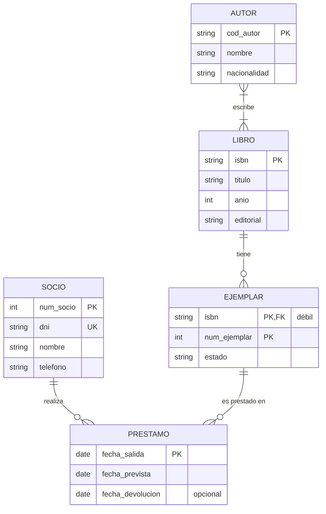
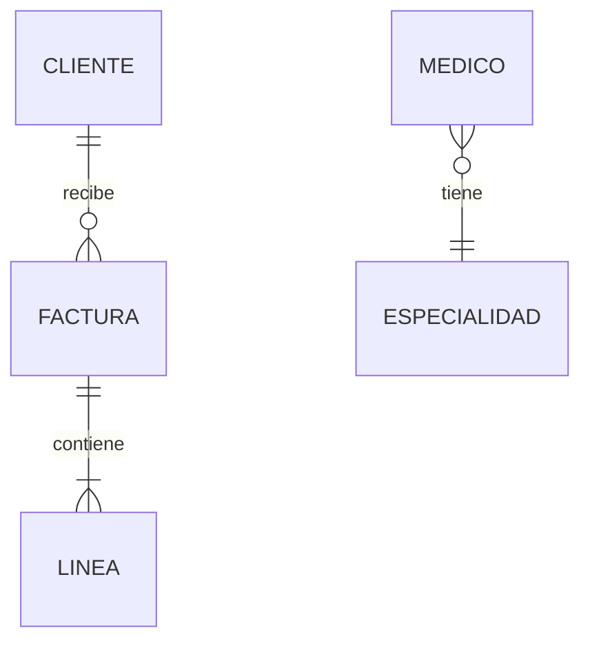
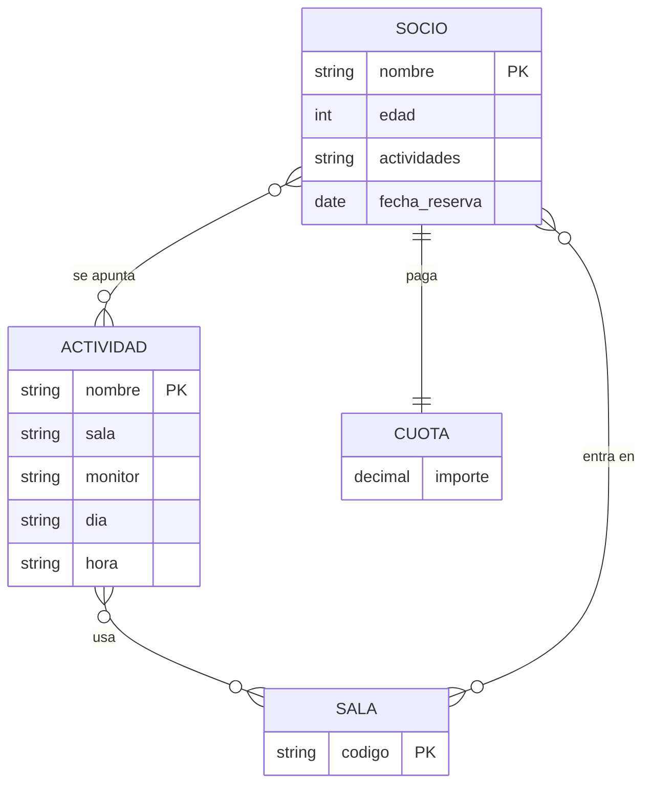

# UD02 · Prácticas



| Práctica | Tipo | Nivel | CE principales |
|---|---|---|---|
| [2.1 Biblioteca municipal: del enunciado al diagrama](#práctica-21--biblioteca-municipal-del-enunciado-al-diagrama) | Guiada | ●○○ | RA6.a, RA6.d, RA6.e |
| [2.2 Leer y escribir cardinalidades](#práctica-22--leer-y-escribir-cardinalidades) | Guiada | ●○○ | RA6.d |
| [2.3 Plataforma de streaming](#práctica-23--plataforma-de-streaming) | Autónoma | ●●○ | RA6.a, RA6.d, RA6.e |
| [2.4 Clínica veterinaria con jerarquías](#práctica-24--clínica-veterinaria-con-jerarquías) | Autónoma | ●●○ | RA6.d, RA6.e, RA6.h |
| [2.5 Revisión de un diseño defectuoso](#práctica-25--revisión-de-un-diseño-defectuoso) | Reto | ●●● | RA6.d, RA6.h |
| [2.6 Autoescuela: ternaria o agregación](#práctica-26--autoescuela-ternaria-o-agregación) | Reto | ●●● | RA6.d |
| [Proyecto EduGest · UD02](#proyecto-edugest--ud02-modelo-conceptual) | Proyecto | ●●○ | RA6.a, RA6.d, RA6.e, RA6.h |
| [Banco de ejercicios](#banco-de-ejercicios) | Autónoma | ●○○ a ●●● | RA6 |

> [!TIP]
> **Método para todos los ejercicios.** (1) Subraya sustantivos y verbos; (2) decide entidades e identificadores; (3) relaciones y cardinalidades en **los dos sentidos**; (4) atributos, incluidos los de las relaciones; (5) revisa redundancias y escribe los **supuestos** que hayas tenido que hacer.

---

## Práctica 2.1 · Biblioteca municipal: del enunciado al diagrama



#### Objetivo

Aplicar la metodología de cinco pasos para construir un diagrama E/R completo a partir de un enunciado sencillo.

#### Contexto

La red de bibliotecas de un ayuntamiento quiere informatizar el préstamo de libros.

#### Enunciado

> De cada **libro** se guarda el ISBN, el título, el año de publicación y la editorial. Un libro puede tener varios **autores** y un autor puede haber escrito varios libros; de cada autor se guarda un código, el nombre y la nacionalidad.
>
> La biblioteca tiene varios **ejemplares** de cada libro. Cada ejemplar se identifica por un número correlativo dentro de su libro (ejemplar 1, 2, 3...) y se guarda su estado de conservación.
>
> Los **socios** (número de socio, DNI, nombre, teléfono) se llevan ejemplares en **préstamo**. De cada préstamo se registra la fecha de salida, la fecha prevista de devolución y la fecha real de devolución. Un socio puede tener varios préstamos a lo largo del tiempo y un ejemplar puede prestarse muchas veces.

#### Desarrollo

{}

1. **Entidades.** Subraya los sustantivos: libro, ISBN, título, autor, ejemplar, socio, préstamo, fecha... Quédate con los que tienen propiedades propias: `LIBRO`, `AUTOR`, `EJEMPLAR`, `SOCIO`. ¿Y `PRÉSTAMO`? Es un **hecho** que relaciona un socio y un ejemplar en una fecha: lo modelaremos como relación.

2. **Identificadores.** `LIBRO`: ISBN. `AUTOR`: código. `SOCIO`: número de socio (el DNI es una **clave alternativa**). `EJEMPLAR`: el número solo es único dentro de su libro, así que es una **entidad débil** cuyo identificador es (ISBN, número).

3. **Relaciones y cardinalidades.** Formula las dos preguntas en los dos sentidos:

    | Relación | Lectura | Cardinalidad |
    |---|---|---|
    | AUTOR *escribe* LIBRO | Un autor escribe (1, N) libros; un libro lo escriben (1, N) autores | N:M |
    | LIBRO *tiene* EJEMPLAR | Un libro tiene (0, N) ejemplares; un ejemplar es de (1, 1) libro | 1:N, identificadora |
    | SOCIO *toma prestado* EJEMPLAR | Un socio tiene (0, N) préstamos; un ejemplar tiene (0, N) préstamos | N:M |

4. **Atributos de las relaciones.** Las fechas no son del socio ni del ejemplar: van en la relación de préstamo. Como el **mismo** socio puede llevarse el **mismo** ejemplar en ocasiones distintas, la fecha de salida forma parte de la identificación de cada préstamo.

5. **Dibuja el diagrama** en draw.io con la notación de Chen (*Más formas* → *Entity Relation*). Después compáralo con la versión en pata de gallo de la solución.

{}

{}

**Supuestos semánticos** (lo que el enunciado no dice y hemos decidido):

1. Un libro registrado tiene al menos un autor conocido.
2. Puede existir un libro sin ejemplares (pedido, pero todavía no recibido).
3. La fecha real de devolución es opcional: está vacía mientras el préstamo sigue abierto.
4. La editorial se guarda como atributo; si hiciera falta guardar más datos de ella, sería una entidad.
{}

#### Comprobación

- [ ] Hay 4 entidades y `EJEMPLAR` está marcada como débil (doble rectángulo en Chen).
- [ ] Las dos relaciones N:M tienen la cardinalidad máxima N en los dos lados.
- [ ] Las fechas del préstamo están en la relación, no en `SOCIO` ni en `EJEMPLAR`.
- [ ] Has escrito al menos tres supuestos semánticos.

#### Errores habituales

> [!WARNING]
> - Relacionar `SOCIO` con `LIBRO` en lugar de con `EJEMPLAR`. Lo que se presta es una copia física, no la obra.
> - Poner `fecha_prestamo` como atributo de `SOCIO`. Un socio tiene muchos préstamos, así que ese atributo solo podría guardar uno.

#### Ampliación

La biblioteca quiere gestionar **reservas**: un socio puede reservar un **libro** (no un ejemplar concreto) y se guarda la fecha de reserva. Añade esta relación y justifica por qué se relaciona con `LIBRO` y no con `EJEMPLAR`.

---

## Práctica 2.2 · Leer y escribir cardinalidades



#### Objetivo

Determinar las cardinalidades mínima y máxima de una relación a partir de frases del lenguaje natural, y al revés.

#### Desarrollo

Para cada frase, escribe la relación en notación (mín, máx) en los **dos sentidos** y el tipo de correspondencia (1:1, 1:N o N:M). Despliega la solución para comprobarla.

| # | Frase |
|---|---|
| a | Todo empleado trabaja en un único departamento; un departamento puede no tener empleados todavía. |
| b | Cada país tiene una capital; cada capital lo es de un único país. |
| c | Un pedido contiene al menos un producto; un producto puede no haberse pedido nunca o aparecer en muchos pedidos. |
| d | Un empleado puede supervisar a varios empleados; todo empleado salvo el director tiene un supervisor. |
| e | Un vehículo de empresa puede estar asignado a un empleado como máximo; un empleado puede no tener vehículo y nunca tiene más de uno. |

{}
| # | Lado A | Lado B | Tipo |
|---|---|---|---|
| a | Un empleado está en (1, 1) departamento | Un departamento tiene (0, N) empleados | 1:N |
| b | Un país tiene (1, 1) capital | Una capital lo es de (1, 1) país | 1:1 |
| c | Un pedido tiene (1, N) productos | Un producto está en (0, N) pedidos | N:M |
| d | Un empleado supervisa a (0, N) empleados | Un empleado es supervisado por (0, 1) empleado | 1:N **reflexiva** |
| e | Un vehículo está asignado a (0, 1) empleado | Un empleado tiene (0, 1) vehículo | 1:1 |

En (d) el mínimo es 0 porque el director no tiene supervisor. Si el enunciado dijera «todo empleado tiene supervisor», el diagrama obligaría a que exista un ciclo infinito de jefes.
{}

#### Segunda parte: del diagrama a la frase

Escribe en lenguaje natural lo que expresa cada diagrama:

{}
- Un cliente recibe cero o muchas facturas; cada factura es de exactamente un cliente.
- Una factura contiene una o muchas líneas; cada línea pertenece a exactamente una factura.
- Cada médico tiene exactamente una especialidad; una especialidad puede tener cero o muchos médicos.
{}

---

## Práctica 2.3 · Plataforma de streaming



#### Objetivo

Elaborar de forma autónoma un modelo E/R con varias relaciones N:M con atributos.

#### Contexto

Una start-up prepara una plataforma de vídeo bajo demanda y te encarga el modelo conceptual.

#### Enunciado

> Los **clientes** se registran con su NIF, nombre, apellidos, correo electrónico (único) y una dirección compuesta por calle, código postal y ciudad. Cada cliente tiene un **plan de suscripción** (Básico, Estándar o Premium); de cada plan se guarda el precio mensual y el número máximo de pantallas simultáneas.
>
> Del catálogo de **películas** se guarda un código, el título, el año, la duración y uno o varios **géneros**. De cada **actor** se guarda un código, el nombre y la nacionalidad. Interesa saber qué actores participan en cada película y el **personaje** que interpretan.
>
> La plataforma registra cada **visualización**: qué cliente ve qué película, la fecha y hora de inicio y el minuto en el que la dejó. Un cliente puede ver la misma película varias veces. Además, el cliente puede **valorar** cada película una sola vez con una puntuación de 1 a 5.

#### Tareas

1. Diagrama E/R completo en la notación que prefieras (indica cuál).
2. **Diccionario de datos**: tabla con entidad o relación, atributo, descripción, tipo de dato conceptual (texto, número, fecha...) y si es obligatorio.
3. Lista de supuestos semánticos.
4. Dos **restricciones** que el diagrama no pueda expresar.

#### Comprobación

- [ ] `género` está modelado como **entidad** o como **atributo multivaluado**, y justificas la elección.
- [ ] `personaje` es un atributo de la relación actor–película.
- [ ] *Visualización* y *valoración* son relaciones **distintas**: una se repite y la otra no.
- [ ] La dirección aparece como atributo **compuesto**.
- [ ] Entre las restricciones textuales está «la puntuación está entre 1 y 5» u otra similar.

{}
Las dos relacionan `CLIENTE` y `PELICULA`, pero la visualización puede repetirse (se identifica también por la fecha y hora), mientras que la valoración es única por pareja cliente-película. Son dos hechos distintos: dos relaciones distintas.
{}

#### Ampliación

Añade **series**, compuestas por temporadas (1, 2, 3...) y episodios numerados dentro de cada temporada. ¿Cuántas entidades débiles aparecen? ¿De quién depende cada una?

---

## Práctica 2.4 · Clínica veterinaria con jerarquías



#### Objetivo

Aplicar la generalización/especialización y clasificar correctamente cada jerarquía.

#### Enunciado

> En la clínica trabajan **empleados** (DNI, nombre, teléfono, fecha de contratación). Todos son **veterinarios** (número de colegiado, especialidad), **auxiliares** (titulación) o **administrativos** (idiomas que hablan). Ningún empleado tiene dos puestos a la vez.
>
> Los **clientes** son los dueños de las **mascotas** (número de chip, nombre, fecha de nacimiento, especie). Algunas mascotas son **perros**, de los que se guarda la raza y si son potencialmente peligrosos, y otras **gatos**, de los que se guarda si están esterilizados. Hay otras especies que no requieren datos adicionales.
>
> Cada **consulta** la realiza un veterinario a una mascota en una fecha; se anota el motivo, el diagnóstico y los **medicamentos** recetados (código, nombre comercial) con su dosis. Un auxiliar puede ayudar en la consulta.

#### Tareas

1. Diagrama EER con todas las jerarquías.
2. Clasifica cada jerarquía como total/parcial y disyunta/solapada y **justifícalo con una frase del enunciado**.
3. Decide si `CONSULTA` es una entidad o una relación. Razona las dos opciones.
4. Escribe las restricciones que no puede recoger el diagrama (por ejemplo, sobre la dosis o sobre quién puede recetar).

#### Comprobación

- [ ] La jerarquía de empleados es **total y disyunta**.
- [ ] La jerarquía de mascotas es **parcial y disyunta**.
- [ ] Los atributos comunes están en la superclase y solo los específicos en las subclases.
- [ ] La dosis es un atributo de la relación consulta–medicamento.

#### Ampliación

¿Cómo cambiaría el modelo si un empleado pudiera ser a la vez auxiliar y administrativo? ¿Y si se quisiera guardar el **historial de puestos** de cada empleado con sus fechas?

---

## Práctica 2.5 · Revisión de un diseño defectuoso



#### Objetivo

Detectar errores de diseño en un modelo ajeno y justificar las correcciones, como se hace en una revisión de código.

#### Contexto

Un compañero ha diseñado el modelo de un **gimnasio** y te pide que lo revises antes de pasar a tablas. El enunciado es: *«Los socios se apuntan a actividades (spinning, yoga...) que se imparten en salas. Cada sesión de una actividad tiene día, hora, sala y monitor. Un socio reserva plaza en sesiones concretas. Cada socio tiene una cuota mensual»*.

#### Enunciado

Encuentra **al menos siete errores**. Para cada uno indica: elemento afectado, tipo de error, consecuencia y corrección. Después dibuja el diagrama corregido.

{}
Identificadores inestables, atributos derivados, atributos multivaluados escondidos en un texto, atributos colocados en la entidad equivocada, entidades que no tienen identificador, conceptos que deberían ser entidades (monitor, sesión), relaciones redundantes.
{}

{}
1. `nombre` como clave de `SOCIO`: los nombres se repiten. → Añadir `num_socio`.
2. `edad`: atributo derivado que se desactualiza. → `fecha_nacimiento`.
3. `actividades` como texto en `SOCIO`: multivaluado escondido y redundante con la relación. → Eliminarlo.
4. `fecha_reserva` en `SOCIO`: es un atributo de la reserva. → Moverlo a la relación.
5. `dia`, `hora`, `sala` y `monitor` en `ACTIVIDAD`: una actividad tiene muchas sesiones. → Crear `SESION` (débil de `ACTIVIDAD` o con identificador propio) con día y hora, relacionada con `SALA` y `MONITOR`.
6. `monitor` como texto: tiene datos propios y participa en relaciones. → Entidad `MONITOR`.
7. `CUOTA` sin identificador y en relación 1:1 obligatoria: si solo guarda el importe, es un atributo de `SOCIO`; si se quiere el historial de pagos, es una entidad débil `PAGO` con mes y año.
8. `SOCIO` *entra en* `SALA`: redundante; se deduce de las sesiones reservadas.
9. El socio no se apunta a una actividad sino que **reserva sesiones**: la relación debe ser SOCIO–SESION.
{}

---

## Práctica 2.6 · Autoescuela: ternaria o agregación



#### Objetivo

Decidir entre una relación ternaria y una agregación y calcular las cardinalidades de una relación ternaria.

#### Enunciado

> En una autoescuela, un **alumno** recibe **clases prácticas** de un **profesor** en un **vehículo** concreto. En cada clase se anota la fecha, la hora y los kilómetros recorridos. Además, cuando el alumno termina su formación con un profesor, la **matrícula** alumno–profesor puede **dar lugar** a una **solicitud de examen** ante la DGT (fecha y resultado). No todos los alumnos llegan a examinarse.

1. Modela las clases prácticas como una relación **ternaria** ALUMNO–PROFESOR–VEHÍCULO. Calcula la cardinalidad de cada entidad fijando las otras dos. Indica si es 1:N:M, N:M:P...
2. Modela la solicitud de examen. Explica por qué una **agregación** de la relación alumno–profesor es mejor que una ternaria con `EXAMEN`.
3. Explica qué información se perdería si sustituyes la ternaria del punto 1 por tres relaciones binarias.

#### Comprobación

- [ ] La ternaria incluye la fecha y la hora como atributos y justificas su cardinalidad (con varios alumnos, profesores y vehículos, suele ser N:M:P).
- [ ] La agregación permite que haya parejas alumno–profesor **sin** examen.
- [ ] Se explica con un ejemplo concreto la pérdida de información de las binarias.

---

## Proyecto EduGest · UD02: modelo conceptual



#### Objetivo

Construir el modelo conceptual completo del proyecto transversal.

#### Enunciado

A partir del [enunciado completo de EduGest](/guia/proyecto-edugest#1-enunciado-entrevista-con-la-jefatura-de-estudios), elabora:

1. El **diagrama E/R** con todas las entidades, relaciones, cardinalidades, atributos e identificadores. El [caso guiado de la teoría](/ud02-modelo-er/ud02-teoria#8-caso-guiado-el-modelo-er-de-edugest) resuelve una parte: complétalo con profesorado, departamentos, tutorías, asignación docente y faltas.
2. El **diccionario de datos** (entidad, atributo, descripción, dominio, obligatorio, identificador).
3. Los **supuestos semánticos**.
4. Las **restricciones textuales**: al menos cinco reglas que el diagrama no puede representar.

#### Comprobación

- [ ] La relación *es jefe de* entre `PROFESOR` y `DEPARTAMENTO` es distinta de *pertenece a*.
- [ ] *Imparte* relaciona profesor, módulo y grupo, e incluye el curso académico. Justificas si es ternaria.
- [ ] Las faltas de asistencia dependen de la matrícula, no solo del alumno.
- [ ] Todas las decisiones dudosas están en la lista de supuestos.

> [!IMPORTANT]
> No consultes todavía la solución de referencia del proyecto. Tu diseño se revisará en clase y lo usarás en la UD03. Las diferencias con la referencia se discutirán en la UD04.

---

## Banco de ejercicios

Colección de enunciados para practicar el diseño conceptual. Para cada uno, elabora el diagrama EER con entidades, atributos, identificadores, relaciones con sus cardinalidades mínimas y máximas, y aplica las técnicas necesarias: entidades débiles, relaciones reflexivas, jerarquías y relaciones ternarias. Acompaña cada diagrama de sus supuestos semánticos.

### Bloque 1: Ejercicios Iniciales y Fundamentales

#### Ejercicio 1: Parentesco Familiar y Filiación

**Enunciado:**
Se desea diseñar una base de datos para registrar relaciones de parentesco entre personas. De cada persona se conocen los atributos DNI, nombre, dirección y teléfono.

Una persona puede ser progenitora (padre o madre) de varios hijos o hijas, o de ninguno. Por otro lado, toda persona registrada en el sistema debe tener registrada obligatoriamente su filiación directa con su progenitor o progenitora.

---

#### Ejercicio 2: Plataforma de Películas en Streaming

**Enunciado:**
Se desea crear una base de datos para una plataforma de cine y películas en streaming.

A los clientes se les solicitan sus datos personales (NIF, nombre, apellidos, correo electrónico y dirección) y el sistema mantiene el saldo disponible en su cuenta de usuario.

Los clientes pueden buscar películas en el catálogo por género cinematográfico, por actores participantes y por título. La plataforma debe registrar qué películas ha visto cada cliente, indicando la fecha y la valoración otorgada por el usuario. De cada película se guarda un código, el título, el año de estreno y la duración en minutos. De los actores se conoce su código, nombre completo y nacionalidad.

---

#### Ejercicio 3: Gestión Municipal de Multas de Tráfico

**Enunciado:**
Un Ayuntamiento requiere una base de datos para la gestión integral de las infracciones y multas de tráfico de la localidad.

De cada vehículo se desea registrar la matrícula, el tipo, la marca y el modelo. Un vehículo pertenece a un propietario registrado. De los propietarios interesa guardar su DNI, nombre, apellidos y dirección. Un propietario puede tener varios vehículos a su nombre.

Existe también un catálogo de infracciones de tráfico, de las que se conoce el código de infracción, una descripción y la cuantía a pagar.

Cuando un vehículo comete una infracción, se genera la multa correspondiente registrando la fecha de la sanción y la fecha de pago. Un mismo vehículo puede ser sancionado con varias multas a lo largo del tiempo, y una infracción del catálogo puede ser cometida en múltiples ocasiones por diferentes vehículos.

---

#### Ejercicio 4: Ventas, Clientes, Productos y Proveedores

**Enunciado:**
Una empresa comercializa productos a clientes finales y se abastece mediante proveedores externos.

De cada cliente se conocen sus datos personales: DNI, nombre, apellidos, dirección y fecha de nacimiento. Un cliente puede comprar varios productos y un mismo producto puede ser adquirido por diferentes clientes.

De cada producto se almacena un código identificativo, el nombre y el precio unitario.

Los productos son suministrados por proveedores. Cada producto solo puede ser suministrado por un único proveedor exclusivo, mientras que un proveedor puede suministrar diferentes productos. De los proveedores se desea conocer su NIF, nombre y dirección.

---

#### Ejercicio 5: Transporte Naviero y Contenedores

**Enunciado:**
Una empresa naviera internacional requiere gestionar su flota de transporte de mercancías.

De los capitanes de los barcos se quiere guardar el DNI, nombre, teléfono, dirección, salario y población de residencia. Un capitán transporta muchos contenedores de mercancías, y un contenedor solo es distribuido o transportado por un único capitán.

De los contenedores transportados interesa conocer su código de contenedor, una descripción, la dirección del remitente y la dirección del destinatario. Cada contenedor tiene como destino un único puerto. Sin embargo, a un puerto pueden llegar múltiples contenedores. De los puertos se conserva el código de puerto y el nombre.

Respecto a los barcos de la naviera, se conoce su matrícula, el nombre del barco, la potencia del motor y el astillero de fabricación. Un capitán puede gobernar diferentes barcos en fechas distintas (registrando la fecha de inicio y la fecha de fin), y un mismo barco puede ser navegado por varios capitanes a lo largo del tiempo.

---

#### Ejercicio 6: Sistema Académico de Instituto

**Enunciado:**
Un Instituto de Educación Secundaria y Formación Profesional necesita diseñar su base de datos para la gestión de la docencia y el alumnado:

De los profesores se guarda su DNI, nombre, dirección y teléfono. Los profesores imparten módulos académicos, y cada módulo tiene un código y un nombre. Un profesor puede impartir varios módulos, pero un módulo solo puede ser impartido por un único profesor.

Algunos módulos tienen como prerrequisito haber cursado previamente otros módulos. Un módulo puede necesitar varios módulos previos como requisito, y a su vez ser requisito de otros módulos.

De cada alumno se almacena su número de expediente, nombre, apellidos y fecha de nacimiento. Un alumno se matricula en uno o varios módulos, registrando la fecha de matriculación.

Cada curso cuenta con un grupo de alumnos. Dentro de cada grupo de alumnos, se elige a uno de ellos para actuar como delegado del grupo.

Finalmente, los alumnos que lo soliciten pueden disponer de un casillero personal cerrado para guardar sus pertenencias, del que se conoce su número de casillero y su tamaño en metros. Un casillero pertenece a un único alumno y un alumno puede tener como máximo un casillero asignado.

---

#### Ejercicio 7: Concesionario y Mantenimiento de Vehículos

**Enunciado:**
Un concesionario de automóviles gestiona la venta y el mantenimiento postventa de vehículos:

De cada coche se conoce la matrícula, marca, modelo, color y precio de venta. De cada cliente se registra un código interno de cliente, NIF, nombre, dirección, ciudad y número de teléfono. Un cliente puede comprar varios coches, pero un coche determinado solo puede ser comprado por un único cliente.

En el taller del concesionario se realizan revisiones a los coches. Cada revisión se identifica por un número secuencial de revisión (1, 2, 3...) dentro de cada coche determinado. De cada revisión se desea saber si se ha hecho cambio de filtro, cambio de aceite, cambio de frenos u otros mantenimientos. Un coche puede pasar múltiples revisiones en el concesionario.

Cada revisión es realizada por un único mecánico, del que se conoce su código de empleado, DNI, nombre, teléfono y dirección. Un mecánico realiza muchas revisiones. Entre los mecánicos existe un revisor o supervisor que gestiona y supervisa el trabajo de otros mecánicos del taller.

---

#### Ejercicio 8: Gestión Hospitalaria de Ingresos

**Enunciado:**
Una clínica necesita llevar un control informatizado de la gestión de sus pacientes y médicos:

De cada paciente se desea guardar su código de paciente, nombre, apellidos, dirección, población, provincia, código postal, teléfono y fecha de nacimiento.

De cada médico se conserva el código de médico, nombre, apellidos, teléfono y especialidad.

Se desea llevar el control de los ingresos que realiza cada paciente en el hospital. Cada ingreso que realiza un paciente queda registrado en la base de datos mediante un código de ingreso (que se incrementa automáticamente empezando en 1 para cada paciente concreto), e incluye el número de habitación, la cama asignada y la fecha de ingreso. Un paciente puede realizar varios ingresos hospitalarios a lo largo del tiempo, y un ingreso no puede existir independientemente sin el paciente al que corresponde.

Un médico atiende los ingresos de los pacientes. Cada ingreso es atendido por un único médico responsable, aunque un médico puede atender varios ingresos de diferentes pacientes.

---

#### Ejercicio 9: Biblioteca y Préstamo de Ejemplares

**Enunciado:**
En la biblioteca del centro educativo se manejan fichas de autores, libros, ejemplares y usuarios:

De cada autor se guarda el código de autor y el nombre. De cada libro se conoce el código de libro, título, ISBN, editorial y número de páginas. Un autor puede escribir varios libros y un libro puede ser escrito por varios autores.

Un libro está formado por varios ejemplares físicos. De cada ejemplar se conoce su código de ejemplar (que identifica la copia dentro de ese libro) y su localización en la estantería. Un libro tiene muchos ejemplares y un ejemplar pertenece solo a un libro.

De los usuarios de la biblioteca se almacena el código de usuario, nombre, dirección y teléfono. Los usuarios toman prestados los ejemplares de los libros. Un usuario puede tomar prestados varios ejemplares y un ejemplar puede ser prestado a varios usuarios en momentos diferentes, registrando de cada préstamo la fecha de préstamo y la fecha de devolución.

---

#### Ejercicio 10: Empresa de Repostería PAVA S.A

**Enunciado:**
Una gran empresa de dulces y repostería ("PAVA S.A.") necesita crear una base de datos centralizada para almacenar toda la información necesaria para su funcionamiento:

La empresa elabora sus productos a partir de una serie de ingredientes básicos. De cada ingrediente se conoce su nombre (no hay dos ingredientes con el mismo nombre), la cantidad de vitaminas A, B y C por cada 100 gramos, las calorías y el coste por kilogramo.

Con estos ingredientes fabrica una serie de productos (como "Filipondios", "Barridulces", etc.), conocidos por su nombre comercial. De cada uno de estos productos nos interesa conocer su composición en ingredientes y el porcentaje en el que participa cada ingrediente en la receta del producto.

Los productos se comercializan en distintos formatos de peso (por ejemplo, 40g, 150g, 250g), teniendo cada formato un precio de venta determinado.

De los clientes se almacena su CIF, nombre, dirección, población, provincia y teléfono de contacto. Los clientes realizan pedidos en los que solicitan unidades de productos en formatos específicos (por ejemplo: 200 unidades de Barridulces en formato de 250g).

Por otro lado, la empresa quiere tener previstas todas las promociones que realizará a lo largo del año (como "2x1" o "Vale descuento"). Cada tipo de promoción se pone en marcha una vez al año. Se conocerá la fecha de inicio, la fecha de fin y la cantidad máxima de productos en cada formato que pueden beneficiarse de dicha promoción.

Finalmente, la empresa desea realizar un seguimiento de productos similares de la competencia que se comercializan en el mercado, de los cuales conocerá su nombre comercial (único), la marca que los fabrica y el año en el que salen al mercado por primera vez, vinculándolos al producto de la empresa al que más se asemejan.

---

#### Ejercicio 11: Comandancia de Starship Troopers

**Enunciado:**
Se desea registrar en una base de datos el funcionamiento interno de una comandancia de la fuerza de defensa Starship Troopers:

De los miembros de la tropa se conoce su número de placa, DNI, nombre y categoría profesional. Los Troopers pueden desempeñar funciones distintas (pilotos, agentes, etc.). Cada Trooper tiene un único jefe directo a su cargo, aunque un Trooper puede ser jefe de varios subordinados.

En la comandancia existe un arsenal de armas. Cada arma está identificada por un código único, pertenece a una clase y tiene un nombre determinado. Un Trooper puede utilizar una o varias armas en distintos momentos, siendo importante conocer el grado de habilidad (puntuación de 1 a 10) de cada Trooper con cada una de las armas que utiliza.

De los seres capturados ("bichos") se desea conocer su identificador, raza, localización de origen y peso. Un bicho es detenido por uno o varios Troopers, guardándose la fecha de la detención. Un mismo Trooper puede detener al mismo bicho en diferentes fechas.

A cada bicho que permanece en la comandancia se le encierra en una mazmorra (conocida por su código y ubicación). En una mazmorra pueden estar encerrados varios bichos (nunca más de cuatro). Los bichos están involucrados en asaltos o delitos (de los que se conoce el número de asalto y el juzgado que lo instruye), interesando saber el principal cargo que se le imputa a un bicho en cada delito. Uno o varios Troopers investigan cada uno de los casos.

---

#### Ejercicio 12: Muestra Gastronómica de Platos Españoles

**Enunciado:**
Se va a organizar una muestra gastronómica de platos típicos de la geografía española, proporcionando también información sobre las localidades a las que pertenecen:

De las provincias españolas se conoce su nombre, extensión y la ciudad capital. De las localidades pintorescas de estas provincias se conoce su nombre, tamaño y número de habitantes. Cabe tener en cuenta que dos localidades pertenecientes a diferentes provincias pueden coincidir en el nombre.

De los platos típicos se almacena el nombre del plato, los ingredientes básicos y la forma general de preparación. Un plato puede ser típico de más de una localidad y en una localidad pueden conservarse varios platos típicos. Se debe registrar para cada localidad una breve descripción de las posibles variaciones locales al preparar el plato con respecto a la receta básica.

En las localidades se ubican restaurantes especializados, de los que se conserva su nombre, dirección, número de teléfono, precio aproximado del menú del día y capacidad máxima de comensales. Los nombres de los restaurantes pueden coincidir en diferentes localidades (nunca dentro de la misma localidad). Cada restaurante debe estar especializado en al menos uno de los platos típicos.

Asimismo, se han planificado visitas guiadas en cada localidad. De estas visitas se mantendrá el nombre del lugar a visitar (que puede coincidir en varias localidades, pero es único por localidad). En el caso de visitas culturales se indicará el horario establecido, mientras que si la visita es de tipo industrial (fábricas de embutidos, sidra, etc.) se conservará el nombre de la persona de contacto y el teléfono.

Por último, de las bodegas patrocinadoras se conoce su CIF, nombre del director, dirección de la sede y teléfono de contacto. Las bodegas ofrecen diversas variedades de vino (con código identificador, cosecha, grado, color y textura). Un grupo de expertos ha aconsejado qué vino específico servir con cada uno de los platos típicos.

---

### Bloque 2: Ejercicios Avanzados y Casos Complejos

#### Ejercicio 13: Consultora de Desarrollo de Software

**Enunciado:**
Una consultora tecnológica gestiona proyectos de desarrollo de software para empresas clientes:

De los clientes se registra el CIF, razón social, sitio web y teléfono de contacto. Un cliente puede encargar varios proyectos a la consultora, pero un proyecto pertenece a un único cliente.

De cada proyecto se conoce su código de proyecto, nombre, fecha de inicio y presupuesto total. Un proyecto se descompone en múltiples tareas. Cada tarea se identifica por un número secuencial de tarea (1, 2, 3...) dentro de su proyecto correspondiente. De cada tarea se guarda la descripción, las horas estimadas de trabajo y su estado (Pendiente, En Proceso, Completada).

De los desarrolladores se almacena su número de empleado, DNI, nombre, especialidad y nivel profesional. Un desarrollador es asignado a varias tareas y en una tarea pueden trabajar varios desarrolladores, registrando las horas reales invertidas. Además, dentro del equipo de desarrolladores existen mentores seniors que tutelan el trabajo de otros desarrolladores junior.

---

#### Ejercicio 14: Cadena Hotelera Internacional

**Enunciado:**
Una cadena hotelera necesita estructurar el sistema central de reservas de sus establecimientos:

De cada hotel se conoce su código de hotel, nombre, categoría de estrellas, dirección y ciudad.

Un hotel dispone de múltiples habitaciones. Cada habitación se identifica por su número de habitación (por ejemplo 101, 102, 201...) dentro de cada hotel en particular. De cada habitación se indica el tipo (Individual, Doble, Suite) y el precio por noche.

De los clientes se registra el DNI, nombre, e-mail y teléfono. Un cliente realiza reservas sobre habitaciones específicas de un hotel para un periodo determinado, registrando la fecha de entrada, la fecha de salida y el precio total de la estancia.

De los empleados de la cadena se conoce su código de empleado, nombre y puesto de trabajo. Los empleados están asignados a un hotel determinado. Dentro de la plantilla, las gobernantas de planta supervisan el trabajo diario del resto del personal de limpieza del hotel.

---

#### Ejercicio 15: Planta de Fabricación Industrial y Lista de Materiales (BOM)

**Enunciado:**
Una planta industrial de maquinaria pesada gestiona su proceso de producción:

De las fábricas se conoce el código de fábrica, su ubicación y teléfono. Una fábrica alberga varias líneas de montaje, identificadas por un código de línea y su denominación.

De las piezas utilizadas en la producción se registra el código de pieza, nombre, peso en gramos y coste estándar. Una pieza puede estar formada o ensamblada a partir de varias subpiezas componentes, y a su vez una subpieza puede formar parte del ensamblaje de distintas piezas superiores. En esta relación de componentes interesa guardar la cantidad de unidades necesarias de cada subpieza para montar la pieza superior.

Cada pieza fabricada en una línea de montaje pasa controles de calidad. La inspección de calidad genera informes identificados por un número de inspección relativo a cada pieza. De la inspección se conoce la fecha de realización, el resultado (Aprobado o Rechazado) y las observaciones redactadas por los inspectores. Si una pieza es descatalogada y eliminada del sistema, sus informes de inspección deben borrarse automáticamente.

---

#### Ejercicio 16: Organización Universitaria y Cátedras

**Enunciado:**
Una universidad pública organiza su estructura académica e investigadora:

De las facultades se guarda el código de facultad y el nombre de la facultad. Una facultad engloba varios departamentos académicos, de los que se conoce el código de departamento y el área de conocimiento.

Dentro de cada departamento se crean cátedras de investigación. Cada cátedra se identifica por un número interno de cátedra dentro de su departamento, registrando el nombre de la cátedra y el presupuesto asignado.

De los profesores se guarda su número de registro personal, DNI, nombre, categoría docente y fecha de incorporación. Un profesor pertenece a un único departamento. Un profesor con categoría de catedrático puede ser nombrado director de una cátedra de investigación. Además, dentro del departamento, los profesores veteranos ejercen como tutores docentes de los profesores noveles de reciente incorporación.

---

#### Ejercicio 17: Empresa Municipal de Transportes Urbanos

**Enunciado:**
Una empresa de transportes urbanos gestiona la red de autobuses de la ciudad:

De las líneas de autobús se conoce su código de línea (por ejemplo "L1", "L5"), el nombre del trayecto y la frecuencia de paso en minutos.

Cada línea de autobús realiza su itinerario realizando paradas en una secuencia ordenada. Cada parada se identifica por su número de orden en el recorrido (1, 2, 3...) dentro de la línea correspondiente, guardando el nombre de la calle o marquesina y si dispone de pantalla digital de información.

Entre distintas líneas de autobús se habilitan puntos de transbordo para permitir el intercambio de pasajeros, registrando el tiempo estimado a pie entre las líneas conectadas.

De los autobuses de la flota se guarda la matrícula, modelo y capacidad de pasajeros de pie. De los conductores se conoce su DNI, nombre y tipo de licencia. Los conductores conducen los autobuses asignados a las distintas líneas en turnos de trabajo específicos.

---

#### Ejercicio 18: Federación y Ligas Deportivas

**Enunciado:**
Una federación deportiva automatiza el control de sus competiciones oficiales:

De los clubes o equipos se conoce el código de equipo, el nombre del club y la ciudad. De los jugadores se registra el número de ficha federativa, DNI, nombre y dorsal. Un jugador pertenece a un único equipo. Dentro de cada equipo, se designa a uno de sus jugadores para actuar como capitán oficial del equipo.

De los partidos disputados se guarda el código de partido, la fecha y hora, y el número de jornada. En cada partido se enfrentan obligatoriamente dos equipos distintos: uno en calidad de equipo local y otro en calidad de equipo visitante.

Durante el transcurso de un partido se registran los eventos e incidencias en el acta oficial. Cada incidencia del acta se identifica por el minuto de juego y un número de secuencia dentro de ese partido concreto, indicando el tipo de incidencia (gol, tarjeta amarilla, expulsión, sustitución) y el jugador implicado en la acción. Si un partido es anulado de la competición, las incidencias registradas en su acta se eliminan de la base de datos.

---

#### Ejercicio 19: Centro de Detención Juvenil y Expedientes

**Enunciado:**
En un centro de detención juvenil se requiere llevar un registro informatizado de los residentes menores de edad y sus expedientes de seguimiento:

De cada menor residente se conoce su número de expediente del centro, nombre, apellidos, fecha de nacimiento y datos de contacto de sus progenitores o tutores legales (nombre del padre, nombre de la madre y teléfono).

De cada educador o especialista del centro se registra el número de colegiado, DNI, nombre, apellidos y especialidad (psicología, trabajo social, educación social). Un educador tutela el seguimiento de varios menores residentes, pero cada menor tiene asignado un único educador tutor principal. Además, entre los educadores existe un educador coordinador que supervisa la labor del resto del equipo técnico.

Para cada menor residente se abren informes de seguimiento disciplinario y evolutivo. Cada informe se identifica mediante un número de informe correlativo (1, 2, 3...) abierto para ese menor en concreto, registrando la fecha del informe, la valoración evolutiva y las incidencias observadas. Si la ficha de un residente es cancelada y eliminada del sistema por cumplimiento de la medida, todos sus informes de seguimiento se borran de la base de datos.

---

#### Ejercicio 20: Torneo Mágico de Quidditch

**Enunciado:**
Se va a celebrar un torneo oficial de Quidditch entre diferentes escuelas y clubes mágicos:

De cada equipo se registra el código de equipo, nombre del club, casa o colegio al que representa y año de fundación. De los jugadores inscritos se conoce su número de carné federativo, nombre, apellidos y posición de juego habitual (Guardián, Golpeador, Cazador, Buscador). Un jugador pertenece a un único equipo. En cada equipo se designa a uno de sus miembros para ejercer la función de capitán del equipo.

De los partidos del torneo se conoce el código de partido, el estadio o terreno de juego, la fecha y hora de celebración, y el árbitro asignado. En cada partido compiten dos equipos (equipo local y equipo visitante).

Durante la celebración de un encuentro se registran las capturas de la snitch y las infracciones o penaltis señalados. Cada penalización o lance de acta se identifica por el minuto de juego y un número de secuencia dentro de ese partido determinado, registrando el tipo de falta cometida, la puntuación otorgada y el jugador sancionado.

---

#### Ejercicio 21: Red de Gimnasios y Rutinas Personalizadas

**Enunciado:**
Una red de centros deportivos y gimnasios gestiona sus instalaciones, socios y entrenamientos:

De cada gimnasio de la cadena se conoce su código de centro, nombre comercial, dirección, ciudad y superficie en metros cuadrados.

Cada gimnasio dispone de diversas salas de entrenamiento. Cada sala se identifica por un número de sala (101, 102, Sala A, Sala B...) que es propio de ese gimnasio en particular. Se registra el tipo de actividad desarrollada en la sala (Musculación, Cardio, Pilates, Spin) y la capacidad máxima de aforo.

De los socios se almacena el número de socio, DNI, nombre, apellidos, teléfono y fecha de alta. Un socio está inscrito en un gimnasio principal, pero puede reservar clases en las salas de cualquiera de los centros de la cadena registrando la fecha, hora y plaza reservada.

De los entrenadores personales se conoce su código de empleado, nombre, especialidad y titulación. Cada entrenador diseña rutinas personalizadas para los socios, registrando la fecha de asignación y el objetivo fijado. Dentro de la plantilla de entrenadores, un director técnico de centro coordina y supervisa el trabajo del resto de entrenadores del gimnasio.

---

### Bloque 3: Ejercicios Integradores EER Avanzados

#### Ejercicio 22: Seguridad Bancaria, Sucursales, Vigilantes y Atracos

**Enunciado:**
La Policía Nacional y la Asociación de Entidades Bancarias requieren una base de datos sobre la seguridad de las entidades financieras y el seguimiento de delitos:

De las entidades bancarias se conoce su código y la dirección de la sede central. Una entidad bancaria cuenta con múltiples sucursales, identificadas por un código de sucursal y su dirección, indicando el número de empleados destinados en ella.

Las sucursales contratan vigilantes de seguridad. De los vigilantes se guarda su código de vigilante, DNI, nombre y edad. Un vigilante se clasifica obligatoriamente en uno de los siguientes tipos: vigilante armado (de quien se registra la puntuación de tiro y el calibre del arma) o vigilante no armado (de quien se indica si posee titulación en artes marciales y defensa personal). Un vigilante puede ser contratado por distintas sucursales en fechas diferentes, registrando si el contrato es con arma o no.

Por otra parte, se controla a las personas detenidas por atracar sucursales. De cada detenido se conoce su código y nombre completo. Algunas de estas personas están integradas en bandas organizadas. Las bandas se definen por un número de banda y el número de miembros. Asimismo, entre las bandas existe una relación jerárquica o de alianza, donde una banda organizada puede estar subordinada o vinculada a otra banda matriz o cártel principal.

Cada atraco registrado constituye una investigación en la que participan el detenido, la sucursal bancaria atracada y el juez instructor asignado al caso, registrando la fecha del atraco, la condena impuesta en años de prisión y la indemnización fijada. De los jueces se guarda la clave interna del juzgado, nombre y años de servicio.

---

#### Ejercicio 23: Complejo Hospitalario Balneario, Plantas y Tratamientos

**Enunciado:**
Un hotel-balneario termal desea automatizar la gestión de sus huéspedes, instalaciones médicas y tratamientos de salud:

De los clientes se almacena su DNI, nombre, apellidos y fecha de nacimiento. Los clientes se clasifican obligatoriamente en dos categorías: clientes alojados en el hotel y clientes ambulantes o externos que acuden exclusivamente a tratamientos de día. De los clientes alojados se conoce el número de tarjeta de crédito y fecha de salida prevista, mientras que de los ambulantes se guarda un teléfono de emergencia.

El hotel se divide en plantas identificadas por su número de planta, nombre descriptivo y número de habitaciones de que dispone. Cada planta alberga múltiples habitaciones. Las habitaciones se identifican por un número de habitación (101, 102, 201...) que se numera correlativamente por cada planta (por lo que existen la habitación 1 de la tercera planta y la habitación 1 de la octava planta). De cada habitación se guarda la capacidad de personas. Las habitaciones se clasifican en suites (registrando número de jacuzzis y metros cuadrados) o habitaciones estándar (registrando si admite cama supletoria y tipo de baño).

Un cliente reservará una habitación determinada de una planta, registrando la fecha de asignación. Asimismo, las consultas y tratamientos de salud constituyen un servicio prestado de forma conjunta donde intervienen el cliente, el especialista o empleado asignado y el tratamiento balneario realizado, registrando la fecha, hora, duración en minutos y observaciones médicas. De los empleados se conoce su código, nombre y puesto. De los terapeutas o empleados especializados existe una jerarquía de supervisión médica donde un terapeuta senior coordina y supervisa el trabajo de otros terapeutas junior.

---

#### Ejercicio 24: Red Nacional de Producción y Distribución de Energía Eléctrica

**Enunciado:**
El Ministerio de Transición Ecológica requiere un sistema informatizado para controlar la producción, transmisión y distribución de energía eléctrica en el país:

Existen centrales generadoras de electricidad identificadas por su código de central, nombre único, producción media y fecha de entrada en funcionamiento. Las centrales generadoras se clasifican de forma obligatoria en tres tipos: centrales hidroeléctricas (registrando el río, embalse y volumen útil de agua), centrales térmicas o nucleares (registrando el combustible utilizado y volumen de emisiones) y centrales renovables solares o eólicas (registrando el número de generadores y superficie de captación).

Cada central generadora mantiene un registro de partes e incidencias de mantenimiento. El parte de mantenimiento no tiene un código único nacional, sino que se identifica mediante un número secuencial de incidencia (1, 2, 3...) abierto para cada central generadora en particular, guardando la fecha de la revisión, la empresa mantenedora y el coste del arreglo.

La transmisión de energía se realiza a través de la red de subestaciones y nodos de alta tensión. Los nodos de la red están interconectados entre sí mediante líneas de transmisión eléctrica (relación entre nodos), registrando la capacidad máxima de transporte en kilovoltios y la distancia en kilómetros entre los nodos conectados.

Finalmente, el suministro mayorista de energía se organiza como un acuerdo conjunto entre la central generadora, la empresa comercializadora compradora y la zona de distribución territorial asignada, registrando la cantidad de megavatios/hora contratados, la tarifa acordada y la fecha del contrato.

---

#### Ejercicio 25: Club Hípico, Cuadras, Lecciones y Torneos Ecuestres

**Enunciado:**
Un club hípico de alto rendimiento desea gestionar sus instalaciones, la cabaña equina, las clases de equitación y los miembros del club:

De los caballos del club se conoce su código de microchip, nombre del caballo, raza y fecha de nacimiento. Los caballos se clasifican obligatoriamente en caballos propios del club (de los que se indica la fecha de adquisición y coste mensual de mantenimiento) y caballos de socios privados (de los que se indica el DNI del socio propietario y la cuota de pupilaje). Además, se mantiene el registro genealógico de los caballos, donde un caballo progenitor (padre o madre) es progenitor de múltiples potros nacidos en el club.

Los establos del club se dividen en pabellones identificados por su código de pabellón y nombre. Cada pabellón alberga múltiples cuadras o boxes individuales. La cuadra se identifica mediante un número de box (Box 1, Box 2, Box 3...) que se numera de forma correlativa dentro de cada pabellón.

De los instructores de equitación se conoce su número de colegiado, DNI, nombre y titulación. Los instructores se clasifican en instructores titulares e instructores en prácticas.

Las sesiones de entrenamiento y lecciones ecuestres constituyen una actividad en la que intervienen conjuntamente el alumno o socio que recibe la clase, el instructor que imparte la lección y el caballo asignado para la sesión, registrando la fecha, hora, pista utilizada y nivel de la clase (Iniciación, Doma, Salto).
