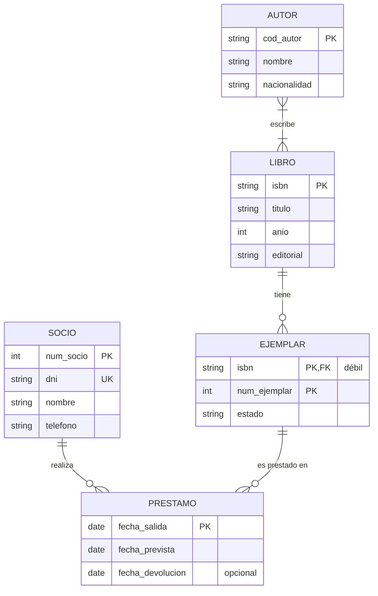
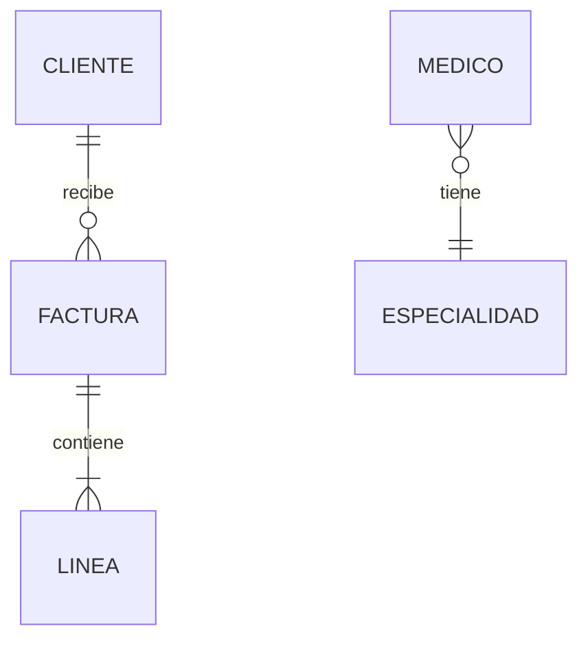
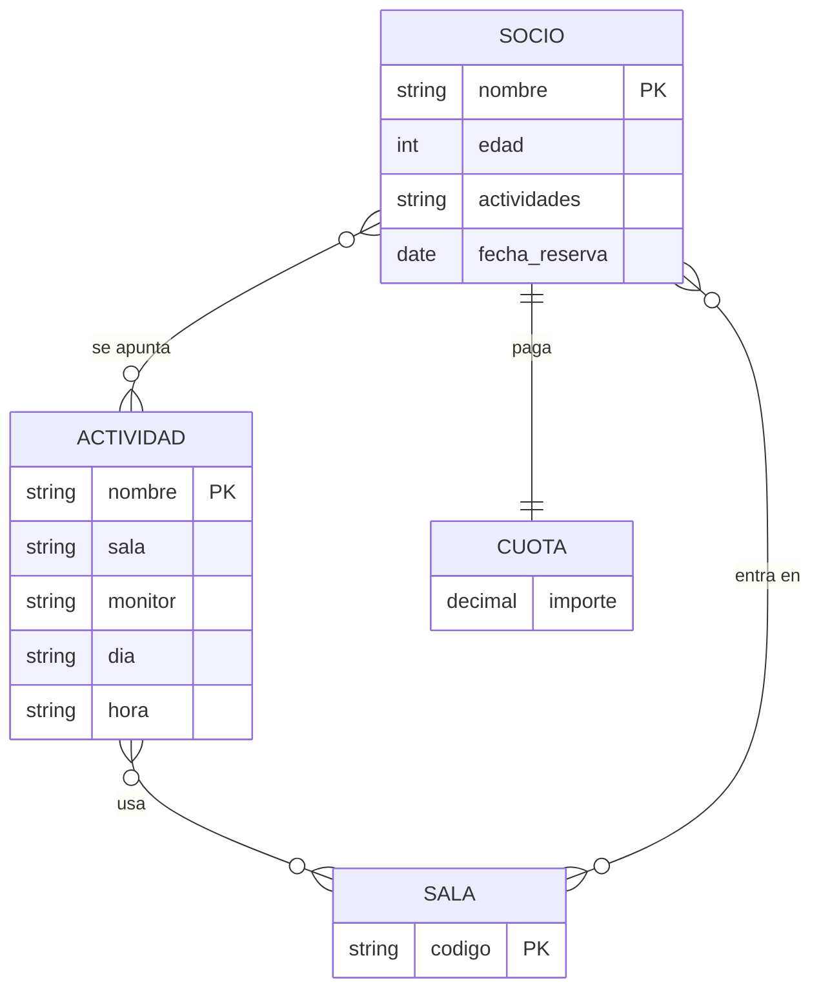

# UD02 · Prácticas



| Práctica | Tipo | Nivel | CE principales |
|---|---|---|---|
| [2.1 Biblioteca municipal: del enunciado al diagrama](#práctica-21--biblioteca-municipal-del-enunciado-al-diagrama) | Guiada | ●○○ | RA6.a, RA6.d, RA6.e |
| [2.2 Leer y escribir cardinalidades](#práctica-22--leer-y-escribir-cardinalidades) | Guiada | ●○○ | RA6.d |
| [2.3 Plataforma de streaming](#práctica-23--plataforma-de-streaming) | Autónoma | ●●○ | RA6.a, RA6.d, RA6.e |
| [2.4 Clínica veterinaria con jerarquías](#práctica-24--clínica-veterinaria-con-jerarquías) | Autónoma | ●●○ | RA6.d, RA6.e, RA6.h |
| [2.5 Revisión de un diseño defectuoso](#práctica-25--revisión-de-un-diseño-defectuoso) | Reto | ●●● | RA6.d, RA6.h |
| [2.6 Autoescuela: ternaria o agregación](#práctica-26--autoescuela-ternaria-o-agregación) | Reto | ●●● | RA6.d |
| [Proyecto EduGest · UD02](#proyecto-edugest--ud02-modelo-conceptual) | Proyecto | ●●○ | RA6.a, RA6.d, RA6.e, RA6.h |

> [!TIP]
> **Método para todos los ejercicios.** (1) Subraya sustantivos y verbos; (2) decide entidades e identificadores; (3) relaciones y cardinalidades en **los dos sentidos**; (4) atributos, incluidos los de las relaciones; (5) revisa redundancias y escribe los **supuestos** que hayas tenido que hacer.

---

## Práctica 2.1 · Biblioteca municipal: del enunciado al diagrama



#### Objetivo

Aplicar la metodología de cinco pasos para construir un diagrama E/R completo a partir de un enunciado sencillo.

#### Contexto

La red de bibliotecas de un ayuntamiento quiere informatizar el préstamo de libros.

#### Enunciado

> De cada **libro** se guarda el ISBN, el título, el año de publicación y la editorial. Un libro puede tener varios **autores** y un autor puede haber escrito varios libros; de cada autor se guarda un código, el nombre y la nacionalidad.
>
> La biblioteca tiene varios **ejemplares** de cada libro. Cada ejemplar se identifica por un número correlativo dentro de su libro (ejemplar 1, 2, 3...) y se guarda su estado de conservación.
>
> Los **socios** (número de socio, DNI, nombre, teléfono) se llevan ejemplares en **préstamo**. De cada préstamo se registra la fecha de salida, la fecha prevista de devolución y la fecha real de devolución. Un socio puede tener varios préstamos a lo largo del tiempo y un ejemplar puede prestarse muchas veces.

#### Desarrollo

{}

1. **Entidades.** Subraya los sustantivos: libro, ISBN, título, autor, ejemplar, socio, préstamo, fecha... Quédate con los que tienen propiedades propias: `LIBRO`, `AUTOR`, `EJEMPLAR`, `SOCIO`. ¿Y `PRÉSTAMO`? Es un **hecho** que relaciona un socio y un ejemplar en una fecha: lo modelaremos como relación.

2. **Identificadores.** `LIBRO`: ISBN. `AUTOR`: código. `SOCIO`: número de socio (el DNI es una **clave alternativa**). `EJEMPLAR`: el número solo es único dentro de su libro, así que es una **entidad débil** cuyo identificador es (ISBN, número).

3. **Relaciones y cardinalidades.** Formula las dos preguntas en los dos sentidos:

    | Relación | Lectura | Cardinalidad |
    |---|---|---|
    | AUTOR *escribe* LIBRO | Un autor escribe (1, N) libros; un libro lo escriben (1, N) autores | N:M |
    | LIBRO *tiene* EJEMPLAR | Un libro tiene (0, N) ejemplares; un ejemplar es de (1, 1) libro | 1:N, identificadora |
    | SOCIO *toma prestado* EJEMPLAR | Un socio tiene (0, N) préstamos; un ejemplar tiene (0, N) préstamos | N:M |

4. **Atributos de las relaciones.** Las fechas no son del socio ni del ejemplar: van en la relación de préstamo. Como el **mismo** socio puede llevarse el **mismo** ejemplar en ocasiones distintas, la fecha de salida forma parte de la identificación de cada préstamo.

5. **Dibuja el diagrama** en draw.io con la notación de Chen (*Más formas* → *Entity Relation*). Después compáralo con la versión en pata de gallo de la solución.

{}

{}

**Supuestos semánticos** (lo que el enunciado no dice y hemos decidido):

1. Un libro registrado tiene al menos un autor conocido.
2. Puede existir un libro sin ejemplares (pedido, pero todavía no recibido).
3. La fecha real de devolución es opcional: está vacía mientras el préstamo sigue abierto.
4. La editorial se guarda como atributo; si hiciera falta guardar más datos de ella, sería una entidad.
{}

#### Comprobación

- [ ] Hay 4 entidades y `EJEMPLAR` está marcada como débil (doble rectángulo en Chen).
- [ ] Las dos relaciones N:M tienen la cardinalidad máxima N en los dos lados.
- [ ] Las fechas del préstamo están en la relación, no en `SOCIO` ni en `EJEMPLAR`.
- [ ] Has escrito al menos tres supuestos semánticos.

#### Errores habituales

> [!WARNING]
> - Relacionar `SOCIO` con `LIBRO` en lugar de con `EJEMPLAR`. Lo que se presta es una copia física, no la obra.
> - Poner `fecha_prestamo` como atributo de `SOCIO`. Un socio tiene muchos préstamos, así que ese atributo solo podría guardar uno.

#### Ampliación

La biblioteca quiere gestionar **reservas**: un socio puede reservar un **libro** (no un ejemplar concreto) y se guarda la fecha de reserva. Añade esta relación y justifica por qué se relaciona con `LIBRO` y no con `EJEMPLAR`.

---

## Práctica 2.2 · Leer y escribir cardinalidades



#### Objetivo

Determinar las cardinalidades mínima y máxima de una relación a partir de frases del lenguaje natural, y al revés.

#### Desarrollo

Para cada frase, escribe la relación en notación (mín, máx) en los **dos sentidos** y el tipo de correspondencia (1:1, 1:N o N:M). Despliega la solución para comprobarla.

| # | Frase |
|---|---|
| a | Todo empleado trabaja en un único departamento; un departamento puede no tener empleados todavía. |
| b | Cada país tiene una capital; cada capital lo es de un único país. |
| c | Un pedido contiene al menos un producto; un producto puede no haberse pedido nunca o aparecer en muchos pedidos. |
| d | Un empleado puede supervisar a varios empleados; todo empleado salvo el director tiene un supervisor. |
| e | Un vehículo de empresa puede estar asignado a un empleado como máximo; un empleado puede no tener vehículo y nunca tiene más de uno. |

{}
| # | Lado A | Lado B | Tipo |
|---|---|---|---|
| a | Un empleado está en (1, 1) departamento | Un departamento tiene (0, N) empleados | 1:N |
| b | Un país tiene (1, 1) capital | Una capital lo es de (1, 1) país | 1:1 |
| c | Un pedido tiene (1, N) productos | Un producto está en (0, N) pedidos | N:M |
| d | Un empleado supervisa a (0, N) empleados | Un empleado es supervisado por (0, 1) empleado | 1:N **reflexiva** |
| e | Un vehículo está asignado a (0, 1) empleado | Un empleado tiene (0, 1) vehículo | 1:1 |

En (d) el mínimo es 0 porque el director no tiene supervisor. Si el enunciado dijera «todo empleado tiene supervisor», el diagrama obligaría a que exista un ciclo infinito de jefes.
{}

#### Segunda parte: del diagrama a la frase

Escribe en lenguaje natural lo que expresa cada diagrama:

{}
- Un cliente recibe cero o muchas facturas; cada factura es de exactamente un cliente.
- Una factura contiene una o muchas líneas; cada línea pertenece a exactamente una factura.
- Cada médico tiene exactamente una especialidad; una especialidad puede tener cero o muchos médicos.
{}

---

## Práctica 2.3 · Plataforma de streaming



#### Objetivo

Elaborar de forma autónoma un modelo E/R con varias relaciones N:M con atributos.

#### Contexto

Una start-up prepara una plataforma de vídeo bajo demanda y te encarga el modelo conceptual.

#### Enunciado

> Los **clientes** se registran con su NIF, nombre, apellidos, correo electrónico (único) y una dirección compuesta por calle, código postal y ciudad. Cada cliente tiene un **plan de suscripción** (Básico, Estándar o Premium); de cada plan se guarda el precio mensual y el número máximo de pantallas simultáneas.
>
> Del catálogo de **películas** se guarda un código, el título, el año, la duración y uno o varios **géneros**. De cada **actor** se guarda un código, el nombre y la nacionalidad. Interesa saber qué actores participan en cada película y el **personaje** que interpretan.
>
> La plataforma registra cada **visualización**: qué cliente ve qué película, la fecha y hora de inicio y el minuto en el que la dejó. Un cliente puede ver la misma película varias veces. Además, el cliente puede **valorar** cada película una sola vez con una puntuación de 1 a 5.

#### Tareas

1. Diagrama E/R completo en la notación que prefieras (indica cuál).
2. **Diccionario de datos**: tabla con entidad o relación, atributo, descripción, tipo de dato conceptual (texto, número, fecha...) y si es obligatorio.
3. Lista de supuestos semánticos.
4. Dos **restricciones** que el diagrama no pueda expresar.

#### Comprobación

- [ ] `género` está modelado como **entidad** o como **atributo multivaluado**, y justificas la elección.
- [ ] `personaje` es un atributo de la relación actor–película.
- [ ] *Visualización* y *valoración* son relaciones **distintas**: una se repite y la otra no.
- [ ] La dirección aparece como atributo **compuesto**.
- [ ] Entre las restricciones textuales está «la puntuación está entre 1 y 5» u otra similar.

{}
Las dos relacionan `CLIENTE` y `PELICULA`, pero la visualización puede repetirse (se identifica también por la fecha y hora), mientras que la valoración es única por pareja cliente-película. Son dos hechos distintos: dos relaciones distintas.
{}

#### Ampliación

Añade **series**, compuestas por temporadas (1, 2, 3...) y episodios numerados dentro de cada temporada. ¿Cuántas entidades débiles aparecen? ¿De quién depende cada una?

---

## Práctica 2.4 · Clínica veterinaria con jerarquías



#### Objetivo

Aplicar la generalización/especialización y clasificar correctamente cada jerarquía.

#### Enunciado

> En la clínica trabajan **empleados** (DNI, nombre, teléfono, fecha de contratación). Todos son **veterinarios** (número de colegiado, especialidad), **auxiliares** (titulación) o **administrativos** (idiomas que hablan). Ningún empleado tiene dos puestos a la vez.
>
> Los **clientes** son los dueños de las **mascotas** (número de chip, nombre, fecha de nacimiento, especie). Algunas mascotas son **perros**, de los que se guarda la raza y si son potencialmente peligrosos, y otras **gatos**, de los que se guarda si están esterilizados. Hay otras especies que no requieren datos adicionales.
>
> Cada **consulta** la realiza un veterinario a una mascota en una fecha; se anota el motivo, el diagnóstico y los **medicamentos** recetados (código, nombre comercial) con su dosis. Un auxiliar puede ayudar en la consulta.

#### Tareas

1. Diagrama EER con todas las jerarquías.
2. Clasifica cada jerarquía como total/parcial y disyunta/solapada y **justifícalo con una frase del enunciado**.
3. Decide si `CONSULTA` es una entidad o una relación. Razona las dos opciones.
4. Escribe las restricciones que no puede recoger el diagrama (por ejemplo, sobre la dosis o sobre quién puede recetar).

#### Comprobación

- [ ] La jerarquía de empleados es **total y disyunta**.
- [ ] La jerarquía de mascotas es **parcial y disyunta**.
- [ ] Los atributos comunes están en la superclase y solo los específicos en las subclases.
- [ ] La dosis es un atributo de la relación consulta–medicamento.

#### Ampliación

¿Cómo cambiaría el modelo si un empleado pudiera ser a la vez auxiliar y administrativo? ¿Y si se quisiera guardar el **historial de puestos** de cada empleado con sus fechas?

---

## Práctica 2.5 · Revisión de un diseño defectuoso



#### Objetivo

Detectar errores de diseño en un modelo ajeno y justificar las correcciones, como se hace en una revisión de código.

#### Contexto

Un compañero ha diseñado el modelo de un **gimnasio** y te pide que lo revises antes de pasar a tablas. El enunciado es: *«Los socios se apuntan a actividades (spinning, yoga...) que se imparten en salas. Cada sesión de una actividad tiene día, hora, sala y monitor. Un socio reserva plaza en sesiones concretas. Cada socio tiene una cuota mensual»*.

#### Enunciado

Encuentra **al menos siete errores**. Para cada uno indica: elemento afectado, tipo de error, consecuencia y corrección. Después dibuja el diagrama corregido.

{}
Identificadores inestables, atributos derivados, atributos multivaluados escondidos en un texto, atributos colocados en la entidad equivocada, entidades que no tienen identificador, conceptos que deberían ser entidades (monitor, sesión), relaciones redundantes.
{}

{}
1. `nombre` como clave de `SOCIO`: los nombres se repiten. → Añadir `num_socio`.
2. `edad`: atributo derivado que se desactualiza. → `fecha_nacimiento`.
3. `actividades` como texto en `SOCIO`: multivaluado escondido y redundante con la relación. → Eliminarlo.
4. `fecha_reserva` en `SOCIO`: es un atributo de la reserva. → Moverlo a la relación.
5. `dia`, `hora`, `sala` y `monitor` en `ACTIVIDAD`: una actividad tiene muchas sesiones. → Crear `SESION` (débil de `ACTIVIDAD` o con identificador propio) con día y hora, relacionada con `SALA` y `MONITOR`.
6. `monitor` como texto: tiene datos propios y participa en relaciones. → Entidad `MONITOR`.
7. `CUOTA` sin identificador y en relación 1:1 obligatoria: si solo guarda el importe, es un atributo de `SOCIO`; si se quiere el historial de pagos, es una entidad débil `PAGO` con mes y año.
8. `SOCIO` *entra en* `SALA`: redundante; se deduce de las sesiones reservadas.
9. El socio no se apunta a una actividad sino que **reserva sesiones**: la relación debe ser SOCIO–SESION.
{}

---

## Práctica 2.6 · Autoescuela: ternaria o agregación



#### Objetivo

Decidir entre una relación ternaria y una agregación y calcular las cardinalidades de una relación ternaria.

#### Enunciado

> En una autoescuela, un **alumno** recibe **clases prácticas** de un **profesor** en un **vehículo** concreto. En cada clase se anota la fecha, la hora y los kilómetros recorridos. Además, cuando el alumno termina su formación con un profesor, la **matrícula** alumno–profesor puede **dar lugar** a una **solicitud de examen** ante la DGT (fecha y resultado). No todos los alumnos llegan a examinarse.

1. Modela las clases prácticas como una relación **ternaria** ALUMNO–PROFESOR–VEHÍCULO. Calcula la cardinalidad de cada entidad fijando las otras dos. Indica si es 1:N:M, N:M:P...
2. Modela la solicitud de examen. Explica por qué una **agregación** de la relación alumno–profesor es mejor que una ternaria con `EXAMEN`.
3. Explica qué información se perdería si sustituyes la ternaria del punto 1 por tres relaciones binarias.

#### Comprobación

- [ ] La ternaria incluye la fecha y la hora como atributos y justificas su cardinalidad (con varios alumnos, profesores y vehículos, suele ser N:M:P).
- [ ] La agregación permite que haya parejas alumno–profesor **sin** examen.
- [ ] Se explica con un ejemplo concreto la pérdida de información de las binarias.

---

## Proyecto EduGest · UD02: modelo conceptual



#### Objetivo

Construir el modelo conceptual completo del proyecto transversal.

#### Enunciado

A partir del [enunciado completo de EduGest](/guia/proyecto-edugest#1-enunciado-entrevista-con-la-jefatura-de-estudios), elabora:

1. El **diagrama E/R** con todas las entidades, relaciones, cardinalidades, atributos e identificadores. El [caso guiado de la teoría](/ud02-modelo-er/ud02-teoria#8-caso-guiado-el-modelo-er-de-edugest) resuelve una parte: complétalo con profesorado, departamentos, tutorías, asignación docente y faltas.
2. El **diccionario de datos** (entidad, atributo, descripción, dominio, obligatorio, identificador).
3. Los **supuestos semánticos**.
4. Las **restricciones textuales**: al menos cinco reglas que el diagrama no puede representar.

#### Comprobación

- [ ] La relación *es jefe de* entre `PROFESOR` y `DEPARTAMENTO` es distinta de *pertenece a*.
- [ ] *Imparte* relaciona profesor, módulo y grupo, e incluye el curso académico. Justificas si es ternaria.
- [ ] Las faltas de asistencia dependen de la matrícula, no solo del alumno.
- [ ] Todas las decisiones dudosas están en la lista de supuestos.

> [!IMPORTANT]
> No consultes todavía la solución de referencia del proyecto. Tu diseño se revisará en clase y lo usarás en la UD03. Las diferencias con la referencia se discutirán en la UD04.

---

---

---

## Banco de ejercicios

Veinticinco ejercicios para practicar el diseño conceptual, **ordenados de menor a mayor dificultad** en cuatro bloques. Cada ejercicio tiene el mismo formato que las prácticas (objetivo, contexto, enunciado, tareas, comprobación, errores habituales y ampliación) y una **solución desplegable** dibujada en notación EER de Chen.

| Bloque | Ejercicios | Qué introduce | Además del diagrama se pide |
|---|---|---|---|
| Fundamentos ●○○ | 1-4 | Entidades, atributos, identificadores, relaciones 1:N y N:M, atributos de relación y una primera relación reflexiva. | Diagrama y supuestos |
| Intermedio ●●○ | 5-12 | Relaciones 1:1, N:M reflexivas, entidades débiles, atributos compuestos, multivaluados y derivados, y varias relaciones entre las mismas entidades. | Justificar decisiones y escribir restricciones textuales |
| Integración ●●○ → ●●● | 13-19 | Relaciones ternarias, dos relaciones entre las mismas entidades, listas de materiales, cardinalidades máximas concretas y primera especialización. | Clasificar jerarquías, analizar ternarias y diccionario parcial |
| EER avanzado ●●● | 20-25 | Varias especializaciones en un mismo modelo, cadenas de entidades débiles, ternarias con atributos y casos de integración completos. | Diccionario de datos, restricciones y tablas previstas |



> [!IMPORTANT]
> **Convenio de cardinalidades.** El par (mín, máx) escrito **junto a una entidad** indica con cuántas instancias de **esa** entidad se relaciona una instancia de la otra. Es el mismo convenio de la [teoría](/ud02-modelo-er/ud02-teoria#71-equivalencia-entre-la-notación-de-chen-y-la-pata-de-gallo). En una relación ternaria, el par junto a una entidad cuenta cuántas instancias de ella corresponden a cada pareja de las otras dos.

> [!TIP]
> **Cómo trabajar un ejercicio.** Aplica el método de arriba, dibuja en papel o en draw.io, rellena la lista de comprobación y solo entonces despliega la solución. Si tu diagrama difiere, no significa que esté mal: compara los **supuestos**. Dos diseños distintos son válidos si responden igual a las reglas del enunciado.

> [!NOTE]
> Los atributos se escriben en `snake_case` sin acentos para que sirvan de nombres de columna en la [UD03](/ud03-modelo-relacional/ud03-teoria). Una línea doble marca la participación total de una entidad débil en su relación identificadora y de la superclase en una especialización total. El subrayado discontinuo también señala el atributo de una relación que permite repetir la misma combinación de entidades (por ejemplo, la fecha de una multa).

---

## Bloque 1 · Fundamentos

Entidades, atributos, identificadores, relaciones 1:N y N:M, atributos de relación y una primera relación reflexiva.

### Ejercicio 1 · Ventas: clientes, productos y proveedores



#### Objetivo

Identificar entidades, atributos e identificadores y distinguir una relación 1:N de una N:M.

#### Contexto

Una pequeña empresa de distribución quiere informatizar sus ventas y sus compras a proveedores.

#### Enunciado

> Una empresa comercializa productos a clientes finales y se abastece mediante proveedores externos.
>
> De cada **cliente** se conocen el DNI, el nombre, los apellidos, la dirección y la fecha de nacimiento. Un cliente puede comprar varios productos y un mismo producto puede ser adquirido por diferentes clientes.
>
> De cada **producto** se almacena un código identificativo, el nombre y el precio unitario.
>
> Los productos los suministran **proveedores**. Cada producto lo suministra un único proveedor (exclusivo), mientras que un proveedor puede suministrar varios productos. De cada proveedor se desea conocer el NIF, el nombre y la dirección.

#### Tareas

1. Dibuja el diagrama EER en notación de Chen: entidades, atributos, claves y relaciones con su cardinalidad (mín, máx).
2. Explica con una frase por qué *comprar* es N:M y *suministrar* es 1:N.
3. Anota los supuestos sobre las cardinalidades **mínimas**, que el enunciado no indica.

#### Comprobación

- [ ] Hay tres entidades y dos relaciones, cada una con su rombo.
- [ ] El máximo es 1 junto a `PROVEEDOR` (cada producto tiene un único proveedor) y N junto a `PRODUCTO`.
- [ ] Cada entidad tiene su identificador subrayado.
- [ ] Has escrito al menos dos supuestos.

#### Errores habituales

> [!WARNING]
> - Dibujar *compra* como 1:N porque «un cliente compra productos». Formula siempre la pregunta en **los dos sentidos**.
> - Poner el NIF del proveedor como atributo de `PRODUCTO`. Repetirías los datos del proveedor en cada producto.

#### Ampliación

La empresa quiere guardar la **fecha** y la **cantidad** de cada compra. ¿Dónde colocas esos atributos? ¿Qué problema aparece si un cliente compra el mismo producto en dos días distintos?

{}



**Decisiones de diseño**

- *Compra* es **N:M**: un cliente compra muchos productos y un producto lo compran muchos clientes.
- *Suministra* es **1:N**: el máximo es 1 en el lado del proveedor. Por eso no hace falta una tabla intermedia cuando se pase al modelo relacional (UD03).
- Los atributos de cada entidad son los del enunciado; el DNI, el código y el NIF identifican.

**Supuestos semánticos**

1. Un cliente puede estar registrado sin haber comprado todavía: (0,N).
2. Todo producto tiene proveedor: (1,1).
3. Un proveedor puede estar dado de alta sin productos: (0,N).
4. El DNI, el código del producto y el NIF no se repiten.

{}

---

### Ejercicio 2 · Naviera: capitanes, contenedores, puertos y barcos



#### Objetivo

Encadenar varias relaciones 1:N y modelar un histórico mediante una relación N:M con atributos propios.

#### Contexto

Una naviera internacional necesita gestionar su flota y las mercancías que transporta.

#### Enunciado

> De los **capitanes** se quiere guardar el DNI, el nombre, el teléfono, la dirección, el salario y la población de residencia. Un capitán transporta muchos contenedores y cada contenedor lo transporta un único capitán.
>
> De los **contenedores** interesa conocer el código, una descripción, la dirección del remitente y la dirección del destinatario. Cada contenedor tiene como destino un único **puerto**, pero a un puerto pueden llegar muchos contenedores. De los puertos se guarda el código y el nombre.
>
> De los **barcos** se conoce la matrícula, el nombre, la potencia del motor y el astillero. Un capitán puede gobernar distintos barcos en fechas diferentes (se registra la fecha de inicio y la de fin) y un barco puede ser gobernado por varios capitanes a lo largo del tiempo.

#### Tareas

1. Dibuja el diagrama EER en notación de Chen.
2. Indica qué relaciones son 1:N y cuál es N:M, y justifícalo con las preguntas en los dos sentidos.
3. Decide dónde van `fecha_inicio` y `fecha_fin` y explica por qué no pueden ser atributos de `CAPITÁN` ni de `BARCO`.
4. Anota los supuestos.

#### Comprobación

- [ ] Hay cuatro entidades y tres relaciones.
- [ ] Las fechas están en la relación *gobierna*, no en las entidades.
- [ ] Has pensado qué ocurre si el **mismo** capitán gobierna el **mismo** barco en dos periodos distintos.
- [ ] `dirección_remitente` y `dirección_destinatario` están en `CONTENEDOR`.

#### Errores habituales

> [!WARNING]
> - Poner `fecha_inicio` en `BARCO`: un barco tiene muchos capitanes y solo podría guardar una fecha.
> - Relacionar directamente `CAPITÁN` con `PUERTO`. El puerto se deduce del contenedor.

{}
Si el mismo capitán puede volver a gobernar el mismo barco, la pareja (capitán, barco) **no basta** para distinguir cada periodo. La `fecha_inicio` debe formar parte de la identificación. En el diagrama se marca con subrayado discontinuo.
{}

#### Ampliación

La naviera quiere saber en qué **barco** viaja cada contenedor. ¿Cómo se modifica el modelo? ¿Sigue siendo necesaria la relación entre capitán y contenedor?

{}



**Decisiones de diseño**

- *Transporta* y *llega a* son 1:N en cadena: capitán → contenedor → puerto.
- *Gobierna* es N:M y lleva `fecha_inicio` y `fecha_fin`. `fecha_inicio` se marca como discriminador (subrayado discontinuo) porque permite repetir la pareja capitán-barco en periodos distintos.
- El puerto de destino es una entidad: tiene datos propios (código y nombre) y varios contenedores comparten el mismo puerto.

**Supuestos semánticos**

1. Todo contenedor tiene capitán y puerto de destino: (1,1).
2. Un capitán puede no haber transportado aún ningún contenedor.
3. `fecha_fin` está vacía mientras el capitán sigue al mando del barco.
4. Un capitán no gobierna dos barcos a la vez (restricción que el diagrama no recoge).

{}

---

### Ejercicio 3 · Multas de tráfico municipales



#### Objetivo

Decidir si un hecho repetible (la multa) se modela como relación con atributos o como entidad.

#### Contexto

Un ayuntamiento quiere gestionar las infracciones de tráfico y las multas asociadas.

#### Enunciado

> De cada **vehículo** se registra la matrícula, el tipo, la marca y el modelo. Un vehículo pertenece a un **propietario** registrado. De los propietarios interesa guardar el DNI, el nombre, los apellidos y la dirección. Un propietario puede tener varios vehículos.
>
> Existe un catálogo de **infracciones** con su código, una descripción y la cuantía a pagar.
>
> Cuando un vehículo comete una infracción se genera la **multa** correspondiente, con la fecha de la sanción y la fecha de pago. Un mismo vehículo puede recibir varias multas a lo largo del tiempo y una infracción del catálogo puede cometerse muchas veces por distintos vehículos.

#### Tareas

1. Dibuja el diagrama EER en notación de Chen.
2. ¿La multa es una **relación** o una **entidad**? Razona las dos opciones y quédate con una.
3. Un vehículo puede cometer **la misma infracción** dos veces. ¿Qué atributo tiene que formar parte de la identificación de la multa?
4. Anota los supuestos.

#### Comprobación

- [ ] Existen tres entidades: `PROPIETARIO`, `VEHÍCULO` e `INFRACCIÓN`.
- [ ] `cuantía` está en `INFRACCIÓN`, no en la multa (es del catálogo).
- [ ] Has resuelto la repetición de la misma infracción en el mismo vehículo.
- [ ] `fecha_pago` puede estar vacía y lo has anotado.

#### Errores habituales

> [!WARNING]
> - Guardar la cuantía en la multa **y** en la infracción: si cambia el catálogo, ¿qué cuantía es la correcta?
> - Modelar la multa como atributo de `VEHÍCULO`. Un vehículo tiene muchas multas.

#### Ampliación

La multa puede **recurrirse** varias veces (fecha del recurso y resolución). ¿Sigue siendo adecuada una relación con atributos? Razona por qué la multa pasaría a ser entidad.

{}



**Decisiones de diseño**

- *Posee* es 1:N: el máximo es 1 en el lado del propietario.
- *Se sanciona con* es una N:M entre `VEHÍCULO` e `INFRACCIÓN` con `fecha_sanción` (discriminador) y `fecha_pago`. Es la opción más compacta si la multa no tiene vida propia.
- Alternativa válida: `MULTA` como entidad con un número de multa y dos relaciones 1:N. Es preferible si la multa se recurre, se notifica o se fracciona (ver ampliación).

**Supuestos semánticos**

1. Un propietario puede estar registrado sin vehículos.
2. Un vehículo tiene siempre un propietario.
3. Un vehículo no recibe dos multas por la misma infracción en la misma fecha.
4. `fecha_pago` está vacía mientras la multa está pendiente.

{}

---

### Ejercicio 4 · Parentesco y filiación



#### Objetivo

Modelar una relación **reflexiva** y detectar una cardinalidad mínima imposible.

#### Contexto

Un registro genealógico quiere guardar quién es progenitor de quién.

#### Enunciado

> Se desea diseñar una base de datos que registre las relaciones de parentesco entre **personas**. De cada persona se conocen el DNI, el nombre, la dirección y el teléfono.
>
> Una persona puede ser progenitora (padre o madre) de varios hijos o hijas, o de ninguno. Toda persona registrada en el sistema debe tener registrada obligatoriamente su filiación directa con su progenitor o progenitora.

#### Tareas

1. Dibuja el diagrama EER con una **relación reflexiva** y los **roles** (progenitor, hijo).
2. Escribe las cardinalidades (mín, máx) de cada rol según el enunciado y razona si es posible mantenerlas en una base de datos real.
3. Propón una cardinalidad mínima que sí sea viable y justifica el cambio.
4. Anota los supuestos.

#### Comprobación

- [ ] Solo hay una entidad y la relación sale y vuelve a ella.
- [ ] Los dos extremos de la relación tienen **rol**.
- [ ] Has detectado el problema de las personas sin ascendientes registrados.
- [ ] El máximo del rol *progenitor* es 1.

#### Errores habituales

> [!WARNING]
> - Crear dos entidades `PADRE` e `HIJO`. Ambos son `PERSONA` y una persona puede ser a la vez padre e hijo.
> - Mantener (1,1) en el rol de progenitor: obligaría a que cada persona tuviera un progenitor registrado, y este otro, y así sin fin.

{}
Si todas las personas deben tener progenitor registrado y la base de datos es finita, la cadena de ascendientes tendría que cerrarse en un ciclo. Esto es imposible. El mínimo del rol *progenitor* tiene que ser 0.
{}

#### Ampliación

Se quiere registrar **los dos** progenitores de cada persona. ¿Cambia la cardinalidad? ¿La relación sigue siendo 1:N o pasa a ser N:M con máximo 2 en uno de los roles?

{}



**Decisiones de diseño**

- *Es progenitor de* es una relación reflexiva 1:N: una persona tiene como mucho un progenitor registrado y puede tener muchos hijos.
- El enunciado pide (1,1) en el rol de progenitor, pero eso es insostenible: se corrige a **(0,1)** y se documenta como restricción de negocio (RA6.h).
- Los roles distinguen los dos extremos de la misma entidad.

**Supuestos semánticos**

1. Las personas fundadoras del árbol no tienen progenitor registrado.
2. Una persona no puede ser progenitora de sí misma ni de sus ascendientes (restricción que el diagrama no recoge).
3. La relación se registra solo con un progenitor directo.

{}

---

---

## Bloque 2 · Intermedio

Relaciones 1:1, N:M reflexivas, entidades débiles, atributos compuestos, multivaluados y derivados, y varias relaciones entre las mismas entidades.

### Ejercicio 5 · Instituto: módulos, matrículas, delegados y casilleros



#### Objetivo

Distinguir relaciones 1:1, dos relaciones distintas entre las mismas entidades y una N:M reflexiva.

#### Contexto

Un instituto de Educación Secundaria y Formación Profesional diseña su base de datos de docencia.

#### Enunciado

> De los **profesores** se guarda el DNI, el nombre, la dirección y el teléfono. Los profesores imparten **módulos**, cada uno con un código y un nombre. Un profesor puede impartir varios módulos, pero cada módulo lo imparte un único profesor.
>
> Algunos módulos tienen como **prerrequisito** haber cursado otros. Un módulo puede exigir varios módulos previos y, a su vez, ser requisito de otros.
>
> De cada **alumno** se almacena el número de expediente, el nombre, los apellidos y la fecha de nacimiento. Un alumno se matricula en uno o varios módulos y se registra la fecha de matriculación.
>
> Cada alumno pertenece a un **grupo**, que tiene un código y un curso. En cada grupo se elige a un alumno como **delegado**.
>
> Los alumnos que lo soliciten pueden disponer de un **casillero** (número y tamaño en metros). Un casillero pertenece a un único alumno y un alumno tiene como máximo un casillero.

#### Tareas

1. Dibuja el diagrama EER en notación de Chen.
2. Entre `ALUMNO` y `GRUPO` hay **dos** relaciones. Explica por qué no pueden fusionarse en una sola.
3. Calcula las cardinalidades de la relación con el casillero y razona por qué el mínimo no es el mismo en los dos lados.
4. Escribe al menos **dos restricciones** que el diagrama no puede expresar (por ejemplo, sobre el delegado).

#### Comprobación

- [ ] *Prerrequisito* es una N:M reflexiva con dos roles.
- [ ] *Delegado* y *pertenece* son relaciones distintas con cardinalidades distintas.
- [ ] La relación alumno–casillero es 1:1 con mínimo 0 en un lado y 1 en el otro.
- [ ] `fecha_matriculación` está en la relación *se matricula*.

#### Errores habituales

> [!WARNING]
> - Usar un único atributo `es_delegado` en `ALUMNO`: no garantiza que haya exactamente un delegado por grupo.
> - Dibujar *prerrequisito* como 1:N. Un módulo puede tener varios previos y ser previo de varios.

#### Ampliación

Algunos alumnos repiten curso y se matriculan **dos veces** en el mismo módulo en cursos académicos distintos. ¿Cómo cambia la relación *se matricula*?

{}



**Decisiones de diseño**

- *Imparte* es 1:N; *se matricula* es N:M con atributo; *prerrequisito* es N:M reflexiva.
- *Pertenece* (1:N) y *delegado* (1:1) son hechos distintos entre `ALUMNO` y `GRUPO`: la primera la tiene todo alumno; la segunda solo un alumno por grupo.
- En *casillero* el mínimo es 0 en el lado del alumno (no todos lo piden) y 1 en el del casillero (siempre tiene dueño).

**Supuestos semánticos**

1. Todo módulo tiene profesor asignado: (1,1).
2. Un grupo siempre tiene delegado: (1,1) en el lado del alumno.
3. El delegado debe pertenecer al grupo que representa (restricción textual).
4. Un módulo no puede ser prerrequisito de sí mismo ni formar ciclos (restricción textual).

{}

---

### Ejercicio 6 · Hospital: pacientes, ingresos y médicos



#### Objetivo

Reconocer una **entidad débil** y su identificación por dependencia con un atributo compuesto.

#### Contexto

Una clínica quiere controlar los ingresos de sus pacientes y los médicos que los atienden.

#### Enunciado

> De cada **paciente** se guarda el código, el nombre, los apellidos, la dirección (calle, población, provincia y código postal), el teléfono y la fecha de nacimiento.
>
> De cada **médico** se conserva el código, el nombre, los apellidos, el teléfono y la especialidad.
>
> Se controlan los **ingresos** de cada paciente. Cada ingreso se identifica con un número que empieza en 1 para cada paciente, e incluye el número de habitación, la cama y la fecha de ingreso. Un paciente puede ingresar varias veces y un ingreso no puede existir sin el paciente al que corresponde.
>
> Cada ingreso lo atiende un único médico responsable, aunque un médico puede atender muchos ingresos de pacientes distintos.

#### Tareas

1. Dibuja el diagrama EER con la entidad débil, la relación identificadora y el atributo compuesto.
2. Escribe el **identificador completo** de `INGRESO` y explica por qué el número de ingreso no basta.
3. Anota los supuestos.
4. Escribe una restricción que el diagrama no pueda expresar.

#### Comprobación

- [ ] `INGRESO` es una entidad débil (doble rectángulo) con relación identificadora (doble rombo).
- [ ] El número de ingreso es un discriminador (subrayado discontinuo).
- [ ] `dirección` es un atributo compuesto.
- [ ] *Atiende* es 1:N entre `MÉDICO` e `INGRESO`.

#### Errores habituales

> [!WARNING]
> - Usar el número de ingreso como clave: el ingreso 1 lo tienen todos los pacientes.
> - Relacionar `MÉDICO` con `PACIENTE`. Quien atiende cada ingreso puede cambiar de uno a otro.

#### Ampliación

Un ingreso puede ser atendido por **varios médicos** que se turnan. ¿Cómo cambia *atiende*? ¿Qué atributo habría que guardar en la relación?

{}



**Decisiones de diseño**

- `INGRESO` depende de `PACIENTE`: su identificador es (código de paciente, número de ingreso).
- *Realiza* es identificadora, 1:N; el paciente tiene (1,1) en el lado del ingreso y el ingreso (0,N) en el del paciente.
- *Atiende* conecta `MÉDICO` con `INGRESO` y es 1:N.

**Supuestos semánticos**

1. Un paciente puede estar registrado sin ingresos (pre-registro).
2. Todo ingreso tiene médico responsable.
3. La cama y la habitación se guardan como texto simple; no hay entidad `HABITACIÓN`.
4. No pueden existir dos ingresos activos en la misma cama (restricción textual).

{}

---

### Ejercicio 7 · Tienda online: pedidos, líneas y categorías



#### Objetivo

Combinar entidad débil, relación reflexiva, atributos multivaluados, compuestos y derivados en un caso de comercio electrónico.

#### Contexto

Una tienda de ropa online quiere sustituir su hoja de cálculo por una base de datos.

#### Enunciado

> De cada **cliente** se guarda el correo electrónico (único), el nombre, los apellidos, una dirección de facturación (calle, código postal y ciudad) y uno o varios teléfonos.
>
> Los **productos** tienen un código, un nombre, una descripción, un precio y las unidades en stock. Cada producto pertenece a una **categoría**. Las categorías se organizan en árbol: una categoría puede ser subcategoría de otra (*Ropa → Camisetas*).
>
> Los clientes realizan **pedidos**. De cada pedido se guarda el número, la fecha, el estado y el importe total, que se calcula a partir de las líneas. Un pedido contiene una o varias **líneas** numeradas dentro del pedido (1, 2, 3…). Cada línea corresponde a un producto y guarda la cantidad y el **precio unitario en el momento de la compra**.

#### Tareas

1. Dibuja el diagrama EER en notación de Chen.
2. Clasifica cada atributo: simple, compuesto, multivaluado o derivado.
3. Explica por qué `precio_unitario` está en la línea y no solo en `PRODUCTO`.
4. Escribe dos restricciones que el diagrama no recoge (por ejemplo, sobre el stock).

#### Comprobación

- [ ] `LÍNEA_PEDIDO` es una entidad débil de `PEDIDO`.
- [ ] `teléfono` es multivaluado y `dirección` es compuesto.
- [ ] `importe_total` es un atributo derivado.
- [ ] La relación entre categorías es reflexiva con los roles *categoría* y *subcategoría*.

#### Errores habituales

> [!WARNING]
> - Guardar `importe_total` como atributo normal: se desincroniza si cambia una línea.
> - Obtener el precio de la línea siempre desde `PRODUCTO`: los pedidos antiguos cambiarían de importe cuando suba el precio.

#### Ampliación

Un producto puede pertenecer a **varias categorías** a la vez. ¿Cambia la cardinalidad? ¿Qué tabla aparecerá al pasar al modelo relacional?

{}



**Decisiones de diseño**

- `LÍNEA_PEDIDO` depende de `PEDIDO`: su identificador es (número de pedido, número de línea).
- `precio_unitario` guarda el precio **histórico** de la venta. Es un dato distinto del precio actual del producto.
- *Subcategoría* es reflexiva 1:N: una categoría tiene como mucho una categoría padre y puede tener muchas hijas.

**Supuestos semánticos**

1. Un cliente puede registrarse sin haber hecho pedidos.
2. Un pedido tiene al menos una línea: (1,N).
3. Un producto pertenece a una sola categoría.
4. La cantidad pedida no puede superar el stock (restricción textual).

{}

---

### Ejercicio 8 · Concesionario: ventas, revisiones y mecánicos



#### Objetivo

Combinar una entidad débil con una relación reflexiva de supervisión y decidir cómo guardar los trabajos de una revisión.

#### Contexto

Un concesionario gestiona la venta de coches y las revisiones de su taller.

#### Enunciado

> De cada **coche** se conoce la matrícula, la marca, el modelo, el color y el precio de venta. De cada **cliente** se registra un código interno, el NIF, el nombre, la dirección, la ciudad y el teléfono. Un cliente puede comprar varios coches, pero cada coche lo compra un único cliente.
>
> En el taller se realizan **revisiones**. Cada revisión se identifica por un número secuencial dentro de cada coche (1, 2, 3…). De cada revisión se quiere saber si se ha cambiado el filtro, el aceite o los frenos, y si se ha hecho algún otro trabajo. Un coche puede pasar muchas revisiones.
>
> Cada revisión la realiza un único **mecánico**, del que se conoce el código de empleado, el DNI, el nombre, el teléfono y la dirección. Un mecánico realiza muchas revisiones. Entre los mecánicos hay un **supervisor** que coordina el trabajo de otros mecánicos.

#### Tareas

1. Dibuja el diagrama EER con la entidad débil y la relación reflexiva.
2. Decide cómo guardar los trabajos de la revisión (booleanos o atributo multivaluado) y justifica la elección.
3. El cliente tiene un **código interno** y un **NIF**. ¿Cuál eliges como identificador? ¿Qué papel tiene el otro?
4. Anota los supuestos y una restricción textual.

#### Comprobación

- [ ] `REVISIÓN` es débil de `COCHE` y su discriminador es el número de revisión.
- [ ] El supervisor se modela con una relación **reflexiva** sobre `MECÁNICO`.
- [ ] Has indicado qué clave es candidata y cuál es alternativa en `CLIENTE`.
- [ ] Un coche recién fabricado, no vendido aún, es posible en tu modelo.

#### Errores habituales

> [!WARNING]
> - Crear una entidad `SUPERVISOR` aparte. Un supervisor es un mecánico.
> - Dar al coche un identificador artificial y olvidar que la matrícula ya identifica.

#### Ampliación

El taller quiere guardar **qué piezas** se cambiaron en cada revisión y cuántas. ¿Qué entidad y qué relación añades? ¿Qué atributo lleva la relación?

{}



**Decisiones de diseño**

- `REVISIÓN` es débil porque su número solo es único dentro de cada coche.
- Un mecánico tiene como mucho un supervisor, y un supervisor puede coordinar a muchos mecánicos: relación reflexiva 1:N con roles.
- En `CLIENTE`, el código interno es el identificador elegido; el NIF es una **clave alternativa**: único, pero no se usa para relacionar.

**Supuestos semánticos**

1. Un coche puede estar sin vender: (0,1) del lado del cliente.
2. Una revisión siempre la hace un mecánico.
3. Los trabajos de la revisión se guardan como cuatro atributos booleanos más un texto libre `otros`.
4. Un mecánico no puede supervisarse a sí mismo (restricción textual).

{}

---

### Ejercicio 9 · Consultora de software: proyectos, tareas y desarrolladores



#### Objetivo

Modelar una jerarquía de dependencia (cliente → proyecto → tarea) con una N:M con atributos y una relación reflexiva.

#### Contexto

Una consultora tecnológica quiere controlar sus proyectos y las horas de su equipo.

#### Enunciado

> De los **clientes** se registra el CIF, la razón social, el sitio web y el teléfono. Un cliente puede encargar varios proyectos, pero cada proyecto pertenece a un único cliente.
>
> De cada **proyecto** se conoce el código, el nombre, la fecha de inicio y el presupuesto. Un proyecto se descompone en varias **tareas**, numeradas dentro del proyecto (1, 2, 3…). De cada tarea se guarda la descripción, las horas estimadas y su estado (*pendiente*, *en proceso* o *completada*).
>
> De los **desarrolladores** se guarda el número de empleado, el DNI, el nombre, la especialidad y el nivel. Un desarrollador se asigna a varias tareas y en una tarea trabajan varios desarrolladores, con las **horas reales** dedicadas. Algunos desarrolladores senior ejercen de **mentores** de desarrolladores junior.

#### Tareas

1. Dibuja el diagrama EER en notación de Chen.
2. ¿Por qué `TAREA` es una entidad débil y `PROYECTO` no? Escribe el identificador de cada una.
3. Explica por qué `horas_reales` está en la relación y `horas_estimadas` en la entidad.
4. Escribe dos restricciones: una sobre el estado de la tarea y otra sobre los mentores.

#### Comprobación

- [ ] `TAREA` depende de `PROYECTO`; `PROYECTO` depende (solo por relación) de `CLIENTE`.
- [ ] *Trabaja en* tiene el atributo `horas_reales`.
- [ ] *Tutela* es reflexiva sobre `DESARROLLADOR`.
- [ ] El estado de la tarea tiene un dominio cerrado de tres valores y lo has anotado.

#### Errores habituales

> [!WARNING]
> - Hacer `PROYECTO` débil de `CLIENTE`. El código del proyecto ya lo identifica.
> - Poner `horas_reales` en `TAREA`: ¿de qué desarrollador serían?

#### Ampliación

Se quiere que cada desarrollador tenga **un único rol** por proyecto (jefe de proyecto, analista, programador…). ¿Dónde se guarda este dato? ¿Es un atributo de la relación o hay que añadir una entidad?

{}



**Decisiones de diseño**

- *Se descompone en* es identificadora: (código de proyecto, número de tarea).
- *Trabaja en* es N:M con `horas_reales`: el dato depende de la pareja desarrollador-tarea.
- *Tutela* es una reflexiva 1:N: un junior tiene como mucho un mentor; un mentor puede tutelar a varios.

**Supuestos semánticos**

1. Un proyecto tiene al menos una tarea: (1,N).
2. Una tarea recién creada puede no tener desarrolladores asignados.
3. Solo un desarrollador de nivel *senior* puede ser mentor (restricción textual).
4. El estado de la tarea solo admite *pendiente*, *en proceso* o *completada* (restricción de dominio).

{}

---

### Ejercicio 10 · Cadena hotelera: hoteles, habitaciones y reservas



#### Objetivo

Modelar un caso de reservas con entidad débil, N:M repetible entre las mismas entidades y supervisión reflexiva.

#### Contexto

Una cadena hotelera estructura el sistema central de reservas de sus establecimientos.

#### Enunciado

> De cada **hotel** se conoce el código, el nombre, la categoría (estrellas), la dirección y la ciudad.
>
> Un hotel dispone de varias **habitaciones**. Cada habitación se identifica por su número dentro del hotel (101, 102, 201…); se guarda el tipo (*individual*, *doble* o *suite*) y el precio por noche.
>
> De los **clientes** se registra el DNI, el nombre, el correo y el teléfono. Un cliente **reserva** habitaciones concretas para un periodo, con la fecha de entrada, la fecha de salida y el precio total de la estancia. Un cliente puede alojarse varias veces en la misma habitación.
>
> De los **empleados** se conoce el código, el nombre y el puesto. Cada empleado está asignado a un hotel. Las **gobernantas** de planta supervisan al personal de limpieza de su hotel.

#### Tareas

1. Dibuja el diagrama EER en notación de Chen.
2. Identifica por completo la entidad débil `HABITACIÓN` y razona por qué el número de habitación no basta.
3. Un cliente reserva la misma habitación dos veces. ¿Qué atributo permite distinguir las reservas?
4. Escribe tres restricciones que el diagrama no recoge (solapes de fechas, salida posterior a entrada, supervisión dentro del mismo hotel…).

#### Comprobación

- [ ] `HABITACIÓN` es débil de `HOTEL`.
- [ ] *Reserva* es una N:M entre `CLIENTE` y `HABITACIÓN` con `fecha_entrada` como discriminador.
- [ ] La supervisión es una relación reflexiva con roles.
- [ ] Has anotado la restricción sobre solapes de fechas.

#### Errores habituales

> [!WARNING]
> - Relacionar `CLIENTE` con `HOTEL` y no con `HABITACIÓN`: no sabrías qué habitación se ha reservado.
> - Usar el número de habitación como clave global: la 101 existe en todos los hoteles.

#### Ampliación

Una reserva puede incluir **varias habitaciones** (una familia reserva dos). ¿Qué entidad intermedia se introduce y qué cambia en la relación con las habitaciones?

{}



**Decisiones de diseño**

- `HABITACIÓN` se identifica por (código de hotel, número de habitación).
- *Reserva* lleva `fecha_entrada` como discriminador: permite repetir cliente y habitación en estancias distintas.
- *Supervisa* es una reflexiva 1:N: una gobernanta supervisa a varios empleados de limpieza.

**Supuestos semánticos**

1. Un hotel tiene al menos una habitación: (1,N).
2. Todo empleado está asignado a un único hotel.
3. `precio_total` se guarda para conservar el precio pactado aunque cambie la tarifa.
4. La fecha de salida es posterior a la de entrada y no hay dos reservas solapadas para la misma habitación (restricciones textuales).

{}

---

### Ejercicio 11 · Universidad: facultades, departamentos y cátedras



#### Objetivo

Combinar una cadena de dependencias jerárquicas, una relación 1:1 con condiciones y una reflexiva.

#### Contexto

Una universidad pública organiza su estructura académica e investigadora.

#### Enunciado

> De las **facultades** se guarda el código y el nombre. Una facultad engloba varios **departamentos**, de los que se conoce el código y el área de conocimiento.
>
> Dentro de cada departamento se crean **cátedras** de investigación. Cada cátedra se identifica por un número interno dentro de su departamento y tiene un nombre y un presupuesto.
>
> De los **profesores** se guarda el número de registro, el DNI, el nombre, la categoría docente y la fecha de incorporación. Un profesor pertenece a un único departamento. Un profesor con categoría de *catedrático* puede ser nombrado **director** de una cátedra. Además, los profesores veteranos son **tutores** de los profesores noveles.

#### Tareas

1. Dibuja el diagrama EER en notación de Chen.
2. Identifica la entidad débil, su propietaria y el identificador completo.
3. Calcula las cardinalidades de *dirige* y razona por qué una cátedra siempre tiene director pero un profesor puede no dirigir ninguna.
4. Escribe las restricciones textuales: quién puede dirigir una cátedra y de qué departamento.

#### Comprobación

- [ ] `CATEDRA` es débil de `DEPARTAMENTO`.
- [ ] *Dirige* es 1:1: la cátedra tiene (1,1) director y el profesor (0,1) cátedra.
- [ ] *Tutoriza* es reflexiva con roles *veterano* y *novel*.
- [ ] Has indicado que el director debe ser catedrático y del mismo departamento.

#### Errores habituales

> [!WARNING]
> - Convertir `CATEDRÁTICO` en una entidad sin plantearte que es un profesor con una categoría concreta.
> - No exigir que el director pertenezca al departamento de la cátedra.

#### Ampliación

Los **catedráticos** tienen datos propios (año de oposición, sexenios). Convierte esta situación en una **especialización** de `PROFESOR` y razona qué restricción desaparece del texto.

{}



**Decisiones de diseño**

- Cadena 1:N: facultad → departamento → cátedra (la última, identificadora).
- *Dirige* es 1:1 con mínimo 1 en la cátedra y 0 en el profesor.
- *Tutoriza* es una reflexiva 1:N.

**Supuestos semánticos**

1. Todo profesor pertenece a un departamento: (1,1).
2. Una cátedra siempre tiene director.
3. Solo un catedrático puede dirigir una cátedra y debe ser del departamento de la cátedra (restricciones textuales).
4. Un novel tiene como mucho un tutor.

{}

---

### Ejercicio 12 · Centro de menores: residentes, educadores e informes



#### Objetivo

Modelar una entidad débil con borrado en cascada y valorar la protección de datos de menores.

#### Contexto

Un centro de acogida de menores necesita un registro informatizado de residentes y de sus expedientes.

#### Enunciado

> De cada **menor residente** se conoce el número de expediente, el nombre, los apellidos, la fecha de nacimiento y los datos de contacto de sus tutores legales (nombre del padre, nombre de la madre y teléfono).
>
> De cada **educador** se registra el número de colegiado, el DNI, el nombre, los apellidos y la especialidad (*psicología*, *trabajo social* o *educación social*). Un educador tutela a varios menores, pero cada menor tiene un único educador tutor principal. Además, un **educador coordinador** supervisa al resto del equipo técnico.
>
> Para cada menor se abren **informes de seguimiento**. Cada informe se identifica con un número correlativo para ese menor (1, 2, 3…) y recoge la fecha, la valoración evolutiva y las incidencias. Si el expediente de un menor se cancela por cumplimiento de la medida, todos sus informes se eliminan.

#### Tareas

1. Dibuja el diagrama EER en notación de Chen.
2. Explica qué significa «se eliminan todos sus informes» en el modelo y dónde se documenta.
3. Clasifica `datos_tutores`: ¿atributo compuesto o entidad? Razona la decisión.
4. Redacta una nota sobre qué datos serían **especialmente sensibles** y qué medidas pedirías (RGPD y LOPDGDD).

#### Comprobación

- [ ] `INFORME` es débil de `MENOR`.
- [ ] *Coordina* es reflexiva: un educador supervisa a varios.
- [ ] El educador tutor principal es obligatorio: (1,1) junto a `EDUCADOR`.
- [ ] La nota de protección de datos cita al menos el principio de minimización.

#### Errores habituales

> [!WARNING]
> - Guardar la lista de informes como atributo multivaluado de `MENOR`: cada informe tiene atributos propios.
> - Perder de vista que borrar un menor borra sus informes. Es una regla de integridad, no un detalle de implementación.

#### Ampliación

Un menor puede ser **trasladado** a otro centro y volver años después. ¿Cómo cambiaría el identificador del menor y qué entidad nueva harías aparecer para conservar el historial?

{}



**Decisiones de diseño**

- `INFORME` depende de `MENOR`: (nº expediente, nº informe).
- El borrado en cascada se documenta como restricción: el diagrama solo muestra la dependencia.
- `datos_tutores` es un atributo compuesto porque no se consulta de forma independiente.

**Supuestos semánticos**

1. Todo menor tiene un educador tutor: (1,1).
2. El coordinador no tiene supervisor; el resto tiene uno como máximo.
3. Los informes de menores se cancelan en cascada al cerrar el expediente (restricción de borrado).
4. Los datos de menores requieren medidas reforzadas de acceso y confidencialidad.

{}

---

---

## Bloque 3 · Integración

Relaciones ternarias, dos relaciones entre las mismas entidades, listas de materiales, cardinalidades máximas concretas y primera especialización.

### Ejercicio 13 · Transporte urbano: líneas, paradas y turnos



#### Objetivo

Introducir una relación **ternaria** junto a una entidad débil y una N:M reflexiva con atributos.

#### Contexto

La empresa municipal de autobuses gestiona su red, su flota y los turnos de conducción.

#### Enunciado

> De las **líneas** se conoce el código (L1, L5…), el nombre del trayecto y la frecuencia de paso en minutos.
>
> Cada línea hace sus paradas en un orden. Cada **parada** se identifica por su número de orden dentro de la línea (1, 2, 3…); se guarda el nombre de la calle o marquesina y si tiene pantalla de información.
>
> Entre líneas se habilitan **transbordos**, con el tiempo estimado a pie entre las dos líneas conectadas.
>
> De los **autobuses** se guarda la matrícula, el modelo y la capacidad de pasajeros de pie. De los **conductores**, el DNI, el nombre y el tipo de licencia. Un conductor conduce un autobús asignado a una línea en un **turno** de trabajo concreto.

#### Tareas

1. Dibuja el diagrama EER en notación de Chen.
2. Modela *conduce* como relación **ternaria** (conductor, autobús, línea) con el atributo `turno`. Indica su cardinalidad (N:M:P) y explica qué pasaría con tres relaciones binarias.
3. Razona por qué `PARADA` es débil y por qué *transbordo* es reflexiva con atributo.
4. Escribe dos restricciones: una sobre el número mínimo de paradas y otra sobre los turnos.

#### Comprobación

- [ ] *Conduce* es un único rombo conectado a tres entidades.
- [ ] `PARADA` es débil de `LÍNEA`; su discriminador es el número de orden.
- [ ] *Transbordo* tiene el atributo `tiempo_a_pie`.
- [ ] Has explicado qué información se pierde con tres binarias.

#### Errores habituales

> [!WARNING]
> - Dibujar tres relaciones binarias (conductor–autobús, autobús–línea, conductor–línea): no sabrías quién conducía qué autobús en qué línea.
> - Colocar `turno` en `CONDUCTOR`. El turno depende de la combinación de los tres.

{}
Si el hecho «el conductor C conduce el autobús A en la línea L en el turno T» no se puede reconstruir a partir de tres hechos parciales, necesitas la ternaria. Prueba con dos conductores, dos autobuses y dos líneas.
{}

#### Ampliación

El transbordo se produce realmente **entre paradas**, no entre líneas. Redibuja la relación entre `PARADA` y `PARADA` y razona cómo se identifica ahora.

{}



**Decisiones de diseño**

- *Conduce* es ternaria porque el hecho involucra a las tres entidades a la vez y no se puede descomponer.
- *Tiene* (línea–parada) es identificadora; una línea tiene al menos dos paradas.
- *Transbordo* es una N:M reflexiva con `tiempo_a_pie`; los roles son los dos extremos de la conexión.

**Supuestos semánticos**

1. Cada línea tiene como mínimo dos paradas: (2,N).
2. Un autobús puede cambiar de línea de un turno a otro.
3. El tiempo de transbordo es simétrico entre líneas.
4. Un conductor no puede conducir dos autobuses en el mismo turno (restricción textual).

{}

---

### Ejercicio 14 · Federación deportiva: equipos, partidos e incidencias



#### Objetivo

Modelar **dos relaciones entre las mismas entidades** (local y visitante), una relación circular (capitán) y una entidad débil con discriminador compuesto.

#### Contexto

Una federación deportiva informatiza el control de sus competiciones oficiales.

#### Enunciado

> De los **equipos** se conoce el código, el nombre del club y la ciudad. De los **jugadores**, el número de ficha federativa, el DNI, el nombre y el dorsal. Un jugador pertenece a un único equipo y cada equipo designa a uno de sus jugadores como **capitán**.
>
> De los **partidos** se guarda el código, la fecha y hora y la jornada. En cada partido se enfrentan dos equipos distintos: uno como **local** y otro como **visitante**.
>
> En el acta de cada partido se registran las **incidencias**. Cada incidencia se identifica por el minuto de juego y un número de secuencia dentro del partido; se anota el tipo (*gol*, *tarjeta amarilla*, *expulsión* o *sustitución*) y el jugador que protagoniza la acción. Si se anula un partido, se eliminan las incidencias de su acta.

#### Tareas

1. Dibuja el diagrama EER en notación de Chen.
2. Explica por qué entre `EQUIPO` y `PARTIDO` hay **dos** relaciones y no una con un atributo `rol`.
3. Escribe el identificador de `INCIDENCIA` y razona por qué el discriminador tiene dos atributos.
4. Escribe al menos tres restricciones que el diagrama no recoge (capitán del propio equipo, local distinto de visitante, jugador de uno de los dos equipos).

#### Comprobación

- [ ] Hay dos relaciones con roles distintos entre `EQUIPO` y `PARTIDO`.
- [ ] *Capitán* es 1:1 y distinta de *pertenece*.
- [ ] `INCIDENCIA` es débil de `PARTIDO` con discriminador (minuto, número de secuencia).
- [ ] Has escrito la restricción «el jugador pertenece a uno de los equipos del partido».

#### Errores habituales

> [!WARNING]
> - Relacionar `PARTIDO` con `EQUIPO` mediante una sola N:M: no distingues quién juega en casa.
> - Usar solo el minuto como discriminador: puede haber dos incidencias en el mismo minuto.

#### Ampliación

La federación quiere guardar los **jugadores convocados** en cada partido y los minutos que juega cada uno. ¿Qué relación añades y con qué atributos? ¿Cómo se relaciona con la incidencia?

{}



**Decisiones de diseño**

- *Local* y *visitante* son dos relaciones 1:N entre `EQUIPO` y `PARTIDO`: dan información distinta.
- *Capitán* (1:1) y *pertenece* (1:N) son relaciones distintas entre `JUGADOR` y `EQUIPO`.
- `INCIDENCIA` es débil de `PARTIDO`: (código de partido, minuto, nº de secuencia).

**Supuestos semánticos**

1. Todo partido tiene equipo local y visitante: (1,1) en cada relación.
2. Una incidencia la protagoniza un único jugador.
3. El capitán pertenece al equipo que capitanea (restricción textual).
4. El equipo local y el visitante de un partido son distintos (restricción textual).

{}

---

### Ejercicio 15 · Red de gimnasios: salas, reservas y entrenadores



#### Objetivo

Gestionar varias relaciones N:M con atributos repetibles junto a una entidad débil y una supervisión reflexiva.

#### Contexto

Una cadena de gimnasios gestiona sus centros, sus socios y los entrenamientos personalizados.

#### Enunciado

> De cada **gimnasio** se conoce el código, el nombre comercial, la dirección, la ciudad y la superficie en m².
>
> Cada gimnasio dispone de **salas**. Cada sala se identifica por un número o letra propio del gimnasio (101, Sala A…); se guarda el tipo de actividad (*musculación*, *cardio*, *pilates*, *spinning*) y el aforo máximo.
>
> De los **socios** se almacena el número, el DNI, el nombre, los apellidos, el teléfono y la fecha de alta. Un socio está inscrito en un gimnasio principal, pero puede reservar plaza en las salas de cualquier centro de la cadena (se registra la fecha, la hora y la plaza).
>
> De los **entrenadores** se conoce el código de empleado, el nombre, la especialidad y la titulación. Cada entrenador trabaja en un gimnasio y diseña **rutinas** para los socios, con la fecha de asignación y el objetivo. En cada gimnasio, un **director técnico** coordina al resto de entrenadores.

#### Tareas

1. Dibuja el diagrama EER en notación de Chen.
2. Distingue las dos relaciones entre `SOCIO` y `GIMNASIO`/`SALA`: la inscripción y la reserva. Justifica sus cardinalidades.
3. Identifica qué atributos de las dos relaciones N:M permiten que se repitan entre las mismas entidades.
4. Escribe tres restricciones textuales (aforo, un único director por gimnasio, reservas solapadas).

#### Comprobación

- [ ] `SALA` es débil de `GIMNASIO`.
- [ ] *Reserva* conecta `SOCIO` con `SALA` y la fecha y la hora forman parte de su identificación.
- [ ] *Diseña* es N:M con `fecha_asignación` y `objetivo`.
- [ ] *Dirige* es una relación reflexiva sobre `ENTRENADOR`.

#### Errores habituales

> [!WARNING]
> - Relacionar `SOCIO` con `GIMNASIO` para las reservas. La reserva se hace sobre una sala concreta.
> - Olvidar que un socio puede reservar la misma sala muchas veces.

#### Ampliación

Las reservas de clase **tienen un entrenador** responsable. ¿La reserva pasa a ser una ternaria o puede resolverse con una binaria adicional? Razona con el aforo y la sesión.

{}



**Decisiones de diseño**

- La inscripción (socio → gimnasio) es 1:N; la reserva es N:M entre `SOCIO` y `SALA` con fecha, hora y plaza.
- `SALA` se identifica por (código de gimnasio, número de sala).
- El director técnico es un entrenador que coordina a otros: relación reflexiva 1:N con roles.

**Supuestos semánticos**

1. Un gimnasio tiene al menos una sala.
2. Un entrenador trabaja en un único gimnasio.
3. En cada gimnasio hay un solo director técnico (restricción textual).
4. El número de reservas de una sala en una franja no supera su aforo (restricción textual).

{}

---

### Ejercicio 16 · Repostería PAVA S.A.: recetas, formatos, pedidos y competencia



#### Objetivo

Resolver un caso con siete entidades, una composición con porcentajes y un formato dependiente del producto.

#### Contexto

Una gran empresa de dulces necesita una base de datos centralizada para su producción, ventas y promociones.

#### Enunciado

> La empresa elabora productos a partir de **ingredientes**. De cada ingrediente se conoce el nombre (único), la cantidad de vitaminas A, B y C por cada 100 g, las calorías y el coste por kilo.
>
> Con ellos fabrica **productos** («Filipondios», «Barridulces»…), conocidos por su nombre comercial. Interesa la composición de cada producto y el **porcentaje** de cada ingrediente en la receta.
>
> Cada producto se comercializa en **formatos** de peso (40 g, 150 g, 250 g…), y cada formato tiene un precio de venta.
>
> De los **clientes** se guarda el CIF, el nombre, la dirección, la población, la provincia y el teléfono. Los clientes hacen **pedidos** de unidades de productos en formatos concretos (200 unidades de Barridulces en formato de 250 g).
>
> La empresa prevé las **promociones** del año («2x1», «Vale descuento»). Cada tipo de promoción se pone en marcha una vez al año, con fecha de inicio, fecha de fin y la cantidad máxima de productos de cada formato que pueden beneficiarse.
>
> Por último, se registran los **productos competidores** (nombre comercial único, marca y año de lanzamiento), vinculando cada uno al producto de la empresa al que más se parece.

#### Tareas

1. Dibuja el diagrama EER en notación de Chen.
2. Decide si el formato es una entidad débil de `PRODUCTO` o una entidad independiente. Justifícalo con un ejemplo (40 g de Barridulces frente a 40 g de Filipondios).
3. Elabora el **diccionario de datos** de `INGREDIENTE` y de la relación de composición.
4. Escribe tres restricciones: suma de porcentajes, cantidad máxima de promoción y fechas.

#### Comprobación

- [ ] La composición es una N:M con atributo `porcentaje`.
- [ ] El formato depende del producto: `FORMATO` es una entidad débil.
- [ ] El pedido se relaciona con el **formato**, no solo con el producto.
- [ ] *Se parece a* es 1:N desde el producto hacia los competidores.

#### Errores habituales

> [!WARNING]
> - Relacionar `PEDIDO` con `PRODUCTO` sin indicar el formato. No sabrías qué se ha pedido.
> - Poner el precio en `PRODUCTO`: cada formato tiene el suyo.

#### Ampliación

El **precio** de cada formato cambia con el tiempo y se quiere conservar el histórico. ¿Qué entidad o atributo añadirías? ¿Dónde se guardaría el precio con el que se vendió cada pedido?

{}



**Decisiones de diseño**

- `FORMATO` es débil de `PRODUCTO`: (nombre comercial, peso).
- *Se compone de* es N:M con `porcentaje`; el porcentaje depende de la pareja producto-ingrediente.
- *Solicita* relaciona `PEDIDO` con `FORMATO` y guarda las unidades; *se aplica a* lo hace con `PROMOCIÓN` y guarda la cantidad máxima.

**Supuestos semánticos**

1. Todo producto tiene al menos un ingrediente: (1,N).
2. Un competidor se parece a un solo producto de la empresa.
3. Los porcentajes de una receta suman 100 (restricción textual).
4. La fecha de fin de la promoción no es anterior a la de inicio (restricción textual).

{}

---

### Ejercicio 17 · Planta industrial: lista de materiales e inspecciones



#### Objetivo

Modelar una estructura de **lista de materiales (BOM)** con una N:M reflexiva y detectar restricciones de integridad que el diagrama no recoge (ciclos y borrado).

#### Contexto

Una planta de maquinaria pesada gestiona su proceso de producción y sus controles de calidad.

#### Enunciado

> De las **fábricas** se conoce el código, la ubicación y el teléfono. Cada fábrica alberga varias **líneas de montaje**. El código de línea es correlativo dentro de cada fábrica (la línea 1 de Valencia y la línea 1 de Sevilla son distintas) y se guarda la denominación.
>
> De las **piezas** se registra el código, el nombre, el peso en gramos y el coste estándar. Una pieza se ensambla a partir de otras piezas componentes y una pieza puede formar parte de muchas piezas superiores. De cada componente interesa la **cantidad** de unidades necesarias. Cada pieza se fabrica en una línea de montaje.
>
> Cada pieza pasa **inspecciones** de calidad. Cada inspección se identifica con un número dentro de la pieza y guarda la fecha, el resultado (*aprobado* o *rechazado*) y las observaciones. Si una pieza se descataloga, sus inspecciones se eliminan automáticamente.

#### Tareas

1. Dibuja el diagrama EER en notación de Chen.
2. Explica la relación reflexiva *compone* con sus dos roles y su atributo.
3. Identifica las **dos** entidades débiles y escribe sus identificadores completos.
4. Escribe las restricciones: ausencia de ciclos en la lista de materiales, borrado en cascada y dominio del resultado.

#### Comprobación

- [ ] *Compone* es una N:M reflexiva con el atributo `cantidad`.
- [ ] `LÍNEA` e `INSPECCIÓN` son entidades débiles.
- [ ] La pieza se relaciona con la línea de montaje (que a su vez depende de la fábrica).
- [ ] Entre las restricciones aparece «una pieza no puede contenerse a sí misma, directa o indirectamente».

#### Errores habituales

> [!WARNING]
> - Dar a `LÍNEA` un código global: el enunciado dice que es correlativo por fábrica.
> - Modelar la lista de materiales con una relación 1:N: una pieza componente participa en muchos ensamblajes.

#### Ampliación

Algunas piezas se **compran a proveedores** en lugar de fabricarse. ¿Cómo modelarías esta distinción? Plantea una especialización de `PIEZA` y decide si es total o parcial, disyunta o solapada.

{}



**Decisiones de diseño**

- `LÍNEA` se identifica por (código de fábrica, código de línea) e `INSPECCIÓN` por (código de pieza, número).
- *Compone* es una reflexiva N:M: una pieza tiene muchos componentes y es componente de muchas piezas.
- La pieza se fabrica en una línea: relación N:1 con la entidad débil.

**Supuestos semánticos**

1. Todas las piezas se fabrican en una línea: (1,1).
2. Una pieza simple (sin componentes) es válida.
3. No se admiten ciclos en la lista de materiales (restricción textual).
4. Al eliminar una pieza se eliminan sus inspecciones (borrado en cascada).

{}

---

### Ejercicio 18 · Comandancia de Starship Troopers



#### Objetivo

Combinar siete relaciones con cardinalidades máximas concretas, atributos de N:M y una jerarquía reflexiva.

#### Contexto

La comandancia de la fuerza de defensa quiere registrar su operativa interna.

#### Enunciado

> De los **troopers** se conoce el número de placa, el DNI, el nombre, la categoría y la función (piloto, agente…). Cada trooper tiene un único **jefe** directo y un trooper puede ser jefe de varios subordinados.
>
> El arsenal contiene **armas** con código único, clase y nombre. Un trooper puede usar varias armas; interesa la **habilidad** (de 1 a 10) de cada trooper con cada arma.
>
> De los **bichos** capturados se conoce el identificador, la raza, la localización de origen y el peso. Un bicho es detenido por uno o varios troopers y se guarda la **fecha de detención**. El mismo trooper puede detener al mismo bicho en fechas distintas.
>
> Cada bicho que permanece en la comandancia se encierra en una **mazmorra** (código y ubicación). En una mazmorra puede haber varios bichos, **nunca más de cuatro**.
>
> Los bichos participan en **delitos** (número de asalto y juzgado instructor), y se anota el **cargo principal** de cada bicho en cada delito. Uno o varios troopers investigan cada delito.

#### Tareas

1. Dibuja el diagrama EER en notación de Chen.
2. Escribe las cardinalidades (mín, máx) de las siete relaciones y justifica la de la mazmorra.
3. Indica qué atributos pertenecen a relaciones N:M y por qué (habilidad, fecha de detención, cargo principal).
4. Escribe las restricciones: la habilidad entre 1 y 10, y el máximo de cuatro bichos por mazmorra.

#### Comprobación

- [ ] La jerarquía de jefes es una reflexiva 1:N.
- [ ] `cargo_principal` está en la relación *implicado en*.
- [ ] La mazmorra tiene máximo 4 bichos en la cardinalidad.
- [ ] `fecha_detención` forma parte de la identificación de *detiene*.

#### Errores habituales

> [!WARNING]
> - Poner `cargo_principal` en `BICHO`: un bicho puede estar implicado en varios delitos con cargos distintos.
> - Expresar «máximo cuatro» solo en el texto y no en la cardinalidad.

#### Ampliación

Cada trooper tiene una **especialidad** (piloto, agente, médico…) con datos propios. Plantea una **especialización** de `TROOPER`, decide si es total o parcial, disyunta o solapada, y redibuja la parte afectada.

{}



**Decisiones de diseño**

- *Jefe* es una reflexiva 1:N; un trooper sin jefe es la cúspide de la cadena.
- *Usa*, *detiene*, *implicado en* e *investiga* son N:M. Los tres primeros llevan atributos.
- *Encierra* es 1:N con máximo 4 en el lado del bicho: (0,4).

**Supuestos semánticos**

1. Un bicho puede estar capturado y no encerrado: (0,1) mazmorra.
2. Un delito tiene al menos un bicho implicado.
3. La habilidad es un entero entre 1 y 10 (restricción de dominio).
4. Una mazmorra no aloja a más de cuatro bichos a la vez (restricción textual).

{}

---

### Ejercicio 19 · Torneo de Quidditch: jugadores especializados



#### Objetivo

Ampliar un modelo conocido (ejercicio 14) con una **especialización total y disyunta** con atributos propios.

#### Contexto

Una liga mágica celebra un torneo oficial. El modelo parte del de la federación deportiva, pero ahora los jugadores se especializan por puesto.

#### Enunciado

> De cada **equipo** se registra el código, el nombre del club, la casa o colegio al que representa y el año de fundación. Los **jugadores** (número de carné, nombre y apellidos) pertenecen a un único equipo y cada equipo designa a uno como **capitán**.
>
> Cada jugador ocupa un único puesto y de cada puesto se guardan estadísticas propias: los **guardianes**, las paradas; los **golpeadores**, las bludgers golpeadas; los **cazadores**, los goles marcados; los **buscadores**, las capturas de snitch.
>
> De los **partidos** se conoce el código, el estadio, la fecha y hora y el **árbitro** asignado (código y nombre). En cada partido compiten un equipo local y uno visitante.
>
> Durante el partido se registran **incidencias** (infracciones y penaltis), identificadas por el minuto y un número de secuencia dentro del partido. Se anotan el tipo de falta, la puntuación otorgada y el jugador sancionado.

#### Tareas

1. Dibuja el diagrama EER en notación de Chen con la jerarquía de jugadores.
2. Clasifica la jerarquía (total o parcial, disyunta o solapada) y justifícalo con una frase del enunciado.
3. ¿Qué ocurre con el atributo `posición` que aparecía en el ejercicio 14? ¿Sigue haciendo falta?
4. Escribe las restricciones: capitán del propio equipo, local distinto de visitante, árbitro sin vínculo con los equipos.

#### Comprobación

- [ ] La especialización es **total y disyunta** y se dibuja con el círculo `d` y doble línea hacia la superclase.
- [ ] Los atributos comunes están en `JUGADOR` y las estadísticas, en cada subclase.
- [ ] El árbitro es una entidad relacionada con el partido.
- [ ] `INCIDENCIA` es débil de `PARTIDO`.

#### Errores habituales

> [!WARNING]
> - Repetir los atributos comunes (nombre, carné…) en cada subclase.
> - Mantener un atributo `posición` además de la especialización: duplica la información y puede contradecirse.

#### Ampliación

Algunos jugadores pueden ocupar **dos puestos** en la misma temporada (cazador y buscador). ¿Qué cambia en la clasificación de la jerarquía? ¿Cómo la dibujarías?

{}



**Decisiones de diseño**

- Hay cuatro subclases con una sola jerarquía **total y disyunta**: cada jugador ocupa un puesto y solo uno.
- El atributo `posición` desaparece: la pertenencia a una subclase la expresa.
- El resto del modelo (capitán, local, visitante, incidencias) es el del ejercicio 14, más la entidad `ÁRBITRO`.

**Supuestos semánticos**

1. Todo jugador tiene un puesto: especialización total.
2. Un partido tiene un único árbitro: (1,1).
3. El jugador sancionado pertenece a uno de los dos equipos del partido (restricción textual).
4. El capitán pertenece a su equipo (restricción textual).

{}

---

---

## Bloque 4 · EER avanzado

Varias especializaciones en un mismo modelo, cadenas de entidades débiles, ternarias con atributos y casos de integración completos.

### Ejercicio 20 · Seguridad bancaria: vigilantes, bandas y atracos



#### Objetivo

Integrar una especialización con atributos propios, una ternaria con atributos, una reflexiva y un atributo derivado.

#### Contexto

La Policía y la asociación de entidades bancarias quieren una base de datos sobre seguridad y delitos.

#### Enunciado

> De las **entidades bancarias** se conoce el código y la dirección de la sede. Una entidad tiene varias **sucursales**, identificadas por un código dentro de la entidad, con dirección y número de empleados.
>
> Las sucursales contratan **vigilantes**: código, DNI, nombre y fecha de nacimiento (la edad se calcula). Un vigilante es obligatoriamente **armado** (puntuación de tiro y calibre) o **no armado** (si tiene titulación en artes marciales). Un vigilante puede ser contratado por distintas sucursales en fechas diferentes y se registra si el contrato es con arma o no.
>
> Se controla a los **detenidos** por atracar sucursales (código y nombre completo). Algunos pertenecen a **bandas** (número y número de miembros). Una banda puede estar subordinada a otra banda matriz.
>
> Cada **atraco** vincula al detenido, a la sucursal atracada y al **juez** instructor (clave del juzgado, nombre y años de servicio), con la fecha, la condena en años y la indemnización.

#### Tareas

1. Dibuja el diagrama EER en notación de Chen.
2. Clasifica la jerarquía de vigilantes y explica dónde se coloca cada atributo.
3. Modela el atraco como **ternaria** y razona sus cardinalidades. ¿Qué atributo permite repetir la misma terna?
4. Escribe el diccionario de datos de `VIGILANTE` y tres restricciones: contrato con arma solo para armados, `num_miembros` coherente y condena no negativa.

#### Comprobación

- [ ] La especialización es **total y disyunta**.
- [ ] `edad` y `num_miembros` son atributos derivados.
- [ ] *Atraco* es una ternaria con `fecha`, `condena` e `indemnización`.
- [ ] `SUCURSAL` es débil de `ENTIDAD_BANCARIA`.

#### Errores habituales

> [!WARNING]
> - Guardar `edad` como atributo normal: cambia cada año.
> - No relacionar el contrato con la especialización: un contrato «con arma» solo puede firmarlo un vigilante armado.

#### Ampliación

Un detenido puede pertenecer a **varias bandas** a lo largo del tiempo. ¿Qué atributo necesita ahora la relación y cómo cambia la reflexiva de subordinación?

{}



**Decisiones de diseño**

- Especialización de `VIGILANTE`: total y disyunta, con atributos propios en cada subclase.
- *Contrata* es N:M entre `SUCURSAL` y `VIGILANTE` con `fecha_inicio` y `con_arma`.
- *Atraco* es ternaria (detenido, sucursal, juez) y la fecha forma parte de su identificación.

**Supuestos semánticos**

1. Todo vigilante es armado o no armado.
2. Un detenido puede no pertenecer a ninguna banda.
3. Un contrato con arma solo es válido para vigilantes armados (restricción textual).
4. `num_miembros` equivale al número de detenidos de la banda (atributo derivado).

{}

---

### Ejercicio 21 · Club hípico: caballos, boxes y lecciones



#### Objetivo

Modelar dos especializaciones, una genealogía reflexiva, una cadena de entidad débil y una ternaria de lecciones.

#### Contexto

Un club hípico gestiona su cuadra, sus socios, sus instructores y las clases de equitación.

#### Enunciado

> De los **caballos** se conoce el microchip, el nombre, la raza y la fecha de nacimiento. Son **propios del club** (fecha de adquisición y coste mensual de mantenimiento) o **de un socio** (cuota de pupilaje y socio propietario). Se mantiene la **genealogía**: un caballo puede ser progenitor (padre o madre) de varios potros nacidos en el club.
>
> Los establos se dividen en **pabellones** (código y nombre). Cada pabellón tiene varios **boxes**, numerados correlativamente dentro del pabellón (Box 1, Box 2…). Cada caballo ocupa un único box y un box aloja como máximo un caballo.
>
> De los **socios** se guarda el DNI y el nombre. De los **instructores**, el número de colegiado, el DNI, el nombre y la titulación. Son **titulares** o **en prácticas**; cada instructor en prácticas es supervisado por un titular.
>
> Las **lecciones** reúnen a un socio, un instructor y un caballo, con la fecha, la hora, la pista y el nivel (*iniciación*, *doma* o *salto*).

#### Tareas

1. Dibuja el diagrama EER en notación de Chen.
2. Clasifica las dos jerarquías y justifica por qué la relación con el socio propietario sale de una subclase y no de `CABALLO`.
3. Modela la lección como ternaria y calcula sus cardinalidades.
4. Escribe el diccionario de datos de `CABALLO` y tres restricciones (dos progenitores como máximo, instructor en prácticas supervisado, box libre).

#### Comprobación

- [ ] Hay dos jerarquías **totales y disyuntas**.
- [ ] La genealogía es una reflexiva con máximo 2 progenitores por potro.
- [ ] `BOX` es débil de `PABELLÓN`.
- [ ] *Supervisa* sale de la subclase *en prácticas* hacia *titular*.

#### Errores habituales

> [!WARNING]
> - Relacionar `SOCIO` con todos los caballos: solo con los que son de socio.
> - Dibujar la genealogía como 1:N: un potro tiene dos progenitores.

#### Ampliación

Un caballo cambia de box con el tiempo y se quiere conservar el **historial de ubicaciones**. ¿Qué relación pasa a ser N:M y con qué atributos?

{}



**Decisiones de diseño**

- `CABALLO` se especializa en propio y de socio; `INSTRUCTOR`, en titular y en prácticas.
- *Genealogía*: reflexiva N:M con máximo 2 en el rol de progenitor.
- *Lección*: ternaria con fecha y hora en su identificación.

**Supuestos semánticos**

1. Todo caballo es del club o de un socio.
2. Un potro tiene como máximo dos progenitores registrados.
3. Un instructor en prácticas tiene un único titular supervisor.
4. Un caballo no recibe dos lecciones a la misma hora (restricción textual).

{}

---

### Ejercicio 22 · Hotel-balneario: alojados, habitaciones y tratamientos



#### Objetivo

Combinar dos especializaciones, una especialización parcial con reflexiva, una entidad débil y una ternaria con atributos.

#### Contexto

Un hotel-balneario termal automatiza la gestión de huéspedes, instalaciones y tratamientos.

#### Enunciado

> De los **clientes** se almacena el DNI, el nombre, los apellidos y la fecha de nacimiento. Son **alojados** (tarjeta de crédito y fecha de salida prevista) o **ambulantes** (teléfono de emergencia), y no pueden ser ambas cosas.
>
> El hotel se divide en **plantas** (número, nombre y número de habitaciones). Las **habitaciones** se numeran correlativamente dentro de cada planta (existe la habitación 1 de la planta 3 y la habitación 1 de la 8) y tienen una capacidad. Son **suites** (jacuzzis y metros cuadrados) o **estándar** (si admiten cama supletoria y el tipo de baño). Un cliente alojado se asigna a una habitación en una fecha.
>
> De los **empleados** se conoce el código, el nombre y el puesto. Algunos son **terapeutas**, y entre ellos existe una jerarquía: un terapeuta *senior* coordina a terapeutas *junior*.
>
> Los **tratamientos** (código y nombre) se prestan de forma conjunta entre el cliente, el terapeuta y el tratamiento, con la fecha, la hora, la duración y las observaciones médicas.

#### Tareas

1. Dibuja el diagrama EER en notación de Chen.
2. Clasifica las tres jerarquías (cliente, habitación, empleado) y justifica cada clasificación con una frase del enunciado.
3. Razona por qué el número de habitaciones de la planta es un atributo derivado y por qué la habitación es débil.
4. Escribe el diccionario de datos de `CLIENTE` y tres restricciones (solo los alojados se asignan a habitación, capacidad, fecha de salida).

#### Comprobación

- [ ] La jerarquía de empleados es **parcial** y las otras dos son **totales y disyuntas**.
- [ ] *Asignación* sale de la subclase `ALOJADO`.
- [ ] `HABITACIÓN` es débil de `PLANTA`.
- [ ] *Presta* es una ternaria con cuatro atributos.

#### Errores habituales

> [!WARNING]
> - Relacionar la habitación con `CLIENTE` en lugar de con `ALOJADO`: un ambulante no tiene habitación.
> - Hacer que todos los empleados sean terapeutas: la jerarquía es parcial.

#### Ampliación

Una suite puede **reformarse** y pasar a estándar. ¿Es compatible con una especialización disyunta? ¿Qué decisión de diseño habría que tomar?

{}



**Decisiones de diseño**

- Tres jerarquías: clientes (total, disyunta), habitaciones (total, disyunta) y empleados (parcial).
- `HABITACIÓN` depende de `PLANTA`; `nº_habitaciones` es derivado.
- *Presta* es ternaria (cliente, terapeuta, tratamiento) con fecha y hora.

**Supuestos semánticos**

1. Todo cliente es alojado o ambulante.
2. Un terapeuta senior coordina a varios juniors; un junior tiene como mucho un coordinador.
3. Solo los alojados tienen habitación asignada (restricción textual).
4. La fecha de salida prevista es posterior a la de asignación (restricción textual).

{}

---

### Ejercicio 23 · Red eléctrica: centrales, nodos y suministro



#### Objetivo

Resolver una especialización con tres subclases, una entidad débil, una reflexiva N:M con atributos y una ternaria.

#### Contexto

El Ministerio quiere un sistema para controlar la producción, el transporte y el suministro de electricidad.

#### Enunciado

> Las **centrales** se identifican por un código; se guarda también el nombre (único), la producción media y la fecha de entrada en funcionamiento. Son obligatoriamente **hidroeléctricas** (río, embalse y volumen útil), **térmicas** (combustible y emisiones) o **renovables** (número de generadores y superficie de captación).
>
> Cada central mantiene un registro de **partes de mantenimiento**, identificados por un número de incidencia dentro de la central (1, 2, 3…), con la fecha de la revisión, la empresa mantenedora y el coste.
>
> La transmisión se realiza a través de **nodos** de la red (código y nombre) unidos entre sí por **líneas** de transmisión, con su capacidad en kV y la distancia en km.
>
> El suministro mayorista es un acuerdo conjunto entre la **central**, la **comercializadora** (CIF y nombre) y la **zona** de distribución (código y nombre), con los MWh contratados, la tarifa y la fecha del contrato.

#### Tareas

1. Dibuja el diagrama EER en notación de Chen.
2. Clasifica la jerarquía de centrales y explica por qué el atributo común `producción_media` va en la superclase.
3. Modela el suministro como ternaria. ¿Qué atributo permite repetir el acuerdo entre las mismas tres entidades?
4. Escribe tres restricciones: el nombre único, la capacidad positiva y el parte con fecha posterior a la puesta en marcha.

#### Comprobación

- [ ] La jerarquía es **total y disyunta** con tres subclases.
- [ ] *Línea* es una reflexiva N:M con dos atributos.
- [ ] `PARTE` es débil de `CENTRAL`.
- [ ] *Suministro* es una ternaria.

#### Errores habituales

> [!WARNING]
> - Crear una entidad `LÍNEA` aparte sin necesidad: es una relación entre nodos con atributos.
> - Meter río y embalse en `CENTRAL`: solo tienen sentido en las hidroeléctricas.

#### Ampliación

Las centrales renovables se dividen a su vez en **solares** y **eólicas** con atributos propios. Añade una segunda jerarquía bajo `RENOVABLE` y razona cómo se clasificaría.

{}



**Decisiones de diseño**

- `CENTRAL` se especializa en tres subclases con atributos propios.
- `PARTE` depende de `CENTRAL`: (código de central, nº de incidencia).
- *Línea* es N:M reflexiva sobre `NODO` con `capacidad_kv` y `distancia_km`; *suministro* es ternaria.

**Supuestos semánticos**

1. Toda central pertenece a una de las tres clases.
2. Un nodo puede no tener líneas aún.
3. Una línea une dos nodos distintos (restricción textual).
4. La capacidad y la distancia son positivas (restricción de dominio).

{}

---

### Ejercicio 24 · Festival de música: ediciones, escenarios y actuaciones



#### Objetivo

Modelar una **cadena de entidades débiles** (festival → edición → escenario), una especialización y una actuación repetible.

#### Contexto

Un promotor organiza un festival que se repite cada año y quiere guardar todo su histórico.

#### Enunciado

> Un **festival** (código, nombre y ciudad) se celebra cada año. Cada **edición** se identifica por el año dentro del festival y tiene fecha de inicio, fecha de fin y aforo.
>
> Cada edición monta varios **escenarios**, identificados por su nombre dentro de la edición (*Principal*, *Electrónica*…), con su capacidad.
>
> Los **artistas** (código, nombre artístico y país) son **solistas** (instrumento) o **grupos** (número de componentes). Cada artista **actúa** en escenarios; de cada actuación se guarda la fecha, la hora de inicio, la duración y el caché. Un artista puede actuar varias veces en el mismo escenario.
>
> Los **asistentes** (DNI, nombre y correo) compran **entradas** para una edición. Cada entrada se numera dentro de la edición y tiene un tipo (*general*, *vip* o *abono*) y un precio. Una entrada la compra un único asistente, aunque puede estar sin vender.

#### Tareas

1. Dibuja el diagrama EER en notación de Chen.
2. Escribe el identificador completo de `ESCENARIO` y explica por qué necesita tres componentes.
3. Razona por qué la *actuación* es una relación con atributos y qué atributos forman parte de su identificación.
4. Escribe tres restricciones: solapes de actuaciones en el mismo escenario, fechas dentro de la edición y entradas vendidas frente al aforo.

#### Comprobación

- [ ] `EDICIÓN` es débil de `FESTIVAL` y `ESCENARIO` es débil de `EDICIÓN`.
- [ ] `ENTRADA` es débil de `EDICIÓN`.
- [ ] La especialización de artistas es **total y disyunta**.
- [ ] *Actúa* tiene la fecha y la hora de inicio como discriminador.

#### Errores habituales

> [!WARNING]
> - Identificar el escenario solo por su nombre: «Principal» existe en todas las ediciones.
> - Relacionar al artista con la edición y no con el escenario: pierdes dónde y cuándo actúa.

#### Ampliación

Los festivales tienen **patrocinadores** que aportan un importe por edición. Añade esta relación y decide con qué entidad se establece. ¿Qué atributos lleva?

{}



**Decisiones de diseño**

- Cadena de dependencias: `FESTIVAL` → `EDICIÓN` → `ESCENARIO`. El identificador del escenario es (festival, año, nombre).
- *Actúa* es N:M repetible: fecha y hora de inicio forman parte de su identificación.
- `ENTRADA` depende de la edición y se asigna opcionalmente a un asistente.

**Supuestos semánticos**

1. Un festival tiene al menos una edición.
2. Una entrada puede estar sin vender: (0,1) asistente.
3. Las actuaciones de un escenario no se solapan (restricción textual).
4. Las fechas de las actuaciones están dentro de las fechas de la edición (restricción textual).

{}

---

### Ejercicio 25 · Muestra gastronómica: provincias, platos, restaurantes y vinos



#### Objetivo

Resolver un caso de integración con tres entidades débiles dependientes de la misma propietaria, una especialización y tres relaciones N:M, y justificar cada decisión.

#### Contexto

Se organiza una muestra de platos típicos de España con información de las localidades, los restaurantes, las visitas y los vinos que los acompañan.

#### Enunciado

> De las **provincias** se conoce el nombre, la extensión y la capital. De las **localidades** (nombre, tamaño y habitantes), dos localidades de provincias distintas pueden llamarse igual.
>
> De los **platos típicos** se guarda el nombre, los ingredientes básicos (varios) y la forma de preparación. Un plato puede ser típico de varias localidades y una localidad puede conservar varios platos típicos. Para cada pareja plato-localidad se anotan las **variaciones locales** de la receta.
>
> En las localidades hay **restaurantes** (nombre, dirección, teléfono, precio del menú del día y capacidad). Los nombres pueden repetirse entre localidades, nunca dentro de una. Cada restaurante debe estar especializado en **al menos uno** de los platos típicos.
>
> En cada localidad se planifican **visitas guiadas** (nombre del lugar, único por localidad). Las visitas **culturales** tienen horario; las **industriales** (fábricas de embutidos, sidra…) tienen persona de contacto y teléfono.
>
> Las **bodegas** patrocinadoras (CIF, nombre del director, dirección de la sede y teléfono) ofrecen **vinos** (código, cosecha, grado, color y textura). Un grupo de expertos aconseja qué vinos servir con cada plato.

#### Tareas

1. Dibuja el diagrama EER en notación de Chen.
2. Identifica las tres entidades débiles y escribe sus identificadores completos. Explica por qué `LOCALIDAD` es débil de `PROVINCIA`.
3. Clasifica la jerarquía de visitas y justifica la clasificación con una frase del enunciado.
4. Elabora el **diccionario de datos** de `LOCALIDAD`, `RESTAURANTE` y de la relación plato-localidad.
5. Escribe cuatro restricciones y propón qué lista de tablas saldría al pasar al modelo relacional (adelanto de la UD03).

#### Comprobación

- [ ] `LOCALIDAD`, `RESTAURANTE` y `VISITA` son entidades débiles.
- [ ] *Es típico de* es una N:M con el atributo `variación_local`.
- [ ] La jerarquía de visitas es **total y disyunta**.
- [ ] `ingredientes_básicos` es multivaluado.

#### Errores habituales

> [!WARNING]
> - Identificar la localidad solo por su nombre: Villanueva existe en muchas provincias.
> - Relacionar el restaurante con el plato sin exigir el mínimo 1: «debe estar especializado en al menos uno».

#### Ampliación

Los expertos aconsejan un vino **distinto según la temporada** (invierno o verano). ¿Cómo cambia la relación entre `PLATO` y `VINO`? ¿Se convierte en ternaria?

{}



**Decisiones de diseño**

- `PROVINCIA` es propietaria de `LOCALIDAD` (identificador: provincia + nombre) y `LOCALIDAD`, de `RESTAURANTE` y `VISITA`.
- *Es típico de* (N:M con `variación_local`), *especializado en* (N:M con mínimo 1 para el restaurante) y *aconseja* (N:M) son tres relaciones distintas.
- Visitas: especialización total y disyunta en culturales (horario) e industriales (contacto y teléfono).

**Supuestos semánticos**

1. Toda localidad pertenece a una provincia.
2. Un restaurante está especializado en al menos un plato: (1,N).
3. El plato en que se especializa un restaurante debe ser típico de su localidad (restricción textual).
4. Cada vino pertenece a una única bodega.

{}
