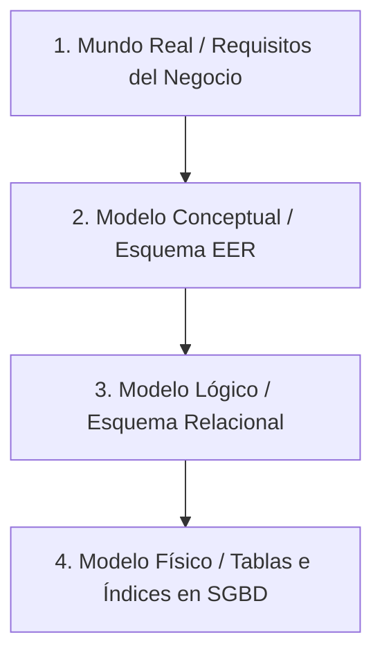
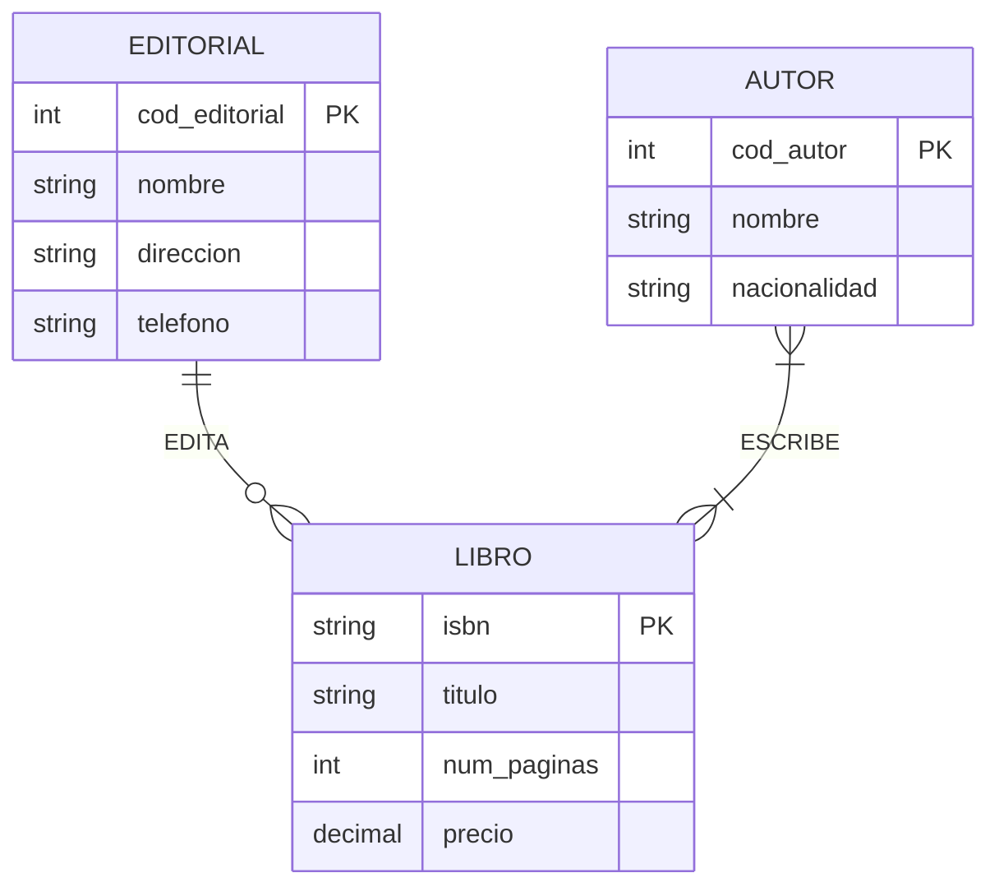
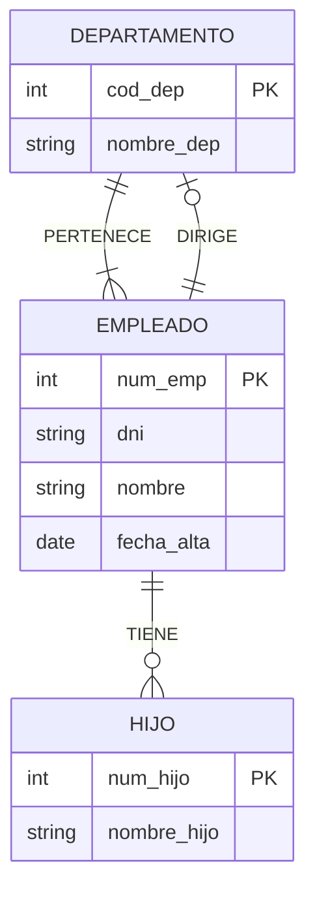
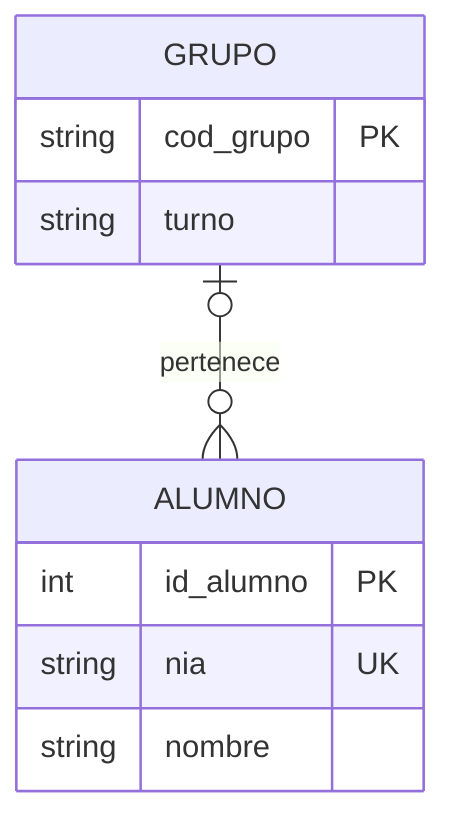
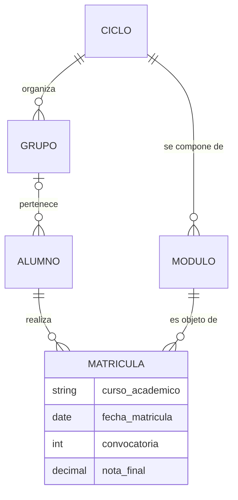

# UD02 · Modelo Entidad/Relación (E/R y EER)


## Resumen del Tema

**Visión General:**
El **Modelo Entidad-Relación Extendido (EER)**, introducido originalmente por Peter Chen en 1976 y refinado posteriormente con potentes mecanismos semánticos de abstracción de datos, constituye el estándar de industria indiscutible para el **diseño conceptual de bases de datos**.

Su objetivo prioritario es modelar y estructurar la semántica de la información del mundo real de forma completamente abstracta e independiente del software informático o Sistema Gestor de Bases de Datos (SGBD) que se utilice en la fase de implementación. En esta unidad se analiza de forma exhaustiva el flujo de trabajo del diseño de datos, los componentes elementales del modelo (**entidades fuertes y débiles, atributos clasificatorios y relaciones**), las reglas minuciosas de **cardinalidad e integridad**, las jerarquías de **generalización y especialización** con herencia de atributos, el concepto de **agregación**, el cálculo formal de cardinalidades en **relaciones ternarias** y una metodología estructurada en 5 pasos respaldada por casos prácticos reales completos.



### Temporalización

La unidad ocupa **19 horas de aula** (12 de teoría y 7 de práctica). Cada sesión aparece señalada en la página con una franja de color.


items:
  - {h: 2, tipo: T, t: "Ciclo de vida del diseño. Entidades fuertes y débiles", ref: "§1 y §2.1"}
  - {h: 2, tipo: T, t: "Atributos y relaciones: grado y roles", ref: "§2.2 y §2.3"}
  - {h: 2, tipo: T, t: "Cardinalidades mínima y máxima", ref: "§2.4 · laboratorio interactivo"}
  - {h: 1, tipo: P, t: "Leer y escribir cardinalidades", ref: "Práctica 2.2"}
  - {h: 2, tipo: P, t: "Biblioteca municipal: del enunciado al diagrama", ref: "Práctica 2.1"}
  - {h: 2, tipo: T, t: "Restricciones avanzadas y jerarquías EER", ref: "§3, §4.1 y §4.2 · clasificador interactivo"}
  - {h: 2, tipo: T, t: "Agregación y relaciones ternarias", ref: "§4.3 y §4.4"}
  - {h: 1, tipo: T, t: "Metodología en cinco pasos y ejemplos resueltos", ref: "§5 y §6"}
  - {h: 1, tipo: T, t: "Notaciones y herramientas de modelado", ref: "§7"}
  - {h: 2, tipo: P, t: "Plataforma de streaming", ref: "Práctica 2.3"}
  - {h: 2, tipo: P, t: "Modelo conceptual de EduGest", ref: "§8 y proyecto EduGest-2"}
autonomo:
  - "Práctica 2.4 (clínica veterinaria con jerarquías)"
  - "Retos 2.5 y 2.6"
  - "Banco de ejercicios (30 enunciados)"


> [!NOTE]
> **Cómo se estudia esta unidad.** Cada sesión de teoría termina con una pequeña comprobación o un laboratorio interactivo. Úsalos **antes** de pasar a las prácticas: si no puedes explicar por qué sale un resultado, vuelve a leer el apartado.

### Objetivos de aprendizaje

Al terminar esta unidad serás capaz de:

- Analizar un enunciado de requisitos e identificar entidades, atributos, identificadores y relaciones.
- Determinar el grado y las cardinalidades (mínima y máxima) de una relación y justificarlas.
- Distinguir entidades fuertes y débiles, y modelar relaciones reflexivas y ternarias.
- Aplicar las extensiones del modelo EER: generalización/especialización y agregación.
- Representar el modelo con herramientas gráficas y en distintas notaciones.
- Documentar los supuestos y las restricciones que el diagrama no puede expresar.


---


Ciclo de vida del diseño y entidades

## 1. Etapas en el Análisis y Diseño de Datos

### 1.1 El Ciclo de Vida del Diseño de Bases de Datos

El diseño de una base de datos no es una actividad improvisada, sino un proceso de ingeniería de software estructurado que traduce un problema del mundo real en estructuras de información eficientes y sin redundancias.

Intentar construir una base de datos directamente en el SGBD (escribiendo código SQL `CREATE TABLE`) sin realizar previamente un modelado conceptual riguroso conduce inevitablemente a **errores graves de arquitectura**: tablas mal estructuradas, claves duplicadas, pérdida de relaciones esenciales y redundancia incontrolada.

---

### 1.2 Los Cuatro Niveles de Abstracción

El proceso completo de diseño se divide en cuatro fases sucesivas e interconectadas:



1. **Entorno del Mundo Real (Fase de Requisitos):**
   Consiste en la recolección, análisis e interpretación de las necesidades de información de la organización a través de entrevistas con los usuarios, formularios existentes, albaranes y reglas de negocio. El resultado de esta fase es un documento en lenguaje natural denominado **Especificación de Requisitos de Software (ERS)**.

2. **Modelo Conceptual (Esquema Conceptual EER):**
   Se sintetizan las especificaciones del mundo real en un diagrama gráfico normalizado (Diagrama Entidad-Relación Extendido). Este esquema representa la estructura semántica de los datos de forma totalmente **independiente del SGBD** y del soporte tecnológico que se vaya a utilizar.

3. **Modelo Lógico (Esquema Lógico / Relacional):**
   Se transforma el esquema conceptual EER a las estructuras propias del paradigma del SGBD elegido. En las bases de datos relacionales, esto implica aplicar reglas formales de paso de E/R a tablas, claves primarias (`PK`), claves foráneas (`FK`) y procesos de **normalización** (1FN, 2FN, 3FN).

4. **Modelo Físico (Esquema Físico SQL):**
   Se traducen las tablas lógicas a código ejecutable en el SGBD destino (sentencias SQL DDL) definiendo los tipos de datos físicos concretos (`VARCHAR`, `NUMERIC`), métodos de almacenamiento, factor de empaquetamiento, particionamiento e índices B-Tree/Hash.

---

## 2. El Modelo Conceptual Entidad-Relación (E/R)

### 2.1 Entidades: Fuertes, Débiles e Instancias

Una **entidad** es cualquier objeto, persona, lugar, concepto abstracto o evento del mundo real que posee existencia distinguible y sobre el cual la organización necesita almacenar información en la base de datos.

- **Tipo de Entidad (Clase o Conjunto de Entidades):** Es la abstracción genérica que define la estructura común de un grupo de objetos homogéneos. Se representa gráficamente mediante un **rectángulo** con el nombre en letras mayúsculas, formato singular y sin abreviaturas (ej. `ALUMNO`, `EMPLEADO`, `FACTURA`).
- **Instancia u Ocurrencia:** Es un elemento individual concreto que pertenece a dicho tipo de entidad (ej. dentro de la entidad `ALUMNO`, una instancia específica es el alumno con DNI `12345678A` llamado *Juan Pérez*).

#### Clasificación de Entidades por su Dependencia de Existencia

- **Entidad Fuerte (Regular o Principal):**
  Posee existencia propia e independiente en el sistema. Sus instancias se identifican unívocamente mediante sus propios atributos identificadores (clave primaria) sin requerir la presencia de otras entidades (ej. `CLIENTE`, `PRODUCTO`, `LIBRO`).

- **Entidad Débil:**
  No puede existir de forma autónoma en la base de datos. Su presencia depende de la existencia previa de una entidad fuerte principal (denominada *Entidad Propietaria* o *Padre*). Si una instancia de la entidad fuerte es eliminada, todas las instancias de la entidad débil vinculadas a ella carecen de sentido y deben ser eliminadas en cascada. Se representa gráficamente mediante un **doble recuadro**.

> [!NOTE]
> **Ejemplo de Entidad Débil:**
> La entidad `EJEMPLAR` respecto a la entidad fuerte `LIBRO`. La biblioteca posee la obra intelectual "Don Quijote de la Mancha" (`LIBRO` fuerte), pero físicamente dispone de 5 copias en la estantería (`EJEMPLAR` débil). Si la obra deja de prestarse y se borra de la base de datos, todos sus ejemplares físicos asociados desaparecen automáticamente.


- q: "En EduGest, ¿cuál de estas opciones debe modelarse como **entidad** y no como atributo?"
  options: ["El turno (M/T)", "El módulo profesional", "El curso académico (2025-26)", "La nota final"]
  answer: 1
  explain: "Un módulo tiene propiedades propias (código, nombre, horas) y muchas instancias. El turno y el curso son **valores**, y la nota depende de la pareja alumno-módulo."
- q: "Si se borra un `LIBRO`, desaparecen sus `EJEMPLAR`. ¿Qué dependencia describe esto?"
  options: ["Dependencia de existencia", "Dependencia de identificación", "Herencia", "Agregación"]
  answer: 0
  explain: "Las filas dependientes carecen de sentido sin la fila fuerte: es dependencia de **existencia**. La de identificación exige, además, que la clave del débil incluya la del fuerte."


---

Atributos y relaciones

### 2.2 Atributos: Clasificación, Estructura y Dominio

Un **atributo** es cada una de las propiedades, características o cualidades cualitativas o cuantitativas que describen a un tipo de entidad o a una relación.

El **dominio** de un atributo es el conjunto de todos los valores atómicos válidos que dicho atributo puede tomar legalmente (ej. el dominio de `fecha_nacimiento` es el conjunto de fechas válidas no futuras).

#### Clasificación Completa de Atributos

1. **Atributo Identificador Principal (Clave Primaria - PK):**
   Atributo o conjunto mínimo de atributos cuyos valores garantizan distinguir de forma única e irrepetible cada instancia dentro de la entidad. Se representa mediante el **nombre del atributo subrayado**. Un identificador no puede tomar nunca valores nulos (`NOT NULL`).

2. **Atributo Identificador Alternativo (Clave Alternativa):**
   Atributo candidato que también podría identificar unívocamente a cada instancia pero no ha sido seleccionado como clave primaria. Se representa mediante **subrayado discontinuo** (ej. en `PERSONA`, si el `id_persona` es la PK, el `dni` o el `num_seguridad_social` son claves alternativas).

3. **Atributo Descriptor (Simple o Escalar):**
   Atributo convencional que aporta información descriptiva no identificadora y almacena un único valor atómico (ej. `nombre`, `precio`, `edad`).

4. **Atributo Compuesto (Estructurado):**
   Atributo que se puede descomponer de forma jerárquica en varios sub-atributos simples con significado propio. Se representa como un árbol de elipses (ej. el atributo `dirección` se subdivide en `calle`, `número`, `piso`, `código_postal` y `ciudad`).

5. **Atributo Multivaluado:**
   Atributo que puede albergar una lista de múltiples valores para una misma instancia de entidad. Se indica mediante una etiqueta $N$ sobre la línea del atributo o mediante una doble elipse (ej. una persona que posee varios números de `teléfono` o varias direcciones de `email`).

6. **Atributo Derivado (Calculado):**
   Atributo cuyo valor no se almacena físicamente, sino que se calcula dinámicamente a partir de otros atributos guardados en la base de datos (ej. el atributo `edad` se calcula restando la `fecha_nacimiento` de la fecha actual). Se representa con una **elipse discontinua**.

{}
Si de cada valor necesitas guardar **información propia** (de un teléfono, su tipo o si es el principal; de una dirección, su fecha de alta), ya no es un simple atributo multivaluado: es una **entidad débil** relacionada con la original. Un multivaluado solo sirve cuando cada valor es un dato aislado.
{}

---

### 2.3 Relaciones: Grado, Semántica y Nombres de Rol

Una **relación** es una asociación o interrelación semántica que conecta dos o más tipos de entidades dentro del modelo. Se representa gráficamente mediante un **rombo** etiquetado con un verbo descriptivo en mayúsculas (ej. `COMPRA`, `TRABAJA`, `PERTENECE`).

#### El Grado de la Relación

El **grado** indica el número de entidades distintas que participan en la asociación:

- **Grado 1 — Relación Reflexiva (Recursiva):** Asocia instancias de una misma entidad consigo misma. En estas relaciones es obligatorio especificar el **nombre de rol** que desempeña cada participante en la asociación.
  - *Ejemplo:* La relación `SUPERVISA` sobre la entidad `EMPLEADO`. Un empleado juega el rol de *Jefe* y otros empleados juegan el rol de *Subordinados*.
- **Grado 2 — Relación Binaria:** Asocia dos entidades distintas (es la forma más habitual en el modelado, ej. `CLIENTE` `REALIZA` `PEDIDO`).
- **Grado 3 — Relación Ternaria:** Asocia simultáneamente tres entidades distintas (ej. `PROFESOR`, `ASIGNATURA` y `GRUPO` en la relación `IMPARTE`).

---

Cardinalidades mínima y máxima

### 2.4 Restricciones de Cardinalidad (Mínima y Máxima)

La **cardinalidad** de una relación expresa los límites cuantitativos de participación de las instancias de las entidades en la asociación.

Para cada entidad que participa en una relación, la cardinalidad se define como un par de valores expresado en el formato:
$$(Cardinalidad\_Mínima, Cardinalidad\_Máxima)$$

```text
ENTIDAD_A ──────(min_a, max_a)────── < RELACIÓN > ──────(min_b, max_b)────── ENTIDAD_B
```

#### 1. Cardinalidad Mínima ($0$ o $1$)

- **$0$ (Participación Opcional o Parcial):** Una instancia de la entidad puede existir en la base de datos sin necesidad de estar asociada con ninguna instancia de la otra entidad.
- **$1$ (Participación Obligatoria, Total o Existencial):** Toda instancia de la entidad debe estar asociada obligatoriamente al menos con una instancia de la otra entidad.

#### 2. Cardinalidad Máxima ($1$ o $N$)

- **Relación Uno a Uno ($1:1$):** Una instancia de $A$ se relaciona como máximo con una instancia de $B$, y viceversa.
- **Relación Uno a Muchos ($1:N$):** Una instancia de $A$ puede relacionarse con múltiples instancias de $B$, pero una instancia de $B$ solo puede relacionarse con una de $A$.
- **Relación Muchos a Muchos ($N:M$):** Una instancia de $A$ se relaciona con múltiples instancias de $B$, y una de $B$ se relaciona con múltiples instancias de $A$.

> [!TIP]
> **Regla Mnemotécnica de Lectura de Cardinalidades:**
> Para determinar la cardinalidad de la `ENTIDAD_A` respecto a la `ENTIDAD_B` en la relación `R`, nos formulamos dos preguntas situándonos mentalmente en una instancia de `ENTIDAD_A`:
>
> 1. *¿Con cuántas instancias de `ENTIDAD_B` puede asociarse como MÍNIMO una instancia de `ENTIDAD_A`?* $\rightarrow$ **Cardinalidad mínima**.
> 2. *¿Con cuántas instancias de `ENTIDAD_B` puede asociarse como MÁXIMO una instancia de `ENTIDAD_A`?* $\rightarrow$ **Cardinalidad máxima**.

> [!WARNING]
> **El error más común del tema: leer la cardinalidad al revés.** Un mismo par $(mín, máx)$ puede ir junto a una entidad o junto a la opuesta según el libro o la herramienta (ver apartado 7.1). Antes de interpretar un diagrama, **traduce siempre a una frase**: «cada ... se relaciona con ... instancias de ...».

#### Laboratorio: lee y construye cardinalidades

Cambia los valores y observa cómo se transforman el diagrama, las frases, el tipo de relación y la sintaxis de Mermaid.




- q: "En `TRABAJA_EN`, cada empleado está en exactamente 1 departamento y cada departamento tiene 0 o muchos empleados. ¿De qué tipo es la relación?"
  options: ["1:1", "1:N con DEPARTAMENTO en el lado «1»", "1:N con EMPLEADO en el lado «1»", "N:M"]
  answer: 1
  explain: "Muchos empleados comparten un único departamento: el lado «1» es DEPARTAMENTO y el lado «N», EMPLEADO. La clave ajena irá a EMPLEADO (UD03)."
- q: "En pata de gallo, ¿qué símbolo junto a `ALUMNO` expresa «un grupo tiene cero o muchos alumnos»?"
  options: ["`||`", "`|o`", "`o{`", "`|{`"]
  answer: 2
  explain: "El círculo indica mínimo cero y la pata de gallo máximo muchos. El símbolo junto a una entidad cuenta **cuántas instancias de esa entidad** se asocian a una de la otra."


Leer y escribir cardinalidades

Biblioteca municipal: del enunciado al diagrama

Las sesiones 4 y 5 se hacen con las [prácticas de la unidad](/ud02-modelo-er/ud02-practicas). Llévalas preparadas: tienes que haber leído hasta aquí y haber probado el laboratorio.

---

Restricciones avanzadas y jerarquías EER

## 3. Restricciones Avanzadas sobre Relaciones

En modelos conceptuales complejos donde existen múltiples relaciones cruzadas entre entidades, se pueden especificar restricciones semánticas avanzadas:

### 3.1 Exclusividad y Exclusión

- **Restricción de Exclusividad:**
  Se aplica entre dos o más relaciones ($R_1$ y $R_2$) que parten de una misma entidad $A$. Indica que una instancia de $A$ puede participar en la relación $R_1$ o en la relación $R_2$, pero **nunca en ambas al mismo tiempo**.

  - *Ejemplo Real:* Un `PROFESOR` puede la relación `IMPARTE` respecto a un `CURSO` o la relación `RECIBE` (como alumno), pero si en un cuatrimestre imparte un curso, no puede simultáneamente recibirlo como estudiante.
- **Restricción de Exclusión:**
  Indica que si un par específico de instancias $(A_1, B_1)$ está vinculado a través de la relación $R_1$, ese mismo par exacto tiene prohibido estar vinculado mediante la relación $R_2$.

---

### 3.2 Inclusividad e Inclusión

- **Restricción de Inclusividad:**
  Indica que para que una instancia de la entidad $A$ participe en la relación $R_1$, es condición obligatoria que participe también en la relación $R_2$.

- **Restricción de Inclusión:**
  Se aplica sobre los pares de instancias relacionadas. Si la pareja $(A_1, B_1)$ está asociada mediante la relación $R_1$, es estrictamente obligatorio que dicha pareja $(A_1, B_1)$ esté previamente relacionada en $R_2$.

---

## 4. Extensiones del Modelo (EER)

### 4.1 Generalización y Especialización (Mecanismo de Herencia)

El Modelo Entidad-Relación Extendido (EER) incorpora conceptos orientados a objetos para gestionar jerarquías de clases de entidades:


- **Supertipo (Entidad Genérica):** Es la entidad de nivel superior que contiene los atributos comunes (incluyendo la clave primaria) y las relaciones generales que comparten todas las variantes.
- **Subtipo (Entidad Especializada):** Es una entidad de nivel inferior que representa una subclase o variante específica del supertipo.
- **El Principio de Herencia:** Todo subtipo hereda automáticamente **todos los atributos** (identificadores y descriptores) y **todas las relaciones** del supertipo. Los subtipos solo deben definir sus atributos y relaciones exclusivos.
- **Especialización (Enfoque Top-Down):** Proceso de diseño descendente en el que se parte de una entidad supertipo y se identifican subgrupos especializados con propiedades exclusivas.
- **Generalización (Enfoque Bottom-Up):** Proceso de diseño ascendente en el que se observan múltiples entidades con atributos repetidos y se abstrae una entidad supertipo común.

---

### 4.2 Clasificación de Jerarquías (Total/Parcial, Disjunta/Solapada)

Atendiendo a las reglas de pertenencia de las instancias del supertipo a los subtipos, se definen dos dimensiones independientes:

#### Dimensión 1: Cobertura (Total o Parcial)

- **Total ($T$):** Toda instancia del supertipo DEBE pertenecer obligatoriamente al menos a uno de los subtipos.
- **Parcial ($P$):** Pueden existir instancias en el supertipo que no pertenezcan a ningún subtipo especializado.

#### Dimensión 2: Solapamiento (Disjunta o Solapada)

- **Disjunta ($D$):** Una instancia del supertipo puede pertenecer como MÁXIMO a un único subtipo (subtipos mutuamente excluyentes).
- **Solapada ($S$):** Una instancia del supertipo puede pertenecer SIMULTÁNEAMENTE a varios subtipos.

#### Combinación de las Cuatro Clases de Jerarquía

1. **Total y Disjunta $(T, D)$:** Toda instancia del supertipo pertenece a **un y solo un** subtipo.
   - *Ejemplo:* La entidad `PERSONA` dividida en `HOMBRE` y `MUJER`.
2. **Parcial y Disjunta $(P, D)$:** Una instancia del supertipo puede no estar en ningún subtipo, pero si está, solo puede pertenecer a **uno**.
   - *Ejemplo:* La entidad `VEHÍCULO` especializada en `TURISMO` y `CAMIÓN` (pueden existir vehículos en la base de datos que sean motocicletas sin subtipo específico).
3. **Parcial y Solapada $(P, S)$:** Una instancia puede no estar en ningún subtipo o pertenecer a **múltiples** a la vez.
   - *Ejemplo:* La entidad `EMPLEADO` especializada en `PROGRAMADOR` y `DIRECTOR` (un empleado puede ser solo programador, o simultáneamente programador y director).
4. **Total y Solapada $(T, S)$:** Toda instancia debe pertenecer al menos a un subtipo y puede estar en **múltiples** simultáneamente.

#### Laboratorio: ¿qué jerarquía es?

Fija las reglas (cobertura y solapamiento) y marca a qué subtipos pertenece cada empleado: la tabla te dirá quién incumple la jerarquía y qué estrategias de transformación son válidas.




- q: "¿Qué estrategia de transformación **no** es válida para una jerarquía parcial y solapada?"
  options: ["Tabla del supertipo y una tabla por subtipo", "Tabla única con una marca por subtipo", "Solo tablas de los subtipos", "Las tres son válidas"]
  answer: 2
  explain: "Con cobertura parcial hay instancias del supertipo sin subtipo, que no tendrían tabla donde guardarse. Solo se admite «solo subtipos» si la jerarquía es **total y disjunta**."


---

Agregación y relaciones ternarias

### 4.3 Agregación: Modelado de Asociaciones como Entidades


La **agregación** es una abstracción que permite considerar una relación entre dos entidades junto con dichas entidades como si fuera una **entidad de orden superior (entidad agregada)**, haciendo posible que esta estructura completa se relacione a su vez con otra tercera entidad.

#### ¿Por qué es necesaria la Agregación?

Cuando se intenta modelar una situación donde una relación solo tiene sentido para ciertas combinaciones sin forzar una relación ternaria completa.

> [!NOTE]
> **Ejemplo Clásico de Agregación:**
> Consideremos la relación `CASADO_CON` entre las entidades `HOMBRE` y `MUJER`. Un matrimonio civil requiere ser registrado en un `JUZGADO`. No todas las parejas se casan por lo civil (algunas lo hacen por la iglesia). Si creáramos una relación ternaria entre `HOMBRE`, `MUJER` y `JUZGADO`, obligaríamos erróneamente a que *todos* los matrimonios registraran un juzgado.
> **Solución con Agregación:** Encapsulamos la relación `CASADO_CON` dentro de una caja de **Entidad Agregada** llamada `MATRIMONIO`. Posteriormente, relacionamos la entidad agregada `MATRIMONIO` con la entidad `JUZGADO` mediante la relación opcional `REGISTRADO_EN`.

> [!TIP]
> **¿Agregación o ternaria?** Pregúntate: *¿puede existir la relación entre las dos primeras entidades sin que intervenga la tercera?* Si la respuesta es sí (no todos los matrimonios se registran en un juzgado), necesitas **agregación**. Si los tres participantes son siempre indisolubles en el hecho que registras (qué profesor imparte qué módulo a qué grupo), es una **ternaria**.

---

### 4.4 Relaciones Ternarias y Análisis Formal de Cardinalidad

Una **relación ternaria** asocia tres entidades de forma indivisible. Para determinar sus cardinalidades con rigor, se aplica el método de **fijar un par de entidades y analizar el rango del extremo libre**:

#### Metodología Formal de Cálculo

Fijamos una instancia de $A$ y una instancia de $B$ simultáneamente, y nos preguntamos:

- *¿Con cuántas instancias de $C$ se puede asociar la pareja $(A, B)$ como mínimo y como máximo?* $\rightarrow$ par $(min, max)$ sobre $C$.

#### Clasificación por Conectividad Máxima

1. **Conectividad $1:1:1$:**
   Cualquier combinación de dos entidades se asocia como máximo con **una** instancia de la tercera entidad.

2. **Conectividad $1:1:N$:**
   La pareja de entidades $(A, B)$ se asocia con **múltiples** instancias de $C$. Sin embargo, las parejas $(A, C)$ y $(B, C)$ se asocian con como máximo **una** instancia de la entidad restante.

3. **Conectividad $1:N:M$:**
   La pareja $(A, B)$ se asocia con múltiples instancias de $C$, y la pareja $(A, C)$ se asocia con múltiples instancias de $B$. Solo la pareja $(B, C)$ se limita a una única instancia de $A$.

4. **Conectividad $N:M:P$:**
   Cualquier combinación de parejas de dos entidades puede asociarse con **múltiples** instancias de la tercera entidad libre.

---

Metodología en cinco pasos y ejemplos resueltos

## 5. Fases en la Construcción del Esquema Conceptual

Para elaborar un esquema conceptual EER profesional a partir de un texto de requisitos, se debe aplicar una metodología en 5 pasos:

1. **Paso 1: Identificación y Selección de Entidades:**
   Buscar sustantivos comunes que representen objetos con propiedades de interés. Descartar sustantivos que representen valores simples o instancias.

2. **Paso 2: Definición de Claves Primarias e Identificadores:**
   Asignar atributos identificadores unívocos (`PK`) a cada entidad. Identificar si existen entidades débiles que requieran claves compuestas con la entidad fuerte.

3. **Paso 3: Establecimiento de Relaciones y Cardinalidades:**
   Identificar verbos de acción que conecten las entidades. Para cada relación, calcular minuciosamente las cardinalidades $(min, max)$ en ambos sentidos.

4. **Paso 4: Asignación de Atributos y Dominio:**
   Colocar los atributos descriptores en sus entidades correspondientes. Si un atributo depende de la combinación de dos entidades (ej. `fecha_alquiler` o `nota_examen`), debe colocarse directamente en la **relación**.

5. **Paso 5: Optimización y Eliminación de Redundancias:**
   Revisar el diagrama para detectar relaciones transitivas redundantes (relaciones que pueden deducirse combinando otras asociaciones) y simplificar el modelo.

---

## 6. Ejemplos Prácticos Completos Resueltos

### 6.1 Ejemplo 1: Gestión de Librería y Editoriales

**Enunciado de Requisitos:**
Se requiere diseñar el esquema conceptual para la gestión de una librería. De cada `LIBRO` se conoce su ISBN (clave primaria), título, número de páginas y precio. Cada libro es editado por una única `EDITORIAL` (código, nombre, dirección y teléfono). Una editorial puede editar muchos libros. Un libro puede ser escrito por varios `AUTOR` (código, nombre, nacionalidad) y un autor puede escribir varios libros.



---

### 6.2 Ejemplo 2: Gestión Interna de Empresa y Departamentos

**Enunciado de Requisitos:**
Diseñar la base de datos de una empresa. Se almacena información de `EMPLEADO` (número de empleado, DNI, nombre, dirección y fecha de alta). Los empleados están adscritos a un `DEPARTAMENTO` (código de departamento, nombre). Un empleado pertenece a un único departamento y en un departamento trabajan varios empleados. Un empleado puede ser jefe de un departamento. De los empleados se registran sus `HIJO` (entidad débil con número de hijo y nombre) para el control de beneficios sociales.



---

### 6.3 Ejemplo 3: Organización de un Congreso Científico

**Enunciado de Requisitos:**
Un congreso científico necesita organizar sus actividades. Se registran los `PARTICIPANTE` (código, nombre, dirección, país). Los participantes pueden presentar `PONENCIA` (título identificador, número de páginas). Una ponencia es escrita por uno o varios participantes. A cada ponencia se le asignan varios participantes como revisores. Las ponencias se presentan en `SESIÓN` (número de sesión, fecha, hora). Una sesión alberga varias ponencias pero una ponencia solo se expone en una sesión.

---

### 6.4 Ejemplo 4: Empresa de Repostería "PAVA S.A."


#### Especificaciones del Modelo PAVA S.A

1. **PRODUCTO e INGREDIENTE:** Relación $N:M$ denominada `COMPUESTO_POR` que contiene el atributo descriptor `porcentaje` para indicar la participación de cada ingrediente en la receta.
2. **FORMATOS:** La entidad `PRODUCTO` se comercializa en distintos `FORMATO_PRODUCTO` (peso en gramos y precio específico de venta).
3. **CLIENTE y PEDIDO:** Un `CLIENTE` realiza múltiples `PEDIDO`. Cada pedido incluye varias líneas de detalle solicitando unidades específicas de un producto en un formato determinado.
4. **COMPETIDORES:** Relación de seguimiento de productos similares lanzados por marcas rivales en el mercado.

---

Notaciones y herramientas de modelado

## 7. Notaciones y Herramientas de Modelado

El modelo E/R es **uno**, pero hay varias formas de dibujarlo. Es importante reconocerlas porque cada herramienta usa la suya (RA6.a).

| Notación | Cómo representa las relaciones | Cardinalidad | Dónde la encontrarás |
|---|---|---|---|
| **Chen** (original, 1976) | Rombo entre las entidades. Atributos en óvalos | Pares (mín, máx) o 1/N junto a cada entidad | Libros de texto, exámenes, estos apuntes |
| **Pata de gallo** (*crow's foot*, Martin/IE) | Línea entre entidades. Atributos dentro del rectángulo | Símbolos en los extremos: `\|` uno, `o` cero, `<` muchos | draw.io, MySQL Workbench, Mermaid, Lucidchart |
| **Barker** | Línea con trazo continuo (obligatorio) o discontinuo (opcional) y pata de gallo | Trazo y pata de gallo | Oracle SQL Developer Data Modeler |
| **UML (diagrama de clases)** | Asociaciones entre clases | Multiplicidad `0..1`, `1`, `0..*`, `1..*` | Ingeniería del software, herramientas CASE |

### 7.1 Equivalencia entre la notación de Chen y la pata de gallo

Lee siempre la cardinalidad **desde una entidad hacia la otra**. En la notación de pata de gallo, el símbolo que está **junto a una entidad** indica cuántas instancias de **esa** entidad se relacionan con una instancia de la entidad del otro extremo.

| Chen (participación de la entidad opuesta) | Pata de gallo | Lectura |
|---|---|---|
| (0, 1) | `\|o` | cero o uno |
| (1, 1) | `\|\|` | exactamente uno |
| (0, N) | `o{` | cero o muchos |
| (1, N) | `\|{` | uno o muchos |

Ejemplo: «un **grupo** tiene **cero o muchos** alumnos y un **alumno** pertenece a **cero o un** grupo».



> [!WARNING]
> En notación de Chen, la pareja (mín, máx) se coloca en algunos libros **junto a la propia entidad** y en otros **junto a la entidad opuesta**. Antes de interpretar un diagrama, comprueba qué convenio usa. En estos apuntes, la cardinalidad (mín, máx) junto a una entidad indica **con cuántas instancias de esa entidad** se relaciona una instancia de la otra.

### 7.2 Herramientas

| Herramienta | Tipo | Uso recomendado |
|---|---|---|
| **draw.io / diagrams.net** | Libre, web y escritorio | Diagramas E/R en notación de Chen y pata de gallo. Se integra con VS Code y Git |
| **Oracle SQL Developer Data Modeler** | Gratuita | Modelo lógico y relacional; genera el DDL de Oracle automáticamente (UD03 y UD05) |
| **ERDPlus** | Web gratuita | Diagramas de Chen y paso automático al modelo relacional |
| **Mermaid** | Texto a diagrama | Diagramas en Markdown dentro del repositorio (como los de estos apuntes) |
| **Papel y lápiz** | — | Primeros bocetos y exámenes. Sigue siendo la forma más rápida de pensar |

> [!TIP]
> Una herramienta gráfica **no diseña por ti**. Primero razona entidades, relaciones y cardinalidades sobre el enunciado; después pásalo a la herramienta. Guarda el fichero fuente (`.drawio`, `.dmd`, `.md`) en el repositorio además de la imagen exportada.

---

Plataforma de streaming

Modelo conceptual de EduGest

## 8. Caso Guiado: el Modelo E/R de EduGest

Aplicamos la metodología del apartado 5 a una parte del [enunciado de EduGest](/guia/proyecto-edugest#1-enunciado-entrevista-con-la-jefatura-de-estudios): ciclos, módulos, grupos y alumnado.

### Paso 1. Entidades candidatas

Subrayamos los sustantivos del enunciado y nos preguntamos si cada uno tiene **propiedades propias** e **instancias distintas**:

| Sustantivo | ¿Entidad? | Motivo |
|---|---|---|
| ciclo formativo | Sí | Tiene código, nombre, grado y horas |
| módulo profesional | Sí | Tiene código, nombre, curso y horas |
| grupo | Sí | Tiene código, turno, tutor |
| alumno | Sí | Muchos atributos propios |
| curso académico (2025-26) | No | Es un **valor** que describe una matrícula. Pasa a ser atributo |
| turno | No | Es un valor (M/T) de un atributo del grupo |
| tutor | No (rol) | Es un **profesor** que cumple un papel: se modela como relación |

### Paso 2. Identificadores

- `CICLO`: `cod_ciclo` (DAM, DAW...).
- `MODULO`: el código oficial **no basta**, porque 0484 aparece en DAM y en DAW con grupos y docentes diferentes. Opciones: un identificador artificial `id_modulo`, o considerar `MODULO` una **entidad débil** de `CICLO` (identificador `codigo` + `cod_ciclo`). Las dos son correctas; elegimos el identificador artificial y anotamos que (`codigo`, `cod_ciclo`) debe ser **único**.
- `GRUPO`: `cod_grupo`. `ALUMNO`: `nia` (o un identificador interno).

### Paso 3. Relaciones y cardinalidades

| Relación | Pregunta | Cardinalidad |
|---|---|---|
| CICLO — *se compone de* — MODULO | ¿Cuántos módulos tiene un ciclo? ¿A cuántos ciclos pertenece un módulo? | Un ciclo tiene (0, N) módulos (SMR todavía no tiene); un módulo pertenece a (1, 1) ciclo |
| CICLO — *organiza* — GRUPO | | Un ciclo tiene (0, N) grupos; un grupo es de (1, 1) ciclo |
| GRUPO — *pertenece* — ALUMNO | | Un grupo tiene (0, N) alumnos; un alumno está en (0, 1) grupo |
| ALUMNO — *se matricula* — MODULO | ¿Puede un alumno matricularse en varios módulos? ¿Puede un módulo tener varios alumnos? | N:M. Atributos de la relación: curso académico, fecha, convocatoria, nota |

### Paso 4. Atributos de las relaciones

La **nota** no es del alumno (tiene muchas) ni del módulo (lo cursan muchos): depende de la **pareja** alumno-módulo **y** del curso académico. Por eso va en la relación *se matricula*. Además, como un alumno puede repetir un módulo en otro curso, el curso académico forma parte de lo que identifica cada matrícula.

### Paso 5. Revisión

- ¿Hay ciclos? Si un alumno pertenece a un grupo y el grupo a un ciclo, **no** hace falta una relación directa ALUMNO-CICLO: sería **redundante** (se deduce).
- ¿Hay restricciones que el diagrama no recoge? Sí: un alumno solo debería matricularse en módulos del ciclo de su grupo. Se anota como **restricción textual** (RA6.h).



> [!NOTE]
> La notación de pata de gallo no tiene rombos, así que la relación N:M *se matricula*, que tiene atributos, se dibuja como una entidad intermedia `MATRICULA`. En notación de Chen sería un rombo con los cuatro atributos. Las dos representan lo mismo.

---

## 9. Errores Frecuentes y Buenas Prácticas

| Error frecuente | Por qué es un error | Cómo evitarlo |
|---|---|---|
| Modelar como entidad algo que es un valor (`TURNO`, `COLOR`) | Una entidad necesita propiedades e instancias de interés propias | Pregúntate qué atributos tendría. Si no tiene, es un atributo |
| Poner en una entidad un atributo de la relación (`nota` en `ALUMNO`) | El atributo depende de las dos entidades a la vez | Si el valor cambia según la pareja, va en la relación |
| Usar el nombre como identificador | Los nombres se repiten y cambian | Usa códigos estables o identificadores artificiales |
| Relaciones redundantes (ciclos en el diagrama) | Generan datos duplicados e inconsistentes | Comprueba si la relación se deduce de otras |
| Cardinalidades «a ojo» | Producen tablas mal diseñadas en la UD03 | Formula siempre las dos preguntas (mínimo y máximo) en los dos sentidos |
| Atributos calculados (`edad`) guardados como atributos normales | Quedan desactualizados | Guarda `fecha_nacimiento` y calcula la edad |
| Inventar requisitos | El diseño deja de responder al cliente | Anota las dudas como **supuestos** y valídalos con el cliente |

**Buenas prácticas:** nombres de entidades en singular y en mayúsculas, relaciones con verbos, un diccionario de datos con el significado de cada atributo y una lista de **supuestos semánticos** que explique las decisiones que el enunciado no aclara.

---

## 10. Resumen y Conclusiones

- El **Modelo EER** es el lenguaje gráfico conceptual estándar para abstraer los requisitos del mundo real hacia un esquema de base de datos riguroso.
- Las **entidades débiles** dependen de una entidad fuerte y forman claves compuestas para garantizar la integridad existencial.
- Las **jerarquías de generalización/especialización** evitan la duplicación de código mediante el principio de **herencia de atributos**.
- La **agregación** y las **relaciones ternarias** permiten resolver semánticas de asociación complejas sin distorsionar las cardinalidades.
- Una metodología rigurosa en 5 pasos garantiza que la posterior traducción al **modelo relacional** produzca tablas bien estructuradas y normalizadas.
- El mismo modelo se puede dibujar en notación de **Chen**, **pata de gallo**, Barker o UML. Las herramientas gráficas ayudan a representarlo, pero las decisiones de diseño se razonan sobre el enunciado.
- Las reglas que el diagrama no puede expresar se documentan como **restricciones textuales** para implementarlas más adelante.

---

## 11. Ejercicios Resueltos

### 1. Pregunta Teórica: Entidades Débiles

**Pregunta:** Explique la diferencia entre dependencia de existencia y dependencia de identificación en una entidad débil.
{}
- *Dependencia de Existencia:* Ocurre cuando las instancias de la entidad débil no pueden sobrevivir en la base de datos si se elimina la instancia de la entidad fuerte relacionada (ej. si se elimina un `CONTRATO`, desaparecen sus `PAGOS` asociados).
- *Dependencia de Identificación:* Ocurre cuando la entidad débil no posee un atributo identificador propio suficiente para ser clave primaria, por lo que necesita combinar su identificador parcial (discriminador) con la clave primaria de la entidad fuerte propietaria.
{}

---

### 2. Análisis de Jerarquía EER

**Pregunta:** En una empresa, la entidad `EMPLEADO` se especializa en `INFORMÁTICO` y `ADMINISTRATIVO`. Clasifique la jerarquía según sus restricciones si se establece que:

- a) Todo empleado debe ser obligatoriamente informático o administrativo.
- b) Un empleado puede desempeñar simultáneamente labores de informático y administrativo.

{}
- a) Dado que todo empleado debe estar al menos en una subclase, la cobertura es **Total ($T$)**.
- b) Dado que puede pertenecer a ambas subclases a la vez, el solapamiento es **Solapado ($S$)**.
- **Clasificación Resultante:** Jerarquía **Total y Solapada $(T, S)$**.
{}

---

### 3. Ejercicio Práctico de Diseño EER

**Enunciado:** Diseñe el esquema conceptual para un hospital. Se registran `PACIENTE` (NSS, nombre) y `MÉDICO` (número de colegiado, nombre, especialidad). Un médico atiende a múltiples pacientes y un paciente puede ser atendido por distintos médicos. De cada atención médica se desea registrar la `fecha_consulta` y el `diagnóstico`.

{}
- **Entidades:** `PACIENTE` (PK: `NSS`) y `MÉDICO` (PK: `num_colegiado`).
- **Relación:** `ATIENDE` entre `MÉDICO` y `PACIENTE`.
- **Cardinalidades:**
  - `MÉDICO` respecto a `ATIENDE`: $(0, N)$ (un médico puede no haber atendido pacientes aún o atender a muchos).
  - `PACIENTE` respecto a `ATIENDE`: $(1, N)$ (un paciente debe haber sido atendido al menos una vez y puede ser visto por varios médicos).
- **Atributos de la Relación:** Como un mismo médico puede atender al mismo paciente en fechas distintas con diagnósticos diferentes, los atributos `fecha_consulta` y `diagnóstico` se colocan directamente en la relación $N:M$ `ATIENDE`.
{}

---

## 12. Autoevaluación

Responde a las preguntas y pulsa **Corregir**. Cada respuesta incluye una explicación.


- q: "En el modelo E/R, ¿en qué fase del diseño estamos?"
  options: ["Diseño físico", "Diseño lógico", "Diseño conceptual", "Implementación"]
  answer: 2
  explain: "El modelo E/R representa la realidad de forma **independiente del SGBD**: es el diseño conceptual. El paso a tablas (UD03) es el diseño lógico."
- q: "De un empleado se guarda su fecha de nacimiento y se quiere conocer su edad. ¿Cómo se modela la edad?"
  options: ["Atributo compuesto", "Atributo derivado", "Atributo multivaluado", "Entidad débil"]
  answer: 1
  explain: "La edad se **calcula** a partir de la fecha de nacimiento. Guardarla como un atributo normal haría que se quedara desactualizada."
- q: "Un `EJEMPLAR` se identifica por su número dentro de cada `LIBRO` (ejemplar 1, 2, 3 de cada libro). ¿Qué es `EJEMPLAR`?"
  options: ["Una entidad débil por identificación", "Una entidad fuerte", "Una especialización de LIBRO", "Un atributo multivaluado"]
  answer: 0
  explain: "Su número solo es único **dentro** de un libro: necesita la clave de `LIBRO` para identificarse. Es una entidad débil por identificación (y también por existencia)."
- q: "Un alumno se matricula en varios módulos y cada módulo tiene varios alumnos. ¿Dónde se coloca el atributo `nota`?"
  options: ["En ALUMNO", "En MODULO", "En la relación de matrícula", "En una entidad NOTA independiente sin relaciones"]
  answer: 2
  explain: "La nota depende de la **pareja** alumno-módulo (y del curso académico). Por eso es un atributo de la relación."
- q: "Todo vehículo de una flota es un turismo o una furgoneta, nunca las dos cosas. ¿Cómo es la jerarquía?"
  options: ["Parcial y solapada", "Total y disyunta", "Parcial y disyunta", "Total y solapada"]
  answer: 1
  explain: "**Total** porque todo vehículo pertenece a alguna subclase; **disyunta** porque no puede pertenecer a las dos a la vez."
- q: "En notación de pata de gallo, ¿qué indica el símbolo `o{` junto a una entidad?"
  options: ["Exactamente uno", "Cero o uno", "Uno o muchos", "Cero o muchos"]
  answer: 3
  explain: "El círculo indica que el mínimo es **cero** (participación opcional) y la pata de gallo que el máximo es **muchos**."
- q: "Una empresa registra qué médico atiende a qué paciente en qué consulta (sala) y en qué fecha. Cada par médico-paciente puede repetirse en salas distintas. ¿Qué tipo de relación es la más adecuada?"
  options: ["Tres relaciones binarias independientes", "Una relación ternaria", "Una jerarquía", "Una relación reflexiva"]
  answer: 1
  explain: "El hecho que queremos registrar une **a la vez** médico, paciente y sala. Tres relaciones binarias perderían qué médico atendió a qué paciente en qué sala."
- q: "Un diagrama incluye ALUMNO–GRUPO, GRUPO–CICLO y además ALUMNO–CICLO. ¿Qué problema puede tener?"
  options: ["Ninguno, más relaciones dan más información", "Una relación redundante que se deduce de las otras dos", "Una entidad débil mal identificada", "Falta una jerarquía"]
  answer: 1
  explain: "Si el ciclo de un alumno se deduce de su grupo, la relación directa es **redundante** y puede producir inconsistencias (que el alumno esté en un grupo de DAM y en el ciclo DAW)."


## Referencias

- Chen, P. P. (1976). «The Entity-Relationship Model: Toward a Unified View of Data». *ACM Transactions on Database Systems*, 1(1).
- Elmasri, R. y Navathe, S. B. *Fundamentos de sistemas de bases de datos*. Pearson.
- [Curso de Bases de Datos de F. M. García: bloque 2, diseño conceptual](https://fmgarcia.github.io/CursosGithubIO/CursoBasesDatos/).
- [Mermaid: sintaxis de los diagramas entidad-relación](https://mermaid.js.org/syntax/entityRelationshipDiagram.html).
