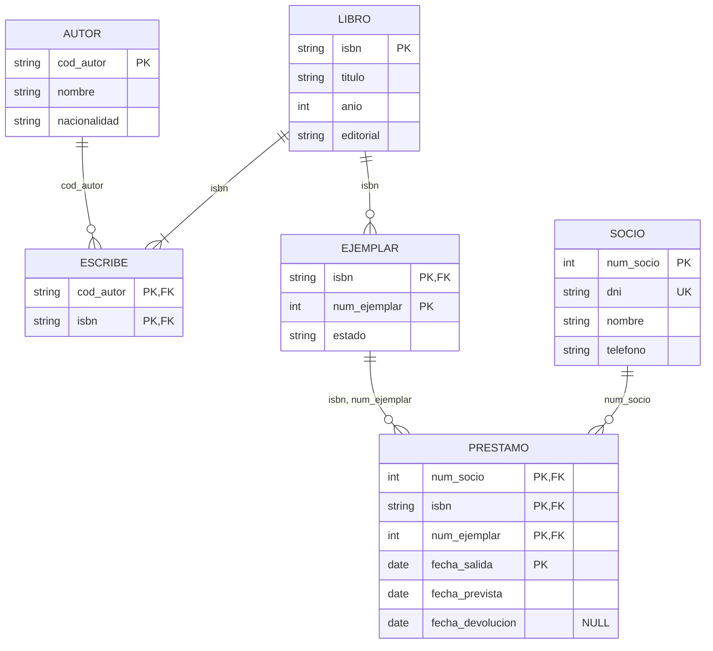

# UD03 · Prácticas



| Práctica | Tipo | Nivel | CE principales |
|---|---|---|---|
| [3.1 Biblioteca: del E/R a las tablas](#práctica-31--biblioteca-del-er-a-las-tablas) | Guiada | ●○○ | RA6.b, RA6.c, RA6.d, RA6.e |
| [3.2 Simulador de integridad referencial](#práctica-32--simulador-de-integridad-referencial) | Guiada | ●●○ | RA6.f, RA2.e |
| [3.3 Tres formas de transformar una jerarquía](#práctica-33--tres-formas-de-transformar-una-jerarquía) | Autónoma | ●●○ | RA6.b, RA6.d, RA6.e |
| [3.4 Ingeniería inversa de un esquema](#práctica-34--ingeniería-inversa-de-un-esquema) | Reto | ●●● | RA6.a, RA6.d |
| [3.5 Catálogo de restricciones de un hotel](#práctica-35--catálogo-de-restricciones-de-un-hotel) | Autónoma | ●●○ | RA6.h |
| [Proyecto EduGest · UD03](#proyecto-edugest--ud03-modelo-lógico) | Proyecto | ●●○ | RA6.a-f, RA6.h |
| [Banco de ejercicios](#banco-de-ejercicios) | Autónoma | ●○○ a ●●● | RA6, RA2 |

> [!TIP]
> Para escribir esquemas relacionales usa siempre la misma notación: `TABLA(`<u>clave_primaria</u>`, atributo, `*clave_ajena*`)`, y debajo de cada tabla, las claves ajenas con la tabla a la que apuntan, las claves alternativas y los atributos que **admiten nulos**.

---

## Práctica 3.1 · Biblioteca: del E/R a las tablas



#### Objetivo

Aplicar una a una las reglas de transformación al modelo conceptual de la práctica 2.1 y obtener un esquema relacional completo y justificado.

#### Contexto

Partimos del diagrama de la biblioteca municipal de la [práctica 2.1](/ud02-modelo-er/ud02-practicas#práctica-21--biblioteca-municipal-del-enunciado-al-diagrama):


#### Desarrollo

{}

1. **Entidades fuertes → tablas.** Cada entidad fuerte da una tabla con sus atributos; el identificador pasa a ser la clave primaria.

    - AUTOR(<u>cod_autor</u>, nombre, nacionalidad)
    - LIBRO(<u>isbn</u>, titulo, anio, editorial)
    - SOCIO(<u>num_socio</u>, dni, nombre, telefono) · `dni` UNIQUE

2. **Entidad débil → tabla con la clave del propietario.** La clave primaria de `EJEMPLAR` combina la clave de `LIBRO` y su discriminador. Esa parte de la clave también es clave ajena.

    - EJEMPLAR(<u>*isbn*, num_ejemplar</u>, estado) · FK isbn → LIBRO

3. **Relación N:M → tabla nueva.** `ESCRIBE` se convierte en una tabla con las claves de las dos entidades.

    - ESCRIBE(<u>*cod_autor*, *isbn*</u>) · FK cod_autor → AUTOR, FK isbn → LIBRO

4. **Relación N:M con atributos y repetible → tabla nueva con la fecha en la clave.** Como un socio puede llevarse el mismo ejemplar en ocasiones distintas, la clave incluye la fecha de salida.

    - PRESTAMO(<u>*num_socio*, *isbn*, *num_ejemplar*, fecha_salida</u>, fecha_prevista, fecha_devolucion)
    - FK num_socio → SOCIO; FK (isbn, num_ejemplar) → EJEMPLAR · `fecha_devolucion` admite NULL

5. **Revisa las claves ajenas compuestas.** Una clave ajena apunta a la clave primaria **completa** de la tabla referenciada: (isbn, num_ejemplar) → EJEMPLAR(isbn, num_ejemplar), no cada columna por separado.

6. **Dibuja el diagrama relacional** en SQL Developer Data Modeler (*Modelo relacional → Nueva tabla*) o en draw.io.

{}

{}

{}

#### Comprobación

- [ ] Hay **6** tablas: 4 por las entidades y 2 por las relaciones N:M.
- [ ] La clave primaria de `PRESTAMO` tiene 4 columnas, o has justificado una clave artificial con `UNIQUE` sobre esas 4 columnas.
- [ ] La clave ajena de `PRESTAMO` a `EJEMPLAR` es **compuesta**.
- [ ] Has indicado qué columnas admiten nulos.

#### Errores habituales

> [!WARNING]
> - Crear dos claves ajenas separadas `isbn → LIBRO` y `num_ejemplar → EJEMPLAR`. `num_ejemplar` por sí solo no identifica nada.
> - Olvidar la restricción «un libro tiene al menos un autor». La participación mínima 1 de `LIBRO` en `ESCRIBE` **no** se puede garantizar con una clave ajena: hay que documentarla (RA6.h).

#### Ampliación

Sustituye la clave compuesta de `PRESTAMO` por un identificador artificial `id_prestamo`. ¿Qué restricción `UNIQUE` necesitas para no perder información? ¿Qué ventajas e inconvenientes tiene cada opción?

---

## Práctica 3.2 · Simulador de integridad referencial



#### Objetivo

Predecir el efecto de las operaciones de borrado y modificación según la política de integridad referencial de cada clave ajena.

#### Contexto

Un fragmento de EduGest con estos datos:

**GRUPO**

| cod_grupo | cod_ciclo | id_tutor |
|---|---|---|
| 1DAM | DAM | 103 |
| 1DAW | DAW | 106 |
| 2ASIR | ASIR | NULL |

**ALUMNO**

| id_alumno | nombre | cod_grupo |
|---|---|---|
| 1 | Adrián | 1DAM |
| 2 | Rubén | 1DAM |
| 14 | Carla | 1DAW |
| 30 | Zoe | NULL |

**MATRICULA**

| id_matricula | id_alumno | id_modulo |
|---|---|---|
| 10001 | 1 | 2 |
| 10002 | 1 | 3 |
| 10050 | 14 | 12 |

Claves ajenas: `ALUMNO.cod_grupo → GRUPO` y `MATRICULA.id_alumno → ALUMNO`.

#### Enunciado

Para cada escenario, indica si la operación **se ejecuta o se rechaza** y, si se ejecuta, cómo quedan las tres tablas.

| # | Política de `fk_alumno_grupo` | Política de `fk_matricula_alumno` | Operación |
|---|---|---|---|
| A | Por defecto (sin acción) | `ON DELETE CASCADE` | `DELETE FROM grupo WHERE cod_grupo = '1DAM'` |
| B | `ON DELETE SET NULL` | `ON DELETE CASCADE` | `DELETE FROM grupo WHERE cod_grupo = '1DAM'` |
| C | `ON DELETE CASCADE` | Por defecto (sin acción) | `DELETE FROM grupo WHERE cod_grupo = '1DAM'` |
| D | `ON DELETE CASCADE` | `ON DELETE CASCADE` | `DELETE FROM grupo WHERE cod_grupo = '1DAM'` |
| E | cualquiera | cualquiera | `DELETE FROM grupo WHERE cod_grupo = '2ASIR'` |
| F | cualquiera | cualquiera | `INSERT INTO alumno VALUES (40, 'Eva', '3DAM')` |

{}
- **A. Se rechaza.** Hay alumnos en 1DAM y la clave ajena no permite el borrado (error `ORA-02292: integrity constraint violated - child record found`).
- **B. Se ejecuta.** Se borra 1DAM; Adrián y Rubén quedan con `cod_grupo = NULL`. Sus matrículas **no** se borran: la cascada de la matrícula solo se activa si se borra el alumno, y el alumno no se ha borrado.
- **C. Se rechaza.** La cascada intenta borrar a Adrián y a Rubén, pero Adrián tiene matrículas y `fk_matricula_alumno` no lo permite. Toda la sentencia se deshace: el borrado es **atómico**.
- **D. Se ejecuta.** Se borra el grupo, los alumnos 1 y 2 y las matrículas 10001 y 10002. Un solo `DELETE` borra filas de tres tablas: por eso hay que usar `CASCADE` con mucho cuidado.
- **E. Se ejecuta** siempre: 2ASIR no tiene alumnos.
- **F. Se rechaza:** el grupo 3DAM no existe (`ORA-02291: integrity constraint violated - parent key not found`).
{}

#### Ampliación

¿Qué política elegirías para cada clave ajena de EduGest? Justifica al menos tres decisiones. Recuerda que en un centro educativo las matrículas y las notas son **documentos oficiales**.

> [!CAUTION]
> `ON DELETE CASCADE` es cómodo, pero convierte un error humano (borrar el grupo equivocado) en una pérdida masiva de datos. Úsalo solo cuando las filas hijas no tengan sentido sin la fila padre **y** no tengan valor por sí mismas.

---

## Práctica 3.3 · Tres formas de transformar una jerarquía



#### Objetivo

Comparar las alternativas de transformación de una jerarquía y elegir la más adecuada según el caso.

#### Enunciado

Usa la jerarquía de empleados de la clínica veterinaria de la [práctica 2.4](/ud02-modelo-er/ud02-practicas#práctica-24--clínica-veterinaria-con-jerarquías): `EMPLEADO` (total y disyunta) con `VETERINARIO`, `AUXILIAR` y `ADMINISTRATIVO`.


1. **Opción 1. Una sola tabla** con todos los atributos y un discriminador `tipo`.
2. **Opción 2. Una tabla para la superclase y una por subclase**, cada una con la clave primaria de la superclase como clave ajena.
3. **Opción 3. Solo tablas para las subclases**, cada una con los atributos comunes repetidos.

Para cada opción, escribe el esquema relacional y responde:

| Pregunta | Opción 1 | Opción 2 | Opción 3 |
|---|---|---|---|
| ¿Cuántos nulos aparecen? | | | |
| ¿Cómo se obtiene un listado de **todos** los empleados? | | | |
| ¿Cómo se garantiza que la jerarquía es **disyunta**? | | | |
| ¿Cómo se garantiza que es **total**? | | | |
| ¿Qué pasa con la relación «un veterinario realiza consultas»? | | | |

Termina recomendando una opción para la clínica.

#### Comprobación

- [ ] En la opción 1 propones un `CHECK` que obliga a rellenar `num_colegiado` cuando `tipo = 'VET'`.
- [ ] En la opción 2 identificas que la disyunción **no** se garantiza solo con claves ajenas.
- [ ] En la opción 3 detectas que la relación con `CONSULTA` solo afecta a `VETERINARIO` y que el DNI podría repetirse entre subclases.

{}
```sql
CONSTRAINT ck_empleado_tipo CHECK (
     (tipo = 'VET' AND num_colegiado IS NOT NULL)
  OR (tipo = 'AUX' AND titulacion   IS NOT NULL)
  OR (tipo = 'ADM')
)
```
{}

---

## Práctica 3.4 · Ingeniería inversa de un esquema



#### Objetivo

Interpretar un esquema relacional existente, reconstruir el modelo conceptual del que procede y detectar decisiones de diseño discutibles.

#### Contexto

Heredas la base de datos de un **club de pádel**. No hay documentación, solo este esquema:

```text
JUGADOR(id_jugador, nombre, telefono, nivel, id_pareja_habitual*)
    FK id_pareja_habitual → JUGADOR
PISTA(num_pista, tipo, cubierta)
RESERVA(num_pista*, fecha, hora_inicio, id_jugador*, precio)
    FK num_pista → PISTA, FK id_jugador → JUGADOR
PARTICIPA(num_pista*, fecha*, hora_inicio*, id_jugador*)
    FK (num_pista, fecha, hora_inicio) → RESERVA, FK id_jugador → JUGADOR
TORNEO(id_torneo, nombre, fecha_inicio)
INSCRIPCION(id_torneo*, id_jugador1*, id_jugador2*, categoria)
    FK id_torneo → TORNEO, FK id_jugador1 → JUGADOR, FK id_jugador2 → JUGADOR
```

#### Enunciado

1. Subraya las claves primarias que deduces y justifícalas.
2. Dibuja el diagrama E/R del que procede: entidades, relaciones (incluida la reflexiva), cardinalidades y entidades débiles.
3. ¿Qué significa `RESERVA.id_jugador` y qué significa `PARTICIPA`? ¿Son redundantes?
4. Detecta al menos **dos problemas**. Por ejemplo, ¿qué impide inscribir la misma pareja dos veces cambiando el orden de los jugadores?
5. Propón las restricciones (`UNIQUE`, `CHECK` o textuales) que los resuelven.

{}
Con `INSCRIPCION(id_torneo, id_jugador1, id_jugador2)` como clave, las filas (T1, 5, 8) y (T1, 8, 5) son distintas para el SGBD pero representan la misma pareja. Un `CHECK (id_jugador1 < id_jugador2)` obliga a guardar siempre la pareja en el mismo orden. ¿Qué impide que un jugador se inscriba con él mismo?
{}

---

## Práctica 3.5 · Catálogo de restricciones de un hotel



#### Objetivo

Clasificar las reglas de negocio según dónde pueden implementarse y documentar las que el modelo lógico no recoge.

#### Contexto

Esquema simplificado de un hotel:

```text
HABITACION(num_hab, tipo, capacidad, precio_noche)
CLIENTE(id_cliente, dni, nombre, fecha_nacimiento)
RESERVA(id_reserva, id_cliente*, num_hab*, fecha_entrada, fecha_salida, num_personas, importe)
```

#### Enunciado

Clasifica cada regla en una de estas categorías: **PK/UNIQUE**, **FK**, **NOT NULL**, **CHECK de fila** o **no representable** (documentar e implementar en la UD09). En el último caso, usa el formato de documentación de la teoría.

1. Dos clientes no pueden tener el mismo DNI.
2. La fecha de salida es posterior a la de entrada.
3. El número de personas no supera la capacidad de la habitación.
4. Una habitación no puede tener dos reservas que se solapen en fechas.
5. El tipo de habitación es «individual», «doble» o «suite».
6. El cliente que reserva debe ser mayor de edad en la fecha de entrada.
7. El importe es el precio por noche multiplicado por el número de noches.
8. Toda reserva corresponde a un cliente existente.

#### Comprobación

- [ ] Las reglas 3, 4, 6 y 7 están clasificadas como no representables o justificadas como tales.
- [ ] La regla 2 es un `CHECK (fecha_salida > fecha_entrada)`.
- [ ] Para la regla 7 se discute si conviene **guardar** el importe o **calcularlo**.

---

## Proyecto EduGest · UD03: modelo lógico



#### Enunciado

Transforma **tu** modelo E/R de EduGest (práctica EduGest-2) en un modelo relacional:

1. Esquema relacional completo con claves primarias, ajenas y alternativas, y las columnas que admiten nulos.
2. Tabla de trazabilidad: elemento del E/R → regla aplicada → tabla o columna resultante (como la del [caso guiado](/ud03-modelo-relacional/ud03-teoria#8-caso-guiado-edugest-del-modelo-er-al-relacional)).
3. Política de borrado de cada clave ajena, justificada.
4. Diagrama relacional hecho con una herramienta gráfica.
5. Catálogo de restricciones no representables (como mínimo las cinco del enunciado del proyecto).

#### Comprobación

- [ ] Todas las relaciones N:M del E/R se han convertido en tablas.
- [ ] La relación «imparte» conserva la información de profesor, módulo, grupo y curso académico.
- [ ] Ninguna clave ajena de matrículas o notas usa `ON DELETE CASCADE` sin justificarlo.

---

## Banco de ejercicios

> [!NOTE]
> Los ejercicios del banco piden el esquema relacional y, en algunos casos, el script SQL DDL. Resuelve primero el esquema; el SQL podrás escribirlo y **probarlo en Oracle** cuando termines la [UD05](/ud05-ddl-dcl). Recuerda que en Oracle la opción `RESTRICT` no se escribe: es el comportamiento por defecto.

### Bloque 1: Ejercicios de Transformación de Relaciones Binarias y Claves

#### Ejercicio 1: Transformación de Relación Binaria 1:N (Clientes y Pedidos)

**Enunciado:**
Un cliente realiza varios pedidos en una tienda online, pero cada pedido es realizado por un único cliente. De los clientes se conoce su `id_cliente`, `nombre`, `email` y `telefono`. De los pedidos se conoce `num_pedido`, `fecha_pedido` e `importe_total`.

- a) Exprese el **Esquema Relacional Formal** derivado de esta relación $1:N$.
- b) Escriba el script **SQL DDL** para crear ambas tablas aplicando las restricciones de clave primaria, unicidad, validación de importe positivo e integridad referencial impidiendo el borrado de clientes con pedidos activos (`RESTRICT`).

---

#### Ejercicio 2: Transformación de Relación Binaria N:M (Médicos y Pacientes)

**Enunciado:**
Un médico atiende a múltiples pacientes en un centro hospitalario y un paciente puede ser atendido por diferentes médicos especialistas. De los médicos se conoce `num_colegiado`, `nombre` y `especialidad`. De los pacientes se registra `id_paciente`, `dni`, `nombre` y `fecha_nacimiento`. De cada atención médica realizada se guarda la `fecha_atencion` y el `diagnostico`.

- a) Exprese el **Esquema Relacional Formal** resultante para la relación $N:M$.
- b) Escriba las sentencias **SQL DDL** creando la tabla intermedia necesaria con su clave primaria compuesta y sus claves foráneas en cascada.

---

#### Ejercicio 3: Transformación de Relación 1:1 Opcional (Empleados y Vehículos de Empresa)

**Enunciado:**
Una empresa asigna un coche de empresa a ciertos empleados clave. Un empleado solo puede tener asignado como máximo un coche, y un coche pertenece como máximo a un único empleado. Algunos empleados no tienen coche asignado. De los empleados se conoce `id_empleado` y `nombre`. De los vehículos se conoce `matricula`, `modelo` y `color`.

- a) Indique qué estrategia de propagación de clave es la más adecuada para evitar la presencia innecesaria de valores nulos.
- b) Escriba las sentencias **SQL DDL** definiendo las tablas y la clave foránea protegida con la restricción `UNIQUE`.

---

#### Ejercicio 4: Entidad Débil por Identificación (Edificios y Aulas)

**Enunciado:**
Un campus universitario organiza sus aulas dentro de edificios. De cada edificio se conoce `cod_edificio` y `nombre_edificio`. De las aulas se conoce `num_aula` (101, 102, 201...) y `capacidad_puestos`. El número de aula no es único en todo el campus, sino únicamente dentro de cada edificio determinado.

- a) Exprese el **Esquema Relacional Formal** especificando la clave primaria compuesta de la tabla `AULA`.
- b) Escriba la sentencia SQL `CREATE TABLE` para la entidad débil `AULA` asegurando el borrado en cascada si se elimina el edificio.

---

#### Ejercicio 5: Entidad Débil por Existencia e Identificación (Pacientes e Ingresos)

**Enunciado:**
En un hospital, un paciente puede realizar múltiples ingresos a lo largo del tiempo. De cada paciente se almacena `id_paciente`, `dni` y `nombre`. De cada ingreso se registra `num_ingreso` (1, 2, 3... secuencial para cada paciente), `fecha_ingreso` y `habitacion`. El ingreso no puede existir ni identificarse sin el paciente al que pertenece.

- a) Exprese el esquema relacional formal para `PACIENTE` e `INGRESO`.
- b) Escriba el código SQL DDL correspondiente.

---

### Bloque 2: Ejercicios de Relaciones Reflexivas, Atributos Especiales y Jerarquías

#### Ejercicio 6: Relación Reflexiva 1:N (Organigrama de Empleados)

**Enunciado:**
En una empresa, cada empleado tiene un único jefe directo, que es a su vez otro empleado de la plantilla. De cada empleado se conoce `id_empleado`, `nombre`, `puesto` y `salario`.

- a) Exprese el **Esquema Relacional Formal** indicando cómo se implementa la autorreferencia.
- b) Escriba el código SQL DDL configurando la clave foránea autorreferenciada con política `ON DELETE SET NULL`.

---

#### Ejercicio 7: Relación Reflexiva N:M (Estructura Compuesta de Piezas / BOM)

**Enunciado:**
Una fábrica de maquinaria registra piezas industriales. De cada pieza se almacena `cod_pieza`, `nombre_pieza` y `precio`. Una pieza puede estar compuesta por varias subpiezas componentes, y a su vez una subpieza forma parte de la fabricación de múltiples piezas superiores. En cada ensamblaje se indica la `cantidad_unidades`.

- a) Exprese el **Esquema Relacional Formal** definiendo la tabla intermedia de ensamblaje.
- b) Escriba las sentencias SQL DDL correspondientes.

---

#### Ejercicio 8: Atributo Multivaluado (Teléfonos de Contacto de Clientes)

**Enunciado:**
De cada cliente de un banco se conoce `id_cliente`, `nombre` y `email`. Un cliente puede disponer de varios números de teléfono de contacto (`telefono`).

- a) Indique por qué no se pueden guardar los teléfonos como una lista separada por comas dentro de la misma celda de la tabla `CLIENTE`.
- b) Exprese el esquema relacional formal transformando el atributo multivaluado en una tabla independiente.
- c) Escriba el código SQL DDL para ambas tablas.

---

#### Ejercicio 9: Atributo Compuesto (Dirección Estructurada)

**Enunciado:**
De cada proveedor se conoce su `nif`, `nombre_empresa` y el atributo compuesto `direccion` (formado por `calle`, `numero`, `piso`, `codigo_postal` y `ciudad`).

- a) Muestre cómo se transforma el atributo compuesto al modelo relacional lógico.
- b) Escriba la sentencia SQL `CREATE TABLE` correspondiente.

---

#### Ejercicio 10: Transformación de Jerarquía EER (Opción de Tabla Única con Discriminador)

**Enunciado:**
Una empresa clasifica a sus empleados en dos tipos exclusivos: `PROGRAMADOR` (con el atributo `lenguaje_principal`) y `ADMINISTRATIVO` (con el atributo `nivel_ofimatica`). Los atributos comunes a todos los empleados son `id_empleado`, `nombre` y `salario`.

- a) Muestre el esquema relacional aplicando la estrategia de **Tabla Única** con una columna discriminadora `tipo_empleado`.
- b) Escriba la sentencia SQL DDL utilizando restricciones `CHECK` para garantizar que los campos específicos solo sean informados según el tipo de empleado.

---

#### Ejercicio 11: Transformación de Jerarquía EER (Opción de Tabla por Categoría con Claves Foráneas)

**Enunciado:**
Considere la misma jerarquía de empleados del Ejercicio 10, pero aplique la estrategia de **Tabla para el Supertipo y Tablas para cada Subtipo**.

- a) Exprese el **Esquema Relacional Formal** para las 3 tablas resultantes (`EMPLEADO`, `PROGRAMADOR`, `ADMINISTRATIVO`).
- b) Escriba el código SQL DDL vinculando las tablas especializadas a la tabla principal mediante claves foráneas en cascada.

---

### Bloque 3: Casos Integradores Complejos (3 a 5 Entidades)

#### Ejercicio 12: Sistema de Gestión de Concesionario de Vehículos

**Enunciado:**
Diseñe el esquema relacional para un concesionario a partir de los siguientes requisitos:

- **Clientes:** `id_cliente` (PK), `nif`, `nombre` y `telefono`.
- **Coches:** `matricula` (PK), `modelo`, `precio_venta` y el cliente comprador (`id_cliente`). Un cliente puede comprar varios coches.
- **Revisiones:** Cada coche pasa revisiones en el taller. La revisión se identifica de forma débil por `num_revision` (1, 2, 3...) dentro de cada coche (`matricula`), registrando `fecha_revision` y `coste`.
- **Mecánicos:** Cada revisión es realizada por un único mecánico (`id_mecanico` [PK], `nombre`, `especialidad`). Un mecánico supervisa a otros mecánicos (relación reflexiva $1:N$).

- a) Redacte el **Esquema Relacional Formal Completo** de todas las tablas con sus PKs y FKs.
- b) Escriba el script SQL DDL completo.

---

#### Ejercicio 13: Gestión de Hoteles, Habitaciones Débiles y Reservas de Clientes

**Enunciado:**
Una cadena hotelera administra establecimientos:

- **Hoteles:** `id_hotel` (PK), `nombre_hotel`, `ciudad`.
- **Habitaciones:** `num_habitacion` (101, 102...) identificado de forma débil respecto al `id_hotel`. Se guarda la `capacidad` y `precio_noche`.
- **Clientes:** `id_cliente` (PK), `dni`, `nombre`, `email`.
- **Reservas:** Un cliente reserva una habitación específica de un hotel para un rango de fechas (`fecha_inicio`, `fecha_fin`, `precio_total`). Un cliente realiza muchas reservas y una habitación recibe distintas reservas en fechas diferentes.

- a) Redacte el **Esquema Relacional Formal Completo**.
- b) Escriba las sentencias SQL DDL definiendo todas las tablas e integridades referenciales.

---

#### Ejercicio 14: Sistema de Videoclub / Plataforma de Contenidos

**Enunciado:**
Se requiere estructurar la base de datos de un videoclub digital:

- **Películas:** `id_pelicula` (PK), `titulo`, `duracion`, `año`.
- **Actores:** `id_actor` (PK), `nombre`, `nacionalidad`. Una película cuenta con varios actores y un actor participa en varias películas (registrando el `papel_desempeñado`).
- **Socios:** `num_socio` (PK), `dni`, `nombre`, `fecha_alta`. Un socio apadrina o recomienda la plataforma a otros nuevos socios (relación reflexiva $1:N$ `APADRINA`).
- **Alquileres:** Un socio alquila películas registrando `fecha_alquiler` y `precio_alquiler`.

- a) Redacte el **Esquema Relacional Formal Completo**.
- b) Escriba el código SQL DDL correspondiente.

---

#### Ejercicio 15: Fabricación Industrial y Control de Calidad

**Enunciado:**
Una fábrica de maquinaria de alta precisión organiza su catálogo:

- **Líneas de Montaje:** `id_linea` (PK), `denominacion`.
- **Piezas:** `cod_pieza` (PK), `nombre_pieza`, `peso`. Una pieza está compuesta por otras subpiezas componentes (relación reflexiva $N:M$ `ENSAMBLADA_CON` con atributo `cantidad`).
- **Inspecciones de Calidad:** Cada pieza fabricada en una línea pasa inspecciones. La inspección se identifica de forma débil por `num_inspeccion` relativo a la pieza (`cod_pieza`), registrando `fecha_inspeccion`, `resultado` (Aprobado/Rechazado) y la línea de montaje donde se realizó.

- a) Redacte el **Esquema Relacional Formal Completo**.
- b) Escriba el código SQL DDL correspondiente.

---

#### Ejercicio 16: Red de Transportes Urbanos (Líneas, Paradas Débiles y Transbordos)

**Enunciado:**
Una empresa municipal de transportes gestiona autobuses:

- **Líneas:** `cod_linea` (PK), `nombre_linea`, `frecuencia`.
- **Paradas Débiles:** Cada línea realiza paradas en una secuencia ordenada `num_orden` (1, 2, 3...) relativa a la línea (`cod_linea`), registrando `calle_ubicacion`.
- **Transbordos Reflexivos:** Dos líneas pueden conectarse en puntos de transbordo (relación reflexiva $N:M$ `TRANSBORDO` entre líneas con atributo `tiempo_minutos_andando`).
- **Autobuses:** `matricula` (PK), `modelo`, adscritos a una línea.

- a) Redacte el **Esquema Relacional Formal Completo**.
- b) Escriba el código SQL DDL correspondiente.

---

#### Ejercicio 17: Organización de Torneo Deportivo

**Enunciado:**
Una federación de baloncesto gestiona su liga:

- **Equipos:** `id_equipo` (PK), `nombre_club`, `ciudad`.
- **Jugadores:** `num_ficha` (PK), `nombre`, `dorsal`, perteneciente a un equipo. Un jugador actúa como capitán del equipo (relación $1:1$ de capitanía).
- **Partidos:** `id_partido` (PK), `fecha`, enfrentando a dos equipos distintos (uno local y otro visitante).
- **Incidencias Débiles:** Cada partido genera incidencias en el acta identificadas por `num_incidencia` secuencial relativo al partido (`id_partido`), registrando el `minuto` y el `tipo_incidencia`.

- a) Redacte el **Esquema Relacional Formal Completo**.
- b) Escriba el código SQL DDL correspondiente.

---

#### Ejercicio 18: Análisis de Inconsistencias en Tablas Relacionales

**Enunciado:**
Dada la siguiente tabla `PEDIDO_DESNORMALIZADO`:

| `num_pedido` | `fecha` | `id_cliente` | `nombre_cliente` | `id_producto` | `precio` | `cantidad` |
| :--- | :--- | :--- | :--- | :--- | :--- | :--- |
| `5001` | `'2026-10-01'` | `10` | `'Juan'` | `'P1'` | `15.00` | `2` |
| `5001` | `'2026-10-01'` | `10` | `'Juan'` | `'P2'` | `30.00` | `1` |
| `5002` | `'2026-10-02'` | `10` | `'Juan Perez'` | `'P1'` | `15.00` | `5` |

- a) Identifique qué problemas de redundancia e inconsistencia presenta esta tabla plana.
- b) Rediseñe la estructura descomponiéndola en un esquema de 4 tablas relacionales bien definidas con sus respectivas claves primarias y foráneas (`CLIENTE`, `PRODUCTO`, `PEDIDO`, `LINEA_PEDIDO`).

---

#### Ejercicio 19: Definición de Acciones de Integridad Referencial

**Enunciado:**
Considere las tablas `CURSO(id_curso [PK], nombre)` y `ALUMNO(id_alumno [PK], nombre, id_curso [FK])`.

- Explique qué ocurre en la tabla `ALUMNO` ante la sentencia `DELETE FROM curso WHERE id_curso = 5;` en cada uno de los siguientes escenarios de configuración de la clave foránea:
  1. `ON DELETE CASCADE`
  2. `ON DELETE RESTRICT`
  3. `ON DELETE SET NULL`

---

#### Ejercicio 20: Caso Integrador de Hospital y Tarjetas de Visita Débiles

**Enunciado:**
Un centro sanitario gestiona sus pacientes e ingresos:

- **Pacientes:** `id_paciente` (PK), `dni`, `nombre`.
- **Plantas de Hospital:** `num_planta` (PK), `denominacion`.
- **Camas Débiles:** Cada planta tiene camas numeradas `num_cama` (1, 2, 3...) relativas a esa planta (`num_planta`).
- **Asignaciones / Ingresos:** Un paciente es ingresado en una cama de una planta en una `fecha_ingreso`.
- **Tarjetas de Visita Débiles:** Por cada paciente ingresado se emiten hasta 4 tarjetas de visita autorizadas, identificadas por un `num_tarjeta` (1, 2, 3, 4) relativo al paciente (`id_paciente`), con `horario_autorizado`.

- a) Redacte el **Esquema Relacional Formal Completo** identificando todas las entidades débiles y claves compuestas.
- b) Escriba el código SQL DDL ejecutable completo.
