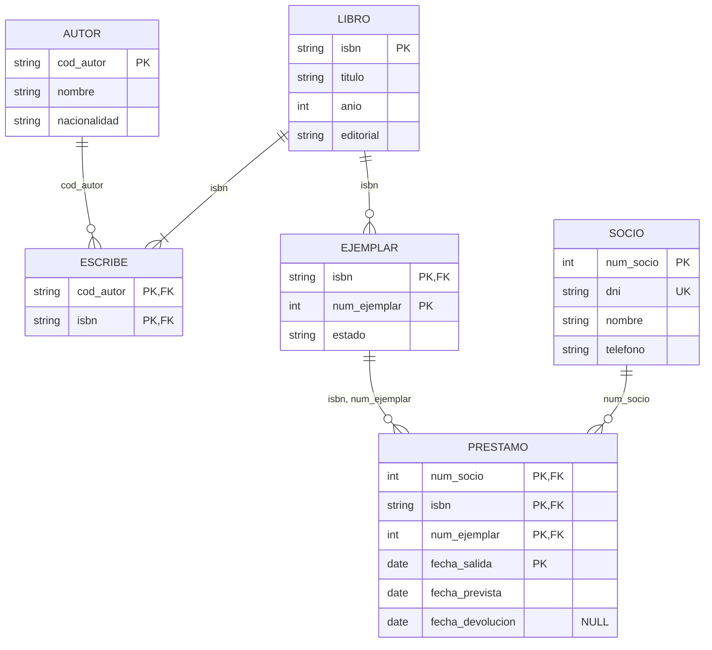

# UD03 · Prácticas



| Práctica | Tipo | Nivel | CE principales |
|---|---|---|---|
| [3.1 Biblioteca: del E/R a las tablas](#práctica-31--biblioteca-del-er-a-las-tablas) | Guiada | ●○○ | RA6.b, RA6.c, RA6.d, RA6.e |
| [3.2 Simulador de integridad referencial](#práctica-32--simulador-de-integridad-referencial) | Guiada | ●●○ | RA6.f, RA2.e |
| [3.3 Tres formas de transformar una jerarquía](#práctica-33--tres-formas-de-transformar-una-jerarquía) | Autónoma | ●●○ | RA6.b, RA6.d, RA6.e |
| [3.4 Ingeniería inversa de un esquema](#práctica-34--ingeniería-inversa-de-un-esquema) | Reto | ●●● | RA6.a, RA6.d |
| [3.5 Catálogo de restricciones de un hotel](#práctica-35--catálogo-de-restricciones-de-un-hotel) | Autónoma | ●●○ | RA6.h |
| [Proyecto EduGest · UD03](#proyecto-edugest--ud03-modelo-lógico) | Proyecto | ●●○ | RA6.a-f, RA6.h |
| [3.6 Entender un esquema relacional](#práctica-36--entender-un-esquema-relacional) | Guiada | ●○○ | RA6.b, RA6.c, RA6.d |
| [Tarea 1 · Naviera](#tarea-1--naviera-capitanes-contenedores-puertos-y-barcos) | Guiada | ●○○ | RA6.b-e |
| [Tarea 2 · Instituto](#tarea-2--instituto-módulos-matrículas-delegados-y-casilleros) | Autónoma | ●●○ | RA6.b-e, RA6.h |
| [Tarea 3 · Concesionario](#tarea-3--concesionario-ventas-revisiones-y-mecánicos) | Autónoma | ●●○ | RA6.b-e |
| [Tarea 4 · Casas rurales](#tarea-4--casas-rurales) | Autónoma | ●●○ | RA6.b-e |
| [Tarea 5 · Esquema abstracto 1](#tarea-5--esquema-abstracto-1-ternaria-11n-y-agregación) | Reto | ●●● | RA6.b-e, RA6.h |
| [Tarea 6 · Esquema abstracto 2](#tarea-6--esquema-abstracto-2-agregación-con-relación-11-y-existencia) | Reto | ●●● | RA6.b-e, RA6.h |
| [Tarea 7 · Esquema abstracto 3](#tarea-7--esquema-abstracto-3-ternaria-con-una-entidad-repetida) | Reto | ●●● | RA6.b-e, RA6.h |
| [Banco de ejercicios](#banco-de-ejercicios) | Autónoma | ●○○ a ●●● | RA6, RA2 |

> [!TIP]
> Para escribir esquemas relacionales usa siempre la misma notación: `TABLA(`<u>clave_primaria</u>`, atributo, `*clave_ajena*`)`, y debajo de cada tabla, las claves ajenas con la tabla a la que apuntan, las claves alternativas y los atributos que **admiten nulos**.

---

## Práctica 3.1 · Biblioteca: del E/R a las tablas



#### Objetivo

Aplicar una a una las reglas de transformación al modelo conceptual de la práctica 2.1 y obtener un esquema relacional completo y justificado.

#### Contexto

Partimos del diagrama de la biblioteca municipal de la [práctica 2.1](/ud02-modelo-er/ud02-practicas#práctica-21--biblioteca-municipal-del-enunciado-al-diagrama):


#### Desarrollo

{}

1. **Entidades fuertes → tablas.** Cada entidad fuerte da una tabla con sus atributos; el identificador pasa a ser la clave primaria.

    - AUTOR(<u>cod_autor</u>, nombre, nacionalidad)
    - LIBRO(<u>isbn</u>, titulo, anio, editorial)
    - SOCIO(<u>num_socio</u>, dni, nombre, telefono) · `dni` UNIQUE

2. **Entidad débil → tabla con la clave del propietario.** La clave primaria de `EJEMPLAR` combina la clave de `LIBRO` y su discriminador. Esa parte de la clave también es clave ajena.

    - EJEMPLAR(<u>*isbn*, num_ejemplar</u>, estado) · FK isbn → LIBRO

3. **Relación N:M → tabla nueva.** `ESCRIBE` se convierte en una tabla con las claves de las dos entidades.

    - ESCRIBE(<u>*cod_autor*, *isbn*</u>) · FK cod_autor → AUTOR, FK isbn → LIBRO

4. **Relación N:M con atributos y repetible → tabla nueva con la fecha en la clave.** Como un socio puede llevarse el mismo ejemplar en ocasiones distintas, la clave incluye la fecha de salida.

    - PRESTAMO(<u>*num_socio*, *isbn*, *num_ejemplar*, fecha_salida</u>, fecha_prevista, fecha_devolucion)
    - FK num_socio → SOCIO; FK (isbn, num_ejemplar) → EJEMPLAR · `fecha_devolucion` admite NULL

5. **Revisa las claves ajenas compuestas.** Una clave ajena apunta a la clave primaria **completa** de la tabla referenciada: (isbn, num_ejemplar) → EJEMPLAR(isbn, num_ejemplar), no cada columna por separado.

6. **Dibuja el diagrama relacional** en SQL Developer Data Modeler (*Modelo relacional → Nueva tabla*) o en draw.io.

{}

{}

{}

#### Comprobación

- [ ] Hay **6** tablas: 4 por las entidades y 2 por las relaciones N:M.
- [ ] La clave primaria de `PRESTAMO` tiene 4 columnas, o has justificado una clave artificial con `UNIQUE` sobre esas 4 columnas.
- [ ] La clave ajena de `PRESTAMO` a `EJEMPLAR` es **compuesta**.
- [ ] Has indicado qué columnas admiten nulos.

#### Errores habituales

> [!WARNING]
> - Crear dos claves ajenas separadas `isbn → LIBRO` y `num_ejemplar → EJEMPLAR`. `num_ejemplar` por sí solo no identifica nada.
> - Olvidar la restricción «un libro tiene al menos un autor». La participación mínima 1 de `LIBRO` en `ESCRIBE` **no** se puede garantizar con una clave ajena: hay que documentarla (RA6.h).

#### Ampliación

Sustituye la clave compuesta de `PRESTAMO` por un identificador artificial `id_prestamo`. ¿Qué restricción `UNIQUE` necesitas para no perder información? ¿Qué ventajas e inconvenientes tiene cada opción?

---

## Práctica 3.2 · Simulador de integridad referencial



#### Objetivo

Predecir el efecto de las operaciones de borrado y modificación según la política de integridad referencial de cada clave ajena.

#### Contexto

Un fragmento de EduGest con estos datos:

**GRUPO**

| cod_grupo | cod_ciclo | id_tutor |
|---|---|---|
| 1DAM | DAM | 103 |
| 1DAW | DAW | 106 |
| 2ASIR | ASIR | NULL |

**ALUMNO**

| id_alumno | nombre | cod_grupo |
|---|---|---|
| 1 | Adrián | 1DAM |
| 2 | Rubén | 1DAM |
| 14 | Carla | 1DAW |
| 30 | Zoe | NULL |

**MATRICULA**

| id_matricula | id_alumno | id_modulo |
|---|---|---|
| 10001 | 1 | 2 |
| 10002 | 1 | 3 |
| 10050 | 14 | 12 |

Claves ajenas: `ALUMNO.cod_grupo → GRUPO` y `MATRICULA.id_alumno → ALUMNO`.

#### Enunciado

Para cada escenario, indica si la operación **se ejecuta o se rechaza** y, si se ejecuta, cómo quedan las tres tablas.

| # | Política de `fk_alumno_grupo` | Política de `fk_matricula_alumno` | Operación |
|---|---|---|---|
| A | Por defecto (sin acción) | `ON DELETE CASCADE` | `DELETE FROM grupo WHERE cod_grupo = '1DAM'` |
| B | `ON DELETE SET NULL` | `ON DELETE CASCADE` | `DELETE FROM grupo WHERE cod_grupo = '1DAM'` |
| C | `ON DELETE CASCADE` | Por defecto (sin acción) | `DELETE FROM grupo WHERE cod_grupo = '1DAM'` |
| D | `ON DELETE CASCADE` | `ON DELETE CASCADE` | `DELETE FROM grupo WHERE cod_grupo = '1DAM'` |
| E | cualquiera | cualquiera | `DELETE FROM grupo WHERE cod_grupo = '2ASIR'` |
| F | cualquiera | cualquiera | `INSERT INTO alumno VALUES (40, 'Eva', '3DAM')` |

{}
- **A. Se rechaza.** Hay alumnos en 1DAM y la clave ajena no permite el borrado (error `ORA-02292: integrity constraint violated - child record found`).
- **B. Se ejecuta.** Se borra 1DAM; Adrián y Rubén quedan con `cod_grupo = NULL`. Sus matrículas **no** se borran: la cascada de la matrícula solo se activa si se borra el alumno, y el alumno no se ha borrado.
- **C. Se rechaza.** La cascada intenta borrar a Adrián y a Rubén, pero Adrián tiene matrículas y `fk_matricula_alumno` no lo permite. Toda la sentencia se deshace: el borrado es **atómico**.
- **D. Se ejecuta.** Se borra el grupo, los alumnos 1 y 2 y las matrículas 10001 y 10002. Un solo `DELETE` borra filas de tres tablas: por eso hay que usar `CASCADE` con mucho cuidado.
- **E. Se ejecuta** siempre: 2ASIR no tiene alumnos.
- **F. Se rechaza:** el grupo 3DAM no existe (`ORA-02291: integrity constraint violated - parent key not found`).
{}

#### Ampliación

¿Qué política elegirías para cada clave ajena de EduGest? Justifica al menos tres decisiones. Recuerda que en un centro educativo las matrículas y las notas son **documentos oficiales**.

> [!CAUTION]
> `ON DELETE CASCADE` es cómodo, pero convierte un error humano (borrar el grupo equivocado) en una pérdida masiva de datos. Úsalo solo cuando las filas hijas no tengan sentido sin la fila padre **y** no tengan valor por sí mismas.

---

## Práctica 3.3 · Tres formas de transformar una jerarquía



#### Objetivo

Comparar las alternativas de transformación de una jerarquía y elegir la más adecuada según el caso.

#### Enunciado

Usa la jerarquía de empleados de la clínica veterinaria de la [práctica 2.4](/ud02-modelo-er/ud02-practicas#práctica-24--clínica-veterinaria-con-jerarquías): `EMPLEADO` (total y disyunta) con `VETERINARIO`, `AUXILIAR` y `ADMINISTRATIVO`.


1. **Opción 1. Una sola tabla** con todos los atributos y un discriminador `tipo`.
2. **Opción 2. Una tabla para la superclase y una por subclase**, cada una con la clave primaria de la superclase como clave ajena.
3. **Opción 3. Solo tablas para las subclases**, cada una con los atributos comunes repetidos.

Para cada opción, escribe el esquema relacional y responde:

| Pregunta | Opción 1 | Opción 2 | Opción 3 |
|---|---|---|---|
| ¿Cuántos nulos aparecen? | | | |
| ¿Cómo se obtiene un listado de **todos** los empleados? | | | |
| ¿Cómo se garantiza que la jerarquía es **disyunta**? | | | |
| ¿Cómo se garantiza que es **total**? | | | |
| ¿Qué pasa con la relación «un veterinario realiza consultas»? | | | |

Termina recomendando una opción para la clínica.

#### Comprobación

- [ ] En la opción 1 propones un `CHECK` que obliga a rellenar `num_colegiado` cuando `tipo = 'VET'`.
- [ ] En la opción 2 identificas que la disyunción **no** se garantiza solo con claves ajenas.
- [ ] En la opción 3 detectas que la relación con `CONSULTA` solo afecta a `VETERINARIO` y que el DNI podría repetirse entre subclases.

{}
```sql
CONSTRAINT ck_empleado_tipo CHECK (
     (tipo = 'VET' AND num_colegiado IS NOT NULL)
  OR (tipo = 'AUX' AND titulacion   IS NOT NULL)
  OR (tipo = 'ADM')
)
```
{}

---

## Práctica 3.4 · Ingeniería inversa de un esquema



#### Objetivo

Interpretar un esquema relacional existente, reconstruir el modelo conceptual del que procede y detectar decisiones de diseño discutibles.

#### Contexto

Heredas la base de datos de un **club de pádel**. No hay documentación, solo este esquema:

```text
JUGADOR(id_jugador, nombre, telefono, nivel, id_pareja_habitual*)
    FK id_pareja_habitual → JUGADOR
PISTA(num_pista, tipo, cubierta)
RESERVA(num_pista*, fecha, hora_inicio, id_jugador*, precio)
    FK num_pista → PISTA, FK id_jugador → JUGADOR
PARTICIPA(num_pista*, fecha*, hora_inicio*, id_jugador*)
    FK (num_pista, fecha, hora_inicio) → RESERVA, FK id_jugador → JUGADOR
TORNEO(id_torneo, nombre, fecha_inicio)
INSCRIPCION(id_torneo*, id_jugador1*, id_jugador2*, categoria)
    FK id_torneo → TORNEO, FK id_jugador1 → JUGADOR, FK id_jugador2 → JUGADOR
```

#### Enunciado

1. Subraya las claves primarias que deduces y justifícalas.
2. Dibuja el diagrama E/R del que procede: entidades, relaciones (incluida la reflexiva), cardinalidades y entidades débiles.
3. ¿Qué significa `RESERVA.id_jugador` y qué significa `PARTICIPA`? ¿Son redundantes?
4. Detecta al menos **dos problemas**. Por ejemplo, ¿qué impide inscribir la misma pareja dos veces cambiando el orden de los jugadores?
5. Propón las restricciones (`UNIQUE`, `CHECK` o textuales) que los resuelven.

{}
Con `INSCRIPCION(id_torneo, id_jugador1, id_jugador2)` como clave, las filas (T1, 5, 8) y (T1, 8, 5) son distintas para el SGBD pero representan la misma pareja. Un `CHECK (id_jugador1 < id_jugador2)` obliga a guardar siempre la pareja en el mismo orden. ¿Qué impide que un jugador se inscriba con él mismo?
{}

---

## Práctica 3.5 · Catálogo de restricciones de un hotel



#### Objetivo

Clasificar las reglas de negocio según dónde pueden implementarse y documentar las que el modelo lógico no recoge.

#### Contexto

Esquema simplificado de un hotel:

```text
HABITACION(num_hab, tipo, capacidad, precio_noche)
CLIENTE(id_cliente, dni, nombre, fecha_nacimiento)
RESERVA(id_reserva, id_cliente*, num_hab*, fecha_entrada, fecha_salida, num_personas, importe)
```

#### Enunciado

Clasifica cada regla en una de estas categorías: **PK/UNIQUE**, **FK**, **NOT NULL**, **CHECK de fila** o **no representable** (documentar e implementar en la UD09). En el último caso, usa el formato de documentación de la teoría.

1. Dos clientes no pueden tener el mismo DNI.
2. La fecha de salida es posterior a la de entrada.
3. El número de personas no supera la capacidad de la habitación.
4. Una habitación no puede tener dos reservas que se solapen en fechas.
5. El tipo de habitación es «individual», «doble» o «suite».
6. El cliente que reserva debe ser mayor de edad en la fecha de entrada.
7. El importe es el precio por noche multiplicado por el número de noches.
8. Toda reserva corresponde a un cliente existente.

#### Comprobación

- [ ] Las reglas 3, 4, 6 y 7 están clasificadas como no representables o justificadas como tales.
- [ ] La regla 2 es un `CHECK (fecha_salida > fecha_entrada)`.
- [ ] Para la regla 7 se discute si conviene **guardar** el importe o **calcularlo**.

---

## Proyecto EduGest · UD03: modelo lógico



#### Enunciado

Transforma **tu** modelo E/R de EduGest (práctica EduGest-2) en un modelo relacional:

1. Esquema relacional completo con claves primarias, ajenas y alternativas, y las columnas que admiten nulos.
2. Tabla de trazabilidad: elemento del E/R → regla aplicada → tabla o columna resultante (como la del [caso guiado](/ud03-modelo-relacional/ud03-teoria#8-caso-guiado-edugest-del-modelo-er-al-relacional)).
3. Política de borrado de cada clave ajena, justificada.
4. Diagrama relacional hecho con una herramienta gráfica.
5. Catálogo de restricciones no representables (como mínimo las cinco del enunciado del proyecto).

#### Comprobación

- [ ] Todas las relaciones N:M del E/R se han convertido en tablas.
- [ ] La relación «imparte» conserva la información de profesor, módulo, grupo y curso académico.
- [ ] Ninguna clave ajena de matrículas o notas usa `ON DELETE CASCADE` sin justificarlo.

---

## Tareas de transformación: del E/R al modelo relacional

Las tareas de este apartado parten de un **diagrama EER ya hecho**, dibujado con la misma notación que el [banco de ejercicios de la UD02](/ud02-modelo-er/ud02-practicas#banco-de-ejercicios). Hay que obtener el **esquema relacional** y anotar las **pérdidas semánticas**: lo que el diagrama dice y las tablas no pueden garantizar por sí solas.

A diferencia del diagrama E/R, donde caben varias soluciones, la transformación de un diagrama dado es casi única. Los nombres de las claves ajenas pueden variar (`cod_emp`, `codigo_empleado`…), pero las **PK, FK, UK y VNN** tienen que ser las mismas.

### Notación del esquema

Cada tabla se escribe con sus columnas y, debajo, sus restricciones:

```text
CONTENEDOR (cod_contenedor, descripcion, dni_capitan, cod_puerto)
   PK:  cod_contenedor
   FK:  dni_capitan → CAPITAN
   FK:  cod_puerto  → PUERTO
   VNN: dni_capitan, cod_puerto
```

| Marca | Nombre | ¿Admite duplicados? | ¿Admite nulos? |
|---|---|---|---|
| **PK** | Clave primaria | No | No |
| **UK** | Clave alternativa (*unique*) | No | No, si es clave candidata (se añade VNN) |
| **FK** | Clave ajena | Sí\* | Sí\* |
| **VNN** | Valor no nulo (*not null*) | — | No |

\* Salvo que la columna forme parte también de una PK o UK, o tenga VNN.

> [!TIP]
> Es la misma información que la notación `TABLA(`<u>clave</u>`, columna, `*clave_ajena*`)` de las prácticas anteriores, pero en forma de lista. Con ella es más fácil revisar que no falta ninguna restricción y, en la UD05, cada línea se convierte casi directamente en una cláusula de `CREATE TABLE`.

### Reglas de transformación (resumen)

| Elemento del E/R | Resultado en el modelo relacional |
|---|---|
| Entidad fuerte | Tabla. El identificador pasa a PK; las claves alternativas, a UK. |
| Entidad débil por identificación (**ID**) | Tabla. PK = PK de la entidad propietaria + discriminador. La parte heredada es también FK. |
| Entidad débil por existencia (**E**) | Tabla con PK propia. La FK hacia la propietaria lleva **VNN**. |
| Relación 1:N | La PK del lado 1 viaja como **FK** a la tabla del lado N, con los atributos de la relación. Si el lado N no puede existir sin el otro (mínimo 1), la FK lleva **VNN**. |
| Relación N:M | **Tabla nueva**. PK = las dos claves (más el atributo que permita repetir la pareja, si lo hay). Cada clave es FK. |
| 1:1 con (0,1) y (0,1) | **Tabla nueva**: PK = clave de una entidad; UK = clave de la otra. |
| 1:1 con (0,1) y (1,1) | Se propaga la clave a la tabla de la entidad que participa obligatoriamente, con **UK** y **VNN**. |
| 1:1 con (1,1) y (1,1) | **Una sola tabla**: PK = clave de una entidad; UK = clave de la otra. |
| Reflexiva | Igual que la binaria del mismo tipo, con la misma tabla en los dos extremos (columnas renombradas). |
| Ternaria N:N:N | Tabla con las tres claves como PK. |
| Ternaria 1:N:N | PK = claves de los dos lados N; la del lado 1, con **VNN**. |
| Ternaria 1:1:N | PK = clave del lado N + una de las de lado 1; la otra combinación, **UK**. |
| Generalización | Tabla para la superclase y una por subclase, con la PK de la superclase como PK y FK. Total y disjunta **no se pueden** expresar: son pérdidas. |
| Agregación | La relación agregada se trata como una tabla más; su clave es la que la identifica. |
| Atributo multivaluado | Tabla nueva con la PK de la entidad y el valor. |

> [!IMPORTANT]
> **Pérdidas semánticas habituales.** Las claves no pueden garantizar: el mínimo 1 del lado 1 de una relación 1:N («todo profesor imparte al menos un módulo»), la existencia de una entidad respecto a una relación cuando están en tablas distintas, las generalizaciones totales o disjuntas y las restricciones entre relaciones («C solo se relaciona con D si lo está con B»). Se anotan y se resuelven en la implementación con `CHECK`, disparadores (UD09) o procedimientos.

---

## Práctica 3.6 · Entender un esquema relacional



#### Objetivo

Hacer el camino inverso: a partir de unas tablas con sus restricciones, **deducir las cardinalidades** de la relación que representan.

#### Contexto

Antes de transformar diagramas conviene saber «leer» un esquema. Cada restricción (PK, UK, FK, VNN) responde a una pregunta sobre la relación: ¿puede repetirse?, ¿puede faltar?

#### Desarrollo

El juego consiste en responder a cuatro preguntas usando la tabla de la notación (duplicados y nulos). Primero, un caso abstracto:

```text
T1 (A, B, C)          T2 (E, F)
   PK: A                 PK: E
                         FK: F → T1
```

- ¿Con cuántas filas de `T2` puede relacionarse una fila de `T1`? El valor de `A` puede aparecer en la columna `F` de **muchas** filas de `T2` (una FK admite duplicados), o de ninguna: **(0,N)**.
- ¿Con cuántas filas de `T1` se relaciona una fila de `T2`? `F` guarda **un único** valor y puede ser nulo (la FK admite nulos): **(0,1)**.

Ahora, la relación entre alumnos y asignaturas («los alumnos se matriculan de asignaturas»). Para cada esquema responde a:

1. ¿De cuántas asignaturas puede matricularse un alumno?
2. ¿Está obligado el alumno a matricularse de alguna asignatura?
3. ¿Cuántos alumnos puede tener una asignatura?
4. ¿Es necesario que las asignaturas tengan alumnos?

| Caso | Esquema |
|---|---|
| A | `ASIGNATURA (codigo, nombre, curso)` PK: codigo · `ALUMNO (dni, nombre, asig)` PK: dni · FK: asig → ASIGNATURA |
| B | Igual que A, añadiendo **VNN: asig** |
| C | `ALUMNO (dni, nombre)` PK: dni · `ASIGNATURA (codigo, nombre, curso, dni)` PK: codigo · UK: dni · FK: dni → ALUMNO |
| D | `ALUMNO (dni, nombre)` PK: dni · `ASIGNATURA (codigo, nombre, curso)` PK: codigo · `MATRICULA (dni, asig)` PK: (dni, asig) · FK: dni → ALUMNO · FK: asig → ASIGNATURA |
| E | Igual que D, pero con **PK: dni** en `MATRICULA` |
| F | `ASIGNATURA (codigo, nombre, curso, dni, nombre_alumno)` PK: codigo · UK: dni · VNN: dni (no hay tabla `ALUMNO`) |

{}
| Caso | 1. Asignaturas por alumno | 2. ¿Obligado? | 3. Alumnos por asignatura | 4. ¿Necesario? | Relación |
|---|---|---|---|---|---|
| A | Una (`asig` guarda un valor) | No (`asig` admite nulos) | Muchos (FK admite duplicados) | No | 1:N · (0,1) y (0,N) |
| B | Una | **Sí** (VNN) | Muchos | No | 1:N · (1,1) y (0,N) |
| C | Una (UK: el dni no se repite) | No | Uno (la columna guarda un valor) | No (`dni` admite nulos) | 1:1 · (0,1) y (0,1) |
| D | Varias | No | Muchos | No | N:M · (0,N) y (0,N) |
| E | Una (el dni no se repite en `MATRICULA`) | No | Muchos | No | 1:N con tabla propia · (0,1) y (0,N) |
| F | Una | Sí | Uno | Sí | 1:1 · (1,1) y (1,1), fusionada en una tabla |

Fíjate en que **ninguna** combinación de PK, UK, FK y VNN obliga a que una asignatura tenga alumnos (pregunta 4) cuando están en tablas distintas: es una pérdida semántica típica.
{}

#### Comprobación

- [ ] Para cada caso has escrito las cuatro respuestas y la cardinalidad (mín, máx) de cada lado.
- [ ] Has relacionado cada respuesta con una restricción concreta (PK, UK, FK o VNN).

#### Errores habituales

> [!WARNING]
> - Pensar que una FK no admite duplicados. Lo que no se repite es la **PK** de la tabla referenciada, no la columna que la referencia.
> - Confundir el caso E con el D: una tabla intermedia no implica siempre N:M; depende de su clave primaria.

#### Ampliación

Escribe el esquema que corresponde a «un alumno se matricula de **una o varias** asignaturas y una asignatura tiene **como máximo 30** alumnos». ¿Qué parte puedes expresar con PK, UK, FK y VNN y qué parte queda como pérdida semántica?

---

### Tarea 1 · Naviera: capitanes, contenedores, puertos y barcos



#### Objetivo

Transformar relaciones 1:N con participación obligatoria y una N:M que guarda un histórico.

#### Contexto

Es el diagrama del [ejercicio 4 de la UD02](/ud02-modelo-er/ud02-practicas#ejercicio-4--naviera-capitanes-contenedores-puertos-y-barcos).



#### Enunciado

Obtén el esquema relacional del diagrama, indicando para cada tabla su PK, sus FK, sus UK y las columnas con VNN. Anota las pérdidas semánticas.

#### Tareas

1. Escribe una tabla por entidad.
2. Decide dónde van las claves de *transporta* y *llega a*. ¿Llevan VNN?
3. Convierte *gobierna* en tabla. ¿Qué columnas forman su PK? ¿Por qué no basta con (capitán, barco)?
4. Lista las pérdidas semánticas.

#### Comprobación

- [ ] Hay 5 tablas.
- [ ] `CONTENEDOR` tiene dos FK, ambas con VNN.
- [ ] La PK de `GOBIERNA` incluye `fecha_inicio`.

#### Errores habituales

> [!WARNING]
> - Crear una tabla para cada relación 1:N. Solo las N:M (y algunas 1:1) generan tabla nueva.
> - Dejar la PK de `GOBIERNA` en (dni, matrícula): impediría que un capitán vuelva a gobernar el mismo barco.

{}
```text
CAPITAN (dni, nombre, telefono, direccion, salario, poblacion)
   PK:  dni

BARCO (matricula, nombre, potencia_motor, astillero)
   PK:  matricula

PUERTO (cod_puerto, nombre)
   PK:  cod_puerto

CONTENEDOR (cod_contenedor, descripcion, dir_remitente, dir_destinatario, dni_capitan, cod_puerto)
   PK:  cod_contenedor
   FK:  dni_capitan → CAPITAN
   FK:  cod_puerto  → PUERTO
   VNN: dni_capitan, cod_puerto

GOBIERNA (dni_capitan, matricula, fecha_inicio, fecha_fin)
   PK:  (dni_capitan, matricula, fecha_inicio)
   FK:  dni_capitan → CAPITAN
   FK:  matricula   → BARCO
```

**Pérdidas semánticas**

- Un capitán no gobierna dos barcos a la vez (periodos solapados): se controlará con un disparador.
- `fecha_fin` posterior a `fecha_inicio`: no es una pérdida, se resuelve con `CHECK` en la UD05.

> [!NOTE]
> En la solución del curso anterior la PK de `GOBIERNA` era (nombre_barco, dni_capitán) y el barco se identificaba por el nombre. Con la fecha en la clave se conserva el histórico; y la matrícula es mejor identificador que el nombre, que puede repetirse.
{}

#### Ampliación

La naviera quiere saber en qué **barco** viaja cada contenedor. Añade la relación al diagrama y transforma solo la parte que cambia.

---

### Tarea 2 · Instituto: módulos, matrículas, delegados y casilleros



#### Objetivo

Transformar dos relaciones reflexivas (1:N y N:M) y una 1:1 con mínimos 0 en los dos lados.

#### Contexto

Es el diagrama del [ejercicio 6 de la UD02](/ud02-modelo-er/ud02-practicas#ejercicio-6--instituto-módulos-matrículas-delegados-y-casilleros).



#### Enunciado

Obtén el esquema relacional completo con PK, FK, UK y VNN, y anota las pérdidas semánticas.

#### Tareas

1. Transforma las entidades y la relación *imparte*.
2. Transforma las dos reflexivas. ¿Cuál necesita tabla propia y cuál no?
3. Transforma *tiene* aplicando la regla de la 1:1 con (0,1) y (0,1).
4. Lista las pérdidas semánticas.

#### Comprobación

- [ ] Hay 7 tablas.
- [ ] El delegado es una FK de `ALUMNO` a la propia tabla `ALUMNO`.
- [ ] `TIENE` tiene una PK y una UK.

#### Errores habituales

> [!WARNING]
> - Poner `fecha_matricula` en `ALUMNO` (en la solución antigua aparecía en las dos tablas). Solo va en `MATRICULA`.
> - Usar el mismo nombre de columna para los dos módulos de `ES_REQUISITO`.

{}
```text
PROFESOR (dni, nombre, direccion, telefono)
   PK:  dni

MODULO (codigo, nombre, dni_profesor)
   PK:  codigo
   FK:  dni_profesor → PROFESOR
   VNN: dni_profesor

ES_REQUISITO (cod_previo, cod_posterior)
   PK:  (cod_previo, cod_posterior)
   FK:  cod_previo    → MODULO
   FK:  cod_posterior → MODULO

ALUMNO (n_expediente, nombre, apellidos, fecha_nacimiento, curso, exp_delegado)
   PK:  n_expediente
   FK:  exp_delegado → ALUMNO

MATRICULA (n_expediente, cod_modulo, fecha_matricula)
   PK:  (n_expediente, cod_modulo)
   FK:  n_expediente → ALUMNO
   FK:  cod_modulo   → MODULO

CASILLERO (n_casillero, tamano_m)
   PK:  n_casillero

TIENE (n_expediente, n_casillero)
   PK:  n_expediente
   UK:  n_casillero
   VNN: n_casillero
   FK:  n_expediente → ALUMNO
   FK:  n_casillero  → CASILLERO
```

**Pérdidas semánticas**

- Todo profesor imparte al menos un módulo y todo alumno está matriculado de al menos uno: el mínimo 1 del lado 1 no se puede garantizar con claves.
- El delegado y sus representados son del mismo curso.
- Un módulo no puede ser requisito de sí mismo ni formar ciclos (el primer caso se resuelve con `CHECK (cod_previo <> cod_posterior)`).

> [!TIP]
> Alternativa también correcta: guardar `n_casillero` en `ALUMNO` con UK (admite nulos). Evita una tabla, pero deja nulos en los alumnos sin casillero. La regla de la 1:1 con (0,1) y (0,1) prefiere la tabla propia para no tener nulos.
{}

#### Ampliación

Un alumno puede repetir y matricularse **dos veces** del mismo módulo en cursos distintos. ¿Qué cambia en `MATRICULA`?

---

### Tarea 3 · Concesionario: ventas, revisiones y mecánicos



#### Objetivo

Transformar una entidad débil por identificación, una reflexiva 1:N y claves alternativas.

#### Contexto

Es el diagrama del [ejercicio 10 de la UD02](/ud02-modelo-er/ud02-practicas#ejercicio-10--concesionario-ventas-revisiones-y-mecánicos).



#### Enunciado

Obtén el esquema relacional con PK, FK, UK y VNN. Indica qué columnas de `REVISION` son a la vez PK y FK.

#### Comprobación

- [ ] La PK de `REVISION` es compuesta e incluye la matrícula.
- [ ] `nif` y `dni` son UK.
- [ ] La FK del cliente en `COCHE` admite nulos (coche sin vender).

#### Errores habituales

> [!WARNING]
> - Escribir `PK (codigo, matricula)` sin marcar `matricula` como FK.
> - Poner VNN en `cod_cliente` de `COCHE`: el diagrama dice (0,1), un coche puede estar sin vender.

{}
```text
CLIENTE (cod_cliente, nif, nombre, direccion, ciudad, telefono)
   PK:  cod_cliente
   UK:  nif
   VNN: nif

COCHE (matricula, marca, modelo, color, precio_venta, cod_cliente)
   PK:  matricula
   FK:  cod_cliente → CLIENTE

MECANICO (cod_empleado, dni, nombre, telefono, direccion, cod_supervisor)
   PK:  cod_empleado
   UK:  dni
   VNN: dni
   FK:  cod_supervisor → MECANICO

REVISION (matricula, n_revision, cambio_filtro, cambio_aceite, cambio_frenos, otros, cod_mecanico)
   PK:  (matricula, n_revision)
   FK:  matricula    → COCHE
   FK:  cod_mecanico → MECANICO
   VNN: cod_mecanico
```

**Pérdidas semánticas**

- Un mecánico no puede supervisarse a sí mismo: `CHECK (cod_supervisor <> cod_empleado)`.
- No puede haber ciclos de supervisión (A supervisa a B y B a A): disparador.
{}

#### Ampliación

El taller guarda **qué piezas** se cambian en cada revisión y cuántas. Añade la entidad `PIEZA` y transforma la nueva relación. ¿Cuántas columnas tiene la PK de la tabla nueva?

---

### Tarea 4 · Casas rurales



#### Objetivo

Transformar una cadena de entidades débiles con **claves ajenas compuestas** y distinguir la dependencia en identificación (ID) de la dependencia en existencia (E).

#### Contexto

El primer diagrama es el del [ejercicio 11 de la UD02](/ud02-modelo-er/ud02-practicas#ejercicio-11--casas-rurales-provincias-ciudades-y-habitaciones). El segundo es la variante de su ampliación.





#### Enunciado

Obtén el esquema relacional de los dos diagramas.

#### Tareas

1. Escribe la PK de `CIUDAD`. ¿Cuántas columnas tiene la FK que la referencia desde `CASA_RURAL`?
2. Transforma `HABITACION` y la relación *se aloja*.
3. En el diagrama 4.2, ¿qué diferencia hay en el esquema entre la dependencia **ID** de `CIUDAD` y la **E** de `CASA`?

#### Comprobación

- [ ] Todas las FK que apuntan a `CIUDAD` tienen **dos** columnas.
- [ ] La PK de `SE_ALOJA` incluye la fecha de entrada.
- [ ] En 4.2, `CASA` tiene PK propia y su FK a `CIUDAD` lleva VNN.

#### Errores habituales

> [!WARNING]
> - Escribir `FK: nombre_ciudad → CIUDAD` con una sola columna. La FK debe apuntar a la PK **completa** (era el error de la solución antigua).
> - Incluir la ciudad en la PK de `CASA` en el diagrama 4.2: la dependencia es de existencia, no de identificación.

{}
**Diagrama 4.1**

```text
PROVINCIA (nombre, area, poblacion)
   PK:  nombre

CIUDAD (nombre_provincia, nombre, habitantes)
   PK:  (nombre_provincia, nombre)
   FK:  nombre_provincia → PROVINCIA

CASA_RURAL (nombre, localizacion, desayuno, nombre_provincia, nombre_ciudad)
   PK:  nombre
   FK:  (nombre_provincia, nombre_ciudad) → CIUDAD
   VNN: nombre_provincia, nombre_ciudad

HABITACION (nombre_casa, numero, descripcion, precio)
   PK:  (nombre_casa, numero)
   FK:  nombre_casa → CASA_RURAL

CLIENTE (dni, nombre, direccion, telefono)
   PK:  dni

SE_ALOJA (dni, nombre_casa, numero, fecha_entrada, fecha_salida)
   PK:  (dni, nombre_casa, numero, fecha_entrada)
   FK:  dni → CLIENTE
   FK:  (nombre_casa, numero) → HABITACION
```

**Diagrama 4.2**

```text
PROVINCIA (nombre)
   PK:  nombre

CIUDAD (nombre_provincia, nombre)
   PK:  (nombre_provincia, nombre)
   FK:  nombre_provincia → PROVINCIA

CASA (id_casa, precio, valoracion, nombre_provincia, nombre_ciudad)
   PK:  id_casa
   FK:  (nombre_provincia, nombre_ciudad) → CIUDAD
   VNN: nombre_provincia, nombre_ciudad

PERSONA (id_persona, nombre, id_casa_vive)
   PK:  id_persona
   FK:  id_casa_vive → CASA

POSEE (id_casa, id_persona, fecha_compra)
   PK:  (id_casa, id_persona)
   FK:  id_casa    → CASA
   FK:  id_persona → PERSONA
```

**Pérdidas semánticas**

- Toda provincia tiene al menos una ciudad y toda casa rural al menos una habitación (mínimo 1 del lado 1).
- Toda casa tiene al menos un propietario: no se puede obligar a que exista una fila en `POSEE`.
- En 4.1, la fecha de salida posterior a la de entrada y que no haya estancias solapadas en la misma habitación (disparador).

> [!NOTE]
> **ID frente a E.** Las dos dependencias producen una FK con VNN; la diferencia es que con **ID** la FK forma parte de la PK y con **E** no.
{}

#### Ampliación

Un cliente quiere reservar **varias habitaciones** con una sola reserva (número de reserva, fecha y forma de pago). Rediseña la parte del E/R afectada y transfórmala.

---

### Tarea 5 · Esquema abstracto 1: ternaria 1:1:N y agregación



#### Objetivo

Aplicar las reglas a un esquema sin significado (letras), donde solo cuentan la estructura y las cardinalidades.

#### Contexto

Los esquemas abstractos obligan a aplicar las reglas sin apoyarse en el sentido común del enunciado. Los atributos subrayados son identificadores; `a0` es el discriminador de la entidad débil `A`.



#### Enunciado

Obtén el esquema lógico relacional y enuncia las **pérdidas semánticas**.

#### Tareas

1. ¿Cuál es la PK de `A`? ¿Y la de `F` y `G`?
2. ¿Qué clave identifica a la agregación? Transforma *R5*.
3. Transforma la ternaria *R2* (1 junto a `A`, 1 junto a `D`, N junto a `E`): PK y UK.
4. Enuncia las pérdidas.

#### Comprobación

- [ ] Todas las FK hacia `A` tienen dos columnas.
- [ ] `R2` tiene PK y UK distintas.
- [ ] Has anotado que no se capta que la generalización sea disjunta.

{}
```text
B (b0, b1)
   PK:  b0

D (d0, d1)
   PK:  d0

E (e0, e1)
   PK:  e0

C (c0, c1, cB, cD)
   PK:  c0
   FK:  cB → B          (R4: C es el lado N)
   FK:  cD → D          (R5: la agregación se identifica por C, porque R4 es 1:N)

A (aC, a0, a1, aA_C, aA_0)
   PK:  (aC, a0)
   FK:  aC → C
   FK:  (aA_C, aA_0) → A          (R3)

F (fC, f0A, f0)
   PK:  (fC, f0A)
   FK:  (fC, f0A) → A

G (gC, g0)
   PK:  (gC, g0)
   FK:  (gC, g0) → A

R2 (rD, rE, rA_C, rA_0)
   PK:  (rD, rE)
   UK:  (rA_C, rA_0, rE)
   FK:  rD → D
   FK:  rE → E
   FK:  (rA_C, rA_0) → A
```

**Pérdidas semánticas**

- No se capta que la generalización sea **disjunta**: un mismo `A` podría estar en `F` y en `G`.
- No se capta que `C` solo pueda relacionarse con `D` (R5) si lo está con `B` (R4). En SQL se resuelve con `CHECK (cD IS NULL OR cB IS NOT NULL)`.

> [!NOTE]
> La ternaria 1:1:N da dos claves candidatas: por cada pareja (D, E) hay un único `A`, y por cada pareja (A, E) hay un único `D`. Una se elige como PK y la otra queda como UK.
{}

---

### Tarea 6 · Esquema abstracto 2: agregación con relación 1:1 y existencia



#### Objetivo

Transformar una agregación de una N:M, una 1:1 con atributo y dependencia en existencia, una ternaria 1:N:N y una reflexiva sobre una subclase.



#### Enunciado

Obtén el esquema lógico relacional y enuncia las pérdidas semánticas.

#### Tareas

1. Transforma la agregación: como *R4* es N:M, su tabla es la que representa la agregación.
2. Coloca *R5* (1:1, atributo `m`, la agregación depende en existencia de *R5*).
3. Transforma *R6* (1 junto a `C`).

#### Comprobación

- [ ] La tabla `R4` lleva la clave de `A`, el atributo `m`, una UK y VNN.
- [ ] `R6` tiene PK de dos columnas y la tercera con VNN.

{}
```text
B (b0, b1)
   PK:  b0

C (c0, c1)
   PK:  c0

D (d0, d1)
   PK:  d0

A (aC, a0, a1)
   PK:  (aC, a0)
   FK:  aC → C

F (fC, f0A, f0, fP_C, fP_0)
   PK:  (fC, f0A)
   FK:  (fC, f0A) → A
   FK:  (fP_C, fP_0) → F           (R2)

E (eC, e0A, e0, e1)
   PK:  (eC, e0A)
   FK:  (eC, e0A) → A

R3 (rF_C, rF_0, rE_C, rE_0)
   PK:  (rF_C, rF_0, rE_C, rE_0)
   FK:  (rF_C, rF_0) → F
   FK:  (rE_C, rE_0) → E

R4 (rC, rD, rA_C, rA_0, m)
   PK:  (rC, rD)
   UK:  (rA_C, rA_0)
   VNN: rA_C, rA_0                  (la agregación depende en existencia de R5)
   FK:  rC → C
   FK:  rD → D
   FK:  (rA_C, rA_0) → A

R6 (rB, rD, rC)
   PK:  (rB, rD)
   VNN: rC
   FK:  rB → B
   FK:  rC → C
   FK:  rD → D
```

**Pérdidas semánticas**

- No se capta que la generalización sea **disjunta**.
- No se capta la dependencia en existencia de `D` respecto a *R4*: no se puede obligar a que cada fila de `D` aparezca en `R4`.
{}

---

### Tarea 7 · Esquema abstracto 3: ternaria con una entidad repetida



#### Objetivo

Transformar una ternaria en la que una entidad participa dos veces, una 1:1 con (0,1) en los dos lados y una generalización total y solapada.



#### Enunciado

Obtén el esquema lógico relacional y enuncia las pérdidas semánticas. En *R1*, `F` aparece dos veces: llama **F1** al extremo con N y **F2** al extremo con 1.

#### Tareas

1. ¿Qué clave identifica a la agregación si *R4* es 1:N?
2. Transforma *R3* (G con 1, la agregación con N y dependencia en existencia).
3. Transforma *R6* con la regla de la 1:1 con mínimos 0.
4. Transforma *R1* (F1: N, F2: 1, E: 1).

#### Comprobación

- [ ] La agregación queda representada por la tabla `C`.
- [ ] `R6` tiene PK de una columna y UK de dos.
- [ ] `R1` tiene PK (F1, F2) y UK (F1, E).

{}
```text
B (b0, b1)
   PK:  b0

G (gB, g0, g1)
   PK:  (gB, g0)
   FK:  gB → B

H (h0, h1)
   PK:  h0

R6 (rH, rG_B, rG_0)
   PK:  rH
   UK:  (rG_B, rG_0)
   VNN: rG_B, rG_0
   FK:  rH → H
   FK:  (rG_B, rG_0) → G

D (d0, d1)
   PK:  d0

C (c0, c1, cD, cG_B, cG_0, m)
   PK:  c0
   FK:  cD → D                      (R4)
   FK:  (cG_B, cG_0) → G            (R3, con el atributo m)

A (a0, a1)
   PK:  a0

F (fA, f0)
   PK:  fA
   FK:  fA → A

E (eA, e0, e1)
   PK:  eA
   FK:  eA → A

R2 (rC, rF)
   PK:  (rC, rF)
   FK:  rC → C
   FK:  rF → F

R1 (rF1, rF2, rE)
   PK:  (rF1, rF2)
   UK:  (rF1, rE)
   VNN: rE
   FK:  rF1 → F
   FK:  rF2 → F
   FK:  rE  → E
```

**Pérdidas semánticas**

- No se capta que la generalización sea **total**: puede haber un `A` que no esté ni en `F` ni en `E`.
- No se capta que `C` solo pueda relacionarse con `G` (R3) o con `F` (R2) si está en la agregación, es decir, si tiene `D` (R4). Para *R3* basta `CHECK (cG_B IS NULL OR cD IS NOT NULL)`; para *R2* hace falta un disparador.
- No se capta la dependencia en existencia de la agregación respecto a *R3*: toda pareja (C, D) debería tener `G` (`CHECK (cD IS NULL OR cG_B IS NOT NULL)`).

> [!TIP]
> Comprueba la ternaria con datos: si (f1, f2) determina e, y (f1, e) determina f2, las dos combinaciones son claves candidatas. Elige una como PK y deja la otra como UK.
{}

---


## Banco de ejercicios

> [!NOTE]
> Los ejercicios del banco piden el esquema relacional y, en algunos casos, el script SQL DDL. Resuelve primero el esquema; el SQL podrás escribirlo y **probarlo en Oracle** cuando termines la [UD05](/ud05-ddl-dcl). Recuerda que en Oracle la opción `RESTRICT` no se escribe: es el comportamiento por defecto.

### Bloque 1: Ejercicios de Transformación de Relaciones Binarias y Claves

#### Ejercicio 1: Transformación de Relación Binaria 1:N (Clientes y Pedidos)

**Enunciado:**
Un cliente realiza varios pedidos en una tienda online, pero cada pedido es realizado por un único cliente. De los clientes se conoce su `id_cliente`, `nombre`, `email` y `telefono`. De los pedidos se conoce `num_pedido`, `fecha_pedido` e `importe_total`.

- a) Exprese el **Esquema Relacional Formal** derivado de esta relación $1:N$.
- b) Escriba el script **SQL DDL** para crear ambas tablas aplicando las restricciones de clave primaria, unicidad, validación de importe positivo e integridad referencial impidiendo el borrado de clientes con pedidos activos (`RESTRICT`).

---

#### Ejercicio 2: Transformación de Relación Binaria N:M (Médicos y Pacientes)

**Enunciado:**
Un médico atiende a múltiples pacientes en un centro hospitalario y un paciente puede ser atendido por diferentes médicos especialistas. De los médicos se conoce `num_colegiado`, `nombre` y `especialidad`. De los pacientes se registra `id_paciente`, `dni`, `nombre` y `fecha_nacimiento`. De cada atención médica realizada se guarda la `fecha_atencion` y el `diagnostico`.

- a) Exprese el **Esquema Relacional Formal** resultante para la relación $N:M$.
- b) Escriba las sentencias **SQL DDL** creando la tabla intermedia necesaria con su clave primaria compuesta y sus claves foráneas en cascada.

---

#### Ejercicio 3: Transformación de Relación 1:1 Opcional (Empleados y Vehículos de Empresa)

**Enunciado:**
Una empresa asigna un coche de empresa a ciertos empleados clave. Un empleado solo puede tener asignado como máximo un coche, y un coche pertenece como máximo a un único empleado. Algunos empleados no tienen coche asignado. De los empleados se conoce `id_empleado` y `nombre`. De los vehículos se conoce `matricula`, `modelo` y `color`.

- a) Indique qué estrategia de propagación de clave es la más adecuada para evitar la presencia innecesaria de valores nulos.
- b) Escriba las sentencias **SQL DDL** definiendo las tablas y la clave foránea protegida con la restricción `UNIQUE`.

---

#### Ejercicio 4: Entidad Débil por Identificación (Edificios y Aulas)

**Enunciado:**
Un campus universitario organiza sus aulas dentro de edificios. De cada edificio se conoce `cod_edificio` y `nombre_edificio`. De las aulas se conoce `num_aula` (101, 102, 201...) y `capacidad_puestos`. El número de aula no es único en todo el campus, sino únicamente dentro de cada edificio determinado.

- a) Exprese el **Esquema Relacional Formal** especificando la clave primaria compuesta de la tabla `AULA`.
- b) Escriba la sentencia SQL `CREATE TABLE` para la entidad débil `AULA` asegurando el borrado en cascada si se elimina el edificio.

---

#### Ejercicio 5: Entidad Débil por Existencia e Identificación (Pacientes e Ingresos)

**Enunciado:**
En un hospital, un paciente puede realizar múltiples ingresos a lo largo del tiempo. De cada paciente se almacena `id_paciente`, `dni` y `nombre`. De cada ingreso se registra `num_ingreso` (1, 2, 3... secuencial para cada paciente), `fecha_ingreso` y `habitacion`. El ingreso no puede existir ni identificarse sin el paciente al que pertenece.

- a) Exprese el esquema relacional formal para `PACIENTE` e `INGRESO`.
- b) Escriba el código SQL DDL correspondiente.

---

### Bloque 2: Ejercicios de Relaciones Reflexivas, Atributos Especiales y Jerarquías

#### Ejercicio 6: Relación Reflexiva 1:N (Organigrama de Empleados)

**Enunciado:**
En una empresa, cada empleado tiene un único jefe directo, que es a su vez otro empleado de la plantilla. De cada empleado se conoce `id_empleado`, `nombre`, `puesto` y `salario`.

- a) Exprese el **Esquema Relacional Formal** indicando cómo se implementa la autorreferencia.
- b) Escriba el código SQL DDL configurando la clave foránea autorreferenciada con política `ON DELETE SET NULL`.

---

#### Ejercicio 7: Relación Reflexiva N:M (Estructura Compuesta de Piezas / BOM)

**Enunciado:**
Una fábrica de maquinaria registra piezas industriales. De cada pieza se almacena `cod_pieza`, `nombre_pieza` y `precio`. Una pieza puede estar compuesta por varias subpiezas componentes, y a su vez una subpieza forma parte de la fabricación de múltiples piezas superiores. En cada ensamblaje se indica la `cantidad_unidades`.

- a) Exprese el **Esquema Relacional Formal** definiendo la tabla intermedia de ensamblaje.
- b) Escriba las sentencias SQL DDL correspondientes.

---

#### Ejercicio 8: Atributo Multivaluado (Teléfonos de Contacto de Clientes)

**Enunciado:**
De cada cliente de un banco se conoce `id_cliente`, `nombre` y `email`. Un cliente puede disponer de varios números de teléfono de contacto (`telefono`).

- a) Indique por qué no se pueden guardar los teléfonos como una lista separada por comas dentro de la misma celda de la tabla `CLIENTE`.
- b) Exprese el esquema relacional formal transformando el atributo multivaluado en una tabla independiente.
- c) Escriba el código SQL DDL para ambas tablas.

---

#### Ejercicio 9: Atributo Compuesto (Dirección Estructurada)

**Enunciado:**
De cada proveedor se conoce su `nif`, `nombre_empresa` y el atributo compuesto `direccion` (formado por `calle`, `numero`, `piso`, `codigo_postal` y `ciudad`).

- a) Muestre cómo se transforma el atributo compuesto al modelo relacional lógico.
- b) Escriba la sentencia SQL `CREATE TABLE` correspondiente.

---

#### Ejercicio 10: Transformación de Jerarquía EER (Opción de Tabla Única con Discriminador)

**Enunciado:**
Una empresa clasifica a sus empleados en dos tipos exclusivos: `PROGRAMADOR` (con el atributo `lenguaje_principal`) y `ADMINISTRATIVO` (con el atributo `nivel_ofimatica`). Los atributos comunes a todos los empleados son `id_empleado`, `nombre` y `salario`.

- a) Muestre el esquema relacional aplicando la estrategia de **Tabla Única** con una columna discriminadora `tipo_empleado`.
- b) Escriba la sentencia SQL DDL utilizando restricciones `CHECK` para garantizar que los campos específicos solo sean informados según el tipo de empleado.

---

#### Ejercicio 11: Transformación de Jerarquía EER (Opción de Tabla por Categoría con Claves Foráneas)

**Enunciado:**
Considere la misma jerarquía de empleados del Ejercicio 10, pero aplique la estrategia de **Tabla para el Supertipo y Tablas para cada Subtipo**.

- a) Exprese el **Esquema Relacional Formal** para las 3 tablas resultantes (`EMPLEADO`, `PROGRAMADOR`, `ADMINISTRATIVO`).
- b) Escriba el código SQL DDL vinculando las tablas especializadas a la tabla principal mediante claves foráneas en cascada.

---

### Bloque 3: Casos Integradores Complejos (3 a 5 Entidades)

#### Ejercicio 12: Sistema de Gestión de Concesionario de Vehículos

**Enunciado:**
Diseñe el esquema relacional para un concesionario a partir de los siguientes requisitos:

- **Clientes:** `id_cliente` (PK), `nif`, `nombre` y `telefono`.
- **Coches:** `matricula` (PK), `modelo`, `precio_venta` y el cliente comprador (`id_cliente`). Un cliente puede comprar varios coches.
- **Revisiones:** Cada coche pasa revisiones en el taller. La revisión se identifica de forma débil por `num_revision` (1, 2, 3...) dentro de cada coche (`matricula`), registrando `fecha_revision` y `coste`.
- **Mecánicos:** Cada revisión es realizada por un único mecánico (`id_mecanico` [PK], `nombre`, `especialidad`). Un mecánico supervisa a otros mecánicos (relación reflexiva $1:N$).

- a) Redacte el **Esquema Relacional Formal Completo** de todas las tablas con sus PKs y FKs.
- b) Escriba el script SQL DDL completo.

---

#### Ejercicio 13: Gestión de Hoteles, Habitaciones Débiles y Reservas de Clientes

**Enunciado:**
Una cadena hotelera administra establecimientos:

- **Hoteles:** `id_hotel` (PK), `nombre_hotel`, `ciudad`.
- **Habitaciones:** `num_habitacion` (101, 102...) identificado de forma débil respecto al `id_hotel`. Se guarda la `capacidad` y `precio_noche`.
- **Clientes:** `id_cliente` (PK), `dni`, `nombre`, `email`.
- **Reservas:** Un cliente reserva una habitación específica de un hotel para un rango de fechas (`fecha_inicio`, `fecha_fin`, `precio_total`). Un cliente realiza muchas reservas y una habitación recibe distintas reservas en fechas diferentes.

- a) Redacte el **Esquema Relacional Formal Completo**.
- b) Escriba las sentencias SQL DDL definiendo todas las tablas e integridades referenciales.

---

#### Ejercicio 14: Sistema de Videoclub / Plataforma de Contenidos

**Enunciado:**
Se requiere estructurar la base de datos de un videoclub digital:

- **Películas:** `id_pelicula` (PK), `titulo`, `duracion`, `año`.
- **Actores:** `id_actor` (PK), `nombre`, `nacionalidad`. Una película cuenta con varios actores y un actor participa en varias películas (registrando el `papel_desempeñado`).
- **Socios:** `num_socio` (PK), `dni`, `nombre`, `fecha_alta`. Un socio apadrina o recomienda la plataforma a otros nuevos socios (relación reflexiva $1:N$ `APADRINA`).
- **Alquileres:** Un socio alquila películas registrando `fecha_alquiler` y `precio_alquiler`.

- a) Redacte el **Esquema Relacional Formal Completo**.
- b) Escriba el código SQL DDL correspondiente.

---

#### Ejercicio 15: Fabricación Industrial y Control de Calidad

**Enunciado:**
Una fábrica de maquinaria de alta precisión organiza su catálogo:

- **Líneas de Montaje:** `id_linea` (PK), `denominacion`.
- **Piezas:** `cod_pieza` (PK), `nombre_pieza`, `peso`. Una pieza está compuesta por otras subpiezas componentes (relación reflexiva $N:M$ `ENSAMBLADA_CON` con atributo `cantidad`).
- **Inspecciones de Calidad:** Cada pieza fabricada en una línea pasa inspecciones. La inspección se identifica de forma débil por `num_inspeccion` relativo a la pieza (`cod_pieza`), registrando `fecha_inspeccion`, `resultado` (Aprobado/Rechazado) y la línea de montaje donde se realizó.

- a) Redacte el **Esquema Relacional Formal Completo**.
- b) Escriba el código SQL DDL correspondiente.

---

#### Ejercicio 16: Red de Transportes Urbanos (Líneas, Paradas Débiles y Transbordos)

**Enunciado:**
Una empresa municipal de transportes gestiona autobuses:

- **Líneas:** `cod_linea` (PK), `nombre_linea`, `frecuencia`.
- **Paradas Débiles:** Cada línea realiza paradas en una secuencia ordenada `num_orden` (1, 2, 3...) relativa a la línea (`cod_linea`), registrando `calle_ubicacion`.
- **Transbordos Reflexivos:** Dos líneas pueden conectarse en puntos de transbordo (relación reflexiva $N:M$ `TRANSBORDO` entre líneas con atributo `tiempo_minutos_andando`).
- **Autobuses:** `matricula` (PK), `modelo`, adscritos a una línea.

- a) Redacte el **Esquema Relacional Formal Completo**.
- b) Escriba el código SQL DDL correspondiente.

---

#### Ejercicio 17: Organización de Torneo Deportivo

**Enunciado:**
Una federación de baloncesto gestiona su liga:

- **Equipos:** `id_equipo` (PK), `nombre_club`, `ciudad`.
- **Jugadores:** `num_ficha` (PK), `nombre`, `dorsal`, perteneciente a un equipo. Un jugador actúa como capitán del equipo (relación $1:1$ de capitanía).
- **Partidos:** `id_partido` (PK), `fecha`, enfrentando a dos equipos distintos (uno local y otro visitante).
- **Incidencias Débiles:** Cada partido genera incidencias en el acta identificadas por `num_incidencia` secuencial relativo al partido (`id_partido`), registrando el `minuto` y el `tipo_incidencia`.

- a) Redacte el **Esquema Relacional Formal Completo**.
- b) Escriba el código SQL DDL correspondiente.

---

#### Ejercicio 18: Análisis de Inconsistencias en Tablas Relacionales

**Enunciado:**
Dada la siguiente tabla `PEDIDO_DESNORMALIZADO`:

| `num_pedido` | `fecha` | `id_cliente` | `nombre_cliente` | `id_producto` | `precio` | `cantidad` |
| :--- | :--- | :--- | :--- | :--- | :--- | :--- |
| `5001` | `'2026-10-01'` | `10` | `'Juan'` | `'P1'` | `15.00` | `2` |
| `5001` | `'2026-10-01'` | `10` | `'Juan'` | `'P2'` | `30.00` | `1` |
| `5002` | `'2026-10-02'` | `10` | `'Juan Perez'` | `'P1'` | `15.00` | `5` |

- a) Identifique qué problemas de redundancia e inconsistencia presenta esta tabla plana.
- b) Rediseñe la estructura descomponiéndola en un esquema de 4 tablas relacionales bien definidas con sus respectivas claves primarias y foráneas (`CLIENTE`, `PRODUCTO`, `PEDIDO`, `LINEA_PEDIDO`).

---

#### Ejercicio 19: Definición de Acciones de Integridad Referencial

**Enunciado:**
Considere las tablas `CURSO(id_curso [PK], nombre)` y `ALUMNO(id_alumno [PK], nombre, id_curso [FK])`.

- Explique qué ocurre en la tabla `ALUMNO` ante la sentencia `DELETE FROM curso WHERE id_curso = 5;` en cada uno de los siguientes escenarios de configuración de la clave foránea:
  1. `ON DELETE CASCADE`
  2. `ON DELETE RESTRICT`
  3. `ON DELETE SET NULL`

---

#### Ejercicio 20: Caso Integrador de Hospital y Tarjetas de Visita Débiles

**Enunciado:**
Un centro sanitario gestiona sus pacientes e ingresos:

- **Pacientes:** `id_paciente` (PK), `dni`, `nombre`.
- **Plantas de Hospital:** `num_planta` (PK), `denominacion`.
- **Camas Débiles:** Cada planta tiene camas numeradas `num_cama` (1, 2, 3...) relativas a esa planta (`num_planta`).
- **Asignaciones / Ingresos:** Un paciente es ingresado en una cama de una planta en una `fecha_ingreso`.
- **Tarjetas de Visita Débiles:** Por cada paciente ingresado se emiten hasta 4 tarjetas de visita autorizadas, identificadas por un `num_tarjeta` (1, 2, 3, 4) relativo al paciente (`id_paciente`), con `horario_autorizado`.

- a) Redacte el **Esquema Relacional Formal Completo** identificando todas las entidades débiles y claves compuestas.
- b) Escriba el código SQL DDL ejecutable completo.
