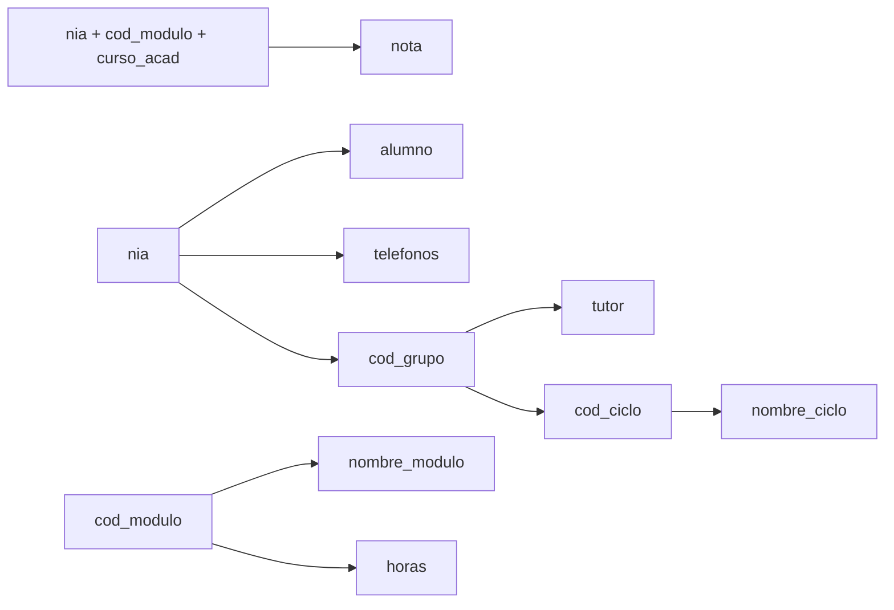
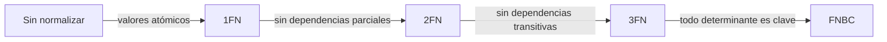

# UD04 · Normalización

## Resumen del tema

Un esquema relacional puede ser **correcto** (guarda toda la información) y aun así estar **mal diseñado**: repetir datos, permitir contradicciones y obligar a inventar valores para poder insertar una fila. La **normalización** es una técnica formal, basada en las **dependencias funcionales**, que detecta estos problemas y los corrige descomponiendo las tablas sin perder información.

En esta unidad aprenderás a reconocer las anomalías de un mal diseño, a identificar dependencias funcionales y claves candidatas, y a llevar un esquema hasta la **tercera forma normal (3FN)** y la **forma normal de Boyce-Codd (FNBC)**. También verás cuándo tiene sentido **desnormalizar** y cómo documentar las reglas que la normalización no resuelve.


### Temporalización

La unidad ocupa **14 horas de aula** (6 de teoría y 8 de práctica). Es una unidad muy práctica: se aprende a normalizar normalizando.


items:
  - {h: 2, tipo: T, t: "Anomalías y dependencias funcionales", ref: "§1 y §2"}
  - {h: 1, tipo: P, t: "Dependencias, cierres y claves", ref: "Práctica 4.2"}
  - {h: 2, tipo: T, t: "Las formas normales: 1FN, 2FN, 3FN y FNBC", ref: "§3"}
  - {h: 2, tipo: P, t: "Normalizar las facturas de un taller", ref: "Práctica 4.1"}
  - {h: 1, tipo: T, t: "Descomposición sin pérdida y desnormalización controlada", ref: "§4 y §5"}
  - {h: 1, tipo: T, t: "Restricciones no representables y procedimiento completo", ref: "§6 y §7"}
  - {h: 2, tipo: P, t: "Reservas de un hotel rural", ref: "Práctica 4.4"}
  - {h: 1, tipo: P, t: "¿En qué forma normal está?", ref: "Práctica 4.3"}
  - {h: 1, tipo: P, t: "FNBC y dependencias perdidas", ref: "Práctica 4.5"}
  - {h: 1, tipo: P, t: "Informe de normalización de EduGest", ref: "Proyecto EduGest-4"}
autonomo:
  - "Práctica 4.6 (¿normalizar o desnormalizar?)"
  - "Ejercicios resueltos y autoevaluación"


### Objetivos de aprendizaje

Al terminar esta unidad serás capaz de:

- Detectar anomalías de inserción, modificación y borrado en una tabla.
- Identificar dependencias funcionales completas, parciales y transitivas.
- Calcular el cierre de un conjunto de atributos y deducir las claves candidatas.
- Determinar en qué forma normal está una relación y normalizarla hasta 3FN y FNBC.
- Comprobar que una descomposición no pierde información.
- Justificar una desnormalización y documentar las restricciones que no se pueden expresar en el diseño.

> [!NOTE]
> El diseño E/R bien hecho (UD02) y su transformación correcta (UD03) suelen producir tablas ya normalizadas. La normalización sirve para **verificar** ese resultado y para **arreglar** diseños heredados: hojas de cálculo, ficheros CSV o bases de datos antiguas.

---

Anomalías y dependencias funcionales

## 1. Por qué normalizar: las anomalías

Secretaría nos entrega la hoja de cálculo con la que gestionaba las matrículas antes de EduGest. Cada fila es la matrícula de un alumno en un módulo:

**MATRICULA_HOJA**

| nia | alumno | telefonos | cod_grupo | tutor | cod_ciclo | nombre_ciclo | cod_modulo | nombre_modulo | horas | curso_acad | nota |
|---|---|---|---|---|---|---|---|---|---|---|---|
| 10450037 | Adrián Ferri | 611111111, 622222222 | 1DAM | Lucía Ferrándiz | DAM | Desarrollo de Aplicaciones Multiplataforma | 0484 | Bases de datos | 160 | 2025-26 | 7,5 |
| 10450037 | Adrián Ferri | 611111111, 622222222 | 1DAM | Lucía Ferrándiz | DAM | Desarrollo de Aplicaciones Multiplataforma | 0485 | Programación | 256 | 2025-26 | 6 |
| 10450074 | Rubén Iborra | 633333333 | 1DAM | Lucía Ferrándiz | DAM | Desarrollo de Aplicaciones Multiplataforma | 0484 | Bases de datos | 160 | 2025-26 | 4,25 |
| 10450518 | Carla Valero | 644444444 | 1DAW | Raúl Cano | DAW | Desarrollo de Aplicaciones Web | 0484 | Bases de datos | 160 | 2025-26 | 8 |

Esta tabla tiene tres tipos de problemas, llamados **anomalías**:

| Anomalía | Ejemplo en la hoja | Consecuencia |
|---|---|---|
| **De modificación** | El tutor de 1DAM cambia. Hay que modificar **todas** las filas del alumnado de 1DAM | Si se olvida una fila, el grupo tendrá dos tutores: **inconsistencia** |
| **De inserción** | Se crea el ciclo SMR, que todavía no tiene alumnos | No se puede registrar sin inventar un alumno y una matrícula |
| **De borrado** | Carla Valero anula su única matrícula | Se pierde que el tutor de 1DAW es Raúl Cano |

Todas tienen la misma causa: la tabla mezcla hechos sobre **varias cosas distintas** (alumnos, grupos, ciclos, módulos y matrículas). La normalización separa cada hecho en su propia tabla.

> [!IMPORTANT]
> La redundancia **no** es solo un problema de espacio en disco. El problema grave es la **inconsistencia**: cuando un mismo dato está en varios sitios, tarde o temprano las copias dejan de coincidir.

---

## 2. Dependencias funcionales

### 2.1 Definición

Dados dos conjuntos de atributos $X$ e $Y$ de una relación, se dice que **$Y$ depende funcionalmente de $X$**, y se escribe $X \rightarrow Y$, si cada valor de $X$ va asociado **siempre al mismo** valor de $Y$.

Se lee «$X$ determina a $Y$». $X$ es el **determinante** e $Y$ el **implicado**.

En la hoja de matrículas:

- `nia → alumno`: un NIA corresponde siempre al mismo alumno.
- `cod_grupo → tutor`: cada grupo tiene un único tutor.
- `cod_modulo → nombre_modulo, horas` *(en esta hoja, donde cada código pertenece a un único ciclo)*.
- `nia, cod_modulo, curso_acad → nota`: la nota depende de las tres cosas a la vez.
- `alumno → nia` **no** se cumple: dos alumnos pueden llamarse igual.

> [!WARNING]
> Las dependencias funcionales se deducen de las **reglas del negocio**, no de los datos de ejemplo. Que en la hoja no haya dos alumnos con el mismo nombre no significa que `alumno → nia`. Pregunta siempre: «¿puede ocurrir que...?».

### 2.2 Tipos de dependencias

| Tipo | Definición | Ejemplo |
|---|---|---|
| **Trivial** | $Y$ está contenido en $X$ | `nia, alumno → alumno` |
| **Completa** | $Y$ depende de $X$ pero de ningún subconjunto propio de $X$ | `nia, cod_modulo, curso_acad → nota` |
| **Parcial** | $Y$ depende de una **parte** de una clave compuesta | `nia, cod_modulo, curso_acad → alumno`, porque basta `nia → alumno` |
| **Transitiva** | $X \rightarrow Y$, $Y \rightarrow Z$ y $Y$ no determina a $X$; entonces $Z$ depende transitivamente de $X$ | `nia → cod_grupo` y `cod_grupo → tutor`, así que `nia → tutor` es transitiva |

### 2.3 Diagrama de dependencias

Es útil dibujar las dependencias con flechas que salen de cada determinante:

### 2.4 Cierre de un conjunto de atributos y claves candidatas

El **cierre** de $X$, que se escribe $X^+$, es el conjunto de **todos** los atributos que $X$ determina, directa o indirectamente. Se calcula así:

{}

1. Empieza con $X^+ = X$.
2. Recorre las dependencias. Si el determinante de una dependencia está **dentro** de $X^+$, añade su implicado a $X^+$.
3. Repite el paso 2 hasta que no se añada nada nuevo.

{}

**Ejemplo.** Calculemos $\{nia\}^+$:

| Iteración | Dependencia usada | $\{nia\}^+$ |
|---|---|---|
| 0 | — | nia |
| 1 | nia → alumno, telefonos, cod_grupo | nia, alumno, telefonos, cod_grupo |
| 2 | cod_grupo → tutor, cod_ciclo | … , tutor, cod_ciclo |
| 3 | cod_ciclo → nombre_ciclo | … , nombre_ciclo |

`nia` no determina `cod_modulo`, `nombre_modulo`, `horas`, `curso_acad` ni `nota`, así que **no es clave**. En cambio:

$$\{nia,\ cod\_modulo,\ curso\_acad\}^+ = \text{todos los atributos}$$

y ningún subconjunto suyo lo consigue. Por tanto, **(nia, cod_modulo, curso_acad) es una clave candidata**.

> [!TIP]
> **Atajo para encontrar claves.** Un atributo que **nunca** aparece a la derecha de una dependencia forma parte obligatoriamente de **todas** las claves. Aquí son `nia`, `cod_modulo` y `curso_acad`. Empieza siempre por ellos.

{}
Las dependencias funcionales cumplen tres reglas, a partir de las cuales se deducen todas las demás:

1. **Reflexividad:** si $Y \subseteq X$, entonces $X \rightarrow Y$.
2. **Aumento:** si $X \rightarrow Y$, entonces $XZ \rightarrow YZ$.
3. **Transitividad:** si $X \rightarrow Y$ e $Y \rightarrow Z$, entonces $X \rightarrow Z$.

De ellas se derivan la **unión** (si $X \rightarrow Y$ y $X \rightarrow Z$, entonces $X \rightarrow YZ$) y la **descomposición** (si $X \rightarrow YZ$, entonces $X \rightarrow Y$ y $X \rightarrow Z$).
{}

---

Formas normales

## 3. Las formas normales

Las **formas normales** son niveles de calidad de un esquema. Cada una incluye a la anterior: una relación en 3FN también está en 2FN y en 1FN.

### 3.1 Primera forma normal (1FN)

> Una relación está en **1FN** si todos sus atributos contienen **valores atómicos** (indivisibles) y no hay grupos repetitivos.

La columna `telefonos` contiene una **lista** («611111111, 622222222»). Con ella no se puede buscar un teléfono de forma fiable ni limitar su formato. Además, si la hoja tuviera columnas `modulo1`, `modulo2`, `modulo3`..., sería un **grupo repetitivo**.

**Solución:** sacar el atributo multivaluado a una tabla propia con la clave de la tabla original.

- TELEFONO_ALUMNO(<u>nia, telefono</u>)
- MATRICULA_HOJA_1FN(<u>nia, cod_modulo, curso_acad</u>, alumno, cod_grupo, tutor, cod_ciclo, nombre_ciclo, nombre_modulo, horas, nota)

> [!NOTE]
> Atómico depende del uso. Una fecha `2025-09-15` es atómica aunque tenga día, mes y año, porque el SGBD la trata como un único valor. Un nombre completo «Adrián Ferri Baeza» puede considerarse atómico o no según si se necesita ordenar por apellidos.

### 3.2 Segunda forma normal (2FN)

> Una relación está en **2FN** si está en 1FN y todo atributo **no primo** depende de forma **completa** de cada clave candidata (no hay dependencias parciales).

Un **atributo primo** es el que forma parte de alguna clave candidata. Aquí la clave es (nia, cod_modulo, curso_acad), y hay dependencias parciales:

- `nia → alumno, cod_grupo, tutor, cod_ciclo, nombre_ciclo` (solo una parte de la clave).
- `cod_modulo → nombre_modulo, horas` (otra parte de la clave).

**Solución:** crear una tabla por cada determinante parcial con los atributos que dependen de él.

- ALUMNO_2(<u>nia</u>, alumno, cod_grupo, tutor, cod_ciclo, nombre_ciclo)
- MODULO_2(<u>cod_modulo</u>, nombre_modulo, horas)
- MATRICULA_2(<u>*nia*, *cod_modulo*, curso_acad</u>, nota)
- TELEFONO_ALUMNO(<u>*nia*, telefono</u>)

> [!TIP]
> Una relación en 1FN cuya clave tiene **un solo atributo** está automáticamente en 2FN: no puede haber dependencias de una «parte» de la clave.

### 3.3 Tercera forma normal (3FN)

> Una relación está en **3FN** si está en 2FN y ningún atributo no primo depende **transitivamente** de una clave candidata. Dicho de otro modo: los atributos no primos solo dependen de la clave, no de otros atributos no primos.

En ALUMNO_2 quedan dependencias transitivas:

- `nia → cod_grupo → tutor, cod_ciclo`
- `cod_grupo → cod_ciclo → nombre_ciclo`

**Solución:** sacar cada dependencia transitiva a su propia tabla.

- ALUMNO(<u>nia</u>, alumno, *cod_grupo*)
- GRUPO(<u>cod_grupo</u>, tutor, *cod_ciclo*)
- CICLO(<u>cod_ciclo</u>, nombre_ciclo)
- MODULO(<u>cod_modulo</u>, nombre_modulo, horas)
- MATRICULA(<u>*nia*, *cod_modulo*, curso_acad</u>, nota)
- TELEFONO_ALUMNO(<u>*nia*, telefono</u>)

Ahora cambiar el tutor de 1DAM es modificar **una** fila, se puede dar de alta SMR sin alumnos y anular una matrícula no borra nada más. Las tres anomalías han desaparecido.

> [!IMPORTANT]
> **Regla mnemotécnica (William Kent):** en 3FN cada atributo no clave depende de «**la clave, toda la clave y nada más que la clave**». *La clave* → 1FN; *toda la clave* → 2FN; *nada más que la clave* → 3FN.

### 3.4 Forma normal de Boyce-Codd (FNBC)

> Una relación está en **FNBC** si, para toda dependencia no trivial $X \rightarrow Y$, $X$ es una **superclave** (contiene una clave candidata).

La 3FN admite una excepción: una dependencia cuyo implicado es un atributo **primo**. La FNBC la elimina. Solo aparece cuando hay **varias claves candidatas compuestas que se solapan**.

**Ejemplo.** En un centro, cada profesor imparte **un solo** módulo, y cada alumno tiene **un único** profesor para cada módulo:

**TUTORIA_MODULO**(alumno, modulo, profesor)

| alumno | modulo | profesor |
|---|---|---|
| Adrián | 0484 | Marta |
| Rubén | 0484 | Marta |
| Carla | 0484 | Javier |
| Carla | 0485 | Raúl |

Dependencias: `alumno, modulo → profesor` y `profesor → modulo`.
Claves candidatas: (alumno, modulo) y (alumno, profesor).

- Está en **3FN**: todos los atributos son primos.
- **No** está en FNBC: `profesor → modulo` y `profesor` no es superclave. Si Marta pasa a impartir otro módulo, hay que cambiar varias filas.

**Descomposición en FNBC:**

- PROFESOR_MODULO(<u>profesor</u>, modulo)
- ALUMNO_PROFESOR(<u>alumno, profesor</u>)

> [!WARNING]
> Esta descomposición **pierde una dependencia**: la regla `alumno, modulo → profesor` («un alumno no tiene dos profesores del mismo módulo») ya no está dentro de una sola tabla y no se puede garantizar con una clave. Por eso, en la práctica, a veces se prefiere quedarse en 3FN y **documentar** la restricción (RA6.h).

### 3.5 Formas normales superiores

Existen la **cuarta forma normal** (4FN), que trata las *dependencias multivaluadas* (por ejemplo, guardar en una misma tabla los idiomas y las aficiones independientes de una persona), y la **quinta forma normal** (5FN), que trata las *dependencias de combinación*. En el diseño profesional habitual el objetivo es **3FN o FNBC**; las superiores se aplican en casos concretos.

---

Descomposición y desnormalización

## 4. Descomposición sin pérdida

Normalizar es **descomponer** una tabla en varias. Una descomposición correcta cumple dos propiedades:

1. **Sin pérdida de información (*lossless join*):** al volver a combinar las tablas con `JOIN` se obtienen **exactamente** las filas originales, ni más ni menos.
2. **Preservación de dependencias:** cada dependencia funcional se puede comprobar dentro de una sola tabla.

**Cómo comprobar la primera propiedad** al dividir R en R1 y R2: los atributos comunes a R1 y R2 deben ser **clave** de R1 o de R2.

| Descomposición de ALUMNO_2 | Atributo común | ¿Es clave de alguna? | ¿Sin pérdida? |
|---|---|---|---|
| ALUMNO(nia, alumno, cod_grupo) + GRUPO(cod_grupo, tutor, cod_ciclo...) | cod_grupo | Sí, de GRUPO | ✅ |
| A(nia, alumno, tutor) + B(alumno, cod_grupo) | alumno | No | ❌ Si dos alumnos se llaman igual, el `JOIN` mezcla sus grupos y genera filas falsas |

Cuando lleguemos a la UD07 podrás comprobarlo en Oracle: la consulta que reconstruye la hoja original es un `JOIN` de todas las tablas normalizadas.

---

## 5. Desnormalización controlada

**Desnormalizar** es introducir redundancia **a propósito** para mejorar el rendimiento de las consultas. Es una decisión de **diseño físico** que debe justificarse, medirse y controlarse.

| Situación | Ejemplo | Cómo se controla la redundancia |
|---|---|---|
| Sistemas analíticos (OLAP) | Tabla de hechos de matrículas con el nombre del ciclo repetido | Se carga por procesos ETL, no la modifica nadie |
| Valores agregados muy consultados | Guardar `num_alumnos` en GRUPO | Trigger que lo actualiza (UD09) |
| Valores históricos que **deben** congelarse | Guardar el `precio` en cada línea de factura | No es redundancia: el precio del producto cambia, el de la factura no |
| Bases de datos documentales | Incrustar los datos del ciclo en el documento del alumno (UD10) | El modelo se diseña según las consultas |

> [!CAUTION]
> Desnormalizar «porque los JOIN son lentos» sin haberlo medido es un error frecuente. Con índices adecuados (UD05 y UD07), un esquema normalizado responde rápido en la mayoría de los sistemas transaccionales.

---

Restricciones y procedimiento

## 6. Normalización y restricciones no representables

La normalización elimina las redundancias, pero **no** resuelve todas las reglas de negocio. Al terminar, revisa el catálogo de restricciones textuales de la [UD03](/ud03-modelo-relacional/ud03-teoria#6-restricciones-que-el-modelo-lógico-no-puede-expresar) y añade las que hayan aparecido:

- Las dependencias que se pierden al pasar a FNBC (apartado 3.4).
- Las reglas entre tablas que antes estaban en la misma fila. Por ejemplo, en la hoja original se veía que el alumno estaba en un grupo de DAM y se matriculaba de módulos de DAM; tras normalizar, esa coherencia entre `ALUMNO.cod_grupo` y el ciclo de `MODULO` ya no la garantiza ninguna clave.

---

## 7. Procedimiento completo de normalización

{}

1. **Lista los atributos** de la tabla original y elimina los derivados (como la edad).
2. **Escribe las dependencias funcionales** a partir de las reglas del negocio. Pregunta al cliente si tienes dudas.
3. **Busca las claves candidatas** con el cierre de atributos.
4. **1FN:** separa los atributos multivaluados y los grupos repetitivos.
5. **2FN:** separa las dependencias parciales de cada clave candidata.
6. **3FN:** separa las dependencias transitivas.
7. **FNBC:** comprueba que todo determinante es superclave. Si no, decide si descompones o documentas.
8. **Verifica** la descomposición: sin pérdida, dependencias preservadas y anomalías resueltas.
9. **Nombra** las tablas resultantes y define sus claves ajenas.

{}

---

## 8. Errores frecuentes

| Error | Corrección |
|---|---|
| Deducir dependencias de los datos de ejemplo | Deducirlas de las reglas del negocio |
| Olvidar que una clave candidata puede no ser la clave primaria | Las dependencias parciales y transitivas se comprueban respecto a **todas** las claves candidatas |
| Crear una tabla por cada atributo («sobrenormalizar») | Agrupar en la misma tabla todo lo que depende del mismo determinante |
| Descomponer usando un atributo común que no es clave | Comprobar la condición de descomposición sin pérdida |
| Pensar que 3FN significa «sin redundancia de ningún tipo» | Las claves ajenas se repiten por definición: eso no es redundancia indeseada |

---

## 9. Resumen

- Las **anomalías** de inserción, modificación y borrado aparecen cuando una tabla guarda hechos de varias cosas distintas.
- Una **dependencia funcional** $X \rightarrow Y$ indica que cada valor de $X$ determina un único valor de $Y$. Se deduce de las reglas del negocio.
- El **cierre de atributos** permite comprobar si un conjunto de atributos es clave.
- **1FN:** valores atómicos. **2FN:** sin dependencias parciales. **3FN:** sin dependencias transitivas. **FNBC:** todo determinante es superclave.
- La descomposición debe ser **sin pérdida** y, si es posible, **preservar las dependencias**.
- La **desnormalización** es una decisión física, justificada y controlada.

---

## 10. Ejercicios resueltos

### Ejercicio 1. Forma normal de una relación

PEDIDO(<u>num_pedido</u>, fecha, id_cliente, nombre_cliente, ciudad_cliente) con `num_pedido → fecha, id_cliente` e `id_cliente → nombre_cliente, ciudad_cliente`. ¿En qué forma normal está?

{}
La clave es `num_pedido` (simple), así que está en **2FN**. No está en 3FN porque `nombre_cliente` y `ciudad_cliente` dependen transitivamente de `num_pedido` a través de `id_cliente`.

Descomposición en 3FN: PEDIDO(<u>num_pedido</u>, fecha, *id_cliente*) y CLIENTE(<u>id_cliente</u>, nombre_cliente, ciudad_cliente).
{}

### Ejercicio 2. Claves candidatas

R(A, B, C, D, E) con F = { A → B, BC → D, D → E, E → A }. Calcula las claves candidatas.

{}
`C` no aparece a la derecha de ninguna dependencia, así que está en todas las claves. $\{C\}^+ = \{C\}$: no basta.

- $\{A, C\}^+$: A → B; con B y C, BC → D; D → E. Resultado: {A, B, C, D, E}. **Clave.**
- $\{B, C\}^+$: BC → D; D → E; E → A. Resultado: todos. **Clave.**
- $\{C, D\}^+$: D → E; E → A; A → B. Resultado: todos. **Clave.**
- $\{C, E\}^+$: E → A; A → B; BC → D. Resultado: todos. **Clave.**

Claves candidatas: **AC, BC, CD y CE**. Todos los atributos son primos, así que la relación está en 3FN; no está en FNBC porque, por ejemplo, el determinante de A → B no es superclave.
{}

---

## 11. Autoevaluación


- q: "Al cambiar el teléfono de un cliente hay que modificar 40 filas de una tabla de pedidos. ¿Qué anomalía es?"
  options: ["De inserción", "De modificación", "De borrado", "De integridad referencial"]
  answer: 1
  explain: "El mismo dato está repetido en muchas filas y modificarlo exige cambiarlas todas: es una anomalía de **modificación**."
- q: "¿Qué significa la dependencia funcional `dni → nombre`?"
  options: ["Cada nombre corresponde a un único DNI", "Cada DNI va asociado siempre al mismo nombre", "El DNI se calcula a partir del nombre", "DNI y nombre son claves candidatas"]
  answer: 1
  explain: "El determinante es `dni`: conociendo el DNI se conoce un único nombre. Lo contrario no tiene por qué cumplirse."
- q: "Una relación tiene como clave (id_alumno, id_modulo) y el atributo `nombre_alumno`. ¿Qué forma normal incumple seguro?"
  options: ["1FN", "2FN", "FNBC solo", "Ninguna"]
  answer: 1
  explain: "`nombre_alumno` depende solo de `id_alumno`, una **parte** de la clave: es una dependencia parcial, que incumple la 2FN."
- q: "En EMPLEADO(id_emp, id_dep, nombre_dep), con `id_dep → nombre_dep`, ¿qué problema hay?"
  options: ["Un grupo repetitivo", "Una dependencia parcial", "Una dependencia transitiva", "Ninguno, está en FNBC"]
  answer: 2
  explain: "`id_emp → id_dep → nombre_dep`: `nombre_dep` depende de la clave a través de otro atributo no clave. Incumple la 3FN."
- q: "Una relación cuya clave primaria tiene un único atributo y que está en 1FN..."
  options: ["Está siempre en 3FN", "Está siempre en 2FN", "Nunca puede estar en FNBC", "No puede tener dependencias transitivas"]
  answer: 1
  explain: "Sin clave compuesta no puede haber dependencias parciales respecto a esa clave. Ojo: si existen **otras** claves candidatas compuestas hay que comprobarlas también."
- q: "Se divide R(nia, nombre, grupo, tutor) en R1(nia, nombre, grupo) y R2(grupo, tutor). ¿La descomposición es sin pérdida?"
  options: ["Sí, porque grupo es clave de R2", "No, porque grupo se repite", "No, porque se pierde el tutor", "Solo si grupo es clave de R1"]
  answer: 0
  explain: "El atributo común (`grupo`) es clave de una de las dos tablas, R2. Al combinarlas con un JOIN se recuperan exactamente las filas originales."
- q: "¿Cuándo puede una relación estar en 3FN pero no en FNBC?"
  options: ["Cuando tiene atributos multivaluados", "Cuando un atributo no clave determina a una parte de una clave candidata", "Cuando no tiene clave primaria", "Nunca: son equivalentes"]
  answer: 1
  explain: "Ocurre cuando hay una dependencia cuyo determinante no es superclave y cuyo implicado es un atributo **primo**. Requiere claves candidatas compuestas que se solapan."
- q: "En una línea de factura se guarda el precio del producto en el momento de la venta. ¿Es una redundancia que deba eliminarse?"
  options: ["Sí, el precio ya está en PRODUCTO", "No, es un valor histórico distinto del precio actual", "Sí, incumple la 1FN", "Depende del SGBD"]
  answer: 1
  explain: "El precio de PRODUCTO cambia con el tiempo; el de la factura no debe cambiar. Son **hechos distintos**, así que no hay redundancia."


## Referencias

- Codd, E. F. (1972). «Further Normalization of the Data Base Relational Model». *Data Base Systems*, Prentice-Hall.
- Kent, W. (1983). «A Simple Guide to Five Normal Forms in Relational Database Theory». *Communications of the ACM*, 26(2).
- Elmasri, R. y Navathe, S. B. *Fundamentos de sistemas de bases de datos*. Pearson. Capítulos de dependencias funcionales y normalización.
- [Curso de Bases de Datos de F. M. García: módulos 19 y 20](https://fmgarcia.github.io/CursosGithubIO/CursoBasesDatos/).
