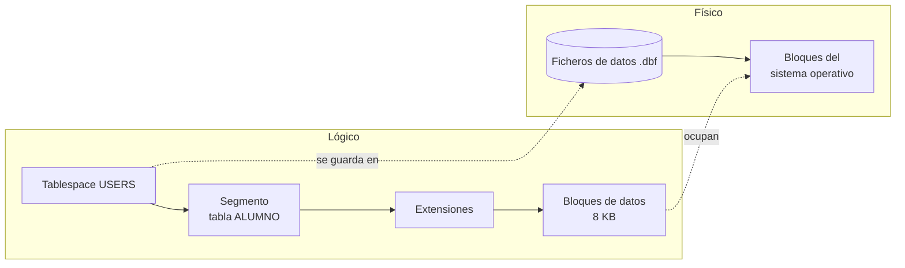
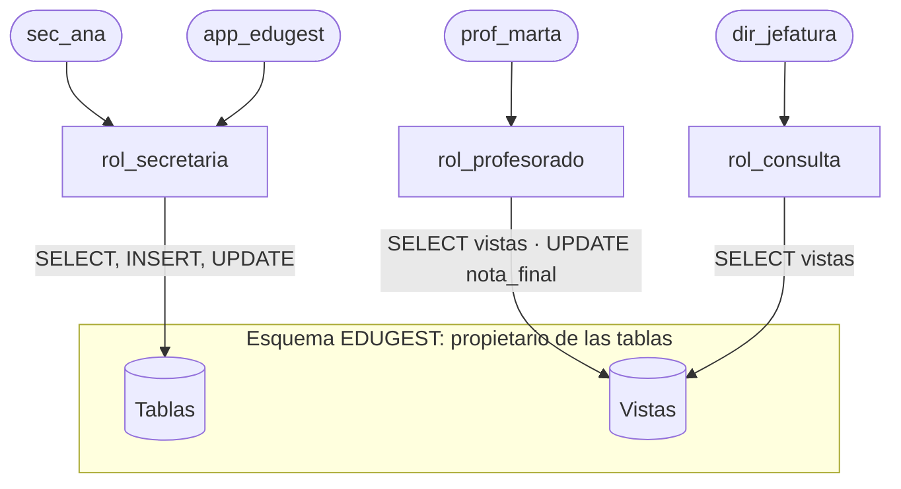

# UD05 · Definición y control de datos (DDL y DCL)

## Resumen del tema

Hasta ahora hemos **diseñado**. En esta unidad **implementamos**: convertimos el esquema relacional en tablas reales dentro de un SGBD. Para ello usamos dos sublenguajes de SQL:

- **DDL** (*Data Definition Language*): crea, modifica y elimina la estructura (tablas, restricciones, índices, vistas, secuencias).
- **DCL** (*Data Control Language*): controla quién puede hacer qué (usuarios, roles y privilegios).

Todos los ejemplos usan **Oracle AI Database 26ai Free**. Cuando una característica sea propia de Oracle o de una versión concreta, se indica.



### Objetivos de aprendizaje

Al terminar esta unidad serás capaz de:

- Explicar cómo almacena Oracle la información (bloques, segmentos, *tablespaces*).
- Elegir el tipo de datos adecuado para cada columna.
- Crear tablas con todas las restricciones del diseño lógico: claves primarias, ajenas y alternativas, `NOT NULL` y `CHECK`.
- Modificar y eliminar objetos de forma segura.
- Crear secuencias, columnas identidad, índices y vistas.
- Crear usuarios y roles, y asignar privilegios aplicando el principio de mínimo privilegio.
- Consultar el diccionario de datos para comprobar lo que has creado.
- Usar asistentes y herramientas gráficas sin depender de ellos.

---

## 1. SQL y Oracle

### 1.1 Sublenguajes de SQL

| Sublenguaje | Sentencias | Para qué | Unidad |
|---|---|---|---|
| **DDL** | `CREATE`, `ALTER`, `DROP`, `TRUNCATE`, `RENAME`, `COMMENT` | Definir la estructura | UD05 |
| **DCL** | `GRANT`, `REVOKE` | Controlar el acceso | UD05 |
| **DML** | `SELECT`, `INSERT`, `UPDATE`, `DELETE`, `MERGE` | Consultar y modificar datos | UD06 a UD08 |
| **TCL** | `COMMIT`, `ROLLBACK`, `SAVEPOINT` | Controlar transacciones | UD08 |

> [!WARNING]
> En Oracle, **cada sentencia DDL ejecuta un `COMMIT` implícito** antes y después de ejecutarse. Si tenías cambios de datos pendientes y lanzas un `CREATE TABLE`, esos cambios quedan confirmados y ya no podrás deshacerlos con `ROLLBACK`.

### 1.2 SQL estándar frente a dialectos

SQL es un estándar ISO/IEC 9075, pero cada SGBD implementa una parte y añade **extensiones**. Por eso un script de MySQL no suele funcionar en Oracle sin cambios:


{}
```sql
CREATE TABLE producto (
    id_producto  NUMBER(6) GENERATED ALWAYS AS IDENTITY PRIMARY KEY,
    nombre       VARCHAR2(100) NOT NULL,
    precio       NUMBER(8,2) CHECK (precio >= 0),
    activo       BOOLEAN DEFAULT TRUE      -- BOOLEAN desde 23ai
);
```
{}
{}
```sql
CREATE TABLE producto (
    id_producto  INT AUTO_INCREMENT PRIMARY KEY,
    nombre       VARCHAR(100) NOT NULL,
    precio       DECIMAL(8,2) CHECK (precio >= 0),
    activo       BOOLEAN DEFAULT TRUE
) ENGINE = InnoDB;
```
{}
{}
```sql
CREATE TABLE producto (
    id_producto  INTEGER GENERATED ALWAYS AS IDENTITY PRIMARY KEY,
    nombre       VARCHAR(100) NOT NULL,
    precio       NUMERIC(8,2) CHECK (precio >= 0),
    activo       BOOLEAN DEFAULT TRUE
);
```
{}


### 1.3 Reglas de escritura en Oracle

- Las palabras reservadas y los identificadores **no distinguen mayúsculas**: `CREATE TABLE Alumno` crea la tabla `ALUMNO`. Oracle guarda los nombres en mayúsculas en el diccionario.
- Si escribes un identificador entre **comillas dobles** (`"Alumno"`), Oracle respeta mayúsculas y espacios, y tendrás que usar siempre las comillas. **Evítalo.**
- Los identificadores pueden tener hasta **128 bytes** (desde Oracle 12.2), empiezan por letra y pueden contener letras, números, `_`, `$` y `#`.
- Cada sentencia termina en `;`. Los bloques PL/SQL (UD09) terminan además con `/` en una línea.
- Comentarios: `-- hasta el final de la línea` y `/* de varias líneas */`.
- Las cadenas van entre **comillas simples**: `'DAM'`. Para incluir una comilla, se duplica: `'Sant Joan d''Alacant'`.

### 1.4 Usuario y esquema

En Oracle, un **esquema** es el conjunto de objetos (tablas, vistas, índices...) que pertenecen a un usuario, y tiene su mismo nombre. Al conectarte como `EDUGEST` y crear la tabla `ALUMNO`, su nombre completo es `EDUGEST.ALUMNO`. Otro usuario con permiso la consultaría así:

```sql
SELECT * FROM edugest.alumno;
```

---

## 2. Formato de almacenamiento de la información

El criterio RA2.a pide analizar **cómo** se guarda la información. Oracle organiza el almacenamiento en dos niveles:



| Estructura | Qué es |
|---|---|
| **Bloque de datos** | La unidad mínima de lectura y escritura (normalmente 8 KB). Contiene varias filas |
| **Extensión** (*extent*) | Conjunto de bloques contiguos que se asigna de una vez |
| **Segmento** | Todo el espacio de un objeto: una tabla, un índice... |
| **Tablespace** | Contenedor lógico de segmentos. `USERS` es el de los datos de usuario; `SYSTEM` y `SYSAUX`, los del diccionario |
| **Fichero de datos** | Fichero físico del sistema operativo donde se guarda un tablespace |

Cada fila tiene una dirección física única, el **ROWID**, que indica el fichero, el bloque y la posición dentro del bloque. Es la forma más rápida de localizar una fila y la que usan internamente los índices.

```sql
SELECT ROWID, nombre FROM alumno FETCH FIRST 3 ROWS ONLY;
```

> [!NOTE]
> Una tabla normal de Oracle es una tabla **montón** (*heap*): las filas se guardan donde hay espacio libre, **sin ningún orden**. Por eso una consulta sin `ORDER BY` puede devolver las filas en cualquier orden, y ese orden puede cambiar.

---

## 3. Tipos de datos

Elegir bien el tipo de cada columna (RA2.c) evita errores, ahorra espacio y permite que el SGBD valide los datos.

### 3.1 Tipos principales de Oracle

| Categoría | Tipo | Descripción | Ejemplo de uso |
|---|---|---|---|
| Texto | `VARCHAR2(n)` | Texto de longitud **variable**, hasta n bytes (máx. 4000; 32767 con `MAX_STRING_SIZE=EXTENDED`) | nombre, email |
| | `CHAR(n)` | Texto de longitud **fija**: se rellena con espacios | dni, códigos de longitud fija |
| | `NVARCHAR2(n)` | Texto Unicode en el juego de caracteres nacional | Raramente necesario con AL32UTF8 |
| | `CLOB` | Texto muy largo (gigabytes) | observaciones, documentos |
| Numérico | `NUMBER(p, s)` | Número exacto con `p` dígitos en total y `s` decimales | importes, notas, cantidades |
| | `NUMBER` | Sin precisión: cualquier número | evitarlo en columnas de negocio |
| | `INTEGER` | Sinónimo de `NUMBER(38)` | contadores |
| | `BINARY_DOUBLE` | Coma flotante IEEE 754 | cálculos científicos |
| Fecha y hora | `DATE` | Fecha **y hora** (hasta segundos) | fecha de nacimiento, de matrícula |
| | `TIMESTAMP(n)` | Fecha y hora con fracciones de segundo | registros de auditoría |
| | `TIMESTAMP WITH TIME ZONE` | Incluye la zona horaria | aplicaciones internacionales |
| | `INTERVAL DAY TO SECOND` | Duración | tiempo de una tarea |
| Lógico | `BOOLEAN` | `TRUE`, `FALSE` o `NULL` (**desde 23ai**) | activo, justificada |
| Binario | `BLOB`, `RAW(n)` | Datos binarios | fotografías, *hashes* |
| Otros | `JSON` | Documento JSON nativo (desde 21c) | datos semiestructurados |
| | `VECTOR` | Vectores para búsqueda por similitud (desde 23ai) | aplicaciones de IA |

### 3.2 Precisión y escala de NUMBER

`NUMBER(p, s)`: `p` es el número **total** de dígitos significativos y `s` cuántos de ellos van tras la coma.

| Declaración | Rango admitido | Valor insertado | Valor guardado |
|---|---|---|---|
| `NUMBER(4,2)` | -99,99 a 99,99 | 7.256 | 7,26 (redondea) |
| `NUMBER(4,2)` | | 123.5 | **Error** ORA-01438 |
| `NUMBER(5)` | -99999 a 99999 | 12.7 | 13 |
| `NUMBER(8,2)` | hasta 999 999,99 | 1520.5 | 1520,50 |

### 3.3 Criterios para elegir el tipo

1. **¿Se opera con él?** Si se suma o se compara numéricamente, es `NUMBER`. Si no (DNI, teléfono, código postal), es **texto**: `'03690'` perdería el cero inicial como número.
2. **¿Tiene longitud fija?** `CHAR` solo si **siempre** ocupa lo mismo (DNI: `CHAR(9)`). En el resto, `VARCHAR2`.
3. **¿Necesita decimales exactos?** El dinero se guarda siempre en `NUMBER(p, s)`, nunca en coma flotante.
4. **¿Es una fecha?** Usa `DATE` o `TIMESTAMP`, nunca texto: así puedes ordenar, comparar y calcular.
5. **Dimensiona con margen razonable**, sin exagerar: `VARCHAR2(4000)` para un nombre dificulta la validación y la lectura del diseño.

### 3.4 Equivalencias con otros SGBD

| Concepto | Oracle | MySQL / MariaDB | PostgreSQL | SQL Server |
|---|---|---|---|---|
| Texto variable | `VARCHAR2(n)` | `VARCHAR(n)` | `VARCHAR(n)` | `VARCHAR(n)` |
| Entero | `NUMBER(10)` | `INT` | `INTEGER` | `INT` |
| Decimal exacto | `NUMBER(p,s)` | `DECIMAL(p,s)` | `NUMERIC(p,s)` | `DECIMAL(p,s)` |
| Fecha sin hora | `DATE` (incluye hora) | `DATE` | `DATE` | `DATE` |
| Autoincremento | `IDENTITY` o secuencia | `AUTO_INCREMENT` | `IDENTITY` o `SERIAL` | `IDENTITY` |
| Lógico | `BOOLEAN` (23ai) | `BOOLEAN` (= `TINYINT(1)`) | `BOOLEAN` | `BIT` |

> [!CAUTION]
> **En Oracle la cadena vacía `''` es `NULL`.** `INSERT INTO alumno (..., email) VALUES (..., '')` guarda un `NULL`, y la condición `email = ''` nunca es verdadera. En MySQL y PostgreSQL la cadena vacía y `NULL` son cosas distintas. Es una de las diferencias que más errores provoca al migrar.

> [!WARNING]
> El tipo `DATE` de Oracle **siempre guarda la hora**. `SYSDATE` devuelve fecha y hora actuales. Si comparas `fecha_matricula = DATE '2025-09-15'` y la fila se insertó con `SYSDATE`, no coincidirá porque la hora no es 00:00:00. Lo trataremos en la UD06.

---

## 4. Creación de tablas: `CREATE TABLE`

### 4.1 Finalidad y sintaxis

`CREATE TABLE` crea una tabla vacía con sus columnas y restricciones.

```text
CREATE TABLE [esquema.]nombre_tabla (
    columna tipo [DEFAULT valor] [restricciones_de_columna],
    columna tipo ...,
    [restricciones_de_tabla]
);
```

### 4.2 Ejemplo sencillo, elemento a elemento



```sql
CREATE TABLE ciclo (
    cod_ciclo      VARCHAR2(5)    CONSTRAINT pk_ciclo PRIMARY KEY,
    nombre         VARCHAR2(100)  NOT NULL,
    grado          VARCHAR2(8)    DEFAULT 'SUPERIOR' NOT NULL,
    horas_totales  NUMBER(4)
);
```

| Elemento | Significado |
|---|---|
| `CREATE TABLE ciclo` | Crea una tabla llamada `CICLO` en el esquema del usuario conectado |
| `cod_ciclo VARCHAR2(5)` | Columna de texto variable de hasta 5 bytes |
| `CONSTRAINT pk_ciclo PRIMARY KEY` | Restricción **con nombre** `PK_CICLO`: `cod_ciclo` es la clave primaria (única y no nula) |
| `NOT NULL` | La columna es obligatoria |
| `DEFAULT 'SUPERIOR'` | Valor que se usa si en el `INSERT` no se indica esta columna |
| `NUMBER(4)` | Número entero de hasta 4 dígitos. Sin `NOT NULL`, admite nulos |

Comprueba el resultado con la orden `DESC` del cliente:

```text
SQL> DESC ciclo
 Name           Null?    Type
 -------------- -------- -------------
 COD_CICLO      NOT NULL VARCHAR2(5)
 NOMBRE         NOT NULL VARCHAR2(100)
 GRADO          NOT NULL VARCHAR2(8)
 HORAS_TOTALES           NUMBER(4)
```

### 4.3 Restricciones de columna y de tabla

Una restricción puede escribirse **junto a la columna** o **al final**, como un elemento más de la tabla. Las restricciones que afectan a **varias columnas** (una clave primaria compuesta, un `UNIQUE` de dos columnas o un `CHECK` que compara dos columnas) solo pueden escribirse **al final**.

```sql
CREATE TABLE imparte (
    id_modulo        NUMBER(5),
    cod_grupo        VARCHAR2(10),
    curso_academico  CHAR(7),
    id_profesor      NUMBER(5)  NOT NULL,
    horas_semanales  NUMBER(2)  NOT NULL,
    -- restricciones de tabla
    CONSTRAINT pk_imparte PRIMARY KEY (id_modulo, cod_grupo, curso_academico),
    CONSTRAINT ck_imparte_horas CHECK (horas_semanales BETWEEN 1 AND 12)
);
```

### 4.4 Valores por defecto y columnas especiales

| Cláusula | Efecto | Ejemplo |
|---|---|---|
| `DEFAULT expr` | Se usa si la columna **no aparece** en el `INSERT` | `fecha_alta DATE DEFAULT SYSDATE` |
| `DEFAULT ON NULL expr` | Se usa también si se inserta **explícitamente** `NULL` | `convocatoria NUMBER(1) DEFAULT ON NULL 1` |
| `GENERATED ALWAYS AS IDENTITY` | Oracle genera el valor; no se puede insertar uno propio | `id NUMBER GENERATED ALWAYS AS IDENTITY` |
| `GENERATED BY DEFAULT ON NULL AS IDENTITY` | Oracle genera el valor si no se indica o si es `NULL` | Usado en `ALUMNO` de EduGest |
| `GENERATED ALWAYS AS (expr) VIRTUAL` | Columna **virtual**: se calcula, no se almacena | `total NUMBER GENERATED ALWAYS AS (cantidad * precio) VIRTUAL` |

---

## 5. Restricciones de integridad

Las restricciones implantan en la base de datos las reglas del diseño lógico (RA2.d, RA2.e, RA6.f). El SGBD **rechaza** cualquier operación que las incumpla, venga de la aplicación que venga.

### 5.1 Resumen de restricciones

| Restricción | Garantiza | Prefijo del nombre | Error si se incumple |
|---|---|---|---|
| `NOT NULL` | La columna tiene valor | `nn_` | ORA-01400 *cannot insert NULL* |
| `PRIMARY KEY` | Identificación única y no nula de cada fila | `pk_` | ORA-00001 *unique constraint violated* |
| `UNIQUE` | No hay valores repetidos (admite varios `NULL`) | `uq_` | ORA-00001 |
| `FOREIGN KEY` | El valor existe en la tabla referenciada | `fk_` | ORA-02291 *parent key not found* / ORA-02292 *child record found* |
| `CHECK` | Se cumple una condición sobre la fila | `ck_` | ORA-02290 *check constraint violated* |

> [!TIP]
> **Pon siempre nombre a las restricciones.** Si no lo haces, Oracle inventa uno como `SYS_C008123`. Cuando un usuario reciba el error `ORA-02290: check constraint (EDUGEST.CK_MATRICULA_NOTA) violated`, sabrá exactamente qué regla ha incumplido.

### 5.2 Clave primaria y claves alternativas

```sql
CREATE TABLE profesor (
    id_profesor  NUMBER(5)     CONSTRAINT pk_profesor PRIMARY KEY,
    dni          CHAR(9)       CONSTRAINT nn_profesor_dni NOT NULL,
    email        VARCHAR2(100) NOT NULL,
    ...
    CONSTRAINT uq_profesor_dni   UNIQUE (dni),
    CONSTRAINT uq_profesor_email UNIQUE (email)
);
```

Una clave **candidata** no elegida como primaria se implanta como `UNIQUE` + `NOT NULL`. Oracle crea automáticamente un **índice** para cada `PRIMARY KEY` y cada `UNIQUE`.

### 5.3 Claves ajenas

```sql
CONSTRAINT fk_matricula_alumno FOREIGN KEY (id_alumno)
    REFERENCES alumno (id_alumno)
    ON DELETE CASCADE
```

| Componente | Significado |
|---|---|
| `FOREIGN KEY (id_alumno)` | Columna (o columnas) de **esta** tabla |
| `REFERENCES alumno (id_alumno)` | Tabla y columna referenciadas: deben ser su `PRIMARY KEY` o un `UNIQUE` |
| `ON DELETE CASCADE` | Al borrar el alumno, se borran sus matrículas |
| `ON DELETE SET NULL` | Al borrar la fila padre, la columna se pone a `NULL` |
| *(nada)* | Se **rechaza** el borrado del padre si tiene hijos |

> [!IMPORTANT]
> - La tabla referenciada debe **existir antes**. Crea primero las tablas «padre» o añade la clave ajena después con `ALTER TABLE` (es lo que hace EduGest con el jefe de departamento, porque `DEPARTAMENTO` y `PROFESOR` se referencian mutuamente).
> - Una clave ajena **admite `NULL`** salvo que añadas `NOT NULL`. Una fila con la clave ajena a `NULL` no se comprueba.
> - Oracle **no** crea índices sobre las claves ajenas. Créalos tú (apartado 8).

### 5.4 Restricciones CHECK

Un `CHECK` es una condición que debe ser **verdadera o desconocida** (`NULL`) para cada fila:

```sql
CONSTRAINT ck_matricula_nota  CHECK (nota_final BETWEEN 0 AND 10),
CONSTRAINT ck_grupo_turno     CHECK (turno IN ('M', 'T')),
CONSTRAINT ck_falta_horas     CHECK (horas BETWEEN 1 AND 6),
CONSTRAINT ck_matricula_curso CHECK (REGEXP_LIKE(curso_academico, '^[0-9]{4}-[0-9]{2}$')),
CONSTRAINT ck_reserva_fechas  CHECK (fecha_salida > fecha_entrada)
```

> [!WARNING]
> Si `nota_final` es `NULL`, la condición `nota_final BETWEEN 0 AND 10` es **desconocida** y el `CHECK` **la acepta**. Si la columna debe tener valor, añade `NOT NULL`.
>
> Un `CHECK` **no** puede usar subconsultas, ni consultar otras tablas, ni llamar a `SYSDATE`. Las reglas que lo necesitan son restricciones no representables (UD03, apartado 6) y se implementan con triggers (UD09).

### 5.5 Consultar las restricciones en el diccionario

```sql
SELECT constraint_name, constraint_type, search_condition, r_constraint_name, delete_rule
FROM   user_constraints
WHERE  table_name = 'MATRICULA'
ORDER  BY constraint_type;

SELECT constraint_name, column_name, position
FROM   user_cons_columns
WHERE  table_name = 'MATRICULA'
ORDER  BY constraint_name, position;
```

`constraint_type`: **P** = clave primaria, **U** = única, **R** = referencial (clave ajena), **C** = `CHECK` (también `NOT NULL`).

---

## 6. Modificar y eliminar la estructura

### 6.1 `ALTER TABLE`



```sql
-- Añadir columnas (en Oracle no se escribe la palabra COLUMN)
ALTER TABLE alumno ADD (fecha_alta DATE DEFAULT SYSDATE);

-- Cambiar el tipo, el tamaño o la obligatoriedad
ALTER TABLE alumno MODIFY (telefono VARCHAR2(20));
ALTER TABLE alumno MODIFY (localidad NOT NULL);   -- falla si hay filas con NULL

-- Renombrar y eliminar columnas
ALTER TABLE alumno RENAME COLUMN telefono TO telefono_movil;
ALTER TABLE alumno DROP COLUMN fecha_alta;

-- Añadir y eliminar restricciones
ALTER TABLE alumno ADD CONSTRAINT ck_alumno_email CHECK (email LIKE '%@%');
ALTER TABLE alumno DROP CONSTRAINT ck_alumno_email;

-- Desactivar temporalmente una restricción (por ejemplo, en una carga masiva)
ALTER TABLE matricula DISABLE CONSTRAINT fk_matricula_modulo;
ALTER TABLE matricula ENABLE CONSTRAINT fk_matricula_modulo;

-- Renombrar una tabla
RENAME alumno_tmp TO alumno_historico;
```

> [!TIP]
> Al **activar** una restricción, Oracle comprueba todas las filas existentes. Si alguna la incumple, el `ENABLE` falla. Con `ENABLE NOVALIDATE` solo se comprueban las filas nuevas, pero entonces la tabla puede contener datos incorrectos.

### 6.2 `DROP TABLE`, papelera y `TRUNCATE`

```sql
DROP TABLE matricula;                       -- va a la papelera de reciclaje
FLASHBACK TABLE matricula TO BEFORE DROP;   -- la recupera

DROP TABLE matricula PURGE;                 -- borrado definitivo
DROP TABLE alumno CASCADE CONSTRAINTS;      -- borra también las FK que apuntan a ALUMNO
DROP TABLE IF EXISTS alumno_tmp;            -- sin error si no existe (23ai y posteriores)

TRUNCATE TABLE falta_asistencia;            -- vacía la tabla; no se puede deshacer
```

| Sentencia | Borra | Estructura | ¿Se puede deshacer? |
|---|---|---|---|
| `DELETE FROM t` (DML, UD08) | Filas (todas o algunas) | Se mantiene | Sí, con `ROLLBACK` |
| `TRUNCATE TABLE t` | Todas las filas | Se mantiene | **No** (es DDL) |
| `DROP TABLE t` | Tabla y datos | Desaparece | Solo desde la papelera |
| `DROP TABLE t PURGE` | Tabla y datos | Desaparece | **No** |

> [!CAUTION]
> `TRUNCATE` y `DROP ... PURGE` no se pueden deshacer. En un servidor de producción, antes de ejecutarlos: comprueba **a qué base de datos** estás conectado, haz una **copia de seguridad** y, si es posible, que otra persona revise la orden.

### 6.3 Documentar el diseño con comentarios

```sql
COMMENT ON TABLE  matricula IS 'Matrícula de un alumno en un módulo para un curso académico';
COMMENT ON COLUMN matricula.nota_final IS 'NULL = sin calificar';

SELECT column_name, comments FROM user_col_comments WHERE table_name = 'MATRICULA';
```

---

## 7. Secuencias y columnas identidad

Para generar identificadores artificiales (claves subrogadas) hay dos mecanismos:


{}
```sql
CREATE TABLE incidencia (
    id_incidencia NUMBER(8) GENERATED ALWAYS AS IDENTITY (START WITH 1 INCREMENT BY 1)
                  CONSTRAINT pk_incidencia PRIMARY KEY,
    descripcion   VARCHAR2(200) NOT NULL
);

INSERT INTO incidencia (descripcion) VALUES ('Proyector del aula 12 averiado');
```
Oracle crea internamente una secuencia asociada a la columna. Es la opción más sencilla desde Oracle 12c.
{}
{}
```sql
CREATE SEQUENCE seq_incidencia START WITH 1 INCREMENT BY 1 NOCACHE;

CREATE TABLE incidencia (
    id_incidencia NUMBER(8) DEFAULT seq_incidencia.NEXTVAL
                  CONSTRAINT pk_incidencia PRIMARY KEY,
    descripcion   VARCHAR2(200) NOT NULL
);

SELECT seq_incidencia.NEXTVAL FROM dual;   -- siguiente valor
SELECT seq_incidencia.CURRVAL FROM dual;   -- último valor obtenido en esta sesión
```
Una secuencia es un objeto independiente: puede compartirse entre varias tablas.
{}


> [!NOTE]
> Las secuencias **no garantizan valores consecutivos**: un `ROLLBACK`, la caché o un reinicio pueden dejar huecos. Un identificador artificial solo debe ser **único**, no correlativo. Si el negocio exige números de factura sin huecos, hay que implementarlo de otra forma.

---

## 8. Índices

Un **índice** es una estructura adicional, normalmente un **árbol B+**, que permite localizar filas sin recorrer toda la tabla, igual que el índice alfabético de un libro.

```sql
-- Índice simple sobre una clave ajena
CREATE INDEX ix_alumno_grupo ON alumno (cod_grupo);

-- Índice compuesto: útil para búsquedas por apellidos y nombre
CREATE INDEX ix_alumno_apellidos_nombre ON alumno (apellidos, nombre);

-- Índice único (equivale a la restricción UNIQUE, pero es preferible la restricción)
CREATE UNIQUE INDEX ux_modulo_codigo_ciclo ON modulo (codigo, cod_ciclo);

-- Índice basado en función: búsquedas sin distinguir mayúsculas
CREATE INDEX ix_alumno_email_upper ON alumno (UPPER(email));

DROP INDEX ix_alumno_apellidos_nombre;
```

| Conviene indexar | No conviene indexar |
|---|---|
| Claves ajenas (se usan en los `JOIN` y al borrar en la tabla padre) | Tablas muy pequeñas |
| Columnas muy usadas en `WHERE` con valores muy selectivos | Columnas con pocos valores distintos (`turno`: M/T) |
| Columnas usadas para ordenar resultados grandes | Columnas que se modifican constantemente |

> [!IMPORTANT]
> Un índice **acelera las lecturas** pero **ralentiza las escrituras**: cada `INSERT`, `UPDATE` o `DELETE` tiene que actualizar también todos los índices de la tabla, y además ocupa espacio. Indexar es una decisión de **diseño físico**: la UD07 enseña a comprobar con el plan de ejecución si un índice se usa.

---

## 9. Vistas

Una **vista** es una consulta guardada con nombre que se usa como si fuera una tabla. No almacena datos: cada vez que se consulta, ejecuta su `SELECT` (RA2.f).

### 9.1 Para qué sirven

- **Seguridad:** mostrar solo algunas columnas o filas a ciertos usuarios.
- **Simplicidad:** ocultar consultas complejas (varias tablas, cálculos).
- **Independencia lógica:** si cambia la estructura de las tablas, se adapta la vista y las aplicaciones siguen funcionando.

### 9.2 Creación

```sql
-- El profesorado necesita el listado de alumnos, pero no su DNI ni su teléfono
CREATE OR REPLACE VIEW v_alumno_listado AS
    SELECT id_alumno, nia, nombre, apellidos, email, cod_grupo
    FROM   alumno;

-- Vista de solo lectura para tutoría: alumnado de un grupo concreto
CREATE OR REPLACE VIEW v_alumno_1dam AS
    SELECT id_alumno, nombre, apellidos, email
    FROM   alumno
    WHERE  cod_grupo = '1DAM'
    WITH READ ONLY;

-- Vista actualizable que impide «sacar» filas de su ámbito
CREATE OR REPLACE VIEW v_matricula_abierta AS
    SELECT id_matricula, id_alumno, id_modulo, curso_academico, nota_final
    FROM   matricula
    WHERE  curso_academico = '2026-27'
    WITH CHECK OPTION CONSTRAINT ck_v_matricula_abierta;

SELECT * FROM v_alumno_listado WHERE cod_grupo = '2DAW';
DROP VIEW v_alumno_1dam;
```

| Cláusula | Efecto |
|---|---|
| `OR REPLACE` | Si la vista existe, la sustituye sin perder los privilegios concedidos |
| `WITH READ ONLY` | No permite `INSERT`, `UPDATE` ni `DELETE` a través de la vista |
| `WITH CHECK OPTION` | Solo permite insertar o modificar filas que **sigan cumpliendo** el `WHERE` de la vista |

> [!NOTE]
> Una vista sobre **una sola tabla**, sin agrupaciones, `DISTINCT` ni columnas calculadas, suele ser **actualizable**: un `UPDATE` sobre la vista modifica la tabla base. Las vistas con `JOIN` solo lo son parcialmente. Una **vista materializada** (`CREATE MATERIALIZED VIEW`) sí almacena el resultado y se refresca periódicamente: es una herramienta de rendimiento para informes.

---

## 10. Control de datos: usuarios, privilegios y roles

### 10.1 El principio de mínimo privilegio

Cada usuario debe tener **solo** los permisos imprescindibles para su trabajo y **solo** durante el tiempo que los necesita. Si una aplicación se conecta como administrador y sufre una inyección SQL, el atacante obtiene control total de la base de datos.



### 10.2 Usuarios

 (conectado como `SYSTEM` a `FREEPDB1`)

```sql
CREATE USER prof_marta IDENTIFIED BY "Cambiar_2026"
    DEFAULT TABLESPACE users
    QUOTA 0 ON users          -- no podrá crear objetos que ocupen espacio
    PASSWORD EXPIRE;          -- deberá cambiar la contraseña al entrar

ALTER USER prof_marta IDENTIFIED BY "Nueva_Clave_2026";
ALTER USER prof_marta ACCOUNT LOCK;     -- bloquear (baja temporal)
ALTER USER prof_marta ACCOUNT UNLOCK;
DROP USER prof_marta CASCADE;           -- CASCADE borra también sus objetos
```

### 10.3 Privilegios de sistema y de objeto

| Tipo | Qué permite | Ejemplos |
|---|---|---|
| **De sistema** | Realizar una acción en la base de datos | `CREATE SESSION`, `CREATE TABLE`, `CREATE VIEW`, `CREATE ANY TABLE`, `SELECT ANY TABLE` |
| **De objeto** | Realizar una acción sobre un objeto concreto | `SELECT`, `INSERT`, `UPDATE`, `DELETE` sobre una tabla o vista; `EXECUTE` sobre un procedimiento; `REFERENCES` |

```sql
-- Privilegio de sistema: poder conectarse
GRANT CREATE SESSION TO prof_marta;

-- Privilegios de objeto (los concede el propietario, EDUGEST, o un administrador)
GRANT SELECT ON edugest.v_alumno_listado TO prof_marta;
GRANT SELECT, UPDATE (nota_final) ON edugest.matricula TO prof_marta;   -- solo esa columna

-- Retirar privilegios
REVOKE UPDATE ON edugest.matricula FROM prof_marta;
```

| Opción | Significado | Riesgo |
|---|---|---|
| `WITH ADMIN OPTION` (privilegios de sistema y roles) | El receptor puede conceder el privilegio a otros | Al revocarlo, **no** se revoca en cascada a quienes lo recibieron |
| `WITH GRANT OPTION` (privilegios de objeto) | El receptor puede conceder el privilegio sobre el objeto | Al revocarlo, **sí** se revoca en cascada |

> [!WARNING]
> Evita los privilegios `ANY` (`SELECT ANY TABLE`, `DROP ANY TABLE`...): se aplican a **todos los esquemas** de la base de datos, incluidos los de otras aplicaciones.
>
> Desde **Oracle 23ai** existen los **privilegios de esquema**, que limitan el `ANY` a un esquema concreto: `GRANT SELECT ANY TABLE ON SCHEMA edugest TO dir_jefatura;`. Incluyen también las tablas que se creen en el futuro en ese esquema.

### 10.4 Roles

Un **rol** es un conjunto de privilegios con nombre. Se asignan privilegios al rol y el rol a los usuarios: así, cuando llega una profesora nueva basta con una orden.

```sql
CREATE ROLE rol_profesorado;
GRANT CREATE SESSION TO rol_profesorado;
GRANT SELECT ON edugest.v_alumno_listado TO rol_profesorado;
GRANT SELECT, UPDATE (nota_final) ON edugest.matricula TO rol_profesorado;
GRANT SELECT, INSERT, UPDATE ON edugest.falta_asistencia TO rol_profesorado;

GRANT rol_profesorado TO prof_marta;
REVOKE rol_profesorado FROM prof_marta;
DROP ROLE rol_profesorado;
```

| Rol predefinido | Contenido | Uso |
|---|---|---|
| `CONNECT` | `CREATE SESSION` | Usuarios que solo se conectan |
| `RESOURCE` | Crear tablas, secuencias, procedimientos, triggers, tipos | Heredado de versiones antiguas |
| `DB_DEVELOPER_ROLE` (23ai) | Los privilegios habituales de un desarrollador | Cuentas de desarrollo, como `EDUGEST` |
| `DBA` | Todos los privilegios de administración | Solo administradores. Nunca para aplicaciones |

### 10.5 Políticas de contraseñas: perfiles

```sql
CREATE PROFILE perfil_personal LIMIT
    FAILED_LOGIN_ATTEMPTS 5       -- bloqueo tras 5 intentos fallidos
    PASSWORD_LOCK_TIME    1/24    -- durante 1 hora
    PASSWORD_LIFE_TIME    180     -- caducidad en días
    PASSWORD_REUSE_MAX    5;      -- no repetir las 5 últimas

ALTER USER prof_marta PROFILE perfil_personal;
```

### 10.6 Consultar usuarios y privilegios

| Vista | Información |
|---|---|
| `USER_SYS_PRIVS`, `USER_ROLE_PRIVS` | Privilegios de sistema y roles del usuario conectado |
| `USER_TAB_PRIVS` | Privilegios de objeto concedidos o recibidos por el usuario |
| `ROLE_TAB_PRIVS`, `ROLE_SYS_PRIVS` | Privilegios contenidos en los roles |
| `SESSION_PRIVS`, `SESSION_ROLES` | Privilegios activos en la sesión actual |
| `DBA_USERS`, `DBA_ROLE_PRIVS` | (Administración) todos los usuarios y sus roles |

### 10.7 Otras medidas de protección

- **Autenticación robusta:** contraseñas largas, perfiles con caducidad y bloqueo, y cuentas personales (nada de usuarios compartidos).
- **Protección de credenciales:** nunca escribas contraseñas en el código fuente ni las subas a Git. Usa variables de entorno o gestores de secretos.
- **Conexiones seguras:** cifra el tráfico con TLS (en Oracle, *Native Network Encryption* o TCPS).
- **Exposición del servicio:** el puerto 1521 **no** debe estar accesible desde Internet; solo desde los servidores de aplicación.
- **Copias de seguridad:** Oracle Data Pump (`expdp`/`impdp`) para exportar esquemas y RMAN para copias físicas. Una copia que no se ha probado a restaurar no es una copia.
- **Datos personales:** vistas y privilegios por columna para cumplir la **minimización** del RGPD (UD01).

---

## 11. Diccionario de datos

El diccionario es el catálogo del SGBD: describe todos los objetos. Es la forma de **comprobar** lo que se ha creado.

| Prefijo | Muestra | Ejemplo |
|---|---|---|
| `USER_` | Los objetos **de tu esquema** | `USER_TABLES` |
| `ALL_` | Los objetos a los que **tienes acceso** | `ALL_TABLES` |
| `DBA_` | **Todos** los objetos (requiere privilegios) | `DBA_TABLES` |

```sql
SELECT table_name FROM user_tables ORDER BY 1;
SELECT column_name, data_type, data_length, data_precision, data_scale, nullable
FROM   user_tab_columns WHERE table_name = 'ALUMNO' ORDER BY column_id;
SELECT index_name, index_type, uniqueness FROM user_indexes WHERE table_name = 'ALUMNO';
SELECT view_name, text FROM user_views;
SELECT object_name, object_type, status FROM user_objects ORDER BY object_type;
```

---

## 12. Asistentes y herramientas gráficas

El criterio RA2.h pide usar **asistentes, herramientas gráficas y los lenguajes DDL y DCL**.

| Tarea | En SQL Developer | Lo que debes revisar |
|---|---|---|
| Crear una tabla | Clic derecho en *Tablas* → *Nueva tabla* (modo avanzado para restricciones) | Pestaña **DDL**: el código que se va a ejecutar |
| Ver la estructura | Doble clic sobre la tabla → pestañas *Columnas*, *Restricciones*, *Índices*, *DDL* | Nombres de las restricciones |
| Crear un usuario | Ventana *DBA* → *Seguridad* → *Usuarios* → *Crear* | Privilegios mínimos |
| Generar el esquema completo | *Data Modeler* → modelo relacional → *Generar DDL* | Orden de creación y nombres |

> [!TIP]
> Usa el asistente para **aprender** la sintaxis y para tareas puntuales, pero guarda siempre el **script SQL** que genera. Un script se versiona en Git, se revisa, se puede repetir en otro servidor y documenta exactamente qué se hizo. Un clic, no.

---

## 13. Errores frecuentes

| Error | Mensaje | Causa y solución |
|---|---|---|
| Crear una FK hacia una tabla que no existe | ORA-00942 *table or view does not exist* | Crea antes la tabla padre o añade la FK con `ALTER TABLE` |
| Clave ajena hacia una columna sin PK/UNIQUE | ORA-02270 *no matching unique or primary key* | La columna referenciada debe ser PK o UNIQUE |
| Tipos distintos entre FK y PK | Funciona, pero provoca conversiones y errores | Declara la FK con **el mismo tipo y tamaño** que la PK |
| Borrar una tabla referenciada | ORA-02449 *unique/primary keys referenced by foreign keys* | `DROP TABLE ... CASCADE CONSTRAINTS` o borra antes las hijas |
| Usar `ADD COLUMN` | ORA-00904 *invalid identifier* | En Oracle es `ALTER TABLE t ADD (col tipo)` |
| Nombre de restricción repetido | ORA-02264 *name already used by an existing constraint* | Los nombres de restricción son únicos en todo el esquema |
| Cadena vacía en una columna `NOT NULL` | ORA-01400 | En Oracle `''` es `NULL` |

---

## 14. Resumen

- El DDL define la estructura y el DCL controla el acceso. En Oracle, cada sentencia DDL confirma la transacción en curso.
- Oracle almacena las tablas en segmentos dentro de *tablespaces*, en bloques de datos; cada fila tiene un `ROWID`.
- Elige los tipos por su uso: `VARCHAR2`, `CHAR`, `NUMBER(p,s)`, `DATE`/`TIMESTAMP` y, desde 23ai, `BOOLEAN`. En Oracle, `''` es `NULL`.
- Implanta todas las restricciones del diseño **con nombre**: `PRIMARY KEY`, `UNIQUE`, `FOREIGN KEY`, `NOT NULL` y `CHECK`.
- `ALTER TABLE` modifica la estructura; `DROP` y `TRUNCATE` son destructivos.
- Las columnas identidad y las secuencias generan claves artificiales; los índices aceleran las búsquedas a cambio de escrituras más lentas.
- Las vistas simplifican y protegen el acceso. Los usuarios, privilegios y roles aplican el principio de mínimo privilegio.
- El diccionario de datos permite comprobar todo lo creado.

---

## 15. Autoevaluación


- q: "¿Qué tipo de datos es más adecuado para un código postal español como 03690?"
  options: ["NUMBER(5)", "CHAR(5)", "BINARY_DOUBLE", "DATE"]
  answer: 1
  explain: "No se opera con él y tiene longitud fija. Como número se perdería el **cero inicial**."
- q: "Se inserta el valor 123.456 en una columna NUMBER(5,2). ¿Qué ocurre?"
  options: ["Se guarda 123.46", "Se guarda 123", "Error: el valor es demasiado grande", "Se guarda 123.456"]
  answer: 0
  explain: "NUMBER(5,2) admite hasta 999,99. El valor cabe y se **redondea** a dos decimales: 123,46."
- q: "Tras ejecutar un INSERT sin confirmar, se ejecuta CREATE TABLE y después ROLLBACK. ¿Qué pasa con el INSERT?"
  options: ["Se deshace", "Queda confirmado por el COMMIT implícito del DDL", "Queda pendiente", "Provoca un error"]
  answer: 1
  explain: "En Oracle, cada sentencia DDL hace un **COMMIT implícito**. El INSERT ya no se puede deshacer."
- q: "¿Qué restricción permite varios valores NULL pero ningún valor repetido?"
  options: ["PRIMARY KEY", "UNIQUE", "NOT NULL", "FOREIGN KEY"]
  answer: 1
  explain: "UNIQUE impide repetir valores no nulos. Por eso `id_tutor` en GRUPO es UNIQUE: puede haber varios grupos sin tutor."
- q: "Un CHECK (nota BETWEEN 0 AND 10) y se inserta una fila con nota NULL. ¿Qué ocurre?"
  options: ["Error ORA-02290", "Se inserta: la condición es desconocida y el CHECK la acepta", "Se inserta con nota 0", "Error ORA-01400"]
  answer: 1
  explain: "Un CHECK solo rechaza las filas para las que la condición es **falsa**. Si debe ser obligatoria, hace falta NOT NULL."
- q: "¿Cuál es la sintaxis correcta en Oracle para añadir una columna?"
  options: ["ALTER TABLE alumno ADD COLUMN apodo VARCHAR2(30);", "ALTER TABLE alumno ADD (apodo VARCHAR2(30));", "UPDATE TABLE alumno ADD apodo;", "ALTER alumno INSERT apodo VARCHAR2(30);"]
  answer: 1
  explain: "Oracle no usa la palabra COLUMN en ADD. Los paréntesis permiten añadir varias columnas a la vez."
- q: "¿Qué hace WITH CHECK OPTION en una vista?"
  options: ["Hace la vista de solo lectura", "Impide insertar o modificar filas que no cumplan el WHERE de la vista", "Comprueba las claves ajenas", "Crea un índice"]
  answer: 1
  explain: "Garantiza que las filas modificadas a través de la vista siguen siendo visibles en ella."
- q: "Una aplicación web solo necesita consultar e insertar matrículas. ¿Qué opción aplica el mínimo privilegio?"
  options: ["Conectarla como SYSTEM", "Darle el rol DBA", "Crear un usuario con SELECT e INSERT sobre las tablas necesarias", "Darle SELECT ANY TABLE e INSERT ANY TABLE"]
  answer: 2
  explain: "Solo los privilegios de objeto imprescindibles, sobre los objetos concretos. Los privilegios ANY afectan a todos los esquemas."
- q: "¿Qué diferencia hay entre WITH ADMIN OPTION y WITH GRANT OPTION al revocar?"
  options: ["Ninguna", "Revocar un privilegio con GRANT OPTION se propaga en cascada; con ADMIN OPTION no", "ADMIN OPTION se usa para tablas y GRANT OPTION para roles", "GRANT OPTION no se puede revocar"]
  answer: 1
  explain: "Los privilegios de objeto concedidos con GRANT OPTION se revocan en cascada. Los de sistema o roles concedidos con ADMIN OPTION, no."
- q: "¿Por qué conviene crear un índice sobre una clave ajena en Oracle?"
  options: ["Porque Oracle no permite claves ajenas sin índice", "Porque Oracle no lo crea automáticamente y acelera los JOIN y los borrados en la tabla padre", "Porque convierte la clave ajena en única", "No conviene nunca"]
  answer: 1
  explain: "Oracle indexa automáticamente PK y UNIQUE, pero no las FK. Sin índice, cada borrado en la tabla padre recorre la tabla hija completa y bloquea más de lo necesario."


## Referencias

- [Oracle AI Database 26ai: SQL Language Reference](https://docs.oracle.com/en/database/oracle/oracle-database/26/sqlrf/).
- [Oracle AI Database 26ai: Database Concepts, *Logical Storage Structures*](https://docs.oracle.com/en/database/oracle/oracle-database/26/cncpt/).
- [Oracle AI Database 26ai: Security Guide](https://docs.oracle.com/en/database/oracle/oracle-database/26/dbseg/).
- [Curso de Bases de Datos de F. M. García: bloque 4 (DDL) y módulo 37 (DCL)](https://fmgarcia.github.io/CursosGithubIO/CursoBasesDatos/).
