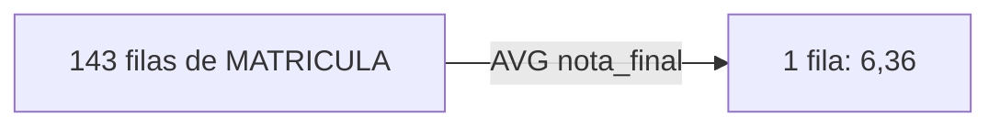
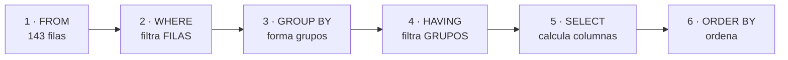
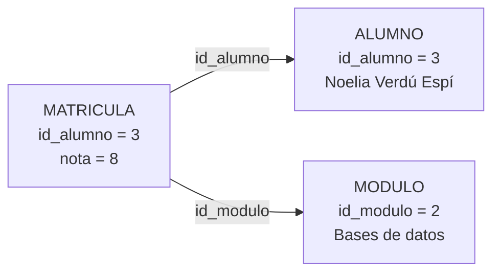
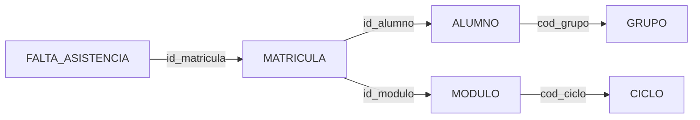
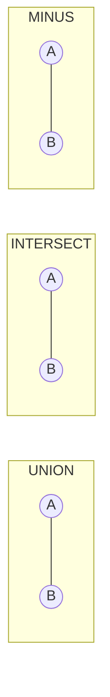

# UD07 · Consultas avanzadas: composiciones, resúmenes y subconsultas

## Resumen del tema

En la UD06 aprendiste a consultar **una** tabla. Pero una base de datos bien diseñada reparte la información entre muchas tablas: el nombre del alumno está en `ALUMNO`, su nota en `MATRICULA` y el nombre del módulo en `MODULO`. Casi ninguna pregunta real del centro se responde con una sola tabla. Esta unidad enseña a **volver a juntar** lo que el diseño separó (composiciones o *joins*), a **resumir** muchas filas en pocas (funciones de agregado y `GROUP BY`) y a **encadenar consultas** unas dentro de otras (subconsultas).

El recorrido es acumulativo. Primero se resume una sola tabla, porque agrupar es más fácil de entender sin composiciones de por medio. Después se combinan tablas, primero de forma interna (solo las filas que emparejan) y luego externa (conservando también las que no emparejan: el grupo sin tutor, el ciclo sin grupos). A continuación se usan subconsultas para preguntas que necesitan dos pasos («quién está por encima de la media de su módulo»). Por último se guardan las consultas útiles como **vistas**, se combinan resultados con `UNION`, `INTERSECT` y `MINUS`, y se introducen las **funciones analíticas** y la **optimización** con el plan de ejecución.

Esta es la unidad que convierte el SQL en una herramienta profesional: al terminarla serás capaz de contestar prácticamente cualquier pregunta que secretaría, jefatura de estudios o el equipo docente le puedan hacer a EduGest. En la UD08 reutilizarás casi todo lo de aquí, porque `UPDATE` y `DELETE` admiten subconsultas, y en la UD09 encapsularás estas consultas en procedimientos y vistas más elaboradas.

Todos los ejemplos se ejecutan sobre el esquema de referencia **EDUGEST** con los datos del curso **2025-26** cargados con los [scripts del proyecto](/guia/proyecto-edugest#4-scripts-descargables): 5 departamentos, 12 profesores, 4 ciclos, 24 módulos, 6 grupos, 32 alumnos, 143 matrículas, 24 asignaciones docentes y 46 faltas de asistencia.



### Objetivos de aprendizaje

Al terminar esta unidad serás capaz de:

- Resumir el contenido de una tabla con funciones de agregado, razonando cómo afectan los valores nulos.
- Formar grupos con `GROUP BY` y filtrarlos con `HAVING`, distinguiendo su papel del de `WHERE`.
- Combinar varias tablas con composiciones internas siguiendo el camino de las claves ajenas.
- Decidir cuándo una pregunta exige una composición externa y escribirla sin anularla con un filtro mal colocado.
- Resolver con autocomposiciones las preguntas en que una tabla se relaciona consigo misma.
- Escribir subconsultas de una fila, de varias filas, correlacionadas y con `EXISTS`, y sustituirlas por una cláusula `WITH` cuando mejore la legibilidad.
- Crear vistas que encapsulen composiciones y valorar cuándo son actualizables.
- Combinar resultados de varias consultas con `UNION`, `UNION ALL`, `INTERSECT` y `MINUS`.
- Utilizar funciones analíticas para comparar cada fila con su grupo sin perder el detalle.
- Obtener e interpretar el plan de ejecución de una consulta y aplicar criterios de optimización.

### Temporalización

La unidad ocupa **17 horas de aula** (10 de teoría y 7 de práctica). Las composiciones
y las subconsultas son el núcleo del RA3: conviene no avanzar hasta que cada consulta
se pueda escribir sin consultar los apuntes.


items:
  - {h: 2, tipo: T, t: "Funciones de agregado, GROUP BY y HAVING", ref: "§1 y §2 · laboratorio de agrupamiento"}
  - {h: 1, tipo: P, t: "Consultas resumen", ref: "Práctica 7.1"}
  - {h: 2, tipo: T, t: "Composiciones internas: INNER JOIN y varias tablas", ref: "§3 · laboratorio de composiciones"}
  - {h: 2, tipo: P, t: "Composiciones paso a paso", ref: "Práctica 7.2"}
  - {h: 2, tipo: T, t: "Composiciones externas y autocomposición", ref: "§4 y §5"}
  - {h: 1, tipo: P, t: "Informes para jefatura", ref: "Práctica 7.3"}
  - {h: 2, tipo: T, t: "Subconsultas, EXISTS y WITH", ref: "§6"}
  - {h: 1, tipo: P, t: "Subconsultas", ref: "Práctica 7.4"}
  - {h: 1, tipo: T, t: "Vistas con composiciones y operadores de conjuntos", ref: "§7 y §8"}
  - {h: 1, tipo: P, t: "Múltiples selecciones y vistas", ref: "Práctica 7.5"}
  - {h: 1, tipo: T, t: "Funciones analíticas y optimización de consultas", ref: "§9 y §10"}
  - {h: 1, tipo: P, t: "Optimización: medir antes y después", ref: "Práctica 7.6"}
autonomo:
  - "Práctica 7.7 (reto: el cuadro de mando)"
  - "Proyecto EduGest · UD07 (informes de secretaría y jefatura)"
  - "Ampliación de funciones analíticas"


> [!IMPORTANT]
> Estudia esta unidad con la base de datos abierta y con un método fijo para cada consulta:
>
> 1. Escribe en castellano la pregunta que quieres responder.
> 2. Decide **qué tablas** la contienen y **por qué claves** se enlazan.
> 3. **Predice** cuántas filas debe devolver y de qué tipo.
> 4. Ejecuta y compara con tu predicción. Si no coincide, el error está en tu modelo mental, no en Oracle: averigua dónde.
>
> Si una consulta devuelve muchas más filas de las esperadas, casi siempre falta una condición de composición. Si devuelve menos, casi siempre sobra un filtro o falta una composición externa.

---

Funciones de agregado, GROUP BY y HAVING

## 1. Funciones de agregado

### 1.1 Qué problema resuelven

Las funciones de fila de la UD06 (`UPPER`, `ROUND`, `TO_CHAR`…) devuelven **un valor por cada fila**: entran 143 filas y salen 143. Pero muchas preguntas no piden filas, piden **un número que resuma** las filas: «¿cuántas matrículas hay?», «¿cuál es la nota media?», «¿cuál es la nota más alta?».

Para eso están las **funciones de agregado** (también llamadas funciones de grupo o de columna): reciben un conjunto de filas y devuelven **un único valor**.





| Función | Devuelve | Admite `DISTINCT` | Tipos admitidos |
|---|---|---|---|
| `COUNT(*)` | Número de **filas** del grupo | No | — |
| `COUNT(expr)` | Número de filas en que `expr` **no es nula** | Sí | cualquiera |
| `SUM(expr)` | Suma | Sí | numéricos |
| `AVG(expr)` | Media aritmética | Sí | numéricos |
| `MIN(expr)` / `MAX(expr)` | Valor menor / mayor | No (no aporta) | numéricos, texto, fechas |
| `STDDEV(expr)` / `VARIANCE(expr)` | Desviación típica / varianza | Sí | numéricos |
| `MEDIAN(expr)` | Mediana | No | numéricos, fechas |
| `LISTAGG(expr, sep)` | Concatena los valores del grupo en una cadena | Sí | texto |

> [!NOTE]
> `COUNT`, `SUM`, `AVG`, `MIN` y `MAX` son SQL estándar y existen en todos los SGBD. `STDDEV`, `VARIANCE`, `MEDIAN` y `LISTAGG` son extensiones de Oracle (algunas están también en PostgreSQL con otro nombre). `MEDIAN` y `LISTAGG` se tratan como ampliación: lo evaluable del RA3.e son las cinco primeras.

### 1.2 Ejemplo sencillo: contar

```sql
SELECT COUNT(*)                    AS matriculas,
       COUNT(nota_final)           AS calificadas,
       COUNT(*) - COUNT(nota_final) AS sin_calificar,
       COUNT(DISTINCT id_alumno)   AS alumnos_distintos,
       COUNT(DISTINCT id_modulo)   AS modulos_distintos
FROM   matricula;
```

| MATRICULAS | CALIFICADAS | SIN_CALIFICAR | ALUMNOS_DISTINTOS | MODULOS_DISTINTOS |
|---|---|---|---|---|
| 143 | 137 | 6 | 29 | 24 |

*1 fila*

Elemento a elemento:

| Elemento | Significado |
|---|---|
| `COUNT(*)` | Cuenta **filas**, sin mirar su contenido: 143 matrículas |
| `COUNT(nota_final)` | Cuenta las filas en que `nota_final` **tiene valor**: 137 |
| `COUNT(*) - COUNT(nota_final)` | Las 6 matrículas sin calificar |
| `COUNT(DISTINCT id_alumno)` | Valores distintos de `id_alumno`: 29 alumnos tienen matrícula (de los 32) |

> [!IMPORTANT]
> **Todas las funciones de agregado excepto `COUNT(*)` ignoran los nulos.** No los cuentan, no los suman y no los tienen en cuenta en la media. Esta es la causa número uno de resultados «raros» en las consultas resumen, y la razón por la que `COUNT(*)` y `COUNT(columna)` dan números distintos.

### 1.3 Ejemplo aplicado: estadísticos de las notas

```sql
SELECT COUNT(nota_final)            AS calificadas,
       ROUND(AVG(nota_final), 2)    AS media,
       MIN(nota_final)              AS minima,
       MAX(nota_final)              AS maxima,
       SUM(nota_final)              AS suma,
       ROUND(SUM(nota_final) / COUNT(*), 2) AS media_incorrecta
FROM   matricula;
```

| CALIFICADAS | MEDIA | MINIMA | MAXIMA | SUMA | MEDIA_INCORRECTA |
|---|---|---|---|---|---|
| 137 | 6.36 | 1.5 | 10 | 871 | 6.09 |

*1 fila*

La última columna es deliberadamente errónea y conviene entenderla bien:

- `AVG(nota_final)` calcula 871 / **137** = 6,36: divide entre las matrículas **calificadas**.
- `SUM(nota_final) / COUNT(*)` calcula 871 / **143** = 6,09: divide entre **todas** las matrículas, incluidas las seis sin nota, como si fueran ceros.

> [!WARNING]
> Las dos cifras responden a preguntas distintas y **ninguna es más correcta que la otra en abstracto**: depende de lo que te pidan. «Nota media de los alumnos calificados» es 6,36. «Nota media considerando los no presentados como un cero» es 6,09, y entonces conviene escribirlo explícitamente con `AVG(NVL(nota_final, 0))` para que el lector vea la decisión. Lo que nunca debe pasar es tomar una por la otra sin darse cuenta.

### 1.4 MIN y MAX no son solo para números

`MIN` y `MAX` funcionan con texto (orden alfabético según `NLS_SORT`) y con fechas, donde `MIN` es la más antigua:

```sql
SELECT MIN(fecha_nacimiento) AS mayor_edad,
       MAX(fecha_nacimiento) AS menor_edad,
       MIN(apellidos)        AS primero_alfabetico
FROM   alumno;
```

| MAYOR_EDAD | MENOR_EDAD | PRIMERO_ALFABETICO |
|---|---|---|
| 07/08/2000 | 25/12/2006 | Agulló Cerdá |

*1 fila*

### 1.5 Contar condiciones: SUM con CASE

Una técnica muy habitual en informes es contar cuántas filas cumplen una condición **dentro** del mismo resumen, en vez de lanzar una consulta por cada condición:

```sql
SELECT COUNT(*)                                            AS matriculas,
       SUM(CASE WHEN nota_final >= 5 THEN 1 ELSE 0 END)     AS aprobadas,
       SUM(CASE WHEN nota_final <  5 THEN 1 ELSE 0 END)     AS suspensas,
       COUNT(*) - COUNT(nota_final)                         AS sin_calificar,
       ROUND(100 * SUM(CASE WHEN nota_final >= 5 THEN 1 ELSE 0 END)
             / COUNT(nota_final), 1)                        AS pct_aprobados
FROM   matricula;
```

| MATRICULAS | APROBADAS | SUSPENSAS | SIN_CALIFICAR | PCT_APROBADOS |
|---|---|---|---|---|
| 143 | 110 | 27 | 6 | 80.3 |

*1 fila*

Fíjate en el denominador del porcentaje: `COUNT(nota_final)`, no `COUNT(*)`. El porcentaje de aprobados se calcula sobre los **calificados**.

> [!TIP]
> En lugar de `SUM(CASE WHEN … THEN 1 ELSE 0 END)` también funciona `COUNT(CASE WHEN … THEN 1 END)`: como `COUNT` ignora los nulos y el `CASE` sin `ELSE` devuelve `NULL` cuando no se cumple, el efecto es el mismo. Usa la forma que te resulte más legible, pero **sé coherente** dentro de un mismo informe.

### 1.6 Errores habituales con los agregados

```sql
-- (a) Mezclar una columna normal con un agregado sin GROUP BY
SELECT localidad, COUNT(*) FROM alumno;
-- ORA-00937: not a single-group group function

-- (b) Usar un agregado en el WHERE
SELECT localidad FROM alumno WHERE COUNT(*) > 3 GROUP BY localidad;
-- ORA-00934: group function is not allowed here

-- (c) Anidar agregados sin GROUP BY intermedio
SELECT MAX(AVG(nota_final)) FROM matricula;
-- ORA-00978: nested group function without GROUP BY
```

El error (a) es el más frecuente: si pides una columna normal junto a un agregado, Oracle no sabe **qué** localidad poner al lado de un recuento de 32 alumnos. La solución es el `GROUP BY` del apartado siguiente.

---

## 2. Agrupamiento: GROUP BY y HAVING

### 2.1 Cómo se forman los grupos

`GROUP BY` divide las filas en **grupos** que comparten el mismo valor en las columnas indicadas, y después aplica las funciones de agregado **a cada grupo por separado**. El resultado tiene **una fila por grupo**.

```sql
SELECT cod_grupo, COUNT(*) AS alumnos
FROM   alumno
GROUP  BY cod_grupo
ORDER  BY cod_grupo;
```

| COD_GRUPO | ALUMNOS |
|---|---|
| 1ASIR | 5 |
| 1DAM | 7 |
| 1DAW | 6 |
| 2DAM | 6 |
| 2DAW | 5 |
| (null) | 3 |

*6 filas*

Observaciones importantes:

- Hay **seis** filas porque hay cinco valores distintos de `cod_grupo` más el grupo de los nulos.
- `GROUP BY` **reúne todos los nulos en un único grupo** (al contrario que el operador `=`, que nunca considera iguales dos nulos). Esos son los 3 alumnos sin grupo asignado.
- La suma de los recuentos es 32: ninguna fila se pierde y ninguna se cuenta dos veces.
- Los `NULL` aparecen al final porque `ORDER BY … ASC` los coloca al final en Oracle.

> [!NOTE]
> `GROUP BY` **no garantiza el orden** del resultado, aunque a veces lo parezca. Si el orden importa, escribe `ORDER BY`. Es un error clásico confiar en que los grupos salgan ordenados.

### 2.2 Qué puede aparecer en el SELECT

Esta es la regla que más errores provoca del tema:

> [!IMPORTANT]
> En una consulta con `GROUP BY`, el `SELECT` solo puede contener:
>
> 1. las **columnas o expresiones que aparecen en el `GROUP BY`**,
> 2. **funciones de agregado**,
> 3. constantes y expresiones calculadas a partir de 1 y 2.
>
> Cualquier otra columna provoca `ORA-00979: not a GROUP BY expression`.

```sql
-- Incorrecta: nombre no está en el GROUP BY y no es un agregado
SELECT localidad, nombre, COUNT(*)
FROM   alumno
GROUP  BY localidad;
-- ORA-00979: not a GROUP BY expression
```

La consulta no tiene sentido: el grupo «Alicante» contiene 13 alumnos con 13 nombres distintos; ¿cuál debería mostrar? Tienes tres salidas posibles, según lo que realmente quieras:

| Lo que quieres | Solución |
|---|---|
| Una fila por localidad, sin el nombre | Quita `nombre` del `SELECT` |
| Una fila por localidad **y** nombre | Añade `nombre` al `GROUP BY` |
| Una fila por localidad con **un** nombre representativo | `MIN(nombre)` o `MAX(nombre)` |
| Una fila por localidad con **todos** los nombres en una celda | `LISTAGG(nombre, ', ') WITHIN GROUP (ORDER BY nombre)` |

```sql
SELECT localidad,
       COUNT(*) AS alumnos,
       MIN(apellidos) AS primero,
       LISTAGG(nombre, ', ') WITHIN GROUP (ORDER BY nombre) AS nombres
FROM   alumno
WHERE  localidad IN ('Elche', 'El Campello')
GROUP  BY localidad
ORDER  BY localidad;
```

| LOCALIDAD | ALUMNOS | PRIMERO | NOMBRES |
|---|---|---|---|
| El Campello | 3 | Alemany Pérez | Daniel, Elena, Jorge |
| Elche | 3 | Iborra Ferri | Rubén, Sofía, Víctor |

*2 filas*

### 2.3 Orden de evaluación: WHERE frente a HAVING

Ya conoces el orden lógico de las cláusulas; ahora se completa con `GROUP BY` y `HAVING`:

```text
FROM  →  WHERE  →  GROUP BY  →  HAVING  →  SELECT  →  ORDER BY
  1        2          3            4         5           6
```



De este orden se derivan todas las reglas prácticas:

| Pregunta | Respuesta | Porque… |
|---|---|---|
| ¿Puedo usar un agregado en el `WHERE`? | **No** (ORA-00934) | El `WHERE` se evalúa antes de formar los grupos |
| ¿Puedo usar un agregado en el `HAVING`? | **Sí** | El `HAVING` se evalúa después de agrupar |
| ¿Puedo usar un alias del `SELECT` en el `HAVING`? | **No** en Oracle | El `SELECT` se evalúa después del `HAVING` |
| ¿Puedo usar un alias del `SELECT` en el `ORDER BY`? | **Sí** | El `ORDER BY` es lo último |
| ¿Filtro por `nota_final < 5` en `WHERE` o en `HAVING`? | En el **`WHERE`** | Es una condición sobre filas, no sobre grupos |

Las dos cláusulas se combinan con frecuencia, y cada una hace un trabajo distinto:

```sql
-- Módulos con 3 suspensos o más: quién está suspenso se decide fila a fila
-- (WHERE); cuántos suspensos tiene el grupo se decide después (HAVING).
SELECT id_modulo,
       COUNT(*)                  AS suspensos,
       ROUND(AVG(nota_final), 2) AS media_de_los_suspensos
FROM   matricula
WHERE  nota_final < 5
GROUP  BY id_modulo
HAVING COUNT(*) >= 3
ORDER  BY suspensos DESC, id_modulo;
```

| ID_MODULO | SUSPENSOS | MEDIA_DE_LOS_SUSPENSOS |
|---|---|---|
| 3 | 4 | 3.81 |
| 18 | 3 | 3 |

*2 filas*

{}
No es posible escribirla tal cual: `HAVING nota_final < 5` da `ORA-00979`, porque `nota_final` no está en el `GROUP BY`. Si la escribes como `HAVING MIN(nota_final) < 5`, la consulta es válida pero responde a **otra** pregunta: «módulos en los que hay al menos un suspenso», y el `COUNT(*)` contaría **todas** las matrículas del módulo, no solo las suspensas.

Regla práctica: **si la condición se puede decidir mirando una sola fila, va en el `WHERE`**. Si necesita ver el grupo entero, va en el `HAVING`. Además, filtrar en el `WHERE` es más eficiente, porque se descartan filas antes de agrupar.
{}

### 2.4 Agrupar por varias columnas y por expresiones

El `GROUP BY` puede contener varias columnas: entonces se forma un grupo por cada **combinación** de valores presente en los datos (nunca se inventan combinaciones que no existan).

```sql
SELECT curso_academico, convocatoria,
       COUNT(*)                  AS matriculas,
       COUNT(nota_final)         AS calificadas,
       ROUND(AVG(nota_final), 2) AS media
FROM   matricula
GROUP  BY curso_academico, convocatoria
ORDER  BY curso_academico, convocatoria;
```

| CURSO_ACADEMICO | CONVOCATORIA | MATRICULAS | CALIFICADAS | MEDIA |
|---|---|---|---|---|
| 2025-26 | 1 | 140 | 134 | 6.38 |
| 2025-26 | 2 | 3 | 3 | 5.25 |

*2 filas*

También se puede agrupar por una **expresión**, siempre que la misma expresión aparezca en el `GROUP BY`:

```sql
SELECT CASE WHEN nota_final IS NULL THEN 'Sin calificar'
            WHEN nota_final < 5     THEN 'Insuficiente'
            WHEN nota_final < 7     THEN 'Suficiente / Bien'
            WHEN nota_final < 9     THEN 'Notable'
            ELSE                         'Sobresaliente'
       END      AS tramo,
       COUNT(*) AS matriculas
FROM   matricula
GROUP  BY CASE WHEN nota_final IS NULL THEN 'Sin calificar'
               WHEN nota_final < 5     THEN 'Insuficiente'
               WHEN nota_final < 7     THEN 'Suficiente / Bien'
               WHEN nota_final < 9     THEN 'Notable'
               ELSE                         'Sobresaliente'
          END
ORDER  BY matriculas DESC;
```

| TRAMO | MATRICULAS |
|---|---|
| Suficiente / Bien | 52 |
| Notable | 49 |
| Insuficiente | 27 |
| Sobresaliente | 9 |
| Sin calificar | 6 |

*5 filas*

> [!TIP]
> Repetir el `CASE` completo es incómodo y propenso a errores. En Oracle **no** se puede escribir `GROUP BY tramo` usando el alias, pero sí se puede dar nombre al cálculo con una **subconsulta en el `FROM`** o con una cláusula `WITH` (apartado 6.6):
>
> ```sql
> WITH clasificadas AS (
>     SELECT CASE WHEN nota_final IS NULL THEN 'Sin calificar'
>                 WHEN nota_final < 5     THEN 'Insuficiente'
>                 ELSE                         'Aprobada'
>            END AS tramo
>     FROM   matricula)
> SELECT tramo, COUNT(*) AS matriculas
> FROM   clasificadas
> GROUP  BY tramo
> ORDER  BY matriculas DESC;
> ```

### 2.5 Subtotales: ROLLUP, CUBE y GROUPING SETS

Un informe suele necesitar, además del detalle por grupo, una **fila de totales**. `GROUP BY ROLLUP(...)` la añade automáticamente:



```sql
SELECT id_modulo,
       COUNT(*)                  AS matriculas,
       COUNT(nota_final)         AS calificadas,
       ROUND(AVG(nota_final), 2) AS media,
       GROUPING(id_modulo)       AS es_total
FROM   matricula
WHERE  id_modulo IN (16, 17, 18, 19)
GROUP  BY ROLLUP(id_modulo)
ORDER  BY GROUPING(id_modulo), id_modulo;
```

| ID_MODULO | MATRICULAS | CALIFICADAS | MEDIA | ES_TOTAL |
|---|---|---|---|---|
| 16 | 5 | 4 | 6.38 | 0 |
| 17 | 5 | 5 | 5.8 | 0 |
| 18 | 5 | 5 | 4.9 | 0 |
| 19 | 5 | 5 | 6.75 | 0 |
| (null) | 20 | 19 | 5.93 | 1 |

*5 filas*

| Cláusula | Qué añade |
|---|---|
| `ROLLUP(a, b)` | Subtotales por `a` y un total general: jerarquía de izquierda a derecha |
| `CUBE(a, b)` | **Todas** las combinaciones de subtotales: por `a`, por `b` y total |
| `GROUPING SETS((a), (b))` | Exactamente los subtotales que indiques |
| `GROUPING(col)` | Devuelve 1 si la fila es un subtotal respecto de `col`, y 0 si no |

> [!WARNING]
> En las filas de subtotal, la columna agrupada vale `NULL`. Si la columna **ya tenía** valores nulos propios (como `cod_grupo` en `ALUMNO`), no podrás distinguir «los alumnos sin grupo» de «el total» mirando la columna: necesitas `GROUPING(cod_grupo)`. Para presentarlo se combina con `CASE`: `CASE WHEN GROUPING(cod_grupo) = 1 THEN 'TOTAL' ELSE NVL(cod_grupo, '(sin grupo)') END`.
>
> `ROLLUP`, `CUBE` y `GROUPING SETS` son SQL estándar y existen en Oracle, SQL Server y PostgreSQL; en MySQL solo está `WITH ROLLUP`. Aquí son **ampliación**: resuelve primero los informes sin subtotales.

### 2.6 Laboratorio de agrupamiento

En el laboratorio siguiente trabajas con las **143 matrículas reales** de EduGest (hay 6 notas sin poner, dos de ellas en el módulo 0490). Elige la columna de agrupamiento, la función de agregado y, si quieres, una condición `HAVING`, y observa tres cosas a la vez: qué filas forman cada grupo, qué devuelve el agregado y qué SQL estás construyendo en realidad.

Presta atención especialmente a dos experimentos:

1. Agrupa por `id_modulo` y compara `COUNT(*)` con `COUNT(nota_final)` en el módulo 0490: hay dos matrículas sin nota.
2. Marca la casilla **«añadir `id_alumno` al SELECT»**: verás el error `ORA-00979`, que es el que más veces aparece en los primeros ejercicios del tema.




- q: "La tabla `MATRICULA` tiene 143 filas y 6 tienen `nota_final` a `NULL`. ¿Qué devuelve `SELECT COUNT(*), COUNT(nota_final) FROM matricula`?"
  options: ["143 y 143", "143 y 137", "137 y 137", "137 y 143"]
  answer: 1
  explain: "`COUNT(*)` cuenta filas (143) y `COUNT(columna)` cuenta valores no nulos (137). Todas las funciones de agregado salvo `COUNT(*)` ignoran los nulos."
- q: "¿Por qué falla `SELECT localidad, nombre, COUNT(*) FROM alumno GROUP BY localidad`?"
  options: ["Porque `COUNT(*)` no admite `GROUP BY`", "Porque `nombre` no está en el `GROUP BY` ni es un agregado: ORA-00979", "Porque falta `ORDER BY`", "Porque `localidad` admite nulos"]
  answer: 1
  explain: "Cada grupo contiene varios nombres distintos y Oracle no puede elegir uno. Habría que añadir `nombre` al `GROUP BY`, quitarlo del `SELECT` o resumirlo con `MIN`, `MAX` o `LISTAGG`."
- q: "Quieres los módulos cuya nota media supera 6, calculada solo con las matrículas de primera convocatoria. ¿Dónde va cada condición?"
  options: ["Las dos en el `WHERE`", "Las dos en el `HAVING`", "`convocatoria = 1` en el `WHERE` y `AVG(nota_final) > 6` en el `HAVING`", "`convocatoria = 1` en el `HAVING` y `AVG(nota_final) > 6` en el `WHERE`"]
  answer: 2
  explain: "La convocatoria se decide mirando una sola fila, así que filtra en el `WHERE` (y además reduce las filas antes de agrupar). La media solo existe una vez formado el grupo: va en el `HAVING`."


---

Composiciones internas: INNER JOIN

## 3. Composiciones internas: INNER JOIN

### 3.1 Qué problema resuelven

La normalización (UD04) reparte la información para no repetirla: en `MATRICULA` no se guarda el nombre del alumno, sino su `id_alumno`. Es el diseño correcto, pero deja un problema práctico: el acta de evaluación necesita el **nombre**, no el identificador.

Una **composición** (*join*) es la operación que vuelve a unir esa información: combina filas de dos o más tablas emparejándolas por una condición, normalmente la igualdad entre una clave ajena y la clave primaria a la que apunta.



### 3.2 El punto de partida: el producto cartesiano

Si escribes dos tablas en el `FROM` **sin condición**, Oracle combina **cada** fila de la primera con **cada** fila de la segunda. Eso es el **producto cartesiano**, y en SQL moderno se escribe `CROSS JOIN`:

```sql
SELECT (SELECT COUNT(*) FROM grupo) AS grupos,
       (SELECT COUNT(*) FROM ciclo) AS ciclos,
       (SELECT COUNT(*) FROM grupo g CROSS JOIN ciclo c) AS producto
FROM   dual;
```

| GRUPOS | CICLOS | PRODUCTO |
|---|---|---|
| 6 | 4 | 24 |

*1 fila*

El producto cartesiano de `GRUPO` y `CICLO` tiene **24 filas**: 6 × 4. Predecir este número es justo lo que hay que aprender a hacer. Las primeras filas, ordenadas, dejan ver el problema:

```sql
SELECT g.cod_grupo, g.cod_ciclo AS ciclo_del_grupo, c.cod_ciclo AS ciclo_de_la_tabla
FROM   grupo g CROSS JOIN ciclo c
ORDER  BY g.cod_grupo, c.cod_ciclo
FETCH FIRST 8 ROWS ONLY;
```

| COD_GRUPO | CICLO_DEL_GRUPO | CICLO_DE_LA_TABLA |
|---|---|---|
| 1ASIR | ASIR | ASIR |
| 1ASIR | ASIR | DAM |
| 1ASIR | ASIR | DAW |
| 1ASIR | ASIR | SMR |
| 1DAM | DAM | ASIR |
| 1DAM | DAM | DAM |
| 1DAM | DAM | DAW |
| 1DAM | DAM | SMR |

*8 filas*

De las cuatro filas de cada grupo, **solo una tiene sentido**: la que empareja el grupo con *su* ciclo. Una composición interna es exactamente el producto cartesiano **más la condición** que selecciona esas filas con sentido.

> [!CAUTION]
> El producto cartesiano crece multiplicando. Con las 143 matrículas y las 46 faltas de EduGest son 6 578 filas; con dos tablas de un millón de filas serían un billón. Si una consulta tarda muchísimo o devuelve un número absurdo de filas, lo primero que hay que sospechar es **una condición de composición olvidada**.

### 3.3 Sintaxis `JOIN … ON`



```text
SELECT columnas
FROM   tabla1 alias1
       [INNER] JOIN tabla2 alias2 ON condición_de_emparejamiento
       [INNER] JOIN tabla3 alias3 ON condición_de_emparejamiento
WHERE  condiciones_de_filtrado
```

| Elemento | Significado |
|---|---|
| `JOIN tabla2` | Tabla que se añade a la composición |
| `ON condición` | Cómo se emparejan las filas; es **obligatoria** en `JOIN` |
| `INNER` | Opcional: `JOIN` sin más es siempre una composición **interna** |
| `alias` | Nombre corto de la tabla; imprescindible para cualificar las columnas |

Ejemplo sencillo, cada módulo con el nombre completo de su ciclo:

```sql
SELECT mo.codigo, mo.nombre AS modulo, c.nombre AS ciclo, mo.curso, mo.horas
FROM   modulo mo
       JOIN ciclo c ON c.cod_ciclo = mo.cod_ciclo
WHERE  mo.cod_ciclo = 'ASIR'
ORDER  BY mo.codigo;
```

| CODIGO | MODULO | CICLO | CURSO | HORAS |
|---|---|---|---|---|
| 0369 | Implantación de sistemas operativos | Administración de Sistemas Informáticos en Red | 1 | 224 |
| 0370 | Planificación y administración de redes | Administración de Sistemas Informáticos en Red | 1 | 192 |
| 0371 | Fundamentos de hardware | Administración de Sistemas Informáticos en Red | 1 | 96 |
| 0372 | Gestión de bases de datos | Administración de Sistemas Informáticos en Red | 1 | 160 |
| 0373 | Lenguajes de marcas y sistemas de gestión de información | Administración de Sistemas Informáticos en Red | 1 | 96 |

*5 filas*

Resultado esperado: **5 filas**, las mismas que módulos de ASIR. Una composición por clave ajena hacia una clave primaria **no puede multiplicar filas**: cada módulo tiene exactamente un ciclo. Esta es la comprobación más útil del tema.

> [!IMPORTANT]
> **Usa siempre alias de tabla y cualifica todas las columnas.** No es una cuestión estética:
>
> - `MODULO` y `CICLO` tienen las dos una columna `nombre`. Sin cualificar, `SELECT nombre` daría `ORA-00918: column ambiguously defined`.
> - Al leer la consulta meses después, `c.nombre` dice de dónde sale el dato; `nombre` no.
> - Si alguien añade una columna a una tabla, una consulta sin cualificar puede volverse ambigua de repente y dejar de compilar.

### 3.4 Composición de tres y cuatro tablas

Las composiciones se encadenan. El método es siempre el mismo: **trazar el camino de claves ajenas** desde la tabla que tiene el dato que buscas hasta la que tiene el dato que quieres mostrar.



Tres tablas: alumnado de 2DAM con su grupo y el nombre del ciclo.

```sql
SELECT a.apellidos || ', ' || a.nombre AS alumno,
       g.cod_grupo, g.turno, c.nombre AS ciclo
FROM   alumno a
       JOIN grupo g ON g.cod_grupo = a.cod_grupo
       JOIN ciclo c ON c.cod_ciclo = g.cod_ciclo
WHERE  g.cod_grupo = '2DAM'
ORDER  BY a.apellidos;
```

| ALUMNO | COD_GRUPO | TURNO | CICLO |
|---|---|---|---|
| Alemany Vidal, Martina | 2DAM | M | Desarrollo de Aplicaciones Multiplataforma |
| Belda Quiles, Lucía | 2DAM | M | Desarrollo de Aplicaciones Multiplataforma |
| Brotons Iborra, Hugo | 2DAM | M | Desarrollo de Aplicaciones Multiplataforma |
| Cerdá Tomás, Nerea | 2DAM | M | Desarrollo de Aplicaciones Multiplataforma |
| Domènech Quiles, María | 2DAM | M | Desarrollo de Aplicaciones Multiplataforma |
| Ripoll Agulló, Iván | 2DAM | M | Desarrollo de Aplicaciones Multiplataforma |

*6 filas*

Cuatro tablas: la asignación docente de 2DAM, que cruza `IMPARTE` con `MODULO`, `GRUPO` y `PROFESOR`.

```sql
SELECT g.cod_grupo, mo.codigo, mo.nombre AS modulo,
       p.apellidos AS profesor, i.horas_semanales
FROM   imparte i
       JOIN modulo mo   ON mo.id_modulo   = i.id_modulo
       JOIN grupo g     ON g.cod_grupo    = i.cod_grupo
       JOIN profesor p  ON p.id_profesor  = i.id_profesor
WHERE  i.cod_grupo = '2DAM'
ORDER  BY mo.codigo;
```

| COD_GRUPO | CODIGO | MODULO | PROFESOR | HORAS_SEMANALES |
|---|---|---|---|---|
| 2DAM | 0486 | Acceso a datos | Ferrándiz Mora | 4 |
| 2DAM | 0488 | Desarrollo de interfaces | Navarro Ruiz | 4 |
| 2DAM | 0489 | Programación multimedia y dispositivos móviles | Cano Vidal | 3 |
| 2DAM | 0490 | Programación de servicios y procesos | Ferrándiz Mora | 2 |
| 2DAM | 0491 | Sistemas de gestión empresarial | Pastor Gil | 3 |

*5 filas*

> [!TIP]
> **Construye las composiciones de una en una.** Añade una tabla, ejecuta `SELECT COUNT(*)`, comprueba que el número es el que esperas y pasa a la siguiente. Así, cuando el número se desmadre, sabrás exactamente qué `JOIN` lo ha causado. La práctica 7.2 está montada sobre esta técnica.

### 3.5 Composiciones y agrupamientos juntos

Lo habitual en un informe es componer y después resumir. El orden lógico no cambia: primero `FROM` (con sus composiciones), luego `WHERE`, luego `GROUP BY`.

```sql
SELECT c.cod_ciclo, c.nombre AS ciclo,
       COUNT(m.id_matricula)     AS matriculas,
       COUNT(m.nota_final)       AS calificadas,
       ROUND(AVG(m.nota_final), 2) AS media
FROM   ciclo c
       JOIN modulo mo    ON mo.cod_ciclo = c.cod_ciclo
       JOIN matricula m  ON m.id_modulo  = mo.id_modulo
GROUP  BY c.cod_ciclo, c.nombre
ORDER  BY c.cod_ciclo;
```

| COD_CICLO | CICLO | MATRICULAS | CALIFICADAS | MEDIA |
|---|---|---|---|---|
| ASIR | Administración de Sistemas Informáticos en Red | 25 | 24 | 7.07 |
| DAM | Desarrollo de Aplicaciones Multiplataforma | 68 | 65 | 6.29 |
| DAW | Desarrollo de Aplicaciones Web | 50 | 48 | 6.09 |

*3 filas*

Falta uno de los cuatro ciclos: **SMR no aparece** porque no tiene módulos y, por tanto, ninguna fila sobrevive a la composición interna. Ese es precisamente el problema que resuelve el apartado 4.

> [!NOTE]
> En el `GROUP BY` se han puesto `c.cod_ciclo` **y** `c.nombre`, aunque el nombre dependa funcionalmente del código. Oracle exige en el `GROUP BY` todas las columnas no agregadas del `SELECT`. Cuando agrupes por una entidad, incluye su clave primaria en el `GROUP BY`: garantiza que no se fundan dos entidades con el mismo nombre.

### 3.6 Sintaxis antigua y otras formas de composición

#### Sintaxis con comas (heredada)

Antes del estándar SQL-92, la condición de composición se escribía en el `WHERE`:

```sql
-- Sintaxis antigua: NO la uses en código nuevo
SELECT mo.codigo, c.nombre
FROM   modulo mo, ciclo c
WHERE  c.cod_ciclo = mo.cod_ciclo
AND    mo.curso = 2;
```

Devuelve exactamente lo mismo que la versión con `JOIN … ON`, pero tiene dos problemas graves que explican por qué la norma profesional es no usarla:

1. **Mezcla** las condiciones de composición con las de filtrado: en una consulta de seis tablas y diez condiciones es imposible ver de un vistazo si falta un emparejamiento.
2. Si **olvidas** una condición, no hay ningún error: obtienes silenciosamente un producto cartesiano parcial con resultados erróneos.

Debes saber leerla porque aparece en muchísimo código heredado y en documentación antigua de Oracle, pero escribe siempre `JOIN … ON`.

#### `USING`

Cuando las columnas que se emparejan tienen **el mismo nombre** en las dos tablas, `USING` abrevia:

```sql
SELECT codigo, cod_ciclo, nombre_ciclo
FROM   (SELECT mo.codigo, mo.cod_ciclo, c.nombre AS nombre_ciclo
        FROM   modulo mo JOIN ciclo c USING (cod_ciclo))
FETCH FIRST 3 ROWS ONLY;
```

> [!WARNING]
> `USING` tiene una peculiaridad que sorprende: la columna común **deja de pertenecer a una tabla concreta** y no se puede cualificar. `SELECT mo.cod_ciclo … USING (cod_ciclo)` da `ORA-25154: column part of USING clause cannot have qualifier`. Hay que escribir `cod_ciclo` sin alias.

#### `NATURAL JOIN`

`NATURAL JOIN` empareja automáticamente por **todas** las columnas que tengan el mismo nombre en las dos tablas. Suena cómodo y es peligroso:

```sql
SELECT COUNT(*) FROM modulo NATURAL JOIN ciclo;
```

| COUNT(*) |
|---|
| 0 |

*1 fila*

Cero filas. `MODULO` y `CICLO` comparten **dos** nombres de columna: `cod_ciclo` **y** `nombre`. El `NATURAL JOIN` exige que coincidan los dos, y ningún módulo se llama igual que su ciclo.

> [!CAUTION]
> **No uses `NATURAL JOIN` en código real.** La composición depende de los nombres de las columnas, así que añadir una columna llamada `nombre`, `fecha_alta` u `observaciones` a una tabla puede cambiar en silencio el resultado de consultas que llevaban años funcionando. Escribe siempre la condición explícitamente en el `ON`.

#### Condiciones en el `ON` o en el `WHERE`

En una composición **interna** da lo mismo poner una condición de filtrado en el `ON` o en el `WHERE`: el resultado es idéntico, y el optimizador de Oracle lo reorganiza igual.

```sql
-- Equivalentes (composición interna)
FROM modulo mo JOIN ciclo c ON c.cod_ciclo = mo.cod_ciclo AND mo.curso = 2
FROM modulo mo JOIN ciclo c ON c.cod_ciclo = mo.cod_ciclo WHERE mo.curso = 2
```

En una composición **externa** **no** son equivalentes, y la diferencia es una de las trampas más repetidas del módulo: se analiza en el apartado 4.4. Convención recomendada: en el `ON`, solo lo que empareja; en el `WHERE`, lo que filtra.

### 3.7 Laboratorio de composiciones

El laboratorio siguiente compone dos tablas reales de EduGest: los 6 **grupos** (uno de ellos, 2ASIR, sin tutor asignado) y 7 **profesores** (dos de los cuales no son tutores de ningún grupo). Cambia el tipo de composición y observa tres cosas: el SQL que se genera, qué filas se conservan y cuántas filas salen.

Antes de tocar nada, predice los números: ¿cuántas filas debería devolver cada tipo de composición? Después compruébalo. Usa también las dos casillas inferiores, que reproducen los dos errores clásicos del tema: el filtro en el `WHERE` que anula una composición externa y la diferencia entre poner una condición en el `ON` o en el `WHERE`.




- q: "`FALTA_ASISTENCIA` tiene 46 filas y `MATRICULA` 143. ¿Cuántas filas devuelve `SELECT * FROM falta_asistencia f JOIN matricula m ON m.id_matricula = f.id_matricula`?"
  options: ["46", "143", "189", "6578"]
  answer: 0
  explain: "Cada falta apunta a exactamente una matrícula mediante una clave ajena obligatoria, así que ninguna fila se duplica ni se pierde: 46. Las 6578 filas (46 × 143) serían el producto cartesiano, lo que saldría si olvidáramos el `ON`."
- q: "¿Por qué `SELECT nombre FROM modulo mo JOIN ciclo c ON c.cod_ciclo = mo.cod_ciclo` da ORA-00918?"
  options: ["Porque falta `INNER`", "Porque `nombre` existe en las dos tablas y no se ha cualificado", "Porque `cod_ciclo` admite nulos", "Porque hay que usar `USING`"]
  answer: 1
  explain: "ORA-00918 es *column ambiguously defined*. Hay que escribir `mo.nombre` o `c.nombre`. Es la razón por la que se cualifican siempre todas las columnas."
- q: "Una consulta que compone `ALUMNO` con `MATRICULA` devuelve 143 filas en lugar de 32. ¿Qué ocurre?"
  options: ["Hay un error: debería devolver 32", "Es correcto: un alumno tiene varias matrículas, así que su fila se repite una vez por matrícula", "Falta un `DISTINCT`", "Falta una composición externa"]
  answer: 1
  explain: "Al componer por el lado «muchos» de una relación 1:N, la fila del lado «uno» aparece repetida. Es el comportamiento esperado; si quieres una fila por alumno tendrás que agrupar."


---

Composiciones externas y autocomposición

## 4. Composiciones externas: LEFT, RIGHT y FULL JOIN

### 4.1 Qué problema resuelven

Una composición interna solo devuelve las filas que **emparejan**. Eso hace desaparecer silenciosamente información que muchas veces es la más importante del informe:

| Pregunta de EduGest | Lo que la composición interna oculta |
|---|---|
| ¿Cuántos grupos tiene cada ciclo? | SMR, que no tiene ninguno |
| ¿Quién es el tutor de cada grupo? | 2ASIR, que todavía no tiene tutor |
| ¿Cuántos alumnos tiene cada grupo? | 2ASIR, sin alumnado matriculado |
| ¿Qué profesorado hay en cada departamento? | Matemáticas, sin profesorado asignado |
| ¿Qué alumnos tienen matrícula? | Los 3 alumnos sin grupo ni matrícula |

En todos estos casos, la fila «sin pareja» es justamente la que hay que detectar y resolver. Una **composición externa** conserva las filas de una tabla aunque no encuentren pareja en la otra, rellenando con `NULL` las columnas que faltan.

| Tipo | Conserva | Cuándo usarlo |
|---|---|---|
| `A LEFT [OUTER] JOIN B` | **Todas** las filas de `A` | «Todos los grupos, con su tutor si lo tienen» |
| `A RIGHT [OUTER] JOIN B` | **Todas** las filas de `B` | Lo mismo al revés; poco usado en la práctica |
| `A FULL [OUTER] JOIN B` | Todas las de `A` **y** todas las de `B` | Conciliar dos listados: detectar huérfanos en ambos lados |

La palabra `OUTER` es opcional: `LEFT JOIN` y `LEFT OUTER JOIN` son lo mismo.

### 4.2 `LEFT JOIN`: el caso habitual

```sql
SELECT g.cod_grupo, g.cod_ciclo, g.turno, g.id_tutor,
       p.apellidos || ', ' || p.nombre AS tutor
FROM   grupo g
       LEFT JOIN profesor p ON p.id_profesor = g.id_tutor
ORDER  BY g.cod_grupo;
```

| COD_GRUPO | COD_CICLO | TURNO | ID_TUTOR | TUTOR |
|---|---|---|---|---|
| 1ASIR | ASIR | M | 105 | Brotons Sala, Elena |
| 1DAM | DAM | M | 103 | Ferrándiz Mora, Lucía |
| 1DAW | DAW | T | 106 | Cano Vidal, Raúl |
| 2ASIR | ASIR | M | (null) | (null) |
| 2DAM | DAM | M | 104 | Navarro Ruiz, Andrés |
| 2DAW | DAW | T | 107 | Gómez Pérez, Nuria |

*6 filas*

Resultado esperado: **las 6 filas de `GRUPO`**, porque `GRUPO` está a la izquierda. La fila de 2ASIR se conserva con todas las columnas de `PROFESOR` a `NULL`. Para presentarlo se combina con las funciones de la UD06:

```sql
SELECT g.cod_grupo,
       NVL(p.apellidos || ', ' || p.nombre, '(sin tutor asignado)') AS tutor
FROM   grupo g
       LEFT JOIN profesor p ON p.id_profesor = g.id_tutor
ORDER  BY g.cod_grupo;
```

Otro caso clásico, con la composición en el sentido 1:N. Todos los ciclos, con sus grupos:

```sql
SELECT c.cod_ciclo, c.nombre AS ciclo, g.cod_grupo, g.turno
FROM   ciclo c
       LEFT JOIN grupo g ON g.cod_ciclo = c.cod_ciclo
ORDER  BY c.cod_ciclo, g.cod_grupo;
```

| COD_CICLO | CICLO | COD_GRUPO | TURNO |
|---|---|---|---|
| ASIR | Administración de Sistemas Informáticos en Red | 1ASIR | M |
| ASIR | Administración de Sistemas Informáticos en Red | 2ASIR | M |
| DAM | Desarrollo de Aplicaciones Multiplataforma | 1DAM | M |
| DAM | Desarrollo de Aplicaciones Multiplataforma | 2DAM | M |
| DAW | Desarrollo de Aplicaciones Web | 1DAW | T |
| DAW | Desarrollo de Aplicaciones Web | 2DAW | T |
| SMR | Sistemas Microinformáticos y Redes | (null) | (null) |

*7 filas*

Siete filas: las seis parejas reales más SMR, que aparece **una vez** con las columnas de grupo nulas.

### 4.3 COUNT en una composición externa: COUNT(*) frente a COUNT(columna)

Aquí los dos conceptos del tema se cruzan y producen el error más sutil de la unidad:

```sql
SELECT g.cod_grupo,
       COUNT(*)           AS filas_del_grupo,
       COUNT(a.id_alumno) AS alumnos
FROM   grupo g
       LEFT JOIN alumno a ON a.cod_grupo = g.cod_grupo
GROUP  BY g.cod_grupo
ORDER  BY g.cod_grupo;
```

| COD_GRUPO | FILAS_DEL_GRUPO | ALUMNOS |
|---|---|---|
| 1ASIR | 5 | 5 |
| 1DAM | 7 | 7 |
| 1DAW | 6 | 6 |
| 2ASIR | **1** | **0** |
| 2DAM | 6 | 6 |
| 2DAW | 5 | 5 |

*6 filas*

> [!IMPORTANT]
> En una composición externa, la fila sin pareja **existe** (por eso `COUNT(*)` vale 1 para 2ASIR) pero **no tiene datos** de la tabla opcional (por eso `COUNT(a.id_alumno)` vale 0). En un `LEFT JOIN`, cuenta siempre una **columna de la tabla opcional**, nunca `COUNT(*)`, si lo que quieres es «cuántos hijos tiene cada padre». Lo mismo vale para `SUM`, que devolverá `NULL` en vez de 0: envuélvelo en `NVL(SUM(...), 0)`.

### 4.4 La trampa del WHERE: cómo anular una composición externa

```sql
-- (a) INCORRECTA: el WHERE descarta la fila nula que acaba de crear el LEFT JOIN
SELECT g.cod_grupo, p.apellidos AS tutor
FROM   grupo g LEFT JOIN profesor p ON p.id_profesor = g.id_tutor
WHERE  p.id_departamento = 1;
-- 5 filas: 2ASIR desaparece

-- (b) CORRECTA: la condición sobre la tabla opcional va en el ON
SELECT g.cod_grupo, p.apellidos AS tutor
FROM   grupo g LEFT JOIN profesor p
       ON p.id_profesor = g.id_tutor AND p.id_departamento = 1;
-- 6 filas: 2ASIR aparece con tutor nulo
```

La explicación está en el orden de evaluación: el `LEFT JOIN` crea la fila de 2ASIR con `p.id_departamento` a `NULL`; después, el `WHERE` evalúa `NULL = 1`, que es `UNKNOWN`, y descarta la fila. Un `WHERE` sobre una columna de la tabla opcional **convierte un `LEFT JOIN` en un `INNER JOIN`**.

> [!WARNING]
> **Regla para recordar:** en una composición externa, las condiciones sobre la **tabla opcional** van en el `ON`; las condiciones sobre la **tabla conservada** pueden ir en el `WHERE`.
>
> Hay una excepción deliberada: `WHERE columna_opcional IS NULL`, que es justo lo contrario, como se ve en el apartado siguiente.

### 4.5 Anticomposición: buscar lo que NO existe

Si lo que quieres son precisamente las filas **sin pareja**, el patrón es composición externa + `IS NULL` sobre una columna de la tabla opcional. Se llama *anti-join*:

```sql
-- Alumnado sin ninguna matrícula
SELECT a.id_alumno, a.nombre, a.apellidos, a.cod_grupo
FROM   alumno a
       LEFT JOIN matricula m ON m.id_alumno = a.id_alumno
WHERE  m.id_matricula IS NULL
ORDER  BY a.id_alumno;
```

| ID_ALUMNO | NOMBRE | APELLIDOS | COD_GRUPO |
|---|---|---|---|
| 30 | Zoe | Iborra Valero | (null) |
| 31 | Lucas | Agulló Cerdá | (null) |
| 32 | Irene | Belda Iborra | (null) |

*3 filas*

Son los tres alumnos que ni tienen grupo ni están matriculados: un dato de calidad de datos que secretaría debe revisar antes de cerrar la matrícula.

> [!TIP]
> Elige para el `IS NULL` una columna de la tabla opcional **que no admita nulos** en su tabla (normalmente su clave primaria). Si eligieras una columna que sí admite nulos, no podrías distinguir «no hay pareja» de «hay pareja con ese valor nulo».

### 4.6 `FULL OUTER JOIN`

Conserva las filas de las dos tablas. Es la herramienta para **conciliar** dos listados:

```sql
-- Conciliación grupo ↔ tutor: grupos sin tutor y profesorado que no tutoriza
SELECT g.cod_grupo, p.id_profesor, p.apellidos
FROM   grupo g
       FULL OUTER JOIN profesor p ON p.id_profesor = g.id_tutor
WHERE  g.cod_grupo IS NULL OR p.id_profesor IS NULL
ORDER  BY g.cod_grupo, p.id_profesor;
```

| COD_GRUPO | ID_PROFESOR | APELLIDOS |
|---|---|---|
| 2ASIR | (null) | (null) |
| (null) | 101 | Soler Ivars |
| (null) | 102 | Pastor Gil |
| (null) | 108 | Lillo Martí |
| (null) | 109 | Ortiz Llorca |
| (null) | 110 | Ramos Climent |
| (null) | 111 | Vicent Ribes |
| (null) | 112 | Esteve Juan |

*8 filas*

Un grupo sin tutor y siete profesores que no son tutores de ningún grupo. Sin el `WHERE`, la composición devolvería 13 filas: 5 parejas + 1 + 7.

### 4.7 Nota histórica: el operador `(+)` de Oracle

Antes de SQL-92, Oracle expresaba las composiciones externas con el operador `(+)` junto a la columna de la tabla **que puede quedar sin datos**:



```sql
-- Sintaxis propietaria antigua: equivalente a GRUPO LEFT JOIN PROFESOR
SELECT g.cod_grupo, p.apellidos
FROM   grupo g, profesor p
WHERE  p.id_profesor(+) = g.id_tutor;
```

Oracle la sigue admitiendo por compatibilidad, pero la propia documentación recomienda la sintaxis estándar: `(+)` no es portable, no permite `FULL OUTER JOIN`, no se puede combinar libremente con `OR` ni con `IN`, y en consultas de varias tablas es muy difícil de leer. Debes reconocerla al leer código antiguo y **no** escribirla.

{}
```sql
SELECT c.cod_ciclo, COUNT(g.cod_grupo) AS grupos
FROM   ciclo c LEFT JOIN grupo g ON g.cod_ciclo = c.cod_ciclo
WHERE  g.turno = 'M'
GROUP  BY c.cod_ciclo;
```

Devuelve **dos** filas (ASIR con 2 y DAM con 2), no cuatro. El `WHERE g.turno = 'M'` elimina las filas en que `g.turno` es nulo, es decir, la fila de SMR creada por el `LEFT JOIN`, y también DAW, cuyos dos grupos son de tarde. La composición externa ha quedado anulada para SMR.

Para obtener los cuatro ciclos con el número de grupos **de mañana** de cada uno, la condición debe ir en el `ON`:

```sql
SELECT c.cod_ciclo, COUNT(g.cod_grupo) AS grupos
FROM   ciclo c LEFT JOIN grupo g
       ON g.cod_ciclo = c.cod_ciclo AND g.turno = 'M'
GROUP  BY c.cod_ciclo
ORDER  BY c.cod_ciclo;
```

Ahora salen 4 filas: ASIR 2, DAM 2, DAW **0**, SMR **0**.
{}

---

## 5. Autocomposición y otras composiciones

### 5.1 Autocomposición (*self join*)

Una tabla también se puede componer **consigo misma**. Ocurre siempre que una relación se establece entre filas de la misma tabla: el jefe de un empleado, el prerrequisito de un módulo, el profesor que dirige un departamento del que forma parte.

La clave técnica es que **hacen falta dos alias distintos** para que Oracle (y el lector) sepa de qué «copia» de la tabla se habla.

En EduGest, cada profesor pertenece a un departamento y cada departamento tiene un jefe que es, a su vez, un profesor. Para poner al lado de cada docente el nombre de su jefatura de departamento, `PROFESOR` aparece **dos veces**:

```sql
SELECT p.apellidos || ', ' || p.nombre AS profesor,
       d.nombre                        AS departamento,
       NVL(j.apellidos || ', ' || j.nombre, '(vacante)') AS jefe_departamento,
       CASE WHEN j.id_profesor = p.id_profesor THEN 'Sí' ELSE 'No' END AS es_el_jefe
FROM   profesor p
       JOIN departamento d  ON d.id_departamento = p.id_departamento
       LEFT JOIN profesor j ON j.id_profesor     = d.id_jefe
WHERE  d.id_departamento IN (2, 3, 5)
ORDER  BY d.nombre, p.apellidos;
```

| PROFESOR | DEPARTAMENTO | JEFE_DEPARTAMENTO | ES_EL_JEFE |
|---|---|---|---|
| Esteve Juan, David | Administración y Gestión | Esteve Juan, David | Sí |
| Ortiz Llorca, Carmen | Formación y Orientación Laboral | Ortiz Llorca, Carmen | Sí |
| Ramos Climent, Sergio | Formación y Orientación Laboral | Ortiz Llorca, Carmen | No |
| Vicent Ribes, Laura | Inglés | Vicent Ribes, Laura | Sí |

*4 filas*

Observa los dos alias de `PROFESOR`: `p` es «el docente» y `j` es «su jefe de departamento». El `LEFT JOIN` es necesario porque un departamento puede tener la jefatura vacante.

> [!IMPORTANT]
> En una autocomposición, los alias no son opcionales: sin ellos, `WHERE id_jefe = id_profesor` sería ambiguo y Oracle daría `ORA-00918`. Elige alias que digan **el papel** que juega cada copia (`p`/`j`, `empleado`/`jefe`, `modulo`/`prerrequisito`), no `t1`/`t2`.

### 5.2 Autocomposición para comparar filas entre sí

El otro uso de la autocomposición es comparar filas de la misma tabla: duplicados, parejas, coincidencias.

```sql
-- Parejas de alumnos del mismo grupo que viven en la misma localidad
SELECT a.cod_grupo, a.localidad,
       a.apellidos AS alumno_1, b.apellidos AS alumno_2
FROM   alumno a
       JOIN alumno b ON b.cod_grupo = a.cod_grupo
                    AND b.localidad = a.localidad
                    AND b.id_alumno > a.id_alumno
WHERE  a.cod_grupo = '1DAM'
ORDER  BY a.localidad, a.apellidos, b.apellidos;
```

| COD_GRUPO | LOCALIDAD | ALUMNO_1 | ALUMNO_2 |
|---|---|---|---|
| 1DAM | Alicante | Brotons Soriano | Cerdá Pérez |
| 1DAM | Alicante | Ferri Baeza | Brotons Soriano |
| 1DAM | Alicante | Ferri Baeza | Brotons Soriano |
| 1DAM | Alicante | Ferri Baeza | Cerdá Pérez |
| 1DAM | Alicante | Ferri Baeza | Cerdá Pérez |
| 1DAM | Alicante | Ferri Baeza | Ferri Baeza |
| 1DAM | Sant Joan d'Alacant | Verdú Espí | Quiles Marco |

*7 filas*

Dos detalles imprescindibles:

- La condición `b.id_alumno > a.id_alumno` evita que un alumno se empareje **consigo mismo** y que cada pareja salga **dos veces** (A-B y B-A). Si la quitas, las 7 filas se convierten en 22.
- En 1DAM hay dos alumnos distintos que se apellidan «Ferri Baeza» (Adrián y Paula), lo que explica las filas aparentemente repetidas: son parejas diferentes con apellidos iguales. Es un buen recordatorio de que **el apellido no identifica a una persona**: por eso la clave primaria es `id_alumno`.

### 5.3 `CROSS JOIN` legítimo: construir una rejilla completa

El producto cartesiano del apartado 3.2 parecía solo una fuente de errores, pero tiene un uso profesional importante: **generar todas las combinaciones posibles** para que en un informe aparezcan también las celdas con valor cero.

Un ejemplo real: el parte trimestral de faltas pide, para **cada grupo**, las faltas justificadas y las no justificadas. Si se calcula con composiciones normales, los grupos sin ninguna falta simplemente no aparecen, y las combinaciones sin faltas tampoco:

```sql
-- Sin rejilla: solo aparecen las combinaciones que existen -> 10 filas
SELECT a.cod_grupo, f.justificada, COUNT(*) AS faltas, SUM(f.horas) AS horas
FROM   falta_asistencia f
       JOIN matricula m ON m.id_matricula = f.id_matricula
       JOIN alumno a    ON a.id_alumno    = m.id_alumno
GROUP  BY a.cod_grupo, f.justificada
ORDER  BY a.cod_grupo, f.justificada;
```

Con `CROSS JOIN` se construye primero la rejilla «6 grupos × 2 tipos de falta» y después se cuelgan los datos con composiciones externas:

```sql
SELECT g.cod_grupo, t.justificada,
       COUNT(f.id_falta)    AS faltas,
       NVL(SUM(f.horas), 0) AS horas
FROM   grupo g
       CROSS JOIN (SELECT 'N' AS justificada FROM dual
                   UNION ALL
                   SELECT 'S'                FROM dual) t
       LEFT JOIN alumno a           ON a.cod_grupo    = g.cod_grupo
       LEFT JOIN matricula m        ON m.id_alumno    = a.id_alumno
       LEFT JOIN falta_asistencia f ON f.id_matricula = m.id_matricula
                                   AND f.justificada  = t.justificada
GROUP  BY g.cod_grupo, t.justificada
ORDER  BY g.cod_grupo, t.justificada;
```

| COD_GRUPO | JUSTIFICADA | FALTAS | HORAS |
|---|---|---|---|
| 1ASIR | N | 4 | 6 |
| 1ASIR | S | 5 | 5 |
| 1DAM | N | 7 | 13 |
| 1DAM | S | 2 | 5 |
| 1DAW | N | 5 | 9 |
| 1DAW | S | 2 | 5 |
| 2ASIR | N | 0 | 0 |
| 2ASIR | S | 0 | 0 |
| 2DAM | N | 6 | 14 |
| 2DAM | S | 6 | 11 |
| 2DAW | N | 5 | 8 |
| 2DAW | S | 4 | 5 |

*12 filas*

Ahora hay **12 filas** (6 × 2) en vez de 10, y 2ASIR aparece con ceros explícitos, que es lo que jefatura necesita ver en un parte.

> [!NOTE]
> Fíjate en la combinación de técnicas: un `CROSS JOIN` **deliberado** para la rejilla, `LEFT JOIN` para no perder las celdas vacías, la condición `f.justificada = t.justificada` en el **`ON`** (si estuviera en el `WHERE` perderíamos de nuevo 2ASIR), `COUNT` de una columna de la tabla opcional y `NVL` sobre el `SUM`. Las cuatro reglas de los apartados anteriores actuando juntas.

### 5.4 Componer con una subconsulta o con una vista

Una composición no exige que los dos operandos sean tablas: puede ser una **vista** (apartado 7) o una **subconsulta en el `FROM`**, también llamada *tabla en línea* o *vista en línea*. Esto permite resumir primero y componer después:

```sql
-- Resumen por módulo (subconsulta) compuesto con el catálogo de módulos
SELECT mo.codigo, mo.cod_ciclo, mo.nombre AS modulo,
       r.calificadas, ROUND(r.media, 2) AS media
FROM   (SELECT id_modulo,
               COUNT(nota_final) AS calificadas,
               AVG(nota_final)   AS media
        FROM   matricula
        GROUP  BY id_modulo) r
       JOIN modulo mo ON mo.id_modulo = r.id_modulo
WHERE  r.media < 6
ORDER  BY r.media, mo.codigo;
```

| CODIGO | COD_CICLO | MODULO | CALIFICADAS | MEDIA |
|---|---|---|---|---|
| 0614 | DAW | Despliegue de aplicaciones web | 5 | 4.9 |
| 0488 | DAM | Desarrollo de interfaces | 6 | 5.42 |
| 0485 | DAM | Programación | 8 | 5.56 |
| 0483 | DAW | Sistemas informáticos | 6 | 5.71 |
| 0613 | DAW | Desarrollo web en entorno servidor | 5 | 5.8 |
| 0484 | DAW | Bases de datos | 6 | 5.92 |
| 0484 | DAM | Bases de datos | 7 | 5.93 |

*7 filas*

Los siete módulos con nota media inferior a 6. Observa que el código 0484 aparece dos veces, una por ciclo: en EduGest el mismo módulo oficial existe en DAM y en DAW con `id_modulo` distinto, y por eso la columna `cod_ciclo` es imprescindible para interpretar el informe.

---

Subconsultas, EXISTS y WITH

## 6. Subconsultas

### 6.1 Qué problema resuelven

Hay preguntas que no se pueden responder de una vez porque necesitan **un dato que a su vez hay que calcular**: «los módulos con más horas que la media» exige calcular primero la media. Una **subconsulta** es una consulta `SELECT` escrita dentro de otra, entre paréntesis, cuyo resultado usa la consulta exterior.

Según **dónde** se escriba y **cuántas filas** devuelva, se comporta de forma distinta:

| Posición | Nombre | Debe devolver | Ejemplo de uso |
|---|---|---|---|
| En el `WHERE` / `HAVING` | Subconsulta de **una fila** | 1 fila, 1 columna | `horas > (SELECT AVG(horas) …)` |
| En el `WHERE` / `HAVING` | Subconsulta de **varias filas** | N filas, 1 columna | `id_alumno IN (SELECT …)` |
| En el `FROM` | Tabla en línea | N filas, N columnas | Resumir antes de componer |
| En el `SELECT` | Subconsulta **escalar** | 1 fila, 1 columna | Un dato calculado por fila |
| Con `EXISTS` | Subconsulta de **existencia** | Lo que sea | «¿hay alguna fila que…?» |

### 6.2 Subconsultas de una fila

Se usan con los operadores de comparación normales (`=`, `<>`, `>`, `<`, `>=`, `<=`). La subconsulta debe devolver **exactamente una fila y una columna**; normalmente lo garantiza una función de agregado sin `GROUP BY`.

```sql
-- Media de horas de los módulos de DAM: 132
SELECT codigo, nombre, horas
FROM   modulo
WHERE  cod_ciclo = 'DAM'
AND    horas > (SELECT AVG(horas) FROM modulo WHERE cod_ciclo = 'DAM')
ORDER  BY horas DESC, codigo;
```

| CODIGO | NOMBRE | HORAS |
|---|---|---|
| 0485 | Programación | 256 |
| 0483 | Sistemas informáticos | 160 |
| 0484 | Bases de datos | 160 |

*3 filas*

> [!WARNING]
> Si una subconsulta de una fila devuelve **más de una**, Oracle lanza `ORA-01427: single-row subquery returns more than one row`. Es el error típico de `WHERE horas > (SELECT horas FROM modulo WHERE cod_ciclo = 'DAM')`: hay 10 módulos de DAM, así que hay 10 valores. La solución es o resumir (`AVG`, `MAX`…) o usar un operador de varias filas (`ANY`, `ALL`, `IN`).

Las subconsultas también funcionan en el `HAVING`, cuando la condición sobre el grupo se compara con un valor global:

```sql
-- Módulos cuya nota media supera la media general del centro (6,36)
SELECT id_modulo, COUNT(nota_final) AS calificadas, ROUND(AVG(nota_final), 2) AS media
FROM   matricula
GROUP  BY id_modulo
HAVING AVG(nota_final) > (SELECT AVG(nota_final) FROM matricula)
ORDER  BY media DESC
FETCH FIRST 5 ROWS ONLY;
```

| ID_MODULO | CALIFICADAS | MEDIA |
|---|---|---|
| 21 | 4 | 8 |
| 20 | 5 | 7.4 |
| 5 | 7 | 7.21 |
| 24 | 5 | 6.85 |
| 22 | 5 | 6.8 |

*5 filas*

### 6.3 Subconsultas de varias filas: IN, ANY y ALL

| Operador | Significado | Equivalente |
|---|---|---|
| `IN (subconsulta)` | Igual a **alguno** de los valores | `= ANY` |
| `NOT IN (subconsulta)` | Distinto de **todos** los valores | `<> ALL` |
| `> ANY (subconsulta)` | Mayor que **al menos uno**: mayor que el **mínimo** | `> MIN(…)` |
| `> ALL (subconsulta)` | Mayor que **todos**: mayor que el **máximo** | `> MAX(…)` |
| `< ANY` / `< ALL` | Menor que el máximo / menor que el mínimo | |

```sql
-- Alumnado matriculado en Bases de datos (código 0484, en cualquier ciclo)
SELECT a.id_alumno, a.apellidos || ', ' || a.nombre AS alumno, a.cod_grupo
FROM   alumno a
WHERE  a.id_alumno IN (SELECT m.id_alumno
                       FROM   matricula m
                              JOIN modulo mo ON mo.id_modulo = m.id_modulo
                       WHERE  mo.codigo = '0484')
ORDER  BY a.cod_grupo, a.apellidos;
```

| ID_ALUMNO | ALUMNO | COD_GRUPO |
|---|---|---|
| 5 | Brotons Soriano, Andrea | 1DAM |
| 6 | Cerdá Pérez, Tomás | 1DAM |
| 1 | Ferri Baeza, Adrián | 1DAM |
| 4 | Ferri Baeza, Paula | 1DAM |
| 2 | Iborra Ferri, Rubén | 1DAM |
| 7 | Quiles Marco, Valeria | 1DAM |
| 3 | Verdú Espí, Noelia | 1DAM |
| 18 | Alemany Pérez, Daniel | 1DAW |
| 16 | Espí Marco, Julia | 1DAW |
| 17 | Iborra Alemany, Jorge | 1DAW |
| 15 | Soriano Domènech, Manuel | 1DAW |
| 19 | Torregrosa Planelles, Alba | 1DAW |
| 14 | Valero Cerdá, Carla | 1DAW |

*13 filas*

```sql
-- Módulos de DAW con más horas que el módulo más corto de ASIR (96 h)
SELECT codigo, nombre, horas
FROM   modulo
WHERE  cod_ciclo = 'DAW'
AND    horas > ANY (SELECT horas FROM modulo WHERE cod_ciclo = 'ASIR')
ORDER  BY horas, codigo;
```

| CODIGO | NOMBRE | HORAS |
|---|---|---|
| 0615 | Diseño de interfaces web | 120 |
| 0373 | Lenguajes de marcas y sistemas de gestión de información | 128 |
| 0612 | Desarrollo web en entorno cliente | 140 |
| 0483 | Sistemas informáticos | 160 |
| 0484 | Bases de datos | 160 |
| 0613 | Desarrollo web en entorno servidor | 160 |
| 0485 | Programación | 256 |

*7 filas*

> [!TIP]
> `ANY` y `ALL` son difíciles de leer. Traduce siempre a la forma con agregado antes de escribirlos: `> ANY` es `> (SELECT MIN(...))` y `> ALL` es `> (SELECT MAX(...))`. Si dudas, escribe la versión con `MIN`/`MAX`: es equivalente y mucho más clara. La única diferencia práctica aparece con subconsultas vacías.

### 6.4 La trampa de NOT IN con nulos

```sql
-- Profesorado que NO es tutor de ningún grupo
SELECT COUNT(*) AS filas
FROM   profesor
WHERE  id_profesor NOT IN (SELECT id_tutor FROM grupo);
```

| FILAS |
|---|
| 0 |

*1 fila*

Cero filas, cuando sabemos que hay siete profesores sin tutoría. **No es un error de Oracle**: es la lógica de tres valores de la UD06. La subconsulta devuelve seis valores, y uno de ellos es `NULL` (2ASIR no tiene tutor). Entonces:

```text
id_profesor NOT IN (105, 103, 106, NULL, 104, 107)
   ≡  id_profesor <> 105 AND … AND id_profesor <> NULL
   ≡  TRUE AND … AND UNKNOWN
   ≡  UNKNOWN   →  el WHERE no deja pasar ninguna fila
```

Hay dos formas correctas de escribirlo:

```sql
-- (a) Excluir los nulos de la subconsulta
SELECT id_profesor, apellidos
FROM   profesor
WHERE  id_profesor NOT IN (SELECT id_tutor FROM grupo WHERE id_tutor IS NOT NULL)
ORDER  BY id_profesor;

-- (b) NOT EXISTS: inmune a los nulos (recomendada)
SELECT p.id_profesor, p.apellidos || ', ' || p.nombre AS profesor
FROM   profesor p
WHERE  NOT EXISTS (SELECT 1 FROM grupo g WHERE g.id_tutor = p.id_profesor)
ORDER  BY p.id_profesor;
```

| ID_PROFESOR | PROFESOR |
|---|---|
| 101 | Soler Ivars, Marta |
| 102 | Pastor Gil, Javier |
| 108 | Lillo Martí, Pablo |
| 109 | Ortiz Llorca, Carmen |
| 110 | Ramos Climent, Sergio |
| 111 | Vicent Ribes, Laura |
| 112 | Esteve Juan, David |

*7 filas*

> [!CAUTION]
> **`NOT IN` sobre una subconsulta que pueda devolver `NULL` es un error de diseño esperando a ocurrir.** El día en que alguien deje una clave ajena a nulo, la consulta dejará de devolver filas sin dar ningún error. Usa `NOT EXISTS` o añade `IS NOT NULL` en la subconsulta. `IN` (afirmativo) no sufre este problema: con nulos simplemente no empareja.

### 6.5 Subconsultas correlacionadas y EXISTS

Una subconsulta es **correlacionada** cuando hace referencia a una columna de la consulta exterior. Conceptualmente se evalúa **una vez por cada fila** de la consulta exterior, con el valor de esa fila.

```sql
-- Matrículas de 2DAW cuya nota supera la media de SU módulo
SELECT a.apellidos || ', ' || a.nombre AS alumno, mo.codigo, m.nota_final,
       (SELECT ROUND(AVG(m2.nota_final), 2)
        FROM   matricula m2
        WHERE  m2.id_modulo = m.id_modulo) AS media_del_modulo
FROM   matricula m
       JOIN alumno a  ON a.id_alumno  = m.id_alumno
       JOIN modulo mo ON mo.id_modulo = m.id_modulo
WHERE  a.cod_grupo = '2DAW'
AND    m.nota_final > (SELECT AVG(m2.nota_final)
                       FROM   matricula m2
                       WHERE  m2.id_modulo = m.id_modulo)
ORDER  BY mo.codigo, m.nota_final DESC;
```

| ALUMNO | CODIGO | NOTA_FINAL | MEDIA_DEL_MODULO |
|---|---|---|---|
| Carbonell Soriano, Elena | 0612 | 8.75 | 6.38 |
| Sala Brotons, Mateo | 0612 | 6.5 | 6.38 |
| Carbonell Soriano, Elena | 0613 | 7.25 | 5.8 |
| Amorós Guillem, Sara | 0613 | 6 | 5.8 |
| Verdú Castelló, Nicolás | 0614 | 8 | 4.9 |
| Sala Brotons, Mateo | 0614 | 7.5 | 4.9 |
| Sala Brotons, Mateo | 0615 | 9.25 | 6.75 |
| Amorós Guillem, Sara | 0615 | 7.25 | 6.75 |
| Planelles Marco, Sofía | 0615 | 7 | 6.75 |

*9 filas*

La correlación está en `m2.id_modulo = m.id_modulo`: `m` es la fila exterior y `m2` recorre todas las matrículas de **ese** módulo. Sin la correlación, la media sería la general del centro y el resultado otro.

**`EXISTS`** es un operador que solo pregunta si la subconsulta devuelve **al menos una fila**; no mira los valores. Por eso dentro se escribe `SELECT 1` (o `SELECT *`): da lo mismo.

```sql
-- Alumnado con al menos una falta no justificada
SELECT a.id_alumno, a.apellidos || ', ' || a.nombre AS alumno, a.cod_grupo
FROM   alumno a
WHERE  EXISTS (SELECT 1
               FROM   falta_asistencia f
                      JOIN matricula m ON m.id_matricula = f.id_matricula
               WHERE  m.id_alumno    = a.id_alumno
               AND    f.justificada  = 'N')
ORDER  BY a.cod_grupo, a.apellidos
FETCH FIRST 6 ROWS ONLY;
```

| ID_ALUMNO | ALUMNO | COD_GRUPO |
|---|---|---|
| 25 | Iborra Torregrosa, Diego | 1ASIR |
| 27 | Tomás Vidal, Álex | 1ASIR |
| 6 | Cerdá Pérez, Tomás | 1DAM |
| 1 | Ferri Baeza, Adrián | 1DAM |
| 7 | Quiles Marco, Valeria | 1DAM |
| 3 | Verdú Espí, Noelia | 1DAM |

*6 filas*

| Técnica | Cuándo preferirla |
|---|---|
| `JOIN` | Necesitas **mostrar** columnas de la otra tabla |
| `IN (subconsulta)` | Solo filtras, la subconsulta es pequeña y no devuelve nulos |
| `EXISTS` | Solo filtras, la subconsulta es grande o correlacionada; o hay nulos |
| `NOT EXISTS` | «No existe ninguno que…»: siempre preferible a `NOT IN` |
| `LEFT JOIN … IS NULL` | Igual que `NOT EXISTS`; elige la que tu equipo lea mejor |

> [!NOTE]
> Una composición puede **duplicar** filas si la otra tabla tiene varias coincidencias; `EXISTS` nunca lo hace, porque solo pregunta si hay alguna. Si una consulta con `JOIN` te devuelve filas repetidas y lo único que querías era filtrar, cámbiala por `EXISTS` en lugar de añadir un `DISTINCT`.

### 6.6 Dar nombre a los pasos: la cláusula WITH (CTE)

Cuando una consulta necesita dos o tres pasos intermedios, anidar subconsultas la vuelve ilegible. La cláusula `WITH`, también llamada **expresión de tabla común** (*Common Table Expression*, CTE), permite **dar nombre** a cada paso y escribirlos en el orden en que se piensan.



```text
WITH nombre1 AS (SELECT …),
     nombre2 AS (SELECT … FROM nombre1 …)
SELECT … FROM nombre2 …
```

La misma consulta del apartado 5.4, reescrita:

```sql
WITH resumen_modulo AS (
    SELECT id_modulo,
           COUNT(nota_final) AS calificadas,
           AVG(nota_final)   AS media
    FROM   matricula
    GROUP  BY id_modulo
)
SELECT mo.codigo, mo.cod_ciclo, mo.nombre AS modulo,
       r.calificadas, ROUND(r.media, 2) AS media
FROM   resumen_modulo r
       JOIN modulo mo ON mo.id_modulo = r.id_modulo
WHERE  r.media < 6
ORDER  BY r.media, mo.codigo;
```

Devuelve exactamente las **7 filas** del apartado 5.4. Lo que cambia es la legibilidad:

| Subconsulta anidada | Cláusula `WITH` |
|---|---|
| Se lee de dentro hacia fuera | Se lee de arriba abajo, en el orden del razonamiento |
| El paso intermedio no tiene nombre | `resumen_modulo` documenta qué es |
| Si se necesita dos veces, hay que repetirla | Se escribe una vez y se usa varias |
| Difícil de depurar | Puedes ejecutar la CTE sola para comprobarla |

Un ejemplo con dos pasos, donde la ventaja es evidente:

```sql
WITH media_alumno AS (
    SELECT a.id_alumno, a.cod_grupo,
           a.apellidos || ', ' || a.nombre AS alumno,
           AVG(m.nota_final) AS media
    FROM   alumno a
           JOIN matricula m ON m.id_alumno = a.id_alumno
    WHERE  a.cod_grupo IS NOT NULL
    GROUP  BY a.id_alumno, a.cod_grupo, a.apellidos, a.nombre
),
media_grupo AS (
    SELECT cod_grupo, AVG(media) AS media_del_grupo
    FROM   media_alumno
    GROUP  BY cod_grupo
)
SELECT ma.cod_grupo, ma.alumno,
       ROUND(ma.media, 2)                      AS media_alumno,
       ROUND(mg.media_del_grupo, 2)            AS media_grupo,
       ROUND(ma.media - mg.media_del_grupo, 2) AS diferencia
FROM   media_alumno ma
       JOIN media_grupo mg ON mg.cod_grupo = ma.cod_grupo
WHERE  ma.cod_grupo = '2DAM'
ORDER  BY ma.media DESC;
```

| COD_GRUPO | ALUMNO | MEDIA_ALUMNO | MEDIA_GRUPO | DIFERENCIA |
|---|---|---|---|---|
| 2DAM | Alemany Vidal, Martina | 8.4 | 6.18 | 2.22 |
| 2DAM | Cerdá Tomás, Nerea | 6.42 | 6.18 | 0.24 |
| 2DAM | Ripoll Agulló, Iván | 5.94 | 6.18 | -0.24 |
| 2DAM | Brotons Iborra, Hugo | 5.8 | 6.18 | -0.38 |
| 2DAM | Belda Quiles, Lucía | 5.38 | 6.18 | -0.8 |
| 2DAM | Domènech Quiles, María | 5.15 | 6.18 | -1.03 |

*6 filas*

> [!NOTE]
> `media_grupo` es aquí la **media de las medias** de los alumnos del grupo: **6,18**. No coincide con la media de todas las notas de 2DAM, que es **6,17** (`AVG` sobre las 31 notas del grupo), porque los alumnos no tienen el mismo número de matrículas y la media de medias pondera igual a todos. La diferencia es pequeña con estos datos, pero es real: es una decisión de cálculo que hay que **documentar** en el informe, porque en estadística escolar se usan las dos cifras y confundirlas es un error habitual.
>
> `WITH` es SQL estándar y está en Oracle desde la versión 9i. Oracle admite además CTE **recursivas** (`WITH … UNION ALL` con referencia a sí misma) para recorrer jerarquías; es materia de ampliación, igual que la cláusula propietaria `CONNECT BY`.


- q: "¿Por qué `SELECT nombre FROM profesor WHERE id_profesor NOT IN (SELECT id_tutor FROM grupo)` no devuelve ninguna fila?"
  options: ["Porque todos los profesores son tutores", "Porque la subconsulta devuelve un `NULL` y la comparación se vuelve `UNKNOWN` para todas las filas", "Porque falta un `DISTINCT` en la subconsulta", "Porque `NOT IN` no admite subconsultas"]
  answer: 1
  explain: "2ASIR no tiene tutor, así que la subconsulta incluye `NULL`. `x <> NULL` es `UNKNOWN` y la conjunción nunca llega a `TRUE`. Se corrige con `WHERE id_tutor IS NOT NULL` en la subconsulta o, mejor, con `NOT EXISTS`."
- q: "¿Qué error devuelve Oracle en `WHERE horas > (SELECT horas FROM modulo WHERE cod_ciclo = 'DAM')`?"
  options: ["ORA-00979: not a GROUP BY expression", "ORA-01427: single-row subquery returns more than one row", "ORA-00918: column ambiguously defined", "Ninguno: compara con la primera fila"]
  answer: 1
  explain: "La subconsulta devuelve 10 valores y el operador `>` espera uno solo. Hay que resumir con `AVG`/`MAX` o usar `> ANY` / `> ALL`."
- q: "¿Cuál es la ventaja principal de una cláusula `WITH` frente a la misma subconsulta anidada?"
  options: ["Siempre se ejecuta más rápido", "Permite nombrar y reutilizar los pasos intermedios, y se lee en el orden del razonamiento", "Evita tener que usar `GROUP BY`", "Es la única forma de usar un agregado en el `WHERE`"]
  answer: 1
  explain: "La ventaja es de legibilidad, reutilización y depuración. El rendimiento depende del optimizador: una CTE puede materializarse o integrarse en la consulta, y no es automáticamente más rápida."


---

Vistas con composiciones y operadores de conjuntos

## 7. Vistas con composiciones

### 7.1 De la consulta útil a la vista

En la UD05 creaste vistas sobre una sola tabla. Su verdadero valor aparece ahora: una vista puede **encapsular una composición de varias tablas** y ofrecerla al resto del centro como si fuera una tabla sencilla.

| Ventaja | En la práctica |
|---|---|
| **Reutilización** | El acta se escribe una vez; secretaría, tutoría y jefatura la consultan |
| **Simplicidad** | Quien consulta no necesita conocer las claves ajenas ni los `JOIN` |
| **Seguridad** | Se concede `SELECT` sobre la vista, no sobre las tablas: el DNI no se expone |
| **Independencia lógica** | Si cambia la estructura de las tablas, se adapta la vista y las aplicaciones siguen funcionando |
| **Coherencia** | La regla «aprobado es nota ≥ 5» está escrita en **un** sitio, no en cada informe |

### 7.2 La vista `v_acta`

El acta de evaluación de un módulo es el informe más usado del centro: alumno, módulo, nota y calificación. Necesita tres tablas (`MATRICULA`, `ALUMNO` y `MODULO`), y la calificación es una regla de negocio que no conviene repetir en cada consulta.



```sql
CREATE OR REPLACE VIEW v_acta AS
    SELECT m.id_matricula,
           a.cod_grupo,
           a.id_alumno,
           a.nia,
           a.apellidos || ', ' || a.nombre AS alumno,
           mo.codigo                       AS cod_modulo,
           mo.nombre                       AS modulo,
           m.curso_academico,
           m.convocatoria,
           m.nota_final                    AS nota,
           CASE WHEN m.nota_final IS NULL THEN 'NC'
                WHEN m.nota_final >= 5    THEN 'APTO'
                ELSE                           'NO APTO'
           END                             AS calificacion
    FROM   matricula m
           JOIN alumno a  ON a.id_alumno  = m.id_alumno
           JOIN modulo mo ON mo.id_modulo = m.id_modulo
WITH READ ONLY;
```

| Elemento | Por qué está ahí |
|---|---|
| `OR REPLACE` | Permite corregir la vista sin perder los privilegios ya concedidos |
| Alias `AS alumno`, `AS cod_modulo`… | Toda columna calculada **necesita** alias: sin él, `CREATE VIEW` falla con `ORA-00998` |
| `CASE … 'NC'` | `NC` (no calificado) se distingue de `NO APTO`: un no presentado no es un suspenso |
| El `CASE` pregunta primero por `NULL` | Si no, `NULL >= 5` sería `UNKNOWN` y caería en el `ELSE`, marcando como `NO APTO` a quien no se ha presentado |
| `WITH READ ONLY` | Es un informe: nadie debe modificar notas a través de él |

Consultarla es como consultar una tabla:

```sql
-- Acta de Bases de datos (0484) del grupo 1DAM
SELECT nia, alumno, nota, calificacion
FROM   v_acta
WHERE  cod_grupo = '1DAM' AND cod_modulo = '0484'
ORDER  BY alumno;
```

| NIA | ALUMNO | NOTA | CALIFICACION |
|---|---|---|---|
| 10450185 | Brotons Soriano, Andrea | 5.75 | APTO |
| 10450222 | Cerdá Pérez, Tomás | 5.25 | APTO |
| 10450037 | Ferri Baeza, Adrián | 4.75 | NO APTO |
| 10450148 | Ferri Baeza, Paula | 6.5 | APTO |
| 10450074 | Iborra Ferri, Rubén | 4.75 | NO APTO |
| 10450259 | Quiles Marco, Valeria | 6.5 | APTO |
| 10450111 | Verdú Espí, Noelia | 8 | APTO |

*7 filas*

Y, sobre todo, se puede **agrupar** como cualquier tabla. El resumen de la sesión de evaluación de 1DAW:

```sql
SELECT cod_modulo, modulo,
       SUM(CASE WHEN calificacion = 'APTO'    THEN 1 ELSE 0 END) AS aptos,
       SUM(CASE WHEN calificacion = 'NO APTO' THEN 1 ELSE 0 END) AS no_aptos,
       SUM(CASE WHEN calificacion = 'NC'      THEN 1 ELSE 0 END) AS nc
FROM   v_acta
WHERE  cod_grupo = '1DAW'
GROUP  BY cod_modulo, modulo
ORDER  BY cod_modulo;
```

| COD_MODULO | MODULO | APTOS | NO_APTOS | NC |
|---|---|---|---|---|
| 0373 | Lenguajes de marcas y sistemas de gestión de información | 5 | 1 | 0 |
| 0483 | Sistemas informáticos | 4 | 2 | 0 |
| 0484 | Bases de datos | 6 | 0 | 0 |
| 0485 | Programación | 4 | 2 | 0 |
| 0487 | Entornos de desarrollo | 5 | 0 | 1 |

*5 filas*

Compara el tamaño de esta consulta con la que haría falta sin la vista: tres composiciones, el `CASE` repetido tres veces y la regla de aprobado escrita otra vez. Esa reducción es la razón de ser de las vistas.

> [!TIP]
> Nombra las vistas con un prefijo (`v_`) y documenta su finalidad en el diccionario de datos:
>
> ```sql
> COMMENT ON TABLE v_acta IS 'Acta de evaluación: una fila por matrícula con su calificación APTO/NO APTO/NC';
> ```

### 7.3 Vistas actualizables

Una vista no almacena datos, pero en algunos casos se puede **modificar a través de ella** y Oracle traslada el cambio a la tabla base. Para eso, la vista debe tener una **tabla con clave preservada**: Oracle tiene que poder identificar sin ambigüedad qué fila de qué tabla corresponde a cada fila de la vista.

| Una vista **no** es actualizable si contiene | Error típico |
|---|---|
| `GROUP BY`, `DISTINCT` o funciones de agregado | `ORA-01732: data manipulation operation not legal on this view` |
| Operadores de conjuntos (`UNION`, `INTERSECT`, `MINUS`) | `ORA-01732` |
| Columnas calculadas (si se intenta modificar esa columna) | `ORA-01733: virtual column not allowed here` |
| `WITH READ ONLY` | `ORA-42399: cannot perform a DML operation on a read-only view` |

En una vista con composiciones, solo son modificables las columnas de las tablas cuya clave se preserva:

```sql
-- v_acta tiene WITH READ ONLY: este UPDATE falla (ORA-42399)
UPDATE v_acta SET nota = 7 WHERE id_matricula = 10001;
```

Si quisiéramos permitir al profesorado poner notas a través de una vista, habría que crearla **sin** `WITH READ ONLY` y comprobar que `MATRICULA` conserva su clave:

```sql
CREATE OR REPLACE VIEW v_notas_1dam AS
    SELECT m.id_matricula, m.id_alumno, m.id_modulo, m.nota_final, a.cod_grupo
    FROM   matricula m
           JOIN alumno a ON a.id_alumno = m.id_alumno
    WHERE  a.cod_grupo = '1DAM'
WITH CHECK OPTION CONSTRAINT ck_v_notas_1dam;

-- Comprobar qué columnas son actualizables
SELECT column_name, updatable, insertable, deletable
FROM   user_updatable_columns
WHERE  table_name = 'V_NOTAS_1DAM';
```

| Cláusula | Efecto |
|---|---|
| `WITH READ ONLY` | Prohíbe `INSERT`, `UPDATE` y `DELETE` a través de la vista |
| `WITH CHECK OPTION` | Permite modificar, pero **rechaza** los cambios que harían que la fila dejara de cumplir el `WHERE` de la vista (`ORA-01402`) |
| *(ninguna)* | Se permite lo que Oracle considere actualizable |

> [!IMPORTANT]
> **Criterio profesional:** una vista de **informe** se crea siempre `WITH READ ONLY`. Es una decisión de seguridad gratuita que evita modificaciones accidentales y documenta la intención de la vista. Solo se omite cuando la vista existe precisamente para permitir modificaciones controladas, y entonces se añade `WITH CHECK OPTION`.

### 7.4 Consultar las vistas en el diccionario

```sql
SELECT view_name, read_only, text_length
FROM   user_views
ORDER  BY view_name;

-- Ver el SELECT que define una vista
SELECT text FROM user_views WHERE view_name = 'V_ACTA';

-- De qué tablas depende cada vista (útil antes de un ALTER TABLE)
SELECT name, referenced_name, referenced_type
FROM   user_dependencies
WHERE  name = 'V_ACTA';

DROP VIEW v_notas_1dam;
```

> [!WARNING]
> Si se elimina o se modifica una tabla de la que depende una vista, la vista queda **inválida** (`status = 'INVALID'` en `USER_OBJECTS`) y cualquier consulta falla con `ORA-04063: view has errors`. Antes de un `ALTER TABLE` o un `DROP TABLE`, consulta `USER_DEPENDENCIES`. Oracle **no** impide borrar una tabla porque tenga vistas encima: las vistas no son restricciones.

---

## 8. Múltiples selecciones: UNION, INTERSECT y MINUS

### 8.1 Qué problema resuelven

Las composiciones combinan tablas **a lo ancho** (añaden columnas). Los **operadores de conjuntos** las combinan **a lo alto**: toman los resultados de dos o más consultas y los apilan, los cruzan o los restan. Son la herramienta cuando la pregunta tiene forma de «esto **y además** aquello», «lo que está en los dos» o «lo que está aquí **pero no** allí».

| Operador | Devuelve | Duplicados | Estándar |
|---|---|---|---|
| `UNION` | Filas de las dos consultas | Los **elimina** | Sí |
| `UNION ALL` | Filas de las dos consultas | Los **conserva** | Sí |
| `INTERSECT` | Solo las filas que están en **ambas** | Los elimina | Sí |
| `MINUS` | Filas de la primera que **no** están en la segunda | Los elimina | `EXCEPT` en el estándar y en PostgreSQL y SQL Server |



> [!NOTE]
> `MINUS` es el nombre histórico de Oracle. Desde **Oracle 21c** se admite también `EXCEPT`, que es el nombre del estándar y el que usan PostgreSQL y SQL Server. En este curso se escribe `MINUS`, que funciona en todas las versiones de Oracle, y se indica aquí la equivalencia.

### 8.2 Requisitos de compatibilidad

Para combinar dos consultas con un operador de conjuntos:

1. Deben tener el **mismo número de columnas**. Si no: `ORA-01789: query block has incorrect number of result columns`.
2. Las columnas deben tener tipos **compatibles**, en el **mismo orden**. Si no: `ORA-01790: expression must have same datatype as corresponding expression`.
3. Los **nombres** de las columnas los pone la **primera** consulta.
4. El `ORDER BY` va **una sola vez, al final**, y se refiere a las columnas del resultado (por nombre de la primera consulta o por posición).

### 8.3 `UNION ALL` y `UNION`

```sql
-- Directorio del grupo 1DAM: alumnado y su tutor en un solo listado
SELECT 'Alumno' AS tipo, a.apellidos || ', ' || a.nombre AS persona, a.email
FROM   alumno a
WHERE  a.cod_grupo = '1DAM'
UNION ALL
SELECT 'Tutor', p.apellidos || ', ' || p.nombre, p.email
FROM   profesor p
       JOIN grupo g ON g.id_tutor = p.id_profesor
WHERE  g.cod_grupo = '1DAM'
ORDER  BY tipo, persona;
```

| TIPO | PERSONA | EMAIL |
|---|---|---|
| Alumno | Brotons Soriano, Andrea | andreabrotons5@alu.edugest.es |
| Alumno | Cerdá Pérez, Tomás | tomascerda6@alu.edugest.es |
| Alumno | Ferri Baeza, Adrián | adrianferri1@alu.edugest.es |
| Alumno | Ferri Baeza, Paula | paulaferri4@alu.edugest.es |
| Alumno | Iborra Ferri, Rubén | rubeniborra2@alu.edugest.es |
| Alumno | Quiles Marco, Valeria | valeriaquiles7@alu.edugest.es |
| Alumno | Verdú Espí, Noelia | noeliaverdu3@alu.edugest.es |
| Tutor | Ferrándiz Mora, Lucía | lferrandiz@edugest.es |

*8 filas*

La columna literal `'Alumno'` / `'Tutor'` es un recurso muy útil: **etiqueta el origen** de cada fila en el resultado combinado.

La diferencia entre `UNION` y `UNION ALL` se ve con los duplicados:

```sql
-- UNION ALL: 13 filas (6 + 7), con localidades repetidas
SELECT localidad FROM alumno WHERE cod_grupo = '1DAM'
UNION ALL
SELECT localidad FROM alumno WHERE cod_grupo = '1DAW';

-- UNION: 5 filas, cada localidad una sola vez
SELECT localidad FROM alumno WHERE cod_grupo = '1DAM'
UNION
SELECT localidad FROM alumno WHERE cod_grupo = '1DAW'
ORDER  BY 1;
```

| LOCALIDAD |
|---|
| Alicante |
| El Campello |
| Elche |
| Mutxamel |
| Sant Joan d'Alacant |

*5 filas*

> [!TIP]
> **Usa `UNION ALL` salvo que necesites eliminar duplicados.** Para eliminarlos, `UNION` tiene que ordenar o aplicar un *hash* a todo el resultado, lo que cuesta tiempo y memoria. Y si las dos consultas son disjuntas por construcción (alumnado y profesorado, dos cursos académicos distintos), `UNION` hace ese trabajo **para nada**.

### 8.4 `INTERSECT` y `MINUS`

```sql
-- Códigos de módulo que existen tanto en DAM como en ASIR
SELECT codigo FROM modulo WHERE cod_ciclo = 'DAM'
INTERSECT
SELECT codigo FROM modulo WHERE cod_ciclo = 'ASIR'
ORDER  BY 1;
```

| CODIGO |
|---|
| 0373 |

*1 fila*

Un solo módulo transversal, *Lenguajes de marcas* (0373), común a los dos ciclos.

```sql
-- Módulos propios de ASIR: los que NO existen en DAM
SELECT codigo FROM modulo WHERE cod_ciclo = 'ASIR'
MINUS
SELECT codigo FROM modulo WHERE cod_ciclo = 'DAM'
ORDER  BY 1;
```

| CODIGO |
|---|
| 0369 |
| 0370 |
| 0371 |
| 0372 |

*4 filas*

> [!IMPORTANT]
> `MINUS` **no es simétrico**: `A MINUS B` y `B MINUS A` devuelven cosas distintas. Aquí `DAM MINUS ASIR` daría 9 códigos. Antes de escribirlo, di en voz alta cuál es «lo que quiero» y cuál es «lo que descarto».

### 8.5 ¿Operador de conjuntos o composición?

Muchas preguntas se pueden resolver de las dos formas, y conviene saber elegir:

| Pregunta | Con conjuntos | Alternativa | Cuál preferir |
|---|---|---|---|
| Localidades de DAM **o** de DAW | `UNION` | `WHERE cod_ciclo IN ('DAM','DAW')` + `DISTINCT` | La alternativa: una sola pasada |
| Localidades de DAM **y** de DAW | `INTERSECT` | `EXISTS` doble | `INTERSECT`, más legible |
| Códigos de ASIR que no están en DAM | `MINUS` | `NOT EXISTS` | `MINUS` si son listas, `NOT EXISTS` si hay que mostrar más columnas |
| Apilar dos informes con columnas distintas | `UNION ALL` con etiqueta | — | `UNION ALL` |

El criterio general: si las dos consultas son **estructuralmente distintas** (tablas distintas, filtros distintos), los operadores de conjuntos ganan en claridad. Si solo cambia una condición, suele ser mejor una sola consulta con `IN` o con `OR`.

---

Funciones analíticas y optimización

## 9. Funciones analíticas

> [!NOTE]
> Este apartado es **ampliación profesional**. No forma parte del contenido mínimo del RA3, pero aparece en casi cualquier informe real y en las ofertas de empleo, y resuelve con una línea lo que de otro modo exige dos subconsultas. Está en el currículo de forma implícita, a través de las consultas resumen y de la optimización.

### 9.1 El problema: resumir sin perder el detalle

`GROUP BY` resume, pero **destruye** el detalle: si agrupas por módulo para calcular la media, pierdes las notas individuales. Si quieres ver **cada nota junto a la media de su módulo**, con `GROUP BY` necesitas una subconsulta correlacionada (apartado 6.5) o una CTE y una composición.

Las **funciones analíticas** (o funciones de ventana) resuelven esto: calculan un agregado sobre un conjunto de filas relacionadas, pero **devuelven un valor por fila**, sin colapsarlas.

```text
función(argumentos) OVER ( [PARTITION BY columnas] [ORDER BY columnas] )
```

| Cláusula | Significado |
|---|---|
| `OVER (...)` | Marca la función como analítica en lugar de agregada |
| `PARTITION BY` | Divide las filas en particiones (el equivalente al `GROUP BY`, pero sin colapsar) |
| `ORDER BY` | Ordena dentro de cada partición: imprescindible para rangos, `LAG` y `LEAD` |

### 9.2 `AVG` analítico frente a `AVG` agrupado

```sql
-- Notas de Programación (0485) en 1DAW, cada una junto a la media del módulo
SELECT a.apellidos                           AS alumno,
       mo.codigo,
       m.nota_final,
       ROUND(AVG(m.nota_final) OVER (PARTITION BY m.id_modulo), 2) AS media_modulo,
       ROUND(m.nota_final
             - AVG(m.nota_final) OVER (PARTITION BY m.id_modulo), 2) AS diferencia
FROM   matricula m
       JOIN alumno a  ON a.id_alumno  = m.id_alumno
       JOIN modulo mo ON mo.id_modulo = m.id_modulo
WHERE  a.cod_grupo = '1DAW' AND mo.codigo = '0485'
ORDER  BY m.nota_final DESC, a.apellidos;
```

| ALUMNO | CODIGO | NOTA_FINAL | MEDIA_MODULO | DIFERENCIA |
|---|---|---|---|---|
| Alemany Pérez | 0485 | 7.25 | 6 | 1.25 |
| Espí Marco | 0485 | 7.25 | 6 | 1.25 |
| Torregrosa Planelles | 0485 | 7.25 | 6 | 1.25 |
| Soriano Domènech | 0485 | 6 | 6 | 0 |
| Valero Cerdá | 0485 | 4.25 | 6 | -1.75 |
| Iborra Alemany | 0485 | 4 | 6 | -2 |

*6 filas*

Seis filas de detalle **y** la media repetida en cada una. Con `GROUP BY` el resultado tendría una sola fila. Sin `PARTITION BY`, la media sería la de todas las filas del resultado (la misma, en este caso, porque solo hay un módulo).

### 9.3 Rangos: `ROW_NUMBER`, `RANK` y `DENSE_RANK`

Las tres numeran las filas dentro de cada partición según el `ORDER BY`, pero tratan los **empates** de forma distinta:

```sql
-- Clasificación de Programación de 1º de DAM (id_modulo 3)
SELECT a.apellidos || ', ' || a.nombre AS alumno, m.nota_final,
       ROW_NUMBER() OVER (ORDER BY m.nota_final DESC, a.apellidos) AS fila,
       RANK()       OVER (ORDER BY m.nota_final DESC)              AS rango,
       DENSE_RANK() OVER (ORDER BY m.nota_final DESC)              AS rango_denso
FROM   matricula m
       JOIN alumno a ON a.id_alumno = m.id_alumno
WHERE  m.id_modulo = 3
ORDER  BY fila;
```

| ALUMNO | NOTA_FINAL | FILA | RANGO | RANGO_DENSO |
|---|---|---|---|---|
| Quiles Marco, Valeria | 8 | 1 | 1 | 1 |
| Cerdá Pérez, Tomás | 7.25 | 2 | 2 | 2 |
| Ferri Baeza, Adrián | 7.25 | 3 | 2 | 2 |
| Verdú Espí, Noelia | 6.75 | 4 | 4 | 3 |
| Brotons Soriano, Andrea | 4.75 | 5 | 5 | 4 |
| Iborra Ferri, Rubén | 4.5 | 6 | 6 | 5 |
| Ferri Baeza, Paula | 3.25 | 7 | 7 | 6 |
| Belda Quiles, Lucía | 2.75 | 8 | 8 | 7 |

*8 filas*

| Función | Con dos empatados en el puesto 2 | Cuándo usarla |
|---|---|---|
| `ROW_NUMBER()` | 2 y 3 (elige arbitrariamente) | Paginar, elegir **una** fila por grupo |
| `RANK()` | 2 y 2, y el siguiente es **4** | Clasificaciones deportivas o académicas |
| `DENSE_RANK()` | 2 y 2, y el siguiente es **3** | «Posiciones distintas de nota» |

> [!WARNING]
> `ROW_NUMBER()` es **no determinista** si el `ORDER BY` del `OVER` no distingue las filas empatadas: cada ejecución puede asignar los números al revés. Si el resultado se va a publicar o comparar, añade siempre un criterio de desempate (aquí, `a.apellidos`).
>
> Lucía Belda Quiles es de 2DAM y aparece en la clasificación de un módulo de primero: está **repitiendo** el módulo en segunda convocatoria. Los datos reales tienen estos casos, y conviene no dar por supuesto que «módulo de primero» equivale a «alumnado de primero».

### 9.4 Los mejores de cada grupo

Una función analítica no se puede usar en el `WHERE` (se evalúa **después**, junto al `SELECT`). Para filtrar por su resultado hay que envolverla en una subconsulta o en una CTE. Este es el patrón estándar del *top-N por grupo*:

```sql
WITH clasificacion AS (
    SELECT a.cod_grupo,
           a.apellidos || ', ' || a.nombre AS alumno,
           AVG(m.nota_final)                                                   AS media,
           RANK() OVER (PARTITION BY a.cod_grupo ORDER BY AVG(m.nota_final) DESC) AS puesto
    FROM   alumno a
           JOIN matricula m ON m.id_alumno = a.id_alumno
    WHERE  a.cod_grupo IS NOT NULL
    GROUP  BY a.cod_grupo, a.id_alumno, a.apellidos, a.nombre
)
SELECT cod_grupo, puesto, alumno, ROUND(media, 2) AS media
FROM   clasificacion
WHERE  puesto <= 2
ORDER  BY cod_grupo, puesto;
```

| COD_GRUPO | PUESTO | ALUMNO | MEDIA |
|---|---|---|---|
| 1ASIR | 1 | Pascual Brotons, Aitana | 8.4 |
| 1ASIR | 2 | Tomás Guillem, Víctor | 7.85 |
| 1DAM | 1 | Cerdá Pérez, Tomás | 6.95 |
| 1DAM | 2 | Brotons Soriano, Andrea | 6.7 |
| 1DAW | 1 | Espí Marco, Julia | 7.05 |
| 1DAW | 2 | Torregrosa Planelles, Alba | 6.85 |
| 2DAM | 1 | Alemany Vidal, Martina | 8.4 |
| 2DAM | 2 | Cerdá Tomás, Nerea | 6.42 |
| 2DAW | 1 | Sala Brotons, Mateo | 7.13 |
| 2DAW | 2 | Verdú Castelló, Nicolás | 6 |

*10 filas*

Fíjate en que la función analítica se aplica **sobre un agregado** (`AVG(m.nota_final)`): primero se agrupa por alumno y después se clasifica dentro del grupo. Es perfectamente válido, porque las funciones analíticas se evalúan después del `GROUP BY`.

### 9.5 `LAG` y `LEAD`: mirar la fila anterior y la siguiente

```sql
-- Historial de faltas de Martina Alemany Vidal (id_alumno 9) y días entre faltas
SELECT f.fecha, f.horas, f.justificada,
       LAG(f.fecha) OVER (ORDER BY f.fecha)            AS falta_anterior,
       f.fecha - LAG(f.fecha) OVER (ORDER BY f.fecha)  AS dias_desde_la_anterior
FROM   falta_asistencia f
       JOIN matricula m ON m.id_matricula = f.id_matricula
WHERE  m.id_alumno = 9
ORDER  BY f.fecha;
```

| FECHA | HORAS | JUSTIFICADA | FALTA_ANTERIOR | DIAS_DESDE_LA_ANTERIOR |
|---|---|---|---|---|
| 25/02/2026 | 3 | N | (null) | (null) |
| 11/03/2026 | 1 | S | 25/02/2026 | 14 |
| 29/04/2026 | 3 | N | 11/03/2026 | 49 |

*3 filas*

La primera fila tiene `NULL` porque no hay fila anterior. `LAG(expr, n, valor_por_defecto)` admite un desplazamiento y un valor para ese caso: `LAG(f.fecha, 1, f.fecha)` daría 0 días en la primera. `LEAD` hace lo mismo mirando hacia delante.

| Función analítica útil | Para qué |
|---|---|
| `SUM(x) OVER (ORDER BY f)` | Acumulado (total a fecha) |
| `COUNT(*) OVER (PARTITION BY g)` | Tamaño del grupo junto a cada fila |
| `LAG` / `LEAD` | Comparar con el periodo anterior o siguiente |
| `FIRST_VALUE` / `LAST_VALUE` | El mejor y el peor de la partición |
| `NTILE(4)` | Repartir en cuartiles |
| `RATIO_TO_REPORT(x)` | Porcentaje de cada fila sobre el total de su partición |

---

## 10. Optimización de consultas y plan de ejecución

### 10.1 Qué significa optimizar

El criterio RA3.h pide aplicar criterios de optimización. Optimizar **no** es escribir la consulta más corta: es conseguir que el SGBD lea **menos datos** para responder a la misma pregunta, y comprobarlo con mediciones.

En Oracle, quien decide **cómo** se ejecuta una consulta es el **optimizador basado en costes** (CBO). Tú escribes *qué* quieres (SQL es declarativo) y él elige el plan: qué tabla leer primero, si usar un índice y qué algoritmo de composición aplicar. Sus decisiones se basan en las **estadísticas** de las tablas (número de filas, valores distintos, distribución). Si las estadísticas están obsoletas, el plan puede ser malísimo.

### 10.2 Obtener el plan de ejecución



```sql
-- Opción 1: EXPLAIN PLAN (no ejecuta la consulta, solo la analiza)
EXPLAIN PLAN FOR
SELECT a.cod_grupo, COUNT(*) AS matriculas
FROM   matricula m JOIN alumno a ON a.id_alumno = m.id_alumno
GROUP  BY a.cod_grupo;

SELECT * FROM TABLE(DBMS_XPLAN.DISPLAY);
```

```sql
-- Opción 2: AUTOTRACE en SQLcl o SQL*Plus (ejecuta y muestra plan + estadísticas reales)
SET AUTOTRACE ON EXPLAIN STATISTICS
SET TIMING ON
SELECT ... ;
SET AUTOTRACE OFF
```

| Herramienta | Cómo | Qué da |
|---|---|---|
| **SQL Developer / VS Code** | *Explicar plan* (`F10`) | Plan estimado, en árbol |
| **SQL Developer** | *Autotrace* (`F6`) | Plan **real** más lecturas y ordenaciones |
| **SQLcl / SQL\*Plus** | `EXPLAIN PLAN` + `DBMS_XPLAN.DISPLAY` | Plan en texto, fácil de guardar como evidencia |
| **Cualquiera** | `DBMS_XPLAN.DISPLAY_CURSOR` | Plan realmente usado en la última ejecución |

### 10.3 Leer un plan

Un plan tiene este aspecto (los valores exactos de `Rows`, `Bytes`, `Cost` y `Time` dependen de las estadísticas, de la versión y del equipo, por lo que **los tuyos no serán idénticos**):

```text
-------------------------------------------------------------------------------
| Id | Operation            | Name      | Rows | Bytes | Cost (%CPU)| Time     |
-------------------------------------------------------------------------------
|  0 | SELECT STATEMENT     |           |    5 |    65 |     7  (15)| 00:00:01 |
|  1 |  HASH GROUP BY       |           |    5 |    65 |     7  (15)| 00:00:01 |
|* 2 |   HASH JOIN          |           |  143 |  1859 |     6   (0)| 00:00:01 |
|  3 |    TABLE ACCESS FULL | ALUMNO    |   32 |   288 |     3   (0)| 00:00:01 |
|  4 |    TABLE ACCESS FULL | MATRICULA |  143 |   572 |     3   (0)| 00:00:01 |
-------------------------------------------------------------------------------
```

Cómo se lee:

- **De dentro hacia fuera y de arriba abajo**: primero las operaciones más indentadas (3 y 4), después la que las usa (2), y así hasta la 0.
- **`Rows`** es la **cardinalidad estimada**: cuántas filas cree el optimizador que devolverá ese paso. Si la estimación se aleja mucho de la realidad, las estadísticas son malas y el plan será malo.
- **`Cost`** es una estimación **relativa** del esfuerzo (lecturas de disco y CPU). Sirve para comparar dos planes de la **misma** consulta; no es un tiempo ni se puede comparar entre consultas distintas.

Operaciones que debes reconocer:

| Operación | Qué hace | Cuándo es buena señal |
|---|---|---|
| `TABLE ACCESS FULL` | Lee **toda** la tabla | Tablas pequeñas, o cuando se necesita gran parte de las filas |
| `INDEX UNIQUE SCAN` | Localiza **una** fila por un índice único | Búsqueda por clave primaria: óptimo |
| `INDEX RANGE SCAN` | Recorre un tramo del índice | Filtro selectivo: casi siempre lo deseable |
| `TABLE ACCESS BY INDEX ROWID` | Va a la tabla a por las filas que señaló el índice | Normal tras un `RANGE SCAN` |
| `INDEX FAST FULL SCAN` | Lee el índice entero en vez de la tabla | Cuando el índice ya tiene todas las columnas pedidas |
| `NESTED LOOPS` | Para cada fila de A, busca en B (normalmente por índice) | A devuelve pocas filas y B está indexada |
| `HASH JOIN` | Construye una tabla *hash* con la tabla pequeña y recorre la grande | Composición de tablas grandes: lo normal y eficiente |
| `MERGE JOIN` | Ordena las dos entradas y las recorre en paralelo | Cuando ya vienen ordenadas |
| `SORT ORDER BY` / `HASH GROUP BY` | Ordena / agrupa | Normal; vigila si gasta mucha memoria |

> [!NOTE]
> En EduGest, con 32 alumnos y 143 matrículas, **lo correcto es que aparezca `TABLE ACCESS FULL`**. Leer una tabla de 143 filas completa cuesta una sola lectura de bloques; usar un índice costaría más. Que el optimizador ignore tus índices en tablas minúsculas no es un fallo: es la decisión acertada. Para ver diferencias medibles hace falta volumen, y eso es lo que construye la **práctica 7.6** con una tabla de 500 000 filas.

### 10.4 Índices y composiciones

Oracle crea índices automáticamente para `PRIMARY KEY` y `UNIQUE`, pero **no** para las claves ajenas. Como las claves ajenas son justamente las columnas por las que se compone, indexarlas es la primera medida de optimización de cualquier esquema. EduGest ya lo hace en el script 01:

```sql
CREATE INDEX ix_matricula_modulo ON matricula (id_modulo);
CREATE INDEX ix_alumno_grupo     ON alumno (cod_grupo);
CREATE INDEX ix_imparte_profesor ON imparte (id_profesor);
```

| Conviene indexar | No conviene indexar |
|---|---|
| Claves ajenas usadas en composiciones | Tablas muy pequeñas |
| Columnas muy selectivas en el `WHERE` | Columnas con pocos valores distintos (`turno`, `justificada`) |
| Columnas de `ORDER BY` sobre resultados grandes | Columnas que se actualizan constantemente |
| Conjuntos de columnas de una consulta crítica (índice de cobertura) | «Por si acaso»: cada índice ralentiza los `INSERT` |

### 10.5 Cómo estropear un índice sin darse cuenta

Un índice sobre `columna` solo se puede usar si el `WHERE` compara **la columna tal cual**. Si le aplicas una función o una operación, el índice queda inservible porque Oracle tendría que evaluar la función en todas las filas para saber cuáles cumplen:

```sql
-- (a) NO puede usar un índice sobre fecha_matricula: hay una función encima
SELECT * FROM matricula WHERE TRUNC(fecha_matricula) = DATE '2025-09-15';

-- (b) SÍ puede: la columna aparece sin modificar, el rango es equivalente
SELECT * FROM matricula
WHERE  fecha_matricula >= DATE '2025-09-15'
AND    fecha_matricula <  DATE '2025-09-16';
```

```sql
-- (c) Conversión implícita: nia es CHAR(8) y se compara con un número
SELECT * FROM alumno WHERE nia = 10450037;    -- no usa el índice
SELECT * FROM alumno WHERE nia = '10450037';  -- sí lo usa
```

Otros destructores de índices habituales:

| Patrón | Por qué no usa el índice | Alternativa |
|---|---|---|
| `UPPER(email) = 'A@B.ES'` | Función sobre la columna | Índice basado en función: `CREATE INDEX … ON alumno (UPPER(email))` |
| `LIKE '%web%'` | El comodín inicial impide recorrer el árbol | Búsqueda de texto (`Oracle Text`) o replantear el dato |
| `nota_final + 1 > 6` | Operación sobre la columna | `nota_final > 5` |
| `cod_grupo <> '1DAM'` | Poco selectivo: devuelve casi todo | Suele ser correcto el acceso completo |
| `WHERE col IS NULL` | Los índices B\*Tree no indexan filas con todas las columnas nulas | Índice compuesto o basado en función |

> [!IMPORTANT]
> Que una condición pueda usar un índice se llama que sea **«sargable»**. La regla práctica es: **deja la columna sola a un lado del operador** y mueve todos los cálculos al otro lado.

### 10.6 Estadísticas

```sql
-- Recalcular las estadísticas de una tabla (necesario tras una carga masiva)
EXEC DBMS_STATS.GATHER_TABLE_STATS(USER, 'MATRICULA');

-- Todo el esquema
EXEC DBMS_STATS.GATHER_SCHEMA_STATS(USER);

-- Comprobar cuándo se recogieron y qué cree Oracle que hay en la tabla
SELECT table_name, num_rows, blocks, last_analyzed
FROM   user_tables
ORDER  BY table_name;
```

Oracle recoge estadísticas automáticamente en una ventana de mantenimiento nocturna, pero **después de cargar o borrar muchas filas hay que recogerlas a mano**: si el optimizador cree que la tabla tiene 0 filas y en realidad tiene medio millón, elegirá un `NESTED LOOPS` catastrófico.

### 10.7 Antes y después: un ejemplo medible

Este es el experimento de la práctica 7.6, resumido. Sobre una tabla `ACCESO_PORTAL` con **500 000 filas** generadas, la consulta `SELECT COUNT(*) FROM acceso_portal WHERE id_alumno = 1234` devuelve **100 filas**, es decir, el 0,02 % de la tabla: un filtro muy selectivo.

| Situación | Operación del plan | Bloques leídos | Interpretación |
|---|---|---|---|
| **Sin índice** | `TABLE ACCESS FULL ACCESO_PORTAL` | Toda la tabla | Lee 500 000 filas para quedarse con 100 |
| **Con índice** `ix_acceso_alumno (id_alumno)` | `INDEX RANGE SCAN ix_acceso_alumno` | Unos pocos bloques del índice | Solo recorre el tramo del índice; como se pide `COUNT(*)`, ni visita la tabla |

El coste estimado baja en dos órdenes de magnitud, y el tiempo también. Pero el mismo índice **no** ayuda en `WHERE seccion = 'NOTAS'`, que devuelve el 20 % de las filas: ahí el optimizador prefiere el acceso completo, y hace bien, porque ir y volver al índice 100 000 veces es más caro que leer la tabla de una pasada.

> [!WARNING]
> Mide siempre **dos o tres veces** cada consulta y quédate con las últimas: la primera ejecución carga los bloques en la caché de Oracle y es artificialmente lenta. Y recuerda que `Cost` es una **estimación**, no un tiempo: la prueba definitiva es el tiempo de respuesta y el número de bloques leídos (`SET AUTOTRACE ON STATISTICS`).

### 10.8 Lista de comprobación antes de dar por buena una consulta

- [ ] Devuelve el número de filas que había predicho.
- [ ] Todas las tablas del `FROM` tienen su condición de emparejamiento: ningún producto cartesiano involuntario.
- [ ] Las composiciones externas no están anuladas por un filtro en el `WHERE`.
- [ ] Los `COUNT` y `SUM` sobre tablas opcionales usan una columna de esa tabla y están protegidos con `NVL` si procede.
- [ ] Solo se piden las columnas necesarias; nada de `SELECT *` en un informe.
- [ ] Los filtros se aplican lo antes posible (en el `WHERE`, no en el `HAVING`).
- [ ] Las condiciones del `WHERE` dejan la columna sola: no hay funciones ni conversiones implícitas sobre columnas indexadas.
- [ ] `UNION ALL` en lugar de `UNION` cuando no puede haber duplicados.
- [ ] Hay índices sobre las claves ajenas que participan en las composiciones.
- [ ] Se ha mirado el plan de ejecución y se entiende cada operación.
- [ ] La consulta lleva un comentario con la pregunta que responde y el número de filas esperado.

---

## 11. Errores frecuentes

| Síntoma | Causa | Solución |
|---|---|---|
| `ORA-00979: not a GROUP BY expression` | Una columna del `SELECT` no está en el `GROUP BY` ni es un agregado | Añádela al `GROUP BY`, quítala del `SELECT` o resúmela con `MIN`, `MAX` o `LISTAGG` |
| `ORA-00937: not a single-group group function` | Se mezcla una columna normal con un agregado **sin** `GROUP BY` | Añade el `GROUP BY` o elimina la columna |
| `ORA-00934: group function is not allowed here` | Un agregado en el `WHERE`, en el `GROUP BY` o en una restricción | Las condiciones sobre agregados van en el `HAVING` |
| `ORA-00918: column ambiguously defined` | Una columna con el mismo nombre en dos tablas compuestas, sin cualificar | Usa alias de tabla y cualifica **todas** las columnas |
| `ORA-00904: invalid identifier` | Alias del `SELECT` usado en el `WHERE` o el `HAVING`, o columna mal escrita | Repite la expresión, o dale nombre con una cláusula `WITH` |
| `ORA-01427: single-row subquery returns more than one row` | Subconsulta comparada con `=`, `>`… que devuelve varias filas | Resume con `AVG`/`MAX`, o usa `IN`, `ANY` o `ALL` |
| `ORA-00933: SQL command not properly ended` | `ORDER BY` en el medio de un `UNION`, o cláusulas desordenadas | El `ORDER BY` va una sola vez, al final del conjunto |
| `ORA-01789: query block has incorrect number of result columns` | Las consultas de un `UNION`/`MINUS` no tienen el mismo número de columnas | Iguala el número y el tipo de columnas, en el mismo orden |
| `ORA-25154: column part of USING clause cannot have qualifier` | Se ha cualificado la columna común de un `USING` | Escríbela sin alias, o cambia a `JOIN … ON` |
| `ORA-01732: data manipulation operation not legal on this view` | `UPDATE`/`INSERT` sobre una vista con `GROUP BY`, `DISTINCT` o agregados | Modifica la tabla base, o rediseña la vista |
| La consulta devuelve **muchísimas más** filas de lo esperado | Falta una condición de composición (producto cartesiano) | Comprueba que hay N−1 condiciones `ON` para N tablas |
| Una composición externa «no funciona» | Un filtro en el `WHERE` sobre la tabla opcional la ha convertido en interna | Mueve la condición al `ON` |
| Un `COUNT` vale 1 donde debería valer 0 | `COUNT(*)` en un `LEFT JOIN` cuenta la fila sin pareja | Cuenta una columna de la tabla opcional |
| `NOT IN` no devuelve nada y no da error | La subconsulta contiene un `NULL` | Usa `NOT EXISTS` o añade `IS NOT NULL` a la subconsulta |

---

## 12. Buenas prácticas

- **Escribe la pregunta antes que el SQL.** Una consulta sin una pregunta clara detrás no se puede comprobar ni revisar.
- **Predice el número de filas** antes de ejecutar y compáralo después. Es la comprobación más rentable que existe.
- **Construye las composiciones de una en una**, verificando el recuento en cada paso.
- **Usa siempre `JOIN … ON`**, nunca la sintaxis con comas ni `(+)`, y nunca `NATURAL JOIN`.
- **Alias de tabla cortos y significativos**, y todas las columnas cualificadas.
- **En el `ON`, lo que empareja; en el `WHERE`, lo que filtra.** En composiciones externas esta separación no es estilo: cambia el resultado.
- **Filtra lo antes posible:** en el `WHERE`, no en el `HAVING`; y no filtres en la aplicación lo que puede filtrar el SGBD.
- **Cuidado con los nulos en los agregados.** Decide y documenta si un no presentado cuenta como cero o no cuenta.
- **Prefiere `NOT EXISTS` a `NOT IN`** cuando la subconsulta pueda devolver nulos.
- **Da nombre a los pasos intermedios con `WITH`** en cuanto la consulta pase de dos niveles de anidamiento.
- **Encapsula en vistas los informes recurrentes**, con `WITH READ ONLY` y un comentario que explique su finalidad.
- **Nombra las columnas calculadas** con alias comprensibles: es lo que verá quien lea el informe.
- **Mira el plan de ejecución** de cualquier consulta que vaya a ejecutarse de forma habitual, y guárdalo como evidencia cuando optimices.
- **Comenta las consultas que entregues**: qué responden, qué decisiones has tomado y cuántas filas devuelven.

---

## 13. Resumen

| Concepto | Idea clave | Sintaxis esencial |
|---|---|---|
| Funciones de agregado | Convierten muchas filas en un valor; **ignoran los nulos** salvo `COUNT(*)` | `COUNT`, `SUM`, `AVG`, `MIN`, `MAX` |
| `GROUP BY` | Una fila por grupo; en el `SELECT`, solo lo agrupado o agregado | `GROUP BY col1, col2` |
| `HAVING` | Filtra **grupos**; `WHERE` filtra **filas** | `HAVING COUNT(*) >= 3` |
| Orden lógico | `FROM → WHERE → GROUP BY → HAVING → SELECT → ORDER BY` | — |
| Producto cartesiano | Todas las combinaciones; involuntario = error, deliberado = rejilla | `CROSS JOIN` |
| Composición interna | Solo las filas que emparejan | `JOIN t ON cond` |
| Composición externa | Conserva las filas sin pareja, con `NULL` | `LEFT` / `RIGHT` / `FULL OUTER JOIN` |
| Anticomposición | Buscar lo que no existe | `LEFT JOIN … WHERE t.pk IS NULL` |
| Autocomposición | Una tabla consigo misma, con **dos alias** | `FROM profesor p JOIN profesor j ON …` |
| Subconsulta | Un `SELECT` dentro de otro; de una fila, de varias o correlacionada | `IN`, `ANY`, `ALL`, `EXISTS` |
| `WITH` (CTE) | Da nombre a los pasos intermedios y mejora la legibilidad | `WITH paso AS (…) SELECT …` |
| Vistas | Consulta guardada; reutilización, simplicidad y seguridad | `CREATE OR REPLACE VIEW … WITH READ ONLY` |
| Operadores de conjuntos | Combinan resultados a lo alto | `UNION`, `UNION ALL`, `INTERSECT`, `MINUS` |
| Funciones analíticas | Resumen **sin perder** el detalle | `AVG(x) OVER (PARTITION BY g ORDER BY f)` |
| Optimización | Leer menos datos; medirlo con el plan | `EXPLAIN PLAN FOR` + `DBMS_XPLAN.DISPLAY` |

Ideas que conviene llevarse grabadas:

1. Si una consulta devuelve más filas de las esperadas, **falta una condición de composición**.
2. Si devuelve menos, **sobra un filtro** o **falta una composición externa**.
3. `COUNT(*)` y `COUNT(columna)` no son lo mismo, y en un `LEFT JOIN` la diferencia es justo lo que quieres.
4. `NULL` sigue siendo la causa de la mitad de las sorpresas: en `AVG`, en `NOT IN` y en las composiciones externas.

---

## 14. Autoevaluación


- q: "`MATRICULA` tiene 143 filas, 6 con `nota_final` nula. ¿Qué pareja de valores devuelve `SELECT AVG(nota_final), SUM(nota_final)/COUNT(*) FROM matricula`?"
  options: ["Los dos el mismo valor", "6,36 y 6,09: `AVG` divide entre 137 y la expresión entre 143", "6,09 y 6,36", "`AVG` da error porque hay nulos"]
  answer: 1
  explain: "`AVG` ignora los nulos y divide entre las 137 matrículas calificadas; `COUNT(*)` cuenta las 143 filas, así que la segunda expresión trata los no presentados como ceros. Son respuestas a preguntas distintas."
- q: "¿Cuál de estas consultas es correcta en Oracle?"
  options: ["`SELECT cod_grupo, nombre, COUNT(*) FROM alumno GROUP BY cod_grupo`", "`SELECT cod_grupo, COUNT(*) FROM alumno WHERE COUNT(*) > 3 GROUP BY cod_grupo`", "`SELECT cod_grupo, COUNT(*) AS n FROM alumno GROUP BY cod_grupo HAVING COUNT(*) > 3 ORDER BY n`", "`SELECT cod_grupo, COUNT(*) AS n FROM alumno GROUP BY cod_grupo HAVING n > 3`"]
  answer: 2
  explain: "La primera da ORA-00979 (`nombre` no está agrupado); la segunda, ORA-00934 (agregado en el `WHERE`); la cuarta falla porque el alias `n` todavía no existe cuando se evalúa el `HAVING`. En el `ORDER BY`, que es lo último, sí se puede usar."
- q: "`CICLO` tiene 4 filas y `GRUPO` 6, y los 6 grupos pertenecen a 3 de los ciclos. ¿Cuántas filas devuelve `SELECT * FROM ciclo c LEFT JOIN grupo g ON g.cod_ciclo = c.cod_ciclo`?"
  options: ["4", "6", "7", "24"]
  answer: 2
  explain: "Las 6 parejas reales más una fila para SMR, que no tiene grupos, con las columnas de `GRUPO` a `NULL`: 7. Las 24 filas serían el producto cartesiano (4 × 6)."
- q: "¿Por qué `SELECT g.cod_grupo, p.apellidos FROM grupo g LEFT JOIN profesor p ON p.id_profesor = g.id_tutor WHERE p.id_departamento = 1` pierde el grupo sin tutor?"
  options: ["Porque `LEFT JOIN` no conserva las filas sin pareja", "Porque la condición del `WHERE` se evalúa después de la composición y `NULL = 1` es `UNKNOWN`", "Porque falta `OUTER`", "Porque `id_departamento` es clave ajena"]
  answer: 1
  explain: "El `LEFT JOIN` crea la fila con las columnas de `PROFESOR` a `NULL`, y el `WHERE` la descarta porque la condición no es `TRUE`. Para conservarla, la condición sobre la tabla opcional debe ir en el `ON`."
- q: "En `GROUP BY g.cod_grupo` sobre un `GRUPO LEFT JOIN ALUMNO`, ¿qué devuelve `COUNT(*)` para un grupo sin alumnos?"
  options: ["0", "1, porque la fila existe aunque no tenga datos de ALUMNO", "NULL", "Depende de la versión de Oracle"]
  answer: 1
  explain: "La composición externa genera una fila para ese grupo, así que `COUNT(*)` vale 1. Para obtener 0 hay que contar una columna de la tabla opcional: `COUNT(a.id_alumno)`."
- q: "¿Qué hace falta para escribir una consulta que empareje cada profesor con el jefe de su departamento?"
  options: ["Un `FULL OUTER JOIN`", "Una autocomposición: `PROFESOR` aparece dos veces con alias distintos", "Una vista materializada", "Un `UNION` de dos consultas"]
  answer: 1
  explain: "Es una autocomposición a través de `DEPARTAMENTO`: un alias representa al docente y otro a su jefatura. Sin dos alias, las columnas serían ambiguas (ORA-00918)."
- q: "¿Cuándo es preferible `EXISTS` a un `JOIN`?"
  options: ["Siempre: `EXISTS` es más rápido", "Cuando solo se quiere filtrar y no mostrar columnas de la otra tabla, sobre todo si podría duplicar filas", "Cuando la otra tabla tiene clave primaria compuesta", "Nunca: `EXISTS` es sintaxis antigua"]
  answer: 1
  explain: "`EXISTS` solo comprueba si hay alguna fila coincidente, así que no duplica filas ni obliga a añadir `DISTINCT`. Si necesitas **mostrar** datos de la otra tabla, hace falta un `JOIN`."
- q: "¿Qué diferencia hay entre `UNION` y `UNION ALL`?"
  options: ["`UNION ALL` solo admite dos consultas", "`UNION` elimina las filas duplicadas (y por eso tiene que ordenar o hacer un hash); `UNION ALL` las conserva y es más rápido", "`UNION` requiere el mismo número de filas en las dos consultas", "No hay diferencia práctica"]
  answer: 1
  explain: "`UNION` hace un trabajo adicional para eliminar duplicados. Si por construcción no puede haber duplicados, `UNION ALL` da el mismo resultado con menos coste."
- q: "¿Cuál es la diferencia entre `RANK()` y `DENSE_RANK()` cuando dos filas empatan en el puesto 2?"
  options: ["`RANK` asigna 2 y 3; `DENSE_RANK`, 2 y 2", "Las dos asignan 2 y 2, pero la siguiente fila recibe 4 con `RANK` y 3 con `DENSE_RANK`", "`DENSE_RANK` no admite empates", "Son sinónimos"]
  answer: 1
  explain: "Ambas dan el mismo rango a los empatados. `RANK` deja un hueco (el siguiente es 4) y `DENSE_RANK` no (el siguiente es 3). `ROW_NUMBER` sí daría 2 y 3, de forma no determinista si no hay desempate."
- q: "Una consulta sobre una tabla de 500 000 filas usa `WHERE TRUNC(fecha_hora) = DATE '2024-03-15'` y el plan muestra `TABLE ACCESS FULL` pese a existir un índice sobre `fecha_hora`. ¿Por qué?"
  options: ["Porque el índice está dañado", "Porque la función `TRUNC` se aplica sobre la columna y el índice indexa la columna sin modificar", "Porque faltan estadísticas", "Porque `DATE` no se puede indexar"]
  answer: 1
  explain: "Una función sobre la columna impide usar el índice: habría que evaluarla en todas las filas. Se corrige con un rango de fechas (`>= … AND < …`) o creando un índice basado en la función `TRUNC(fecha_hora)`."


## Referencias

- [Oracle AI Database 26ai: SQL Language Reference, *SELECT*](https://docs.oracle.com/en/database/oracle/oracle-database/26/sqlrf/SELECT.html) — sintaxis completa de `JOIN`, `GROUP BY`, `HAVING`, subconsultas y operadores de conjuntos.
- [Oracle AI Database 26ai: SQL Language Reference, *Aggregate Functions*](https://docs.oracle.com/en/database/oracle/oracle-database/26/sqlrf/Aggregate-Functions.html).
- [Oracle AI Database 26ai: SQL Language Reference, *Analytic Functions*](https://docs.oracle.com/en/database/oracle/oracle-database/26/sqlrf/Analytic-Functions.html).
- [Oracle AI Database 26ai: SQL Language Reference, *CREATE VIEW*](https://docs.oracle.com/en/database/oracle/oracle-database/26/sqlrf/CREATE-VIEW.html).
- [Oracle AI Database 26ai: SQL Tuning Guide](https://docs.oracle.com/en/database/oracle/oracle-database/26/tgsql/) — optimizador, planes de ejecución, índices y estadísticas.
- [Oracle AI Database 26ai: Database PL/SQL Packages and Types Reference, *DBMS_XPLAN*](https://docs.oracle.com/en/database/oracle/oracle-database/26/arpls/DBMS_XPLAN.html).
- [Real Decreto 405/2023, de 29 de mayo](https://www.boe.es/buscar/act.php?id=BOE-A-2023-13221) — enseñanzas mínimas del módulo 0484 Bases de datos (RA3 y RA2).
- [Curso de Bases de Datos de F. M. García: consultas multitabla y resumen](https://fmgarcia.github.io/CursosGithubIO/CursoBasesDatos/).
