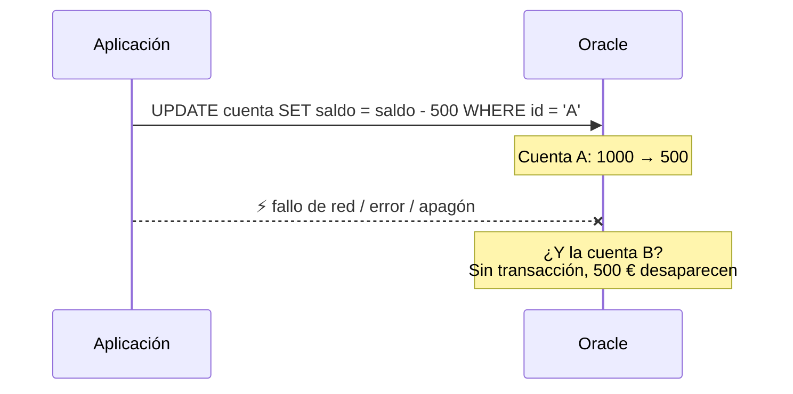
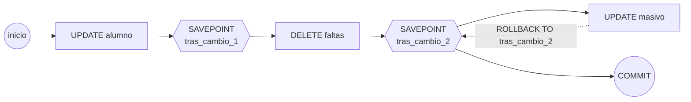

# UD08 · Manipulación de datos y transacciones

## Resumen del tema

Una base de datos está viva: cada día se matriculan alumnos, se ponen notas, se corrigen errores y se dan de baja registros. En esta unidad aprenderás a **modificar** la información con las sentencias `INSERT`, `UPDATE`, `DELETE` y `MERGE`, y a hacerlo de forma **segura** mediante **transacciones**: grupos de operaciones que se confirman o se deshacen juntas. También verás qué ocurre cuando **varios usuarios** modifican los mismos datos a la vez y cómo los **bloqueos** de Oracle protegen la integridad y la consistencia de la información.



### Objetivos de aprendizaje

Al terminar esta unidad serás capaz de:

- Identificar las herramientas y sentencias para modificar datos.
- Insertar, modificar y borrar filas, también a partir de subconsultas.
- Guardar en una tabla el resultado de una consulta.
- Diseñar guiones de sentencias para tareas complejas.
- Explicar el funcionamiento de las transacciones y sus propiedades ACID.
- Confirmar y deshacer total o parcialmente una transacción.
- Reconocer los problemas de concurrencia y los efectos de los bloqueos.
- Adoptar medidas para mantener la integridad y la consistencia de los datos.

> [!CAUTION]
> Las sentencias de esta unidad **cambian datos**. Trabaja siempre sobre tu copia de EDUGEST y recuerda que puedes volver al estado inicial ejecutando de nuevo los scripts 01 y 02 del [proyecto](/guia/proyecto-edugest#4-scripts-descargables).

---

## 1. Herramientas para modificar datos

| Herramienta | Cuándo usarla | Precaución |
|---|---|---|
| **Sentencias SQL** (`INSERT`, `UPDATE`, `DELETE`, `MERGE`) en un script | Siempre que el cambio deba poder repetirse, revisarse o documentarse | Prueba antes el `WHERE` con un `SELECT` |
| **Rejilla de datos** de SQL Developer (pestaña *Datos* de una tabla) | Correcciones puntuales de pocas filas | Los cambios no se guardan hasta pulsar *Confirmar* (`F11`) |
| **Asistente de importación** (clic derecho en la tabla → *Importar datos*) | Cargar ficheros CSV o Excel | Revisa la correspondencia de columnas y el formato de fechas |
| **SQL\*Loader** y tablas externas | Cargas masivas profesionales | Requieren un fichero de control |

> [!TIP]
> **Antes de un `UPDATE` o un `DELETE`, ejecuta un `SELECT` con el mismo `WHERE`.** Si el `SELECT` devuelve las filas que esperas (y cuántas), cambia `SELECT *` por la modificación. Es el hábito que más errores evita.

---

## 2. Insertar filas: INSERT

### 2.1 Sintaxis y componentes

```sql
INSERT INTO tabla [(columna1, columna2, ...)]
VALUES (valor1, valor2, ...);
```



```sql
INSERT INTO alumno (nia, nombre, apellidos, fecha_nacimiento, localidad, cod_grupo)
VALUES ('10452001', 'Marina', 'López Ortega', DATE '2007-03-14', 'Alicante', '1DAM');
```

| Elemento | Significado |
|---|---|
| `INSERT INTO alumno` | Tabla en la que se inserta |
| `(nia, nombre, ...)` | Lista de columnas. Las que **no** aparecen reciben su valor por defecto o `NULL` |
| `VALUES (...)` | Un valor por columna, **en el mismo orden** que la lista |
| `id_alumno` (omitida) | Es una columna identidad: Oracle genera el valor (1001, 1002...) |
| `DATE '2007-03-14'` | Literal de fecha, independiente de la configuración de la sesión |

> [!WARNING]
> `INSERT INTO alumno VALUES (...)` **sin lista de columnas** obliga a dar un valor para **todas** las columnas en el orden en que se crearon. Si alguien añade una columna a la tabla, el `INSERT` deja de funcionar. Escribe siempre la lista de columnas.

### 2.2 Varias filas a la vez


{}
```sql
INSERT INTO ciclo (cod_ciclo, nombre, grado, horas_totales)
VALUES ('IA',  'Inteligencia Artificial y Big Data', 'SUPERIOR', 600),
       ('CIB', 'Ciberseguridad en Entornos TI',      'SUPERIOR', 720);
```
{}
{}
```sql
INSERT ALL
    INTO ciclo (cod_ciclo, nombre, grado, horas_totales) VALUES ('IA',  'Inteligencia Artificial y Big Data', 'SUPERIOR', 600)
    INTO ciclo (cod_ciclo, nombre, grado, horas_totales) VALUES ('CIB', 'Ciberseguridad en Entornos TI',      'SUPERIOR', 720)
SELECT * FROM dual;
```
{}


### 2.3 Insertar el resultado de una consulta (RA4.c)

`INSERT ... SELECT` inserta **todas las filas** que devuelve una consulta. No lleva `VALUES`.

```sql
-- Matricular a Marina (id 1001) en todos los módulos de 1º de DAM para 2026-27
INSERT INTO matricula (id_alumno, id_modulo, curso_academico, fecha_matricula, convocatoria)
SELECT 1001, id_modulo, '2026-27', DATE '2026-09-10', 1
FROM   modulo
WHERE  cod_ciclo = 'DAM' AND curso = 1;
-- 5 filas insertadas
```

Para crear una **tabla nueva** a partir de una consulta se usa `CREATE TABLE ... AS SELECT` (CTAS), muy útil para copias de seguridad rápidas antes de un cambio delicado:

```sql
CREATE TABLE matricula_copia_20261006 AS
SELECT * FROM matricula;
```

> [!NOTE]
> CTAS copia los datos y las restricciones `NOT NULL`, pero **no** copia la clave primaria, las claves ajenas, los `CHECK`, los índices ni los valores por defecto. Es una copia de datos, no de diseño.

---

## 3. Modificar filas: UPDATE

### 3.1 Sintaxis

```sql
UPDATE tabla
SET    columna1 = expresión1 [, columna2 = expresión2 ...]
[WHERE condición];
```

```sql
-- Corregir el teléfono de un alumno
UPDATE alumno
SET    telefono = '612345678'
WHERE  id_alumno = 4;
-- 1 fila actualizada

-- Las horas de los módulos de 2º de DAW aumentan un 10 %
UPDATE modulo
SET    horas = ROUND(horas * 1.10)
WHERE  cod_ciclo = 'DAW' AND curso = 2;
-- 4 filas actualizadas
```

> [!CAUTION]
> **Un `UPDATE` sin `WHERE` modifica todas las filas de la tabla.** `UPDATE matricula SET nota_final = 5;` aprueba a todo el centro. Si te ocurre, **no** ejecutes nada más y haz `ROLLBACK` inmediatamente (apartado 6).

### 3.2 Subconsultas en UPDATE

Las subconsultas pueden aparecer en el `WHERE` (para decidir **qué** filas cambian) y en el `SET` (para calcular **el nuevo valor**).

```sql
-- Asignar como tutor de 2ASIR al profesor de Informática que no imparte clase
UPDATE grupo
SET    id_tutor = (SELECT p.id_profesor
                   FROM   profesor p
                   WHERE  p.id_departamento = 1
                   AND    NOT EXISTS (SELECT 1 FROM imparte i WHERE i.id_profesor = p.id_profesor))
WHERE  cod_grupo = '2ASIR';
-- 1 fila actualizada (id_tutor = 108)

-- Subir a 5 las notas de Bases de datos de DAM comprendidas entre 4,5 y 5 (sesión de evaluación)
UPDATE matricula
SET    nota_final = 5
WHERE  nota_final >= 4.5 AND nota_final < 5
AND    id_modulo = (SELECT id_modulo FROM modulo WHERE codigo = '0484' AND cod_ciclo = 'DAM');
-- 2 filas actualizadas
```

> [!WARNING]
> Si la subconsulta del `SET` devuelve **varias filas**, el `UPDATE` falla con `ORA-01427`. Si no devuelve **ninguna**, la columna se pone a `NULL`. Comprueba siempre la subconsulta por separado.

---

## 4. Borrar filas: DELETE

```sql
DELETE FROM tabla [WHERE condición];
```

```sql
-- Borrar las faltas justificadas anteriores al 1 de noviembre de 2025
DELETE FROM falta_asistencia
WHERE  justificada = 'S' AND fecha < DATE '2025-11-01';
-- 5 filas suprimidas

-- Borrar alumnado sin grupo y sin ninguna matrícula
DELETE FROM alumno a
WHERE  a.cod_grupo IS NULL
AND    NOT EXISTS (SELECT 1 FROM matricula m WHERE m.id_alumno = a.id_alumno);
```

### 4.1 Borrado e integridad referencial

El efecto de un `DELETE` sobre una fila referenciada depende de la clave ajena (UD05):

| Clave ajena hacia la fila borrada | Resultado |
|---|---|
| Sin opción | El `DELETE` falla: `ORA-02292: integrity constraint violated - child record found` |
| `ON DELETE CASCADE` | Se borran también las filas hijas (y las hijas de estas, si también tienen `CASCADE`) |
| `ON DELETE SET NULL` | Las filas hijas se conservan con la clave ajena a `NULL` |

En EduGest, `DELETE FROM alumno WHERE id_alumno = 1;` borra el alumno, sus **5 matrículas** (`fk_matricula_alumno` tiene `CASCADE`) y las **3 faltas** de esas matrículas (`fk_falta_matricula` también tiene `CASCADE`). Una sola sentencia borra 9 filas de 3 tablas.

### 4.2 DELETE frente a TRUNCATE

| | `DELETE FROM t` | `TRUNCATE TABLE t` |
|---|---|---|
| Tipo | DML | DDL |
| Filas | Todas o las que cumplan el `WHERE` | Todas |
| ¿Se puede deshacer? | Sí, con `ROLLBACK` | No (`COMMIT` implícito) |
| Triggers de borrado (UD09) | Se disparan | No se disparan |
| Velocidad en tablas grandes | Lenta (genera información de deshacer por cada fila) | Muy rápida |

---

## 5. Insertar o actualizar: MERGE

`MERGE` compara una tabla **origen** con una tabla **destino** y, para cada fila, **actualiza** si ya existe o **inserta** si no. Es la herramienta para sincronizar datos o cargar ficheros que pueden traer filas nuevas y filas modificadas (*upsert*).

```sql
-- Tabla de carga con las notas que envía el profesorado desde una hoja de cálculo
CREATE TABLE carga_notas (
    id_matricula NUMBER(8),
    nota         NUMBER(4,2)
);
INSERT INTO carga_notas VALUES (10006, 6.5);
INSERT INTO carga_notas VALUES (10007, 5);

MERGE INTO matricula m
USING carga_notas c
ON (m.id_matricula = c.id_matricula)
WHEN MATCHED THEN
    UPDATE SET m.nota_final = c.nota
    WHERE m.nota_final IS NULL OR m.nota_final <> c.nota;
-- 2 filas fusionadas
```

| Cláusula | Efecto |
|---|---|
| `MERGE INTO destino USING origen ON (condición)` | Empareja las filas de origen y destino |
| `WHEN MATCHED THEN UPDATE ...` | Si la fila existe en el destino, la actualiza |
| `WHEN NOT MATCHED THEN INSERT ...` | Si no existe, la inserta |
| `DELETE WHERE ...` (dentro de `MATCHED`) | Borra las filas emparejadas que cumplan la condición (extensión de Oracle) |

---

## 6. Transacciones

### 6.1 El problema: operaciones que no pueden quedarse a medias

Una **transferencia bancaria** de 500 € consiste en **dos** modificaciones:



Si el sistema falla entre las dos, el dinero desaparece. Una **transacción** es una secuencia de operaciones que el SGBD trata como **una unidad indivisible**: o se aplican **todas** o **ninguna**.

### 6.2 Propiedades ACID

| Propiedad | Significado | En la transferencia |
|---|---|---|
| **Atomicidad** | Todo o nada | No puede restarse en A sin sumarse en B |
| **Consistencia** | La base de datos pasa de un estado válido a otro estado válido | La suma de los saldos no cambia y se cumplen las restricciones (saldo ≥ 0) |
| **Aislamiento** (*Isolation*) | Las transacciones concurrentes no ven los cambios a medias de las demás | Nadie ve A con 500 y B todavía sin sumar |
| **Durabilidad** | Lo confirmado sobrevive a cualquier fallo | Tras el `COMMIT`, aunque se apague el servidor, la transferencia está hecha |

### 6.3 Transacciones en Oracle



En Oracle **no existe** una orden para empezar una transacción: comienza automáticamente con la **primera sentencia DML** y termina con:

| Fin de la transacción | Cómo |
|---|---|
| **Confirmación explícita** | `COMMIT;` |
| **Anulación explícita** | `ROLLBACK;` |
| **Confirmación implícita** | Cualquier sentencia DDL o DCL (`CREATE`, `ALTER`, `GRANT`...) y salir normalmente del cliente |
| **Anulación implícita** | Caída de la sesión o del servidor |

```sql
CREATE TABLE cuenta (
    id_cuenta  CHAR(1)       CONSTRAINT pk_cuenta PRIMARY KEY,
    titular    VARCHAR2(50)  NOT NULL,
    saldo      NUMBER(12,2)  NOT NULL CONSTRAINT ck_cuenta_saldo CHECK (saldo >= 0)
);
INSERT INTO cuenta VALUES ('A', 'Asociación de alumnado', 1000);
INSERT INTO cuenta VALUES ('B', 'Viaje de fin de curso',   200);
COMMIT;

-- Transferencia de 500 € de A a B
UPDATE cuenta SET saldo = saldo - 500 WHERE id_cuenta = 'A';   -- 1 fila
UPDATE cuenta SET saldo = saldo + 500 WHERE id_cuenta = 'B';   -- 1 fila
COMMIT;                                                        -- ambos cambios, definitivos
```

Si la segunda sentencia fallara (o afectara a 0 filas porque la cuenta B no existe), se ejecuta `ROLLBACK` y **ninguna** de las dos se aplica.

> [!IMPORTANT]
> **Atomicidad de sentencia.** Si una sentencia falla (por ejemplo, porque el saldo quedaría negativo y salta `ck_cuenta_saldo`), Oracle deshace **solo esa sentencia**, no la transacción completa. Las sentencias anteriores de la transacción siguen pendientes. La aplicación debe decidir si hace `ROLLBACK` de todo. En la UD09 lo automatizaremos con excepciones.

> [!WARNING]
> **Confirmación automática en los clientes.** SQL Developer y SQLcl **no** confirman automáticamente por defecto: tus cambios no son visibles para otras sesiones hasta el `COMMIT`. Pero muchas librerías de programación (JDBC en Java, por ejemplo) **sí** trabajan en modo *autocommit* por defecto. Al desarrollar una aplicación, desactívalo cuando necesites transacciones de varias sentencias.

### 6.4 Deshacer parcialmente: SAVEPOINT

Un **punto de salvaguarda** marca una posición dentro de la transacción a la que se puede volver sin perder lo anterior (RA4.f).

```sql
UPDATE alumno SET localidad = 'Alicante' WHERE id_alumno = 2;     -- cambio 1
SAVEPOINT tras_cambio_1;
DELETE FROM falta_asistencia WHERE id_matricula = 10044;           -- cambio 2 (2 filas)
SAVEPOINT tras_cambio_2;
UPDATE matricula SET nota_final = 10;                              -- ¡ERROR: sin WHERE! (143 filas)

ROLLBACK TO SAVEPOINT tras_cambio_2;   -- deshace solo el UPDATE masivo
COMMIT;                                -- confirma los cambios 1 y 2
```



### 6.5 Recuperar datos confirmados por error: Flashback Query

Si ya has hecho `COMMIT`, `ROLLBACK` no sirve. Oracle permite **consultar** los datos tal como estaban hace un tiempo (mientras la información de deshacer siga disponible):

```sql
SELECT nota_final FROM matricula AS OF TIMESTAMP (SYSTIMESTAMP - INTERVAL '10' MINUTE)
WHERE  id_matricula = 10001;
```

Es una herramienta de **emergencia**, no un sustituto de las copias de seguridad.

---

## 7. Concurrencia

### 7.1 Problemas del acceso concurrente

Cuando varias sesiones modifican los mismos datos a la vez pueden aparecer estos problemas:

| Problema | Qué ocurre | Ejemplo en EduGest |
|---|---|---|
| **Actualización perdida** (*lost update*) | Dos sesiones leen un valor, lo modifican y la última escritura borra la primera | Dos profesores corrigen la misma nota a la vez desde la aplicación |
| **Lectura sucia** (*dirty read*) | Se lee un cambio que todavía no se ha confirmado (y que puede deshacerse) | Jefatura ve una nota que el profesor finalmente no confirma |
| **Lectura no repetible** | La misma consulta, dentro de una transacción, devuelve valores distintos | Al imprimir un acta, la nota cambia entre la primera y la segunda página |
| **Lectura fantasma** | Una consulta repetida devuelve filas nuevas | Al contar alumnos, aparece una matrícula que se acaba de insertar |

### 7.2 Cómo resuelve Oracle la concurrencia

Oracle usa **consistencia de lectura multiversión**:

- **Las lecturas nunca bloquean** y **nunca son bloqueadas**. Una consulta ve los datos **confirmados en el instante en que empezó**, aunque otras sesiones los estén modificando. Oracle reconstruye la versión anterior con la información de deshacer (*undo*). Por eso **no existen las lecturas sucias** en Oracle.
- **Las escrituras bloquean la fila** que modifican hasta el `COMMIT` o el `ROLLBACK`. Si otra sesión intenta modificar la **misma fila**, **espera**.

| Nivel de aislamiento | Evita | En Oracle |
|---|---|---|
| `READ UNCOMMITTED` | — | No existe |
| `READ COMMITTED` | Lecturas sucias | **Por defecto** (consistencia a nivel de sentencia) |
| `REPEATABLE READ` | + lecturas no repetibles | No existe como tal |
| `SERIALIZABLE` | + lecturas fantasma | `SET TRANSACTION ISOLATION LEVEL SERIALIZABLE;` |
| *Read only* | Toda la transacción ve una única foto de los datos | `SET TRANSACTION READ ONLY;` (ideal para informes) |

### 7.3 Bloqueos

| Bloqueo | Cuándo se produce | Efecto |
|---|---|---|
| **De fila** (TX) | Automáticamente con `INSERT`, `UPDATE`, `DELETE`, `MERGE` | Otras sesiones no pueden modificar esa fila hasta el fin de la transacción |
| **Explícito de fila** | `SELECT ... FOR UPDATE` | Bloquea las filas leídas para modificarlas después |
| **De tabla** (TM) | Automáticamente con DML (modo compartido) o con `LOCK TABLE ... IN EXCLUSIVE MODE` | Impide cambios de estructura mientras hay DML, o cualquier DML en modo exclusivo |

**Bloqueo pesimista: `SELECT ... FOR UPDATE`.** Se bloquean las filas **al leerlas** porque se va a modificar a partir de su valor:

```sql
SELECT saldo FROM cuenta WHERE id_cuenta = 'A' FOR UPDATE;            -- espera si está bloqueada
SELECT saldo FROM cuenta WHERE id_cuenta = 'A' FOR UPDATE NOWAIT;     -- error ORA-00054 si está bloqueada
SELECT saldo FROM cuenta WHERE id_cuenta = 'A' FOR UPDATE WAIT 5;     -- espera como máximo 5 segundos
```

**Bloqueo optimista.** No se bloquea al leer; al escribir se comprueba que el dato **no ha cambiado** desde que se leyó (con una columna de versión o comparando el valor anterior). Es la estrategia habitual en aplicaciones web, donde el usuario puede tardar minutos entre leer y guardar:

```sql
UPDATE matricula
SET    nota_final = 7
WHERE  id_matricula = 10001
AND    nota_final = 8.75;    -- valor que leyó la aplicación
-- 0 filas → alguien la cambió antes: avisar al usuario en lugar de sobrescribir
```

### 7.4 Interbloqueos (*deadlocks*)

Un **interbloqueo** ocurre cuando dos sesiones se esperan mutuamente:

| Tiempo | Sesión 1 | Sesión 2 |
|---|---|---|
| t1 | `UPDATE cuenta ... WHERE id_cuenta = 'A';` (bloquea A) | |
| t2 | | `UPDATE cuenta ... WHERE id_cuenta = 'B';` (bloquea B) |
| t3 | `UPDATE cuenta ... WHERE id_cuenta = 'B';` → **espera** a la sesión 2 | |
| t4 | | `UPDATE cuenta ... WHERE id_cuenta = 'A';` → **espera** a la sesión 1 |
| t5 | Oracle detecta el ciclo y cancela la **sentencia** de una de las dos con `ORA-00060: deadlock detected` | |

Para evitarlos: accede a las filas **siempre en el mismo orden** (por ejemplo, por clave primaria), mantén las transacciones **cortas** y no esperes la intervención del usuario con filas bloqueadas.

### 7.5 Observar los bloqueos

```sql
-- Como SYSTEM: sesiones que están esperando a otra
SELECT sid, username, blocking_session, event, seconds_in_wait
FROM   v$session
WHERE  blocking_session IS NOT NULL;
```

---

## 8. Integridad y consistencia de la información

Las medidas para mantener la integridad y la consistencia (RA4.h) se combinan:

| Medida | Protege frente a | Unidad |
|---|---|---|
| Restricciones (`PK`, `FK`, `UNIQUE`, `CHECK`, `NOT NULL`) | Datos inválidos, huérfanos o duplicados | UD05 |
| Transacciones | Operaciones a medias | UD08 |
| Bloqueos y niveles de aislamiento | Interferencias entre sesiones | UD08 |
| Restricciones **diferidas** | Estados intermedios inválidos dentro de una transacción | UD08 |
| Triggers y procedimientos | Reglas de negocio complejas | UD09 |
| Privilegios y vistas | Modificaciones no autorizadas | UD05 |
| Copias de seguridad y *flashback* | Errores humanos y desastres | UD05, UD08 |

**Restricciones diferidas.** Normalmente cada restricción se comprueba al final de **cada sentencia**. Una restricción `DEFERRABLE INITIALLY DEFERRED` se comprueba al hacer **`COMMIT`**. Es útil, por ejemplo, para insertar dos filas que se referencian mutuamente:

```sql
ALTER TABLE departamento DROP CONSTRAINT fk_departamento_jefe;
ALTER TABLE departamento ADD CONSTRAINT fk_departamento_jefe
    FOREIGN KEY (id_jefe) REFERENCES profesor (id_profesor)
    DEFERRABLE INITIALLY DEFERRED;

-- Ahora puede insertarse el departamento con su jefe ANTES que el profesor
INSERT INTO departamento (id_departamento, nombre, id_jefe) VALUES (6, 'Química', 113);
INSERT INTO profesor (id_profesor, dni, nombre, apellidos, email, id_departamento)
VALUES (113, '12345678Z', 'Rosa', 'Martí Pla', 'rmarti@edugest.es', 6);
COMMIT;   -- aquí se comprueba la clave ajena: correcto
```

---

## 9. Guiones para tareas complejas

Un **guion** (*script*) agrupa sentencias para realizar una tarea completa (RA4.d). Un guion profesional:

1. Empieza con un comentario que describe la tarea, el autor, la fecha y los requisitos.
2. **Comprueba el estado inicial** con consultas (cuántas filas se van a ver afectadas).
3. Ejecuta las modificaciones en **una transacción**.
4. **Verifica el resultado** antes de confirmar.
5. Si algo falla, se detiene y deshace.

En SQLcl y SQL\*Plus, la orden `WHENEVER SQLERROR EXIT ROLLBACK` hace que el guion termine y deshaga los cambios al primer error:

```sql
-- =============================================================
-- Guion: baja del alumnado sin grupo ni matrícula
-- Ejecutar con: sql edugest/...@//localhost:1521/FREEPDB1 @baja_sin_grupo.sql
-- =============================================================
WHENEVER SQLERROR EXIT SQL.SQLCODE ROLLBACK
SET FEEDBACK ON

PROMPT Alumnado afectado:
SELECT id_alumno, nombre, apellidos FROM alumno a
WHERE  cod_grupo IS NULL
AND    NOT EXISTS (SELECT 1 FROM matricula m WHERE m.id_alumno = a.id_alumno);

CREATE TABLE alumno_baja AS SELECT * FROM alumno WHERE 1 = 0;   -- tabla vacía con la misma estructura

INSERT INTO alumno_baja
SELECT * FROM alumno a
WHERE  cod_grupo IS NULL
AND    NOT EXISTS (SELECT 1 FROM matricula m WHERE m.id_alumno = a.id_alumno);

DELETE FROM alumno a
WHERE  cod_grupo IS NULL
AND    NOT EXISTS (SELECT 1 FROM matricula m WHERE m.id_alumno = a.id_alumno);

COMMIT;
PROMPT Baja completada.
```

> [!NOTE]
> Observa que el `CREATE TABLE` se hace **antes** de las modificaciones: como es DDL, provoca un `COMMIT` implícito. Si estuviera en medio, partiría la transacción en dos y el `ROLLBACK` del final ya no podría deshacer la primera parte.

---

## 10. Errores frecuentes

| Error | Consecuencia | Prevención |
|---|---|---|
| `UPDATE` o `DELETE` sin `WHERE` | Se modifican todas las filas | Probar antes el `WHERE` con `SELECT`; trabajar con transacciones |
| Olvidar el `COMMIT` | Los cambios se pierden al cerrar mal la sesión y bloquean filas a otros usuarios | Confirmar al terminar cada tarea |
| DDL en mitad de una transacción | `COMMIT` implícito: ya no se puede deshacer | Separar DDL y DML en los guiones |
| `INSERT` sin lista de columnas | Falla cuando cambia la tabla | Escribir siempre las columnas |
| Subconsulta en `SET` que devuelve 0 filas | La columna queda a `NULL` sin aviso | Comprobar la subconsulta antes |
| Transacciones largas con filas bloqueadas | Otras sesiones esperan | Transacciones cortas; nunca esperar al usuario |

---

## 11. Resumen

- `INSERT` añade filas (también desde una consulta con `INSERT ... SELECT`), `UPDATE` las modifica, `DELETE` las borra y `MERGE` inserta o actualiza según existan.
- Una **transacción** es una unidad de trabajo atómica. En Oracle empieza con el primer DML y termina con `COMMIT`, `ROLLBACK` o una sentencia DDL.
- `SAVEPOINT` permite deshacer parcialmente.
- Las propiedades **ACID** garantizan que las transacciones sean fiables.
- Oracle evita las lecturas sucias con consistencia multiversión. Las escrituras bloquean filas; `SELECT ... FOR UPDATE` bloquea al leer; los interbloqueos se evitan accediendo en el mismo orden.
- La integridad y la consistencia se garantizan combinando restricciones, transacciones, bloqueos y, en la UD09, código en el servidor.

---

## 12. Autoevaluación


- q: "¿Qué ocurre con las columnas que no aparecen en la lista de un INSERT?"
  options: ["Se produce un error", "Reciben su valor por defecto o NULL", "Toman el valor de la fila anterior", "Reciben 0"]
  answer: 1
  explain: "Las columnas omitidas reciben el `DEFAULT` definido o, si no lo hay, `NULL`. Si alguna es NOT NULL sin DEFAULT, el INSERT falla."
- q: "¿Qué sentencia inserta en una tabla el resultado de una consulta?"
  options: ["INSERT INTO t VALUES (SELECT ...)", "INSERT INTO t SELECT ...", "UPDATE t SET (SELECT ...)", "MERGE t SELECT ..."]
  answer: 1
  explain: "`INSERT ... SELECT` no lleva VALUES: inserta todas las filas que devuelve la consulta."
- q: "Ejecutas un UPDATE, después un CREATE INDEX y después ROLLBACK. ¿Qué pasa con el UPDATE?"
  options: ["Se deshace", "Ya estaba confirmado por el COMMIT implícito del DDL", "Queda pendiente", "Se deshace también el índice"]
  answer: 1
  explain: "Toda sentencia DDL confirma la transacción en curso. El ROLLBACK posterior no tiene nada que deshacer."
- q: "En una transacción, la tercera sentencia falla por una restricción CHECK. ¿Qué deshace Oracle automáticamente?"
  options: ["Toda la transacción", "Solo la sentencia que ha fallado", "Nada", "Las dos sentencias anteriores"]
  answer: 1
  explain: "Oracle garantiza la atomicidad de **sentencia**: deshace la que ha fallado. Las anteriores siguen pendientes de COMMIT o ROLLBACK."
- q: "¿Para qué sirve SAVEPOINT?"
  options: ["Para confirmar una parte de la transacción", "Para marcar un punto al que se puede volver con ROLLBACK TO", "Para hacer una copia de seguridad", "Para bloquear una tabla"]
  answer: 1
  explain: "Permite deshacer parcialmente: `ROLLBACK TO SAVEPOINT nombre` deshace lo posterior al punto y mantiene lo anterior pendiente."
- q: "La sesión A actualiza una fila y no confirma. La sesión B hace SELECT de esa fila. ¿Qué ve B en Oracle?"
  options: ["El valor nuevo", "El valor confirmado anterior", "B queda bloqueada hasta que A confirme", "Un error"]
  answer: 1
  explain: "Oracle nunca bloquea las lecturas ni permite lecturas sucias: B ve la última versión **confirmada**."
- q: "La sesión A actualiza una fila sin confirmar. La sesión B intenta actualizar la misma fila. ¿Qué ocurre?"
  options: ["B sobrescribe el cambio de A", "B espera hasta que A haga COMMIT o ROLLBACK", "Se produce un deadlock inmediato", "B recibe ORA-00060"]
  answer: 1
  explain: "La fila está bloqueada por A. B espera (salvo que use NOWAIT o WAIT n)."
- q: "¿Qué estrategia es más adecuada para una aplicación web donde el usuario tarda minutos en editar una nota?"
  options: ["SELECT FOR UPDATE al abrir el formulario", "Bloqueo optimista: comprobar al guardar que el valor no ha cambiado", "LOCK TABLE en modo exclusivo", "Desactivar las transacciones"]
  answer: 1
  explain: "Mantener filas bloqueadas mientras el usuario piensa bloquearía a los demás. El bloqueo optimista detecta el conflicto al guardar."
- q: "¿Cómo se evitan la mayoría de los interbloqueos?"
  options: ["Usando SERIALIZABLE", "Accediendo a las filas siempre en el mismo orden y con transacciones cortas", "Haciendo COMMIT después de cada SELECT", "Desactivando los bloqueos"]
  answer: 1
  explain: "El interbloqueo aparece cuando dos sesiones bloquean recursos en orden inverso. Un orden común y transacciones cortas lo evitan."


## Referencias

- [Oracle AI Database 26ai: SQL Language Reference, *INSERT*, *UPDATE*, *DELETE*, *MERGE*](https://docs.oracle.com/en/database/oracle/oracle-database/26/sqlrf/).
- [Oracle AI Database 26ai: Database Concepts, *Transactions* y *Data Concurrency and Consistency*](https://docs.oracle.com/en/database/oracle/oracle-database/26/cncpt/).
- [Curso de Bases de Datos de F. M. García: módulos 34 y 35](https://fmgarcia.github.io/CursosGithubIO/CursoBasesDatos/).
