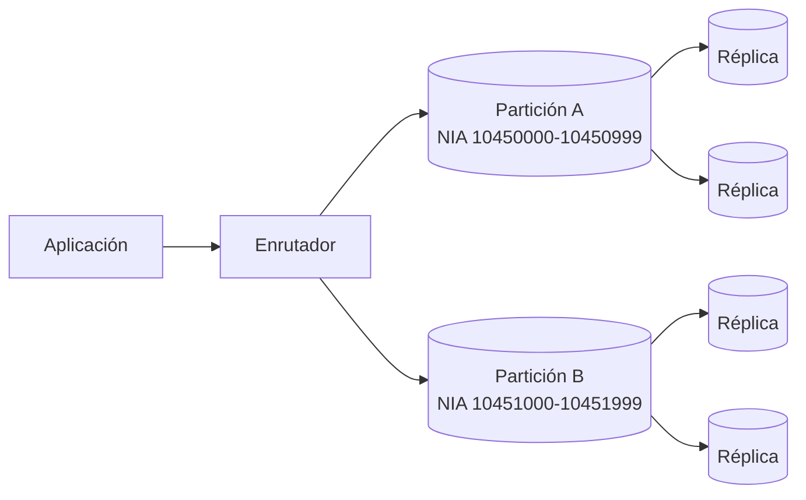
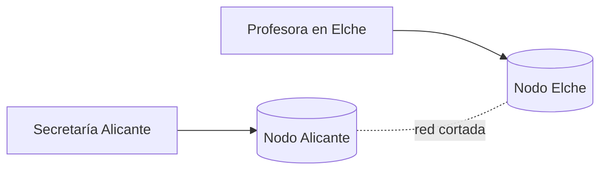
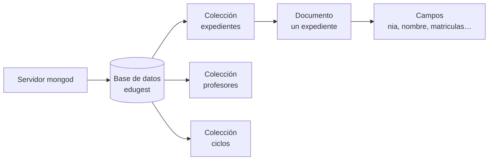
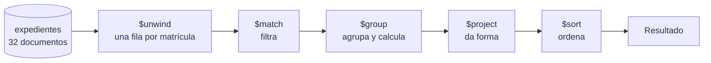
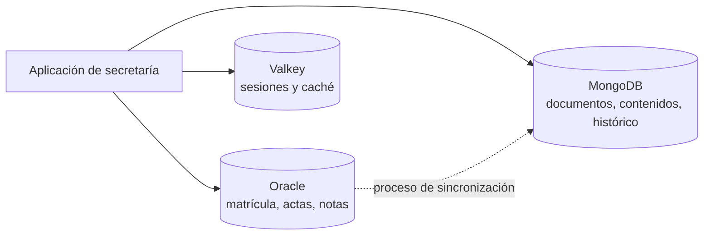

# UD10 · Bases de datos no relacionales (NoSQL)

## Resumen del tema

Durante nueve unidades has trabajado con un único modelo de datos: el **relacional**. Has aprendido a analizar requisitos, dibujar un diagrama entidad/relación, normalizar, crear tablas con restricciones, consultar, modificar datos dentro de transacciones y programar el propio servidor. Esta última unidad no viene a desmontar nada de eso: viene a **ampliar el mapa**. Existen familias de sistemas gestores que renuncian deliberadamente a algunas garantías del modelo relacional para conseguir otras cosas (esquema flexible, escalado horizontal, latencia muy baja), y un profesional debe saber **cuándo merece la pena ese intercambio**.

El término **NoSQL** agrupa a esos sistemas. Estudiaremos las cuatro grandes familias (clave-valor, documental, columnar y de grafos) y trabajaremos en profundidad una base de datos **documental**, **MongoDB Community Server 8.0**, porque es el tipo más cercano a lo que ya sabes y el más extendido en el desarrollo de aplicaciones. Para que la comparación sea honesta usaremos los **mismos datos** de siempre: una versión documental de EduGest con los 32 expedientes del curso 2025-26, de modo que cada consulta de MongoDB se pueda poner al lado de su equivalente en Oracle y comparar resultado a resultado.

El hilo conductor de la unidad no es la sintaxis de `mongosh`, sino el **criterio de elección**. En el currículo, el RA7 pide caracterizar estas bases de datos, evaluar sus tipos, identificar sus elementos y gestionar la información con las herramientas del gestor; en la práctica profesional, lo que se te va a pedir es justificar una decisión de arquitectura. Por eso la unidad termina con tres casos razonados y con una conclusión que conviene adelantar: **para la gestión académica de un centro, el modelo relacional sigue siendo la elección correcta**. Saber por qué es, exactamente, el objetivo del tema.

Enlaza con la **UD01** (modelos de datos, bases distribuidas, Big Data y protección de datos), con la **UD03** y la **UD04** (el modelo relacional y la normalización, que ahora servirán de contraste), con la **UD07** (los informes que vamos a reescribir con el *pipeline* de agregación) y con la **UD08** (transacciones y propiedades ACID, que aquí se discuten en un entorno distribuido).



### Objetivos de aprendizaje

Al terminar esta unidad serás capaz de:

- Caracterizar las bases de datos no relacionales y explicar qué problemas motivaron su aparición.
- Distinguir las propiedades ACID de las propiedades BASE y razonar el teorema CAP sobre un caso concreto.
- Evaluar los cuatro tipos principales de bases de datos NoSQL e identificar casos de uso adecuados para cada uno.
- Identificar los elementos de una base de datos documental: base de datos, colección, documento, campo, tipos BSON y `_id`.
- Utilizar `mongosh` y MongoDB Compass para gestionar la información almacenada.
- Realizar operaciones CRUD y consultas sobre subdocumentos y arrays, indicando su equivalente en SQL.
- Construir tuberías de agregación y compararlas con la consulta SQL que resuelve el mismo informe.
- Diseñar un modelo documental decidiendo de forma justificada qué información se incrusta y qué se referencia.
- Declarar validadores de esquema e índices, y comprobar su efecto.
- Elegir entre modelo relacional y NoSQL argumentando con criterios técnicos, no con modas.

### Temporalización

La unidad ocupa **7 horas de aula** (4 de teoría y 3 de práctica) y cierra el módulo.
Es una unidad de criterio profesional: importa más saber **cuándo** elegir cada modelo
que memorizar la sintaxis de `mongosh`.


items:
  - {h: 2, tipo: T, t: "Características de NoSQL, BASE y CAP, tipos de bases de datos y elementos de MongoDB", ref: "§1 a §4 · traductor SQL ↔ MongoDB"}
  - {h: 1, tipo: P, t: "Puesta en marcha de MongoDB y CRUD sobre los expedientes", ref: "Prácticas 10.1 y 10.2"}
  - {h: 1, tipo: T, t: "Operaciones CRUD, subdocumentos y arrays", ref: "§5 y §6"}
  - {h: 1, tipo: T, t: "Agregaciones", ref: "§7"}
  - {h: 1, tipo: P, t: "El mismo informe en SQL y en MongoDB", ref: "Práctica 10.4"}
  - {h: 1, tipo: P, t: "Modelado documental y decisión razonada", ref: "Prácticas 10.5 y 10.7 · §8 a §11"}
autonomo:
  - "Práctica 10.3 (operadores, subdocumentos y arrays)"
  - "Práctica 10.6 (otros modelos: clave-valor y grafos)"
  - "Proyecto EduGest · UD10 (el expediente documental)"


> [!IMPORTANT]
> Estudia esta unidad **en paralelo**: cada vez que aparezca una orden de `mongosh`, tapa la columna de la derecha y escribe tú la sentencia SQL equivalente. Si no sabes traducirla, es que no has entendido la orden. Y cuando una operación **no** tenga equivalente directo (en un sentido o en el otro), apunta por qué: ahí está la diferencia real entre los dos modelos, y ahí se decide una arquitectura.

---

NoSQL, BASE y CAP, tipos y elementos de MongoDB

## 1. Qué son las bases de datos NoSQL

### 1.1 El problema que vinieron a resolver

El modelo relacional se diseñó a principios de los años setenta para un escenario concreto: un volumen de datos moderado, una estructura conocida y estable, un servidor potente y la necesidad absoluta de que los datos fueran correctos. En ese escenario sigue siendo imbatible.

A partir de la segunda mitad de los años 2000, algunas empresas se encontraron con escenarios distintos:

1. **Volumen y velocidad.** Un portal con millones de usuarios simultáneos genera más escrituras de las que admite un único servidor, por grande que sea.
2. **Variabilidad del esquema.** En un catálogo de comercio electrónico, un portátil y un ratón no comparten características. Modelarlo con tablas obliga a una tabla por tipo de producto, a una tabla *entidad-atributo-valor* o a decenas de columnas casi siempre nulas.
3. **Datos semiestructurados.** Documentos JSON procedentes de API, registros de actividad, mensajes de dispositivos: información con forma de árbol que hay que trocear en varias tablas para guardarla y recomponer con `JOIN` para leerla.
4. **Escalado horizontal.** Resulta más barato y más tolerante a fallos repartir los datos entre veinte máquinas modestas que comprar una máquina veinte veces más potente.
5. **Desarrollo ágil.** Si el esquema cambia cada dos semanas, cada cambio implica un `ALTER TABLE` y una migración coordinada con el despliegue de la aplicación.

> [!NOTE]
> Fíjate en que **ninguno** de esos cinco problemas aparece en EduGest. La matrícula de un centro tiene un volumen pequeño, un esquema estable fijado por normativa, relaciones complejas y una exigencia máxima de integridad. Tenerlo claro desde el principio evita la conclusión equivocada de que NoSQL es «la versión moderna» de las bases de datos.

### 1.2 Qué significa realmente «NoSQL»

El nombre es desafortunado y tiene origen histórico: se usó como etiqueta de un encuentro técnico en 2009. Hoy se interpreta como **«Not only SQL»** («no solo SQL»), y conviene precisar qué afirma y qué no afirma:

| Lo que **no** significa | Lo que **sí** suele implicar |
|---|---|
| Que no exista un lenguaje de consulta | Que el lenguaje no es SQL estándar, sino propio del producto (y a veces se parece mucho: Cypher, CQL, el *pipeline* de MongoDB) |
| Que no haya esquema | Que el esquema **no lo impone el gestor por defecto**: lo impone la aplicación, o un validador que se declara aparte |
| Que no haya transacciones ni integridad | Que las garantías son configurables y suelen alcanzar a un solo documento o agregado, no a varias colecciones |
| Que sustituya al modelo relacional | Que **convive** con él: lo normal en una empresa es tener los dos (*persistencia políglota*, §11.4) |

> [!IMPORTANT]
> Una base de datos NoSQL no es una base de datos «sin reglas». Es una base de datos en la que **las reglas se trasladan de sitio**: del esquema declarativo del SGBD al código de la aplicación o a un validador explícito. Ese traslado tiene un coste que hay que decidir conscientemente.

### 1.3 Esquema flexible frente a esquema rígido

En Oracle, la estructura se declara antes de guardar nada: 

```sql
-- Hay que decidir ahora las columnas, los tipos y las restricciones
CREATE TABLE alumno (
    id_alumno         NUMBER(6)    PRIMARY KEY,
    nia               CHAR(8)      NOT NULL,
    nombre            VARCHAR2(40) NOT NULL,
    fecha_nacimiento  DATE         NOT NULL
);
-- Un INSERT sin fecha_nacimiento falla: ORA-01400
```

En MongoDB, la colección se crea al escribir el primer documento y **cada documento puede tener campos distintos**: 

```javascript
// Dos documentos de la misma colección, con forma diferente
db.expedientes.insertOne({ _id: 1, nia: "10450037", nombre: "Adrián", dni: "55568986C" })
db.expedientes.insertOne({ _id: 5, nia: "10450185", nombre: "Andrea" })   // sin dni: se acepta
```

Esta flexibilidad resuelve el problema 2 del apartado anterior, pero tiene consecuencias inmediatas:

- Una consulta puede devolver documentos a los que les falta el campo que esperabas. En Oracle el campo estaría presente con valor `NULL`; en MongoDB **no está**, y eso se consulta de otra forma (`$exists`, §5.2).
- Nadie impide guardar `nota: "siete"` en un documento y `nota: 7` en otro. La comparación `nota: { $gte: 5 }` ignorará el primero, porque MongoDB compara **por tipo** antes que por valor.
- El esquema sigue existiendo: está en la cabeza de quien programa y en el código. Si no se escribe en algún sitio (§9), se degrada en cuanto el equipo cambia.

> [!WARNING]
> «Esquema flexible» no es «esquema inexistente». En un proyecto serio, una colección de MongoDB lleva **validador `$jsonSchema`** (§9.1), igual que una tabla lleva restricciones. La diferencia es que en MongoDB es **opcional**, y por eso hay que acordarlo en el equipo.

### 1.4 La desnormalización como decisión de diseño

En la UD04 aprendiste a eliminar la redundancia porque provoca **anomalías**: el mismo dato guardado en dos sitios acaba siendo distinto en los dos sitios. Esa conclusión era correcta **para el modelo relacional**, donde recomponer la información con `JOIN` es barato.

En un sistema distribuido la situación cambia: un `JOIN` entre tablas repartidas en máquinas diferentes exige tráfico de red y coordinación. Por eso el modelado documental **incrusta** (duplica) información deliberadamente, de modo que lo que se lee junto se guarde junto y cada lectura toque un solo documento y una sola máquina.

| | Modelo relacional normalizado | Modelo documental desnormalizado |
|---|---|---|
| El nombre del módulo «Bases de datos» | Está **una vez** en `MODULO` | Se repite en **cada** matrícula de cada expediente |
| Corregir una errata en ese nombre | Un `UPDATE` de una fila | Un `updateMany` que recorre toda la colección |
| Leer el expediente completo de un alumno | `JOIN` de tres o cuatro tablas | Una lectura de un documento |
| Riesgo de incoherencia | Lo elimina el SGBD | Hay que evitarlo desde la aplicación |

> [!TIP]
> La pregunta que decide la duplicación es: **¿este dato cambia o es prácticamente inmutable?** El nombre de un módulo publicado en el BOE no cambiará durante el curso: duplicarlo es seguro. El tutor de un grupo sí puede cambiar: duplicarlo en 30 expedientes es un problema esperando a ocurrir.

### 1.5 Escalado, réplica y particionado

| Estrategia | En qué consiste | Límite |
|---|---|---|
| **Escalado vertical** (*scale up*) | Poner más CPU, más memoria o discos más rápidos en el **mismo** servidor | Hay un tope físico y el precio crece más rápido que la potencia; sigue habiendo un punto único de fallo |
| **Escalado horizontal** (*scale out*) | Repartir carga y datos entre **más** servidores (nodos) | Exige coordinación entre nodos; aparecen los problemas del §2 |

Sobre el escalado horizontal se construyen dos mecanismos que ya viste en la UD01 con otros nombres:

- **Réplica** (*replica set* en MongoDB): varios nodos guardan **una copia completa** de los datos. Uno es el **primario** y recibe las escrituras; los **secundarios** las replican. Mejora la disponibilidad (si cae el primario, se elige otro) y permite repartir lecturas.
- **Particionado** (*sharding*): los datos se **reparten** entre varios conjuntos de réplica según una **clave de partición** (*shard key*). Es la fragmentación horizontal de la UD01. Permite crecer sin límite teórico, pero elegir mal la clave concentra la carga en un solo nodo.



> [!NOTE]
> Oracle también escala horizontalmente (Oracle RAC, *Oracle Globally Distributed Database*). La diferencia no es que «SQL no escale», sino el **coste y la complejidad** de hacerlo manteniendo todas las garantías transaccionales entre nodos.

### 1.6 Qué se gana y qué se pierde

| Se gana | Se pierde |
|---|---|
| Esquema flexible: el modelo evoluciona sin migraciones costosas | Integridad referencial **declarativa**: no hay `FOREIGN KEY` entre colecciones |
| Lectura de un agregado completo en una sola operación | Composiciones (`JOIN`) naturales y baratas entre cualquier par de entidades |
| Escalado horizontal sencillo y tolerancia a fallos | Consultas *ad hoc* no previstas: el modelo está optimizado para los accesos que se diseñaron |
| Modelo de datos muy cercano a los objetos de la aplicación | Normalización automática contra anomalías de actualización |
| Latencias muy bajas en los accesos por clave | Madurez y estandarización: SQL es un estándar ISO; cada producto NoSQL tiene su propio lenguaje |
| Buen ajuste a datos semiestructurados o jerárquicos | Herramientas de informes, auditoría y administración menos uniformes |

{}
Es frecuente leer que NoSQL sirve para «datos no estructurados». Conviene matizar el vocabulario:

- **Estructurados:** encajan en filas y columnas de tipos conocidos (la matrícula de EduGest).
- **Semiestructurados:** tienen estructura, pero variable y autodescriptiva (JSON, XML). Es el terreno natural del modelo documental.
- **No estructurados:** imágenes, audio, vídeo, texto libre. Ninguna base de datos los *interpreta*: se guardan como binarios (o en un almacén de objetos) y lo que se indexa son sus **metadatos**, que vuelven a ser estructurados o semiestructurados.

Una base documental trabaja sobre todo con datos **semiestructurados**.
{}

---

## 2. Transacciones distribuidas: BASE y el teorema CAP

### 2.1 Recordatorio: ACID

En la UD08 definiste una transacción como una unidad de trabajo que cumple cuatro propiedades: **A**tomicidad (todo o nada), **C**onsistencia (se pasa de un estado válido a otro válido), **A**islamiento (las transacciones concurrentes no se estorban) y **D**urabilidad (lo confirmado sobrevive a una caída). Oracle las garantiza en un servidor sin que haya que pedirlo.

Mantener ACID **entre varias máquinas** es mucho más caro: cada confirmación exige que todos los nodos implicados se pongan de acuerdo (protocolos de consenso o de confirmación en dos fases), lo que añade latencia y, si un nodo no responde, bloquea la operación.

### 2.2 BASE: la alternativa pragmática

Frente a ACID, parte del mundo NoSQL adoptó un conjunto de propiedades deliberadamente más débiles, resumidas en el acrónimo **BASE**:

| Propiedad | Significado | Qué implica |
|---|---|---|
| **B**asically **A**vailable | Básicamente disponible | El sistema responde siempre, aunque la respuesta no sea la más actual o esté incompleta |
| **S**oft state | Estado blando | El estado de un nodo puede cambiar sin que haya escrituras nuevas, solo porque llega la replicación |
| **E**ventual consistency | Consistencia eventual | Si dejan de llegar escrituras, todos los nodos **acabarán** coincidiendo; mientras tanto, pueden discrepar |

El ejemplo clásico es un contador de «me gusta»: que durante dos segundos un usuario vea 1.034 y otro 1.035 no tiene ninguna consecuencia. El contraejemplo clásico es una nota de un acta oficial: que dos profesores vean notas distintas del mismo alumno es inadmisible.

### 2.3 El teorema CAP

Formulado por Eric Brewer y demostrado después formalmente, el **teorema CAP** afirma que un sistema distribuido no puede garantizar simultáneamente las tres propiedades siguientes:

- **C**onsistency (consistencia): toda lectura devuelve la escritura más reciente.
- **A**vailability (disponibilidad): toda petición recibe una respuesta no errónea.
- **P**artition tolerance (tolerancia a particiones): el sistema sigue funcionando aunque se pierdan mensajes entre nodos.

**Ejemplo concreto.** Imagina EduGest replicado en dos sedes, Alicante y Elche, y que se corta la fibra entre ellas. Una profesora en Elche intenta guardar la nota de un alumno:



El nodo de Elche solo puede hacer dos cosas:

1. **Aceptar** la escritura y propagarla cuando vuelva la red. El sistema sigue **disponible** (A), pero durante el corte Alicante lee una nota desactualizada: se ha sacrificado la **consistencia**.
2. **Rechazar** la escritura («no puedo garantizar que esto sea coherente, inténtalo más tarde»). Se mantiene la **consistencia** (C) a costa de la **disponibilidad**.

> [!IMPORTANT]
> Como en un sistema distribuido las particiones de red **ocurren** y no se pueden evitar, la **P** no es opcional. La elección real de diseño es entre **C y A durante la partición**. Los sistemas que priorizan C se llaman CP (MongoDB con su configuración por defecto, HBase); los que priorizan A se llaman AP (Cassandra, DynamoDB con lecturas eventuales). Un SGBD relacional en un único servidor **no está en el teorema**: sin varios nodos no hay particiones.

### 2.4 Qué implica la consistencia eventual para una aplicación

Si el sistema es eventualmente consistente, la aplicación debe asumir que:

- Puede **leer lo que acaba de escribir... o no**. Un usuario guarda su perfil, la pantalla siguiente lee de un nodo que todavía no lo tiene y parece que el cambio se ha perdido. Se mitiga con la lectura dirigida al nodo primario (*read your own writes*).
- Dos escrituras simultáneas en nodos distintos pueden **entrar en conflicto**, y alguien tiene que resolverlo: la última gana, se guardan las dos versiones, se fusionan por reglas de negocio...
- Las comprobaciones del tipo «no permitas dos matrículas del mismo alumno en el mismo módulo» **no se pueden delegar** en una restricción `UNIQUE` global sin coordinación entre nodos.

### 2.5 Matización imprescindible: NoSQL no significa «sin ACID»

La oposición «relacional = ACID, NoSQL = BASE» era razonable alrededor de 2010 y hoy es **inexacta**:

- **MongoDB admite transacciones ACID multidocumento desde la versión 4.0** (2018) en conjuntos de réplica, y desde la 4.2 también en clústeres particionados. En la 8.0 son una característica normal del producto.
- Además, y esto es anterior y más importante en el día a día, **toda operación de escritura sobre un único documento es atómica**, incluidos los subdocumentos y arrays que contenga. Buena parte de las transacciones que en el modelo relacional abarcan varias tablas desaparecen si la información que cambia junta está en el mismo documento.
- En el otro sentido, Oracle 23ai y 26ai incorporan tipo de datos `JSON`, índices sobre JSON y **vistas duales JSON-relacional**, con las que los mismos datos relacionales se leen y modifican como documentos. La frontera es cada vez más difusa.

```javascript
// Transacción multidocumento en mongosh (MongoDB 8.0)
const s = db.getMongo().startSession()
s.startTransaction()
try {
  const ex = s.getDatabase("edugest").expedientes
  ex.updateOne({ _id: 1 }, { $push: { matriculas: { modulo: { codigo: "0486" }, curso: "2026-27" } } })
  ex.updateOne({ _id: 1 }, { $inc: { creditosMatriculados: 12 } })
  s.commitTransaction()
} catch (e) {
  s.abortTransaction()
  print("Abortada: " + e.message)
} finally {
  s.endSession()
}
```

> [!TIP]
> Si al diseñar en MongoDB necesitas transacciones multidocumento **a menudo**, suele ser una señal de que el modelo documental no está bien planteado (o de que el problema es relacional). Úsalas como red de seguridad, no como herramienta de uso diario: tienen coste y límites de duración.


- q: "Durante un corte de red entre dos nodos, un sistema **AP** decide…"
  options: ["Rechazar las escrituras hasta recuperar la coordinación", "Aceptar las escrituras y reconciliar después, aunque haya lecturas desactualizadas", "Replicar los datos de forma sincrónica a todos los nodos", "Detenerse por completo hasta que el administrador intervenga"]
  answer: 1
  explain: "Un sistema AP prioriza la disponibilidad: responde siempre y asume consistencia eventual. La primera opción describe un sistema CP, que es lo que hace MongoDB con su configuración por defecto."
- q: "¿Es correcto decir que «MongoDB no tiene transacciones»?"
  options: ["Sí: ninguna base NoSQL puede ser ACID", "No: desde la versión 4.0 admite transacciones ACID multidocumento, y la escritura de un documento siempre fue atómica", "Sí, salvo que se active el modo relacional", "No, pero solo funcionan en una única colección"]
  answer: 1
  explain: "La atomicidad por documento existe desde el principio y las transacciones multidocumento están disponibles desde la 4.0 (4.2 en clústeres particionados). La afirmación «NoSQL = no ACID» está desactualizada."


---

## 3. Tipos de bases de datos NoSQL

### 3.1 Clave-valor

**Estructura.** Una tabla *hash* gigante y distribuida: una **clave** única y un **valor** opaco para el gestor (una cadena, un número, un binario o una estructura simple). El acceso por clave es prácticamente instantáneo; sin la clave, no hay forma eficiente de buscar.

**Producto de referencia:** **Valkey** (bifurcación libre de Redis, usada en la práctica 10.6), Redis, Amazon DynamoDB, etcd.

```text
SET  sesion:abc123 "id_alumno=1;rol=ALUMNO"
EXPIRE sesion:abc123 1800        # caducidad automática en 30 minutos
INCR visitas:portal              # incremento atómico
```

**Casos de uso reales:** sesiones de usuario de la secretaría virtual (con caducidad automática); caché de las consultas más pesadas de Oracle, para no repetirlas; contadores y limitadores de peticiones; colas de trabajos.

**Límites:** no se puede consultar por el contenido del valor («dame todos los alumnos de 1DAM» es imposible salvo que esa lista se haya guardado como otra clave); no hay relaciones ni informes; la mayoría de estos sistemas mantienen los datos en memoria, con persistencia opcional, de modo que no son el almacén principal de información que no se puede perder.

### 3.2 Documental

**Estructura.** Colecciones de **documentos** autodescriptivos con formato JSON (BSON en MongoDB), con campos anidados y arrays. Admite consultas por cualquier campo, índices secundarios y agregaciones.

**Producto de referencia:** **MongoDB** (el que usaremos), CouchDB, Amazon DocumentDB, Elasticsearch (orientado a búsqueda).

**Casos de uso reales:** catálogos de productos con características variables (práctica 10.5); expedientes, historiales y contenidos editoriales donde cada ficha tiene secciones distintas; perfiles de usuario y configuraciones de aplicación.

**Límites:** sin integridad referencial declarativa entre colecciones; las consultas que cruzan muchas colecciones son incómodas y más lentas que un `JOIN` bien indexado; el documento tiene un **límite de 16 MB**, lo que prohíbe incrustar colecciones que crecen sin fin (como las opiniones de un producto).

### 3.3 Columnar (familias de columnas)

**Estructura.** Filas identificadas por una **clave de partición** que se agrupan en *familias de columnas*; cada fila puede tener columnas distintas y el almacenamiento está orientado a la columna, lo que comprime muy bien y permite leer un rango enorme de una sola columna con muy poca entrada/salida. Las escrituras se añaden al final (*append*), por lo que son muy rápidas.

**Producto de referencia:** **Apache Cassandra**, HBase, ScyllaDB; en analítica, las bases de datos columnares puras como ClickHouse.

**Casos de uso reales:** series temporales y telemetría (sensores de CO₂ de las aulas midiendo cada 30 segundos, práctica 10.7); registros de actividad y auditoría a gran escala; sistemas de mensajería con escrituras masivas.

**Límites:** el modelo se diseña **a partir de las consultas** que se van a ejecutar, y consultar por un criterio no previsto puede ser inviable; no hay `JOIN`; los agregados y la unicidad se gestionan con mucho cuidado.

### 3.4 Grafos

**Estructura.** **Nodos** (entidades) y **aristas** (relaciones), ambos con propiedades. La relación es un elemento de primera clase, no una clave ajena: recorrer «amigos de mis amigos» no multiplica el coste como lo haría una cadena de `JOIN`.

**Producto de referencia:** **Neo4j** (con el lenguaje Cypher, práctica 10.6), ArangoDB, Amazon Neptune.

```text
MATCH (a:Alumno {nombre:'Adrián'})-[:MATRICULADO]->(m)<-[:MATRICULADO]-(c:Alumno)
RETURN DISTINCT c.nombre
```

**Casos de uso reales:** redes sociales y recomendaciones («quien estudió lo mismo que tú eligió…»); cálculo de rutas y logística; detección de fraude por patrones de relación; análisis de dependencias y de árboles de permisos.

**Límites:** mal ajuste para agregaciones masivas sobre todos los datos o para informes tabulares; el escalado horizontal es más difícil, porque partir un grafo rompe precisamente las aristas que se quieren recorrer.

### 3.5 Tabla resumen

| Tipo | Unidad de datos | Se consulta por | Producto | Brilla en | Sufre en |
|---|---|---|---|---|---|
| **Clave-valor** | Par clave → valor | La clave, y poco más | Valkey / Redis | Caché, sesiones, contadores | Cualquier búsqueda por contenido |
| **Documental** | Documento JSON/BSON | Cualquier campo, con índices | MongoDB | Agregados autocontenidos, esquemas variables | Cruces entre muchas colecciones |
| **Columnar** | Fila ancha por clave de partición | Clave de partición y rangos de la clave de ordenación | Cassandra | Escrituras masivas, series temporales | Consultas no previstas, `JOIN` |
| **Grafos** | Nodo y arista | Recorridos desde un nodo | Neo4j | Relaciones profundas y variables | Informes agregados, escalado horizontal |
| *(referencia)* **Relacional** | Fila de una tabla | Cualquier columna, con SQL | Oracle 26ai | Integridad, consultas *ad hoc*, informes | Esquemas muy variables, escalado extremo |

### 3.6 El mismo dato en los cinco modelos

Para ver la diferencia, tomemos un dato real de EduGest: **Adrián Ferri Baeza (NIA 10450037) está matriculado en 0484 Bases de datos con un 4,75 y en 0485 Programación con un 7,25**.

**Relacional** (lo que ya tienes en Oracle): el dato vive en tres tablas y se recompone con `JOIN`.

| ALUMNO | | | MATRICULA | | |
|---|---|---|---|---|---|
| ID_ALUMNO | NIA | NOMBRE | ID_ALUMNO | ID_MODULO | NOTA_FINAL |
| 1 | 10450037 | Adrián | 1 | 2 | 4.75 |
| | | | 1 | 3 | 7.25 |

**Documental:** un único documento autocontenido.

```javascript
{ _id: 1, nia: "10450037", nombre: "Adrián",
  matriculas: [ { modulo: "0484", nota: 4.75 }, { modulo: "0485", nota: 7.25 } ] }
```

**Clave-valor:** una clave por dato que se quiera recuperar.

```text
alumno:1:nombre          -> "Adrián"
alumno:1:nota:0484       -> "4.75"
alumno:1:nota:0485       -> "7.25"
```

**Columnar:** una fila ancha, con el alumno como clave de partición y el módulo como clave de ordenación.

| clave de partición | 0484 | 0485 |
|---|---|---|
| alumno#1 | nota=4.75 | nota=7.25 |

**Grafos:** dos nodos y una arista con propiedades por cada matrícula.

```text
(Alumno {nia:'10450037'})-[:MATRICULADO {nota:4.75}]->(Modulo {codigo:'0484'})
(Alumno {nia:'10450037'})-[:MATRICULADO {nota:7.25}]->(Modulo {codigo:'0485'})
```

> [!IMPORTANT]
> El dato es el mismo; lo que cambia es **qué pregunta resulta barata**. El modelo relacional contesta bien a casi cualquier pregunta. El documental contesta instantáneamente a «dame el expediente de este alumno». El de clave-valor solo a «dame este valor concreto». El columnar a «dame todas las notas de este alumno por orden de módulo». El de grafos a «qué alumnos comparten módulos con este». Elegir el modelo es elegir **qué preguntas quieres que sean baratas**.

---

## 4. MongoDB: elementos y herramientas

### 4.1 El servidor y sus herramientas cliente

| Componente | Qué es | Equivalente aproximado en Oracle |
|---|---|---|
| **`mongod`** | El proceso **servidor**; escucha en el puerto **27017** por defecto | La instancia de base de datos |
| **`mongosh`** | El *shell* oficial: un intérprete de **JavaScript** con acceso a la base de datos | SQL\*Plus / SQLcl |
| **MongoDB Compass** | Herramienta gráfica: explorar colecciones, analizar el esquema real, construir agregaciones paso a paso, ver planes de ejecución | SQL Developer |
| **Database Tools** | Utilidades de línea de órdenes: `mongodump`, `mongorestore`, `mongoimport`, `mongoexport` | Data Pump, SQL\*Loader |
| **Drivers** | Bibliotecas oficiales para Java, Python, C#, Node.js… | JDBC / OCI |

Como `mongosh` es JavaScript, en él son válidas las variables, los bucles y las funciones, lo que resulta muy cómodo para automatizar:

```javascript
// Scripting en mongosh: ejemplo de uso del lenguaje del cliente
for (const g of ["1DAM", "1DAW", "1ASIR"]) {
  print(g + ": " + db.expedientes.countDocuments({ "grupo.codigo": g }))
}
```

> [!NOTE]
> `mongosh` sustituyó al antiguo *shell* `mongo` (retirado en la versión 6.0). Si encuentras apuntes o respuestas en foros que usan `mongo` como orden, son anteriores a 2021 y es probable que también usen métodos obsoletos (§5).

### 4.2 Base de datos, colección, documento y campo

La jerarquía de elementos tiene cuatro niveles, y se corresponde casi término a término con la del modelo relacional:



| Modelo relacional | MongoDB | Matiz importante |
|---|---|---|
| Base de datos / esquema | **Base de datos** | En MongoDB la base de datos se crea al escribir el primer documento |
| Tabla | **Colección** | La colección no impone columnas ni tipos |
| Fila (tupla) | **Documento** | Un documento puede contener arrays y otros documentos: no es plano |
| Columna (atributo) | **Campo** | Cada documento tiene los campos que tiene; no hay «columnas de la colección» |
| Clave primaria | Campo **`_id`** | Obligatorio, único, indexado y **no modificable**; si no lo pones, lo genera el servidor |
| Clave ajena | Referencia manual (`_id` de otro documento) | **No existe** la integridad referencial declarativa |
| `JOIN` | `$lookup` o **documento embebido** | Lo normal es evitar el cruce incrustando los datos |
| Índice | Índice | Mismo concepto y utilidad que en la UD05 y la UD07 |
| Vista | Vista (`db.createView`) | De solo lectura, definida con una tubería de agregación |

### 4.3 BSON y los tipos de datos

Los documentos se escriben como JSON, pero MongoDB los almacena en **BSON** (*Binary JSON*), una codificación binaria que añade **tipos** que JSON no tiene y que permite recorrer el documento sin analizarlo entero.

| Tipo BSON | Cómo se escribe en `mongosh` | Equivalente en Oracle | Cuidado |
|---|---|---|---|
| `Double` | `7.25` | `NUMBER` / `BINARY_DOUBLE` | Es el tipo por defecto de todo número con decimales: coma flotante |
| `Int32` / `Int64` | `NumberInt(3)` / `NumberLong(…)` | `NUMBER(p)` | Un literal entero como `3` se guarda como `Int32` desde `mongosh` |
| `Decimal128` | `NumberDecimal("7.25")` | `NUMBER(p,s)` | **El tipo correcto para importes y notas oficiales**: decimal exacto |
| `String` | `"Adrián"` | `VARCHAR2` | Siempre UTF-8 |
| `Boolean` | `true` / `false` | `BOOLEAN` (desde 23ai) o `CHAR(1)` | |
| `Date` | `ISODate("2026-05-20")` | `DATE` / `TIMESTAMP` | Milisegundos desde 1970 en UTC; **no** guardes fechas como texto |
| `ObjectId` | `ObjectId("6710f1…")` | — | 12 bytes: marca de tiempo + aleatorio + contador. Valor por defecto de `_id` |
| `Array` | `[1, 2, 3]` | Sin equivalente directo (tabla hija) | El operador de consulta se aplica a **cada** elemento |
| `Object` | `{ email: "…", telefono: "…" }` | Sin equivalente directo (columnas o tabla hija) | Se consulta con notación de punto |
| `Null` | `null` | `NULL` | **`null` y «campo ausente» no son lo mismo** |

> [!WARNING]
> `{ nota: 7.25 }` se guarda como coma flotante de doble precisión, igual que un `BINARY_DOUBLE` de Oracle: `0.1 + 0.2` no da exactamente `0.3`. Para notas, importes o cualquier valor que se sume y se compare por igualdad, usa `NumberDecimal("7.25")`, que es el equivalente del `NUMBER(4,2)` de EduGest. Con 32 expedientes no lo notarás; en una contabilidad, sí.

#### El campo `_id`

- Es la **clave primaria** del documento. Si no se indica, el servidor genera un `ObjectId`.
- Tiene siempre un índice único que **no se puede eliminar**.
- Es **inmutable**: no se puede cambiar con `$set`; habría que borrar el documento e insertarlo de nuevo.
- Puede ser de cualquier tipo escalar. En la versión documental de EduGest usamos `_id: 1 … 32`, **los mismos valores que `id_alumno`** en Oracle, para poder comparar los dos sistemas fila a documento.

### 4.4 Primeras órdenes

```javascript
show dbs                          // bases de datos con datos (las vacías no aparecen)
use edugest                       // selecciona la base de datos; la crea si no existe
db                                // muestra la base de datos activa
show collections                  // colecciones de la base activa
db.getCollectionNames()           // lo mismo, como array de JavaScript
db.stats()                        // tamaño, número de colecciones, de objetos e índices
db.expedientes.countDocuments()   // 32
db.expedientes.getIndexes()       // solo el índice de _id, creado automáticamente
```

```text
edugest> show collections
ciclos
expedientes
profesores
edugest> db.expedientes.countDocuments()
32
```

> [!TIP]
> `use edugest` **no crea nada**: la base de datos y la colección aparecen con la primera escritura. Por eso un error de tecleo (`use edugets`) no da error y los datos acaban en una base de datos nueva. Comprueba siempre con `db` antes de insertar, y con `show dbs` después.

En MongoDB 8.0, `db.collection.stats()` sigue disponible en `mongosh`, pero la forma recomendada de obtener estadísticas de una colección es la etapa de agregación `$collStats`:

```javascript
db.expedientes.aggregate([ { $collStats: { storageStats: {} } } ])
```

### 4.5 Convención de nombres

No hay una norma oficial, pero el ecosistema sigue convenios muy estables que conviene respetar:

| Elemento | Convenio | Ejemplo | Observaciones |
|---|---|---|---|
| Base de datos | minúsculas, sin espacios | `edugest` | Máximo 63 caracteres; distingue mayúsculas |
| Colección | **plural**, minúsculas | `expedientes` | Evita `$` y nombres que empiecen por `system.` |
| Campo | `camelCase` | `fechaNacimiento` | Evita el punto y el `$` inicial: complican las rutas de consulta |
| Referencia a otro documento | nombre + `Id` | `cicloId` | Así se ve que es una referencia, no un dato embebido |

> [!NOTE]
> En Oracle los identificadores **no** distinguen mayúsculas (`ALUMNO` y `alumno` son la misma tabla); en MongoDB **sí**: `Expedientes` y `expedientes` serían dos colecciones distintas, y `db.expedientes.find({ Nombre: "Adrián" })` no devuelve nada si el campo se llama `nombre`. Es una de las causas más frecuentes de «mi consulta no devuelve nada».

### 4.6 La colección `expedientes` de EduGest

Toda la unidad trabaja sobre la versión documental de EduGest que carga el script [edugest_mongo.js](../ud10-practicas): tres colecciones (`expedientes`, `profesores` y `ciclos`) obtenidas de las mismas tablas de Oracle. Este es el documento del alumno 1, completo: 

```javascript
db.expedientes.findOne({ _id: 1 })
```

```javascript
{
  _id: 1,
  nia: '10450037',
  dni: '55568986C',
  nombre: 'Adrián',
  apellidos: 'Ferri Baeza',
  fechaNacimiento: ISODate('2006-10-18T00:00:00.000Z'),
  localidad: 'Alicante',
  contacto: { email: 'adrianferri1@alu.edugest.es', telefono: '610608088' },
  grupo: { codigo: '1DAM', ciclo: 'DAM', curso: 1, turno: 'M' },
  matriculas: [
    { curso: '2025-26', convocatoria: 1, nota: 8.75,
      modulo: { codigo: '0483', nombre: 'Sistemas informáticos', ciclo: 'DAM', cursoCiclo: 1, horas: 160 } },
    { curso: '2025-26', convocatoria: 1, nota: 4.75,
      modulo: { codigo: '0484', nombre: 'Bases de datos', ciclo: 'DAM', cursoCiclo: 1, horas: 160 } },
    { curso: '2025-26', convocatoria: 1, nota: 7.25,
      modulo: { codigo: '0485', nombre: 'Programación', ciclo: 'DAM', cursoCiclo: 1, horas: 256 },
      faltas: [ { fecha: ISODate('2026-02-04'), horas: 3, justificada: true },
                { fecha: ISODate('2026-03-19'), horas: 3, justificada: false } ] },
    { curso: '2025-26', convocatoria: 1, nota: 4.75,
      modulo: { codigo: '0487', nombre: 'Entornos de desarrollo', ciclo: 'DAM', cursoCiclo: 1, horas: 96 },
      faltas: [ { fecha: ISODate('2026-05-08'), horas: 2, justificada: true } ] },
    { curso: '2025-26', convocatoria: 1, nota: 6.75,
      modulo: { codigo: '0373', nombre: 'Lenguajes de marcas y sistemas de gestión de información',
                ciclo: 'DAM', cursoCiclo: 1, horas: 128 } }
  ]
}
```

Tres decisiones de esta carga conviene entenderlas desde el principio, porque explican muchos resultados:

1. **Los valores ausentes no se guardan.** La exportación usa `ABSENT ON NULL`, así que un alumno sin DNI **no tiene** campo `dni` (ocurre en 4 de los 32 expedientes), un alumno sin grupo no tiene `grupo` (3 expedientes) y una matrícula sin calificar no tiene `nota` (6 matrículas). No hay `null`: hay ausencia.
2. **El array `matriculas` está siempre**, aunque esté vacío (`[]`): los alumnos 30, 31 y 32 no tienen matrícula, igual que en Oracle no tienen filas en `MATRICULA`.
3. **Hay dos campos de nombre parecido y significado distinto:** `matriculas[].curso` es el **curso académico** (`'2025-26'`, el `CURSO_ACADEMICO` de la tabla `MATRICULA`) y `matriculas[].modulo.cursoCiclo` es el **curso del ciclo** al que pertenece el módulo (1 o 2). Como en un documento no hay cabecera de tabla que aclare el significado, los nombres de campo deben ser más explícitos que los de columna.

#### Traductor SQL ↔ MongoDB

Antes de escribir una sola orden, usa el laboratorio siguiente. Trabaja sobre una colección reducida de **6 expedientes** (los alumnos 1, 2, 9, 14, 21 y 25, con sus matrículas reales simplificadas) y, para cada operación que elijas, muestra tres cosas a la vez: la orden de `mongosh`, la consulta SQL de Oracle que haría lo mismo y el resultado. El botón del final conmuta entre ver el dato de Adrián como **dos tablas relacionales** o como **un documento**.

Fíjate especialmente en dos operaciones: *«La trampa del array»* y *«Reemplazar el documento completo»*. Las dos muestran comportamientos que no tienen paralelo en SQL y que son fuente habitual de errores.



> [!WARNING]
> El laboratorio es una **simulación didáctica** escrita en JavaScript: reproduce el comportamiento y los mensajes de MongoDB 8.0 sobre seis documentos, pero no es un servidor. Los resultados de la unidad y de las prácticas se obtienen ejecutando las órdenes en el MongoDB que instalaste en la práctica 10.1.


- q: "¿Cuál de estas afirmaciones sobre `_id` es correcta?"
  options: ["Es opcional y, si no se indica, el documento no tiene clave primaria", "Es obligatorio, único, indexado e inmutable; si no se indica, el servidor genera un `ObjectId`", "Debe ser siempre un `ObjectId`", "Se puede modificar con `$set` como cualquier otro campo"]
  answer: 1
  explain: "`_id` es siempre la clave primaria, lleva un índice único que no se puede borrar y no se puede modificar. Puede ser de cualquier tipo escalar: en EduGest usamos números enteros iguales a `id_alumno`."
- q: "En la colección `expedientes`, 4 documentos no tienen el campo `dni`. ¿Qué habría en Oracle?"
  options: ["Las mismas 4 filas, sin la columna DNI", "4 filas con `DNI` a `NULL`, porque la columna existe para todas", "Un error al cargar los datos", "4 filas con `DNI` a cadena vacía, que en Oracle es distinta de NULL"]
  answer: 1
  explain: "En el modelo relacional la columna forma parte de la tabla y el valor desconocido se representa con `NULL`. En el documental el campo simplemente no está, y eso obliga a consultar con `$exists` en lugar de `IS NULL`. (En Oracle la cadena vacía **es** `NULL`, pero aquí el dato sencillamente falta.)"


---

Operaciones CRUD, subdocumentos y arrays

## 5. Operaciones CRUD

**CRUD** son las cuatro operaciones básicas sobre datos: *Create*, *Read*, *Update*, *Delete*. En el modelo relacional son `INSERT`, `SELECT`, `UPDATE` y `DELETE`; en MongoDB, métodos de la colección. La tabla general de equivalencias es esta:

| Operación | MongoDB 8.0 | Oracle 26ai |
|---|---|---|
| Crear | `insertOne`, `insertMany` | `INSERT` |
| Leer | `find`, `findOne`, `countDocuments`, `aggregate` | `SELECT` |
| Actualizar | `updateOne`, `updateMany`, `replaceOne`, `findOneAndUpdate` | `UPDATE`, `MERGE` |
| Borrar | `deleteOne`, `deleteMany` | `DELETE` |
| Vaciar / eliminar la estructura | `db.col.drop()` | `TRUNCATE TABLE`, `DROP TABLE` |
| Confirmar | — (atómico por documento) | `COMMIT` / `ROLLBACK` |

> [!CAUTION]
> Los métodos **`insert()`, `update()`, `remove()`, `save()` y `count()`** que verás en tutoriales antiguos están obsoletos; `save()` ya no existe en `mongosh`. No los uses: no distinguen entre afectar a uno o a muchos documentos, que es justamente el error más caro. Usa siempre los métodos con sufijo `One` o `Many`, de modo que **la propia orden diga cuántos documentos puede tocar**.

### 5.1 Crear: insertOne e insertMany

**Finalidad.** Añadir documentos a una colección (creándola si no existe).

**Sintaxis.**

```javascript
db.<coleccion>.insertOne( <documento> )
db.<coleccion>.insertMany( [ <documento>, <documento>, … ], { ordered: true } )
```

**Componentes.** El documento es un objeto JavaScript; si no lleva `_id`, el servidor añade un `ObjectId`. En `insertMany`, la opción `ordered: true` (valor por defecto) detiene la inserción en el primer error; con `ordered: false` continúa con el resto y comunica al final los que han fallado.

**Ejemplo sencillo.** Matriculamos a una alumna nueva en 1DAM: 

```javascript
db.expedientes.insertOne({
  _id: 33,
  nia: "10451221",
  dni: "48219376P",
  nombre: "Marina",
  apellidos: "López Server",
  fechaNacimiento: ISODate("2006-03-14"),
  localidad: "Alicante",
  contacto: { email: "marinalopez33@alu.edugest.es", telefono: "612004455" },
  grupo: { codigo: "1DAM", ciclo: "DAM", curso: 1, turno: "M" },
  matriculas: []
})
```

```text
{ acknowledged: true, insertedId: 33 }
```

**Equivalente en Oracle.** Hacen falta dos sentencias y una `COMMIT`, porque la información está repartida en dos tablas y el contacto en columnas: 

```sql
INSERT INTO alumno (id_alumno, nia, dni, nombre, apellidos, fecha_nacimiento,
                    email, telefono, localidad, cod_grupo)
VALUES (33, '10451221', '48219376P', 'Marina', 'López Server', DATE '2006-03-14',
        'marinalopez33@alu.edugest.es', '612004455', 'Alicante', '1DAM');
COMMIT;
```

**Ejemplo aplicado.** Dos alumnas más, una de ellas **sin `_id`**:

```javascript
db.expedientes.insertMany([
  { _id: 34, nia: "10451258", nombre: "Nadia", apellidos: "Ruiz Pastor",
    fechaNacimiento: ISODate("2005-09-30"), localidad: "Elche", matriculas: [] },
  {        nia: "10451295", nombre: "Omar",  apellidos: "Sellés Giner",
    fechaNacimiento: ISODate("2006-01-22"), localidad: "Alicante", matriculas: [] }
])
```

```text
{
  acknowledged: true,
  insertedIds: { '0': 34, '1': ObjectId('6714a3c9f1b2e45d7c0a9e01') }
}
```

**Resultado esperado.** `db.expedientes.countDocuments()` devuelve ahora 35. Observa que el segundo documento recibió un `ObjectId` generado por el servidor: una clave primaria artificial, como la columna identidad de la UD05, pero generada **en el cliente o en el servidor** sin necesidad de secuencia.

**Errores habituales.**

| Mensaje | Causa | Equivalente en Oracle |
|---|---|---|
| `E11000 duplicate key error collection: edugest.expedientes index: _id_ dup key: { _id: 33 }` | Ese `_id` ya existe | `ORA-00001: restricción única violada` |
| `MongoBulkWriteError` con `insertedCount` menor que el esperado | Un documento del array ha fallado y `ordered: true` ha parado ahí | Equivale a parar el `INSERT ... SELECT` en la primera violación |
| Ningún error, pero el documento no está donde esperabas | Olvidaste `use edugest` y lo has escrito en la base `test` | No ocurre: en Oracle el esquema está fijado por la conexión |

> [!WARNING]
> MongoDB ha aceptado a Nadia y a Omar **sin DNI, sin grupo y sin contacto**. Oracle habría rechazado la inserción si faltara una columna `NOT NULL` y la habría rechazado también si `cod_grupo` apuntara a un grupo inexistente (`ORA-02291`). Esa comprobación no desaparece: la tiene que hacer la aplicación, o un validador (§9).

### 5.2 Leer: find y findOne

**Finalidad.** Recuperar documentos que cumplan un filtro, devolviendo solo los campos que interesan.

**Sintaxis.**

```javascript
db.<coleccion>.find( <filtro>, <proyección> )      // devuelve un cursor
db.<coleccion>.findOne( <filtro>, <proyección> )   // devuelve un documento o null
```

El **filtro** es el `WHERE` y la **proyección** es la lista de columnas del `SELECT`: `1` incluye el campo, `0` lo excluye, y `_id` se devuelve siempre salvo que se pida `_id: 0`.

```javascript
// Las dos partes de un SELECT, en el mismo orden conceptual
db.expedientes.find(
  { localidad: "Mutxamel" },                           // WHERE
  { _id: 0, nombre: 1, apellidos: 1, localidad: 1 }    // SELECT
).sort({ apellidos: 1 })                               // ORDER BY
```

```sql
SELECT nombre, apellidos, localidad
FROM   alumno
WHERE  localidad = 'Mutxamel'
ORDER  BY apellidos;
```

| NOMBRE | APELLIDOS | LOCALIDAD |
|---|---|---|
| Martina | Alemany Vidal | Mutxamel |
| Sara | Amorós Guillem | Mutxamel |
| Irene | Belda Iborra | Mutxamel |
| Hugo | Brotons Iborra | Mutxamel |
| Álex | Tomás Vidal | Mutxamel |
| Alba | Torregrosa Planelles | Mutxamel |

*6 filas (6 documentos)*

#### Operadores de comparación

| MongoDB | Significado | Oracle | Ejemplo sobre EduGest | Documentos |
|---|---|---|---|---|
| `$eq` | Igual (implícito al escribir `campo: valor`) | `=` | `{ localidad: "Alicante" }` | 13 |
| `$ne` | Distinto | `<>` | `{ localidad: { $ne: "Alicante" } }` | 19 |
| `$gt`, `$gte` | Mayor, mayor o igual | `>`, `>=` | `{ "matriculas.nota": { $gte: 9 } }` | 6 |
| `$lt`, `$lte` | Menor, menor o igual | `<`, `<=` | `{ fechaNacimiento: { $lt: ISODate("2005-01-01") } }` | 10 |
| `$in` | Está en la lista | `IN` | `{ localidad: { $in: ["Elche", "El Campello"] } }` | 6 |
| `$nin` | No está en la lista | `NOT IN` | `{ localidad: { $nin: ["Elche", "El Campello"] } }` | 26 |

> [!IMPORTANT]
> `$ne` y `$nin` **sí** devuelven los documentos en los que el campo **no existe**, mientras que en Oracle `WHERE localidad <> 'Alicante'` **nunca** devuelve las filas con `localidad` a `NULL` (lógica de tres valores, UD06). Es una diferencia de criterio, no un error de ninguno de los dos: en MongoDB «no es Alicante» incluye «no se sabe».

#### Operadores lógicos

| MongoDB | Oracle | Nota |
|---|---|---|
| `$and` | `AND` | Implícito: las condiciones de un mismo objeto filtro se combinan con `AND` |
| `$or` | `OR` | Necesita un array: `{ $or: [ {…}, {…} ] }` |
| `$not` | `NOT` | Se aplica a un operador, no a una condición completa |
| `$nor` | `NOT (… OR …)` | Ninguna de las condiciones se cumple |

```javascript
// Alumnado de 1DAM o de 1DAW nacido en 2006 o después
db.expedientes.find({
  $and: [
    { "grupo.codigo": { $in: ["1DAM", "1DAW"] } },
    { fechaNacimiento: { $gte: ISODate("2006-01-01") } }
  ]
}, { _id: 1, nombre: 1, "grupo.codigo": 1 })
```

```sql
SELECT id_alumno, nombre, cod_grupo
FROM   alumno
WHERE  cod_grupo IN ('1DAM', '1DAW')
AND    fecha_nacimiento >= DATE '2006-01-01';
```

#### Existencia y tipo

Con esquema flexible aparecen dos preguntas que en SQL no tienen sentido: ¿existe el campo? y ¿de qué tipo es?

```javascript
db.expedientes.find({ "contacto.telefono": { $exists: false } }, { _id: 1 })   // 4, 10, 16, 22, 28
db.expedientes.find({ dni: { $exists: false } }, { _id: 1 })                   // 5, 14, 23, 32
db.expedientes.countDocuments({ "matriculas.nota": { $type: "double" } })      // 29
```

```sql
-- El equivalente relacional de "el campo no existe" es "la columna es nula"
SELECT id_alumno FROM alumno WHERE telefono IS NULL;   -- 4, 10, 16, 22, 28
```

*5 documentos y 5 filas*

> [!NOTE]
> `$type` comprueba el tipo BSON real de cada valor: es la herramienta para auditar una colección en la que alguien ha podido guardar `nota: "7"` en lugar de `nota: 7`. En Oracle esa comprobación es innecesaria porque el tipo lo garantiza la columna.

#### Expresiones regulares

```javascript
db.expedientes.find({ apellidos: /^Iborra/ }, { _id: 1, apellidos: 1 })
// equivalente explícito: { apellidos: { $regex: "^Iborra" } }
```

| _id | apellidos |
|---|---|
| 2 | Iborra Ferri |
| 17 | Iborra Alemany |
| 25 | Iborra Torregrosa |
| 30 | Iborra Valero |

*4 documentos*

```sql
SELECT id_alumno, apellidos FROM alumno WHERE apellidos LIKE 'Iborra%';
```

> [!TIP]
> Una expresión regular **anclada al principio** (`/^Iborra/`) puede aprovechar un índice, igual que `LIKE 'Iborra%'` en Oracle. Si empieza por comodín (`/Iborra/` o `LIKE '%Iborra%'`), los dos sistemas tienen que recorrer toda la colección o tabla. El criterio de la UD07 sobre índices y comodines se aplica aquí sin cambios.

#### Ordenar, limitar, saltar y contar

| MongoDB | Oracle | Significado |
|---|---|---|
| `.sort({ campo: 1 })` / `-1` | `ORDER BY campo ASC` / `DESC` | Ordenación |
| `.limit(n)` | `FETCH FIRST n ROWS ONLY` | Primeras *n* |
| `.skip(n).limit(m)` | `OFFSET n ROWS FETCH NEXT m ROWS ONLY` | Paginación |
| `.countDocuments(filtro)` | `SELECT COUNT(*) … WHERE` | Recuento exacto |
| `.estimatedDocumentCount()` | — (se parece a leer las estadísticas) | Recuento aproximado e inmediato |

```javascript
// Los tres alumnos más jóvenes
db.expedientes.find({}, { _id: 0, nombre: 1, apellidos: 1, fechaNacimiento: 1 })
  .sort({ fechaNacimiento: -1 }).limit(3)
```

```sql
SELECT nombre, apellidos, fecha_nacimiento
FROM   alumno
ORDER  BY fecha_nacimiento DESC
FETCH FIRST 3 ROWS ONLY;
```

| NOMBRE | APELLIDOS | FECHA_NACIMIENTO |
|---|---|---|
| Manuel | Soriano Domènech | 25/12/2006 |
| Alba | Torregrosa Planelles | 21/12/2006 |
| Víctor | Tomás Guillem | 06/12/2006 |

*3 filas (3 documentos)*

> [!WARNING]
> Sin `sort()` el orden de los documentos **no está garantizado**, exactamente igual que sin `ORDER BY` en SQL (UD06). Y una paginación con `skip()` grande es cara en los dos sistemas: el servidor tiene que recorrer y descartar todo lo que salta.

### 5.3 Actualizar: updateOne, updateMany y $set

**Finalidad.** Modificar campos de documentos existentes.

**Sintaxis.**

```javascript
db.<coleccion>.updateOne ( <filtro>, { <operador>: { <campo>: <valor> } }, <opciones> )
db.<coleccion>.updateMany( <filtro>, { <operador>: { <campo>: <valor> } }, <opciones> )
```

**Componentes.** El segundo argumento **debe** empezar por un operador de actualización. Los más usados:

| Operador | Qué hace | Equivalente en Oracle |
|---|---|---|
| `$set` | Asigna un valor (crea el campo si no existe) | `SET columna = valor` |
| `$unset` | **Elimina** el campo del documento | `SET columna = NULL` (parecido, no igual) |
| `$inc` | Suma (o resta, con negativo) | `SET columna = columna + n` |
| `$mul` | Multiplica | `SET columna = columna * n` |
| `$min`, `$max` | Asigna solo si el nuevo valor es menor / mayor | `SET columna = LEAST(columna, n)` |
| `$rename` | Cambia el nombre del campo | `ALTER TABLE … RENAME COLUMN` (¡es DDL!) |
| `$currentDate` | Pone la fecha y hora actuales | `SET columna = SYSDATE` |
| `$setOnInsert` | Asigna solo si el `upsert` acaba insertando | Rama `WHEN NOT MATCHED` de `MERGE` |

**Ejemplo sencillo.** Añadir el teléfono que falta a Paula (`_id: 4`): 

```javascript
db.expedientes.updateOne(
  { _id: 4 },
  { $set: { "contacto.telefono": "612345678" } }
)
```

```text
{ acknowledged: true, insertedId: null, matchedCount: 1,
  modifiedCount: 1, upsertedCount: 0 }
```

```sql
UPDATE alumno SET telefono = '612345678' WHERE id_alumno = 4;
COMMIT;
```

> [!IMPORTANT]
> `matchedCount` dice cuántos documentos **ha encontrado** el filtro y `modifiedCount` cuántos **ha cambiado**. Si asignas el valor que ya estaba, verás `matchedCount: 1, modifiedCount: 0`. Oracle informa de una sola cifra («1 fila actualizada»), aunque el valor no cambie.

**Ejemplo aplicado.** Varias operaciones encadenadas sobre el curso:

```javascript
// a) Un dato común a todo un grupo: aula de referencia
db.expedientes.updateMany(
  { "grupo.codigo": "1DAM" },
  { $set: { aulaReferencia: "I-12" }, $currentDate: { actualizado: true } }
)
// { matchedCount: 7, modifiedCount: 7 }

// b) Subir una convocatoria a una matrícula concreta y dejar constancia
db.expedientes.updateOne(
  { _id: 1, "matriculas.modulo.codigo": "0484" },
  { $inc: { "matriculas.$.convocatoria": 1 } }
)

// c) Retirar un campo que ya no se usa, de toda la colección
db.expedientes.updateMany({}, { $unset: { aulaReferencia: "" } })
// { matchedCount: 32, modifiedCount: 7 }   <- solo los 7 que lo tenían
```

> [!NOTE]
> `$unset` **elimina** el campo; no lo deja a `null`. Es la diferencia con `UPDATE … SET telefono = NULL` de Oracle, donde la columna sigue existiendo. Después de un `$unset`, ese documento responde `true` a `{ campo: { $exists: false } }`.

#### `upsert`: actualizar o insertar

```javascript
db.expedientes.updateOne(
  { nia: "10451332" },
  { $set: { nombre: "Lara", apellidos: "Ortuño Mas" },
    $setOnInsert: { matriculas: [] } },
  { upsert: true }
)
```

```text
{ acknowledged: true, insertedId: ObjectId('6714a4...'), matchedCount: 0,
  modifiedCount: 0, upsertedCount: 1 }
```

Es el equivalente del `MERGE` de Oracle: si el filtro encuentra un documento lo actualiza, y si no, inserta uno nuevo con los campos del filtro y de la actualización.

```sql
MERGE INTO alumno a
USING (SELECT '10451332' AS nia FROM dual) s
ON (a.nia = s.nia)
WHEN MATCHED THEN UPDATE SET a.nombre = 'Lara', a.apellidos = 'Ortuño Mas'
WHEN NOT MATCHED THEN INSERT (nia, nombre, apellidos) VALUES (s.nia, 'Lara', 'Ortuño Mas');
```

#### `replaceOne`: la diferencia conceptual más peligrosa

`replaceOne` **sustituye el documento entero** por el que se le pasa, conservando únicamente `_id`:

```javascript
db.expedientes.replaceOne({ _id: 1 }, { nombre: "Adrián", apellidos: "Ferri Baeza" })
```

```javascript
// Lo que queda en la colección:
{ _id: 1, nombre: 'Adrián', apellidos: 'Ferri Baeza' }
// Han desaparecido nia, dni, fechaNacimiento, localidad, contacto, grupo y las 5 matrículas
```

> [!CAUTION]
> No hay nada equivalente en SQL: `UPDATE` solo toca las columnas que se nombran y las demás se quedan como estaban. Lo más parecido sería `DELETE` seguido de `INSERT`, con el agravante de que en EduGest el `DELETE` del alumno arrastraría sus matrículas (`ON DELETE CASCADE`). **Usa siempre `$set`**; reserva `replaceOne` para cuando quieras reescribir un documento completo a propósito.

Afortunadamente, el controlador protege del olvido más común:

```javascript
db.expedientes.updateOne({ _id: 1 }, { nombre: "Adrián" })
// MongoInvalidArgumentError: Update document requires atomic operators
```

Ese mensaje significa «falta `$set`». El antiguo método `update()`, retirado de `mongosh`, **sí** reemplazaba el documento silenciosamente en esta situación: es la razón de que en código viejo se encuentren documentos mutilados.

### 5.4 Borrar: deleteOne y deleteMany

```javascript
db.expedientes.deleteOne({ _id: 33 })                  // { acknowledged: true, deletedCount: 1 }
db.expedientes.deleteMany({ nia: { $in: ["10451258", "10451295"] } })
db.expedientes.deleteMany({ grupo: { $exists: false } })   // los 3 alumnos sin grupo
```

```sql
DELETE FROM alumno WHERE id_alumno = 33;
DELETE FROM alumno WHERE nia IN ('10451258', '10451295');
DELETE FROM alumno WHERE cod_grupo IS NULL;
COMMIT;
```

| Operación | MongoDB | Oracle | Diferencia clave |
|---|---|---|---|
| Borrar documentos/filas que cumplen un filtro | `deleteMany(filtro)` | `DELETE … WHERE` | En Oracle se puede deshacer con `ROLLBACK` mientras no haya `COMMIT` |
| Vaciar la colección/tabla | `deleteMany({})` | `TRUNCATE TABLE` o `DELETE` sin `WHERE` | `TRUNCATE` es DDL, no se deshace y libera el espacio |
| Eliminar la estructura | `db.expedientes.drop()` | `DROP TABLE` | `drop()` elimina también los índices |

> [!CAUTION]
> `deleteMany({})` borra **toda** la colección sin preguntar y **sin `ROLLBACK` posible**: en MongoDB cada operación se confirma sola. Antes de borrar, ejecuta el mismo filtro con `countDocuments()` y comprueba el número. En Oracle un `DELETE` mal escrito se puede deshacer; aquí, no.
>
> Y en el modelo documental **no hay `ON DELETE CASCADE`**: si borras el documento de un ciclo al que apuntan 24 módulos por referencia, las referencias quedan huérfanas y nadie avisa. En Oracle, `ORA-02292` lo habría impedido.

{}
`{ acknowledged: true, deletedCount: 0 }`. El filtro no encuentra nada porque el campo ya no existe, así que no borra nada: es un resultado correcto, no un error. Esta es la razón por la que conviene comprobar primero con `countDocuments()` que el filtro selecciona lo que crees. Un filtro mal escrito en un `deleteMany` puede borrar cero documentos... o todos.
{}

---

## 6. Consultas sobre subdocumentos y arrays

Aquí está la diferencia real entre consultar una tabla y consultar un documento. Un documento tiene **estructura interna**, y los filtros se aplican dentro de ella.

### 6.1 Documentos embebidos y notación de punto

Para llegar a un campo anidado se usa la **notación de punto**, siempre **entre comillas** (porque el punto no es válido en un nombre de propiedad de JavaScript):

```javascript
db.expedientes.find({ "grupo.codigo": "1DAW" }, { _id: 0, nombre: 1, "grupo.turno": 1 })
db.expedientes.countDocuments({ "grupo.ciclo": "DAM" })                  // 13
db.expedientes.countDocuments({ "contacto.email": { $exists: true } })   // 29
```

```sql
SELECT COUNT(*) FROM alumno a JOIN grupo g ON g.cod_grupo = a.cod_grupo
WHERE  g.cod_ciclo = 'DAM';     -- 13
```

> [!WARNING]
> Buscar el **subdocumento completo** no es lo mismo que buscar un campo suyo:
>
> ```javascript
> db.expedientes.find({ grupo: { codigo: "1DAM" } })        // 0 documentos
> db.expedientes.find({ "grupo.codigo": "1DAM" })           // 7 documentos
> ```
>
> La primera forma exige que el subdocumento sea **exactamente igual**, con los mismos campos, los mismos valores y **en el mismo orden**. Como los `grupo` de EduGest tienen cuatro campos, no coincide ninguno. Es un error muy frecuente al empezar.

### 6.2 Modificar arrays

| Operador | Qué hace | Equivalente relacional |
|---|---|---|
| `$push` | Añade un elemento al final (admite duplicados) | `INSERT` en la tabla hija |
| `$addToSet` | Añade **solo si no existe** ya | `INSERT` precedido de una comprobación, o una restricción `UNIQUE` |
| `$pull` | Elimina los elementos que cumplan una condición | `DELETE … WHERE` en la tabla hija |
| `$pop` | Elimina el último (`1`) o el primero (`-1`) elemento | Sin equivalente: en SQL las filas no tienen orden |
| `$each`, `$slice`, `$sort` | Modificadores de `$push`: varios elementos, recortar y ordenar el array | — |

```javascript
// Registrar una falta de asistencia en la matrícula de 0484 de Adrián
db.expedientes.updateOne(
  { _id: 1, "matriculas.modulo.codigo": "0484" },
  { $push: { "matriculas.$.faltas": { fecha: ISODate("2026-05-20"), horas: 2, justificada: false } } }
)

// Mantener solo las 5 faltas más recientes de esa matrícula
db.expedientes.updateOne(
  { _id: 1, "matriculas.modulo.codigo": "0484" },
  { $push: { "matriculas.$.faltas": { $each: [], $sort: { fecha: -1 }, $slice: 5 } } }
)

// Quitar las faltas justificadas de todas las matrículas de un alumno
db.expedientes.updateOne({ _id: 1 }, { $pull: { "matriculas.$[].faltas": { justificada: true } } })
```

```sql
-- En Oracle, cada falta es una fila de otra tabla
INSERT INTO falta_asistencia (id_matricula, fecha, horas, justificada)
VALUES (10002, DATE '2026-05-20', 2, 'N');

DELETE FROM falta_asistencia
WHERE  justificada = 'S'
AND    id_matricula IN (SELECT id_matricula FROM matricula WHERE id_alumno = 1);
COMMIT;
```

> [!IMPORTANT]
> Observa lo que ha ocurrido: en el modelo documental, **añadir una falta y leer el expediente completo son operaciones sobre un solo documento**, atómicas y sin `JOIN`. En el relacional son dos tablas y una clave ajena, pero a cambio la falta tiene identidad propia, se puede consultar directamente («todas las faltas del 20 de mayo de todo el centro») y el SGBD garantiza que no apunte a una matrícula inexistente.

### 6.3 Consultar arrays

Al aplicar un filtro a un campo que es un array, MongoDB lo compara **con cada elemento**: el documento coincide si **algún** elemento cumple la condición.

```javascript
// Alumnado con alguna matrícula del módulo 0484
db.expedientes.countDocuments({ "matriculas.modulo.codigo": "0484" })    // 13
// Alumnado con alguna nota de 9 o más
db.expedientes.countDocuments({ "matriculas.nota": { $gte: 9 } })        // 6
```

```sql
SELECT COUNT(DISTINCT m.id_alumno)
FROM   matricula m JOIN modulo mo ON mo.id_modulo = m.id_modulo
WHERE  mo.codigo = '0484';      -- 13
```

| Operador | Qué comprueba | Ejemplo |
|---|---|---|
| *(implícito)* | **Algún** elemento cumple la condición | `{ "matriculas.nota": { $gte: 9 } }` |
| `$all` | El array contiene **todos** los valores dados | `{ "matriculas.modulo.codigo": { $all: ["0484", "0485"] } }` → 13 |
| `$size` | El array tiene **exactamente** *n* elementos | `{ matriculas: { $size: 6 } }` → 3 (los `_id` 10, 11 y 12) |
| `$elemMatch` | **Un mismo** elemento cumple **todas** las condiciones | ver abajo |
| `$expr` + `$size` | Comparaciones sobre el tamaño (`$size` solo admite igualdad) | `{ $expr: { $gt: [ { $size: "$matriculas" }, 5 ] } }` → 3 |

#### Coincidencia exacta frente a coincidencia parcial

```javascript
db.expedientes.find({ "matriculas.modulo.codigo": ["0484", "0485"] })   // 0 documentos
db.expedientes.find({ "matriculas.modulo.codigo": { $all: ["0484", "0485"] } })  // 13
```

La primera forma busca un array **exactamente igual** a `["0484", "0485"]`, con esos dos elementos y en ese orden. La segunda busca arrays que **contengan** los dos valores. La misma distinción que vimos con los subdocumentos.

#### `$elemMatch` y la trampa del array

Esta es, probablemente, la diferencia conceptual que más errores produce al venir de SQL:

```javascript
// (A) Parece: "alguna matrícula con nota entre 5 y 6"
db.expedientes.countDocuments({ "matriculas.nota": { $gte: 5, $lt: 6 } })        // 26

// (B) Realmente queríamos esto:
db.expedientes.countDocuments({ matriculas: { $elemMatch: { nota: { $gte: 5, $lt: 6 } } } })   // 18
```

*26 documentos frente a 18*

La consulta (A) devuelve 26 documentos porque las dos condiciones **las puede cumplir un elemento distinto del array**: le basta con que el alumno tenga *alguna* nota mayor o igual que 5 y *alguna* (otra) menor que 6. La consulta (B) exige que sea **la misma** matrícula.

```sql
-- En SQL el problema no existe: cada fila se evalúa por separado
SELECT COUNT(DISTINCT id_alumno) FROM matricula
WHERE  nota_final >= 5 AND nota_final < 6;      -- 18, igual que (B)
```

> [!IMPORTANT]
> Regla práctica: **si pones dos o más condiciones sobre el mismo array, usa `$elemMatch`**. Con una sola condición, no hace falta. La consulta (A) no es un error de MongoDB, es su semántica documentada; el error es escribirla pensando en filas.

Ejemplo aplicado: quién ha suspendido Bases de datos.

```javascript
db.expedientes.find(
  { matriculas: { $elemMatch: { "modulo.codigo": "0484", nota: { $lt: 5 } } } },
  { _id: 1, nombre: 1, apellidos: 1 }
)
```

| _id | nombre | apellidos |
|---|---|---|
| 1 | Adrián | Ferri Baeza |
| 2 | Rubén | Iborra Ferri |

*2 documentos*

```sql
SELECT a.id_alumno, a.nombre, a.apellidos
FROM   alumno a
WHERE  EXISTS (SELECT 1
               FROM   matricula m JOIN modulo mo ON mo.id_modulo = m.id_modulo
               WHERE  m.id_alumno = a.id_alumno
               AND    mo.codigo = '0484' AND m.nota_final < 5);
```

*2 filas*

> [!TIP]
> `$elemMatch` es el **`EXISTS` correlacionado** de la UD07, y la coincidencia implícita sobre el array es el `IN` con subconsulta. Si dominas esa pareja de la UD07, esta sección es una traducción.

#### El operador posicional `$`

Para actualizar **el elemento que ha coincidido con el filtro** sin saber su posición:

```javascript
db.expedientes.updateOne(
  { _id: 1, "matriculas.modulo.codigo": "0484" },   // el filtro localiza el elemento
  { $set: { "matriculas.$.nota": 5 } }              // $ = ese elemento
)
```

```sql
UPDATE matricula SET nota_final = 5
WHERE  id_alumno = 1
AND    id_modulo = (SELECT id_modulo FROM modulo WHERE codigo = '0484' AND cod_ciclo = 'DAM');
COMMIT;
```

| Operador | Afecta a | Ejemplo |
|---|---|---|
| `$` | **El primer** elemento que coincide con el filtro | `{ $set: { "matriculas.$.nota": 5 } }` |
| `$[]` | **Todos** los elementos del array | `{ $inc: { "matriculas.$[].convocatoria": 1 } }` |
| `$[<id>]` | Los elementos que cumplan un `arrayFilters` | ver abajo |

```javascript
// Subir 0,25 a todas las matrículas suspendidas de un alumno
db.expedientes.updateOne(
  { _id: 14 },
  { $inc: { "matriculas.$[susp].nota": 0.25 } },
  { arrayFilters: [ { "susp.nota": { $lt: 5 } } ] }
)
```

> [!WARNING]
> `$` necesita que el **filtro** incluya una condición sobre el array; si no, el error es `The positional operator did not find the match needed from the query`. Y actualiza **solo el primero** que coincide: si Adrián tuviera dos matrículas de 0484 (de dos convocatorias), solo cambiaría una. Para las dos, `arrayFilters`.


- q: "`db.expedientes.find({ grupo: { codigo: '1DAM' } })` devuelve 0 documentos. ¿Por qué?"
  options: ["Porque hay que escribir el filtro entre comillas", "Porque compara el subdocumento completo y los `grupo` de EduGest tienen cuatro campos", "Porque `grupo` es un array", "Porque falta `$elemMatch`"]
  answer: 1
  explain: "Buscar un subdocumento literal exige igualdad exacta de campos, valores y orden. Para filtrar por un campo del subdocumento se usa la notación de punto: `{ 'grupo.codigo': '1DAM' }`, que devuelve 7 documentos."
- q: "¿Qué consulta responde a «alumnado con alguna matrícula suspendida de 0485»?"
  options: ["`{ 'matriculas.modulo.codigo': '0485', 'matriculas.nota': { $lt: 5 } }`", "`{ matriculas: { $elemMatch: { 'modulo.codigo': '0485', nota: { $lt: 5 } } } }`", "`{ matriculas: { $all: ['0485'] } }`", "`{ 'matriculas.$.nota': { $lt: 5 } }`"]
  answer: 1
  explain: "Sin `$elemMatch`, la primera opción admite que el 0485 esté en una matrícula y el suspenso en otra distinta. `$all` comprueba pertenencia de valores y el operador posicional `$` solo se usa en actualizaciones."


---

Agregaciones

## 7. Agregaciones

### 7.1 El concepto de tubería

Los `GROUP BY`, `HAVING` y funciones de grupo de la UD07 se resuelven en MongoDB con el **marco de agregación** (*aggregation framework*): una **tubería** (*pipeline*) de **etapas** por las que van pasando los documentos, transformándose en cada paso.



```javascript
db.<coleccion>.aggregate([ <etapa1>, <etapa2>, … ])
```

La idea es la misma que el orden de evaluación de un `SELECT` (UD06), con una diferencia importante: en SQL el orden lo decide el lenguaje y **tú no lo controlas**; en MongoDB **tú escribes el orden**, y eso tiene consecuencias de corrección y de rendimiento.

### 7.2 Etapas principales y su equivalente en SQL

| Etapa | Qué hace | Equivalente en SQL |
|---|---|---|
| `$match` | Filtra documentos | `WHERE` (o `HAVING`, si va después de `$group`) |
| `$group` | Agrupa por una clave y calcula acumuladores | `GROUP BY` + funciones de grupo |
| `$project` | Elige, renombra y calcula campos | Lista de columnas y expresiones del `SELECT` |
| `$addFields` / `$set` | Añade campos calculados conservando el resto | Columna calculada adicional |
| `$sort` | Ordena | `ORDER BY` |
| `$limit` / `$skip` | Limita y salta | `FETCH FIRST` / `OFFSET` |
| `$unwind` | Convierte cada elemento de un array en un documento | Desnormalizar: el `JOIN` con la tabla hija |
| `$lookup` | Busca documentos relacionados en otra colección | `LEFT OUTER JOIN` |
| `$count` | Cuenta documentos | `COUNT(*)` |
| `$facet` | Ejecuta **varias** tuberías sobre la misma entrada | Varias consultas con `UNION ALL` o `WITH` |

Acumuladores de `$group` más usados: `$sum`, `$avg`, `$min`, `$max`, `$count`, `$first`, `$last`, `$push` (recoge todos los valores en un array) y `$addToSet` (sin repetidos). Los cuatro primeros se corresponden con `SUM`, `AVG`, `MIN` y `MAX`, y como ellos **ignoran los valores ausentes o no numéricos**.

> [!IMPORTANT]
> El orden de las etapas importa. `$match` **al principio** reduce los documentos que recorren el resto de la tubería y puede usar índices; detrás de un `$group` ya no hay índices que usar y actúa como un `HAVING`. Pon siempre `$match` y `$project` lo antes posible: es el mismo criterio de la UD07 sobre filtrar antes de agrupar.

### 7.3 El mismo informe en Oracle y en MongoDB

Resolvamos un informe real de jefatura de estudios: **número de matrículas, matrículas calificadas y nota media de cada módulo de primer curso del ciclo DAM**.



```sql
SELECT mo.codigo,
       mo.nombre,
       COUNT(*)                    AS matriculas,
       COUNT(m.nota_final)         AS calificadas,
       ROUND(AVG(m.nota_final), 2) AS media
FROM   matricula m
       JOIN modulo mo ON mo.id_modulo = m.id_modulo
WHERE  mo.cod_ciclo = 'DAM'
AND    mo.curso = 1
GROUP  BY mo.codigo, mo.nombre
ORDER  BY mo.codigo;
```

| CODIGO | NOMBRE | MATRICULAS | CALIFICADAS | MEDIA |
|---|---|---|---|---|
| 0373 | Lenguajes de marcas y sistemas de gestión de información | 8 | 7 | 7.21 |
| 0483 | Sistemas informáticos | 8 | 8 | 6.38 |
| 0484 | Bases de datos | 7 | 7 | 5.93 |
| 0485 | Programación | 8 | 8 | 5.56 |
| 0487 | Entornos de desarrollo | 7 | 7 | 6.57 |

*5 filas*



```javascript
db.expedientes.aggregate([
  { $unwind: "$matriculas" },
  { $match: { "matriculas.modulo.ciclo": "DAM", "matriculas.modulo.cursoCiclo": 1 } },
  { $group: {
      _id:         "$matriculas.modulo.codigo",
      nombre:      { $first: "$matriculas.modulo.nombre" },
      matriculas:  { $sum: 1 },
      calificadas: { $sum: { $cond: [ { $eq: [ { $type: "$matriculas.nota" }, "missing" ] }, 0, 1 ] } },
      media:       { $avg: "$matriculas.nota" } } },
  { $project: { nombre: 1, matriculas: 1, calificadas: 1, media: { $round: ["$media", 2] } } },
  { $sort: { _id: 1 } }
])
```

```javascript
[
  { _id: '0373', nombre: 'Lenguajes de marcas y sistemas de gestión de información',
    matriculas: 8, calificadas: 7, media: 7.21 },
  { _id: '0483', nombre: 'Sistemas informáticos',  matriculas: 8, calificadas: 8, media: 6.38 },
  { _id: '0484', nombre: 'Bases de datos',         matriculas: 7, calificadas: 7, media: 5.93 },
  { _id: '0485', nombre: 'Programación',           matriculas: 8, calificadas: 8, media: 5.56 },
  { _id: '0487', nombre: 'Entornos de desarrollo', matriculas: 7, calificadas: 7, media: 6.57 }
]
```

*5 grupos: los mismos cinco módulos y las mismas cinco medias*

Lectura comparada, etapa por etapa:

| Etapa de la tubería | Línea equivalente en SQL | Comentario |
|---|---|---|
| `$unwind: "$matriculas"` | `JOIN matricula m` | Genera 143 documentos a partir de 32: uno por matrícula |
| `$match: { … ciclo: "DAM" … }` | `WHERE mo.cod_ciclo = 'DAM' AND mo.curso = 1` | Va **después** del `$unwind`, porque filtra por un campo del elemento |
| `$group: { _id: "$…codigo" }` | `GROUP BY mo.codigo` | La clave de agrupación se llama siempre `_id` |
| `$sum: 1` | `COUNT(*)` | Suma uno por documento del grupo |
| `$avg: "$matriculas.nota"` | `AVG(m.nota_final)` | Las dos ignoran las notas que faltan: de ahí la columna `calificadas` |
| `$round: ["$media", 2]` | `ROUND(…, 2)` | Ojo: las reglas de desempate no son idénticas (ver aviso) |
| `$sort: { _id: 1 }` | `ORDER BY mo.codigo` | |

> [!WARNING]
> **Dos avisos sobre este informe.**
>
> 1. `$match` va **después** de `$unwind` porque la condición es sobre el módulo de cada matrícula. Si se pusiera antes, seleccionaría a los *alumnos* que tienen alguna matrícula de DAM y luego sumaría **todas** sus matrículas, incluidas las de otros ciclos. Es el mismo razonamiento que decidir entre `WHERE` y `HAVING`.
> 2. `AVG` de Oracle redondea los empates hacia arriba y `$round` de MongoDB los redondea **al dígito par**. En la media de 0483 (exactamente 6,375) los dos dan 6,38, pero no siempre coincidirán; en la práctica 10.4 se analiza el caso.

{}
Porque después de `$group` solo existen los campos que se hayan declarado en esa etapa: la clave `_id` y los acumuladores. El nombre del módulo es constante dentro de cada grupo, pero `$group` no lo sabe, así que hay que recogerlo con un acumulador (`$first`, `$last` o `$max`).

Es exactamente el motivo por el que en SQL `mo.nombre` tiene que aparecer en el `GROUP BY`: una columna que no está agrupada ni agregada no puede salir en el resultado (en Oracle, `ORA-00979: not a GROUP BY expression`).
{}

### 7.4 `$lookup`: el `JOIN` que casi nunca querías necesitar

Cuando la información **no** está embebida, hay que cruzar colecciones. `$lookup` hace una composición externa por la izquierda: para cada documento de entrada añade un **array** con los documentos relacionados de la otra colección.

```javascript
db.expedientes.aggregate([
  { $match: { _id: 1 } },
  { $lookup: {
      from: "ciclos",                 // colección a cruzar
      localField: "grupo.ciclo",      // campo de esta colección
      foreignField: "_id",            // campo de la otra
      as: "cicloInfo" } },            // nombre del array resultante
  { $unwind: "$cicloInfo" },          // de array de 1 elemento a subdocumento
  { $project: { _id: 1, nombre: 1, ciclo: "$cicloInfo.nombre", grado: "$cicloInfo.grado" } }
])
```

```javascript
[ { _id: 1, nombre: 'Adrián',
    ciclo: 'Desarrollo de Aplicaciones Multiplataforma', grado: 'SUPERIOR' } ]
```

*1 documento*

```sql
SELECT a.id_alumno, a.nombre, c.nombre AS ciclo, c.grado
FROM   alumno a
       JOIN grupo g ON g.cod_grupo = a.cod_grupo
       LEFT JOIN ciclo c ON c.cod_ciclo = g.cod_ciclo
WHERE  a.id_alumno = 1;
```

*1 fila*

| Diferencia | Oracle | MongoDB |
|---|---|---|
| Sintaxis | Declarativa: el optimizador elige el algoritmo | Imperativa: tú escribes la etapa y su orden |
| Resultado | Columnas de las dos tablas en la misma fila | Un **array** anidado, que normalmente hay que `$unwind` |
| Tipo de composición | `INNER`, `LEFT`, `RIGHT`, `FULL` | Siempre externa por la izquierda (se puede simular la interna con `$match`) |
| Rendimiento | Índices, varios algoritmos de `JOIN`, estadísticas | Conviene índice en `foreignField`; no admite particionado en el mismo grado |

> [!TIP]
> Si en tu diseño documental necesitas `$lookup` en la mayoría de las consultas, estás usando MongoDB como una base de datos relacional sin sus ventajas. O se incrusta la información (§8), o el problema era relacional desde el principio.

### 7.5 `$facet`: varios informes de una sola pasada

```javascript
db.expedientes.aggregate([
  { $facet: {
      porLocalidad: [ { $group: { _id: "$localidad", n: { $sum: 1 } } }, { $sort: { n: -1 } } ],
      porCiclo:     [ { $group: { _id: "$grupo.ciclo", n: { $sum: 1 } } } ],
      total:        [ { $count: "documentos" } ] } }
])
```

Devuelve un único documento con tres arrays, uno por cada subtubería. En SQL equivaldría a tres consultas o a un `WITH` con varias ramas. Es muy útil para los paneles de las aplicaciones web, donde una sola llamada alimenta varios indicadores.

---

Modelado documental y decisión razonada

## 8. Modelado de información en una base documental

### 8.1 La pregunta central: ¿embebido o referenciado?

En el modelo relacional, el diseño lo decide la **normalización**: una entidad, una tabla; una relación, una clave ajena o una tabla intermedia. El resultado es independiente de las consultas que se vayan a hacer.

En el modelo documental no hay normalización que aplicar: la decisión es **qué se guarda junto**, y depende de **cómo se va a leer y escribir la información**. Para cada relación entre dos entidades hay dos opciones:

```javascript
// EMBEBIDO: los datos del otro lado viven dentro del documento
{ _id: 1, nombre: "Adrián",
  matriculas: [ { modulo: { codigo: "0484", nombre: "Bases de datos" }, nota: 4.75 } ] }

// REFERENCIADO: se guarda solo el identificador, como una clave ajena manual
{ _id: 1, nombre: "Adrián", matriculaIds: [ 10001, 10002, 10003 ] }
// … y en otra colección
{ _id: 10002, alumnoId: 1, moduloId: 2, nota: 4.75 }
```

### 8.2 Criterios de decisión

| Criterio | Favorece **embebir** | Favorece **referenciar** |
|---|---|---|
| **Cardinalidad** | Uno a **pocos** (un alumno, 4-6 matrículas) | Uno a **muchos** o a **muchísimos** (un módulo, miles de matrículas históricas) |
| **Tamaño** | El documento se queda muy por debajo de los **16 MB** | El array crecería sin límite |
| **Frecuencia de lectura conjunta** | Casi siempre se leen juntos | Se consultan por separado |
| **Volatilidad del dato duplicado** | Es estable (el nombre oficial de un módulo) | Cambia a menudo (el tutor de un grupo) |
| **Acceso independiente** | El dato no se consulta por sí mismo | Se consulta por sí mismo («todas las faltas de hoy») |
| **Atomicidad** | Hay que modificar el conjunto de una vez | Cada parte se modifica por separado |
| **Duplicación aceptable** | El coste de actualizar en varios sitios es asumible | La duplicación sería inmanejable |

> [!IMPORTANT]
> La regla de oro del modelado documental es **«lo que se lee junto se guarda junto»**, limitada por tres topes: los 16 MB por documento, los arrays que crecen sin fin y los datos volátiles duplicados muchas veces.

### 8.3 Patrones habituales

| Patrón | Cuándo | Cómo |
|---|---|---|
| **Uno a pocos embebido** | Un alumno y sus matrículas del curso; una dirección | Array de subdocumentos dentro del documento padre |
| **Uno a muchos referenciado** | Un módulo y todas sus matrículas históricas | Colección aparte con el `_id` del padre en cada hijo |
| **Muchos a muchos con referencias en los dos lados** | Alumnos y módulos, si se consulta en ambos sentidos | `moduloIds` en el alumno y `alumnoIds` en el módulo (con el riesgo de desincronización) |
| **Subconjunto** (*subset*) | Un producto con miles de opiniones, de las que solo se muestran 5 | Todas en una colección aparte **y** las 5 últimas embebidas (práctica 10.5) |
| **Dato duplicado por rendimiento** (*extended reference*) | Mostrar el nombre del módulo sin cruzar colecciones | Copiar los 2-3 campos que se muestran, no el documento entero |
| **Campo calculado** (*computed*) | Nota media del expediente, usada en cada listado | Guardar el valor calculado y actualizarlo en cada escritura |

### 8.4 El expediente de EduGest, modelado y comparado

En nuestra versión documental se tomaron estas decisiones:

| Información | Decisión | Por qué |
|---|---|---|
| Matrículas del alumno | **Embebidas** | Son 4-6 por alumno, se leen siempre con el expediente y se escriben una vez al matricular |
| Datos del módulo dentro de cada matrícula | **Duplicados** (referencia extendida) | El nombre y las horas no cambian durante el curso y evitan un `$lookup` en cada lectura |
| Faltas de asistencia | **Embebidas en la matrícula** | Son pocas por matrícula (46 en todo el centro) y siempre se consultan en el contexto de la matrícula |
| Grupo del alumno | **Duplicado el código, el ciclo, el curso y el turno** | Son estables dentro del curso académico; el tutor, que **sí** puede cambiar, **no** se duplicó: está en `profesores` |
| Ciclos y profesorado | **Colecciones aparte** | Tienen vida propia, se consultan por sí mismos y los referencian muchos expedientes |

**Qué consultas se vuelven triviales:**

| Consulta | MongoDB | Oracle |
|---|---|---|
| Expediente completo de un alumno | `findOne({ _id: 1 })`: una lectura | `JOIN` de `alumno`, `matricula`, `modulo` y `falta_asistencia` |
| Boletín de notas para imprimir | El documento **ya tiene** la forma del boletín | Hay que recomponer la jerarquía en la aplicación |
| Añadir una matrícula con sus datos | Un `updateOne` atómico | `INSERT` en `matricula` (y comprobaciones de clave ajena) |

**Qué consultas se complican:**

| Consulta | Oracle | MongoDB |
|---|---|---|
| Nota media por módulo de todo el centro | `GROUP BY` directo | `$unwind` de todos los expedientes y después `$group` |
| Todas las faltas del 20 de mayo | `WHERE fecha = DATE '2026-05-20'` sobre una tabla indexada | Doble `$unwind` de 32 documentos y filtrado posterior |
| Renombrar un módulo | `UPDATE modulo SET nombre = …` (una fila) | `updateMany` con `arrayFilters` sobre toda la colección |
| «¿Qué alumnos comparten módulo con Adrián?» | `JOIN` de `matricula` con ella misma | Dos consultas, o `$lookup` sobre la propia colección |

### 8.5 La integridad que ahora es tu responsabilidad

Al pasar del esquema de la UD03 al modelo documental, estas restricciones **dejan de estar garantizadas por el gestor**:

| Restricción de EduGest | Cómo la garantiza Oracle | Qué hay que hacer en MongoDB |
|---|---|---|
| `nota_final BETWEEN 0 AND 10` | `CHECK` | Validador `$jsonSchema` con `minimum` y `maximum` (§9) |
| NIA único | `UNIQUE (nia)` | Índice único: `createIndex({ nia: 1 }, { unique: true })` |
| `cod_grupo` debe existir en `GRUPO` | `FOREIGN KEY` | **Código de la aplicación**: comprobarlo antes de escribir |
| No matricular dos veces del mismo módulo en el mismo curso | `UNIQUE (id_alumno, id_modulo, curso_academico)` | Lógica de aplicación, o índice único sobre un campo calculado |
| Al borrar un alumno, borrar sus matrículas | `ON DELETE CASCADE` | Automático **si están embebidas**; manual si están referenciadas |
| El nombre duplicado del módulo coincide con el oficial | Imposible que no coincida: está una sola vez | Proceso de actualización que propague el cambio a toda la colección |

> [!CAUTION]
> Esta tabla es el verdadero coste del modelo documental, y casi nunca aparece en los tutoriales. Cada fila de la derecha es **código que hay que escribir, probar y mantener**, y que en Oracle son tres palabras de DDL. Antes de elegir NoSQL para un sistema con muchas reglas de integridad, estima ese trabajo.

---

## 9. Validación de esquema e índices

### 9.1 Validadores con `$jsonSchema`

Que MongoDB no exija un esquema no significa que no se pueda **declarar** uno. Un **validador** se asocia a la colección y el servidor lo comprueba en cada escritura, igual que las restricciones de la UD05. 

```javascript
db.createCollection("expedientes", {
  validator: {
    $jsonSchema: {
      bsonType: "object",
      title: "Expediente académico",
      required: ["nia", "nombre", "apellidos", "fechaNacimiento", "matriculas"],
      properties: {
        nia:             { bsonType: "string", pattern: "^[0-9]{8}$",
                           description: "8 dígitos, como el CHAR(8) de Oracle" },
        nombre:          { bsonType: "string", maxLength: 40 },
        apellidos:       { bsonType: "string", maxLength: 80 },
        fechaNacimiento: { bsonType: "date" },
        matriculas: {
          bsonType: "array",
          items: {
            bsonType: "object",
            required: ["curso", "modulo", "convocatoria"],
            properties: {
              curso:        { bsonType: "string", pattern: "^[0-9]{4}-[0-9]{2}$" },
              convocatoria: { bsonType: "int", minimum: 1, maximum: 4 },
              nota:         { bsonType: ["double", "int"], minimum: 0, maximum: 10 }
            }
          }
        }
      },
      additionalProperties: true
    }
  },
  validationLevel: "moderate",
  validationAction: "error"
})
```

Comparación con el DDL que ya conoces:

| Restricción de Oracle | Equivalente en `$jsonSchema` |
|---|---|
| `NOT NULL` | El campo en la lista `required` |
| `CHAR(8)` + `REGEXP_LIKE` | `bsonType: "string"` + `pattern` |
| `VARCHAR2(40)` | `maxLength: 40` |
| `CHECK (convocatoria BETWEEN 1 AND 4)` | `minimum: 1, maximum: 4` |
| `NUMBER(4,2) CHECK (nota BETWEEN 0 AND 10)` | `bsonType`, `minimum`, `maximum` |
| `FOREIGN KEY` | **No tiene equivalente** |

Si una escritura no cumple el validador:

```text
MongoServerError: Document failed validation
Additional information: { failingDocumentId: 40,
  details: { operatorName: '$jsonSchema',
             schemaRulesNotSatisfied: [ { operatorName: 'properties',
               propertiesNotSatisfied: [ { propertyName: 'nia', description: '8 dígitos…' } ] } ] } }
```

Dos parámetros controlan el rigor:

| Parámetro | Valores | Efecto |
|---|---|---|
| `validationLevel` | `off` | No valida nada |
| | `strict` *(por defecto)* | Valida **todas** las inserciones y actualizaciones |
| | `moderate` | Valida las inserciones y las actualizaciones de documentos **que ya eran válidos**: permite convivir con datos históricos incorrectos |
| `validationAction` | `error` *(por defecto)* | Rechaza la operación |
| | `warn` | La acepta y lo anota en el registro del servidor |

> [!TIP]
> `validationLevel: "moderate"` con `validationAction: "warn"` es la configuración para **introducir** un esquema en una colección que ya tiene datos: se detecta lo que incumple sin romper la aplicación, se corrige y después se endurece a `strict` y `error`. Es la misma estrategia que `ENABLE NOVALIDATE` en una restricción de Oracle (UD05).

### 9.2 Índices

Los índices de MongoDB son la misma idea de la UD05 y la UD07: una estructura auxiliar (árbol B) que evita recorrer todos los documentos, a cambio de ocupar espacio y encarecer las escrituras.

```javascript
db.expedientes.createIndex({ nia: 1 }, { unique: true, name: "ux_nia" })  // único, como UNIQUE
db.expedientes.createIndex({ "grupo.codigo": 1 })                         // simple
db.expedientes.createIndex({ localidad: 1, apellidos: 1 })                // compuesto
db.expedientes.createIndex({ "matriculas.modulo.codigo": 1 })             // multiclave (array)
db.expedientes.createIndex({ nombre: "text", apellidos: "text" })         // de texto
db.expedientes.getIndexes()
db.expedientes.dropIndex("ux_nia")
```

| Tipo | Equivalente en Oracle | Para qué |
|---|---|---|
| Simple | `CREATE INDEX` | Filtros de igualdad y rango por un campo |
| Compuesto | Índice sobre varias columnas | Filtros por varios campos; **el orden importa** y sirve también para los prefijos |
| Único | `UNIQUE` / `CREATE UNIQUE INDEX` | Garantiza unicidad (NIA, DNI) |
| **Multiclave** | Sin equivalente directo | Se crea automáticamente al indexar un campo array: una entrada por elemento |
| De texto | `CONTEXT` de Oracle Text | Búsqueda por palabras con `$text` |
| TTL (`expireAfterSeconds`) | Tarea programada que borra filas antiguas | Caducidad automática de documentos (sesiones, registros) |
| Parcial / disperso | Índice basado en función con `CASE`, índice sobre columna nula | Indexar solo los documentos que cumplen una condición |

El índice `_id_` existe siempre y no se puede eliminar, como el índice que Oracle crea al declarar una clave primaria.

### 9.3 Comprobar que se usa: `explain`

```javascript
db.expedientes.find({ "grupo.codigo": "1DAM" }).explain("executionStats")
```

En la salida interesan tres datos, que se leen igual que un plan de ejecución de Oracle (UD07):

| Campo de la salida | Qué significa | Equivalente en Oracle |
|---|---|---|
| `stage: "COLLSCAN"` | Ha recorrido **toda** la colección | `TABLE ACCESS FULL` |
| `stage: "IXSCAN"` | Ha usado un índice | `INDEX RANGE SCAN` |
| `totalDocsExamined` | Documentos leídos | Filas accedidas |
| `nReturned` | Documentos devueltos | Filas devueltas |
| `executionTimeMillis` | Tiempo | Tiempo de ejecución |

> [!IMPORTANT]
> El criterio profesional es el mismo que en Oracle: la señal de alarma no es que aparezca `COLLSCAN`, sino que **`totalDocsExamined` sea mucho mayor que `nReturned`**. Si para devolver 7 documentos ha examinado 32, con 32 documentos no pasa nada; con 32 millones, es un problema grave. Mide, no supongas.

---

## 10. Seguridad y usuarios

### 10.1 Autenticación: el problema real

Por defecto, un `mongod` recién instalado **no exige autenticación**: cualquiera que alcance el puerto 27017 puede leer, modificar y borrar todo. Entre 2015 y 2017 decenas de miles de servidores MongoDB quedaron expuestos en internet por esta razón, con filtraciones masivas de datos personales y extorsiones. Desde la versión 3.6, `mongod` escucha solo en `127.0.0.1` (parámetro `bindIp`), lo que reduce el riesgo, pero muchas guías de instalación siguen recomendando `bindIp: 0.0.0.0` «para que funcione».

> [!CAUTION]
> **Nunca** pongas `bindIp: 0.0.0.0` sin activar antes la autenticación (`--auth` o `security.authorization: enabled` en `mongod.conf`) y sin un cortafuegos delante. Un MongoDB sin autenticación accesible desde internet es una brecha de seguridad, y si contiene datos personales de alumnado es además una infracción del RGPD con obligación de notificación (UD01).

```javascript
// 1) Con el servidor aún sin --auth, crear el administrador de usuarios
use admin
db.createUser({
  user: "adminEdu",
  pwd: passwordPrompt(),                         // nunca la contraseña en el script
  roles: [ { role: "userAdminAnyDatabase", db: "admin" } ]
})

// 2) Reiniciar mongod con autenticación y conectarse
//    mongosh -u adminEdu -p --authenticationDatabase admin

// 3) Crear los usuarios de la aplicación con el mínimo privilegio necesario
use edugest
db.createUser({ user: "appEdugest", pwd: passwordPrompt(),
                roles: [ { role: "readWrite", db: "edugest" } ] })
db.createUser({ user: "informes",   pwd: passwordPrompt(),
                roles: [ { role: "read",      db: "edugest" } ] })
db.getUsers()
```

### 10.2 Roles integrados

| Rol | Permite | Equivalente aproximado en Oracle (UD05) |
|---|---|---|
| `read` | Leer todas las colecciones de la base de datos | `GRANT SELECT` sobre las tablas |
| `readWrite` | Leer y escribir, crear y borrar colecciones | `SELECT, INSERT, UPDATE, DELETE` + `CREATE TABLE` |
| `dbAdmin` | Índices, estadísticas y validadores; **no** lee los datos | Privilegios de administración del esquema |
| `userAdmin` | Crear usuarios y asignar roles en esa base de datos | `CREATE USER`, `GRANT ANY ROLE` (limitado) |
| `dbOwner` | `readWrite` + `dbAdmin` + `userAdmin` | Propietario del esquema |
| `clusterAdmin`, `root` | Administración del clúster; todo | `SYSDBA` |

El **principio de mínimo privilegio** es idéntico al de la UD05: la aplicación web se conecta con `readWrite` sobre `edugest` y nada más; el panel de informes, con `read`; nadie trabaja a diario con `root`. Y, como allí, los roles personalizados (`db.createRole`) permiten ajustar permisos por colección y por acción.

### 10.3 Cifrado, copias y datos personales

| Medida | En MongoDB | Comentario |
|---|---|---|
| **Cifrado en tránsito** | TLS (`net.tls.mode: requireTLS`) | Sin TLS, las credenciales y los datos viajan en claro por la red |
| **Cifrado en reposo** | Cifrado del almacenamiento (edición Enterprise) o del sistema de ficheros | En Community, se cifra el volumen o el disco |
| **Cifrado por campo** | *Client-Side Field Level Encryption* | El servidor nunca ve el valor en claro: útil para datos de salud |
| **Copias de seguridad** | `mongodump` / `mongorestore` | Equivalen a Data Pump; comprueba **siempre** la restauración, no solo la copia |
| **Auditoría** | Registro de operaciones (Enterprise) | En Community, el registro del servidor y la lógica de la aplicación |

```bash
# Copia completa de la base de datos y restauración en otro servidor
mongodump   --uri="mongodb://appEdugest@localhost:27017/edugest" --out=/backup/2026-06-08
mongorestore --uri="mongodb://appEdugest@localhost:27017" /backup/2026-06-08
```

> [!IMPORTANT]
> El RGPD y la LOPDGDD (UD01) se aplican **igual** sea el almacén relacional o documental: minimización de datos, limitación de la finalidad, derecho de supresión y seguridad desde el diseño. El modelo documental añade dos dificultades prácticas: al **duplicar** datos personales en varios documentos, el borrado (artículo 17) debe recorrer todas las copias; y al no haber esquema obligatorio, es más fácil que alguien añada un campo con datos personales que nadie ha inventariado en el registro de actividades de tratamiento.

---

## 11. SQL frente a NoSQL: cómo elegir

### 11.1 La tabla de decisión, matizada

| Necesidad | Solución habitual | Matiz imprescindible |
|---|---|---|
| Datos muy estructurados y estables | **Relacional** | Si además son pocos, no hay ni discusión |
| Relaciones complejas entre entidades | **Relacional** | Salvo que lo que importe sea **recorrer** las relaciones en profundidad: entonces, **grafos** |
| Integridad referencial garantizada | **Relacional** | Es el criterio más decisivo de todos: ningún producto NoSQL ofrece claves ajenas declarativas |
| Esquema flexible o cambiante | **NoSQL documental** | Pero declara un validador: flexible no es inexistente |
| Documentos con estructura variable | **Documental** | Alternativa real: una columna `JSON` en Oracle, PostgreSQL o MySQL |
| Grandes volúmenes distribuidos | **Dependerá del caso** | ¿Grandes de verdad? Oracle gestiona terabytes en un servidor. Mide antes de distribuir |
| Relaciones entre nodos, caminos | **Grafos** | También se resuelve en SQL recursivo (`CONNECT BY`, `WITH RECURSIVE`), peor pero suficiente si es ocasional |
| Caché, sesiones, contadores | **Clave-valor** | Casi siempre **junto** a una base de datos principal, nunca en lugar de ella |
| Series temporales, telemetría | **Columnar** o base de datos de series temporales | MongoDB tiene colecciones de series temporales desde la 5.0; Oracle, particionado por rango de fechas |
| Informes, cuadros de mando, BI | **Relacional** o almacén analítico | Las herramientas de informes hablan SQL |

> [!WARNING]
> Esta tabla es un **punto de partida para el análisis**, no un algoritmo. Dos proyectos con la misma fila de la tabla pueden acabar en soluciones distintas según el equipo, el presupuesto, la normativa aplicable y la infraestructura existente.

### 11.2 Tres escenarios resueltos

**Escenario 1 · Gestión académica de un centro (EduGest).**

- *Datos:* estructura fijada por normativa, estable durante años, con relaciones N:M y restricciones legales (convocatorias, notas, actas).
- *Volumen:* 32 alumnos en nuestro ejemplo; 2.000 en un centro grande; algún millón si fuese toda la Comunitat. Nada que no quepa en un servidor.
- *Consultas:* informes imprevisibles (jefatura de estudios, inspección, memoria anual), casi siempre agregados sobre varias entidades.
- *Consistencia:* una nota de un acta oficial no admite consistencia eventual.
- **Decisión: relacional.** La integridad declarativa y las consultas *ad hoc* son exactamente lo que pide el problema. *Qué perderíamos con MongoDB:* claves ajenas, unicidad de combinaciones, `JOIN` cómodos y la capacidad de contestar a una pregunta que nadie había previsto. *Qué ganaríamos:* la lectura del expediente completo en un acceso, que es útil pero no determinante.

**Escenario 2 · Catálogo de productos con atributos variables (práctica 10.5).**

- *Datos:* cada familia de producto tiene características distintas, y la lista cambia con cada proveedor.
- *Consultas:* ficha del producto, listado por categoría con filtros, puntuación media.
- *Consistencia:* que el stock mostrado sea de hace dos segundos es aceptable; el stock **real** se comprueba al confirmar el pedido.
- **Decisión: documental.** El modelo relacional obligaría a una tabla por tipo de producto, a decenas de columnas nulas o al patrón *entidad-atributo-valor*, que es incómodo y lento. *Qué perderíamos:* integridad declarativa entre producto y categoría. *Matiz honesto:* el **pedido y el pago** de esa misma tienda deberían ser relacionales y transaccionales. Dos modelos en la misma aplicación.

**Escenario 3 · Telemetría de los sensores de las aulas (práctica 10.7).**

- *Datos:* 40 aulas × 3 magnitudes × 2 medidas por minuto ≈ 126 millones de filas al año, inmutables y siempre con la misma forma.
- *Consultas:* «media de CO₂ del aula I-12 entre las 9:00 y las 14:00 del jueves»: rangos de tiempo por dispositivo.
- *Consistencia:* perder una medida aislada no es grave.
- **Decisión: columnar, base de datos de series temporales o colección de series temporales de MongoDB.** El patrón de acceso (clave de partición = sensor, clave de ordenación = instante) encaja con el modelo. *Alternativa razonable:* Oracle con **particionado por rangos de fecha** y compresión, que para un solo centro probablemente sea más que suficiente y evita añadir una tecnología más al sistema.

### 11.3 El coste que no aparece en los *benchmarks*

Al comparar dos tecnologías, además del rendimiento hay que poner en la balanza:

- **Aprendizaje del equipo.** SQL lo conoce todo el mundo; el *pipeline* de agregación, mucha menos gente. Un sistema que nadie sabe mantener es un riesgo.
- **Herramientas.** Informes, cuadros de mando, migraciones, auditoría y copias están mucho más estandarizados en el mundo relacional.
- **Operación.** Un conjunto de réplica con particionado tiene más piezas que fallar que un servidor único.
- **Reversibilidad.** Pasar de relacional a documental es relativamente fácil (hay JSON en el propio Oracle). Volver atrás después de dos años de documentos sin esquema es mucho más caro.
- **Normativa.** Si hay datos personales o actas oficiales, la trazabilidad y la retención pesan tanto como la latencia.

### 11.4 Persistencia políglota

Lo habitual en un sistema real no es elegir **una** base de datos, sino usar cada una para lo que es buena:



Esa es la **persistencia políglota**. Tiene una condición y un peligro: la condición es que haya **una única fuente de verdad** para cada dato (en el diagrama, Oracle para la matrícula); el peligro es que cada almacén añade copias de seguridad, monitorización, permisos y conocimiento que mantener.

### 11.5 Conclusión honesta sobre EduGest

Después de toda la unidad, la respuesta para nuestro proyecto es clara: **la gestión académica de EduGest debe seguir en Oracle**. Los datos son estructurados y estables, las reglas de integridad son muchas y legalmente exigibles, las consultas son impredecibles y el volumen es pequeño. Elegir MongoDB aquí sería cambiar garantías que necesitamos por ventajas que no nos hacen falta.

Y a la vez hay partes de un centro educativo donde el modelo documental encaja muy bien: el repositorio de materiales didácticos y programaciones, el histórico de expedientes cerrados (inmutable y consultado como un todo), los contenidos de la web, los registros de actividad de la plataforma. Saber **dónde** poner cada cosa —y saber justificarlo— es el aprendizaje de esta unidad y el objetivo del RA7.

> [!IMPORTANT]
> La pregunta profesional nunca es «¿SQL o NoSQL?». Es: **«¿cómo son mis datos, cómo los voy a consultar, qué garantías necesito, cuánto van a crecer y con qué equipo lo voy a mantener?»**. Las cinco respuestas juntas determinan la tecnología. Cualquier recomendación que no venga precedida de esas cinco respuestas es una moda, no una decisión técnica.

---

## 12. Errores frecuentes

| Síntoma | Causa | Solución |
|---|---|---|
| `MongoInvalidArgumentError: Update document requires atomic operators` | `updateOne`/`updateMany` sin operador: `{ nombre: "X" }` en lugar de `{ $set: { nombre: "X" } }` | Añadir `$set`. Si de verdad quieres sustituir el documento, usar `replaceOne` a conciencia |
| `MongoServerError: E11000 duplicate key error … index: _id_` | Insertas un `_id` que ya existe | Usar otro `_id`, un `upsert` o dejar que el servidor genere el `ObjectId`. Equivale a `ORA-00001` |
| `matchedCount: 0` y «no hace nada» | El filtro no coincide: mayúsculas (`Nombre` ≠ `nombre`), tipos (`"1"` ≠ `1`) o notación de punto mal escrita | Probar el mismo filtro con `countDocuments()` antes de actualizar |
| Una consulta sobre un array devuelve más documentos de los esperados | Dos condiciones sobre el mismo array sin `$elemMatch`: cada una la cumple un elemento distinto | Envolver las condiciones en `$elemMatch` (§6.3) |
| `{ grupo: { codigo: "1DAM" } }` devuelve 0 documentos | Compara el subdocumento **completo**, con todos sus campos y en orden | Usar notación de punto: `{ "grupo.codigo": "1DAM" }` |
| Una agregación da totales inflados o filtra mal | `$match` colocado antes de `$unwind` cuando la condición es sobre el elemento del array | Filtrar después del `$unwind`, o antes y después (§7.3) |
| `The positional operator did not find the match needed from the query` | `$` en la actualización sin condición sobre el array en el filtro | Incluir la condición en el filtro, o usar `arrayFilters` / `$[]` |
| Las fechas no se ordenan ni se filtran bien | Se guardaron como texto (`"20/05/2026"`) en lugar de `ISODate(...)` | Convertir a `Date`. Es el mismo error que usar `VARCHAR2` para fechas en Oracle (UD01) |
| Los datos aparecen en una base de datos llamada `test` | Olvidaste `use edugest`; MongoDB creó la base al primer `insert` | Comprobar con `db`, y mover los datos con `mongodump`/`mongorestore` |
| Un documento válido ayer es rechazado hoy | Se ha añadido un validador `$jsonSchema` con `validationLevel: "strict"` | Corregir el documento, o pasar temporalmente a `moderate` / `warn` (§9.1) |
| La consulta funciona pero tarda mucho con datos reales | Falta el índice: `explain` muestra `COLLSCAN` y `totalDocsExamined` enorme | `createIndex` sobre el campo del filtro y comprobar `IXSCAN` (§9.3) |

## 13. Buenas prácticas

- **Diseña a partir de las consultas**, no de las entidades: en el modelo documental, el patrón de acceso es el requisito principal.
- **Declara el esquema aunque no sea obligatorio**: validador `$jsonSchema` desde el primer día e índices únicos donde el modelo relacional tendría `UNIQUE`.
- **Usa los métodos actuales** (`insertOne`, `updateMany`, `deleteOne`…) y evita los obsoletos: la propia orden debe decir a cuántos documentos afecta.
- **Elige el tipo BSON correcto**: `ISODate` para fechas y `NumberDecimal` para notas e importes; nunca texto para ninguno de los dos.
- **Antes de un `updateMany` o un `deleteMany`, ejecuta el filtro con `countDocuments()`**. No hay `ROLLBACK` que te salve.
- **Duplica solo datos estables** y documenta en el repositorio qué campos están duplicados y qué proceso los mantiene coherentes.
- **No incrustes arrays que crecen sin límite**: aplica el patrón de subconjunto antes de acercarte a los 16 MB por documento.
- **Mide con `explain("executionStats")`** y compara `nReturned` con `totalDocsExamined`, igual que lees un plan de ejecución en Oracle.
- **Activa la autenticación y aplica el mínimo privilegio** antes de exponer el servicio, y nunca escribas contraseñas en los scripts (`passwordPrompt()`).
- **Prueba la restauración** de las copias de `mongodump`, no solo su creación.
- **Justifica por escrito la elección de tecnología** con los cinco criterios del §11.5: es lo que te pedirán en una entrevista y en la práctica 10.7.

---

## 14. Resumen

| Idea clave | Detalle |
|---|---|
| NoSQL no sustituye al modelo relacional | Resuelve otros problemas: esquema variable, escalado horizontal, agregados autocontenidos. Lo normal es la convivencia |
| Esquema flexible ≠ sin esquema | El esquema se traslada del SGBD a la aplicación o a un validador `$jsonSchema` |
| La desnormalización es una decisión | Se duplica lo estable para leer junto lo que se usa junto; lo volátil se referencia |
| ACID frente a BASE | BASE cambia consistencia inmediata por disponibilidad; el teorema CAP obliga a elegir entre C y A cuando la red se parte |
| «NoSQL = sin ACID» es falso | MongoDB es atómico por documento desde siempre y admite transacciones multidocumento desde la 4.0 |
| Cuatro familias | Clave-valor (caché, sesiones), documental (agregados, catálogos), columnar (series temporales), grafos (relaciones profundas) |
| Elementos de MongoDB | Base de datos → colección → documento → campo, con `_id` obligatorio, único e inmutable, y tipos BSON |
| CRUD | `insertOne`/`insertMany`, `find`/`findOne`, `updateOne`/`updateMany` con `$set`, `deleteOne`/`deleteMany`. Nunca los métodos obsoletos |
| Arrays y subdocumentos | Notación de punto; el filtro se aplica a **cada** elemento; dos condiciones sobre el mismo array exigen `$elemMatch` |
| Agregación | Tubería de etapas: `$match`≈`WHERE`, `$group`≈`GROUP BY`, `$unwind`≈`JOIN` con la tabla hija, `$lookup`≈`LEFT JOIN` |
| Modelado | Embebido o referenciado según cardinalidad, tamaño (16 MB), lectura conjunta y volatilidad |
| La integridad se traslada | Claves ajenas, unicidad de combinaciones y borrado en cascada pasan a ser código de la aplicación |
| Seguridad | Autenticación desactivada por defecto: `--auth`, roles integrados, mínimo privilegio, TLS y `mongodump` |
| Criterio de elección | Estructura de los datos, consultas previstas, garantías necesarias, crecimiento y equipo. Para EduGest: Oracle |

---

## 15. Autoevaluación


- q: "¿Cuál de estas afirmaciones describe mejor qué es una base de datos NoSQL?"
  options: ["Una base de datos sin ningún tipo de esquema ni de garantías", "Una familia de sistemas que renuncian a algunas garantías o facilidades del modelo relacional para obtener flexibilidad de esquema, escalado horizontal o latencia muy baja", "La evolución moderna que sustituye a las bases de datos relacionales", "Una base de datos que no admite ningún lenguaje de consulta"]
  answer: 1
  explain: "NoSQL se interpreta como «not only SQL»: son sistemas con otros compromisos de diseño, no una versión mejorada ni una sustitución. Tienen lenguajes de consulta propios y, muchos de ellos, esquemas declarables y garantías transaccionales."
- q: "En un sistema distribuido con una partición de red, ¿qué dice el teorema CAP que hay que elegir?"
  options: ["Entre consistencia y tolerancia a particiones", "Entre disponibilidad y tolerancia a particiones", "Entre consistencia y disponibilidad, porque la tolerancia a particiones no es opcional", "Nada: con suficientes réplicas se pueden garantizar las tres"]
  answer: 2
  explain: "Las particiones de red ocurren y no se pueden evitar, así que la P está dada. La decisión real es si durante la partición el sistema sigue respondiendo con datos posiblemente desactualizados (A) o rechaza operaciones para no perder coherencia (C)."
- q: "Quieres guardar las opiniones de un producto del que hay miles, y en la ficha solo se muestran las 5 más recientes. ¿Qué modelado es correcto?"
  options: ["Incrustar todas las opiniones en el documento del producto: así se leen en un acceso", "Guardarlas en una colección aparte y, además, incrustar en el producto las 5 más recientes", "Guardarlas solo en una colección aparte y hacer siempre `$lookup`", "Crear una base de datos nueva para las opiniones"]
  answer: 1
  explain: "Es el patrón de subconjunto: un array que crece sin límite acabaría topando con los 16 MB por documento, y el `$lookup` en cada visita a la ficha es innecesario si lo que se muestra son solo cinco. La tercera opción funciona, pero rinde peor en la consulta más frecuente."
- q: "`db.expedientes.find({ \"matriculas.nota\": { $gte: 5, $lt: 6 } })` devuelve 26 de los 32 expedientes, cuando solo 18 alumnos tienen una nota entre 5 y 6. ¿Qué ocurre?"
  options: ["Es un error conocido de MongoDB 8.0", "Cada condición la puede cumplir un elemento distinto del array; hace falta `$elemMatch`", "Falta un índice sobre `matriculas.nota`", "Hay que escribir las dos condiciones con `$and`"]
  answer: 1
  explain: "Sobre un array, cada operador se evalúa contra todos los elementos de forma independiente, así que basta con que una nota sea >= 5 y otra < 6. `$elemMatch` obliga a que sea el mismo elemento. El índice afecta a la velocidad, no al resultado, y `$and` daría lo mismo."
- q: "¿Qué diferencia hay entre `$unset: { telefono: \"\" }` en MongoDB y `UPDATE … SET telefono = NULL` en Oracle?"
  options: ["Ninguna: las dos dejan el valor vacío", "`$unset` elimina el campo del documento, mientras que en Oracle la columna sigue existiendo con valor NULL", "`$unset` borra el documento completo", "En Oracle no se puede poner una columna a NULL"]
  answer: 1
  explain: "Tras el `$unset` el campo no está, y ese documento cumple `{ telefono: { $exists: false } }`. En el modelo relacional la columna forma parte de la tabla y el desconocimiento se representa con NULL, que es consultable con `IS NULL`."
- q: "En la tubería de agregación, ¿dónde conviene colocar `$match` y por qué?"
  options: ["Al final, para filtrar el resultado ya calculado", "Lo antes posible, porque reduce los documentos de las etapas siguientes y puede usar índices; después de `$group` actúa como HAVING", "Siempre inmediatamente después de `$group`", "Es indiferente: el optimizador reordena las etapas como quiere"]
  answer: 1
  explain: "El orden lo escribe la persona que programa, y filtrar primero es lo eficiente. La excepción es cuando la condición es sobre un campo del array y hay que esperar al `$unwind`, o cuando se filtra por un valor agregado y entonces el `$match` posterior hace de HAVING."
- q: "Vas a migrar la tabla `MATRICULA` de EduGest a documentos embebidos en el expediente. ¿Qué restricción deja de estar garantizada por el gestor?"
  options: ["Que la nota esté entre 0 y 10", "Que el NIA sea único", "Que `id_modulo` apunte a un módulo que exista", "Ninguna: MongoDB las comprueba todas"]
  answer: 2
  explain: "La integridad referencial declarativa no existe en MongoDB: hay que comprobarla desde la aplicación. El rango de la nota se puede exigir con un validador `$jsonSchema` y la unicidad del NIA con un índice único."
- q: "¿Qué hace `db.expedientes.replaceOne({ _id: 1 }, { nombre: \"Adrián\" })`?"
  options: ["Cambia solo el campo `nombre` y conserva el resto", "Da un error porque falta `$set`", "Deja el documento con `_id: 1` y `nombre`, y elimina todos los demás campos", "Inserta un documento nuevo"]
  answer: 2
  explain: "`replaceOne` sustituye el documento completo conservando solo `_id`: desaparecen nia, grupo, contacto y las matrículas. El error por falta de operador lo daría `updateOne`, que es precisamente la protección que evita este destrozo por descuido."
- q: "Un `mongod` recién instalado, con la configuración por defecto, …"
  options: ["Exige usuario y contraseña desde el primer arranque", "No exige autenticación, y desde la versión 3.6 solo escucha en 127.0.0.1", "No exige autenticación y escucha en todas las interfaces de red", "Solo admite conexiones cifradas con TLS"]
  answer: 1
  explain: "La autorización está desactivada: hay que crear el administrador y reiniciar con `--auth`. La escucha limitada a localhost desde la 3.6 mitiga el riesgo, pero muchas guías recomiendan abrirla con `bindIp: 0.0.0.0` antes de activar la autenticación, y de ahí vinieron las grandes filtraciones de 2015-2017."
- q: "Para la gestión académica de un centro (matrícula, notas y actas), la elección técnica razonada es…"
  options: ["MongoDB, porque el expediente se lee en una sola operación", "Oracle u otro SGBD relacional, porque los datos son estables, las reglas de integridad son muchas y legalmente exigibles, y los informes son impredecibles", "Cassandra, por el volumen de datos", "Cualquiera: a esta escala da igual"]
  answer: 1
  explain: "El criterio decisivo no es la comodidad de una lectura, sino las garantías necesarias y la variedad de consultas. La lectura del expediente en un acceso es una ventaja real del modelo documental, pero menor frente a la integridad declarativa y a las consultas ad hoc que exige la gestión académica."


## Referencias

- [MongoDB Manual (8.0)](https://www.mongodb.com/docs/manual/): documentación oficial del servidor.
- [MongoDB: notas de la versión 8.0](https://www.mongodb.com/docs/manual/release-notes/8.0/).
- [MongoDB: operaciones CRUD](https://www.mongodb.com/docs/manual/crud/) y [operadores de consulta](https://www.mongodb.com/docs/manual/reference/operator/query/).
- [MongoDB: tubería de agregación](https://www.mongodb.com/docs/manual/core/aggregation-pipeline/) y [etapas disponibles](https://www.mongodb.com/docs/manual/reference/operator/aggregation-pipeline/).
- [MongoDB: tipos BSON](https://www.mongodb.com/docs/manual/reference/bson-types/).
- [MongoDB: modelado de datos](https://www.mongodb.com/docs/manual/data-modeling/) y [validación de esquema](https://www.mongodb.com/docs/manual/core/schema-validation/).
- [MongoDB: índices](https://www.mongodb.com/docs/manual/indexes/) y [transacciones](https://www.mongodb.com/docs/manual/core/transactions/).
- [MongoDB: lista de comprobación de seguridad](https://www.mongodb.com/docs/manual/administration/security-checklist/), [autorización](https://www.mongodb.com/docs/manual/core/authorization/) y [roles integrados](https://www.mongodb.com/docs/manual/reference/built-in-roles/).
- [MongoDB Shell (`mongosh`)](https://www.mongodb.com/docs/mongodb-shell/) y [Database Tools (`mongodump`)](https://www.mongodb.com/docs/database-tools/mongodump/).
- [Oracle AI Database 26ai: *JSON Developer's Guide*](https://docs.oracle.com/en/database/oracle/oracle-database/26/adjsn/index.html): tipo `JSON`, SQL/JSON y vistas duales JSON-relacional.
- [Oracle AI Database 26ai: SQL Language Reference](https://docs.oracle.com/en/database/oracle/oracle-database/26/sqlrf/index.html).
- [Real Decreto 405/2023, de 29 de mayo](https://www.boe.es/buscar/act.php?id=BOE-A-2023-13221): RA7 y sus criterios de evaluación del módulo 0484.
- [Curso de Bases de Datos de F. M. García](https://fmgarcia.github.io/CursosGithubIO/CursoBasesDatos/): módulos finales dedicados a NoSQL.
