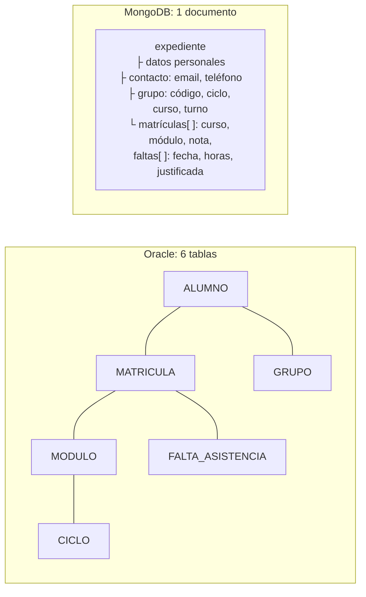

# UD10 · Bases de datos no relacionales (NoSQL) con MongoDB

## Resumen del tema

El modelo relacional es la mejor opción para muchísimos problemas, pero no para todos. Cuando los datos tienen estructuras muy variables, cuando hay que repartir enormes volúmenes entre muchos servidores o cuando lo importante son las relaciones entre elementos, existen **bases de datos no relacionales** (*NoSQL*, «not only SQL») diseñadas para esos casos.

En esta unidad caracterizarás los principales tipos de bases de datos NoSQL, aprenderás a gestionar información en una base de datos **documental** con **MongoDB 8.0** (operaciones CRUD, consultas, agregaciones, índices y validación) y, sobre todo, aprenderás a **decidir** cuándo conviene cada modelo. Trabajaremos con una versión documental de EduGest para comparar directamente con lo que ya sabes hacer en Oracle.



> [!IMPORTANT]
> **NoSQL no sustituye al modelo relacional.** Son herramientas distintas para problemas distintos. Muchas aplicaciones reales usan **las dos** a la vez (persistencia políglota): por ejemplo, Oracle para matrículas y notas, y MongoDB para el catálogo de recursos didácticos.

### ¿Por qué MongoDB?

MongoDB es la base de datos documental más extendida en el desarrollo web y móvil, tiene una edición *Community* gratuita, un intérprete (`mongosh`) basado en JavaScript que conecta con lo que aprendes en otros módulos de DAM y DAW, y controladores oficiales para Java, Kotlin, Python, Node.js o PHP. Usaremos **MongoDB Community Server 8.0** con `mongosh` 2.x y MongoDB Compass.

### Objetivos de aprendizaje

Al terminar esta unidad serás capaz de:

- Caracterizar las bases de datos no relacionales y compararlas con las relacionales.
- Evaluar los principales tipos: clave-valor, documentales, columnares y de grafos.
- Identificar los elementos de una base de datos documental: documentos, colecciones, `_id`, índices.
- Insertar, consultar, actualizar y eliminar documentos con `mongosh` y con MongoDB Compass.
- Realizar consultas con operadores, sobre documentos incrustados y arrays, y agregaciones.
- Modelar información en una base documental decidiendo entre incrustar y referenciar.

---

## 1. Características de las bases de datos NoSQL

### 1.1 Por qué surgieron

A partir de 2005, empresas como Google, Amazon o Facebook necesitaban almacenar volúmenes de datos y atender cantidades de usuarios que un único servidor relacional no podía manejar. Necesitaban:

- **Escalar horizontalmente**: añadir servidores baratos en lugar de comprar uno cada vez más grande.
- **Esquemas flexibles**: datos que cambian de estructura con frecuencia o que son distintos de un registro a otro.
- **Alta disponibilidad**: seguir funcionando aunque fallen servidores o centros de datos enteros.
- **Modelos adaptados al uso**: guardar los datos con la forma en que la aplicación los lee.

### 1.2 Características comunes

| Característica | Relacional (Oracle) | NoSQL (en general) |
|---|---|---|
| Modelo de datos | Tablas con filas y columnas | Documentos, pares clave-valor, familias de columnas o grafos |
| Esquema | Rígido: se define antes de insertar | Flexible o inexistente: cada elemento puede tener una estructura distinta |
| Relaciones | Claves ajenas y `JOIN` | Datos incrustados o referencias que resuelve la aplicación |
| Escalado | Principalmente vertical (servidor más potente) | Principalmente horizontal (más servidores) |
| Transacciones | ACID completas | Variable: desde operaciones atómicas por elemento hasta transacciones ACID multidocumento (MongoDB desde la versión 4.0) |
| Lenguaje | SQL estándar | API o lenguaje propio de cada producto |
| Consistencia | Inmediata | A menudo **eventual** en sistemas distribuidos |

### 1.3 ACID frente a BASE

Muchos sistemas NoSQL distribuidos siguen el modelo **BASE**, que prioriza la disponibilidad:

- **B**asically **A**vailable: el sistema responde siempre, aunque sea con datos no del todo actualizados.
- **S**oft state: el estado puede cambiar sin intervención, mientras las copias se sincronizan.
- **E**ventual consistency: si dejan de llegar cambios, todas las copias acaban siendo iguales.

Recuerda el **teorema CAP** de la UD01: ante una partición de la red, un sistema distribuido debe elegir entre **consistencia** y **disponibilidad**. Los relacionales suelen elegir consistencia; muchos NoSQL eligen disponibilidad. MongoDB permite configurar este equilibrio con sus opciones de lectura y escritura (*read/write concern*).

---

## 2. Tipos de bases de datos NoSQL

El mismo dato de EduGest («Adrián Ferri, de 1DAM, tiene un 4,75 en Bases de datos») se representaría así en cada modelo:


{}
Un diccionario gigante: cada **clave** única da acceso a un **valor** opaco para el SGBD.

```text
SET alumno:1:nombre      "Adrián Ferri Baeza"
SET alumno:1:grupo       "1DAM"
SET nota:1:0484:2025-26  "4.75"
GET nota:1:0484:2025-26  → "4.75"
```

- **Productos:** Redis, Valkey, Amazon DynamoDB, etcd.
- **Puntos fuertes:** rapidísimo (a menudo en memoria), escalado sencillo.
- **Límites:** solo se busca por clave; no hay consultas por contenido.
- **Usos:** cachés, sesiones de usuario, carritos de la compra, colas, contadores en tiempo real.
{}
{}
Cada elemento es un **documento** (JSON/BSON) con estructura propia, que puede contener subdocumentos y arrays.

```json
{
  "_id": 1,
  "nombre": "Adrián", "apellidos": "Ferri Baeza",
  "grupo": { "codigo": "1DAM", "ciclo": "DAM" },
  "matriculas": [
    { "curso": "2025-26", "modulo": { "codigo": "0484", "nombre": "Bases de datos" }, "nota": 4.75 }
  ]
}
```

- **Productos:** MongoDB, Couchbase, Amazon DocumentDB, Firestore.
- **Puntos fuertes:** el documento se parece al objeto de la aplicación; consultas ricas por cualquier campo; esquema flexible.
- **Límites:** las relaciones complejas entre documentos son menos naturales que un `JOIN`.
- **Usos:** catálogos de productos, gestores de contenidos, perfiles de usuario, aplicaciones móviles.
{}
{}
Las filas se identifican por una clave y agrupan **familias de columnas**; cada fila puede tener columnas distintas. Optimizadas para escrituras masivas distribuidas.

```text
Tabla matriculas  (clave de partición: curso + grupo)
fila ("2025-26","1DAM") → { 1:0484 = 4.75, 1:0485 = 7.25, 2:0484 = 4.75, ... }
```

- **Productos:** Apache Cassandra, ScyllaDB, HBase, Google Bigtable.
- **Puntos fuertes:** escalabilidad lineal a cientos de nodos, escrituras muy rápidas, sin punto único de fallo.
- **Límites:** hay que diseñar las tablas **según las consultas** que se harán; consultas *ad hoc* limitadas.
- **Usos:** series temporales, mensajería, registros de eventos (IoT, telemetría).
{}
{}
Los datos son **nodos** y **relaciones** con propiedades. Recorrer relaciones es la operación principal.

```text
(:Alumno {nombre:"Adrián"})-[:MATRICULADO {nota:4.75}]->(:Modulo {codigo:"0484"})
(:Profesor {nombre:"Marta"})-[:IMPARTE]->(:Modulo {codigo:"0484"})

// Cypher (Neo4j): ¿qué profesores han dado clase a compañeros de Adrián?
MATCH (a:Alumno {nombre:"Adrián"})-[:MATRICULADO]->(m)<-[:MATRICULADO]-(c:Alumno),
      (p:Profesor)-[:IMPARTE]->(m)
RETURN DISTINCT p.nombre
```

- **Productos:** Neo4j, Amazon Neptune, ArangoDB.
- **Puntos fuertes:** consultas de caminos y relaciones a muchos niveles, que en SQL requerirían muchos `JOIN` o consultas recursivas.
- **Usos:** redes sociales, recomendaciones, detección de fraude, rutas, gestión de dependencias.
{}


Existen también bases de datos de **series temporales** (InfluxDB, TimescaleDB), de **búsqueda** (Elasticsearch, OpenSearch) y **vectoriales** (para búsquedas por similitud en aplicaciones de IA). Muchos productos actuales son **multimodelo**: Oracle 26ai, por ejemplo, almacena JSON, grafos y vectores junto a las tablas relacionales.

### 2.1 ¿Qué modelo elegir?

La tabla siguiente es un **punto de partida para analizar** cada caso, no una regla automática:

| Necesidad | Posible solución | Matiz |
|---|---|---|
| Datos muy estructurados y estables | Relacional | |
| Relaciones complejas entre entidades, consultas *ad hoc* | Relacional | Los `JOIN` y SQL son imbatibles para preguntas imprevistas |
| Integridad referencial y transacciones estrictas | Relacional | Matrículas, facturación, banca |
| Esquema flexible o cambiante | Documental | También JSON en una base relacional |
| Documentos con estructuras variables (catálogo con atributos distintos por producto) | Documental | |
| Lecturas por clave a altísima velocidad | Clave-valor | Caché delante de otra base de datos |
| Escrituras masivas distribuidas, series temporales | Columnar o series temporales | |
| Grandes volúmenes distribuidos | **Depende del caso** | Oracle, PostgreSQL o MySQL también escalan con particionado, réplicas y *sharding* |
| Relaciones entre nodos a muchos niveles | Grafos | |

---

## 3. Elementos de una base de datos documental: MongoDB

| MongoDB | Equivalente aproximado en relacional | Descripción |
|---|---|---|
| **Base de datos** | Esquema | Contenedor de colecciones (`edugest`) |
| **Colección** | Tabla | Conjunto de documentos (`expedientes`). No exige que todos tengan la misma estructura |
| **Documento** | Fila | Objeto BSON con pares campo-valor |
| **Campo** | Columna | Puede contener valores simples, subdocumentos o arrays |
| **`_id`** | Clave primaria | Obligatorio y único en la colección. Si no se indica, MongoDB genera un `ObjectId` |
| **Documento incrustado** | Tabla relacionada + `JOIN` | Subdocumento dentro del documento (`grupo`) |
| **Referencia** | Clave ajena | Campo que guarda el `_id` de otro documento (sin integridad referencial) |
| **Índice** | Índice | Árbol B sobre uno o varios campos; siempre existe uno sobre `_id` |
| **Pipeline de agregación** | `GROUP BY`, `JOIN`, vistas | Secuencia de etapas que transforman documentos |
| **Conjunto de réplicas** (*replica set*) | Réplicas / Data Guard | Copias para alta disponibilidad |
| **Fragmentación** (*sharding*) | Particionado distribuido | Reparto horizontal de una colección entre servidores |

**BSON** (*Binary JSON*) es el formato interno: amplía JSON con tipos como `ObjectId`, `Date`, enteros de 32 y 64 bits, `Decimal128` (decimales exactos, para importes) o datos binarios.

---

## 4. Entorno de trabajo

Sigue la [guía del entorno](/guia/entorno#5-mongodb-community-server-80-ud10) para arrancar MongoDB 8.0 en un contenedor. Después carga los datos de EduGest:

```bash
# Descarga edugest_mongo.js y ejecútalo
docker exec -i mongo8 mongosh < edugest_mongo.js
```

Descarga: [edugest_mongo.js](recursos/nosql/edugest_mongo.js). Al terminar debe mostrar `ciclos: 4 · profesores: 12 · expedientes: 32`.

| Herramienta | Uso |
|---|---|
| **mongosh** | Intérprete interactivo de JavaScript para MongoDB. Ejecuta órdenes y scripts |
| **MongoDB Compass** | Cliente gráfico: explorar colecciones, filtrar, editar documentos, construir agregaciones y ver planes de ejecución |
| **Extensión de MongoDB para VS Code** | *Playgrounds* `.mongodb.js` con resultados en el editor |
| **MongoDB Atlas** | Servicio en la nube (tiene un nivel gratuito) |

Órdenes básicas de `mongosh`:

```javascript
show dbs                    // bases de datos
use edugest                 // cambiar de base de datos (se crea al insertar el primer documento)
show collections            // colecciones
db.expedientes.findOne()    // un documento de ejemplo
```

---

## 5. Operaciones CRUD

### 5.1 Crear: insertOne e insertMany

```javascript
db.expedientes.insertOne({
  _id: 1001,
  nia: "10452001",
  nombre: "Marina",
  apellidos: "López Ortega",
  fechaNacimiento: ISODate("2007-03-14"),
  contacto: { email: "marinalopez@alu.edugest.es" },
  localidad: "Alicante",
  grupo: { codigo: "1DAM", ciclo: "DAM", curso: 1, turno: "M" },
  matriculas: [],
  necesidadesEducativas: ["Adaptación de tiempo en exámenes"]   // campo que no tiene nadie más
})
```

```text
{ acknowledged: true, insertedId: 1001 }
```

> [!NOTE]
> No hemos tenido que modificar ninguna «tabla» para añadir el campo `necesidadesEducativas`: el esquema es **flexible**. Es una ventaja… y un riesgo: un error tecleando un nombre de campo (`localidda`) crea un campo nuevo sin ningún aviso. Por eso existe la **validación de esquema** (apartado 9).

### 5.2 Leer: find y findOne

```javascript
db.coleccion.find(filtro, proyeccion).sort(orden).skip(n).limit(n)
```

```javascript
// Alumnado de Mutxamel: solo nombre y apellidos, ordenado por apellidos
db.expedientes.find(
  { localidad: "Mutxamel" },
  { _id: 0, nombre: 1, apellidos: 1 }
).sort({ apellidos: 1 })
```

```text
[
  { nombre: 'Martina', apellidos: 'Alemany Vidal' },
  { nombre: 'Sara',    apellidos: 'Amorós Guillem' },
  { nombre: 'Irene',   apellidos: 'Belda Iborra' },
  { nombre: 'Hugo',    apellidos: 'Brotons Iborra' },
  { nombre: 'Álex',    apellidos: 'Tomás Vidal' },
  { nombre: 'Alba',    apellidos: 'Torregrosa Planelles' }
]
```

Equivalente en SQL: `SELECT nombre, apellidos FROM alumno WHERE localidad = 'Mutxamel' ORDER BY apellidos;`

| Parte | En el ejemplo | SQL equivalente |
|---|---|---|
| Filtro | `{ localidad: "Mutxamel" }` | `WHERE` |
| Proyección | `{ _id: 0, nombre: 1, apellidos: 1 }` (1 = mostrar, 0 = ocultar) | Lista del `SELECT` |
| `sort` | `{ apellidos: 1 }` (1 ascendente, -1 descendente) | `ORDER BY` |
| `limit` / `skip` | — | `FETCH FIRST` / `OFFSET` |

### 5.3 Operadores de consulta

| Operador | Significado | Ejemplo |
|---|---|---|
| `$eq`, `$ne` | Igual, distinto | `{ "grupo.turno": { $ne: "M" } }` |
| `$gt`, `$gte`, `$lt`, `$lte` | Mayor, menor... | `{ fechaNacimiento: { $lt: ISODate("2005-01-01") } }` |
| `$in`, `$nin` | En una lista, fuera de ella | `{ localidad: { $in: ["Elche", "El Campello"] } }` |
| `$and`, `$or`, `$not`, `$nor` | Lógicos | `{ $or: [ { localidad: "Elche" }, { "grupo.codigo": "1DAM" } ] }` |
| `$exists` | El campo existe o no | `{ grupo: { $exists: false } }` |
| `$regex` | Expresión regular | `{ apellidos: { $regex: "^B" } }` |
| `$size` | Tamaño de un array | `{ matriculas: { $size: 0 } }` |
| `$elemMatch` | Algún elemento del array cumple **todas** las condiciones | Apartado 6 |

```javascript
// Varias condiciones en el mismo objeto = AND implícito
db.expedientes.countDocuments({ "grupo.codigo": "2DAW" })        // 5
db.expedientes.find({ grupo: { $exists: false } }, { nombre: 1 }) // _id 30, 31, 32
db.expedientes.find({ "contacto.email": { $exists: false } }, { nombre: 1 })
// [ { _id: 8, nombre: 'Iván' }, { _id: 19, nombre: 'Alba' }, { _id: 30, nombre: 'Zoe' } ]
```

> [!TIP]
> Para acceder a un campo de un **subdocumento** se usa la **notación de punto** entre comillas: `"grupo.codigo"`, `"contacto.email"`. Fíjate en que «no tener email» en MongoDB es que el campo **no exista**, no que valga `null`. `{ "contacto.email": null }` encuentra **las dos** cosas: campos inexistentes y campos con `null`.

### 5.4 Actualizar: updateOne, updateMany y replaceOne

```javascript
// Cambiar o añadir un campo
db.expedientes.updateOne({ _id: 4 }, { $set: { "contacto.telefono": "612345678" } })

// Varios documentos: pasar a 1DAW al alumnado sin grupo
db.expedientes.updateMany(
  { grupo: { $exists: false } },
  { $set: { grupo: { codigo: "1DAW", ciclo: "DAW", curso: 1, turno: "T" } } }
)
// { matchedCount: 3, modifiedCount: 3 }

// Añadir un elemento a un array
db.expedientes.updateOne(
  { _id: 1001 },
  { $push: { matriculas: { curso: "2026-27",
                           modulo: { codigo: "0484", nombre: "Bases de datos", ciclo: "DAM", horas: 160 },
                           convocatoria: 1 } } }
)

// Actualizar un elemento concreto de un array con el operador posicional $
db.expedientes.updateOne(
  { _id: 1, "matriculas.modulo.codigo": "0484" },
  { $set: { "matriculas.$.nota": 5 } }
)
```

| Operador | Efecto |
|---|---|
| `$set` / `$unset` | Asignar un valor / eliminar un campo |
| `$inc` | Sumar una cantidad |
| `$push` / `$pull` / `$addToSet` | Añadir a un array / quitar elementos / añadir si no existe |
| `$rename` | Cambiar el nombre de un campo |
| `$` / `$[]` / `$[id]` | Actualizar el primer elemento que coincide / todos / los que cumplan un filtro |

> [!CAUTION]
> `updateOne({ _id: 4 }, { nombre: "Paula" })` **sin** operadores no se admite en `updateOne` (da error), pero en `replaceOne` sustituye el documento **entero** por `{ nombre: "Paula" }` y se pierden todos los demás campos. Usa siempre operadores como `$set`.

Con la opción `{ upsert: true }`, si ningún documento cumple el filtro, se **inserta** uno nuevo (como el `MERGE` de SQL).

### 5.5 Eliminar: deleteOne y deleteMany

```javascript
db.expedientes.deleteOne({ _id: 1001 })
db.expedientes.deleteMany({ "grupo.codigo": "2ASIR" })   // 0 documentos: no hay nadie
db.expedientes.deleteMany({})                             // ¡borra TODOS los documentos!
```

> [!WARNING]
> MongoDB **no tiene integridad referencial**: si borras un ciclo de la colección `ciclos`, los expedientes que lo mencionan quedan con datos «huérfanos» y nadie te avisa. La aplicación es responsable de mantener la coherencia.

---

## 6. Consultas sobre arrays

Los arrays son la gran diferencia con el modelo relacional. Atención a esta sutileza:

```javascript
// (a) Alumnado con ALGUNA matrícula de 0484 y ALGUNA nota < 5 (pueden ser matrículas distintas)
db.expedientes.find(
  { "matriculas.modulo.codigo": "0484", "matriculas.nota": { $lt: 5 } },
  { nombre: 1 }
)
// 8 documentos: _id 1, 2, 3, 4, 5, 14, 15, 17

// (b) Alumnado con una MISMA matrícula que sea de 0484 Y tenga nota < 5
db.expedientes.find(
  { matriculas: { $elemMatch: { "modulo.codigo": "0484", nota: { $lt: 5 } } } },
  { nombre: 1 }
)
// 2 documentos: _id 1 (Adrián) y 2 (Rubén)
```

La consulta (a) devuelve, por ejemplo, a Noelia (_id 3): tiene una matrícula de 0484 (con un 8) y **otra** matrícula con nota menor que 5. Solo `$elemMatch` obliga a que **el mismo elemento** cumpla las dos condiciones. Es el equivalente a hacer el `JOIN` con la matrícula y filtrar en la misma fila.

---

## 7. Agregaciones

El **pipeline de agregación** pasa los documentos por una secuencia de **etapas**; la salida de cada una es la entrada de la siguiente.

| Etapa | Función | SQL equivalente |
|---|---|---|
| `$match` | Filtrar | `WHERE` / `HAVING` |
| `$project`, `$addFields`, `$set` | Seleccionar o calcular campos | Lista del `SELECT` |
| `$unwind` | Generar un documento por cada elemento de un array | Composición con la tabla hija |
| `$group` | Agrupar y calcular con `$sum`, `$avg`, `$min`, `$max`, `$push` | `GROUP BY` |
| `$sort`, `$limit`, `$skip` | Ordenar y limitar | `ORDER BY`, `FETCH FIRST` |
| `$lookup` | Unir con otra colección | `LEFT JOIN` |
| `$count` | Contar | `COUNT(*)` |

```javascript
// Nota media por grupo (compárala con la UD07)
db.expedientes.aggregate([
  { $match: { grupo: { $exists: true } } },
  { $unwind: "$matriculas" },
  { $group: {
      _id: "$grupo.codigo",
      matriculas: { $sum: 1 },
      notaMedia:  { $avg: "$matriculas.nota" }
  } },
  { $project: { matriculas: 1, notaMedia: { $round: ["$notaMedia", 2] } } },
  { $sort: { _id: 1 } }
])
```

```text
[
  { _id: '1ASIR', matriculas: 25, notaMedia: 7.07 },
  { _id: '1DAM',  matriculas: 35, notaMedia: 6.4 },
  { _id: '1DAW',  matriculas: 30, notaMedia: 6.19 },
  { _id: '2DAM',  matriculas: 33, notaMedia: 6.17 },
  { _id: '2DAW',  matriculas: 20, notaMedia: 5.93 }
]
```

Los resultados coinciden con la consulta SQL de la UD07. `$avg` ignora las matrículas sin el campo `nota`, igual que `AVG` ignora los `NULL`.

> [!NOTE]
> Dentro de las etapas, `"$campo"` (con `$` delante y entre comillas) significa «el **valor** del campo», y `"campo"` a secas es un texto literal.

```javascript
// $lookup: módulos de 2º curso del ciclo de cada alumno de 1DAW (unión con la colección ciclos)
db.expedientes.aggregate([
  { $match: { "grupo.codigo": "1DAW" } },
  { $lookup: { from: "ciclos", localField: "grupo.ciclo", foreignField: "_id", as: "ciclo" } },
  { $unwind: "$ciclo" },
  { $project: { _id: 0, nombre: 1,
                modulosSegundo: { $filter: { input: "$ciclo.modulos", cond: { $eq: ["$$this.curso", 2] } } } } },
  { $limit: 1 }
])
```

---

## 8. Modelado de datos en una base documental

### 8.1 Incrustar o referenciar

En relacional se normaliza y se compone con `JOIN`. En MongoDB se **diseña según cómo se consultan los datos**:

| Incrustar (subdocumento o array) | Referenciar (guardar el `_id` de otro documento) |
|---|---|
| Los datos se leen **siempre juntos** | Los datos se consultan también **por separado** |
| Relación «contiene» 1:1 o 1:pocos | Relación 1:muchos o N:M con muchos elementos |
| El dato incrustado cambia poco | El dato referenciado cambia a menudo y se comparte |
| Ejemplo: el grupo dentro del expediente | Ejemplo: el profesor que imparte un módulo |

Reglas prácticas:

1. **Favorece incrustar** salvo que haya un motivo para no hacerlo.
2. **No incrustes arrays que crecen sin límite** (un documento tiene un máximo de **16 MB**). Las faltas de asistencia de un alumno a lo largo de los años pueden crecer mucho.
3. **Duplicar datos es aceptable** si se leen mucho y cambian poco (el nombre del módulo dentro de la matrícula). Pero tendrás que actualizar **todas** las copias si cambian: es la redundancia controlada de la UD04.
4. Si necesitas muchos `$lookup` en cada consulta, probablemente el modelo debería ser relacional.

### 8.2 El expediente de EduGest



| Consulta | Relacional | Documental |
|---|---|---|
| Expediente completo de un alumno | 5 `JOIN` | Un `findOne` |
| Acta de un módulo (todos los alumnos) | 2 `JOIN` y un filtro | `$unwind` + `$match` sobre **todos** los expedientes |
| Cambiar el nombre de un módulo | 1 fila | Todos los expedientes que lo contienen |
| Garantizar que no hay dos matrículas iguales | `UNIQUE` | Validación en la aplicación o índices únicos complejos |

El modelo documental es excelente para **mostrar el expediente** (una lectura) y peor para **gestionar el centro** (actas, cambios en cascada, integridad). Por eso EduGest sigue siendo relacional y el expediente documental sería una **vista de lectura** para una app móvil.

---

## 9. Validación de esquema, índices y seguridad

### 9.1 Validación con JSON Schema

El esquema flexible no impide exigir **una estructura mínima**:

```javascript
db.createCollection("incidencias", {
  validator: {
    $jsonSchema: {
      bsonType: "object",
      required: ["aula", "descripcion", "fecha", "estado"],
      properties: {
        aula:        { bsonType: "string" },
        descripcion: { bsonType: "string", minLength: 10 },
        fecha:       { bsonType: "date" },
        estado:      { enum: ["ABIERTA", "EN CURSO", "CERRADA"] },
        prioridad:   { bsonType: "int", minimum: 1, maximum: 5 }
      }
    }
  },
  validationAction: "error"
})

db.incidencias.insertOne({ aula: "12", descripcion: "Roto", fecha: new Date(), estado: "PENDIENTE" })
// MongoServerError: Document failed validation
```

### 9.2 Índices y plan de ejecución

```javascript
db.expedientes.createIndex({ apellidos: 1, nombre: 1 })
db.expedientes.createIndex({ nia: 1 }, { unique: true })
db.expedientes.createIndex({ "matriculas.modulo.codigo": 1 })   // índice multiclave sobre un array

db.expedientes.find({ nia: "10450037" }).explain("executionStats")
// winningPlan: IXSCAN (usa índice) frente a COLLSCAN (recorre la colección)
```

`COLLSCAN` es el equivalente al `TABLE ACCESS FULL` de Oracle e `IXSCAN` al `INDEX RANGE SCAN`.

### 9.3 Seguridad

> [!CAUTION]
> El contenedor del aula arranca **sin autenticación**. En producción: activa el control de acceso (`--auth`), crea usuarios con roles mínimos (`read`, `readWrite` sobre una base de datos concreta), **no** expongas el puerto 27017 a Internet y cifra las conexiones con TLS. Miles de servidores MongoDB abiertos han sido vaciados y «secuestrados» por este motivo.

```javascript
use admin
db.createUser({ user: "app_edugest", pwd: passwordPrompt(),
                roles: [ { role: "readWrite", db: "edugest" } ] })
```

---

## 10. Comparación final: SQL frente a MongoDB

| Operación | Oracle (SQL) | MongoDB |
|---|---|---|
| Crear estructura | `CREATE TABLE` | Implícito al insertar (o `createCollection` con validador) |
| Insertar | `INSERT INTO t (...) VALUES (...)` | `db.t.insertOne({...})` |
| Consultar | `SELECT c FROM t WHERE x = 1 ORDER BY c` | `db.t.find({x: 1}, {c: 1}).sort({c: 1})` |
| Contar | `SELECT COUNT(*) FROM t WHERE ...` | `db.t.countDocuments({...})` |
| Agrupar | `GROUP BY` | `aggregate([{ $group: ... }])` |
| Componer | `JOIN` | Incrustar o `$lookup` |
| Actualizar | `UPDATE t SET c = 1 WHERE ...` | `db.t.updateMany({...}, { $set: { c: 1 } })` |
| Borrar | `DELETE FROM t WHERE ...` | `db.t.deleteMany({...})` |
| Transacción | Implícita, `COMMIT` / `ROLLBACK` | Atómica por documento; multidocumento con `session.startTransaction()` |
| Integridad referencial | `FOREIGN KEY` | No existe |

---

## 11. Resumen

- Las bases de datos **NoSQL** surgieron para escalar horizontalmente, admitir esquemas flexibles y priorizar la disponibilidad. Muchas siguen el modelo **BASE**.
- Tipos principales: **clave-valor**, **documentales**, **columnares** y de **grafos**. Cada uno se adapta a un tipo de problema.
- En **MongoDB**: bases de datos, colecciones, documentos BSON con `_id`, subdocumentos y arrays.
- CRUD: `insertOne/Many`, `find`, `updateOne/Many` con operadores (`$set`, `$push`...), `deleteOne/Many`.
- Consultas con operadores, notación de punto, `$elemMatch` y el **pipeline de agregación**.
- El **modelado documental** decide entre incrustar y referenciar **según las consultas**.
- Ni el modelo relacional ni el NoSQL son siempre mejores: hay que **analizar el caso**.

---

## 12. Autoevaluación


- q: "¿Qué tipo de base de datos NoSQL es más adecuado para guardar las sesiones de usuario de una web con millones de visitas?"
  options: ["Grafos", "Clave-valor", "Columnar", "Relacional con muchas tablas"]
  answer: 1
  explain: "Se accede siempre por la clave de sesión y se necesita velocidad: un almacén clave-valor en memoria (Redis, Valkey) es lo habitual."
- q: "¿Qué significa la «E» de BASE?"
  options: ["Exclusive locking", "Eventual consistency", "Entity integrity", "Embedded documents"]
  answer: 1
  explain: "Consistencia eventual: las copias acaban siendo iguales si dejan de llegar cambios, pero puede haber un intervalo en el que no lo sean."
- q: "En MongoDB, ¿qué equivale aproximadamente a una tabla?"
  options: ["Un documento", "Un campo", "Una colección", "Un índice"]
  answer: 2
  explain: "Una colección agrupa documentos, igual que una tabla agrupa filas, pero sin exigir que todos tengan la misma estructura."
- q: "¿Qué devuelve `db.expedientes.find({ grupo: { $exists: false } })`?"
  options: ["Los alumnos con grupo NULL", "Los documentos que no tienen el campo grupo", "Un error", "Todos los documentos"]
  answer: 1
  explain: "`$exists` comprueba si el campo está presente. En EduGest, los tres alumnos sin grupo simplemente no tienen ese campo."
- q: "¿Qué hace `{ $set: { \"contacto.email\": \"x@y.es\" } }` en un updateOne?"
  options: ["Sustituye el documento completo", "Asigna o crea el campo email dentro del subdocumento contacto", "Añade un elemento a un array", "Borra el campo contacto"]
  answer: 1
  explain: "`$set` con notación de punto modifica (o crea) solo ese campo del subdocumento, sin tocar el resto."
- q: "¿Para qué sirve `$elemMatch`?"
  options: ["Para contar elementos de un array", "Para exigir que un mismo elemento del array cumpla todas las condiciones", "Para unir colecciones", "Para crear índices"]
  answer: 1
  explain: "Sin `$elemMatch`, cada condición puede cumplirla un elemento distinto del array. En EduGest, la diferencia es 8 documentos frente a 2."
- q: "¿Qué etapa del pipeline de agregación equivale a GROUP BY?"
  options: ["$match", "$project", "$group", "$lookup"]
  answer: 2
  explain: "`$group` agrupa por el valor de `_id` y calcula acumuladores como `$sum` o `$avg`."
- q: "¿Cuándo es mejor referenciar que incrustar?"
  options: ["Cuando los datos siempre se leen juntos", "Cuando la relación es 1:pocos", "Cuando el array crecería sin límite o el dato se comparte y cambia a menudo", "Nunca"]
  answer: 2
  explain: "Los documentos tienen un tamaño máximo de 16 MB y duplicar datos que cambian a menudo obliga a actualizar muchas copias."
- q: "Un sistema de matrículas necesita integridad referencial estricta, transacciones y consultas ad hoc para informes. ¿Qué modelo es más adecuado?"
  options: ["Clave-valor", "Documental sin validación", "Relacional", "Columnar"]
  answer: 2
  explain: "Son exactamente los puntos fuertes del modelo relacional. NoSQL no es «más moderno» ni «mejor»: es otra herramienta."


## Referencias

- [Manual de MongoDB 8.0](https://www.mongodb.com/docs/manual/): CRUD, agregación, modelado de datos, validación de esquema e índices.
- [MongoDB Shell (mongosh)](https://www.mongodb.com/docs/mongodb-shell/).
- [Data Modeling in MongoDB](https://www.mongodb.com/docs/manual/data-modeling/).
- Sadalage, P. J. y Fowler, M. *NoSQL Distilled*. Addison-Wesley.
- [DB-Engines Ranking](https://db-engines.com/en/ranking), para comparar productos por modelo.
