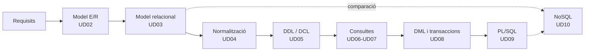

# Bases de Dades · Mòdul 0484

Apunts del mòdul professional **0484. Bases de dades**, comú als cicles formatius de grau superior **Desenvolupament d'Aplicacions Multiplataforma (DAM)** i **Desenvolupament d'Aplicacions Web (DAW)**. Curs **2026/27**.

| Característica | Valor |
|---|---|
| **Referència curricular** | Reial decret 405/2023, de 29 de maig (actualitza els títols de DAM i DAW) |
| **Durada** | 105 hores (ensenyaments mínims) · 12 crèdits ECTS · 160 hores d'aula al centre |
| **Resultats d'aprenentatge** | 7 (RA1 a RA7) amb 57 criteris d'avaluació |
| **SGBD relacional** | Oracle AI Database 26ai Free (23.26) |
| **SGBD no relacional** | MongoDB Community Server 8.0 |
| **Projecte comú** | [EduGest: gestió d'un centre educatiu](/guia/proyecto-edugest) |

> [!NOTE]
> Estos apunts **no són un manual de SQL**. Estan organitzats perquè assolisques els resultats d'aprenentatge oficials del mòdul. Recorren el cicle de vida complet d'una base de dades:
> **anàlisi → model conceptual → model lògic → normalització → disseny físic → implementació → consultes → modificació → programació → optimització → NoSQL.**

## El cicle de treball amb una base de dades

## Guia didàctica del curs 2026/27

El mòdul s'imparteix amb una càrrega de **160 hores d'aula** (5 hores setmanals, una per dia lectiu) entre el **9 de setembre de 2026** i el **18 de juny de 2027**. Les hores es repartixen en tres avaluacions i s'han ajustat al calendari escolar i a les dates de proves i de Formació en Empresa (FE) comunicades pel centre.

> [!NOTE]
> Els ensenyaments mínims del RD 405/2023 fixen 105 hores per al mòdul. Les 160 hores són les d'**horari del centre**; l'excés sobre el mínim es dedica a la pràctica guiada, al projecte EduGest i al reforç. Tots els criteris d'avaluació es cobrixen en les unitats; el repartiment d'hores és orientatiu i es pot ajustar a cada grup.



### Repartiment d'hores per avaluació

| Avaluació | Unitat | Hores | Del | Al | RA principal |
|---|---|:-:|---|---|---|
| **1a** (65 h) | UD01 · Sistemes d'emmagatzematge i SGBD | 12 | 09/09/2026 | 24/09/2026 | RA1 |
| | UD02 · Model Entitat/Relació | 19 | 25/09/2026 | 23/10/2026 | RA6 |
| | UD03 · Model relacional | 17 | 26/10/2026 | 17/11/2026 | RA6 · RA2 |
| | UD04 · Normalització | 14 | 18/11/2026 | 07/12/2026 | RA6 |
| | Prova i revisió de la 1a avaluació | 3 | 09/12/2026 | 11/12/2026 | |
| **2a** (43 h) | UD05 · Definició i control de dades | 17 | 14/12/2026 | 21/01/2027 | RA2 |
| | UD06 · Consultes sobre una taula | 23 | 22/01/2027 | 23/02/2027 | RA3 · RA5 |
| | Prova i revisió de la 2a avaluació | 3 | 24/02/2027 | 26/02/2027 | |
| **3a** (52 h) | UD07 · Consultes avançades | 17 | 01/03/2027 | 24/03/2027 | RA3 |
| | *Pasqua i Formació en Empresa (abril)* | | 25/03/2027 | 30/04/2027 | |
| | UD08 · DML, transaccions i concurrència | 9 | 03/05/2027 | 13/05/2027 | RA4 |
| | UD09 · Programació amb PL/SQL | 11 | 14/05/2027 | 28/05/2027 | RA5 |
| | UD10 · Bases de dades NoSQL | 7 | 31/05/2027 | 08/06/2027 | RA7 |
| | Prova i revisió de la 3a avaluació i final | 3 | 09/06/2027 | 11/06/2027 | |
| | Reforç, recuperació i marge | 5 | 14/06/2027 | 18/06/2027 | |
| | **Total** | **160** | | | |

L'avaluació extraordinària està prevista per al **21 de juny de 2027**.

### Criteris de la planificació

- **Teoria i pràctica en la mateixa unitat.** Cada unitat indica en la seua pàgina de teoria una *temporalització* amb el repartiment de sessions entre teoria (T) i pràctica (P). La suma d'hores de cada unitat coincidix amb la d'esta taula.
- **Pràctica guiada a l'aula, pràctica autònoma fora d'ella.** Les pràctiques guiades i la tasca del projecte EduGest es fan a classe. Les pràctiques autònomes, els reptes i les ampliacions són treball personal, i el professorat resol els dubtes en les sessions de pràctica.
- **Proves d'avaluació.** Cada avaluació reserva 3 hores a la prova i a la seua revisió, en la setmana indicada pel centre per als cicles de grau superior.
- **Un dia lectiu equival a una hora.** Els festius i els dies sense docència no compten. El temps previst per al reforç final absorbix els dies que es perguen per festes locals o activitats del centre.

> [!WARNING]
> **Abril i la Formació en Empresa.** S'ha previst que l'alumnat estiga en FE durant tot abril, per la qual cosa **no es programa docència** entre el 6 i el 30 d'abril. Si algun alumne o grup romanç al centre, eixe mes aporta 19 hores addicionals, que es dedicarien a ampliar la pràctica de les unitats UD07 a UD10 (consultes avançades, transaccions, PL/SQL i NoSQL), les més curtes del curs respecte a la seua dificultat.

> [!CAUTION]
> **Calendari provisional.** Les dates procedixen del calendari escolar provisional 2026/27 i de les dates d'avaluació comunicades pel centre. Els festius locals i els tres dies no lectius que fixe el centre **no estan descomptats**: es resoldran amb la setmana de reforç. Quan es publique el calendari definitiu cal revisar l'arxiu `data/planificacion.json`; la taula i el calendari s'actualitzen sols i la compilació falla si les hores d'una unitat deixen de sumar.

## Unitats didàctiques

Cada unitat té dos pàgines: **teoria** (conceptes, exemples i autoavaluació) i **pràctiques** (pràctiques guiades, autònomes, reptes i la tasca del projecte EduGest).

  
RA1<h3>UD01 · Sistemes d'emmagatzematge i SGBD</h3>
Fitxers enfront de bases de dades, arquitectura i funcions d'un SGBD, tipus de bases de dades, distribució, Big Data i protecció de dades.

<a href="ud01-introduccion/ud01-teoria/">Teoria</a> · <a href="ud01-introduccion/ud01-practicas/">Pràctiques</a>

  
RA6<h3>UD02 · Model Entitat/Relació</h3>
Anàlisi de requisits, entitats, atributs, relacions, cardinalitats, entitats febles i extensions EER.

<a href="ud02-modelo-er/ud02-teoria/">Teoria</a> · <a href="ud02-modelo-er/ud02-practicas/">Pràctiques</a>

  
RA6 · RA2<h3>UD03 · Model relacional</h3>
Relacions, claus, restriccions, integritat i transformació del model E/R al model relacional.

<a href="ud03-modelo-relacional/ud03-teoria/">Teoria</a> · <a href="ud03-modelo-relacional/ud03-practicas/">Pràctiques</a>

  
RA6<h3>UD04 · Normalització</h3>
Anomalies, dependències funcionals, 1FN, 2FN, 3FN i FNBC. Restriccions que el disseny lògic no pot expressar.

<a href="ud04-normalizacion/ud04-teoria/">Teoria</a> · <a href="ud04-normalizacion/ud04-practicas/">Pràctiques</a>

  
RA2<h3>UD05 · Definició i control de dades</h3>
DDL en Oracle: taules, tipus, restriccions, índexs, vistes i seqüències. DCL: usuaris, rols i privilegis.

<a href="ud05-ddl-dcl/ud05-teoria/">Teoria</a> · <a href="ud05-ddl-dcl/ud05-practicas/">Pràctiques</a>

  
RA3<h3>UD06 · Consultes sobre una taula</h3>
SELECT, projecció, selecció, ordenació, operadors, valors nuls i funcions de fila.

<a href="ud06-consultas-basicas/ud06-teoria/">Teoria</a> · <a href="ud06-consultas-basicas/ud06-practicas/">Pràctiques</a>

  
RA3<h3>UD07 · Consultes avançades</h3>
Agrupament, composicions internes i externes, subconsultes, operadors de conjunts i optimització.

<a href="ud07-consultas-avanzadas/ud07-teoria/">Teoria</a> · <a href="ud07-consultas-avanzadas/ud07-practicas/">Pràctiques</a>

  
RA4<h3>UD08 · Manipulació de dades i transaccions</h3>
INSERT, UPDATE, DELETE, MERGE, transaccions, ACID, concurrència i bloquejos.

<a href="ud08-dml-transacciones/ud08-teoria/">Teoria</a> · <a href="ud08-dml-transacciones/ud08-practicas/">Pràctiques</a>

  
RA5<h3>UD09 · Programació amb PL/SQL</h3>
Blocs, variables, control de flux, procediments, funcions, cursors, excepcions, triggers i tasques programades.

<a href="ud09-plsql/ud09-teoria/">Teoria</a> · <a href="ud09-plsql/ud09-practicas/">Pràctiques</a>

  
RA7<h3>UD10 · Bases de dades NoSQL</h3>
Tipus de bases de dades no relacionals, modelatge documental i operacions CRUD i d'agregació amb MongoDB.

<a href="ud10-nosql/ud10-teoria/">Teoria</a> · <a href="ud10-nosql/ud10-practicas/">Pràctiques</a>

## Relació entre unitats i resultats d'aprenentatge

| Unitat | RA1 | RA2 | RA3 | RA4 | RA5 | RA6 | RA7 |
|---|:-:|:-:|:-:|:-:|:-:|:-:|:-:|
| UD01 Sistemes d'emmagatzematge i SGBD | ● | ○ | | | | | ○ |
| UD02 Model Entitat/Relació | | | | | | ● | |
| UD03 Model relacional | | ○ | | | | ● | |
| UD04 Normalització | | | | | | ● | |
| UD05 Definició i control de dades | | ● | | | | ○ | |
| UD06 Consultes sobre una taula | | | ● | | ○ | | |
| UD07 Consultes avançades | | ○ | ● | | | | |
| UD08 Manipulació i transaccions | | | | ● | | ○ | |
| UD09 Programació PL/SQL | | | | ○ | ● | ○ | |
| UD10 Bases de dades NoSQL | ○ | | | | | | ● |

● contribució principal · ○ contribució secundària. El detall per criteri d'avaluació està en [Resultats d'aprenentatge i criteris d'avaluació](/guia/ra-ce).

## Com llegir estos apunts

Els apunts usen quadres de colors per a destacar informació:

> [!TIP]
> **Consell.** Una forma més còmoda o professional de fer una cosa.

> [!WARNING]
> **Atenció.** Un error habitual o alguna cosa que pot donar problemes.

> [!IMPORTANT]
> **Clau.** Un concepte imprescindible per al resultat d'aprenentatge.

> [!CAUTION]
> **Perill.** Una operació que pot destruir o exposar dades.

{}
Les pistes i les **solucions** dels exercicis apareixen plegades. Intenta resoldre l'exercici abans d'obrir-les.
{}

Els fragments de codi indiquen sempre el gestor al qual corresponen, per exemple ,  o .

Consulta també la [guia del mòdul](/guia): el projecte EduGest, la instal·lació de l'entorn i les convencions de les pràctiques.

## Fonts

- [Reial decret 405/2023, de 29 de maig](https://www.boe.es/buscar/act.php?id=BOE-A-2023-13221). Text consolidat al BOE.
- [Documentació d'Oracle AI Database 26ai](https://docs.oracle.com/en/database/oracle/oracle-database/26/).
- [Manual de MongoDB](https://www.mongodb.com/docs/manual/).
