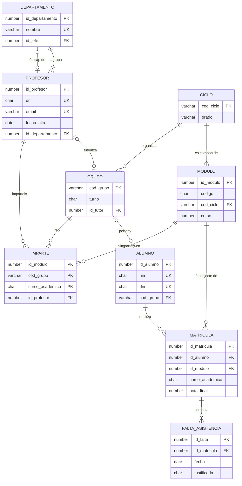

# Projecte transversal: EduGest

**EduGest** és la base de dades de gestió acadèmica d'un institut de Formació Professional fictici, l'*IES Serra Gelada*. És el fil conductor del curs: comença com una entrevista amb el client i acaba com una base de dades relacional completa, programada i amb una versió documental en MongoDB.

> [!IMPORTANT]
> Dissenyar i administrar una base de dades no és un conjunt de temes aïllats. És un procés continu. Cada unitat afig una capa a EduGest i **usa el que es va fer en l'anterior**. Guarda el teu treball en un repositori Git des del primer dia.

## 1. Enunciat: entrevista amb la direcció d'estudis

> «A l'institut impartim diversos **cicles formatius** (DAM, DAW, ASIR i, l'any que ve, SMR). De cada cicle guardem un codi, el nom, el grau (bàsic, mitjà o superior) i la seua durada total en hores.
>
> Cada cicle es compon de **mòduls professionals**. Un mòdul té un codi oficial de quatre xifres, un nom, el curs en què s'imparteix (primer o segon) i les seues hores. **Ull:** hi ha mòduls amb el mateix codi que estan en diversos cicles, com *0484 Bases de dades*, que està en DAM i en DAW. Per a nosaltres són mòduls distints, perquè tenen grups i professorat distints.
>
> L'alumnat s'organitza en **grups** (1DAM, 2DAW...). Cada grup pertany a un cicle i a un curs, té torn de matí o de vesprada i pot tindre un **tutor**, que és un professor. Un professor només pot tutoritzar un grup.
>
> De cada **alumne** necessitem el NIA (número d'identificació de l'alumnat, obligatori i únic), el DNI o NIE si el té, nom, cognoms, data de naixement, correu, telèfon, localitat i el seu grup de referència. Alguns alumnes acaben d'arribar i encara no tenen grup.
>
> L'alumne es **matricula** en mòduls, cada curs acadèmic (2025-26, 2026-27...). Guardem la data de matrícula, la convocatòria (de la 1 a la 4) i la nota final, que pot no existir encara. Un alumne no es pot matricular dues vegades del mateix mòdul en el mateix curs.
>
> Del **professorat** guardem DNI, nom, cognoms, correu, data d'alta al centre, especialitat i el **departament** al qual pertany. Cada departament té un nom únic i un cap de departament, que és un dels seus professors.
>
> Necessitem saber **quin professor imparteix cada mòdul a cada grup** en cada curs acadèmic i quantes hores setmanals.
>
> Finalment, el professorat registra les **faltes d'assistència**: dia, nombre d'hores i si està justificada. Una falta es referix a la matrícula d'un alumne en un mòdul concret.»

## 2. Evolució del projecte durant el curs

| Unitat | El que s'afig a EduGest | Lliurable |
|---|---|---|
| UD01 | Anàlisi del sistema actual (fulls de càlcul) i justificació d'un SGBD. Dades personals i RGPD. | Informe d'anàlisi |
| UD02 | Model conceptual: diagrama E/R a partir de l'enunciat. | Diagrama E/R + diccionari de dades |
| UD03 | Model lògic: transformació al model relacional. | Esquema relacional amb PK, FK i restriccions |
| UD04 | Normalització de l'esquema i del full heretat de matrícules. | Informe de normalització fins a 3FN |
| UD05 | Implementació en Oracle: taules, restriccions, índexs, vistes, usuaris i rols. | Scripts `01_esquema.sql` i `03_seguridad.sql` |
| UD06 | Consultes sobre una taula per al dia a dia de secretaria. | Script de consultes comentat |
| UD07 | Informes: actes, estadístiques per grup, consultes amb JOIN i subconsultes. Optimització. | Script d'informes + plans d'execució |
| UD08 | Altes, baixes i canvis. Promoció de curs dins d'una transacció. | Guió transaccional provat |
| UD09 | Lògica en el servidor: funcions, procediments, triggers d'auditoria i tasca programada. | Paquet PL/SQL + proves |
| UD10 | Versió documental de l'expedient de l'alumnat en MongoDB i comparació amb el model relacional. | Col·lecció + consultes + informe comparatiu |

## 3. Model de referència

El diagrama següent és la **solució de referència** que es publica quan acaba la UD04. Fins llavors, cada estudiant treballa amb el seu propi disseny.

{}



**Esquema relacional** (subratllat = clau primària, *cursiva* = clau aliena):

- DEPARTAMENTO(<u>id_departamento</u>, nombre, *id_jefe*)
- PROFESOR(<u>id_profesor</u>, dni, nombre, apellidos, email, fecha_alta, especialidad, *id_departamento*)
- CICLO(<u>cod_ciclo</u>, nombre, grado, horas_totales)
- MODULO(<u>id_modulo</u>, codigo, nombre, *cod_ciclo*, curso, horas) · UNIQUE(codigo, cod_ciclo)
- GRUPO(<u>cod_grupo</u>, *cod_ciclo*, curso, turno, *id_tutor*) · UNIQUE(id_tutor)
- ALUMNO(<u>id_alumno</u>, nia, dni, nombre, apellidos, fecha_nacimiento, email, telefono, localidad, *cod_grupo*)
- MATRICULA(<u>id_matricula</u>, *id_alumno*, *id_modulo*, curso_academico, fecha_matricula, convocatoria, nota_final) · UNIQUE(id_alumno, id_modulo, curso_academico)
- IMPARTE(<u>*id_modulo*, *cod_grupo*, curso_academico</u>, *id_profesor*, horas_semanales)
- FALTA_ASISTENCIA(<u>id_falta</u>, *id_matricula*, fecha, horas, justificada) · UNIQUE(id_matricula, fecha)

{}

### Restriccions que no arreplega el diagrama

Algunes regles de negoci no es poden expressar amb claus ni amb `CHECK` d'una sola fila. Es documenten en la UD04 (RA6.h) i s'implementen en la UD09 amb PL/SQL:

1. El cap d'un departament ha de **pertànyer** a eixe departament.
2. Un alumne només es pot matricular en mòduls del **cicle del seu grup**, excepte autorització.
3. No es pot registrar una falta en una data **anterior a la matrícula**.
4. Un professor no hauria de superar **20 hores lectives** setmanals en un curs acadèmic.
5. La nota final només es pot modificar si el mòdul està **en un curs acadèmic obert**.

## 4. Scripts descarregables

Els scripts estan escrits per a **Oracle AI Database 26ai Free**. També funcionen en 23ai i, excepte el que s'indica en els seus comentaris, en 19c i 21c.

| Script | Contingut | S'executa com a |
|---|---|---|
| [edugest_00_usuario.sql](recursos/sql/edugest_00_usuario.sql) | Crea l'usuari/esquema `EDUGEST` | `SYSTEM` en `FREEPDB1` |
| [edugest_01_esquema.sql](recursos/sql/edugest_01_esquema.sql) | Taules, restriccions, índexs i comentaris | `EDUGEST` |
| [edugest_02_datos.sql](recursos/sql/edugest_02_datos.sql) | Dades d'exemple del curs 2025-26 | `EDUGEST` |

```bash
# Des de la carpeta on hages descarregat els scripts (SQLcl)
sql system/<contraseña>@//localhost:1521/FREEPDB1 @edugest_00_usuario.sql
sql edugest/Edugest_2026@//localhost:1521/FREEPDB1 @edugest_01_esquema.sql
sql edugest/Edugest_2026@//localhost:1521/FREEPDB1 @edugest_02_datos.sql
```

Al final de l'script 02 es mostra un recompte de files. Si tot ha anat bé has d'obtindre:

| taula | files |
|---|---:|
| departamento | 5 |
| profesor | 12 |
| ciclo | 4 |
| modulo | 24 |
| grupo | 6 |
| alumno | 32 |
| matricula | 143 |
| imparte | 24 |
| falta_asistencia | 46 |

> [!TIP]
> Les dades estan preparades perquè les consultes donen resultats interessants. Hi ha un departament sense professorat (Matemàtiques), un cicle sense mòduls ni grups (SMR), un grup sense alumnat ni tutor (2ASIR), un professor que no imparteix classe, alumnat sense grup, sense DNI, sense correu o sense telèfon, i notes sense qualificar (`NULL`). Així es poden practicar les composicions externes i el tractament dels valors nuls.

> [!WARNING]
> Totes les dades personals d'EduGest són **fictícies**. En un projecte real, les dades de l'alumnat són dades personals protegides pel RGPD i la LOPDGDD (UD01). Mai no uses dades reals en entorns de prova.
