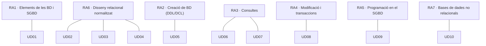

# Resultats d'aprenentatge i criteris d'avaluació

El mòdul **0484. Bases de dades** es regix pel **Reial decret 405/2023, de 29 de maig**, que actualitza els títols de Tècnic Superior en DAM i en DAW. El mòdul és idèntic en els dos cicles: té **12 crèdits ECTS**, una durada mínima de **105 hores** i **7 resultats d'aprenentatge (RA)** amb **57 criteris d'avaluació (CE)**.

> [!IMPORTANT]
> Un **resultat d'aprenentatge** descriu el que sabràs fer en acabar el mòdul. Un **criteri d'avaluació** és una evidència concreta que demostra que ho has aconseguit. Cada unitat, pràctica i exercici d'estos apunts indica quin CE treballa.

## Mapa de contribució

> [!NOTE]
> L'ordre de les unitats no coincidix amb el número dels RA. Primer es **dissenya** (RA6) i després s'**implementa** (RA2). El currículum descriu *què* cal aconseguir, no l'ordre en què s'ensenya.

## Criteris d'avaluació per resultat d'aprenentatge

Text literal dels ensenyaments mínims. L'última columna indica en quines unitats es treballa cada criteri.

## RA1. Reconeix els elements de les bases de dades analitzant les seues funcions i valorant la utilitat dels sistemes gestors.

| CE | Criteri d'avaluació | Unitats |
|---|---|---|
| RA1.a | S'han analitzat els sistemes lògics d'emmagatzematge i les seues característiques. | [UD01](/ud01-introduccion) |
| RA1.b | S'han identificat els diferents tipus de bases de dades segons el model de dades utilitzat. | [UD01](/ud01-introduccion), [UD10](/ud10-nosql) |
| RA1.c | S'han identificat els diferents tipus de bases de dades en funció de la ubicació de la informació. | [UD01](/ud01-introduccion) |
| RA1.d | S'ha avaluat la utilitat d'un sistema gestor de bases de dades. | [UD01](/ud01-introduccion) |
| RA1.e | S'ha reconegut la funció de cadascun dels elements d'un sistema gestor de bases de dades. | [UD01](/ud01-introduccion) |
| RA1.f | S'han classificat els sistemes gestors de bases de dades. | [UD01](/ud01-introduccion) |
| RA1.g | S'ha reconegut la utilitat de les bases de dades distribuïdes. | [UD01](/ud01-introduccion) |
| RA1.h | S'han analitzat les polítiques de fragmentació de la informació. | [UD01](/ud01-introduccion) |
| RA1.i | S'ha identificat la legislació vigent sobre protecció de dades. | [UD01](/ud01-introduccion) |
| RA1.j | S'han reconegut els conceptes de Big Data i de la intel·ligència de negocis. | [UD01](/ud01-introduccion) |

## RA2. Crea bases de dades definint la seua estructura i les característiques dels seus elements segons el model relacional.

| CE | Criteri d'avaluació | Unitats |
|---|---|---|
| RA2.a | S'ha analitzat el format d'emmagatzematge de la informació. | [UD01](/ud01-introduccion), [UD03](/ud03-modelo-relacional), [UD05](/ud05-ddl-dcl) |
| RA2.b | S'han creat les taules i les relacions entre elles. | [UD05](/ud05-ddl-dcl) |
| RA2.c | S'han seleccionat els tipus de dades adequats. | [UD05](/ud05-ddl-dcl) |
| RA2.d | S'han definit els camps clau en les taules. | [UD03](/ud03-modelo-relacional), [UD05](/ud05-ddl-dcl) |
| RA2.e | S'han implantat les restriccions reflectides en el disseny lògic. | [UD03](/ud03-modelo-relacional), [UD05](/ud05-ddl-dcl) |
| RA2.f | S'han creat vistes. | [UD05](/ud05-ddl-dcl), [UD07](/ud07-consultas-avanzadas) |
| RA2.g | S'han creat els usuaris i se'ls han assignat privilegis. | [UD05](/ud05-ddl-dcl) |
| RA2.h | S'han utilitzat assistents, eines gràfiques i els llenguatges de definició i control de dades. | [UD05](/ud05-ddl-dcl) |

## RA3. Consulta la informació emmagatzemada en una base de dades emprant assistents, eines gràfiques i el llenguatge de manipulació de dades.

| CE | Criteri d'avaluació | Unitats |
|---|---|---|
| RA3.a | S'han identificat les eines i sentències per a realitzar consultes. | [UD06](/ud06-consultas-basicas), [UD07](/ud07-consultas-avanzadas) |
| RA3.b | S'han realitzat consultes simples sobre una taula. | [UD06](/ud06-consultas-basicas) |
| RA3.c | S'han realitzat consultes sobre el contingut de diverses taules mitjançant composicions internes. | [UD07](/ud07-consultas-avanzadas) |
| RA3.d | S'han realitzat consultes sobre el contingut de diverses taules mitjançant composicions externes. | [UD07](/ud07-consultas-avanzadas) |
| RA3.e | S'han realitzat consultes resum. | [UD07](/ud07-consultas-avanzadas) |
| RA3.f | S'han realitzat consultes amb subconsultes. | [UD07](/ud07-consultas-avanzadas) |
| RA3.g | S'han realitzat consultes que impliquen múltiples seleccions. | [UD07](/ud07-consultas-avanzadas) |
| RA3.h | S'han aplicat criteris d'optimització de consultes. | [UD07](/ud07-consultas-avanzadas) |

## RA4. Modifica la informació emmagatzemada en la base de dades utilitzant assistents, eines gràfiques i el llenguatge de manipulació de dades.

| CE | Criteri d'avaluació | Unitats |
|---|---|---|
| RA4.a | S'han identificat les eines i sentències per a modificar el contingut de la base de dades. | [UD08](/ud08-dml-transacciones) |
| RA4.b | S'han inserit, esborrat i actualitzat dades en les taules. | [UD08](/ud08-dml-transacciones) |
| RA4.c | S'ha inclòs en una taula la informació resultant de l'execució d'una consulta. | [UD08](/ud08-dml-transacciones) |
| RA4.d | S'han dissenyat guions de sentències per a dur a terme tasques complexes. | [UD08](/ud08-dml-transacciones), [UD09](/ud09-plsql) |
| RA4.e | S'ha reconegut el funcionament de les transaccions. | [UD08](/ud08-dml-transacciones) |
| RA4.f | S'han anul·lat parcial o totalment els canvis produïts per una transacció. | [UD08](/ud08-dml-transacciones) |
| RA4.g | S'han identificat els efectes de les diferents polítiques de bloqueig de registres. | [UD08](/ud08-dml-transacciones) |
| RA4.h | S'han adoptat mesures per a mantindre la integritat i consistència de la informació. | [UD08](/ud08-dml-transacciones), [UD09](/ud09-plsql) |

## RA5. Desenvolupa procediments emmagatzemats avaluant i utilitzant les sentències del llenguatge incorporat en el sistema gestor de bases de dades.

| CE | Criteri d'avaluació | Unitats |
|---|---|---|
| RA5.a | S'han identificat les diverses formes d'automatitzar tasques. | [UD09](/ud09-plsql) |
| RA5.b | S'han reconegut els mètodes d'execució de guions. | [UD09](/ud09-plsql) |
| RA5.c | S'han identificat les eines disponibles per a editar guions. | [UD09](/ud09-plsql) |
| RA5.d | S'han definit i utilitzat guions per a automatitzar tasques. | [UD09](/ud09-plsql) |
| RA5.e | S'ha fet ús de les funcions proporcionades pel sistema gestor. | [UD06](/ud06-consultas-basicas), [UD09](/ud09-plsql) |
| RA5.f | S'han definit procediments i funcions d'usuari. | [UD09](/ud09-plsql) |
| RA5.g | S'han utilitzat estructures de control de flux. | [UD09](/ud09-plsql) |
| RA5.h | S'han definit esdeveniments i disparadors. | [UD09](/ud09-plsql) |
| RA5.i | S'han utilitzat cursors. | [UD09](/ud09-plsql) |
| RA5.j | S'han utilitzat excepcions. | [UD09](/ud09-plsql) |

## RA6. Dissenya models relacionals normalitzats interpretant diagrames entitat/relació.

| CE | Criteri d'avaluació | Unitats |
|---|---|---|
| RA6.a | S'han utilitzat eines gràfiques per a representar el disseny lògic. | [UD02](/ud02-modelo-er), [UD03](/ud03-modelo-relacional), [UD05](/ud05-ddl-dcl) |
| RA6.b | S'han identificat les taules del disseny lògic. | [UD03](/ud03-modelo-relacional), [UD04](/ud04-normalizacion) |
| RA6.c | S'han identificat els camps que formen part de les taules del disseny lògic. | [UD03](/ud03-modelo-relacional), [UD04](/ud04-normalizacion) |
| RA6.d | S'han analitzat les relacions entre les taules del disseny lògic. | [UD02](/ud02-modelo-er), [UD03](/ud03-modelo-relacional) |
| RA6.e | S'han identificat els camps clau. | [UD02](/ud02-modelo-er), [UD03](/ud03-modelo-relacional), [UD04](/ud04-normalizacion) |
| RA6.f | S'han aplicat regles d'integritat. | [UD03](/ud03-modelo-relacional), [UD05](/ud05-ddl-dcl), [UD08](/ud08-dml-transacciones) |
| RA6.g | S'han aplicat regles de normalització. | [UD04](/ud04-normalizacion) |
| RA6.h | S'han analitzat i documentat les restriccions que no es poden plasmar en el disseny lògic. | [UD02](/ud02-modelo-er), [UD03](/ud03-modelo-relacional), [UD04](/ud04-normalizacion), [UD09](/ud09-plsql) |

## RA7. Gestiona la informació emmagatzemada en bases de dades no relacionals, avaluant i utilitzant les possibilitats que proporciona el sistema gestor.

| CE | Criteri d'avaluació | Unitats |
|---|---|---|
| RA7.a | S'han caracteritzat les bases de dades no relacionals. | [UD01](/ud01-introduccion), [UD10](/ud10-nosql) |
| RA7.b | S'han avaluat els principals tipus de bases de dades no relacionals. | [UD10](/ud10-nosql) |
| RA7.c | S'han identificat els elements utilitzats en estes bases de dades. | [UD10](/ud10-nosql) |
| RA7.d | S'han identificat diferents formes de gestió de la informació segons el tipus de base de dades no relacionals. | [UD10](/ud10-nosql) |
| RA7.e | S'han utilitzat les eines del sistema gestor per a la gestió de la informació emmagatzemada. | [UD10](/ud10-nosql) |
## Evidències d'aprenentatge

Per a cada criteri d'avaluació es recullen evidències de diferents tipus:

| Tipus d'evidència | Exemples | CE en els quals s'usa sobretot |
|---|---|---|
| Qüestionaris i preguntes de raonament | Autoavaluacions de cada unitat, preguntes de justificació | RA1, RA7.a-b |
| Diagrames i documents de disseny | Diagrama E/R, esquema relacional, informe de normalització | RA6 |
| Scripts SQL executables | Scripts DDL, DCL, de consulta i de modificació | RA2, RA3, RA4 |
| Codi PL/SQL amb proves | Procediments, funcions, triggers amb la seua bateria de proves | RA5 |
| Captures i registres d'execució | Plans d'execució, sessions concurrents, eixides de `mongosh` | RA3.h, RA4.g, RA7.e |
| Lliuraments del projecte EduGest | Una tasca de projecte al final de cada unitat | Tots |

## Font

- [Reial decret 405/2023, de 29 de maig, pel qual s'actualitzen els títols de DAM i DAW (BOE-A-2023-13221)](https://www.boe.es/buscar/act.php?id=BOE-A-2023-13221).
