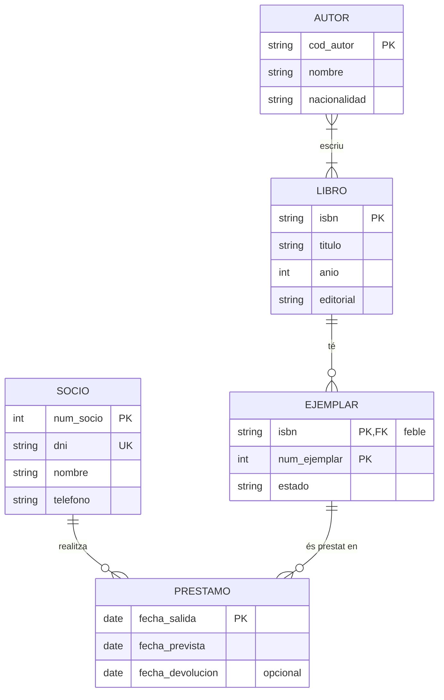
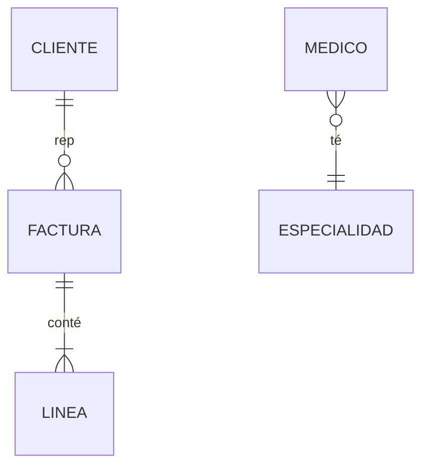
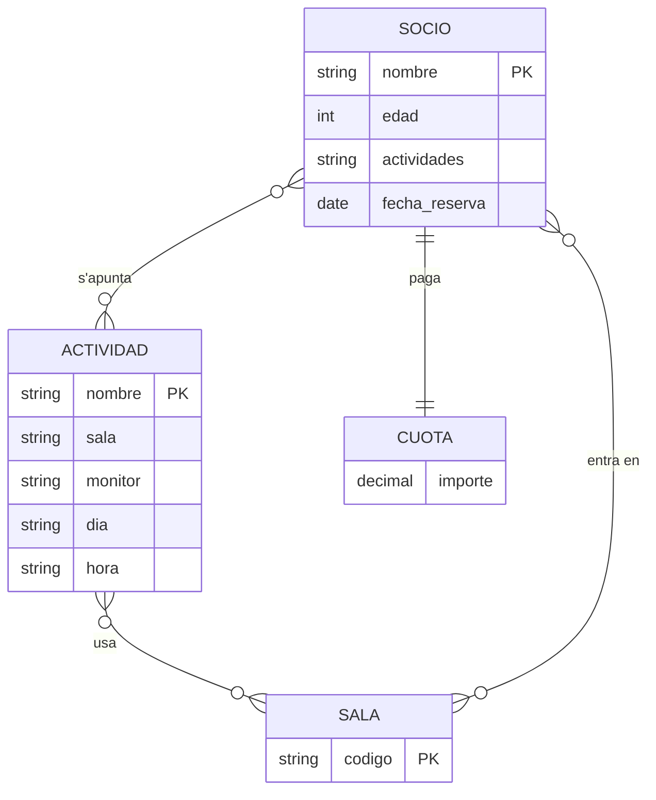
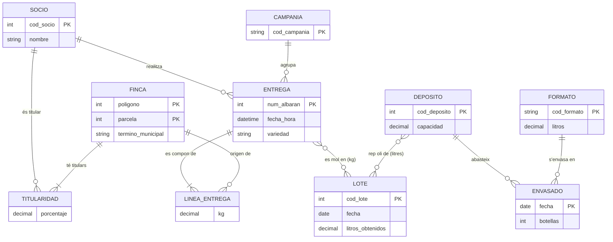
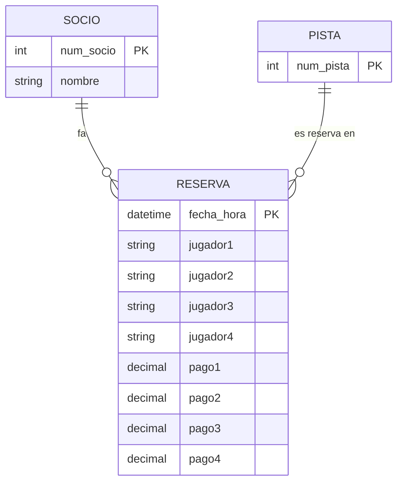
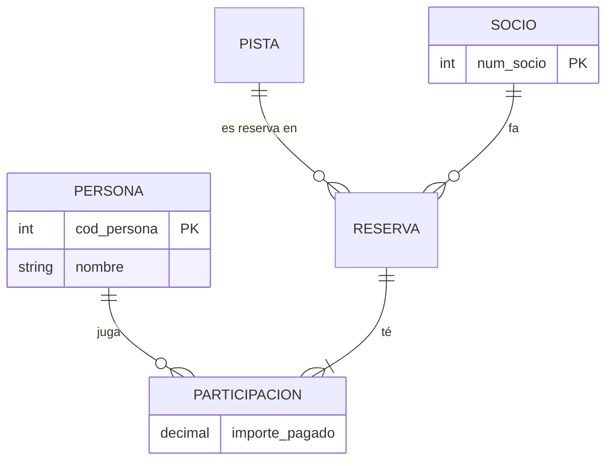

# UD02 · Pràctiques



| Pràctica | Tipus | Nivell | CE principals |
|---|---|---|---|
| [2.1 Biblioteca municipal: de l'enunciat al diagrama](#pràctica-21--biblioteca-municipal-de-lenunciat-al-diagrama) | Guiada | ●○○ | RA6.a, RA6.d, RA6.e |
| [2.2 Llegir i escriure cardinalitats](#pràctica-22--llegir-i-escriure-cardinalitats) | Guiada | ●○○ | RA6.d |
| [2.3 Plataforma de streaming](#pràctica-23--plataforma-de-streaming) | Autònoma | ●●○ | RA6.a, RA6.d, RA6.e |
| [2.4 Clínica veterinària amb jerarquies](#pràctica-24--clínica-veterinària-amb-jerarquies) | Autònoma | ●●○ | RA6.d, RA6.e, RA6.h |
| [2.5 Revisió d'un disseny defectuós](#pràctica-25--revisió-dun-disseny-defectuós) | Repte | ●●● | RA6.d, RA6.h |
| [2.6 Autoescola: ternària o agregació](#pràctica-26--autoescola-ternària-o-agregació) | Repte | ●●● | RA6.d |
| [2.7 Almàssera: l'entrevista que no ho diu tot](#pràctica-27--almàssera-lentrevista-que-no-ho-diu-tot) | Repte | ●●● | RA6.a, RA6.d, RA6.e, RA6.h |
| [2.8 Lloguer de cotxes: el model que recorda](#pràctica-28--lloguer-de-cotxes-el-model-que-recorda) | Repte | ●●● | RA6.d, RA6.e, RA6.h |
| [2.9 Enginyeria inversa: de l'albarà a les entitats](#pràctica-29--enginyeria-inversa-de-lalbarà-a-les-entitats) | Repte | ●●● | RA6.a, RA6.d, RA6.h |
| [2.10 Dos dissenys, un guanyador](#pràctica-210--dos-dissenys-un-guanyador) | Repte | ●●● | RA6.d, RA6.h |
| [Projecte EduGest · UD02](#projecte-edugest--ud02-model-conceptual) | Projecte | ●●○ | RA6.a, RA6.d, RA6.e, RA6.h |
| [Banc · Fonaments (exercicis 1-5)](#bloc-1--fonaments) | Autònoma | ●○○ | RA6.a, RA6.d, RA6.e, RA6.h |
| [Banc · Intermedi (exercicis 6-15)](#bloc-2--intermedi) | Autònoma | ●●○ | RA6.a, RA6.d, RA6.e, RA6.h |
| [Banc · Integració (exercicis 16-23)](#bloc-3--integració) | Autònoma | ●●○ → ●●● | RA6.a, RA6.d, RA6.e, RA6.h |
| [Banc · EER avançat (exercicis 24-30)](#bloc-4--eer-avançat) | Autònoma | ●●● | RA6.a, RA6.d, RA6.e, RA6.h |

> [!NOTE]
> **Com estan organitzades estes pàgines.** L'enunciat es presenta com el contaria una persona del negoci, no com una llista d'entitats: **decidir què és una entitat, un atribut o una relació forma part del treball**. Les tasques, la comprovació i els errors habituals estan plegats: desplega'ls quan els necessites, no abans de pensar.

> [!TIP]
> **Mètode per a tots els exercicis.** (1) Subratlla substantius i verbs; (2) decidix entitats i identificadors; (3) relacions i cardinalitats en **els dos sentits**; (4) atributs, inclosos els de les relacions; (5) revisa redundàncies i escriu els **supòsits** que hages hagut de fer.

---

## Pràctica 2.1 · Biblioteca municipal: de l'enunciat al diagrama



#### Objectiu

Aplicar la metodologia de cinc passos per a construir un diagrama E/R complet a partir d'un relat d'una persona del negoci.

#### Context

La biblioteca d'un barri vol deixar el quadern i passar a una base de dades. El seu responsable et conta com treballa.

#### Enunciat

> «Quan arriba un llibre nou l'apunte amb el seu ISBN, el títol, l'editorial i l'any. Hi ha llibres escrits per diverses persones i autors amb molts llibres en el nostre catàleg; de cada autor anote com es diu i d'on és, i als que es repetixen els pose un codi per a no confondre'ls.
>
> De cada llibre sol comprar diverses còpies. Les distinguisc amb un número que els apegue al llom (la 1, la 2, la 3...), i eixe número comença una altra vegada en cada llibre. Apunte també si la còpia està nova, usada o deteriorada.
>
> Els veïns es fan socis amb el seu DNI, el seu nom i un telèfon, i els done un número de carnet. Quan algú s'emporta una còpia a casa, anote el dia que se l'emporta, fins quan pot tindre-la i el dia en què la torna de veritat. Hi ha llibres que porten mesos prestats i altres que mai no han eixit. A alguns socis els he de cridar moltes vegades.»

#### Desenvolupament

Seguix els cinc passos i respon a les preguntes abans d'obrir les respostes.

{}

1. **Entitats.** Subratlla substantius i verbs. Quines tenen propietats pròpies? Hi ha algun «fet» que semble una entitat però en realitat relacione dos altres coses?

2. **Identificadors.** Per a cada entitat, quina dada la distingix de les altres? Alguna s'identifica amb un número que es repetix d'unes a altres? Quina dada candidata queda com a alternativa?

3. **Relacions i cardinalitats.** Per a cada parella, formula les dos preguntes, una en cada sentit, i decidix el mínim i el màxim. Què diu el relat sobre llibres que «mai no han eixit»?

4. **Atributs de les relacions.** A què pertanyen les dates? Pot el mateix soci emportar-se la mateixa còpia en dos ocasions? Què implica això per a identificar cada préstec?

5. **Dibuixa** el diagrama en draw.io amb la notació de Chen (*Més formes* → *Entity Relation*) i compara'l amb la solució.

{}

{}

1. **Entitats:** `LIBRO`, `AUTOR`, `EJEMPLAR` i `SOCIO`. «Préstec» no té propietats pròpies més enllà de dates: és el fet que relaciona un soci amb un exemplar, així que es modela com a **relació**. L'editorial es queda com a atribut mentre no calga guardar dades seues.
2. **Identificadors:** `LIBRO` → ISBN; `AUTOR` → codi; `SOCIO` → número de carnet (el DNI és **clau alternativa**). `EJEMPLAR`: el seu número només és únic dins del llibre, per la qual cosa és una **entitat feble** identificada per (ISBN, número).
3. **Cardinalitats:**

    | Relació | Lectura | Tipus |
    |---|---|---|
    | AUTOR *escriu* LIBRO | un autor escriu (1, N) llibres; un llibre l'escriuen (1, N) autors | N:M |
    | LIBRO *té* EJEMPLAR | un llibre té (0, N) exemplars; un exemplar és de (1, 1) llibre | 1:N identificadora |
    | SOCIO *pren en préstec* EJEMPLAR | un soci té (0, N) préstecs; un exemplar té (0, N) préstecs | N:M |

    El mínim 0 de soci i exemplar reflectix «llibres que mai no han eixit» i socis que encara no s'han emportat res.
4. **Atributs de relació:** les dates no són ni del soci ni de l'exemplar: són del préstec. Com que el mateix soci pot emportar-se la mateixa còpia diverses vegades, la **data d'eixida** forma part de la identificació de cada préstec (atribut discriminador de la relació).
5. La frase «a alguns socis els he de cridar moltes vegades» és **soroll**: no genera cap requisit de dades (podria generar-ne un si es volguera guardar un historial d'avisos). Saber descartar informació és part de l'anàlisi.

{}

{}

**Supòsits semàntics** (el que el relat no diu i hem decidit):

1. Un llibre registrat té almenys un autor conegut.
2. Pot existir un llibre sense exemplars (demanat, però encara no rebut).
3. La data real de devolució és opcional: està buida mentre el préstec continua obert.
4. L'editorial es guarda com a atribut; si calguera guardar més dades seues, seria una entitat.

{}

{}

{}
- [ ] Hi ha 4 entitats i `EJEMPLAR` està marcada com a feble (doble rectangle en Chen).
- [ ] Les dues relacions N:M tenen la cardinalitat màxima N en els dos costats.
- [ ] Les dates del préstec estan en la relació, no en `SOCIO` ni en `EJEMPLAR`.
- [ ] Has descartat la informació que no genera dades.
- [ ] Has escrit almenys tres supòsits semàntics.
{}

{}

{}

> [!WARNING]
> - Relacionar `SOCIO` amb `LIBRO` en lloc d'amb `EJEMPLAR`. El que es presta és una còpia física, no l'obra.
> - Posar `fecha_prestamo` com a atribut de `SOCIO`. Un soci té molts préstecs, així que eixe atribut només podria guardar-ne un.

{}

#### Ampliació

La biblioteca vol gestionar **reserves**: un soci pot reservar un **llibre** (no un exemplar concret) i es guarda la data de reserva. Afig esta relació i justifica per què es relaciona amb `LIBRO` i no amb `EJEMPLAR`.

---

## Pràctica 2.2 · Llegir i escriure cardinalitats



#### Objectiu

Determinar les cardinalitats mínima i màxima d'una relació a partir de frases del llenguatge natural, i a l'inrevés.

#### Desenvolupament

Per a cada frase, escriu la relació en notació (mín, màx) en els **dos sentits** i el tipus de correspondència (1:1, 1:N o N:M). Desplega la solució per a comprovar-la.

| # | Frase |
|---|---|
| a | Tot empleat treballa en un únic departament; un departament pot no tindre empleats encara. |
| b | Cada país té una capital; cada capital ho és d'un únic país. |
| c | Una comanda conté almenys un producte; un producte pot no haver-se demanat mai o aparéixer en moltes comandes. |
| d | Un empleat pot supervisar diversos empleats; tot empleat llevat del director té un supervisor. |
| e | Un vehicle d'empresa pot estar assignat a un empleat com a màxim; un empleat pot no tindre vehicle i mai no en té més d'un. |

{}
| # | Costat A | Costat B | Tipus |
|---|---|---|---|
| a | Un empleat està en (1, 1) departament | Un departament té (0, N) empleats | 1:N |
| b | Un país té (1, 1) capital | Una capital ho és de (1, 1) país | 1:1 |
| c | Una comanda té (1, N) productes | Un producte està en (0, N) comandes | N:M |
| d | Un empleat supervisa (0, N) empleats | Un empleat és supervisat per (0, 1) empleat | 1:N **reflexiva** |
| e | Un vehicle està assignat a (0, 1) empleat | Un empleat té (0, 1) vehicle | 1:1 |

En (d) el mínim és 0 perquè el director no té supervisor. Si l'enunciat diguera «tot empleat té supervisor», el diagrama obligaria que existisca un cicle infinit de caps.
{}

#### Segona part: del diagrama a la frase

Escriu en llenguatge natural el que expressa cada diagrama:

{}
- Un client rep zero o moltes factures; cada factura és d'exactament un client.
- Una factura conté una o moltes línies; cada línia pertany a exactament una factura.
- Cada metge té exactament una especialitat; una especialitat pot tindre zero o molts metges.
{}

---

## Pràctica 2.3 · Plataforma de streaming



#### Context

Tres amics preparen el llançament d'un servei de vídeo sota demanda i et demanen el model conceptual. Este és el correu que t'envien.

#### Enunciat

> «Hola. Us contem com volem que funcione *Cinefilia*.
>
> La gent es registra amb el seu NIF, el seu nom i cognoms, un correu (no volem dos comptes amb el mateix) i una adreça de facturació: carrer, codi postal i ciutat. Hi haurà tres tarifes —bàsica, estàndard i premium— que es diferencien en el que costen al mes i en quantes pantalles es poden usar alhora. Cada client en té contractada una.
>
> En el catàleg, cada pel·lícula té el seu títol, any i durada. La classifiquem per gèneres perquè la gent busca «comèdia romàntica» o «ciència-ficció», i també volem que es puga buscar per actor i que en la fitxa es veja qui fa de qui.
>
> Necessitem saber què veu cada client i quan —a quina hora va començar i fins a quin minut va arribar— per a oferir «continuar veient». Sí, hi ha qui veu tres vegades la mateixa pel·li. I els clients podran puntuar-les d'1 a 5 estreles, però una sola vegada per pel·lícula, que si no es manipulen les mitjanes.»

{}

1. Diagrama E/R complet en la notació que preferisques (indica quina).
2. **Diccionari de dades**: taula amb entitat o relació, atribut, descripció, tipus de dada conceptual (text, número, data...) i si és obligatori.
3. Llista de **supòsits semàntics**.
4. Dos **restriccions** que el diagrama no puga expressar.

{}

{}

{}
- [ ] `género` està modelat com a **entitat** o com a **atribut multivaluat**, i justifiques l'elecció.
- [ ] `personaje` és un atribut de la relació actor–pel·lícula.
- [ ] *Visualització* i *valoració* són relacions **distintes**: una es repetix i l'altra no.
- [ ] L'adreça apareix com a atribut **compost**.
- [ ] La tarifa és una entitat amb les seues pròpies dades, no un text en el client.
- [ ] Entre les restriccions textuals està «la puntuació està entre 1 i 5» o una altra semblant.
{}

{}

{}

Les dos relacionen `CLIENTE` i `PELICULA`, però la visualització pot repetir-se (s'identifica també per la data i hora), mentre que la valoració és única per parella client-pel·lícula. Són dos fets distints: dues relacions distintes.

{}

#### Ampliació

Afig **sèries**, compostes per temporades (1, 2, 3...) i episodis numerats dins de cada temporada. Quantes entitats febles apareixen? De qui depén cadascuna?

---

## Pràctica 2.4 · Clínica veterinària amb jerarquies



#### Context

Una clínica veterinària de grandària mitjana estrena sistema de gestió. La gerent descriu el seu dia a dia.

#### Enunciat

> «Ací treballem onze persones, i de totes guarde el DNI, el nom, el telèfon i el dia que van començar. Els que passen consulta són veterinaris, amb el seu número de col·legiat i la seua especialitat; els auxiliars tenen una titulació; i en el taulell estan els administratius, dels quals apunte els idiomes que parlen perquè els estrangers ho agraïxen. Ningú no fa dos coses: o és una o és l'altra.
>
> Als clients els coneixem per les seues mascotes: xip, nom, data de naixement i espècie. Cada mascota és d'un client, encara que un client pot portar-ne diverses. Dels gossos anote la raça i si la llei els considera potencialment perillosos; dels gats, si estan esterilitzats. Amb la resta (conills, tortugues...) no cal res especial.
>
> Cada consulta la passa un veterinari a una mascota un dia concret. Anote el motiu, el diagnòstic i el que recepta, amb la dosi de cada medicament (nom comercial i un codi intern). De vegades un auxiliar fa una mà.»

{}

1. Diagrama EER amb totes les jerarquies.
2. Classifica cada jerarquia com a total/parcial i disjunta/solapada i **justifica-ho amb una frase del text**.
3. Decidix si `CONSULTA` és una entitat o una relació. Raona les dues opcions.
4. Escriu les restriccions que no pot arreplegar el diagrama (per exemple, sobre la dosi o sobre qui pot receptar).
5. Identifica quina informació del text **no** dona lloc a cap dada que calga guardar.

{}

{}

{}
- [ ] La jerarquia d'empleats és **total i disjunta**.
- [ ] La jerarquia de mascotes és **parcial i disjunta**.
- [ ] Els atributs comuns estan en la superclasse i només els específics en les subclasses.
- [ ] El client apareix com a entitat encara que el text «el coneix per les seues mascotes».
- [ ] La dosi és un atribut de la relació consulta–medicament.
{}

{}

{}

- **Empleats:** superclasse `EMPLEADO` (DNI, nom, telèfon, data d'alta) amb tres subclasses. *Total* («els que passen consulta són… els auxiliars… els administratius… de totes») i *disjunta* («ningú no fa dos coses»).
- **Mascotes:** `MASCOTA` amb subclasses `PERRO` i `GATO`. *Parcial* («amb la resta no cal res especial») i *disjunta* (un animal no és gos i gat alhora).
- **Client:** no s'enumeren els seus atributs en el text. És una entitat amb identificador a decidir (supòsit: DNI) perquè «cada mascota és d'un client» (1:N).
- **Consulta:** pot ser entitat (amb identificador propi) o relació ternària veterinari–mascota–data. És entitat si es vol penjar d'ella els auxiliars i els medicaments amb facilitat; la dosi sempre va en la relació *recepta* entre consulta i medicament.
- **Auxiliar en consulta:** relació 0..N, opcional («de vegades»).
- **Informació descartada:** «onze persones» és una dada puntual, no un requisit.

{}

#### Ampliació

Com canviaria el model si un empleat poguera ser alhora auxiliar i administratiu? I si es volguera guardar l'**historial de llocs** de cada empleat amb les seues dates?

---

## Pràctica 2.5 · Revisió d'un disseny defectuós



#### Context

Un company ha dissenyat el model d'un **gimnàs** i et demana que el revises abans de passar a taules. L'enunciat és: *«Els socis s'apunten a activitats (spinning, ioga...) que s'imparteixen en sales. Cada sessió d'una activitat té dia, hora, sala i monitor. Un soci reserva plaça en sessions concretes. Cada soci té una quota mensual»*.

#### Enunciat

Fes la revisió com la faria un company sènior: no saps quants problemes hi ha. Per a cadascun que troves indica l'element afectat, el tipus d'error, la seua conseqüència i la correcció. Després dibuixa el diagrama corregit i decidix si hi ha alguna cosa que **no** pots corregir sense preguntar al client.

{}
Identificadors inestables, atributs derivats, atributs multivaluats amagats en un text, atributs col·locats en l'entitat equivocada, entitats que no tenen identificador, conceptes que haurien de ser entitats (monitor, sessió), relacions redundants.
{}

{}
1. `nombre` com a clau de `SOCIO`: els noms es repetixen. → Afegir `num_socio`.
2. `edad`: atribut derivat que es desactualitza. → `fecha_nacimiento`.
3. `actividades` com a text en `SOCIO`: multivaluat amagat i redundant amb la relació. → Eliminar-lo.
4. `fecha_reserva` en `SOCIO`: és un atribut de la reserva. → Moure'l a la relació.
5. `dia`, `hora`, `sala` i `monitor` en `ACTIVIDAD`: una activitat té moltes sessions. → Crear `SESION` (feble d'`ACTIVIDAD` o amb identificador propi) amb dia i hora, relacionada amb `SALA` i `MONITOR`.
6. `monitor` com a text: té dades pròpies i participa en relacions. → Entitat `MONITOR`.
7. `CUOTA` sense identificador i en relació 1:1 obligatòria: si només guarda l'import, és un atribut de `SOCIO`; si es vol l'historial de pagaments, és una entitat feble `PAGO` amb mes i any.
8. `SOCIO` *entra en* `SALA`: redundant; es deduïx de les sessions reservades.
9. El soci no s'apunta a una activitat sinó que **reserva sessions**: la relació ha de ser SOCIO–SESION.
{}

---

## Pràctica 2.6 · Autoescola: ternària o agregació



#### Enunciat

> «En la nostra autoescola cada alumne fa les pràctiques amb el professor que li assignem, sempre en un dels nostres cotxes (cadascun amb la seua matrícula, marca i model). Apuntem el dia i l'hora de cada classe i els quilòmetres que fan. Al llarg del curs un alumne pot fer classe amb diversos professors, i un professor pot fer classe en diversos cotxes.
>
> Quan un alumne ha acabat amb un professor i este el considera preparat, demanem examen davant de la DGT: s'anota la data i si aprova o suspén. Hi ha alumnes que mai no arriben a presentar-se, i els que es presenten poden fer-ho més d'una vegada.»

{}

1. Modela les classes pràctiques com una relació **ternària** alumne–professor–vehicle. Calcula la cardinalitat de cada entitat fixant les altres dos.
2. Modela l'examen. Explica per què una **agregació** de la relació alumne–professor és millor que una ternària amb `EXAMEN`, i què canvia perquè puga repetir-se.
3. Explica quina informació es perdria si substituïxes la ternària del punt 1 per tres relacions binàries.

{}

{}

{}
- [ ] La ternària inclou la data i l'hora com a atributs i justifiques la seua cardinalitat (amb diversos alumnes, professors i vehicles sol ser N:M:P).
- [ ] L'agregació permet que hi haja parelles alumne–professor **sense** examen.
- [ ] Has identificat cada examen amb alguna cosa més que la parella alumne–professor (la data).
- [ ] S'explica amb un exemple concret la pèrdua d'informació de les binàries.
{}

{}

{}

- **Ternària `clase`:** un alumne rep classe de molts (professor, vehicle); un professor de molts (alumne, vehicle); un vehicle de molts (alumne, professor). Cardinalitat N:M:P amb atributs `fecha`, `hora` i `kilometros`; `fecha` i `hora` formen part de la identificació perquè la mateixa terna es repetix.
- **Agregació:** `MATRICULA` = relació alumne–professor tractada com a entitat. Es relaciona amb `EXAMEN` (0,N), de manera que hi ha matrícules sense examen i matrícules amb diversos. Amb una ternària alumne–professor–examen la parella estaria obligada a participar.
- **Tres binàries:** es perd *quin alumne va fer classe amb quin professor en quin cotxe*. Si Ana ha fet classe amb Luis i amb Marta, i Luis i Marta han usat el cotxe 1, no se sap si Ana va usar el cotxe 1 amb Luis o amb Marta.

{}

---

## Pràctica 2.7 · Almàssera: l'entrevista que no ho diu tot



#### Context

Una cooperativa d'oli vol registrar la traçabilitat de la seua producció. Esta és la transcripció de la reunió amb el gerent. Com ocorre en la realitat, **el client no t'ho conta tot, es contradiu i barreja coses que no són del teu sistema**.

#### Enunciat

> **Gerent:** Som uns cent vint socis. Cadascun té les seues finques, encara que hi ha finques que són de dos germans i llavors cadascun té la seua part. Una finca s'identifica pel seu polígon i la seua parcel·la, i està en un terme municipal.
>
> **Tu:** Què lliuren els socis?
>
> **Gerent:** En campanya, que va d'octubre a gener, porten l'oliva en remolc. Es pesa a l'entrada i se'ls dona un albarà amb el seu número. Normalment és d'una sola finca, però de vegades un soci barreja dos finques en el mateix viatge. El que no volem és que es barreje oliva de varietats distintes, això es rebutja.
>
> **Tu:** I després?
>
> **Gerent:** Es mol per lots. En cada lot entra el de diversos socis, de vegades de diversos dies. Del lot volem saber quant oli ha eixit, que se'ns pregunta molt pel rendiment. L'oli va a un dipòsit, i d'allí s'envasa en ampolles de diferent grandària. Cada tanda d'envasament l'anote amb la seua data i el nombre d'ampolles.
>
> **Tu:** La venda també va en el sistema?
>
> **Gerent:** No, això ho portem amb el programa de facturació. Però sí que m'importa que, si un client es queixa d'una ampolla, jo puga dir de quines finques ve l'oli que porta. Això ens ho exigix la inspecció.
>
> **Tu:** I l'oli d'un lot pot acabar en diversos dipòsits?
>
> **Gerent:** Doncs… depén. Quasi sempre en un, però si el dipòsit s'ompli, es passa al següent.

{}

1. Redacta una llista d'**almenys cinc preguntes** que faries al gerent perquè l'entrevista deixa caps solts. Per a cadascuna, indica quina decisió de disseny depén de la resposta.
2. Delimita l'**abast**: quina part de la conversa **no** pertany al teu model i per què.
3. Elabora el diagrama E/R triant l'opció més raonable en cada ambigüitat i arreplegant-la com a **supòsit**.
4. Demostra la **traçabilitat**: escriu, com una seqüència de relacions, el camí que recorres en el teu diagrama des d'una ampolla fins a les finques d'origen. Quina part del camí perd precisió?
5. Escriu tres restriccions que el teu diagrama no pot expressar (per exemple, sobre la varietat o sobre qui lliura de quina finca).

{}

{}

{}
- [ ] Hi ha una relació entre `SOCIO` i `FINCA` que admet el repartiment del percentatge de propietat.
- [ ] El lliurament i la molturació són **relacions N:M amb atributs**: un lliurament pot alimentar diversos lots i un lot arreplega diversos lliuraments.
- [ ] La relació entre lot i dipòsit s'ha justificat amb una pregunta al client.
- [ ] La venda i la facturació no apareixen en el diagrama.
- [ ] Has identificat el tram del camí ampolla → finca que perd precisió i per què.
{}

{}

{}

| Pregunta | Què decidix |
|---|---|
| Quant pesa cada finca en un lliurament que barreja dos finques? | Si el pes es guarda **per finca** (el lliurament es divideix en línies) o només per lliurament. Afecta la traçabilitat. |
| Es registra el percentatge de propietat de cada germà? Pot canviar amb els anys? | Atribut `porcentaje` en la relació soci–finca; si canvia, necessita història (vore pràctica 2.8). |
| Quant oli de cada lot va a cada dipòsit? | Relació lot–dipòsit 1:N o N:M amb quantitat. |
| Es barreja oli de lots distints en un dipòsit? I s'envasa des de dipòsits barrejats? | Traçabilitat cap arrere: passa de ser un arbre a un graf. Cal decidir fins a on es garantix. |
| Qui lliura, el titular de la finca o qualsevol soci? | Restricció d'integritat: el que lliura ha de ser titular de la finca, no expressable en el diagrama. |
| La «campanya» té identitat pròpia (dates, preu) o és només un any? | Entitat `CAMPAÑA` o atribut. |

{}

{}

- `LINEA_ENTREGA` és una entitat feble d'`ENTREGA`: guarda els quilos de **cada finca** en un viatge i és el que permet la traçabilitat per finca.
- La traçabilitat és **ampolla → envasament → dipòsit → lot → lliurament → línia → finca**. La part *dipòsit → lot* és la que perd precisió: si un dipòsit barreja lots, només es pot afirmar que l'oli procedix d'**algun** d'ells.
- Restriccions: (1) el soci del lliurament és titular de totes les finques de les seues línies; (2) la varietat de totes les línies d'un lliurament és la mateixa; (3) la suma de litres d'un lot repartits en dipòsits coincidix amb els litres obtinguts.
- Fora de l'abast: comandes, clients i factures.

{}

---

## Pràctica 2.8 · Lloguer de cotxes: el model que recorda



#### Context

Un disseny que només guarda «el que és veritat ara» oblida el que ja ha passat. Una empresa de lloguer de cotxes necessita poder explicar una factura de fa tres anys.

#### Enunciat

> «Tenim diverses sucursals i una flota de cotxes. Cada cotxe està assignat a una sucursal, encara que el movem entre elles segons la temporada; per a les auditories necessitem saber on va estar cada cotxe en cada moment.
>
> Els cotxes s'agrupen per categoria (econòmic, familiar, de luxe) i cada categoria té una tarifa diària que revisem cada any. Quan un client signa un contracte, es queda amb el preu que hi havia eixe dia, encara que després pugi. Si algú reclama, hem de demostrar quina tarifa estava vigent.
>
> Dels clients guardem nom, document i l'adreça on se'ls envien les factures. Les factures han de mostrar l'adreça que tenia el client quan es van emetre, no l'actual.
>
> Els empleats tenen una categoria professional (agent, supervisor, director) que pot canviar amb els anys; el sou depén d'ella. Ens demanen informes del tipus «quants supervisors hi havia al març de 2024».
>
> Un contracte és d'un client, per a un cotxe, entre dos dates, i el gestiona un empleat de la sucursal des de la qual es lliura el cotxe.»

{}

1. Localitza **totes les frases** de l'enunciat que exigixen conservar el passat i classifica-les: relació que canvia, atribut que canvia, o valor que ha de «congelar-se» en un document.
2. Per a cadascuna, decidix com es modela (atributs de data en la relació, entitat històrica, còpia del valor en el document) i com canvia la **cardinalitat** en incorporar el temps (per exemple, una relació 1:N ara, què és al llarg del temps?).
3. Escriu la restricció que **no pots expressar** amb el diagrama i que garantix que els períodes d'una mateixa entitat no se solapen.
4. Elabora el diagrama E/R final.
5. Raona en quin cas s'accepta **repetir** una dada (el preu en el contracte) i per què això no es considera redundància nociva.

{}

{}

{}
- [ ] L'assignació cotxe–sucursal és una relació **N:M amb data d'inici i de fi** (o una entitat històrica), no un atribut del cotxe.
- [ ] La tarifa és una entitat vinculada a la categoria amb una data de vigència, i el contracte guarda la seua pròpia còpia del preu.
- [ ] L'adreça de facturació està versionada, o copiada en la factura.
- [ ] La categoria professional de l'empleat té historial.
- [ ] Has escrit la restricció de no solapament de períodes.
{}

{}

{}

| Frase de l'enunciat | Tipus | Modelatge |
|---|---|---|
| «On va estar cada cotxe en cada moment» | Relació que canvia | `COCHE`–`SUCURSAL` N:M amb `fecha_inicio` i `fecha_fin` (l'actual té fi nul). Un cotxe està en **una** sucursal en cada instant, però **al llarg del temps** en moltes. |
| «Tarifa que revisem cada any» | Atribut que canvia | Entitat `TARIFA` (categoria, data de vigència, preu dia). Identificada per (categoria, data d'inici). |
| «Es queda amb el preu d'eixe dia» | Valor que es congela | Atribut `precio_dia` **en el contracte**: còpia deliberada de la tarifa vigent. No és redundància nociva: és una dada signada que no ha de canviar quan canvie la tarifa. |
| «Adreça que tenia el client quan es va emetre la factura» | Atribut que canvia | O bé `DIRECCION_CLIENTE` amb període de vigència, o bé còpia de l'adreça en la `FACTURA`. Es preferix la còpia en el document si no es necessita l'historial de domicilis. |
| «Categoria professional que canvia amb els anys» | Atribut que canvia | Relació `EMPLEADO`–`CATEGORIA` N:M amb període. El sou depén de la categoria, no de l'empleat. |

**Restriccions textuals:** (1) els períodes d'un mateix cotxe en sucursals no se solapen i no hi ha buits; (2) la tarifa d'una categoria no se solapa amb una altra de la mateixa categoria; (3) el contracte ha de ser gestionat per un empleat que, en la data de lliurament, estava en la sucursal des de la qual es lliura el cotxe.

**Lectura crítica:** tractar el temps multiplica el nombre de relacions N:M. Abans d'aplicar-lo a tot, pregunta al negoci quina història necessita realment.

{}

---

## Pràctica 2.9 · Enginyeria inversa: de l'albarà a les entitats



#### Context

En moltes empreses no hi ha requisits escrits: hi ha **documents** (albarans, factures, fulls de càlcul) i la gent que els usa. Un bon analista sap llegir un document i deduir el model que hi ha darrere.

#### Enunciat

Una distribuïdora de begudes per a hostaleria et lliura dos documents reals amb les dades sensibles substituïdes.

**Document A: albarà de lliurament**

| | |
|---|---|
| **Distribuciones Marina S. L.** · CIF B-12345678 | **Albarà núm. 2026/004871** |
| Data: 14/09/2026 | Ruta: R-03 (Costa Nord) · Repartidor: M. Soler · Furgoneta 4512-KLM |
| **Client:** 00418 · Bar La Gamba · CIF B-98765432 | **Lliurar a:** C/ del Puerto, 12 · 03700 Dénia |

| Ref. | Descripció | Format | Uds. | Preu | Dte. | Import |
|---|---|---|---:|---:|---:|---:|
| 1021 | Cervesa rossa 33 cl | Caixa 24 | 10 | 17,40 | 0 % | 174,00 |
| 1045 | Aigua mineral 50 cl | Pack 12 | 6 | 3,90 | 0 % | 23,40 |
| 2310 | Ginebra premium 70 cl | Ampolla | 4 | 19,50 | 10 % | 70,20 |
| 2310 | Ginebra premium 70 cl (promoció 3×2) | Ampolla | 2 | 0,00 | 0 % | 0,00 |

Base imposable: 267,60 € · IVA 10 % sobre 23,40 €: 2,34 € · IVA 21 % sobre 244,20 €: 51,28 € · **Total: 321,22 €** · Pagament: transferència a 30 dies · Rebut del client: signatura i DNI

**Document B: full de ruta del repartidor (fragment de full de càlcul)**

| Data | Repartidor | Furgoneta | Client | Hora d'arribada | Hora d'eixida | Incidències |
|---|---|---|---|---|---|---|
| 14/09 | M. Soler | 4512-KLM | 00418 | 09:42 | 09:58 | – |
| 14/09 | M. Soler | 4512-KLM | 00533 | 10:15 | 10:31 | Client tancat, es deixa en un veí |
| 15/09 | M. Soler | 7781-HTB | 00418 | 09:30 | 09:41 | Falten 2 caixes |

{}

1. Dedueix les **entitats** que hi ha darrere dels dos documents i els seus identificadors. Quines entitats apareixen en els dos?
2. Distingeix en l'albarà els **atributs bàsics** dels **derivats** (que es calculen a partir d'altres) i dels que són **còpia** d'una dada que podria canviar (per exemple, el preu).
3. Identifica el **grup repetit** de l'albarà i decidix si és un atribut multivaluat o una entitat/relació.
4. Descobrix almenys **dos inconsistències o preguntes** que el document deixa obertes (per exemple, l'IVA).
5. Dibuixa el diagrama E/R i escriu el diccionari de dades amb una columna «derivat / còpia / bàsic».

{}

{}

{}
- [ ] L'albarà és una entitat i les seues línies formen una relació N:M amb atributs entre albarà i producte (o una entitat feble de línia).
- [ ] `importe`, `base imponible`, `IVA` i `total` estan marcats com a derivats.
- [ ] El preu de la línia es tracta com a còpia del preu de catàleg en el moment del lliurament.
- [ ] Repartidor, furgoneta i ruta formen un conjunt que es repetix en els dos documents i no es repetix com a text.
- [ ] Has assenyalat què fa que els dos documents descriguen dos fets distints (lliurament i visita).
{}

{}

{}

**Entitats i relacions:** `CLIENTE` (codi; CIF com a alternativa, adreça de lliurament), `PRODUCTO` (referència, descripció, format), `ALBARAN` (número, data, forma de pagament, signatura), `LINEA_ALBARAN` (feble d'`ALBARAN`: núm. de línia, unitats, preu, descompte), `REPARTIDOR`, `FURGONETA` (matrícula), `RUTA`, i la relació `VISITA` (document B) entre client, repartidor i furgoneta amb hora d'arribada, hora d'eixida i incidències.

**Derivats:** `importe` = unitats × preu × (1 − descompte); `base imponible` = suma d'imports; `IVA` = suma per tipus; `total` = base + IVA.

**Còpies:** `precio` i `descuento` de la línia són còpies del catàleg vigent: si canvia el catàleg, l'albarà no ha de canviar.

**Preguntes obertes que el document deixa:**
1. L'albarà barreja **dos tipus d'IVA** (10 % per a l'aigua i 21 % per a la resta): el tipus depén del producte. Falta saber si `tipo_iva` és atribut de `PRODUCTO` (i llavors canvia amb la llei) o ha de copiar-se en la línia perquè l'albarà no canvie.
2. La línia de promoció «3×2» té preu 0: és una línia més de l'albarà o un descompte? Afecta el model (entitat `PROMOCION`?).
3. El client té una adreça de lliurament distinta de la fiscal? S'imprimix una sola.
4. És el mateix l'albarà i la visita? No: un albarà es lliura en una visita, però pot haver-hi visites sense albarà (client tancat) i un dia pot haver-hi diversos albarans en una mateixa visita.

**Fet clau:** el document A i el B semblen parlar del mateix, però descriuen fets distints. L'anàlisi consistix a separar el que es lliura (albarà) del que es visita (visita).

{}

---

## Pràctica 2.10 · Dos dissenys, un guanyador



#### Context

Un bon disseny no es valora per com es veu, sinó per si **suporta les situacions reals** del negoci. Una tècnica útil és escriure casos de prova i comprovar si el disseny pot representar-los.

#### Enunciat

Un club de pàdel ha rebut dos propostes de model i no sap quina triar. El club descriu així la seua operativa:

> «Els socis reserven una pista per a una hora concreta. En cada reserva juguen quatre persones, però de vegades només dos. Els que no són socis són convidats, i d'ells només apuntem el nom. Cada jugador paga la seua part, encara que de vegades un paga per tots. Amb el temps, alguns convidats acaben fent-se socis. Volem poder contestar a: quantes vegades ha jugat cada persona?, qui juga habitualment amb qui? i què deu cadascú?»

**Proposta A**

**Proposta B**

{}

1. Escriu una taula amb **almenys huit casos de prova** extrets de l'enunciat (per exemple: partit de dos jugadors, convidat que es fa soci, pagaments creuats…) i marca, per a cada proposta, si pot representar-lo, si el representa amb dificultat o si no pot.
2. Respon, per a cada pregunta del club, quin disseny la resol sense esforç i quin no.
3. Redacta les **tres correccions** que caldria incorporar a la proposta guanyadora per a suportar tots els casos.
4. Dibuixa el disseny final.

{}

{}

{}
- [ ] Has detectat que A conté un grup repetit (`jugador1..4`) i que no admet partits de dos ni de cinc.
- [ ] Has vist que B resol «quantes vegades ha jugat cada persona?», però no distingix qui va pagar per qui.
- [ ] El teu disseny final tracta socis i convidats com a **especialització** de persona (o amb un atribut de condició).
- [ ] Has proposat com registrar que un convidat es fa soci sense perdre el seu historial.
{}

{}

{}

| Cas de prova | A | B |
|---|---|---|
| Partit de dos jugadors | Deixa columnes buides | Sí |
| Quatre jugadors | Sí | Sí |
| Convidat sense fitxa | No hi ha entitat: el nom és només un text | Sí (`PERSONA`) |
| Convidat que es fa soci | Perd el seu historial en canviar de text a soci | Sí: se li afig l'especialització de soci |
| Un jugador paga per tots | Cal sumar les columnes | Parcialment: falta saber **qui** va pagar |
| Quantes vegades ha jugat cada persona? | Cal buscar en quatre columnes | Sí |
| Qui juga amb qui? | Molt difícil | Sí (autoconsulta sobre la participació) |
| Què deu cadascú? | Barrejat amb `pagoN` | Sí, si l'import se separa de «el que ha pagat un altre» |

**Millores a B:**
1. `PERSONA` és la superclasse; `SOCIO` és una especialització parcial. Així el convidat es converteix en soci sense canviar d'identitat.
2. `PARTICIPACION` guarda `importe_a_pagar`, i s'afig una relació `PAGO` entre participació i persona pagadora per a representar «paga per tots».
3. La reserva guarda com a atribut qui la fa, sense obligar que siga soci si el club decidira permetre-ho.

**Lliçó:** el grup repetit és la forma habitual de fer que un model no escale. El senyal d'alarma són atributs numerats (`jugador1`, `jugador2`...).

{}

---

## Projecte EduGest · UD02: model conceptual



#### Objectiu

Construir el model conceptual complet del projecte transversal.

#### Enunciat

Llig l'[entrevista amb la direcció d'estudis](/guia/proyecto-edugest#1-enunciat-entrevista-amb-la-direcció-destudis) com ho faria un analista: ací no s'enumeren les entitats i hi ha detalls que es mencionen de passada. El [cas guiat de la teoria](/ud02-modelo-er/ud02-teoria#8-cas-guiat-el-model-er-dedugest) en resol una part.

{}

1. El **diagrama E/R** amb totes les entitats, relacions, cardinalitats, atributs i identificadors. Completa'l fins a cobrir tot el que conta l'entrevista.
2. El **diccionari de dades** (entitat, atribut, descripció, domini, obligatori, identificador).
3. Els **supòsits semàntics**.
4. Les **restriccions textuals**: almenys cinc regles que el diagrama no pot representar.
5. Una llista de **preguntes que faries a la direcció d'estudis** perquè l'entrevista no les resol.

{}

{}

{}
- [ ] La relació *és cap de* entre `PROFESOR` i `DEPARTAMENTO` és distinta de *pertany a*.
- [ ] *Imparteix* relaciona professor, mòdul i grup, i inclou el curs acadèmic. Justifiques si és ternària.
- [ ] Les faltes d'assistència depenen de la matrícula, no només de l'alumne.
- [ ] Totes les decisions dubtoses estan en la llista de supòsits.
{}

{}

> [!IMPORTANT]
> No consultes encara la solució de referència del projecte. El teu disseny es revisarà a classe i l'usaràs en la UD03. Les diferències amb la referència es discutiran en la UD04.

---

## Banc d'exercicis

30 exercicis per a practicar el disseny conceptual, **ordenats de menor a major dificultat** en quatre blocs. Cada exercici té el mateix format que les pràctiques: context i enunciat a la vista, i **objectiu, tasques, comprovació, errors habituals i solució plegats** (dibuixada amb la notació EER que usem a classe). Els enunciats estan escrits sense ressaltar les entitats: reconéixer-les és part de l'exercici.

| Bloc | Exercicis | Què introduïx | A més del diagrama es demana |
|---|---|---|---|
| Fonaments ●○○ | 1-5 | Entitats, atributs, identificadors, relacions 1:N i N:M, atributs de relació i una primera relació reflexiva. | Diagrama i supòsits |
| Intermedi ●●○ | 6-15 | Relacions 1:1, N:M reflexives, entitats febles, atributs compostos, multivaluats i derivats, i diverses relacions entre les mateixes entitats. | Justificar decisions i escriure restriccions textuals |
| Integració ●●○ → ●●● | 16-23 | Relacions ternàries, agregació, dues relacions entre les mateixes entitats, llistes de materials, cardinalitats màximes concretes i primera generalització. | Classificar jerarquies, comparar ternària i agregació, diccionari parcial |
| EER avançat ●●● | 24-30 | Diverses especialitzacions en un mateix model, cadenes d'entitats febles, ternàries amb atributs i casos d'integració complets. | Diccionari de dades, restriccions i taules previstes |



> [!IMPORTANT]
> **Com es llig el rombe.** Cada meitat del rombe mira a una entitat. La meitat és **negra** si el màxim escrit junt a eixa entitat és N (o un nombre major que 1) i **blanca** si és 1. Així, un rombe blanc és 1:1, un mig blanc i mig negre és 1:N i un negre sencer és N:M. En les ternàries es divideix un triangle en tres sectors amb el mateix criteri. Junt a cada punta es repetix el màxim (1 o N).

> [!IMPORTANT]
> **Conveni de cardinalitats.** El parell (mín, màx) escrit **junt a una entitat** indica amb quantes instàncies d'**eixa** entitat es relaciona una instància de l'altra. És el mateix conveni de la [teoria](/ud02-modelo-er/ud02-teoria#71-equivalència-entre-la-notació-de-chen-i-la-pota-de-gall). En una relació ternària, el parell junt a una entitat compta quantes instàncies d'ella corresponen a cada parella de les altres dos.

> [!TIP]
> **Com treballar un exercici.** Aplica el mètode d'ací dalt, dibuixa en paper o en draw.io, omple la llista de comprovació i només llavors desplega la solució. Si el teu diagrama difereix, no vol dir que estiga malament: compara els **supòsits**. Dos dissenys distints són vàlids si responen igual a les regles de l'enunciat.

> [!NOTE]
> Els atributs s'escriuen en `snake_case` perquè servisquen de noms de columna en la [UD03](/ud03-modelo-relacional/ud03-teoria). Les entitats febles porten doble rectangle i l'etiqueta **ID** (dependència en identificació) o **E** (dependència en existència) junt a la relació de la qual depenen. El subratllat discontinu marca el discriminador d'una entitat feble i l'atribut d'una relació que permet repetir la mateixa combinació d'entitats (per exemple, la data d'una multa). El subratllat de punts marca una clau alternativa. En les generalitzacions, **T/P** indica total o parcial i **D/S**, disjunta o solapada.

---

## Bloc 1 · Fonaments

Entitats, atributs, identificadors, relacions 1:N i N:M, atributs de relació i una primera relació reflexiva.

### Exercici 1 · Vendes: clients, productes i proveïdors



{}

Identificar entitats, atributs i identificadors i distingir una relació 1:N d'una N:M.

{}

#### Context

Una xicoteta empresa de distribució vol informatitzar les seues vendes i les seues compres a proveïdors.

#### Enunciat

> Una empresa comercialitza productes a clients finals i s'abastix mitjançant proveïdors externs.
>
> De cada client es coneixen el DNI, el nom, els cognoms, l'adreça i la data de naixement. Un client pot comprar diversos productes i un mateix producte pot ser adquirit per diferents clients.
>
> De cada producte s'emmagatzema un codi identificatiu, el nom i el preu unitari.
>
> Els productes els subministren proveïdors. Cada producte el subministra un únic proveïdor (exclusiu), mentre que un proveïdor pot subministrar diversos productes. De cada proveïdor es desitja conéixer el NIF, el nom i l'adreça.

{}

1. Dibuixa el diagrama EER en notació de Chen: entitats, atributs, claus i relacions amb la seua cardinalitat (mín, màx).
2. Explica amb una frase per què *comprar* és N:M i *subministrar* és 1:N.
3. Anota els supòsits sobre les cardinalitats **mínimes**, que l'enunciat no indica.

{}

{}

{}
- [ ] Hi ha tres entitats i dues relacions, cadascuna amb el seu rombe.
- [ ] El màxim és 1 junt a `PROVEEDOR` (cada producte té un únic proveïdor) i N junt a `PRODUCTO`.
- [ ] Cada entitat té el seu identificador subratllat.
- [ ] Has escrit almenys dos supòsits.
{}

{}

{}

> [!WARNING]
> - Dibuixar *compra* com 1:N perquè «un client compra productes». Formula sempre la pregunta en **els dos sentits**.
> - Posar el NIF del proveïdor com a atribut de `PRODUCTO`. Repetiries les dades del proveïdor en cada producte.

{}

#### Ampliació

L'empresa vol guardar la **data** i la **quantitat** de cada compra. On col·loques eixos atributs? Quin problema apareix si un client compra el mateix producte en dos dies distints?

{}



**Decisions de disseny**

- *Compra* és **N:M**: un client compra molts productes i un producte el compren molts clients.
- *Subministra* és **1:N**: el màxim és 1 en el costat del proveïdor. Per això no cal una taula intermèdia quan es passe al model relacional (UD03).
- Els atributs de cada entitat són els de l'enunciat; el DNI, el codi i el NIF identifiquen.

**Supòsits semàntics**

1. Un client pot estar registrat sense haver comprat encara: (0,N).
2. Tot producte té proveïdor: (1,1).
3. Un proveïdor pot estar donat d'alta sense productes: (0,N).
4. El DNI, el codi del producte i el NIF no es repetixen.

{}

---

### Exercici 2 · Pel·lícules en streaming



{}

Convertir en entitats les dades per les quals es busca (actor, gènere) i descobrir que un fet («haver vist») és una relació, no un atribut booleà.

{}

#### Context

Una plataforma de cinema sota demanda vol recomanar pel·lícules i avisar el client del que ja ha vist.

#### Enunciat

> Es desitja crear una base de dades per a una plataforma de pel·lícules en *streaming*.
>
> Als clients se'ls demanen les seues dades personals (NIF, nom, cognoms, correu electrònic i adreça) i el sistema manté el saldo disponible del seu compte.
>
> Els clients poden buscar pel·lícules per gènere, per actors i per títol. De cada pel·lícula es guarda un codi, el títol, l'any d'estrena i la durada en minuts. Dels actors es coneix un codi, el nom complet i la nacionalitat. Cada pel·lícula pertany a un gènere (comèdia, drama, terror…).
>
> La plataforma ha d'avisar el client si una pel·lícula ja l'ha vista. Per a això registra quines pel·lícules ha vist cada client, la data i la valoració (d'1 a 5) que li ha donat.

{}

1. Dibuixa el diagrama EER en notació de Chen.
2. Explica per què `ACTOR` i `GÉNERO` són entitats i no atributs de `PELÍCULA`.
3. Cal un atribut `vista (sí/no)`? Raona la resposta.
4. Anota els supòsits.

{}

{}

{}
- [ ] Hi ha quatre entitats: `CLIENTE`, `PELÍCULA`, `ACTOR` i `GÉNERO`.
- [ ] *Veu* és N:M i porta `fecha` i `valoración`.
- [ ] *Actua en* és N:M i *pertany a* és 1:N.
- [ ] No existix cap atribut booleà «vista».
{}

{}

{}

> [!WARNING]
> - Afegir `vista (sí/no)` a la relació: si existix la parella client–pel·lícula, ja l'ha vista; si no existix, no. El booleà és redundant.
> - Guardar `actor` i `género` com a atributs de `PELÍCULA`: una pel·lícula té diversos actors i buscar per ells obligaria a recórrer text lliure.
> - Posar el `saldo` en una entitat apart: és una dada de cada client.

{}

#### Ampliació

Una pel·lícula pot pertànyer a **diversos gèneres** (comèdia romàntica, terror psicològic…). Què canvia en la relació *pertany a*? I en el color del rombe?

{}



**Decisions de disseny**

- *Veu* és **N:M** amb `fecha` i `valoración`: l'existència de la parella (client, pel·lícula) ja indica que l'ha vista. Si es vol guardar cada visionat, la data passa a formar part de la identificació (subratllat discontinu).
- *Actua en* és N:M: un actor participa en moltes pel·lícules i una pel·lícula té molts actors.
- *Pertany a* és 1:N: cada pel·lícula té un gènere i un gènere agrupa moltes pel·lícules. El rombe té la meitat blanca junt a `GÉNERO` (màxim 1) i la negra junt a `PELÍCULA` (màxim N).

**Supòsits semàntics**

1. Un client pot no haver vist cap pel·lícula encara: (0,N).
2. Tota pel·lícula té almenys un actor registrat: (1,N).
3. Es guarda cada visionat, de manera que un client pot veure la mateixa pel·lícula en dates distintes.
4. La valoració és un enter entre 1 i 5 (restricció de domini).

{}

---

### Exercici 3 · Multes de trànsit municipals



{}

Decidir si un fet repetible (la multa) es modela com a relació amb atributs o com a entitat.

{}

#### Context

Un ajuntament vol gestionar les infraccions de trànsit i les multes associades.

#### Enunciat

> De cada vehicle es registra la matrícula, el tipus, la marca i el model. Un vehicle pertany a un propietari registrat. Dels propietaris interessa guardar el DNI, el nom, els cognoms i l'adreça. Un propietari pot tindre diversos vehicles.
>
> Existix un catàleg d'infraccions amb el seu codi, una descripció i la quantia a pagar.
>
> Quan un vehicle comet una infracció es genera la multa corresponent, amb la data de la sanció i la data de pagament. Un mateix vehicle pot rebre diverses multes al llarg del temps i una infracció del catàleg pot cometre's moltes vegades per distints vehicles.

{}

1. Dibuixa el diagrama EER en notació de Chen.
2. La multa és una **relació** o una **entitat**? Raona les dues opcions i queda't amb una.
3. Un vehicle pot cometre **la mateixa infracció** dues vegades. Quin atribut ha de formar part de la identificació de la multa?
4. Anota els supòsits.

{}

{}

{}
- [ ] Existixen tres entitats: `PROPIETARIO`, `VEHÍCULO` i `INFRACCIÓN`.
- [ ] `cuantía` està en `INFRACCIÓN`, no en la multa (és del catàleg).
- [ ] Has resolt la repetició de la mateixa infracció en el mateix vehicle.
- [ ] `fecha_pago` pot estar buida i ho has anotat.
{}

{}

{}

> [!WARNING]
> - Guardar la quantia en la multa **i** en la infracció: si canvia el catàleg, quina quantia és la correcta?
> - Modelar la multa com a atribut de `VEHÍCULO`. Un vehicle té moltes multes.

{}

#### Ampliació

La multa pot **recórrer-se** diverses vegades (data del recurs i resolució). Continua sent adequada una relació amb atributs? Raona per què la multa passaria a ser entitat.

{}



**Decisions de disseny**

- *Posseïx* és 1:N: el màxim és 1 en el costat del propietari.
- *Se sanciona amb* és una N:M entre `VEHÍCULO` i `INFRACCIÓN` amb `fecha_sanción` (discriminador) i `fecha_pago`. És l'opció més compacta si la multa no té vida pròpia.
- Alternativa vàlida: `MULTA` com a entitat amb un número de multa i dues relacions 1:N. És preferible si la multa es recorre, es notifica o es fracciona (vore ampliació).

**Supòsits semàntics**

1. Un propietari pot estar registrat sense vehicles.
2. Un vehicle té sempre un propietari.
3. Un vehicle no rep dos multes per la mateixa infracció en la mateixa data.
4. `fecha_pago` està buida mentre la multa està pendent.

{}

---

### Exercici 4 · Naviliera: capitans, contenidors, ports i vaixells



{}

Encadenar diverses relacions 1:N i modelar un històric mitjançant una relació N:M amb atributs propis.

{}

#### Context

Una naviliera internacional necessita gestionar la seua flota i les mercaderies que transporta.

#### Enunciat

> Dels capitans es vol guardar el DNI, el nom, el telèfon, l'adreça, el salari i la població de residència. Un capità transporta molts contenidors i cada contenidor el transporta un únic capità.
>
> Dels contenidors interessa conéixer el codi, una descripció, l'adreça del remitent i l'adreça del destinatari. Cada contenidor té com a destinació un únic port, però a un port poden arribar molts contenidors. Dels ports es guarda el codi i el nom.
>
> Dels vaixells es coneix la matrícula, el nom, la potència del motor i la drassana. Un capità pot governar distints vaixells en dates diferents (es registra la data d'inici i la de fi) i un vaixell pot ser governat per diversos capitans al llarg del temps.

{}

1. Dibuixa el diagrama EER en notació de Chen.
2. Indica quines relacions són 1:N i quina és N:M, i justifica-ho amb les preguntes en els dos sentits.
3. Decidix on van `fecha_inicio` i `fecha_fin` i explica per què no poden ser atributs de `CAPITÁN` ni de `BARCO`.
4. Anota els supòsits.

{}

{}

{}
- [ ] Hi ha quatre entitats i tres relacions.
- [ ] Les dates estan en la relació *governa*, no en les entitats.
- [ ] Has pensat què ocorre si el **mateix** capità governa el **mateix** vaixell en dos períodes distints.
- [ ] `dirección_remitente` i `dirección_destinatario` estan en `CONTENEDOR`.
{}

{}

{}

> [!WARNING]
> - Posar `fecha_inicio` en `BARCO`: un vaixell té molts capitans i només podria guardar una data.
> - Relacionar directament `CAPITÁN` amb `PUERTO`. El port es deduïx del contenidor.

{}

{}
Si el mateix capità pot tornar a governar el mateix vaixell, la parella (capità, vaixell) **no basta** per a distingir cada període. La `fecha_inicio` ha de formar part de la identificació. En el diagrama es marca amb subratllat discontinu.
{}

#### Ampliació

La naviliera vol saber en quin **vaixell** viatja cada contenidor. Com es modifica el model? Continua sent necessària la relació entre capità i contenidor?

{}



**Decisions de disseny**

- *Transporta* i *arriba a* són 1:N en cadena: capità → contenidor → port.
- *Governa* és N:M i porta `fecha_inicio` i `fecha_fin`. `fecha_inicio` es marca com a discriminador (subratllat discontinu) perquè permet repetir la parella capità-vaixell en períodes distints.
- El port de destinació és una entitat: té dades pròpies (codi i nom) i diversos contenidors compartixen el mateix port.

**Supòsits semàntics**

1. Tot contenidor té capità i port de destinació: (1,1).
2. Un capità pot no haver transportat encara cap contenidor.
3. `fecha_fin` està buida mentre el capità continua al comandament del vaixell.
4. Un capità no governa dos vaixells alhora (restricció que el diagrama no arreplega).

{}

---

### Exercici 5 · Parentiu i filiació



{}

Modelar una relació **reflexiva** amb rols, detectar una cardinalitat mínima impossible i fixar un màxim concret (2).

{}

#### Context

Un registre genealògic vol guardar qui és progenitor de qui.

#### Enunciat

> Es desitja dissenyar una base de dades que registre les relacions de parentiu entre persones. De cada persona es coneixen el DNI, el nom, l'adreça i el telèfon.
>
> Una persona pot ser progenitora (pare o mare) de diversos fills o filles, o de cap. Tota persona registrada en el sistema ha de tindre registrada obligatòriament la seua filiació directa amb el seu progenitor o progenitora.

{}

1. Dibuixa el diagrama EER amb una **relació reflexiva** i els **rols** (progenitor, fill).
2. Escriu les cardinalitats (mín, màx) de cada rol. Quants progenitors pot tindre una persona com a màxim?
3. Raona si el mínim que demana l'enunciat («obligatòriament») es pot mantindre en una base de dades real i proposa'n un de viable.
4. Acoloreix el rombe segons la notació del mòdul i explica per què queda sencer en negre.

{}

{}

{}
- [ ] Només hi ha una entitat i la relació ix i torna a ella.
- [ ] Els dos extrems de la relació tenen **rol**.
- [ ] El màxim del rol *progenitor* és **2** (pare i mare), no 1 ni N.
- [ ] Has detectat el problema de les persones sense ascendents registrats i el mínim del rol *progenitor* és 0.
{}

{}

{}

> [!WARNING]
> - Crear dues entitats `PADRE` i `HIJO`. Ambdós són `PERSONA` i una persona pot ser alhora pare i fill.
> - Posar (1,1) en el rol de progenitor: només permetria registrar un dels dos progenitors i, a més, obligaria que totes les persones en tingueren un de registrat.
> - Dibuixar el rombe mig blanc i mig negre: els dos màxims (2 i N) són majors que 1, així que les dos meitats van en negre.

{}

{}
Si totes les persones han de tindre progenitor registrat i la base de dades és finita, la cadena d'ascendents hauria de tancar-se en un cicle. Això és impossible. El mínim del rol *progenitor* ha de ser 0.
{}

#### Ampliació

Es vol distingir la filiació **biològica** de l'**adoptiva** i registrar la data d'adopció. On col·loques eixos atributs? Continua sent 2 el màxim del rol *progenitor*?

{}



**Decisions de disseny**

- *Té fills* és una relació reflexiva **N:M**: una persona té fins a 2 progenitors registrats i pot tindre molts fills. Per això el rombe és negre sencer.
- L'enunciat demana que la filiació siga obligatòria (mínim 1), però això és insostenible: es corregix a **(0,2)** i es documenta com a restricció de negoci (RA6.h).
- El màxim 2 és una cardinalitat concreta: s'escriu tal qual en el diagrama. En passar al model relacional (UD03) no es pot controlar només amb claus; necessitarà un `CHECK` o un disparador.
- Els rols distingixen els dos extrems de la mateixa entitat.

**Supòsits semàntics**

1. Les persones fundadores de l'arbre no tenen progenitor registrat: mínim 0.
2. Una persona té com a màxim dos progenitors registrats (pare i mare).
3. Una persona no pot ser progenitora de si mateixa ni dels seus ascendents (restricció que el diagrama no arreplega).

{}

---

---

## Bloc 2 · Intermedi

Relacions 1:1, N:M reflexives, entitats febles, atributs compostos, multivaluats i derivats, i diverses relacions entre les mateixes entitats.

### Exercici 6 · Institut: mòduls, matrícules, delegats i armariets



{}

Distingir una relació 1:1 opcional, una N:M reflexiva i una 1:N reflexiva en un mateix model.

{}

#### Context

Un institut d'Educació Secundària i Formació Professional dissenya la seua base de dades de docència.

#### Enunciat

> Dels professors es guarda el DNI, el nom, l'adreça i el telèfon. Els professors impartixen mòduls, cadascun amb un codi i un nom. Un professor pot impartir diversos mòduls, però cada mòdul l'imparteix un únic professor.
>
> Alguns mòduls tenen com a prerequisit haver cursat altres. Un mòdul pot exigir diversos mòduls previs i, al seu torn, ser requisit d'altres.
>
> De cada alumne s'emmagatzema el número d'expedient, el nom, els cognoms, la data de naixement i el curs. Un alumne es matricula en un o diversos mòduls i es registra la data de matriculació.
>
> Cada curs compta amb un grup d'alumnes. Dins de cada grup s'elegix un d'ells com a delegat, que representa els seus companys.
>
> Els alumnes que ho sol·liciten poden disposar d'un armariet (número i grandària en metres). Un armariet pertany a un únic alumne i un alumne té com a màxim un armariet.

{}

1. Dibuixa el diagrama EER en notació de Chen.
2. Modela el delegat **sense crear una entitat nova**. Quin tipus de relació necessites? Escriu els seus rols.
3. Calcula les cardinalitats de la relació amb l'armariet i raona per què el mínim és 0 en els dos costats.
4. Escriu almenys **dues restriccions** que el diagrama no pot expressar.

{}

{}

{}
- [ ] *És requisit de* és una N:M **reflexiva** sobre `MÓDULO` amb dos rols.
- [ ] *És delegat de* és una 1:N **reflexiva** sobre `ALUMNO`.
- [ ] La relació alumne–armariet és 1:1 amb (0,1) en els dos costats: el rombe és blanc sencer.
- [ ] `fecha_matrícula` està en la relació *es matricula*, no en `ALUMNO`.
{}

{}

{}

> [!WARNING]
> - Usar un atribut `es_delegado` en `ALUMNO`: no diu a qui representa ni garantix un únic delegat per grup.
> - Dibuixar *és requisit de* com 1:N. Un mòdul pot tindre diversos previs i ser previ de diversos.
> - Posar la data de matrícula en `ALUMNO`: un alumne es matricula de diversos mòduls, potser en dates distintes.

{}

{}
Quan una entitat es relaciona amb si mateixa s'usa una **relació reflexiva**. Un alumne (rol *delegat*) representa molts alumnes (rol *representat*) i cada alumne té, com a molt, un delegat.
{}

#### Ampliació

El centre decidix guardar els **grups** com a entitat (codi, curs, aula). Redissenya la part del delegat: quines relacions apareixen entre `ALUMNO` i `GRUPO`? Per què no poden fusionar-se en una sola?

{}



**Decisions de disseny**

- *Imparteix* és 1:N; *es matricula* és N:M amb atribut; *és requisit de* és N:M reflexiva.
- *És delegat de* és una reflexiva 1:N: un alumne delegat representa (0,N) companys i cada alumne té (0,1) delegat (0 mentre no s'haja elegit).
- *Té* (armariet) és 1:1 amb mínims 0: no tots els alumnes demanen armariet i pot haver-hi armariets lliures. Aquest cas, amb (0,1) en els dos costats, es transforma en la UD03 amb una taula pròpia.
- El curs és un atribut d'`ALUMNO`. Si el grup tinguera més dades, passaria a ser una entitat (vore ampliació).

**Supòsits semàntics**

1. Tot mòdul té professor assignat: (1,1).
2. Un alumne matriculat ho està almenys d'un mòdul: (1,N).
3. El delegat i els seus representats són del mateix curs (restricció textual).
4. Un mòdul no pot ser prerequisit de si mateix ni formar cicles (restricció textual).

{}

---

### Exercici 7 · Hospital: pacients, ingressos i metges



{}

Reconéixer una **entitat feble** i la seua identificació per dependència amb un atribut compost.

{}

#### Context

Una clínica vol controlar els ingressos dels seus pacients i els metges que els atenen.

#### Enunciat

> De cada pacient es guarda el codi, el nom, els cognoms, l'adreça (carrer, població, província i codi postal), el telèfon i la data de naixement.
>
> De cada metge es conserva el codi, el nom, els cognoms, el telèfon i l'especialitat.
>
> Es controlen els ingressos de cada pacient. Cada ingrés s'identifica amb un número que comença en 1 per a cada pacient, i inclou el número d'habitació, el llit i la data d'ingrés. Un pacient pot ingressar diverses vegades i un ingrés no pot existir sense el pacient al qual correspon.
>
> Cada ingrés l'atén un únic metge responsable, encara que un metge pot atendre molts ingressos de pacients distints.

{}

1. Dibuixa el diagrama EER amb l'entitat feble, la relació identificadora i l'atribut compost.
2. Escriu l'**identificador complet** d'`INGRESO` i explica per què el número d'ingrés no basta.
3. Anota els supòsits.
4. Escriu una restricció que el diagrama no puga expressar.

{}

{}

{}
- [ ] `INGRESO` és una entitat feble (doble rectangle) i depén de `PACIENTE` en identificació (etiqueta ID junt a l'entitat feble).
- [ ] El número d'ingrés és un discriminador (subratllat discontinu).
- [ ] `dirección` és un atribut compost.
- [ ] *Atén* és 1:N entre `MÉDICO` i `INGRESO`.
{}

{}

{}

> [!WARNING]
> - Usar el número d'ingrés com a clau: l'ingrés 1 el tenen tots els pacients.
> - Relacionar `MÉDICO` amb `PACIENTE`. Qui atén cada ingrés pot canviar d'un a un altre.

{}

#### Ampliació

Un ingrés pot ser atés per **diversos metges** que fan torns. Com canvia *atén*? Quin atribut caldria guardar en la relació?

{}



**Decisions de disseny**

- `INGRESO` depén de `PACIENTE`: el seu identificador és (codi de pacient, número d'ingrés).
- *Realitza* és identificadora, 1:N; el pacient té (1,1) en el costat de l'ingrés i l'ingrés (0,N) en el del pacient.
- *Atén* connecta `MÉDICO` amb `INGRESO` i és 1:N.

**Supòsits semàntics**

1. Un pacient pot estar registrat sense ingressos (pre-registre).
2. Tot ingrés té metge responsable.
3. El llit i l'habitació es guarden com a text simple; no hi ha entitat `HABITACIÓN`.
4. No poden existir dos ingressos actius en el mateix llit (restricció textual).

{}

---

### Exercici 8 · Clínica veterinària: calendari de vacunació



{}

Separar les dades que es **calculen** (edat, pròxima vacuna) de les que es guarden i evitar relacions redundants.

{}

#### Context

Una clínica veterinària vol avisar els amos de les vacunes pendents dels seus animals.

#### Enunciat

> Volem crear una base de dades per a una clínica veterinària amb la finalitat de controlar el calendari de vacunació dels animals i avisar l'amo quan ha d'acudir a la clínica.
>
> De cada client (amo) es guarden el DNI, el nom, els cognoms, l'adreça, el telèfon i el correu electrònic. Un client pot tindre diversos animals.
>
> De cada animal es coneix un codi, el nom, el tipus (gos, gat…), la raça i la data de naixement; també es vol mostrar la seua edat.
>
> De cada vacuna es guarda un codi, el nom i cada quants dies cal repetir-la. Quan s'administra una vacuna a un animal es registra la data; la pròxima data de vacunació es calcula a partir de l'última administració i del tipus de vacuna.
>
> La clínica envia notificacions: de cadascuna es guarda un número, la data d'enviament, la vacuna pendent i la data prevista d'administració.
>
> Es registren també les visites de cada animal: data, tipus de visita (vacunació, consulta…) i notes.

{}

1. Dibuixa el diagrama EER en notació de Chen.
2. Marca els atributs **derivats** i explica de quines dades s'obtenen.
3. Ha de relacionar-se `NOTIFICACIÓN` directament amb `CLIENTE`? Raona la resposta.
4. Decidix si `VISITA` és una entitat feble i escriu el seu identificador complet.

{}

{}

{}
- [ ] `edad` i `próxima_fecha` són derivats (oval discontinu).
- [ ] *Es vacuna* és N:M entre `ANIMAL` i `VACUNA` i la data permet repetir la mateixa vacuna.
- [ ] `NOTIFICACIÓN` es relaciona amb `ANIMAL` i amb `VACUNA`, no amb `CLIENTE`.
- [ ] `VISITA` és feble d'`ANIMAL` (etiqueta ID).
{}

{}

{}

> [!WARNING]
> - Guardar l'edat: canvia cada dia. Es calcula a partir de la data de naixement.
> - Guardar «tipus de vacuna pendent» com a text en la notificació: ha de ser una relació amb `VACUNA`.
> - Relacionar la notificació amb el client **i** amb l'animal: l'amo s'obté a partir de l'animal, i les dues relacions podrien contradir-se.

{}

#### Ampliació

Algunes vacunes es posen **durant una visita**. Com relacionaries l'administració de la vacuna amb la visita? Quin problema apareix si una visita inclou dos vacunes?

{}



**Decisions de disseny**

- *És amo de* és 1:N: cada animal té un únic amo registrat.
- *Es vacuna* és N:M amb `fecha` com a discriminador (una vacuna es repetix cada cert temps) i `próxima_fecha` com a atribut derivat.
- `NOTIFICACIÓN` és una entitat amb identificador propi relacionada 1:N amb `ANIMAL` i amb `VACUNA`; el client es deduïx de l'animal.
- `VISITA` és feble: s'identifica per (codi de l'animal, data).

**Supòsits semàntics**

1. Tot animal té amo: (1,1).
2. Un animal no rep dues vegades la mateixa vacuna el mateix dia.
3. Un animal no té dos visites en la mateixa data.
4. La pròxima data = última administració + periodicitat de la vacuna (regla de càlcul).

{}

---

### Exercici 9 · Botiga en línia: comandes, línies i categories



{}

Combinar entitat feble, relació reflexiva, atributs multivaluats, compostos i derivats en un cas de comerç electrònic.

{}

#### Context

Una botiga de roba en línia vol substituir el seu full de càlcul per una base de dades.

#### Enunciat

> De cada client es guarda el correu electrònic (únic), el nom, els cognoms, una adreça de facturació (carrer, codi postal i ciutat) i un o diversos telèfons.
>
> Els productes tenen un codi, un nom, una descripció, un preu i les unitats en estoc. Cada producte pertany a una categoria. Les categories s'organitzen en arbre: una categoria pot ser subcategoria d'una altra (*Roba → Samarretes*).
>
> Els clients realitzen comandes. De cada comanda es guarda el número, la data, l'estat i l'import total, que es calcula a partir de les línies. Una comanda conté una o diverses línies numerades dins de la comanda (1, 2, 3…). Cada línia correspon a un producte i guarda la quantitat i el preu unitari en el moment de la compra.

{}

1. Dibuixa el diagrama EER en notació de Chen.
2. Classifica cada atribut: simple, compost, multivaluat o derivat.
3. Explica per què `precio_unitario` està en la línia i no només en `PRODUCTO`.
4. Escriu dues restriccions que el diagrama no arreplega (per exemple, sobre l'estoc).

{}

{}

{}
- [ ] `LÍNEA_PEDIDO` és una entitat feble de `PEDIDO`.
- [ ] `teléfono` és multivaluat i `dirección` és compost.
- [ ] `importe_total` és un atribut derivat.
- [ ] La relació entre categories és reflexiva amb els rols *categoria* i *subcategoria*.
{}

{}

{}

> [!WARNING]
> - Guardar `importe_total` com a atribut normal: es desincronitza si canvia una línia.
> - Obtindre el preu de la línia sempre des de `PRODUCTO`: les comandes antigues canviarien d'import quan pugi el preu.

{}

#### Ampliació

Un producte pot pertànyer a **diverses categories** alhora. Canvia la cardinalitat? Quina taula apareixerà en passar al model relacional?

{}



**Decisions de disseny**

- `LÍNEA_PEDIDO` depén de `PEDIDO`: el seu identificador és (número de comanda, número de línia).
- `precio_unitario` guarda el preu **històric** de la venda. És una dada distinta del preu actual del producte.
- *Subcategoria* és reflexiva 1:N: una categoria té com a molt una categoria pare i pot tindre moltes filles.

**Supòsits semàntics**

1. Un client pot registrar-se sense haver fet comandes.
2. Una comanda té almenys una línia: (1,N).
3. Un producte pertany a una sola categoria.
4. La quantitat demanada no pot superar l'estoc (restricció textual).

{}

---

### Exercici 10 · Concessionari: vendes, revisions i mecànics



{}

Combinar una entitat feble amb una relació reflexiva de supervisió i decidir com guardar els treballs d'una revisió.

{}

#### Context

Un concessionari gestiona la venda de cotxes i les revisions del seu taller.

#### Enunciat

> De cada cotxe es coneix la matrícula, la marca, el model, el color i el preu de venda. De cada client es registra un codi intern, el NIF, el nom, l'adreça, la ciutat i el telèfon. Un client pot comprar diversos cotxes, però cada cotxe el compra un únic client.
>
> En el taller es realitzen revisions. Cada revisió s'identifica per un número seqüencial dins de cada cotxe (1, 2, 3…). De cada revisió es vol saber si s'ha canviat el filtre, l'oli o els frens, i si s'ha fet algun altre treball. Un cotxe pot passar moltes revisions.
>
> Cada revisió la realitza un únic mecànic, del qual es coneix el codi d'empleat, el DNI, el nom, el telèfon i l'adreça. Un mecànic realitza moltes revisions. Entre els mecànics hi ha un supervisor que coordina el treball d'altres mecànics.

{}

1. Dibuixa el diagrama EER amb l'entitat feble i la relació reflexiva.
2. Decidix com guardar els treballs de la revisió (booleans o atribut multivaluat) i justifica l'elecció.
3. El client té un **codi intern** i un **NIF**. Quin tries com a identificador? Quin paper té l'altre i com es marca en el diagrama?
4. Anota els supòsits i una restricció textual.

{}

{}

{}
- [ ] `REVISIÓN` és feble de `COCHE` i el seu discriminador és el número de revisió.
- [ ] El supervisor es modela amb una relació **reflexiva** sobre `MECÁNICO`.
- [ ] Has indicat quina clau és candidata i quina és alternativa en `CLIENTE`.
- [ ] Un cotxe acabat de fabricar, no venut encara, és possible en el teu model.
{}

{}

{}

> [!WARNING]
> - Crear una entitat `SUPERVISOR` apart. Un supervisor és un mecànic.
> - Donar al cotxe un identificador artificial i oblidar que la matrícula ja identifica.

{}

#### Ampliació

El taller vol guardar **quines peces** es van canviar en cada revisió i quantes. Quina entitat i quina relació afigs? Quin atribut porta la relació?

{}



**Decisions de disseny**

- `REVISIÓN` és feble perquè el seu número només és únic dins de cada cotxe.
- Un mecànic té com a molt un supervisor, i un supervisor pot coordinar molts mecànics: relació reflexiva 1:N amb rols.
- En `CLIENTE`, el codi intern és l'identificador triat; el NIF és una **clau alternativa** (subratllat de punts): únic, però no s'usa per a relacionar.

**Supòsits semàntics**

1. Un cotxe pot estar sense vendre: (0,1) del costat del client.
2. Una revisió sempre la fa un mecànic.
3. Els treballs de la revisió es guarden com a quatre atributs booleans més un text lliure `otros`.
4. Un mecànic no pot supervisar-se a si mateix (restricció textual).

{}

---

### Exercici 11 · Cases rurals: províncies, ciutats i habitacions



{}

Encadenar dues entitats febles per identificació i modelar una estada repetible amb dates.

{}

#### Context

Una central de reserves de turisme rural vol gestionar la seua oferta d'allotjaments.

#### Enunciat

> De cada província es guarda el nom, l'àrea i la població. En cada província hi ha ciutats, de les quals es coneix el nom i el nombre d'habitants. El nom d'una ciutat només és únic dins de la seua província (hi ha diverses ciutats anomenades «Villanueva»).
>
> Les cases rurals tenen un nom únic, una localització i si oferixen esmorzar. Cada casa està en una ciutat i en una ciutat pot haver-hi diverses cases.
>
> Cada casa té diverses habitacions, numerades dins de la casa (1, 2, 3…), amb una descripció i un preu per nit.
>
> Els clients (DNI, nom, adreça i telèfon) s'allotgen en habitacions. De cada estada es guarda la data d'entrada i la d'eixida. Un client pot allotjar-se diverses vegades en la mateixa habitació.

{}

1. Dibuixa el diagrama EER en notació de Chen.
2. Escriu l'**identificador complet** de `CIUDAD` i d'`HABITACIÓN`.
3. Quin atribut permet que un client repetisca la mateixa habitació? Marca'l en el diagrama.
4. Anota els supòsits.

{}

{}

{}
- [ ] `CIUDAD` és feble de `PROVINCIA` i `HABITACIÓN` és feble de `CASA_RURAL` (etiqueta ID).
- [ ] *Està en* (casa–ciutat) és 1:N i **no** és identificadora: el nom de la casa ja és únic.
- [ ] *S'allotja* és N:M i `fecha_entrada` forma part de la identificació.
- [ ] `desayuno` és un atribut de `CASA_RURAL`.
{}

{}

{}

> [!WARNING]
> - Donar a `CIUDAD` el nom com a clau: dos províncies poden tindre una ciutat amb el mateix nom.
> - Relacionar el client amb la casa en lloc d'amb l'habitació: es perd quina habitació va ocupar.
> - Identificar l'estada només amb (client, habitació): impedix allotjar-se dues vegades en la mateixa habitació.

{}

#### Ampliació

Variant: a més de llogar, es vol saber quines **persones viuen** en cada casa (cada persona viu en una sola) i quines persones **són propietàries** (una casa pot tindre diversos propietaris i es guarda la data de compra). Les cases tenen ara un identificador propi i **no poden existir sense la seua ciutat** (dependència en existència, etiqueta E). Dibuixa el diagrama d'esta variant.

{}



**Decisions de disseny**

- `CIUDAD` depén de `PROVINCIA` en identificació: el seu identificador és (nom de la província, nom de la ciutat).
- `HABITACIÓN` depén de `CASA_RURAL`: el seu identificador és (nom de la casa, número).
- *S'allotja* és N:M amb `fecha_entrada` (discriminador) i `fecha_salida`.
- El rombe d'*està en* té la meitat blanca junt a `CIUDAD` (màxim 1) i la negra junt a `CASA_RURAL`.

**Supòsits semàntics**

1. Tota casa està en una ciutat: (1,1).
2. Una ciutat pot no tindre cases rurals: (0,N).
3. Una casa té almenys una habitació: (1,N).
4. La data d'eixida és posterior a la d'entrada (restricció textual).

{}

---

### Exercici 12 · Consultora de programari: projectes, tasques i desenvolupadors



{}

Modelar una jerarquia de dependència (client → projecte → tasca) amb una N:M amb atributs i una relació reflexiva.

{}

#### Context

Una consultora tecnològica vol controlar els seus projectes i les hores del seu equip.

#### Enunciat

> Dels clients es registra el CIF, la raó social, el lloc web i el telèfon. Un client pot encarregar diversos projectes, però cada projecte pertany a un únic client.
>
> De cada projecte es coneix el codi, el nom, la data d'inici i el pressupost. Un projecte es descompon en diverses tasques, numerades dins del projecte (1, 2, 3…). De cada tasca es guarda la descripció, les hores estimades i el seu estat (*pendent*, *en procés* o *completada*).
>
> Dels desenvolupadors es guarda el número d'empleat, el DNI, el nom, l'especialitat i el nivell. Un desenvolupador s'assigna a diverses tasques i en una tasca treballen diversos desenvolupadors, amb les hores reals dedicades. Alguns desenvolupadors sènior exercixen de mentors de desenvolupadors júnior.

{}

1. Dibuixa el diagrama EER en notació de Chen.
2. Per què `TAREA` és una entitat feble i `PROYECTO` no? Escriu l'identificador de cadascuna.
3. Explica per què `horas_reales` està en la relació i `horas_estimadas` en l'entitat.
4. Escriu dues restriccions: una sobre l'estat de la tasca i una altra sobre els mentors.

{}

{}

{}
- [ ] `TAREA` depén de `PROYECTO`; `PROYECTO` depén (només per relació) de `CLIENTE`.
- [ ] *Treballa en* té l'atribut `horas_reales`.
- [ ] *Tutela* és reflexiva sobre `DESARROLLADOR`.
- [ ] L'estat de la tasca té un domini tancat de tres valors i ho has anotat.
{}

{}

{}

> [!WARNING]
> - Fer `PROYECTO` feble de `CLIENTE`. El codi del projecte ja l'identifica.
> - Posar `horas_reales` en `TAREA`: de quin desenvolupador serien?

{}

#### Ampliació

Es vol que cada desenvolupador tinga **un únic rol** per projecte (cap de projecte, analista, programador…). On es guarda esta dada? És un atribut de la relació o cal afegir una entitat?

{}



**Decisions de disseny**

- *Es descompon en* és identificadora: (codi de projecte, número de tasca).
- *Treballa en* és N:M amb `horas_reales`: la dada depén de la parella desenvolupador-tasca.
- *Tutela* és una reflexiva 1:N: un júnior té com a molt un mentor; un mentor pot tutelar diversos.

**Supòsits semàntics**

1. Un projecte té almenys una tasca: (1,N).
2. Una tasca acabada de crear pot no tindre desenvolupadors assignats.
3. Només un desenvolupador de nivell *sènior* pot ser mentor (restricció textual).
4. L'estat de la tasca només admet *pendent*, *en procés* o *completada* (restricció de domini).

{}

---

### Exercici 13 · Cadena hotelera: hotels, habitacions i reserves



{}

Modelar un cas de reserves amb entitat feble, N:M repetible entre les mateixes entitats i supervisió reflexiva.

{}

#### Context

Una cadena hotelera estructura el sistema central de reserves dels seus establiments.

#### Enunciat

> De cada hotel es coneix el codi, el nom, la categoria (estreles), l'adreça i la ciutat.
>
> Un hotel disposa de diverses habitacions. Cada habitació s'identifica pel seu número dins de l'hotel (101, 102, 201…); es guarda el tipus (*individual*, *doble* o *suite*) i el preu per nit.
>
> Dels clients es registra el DNI, el nom, el correu i el telèfon. Un client reserva habitacions concretes per a un període, amb la data d'entrada, la data d'eixida i el preu total de l'estada. Un client pot allotjar-se diverses vegades en la mateixa habitació.
>
> Dels empleats es coneix el codi, el nom i el lloc. Cada empleat està assignat a un hotel. Les governantes de planta supervisen el personal de neteja del seu hotel.

{}

1. Dibuixa el diagrama EER en notació de Chen.
2. Identifica per complet l'entitat feble `HABITACIÓN` i raona per què el número d'habitació no basta.
3. Un client reserva la mateixa habitació dues vegades. Quin atribut permet distingir les reserves?
4. Escriu tres restriccions que el diagrama no arreplega (solapaments de dates, eixida posterior a entrada, supervisió dins del mateix hotel…).

{}

{}

{}
- [ ] `HABITACIÓN` és feble d'`HOTEL`.
- [ ] *Reserva* és una N:M entre `CLIENTE` i `HABITACIÓN` amb `fecha_entrada` com a discriminador.
- [ ] La supervisió és una relació reflexiva amb rols.
- [ ] Has anotat la restricció sobre solapaments de dates.
{}

{}

{}

> [!WARNING]
> - Relacionar `CLIENTE` amb `HOTEL` i no amb `HABITACIÓN`: no sabries quina habitació s'ha reservat.
> - Usar el número d'habitació com a clau global: la 101 existix en tots els hotels.

{}

#### Ampliació

Una reserva pot incloure **diverses habitacions** (una família en reserva dos). Quina entitat intermèdia s'introduïx i què canvia en la relació amb les habitacions?

{}



**Decisions de disseny**

- `HABITACIÓN` s'identifica per (codi d'hotel, número d'habitació).
- *Reserva* porta `fecha_entrada` com a discriminador: permet repetir client i habitació en estades distintes.
- *Supervisa* és una reflexiva 1:N: una governanta supervisa diversos empleats de neteja.

**Supòsits semàntics**

1. Un hotel té almenys una habitació: (1,N).
2. Tot empleat està assignat a un únic hotel.
3. `precio_total` es guarda per a conservar el preu pactat encara que canvie la tarifa.
4. La data d'eixida és posterior a la d'entrada i no hi ha dos reserves solapades per a la mateixa habitació (restriccions textuals).

{}

---

### Exercici 14 · Universitat: facultats, departaments i càtedres



{}

Combinar una cadena de dependències jeràrquiques, una relació 1:1 amb condicions i una reflexiva.

{}

#### Context

Una universitat pública organitza la seua estructura acadèmica i investigadora.

#### Enunciat

> De les facultats es guarda el codi i el nom. Una facultat engloba diversos departaments, dels quals es coneix el codi i l'àrea de coneixement.
>
> Dins de cada departament es creen càtedres d'investigació. Cada càtedra s'identifica per un número intern dins del seu departament i té un nom i un pressupost.
>
> Dels professors es guarda el número de registre, el DNI, el nom, la categoria docent i la data d'incorporació. Un professor pertany a un únic departament. Un professor amb categoria de *catedràtic* pot ser nomenat director d'una càtedra. A més, els professors veterans són tutors dels professors novells.

{}

1. Dibuixa el diagrama EER en notació de Chen.
2. Identifica l'entitat feble, la seua propietària i l'identificador complet.
3. Calcula les cardinalitats de *dirigix* i raona per què una càtedra sempre té director però un professor pot no dirigir-ne cap.
4. Escriu les restriccions textuals: qui pot dirigir una càtedra i de quin departament.

{}

{}

{}
- [ ] `CATEDRA` és feble de `DEPARTAMENTO`.
- [ ] *Dirigix* és 1:1: la càtedra té (1,1) director i el professor (0,1) càtedra.
- [ ] *Tutoritza* és reflexiva amb rols *veterà* i *novell*.
- [ ] Has indicat que el director ha de ser catedràtic i del mateix departament.
{}

{}

{}

> [!WARNING]
> - Convertir `CATEDRÁTICO` en una entitat sense plantejar-te que és un professor amb una categoria concreta.
> - No exigir que el director pertanga al departament de la càtedra.

{}

#### Ampliació

Els **catedràtics** tenen dades pròpies (any d'oposició, sexennis). Converteix esta situació en una **especialització** de `PROFESOR` i raona quina restricció desapareix del text.

{}



**Decisions de disseny**

- Cadena 1:N: facultat → departament → càtedra (l'última, identificadora).
- *Dirigix* és 1:1 amb mínim 1 en la càtedra i 0 en el professor.
- *Tutoritza* és una reflexiva 1:N.

**Supòsits semàntics**

1. Tot professor pertany a un departament: (1,1).
2. Una càtedra sempre té director.
3. Només un catedràtic pot dirigir una càtedra i ha de ser del departament de la càtedra (restriccions textuals).
4. Un novell té com a molt un tutor.

{}

---

### Exercici 15 · Centre de menors: residents, educadors i informes



{}

Modelar una entitat feble amb esborrat en cascada i valorar la protecció de dades de menors.

{}

#### Context

Un centre d'acolliment de menors necessita un registre informatitzat de residents i dels seus expedients.

#### Enunciat

> De cada menor resident es coneix el número d'expedient, el nom, els cognoms, la data de naixement i les dades de contacte dels seus tutors legals (nom del pare, nom de la mare i telèfon).
>
> De cada educador es registra el número de col·legiat, el DNI, el nom, els cognoms i l'especialitat (*psicologia*, *treball social* o *educació social*). Un educador tutela diversos menors, però cada menor té un únic educador tutor principal. A més, un educador coordinador supervisa la resta de l'equip tècnic.
>
> Per a cada menor s'obrin informes de seguiment. Cada informe s'identifica amb un número correlatiu per a eixe menor (1, 2, 3…) i arreplega la data, la valoració evolutiva i les incidències. Si l'expedient d'un menor es cancel·la per compliment de la mesura, tots els seus informes s'eliminen.

{}

1. Dibuixa el diagrama EER en notació de Chen.
2. Explica què significa «s'eliminen tots els seus informes» en el model i on es documenta.
3. Classifica `datos_tutores`: atribut compost o entitat? Raona la decisió.
4. Redacta una nota sobre quines dades serien **especialment sensibles** i quines mesures demanaries (RGPD i LOPDGDD).

{}

{}

{}
- [ ] `INFORME` és feble de `MENOR`.
- [ ] *Coordina* és reflexiva: un educador supervisa diversos.
- [ ] L'educador tutor principal és obligatori: (1,1) junt a `EDUCADOR`.
- [ ] La nota de protecció de dades cita almenys el principi de minimització.
{}

{}

{}

> [!WARNING]
> - Guardar la llista d'informes com a atribut multivaluat de `MENOR`: cada informe té atributs propis.
> - Perdre de vista que esborrar un menor esborra els seus informes. És una regla d'integritat, no un detall d'implementació.

{}

#### Ampliació

Un menor pot ser **traslladat** a un altre centre i tornar anys després. Com canviaria l'identificador del menor i quina entitat nova faries aparéixer per a conservar l'historial?

{}



**Decisions de disseny**

- `INFORME` depén de `MENOR`: (núm. d'expedient, núm. d'informe).
- L'esborrat en cascada es documenta com a restricció: el diagrama només mostra la dependència.
- `datos_tutores` és un atribut compost perquè no es consulta de forma independent.

**Supòsits semàntics**

1. Tot menor té un educador tutor: (1,1).
2. El coordinador no té supervisor; la resta en té un com a màxim.
3. Els informes de menors es cancel·len en cascada en tancar l'expedient (restricció d'esborrat).
4. Les dades de menors requerixen mesures reforçades d'accés i confidencialitat.

{}

---

---

## Bloc 3 · Integració

Relacions ternàries, agregació, dues relacions entre les mateixes entitats, llistes de materials, cardinalitats màximes concretes i primera generalització.

### Exercici 16 · Transport urbà: línies, parades i torns



{}

Introduir una relació **ternària** junt amb una entitat feble i una N:M reflexiva amb atributs.

{}

#### Context

L'empresa municipal d'autobusos gestiona la seua xarxa, la seua flota i els torns de conducció.

#### Enunciat

> De les línies es coneix el codi (L1, L5…), el nom del trajecte i la freqüència de pas en minuts.
>
> Cada línia fa les seues parades en un ordre. Cada parada s'identifica pel seu número d'ordre dins de la línia (1, 2, 3…); es guarda el nom del carrer o marquesina i si té pantalla d'informació.
>
> Entre línies s'habiliten transbordaments, amb el temps estimat a peu entre les dos línies connectades.
>
> Dels autobusos es guarda la matrícula, el model i la capacitat de passatgers dempeus. Dels conductors, el DNI, el nom i el tipus de llicència. Un conductor condueix un autobús assignat a una línia en un torn de treball concret.

{}

1. Dibuixa el diagrama EER en notació de Chen.
2. Modela *condueix* com a relació **ternària** (conductor, autobús, línia) amb l'atribut `turno`. Indica la seua cardinalitat (N:M:P) i explica què passaria amb tres relacions binàries.
3. Raona per què `PARADA` és feble i per què *transbordament* és reflexiva amb atribut.
4. Escriu dues restriccions: una sobre el nombre mínim de parades i una altra sobre els torns.

{}

{}

{}
- [ ] *Condueix* és un únic rombe connectat a tres entitats.
- [ ] `PARADA` és feble de `LÍNEA`; el seu discriminador és el número d'ordre.
- [ ] *Transbordament* té l'atribut `tiempo_a_pie`.
- [ ] Has explicat quina informació es perd amb tres binàries.
{}

{}

{}

> [!WARNING]
> - Dibuixar tres relacions binàries (conductor–autobús, autobús–línia, conductor–línia): no sabries qui conduïa quin autobús en quina línia.
> - Col·locar `turno` en `CONDUCTOR`. El torn depén de la combinació dels tres.

{}

{}
Si el fet «el conductor C condueix l'autobús A en la línia L en el torn T» no es pot reconstruir a partir de tres fets parcials, necessites la ternària. Prova amb dos conductors, dos autobusos i dos línies.
{}

#### Ampliació

El transbordament es produïx realment **entre parades**, no entre línies. Redibuixa la relació entre `PARADA` i `PARADA` i raona com s'identifica ara.

{}



**Decisions de disseny**

- *Condueix* és ternària perquè el fet involucra les tres entitats alhora i no es pot descompondre.
- *Té* (línia–parada) és identificadora; una línia té almenys dos parades.
- *Transbordament* és una N:M reflexiva amb `tiempo_a_pie`; els rols són els dos extrems de la connexió.

**Supòsits semàntics**

1. Cada línia té com a mínim dos parades: (2,N).
2. Un autobús pot canviar de línia d'un torn a un altre.
3. El temps de transbordament és simètric entre línies.
4. Un conductor no pot conduir dos autobusos en el mateix torn (restricció textual).

{}

---

### Exercici 17 · Federació esportiva: equips, partits i incidències



{}

Modelar **dues relacions entre les mateixes entitats** (local i visitant), una relació circular (capità) i una entitat feble amb discriminador compost.

{}

#### Context

Una federació esportiva informatitza el control de les seues competicions oficials.

#### Enunciat

> Dels equips es coneix el codi, el nom del club i la ciutat. Dels jugadors, el número de fitxa federativa, el DNI, el nom i el dorsal. Un jugador pertany a un únic equip i cada equip designa un dels seus jugadors com a capità.
>
> Dels partits es guarda el codi, la data i hora i la jornada. En cada partit s'enfronten dos equips distints: un com a local i un altre com a visitant.
>
> En l'acta de cada partit es registren les incidències. Cada incidència s'identifica pel minut de joc i un número de seqüència dins del partit; s'anota el tipus (*gol*, *targeta groga*, *expulsió* o *substitució*) i el jugador que protagonitza l'acció. Si s'anul·la un partit, s'eliminen les incidències de la seua acta.

{}

1. Dibuixa el diagrama EER en notació de Chen.
2. Explica per què entre `EQUIPO` i `PARTIDO` hi ha **dos** relacions i no una amb un atribut `rol`.
3. Escriu l'identificador d'`INCIDENCIA` i raona per què el discriminador té dos atributs.
4. Escriu almenys tres restriccions que el diagrama no arreplega (capità del propi equip, local distint de visitant, jugador d'un dels dos equips).

{}

{}

{}
- [ ] Hi ha dues relacions amb rols distints entre `EQUIPO` i `PARTIDO`.
- [ ] *Capità* és 1:1 i distinta de *pertany*.
- [ ] `INCIDENCIA` és feble de `PARTIDO` amb discriminador (minut, número de seqüència).
- [ ] Has escrit la restricció «el jugador pertany a un dels equips del partit».
{}

{}

{}

> [!WARNING]
> - Relacionar `PARTIDO` amb `EQUIPO` mitjançant una sola N:M: no distingixes qui juga a casa.
> - Usar només el minut com a discriminador: pot haver-hi dos incidències en el mateix minut.

{}

#### Ampliació

La federació vol guardar els **jugadors convocats** en cada partit i els minuts que juga cadascun. Quina relació afigs i amb quins atributs? Com es relaciona amb la incidència?

{}



**Decisions de disseny**

- *Local* i *visitant* són dues relacions 1:N entre `EQUIPO` i `PARTIDO`: donen informació distinta.
- *Capità* (1:1) i *pertany* (1:N) són relacions distintes entre `JUGADOR` i `EQUIPO`.
- `INCIDENCIA` és feble de `PARTIDO`: (codi de partit, minut, núm. de seqüència).

**Supòsits semàntics**

1. Tot partit té equip local i visitant: (1,1) en cada relació.
2. Una incidència la protagonitza un únic jugador.
3. El capità pertany a l'equip que capitaneja (restricció textual).
4. L'equip local i el visitant d'un partit són distints (restricció textual).

{}

---

### Exercici 18 · Xarxa de gimnasos: sales, reserves i entrenadors



{}

Gestionar diverses relacions N:M amb atributs repetibles junt amb una entitat feble i una supervisió reflexiva.

{}

#### Context

Una cadena de gimnasos gestiona els seus centres, els seus socis i els entrenaments personalitzats.

#### Enunciat

> De cada gimnàs es coneix el codi, el nom comercial, l'adreça, la ciutat i la superfície en m².
>
> Cada gimnàs disposa de sales. Cada sala s'identifica per un número o lletra propi del gimnàs (101, Sala A…); es guarda el tipus d'activitat (*musculació*, *cardio*, *pilates*, *spinning*) i l'aforament màxim.
>
> Dels socis s'emmagatzema el número, el DNI, el nom, els cognoms, el telèfon i la data d'alta. Un soci està inscrit en un gimnàs principal, però pot reservar plaça a les sales de qualsevol centre de la cadena (es registra la data, l'hora i la plaça).
>
> Dels entrenadors es coneix el codi d'empleat, el nom, l'especialitat i la titulació. Cada entrenador treballa en un gimnàs i dissenya rutines per als socis, amb la data d'assignació i l'objectiu. En cada gimnàs, un director tècnic coordina la resta d'entrenadors.

{}

1. Dibuixa el diagrama EER en notació de Chen.
2. Distingix les dues relacions entre `SOCIO` i `GIMNASIO`/`SALA`: la inscripció i la reserva. Justifica les seues cardinalitats.
3. Identifica quins atributs de les dues relacions N:M permeten que es repetisquen entre les mateixes entitats.
4. Escriu tres restriccions textuals (aforament, un únic director per gimnàs, reserves solapades).

{}

{}

{}
- [ ] `SALA` és feble de `GIMNASIO`.
- [ ] *Reserva* connecta `SOCIO` amb `SALA` i la data i l'hora formen part de la seua identificació.
- [ ] *Dissenya* és N:M amb `fecha_asignación` i `objetivo`.
- [ ] *Dirigix* és una relació reflexiva sobre `ENTRENADOR`.
{}

{}

{}

> [!WARNING]
> - Relacionar `SOCIO` amb `GIMNASIO` per a les reserves. La reserva es fa sobre una sala concreta.
> - Oblidar que un soci pot reservar la mateixa sala moltes vegades.

{}

#### Ampliació

Les reserves de classe **tenen un entrenador** responsable. La reserva passa a ser una ternària o pot resoldre's amb una binària addicional? Raona amb l'aforament i la sessió.

{}



**Decisions de disseny**

- La inscripció (soci → gimnàs) és 1:N; la reserva és N:M entre `SOCIO` i `SALA` amb data, hora i plaça.
- `SALA` s'identifica per (codi de gimnàs, número de sala).
- El director tècnic és un entrenador que coordina altres: relació reflexiva 1:N amb rols.

**Supòsits semàntics**

1. Un gimnàs té almenys una sala.
2. Un entrenador treballa en un únic gimnàs.
3. En cada gimnàs hi ha un sol director tècnic (restricció textual).
4. El nombre de reserves d'una sala en una franja no supera el seu aforament (restricció textual).

{}

---

### Exercici 19 · Rebosteria PAVA S.A.: receptes, formats, comandes i competència



{}

Resoldre un cas amb set entitats, una composició amb percentatges i un format dependent del producte.

{}

#### Context

Una gran empresa de dolços necessita una base de dades centralitzada per a la seua producció, vendes i promocions.

#### Enunciat

> L'empresa elabora productes a partir d'ingredients. De cada ingredient es coneix el nom (únic), la quantitat de vitamines A, B i C per cada 100 g, les calories i el cost per quilo.
>
> Amb ells fabrica productes («Filipondios», «Barridulces»…), coneguts pel seu nom comercial. Interessa la composició de cada producte i el percentatge de cada ingredient en la recepta.
>
> Cada producte es comercialitza en formats de pes (40 g, 150 g, 250 g…), i cada format té un preu de venda.
>
> Dels clients es guarda el CIF, el nom, l'adreça, la població, la província i el telèfon. Els clients fan comandes d'unitats de productes en formats concrets (200 unitats de Barridulces en format de 250 g).
>
> L'empresa preveu les promocions de l'any («2x1», «Val descompte»). Cada tipus de promoció es posa en marxa una vegada a l'any, amb data d'inici, data de fi i la quantitat màxima de productes de cada format que se'n poden beneficiar.
>
> Finalment, es registren els productes competidors (nom comercial únic, marca i any de llançament), vinculant cadascun al producte de l'empresa al qual més s'assembla.

{}

1. Dibuixa el diagrama EER en notació de Chen.
2. Decidix si el format és una entitat feble de `PRODUCTO` o una entitat independent. Justifica-ho amb un exemple (40 g de Barridulces enfront de 40 g de Filipondios).
3. Elabora el **diccionari de dades** d'`INGREDIENTE` i de la relació de composició.
4. Escriu tres restriccions: suma de percentatges, quantitat màxima de promoció i dates.

{}

{}

{}
- [ ] La composició és una N:M amb atribut `porcentaje`.
- [ ] El format depén del producte: `FORMATO` és una entitat feble.
- [ ] La comanda es relaciona amb el **format**, no només amb el producte.
- [ ] *S'assembla a* és 1:N des del producte cap als competidors.
{}

{}

{}

> [!WARNING]
> - Relacionar `PEDIDO` amb `PRODUCTO` sense indicar el format. No sabries què s'ha demanat.
> - Posar el preu en `PRODUCTO`: cada format té el seu.

{}

#### Ampliació

El **preu** de cada format canvia amb el temps i es vol conservar l'històric. Quina entitat o atribut afegiries? On es guardaria el preu amb què es va vendre cada comanda?

{}



**Decisions de disseny**

- `FORMATO` és feble de `PRODUCTO`: (nom comercial, pes).
- *Es compon de* és N:M amb `porcentaje`; el percentatge depén de la parella producte-ingredient.
- *Sol·licita* relaciona `PEDIDO` amb `FORMATO` i guarda les unitats; *s'aplica a* ho fa amb `PROMOCIÓN` i guarda la quantitat màxima.

**Supòsits semàntics**

1. Tot producte té almenys un ingredient: (1,N).
2. Un competidor s'assembla a un sol producte de l'empresa.
3. Els percentatges d'una recepta sumen 100 (restricció textual).
4. La data de fi de la promoció no és anterior a la d'inici (restricció textual).

{}

---

### Exercici 20 · Planta industrial: llista de materials i inspeccions



{}

Modelar una estructura de **llista de materials (BOM)** amb una N:M reflexiva i detectar restriccions d'integritat que el diagrama no arreplega (cicles i esborrat).

{}

#### Context

Una planta de maquinària pesada gestiona el seu procés de producció i els seus controls de qualitat.

#### Enunciat

> De les fàbriques es coneix el codi, la ubicació i el telèfon. Cada fàbrica alberga diverses línies de muntatge. El codi de línia és correlatiu dins de cada fàbrica (la línia 1 de València i la línia 1 de Sevilla són distintes) i es guarda la denominació.
>
> De les peces es registra el codi, el nom, el pes en grams i el cost estàndard. Una peça s'assembla a partir d'altres peces components i una peça pot formar part de moltes peces superiors. De cada component interessa la quantitat d'unitats necessàries. Cada peça es fabrica en una línia de muntatge.
>
> Cada peça passa inspeccions de qualitat. Cada inspecció s'identifica amb un número dins de la peça i guarda la data, el resultat (*aprovat* o *rebutjat*) i les observacions. Si una peça es descataloga, les seues inspeccions s'eliminen automàticament.

{}

1. Dibuixa el diagrama EER en notació de Chen.
2. Explica la relació reflexiva *compon* amb els seus dos rols i el seu atribut.
3. Identifica les **dos** entitats febles i escriu els seus identificadors complets.
4. Escriu les restriccions: absència de cicles en la llista de materials, esborrat en cascada i domini del resultat.

{}

{}

{}
- [ ] *Compon* és una N:M reflexiva amb l'atribut `cantidad`.
- [ ] `LÍNEA` i `INSPECCIÓN` són entitats febles.
- [ ] La peça es relaciona amb la línia de muntatge (que al seu torn depén de la fàbrica).
- [ ] Entre les restriccions apareix «una peça no pot contindre's a si mateixa, directa o indirectament».
{}

{}

{}

> [!WARNING]
> - Donar a `LÍNEA` un codi global: l'enunciat diu que és correlatiu per fàbrica.
> - Modelar la llista de materials amb una relació 1:N: una peça component participa en molts assemblatges.

{}

#### Ampliació

Algunes peces es **compren a proveïdors** en lloc de fabricar-se. Com modelaries esta distinció? Planteja una especialització de `PIEZA` i decidix si és total o parcial, disjunta o solapada.

{}



**Decisions de disseny**

- `LÍNEA` s'identifica per (codi de fàbrica, codi de línia) i `INSPECCIÓN` per (codi de peça, número).
- *Compon* és una reflexiva N:M: una peça té molts components i és component de moltes peces.
- La peça es fabrica en una línia: relació N:1 amb l'entitat feble.

**Supòsits semàntics**

1. Totes les peces es fabriquen en una línia: (1,1).
2. Una peça simple (sense components) és vàlida.
3. No s'admeten cicles en la llista de materials (restricció textual).
4. En eliminar una peça s'eliminen les seues inspeccions (esborrat en cascada).

{}

---

### Exercici 21 · Comandància de Starship Troopers



{}

Combinar set relacions amb cardinalitats màximes concretes, atributs de N:M i una jerarquia reflexiva.

{}

#### Context

La comandància de la força de defensa vol registrar la seua operativa interna.

#### Enunciat

> Dels troopers es coneix el número de placa, el DNI, el nom, la categoria i la funció (pilot, agent…). Cada trooper té un únic cap directe i un trooper pot ser cap de diversos subordinats.
>
> L'arsenal conté armes amb codi únic, classe i nom. Un trooper pot usar diverses armes; interessa l'habilitat (d'1 a 10) de cada trooper amb cada arma.
>
> Dels bitxos capturats es coneix l'identificador, la raça, la localització d'origen i el pes. Un bitxo és detingut per un o diversos troopers i es guarda la data de detenció. El mateix trooper pot detindre el mateix bitxo en dates distintes.
>
> Cada bitxo que roman en la comandància es tanca en una masmorra (codi i ubicació). En una masmorra pot haver-hi diversos bitxos, mai més de quatre.
>
> Els bitxos participen en delictes (número d'assalt i jutjat instructor), i s'anota el càrrec principal de cada bitxo en cada delicte. Un o diversos troopers investiguen cada delicte.

{}

1. Dibuixa el diagrama EER en notació de Chen.
2. Escriu les cardinalitats (mín, màx) de les set relacions i justifica la de la masmorra.
3. Indica quins atributs pertanyen a relacions N:M i per què (habilitat, data de detenció, càrrec principal).
4. Escriu les restriccions: l'habilitat entre 1 i 10, i el màxim de quatre bitxos per masmorra.

{}

{}

{}
- [ ] La jerarquia de caps és una reflexiva 1:N.
- [ ] `cargo_principal` està en la relació *implicat en*.
- [ ] La masmorra té màxim 4 bitxos en la cardinalitat.
- [ ] `fecha_detención` forma part de la identificació de *detén*.
{}

{}

{}

> [!WARNING]
> - Posar `cargo_principal` en `BICHO`: un bitxo pot estar implicat en diversos delictes amb càrrecs distints.
> - Expressar «màxim quatre» només en el text i no en la cardinalitat.

{}

#### Ampliació

Cada trooper té una **especialitat** (pilot, agent, metge…) amb dades pròpies. Planteja una **especialització** de `TROOPER`, decidix si és total o parcial, disjunta o solapada, i redibuixa la part afectada.

{}



**Decisions de disseny**

- *Cap* és una reflexiva 1:N; un trooper sense cap és el cim de la cadena.
- *Usa*, *detén*, *implicat en* i *investiga* són N:M. Els tres primers porten atributs.
- *Tanca* és 1:N amb màxim 4 en el costat del bitxo: (0,4).

**Supòsits semàntics**

1. Un bitxo pot estar capturat i no tancat: (0,1) masmorra.
2. Un delicte té almenys un bitxo implicat.
3. L'habilitat és un enter entre 1 i 10 (restricció de domini).
4. Una masmorra no allotja més de quatre bitxos alhora (restricció textual).

{}

---

### Exercici 22 · Cases de Joc de Trons: castells, arquitectes i mecenatges



{}

Usar una **agregació** per a relacionar una entitat amb una relació N:M, junt amb una entitat feble i una reflexiva.

{}

#### Context

George R. R. Martin vol documentar els castells de les grans cases de Poniente.

#### Enunciat

> De cada casa (Stark, Tully, Lannister…) es guarda un número d'ordre segons l'any de fundació, el nom (que és únic), l'any de fundació, la localització, l'adreça (vall, muntanya i rierol) i els metres quadrats.
>
> Cada casa té una sèrie de castells. De cada castell es guarda un codi establit per cada casa, el nom, les mesures, la data i l'estil de construcció (gòtic, romànic…) i una descripció de la tècnica utilitzada.
>
> Cada castell el crea un arquitecte, del qual es coneix el nom, la nacionalitat, la data de naixement i la de defunció. Un arquitecte pot tindre com a mestre un altre arquitecte de la base de dades; al seu torn, un mestre pot ser-ho de diversos o de cap. Els arquitectes poden pertànyer o no a una escola (nom, país, data d'aparició i estil).
>
> Els arquitectes poden tindre un o diversos mecenes (nom, que pot repetir-se, país i ciutat de naixement, data de naixement i de defunció), i un mecenes pot ser-ho de diversos arquitectes. De cada mecenatge es vol saber la data d'inici, la de fi i la població on va tindre lloc, i quins castells van resultar de cada mecenatge.

{}

1. Dibuixa el diagrama EER en notació de Chen.
2. Escriu l'identificador complet de `CASTILLO`.
3. Els castells es relacionen amb el **mecenatge**, que és una relació. Compara dues solucions: una ternària (arquitecte, mecenes, castell) i una **agregació**. Quina representa millor l'enunciat?
4. Quin identificador dones a `MECENAS` si el seu nom pot repetir-se?

{}

{}

{}
- [ ] `CASTILLO` és feble de `CASA` (etiqueta ID).
- [ ] *És mestre de* és una reflexiva 1:N sobre `ARQUITECTO`.
- [ ] *Mecenatge* és N:M i queda dins d'un requadre d'**agregació**.
- [ ] La relació *resulta de* uneix `CASTILLO` amb l'agregació, no amb `ARQUITECTO` ni amb `MECENAS` per separat.
- [ ] `MECENAS` té un codi artificial com a identificador.
{}

{}

{}

> [!WARNING]
> - Usar una ternària: obligaria que tot mecenatge tinguera un castell, i l'enunciat admet mecenatges sense castells.
> - Relacionar `CASTILLO` només amb `MECENAS`: es perd quin arquitecte va treballar per a ell en eixe mecenatge.
> - Usar el nom del mecenes com a clau: es repetix.

{}

{}
En el model E/R una relació només uneix entitats. Quan necessites relacionar una entitat amb el **fet** que dues entitats estiguen relacionades (el mecenatge), tanca eixa relació en una **agregació** i tracta-la com si fora una entitat.
{}

#### Ampliació

Un castell pot ser fruit de **diversos mecenatges** (per exemple, començat amb un mecenes i acabat amb un altre). Com canvia la cardinalitat de *resulta de*? I el color del rombe?

{}



**Decisions de disseny**

- `CASTILLO` depén de `CASA` en identificació: (núm. d'ordre de la casa, codi del castell).
- El nom de la casa és **clau alternativa** (subratllat de punts): és únic, però s'identifica pel número d'ordre.
- *Mecenatge* és N:M amb `fecha_inicio` com a discriminador, `fecha_fin` i `población`. S'agrega per a poder relacionar-lo amb `CASTILLO`.
- *Resulta de* és 1:N entre l'agregació i `CASTILLO`: cada castell procedix com a molt d'un mecenatge; un mecenatge pot produir diversos castells o cap.
- La solució amb ternària (la del primer esborrany) és vàlida només si tot mecenatge produïx castells.

**Supòsits semàntics**

1. Tot castell té un arquitecte creador: (1,1).
2. Un arquitecte pot no pertànyer a cap escola: (0,1).
3. Un arquitecte no pot ser mestre de si mateix (restricció textual).
4. L'arquitecte que construïx el castell és el del mecenatge del qual resulta (restricció textual).

{}

---

### Exercici 23 · Campionat de Quidditch



{}

Integrar una **generalització** amb atributs propis, dues entitats febles, una reflexiva, un atribut multivaluat i una cardinalitat màxima concreta (2).

{}

#### Context

Se celebrarà un campionat de *quidditch* entre seleccions de distints països.

#### Enunciat

> En el campionat participen jugadors i àrbitres. De tots ells es vol conéixer el número de mag, el nom, l'adreça i els campionats en els quals han participat. Dels jugadors es guarda a més el nivell de joc (numèric) i dels àrbitres, la categoria (nacional o internacional). Cap àrbitre pot participar com a jugador.
>
> Els països envien al campionat equips i àrbitres, encara que no tots els països envien selecció. Tot equip i tot àrbitre és enviat per un únic país. Un país pot estar representat per un altre país. Cada país s'identifica per un número correlatiu segons el seu ordre alfabètic i es guarda el seu nom i el nombre de clubs de quidditch que hi existixen. Cada equip té un nom i està format per diversos jugadors.
>
> Cada joc (partida) s'identifica per un número correlatiu (Cod-Q). El juguen dos equips i l'arbitra un àrbitre. Tot equip participa almenys en un joc. Un àrbitre no pot arbitrar equips enviats pel seu mateix país.
>
> Els participants s'allotgen en els castells on es desenvolupen les partides i es vol saber en quin castell i en quines dates s'ha allotjat cadascun; poden allotjar-se diverses vegades, en el mateix o en distint castell. De cada castell es guarda el nom, l'adreça i el telèfon.
>
> El campionat es desenvolupa al llarg d'una sèrie de jornades (data). Cada joc té lloc en una jornada, encara que pot haver-hi jornades de descans.
>
> Cada joc se celebra en un estadi d'un dels castells (els estadis es numeren dins de cada castell) i es guarda el nombre d'entrades venudes. De cada estadi es coneix la capacitat i els mitjans de què disposa per a la retransmissió (ràdio, televisió, vídeo…).
>
> De cada joc es registren tots els moviments, identificats per un número d'ordre dins del joc; de cadascun es guarda la jugada i un breu comentari d'un expert.

{}

1. Dibuixa el diagrama EER en notació de Chen.
2. Classifica la generalització de `PARTICIPANTE` (total/parcial, disjunta/solapada) i justifica-ho amb frases de l'enunciat.
3. Quina cardinalitat té `EQUIPO` en la relació *juga*? Quin color té eixa meitat del rombe?
4. Escriu les restriccions que el diagrama no pot expressar.

{}

{}

{}
- [ ] `PARTICIPANTE` es generalitza en `JUGADOR` i `ÁRBITRO` amb **T,D**.
- [ ] *Juga* té (2,2) junt a `EQUIPO`.
- [ ] `ESTADIO` és feble de `CASTILLO` i `MOVIMIENTO` és feble de `JUEGO` (etiqueta ID).
- [ ] `campeonato` (dels participants) i `medios` (dels estadis) són multivaluats.
- [ ] *S'allotja* és N:M i la data d'entrada forma part de la identificació.
{}

{}

{}

> [!WARNING]
> - Repetir número de mag, nom i adreça en `JUGADOR` i en `ÁRBITRO`: van en la superclasse.
> - Guardar les entrades venudes en `ESTADIO`: depenen de cada joc.
> - Fer de la data un atribut de `JUEGO` i oblidar que l'enunciat demana jornades sense jocs (de descans).
> - Relacionar `JUGADOR` directament amb `PAÍS`: el país s'obté a través de l'equip.

{}

{}
Quan el nombre de participants és fix s'escriu el nombre en la cardinalitat: (2,2) junt a `EQUIPO`. La meitat del rombe que mira a `EQUIPO` és negra, perquè el màxim (2) és major que 1.
{}

#### Ampliació

Es vol distingir l'equip **local** del **visitant**. Proposa dues alternatives (dues relacions 1:N o una relació amb un atribut `papel`) i explica quina restricció textual necessita cadascuna.

{}



**Decisions de disseny**

- Generalització **total i disjunta**: tot participant és jugador o àrbitre i «cap àrbitre pot participar com a jugador».
- *Juga* és N:M amb màxim 2 en el costat de l'equip; *arbitra*, *té lloc* i *se celebra en* són 1:N.
- *Se celebra en* porta `entradas_vendidas`, que depén del joc i de l'estadi.
- *Representa a* és una reflexiva 1:N sobre `PAÍS`.
- `JORNADA` és entitat perquè existixen jornades sense jocs.

**Supòsits semàntics**

1. Un equip té almenys un jugador: (1,N).
2. Un país pot no enviar equip ni àrbitres: (0,N).
3. Un àrbitre no arbitra jocs d'equips del seu país (restricció textual).
4. Els dos equips d'un joc són distints (restricció textual).
5. Un participant no està allotjat en dos castells alhora (restricció textual).

{}

---

---

## Bloc 4 · EER avançat

Diverses especialitzacions en un mateix model, cadenes d'entitats febles, ternàries amb atributs i casos d'integració complets.

### Exercici 24 · Seguretat bancària: vigilants, bandes i atracaments



{}

Integrar una especialització amb atributs propis, una ternària amb atributs, una reflexiva i un atribut derivat.

{}

#### Context

La Policia i l'associació d'entitats bancàries volen una base de dades sobre seguretat i delictes.

#### Enunciat

> De les entitats bancàries es coneix el codi i l'adreça de la seu. Una entitat té diverses sucursals, identificades per un codi dins de l'entitat, amb adreça i nombre d'empleats.
>
> Les sucursals contracten vigilants: codi, DNI, nom i data de naixement (l'edat es calcula). Un vigilant és obligatòriament armat (puntuació de tir i calibre) o no armat (si té titulació en arts marcials). Un vigilant pot ser contractat per diferents sucursals en dates diferents i es registra si el contracte és amb arma o no.
>
> Es controla els detinguts per atracar sucursals (codi i nom complet). Alguns pertanyen a bandes (número i nombre de membres). Una banda pot estar subordinada a una altra banda matriu.
>
> Cada atracament vincula el detingut, la sucursal atracada i el jutge instructor (clau del jutjat, nom i anys de servei), amb la data, la condemna en anys i la indemnització.

{}

1. Dibuixa el diagrama EER en notació de Chen.
2. Classifica la jerarquia de vigilants i explica on es col·loca cada atribut.
3. Modela l'atracament com a **ternària** i raona les seues cardinalitats. Quin atribut permet repetir la mateixa terna?
4. Escriu el diccionari de dades de `VIGILANTE` i tres restriccions: contracte amb arma només per a armats, `num_miembros` coherent i condemna no negativa.

{}

{}

{}
- [ ] L'especialització és **total i disjunta**.
- [ ] `edad` i `num_miembros` són atributs derivats.
- [ ] *Atracament* és una ternària amb `fecha`, `condena` i `indemnización`.
- [ ] `SUCURSAL` és feble d'`ENTIDAD_BANCARIA`.
{}

{}

{}

> [!WARNING]
> - Guardar `edad` com a atribut normal: canvia cada any.
> - No relacionar el contracte amb l'especialització: un contracte «amb arma» només pot signar-lo un vigilant armat.

{}

#### Ampliació

Un detingut pot pertànyer a **diverses bandes** al llarg del temps. Quin atribut necessita ara la relació i com canvia la reflexiva de subordinació?

{}



**Decisions de disseny**

- Especialització de `VIGILANTE`: total i disjunta, amb atributs propis en cada subclasse.
- *Contracta* és N:M entre `SUCURSAL` i `VIGILANTE` amb `fecha_inicio` i `con_arma`.
- *Atracament* és ternària (detingut, sucursal, jutge) i la data forma part de la seua identificació.

**Supòsits semàntics**

1. Tot vigilant és armat o no armat.
2. Un detingut pot no pertànyer a cap banda.
3. Un contracte amb arma només és vàlid per a vigilants armats (restricció textual).
4. `num_miembros` equival al nombre de detinguts de la banda (atribut derivat).

{}

---

### Exercici 25 · Club hípic: cavalls, boxes i lliçons



{}

Modelar dues especialitzacions, una genealogia reflexiva, una cadena d'entitat feble i una ternària de lliçons.

{}

#### Context

Un club hípic gestiona la seua quadra, els seus socis, els seus instructors i les classes d'equitació.

#### Enunciat

> Dels cavalls es coneix el microxip, el nom, la raça i la data de naixement. Són propis del club (data d'adquisició i cost mensual de manteniment) o d'un soci (quota de pupil·latge i soci propietari). Es manté la genealogia: un cavall pot ser progenitor (pare o mare) de diversos poltres nascuts al club.
>
> Les cavallerisses es divideixen en pavellons (codi i nom). Cada pavelló té diversos boxes, numerats correlativament dins del pavelló (Box 1, Box 2…). Cada cavall ocupa un únic box i un box allotja com a màxim un cavall.
>
> Dels socis es guarda el DNI i el nom. Dels instructors, el número de col·legiat, el DNI, el nom i la titulació. Són titulars o en pràctiques; cada instructor en pràctiques és supervisat per un titular.
>
> Les lliçons reuneixen un soci, un instructor i un cavall, amb la data, l'hora, la pista i el nivell (*iniciació*, *doma* o *salt*).

{}

1. Dibuixa el diagrama EER en notació de Chen.
2. Classifica les dues jerarquies i justifica per què la relació amb el soci propietari ix d'una subclasse i no de `CABALLO`.
3. Modela la lliçó com a ternària i calcula les seues cardinalitats.
4. Escriu el diccionari de dades de `CABALLO` i tres restriccions (dos progenitors com a màxim, instructor en pràctiques supervisat, box lliure).

{}

{}

{}
- [ ] Hi ha dues jerarquies **totals i disjuntes**.
- [ ] La genealogia és una reflexiva amb màxim 2 progenitors per poltre.
- [ ] `BOX` és feble de `PABELLÓN`.
- [ ] *Supervisa* ix de la subclasse *en pràctiques* cap a *titular*.
{}

{}

{}

> [!WARNING]
> - Relacionar `SOCIO` amb tots els cavalls: només amb els que són de soci.
> - Dibuixar la genealogia com a 1:N: un poltre té dos progenitors.

{}

#### Ampliació

Un cavall canvia de box amb el temps i es vol conservar l'**historial d'ubicacions**. Quina relació passa a ser N:M i amb quins atributs?

{}



**Decisions de disseny**

- `CABALLO` s'especialitza en propi i de soci; `INSTRUCTOR`, en titular i en pràctiques.
- *Genealogia*: reflexiva N:M amb màxim 2 en el rol de progenitor.
- *Lliçó*: ternària amb data i hora en la seua identificació.

**Supòsits semàntics**

1. Tot cavall és del club o d'un soci.
2. Un poltre té com a màxim dos progenitors registrats.
3. Un instructor en pràctiques té un únic titular supervisor.
4. Un cavall no rep dues lliçons a la mateixa hora (restricció textual).

{}

---

### Exercici 26 · Hotel-balneari: allotjats, habitacions i tractaments



{}

Combinar dues especialitzacions, una especialització parcial amb reflexiva, una entitat feble i una ternària amb atributs.

{}

#### Context

Un hotel-balneari termal automatitza la gestió de hostes, instal·lacions i tractaments.

#### Enunciat

> Dels clients s'emmagatzema el DNI, el nom, els cognoms i la data de naixement. Són allotjats (targeta de crèdit i data d'eixida prevista) o ambulants (telèfon d'emergència), i no poden ser les dues coses.
>
> L'hotel es divideix en plantes (número, nom i nombre d'habitacions). Les habitacions es numeren correlativament dins de cada planta (existeix l'habitació 1 de la planta 3 i l'habitació 1 de la 8) i tenen una capacitat. Són suites (jacuzzis i metres quadrats) o estàndard (si admeten llit supletori i el tipus de bany). Un client allotjat s'assigna a una habitació en una data.
>
> Dels empleats es coneix el codi, el nom i el lloc. Alguns són terapeutes, i entre ells existeix una jerarquia: un terapeuta *sènior* coordina terapeutes *júnior*.
>
> Els tractaments (codi i nom) es presten de manera conjunta entre el client, el terapeuta i el tractament, amb la data, l'hora, la durada i les observacions mèdiques.

{}

1. Dibuixa el diagrama EER en notació de Chen.
2. Classifica les tres jerarquies (client, habitació, empleat) i justifica cada classificació amb una frase de l'enunciat.
3. Raona per què el nombre d'habitacions de la planta és un atribut derivat i per què l'habitació és feble.
4. Escriu el diccionari de dades de `CLIENTE` i tres restriccions (només els allotjats s'assignen a habitació, capacitat, data d'eixida).

{}

{}

{}
- [ ] La jerarquia d'empleats és **parcial** i les altres dues són **totals i disjuntes**.
- [ ] *Assignació* ix de la subclasse `ALOJADO`.
- [ ] `HABITACIÓN` és feble de `PLANTA`.
- [ ] *Presta* és una ternària amb quatre atributs.
{}

{}

{}

> [!WARNING]
> - Relacionar l'habitació amb `CLIENTE` en lloc de amb `ALOJADO`: un ambulant no té habitació.
> - Fer que tots els empleats siguen terapeutes: la jerarquia és parcial.

{}

#### Ampliació

Una suite pot **reformar-se** i passar a estàndard. És compatible amb una especialització disjunta? Quina decisió de disseny caldria prendre?

{}



**Decisions de disseny**

- Tres jerarquies: clients (total, disjunta), habitacions (total, disjunta) i empleats (parcial).
- `HABITACIÓN` depén de `PLANTA`; `nº_habitaciones` és derivat.
- *Presta* és ternària (client, terapeuta, tractament) amb data i hora.

**Supòsits semàntics**

1. Tot client és allotjat o ambulant.
2. Un terapeuta sènior coordina diversos júniors; un júnior té com a molt un coordinador.
3. Només els allotjats tenen habitació assignada (restricció textual).
4. La data d'eixida prevista és posterior a la d'assignació (restricció textual).

{}

---

### Exercici 27 · Xarxa elèctrica: centrals, nodes i subministrament



{}

Resoldre una especialització amb tres subclasses, una entitat feble, una reflexiva N:M amb atributs i una ternària.

{}

#### Context

El Ministeri vol un sistema per a controlar la producció, el transport i el subministrament d'electricitat.

#### Enunciat

> Les centrals s'identifiquen per un codi; es guarda també el nom (únic), la producció mitjana i la data d'entrada en funcionament. Són obligatòriament hidroelèctriques (riu, embassament i volum útil), tèrmiques (combustible i emissions) o renovables (nombre de generadors i superfície de captació).
>
> Cada central manté un registre de parts de manteniment, identificats per un número d'incidència dins de la central (1, 2, 3…), amb la data de la revisió, l'empresa mantenidora i el cost.
>
> La transmissió es realitza a través de nodes de la xarxa (codi i nom) units entre si per línies de transmissió, amb la seua capacitat en kV i la distància en km.
>
> El subministrament majorista és un acord conjunt entre la central, la comercialitzadora (CIF i nom) i la zona de distribució (codi i nom), amb els MWh contractats, la tarifa i la data del contracte.

{}

1. Dibuixa el diagrama EER en notació de Chen.
2. Classifica la jerarquia de centrals i explica per què l'atribut comú `producción_media` va en la superclasse.
3. Modela el subministrament com a ternària. Quin atribut permet repetir l'acord entre les mateixes tres entitats?
4. Escriu tres restriccions: el nom únic, la capacitat positiva i el part amb data posterior a la posada en marxa.

{}

{}

{}
- [ ] La jerarquia és **total i disjunta** amb tres subclasses.
- [ ] *Línia* és una reflexiva N:M amb dos atributs.
- [ ] `PARTE` és feble de `CENTRAL`.
- [ ] *Subministrament* és una ternària.
{}

{}

{}

> [!WARNING]
> - Crear una entitat `LÍNEA` a part sense necessitat: és una relació entre nodes amb atributs.
> - Posar riu i embassament en `CENTRAL`: només tenen sentit en les hidroelèctriques.

{}

#### Ampliació

Les centrals renovables es divideixen al seu torn en **solars** i **eòliques** amb atributs propis. Afegeix una segona jerarquia davall `RENOVABLE` i raona com es classificaria.

{}



**Decisions de disseny**

- `CENTRAL` s'especialitza en tres subclasses amb atributs propis.
- `PARTE` depén de `CENTRAL`: (codi de central, nº d'incidència).
- *Línia* és N:M reflexiva sobre `NODO` amb `capacidad_kv` i `distancia_km`; *subministrament* és ternària.

**Supòsits semàntics**

1. Tota central pertany a una de les tres classes.
2. Un node pot no tindre línies encara.
3. Una línia uneix dos nodes diferents (restricció textual).
4. La capacitat i la distància són positives (restricció de domini).

{}

---

### Exercici 28 · Festival de música: edicions, escenaris i actuacions



{}

Modelar una **cadena d'entitats febles** (festival → edició → escenari), una especialització i una actuació repetible.

{}

#### Context

Un promotor organitza un festival que es repeteix cada any i vol guardar tot el seu històric.

#### Enunciat

> Un festival (codi, nom i ciutat) se celebra cada any. Cada edició s'identifica per l'any dins del festival i té data d'inici, data de fi i aforament.
>
> Cada edició munta diversos escenaris, identificats pel seu nom dins de l'edició (*Principal*, *Electrònica*…), amb la seua capacitat.
>
> Els artistes (codi, nom artístic i país) són solistes (instrument) o grups (nombre de components). Cada artista actua en escenaris; de cada actuació es guarda la data, l'hora d'inici, la durada i el caixet. Un artista pot actuar diverses vegades al mateix escenari.
>
> Els assistents (DNI, nom i correu) compren entrades per a una edició. Cada entrada es numera dins de l'edició i té un tipus (*general*, *vip* o *abonament*) i un preu. Una entrada la compra un únic assistent, encara que pot estar sense vendre.

{}

1. Dibuixa el diagrama EER en notació de Chen.
2. Escriu l'identificador complet d'`ESCENARIO` i explica per què necessita tres components.
3. Raona per què l'*actuació* és una relació amb atributs i quins atributs formen part de la seua identificació.
4. Escriu tres restriccions: solapaments d'actuacions al mateix escenari, dates dins de l'edició i entrades venudes enfront de l'aforament.

{}

{}

{}
- [ ] `EDICIÓN` és feble de `FESTIVAL` i `ESCENARIO` és feble d'`EDICIÓN`.
- [ ] `ENTRADA` és feble d'`EDICIÓN`.
- [ ] L'especialització d'artistes és **total i disjunta**.
- [ ] *Actua* té la data i l'hora d'inici com a discriminador.
{}

{}

{}

> [!WARNING]
> - Identificar l'escenari només pel seu nom: «Principal» existeix en totes les edicions.
> - Relacionar l'artista amb l'edició i no amb l'escenari: perds on i quan actua.

{}

#### Ampliació

Els festivals tenen **patrocinadors** que aporten un import per edició. Afig aquesta relació i decideix amb quina entitat s'estableix. Quins atributs porta?

{}



**Decisions de disseny**

- Cadena de dependències: `FESTIVAL` → `EDICIÓN` → `ESCENARIO`. L'identificador de l'escenari és (festival, any, nom).
- *Actua* és N:M repetible: data i hora d'inici formen part de la seua identificació.
- `ENTRADA` depén de l'edició i s'assigna opcionalment a un assistent.

**Supòsits semàntics**

1. Un festival té almenys una edició.
2. Una entrada pot estar sense vendre: (0,1) assistent.
3. Les actuacions d'un escenari no se solapen (restricció textual).
4. Les dates de les actuacions estan dins de les dates de l'edició (restricció textual).

{}

---

### Exercici 29 · Grups de supervivents de l'apocalipsi zombi



{}

Combinar una especialització amb atributs propis, un atribut derivat, una entitat feble i una reflexiva sobre l'entitat feble.

{}

#### Context

Any 2050: després d'una invasió zombi, els supervivents s'organitzen en grups i l'informàtic supervivent vol una base de dades amb ells.

#### Enunciat

> Cal emmagatzemar informació sobre cada grup, els integrants que el componen, les tasques (projectes) que realitza i els seus treballadors.
>
> Dels grups es guarda l'identificador, la denominació, l'adreça, la província i el tipus (recol·lectors, creadors de munició, atacants…).
>
> Cada grup està format per integrants, dels quals es coneix el DNI, el nom, l'adreça, la província, la data d'alta al grup, la quota mensual amb què col·laboren i l'aportació anual (que s'obté multiplicant la quota mensual pels mesos de l'any).
>
> Els grups tenen també treballadors. Cada treballador s'identifica per un ID i té un nom i una data d'ingrés. Els treballadors són de dos tipus: mantinguts, que cobren un sou en espècie i ocupen un càrrec (es guarda la quantitat total que se'ls ha donat), i voluntaris, dels quals es guarda l'edat, la professió i les hores que dediquen al grup. Un integrant no pot ser treballador del grup.
>
> Els grups realitzen tasques. Cada tasca s'identifica per un número dins del grup i es guarda en quina zona lliure de zombis es realitza i en quina part d'ella, l'objectiu i el nombre de beneficiaris. Una tasca es compon al seu torn de subtasques, que també són tasques.

{}

1. Dibuixa el diagrama EER en notació de Chen.
2. Classifica l'especialització de `TRABAJADOR` i justifica-la.
3. Indica quin atribut és derivat i com es calcula.
4. Modela les subtasques i escriu l'identificador complet de `TAREA`.
5. Escriu les restriccions que el diagrama no pot expressar.

{}

{}

{}
- [ ] `TRABAJADOR` s'especialitza en `MANTENIDO` i `VOLUNTARIO` amb **T,D**.
- [ ] `aportación_anual` és derivat (òval discontinu).
- [ ] `TAREA` és feble de `GRUPO` (etiqueta ID).
- [ ] *Es compon de* és una reflexiva 1:N sobre `TAREA`.
{}

{}

{}

> [!WARNING]
> - Crear una entitat `SUBTAREA`: una subtasca és una tasca, es modela amb una relació reflexiva.
> - Guardar l'aportació anual: es calcula com `cuota_mensual × 12`.
> - Posar `edad` i `profesión` en `TRABAJADOR`: només els tenen els voluntaris.

{}

#### Ampliació

Un integrant pot pertànyer a **diversos grups** amb una quota diferent en cadascun. Què canvia en la relació *forma part de*? On van ara `fecha_alta`, `cuota_mensual` i `aportación_anual`?

{}



**Decisions de disseny**

- Especialització **total i disjunta**: tot treballador és mantingut o voluntari, mai tots dos.
- *Forma part de* i *treballa en* són 1:N amb `GRUPO`.
- `TAREA` s'identifica per (id del grup, nº de tasca). *Es compon de* és reflexiva 1:N amb els rols *tasca* i *subtasca*.
- «Un integrant no pot ser treballador» no es representa en el diagrama: integrants i treballadors són entitats distintes amb identificadors distints. Es documenta com a restricció textual.

**Supòsits semàntics**

1. Tot integrant pertany a un grup: (1,1).
2. Una subtasca pertany al mateix grup que la seua tasca (restricció textual).
3. Una persona no pot ser alhora integrant i treballador (restricció textual).
4. Les hores dels voluntaris són un nombre positiu.

{}

---

### Exercici 30 · Mostra gastronòmica: províncies, plats, restaurants i vins



{}

Resoldre un cas d'integració amb tres entitats febles dependents de la mateixa propietària, una especialització i tres relacions N:M, i justificar cada decisió.

{}

#### Context

S'organitza una mostra de plats típics d'Espanya amb informació de les localitats, els restaurants, les visites i els vins que els acompanyen.

#### Enunciat

> De les províncies es coneix el nom, l'extensió i la capital. De les localitats (nom, grandària i habitants), dues localitats de províncies diferents poden dir-se igual.
>
> Dels plats típics es guarda el nom, els ingredients bàsics (diversos) i la forma de preparació. Un plat pot ser típic de diverses localitats i una localitat pot conservar diversos plats típics. Per a cada parella plat-localitat s'anoten les variacions locals de la recepta.
>
> A les localitats hi ha restaurants (nom, adreça, telèfon, preu del menú del dia i capacitat). Els noms poden repetir-se entre localitats, mai dins d'una. Cada restaurant ha d'estar especialitzat en almenys un dels plats típics.
>
> A cada localitat es planifiquen visites guiades (nom del lloc, únic per localitat). Les visites culturals tenen horari; les industrials (fàbriques d'embotits, sidra…) tenen persona de contacte i telèfon.
>
> Els cellers patrocinadors (CIF, nom del director, adreça de la seu i telèfon) ofereixen vins (codi, collita, grau, color i textura). Un grup d'experts aconsella quins vins servir amb cada plat.

{}

1. Dibuixa el diagrama EER en notació de Chen.
2. Identifica les tres entitats febles i escriu els seus identificadors complets. Explica per què `LOCALIDAD` és feble de `PROVINCIA`.
3. Classifica la jerarquia de visites i justifica la classificació amb una frase de l'enunciat.
4. Elabora el **diccionari de dades** de `LOCALIDAD`, `RESTAURANTE` i de la relació plat-localitat.
5. Escriu quatre restriccions i proposa quina llista de taules eixiria en passar al model relacional (avanç de la UD03).

{}

{}

{}
- [ ] `LOCALIDAD`, `RESTAURANTE` i `VISITA` són entitats febles.
- [ ] *És típic de* és una N:M amb l'atribut `variación_local`.
- [ ] La jerarquia de visites és **total i disjunta**.
- [ ] `ingredientes_básicos` és multivaluat.
{}

{}

{}

> [!WARNING]
> - Identificar la localitat només pel seu nom: Villanueva existeix en moltes províncies.
> - Relacionar el restaurant amb el plat sense exigir el mínim 1: «ha d'estar especialitzat en almenys un».

{}

#### Ampliació

Els experts aconsellen un vi **distint segons la temporada** (hivern o estiu). Com canvia la relació entre `PLATO` i `VINO`? Es converteix en ternària?

{}



**Decisions de disseny**

- `PROVINCIA` és propietària de `LOCALIDAD` (identificador: província + nom) i `LOCALIDAD`, de `RESTAURANTE` i `VISITA`.
- *És típic de* (N:M amb `variación_local`), *especialitzat en* (N:M amb mínim 1 per al restaurant) i *aconsella* (N:M) són tres relacions distintes.
- Visites: especialització total i disjunta en culturals (horari) i industrials (contacte i telèfon).
- Variant de l'esborrany de classe: si interessa saber **quin expert** va aconsellar cada vi, s'agrega la relació plat–vi i es relaciona l'agregació amb una entitat `EXPERTO`. Amb l'enunciat tal com està (un únic grup d'experts), basta la N:M *aconsella*.

**Supòsits semàntics**

1. Tota localitat pertany a una província.
2. Un restaurant està especialitzat en almenys un plat: (1,N).
3. El plat en què s'especialitza un restaurant ha de ser típic de la seua localitat (restricció textual).
4. Cada vi pertany a un únic celler.

{}
