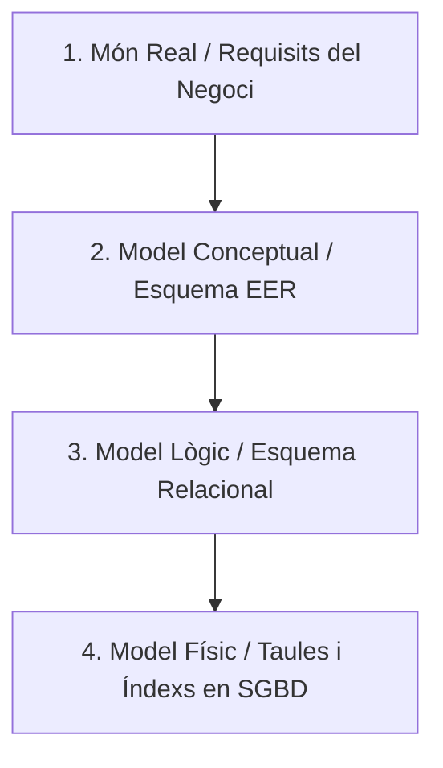
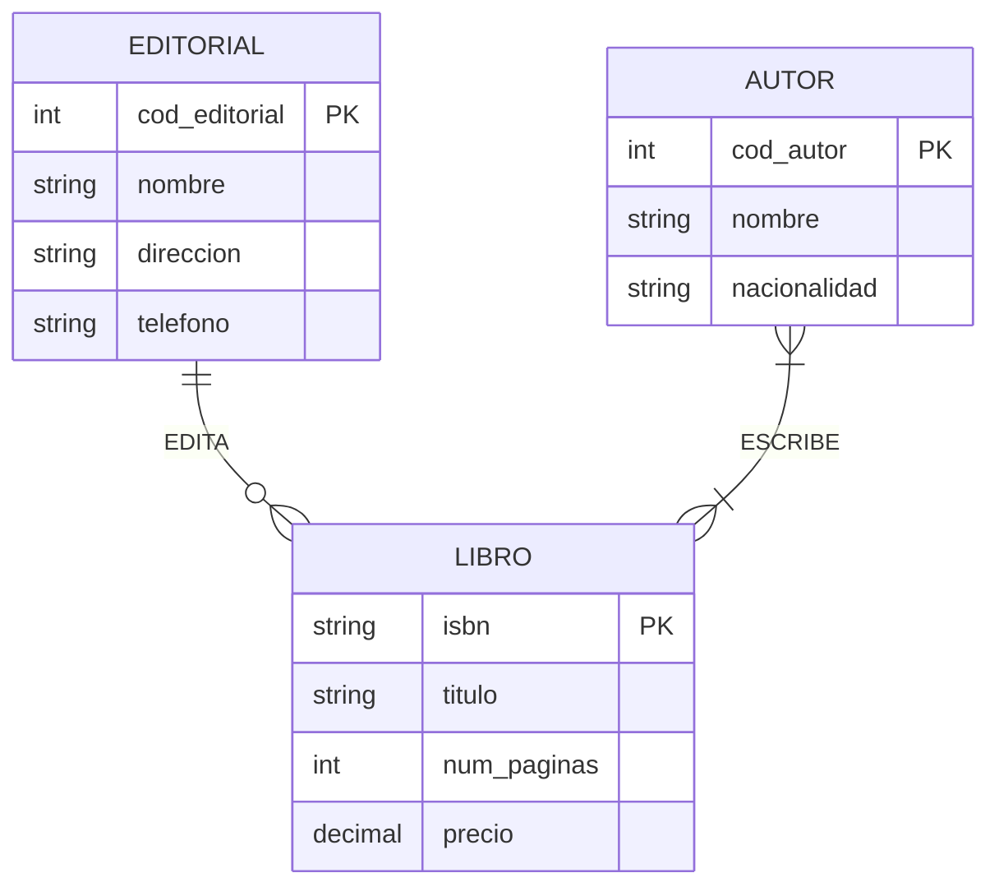
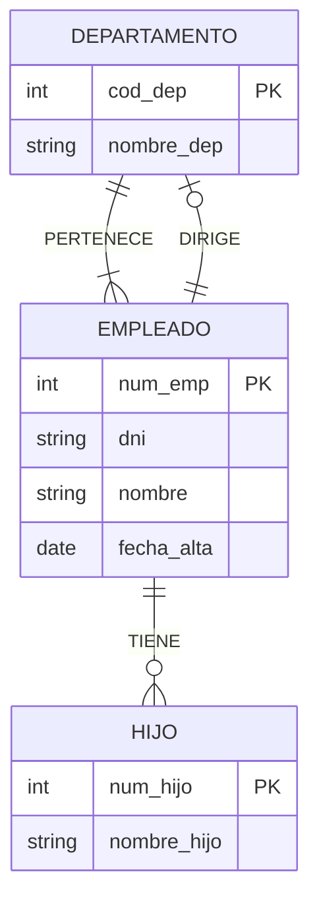
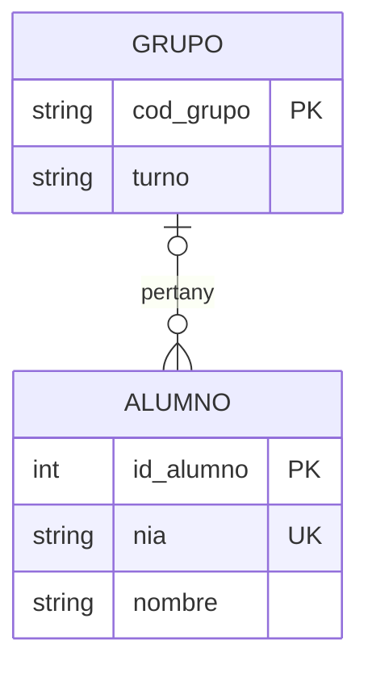
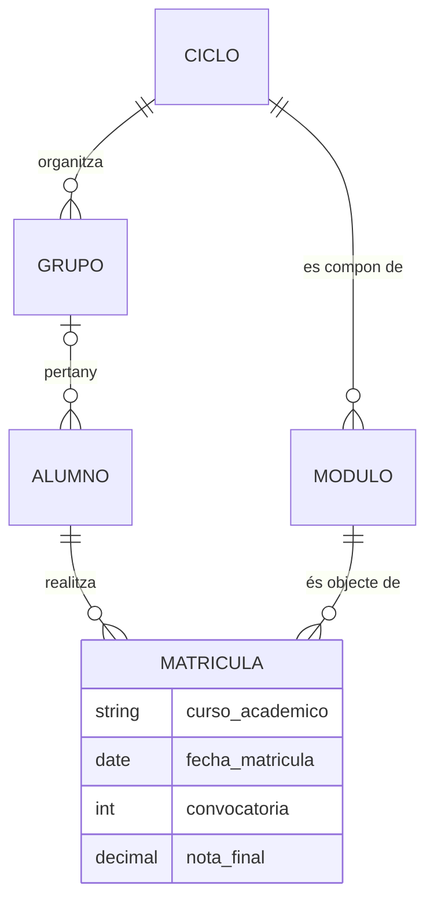

# UD02 · Model Entitat/Relació (E/R i EER)


## Resum del Tema

**Visió General:**
El **Model Entitat-Relació Estés (EER)**, introduït originalment per Peter Chen el 1976 i refinat posteriorment amb potents mecanismes semàntics d'abstracció de dades, constituïx l'estàndard de la indústria indiscutible per al **disseny conceptual de bases de dades**.

El seu objectiu prioritari és modelar i estructurar la semàntica de la informació del món real de manera completament abstracta i independent del programari informàtic o Sistema Gestor de Bases de Dades (SGBD) que s'utilitze en la fase d'implementació. En esta unitat s'analitza de forma exhaustiva el flux de treball del disseny de dades, els components elementals del model (**entitats fortes i febles, atributs classificatoris i relacions**), les regles minucioses de **cardinalitat i integritat**, les jerarquies de **generalització i especialització** amb herència d'atributs, el concepte d'**agregació**, el càlcul formal de cardinalitats en **relacions ternàries** i una metodologia estructurada en 5 passos recolzada per casos pràctics reals complets.



### Temporalització

La unitat ocupa **19 hores d'aula** (12 de teoria i 7 de pràctica). Cada sessió apareix assenyalada en la pàgina amb una franja de color.


items:
  - {h: 2, tipo: T, t: "Cicle de vida del disseny. Entitats fortes i febles", ref: "§1 i §2.1"}
  - {h: 2, tipo: T, t: "Atributs i relacions: grau i rols", ref: "§2.2 i §2.3"}
  - {h: 2, tipo: T, t: "Cardinalitats mínima i màxima", ref: "§2.4 · laboratori interactiu"}
  - {h: 1, tipo: P, t: "Llegir i escriure cardinalitats", ref: "Pràctica 2.2"}
  - {h: 2, tipo: P, t: "Biblioteca municipal: de l'enunciat al diagrama", ref: "Pràctica 2.1"}
  - {h: 2, tipo: T, t: "Restriccions avançades i jerarquies EER", ref: "§3, §4.1 i §4.2 · classificador interactiu"}
  - {h: 2, tipo: T, t: "Agregació i relacions ternàries", ref: "§4.3 i §4.4"}
  - {h: 1, tipo: T, t: "Metodologia en cinc passos i exemples resolts", ref: "§5 i §6"}
  - {h: 1, tipo: T, t: "Notacions i eines de modelatge", ref: "§7"}
  - {h: 2, tipo: P, t: "Plataforma de streaming", ref: "Pràctica 2.3"}
  - {h: 2, tipo: P, t: "Model conceptual d'EduGest", ref: "§8 i projecte EduGest-2"}
autonomo:
  - "Pràctica 2.4 (clínica veterinària amb jerarquies)"
  - "Reptes 2.5 i 2.6 i reptes avançats 2.7 a 2.10 (entrevista ambigua, història, enginyeria inversa i comparació de dissenys)"
  - "Banc d'exercicis (30 enunciats)"


> [!NOTE]
> **Com s'estudia esta unitat.** Cada sessió de teoria acaba amb una xicoteta comprovació o un laboratori interactiu. Usa'ls **abans** de passar a les pràctiques: si no pots explicar per què ix un resultat, torna a llegir l'apartat.

### Objectius d'aprenentatge

En acabar esta unitat seràs capaç de:

- Analitzar un enunciat de requisits i identificar entitats, atributs, identificadors i relacions.
- Determinar el grau i les cardinalitats (mínima i màxima) d'una relació i justificar-les.
- Distingir entitats fortes i febles, i modelar relacions reflexives i ternàries.
- Aplicar les extensions del model EER: generalització/especialització i agregació.
- Representar el model amb eines gràfiques i en diferents notacions.
- Documentar els supòsits i les restriccions que el diagrama no pot expressar.



---


Cicle de vida del disseny i entitats

## 1. Etapes en l'Anàlisi i Disseny de Dades

### 1.1 El Cicle de Vida del Disseny de Bases de Dades

El disseny d'una base de dades no és una activitat improvisada, sinó un procés d'enginyeria de programari estructurat que tradueix un problema del món real en estructures d'informació eficients i sense redundàncies.

Intentar construir una base de dades directament en el SGBD (escrivint codi SQL `CREATE TABLE`) sense realitzar prèviament un modelatge conceptual rigorós condueix inevitablement a **errors greus d'arquitectura**: taules mal estructurades, claus duplicades, pèrdua de relacions essencials i redundància incontrolada.

---

### 1.2 Els Quatre Nivells d'Abstracció

El procés complet de disseny es divideix en quatre fases successives i interconnectades:



1. **Entorn del Món Real (Fase de Requisits):**
   Consistix en la recollida, anàlisi i interpretació de les necessitats d'informació de l'organització a través d'entrevistes amb els usuaris, formularis existents, albarans i regles de negoci. El resultat d'esta fase és un document en llenguatge natural denominat **Especificació de Requisits de Programari (ERS)**.

2. **Model Conceptual (Esquema Conceptual EER):**
   Se sintetitzen les especificacions del món real en un diagrama gràfic normalitzat (Diagrama Entitat-Relació Estés). Este esquema representa l'estructura semàntica de les dades de manera totalment **independent del SGBD** i del suport tecnològic que s'haja d'utilitzar.

3. **Model Lògic (Esquema Lògic / Relacional):**
   Es transforma l'esquema conceptual EER a les estructures pròpies del paradigma del SGBD triat. En les bases de dades relacionals, això implica aplicar regles formals de pas d'E/R a taules, claus primàries (`PK`), claus foranes (`FK`) i processos de **normalització** (1FN, 2FN, 3FN).

4. **Model Físic (Esquema Físic SQL):**
   Es traduïxen les taules lògiques a codi executable en el SGBD destí (sentències SQL DDL) definint els tipus de dades físics concrets (`VARCHAR`, `NUMERIC`), mètodes d'emmagatzematge, factor d'empaquetament, particionament i índexs B-Tree/Hash.

---

## 2. El Model Conceptual Entitat-Relació (E/R)

{}
Peter Chen va publicar «The Entity-Relationship Model: Toward a Unified View of Data» el 1976 a la revista *ACM Transactions on Database Systems*. Quasi mig segle després, els seus rectangles, rombes i el·lipses continuen sent l'idioma comú del disseny conceptual.
{}

### 2.1 Entitats: Fortes, Febles i Instàncies

Una **entitat** és qualsevol objecte, persona, lloc, concepte abstracte o esdeveniment del món real que posseïx existència distingible i sobre el qual l'organització necessita emmagatzemar informació en la base de dades.

- **Tipus d'Entitat (Classe o Conjunt d'Entitats):** És l'abstracció genèrica que defineix l'estructura comuna d'un grup d'objectes homogenis. Es representa gràficament mitjançant un **rectangle** amb el nom en lletres majúscules, format singular i sense abreviatures (p. ex. `ALUMNO`, `EMPLEADO`, `FACTURA`).
- **Instància o Ocurrència:** És un element individual concret que pertany a eixe tipus d'entitat (p. ex. dins de l'entitat `ALUMNO`, una instància específica és l'alumne amb DNI `12345678A` anomenat *Juan Pérez*).

#### Classificació d'Entitats per la seua Dependència d'Existència

- **Entitat Forta (Regular o Principal):**
  Posseïx existència pròpia i independent en el sistema. Les seues instàncies s'identifiquen unívocament mitjançant els seus propis atributs identificadors (clau primària) sense requerir la presència d'altres entitats (p. ex. `CLIENTE`, `PRODUCTO`, `LIBRO`).

- **Entitat Feble:**
  No pot existir de manera autònoma en la base de dades. La seua presència depén de l'existència prèvia d'una entitat forta principal (denominada *Entitat Propietària* o *Pare*). Si una instància de l'entitat forta és eliminada, totes les instàncies de l'entitat feble vinculades a ella manquen de sentit i han de ser eliminades en cascada. Es representa gràficament mitjançant un **doble requadre**.

> [!NOTE]
> **Exemple d'Entitat Feble:**
> L'entitat `EJEMPLAR` respecte a l'entitat forta `LIBRO`. La biblioteca posseïx l'obra intel·lectual "Don Quijote de la Mancha" (`LIBRO` fort), però físicament disposa de 5 còpies en l'estanteria (`EJEMPLAR` feble). Si l'obra deixa de prestar-se i s'esborra de la base de dades, tots els seus exemplars físics associats desapareixen automàticament.


- q: "En EduGest, quina d'estes opcions s'ha de modelar com a **entitat** i no com a atribut?"
  options: ["El torn (M/T)", "El mòdul professional", "El curs acadèmic (2025-26)", "La nota final"]
  answer: 1
  explain: "Un mòdul té propietats pròpies (codi, nom, hores) i moltes instàncies. El torn i el curs són **valors**, i la nota depén de la parella alumne-mòdul."
- q: "Si s'esborra un `LIBRO`, desapareixen els seus `EJEMPLAR`. Quina dependència descriu això?"
  options: ["Dependència d'existència", "Dependència d'identificació", "Herència", "Agregació"]
  answer: 0
  explain: "Les files dependents manquen de sentit sense la fila forta: és dependència d'**existència**. La d'identificació exigix, a més, que la clau del feble incloga la del fort."


---

Atributs i relacions

### 2.2 Atributs: Classificació, Estructura i Domini

Un **atribut** és cadascuna de les propietats, característiques o qualitats qualitatives o quantitatives que descriuen un tipus d'entitat o una relació.

El **domini** d'un atribut és el conjunt de tots els valors atòmics vàlids que eixe atribut pot prendre legalment (p. ex. el domini de `fecha_nacimiento` és el conjunt de dates vàlides no futures).

#### Classificació Completa d'Atributs

1. **Atribut Identificador Principal (Clau Primària - PK):**
   Atribut o conjunt mínim d'atributs els valors dels quals garantixen distingir de manera única i irrepetible cada instància dins de l'entitat. Es representa mitjançant el **nom de l'atribut subratllat**. Un identificador no pot prendre mai valors nuls (`NOT NULL`).

2. **Atribut Identificador Alternatiu (Clau Alternativa):**
   Atribut candidat que també podria identificar unívocament cada instància però no ha sigut seleccionat com a clau primària. Es representa mitjançant **subratllat discontinu** (p. ex. en `PERSONA`, si l'`id_persona` és la PK, el `dni` o el `num_seguridad_social` són claus alternatives).

3. **Atribut Descriptor (Simple o Escalar):**
   Atribut convencional que aporta informació descriptiva no identificadora i emmagatzema un únic valor atòmic (p. ex. `nombre`, `precio`, `edad`).

4. **Atribut Compost (Estructurat):**
   Atribut que es pot descompondre de manera jeràrquica en diversos subatributs simples amb significat propi. Es representa com un arbre d'el·lipses (p. ex. l'atribut `dirección` se subdividix en `calle`, `número`, `piso`, `código_postal` i `ciudad`).

5. **Atribut Multivaluat:**
   Atribut que pot albergar una llista de múltiples valors per a una mateixa instància d'entitat. S'indica mitjançant una etiqueta $N$ sobre la línia de l'atribut o mitjançant una doble el·lipse (p. ex. una persona que posseïx diversos números de `teléfono` o diverses adreces d'`email`).

6. **Atribut Derivat (Calculat):**
   Atribut el valor del qual no s'emmagatzema físicament, sinó que es calcula dinàmicament a partir d'altres atributs guardats en la base de dades (p. ex. l'atribut `edad` es calcula restant la `fecha_nacimiento` de la data actual). Es representa amb una **el·lipse discontínua**.

{}
Si de cada valor necessites guardar **informació pròpia** (d'un telèfon, el seu tipus o si és el principal; d'una adreça, la seua data d'alta), ja no és un simple atribut multivaluat: és una **entitat feble** relacionada amb l'original. Un multivaluat només servix quan cada valor és una dada aïllada.
{}

---

### 2.3 Relacions: Grau, Semàntica i Noms de Rol

Una **relació** és una associació o interrelació semàntica que connecta dos o més tipus d'entitats dins del model. Es representa gràficament mitjançant un **rombe** etiquetat amb un verb descriptiu en majúscules (p. ex. `COMPRA`, `TRABAJA`, `PERTENECE`).

#### El Grau de la Relació

El **grau** indica el nombre d'entitats distintes que participen en l'associació:

- **Grau 1 — Relació Reflexiva (Recursiva):** Associa instàncies d'una mateixa entitat amb si mateixa. En estes relacions és obligatori especificar el **nom de rol** que exercix cada participant en l'associació.
  - *Exemple:* La relació `SUPERVISA` sobre l'entitat `EMPLEADO`. Un empleat juga el rol de *Cap* i altres empleats juguen el rol de *Subordinats*.
- **Grau 2 — Relació Binària:** Associa dues entitats distintes (és la forma més habitual en el modelatge, p. ex. `CLIENTE` `REALIZA` `PEDIDO`).
- **Grau 3 — Relació Ternària:** Associa simultàniament tres entitats distintes (p. ex. `PROFESOR`, `ASIGNATURA` i `GRUPO` en la relació `IMPARTE`).

---

Cardinalitats mínima i màxima

### 2.4 Restriccions de Cardinalitat (Mínima i Màxima)

La **cardinalitat** d'una relació expressa els límits quantitatius de participació de les instàncies de les entitats en l'associació.

Per a cada entitat que participa en una relació, la cardinalitat es definix com un parell de valors expressat en el format:
$$(Cardinalitat\_Mínima, Cardinalitat\_Màxima)$$

```text
ENTIDAD_A ──────(min_a, max_a)────── < RELACIÓN > ──────(min_b, max_b)────── ENTIDAD_B
```

#### 1. Cardinalitat Mínima ($0$ o $1$)

- **$0$ (Participació Opcional o Parcial):** Una instància de l'entitat pot existir en la base de dades sense necessitat d'estar associada amb cap instància de l'altra entitat.
- **$1$ (Participació Obligatòria, Total o Existencial):** Tota instància de l'entitat ha d'estar associada obligatòriament almenys amb una instància de l'altra entitat.

#### 2. Cardinalitat Màxima ($1$ o $N$)

- **Relació Un a Un ($1:1$):** Una instància d'$A$ es relaciona com a màxim amb una instància de $B$, i viceversa.
- **Relació Un a Molts ($1:N$):** Una instància d'$A$ pot relacionar-se amb múltiples instàncies de $B$, però una instància de $B$ només pot relacionar-se amb una d'$A$.
- **Relació Molts a Molts ($N:M$):** Una instància d'$A$ es relaciona amb múltiples instàncies de $B$, i una de $B$ es relaciona amb múltiples instàncies d'$A$.

> [!TIP]
> **Regla Mnemotècnica de Lectura de Cardinalitats:**
> Per a determinar la cardinalitat de l'`ENTIDAD_A` respecte a l'`ENTIDAD_B` en la relació `R`, ens formulem dos preguntes situant-nos mentalment en una instància d'`ENTIDAD_A`:
>
> 1. *Amb quantes instàncies d'`ENTIDAD_B` pot associar-se com a MÍNIM una instància d'`ENTIDAD_A`?* $\rightarrow$ **Cardinalitat mínima**.
> 2. *Amb quantes instàncies d'`ENTIDAD_B` pot associar-se com a MÀXIM una instància d'`ENTIDAD_A`?* $\rightarrow$ **Cardinalitat màxima**.

> [!WARNING]
> **L'error més comú del tema: llegir la cardinalitat a l'inrevés.** Un mateix parell $(mín, màx)$ pot anar junt a una entitat o junt a l'oposada segons el llibre o l'eina (vore l'apartat 7.1). Abans d'interpretar un diagrama, **tradueix sempre a una frase**: «cada ... es relaciona amb ... instàncies de ...».

#### Laboratori: llig i construïx cardinalitats

Canvia els valors i observa com es transformen el diagrama, les frases, el tipus de relació i la sintaxi de Mermaid.




- q: "En `TRABAJA_EN`, cada empleat està en exactament 1 departament i cada departament té 0 o molts empleats. De quin tipus és la relació?"
  options: ["1:1", "1:N amb DEPARTAMENTO al costat «1»", "1:N amb EMPLEADO al costat «1»", "N:M"]
  answer: 1
  explain: "Molts empleats compartixen un únic departament: el costat «1» és DEPARTAMENTO i el costat «N», EMPLEADO. La clau aliena anirà a EMPLEADO (UD03)."
- q: "En pota de gall, quin símbol junt a `ALUMNO` expressa «un grup té zero o molts alumnes»?"
  options: ["`||`", "`|o`", "`o{`", "`|{`"]
  answer: 2
  explain: "El cercle indica mínim zero i la pota de gall màxim molts. El símbol junt a una entitat compta **quantes instàncies d'eixa entitat** s'associen a una de l'altra."


Llegir i escriure cardinalitats

Biblioteca municipal: de l'enunciat al diagrama

Les sessions 4 i 5 es fan amb les [pràctiques de la unitat](/ud02-modelo-er/ud02-practicas). Porta-les preparades: has d'haver llegit fins ací i haver provat el laboratori.

---

Restriccions avançades i jerarquies EER

## 3. Restriccions Avançades sobre Relacions

En models conceptuals complexos on existixen múltiples relacions creuades entre entitats, es poden especificar restriccions semàntiques avançades:

### 3.1 Exclusivitat i Exclusió

- **Restricció d'Exclusivitat:**
  S'aplica entre dos o més relacions ($R_1$ i $R_2$) que partixen d'una mateixa entitat $A$. Indica que una instància d'$A$ pot participar en la relació $R_1$ o en la relació $R_2$, però **mai en ambdues al mateix temps**.

  - *Exemple Real:* Un `PROFESOR` pot participar en la relació `IMPARTE` respecte a un `CURSO` o la relació `RECIBE` (com a alumne), però si en un quadrimestre imparteix un curs, no pot simultàniament rebre'l com a estudiant.
- **Restricció d'Exclusió:**
  Indica que si un parell específic d'instàncies $(A_1, B_1)$ està vinculat a través de la relació $R_1$, eixe mateix parell exacte té prohibit estar vinculat mitjançant la relació $R_2$.

---

### 3.2 Inclusivitat i Inclusió

- **Restricció d'Inclusivitat:**
  Indica que perquè una instància de l'entitat $A$ participe en la relació $R_1$, és condició obligatòria que participe també en la relació $R_2$.

- **Restricció d'Inclusió:**
  S'aplica sobre els parells d'instàncies relacionades. Si la parella $(A_1, B_1)$ està associada mitjançant la relació $R_1$, és estrictament obligatori que la dita parella $(A_1, B_1)$ estiga prèviament relacionada en $R_2$.

---

## 4. Extensions del Model (EER)

### 4.1 Generalització i Especialització (Mecanisme d'Herència)

El Model Entitat-Relació Estés (EER) incorpora conceptes orientats a objectes per a gestionar jerarquies de classes d'entitats:



- **Supertipus (Entitat Genèrica):** És l'entitat de nivell superior que conté els atributs comuns (inclosa la clau primària) i les relacions generals que compartixen totes les variants.
- **Subtipus (Entitat Especialitzada):** És una entitat de nivell inferior que representa una subclasse o variant específica del supertipus.
- **El Principi d'Herència:** Tot subtipus hereta automàticament **tots els atributs** (identificadors i descriptors) i **totes les relacions** del supertipus. Els subtipus només han de definir els seus atributs i relacions exclusius.
- **Especialització (Enfocament Top-Down):** Procés de disseny descendent en el qual es parteix d'una entitat supertipus i s'identifiquen subgrups especialitzats amb propietats exclusives.
- **Generalització (Enfocament Bottom-Up):** Procés de disseny ascendent en el qual s'observen múltiples entitats amb atributs repetits i s'abstrau una entitat supertipus comuna.

---

### 4.2 Classificació de Jerarquies (Total/Parcial, Disjunta/Solapada)

Atenent les regles de pertinença de les instàncies del supertipus als subtipus, es definixen dos dimensions independents:

#### Dimensió 1: Cobertura (Total o Parcial)

- **Total ($T$):** Tota instància del supertipus HA DE pertànyer obligatòriament almenys a un dels subtipus.
- **Parcial ($P$):** Poden existir instàncies en el supertipus que no pertanyen a cap subtipus especialitzat.

#### Dimensió 2: Solapament (Disjunta o Solapada)

- **Disjunta ($D$):** Una instància del supertipus pot pertànyer com a MÀXIM a un únic subtipus (subtipus mútuament excloents).
- **Solapada ($S$):** Una instància del supertipus pot pertànyer SIMULTÀNIAMENT a diversos subtipus.

#### Combinació de les Quatre Classes de Jerarquia

1. **Total i Disjunta $(T, D)$:** Tota instància del supertipus pertany a **un i només un** subtipus.
   - *Exemple:* L'entitat `PERSONA` dividida en `HOMBRE` i `MUJER`.
2. **Parcial i Disjunta $(P, D)$:** Una instància del supertipus pot no estar en cap subtipus, però si hi està, només pot pertànyer a **un**.
   - *Exemple:* L'entitat `VEHÍCULO` especialitzada en `TURISMO` i `CAMIÓN` (poden existir vehicles en la base de dades que siguen motocicletes sense subtipus específic).
3. **Parcial i Solapada $(P, S)$:** Una instància pot no estar en cap subtipus o pertànyer a **múltiples** alhora.
   - *Exemple:* L'entitat `EMPLEADO` especialitzada en `PROGRAMADOR` i `DIRECTOR` (un empleat pot ser només programador, o simultàniament programador i director).
4. **Total i Solapada $(T, S)$:** Tota instància ha de pertànyer almenys a un subtipus i pot estar en **múltiples** simultàniament.

#### Laboratori: quina jerarquia és?

Fixa les regles (cobertura i solapament) i marca a quins subtipus pertany cada empleat: la taula et dirà qui incompleix la jerarquia i quines estratègies de transformació són vàlides.




- q: "Quina estratègia de transformació **no** és vàlida per a una jerarquia parcial i solapada?"
  options: ["Taula del supertipus i una taula per subtipus", "Taula única amb una marca per subtipus", "Només taules dels subtipus", "Les tres són vàlides"]
  answer: 2
  explain: "Amb cobertura parcial hi ha instàncies del supertipus sense subtipus, que no tindrien taula on guardar-se. Només s'admet «només subtipus» si la jerarquia és **total i disjunta**."


---

Agregació i relacions ternàries

### 4.3 Agregació: Modelatge d'Associacions com a Entitats



La **agregació** és una abstracció que permet considerar una relació entre dues entitats juntament amb les dites entitats com si fora una **entitat d'ordre superior (entitat agregada)**, fent possible que esta estructura completa es relacione al seu torn amb una altra tercera entitat.

#### Per què és necessària l'Agregació?

Quan s'intenta modelar una situació on una relació només té sentit per a certes combinacions sense forçar una relació ternària completa.

> [!NOTE]
> **Exemple Clàssic d'Agregació:**
> Considerem la relació `CASADO_CON` entre les entitats `HOMBRE` i `MUJER`. Un matrimoni civil requerix ser registrat en un `JUZGADO`. No totes les parelles es casen pel civil (algunes ho fan per l'església). Si creàrem una relació ternària entre `HOMBRE`, `MUJER` i `JUZGADO`, obligaríem erròniament que *tots* els matrimonis registraren un jutjat.
> **Solució amb Agregació:** Encapsulem la relació `CASADO_CON` dins d'una caixa d'**Entitat Agregada** anomenada `MATRIMONIO`. Posteriorment, relacionem l'entitat agregada `MATRIMONIO` amb l'entitat `JUZGADO` mitjançant la relació opcional `REGISTRADO_EN`.

> [!TIP]
> **Agregació o ternària?** Pregunta't: *pot existir la relació entre les dos primeres entitats sense que intervinga la tercera?* Si la resposta és sí (no tots els matrimonis es registren en un jutjat), necessites **agregació**. Si els tres participants són sempre indissolubles en el fet que registres (quin professor imparteix quin mòdul a quin grup), és una **ternària**.

---

### 4.4 Relacions Ternàries i Anàlisi Formal de Cardinalitat

Una **relació ternària** associa tres entitats de manera indivisible. Per a determinar-ne les cardinalitats amb rigor, s'aplica el mètode de **fixar un parell d'entitats i analitzar el rang de l'extrem lliure**:

#### Metodologia Formal de Càlcul

Fixem una instància d'$A$ i una instància de $B$ simultàniament, i ens preguntem:

- *Amb quantes instàncies de $C$ es pot associar la parella $(A, B)$ com a mínim i com a màxim?* $\rightarrow$ parell $(min, max)$ sobre $C$.

#### Classificació per Connectivitat Màxima

1. **Connectivitat $1:1:1$:**
   Qualsevol combinació de dues entitats s'associa com a màxim amb **una** instància de la tercera entitat.

2. **Connectivitat $1:1:N$:**
   La parella d'entitats $(A, B)$ s'associa amb **múltiples** instàncies de $C$. No obstant això, les parelles $(A, C)$ i $(B, C)$ s'associen com a màxim amb **una** instància de l'entitat restant.

3. **Connectivitat $1:N:M$:**
   La parella $(A, B)$ s'associa amb múltiples instàncies de $C$, i la parella $(A, C)$ s'associa amb múltiples instàncies de $B$. Només la parella $(B, C)$ es limita a una única instància d'$A$.

4. **Connectivitat $N:M:P$:**
   Qualsevol combinació de parelles de dues entitats pot associar-se amb **múltiples** instàncies de la tercera entitat lliure.

---

Metodologia en cinc passos i exemples resolts

## 5. Fases en la Construcció de l'Esquema Conceptual

Per a elaborar un esquema conceptual EER professional a partir d'un text de requisits, s'ha d'aplicar una metodologia en 5 passos:

1. **Pas 1: Identificació i Selecció d'Entitats:**
   Buscar substantius comuns que representen objectes amb propietats d'interés. Descartar substantius que representen valors simples o instàncies.

2. **Pas 2: Definició de Claus Primàries i Identificadors:**
   Assignar atributs identificadors unívocs (`PK`) a cada entitat. Identificar si existixen entitats febles que requerisquen claus compostes amb l'entitat forta.

3. **Pas 3: Establiment de Relacions i Cardinalitats:**
   Identificar verbs d'acció que connecten les entitats. Per a cada relació, calcular minuciosament les cardinalitats $(min, max)$ en ambdós sentits.

4. **Pas 4: Assignació d'Atributs i Domini:**
   Col·locar els atributs descriptors en les seues entitats corresponents. Si un atribut depén de la combinació de dues entitats (p. ex. `fecha_alquiler` o `nota_examen`), s'ha de col·locar directament en la **relació**.

5. **Pas 5: Optimització i Eliminació de Redundàncies:**
   Revisar el diagrama per a detectar relacions transitives redundants (relacions que es poden deduir combinant altres associacions) i simplificar el model.

---

{}
{}
«La biblioteca presta llibres a socis. De cada llibre es guarden diversos exemplars físics. Un llibre pot tindre diversos autors.» Subratlla els **substantius** (candidats a entitat) i els **verbs** (candidats a relació).
{}
{}
Candidates: biblioteca, llibre, soci, exemplar, autor. La biblioteca és una entitat? Si només n'hi ha una, és el context, no una entitat: es descarta. Queden **LIBRO, EJEMPLAR, SOCIO, AUTOR**.
{}
{}
LIBRO s'identifica per `isbn`; SOCIO per `num_socio`; AUTOR per `id_autor`. EJEMPLAR només es distingix dins del seu llibre: és una **entitat feble** amb clau parcial `num_ejemplar`.
{}
{}
AUTOR–LIBRO (*escriu*), LIBRO–EJEMPLAR (*identifica*), SOCIO–EJEMPLAR (*pren en préstec*).
{}
{}
Un autor escriu (0,N) llibres i un llibre l'escriuen (1,N) autors → **N:M**. Un llibre té (1,N) exemplars i cada exemplar és de (1,1) llibre → **1:N**. Un soci pren en préstec (0,N) exemplars i un exemplar està en préstec amb (0,N) socis al llarg del temps → **N:M** amb atribut `fecha`.
{}
{}
Cada entitat té identificador? Hi ha atributs que en realitat són entitats? Falta alguna relació? Compara-ho amb el diagrama de la biblioteca de més amunt.
{}
{}

## 6. Exemples Pràctics Complets Resolts

### 6.1 Exemple 1: Gestió de Llibreria i Editorials

**Enunciat de Requisits:**
Es requerix dissenyar l'esquema conceptual per a la gestió d'una llibreria. De cada `LIBRO` es coneix el seu ISBN (clau primària), títol, nombre de pàgines i preu. Cada llibre és editat per una única `EDITORIAL` (codi, nom, adreça i telèfon). Una editorial pot editar molts llibres. Un llibre pot ser escrit per diversos `AUTOR` (codi, nom, nacionalitat) i un autor pot escriure diversos llibres.



---

### 6.2 Exemple 2: Gestió Interna d'Empresa i Departaments

**Enunciat de Requisits:**
Dissenyar la base de dades d'una empresa. S'emmagatzema informació d'`EMPLEADO` (número d'empleat, DNI, nom, adreça i data d'alta). Els empleats estan adscrits a un `DEPARTAMENTO` (codi de departament, nom). Un empleat pertany a un únic departament i en un departament treballen diversos empleats. Un empleat pot ser cap d'un departament. Dels empleats es registren els seus `HIJO` (entitat feble amb número de fill i nom) per al control de beneficis socials.



---

### 6.3 Exemple 3: Organització d'un Congrés Científic

**Enunciat de Requisits:**
Un congrés científic necessita organitzar les seues activitats. Es registren els `PARTICIPANTE` (codi, nom, adreça, país). Els participants poden presentar `PONENCIA` (títol identificador, nombre de pàgines). Una ponència és escrita per un o diversos participants. A cada ponència se li assignen diversos participants com a revisors. Les ponències es presenten en `SESIÓN` (número de sessió, data, hora). Una sessió alberga diverses ponències però una ponència només s'exposa en una sessió.

---

### 6.4 Exemple 4: Empresa de Rebosteria "PAVA S.A."



#### Especificacions del Model PAVA S.A

1. **PRODUCTO i INGREDIENTE:** Relació $N:M$ denominada `COMPUESTO_POR` que conté l'atribut descriptor `porcentaje` per a indicar la participació de cada ingredient en la recepta.
2. **FORMATOS:** L'entitat `PRODUCTO` es comercialitza en distints `FORMATO_PRODUCTO` (pes en grams i preu específic de venda).
3. **CLIENTE i PEDIDO:** Un `CLIENTE` realitza múltiples `PEDIDO`. Cada comanda inclou diverses línies de detall sol·licitant unitats específiques d'un producte en un format determinat.
4. **COMPETIDORES:** Relació de seguiment de productes semblants llançats per marques rivals en el mercat.

---

Notacions i eines de modelatge

## 7. Notacions i Eines de Modelatge

El model E/R és **un**, però hi ha diverses formes de dibuixar-lo. És important reconéixer-les perquè cada eina usa la seua (RA6.a).

| Notació | Com representa les relacions | Cardinalitat | On la trobaràs |
|---|---|---|---|
| **Chen** (original, 1976) | Rombe entre les entitats. Atributs en ovals | Parells (mín, màx) o 1/N junt a cada entitat | Llibres de text, exàmens, estos apunts |
| **Pota de gall** (*crow's foot*, Martin/IE) | Línia entre entitats. Atributs dins del rectangle | Símbols en els extrems: `\|` un, `o` zero, `<` molts | draw.io, MySQL Workbench, Mermaid, Lucidchart |
| **Barker** | Línia amb traç continu (obligatori) o discontinu (opcional) i pota de gall | Traç i pota de gall | Oracle SQL Developer Data Modeler |
| **UML (diagrama de classes)** | Associacions entre classes | Multiplicitat `0..1`, `1`, `0..*`, `1..*` | Enginyeria del programari, eines CASE |

### 7.1 Equivalència entre la notació de Chen i la pota de gall

Llig sempre la cardinalitat **des d'una entitat cap a l'altra**. En la notació de pota de gall, el símbol que està **junt a una entitat** indica quantes instàncies d'**eixa** entitat es relacionen amb una instància de l'entitat de l'altre extrem.

| Chen (participació de l'entitat oposada) | Pota de gall | Lectura |
|---|---|---|
| (0, 1) | `\|o` | zero o un |
| (1, 1) | `\|\|` | exactament un |
| (0, N) | `o{` | zero o molts |
| (1, N) | `\|{` | un o molts |

Exemple: «un **grup** té **zero o molts** alumnes i un **alumne** pertany a **zero o un** grup».



> [!WARNING]
> En notació de Chen, la parella (mín, màx) es col·loca en alguns llibres **junt a la pròpia entitat** i en altres **junt a l'entitat oposada**. Abans d'interpretar un diagrama, comprova quin conveni usa. En estos apunts, la cardinalitat (mín, màx) junt a una entitat indica **amb quantes instàncies d'eixa entitat** es relaciona una instància de l'altra.

### 7.2 Eines

| Eina | Tipus | Ús recomanat |
|---|---|---|
| **draw.io / diagrams.net** | Lliure, web i escriptori | Diagrames E/R en notació de Chen i pota de gall. S'integra amb VS Code i Git |
| **Oracle SQL Developer Data Modeler** | Gratuïta | Model lògic i relacional; genera el DDL d'Oracle automàticament (UD03 i UD05) |
| **ERDPlus** | Web gratuïta | Diagrames de Chen i pas automàtic al model relacional |
| **Mermaid** | Text a diagrama | Diagrames en Markdown dins del repositori (com els d'estos apunts) |
| **Paper i llapis** | — | Primers esbossos i exàmens. Continua sent la forma més ràpida de pensar |

> [!TIP]
> Una eina gràfica **no dissenya per tu**. Primer raona entitats, relacions i cardinalitats sobre l'enunciat; després passa-ho a l'eina. Guarda el fitxer font (`.drawio`, `.dmd`, `.md`) en el repositori a més de la imatge exportada.

---

Plataforma de streaming

Model conceptual d'EduGest

## 8. Cas Guiat: el Model E/R d'EduGest

Apliquem la metodologia de l'apartat 5 a una part de l'[enunciat d'EduGest](/guia/proyecto-edugest#1-enunciat-entrevista-amb-la-direcció-destudis): cicles, mòduls, grups i alumnat.

### Pas 1. Entitats candidates

Subratllem els substantius de l'enunciat i ens preguntem si cadascun té **propietats pròpies** i **instàncies distintes**:

| Substantiu | Entitat? | Motiu |
|---|---|---|
| cicle formatiu | Sí | Té codi, nom, grau i hores |
| mòdul professional | Sí | Té codi, nom, curs i hores |
| grup | Sí | Té codi, torn, tutor |
| alumne | Sí | Molts atributs propis |
| curs acadèmic (2025-26) | No | És un **valor** que descriu una matrícula. Passa a ser atribut |
| torn | No | És un valor (M/T) d'un atribut del grup |
| tutor | No (rol) | És un **professor** que complix un paper: es modela com a relació |

### Pas 2. Identificadors

- `CICLO`: `cod_ciclo` (DAM, DAW...).
- `MODULO`: el codi oficial **no basta**, perquè 0484 apareix en DAM i en DAW amb grups i docents diferents. Opcions: un identificador artificial `id_modulo`, o considerar `MODULO` una **entitat feble** de `CICLO` (identificador `codigo` + `cod_ciclo`). Les dos són correctes; triem l'identificador artificial i anotem que (`codigo`, `cod_ciclo`) ha de ser **únic**.
- `GRUPO`: `cod_grupo`. `ALUMNO`: `nia` (o un identificador intern).

### Pas 3. Relacions i cardinalitats

| Relació | Pregunta | Cardinalitat |
|---|---|---|
| CICLO — *es compon de* — MODULO | Quants mòduls té un cicle? A quants cicles pertany un mòdul? | Un cicle té (0, N) mòduls (SMR encara no en té); un mòdul pertany a (1, 1) cicle |
| CICLO — *organitza* — GRUPO | | Un cicle té (0, N) grups; un grup és de (1, 1) cicle |
| GRUPO — *pertany* — ALUMNO | | Un grup té (0, N) alumnes; un alumne està en (0, 1) grup |
| ALUMNO — *es matricula* — MODULO | Pot un alumne matricular-se en diversos mòduls? Pot un mòdul tindre diversos alumnes? | N:M. Atributs de la relació: curs acadèmic, data, convocatòria, nota |

### Pas 4. Atributs de les relacions

La **nota** no és de l'alumne (en té moltes) ni del mòdul (el cursen molts): depén de la **parella** alumne-mòdul **i** del curs acadèmic. Per això va en la relació *es matricula*. A més, com que un alumne pot repetir un mòdul en un altre curs, el curs acadèmic forma part del que identifica cada matrícula.

### Pas 5. Revisió

- Hi ha cicles? Si un alumne pertany a un grup i el grup a un cicle, **no** cal una relació directa ALUMNO-CICLO: seria **redundant** (es deduïx).
- Hi ha restriccions que el diagrama no arreplega? Sí: un alumne només hauria de matricular-se en mòduls del cicle del seu grup. S'anota com a **restricció textual** (RA6.h).



> [!NOTE]
> La notació de pota de gall no té rombes, així que la relació N:M *es matricula*, que té atributs, es dibuixa com una entitat intermèdia `MATRICULA`. En notació de Chen seria un rombe amb els quatre atributs. Les dos representen el mateix.

---

## 9. Errors Freqüents i Bones Pràctiques

| Error freqüent | Per què és un error | Com evitar-lo |
|---|---|---|
| Modelar com a entitat alguna cosa que és un valor (`TURNO`, `COLOR`) | Una entitat necessita propietats i instàncies d'interés pròpies | Pregunta't quins atributs tindria. Si no en té, és un atribut |
| Posar en una entitat un atribut de la relació (`nota` en `ALUMNO`) | L'atribut depén de les dues entitats alhora | Si el valor canvia segons la parella, va en la relació |
| Usar el nom com a identificador | Els noms es repetixen i canvien | Usa codis estables o identificadors artificials |
| Relacions redundants (cicles en el diagrama) | Generen dades duplicades i inconsistents | Comprova si la relació es deduïx d'altres |
| Cardinalitats «a ull» | Produïxen taules mal dissenyades en la UD03 | Formula sempre les dos preguntes (mínim i màxim) en els dos sentits |
| Atributs calculats (`edad`) guardats com a atributs normals | Queden desactualitzats | Guarda `fecha_nacimiento` i calcula l'edat |
| Inventar requisits | El disseny deixa de respondre al client | Anota els dubtes com a **supòsits** i valida'ls amb el client |

**Bones pràctiques:** noms d'entitats en singular i en majúscules, relacions amb verbs, un diccionari de dades amb el significat de cada atribut i una llista de **supòsits semàntics** que explique les decisions que l'enunciat no aclarix.

---


- t: "Entitat"
  d: "Objecte del món real sobre el qual es guarda informació."
- t: "Entitat feble"
  d: "Entitat que no s'identifica per si sola: depén d'una altra."
- t: "Atribut multivaluat"
  d: "Atribut que pot tindre diversos valors per a una mateixa instància."
- t: "Cardinalitat (mín,màx)"
  d: "Nombre mínim i màxim d'instàncies amb què participa una entitat en una relació."
- t: "Generalització"
  d: "Agrupar entitats paregudes en un supertipus amb els atributs comuns."
- t: "Agregació"
  d: "Tractar una relació com si fora una entitat per a poder relacionar-la amb una altra."


## 10. Resum i Conclusions

- El **Model EER** és el llenguatge gràfic conceptual estàndard per a abstraure els requisits del món real cap a un esquema de base de dades rigorós.
- Les **entitats febles** depenen d'una entitat forta i formen claus compostes per a garantir la integritat existencial.
- Les **jerarquies de generalització/especialització** eviten la duplicació de codi mitjançant el principi d'**herència d'atributs**.
- L'**agregació** i les **relacions ternàries** permeten resoldre semàntiques d'associació complexes sense distorsionar les cardinalitats.
- Una metodologia rigorosa en 5 passos garantix que la posterior traducció al **model relacional** produïsca taules ben estructurades i normalitzades.
- El mateix model es pot dibuixar en notació de **Chen**, **pota de gall**, Barker o UML. Les eines gràfiques ajuden a representar-lo, però les decisions de disseny es raonen sobre l'enunciat.
- Les regles que el diagrama no pot expressar es documenten com a **restriccions textuals** per a implementar-les més endavant.

---

## 11. Exercicis Resolts

### 1. Pregunta Teòrica: Entitats Febles

**Pregunta:** Expliqueu la diferència entre dependència d'existència i dependència d'identificació en una entitat feble.
{}
- *Dependència d'Existència:* Ocorre quan les instàncies de l'entitat feble no poden sobreviure en la base de dades si s'elimina la instància de l'entitat forta relacionada (p. ex. si s'elimina un `CONTRATO`, desapareixen els seus `PAGOS` associats).
- *Dependència d'Identificació:* Ocorre quan l'entitat feble no posseïx un atribut identificador propi suficient per a ser clau primària, per la qual cosa necessita combinar el seu identificador parcial (discriminador) amb la clau primària de l'entitat forta propietària.
{}

---

### 2. Anàlisi de Jerarquia EER

**Pregunta:** En una empresa, l'entitat `EMPLEADO` s'especialitza en `INFORMÁTICO` i `ADMINISTRATIVO`. Classifiqueu la jerarquia segons les seues restriccions si s'establix que:

- a) Tot empleat ha de ser obligatòriament informàtic o administratiu.
- b) Un empleat pot exercir simultàniament tasques d'informàtic i d'administratiu.

{}
- a) Atés que tot empleat ha d'estar almenys en una subclasse, la cobertura és **Total ($T$)**.
- b) Atés que pot pertànyer a ambdues subclasses alhora, el solapament és **Solapat ($S$)**.
- **Classificació Resultant:** Jerarquia **Total i Solapada $(T, S)$**.
{}

---

### 3. Exercici Pràctic de Disseny EER

**Enunciat:** Dissenyeu l'esquema conceptual per a un hospital. Es registren `PACIENTE` (NSS, nom) i `MÉDICO` (número de col·legiat, nom, especialitat). Un metge atén múltiples pacients i un pacient pot ser atés per distints metges. De cada atenció mèdica es desitja registrar la `fecha_consulta` i el `diagnóstico`.

{}
- **Entitats:** `PACIENTE` (PK: `NSS`) i `MÉDICO` (PK: `num_colegiado`).
- **Relació:** `ATIENDE` entre `MÉDICO` i `PACIENTE`.
- **Cardinalitats:**
  - `MÉDICO` respecte a `ATIENDE`: $(0, N)$ (un metge pot no haver atés pacients encara o atendre'n molts).
  - `PACIENTE` respecte a `ATIENDE`: $(1, N)$ (un pacient ha d'haver sigut atés almenys una vegada i pot ser vist per diversos metges).
- **Atributs de la Relació:** Com que un mateix metge pot atendre el mateix pacient en dates distintes amb diagnòstics diferents, els atributs `fecha_consulta` i `diagnóstico` es col·loquen directament en la relació $N:M$ `ATIENDE`.
{}

---

## 12. Autoavaluació

Respon a les preguntes i prem **Corregir**. Cada resposta inclou una explicació.


- q: "En el model E/R, en quina fase del disseny estem?"
  options: ["Disseny físic", "Disseny lògic", "Disseny conceptual", "Implementació"]
  answer: 2
  explain: "El model E/R representa la realitat de manera **independent del SGBD**: és el disseny conceptual. El pas a taules (UD03) és el disseny lògic."
- q: "D'un empleat es guarda la seua data de naixement i es vol conéixer la seua edat. Com es modela l'edat?"
  options: ["Atribut compost", "Atribut derivat", "Atribut multivaluat", "Entitat feble"]
  answer: 1
  explain: "L'edat es **calcula** a partir de la data de naixement. Guardar-la com un atribut normal faria que es quedara desactualitzada."
- q: "Un `EJEMPLAR` s'identifica pel seu número dins de cada `LIBRO` (exemplar 1, 2, 3 de cada llibre). Què és `EJEMPLAR`?"
  options: ["Una entitat feble per identificació", "Una entitat forta", "Una especialització de LIBRO", "Un atribut multivaluat"]
  answer: 0
  explain: "El seu número només és únic **dins** d'un llibre: necessita la clau de `LIBRO` per a identificar-se. És una entitat feble per identificació (i també per existència)."
- q: "Un alumne es matricula en diversos mòduls i cada mòdul té diversos alumnes. On es col·loca l'atribut `nota`?"
  options: ["En ALUMNO", "En MODULO", "En la relació de matrícula", "En una entitat NOTA independent sense relacions"]
  answer: 2
  explain: "La nota depén de la **parella** alumne-mòdul (i del curs acadèmic). Per això és un atribut de la relació."
- q: "Tot vehicle d'una flota és un turisme o una furgoneta, mai les dos coses. Com és la jerarquia?"
  options: ["Parcial i solapada", "Total i disjunta", "Parcial i disjunta", "Total i solapada"]
  answer: 1
  explain: "**Total** perquè tot vehicle pertany a alguna subclasse; **disjunta** perquè no pot pertànyer a les dos alhora."
- q: "En notació de pota de gall, què indica el símbol `o{` junt a una entitat?"
  options: ["Exactament un", "Zero o un", "Un o molts", "Zero o molts"]
  answer: 3
  explain: "El cercle indica que el mínim és **zero** (participació opcional) i la pota de gall que el màxim és **molts**."
- q: "Una empresa registra quin metge atén quin pacient en quina consulta (sala) i en quina data. Cada parella metge-pacient pot repetir-se en sales distintes. Quin tipus de relació és la més adequada?"
  options: ["Tres relacions binàries independents", "Una relació ternària", "Una jerarquia", "Una relació reflexiva"]
  answer: 1
  explain: "El fet que volem registrar uneix **alhora** metge, pacient i sala. Tres relacions binàries perdrien quin metge va atendre quin pacient en quina sala."
- q: "Un diagrama inclou ALUMNO–GRUPO, GRUPO–CICLO i a més ALUMNO–CICLO. Quin problema pot tindre?"
  options: ["Cap, més relacions donen més informació", "Una relació redundant que es deduïx de les altres dos", "Una entitat feble mal identificada", "Falta una jerarquia"]
  answer: 1
  explain: "Si el cicle d'un alumne es deduïx del seu grup, la relació directa és **redundant** i pot produir inconsistències (que l'alumne estiga en un grup de DAM i en el cicle DAW)."


## Referències

- Chen, P. P. (1976). «The Entity-Relationship Model: Toward a Unified View of Data». *ACM Transactions on Database Systems*, 1(1).
- Elmasri, R. i Navathe, S. B. *Fundamentos de sistemas de bases de datos*. Pearson.
- [Mermaid: sintaxi dels diagrames entitat-relació](https://mermaid.js.org/syntax/entityRelationshipDiagram.html).
