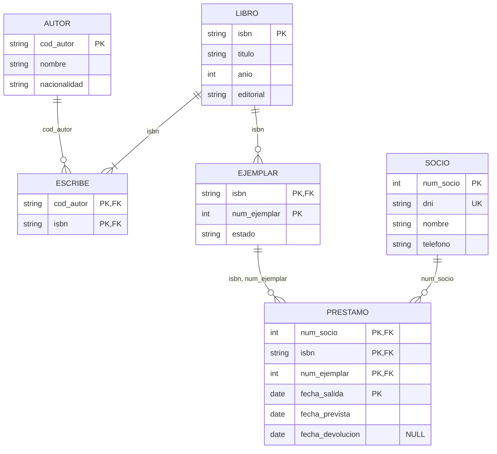

# UD03 · Pràctiques



| Pràctica | Tipus | Nivell | CE principals |
|---|---|---|---|
| [3.1 Biblioteca: de l'E/R a les taules](#pràctica-31--biblioteca-de-ler-a-les-taules) | Guiada | ●○○ | RA6.b, RA6.c, RA6.d, RA6.e |
| [3.2 Simulador d'integritat referencial](#pràctica-32--simulador-dintegritat-referencial) | Guiada | ●●○ | RA6.f, RA2.e |
| [3.3 Tres formes de transformar una jerarquia](#pràctica-33--tres-formes-de-transformar-una-jerarquia) | Autònoma | ●●○ | RA6.b, RA6.d, RA6.e |
| [3.4 Enginyeria inversa d'un esquema](#pràctica-34--enginyeria-inversa-dun-esquema) | Repte | ●●● | RA6.a, RA6.d |
| [3.5 Catàleg de restriccions d'un hotel](#pràctica-35--catàleg-de-restriccions-dun-hotel) | Autònoma | ●●○ | RA6.h |
| [Projecte EduGest · UD03](#projecte-edugest--ud03-model-lògic) | Projecte | ●●○ | RA6.a-f, RA6.h |
| [3.6 Entendre un esquema relacional](#pràctica-36--entendre-un-esquema-relacional) | Guiada | ●○○ | RA6.b, RA6.c, RA6.d |
| [Tasca 1 · Naviera](#tasca-1--naviera-capitans-contenidors-ports-i-vaixells) | Guiada | ●○○ | RA6.b-e |
| [Tasca 2 · Institut](#tasca-2--institut-mòduls-matrícules-delegats-i-casellers) | Autònoma | ●●○ | RA6.b-e, RA6.h |
| [Tasca 3 · Concessionari](#tasca-3--concessionari-vendes-revisions-i-mecànics) | Autònoma | ●●○ | RA6.b-e |
| [Tasca 4 · Cases rurals](#tasca-4--cases-rurals) | Autònoma | ●●○ | RA6.b-e |
| [Tasca 5 · Esquema abstracte 1](#tasca-5--esquema-abstracte-1-ternària-11n-i-agregació) | Repte | ●●● | RA6.b-e, RA6.h |
| [Tasca 6 · Esquema abstracte 2](#tasca-6--esquema-abstracte-2-agregació-amb-relació-11-i-existència) | Repte | ●●● | RA6.b-e, RA6.h |
| [Tasca 7 · Esquema abstracte 3](#tasca-7--esquema-abstracte-3-ternària-amb-una-entitat-repetida) | Repte | ●●● | RA6.b-e, RA6.h |
| [Banc d'exercicis](#banc-dexercicis) | Autònoma | ●○○ a ●●● | RA6, RA2 |

> [!TIP]
> Per a escriure esquemes relacionals usa sempre la mateixa notació: `TABLA(`<u>clave_primaria</u>`, atributo, `*clave_ajena*`)`, i davall de cada taula, les claus alienes amb la taula a la qual apunten, les claus alternatives i els atributs que **admeten nuls**.

---

## Pràctica 3.1 · Biblioteca: de l'E/R a les taules



#### Objectiu

Aplicar una a una les regles de transformació al model conceptual de la pràctica 2.1 i obtindre un esquema relacional complet i justificat.

#### Context

Partim del diagrama de la biblioteca municipal de la [pràctica 2.1](/ud02-modelo-er/ud02-practicas#pràctica-21--biblioteca-municipal-de-lenunciat-al-diagrama):



#### Desenvolupament

{}

1. **Entitats fortes → taules.** Cada entitat forta dóna una taula amb els seus atributs; l'identificador passa a ser la clau primària.

    - AUTOR(<u>cod_autor</u>, nombre, nacionalidad)
    - LIBRO(<u>isbn</u>, titulo, anio, editorial)
    - SOCIO(<u>num_socio</u>, dni, nombre, telefono) · `dni` UNIQUE

2. **Entitat feble → taula amb la clau del propietari.** La clau primària d'`EJEMPLAR` combina la clau de `LIBRO` i el seu discriminador. Eixa part de la clau també és clau aliena.

    - EJEMPLAR(<u>*isbn*, num_ejemplar</u>, estado) · FK isbn → LIBRO

3. **Relació N:M → taula nova.** `ESCRIBE` es convertix en una taula amb les claus de les dues entitats.

    - ESCRIBE(<u>*cod_autor*, *isbn*</u>) · FK cod_autor → AUTOR, FK isbn → LIBRO

4. **Relació N:M amb atributs i repetible → taula nova amb la data en la clau.** Com que un soci pot emportar-se el mateix exemplar en ocasions distintes, la clau inclou la data d'eixida.

    - PRESTAMO(<u>*num_socio*, *isbn*, *num_ejemplar*, fecha_salida</u>, fecha_prevista, fecha_devolucion)
    - FK num_socio → SOCIO; FK (isbn, num_ejemplar) → EJEMPLAR · `fecha_devolucion` admet NULL

5. **Revisa les claus alienes compostes.** Una clau aliena apunta a la clau primària **completa** de la taula referenciada: (isbn, num_ejemplar) → EJEMPLAR(isbn, num_ejemplar), no cada columna per separat.

6. **Dibuixa el diagrama relacional** en SQL Developer Data Modeler (*Model relacional → Nova taula*) o en draw.io.

{}

{}

{}

#### Comprovació

{}
- [ ] Hi ha **6** taules: 4 per les entitats i 2 per les relacions N:M.
- [ ] La clau primària de `PRESTAMO` té 4 columnes, o has justificat una clau artificial amb `UNIQUE` sobre eixes 4 columnes.
- [ ] La clau aliena de `PRESTAMO` a `EJEMPLAR` és **composta**.
- [ ] Has indicat quines columnes admeten nuls.
{}

#### Errors habituals

> [!WARNING]
> - Crear dues claus alienes separades `isbn → LIBRO` i `num_ejemplar → EJEMPLAR`. `num_ejemplar` per si sol no identifica res.
> - Oblidar la restricció «un llibre té almenys un autor». La participació mínima 1 de `LIBRO` en `ESCRIBE` **no** es pot garantir amb una clau aliena: cal documentar-la (RA6.h).

#### Ampliació

Substituïx la clau composta de `PRESTAMO` per un identificador artificial `id_prestamo`. Quina restricció `UNIQUE` necessites per a no perdre informació? Quins avantatges i inconvenients té cada opció?

---

## Pràctica 3.2 · Simulador d'integritat referencial



#### Objectiu

Predir l'efecte de les operacions d'esborrat i modificació segons la política d'integritat referencial de cada clau aliena.

#### Context

Un fragment d'EduGest amb estes dades:

**GRUPO**

| cod_grupo | cod_ciclo | id_tutor |
|---|---|---|
| 1DAM | DAM | 103 |
| 1DAW | DAW | 106 |
| 2ASIR | ASIR | NULL |

**ALUMNO**

| id_alumno | nombre | cod_grupo |
|---|---|---|
| 1 | Adrián | 1DAM |
| 2 | Rubén | 1DAM |
| 14 | Carla | 1DAW |
| 30 | Zoe | NULL |

**MATRICULA**

| id_matricula | id_alumno | id_modulo |
|---|---|---|
| 10001 | 1 | 2 |
| 10002 | 1 | 3 |
| 10050 | 14 | 12 |

Claus alienes: `ALUMNO.cod_grupo → GRUPO` i `MATRICULA.id_alumno → ALUMNO`.

#### Enunciat

Per a cada escenari, indica si l'operació **s'executa o es rebutja** i, si s'executa, com queden les tres taules.

| # | Política de `fk_alumno_grupo` | Política de `fk_matricula_alumno` | Operació |
|---|---|---|---|
| A | Per defecte (sense acció) | `ON DELETE CASCADE` | `DELETE FROM grupo WHERE cod_grupo = '1DAM'` |
| B | `ON DELETE SET NULL` | `ON DELETE CASCADE` | `DELETE FROM grupo WHERE cod_grupo = '1DAM'` |
| C | `ON DELETE CASCADE` | Per defecte (sense acció) | `DELETE FROM grupo WHERE cod_grupo = '1DAM'` |
| D | `ON DELETE CASCADE` | `ON DELETE CASCADE` | `DELETE FROM grupo WHERE cod_grupo = '1DAM'` |
| E | qualsevol | qualsevol | `DELETE FROM grupo WHERE cod_grupo = '2ASIR'` |
| F | qualsevol | qualsevol | `INSERT INTO alumno VALUES (40, 'Eva', '3DAM')` |

{}
- **A. Es rebutja.** Hi ha alumnes en 1DAM i la clau aliena no permet l'esborrat (error `ORA-02292: integrity constraint violated - child record found`).
- **B. S'executa.** S'esborra 1DAM; Adrián i Rubén queden amb `cod_grupo = NULL`. Les seues matrícules **no** s'esborren: la cascada de la matrícula només s'activa si s'esborra l'alumne, i l'alumne no s'ha esborrat.
- **C. Es rebutja.** La cascada intenta esborrar Adrián i Rubén, però Adrián té matrícules i `fk_matricula_alumno` no ho permet. Tota la sentència es desfà: l'esborrat és **atòmic**.
- **D. S'executa.** S'esborra el grup, els alumnes 1 i 2 i les matrícules 10001 i 10002. Un sol `DELETE` esborra files de tres taules: per això cal usar `CASCADE` amb molta cura.
- **E. S'executa** sempre: 2ASIR no té alumnes.
- **F. Es rebutja:** el grup 3DAM no existix (`ORA-02291: integrity constraint violated - parent key not found`).
{}

#### Ampliació

Quina política triaries per a cada clau aliena d'EduGest? Justifica almenys tres decisions. Recorda que en un centre educatiu les matrícules i les notes són **documents oficials**.

> [!CAUTION]
> `ON DELETE CASCADE` és còmode, però convertix un error humà (esborrar el grup equivocat) en una pèrdua massiva de dades. Usa'l només quan les files filles no tinguen sentit sense la fila pare **i** no tinguen valor per si mateixes.

---

## Pràctica 3.3 · Tres formes de transformar una jerarquia



#### Objectiu

Comparar les alternatives de transformació d'una jerarquia i triar la més adequada segons el cas.

#### Enunciat

Usa la jerarquia d'empleats de la clínica veterinària de la [pràctica 2.4](/ud02-modelo-er/ud02-practicas#pràctica-24--clínica-veterinària-amb-jerarquies): `EMPLEADO` (total i disjunta) amb `VETERINARIO`, `AUXILIAR` i `ADMINISTRATIVO`.



1. **Opció 1. Una sola taula** amb tots els atributs i un discriminador `tipo`.
2. **Opció 2. Una taula per a la superclasse i una per subclasse**, cadascuna amb la clau primària de la superclasse com a clau aliena.
3. **Opció 3. Només taules per a les subclasses**, cadascuna amb els atributs comuns repetits.

Per a cada opció, escriu l'esquema relacional i respon:

| Pregunta | Opció 1 | Opció 2 | Opció 3 |
|---|---|---|---|
| Quants nuls apareixen? | | | |
| Com s'obté un llistat de **tots** els empleats? | | | |
| Com es garantix que la jerarquia és **disjunta**? | | | |
| Com es garantix que és **total**? | | | |
| Què passa amb la relació «un veterinari realitza consultes»? | | | |

Acaba recomanant una opció per a la clínica.

#### Comprovació

- [ ] En l'opció 1 proposes un `CHECK` que obliga a omplir `num_colegiado` quan `tipo = 'VET'`.
- [ ] En l'opció 2 identifiques que la disjunció **no** es garantix només amb claus alienes.
- [ ] En l'opció 3 detectes que la relació amb `CONSULTA` només afecta `VETERINARIO` i que el DNI podria repetir-se entre subclasses.

{}
```sql
CONSTRAINT ck_empleado_tipo CHECK (
     (tipo = 'VET' AND num_colegiado IS NOT NULL)
  OR (tipo = 'AUX' AND titulacion   IS NOT NULL)
  OR (tipo = 'ADM')
)
```
{}

---

## Pràctica 3.4 · Enginyeria inversa d'un esquema



#### Objectiu

Interpretar un esquema relacional existent, reconstruir el model conceptual del qual procedix i detectar decisions de disseny discutibles.

#### Context

Herets la base de dades d'un **club de pàdel**. No hi ha documentació, només este esquema:

```text
JUGADOR(id_jugador, nombre, telefono, nivel, id_pareja_habitual*)
    FK id_pareja_habitual → JUGADOR
PISTA(num_pista, tipo, cubierta)
RESERVA(num_pista*, fecha, hora_inicio, id_jugador*, precio)
    FK num_pista → PISTA, FK id_jugador → JUGADOR
PARTICIPA(num_pista*, fecha*, hora_inicio*, id_jugador*)
    FK (num_pista, fecha, hora_inicio) → RESERVA, FK id_jugador → JUGADOR
TORNEO(id_torneo, nombre, fecha_inicio)
INSCRIPCION(id_torneo*, id_jugador1*, id_jugador2*, categoria)
    FK id_torneo → TORNEO, FK id_jugador1 → JUGADOR, FK id_jugador2 → JUGADOR
```

#### Enunciat

1. Subratlla les claus primàries que deduïsques i justifica-les.
2. Dibuixa el diagrama E/R del qual procedix: entitats, relacions (inclosa la reflexiva), cardinalitats i entitats febles.
3. Què significa `RESERVA.id_jugador` i què significa `PARTICIPA`? Són redundants?
4. Detecta almenys **dos problemes**. Per exemple, què impedix inscriure la mateixa parella dues vegades canviant l'ordre dels jugadors?
5. Proposa les restriccions (`UNIQUE`, `CHECK` o textuals) que els resolen.

{}
Amb `INSCRIPCION(id_torneo, id_jugador1, id_jugador2)` com a clau, les files (T1, 5, 8) i (T1, 8, 5) són distintes per al SGBD però representen la mateixa parella. Un `CHECK (id_jugador1 < id_jugador2)` obliga a guardar sempre la parella en el mateix ordre. Què impedix que un jugador s'inscriga amb ell mateix?
{}

---

## Pràctica 3.5 · Catàleg de restriccions d'un hotel



#### Objectiu

Classificar les regles de negoci segons on poden implementar-se i documentar les que el model lògic no arreplega.

#### Context

Esquema simplificat d'un hotel:

```text
HABITACION(num_hab, tipo, capacidad, precio_noche)
CLIENTE(id_cliente, dni, nombre, fecha_nacimiento)
RESERVA(id_reserva, id_cliente*, num_hab*, fecha_entrada, fecha_salida, num_personas, importe)
```

#### Enunciat

Classifica cada regla en una d'estes categories: **PK/UNIQUE**, **FK**, **NOT NULL**, **CHECK de fila** o **no representable** (documentar i implementar a la UD09). En l'últim cas, usa el format de documentació de la teoria.

1. Dos clients no poden tindre el mateix DNI.
2. La data d'eixida és posterior a la d'entrada.
3. El nombre de persones no supera la capacitat de l'habitació.
4. Una habitació no pot tindre dues reserves que se solapen en dates.
5. El tipus d'habitació és «individual», «doble» o «suite».
6. El client que reserva ha de ser major d'edat en la data d'entrada.
7. L'import és el preu per nit multiplicat pel nombre de nits.
8. Tota reserva correspon a un client existent.

#### Comprovació

{}
- [ ] Les regles 3, 4, 6 i 7 estan classificades com a no representables o justificades com a tals.
- [ ] La regla 2 és un `CHECK (fecha_salida > fecha_entrada)`.
- [ ] Per a la regla 7 es discuteix si convé **guardar** l'import o **calcular-lo**.
{}

---

## Projecte EduGest · UD03: model lògic



#### Enunciat

Transforma **el teu** model E/R d'EduGest (pràctica EduGest-2) en un model relacional:

1. Esquema relacional complet amb claus primàries, alienes i alternatives, i les columnes que admeten nuls.
2. Taula de traçabilitat: element de l'E/R → regla aplicada → taula o columna resultant (com la del [cas guiat](/ud03-modelo-relacional/ud03-teoria#8-cas-guiat-edugest-del-model-er-al-relacional)).
3. Política d'esborrat de cada clau aliena, justificada.
4. Diagrama relacional fet amb una eina gràfica.
5. Catàleg de restriccions no representables (com a mínim les cinc de l'enunciat del projecte).

#### Comprovació

{}
- [ ] Totes les relacions N:M de l'E/R s'han convertit en taules.
- [ ] La relació «imparteix» conserva la informació de professor, mòdul, grup i curs acadèmic.
- [ ] Cap clau aliena de matrícules o notes usa `ON DELETE CASCADE` sense justificar-ho.
{}

---

## Tasques de transformació: de l'E/R al model relacional

Les tasques d'este apartat parteixen d'un **diagrama EER ja fet**, dibuixat amb la mateixa notació que el [banc d'exercicis de la UD02](/ud02-modelo-er/ud02-practicas#banc-dexercicis). Cal obtindre l'**esquema relacional** i anotar les **pèrdues semàntiques**: allò que el diagrama diu i les taules no poden garantir per si soles.

A diferència del diagrama E/R, on caben diverses solucions, la transformació d'un diagrama donat és quasi única. Els noms de les claus alienes poden variar (`cod_emp`, `codigo_empleado`…), però les **PK, FK, UK i VNN** han de ser les mateixes.

### Notació de l'esquema

Cada taula s'escriu amb les seues columnes i, davall, les seues restriccions:

```text
CONTENEDOR (cod_contenedor, descripcion, dni_capitan, cod_puerto)
   PK:  cod_contenedor
   FK:  dni_capitan → CAPITAN
   FK:  cod_puerto  → PUERTO
   VNN: dni_capitan, cod_puerto
```

| Marca | Nom | Admet duplicats? | Admet nuls? |
|---|---|---|---|
| **PK** | Clau primària | No | No |
| **UK** | Clau alternativa (*unique*) | No | No, si és clau candidata (s'afig VNN) |
| **FK** | Clau aliena | Sí\* | Sí\* |
| **VNN** | Valor no nul (*not null*) | — | No |

\* Tret que la columna forme part també d'una PK o UK, o tinga VNN.

> [!TIP]
> És la mateixa informació que la notació `TABLA(`<u>clave</u>`, columna, `*clave_ajena*`)` de les pràctiques anteriors, però en forma de llista. Amb ella és més fàcil revisar que no falta cap restricció i, a la UD05, cada línia es convertix quasi directament en una clàusula de `CREATE TABLE`.

### Regles de transformació (resum)

| Element de l'E/R | Resultat en el model relacional |
|---|---|
| Entitat forta | Taula. L'identificador passa a PK; les claus alternatives, a UK. |
| Entitat feble per identificació (**ID**) | Taula. PK = PK de l'entitat propietària + discriminador. La part heretada és també FK. |
| Entitat feble per existència (**E**) | Taula amb PK pròpia. La FK cap a la propietària porta **VNN**. |
| Relació 1:N | La PK del costat 1 viatja com a **FK** a la taula del costat N, amb els atributs de la relació. Si el costat N no pot existir sense l'altre (mínim 1), la FK porta **VNN**. |
| Relació N:M | **Taula nova**. PK = les dues claus (més l'atribut que permeta repetir la parella, si n'hi ha). Cada clau és FK. |
| 1:1 amb (0,1) i (0,1) | **Taula nova**: PK = clau d'una entitat; UK = clau de l'altra. |
| 1:1 amb (0,1) i (1,1) | Es propaga la clau a la taula de l'entitat que participa obligatòriament, amb **UK** i **VNN**. |
| 1:1 amb (1,1) i (1,1) | **Una sola taula**: PK = clau d'una entitat; UK = clau de l'altra. |
| Reflexiva | Igual que la binària del mateix tipus, amb la mateixa taula en els dos extrems (columnes renomenades). |
| Ternària N:N:N | Taula amb les tres claus com a PK. |
| Ternària 1:N:N | PK = claus dels dos costats N; la del costat 1, amb **VNN**. |
| Ternària 1:1:N | PK = clau del costat N + una de les del costat 1; l'altra combinació, **UK**. |
| Generalització | Taula per a la superclasse i una per subclasse, amb la PK de la superclasse com a PK i FK. Total i disjunta **no es poden** expressar: són pèrdues. |
| Agregació | La relació agregada es tracta com una taula més; la seua clau és la que l'identifica. |
| Atribut multivalorat | Taula nova amb la PK de l'entitat i el valor. |

> [!IMPORTANT]
> **Pèrdues semàntiques habituals.** Les claus no poden garantir: el mínim 1 del costat 1 d'una relació 1:N («tot professor imparteix almenys un mòdul»), l'existència d'una entitat respecte a una relació quan estan en taules distintes, les generalitzacions totals o disjuntes i les restriccions entre relacions («C només es relaciona amb D si ho està amb B»). S'anoten i es resolen en la implementació amb `CHECK`, disparadors (UD09) o procediments.

---

## Pràctica 3.6 · Entendre un esquema relacional



#### Objectiu

Fer el camí invers: a partir d'unes taules amb les seues restriccions, **deduir les cardinalitats** de la relació que representen.

#### Context

Abans de transformar diagrames convé saber «llegir» un esquema. Cada restricció (PK, UK, FK, VNN) respon a una pregunta sobre la relació: pot repetir-se?, pot faltar?

#### Desenvolupament

El joc consistix a respondre a quatre preguntes usant la taula de la notació (duplicats i nuls). Primer, un cas abstracte:

```text
T1 (A, B, C)          T2 (E, F)
   PK: A                 PK: E
                         FK: F → T1
```

- Amb quantes files de `T2` pot relacionar-se una fila de `T1`? El valor d'`A` pot aparéixer a la columna `F` de **moltes** files de `T2` (una FK admet duplicats), o de cap: **(0,N)**.
- Amb quantes files de `T1` es relaciona una fila de `T2`? `F` guarda **un únic** valor i pot ser nul (la FK admet nuls): **(0,1)**.

Ara, la relació entre alumnes i assignatures («els alumnes es matriculen d'assignatures»). Per a cada esquema respon a:

1. De quantes assignatures pot matricular-se un alumne?
2. Està obligat l'alumne a matricular-se d'alguna assignatura?
3. Quants alumnes pot tindre una assignatura?
4. És necessari que les assignatures tinguen alumnes?

| Cas | Esquema |
|---|---|
| A | `ASIGNATURA (codigo, nombre, curso)` PK: codigo · `ALUMNO (dni, nombre, asig)` PK: dni · FK: asig → ASIGNATURA |
| B | Igual que A, afegint **VNN: asig** |
| C | `ALUMNO (dni, nombre)` PK: dni · `ASIGNATURA (codigo, nombre, curso, dni)` PK: codigo · UK: dni · FK: dni → ALUMNO |
| D | `ALUMNO (dni, nombre)` PK: dni · `ASIGNATURA (codigo, nombre, curso)` PK: codigo · `MATRICULA (dni, asig)` PK: (dni, asig) · FK: dni → ALUMNO · FK: asig → ASIGNATURA |
| E | Igual que D, però amb **PK: dni** en `MATRICULA` |
| F | `ASIGNATURA (codigo, nombre, curso, dni, nombre_alumno)` PK: codigo · UK: dni · VNN: dni (no hi ha taula `ALUMNO`) |

{}
| Cas | 1. Assignatures per alumne | 2. Obligat? | 3. Alumnes per assignatura | 4. Necessari? | Relació |
|---|---|---|---|---|---|
| A | Una (`asig` guarda un valor) | No (`asig` admet nuls) | Molts (FK admet duplicats) | No | 1:N · (0,1) i (0,N) |
| B | Una | **Sí** (VNN) | Molts | No | 1:N · (1,1) i (0,N) |
| C | Una (UK: el dni no es repetix) | No | Un (la columna guarda un valor) | No (`dni` admet nuls) | 1:1 · (0,1) i (0,1) |
| D | Diverses | No | Molts | No | N:M · (0,N) i (0,N) |
| E | Una (el dni no es repetix en `MATRICULA`) | No | Molts | No | 1:N amb taula pròpia · (0,1) i (0,N) |
| F | Una | Sí | Un | Sí | 1:1 · (1,1) i (1,1), fusionada en una taula |

Fixa't que **cap** combinació de PK, UK, FK i VNN obliga que una assignatura tinga alumnes (pregunta 4) quan estan en taules distintes: és una pèrdua semàntica típica.
{}

#### Comprovació

{}
- [ ] Per a cada cas has escrit les quatre respostes i la cardinalitat (mín, màx) de cada costat.
- [ ] Has relacionat cada resposta amb una restricció concreta (PK, UK, FK o VNN).
{}

#### Errors habituals

> [!WARNING]
> - Pensar que una FK no admet duplicats. Allò que no es repetix és la **PK** de la taula referenciada, no la columna que la referencia.
> - Confondre el cas E amb el D: una taula intermèdia no implica sempre N:M; depén de la seua clau primària.

#### Ampliació

Escriu l'esquema que correspon a «un alumne es matricula d'**una o diverses** assignatures i una assignatura té **com a màxim 30** alumnes». Quina part pots expressar amb PK, UK, FK i VNN i quina part queda com a pèrdua semàntica?

---

### Tasca 1 · Naviera: capitans, contenidors, ports i vaixells



#### Objectiu

Transformar relacions 1:N amb participació obligatòria i una N:M que guarda un històric.

#### Context

És el diagrama de l'[exercici 4 de la UD02](/ud02-modelo-er/ud02-practicas#exercici-4--naviliera-capitans-contenidors-ports-i-vaixells).



#### Enunciat

Obtín l'esquema relacional del diagrama, indicant per a cada taula la seua PK, les seues FK, les seues UK i les columnes amb VNN. Anota les pèrdues semàntiques.

#### Tasques

1. Escriu una taula per entitat.
2. Decidix on van les claus de *transporta* i *arriba a*. Porten VNN?
3. Converteix *governa* en taula. Quines columnes formen la seua PK? Per què no basta amb (capità, vaixell)?
4. Llista les pèrdues semàntiques.

#### Comprovació

{}
- [ ] Hi ha 5 taules.
- [ ] `CONTENEDOR` té dues FK, ambdues amb VNN.
- [ ] La PK de `GOBIERNA` inclou `fecha_inicio`.
{}

#### Errors habituals

> [!WARNING]
> - Crear una taula per a cada relació 1:N. Només les N:M (i algunes 1:1) generen taula nova.
> - Deixar la PK de `GOBIERNA` en (dni, matrícula): impediria que un capità torne a governar el mateix vaixell.

{}
```text
CAPITAN (dni, nombre, telefono, direccion, salario, poblacion)
   PK:  dni

BARCO (matricula, nombre, potencia_motor, astillero)
   PK:  matricula

PUERTO (cod_puerto, nombre)
   PK:  cod_puerto

CONTENEDOR (cod_contenedor, descripcion, dir_remitente, dir_destinatario, dni_capitan, cod_puerto)
   PK:  cod_contenedor
   FK:  dni_capitan → CAPITAN
   FK:  cod_puerto  → PUERTO
   VNN: dni_capitan, cod_puerto

GOBIERNA (dni_capitan, matricula, fecha_inicio, fecha_fin)
   PK:  (dni_capitan, matricula, fecha_inicio)
   FK:  dni_capitan → CAPITAN
   FK:  matricula   → BARCO
```

**Pèrdues semàntiques**

- Un capità no governa dos vaixells alhora (períodes solapats): es controlarà amb un disparador.
- `fecha_fin` posterior a `fecha_inicio`: no és una pèrdua, es resol amb `CHECK` a la UD05.

> [!NOTE]
> En la solució del curs anterior la PK de `GOBIERNA` era (nombre_barco, dni_capitán) i el vaixell s'identificava pel nom. Amb la data en la clau es conserva l'històric; i la matrícula és millor identificador que el nom, que pot repetir-se.
{}

#### Ampliació

La naviera vol saber en quin **vaixell** viatja cada contenidor. Afig la relació al diagrama i transforma només la part que canvia.

---

### Tasca 2 · Institut: mòduls, matrícules, delegats i casellers



#### Objectiu

Transformar dues relacions reflexives (1:N i N:M) i una 1:1 amb mínims 0 als dos costats.

#### Context

És el diagrama de l'[exercici 6 de la UD02](/ud02-modelo-er/ud02-practicas#exercici-6--institut-mòduls-matrícules-delegats-i-armariets).



#### Enunciat

Obtín l'esquema relacional complet amb PK, FK, UK i VNN, i anota les pèrdues semàntiques.

#### Tasques

1. Transforma les entitats i la relació *imparteix*.
2. Transforma les dues reflexives. Quina necessita taula pròpia i quina no?
3. Transforma *té* aplicant la regla de la 1:1 amb (0,1) i (0,1).
4. Llista les pèrdues semàntiques.

#### Comprovació

{}
- [ ] Hi ha 7 taules.
- [ ] El delegat és una FK d'`ALUMNO` a la mateixa taula `ALUMNO`.
- [ ] `TIENE` té una PK i una UK.
{}

#### Errors habituals

> [!WARNING]
> - Posar `fecha_matricula` en `ALUMNO` (en la solució antiga apareixia a les dues taules). Només va en `MATRICULA`.
> - Usar el mateix nom de columna per als dos mòduls d'`ES_REQUISITO`.

{}
```text
PROFESOR (dni, nombre, direccion, telefono)
   PK:  dni

MODULO (codigo, nombre, dni_profesor)
   PK:  codigo
   FK:  dni_profesor → PROFESOR
   VNN: dni_profesor

ES_REQUISITO (cod_previo, cod_posterior)
   PK:  (cod_previo, cod_posterior)
   FK:  cod_previo    → MODULO
   FK:  cod_posterior → MODULO

ALUMNO (n_expediente, nombre, apellidos, fecha_nacimiento, curso, exp_delegado)
   PK:  n_expediente
   FK:  exp_delegado → ALUMNO

MATRICULA (n_expediente, cod_modulo, fecha_matricula)
   PK:  (n_expediente, cod_modulo)
   FK:  n_expediente → ALUMNO
   FK:  cod_modulo   → MODULO

CASILLERO (n_casillero, tamano_m)
   PK:  n_casillero

TIENE (n_expediente, n_casillero)
   PK:  n_expediente
   UK:  n_casillero
   VNN: n_casillero
   FK:  n_expediente → ALUMNO
   FK:  n_casillero  → CASILLERO
```

**Pèrdues semàntiques**

- Tot professor imparteix almenys un mòdul i tot alumne està matriculat d'almenys un: el mínim 1 del costat 1 no es pot garantir amb claus.
- El delegat i els seus representats són del mateix curs.
- Un mòdul no pot ser requisit d'ell mateix ni formar cicles (el primer cas es resol amb `CHECK (cod_previo <> cod_posterior)`).

> [!TIP]
> Alternativa també correcta: guardar `n_casillero` en `ALUMNO` amb UK (admet nuls). Evita una taula, però deixa nuls en els alumnes sense casellers. La regla de la 1:1 amb (0,1) i (0,1) prefereix la taula pròpia per a no tindre nuls.
{}

#### Ampliació

Un alumne pot repetir i matricular-se **dues vegades** del mateix mòdul en cursos distints. Què canvia en `MATRICULA`?

---

### Tasca 3 · Concessionari: vendes, revisions i mecànics



#### Objectiu

Transformar una entitat feble per identificació, una reflexiva 1:N i claus alternatives.

#### Context

És el diagrama de l'[exercici 10 de la UD02](/ud02-modelo-er/ud02-practicas#exercici-10--concessionari-vendes-revisions-i-mecànics).



#### Enunciat

Obtín l'esquema relacional amb PK, FK, UK i VNN. Indica quines columnes de `REVISION` són alhora PK i FK.

#### Comprovació

{}
- [ ] La PK de `REVISION` és composta i inclou la matrícula.
- [ ] `nif` i `dni` són UK.
- [ ] La FK del client en `COCHE` admet nuls (cotxe sense vendre).
{}

#### Errors habituals

> [!WARNING]
> - Escriure `PK (codigo, matricula)` sense marcar `matricula` com a FK.
> - Posar VNN en `cod_cliente` de `COCHE`: el diagrama diu (0,1), un cotxe pot estar sense vendre.

{}
```text
CLIENTE (cod_cliente, nif, nombre, direccion, ciudad, telefono)
   PK:  cod_cliente
   UK:  nif
   VNN: nif

COCHE (matricula, marca, modelo, color, precio_venta, cod_cliente)
   PK:  matricula
   FK:  cod_cliente → CLIENTE

MECANICO (cod_empleado, dni, nombre, telefono, direccion, cod_supervisor)
   PK:  cod_empleado
   UK:  dni
   VNN: dni
   FK:  cod_supervisor → MECANICO

REVISION (matricula, n_revision, cambio_filtro, cambio_aceite, cambio_frenos, otros, cod_mecanico)
   PK:  (matricula, n_revision)
   FK:  matricula    → COCHE
   FK:  cod_mecanico → MECANICO
   VNN: cod_mecanico
```

**Pèrdues semàntiques**

- Un mecànic no pot supervisar-se a si mateix: `CHECK (cod_supervisor <> cod_empleado)`.
- No pot haver-hi cicles de supervisió (A supervisa B i B a A): disparador.
{}

#### Ampliació

El taller guarda **quines peces** es canvien en cada revisió i quantes. Afig l'entitat `PIEZA` i transforma la nova relació. Quantes columnes té la PK de la taula nova?

---

### Tasca 4 · Cases rurals



#### Objectiu

Transformar una cadena d'entitats febles amb **claus alienes compostes** i distingir la dependència en identificació (ID) de la dependència en existència (E).

#### Context

El primer diagrama és el de l'[exercici 11 de la UD02](/ud02-modelo-er/ud02-practicas#exercici-11--cases-rurals-províncies-ciutats-i-habitacions). El segon és la variant de la seua ampliació.





#### Enunciat

Obtín l'esquema relacional dels dos diagrames.

#### Tasques

1. Escriu la PK de `CIUDAD`. Quantes columnes té la FK que la referencia des de `CASA_RURAL`?
2. Transforma `HABITACION` i la relació *s'allotja*.
3. En el diagrama 4.2, quina diferència hi ha en l'esquema entre la dependència **ID** de `CIUDAD` i la **E** de `CASA`?

#### Comprovació

{}
- [ ] Totes les FK que apunten a `CIUDAD` tenen **dues** columnes.
- [ ] La PK de `SE_ALOJA` inclou la data d'entrada.
- [ ] En 4.2, `CASA` té PK pròpia i la seua FK a `CIUDAD` porta VNN.
{}

#### Errors habituals

> [!WARNING]
> - Escriure `FK: nombre_ciudad → CIUDAD` amb una sola columna. La FK ha d'apuntar a la PK **completa** (era l'error de la solució antiga).
> - Incloure la ciutat en la PK de `CASA` en el diagrama 4.2: la dependència és d'existència, no d'identificació.

{}
**Diagrama 4.1**

```text
PROVINCIA (nombre, area, poblacion)
   PK:  nombre

CIUDAD (nombre_provincia, nombre, habitantes)
   PK:  (nombre_provincia, nombre)
   FK:  nombre_provincia → PROVINCIA

CASA_RURAL (nombre, localizacion, desayuno, nombre_provincia, nombre_ciudad)
   PK:  nombre
   FK:  (nombre_provincia, nombre_ciudad) → CIUDAD
   VNN: nombre_provincia, nombre_ciudad

HABITACION (nombre_casa, numero, descripcion, precio)
   PK:  (nombre_casa, numero)
   FK:  nombre_casa → CASA_RURAL

CLIENTE (dni, nombre, direccion, telefono)
   PK:  dni

SE_ALOJA (dni, nombre_casa, numero, fecha_entrada, fecha_salida)
   PK:  (dni, nombre_casa, numero, fecha_entrada)
   FK:  dni → CLIENTE
   FK:  (nombre_casa, numero) → HABITACION
```

**Diagrama 4.2**

```text
PROVINCIA (nombre)
   PK:  nombre

CIUDAD (nombre_provincia, nombre)
   PK:  (nombre_provincia, nombre)
   FK:  nombre_provincia → PROVINCIA

CASA (id_casa, precio, valoracion, nombre_provincia, nombre_ciudad)
   PK:  id_casa
   FK:  (nombre_provincia, nombre_ciudad) → CIUDAD
   VNN: nombre_provincia, nombre_ciudad

PERSONA (id_persona, nombre, id_casa_vive)
   PK:  id_persona
   FK:  id_casa_vive → CASA

POSEE (id_casa, id_persona, fecha_compra)
   PK:  (id_casa, id_persona)
   FK:  id_casa    → CASA
   FK:  id_persona → PERSONA
```

**Pèrdues semàntiques**

- Tota província té almenys una ciutat i tota casa rural almenys una habitació (mínim 1 del costat 1).
- Tota casa té almenys un propietari: no es pot obligar que existisca una fila en `POSEE`.
- En 4.1, la data d'eixida posterior a la d'entrada i que no hi haja estades solapades en la mateixa habitació (disparador).

> [!NOTE]
> **ID enfront d'E.** Les dues dependències produïxen una FK amb VNN; la diferència és que amb **ID** la FK forma part de la PK i amb **E** no.
{}

#### Ampliació

Un client vol reservar **diverses habitacions** amb una sola reserva (número de reserva, data i forma de pagament). Redissenya la part de l'E/R afectada i transforma-la.

---

### Tasca 5 · Esquema abstracte 1: ternària 1:1:N i agregació



#### Objectiu

Aplicar les regles a un esquema sense significat (lletres), on només compten l'estructura i les cardinalitats.

#### Context

Els esquemes abstractes obliguen a aplicar les regles sense apoiar-se en el sentit comú de l'enunciat. Els atributs subratllats són identificadors; `a0` és el discriminador de l'entitat feble `A`.



#### Enunciat

Obtín l'esquema lògic relacional i enuncia les **pèrdues semàntiques**.

#### Tasques

1. Quina és la PK d'`A`? I la de `F` i `G`?
2. Quina clau identifica l'agregació? Transforma *R5*.
3. Transforma la ternària *R2* (1 al costat d'`A`, 1 al costat de `D`, N al costat d'`E`): PK i UK.
4. Enuncia les pèrdues.

#### Comprovació

- [ ] Totes les FK cap a `A` tenen dues columnes.
- [ ] `R2` té PK i UK distintes.
- [ ] Has anotat que no es capta que la generalització siga disjunta.

{}
```text
B (b0, b1)
   PK:  b0

D (d0, d1)
   PK:  d0

E (e0, e1)
   PK:  e0

C (c0, c1, cB, cD)
   PK:  c0
   FK:  cB → B          (R4: C es el lado N)
   FK:  cD → D          (R5: la agregación se identifica por C, porque R4 es 1:N)

A (aC, a0, a1, aA_C, aA_0)
   PK:  (aC, a0)
   FK:  aC → C
   FK:  (aA_C, aA_0) → A          (R3)

F (fC, f0A, f0)
   PK:  (fC, f0A)
   FK:  (fC, f0A) → A

G (gC, g0)
   PK:  (gC, g0)
   FK:  (gC, g0) → A

R2 (rD, rE, rA_C, rA_0)
   PK:  (rD, rE)
   UK:  (rA_C, rA_0, rE)
   FK:  rD → D
   FK:  rE → E
   FK:  (rA_C, rA_0) → A
```

**Pèrdues semàntiques**

- No es capta que la generalització siga **disjunta**: un mateix `A` podria estar en `F` i en `G`.
- No es capta que `C` només puga relacionar-se amb `D` (R5) si ho està amb `B` (R4). En SQL es resol amb `CHECK (cD IS NULL OR cB IS NOT NULL)`.

> [!NOTE]
> La ternària 1:1:N dóna dues claus candidates: per cada parella (D, E) hi ha un únic `A`, i per cada parella (A, E) hi ha un únic `D`. Una es tria com a PK i l'altra queda com a UK.
{}

---

### Tasca 6 · Esquema abstracte 2: agregació amb relació 1:1 i existència



#### Objectiu

Transformar una agregació d'una N:M, una 1:1 amb atribut i dependència en existència, una ternària 1:N:N i una reflexiva sobre una subclasse.



#### Enunciat

Obtín l'esquema lògic relacional i enuncia les pèrdues semàntiques.

#### Tasques

1. Transforma l'agregació: com que *R4* és N:M, la seua taula és la que representa l'agregació.
2. Col·loca *R5* (1:1, atribut `m`, l'agregació depén en existència de *R5*).
3. Transforma *R6* (1 al costat de `C`).

#### Comprovació

- [ ] La taula `R4` porta la clau d'`A`, l'atribut `m`, una UK i VNN.
- [ ] `R6` té PK de dues columnes i la tercera amb VNN.

{}
```text
B (b0, b1)
   PK:  b0

C (c0, c1)
   PK:  c0

D (d0, d1)
   PK:  d0

A (aC, a0, a1)
   PK:  (aC, a0)
   FK:  aC → C

F (fC, f0A, f0, fP_C, fP_0)
   PK:  (fC, f0A)
   FK:  (fC, f0A) → A
   FK:  (fP_C, fP_0) → F           (R2)

E (eC, e0A, e0, e1)
   PK:  (eC, e0A)
   FK:  (eC, e0A) → A

R3 (rF_C, rF_0, rE_C, rE_0)
   PK:  (rF_C, rF_0, rE_C, rE_0)
   FK:  (rF_C, rF_0) → F
   FK:  (rE_C, rE_0) → E

R4 (rC, rD, rA_C, rA_0, m)
   PK:  (rC, rD)
   UK:  (rA_C, rA_0)
   VNN: rA_C, rA_0                  (la agregación depende en existencia de R5)
   FK:  rC → C
   FK:  rD → D
   FK:  (rA_C, rA_0) → A

R6 (rB, rD, rC)
   PK:  (rB, rD)
   VNN: rC
   FK:  rB → B
   FK:  rC → C
   FK:  rD → D
```

**Pèrdues semàntiques**

- No es capta que la generalització siga **disjunta**.
- No es capta la dependència en existència de `D` respecte a *R4*: no es pot obligar que cada fila de `D` aparega en `R4`.
{}

---

### Tasca 7 · Esquema abstracte 3: ternària amb una entitat repetida



#### Objectiu

Transformar una ternària en què una entitat participa dues vegades, una 1:1 amb (0,1) als dos costats i una generalització total i solapada.



#### Enunciat

Obtín l'esquema lògic relacional i enuncia les pèrdues semàntiques. En *R1*, `F` apareix dues vegades: anomena **F1** l'extrem amb N i **F2** l'extrem amb 1.

#### Tasques

1. Quina clau identifica l'agregació si *R4* és 1:N?
2. Transforma *R3* (G amb 1, l'agregació amb N i dependència en existència).
3. Transforma *R6* amb la regla de la 1:1 amb mínims 0.
4. Transforma *R1* (F1: N, F2: 1, E: 1).

#### Comprovació

- [ ] L'agregació queda representada per la taula `C`.
- [ ] `R6` té PK d'una columna i UK de dues.
- [ ] `R1` té PK (F1, F2) i UK (F1, E).

{}
```text
B (b0, b1)
   PK:  b0

G (gB, g0, g1)
   PK:  (gB, g0)
   FK:  gB → B

H (h0, h1)
   PK:  h0

R6 (rH, rG_B, rG_0)
   PK:  rH
   UK:  (rG_B, rG_0)
   VNN: rG_B, rG_0
   FK:  rH → H
   FK:  (rG_B, rG_0) → G

D (d0, d1)
   PK:  d0

C (c0, c1, cD, cG_B, cG_0, m)
   PK:  c0
   FK:  cD → D                      (R4)
   FK:  (cG_B, cG_0) → G            (R3, con el atributo m)

A (a0, a1)
   PK:  a0

F (fA, f0)
   PK:  fA
   FK:  fA → A

E (eA, e0, e1)
   PK:  eA
   FK:  eA → A

R2 (rC, rF)
   PK:  (rC, rF)
   FK:  rC → C
   FK:  rF → F

R1 (rF1, rF2, rE)
   PK:  (rF1, rF2)
   UK:  (rF1, rE)
   VNN: rE
   FK:  rF1 → F
   FK:  rF2 → F
   FK:  rE  → E
```

**Pèrdues semàntiques**

- No es capta que la generalització siga **total**: pot haver-hi un `A` que no estiga ni en `F` ni en `E`.
- No es capta que `C` només puga relacionar-se amb `G` (R3) o amb `F` (R2) si està en l'agregació, és a dir, si té `D` (R4). Per a *R3* basta `CHECK (cG_B IS NULL OR cD IS NOT NULL)`; per a *R2* fa falta un disparador.
- No es capta la dependència en existència de l'agregació respecte a *R3*: tota parella (C, D) hauria de tindre `G` (`CHECK (cD IS NULL OR cG_B IS NOT NULL)`).

> [!TIP]
> Comprova la ternària amb dades: si (f1, f2) determina e, i (f1, e) determina f2, les dues combinacions són claus candidates. Tria'n una com a PK i deixa l'altra com a UK.
{}

---


## Banc d'exercicis

> [!NOTE]
> Els exercicis del banc demanen l'esquema relacional i, en alguns casos, l'script SQL DDL. Resol primer l'esquema; l'SQL podràs escriure'l i **provar-lo en Oracle** quan acabes la [UD05](/ud05-ddl-dcl). Recorda que en Oracle l'opció `RESTRICT` no s'escriu: és el comportament per defecte.

### Bloc 1: Exercicis de transformació de relacions binàries i claus

#### Exercici 1: Transformació de relació binària 1:N (clients i comandes)

**Enunciat:**
Un client fa diverses comandes en una botiga en línia, però cada comanda és feta per un únic client. Dels clients es coneix el seu `id_cliente`, `nombre`, `email` i `telefono`. De les comandes es coneix `num_pedido`, `fecha_pedido` i `importe_total`.

- a) Expressa l'**esquema relacional formal** derivat d'esta relació $1:N$.
- b) Escriu l'script **SQL DDL** per a crear ambdues taules aplicant les restriccions de clau primària, unicitat, validació d'import positiu i integritat referencial impedint l'esborrat de clients amb comandes actives (`RESTRICT`).

---

#### Exercici 2: Transformació de relació binària N:M (metges i pacients)

**Enunciat:**
Un metge atén diversos pacients en un centre hospitalari i un pacient pot ser atés per diferents metges especialistes. Dels metges es coneix `num_colegiado`, `nombre` i `especialidad`. Dels pacients es registra `id_paciente`, `dni`, `nombre` i `fecha_nacimiento`. De cada atenció mèdica realitzada es guarda la `fecha_atencion` i el `diagnostico`.

- a) Expressa l'**esquema relacional formal** resultant per a la relació $N:M$.
- b) Escriu les sentències **SQL DDL** creant la taula intermèdia necessària amb la seua clau primària composta i les seues claus alienes en cascada.

---

#### Exercici 3: Transformació de relació 1:1 opcional (empleats i vehicles d'empresa)

**Enunciat:**
Una empresa assigna un cotxe d'empresa a certs empleats clau. Un empleat només pot tindre assignat com a màxim un cotxe, i un cotxe pertany com a màxim a un únic empleat. Alguns empleats no tenen cotxe assignat. Dels empleats es coneix `id_empleado` i `nombre`. Dels vehicles es coneix `matricula`, `modelo` i `color`.

- a) Indica quina estratègia de propagació de clau és la més adequada per a evitar la presència innecessària de valors nuls.
- b) Escriu les sentències **SQL DDL** definint les taules i la clau aliena protegida amb la restricció `UNIQUE`.

---

#### Exercici 4: Entitat feble per identificació (edificis i aules)

**Enunciat:**
Un campus universitari organitza les seues aules dins d'edificis. De cada edifici es coneix `cod_edificio` i `nombre_edificio`. De les aules es coneix `num_aula` (101, 102, 201...) i `capacidad_puestos`. El número d'aula no és únic en tot el campus, sinó únicament dins de cada edifici determinat.

- a) Expressa l'**esquema relacional formal** especificant la clau primària composta de la taula `AULA`.
- b) Escriu la sentència SQL `CREATE TABLE` per a l'entitat feble `AULA` assegurant l'esborrat en cascada si s'elimina l'edifici.

---

#### Exercici 5: Entitat feble per existència i identificació (pacients i ingressos)

**Enunciat:**
En un hospital, un pacient pot fer diversos ingressos al llarg del temps. De cada pacient s'emmagatzema `id_paciente`, `dni` i `nombre`. De cada ingrés es registra `num_ingreso` (1, 2, 3... seqüencial per a cada pacient), `fecha_ingreso` i `habitacion`. L'ingrés no pot existir ni identificar-se sense el pacient al qual pertany.

- a) Expressa l'esquema relacional formal per a `PACIENTE` i `INGRESO`.
- b) Escriu el codi SQL DDL corresponent.

---

### Bloc 2: Exercicis de relacions reflexives, atributs especials i jerarquies

#### Exercici 6: Relació reflexiva 1:N (organigrama d'empleats)

**Enunciat:**
En una empresa, cada empleat té un únic cap directe, que és al seu torn un altre empleat de la plantilla. De cada empleat es coneix `id_empleado`, `nombre`, `puesto` i `salario`.

- a) Expressa l'**esquema relacional formal** indicant com s'implementa l'autoreferència.
- b) Escriu el codi SQL DDL configurant la clau aliena autoreferenciada amb política `ON DELETE SET NULL`.

---

#### Exercici 7: Relació reflexiva N:M (estructura composta de peces / BOM)

**Enunciat:**
Una fàbrica de maquinària registra peces industrials. De cada peça s'emmagatzema `cod_pieza`, `nombre_pieza` i `precio`. Una peça pot estar composta per diverses subpeces components, i al seu torn una subpeça forma part de la fabricació de múltiples peces superiors. En cada acoblament s'indica la `cantidad_unidades`.

- a) Expressa l'**esquema relacional formal** definint la taula intermèdia d'acoblament.
- b) Escriu les sentències SQL DDL corresponents.

---

#### Exercici 8: Atribut multivalorat (telèfons de contacte de clients)

**Enunciat:**
De cada client d'un banc es coneix `id_cliente`, `nombre` i `email`. Un client pot disposar de diversos números de telèfon de contacte (`telefono`).

- a) Indica per què no es poden guardar els telèfons com una llista separada per comes dins de la mateixa cel·la de la taula `CLIENTE`.
- b) Expressa l'esquema relacional formal transformant l'atribut multivalorat en una taula independent.
- c) Escriu el codi SQL DDL per a ambdues taules.

---

#### Exercici 9: Atribut compost (adreça estructurada)

**Enunciat:**
De cada proveïdor es coneix el seu `nif`, `nombre_empresa` i l'atribut compost `direccion` (format per `calle`, `numero`, `piso`, `codigo_postal` i `ciudad`).

- a) Mostra com es transforma l'atribut compost al model relacional lògic.
- b) Escriu la sentència SQL `CREATE TABLE` corresponent.

---

#### Exercici 10: Transformació de jerarquia EER (opció de taula única amb discriminador)

**Enunciat:**
Una empresa classifica els seus empleats en dos tipus exclusius: `PROGRAMADOR` (amb l'atribut `lenguaje_principal`) i `ADMINISTRATIVO` (amb l'atribut `nivel_ofimatica`). Els atributs comuns a tots els empleats són `id_empleado`, `nombre` i `salario`.

- a) Mostra l'esquema relacional aplicant l'estratègia de **taula única** amb una columna discriminadora `tipo_empleado`.
- b) Escriu la sentència SQL DDL utilitzant restriccions `CHECK` per a garantir que els camps específics només s'informen segons el tipus d'empleat.

---

#### Exercici 11: Transformació de jerarquia EER (opció de taula per categoria amb claus alienes)

**Enunciat:**
Considera la mateixa jerarquia d'empleats de l'exercici 10, però aplica l'estratègia de **taula per al supertipus i taules per a cada subtipus**.

- a) Expressa l'**esquema relacional formal** per a les 3 taules resultants (`EMPLEADO`, `PROGRAMADOR`, `ADMINISTRATIVO`).
- b) Escriu el codi SQL DDL vinculant les taules especialitzades a la taula principal mitjançant claus alienes en cascada.

---

### Bloc 3: Casos integradors complexos (3 a 5 entitats)

#### Exercici 12: Sistema de gestió de concessionari de vehicles

**Enunciat:**
Dissenya l'esquema relacional per a un concessionari a partir dels requisits següents:

- **Clients:** `id_cliente` (PK), `nif`, `nombre` i `telefono`.
- **Cotxes:** `matricula` (PK), `modelo`, `precio_venta` i el client comprador (`id_cliente`). Un client pot comprar diversos cotxes.
- **Revisions:** Cada cotxe passa revisions al taller. La revisió s'identifica de manera feble per `num_revision` (1, 2, 3...) dins de cada cotxe (`matricula`), registrant `fecha_revision` i `coste`.
- **Mecànics:** Cada revisió és realitzada per un únic mecànic (`id_mecanico` [PK], `nombre`, `especialidad`). Un mecànic supervisa altres mecànics (relació reflexiva $1:N$).

- a) Redacta l'**esquema relacional formal complet** de totes les taules amb les seues PK i FK.
- b) Escriu l'script SQL DDL complet.

---

#### Exercici 13: Gestió d'hotels, habitacions febles i reserves de clients

**Enunciat:**
Una cadena hotelera administra establiments:

- **Hotels:** `id_hotel` (PK), `nombre_hotel`, `ciudad`.
- **Habitacions:** `num_habitacion` (101, 102...) identificat de manera feble respecte a l'`id_hotel`. Es guarda la `capacidad` i `precio_noche`.
- **Clients:** `id_cliente` (PK), `dni`, `nombre`, `email`.
- **Reserves:** Un client reserva una habitació específica d'un hotel per a un rang de dates (`fecha_inicio`, `fecha_fin`, `precio_total`). Un client fa moltes reserves i una habitació rep distintes reserves en dates diferents.

- a) Redacta l'**esquema relacional formal complet**.
- b) Escriu les sentències SQL DDL definint totes les taules i integritats referencials.

---

#### Exercici 14: Sistema de videoclub / plataforma de continguts

**Enunciat:**
Es requerix estructurar la base de dades d'un videoclub digital:

- **Pel·lícules:** `id_pelicula` (PK), `titulo`, `duracion`, `año`.
- **Actors:** `id_actor` (PK), `nombre`, `nacionalidad`. Una pel·lícula compta amb diversos actors i un actor participa en diverses pel·lícules (registrant el `papel_desempeñado`).
- **Socis:** `num_socio` (PK), `dni`, `nombre`, `fecha_alta`. Un soci apadrina o recomana la plataforma a altres nous socis (relació reflexiva $1:N$ `APADRINA`).
- **Lloguers:** Un soci lloga pel·lícules registrant `fecha_alquiler` i `precio_alquiler`.

- a) Redacta l'**esquema relacional formal complet**.
- b) Escriu el codi SQL DDL corresponent.

---

#### Exercici 15: Fabricació industrial i control de qualitat

**Enunciat:**
Una fàbrica de maquinària d'alta precisió organitza el seu catàleg:

- **Línies de muntatge:** `id_linea` (PK), `denominacion`.
- **Peces:** `cod_pieza` (PK), `nombre_pieza`, `peso`. Una peça està composta per altres subpeces components (relació reflexiva $N:M$ `ENSAMBLADA_CON` amb atribut `cantidad`).
- **Inspeccions de qualitat:** Cada peça fabricada en una línia passa inspeccions. La inspecció s'identifica de manera feble per `num_inspeccion` relatiu a la peça (`cod_pieza`), registrant `fecha_inspeccion`, `resultado` (Aprovat/Rebutjat) i la línia de muntatge on es va realitzar.

- a) Redacta l'**esquema relacional formal complet**.
- b) Escriu el codi SQL DDL corresponent.

---

#### Exercici 16: Xarxa de transports urbans (línies, parades febles i transbordaments)

**Enunciat:**
Una empresa municipal de transports gestiona autobusos:

- **Línies:** `cod_linea` (PK), `nombre_linea`, `frecuencia`.
- **Parades febles:** Cada línia realitza parades en una seqüència ordenada `num_orden` (1, 2, 3...) relativa a la línia (`cod_linea`), registrant `calle_ubicacion`.
- **Transbordaments reflexius:** Dues línies poden connectar-se en punts de transbord (relació reflexiva $N:M$ `TRANSBORDO` entre línies amb atribut `tiempo_minutos_andando`).
- **Autobusos:** `matricula` (PK), `modelo`, adscrits a una línia.

- a) Redacta l'**esquema relacional formal complet**.
- b) Escriu el codi SQL DDL corresponent.

---

#### Exercici 17: Organització de torneig esportiu

**Enunciat:**
Una federació de bàsquet gestiona la seua lliga:

- **Equips:** `id_equipo` (PK), `nombre_club`, `ciudad`.
- **Jugadors:** `num_ficha` (PK), `nombre`, `dorsal`, pertanyent a un equip. Un jugador actua com a capità de l'equip (relació $1:1$ de capitania).
- **Partits:** `id_partido` (PK), `fecha`, enfrontant dos equips distints (un local i un altre visitant).
- **Incidències febles:** Cada partit genera incidències a l'acta identificades per `num_incidencia` seqüencial relatiu al partit (`id_partido`), registrant el `minuto` i el `tipo_incidencia`.

- a) Redacta l'**esquema relacional formal complet**.
- b) Escriu el codi SQL DDL corresponent.

---

#### Exercici 18: Anàlisi d'inconsistències en taules relacionals

**Enunciat:**
Donada la taula següent `PEDIDO_DESNORMALIZADO`:

| `num_pedido` | `fecha` | `id_cliente` | `nombre_cliente` | `id_producto` | `precio` | `cantidad` |
| :--- | :--- | :--- | :--- | :--- | :--- | :--- |
| `5001` | `'2026-10-01'` | `10` | `'Juan'` | `'P1'` | `15.00` | `2` |
| `5001` | `'2026-10-01'` | `10` | `'Juan'` | `'P2'` | `30.00` | `1` |
| `5002` | `'2026-10-02'` | `10` | `'Juan Perez'` | `'P1'` | `15.00` | `5` |

- a) Identifica quins problemes de redundància i inconsistència presenta esta taula plana.
- b) Redissenya l'estructura descomponent-la en un esquema de 4 taules relacionals ben definides amb les seues respectives claus primàries i alienes (`CLIENTE`, `PRODUCTO`, `PEDIDO`, `LINEA_PEDIDO`).

---

#### Exercici 19: Definició d'accions d'integritat referencial

**Enunciat:**
Considera les taules `CURSO(id_curso [PK], nombre)` i `ALUMNO(id_alumno [PK], nombre, id_curso [FK])`.

- Explica què passa a la taula `ALUMNO` davant de la sentència `DELETE FROM curso WHERE id_curso = 5;` en cadascun dels escenaris de configuració de la clau aliena següents:
  1. `ON DELETE CASCADE`
  2. `ON DELETE RESTRICT`
  3. `ON DELETE SET NULL`

---

#### Exercici 20: Cas integrador d'hospital i targetes de visita febles

**Enunciat:**
Un centre sanitari gestiona els seus pacients i ingressos:

- **Pacients:** `id_paciente` (PK), `dni`, `nombre`.
- **Plantes d'hospital:** `num_planta` (PK), `denominacion`.
- **Llits febles:** Cada planta té llits numerats `num_cama` (1, 2, 3...) relatius a eixa planta (`num_planta`).
- **Assignacions / ingressos:** Un pacient és ingressat en un llit d'una planta en una `fecha_ingreso`.
- **Targetes de visita febles:** Per cada pacient ingressat s'emeten fins a 4 targetes de visita autoritzades, identificades per un `num_tarjeta` (1, 2, 3, 4) relatiu al pacient (`id_paciente`), amb `horario_autorizado`.

- a) Redacta l'**esquema relacional formal complet** identificant totes les entitats febles i claus compostes.
- b) Escriu el codi SQL DDL executable complet.
