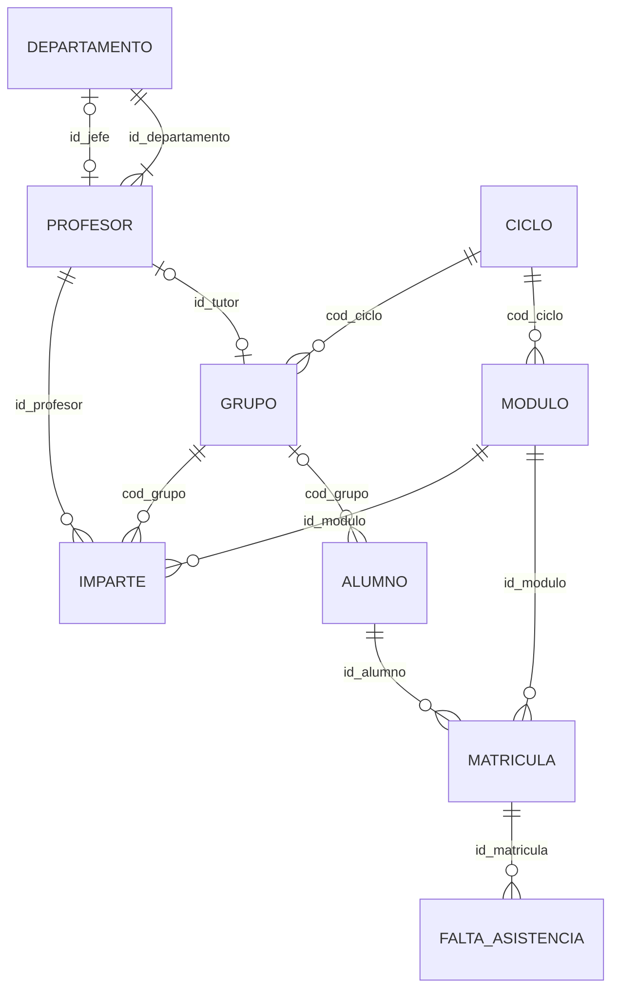

# UD03 · El model relacional


## Resum del Tema

**Visió General:**
El **Model Relacional**, ideat per Edgar F. Codd a IBM el 1970, és el model de dades lògic més estés i utilitzat comercialment al món de les bases de dades. A diferència del Model Entitat-Relació (EER), que és una eina d'abstracció conceptual per a representar la informació del món real de manera independent del programari, el Model Relacional representa l'estructura lògica de les dades mitjançant **relacions (taules)** compostes per **tuples (files)** i **atributs (columnes)**.

En aquesta unitat s'estudien minuciosament els conceptes matemàtics i pragmàtics que sustenten el model relacional: l'estructura formal d'una taula, el domini i el tipat d'atributs, el grau i la cardinalitat, les claus (candidates, primàries, alternatives i foranes), la semàntica dels valors nuls (`NULL`) i les regles d'integritat (inherents i semàntiques). A més, es detalla un catàleg complet de **regles de transformació per a convertir esquemes conceptuals EER en esquemes relacionals lògics**, il·lustrat amb abundants exemples reals, esquemes formals, sentències SQL DDL i taules amb dades reals.



### Temporalització

La unitat ocupa **17 hores d'aula** (9 de teoria i 8 de pràctica).


items:
  - {h: 2, tipo: T, t: "Relació, atribut, domini, tupla, grau i cardinalitat. Claus", ref: "§1 i §2 · laboratori de claus"}
  - {h: 2, tipo: T, t: "Restriccions i integritat referencial", ref: "§3 · simulador d'integritat"}
  - {h: 1, tipo: P, t: "Simulador d'integritat referencial", ref: "Pràctica 3.2"}
  - {h: 2, tipo: T, t: "Regles de transformació (I): entitats, febles i atributs", ref: "§4.1 a §4.3 · transformador"}
  - {h: 2, tipo: T, t: "Regles de transformació (II): relacions i jerarquies. Exemples", ref: "§4.4 a §4.9 i §5"}
  - {h: 2, tipo: P, t: "Biblioteca: de l'E/R a les taules", ref: "Pràctica 3.1"}
  - {h: 1, tipo: T, t: "Restriccions no representables i eines", ref: "§6 i §7"}
  - {h: 2, tipo: P, t: "Tres formes de transformar una jerarquia", ref: "Pràctica 3.3"}
  - {h: 1, tipo: P, t: "Catàleg de restriccions d'un hotel", ref: "Pràctica 3.5"}
  - {h: 2, tipo: P, t: "Model lògic d'EduGest", ref: "§8 i projecte EduGest-3"}
autonomo:
  - "Tasques de transformació 1 a 7 (E/R → relacional)"
  - "Pràctica 3.4 (enginyeria inversa) i pràctica 3.6"
  - "Banc de 20 exercicis"


> [!IMPORTANT]
> Aquesta unitat és el **pont** entre el disseny i la implementació: allò que decidisques ací (claus, nuls, polítiques d'esborrat) determina les sentències `CREATE TABLE` de la UD05. Un error de disseny que no detectes ara es paga després amb dades incorrectes.

### Objectius d'aprenentatge

En acabar esta unitat seràs capaç de:

- Descriure els elements del model relacional: relació, atribut, domini, tupla, grau i cardinalitat.
- Identificar claus candidates, primàries, alternatives i alienes, i la semàntica del valor `NULL`.
- Aplicar les regles d'integritat d'entitat, referencial i de domini, i triar la política d'esborrat adequada.
- Transformar un diagrama E/R estés en un esquema relacional aplicant regles sistemàtiques.
- Documentar les restriccions que el model lògic no pot expressar.



---


Elements del model i claus

## 1. Conceptes fonamentals del model relacional

### 1.1 Definició de relació (taula)

En el Model Relacional, la unitat bàsica d'emmagatzematge és la **relació**, terme matemàtic que en la pràctica informàtica s'anomena **taula**.

Una relació es defineix com un subconjunt del producte cartesià d'una família de dominis $D_1 \times D_2 \times \dots \times D_n$. Gràficament, una relació és una estructura bidimensional formada per files i columnes:

- **Diferència crucial de termes:** En el Model Entitat-Relació (EER), la paraula *"Relació"* es refereix a una associació o vincle entre dues entitats (p. ex. el client `COMPRA` productes). En canvi, en el Model Relacional, la paraula *"Relació"* designa una **taula completa de dades**.

---

### 1.2 Atributs, dominis, grau i cardinalitat

Per a caracteritzar matemàticament una taula s'utilitzen els conceptes següents:

1. **Atribut (camp o columna):** Representa una propietat o característica de l'entitat o relació que descriu la taula. Cada columna té un nom únic a la taula i un tipus de dada especificat.
2. **Domini:** És el conjunt finit de tots els valors atòmics vàlids del mateix tipus que un atribut pot albergar. Diversos atributs distints poden compartir el mateix domini (per exemple, `fecha_contrato` i `fecha_nacimiento` comparteixen el domini `DATE`).
3. **Grau:** És el nombre total d'atributs (columnes) que componen la taula. Una taula amb 5 columnes té un **grau de 5**.
4. **Cardinalitat:** És el nombre total de tuples (files o registres) emmagatzemades en un moment determinat a la taula. A diferència del grau (que és fix una vegada dissenyat l'esquema), la cardinalitat és dinàmica i varia constantment a mesura que s'inserixen o s'esborren files.

---

{}
El mateix Codd va proposar més tard distingir entre un valor **absent però aplicable** i un altre **no aplicable**. SQL es va quedar amb un únic `NULL`, i d'ací vénen moltes de les seues sorpreses: `NULL = NULL` no és vertader.
{}

### 1.3 Tuples (files) i semàntica de valors nuls (NULL)

- **Tupla (fila, registre o ocurrència):** Cada fila individual de la taula representa una instància concreta de l'entitat o relació del món real. Cada tupla està formada per una llista ordenada de valors, on cada valor correspon a un atribut específic.
- **Valors nuls (`NULL`):** Representen l'**absència de valor**, valor desconegut o no aplicable.
  - *Diferència semàntica important:* El valor `NULL` no equival al número zero (`0`) ni a una cadena de text buida (`""`). Un zero en `saldo` significa que el saldo és de 0 euros; un `NULL` en `saldo` significa que es desconeix el saldo.

---

{}
El 1985 Codd va publicar una llista de 12 regles (numerades de l'1 al 12, més una «regla 0») que un sistema havia de complir per a anomenar-se realment relacional. Quasi cap SGBD comercial les complix totes, però continuen sent la referència.
{}

## 2. Estudi exhaustiu de claus

Les claus constituïxen el pilar fonamental per a garantir la unicitat de les files i establir vincles d'integritat entre taules.



### 2.1 Clau candidata i clau primària (Primary Key - PK)

- **Clau candidata:** És un atribut o conjunt mínim d'atributs els valors dels quals identifiquen de manera única i unívoca cada tupla d'una relació, sense que cap subconjunt propi d'eixos atributs puga identificar-la.
- **Clau primària (Primary Key - PK):** És la clau candidata triada explícitament pel dissenyador de la base de dades com a identificador principal de les tuples de la taula. Per regla absoluta del model relacional, **cap atribut de la clau primària pot contindre valors nuls (`NOT NULL`) ni duplicats**.

---

### 2.2 Claus alternatives

Qualsevol clau candidata que no haja sigut triada com a clau primària passa a ser una **clau alternativa**. En l'esquema relacional i en la implementació SQL, les claus alternatives es protegixen mitjançant la restricció d'unicitat `UNIQUE`.

> [!NOTE]
> **Exemple:** A la taula `CLIENTE`, si disposem del camp `id_cliente` (autoincremental intern) i del camp `dni`, tots dos són claus candidates. Triem `id_cliente` com a **Clau Primària (PK)** i indiquem que `dni` és una **Clau Alternativa (`UNIQUE`)**.

---

### 2.3 Clau forana / aliena (Foreign Key - FK)

Una **Clau Aliena (Foreign Key - FK)** és un atribut (o conjunt d'atributs) d'una taula els valors del qual han de coincidir obligatòriament amb els valors de la clau primària d'una altra taula (o de la mateixa taula en relacions reflexives), o bé ser nuls si la participació és opcional.

Les claus alienes representen les relacions del model EER en l'esquema relacional lògic.

---

### 2.4 Claus primàries compostes

Quan una única columna no basta per a identificar de manera unívoca una fila, la clau primària es compon de dos o més atributs combinats.

> [!NOTE]
> **Exemple de clau composta:**
> En una taula de matrícula universitària `MATRICULA`, la clau primària es compon de `(id_alumno, id_asignatura)`. Un alumne pot matricular-se en diverses assignatures i en una assignatura hi ha diversos alumnes, però la combinació d'un alumne concret en una assignatura concreta és única.

> [!CAUTION]
> **Una clau no es descobrix mirant les dades d'hui.** Que cap valor no es repetisca en la mostra no demostra que no puga repetir-se demà. La clau es decidix pel **significat** del problema: poden dos alumnes tindre el mateix nom? Pot canviar el valor amb el temps? Pot faltar?

#### Laboratori: és una clau?

Amb dades reals de la taula `ALUMNO` d'EduGest, prova quins conjunts de columnes identifiquen cada fila. Fixa't en el `NULL` de `dni` i en els cognoms repetits.




- q: "En la mostra de dalt, `(nombre, apellidos)` no es repetix. És una bona clau primària per a `ALUMNO`?"
  options: ["Sí, identifica totes les files", "No: dos alumnes distints poden dir-se igual i els noms canvien", "Sí, sempre que s'afigga `NOT NULL`", "Només si s'afig també `localidad`"]
  answer: 1
  explain: "Que no es repetisca **hui** no la convertix en clau. Una clau primària ha de ser estable, no nul·la i única per significat. Per això s'usa `id_alumno` (artificial) i es protegix el NIA amb `UNIQUE`."
- q: "`dni` conté algun `NULL` en la mostra. Quin paper pot tindre eixa columna?"
  options: ["Clau primària", "Clau alternativa amb `UNIQUE`, però no clau primària", "Cap: no pot ser clau de cap tipus", "Clau aliena"]
  answer: 1
  explain: "Una clau primària no admet nuls (integritat d'entitat). Una clau alternativa amb `UNIQUE` sí que admet `NULL`, encara que a la pràctica convé que el DNI siga obligatori si és una dada del negoci."


---

Restriccions i integritat referencial

## 3. Restriccions del model relacional

### 3.1 Restriccions inherents al model

Són regles estructurals imposades automàticament per la pròpia definició matemàtica del model relacional:

1. **Unicitat de tuples:** No poden existir dues tuples idèntiques en una mateixa relació (s'han de diferenciar almenys en la clau primària).
2. **Desordre de tuples:** L'ordre en què s'emmagatzemen les files no és significatiu. La consulta torna les mateixes dades independentment de com es disposen al disc.
3. **Desordre d'atributs:** L'ordre de les columnes no altera el significat semàntic de la relació.
4. **Atomicitat d'atributs (atributs escalars):** Cada cel·la de la taula en la intersecció d'una fila i una columna només pot albergar un **únic valor atòmic** pertanyent al domini (no es permeten llistes ni matrius dins d'una cel·la).

---

### 3.2 Restriccions semàntiques o d'usuari (PK, UNIQUE, NOT NULL, CHECK)

Són regles de negoci definides explícitament pel dissenyador de la base de dades utilitzant el llenguatge SQL DDL:

- `PRIMARY KEY`: Defineix la clau primària (garanteix unicitat i no nul·litat).
- `UNIQUE`: Defineix claus alternatives (garanteix que no hi haja valors duplicats, encara que admet nuls si la norma del SGBD ho permet).
- `NOT NULL`: Obliga que un atribut siga sempre informat.
- `CHECK`: Defineix una condició lògica que s'ha de complir per a cada fila (p. ex. `CHECK (precio > 0)` o `CHECK (edad >= 18)`).

---

### 3.3 Integritat referencial i polítiques d'esborrat/modificació

La **Integritat Referencial** exigix que els valors emmagatzemats en una clau aliena (`FK`) existisquen prèviament en la clau primària (`PK`) de la taula referenciada.

Quan s'intenta eliminar o actualitzar una fila de la taula pare (la taula que conté la `PK`), el SGBD pot aplicar una de les 4 **polítiques d'integritat referencial** següents:

1. **En cascada (`ON DELETE CASCADE / ON UPDATE CASCADE`):**
   En esborrar o modificar una tupla de la taula pare, el SGBD esborra o actualitza automàticament totes les tuples de la taula filla que contenien eixa clau aliena.

2. **Restringit (`ON DELETE RESTRICT / ON UPDATE RESTRICT`):**
   El SGBD impedix i rebutja l'esborrat o modificació de la tupla pare mentre existisquen tuples filles que la referencien.

3. **Posada a nuls (`ON DELETE SET NULL / ON UPDATE SET NULL`):**
   En esborrar o actualitzar la tupla pare, el SGBD establix automàticament a `NULL` el valor de la clau aliena en totes les tuples filles afectades.

4. **Posada a valor per defecte (`ON DELETE SET DEFAULT / ON UPDATE SET DEFAULT`):**
   En esborrar o actualitzar la tupla pare, el SGBD assigna un valor per defecte prèviament configurat a la clau aliena en les tuples filles.

---

> [!WARNING]
> **Diferències entre SGBD.** L'estàndard SQL defineix `CASCADE`, `SET NULL`, `SET DEFAULT`, `RESTRICT` i `NO ACTION` tant per a `ON DELETE` com per a `ON UPDATE`. **Oracle** només implementa `ON DELETE CASCADE` i `ON DELETE SET NULL`; si no s'indica res, rebutja l'esborrat (equival a `NO ACTION`). No admet `ON UPDATE`. Els exemples SQL d'aquesta unitat usen la sintaxi estàndard; a la UD05 els escriurem en Oracle.

> [!TIP]
> **Quina política trie?** Fes-te aquesta pregunta sobre la fila filla: *té sentit que continue existint sense la fila pare?*
> - **No** (una matrícula sense alumne) → `CASCADE`.
> - **Sí, però cal revisar-la** (un alumne el grup del qual desapareix) → `SET NULL`, amb la columna opcional.
> - **No ha de passar mai per accident** (un departament amb empleats) → rebutjar (l'opció per defecte d'Oracle).

#### Laboratori: simulador d'integritat referencial

Canvia la política de la clau aliena, intenta esborrar, canviar i inserir files, i llig els missatges d'error **reals d'Oracle**. Després, repetix l'experiment amb la columna `NOT NULL`.




- q: "La FK `matricula.id_alumno` ha d'eliminar la matrícula quan s'esborra l'alumne. Quina política declares?"
  options: ["Sense clàusula", "`ON DELETE CASCADE`", "`ON DELETE SET NULL`", "`ON UPDATE CASCADE`"]
  answer: 1
  explain: "La matrícula no té sentit sense el seu alumne: s'esborra en cascada. `SET NULL` deixaria matrícules òrfenes i `ON UPDATE` no existix en Oracle."
- q: "Al simulador, per què falla `ON DELETE SET NULL` si `cod_grupo` és `NOT NULL`?"
  options: ["Perquè Oracle no suporta SET NULL", "Perquè la política exigix posar NULL en una columna que no l'admet", "Perquè el grup no existix", "Perquè falta el `COMMIT`"]
  answer: 1
  explain: "SET NULL i NOT NULL es contradiuen: el SGBD no pot complir les dues regles alhora (ORA-01407). Cal triar entre una política o l'altra."


---

Simulador d'integritat referencial

La pràctica 3.2 es fa a la [pàgina de pràctiques](/ud03-modelo-relacional/ud03-practicas), amb llapis i paper, i es comprova a la UD05 en Oracle.

---

Regles de transformació (I)

## 4. Regles de transformació del model EER al model relacional

Per a transformar de manera metòdica un diagrama EER conceptual en un esquema relacional lògic, s'apliquen les regles estandarditzades següents:

---

### 4.1 Transformació d'entitats fortes

- **Regla:** Cada entitat forta del diagrama EER es convertix en una **taula (relació)** independent.
  - Els atributs simples de l'entitat passen a ser **columnes** de la taula.
  - L'atribut identificador principal de l'entitat passa a ser la **Clau Primària (PK)** de la taula.
  - Les claus alternatives passen a protegir-se amb la restricció `UNIQUE`.

#### Esquema notacional formal

$$\text{ENTIDAD}(\underline{\text{id\_entidad}}, \text{atributo1}, \text{atributo2})$$

---

### 4.2 Transformació d'entitats febles (per identificació i existència)

- **Regla:** Una entitat feble es convertix en una **taula independent**.
  - **Feble per identificació:** La clau primària de la taula resultant és una **clau composta** formada per la clau primària de l'entitat forta propietària (que es propaga com a `FK`) combinada amb el discriminador parcial de l'entitat feble.
  - **Feble per existència:** Si l'entitat feble posseïx el seu propi identificador únic, la clau primària de l'entitat forta es propaga com a `FK NOT NULL` amb política d'esborrat en cascada (`ON DELETE CASCADE`).

#### Esquema notacional formal (feble per identificació)

$$\text{ENTIDAD\_DÉBIL}(\underline{\text{id\_padre}}, \underline{\text{id\_parcial\_débil}}, \text{atributo1})$$
$$\text{FK: id\_padre } \rightarrow \text{ENTIDAD\_PADRE}(\text{id\_padre}) \text{ ON DELETE CASCADE}$$

---

### 4.3 Transformació d'atributs compostos i multivalorats

1. **Atributs compostos:** S'eliminen desplegant cadascun dels seus subatributs simples com a columnes individuals de la pròpia taula.
2. **Atributs multivalorats ($N$):** Es crea una **nova taula independent** per a albergar l'atribut multivalorat. La clau primària d'aquesta nova taula serà la combinació de la clau primària de l'entitat originària i el mateix atribut multivalorat.

#### Esquema notacional formal (atribut multivalorat)

$$\text{ENTIDAD\_TELÉFONO}(\underline{\text{id\_persona}}, \underline{\text{numero\_telefono}}, \text{tipo\_linea})$$
$$\text{FK: id\_persona } \rightarrow \text{PERSONA}(\text{id\_persona}) \text{ ON DELETE CASCADE}$$

#### Laboratori: de l'E/R a les taules

Aquest transformador aplica les regles de l'apartat 4 i produïx l'esquema formal i el DDL d'Oracle. Comença pels casos d'aquesta sessió (feble, multivalorat) i torna a ell en la següent.



---

Regles de transformació (II): relacions i jerarquies

### 4.4 Transformació de relacions binàries 1:N

- **Regla (propagació de clau):** No es crea cap taula nova. Es pren la clau primària de l'entitat del costat "1" i es **propaga com a clau aliena (`FK`)** a la taula resultant de l'entitat del costat "N".
- Si la relació contenia atributs descriptors propis, aquests es traslladen també com a columnes a la taula del costat "N".
- Si la participació del costat "N" és obligatòria (cardinalitat mínima 1), la `FK` s'ha de configurar com a `NOT NULL`.

---

{}
{}
Un alumne es matricula en moltes assignatures i una assignatura té molts alumnes: relació **N:M** amb l'atribut `nota`.
{}
{}
`ALUMNO(id_alumno PK, nombre)` i `ASIGNATURA(id_asig PK, titulo)`. Cada entitat forta es convertix en una taula amb la seua clau.
{}
{}
No es pot posar una FK en cap de les dues taules sense repetir files, així que es crea una **taula intermèdia** `MATRICULA`.
{}
{}
Les dues claus alienes formen juntes la PK composta: `PRIMARY KEY (id_alumno, id_asig)`. Així un alumne no es matricula dues vegades en la mateixa assignatura.
{}
{}
`nota` i `fecha` van en `MATRICULA`: depenen de la parella alumne-assignatura, no d'un sol.
{}
{}
`MATRICULA(id_alumno PK,FK → ALUMNO · id_asig PK,FK → ASIGNATURA · nota)`
{}
{}

### 4.5 Transformació de relacions binàries N:M

- **Regla (taula intermèdia / d'unió):** Es crea obligatòriament una **nova taula de relació**.
  - La clau primària d'aquesta nova taula és una **clau composta** formada per la unió de les claus primàries de les dues entitats participants.
  - Cadascuna d'estes claus funciona per separat com a clau aliena (`FK`) cap a la seua taula corresponent.
  - Els atributs propis de la relació $N:M$ s'incorporen com a columnes d'esta nova taula.

---

### 4.6 Transformació de relacions binàries 1:1

Hi ha 3 alternatives segons les cardinalitats mínimes de participació:

1. **Participació opcional en ambdós costats:** hi ha dues solucions vàlides. La més simple propaga la clau d'una entitat a la taula de l'altra com a `FK` amb `UNIQUE` que **admet `NULL`** (és la que usa EduGest per a la tutoria). Si es volen evitar els nuls, es crea una taula intermèdia amb la clau d'una entitat com a `PK` i la de l'altra com a `UNIQUE NOT NULL`.
2. **Participació obligatòria en un costat i opcional en l'altre:** la clau aliena es col·loca a la taula de l'entitat la participació de la qual és **obligatòria**, referenciant l'altra, com a `FK NOT NULL UNIQUE`. Així no necessita admetre nuls.
3. **Participació obligatòria en ambdós costats:** les dues entitats poden unificar-se en una **única taula** que agrupa tots els atributs, sempre que descriguen de veres el mateix objecte.

> [!NOTE]
> En el transformador interactiu, la regla 2 es reflecteix així: si «cada A ha de tindre un B» (mínim 1) i no al contrari, la clau aliena està en A.

---

### 4.7 Transformació de relacions reflexives / recursives

1. **Reflexiva 1:N:** S'afig una columna de clau aliena (`FK`) a la mateixa taula que **apunta a la clau primària de la mateixa taula** (autoreferència).
2. **Reflexiva N:M:** Es crea una **taula intermèdia** la clau primària de la qual es compon de dues columnes que fan clau aliena cap a la clau primària de la mateixa taula (representant el rol origen i el rol destinació).

---

### 4.8 Transformació de relacions ternàries

- **Ternària N:N:N:** Es crea una taula intermèdia la `PK` de la qual és la combinació de les claus primàries de les tres entitats participants.
- **Ternària 1:1:1 o 1:1:N:** Es crea una taula intermèdia de relació propagant les tres claus primàries, determinant la `PK` composta segons els costats de cardinalitat màxima $N$.

---

### 4.9 Transformació de jerarquies de generalització / especialització

Hi ha 3 estratègies relacionals per a transformar jerarquies EER:

1. **Opció A (taula única per a tota la jerarquia):** Es crea una sola taula amb tots els atributs del supertipus i dels subtipus, afegint una columna discriminadora de tipus (`tipo_subtipo`). Vàlida per a especialitzacions disjuntes.
2. **Opció B (taules per al supertipus i cada subtipus):** Es crea una taula per al supertipus (amb la `PK` principal) i una taula per cada subtipus (la `PK` i `FK` de la qual és la clau del supertipus). És la solució més neta i flexible.
3. **Opció C (taules únicament per als subtipus):** Només es creen taules per a les entitats especialitzades, duplicant els atributs del supertipus en cadascuna. Només vàlida si la jerarquia és Total i Disjunta $(T,D)$.


- q: "Tot `PASAPORTE` pertany a una persona, però no tota `PERSONA` té passaport. On va la clau aliena?"
  options: ["En `PERSONA`, `NOT NULL UNIQUE`", "En `PASAPORTE`, `NOT NULL UNIQUE`", "En totes dues taules", "En una taula nova obligatòriament"]
  answer: 1
  explain: "La clau aliena va a la taula de l'entitat amb participació obligatòria (`PASAPORTE`): mai és nul·la i `UNIQUE` garanteix l'«1» de l'altre costat."
- q: "`AULA` és feble per identificació respecte a `EDIFICIO`. Quina és la seua clau primària?"
  options: ["`num_aula`", "`id_edificio`", "`(id_edificio, num_aula)`", "No té clau primària"]
  answer: 2
  explain: "El número d'aula només és únic dins de cada edifici: la clau primària inclou la clau del propietari (que a més és clau aliena)."


---

## 5. Col·lecció abundant d'exemples de transformació completa

A continuació es presenten 5 exemples pràctics complets que il·lustren minuciosament cadascuna de les regles de transformació vistes.

---

### 5.1 Exemple complet 1: Gestió de departament i empleats

#### Enunciat semàntic (5.1)

Un `DEPARTAMENTO` (identificat per `id_dep`, amb `nombre_dep`) empra diversos `EMPLEADO` (identificat per `id_emp`, amb `nombre`, `salario` i `fecha_alta`). Un empleat treballa en un únic departament (relació $1:N$).

#### Esquema relacional formal (5.1)

- $\text{DEPARTAMENTO}(\underline{\text{id\_dep}}, \text{nombre\_dep})$
- $\text{EMPLEADO}(\underline{\text{id\_emp}}, \text{nombre}, \text{salario}, \text{fecha\_alta}, \text{id\_dep*})$
  - $\text{FK: id\_dep } \rightarrow \text{DEPARTAMENTO}(\text{id\_dep}) \text{ ON DELETE RESTRICT}$

#### Sentències SQL DDL (5.1)



```sql
CREATE TABLE departamento (
    id_dep INT PRIMARY KEY,
    nombre_dep VARCHAR(100) NOT NULL UNIQUE
);

CREATE TABLE empleado (
    id_emp INT PRIMARY KEY,
    nombre VARCHAR(100) NOT NULL,
    salario DECIMAL(10,2) CHECK (salario >= 1080.00),
    fecha_alta DATE NOT NULL,
    id_dep INT NOT NULL,
    CONSTRAINT fk_empleado_departamento FOREIGN KEY (id_dep)
        REFERENCES departamento(id_dep)
        ON DELETE RESTRICT ON UPDATE CASCADE
);
```

#### Contingut de dades reals en taules (5.1)

**Taula: `departamento`**

| `id_dep` (PK) | `nombre_dep` |
| :--- | :--- |
| `10` | `'Tecnología e Innovación'` |
| `20` | `'Recursos Humanos'` |
| `30` | `'Finanzas y Contabilidad'` |

**Taula: `empleado`**

| `id_emp` (PK) | `nombre` | `salario` | `fecha_alta` | `id_dep` (FK) |
| :--- | :--- | :--- | :--- | :--- |
| `101` | `'Ana Torres'` | `2400.00` | `'2024-01-15'` | `10` |
| `102` | `'Carlos Ruiz'` | `1950.00` | `'2024-03-01'` | `20` |
| `103` | `'Lucía Vega'` | `3100.00` | `'2022-06-10'` | `10` |

---

### 5.2 Exemple complet 2: Sistema acadèmic (alumnes, assignatures i matriculació)

#### Enunciat semàntic (5.2)

Un `ALUMNO` (`id_alumno`, `nombre`, `email`) es matricula en diverses `ASIGNATURA` (`id_asig`, `nombre_asig`, `creditos`). Una assignatura acull diversos alumnes (relació $N:M$). De cada matriculació es guarda la `nota_final` aconseguida.

#### Esquema relacional formal (5.2)

- $\text{ALUMNO}(\underline{\text{id\_alumno}}, \text{nombre}, \text{email})$
- $\text{ASIGNATURA}(\underline{\text{id\_asig}}, \text{nombre\_asig}, \text{creditos})$
- $\text{MATRICULA}(\underline{\text{id\_alumno*}}, \underline{\text{id\_asig*}}, \text{nota\_final})$
  - $\text{FK1: id\_alumno } \rightarrow \text{ALUMNO}(\text{id\_alumno}) \text{ ON DELETE CASCADE}$
  - $\text{FK2: id\_asig } \rightarrow \text{ASIGNATURA}(\text{id\_asig}) \text{ ON DELETE CASCADE}$

#### Sentències SQL DDL (5.2)



```sql
CREATE TABLE alumno (
    id_alumno INT PRIMARY KEY,
    nombre VARCHAR(100) NOT NULL,
    email VARCHAR(150) NOT NULL UNIQUE
);

CREATE TABLE asignatura (
    id_asig INT PRIMARY KEY,
    nombre_asig VARCHAR(100) NOT NULL,
    creditos INT CHECK (creditos > 0)
);

CREATE TABLE matricula (
    id_alumno INT,
    id_asig INT,
    nota_final DECIMAL(4,2) CHECK (nota_final BETWEEN 0.00 AND 10.00),
    PRIMARY KEY (id_alumno, id_asig),
    CONSTRAINT fk_mat_alumno FOREIGN KEY (id_alumno) REFERENCES alumno(id_alumno) ON DELETE CASCADE,
    CONSTRAINT fk_mat_asig FOREIGN KEY (id_asig) REFERENCES asignatura(id_asig) ON DELETE CASCADE
);
```

#### Contingut de dades reals en taules (5.2)

**Taula: `alumno`**

| `id_alumno` (PK) | `nombre` | `email` |
| :--- | :--- | :--- |
| `1` | `'Juan Pérez'` | `'juan@universidad.edu'` |
| `2` | `'María López'` | `'maria@universidad.edu'` |

**Taula: `asignatura`**

| `id_asig` (PK) | `nombre_asig` | `creditos` |
| :--- | :--- | :--- |
| `501` | `'Bases de Datos'` | `6` |
| `502` | `'Sistemas Operativos'` | `6` |

**Taula: `matricula` (taula intermèdia N:M)**

| `id_alumno` (PK,FK) | `id_asig` (PK,FK) | `nota_final` |
| :--- | :--- | :--- |
| `1` | `501` | `8.50` |
| `1` | `502` | `7.00` |
| `2` | `501` | `9.25` |

---

### 5.3 Exemple complet 3: Edificis i aules (entitat feble per identificació)

#### Enunciat semàntic (5.3)

Un `EDIFICIO` (`id_edificio`, `nombre_edificio`, `direccion`) conté diverses `AULA` (`num_aula`, `capacidad`). L'aula és una **entitat feble per identificació** respecte a l'edifici: el número d'aula `num_aula` (101, 102...) es repetix en edificis distints, per la qual cosa la seua clau primària relacional es compon conjuntament amb el codi de l'edifici.

#### Esquema relacional formal (5.3)

- $\text{EDIFICIO}(\underline{\text{id\_edificio}}, \text{nombre\_edificio}, \text{direccion})$
- $\text{AULA}(\underline{\text{id\_edificio*}}, \underline{\text{num\_aula}}, \text{capacidad})$
  - $\text{FK: id\_edificio } \rightarrow \text{EDIFICIO}(\text{id\_edificio}) \text{ ON DELETE CASCADE}$

#### Sentències SQL DDL (5.3)



```sql
CREATE TABLE edificio (
    id_edificio INT PRIMARY KEY,
    nombre_edificio VARCHAR(100) NOT NULL,
    direccion VARCHAR(200) NOT NULL
);

CREATE TABLE aula (
    id_edificio INT,
    num_aula INT,
    capacidad INT CHECK (capacidad > 0),
    PRIMARY KEY (id_edificio, num_aula),
    CONSTRAINT fk_aula_edificio FOREIGN KEY (id_edificio) 
        REFERENCES edificio(id_edificio) ON DELETE CASCADE
);
```

#### Contingut de dades reals en taules (5.3)

**Taula: `edificio`**

| `id_edificio` (PK) | `nombre_edificio` | `direccion` |
| :--- | :--- | :--- |
| `1` | `'Edificio Polivalente A'` | `'Campus Sur, Av. Universidad 1'` |
| `2` | `'Edificio de Laboratorios'` | `'Campus Norte, C/ Ciencia 4'` |

**Taula: `aula` (entitat feble)**

| `id_edificio` (PK,FK) | `num_aula` (PK) | `capacidad` |
| :--- | :--- | :--- |
| `1` | `101` | `45` |
| `1` | `102` | `30` |
| `2` | `101` | `60` |

---

### 5.4 Exemple complet 4: Jerarquia d'empleats i caps (relació reflexiva)

#### Enunciat semàntic (5.4)

En una empresa, de cada `EMPLEADO` (`id_emp`, `nombre`, `cargo`) es coneix el seu cap directe. Un empleat té com a màxim un únic cap directe (que és al seu torn un altre empleat de la mateixa empresa) i un cap pot supervisar diversos empleats (**relació reflexiva $1:N$**).

#### Esquema relacional formal (5.4)

- $\text{EMPLEADO}(\underline{\text{id\_emp}}, \text{nombre}, \text{cargo}, \text{id\_jefe*})$
  - $\text{FK: id\_jefe } \rightarrow \text{EMPLEADO}(\text{id\_emp}) \text{ ON DELETE SET NULL}$

#### Sentències SQL DDL (5.4)



```sql
CREATE TABLE empleado (
    id_emp INT PRIMARY KEY,
    nombre VARCHAR(100) NOT NULL,
    cargo VARCHAR(100) NOT NULL,
    id_jefe INT,
    CONSTRAINT fk_empleado_jefe FOREIGN KEY (id_jefe)
        REFERENCES empleado(id_emp) ON DELETE SET NULL
);
```

#### Contingut de dades reals en taules (5.4)

**Taula: `empleado` (amb autoreferència reflexiva)**

| `id_emp` (PK) | `nombre` | `cargo` | `id_jefe` (FK -> `empleado.id_emp`) |
| :--- | :--- | :--- | :--- |
| `1` | `'Elena Blanco'` | `'Directora General'` | `NULL` |
| `2` | `'Roberto Gómez'` | `'Jefe de Desarrollo'` | `1` |
| `3` | `'Marta Vidal'` | `'Programadora Senior'` | `2` |
| `4` | `'Santi Castro'` | `'Programador Junior'` | `2` |

---

### 5.5 Exemple complet 5: Venda d'automòbils i revisions en el taller

#### Enunciat semàntic (5.5)

Un concessionari ven `COCHE` (`matricula`, `modelo`, `precio`) a `CLIENTE` (`id_cliente`, `nombre`, `telefono`). Un client pot comprar diversos cotxes ($1:N$). Cada cotxe passa `REVISION` periòdiques al taller. La revisió s'identifica de manera feble per un `num_revision` relatiu a la matrícula del cotxe (`matricula`, `num_revision`), registrant `fecha_revision` i `coste`.

#### Esquema relacional formal (5.5)

- $\text{CLIENTE}(\underline{\text{id\_cliente}}, \text{nombre}, \text{telefono})$
- $\text{COCHE}(\underline{\text{matricula}}, \text{modelo}, \text{precio}, \text{id\_cliente*})$
  - $\text{FK: id\_cliente } \rightarrow \text{CLIENTE}(\text{id\_cliente}) \text{ ON DELETE RESTRICT}$
- $\text{REVISION}(\underline{\text{matricula*}}, \underline{\text{num\_revision}}, \text{fecha\_revision}, \text{coste})$
  - $\text{FK: matricula } \rightarrow \text{COCHE}(\text{matricula}) \text{ ON DELETE CASCADE}$

#### Sentències SQL DDL (5.5)



```sql
CREATE TABLE cliente (
    id_cliente INT PRIMARY KEY,
    nombre VARCHAR(100) NOT NULL,
    telefono VARCHAR(20) NOT NULL
);

CREATE TABLE coche (
    matricula VARCHAR(15) PRIMARY KEY,
    modelo VARCHAR(100) NOT NULL,
    precio DECIMAL(10,2) CHECK (precio > 0),
    id_cliente INT NOT NULL,
    CONSTRAINT fk_coche_cliente FOREIGN KEY (id_cliente)
        REFERENCES cliente(id_cliente) ON DELETE RESTRICT
);

CREATE TABLE revision (
    matricula VARCHAR(15),
    num_revision INT,
    fecha_revision DATE NOT NULL,
    coste DECIMAL(8,2) CHECK (coste >= 0),
    PRIMARY KEY (matricula, num_revision),
    CONSTRAINT fk_revision_coche FOREIGN KEY (matricula)
        REFERENCES coche(matricula) ON DELETE CASCADE
);
```

#### Contingut de dades reals en taules (5.5)

**Taula: `cliente`**

| `id_cliente` (PK) | `nombre` | `telefono` |
| :--- | :--- | :--- |
| `10` | `'Gonzalo Navarro'` | `'600112233'` |

**Taula: `coche`**

| `matricula` (PK) | `modelo` | `precio` | `id_cliente` (FK) |
| :--- | :--- | :--- | :--- |
| `'1234-BBB'` | `'Sedán Familiar'` | `22500.00` | `10` |

**Taula: `revision` (entitat feble per identificació)**

| `matricula` (PK,FK) | `num_revision` (PK) | `fecha_revision` | `coste` |
| :--- | :--- | :--- | :--- |
| `'1234-BBB'` | `1` | `'2025-02-10'` | `120.00` |
| `'1234-BBB'` | `2` | `'2026-02-15'` | `250.00` |

---

Biblioteca: de l'E/R a les taules

Restriccions no representables i eines

## 6. Restriccions que el model lògic no pot expressar

El model relacional expressa molt bé les restriccions **d'una fila** (`NOT NULL`, `CHECK`) i **de clau** (`PRIMARY KEY`, `UNIQUE`, `FOREIGN KEY`). Però moltes regles de negoci afecten **diverses files o diverses taules** i no es poden declarar així. El criteri RA6.h exigix **analitzar-les i documentar-les** perquè no es perden entre el disseny i la implementació.

| Regla de negoci (EduGest) | Per què no basta amb una restricció declarativa? | On s'implementarà |
|---|---|---|
| El cap d'un departament ha de pertànyer a eixe departament | Compara una fila de `DEPARTAMENTO` amb una fila de `PROFESOR` | Trigger (UD09) |
| Un alumne només es matricula en mòduls del cicle del seu grup | Implica `ALUMNO`, `GRUPO` i `MODULO` | Trigger o procediment de matrícula (UD09) |
| Un professor no supera 20 hores lectives setmanals | És una **suma** sobre diverses files d'`IMPARTE` | Trigger compost o procediment (UD09) |
| No hi ha faltes anteriors a la data de matrícula | Compara dues taules | Trigger (UD09) |
| La nota final es posa en múltiples de 0,25 | És una regla d'**una fila** | `CHECK (MOD(nota_final * 4, 1) = 0)` (UD05) |
| Un grup no supera 30 alumnes | És un **recompte** sobre diverses files | Procediment de matrícula o trigger (UD09) |

Cada restricció es documenta amb un format fix:

```text
R1. Cap de departament
    Descripció: el professor cap d'un departament ha de pertànyer-hi.
    Taules: DEPARTAMENTO(id_jefe), PROFESOR(id_profesor, id_departamento)
    Moment de comprovació: en assignar o canviar el cap i en canviar de
                            departament un professor.
    Implementació prevista: trigger (UD09).
```

> [!IMPORTANT]
> Una regla que només es comprova en l'aplicació (en el codi Java, Kotlin o PHP) pot saltar-se inserint dades directament a la base de dades o des d'una altra aplicació. Sempre que siga possible, les regles d'integritat han de viure **a la base de dades**.

---

## 7. Eines gràfiques per al disseny lògic

El disseny lògic es representa amb un **diagrama relacional**: un rectangle per taula amb les seues columnes, la clau primària marcada i fletxes des de cada clau aliena fins a la clau primària que referencia (RA6.a).

| Eina | Què aporta |
|---|---|
| **Oracle SQL Developer Data Modeler** | Dissenya el model lògic (Barker) i el relacional, i **genera el DDL d'Oracle**. També fa enginyeria inversa: dibuixa el diagrama d'un esquema existent |
| **SQL Developer → Data Modeler** | Arrossegant les taules d'una connexió s'obté el seu diagrama |
| **draw.io** | Plantilles de taules (*Entity Relation* → *Table*) |
| **dbdiagram.io / DBML** | Diagrama a partir d'una descripció en text |
| **Mermaid** | Diagrames `erDiagram` en Markdown, ideals per a documentar al repositori |

> [!TIP]
> Quan acabes el projecte a la UD05, usa l'**enginyeria inversa** de SQL Developer Data Modeler (*Arxiu → Importar → Diccionari de dades*) sobre l'esquema `EDUGEST`. Si el diagrama obtingut no coincidix amb el teu disseny lògic, hi ha un error en un dels dos.

{}
Fes-te tres preguntes, en este ordre: es decidix mirant **una sola fila**? → `CHECK`. Compara una columna amb la **clau d'una altra taula**? → clau aliena. Necessita **sumar, comptar o comparar diverses files** o taules? → trigger o procediment al servidor (UD09). Només si cap de les tres servix ha de viure en l'aplicació.
{}

---

Tres formes de transformar una jerarquia

Catàleg de restriccions d'un hotel

## 8. Cas guiat: EduGest del model E/R al relacional

Apliquem les regles de l'apartat 4 al diagrama de la UD02. Cada pas cita la regla aplicada.

| Element del model E/R | Regla | Resultat en el model relacional |
|---|---|---|
| Entitat `CICLO` | 4.1 Entitat forta | CICLO(<u>cod_ciclo</u>, nombre, grado, horas_totales) |
| Entitat `MODULO` amb (codigo, ciclo) únic | 4.1 + clau alternativa | MODULO(<u>id_modulo</u>, codigo, nombre, curso, horas, *cod_ciclo*) · UNIQUE(codigo, cod_ciclo) |
| CICLO 1:N MODULO | 4.4 La FK va al costat N | `cod_ciclo` en MODULO, NOT NULL perquè la participació és (1, 1) |
| CICLO 1:N GRUPO | 4.4 | GRUPO(<u>cod_grupo</u>, *cod_ciclo*, curso, turno, ...) |
| GRUPO 1:N ALUMNO, participació (0, 1) | 4.4 amb FK opcional | ALUMNO(..., *cod_grupo*) **admet NULL** |
| PROFESOR 1:1 GRUPO (tutoria), opcional als dos costats | 4.6 | `id_tutor` en GRUPO, admet NULL i és **UNIQUE** |
| ALUMNO N:M MODULO amb atributs i curs acadèmic | 4.5 | MATRICULA(<u>id_matricula</u>, *id_alumno*, *id_modulo*, curso_academico, ...) · UNIQUE(id_alumno, id_modulo, curso_academico) |
| PROFESOR–MODULO–GRUPO (imparte) | 4.8 Ternària | IMPARTE(<u>*id_modulo*, *cod_grupo*, curso_academico</u>, *id_profesor*, horas_semanales) |

> [!NOTE]
> En `MATRICULA` s'ha usat una **clau artificial** (`id_matricula`) en lloc de la clau composta (id_alumno, id_modulo, curso_academico). Les dues opcions són correctes. La clau artificial simplifica les claus alienes que apunten a la matrícula (com les faltes d'assistència), però **obliga** a declarar la clau natural com a `UNIQUE`; si no, es podrien duplicar matrícules.

{}

{}

---

Model lògic d'EduGest


- t: "Relació"
  d: "Taula del model relacional: conjunt de tuples amb els mateixos atributs."
- t: "Tupla"
  d: "Fila d'una relació."
- t: "Grau"
  d: "Nombre d'atributs (columnes) d'una relació."
- t: "Cardinalitat"
  d: "Nombre de tuples (files) d'una relació."
- t: "Clau candidata"
  d: "Conjunt mínim d'atributs que identifica cada tupla."
- t: "Clau aliena"
  d: "Atribut(s) que referencien la clau primària d'una altra relació."


## 9. Resum i conclusions

- El **Model Relacional** estructura lògicament la informació mitjançant relacions (taules), tuples (files) i atributs (columnes), basant-se en la teoria matemàtica de conjunts.
- Les **claus primàries (PK)** i **claus alternatives (`UNIQUE`)** garanteixen la unicitat de les tuples, mentre que les **claus alienes (FK)** representen els vincles i imposen integritat referencial.
- Les polítiques d'integritat referencial (`CASCADE`, `RESTRICT`, `SET NULL`) determinen la resposta del SGBD davant d'esborrats o modificacions de claus primàries.
- El pas d'EER a Relacional es regix per un catàleg estricte de regles de transformació que mapeja entitats a taules, relacions $1:N$ a propagacions de clau, relacions $N:M$ a taules intermèdies d'enllaç i entitats febles a claus compostes.

---

## 10. Exercicis resolts

### 1. Pregunta teòrica: claus en el model relacional

**Pregunta:** Quina és la diferència entre una clau candidata, una clau primària i una clau aliena?
{}
- *Clau candidata:* Qualsevol conjunt mínim d'atributs que identifica de manera única cada tupla d'una taula.
- *Clau primària (PK):* La clau candidata triada pel dissenyador com a identificador principal. No admet valors nuls ni repetits.
- *Clau aliena (FK):* Atribut d'una taula els valors del qual fan referència a la clau primària d'una altra taula per a representar un vincle.
{}

---

### 2. Anàlisi de polítiques d'integritat referencial

**Pregunta:** Si eliminem la fila d'un `DEPARTAMENTO` amb `id_dep = 10` i la clau aliena de la taula `EMPLEADO` té configurada la política `ON DELETE CASCADE`, què passa amb els empleats pertanyents a eix departament?
{}
El SGBD eliminarà automàticament de la taula `EMPLEADO` totes les tuples que tinguen `id_dep = 10`.
{}

---

### 3. Exercici pràctic de transformació relacional

**Enunciat:** Un `AUTOR` (`id_autor`, `nombre`) escriu diversos `LIBRO` (`isbn`, `titulo`, `precio`). Un llibre pot ser escrit per diversos autors. Expressa l'esquema relacional formal resultant i les sentències SQL DDL per a implementar esta relació $N:M$.

**Solució pas a pas:**

1. **Esquema relacional formal:**
   - $\text{AUTOR}(\underline{\text{id\_autor}}, \text{nombre})$
   - $\text{LIBRO}(\underline{\text{isbn}}, \text{titulo}, \text{precio})$
   - $\text{ESCRIBE}(\underline{\text{id\_autor*}}, \underline{\text{isbn*}})$

2. **Sentències SQL DDL:**

```sql
CREATE TABLE autor (
    id_autor INT PRIMARY KEY,
    nombre VARCHAR(100) NOT NULL
);

CREATE TABLE libro (
    isbn VARCHAR(20) PRIMARY KEY,
    titulo VARCHAR(150) NOT NULL,
    precio DECIMAL(8,2) CHECK (precio > 0)
);

CREATE TABLE escribe (
    id_autor INT,
    isbn VARCHAR(20),
    PRIMARY KEY (id_autor, isbn),
    CONSTRAINT fk_esc_autor FOREIGN KEY (id_autor) REFERENCES autor(id_autor) ON DELETE CASCADE,
    CONSTRAINT fk_esc_libro FOREIGN KEY (isbn) REFERENCES libro(isbn) ON DELETE CASCADE
);
```

---

## 11. Autoavaluació

Respon a les preguntes i prem **Corregir**. Cada resposta inclou una explicació.


- q: "Una taula té 6 columnes i 250 files. Quins són el seu grau i la seua cardinalitat?"
  options: ["Grau 250 i cardinalitat 6", "Grau 6 i cardinalitat 250", "Grau 6 i cardinalitat 6", "Depén de la clau primària"]
  answer: 1
  explain: "El **grau** és el nombre d'atributs (columnes) i la **cardinalitat** el nombre de tuples (files)."
- q: "A la taula CLIENTE, tant `id_cliente` com `dni` identifiquen cada client. Es tria `id_cliente` com a clau primària. Què és `dni`?"
  options: ["Una clau aliena", "Una clau alternativa", "Una superclau no mínima", "Un atribut derivat"]
  answer: 1
  explain: "És una clau **candidata** que no s'ha triat com a primària: una clau alternativa. Es declara amb `UNIQUE`."
- q: "Quina regla d'integritat impedix que una clau primària prenga el valor NULL?"
  options: ["Integritat referencial", "Integritat d'entitat", "Integritat de domini", "Regla de negoci"]
  answer: 1
  explain: "La **integritat d'entitat** exigix que la clau primària siga única i no nul·la, perquè identifica cada fila."
- q: "En transformar una relació 1:N entre DEPARTAMENTO (1) i EMPLEADO (N), on va la clau aliena?"
  options: ["En DEPARTAMENTO", "En EMPLEADO", "En una taula nova", "En les dues taules"]
  answer: 1
  explain: "La clau aliena es col·loca en el costat **N**: cada empleat guarda l'identificador del seu únic departament."
- q: "Una relació N:M entre ALUMNO i ASIGNATURA amb l'atribut nota es transforma en..."
  options: ["Una clau aliena en ALUMNO", "Una clau aliena en ASIGNATURA", "Una taula nova amb les dues claus alienes i la nota", "Un atribut multivalorat"]
  answer: 2
  explain: "Tota relació N:M genera una **taula pròpia** amb les claus de les dues entitats (normalment com a clau primària composta) i els atributs de la relació."
- q: "S'esborra un departament que té empleats. La FK d'EMPLEADO té `ON DELETE SET NULL`. Què passa?"
  options: ["Es rebutja l'esborrat", "S'esborren també els empleats", "Els empleats queden amb id_dep a NULL", "Els empleats passen a un altre departament"]
  answer: 2
  explain: "SET NULL conserva les files filles i posa la seua clau aliena a NULL. Només és possible si la columna admet nuls."
- q: "Quina opció d'integritat referencial **no** està disponible en Oracle?"
  options: ["ON DELETE CASCADE", "ON DELETE SET NULL", "ON UPDATE CASCADE", "L'opció per defecte (rebutjar l'esborrat)"]
  answer: 2
  explain: "Oracle no implementa `ON UPDATE`: no permet modificar en cascada una clau primària referenciada. És una altra raó per a usar claus primàries **estables** que no canvien."
- q: "La regla «un professor no pot impartir més de 20 hores setmanals» s'ha de..."
  options: ["Expressar amb un CHECK a la taula IMPARTE", "Documentar com a restricció no representable i implementar amb PL/SQL", "Ignorar, ja que no forma part del model", "Resoldre amb una clau aliena"]
  answer: 1
  explain: "Afecta la **suma** de diverses files. Un `CHECK` només veu la fila actual. Es documenta (RA6.h) i s'implementa amb un trigger o un procediment (UD09)."


## Referències

- Codd, E. F. (1970). «A Relational Model of Data for Large Shared Data Banks». *Communications of the ACM*, 13(6).
- [Oracle AI Database 26ai: SQL Language Reference, *constraint*](https://docs.oracle.com/en/database/oracle/oracle-database/26/sqlrf/constraint.html).
