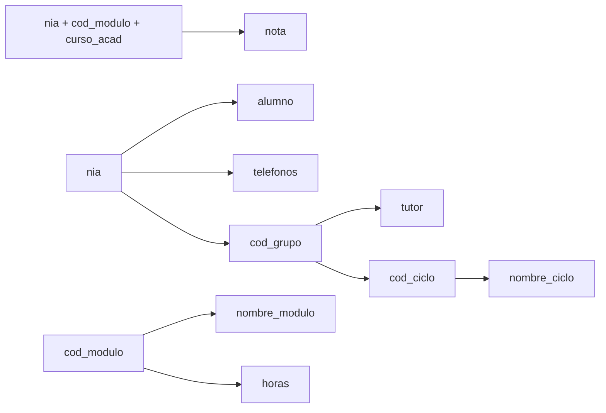
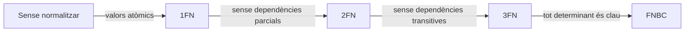

# UD04 · Normalització

## Resum del tema

Un esquema relacional pot ser **correcte** (guarda tota la informació) i, tanmateix, estar **mal dissenyat**: repetir dades, permetre contradiccions i obligar a inventar valors per a poder inserir una fila. La **normalització** és una tècnica formal, basada en les **dependències funcionals**, que detecta estos problemes i els corregix descomponent les taules sense perdre informació.

En esta unitat aprendràs a reconéixer les anomalies d'un mal disseny, a identificar dependències funcionals i claus candidates, i a portar un esquema fins a la **tercera forma normal (3FN)** i la **forma normal de Boyce-Codd (FNBC)**. També veuràs quan té sentit **desnormalitzar** i com documentar les regles que la normalització no resol.


### Temporalització

La unitat ocupa **14 hores d'aula** (6 de teoria i 8 de pràctica). És una unitat molt pràctica: s'aprén a normalitzar normalitzant.


items:
  - {h: 2, tipo: T, t: "Anomalies i dependències funcionals", ref: "§1 i §2"}
  - {h: 1, tipo: P, t: "Dependències, tancaments i claus", ref: "Pràctica 4.2"}
  - {h: 2, tipo: T, t: "Les formes normals: 1FN, 2FN, 3FN i FNBC", ref: "§3"}
  - {h: 2, tipo: P, t: "Normalitzar les factures d'un taller", ref: "Pràctica 4.1"}
  - {h: 1, tipo: T, t: "Descomposició sense pèrdua i desnormalització controlada", ref: "§4 i §5"}
  - {h: 1, tipo: T, t: "Restriccions no representables i procediment complet", ref: "§6 i §7"}
  - {h: 2, tipo: P, t: "Reserves d'un hotel rural", ref: "Pràctica 4.4"}
  - {h: 1, tipo: P, t: "En quina forma normal està?", ref: "Pràctica 4.3"}
  - {h: 1, tipo: P, t: "FNBC i dependències perdudes", ref: "Pràctica 4.5"}
  - {h: 1, tipo: P, t: "Informe de normalització d'EduGest", ref: "Projecte EduGest-4"}
autonomo:
  - "Pràctica 4.6 (normalitzar o desnormalitzar?)"
  - "Exercicis resolts i autoavaluació"


### Objectius d'aprenentatge

En acabar esta unitat seràs capaç de:

- Detectar anomalies d'inserció, modificació i esborrat en una taula.
- Identificar dependències funcionals completes, parcials i transitives.
- Calcular el tancament d'un conjunt d'atributs i deduir les claus candidates.
- Determinar en quina forma normal està una relació i normalitzar-la fins a 3FN i FNBC.
- Comprovar que una descomposició no perd informació.
- Justificar una desnormalització i documentar les restriccions que no es poden expressar en el disseny.

> [!NOTE]
> El disseny E/R ben fet (UD02) i la seua transformació correcta (UD03) solen produir taules ja normalitzades. La normalització servix per a **verificar** eixe resultat i per a **arreglar** dissenys heretats: fulls de càlcul, fitxers CSV o bases de dades antigues.

---

Anomalies i dependències funcionals

## 1. Per què normalitzar: les anomalies

Secretaria ens lliura el full de càlcul amb què gestionava les matrícules abans d'EduGest. Cada fila és la matrícula d'un alumne en un mòdul:

**MATRICULA_HOJA**

| nia | alumno | telefonos | cod_grupo | tutor | cod_ciclo | nombre_ciclo | cod_modulo | nombre_modulo | horas | curso_acad | nota |
|---|---|---|---|---|---|---|---|---|---|---|---|
| 10450037 | Adrián Ferri | 611111111, 622222222 | 1DAM | Lucía Ferrándiz | DAM | Desenvolupament d'Aplicacions Multiplataforma | 0484 | Bases de dades | 160 | 2025-26 | 7,5 |
| 10450037 | Adrián Ferri | 611111111, 622222222 | 1DAM | Lucía Ferrándiz | DAM | Desenvolupament d'Aplicacions Multiplataforma | 0485 | Programació | 256 | 2025-26 | 6 |
| 10450074 | Rubén Iborra | 633333333 | 1DAM | Lucía Ferrándiz | DAM | Desenvolupament d'Aplicacions Multiplataforma | 0484 | Bases de dades | 160 | 2025-26 | 4,25 |
| 10450518 | Carla Valero | 644444444 | 1DAW | Raúl Cano | DAW | Desenvolupament d'Aplicacions Web | 0484 | Bases de dades | 160 | 2025-26 | 8 |

Esta taula té tres tipus de problemes, anomenats **anomalies**:

| Anomalia | Exemple en el full | Conseqüència |
|---|---|---|
| **De modificació** | El tutor d'1DAM canvia. Cal modificar **totes** les files de l'alumnat d'1DAM | Si s'oblida una fila, el grup tindrà dos tutors: **inconsistència** |
| **D'inserció** | Es crea el cicle SMR, que encara no té alumnes | No es pot registrar sense inventar un alumne i una matrícula |
| **D'esborrat** | Carla Valero anul·la la seua única matrícula | Es perd que el tutor d'1DAW és Raúl Cano |

Totes tenen la mateixa causa: la taula barreja fets sobre **diverses coses distintes** (alumnes, grups, cicles, mòduls i matrícules). La normalització separa cada fet en la seua pròpia taula.

> [!IMPORTANT]
> La redundància **no** és només un problema d'espai en disc. El problema greu és la **inconsistència**: quan una mateixa dada està en diversos llocs, tard o prompte les còpies deixen de coincidir.

---

## 2. Dependències funcionals

### 2.1 Definició

Donats dos conjunts d'atributs $X$ i $Y$ d'una relació, es diu que **$Y$ depén funcionalment de $X$**, i s'escriu $X \rightarrow Y$, si cada valor de $X$ va associat **sempre al mateix** valor de $Y$.

Es llig «$X$ determina $Y$». $X$ és el **determinant** i $Y$ l'**implicat**.

En el full de matrícules:

- `nia → alumno`: un NIA correspon sempre al mateix alumne.
- `cod_grupo → tutor`: cada grup té un únic tutor.
- `cod_modulo → nombre_modulo, horas` *(en este full, on cada codi pertany a un únic cicle)*.
- `nia, cod_modulo, curso_acad → nota`: la nota depén de les tres coses alhora.
- `alumno → nia` **no** es complix: dos alumnes poden dir-se igual.

> [!WARNING]
> Les dependències funcionals es deduïxen de les **regles del negoci**, no de les dades d'exemple. Que en el full no hi haja dos alumnes amb el mateix nom no significa que `alumno → nia`. Pregunta sempre: «pot ocórrer que...?».

### 2.2 Tipus de dependències

| Tipus | Definició | Exemple |
|---|---|---|
| **Trivial** | $Y$ està contingut en $X$ | `nia, alumno → alumno` |
| **Completa** | $Y$ depén de $X$ però de cap subconjunt propi de $X$ | `nia, cod_modulo, curso_acad → nota` |
| **Parcial** | $Y$ depén d'una **part** d'una clau composta | `nia, cod_modulo, curso_acad → alumno`, perquè basta `nia → alumno` |
| **Transitiva** | $X \rightarrow Y$, $Y \rightarrow Z$ i $Y$ no determina $X$; llavors $Z$ depén transitivament de $X$ | `nia → cod_grupo` i `cod_grupo → tutor`, així que `nia → tutor` és transitiva |

### 2.3 Diagrama de dependències

És útil dibuixar les dependències amb fletxes que ixen de cada determinant:

### 2.4 Tancament d'un conjunt d'atributs i claus candidates

El **tancament** de $X$, que s'escriu $X^+$, és el conjunt de **tots** els atributs que $X$ determina, directa o indirectament. Es calcula així:

{}

1. Comença amb $X^+ = X$.
2. Recorre les dependències. Si el determinant d'una dependència està **dins** de $X^+$, afig el seu implicat a $X^+$.
3. Repetix el pas 2 fins que no s'afigga res nou.

{}

**Exemple.** Calculem $\{nia\}^+$:

| Iteració | Dependència usada | $\{nia\}^+$ |
|---|---|---|
| 0 | — | nia |
| 1 | nia → alumno, telefonos, cod_grupo | nia, alumno, telefonos, cod_grupo |
| 2 | cod_grupo → tutor, cod_ciclo | … , tutor, cod_ciclo |
| 3 | cod_ciclo → nombre_ciclo | … , nombre_ciclo |

`nia` no determina `cod_modulo`, `nombre_modulo`, `horas`, `curso_acad` ni `nota`, així que **no és clau**. En canvi:

$$\{nia,\ cod\_modulo,\ curso\_acad\}^+ = \text{tots els atributs}$$

i cap subconjunt seu ho aconseguix. Per tant, **(nia, cod_modulo, curso_acad) és una clau candidata**.

> [!TIP]
> **Drecera per a trobar claus.** Un atribut que **mai** apareix a la dreta d'una dependència forma part obligatòriament de **totes** les claus. Ací són `nia`, `cod_modulo` i `curso_acad`. Comença sempre per ells.

{}
Les dependències funcionals complixen tres regles, a partir de les quals es deduïxen totes les altres:

1. **Reflexivitat:** si $Y \subseteq X$, llavors $X \rightarrow Y$.
2. **Augment:** si $X \rightarrow Y$, llavors $XZ \rightarrow YZ$.
3. **Transitivitat:** si $X \rightarrow Y$ i $Y \rightarrow Z$, llavors $X \rightarrow Z$.

D'elles es deriven la **unió** (si $X \rightarrow Y$ i $X \rightarrow Z$, llavors $X \rightarrow YZ$) i la **descomposició** (si $X \rightarrow YZ$, llavors $X \rightarrow Y$ i $X \rightarrow Z$).
{}

---

Formes normals

{}
És la frase que s'usa per a recordar la 3FN: cada atribut depén de **la clau** (1FN), **tota la clau** (2FN) i **res més que la clau** (3FN). Sovint es completa amb «…, així m'ajude Codd».
{}

## 3. Les formes normals

Les **formes normals** són nivells de qualitat d'un esquema. Cadascuna inclou l'anterior: una relació en 3FN també està en 2FN i en 1FN.

### 3.1 Primera forma normal (1FN)

> Una relació està en **1FN** si tots els seus atributs contenen **valors atòmics** (indivisibles) i no hi ha grups repetitius.

La columna `telefonos` conté una **llista** («611111111, 622222222»). Amb ella no es pot buscar un telèfon de manera fiable ni limitar-ne el format. A més, si el full tinguera columnes `modulo1`, `modulo2`, `modulo3`..., seria un **grup repetitiu**.

**Solució:** traure l'atribut multivalorat a una taula pròpia amb la clau de la taula original.

- TELEFONO_ALUMNO(<u>nia, telefono</u>)
- MATRICULA_HOJA_1FN(<u>nia, cod_modulo, curso_acad</u>, alumno, cod_grupo, tutor, cod_ciclo, nombre_ciclo, nombre_modulo, horas, nota)

> [!NOTE]
> Atòmic depén de l'ús. Una data `2025-09-15` és atòmica encara que tinga dia, mes i any, perquè el SGBD la tracta com un únic valor. Un nom complet «Adrián Ferri Baeza» pot considerar-se atòmic o no segons si cal ordenar per cognoms.

### 3.2 Segona forma normal (2FN)

> Una relació està en **2FN** si està en 1FN i tot atribut **no primer** depén de manera **completa** de cada clau candidata (no hi ha dependències parcials).

Un **atribut primer** és el que forma part d'alguna clau candidata. Ací la clau és (nia, cod_modulo, curso_acad), i hi ha dependències parcials:

- `nia → alumno, cod_grupo, tutor, cod_ciclo, nombre_ciclo` (només una part de la clau).
- `cod_modulo → nombre_modulo, horas` (una altra part de la clau).

**Solució:** crear una taula per cada determinant parcial amb els atributs que depenen d'ell.

- ALUMNO_2(<u>nia</u>, alumno, cod_grupo, tutor, cod_ciclo, nombre_ciclo)
- MODULO_2(<u>cod_modulo</u>, nombre_modulo, horas)
- MATRICULA_2(<u>*nia*, *cod_modulo*, curso_acad</u>, nota)
- TELEFONO_ALUMNO(<u>*nia*, telefono</u>)

> [!TIP]
> Una relació en 1FN la clau de la qual té **un sol atribut** està automàticament en 2FN: no pot haver-hi dependències d'una «part» de la clau.

### 3.3 Tercera forma normal (3FN)

> Una relació està en **3FN** si està en 2FN i cap atribut no primer depén **transitivament** d'una clau candidata. Dit d'una altra manera: els atributs no primers només depenen de la clau, no d'altres atributs no primers.

En ALUMNO_2 queden dependències transitives:

- `nia → cod_grupo → tutor, cod_ciclo`
- `cod_grupo → cod_ciclo → nombre_ciclo`

**Solució:** traure cada dependència transitiva a la seua pròpia taula.

- ALUMNO(<u>nia</u>, alumno, *cod_grupo*)
- GRUPO(<u>cod_grupo</u>, tutor, *cod_ciclo*)
- CICLO(<u>cod_ciclo</u>, nombre_ciclo)
- MODULO(<u>cod_modulo</u>, nombre_modulo, horas)
- MATRICULA(<u>*nia*, *cod_modulo*, curso_acad</u>, nota)
- TELEFONO_ALUMNO(<u>*nia*, telefono</u>)

Ara canviar el tutor d'1DAM és modificar **una** fila, es pot donar d'alta SMR sense alumnes i anul·lar una matrícula no esborra res més. Les tres anomalies han desaparegut.

> [!IMPORTANT]
> **Regla mnemotècnica (William Kent):** en 3FN cada atribut no clau depén de «**la clau, tota la clau i res més que la clau**». *La clau* → 1FN; *tota la clau* → 2FN; *res més que la clau* → 3FN.

{}
La forma normal de Boyce-Codd la van proposar Raymond F. Boyce i Edgar F. Codd el 1974, tots dos a IBM, per a cobrir casos que la 3FN deixava passar.
{}

### 3.4 Forma normal de Boyce-Codd (FNBC)

> Una relació està en **FNBC** si, per a tota dependència no trivial $X \rightarrow Y$, $X$ és una **superclau** (conté una clau candidata).

La 3FN admet una excepció: una dependència l'implicat de la qual és un atribut **primer**. La FNBC l'elimina. Només apareix quan hi ha **diverses claus candidates compostes que se solapen**.

**Exemple.** En un centre, cada professor imparteix **un sol** mòdul, i cada alumne té **un únic** professor per a cada mòdul:

**TUTORIA_MODULO**(alumno, modulo, profesor)

| alumno | modulo | profesor |
|---|---|---|
| Adrián | 0484 | Marta |
| Rubén | 0484 | Marta |
| Carla | 0484 | Javier |
| Carla | 0485 | Raúl |

Dependències: `alumno, modulo → profesor` i `profesor → modulo`.
Claus candidates: (alumno, modulo) i (alumno, profesor).

- Està en **3FN**: tots els atributs són primers.
- **No** està en FNBC: `profesor → modulo` i `profesor` no és superclau. Si Marta passa a impartir un altre mòdul, cal canviar diverses files.

**Descomposició en FNBC:**

- PROFESOR_MODULO(<u>profesor</u>, modulo)
- ALUMNO_PROFESOR(<u>alumno, profesor</u>)

> [!WARNING]
> Esta descomposició **perd una dependència**: la regla `alumno, modulo → profesor` («un alumne no té dos professors del mateix mòdul») ja no està dins d'una sola taula i no es pot garantir amb una clau. Per això, a la pràctica, de vegades es preferix quedar-se en 3FN i **documentar** la restricció (RA6.h).

### 3.5 Formes normals superiors

Existixen la **quarta forma normal** (4FN), que tracta les *dependències multivalorades* (per exemple, guardar en una mateixa taula els idiomes i les aficions independents d'una persona), i la **cinquena forma normal** (5FN), que tracta les *dependències de combinació*. En el disseny professional habitual l'objectiu és **3FN o FNBC**; les superiors s'apliquen en casos concrets.

---

Descomposició i desnormalització

{}
{}
`PEDIDO(id_pedido, id_producto, nombre_producto, cantidad, id_cliente, nombre_cliente)` amb clau `(id_pedido, id_producto)`. Cada fila repetix el nom del producte i del client: hi ha anomalies.
{}
{}
Tots els atributs són atòmics i no hi ha grups repetits: **ja està en 1FN**.
{}
{}
`nombre_producto` depén només d'`id_producto` (part de la clau) i `id_cliente`, `nombre_cliente` només d'`id_pedido`. Se separen: `PRODUCTO(id_producto, nombre_producto)`, `PEDIDO(id_pedido, id_cliente, nombre_cliente)` i `LINEA(id_pedido, id_producto, cantidad)`.
{}
{}
En `PEDIDO`, `nombre_cliente` depén d'`id_cliente`, que no és clau (dependència transitiva). Se separa: `CLIENTE(id_cliente, nombre_cliente)` i `PEDIDO(id_pedido, id_cliente)`.
{}
{}
`CLIENTE`, `PRODUCTO`, `PEDIDO(id_cliente FK)` i `LINEA(id_pedido FK, id_producto FK)`. Cada fet es guarda **una sola vegada**.
{}
{}

## 4. Descomposició sense pèrdua

Normalitzar és **descompondre** una taula en diverses. Una descomposició correcta complix dues propietats:

1. **Sense pèrdua d'informació (*lossless join*):** en tornar a combinar les taules amb `JOIN` s'obtenen **exactament** les files originals, ni més ni menys.
2. **Preservació de dependències:** cada dependència funcional es pot comprovar dins d'una sola taula.

**Com comprovar la primera propietat** en dividir R en R1 i R2: els atributs comuns a R1 i R2 han de ser **clau** de R1 o de R2.

| Descomposició d'ALUMNO_2 | Atribut comú | És clau d'alguna? | Sense pèrdua? |
|---|---|---|---|
| ALUMNO(nia, alumno, cod_grupo) + GRUPO(cod_grupo, tutor, cod_ciclo...) | cod_grupo | Sí, de GRUPO | ✅ |
| A(nia, alumno, tutor) + B(alumno, cod_grupo) | alumno | No | ❌ Si dos alumnes es diuen igual, el `JOIN` barreja els seus grups i genera files falses |

Quan arribem a la UD07 podràs comprovar-ho en Oracle: la consulta que reconstruïx el full original és un `JOIN` de totes les taules normalitzades.

---

## 5. Desnormalització controlada

**Desnormalitzar** és introduir redundància **a propòsit** per a millorar el rendiment de les consultes. És una decisió de **disseny físic** que ha de justificar-se, mesurar-se i controlar-se.

| Situació | Exemple | Com es controla la redundància |
|---|---|---|
| Sistemes analítics (OLAP) | Taula de fets de matrícules amb el nom del cicle repetit | Es carrega per processos ETL, no la modifica ningú |
| Valors agregats molt consultats | Guardar `num_alumnos` en GRUPO | Trigger que l'actualitza (UD09) |
| Valors històrics que **han de** congelar-se | Guardar el `precio` en cada línia de factura | No és redundància: el preu del producte canvia, el de la factura no |
| Bases de dades documentals | Incrustar les dades del cicle en el document de l'alumne (UD10) | El model es dissenya segons les consultes |

> [!CAUTION]
> Desnormalitzar «perquè els JOIN són lents» sense haver-ho mesurat és un error freqüent. Amb índexs adequats (UD05 i UD07), un esquema normalitzat respon ràpid en la majoria dels sistemes transaccionals.

---

Restriccions i procediment

## 6. Normalització i restriccions no representables

La normalització elimina les redundàncies, però **no** resol totes les regles de negoci. Quan acabes, revisa el catàleg de restriccions textuals de la [UD03](/ud03-modelo-relacional/ud03-teoria#6-restriccions-que-el-model-lògic-no-pot-expressar) i afig les que hagen aparegut:

- Les dependències que es perden en passar a FNBC (apartat 3.4).
- Les regles entre taules que abans estaven en la mateixa fila. Per exemple, en el full original es veia que l'alumne estava en un grup de DAM i es matriculava de mòduls de DAM; després de normalitzar, eixa coherència entre `ALUMNO.cod_grupo` i el cicle de `MODULO` ja no la garantix cap clau.

---

## 7. Procediment complet de normalització

{}

1. **Llista els atributs** de la taula original i elimina els derivats (com l'edat).
2. **Escriu les dependències funcionals** a partir de les regles del negoci. Pregunta al client si tens dubtes.
3. **Busca les claus candidates** amb el tancament d'atributs.
4. **1FN:** separa els atributs multivalorats i els grups repetitius.
5. **2FN:** separa les dependències parcials de cada clau candidata.
6. **3FN:** separa les dependències transitives.
7. **FNBC:** comprova que tot determinant és superclau. Si no, decidix si descomposes o documentes.
8. **Verifica** la descomposició: sense pèrdua, dependències preservades i anomalies resoltes.
9. **Nomena** les taules resultants i defineix les seues claus alienes.

{}

---


- t: "Anomalia"
  d: "Problema d'inserció, esborrat o modificació causat per dades repetides."
- t: "Dependència funcional"
  d: "X → Y: el valor de X determina el d'Y."
- t: "Dependència parcial"
  d: "Atribut que depén només d'una part d'una clau composta (trenca la 2FN)."
- t: "Dependència transitiva"
  d: "A → B i B → C amb B no clau (trenca la 3FN)."
- t: "Descomposició sense pèrdua"
  d: "Dividir una relació de manera que el join de les parts recupere l'original."


## 8. Errors freqüents

| Error | Correcció |
|---|---|
| Deduir dependències de les dades d'exemple | Deduir-les de les regles del negoci |
| Oblidar que una clau candidata pot no ser la clau primària | Les dependències parcials i transitives es comproven respecte a **totes** les claus candidates |
| Crear una taula per cada atribut («sobrenormalitzar») | Agrupar en la mateixa taula tot allò que depén del mateix determinant |
| Descompondre usant un atribut comú que no és clau | Comprovar la condició de descomposició sense pèrdua |
| Pensar que 3FN significa «sense redundància de cap tipus» | Les claus alienes es repetixen per definició: això no és redundància indesitjada |

---

## 9. Resum

- Les **anomalies** d'inserció, modificació i esborrat apareixen quan una taula guarda fets de diverses coses distintes.
- Una **dependència funcional** $X \rightarrow Y$ indica que cada valor de $X$ determina un únic valor d'$Y$. Es deduïx de les regles del negoci.
- El **tancament d'atributs** permet comprovar si un conjunt d'atributs és clau.
- **1FN:** valors atòmics. **2FN:** sense dependències parcials. **3FN:** sense dependències transitives. **FNBC:** tot determinant és superclau.
- La descomposició ha de ser **sense pèrdua** i, si és possible, **preservar les dependències**.
- La **desnormalització** és una decisió física, justificada i controlada.

---

## 10. Exercicis resolts

### Exercici 1. Forma normal d'una relació

PEDIDO(<u>num_pedido</u>, fecha, id_cliente, nombre_cliente, ciudad_cliente) amb `num_pedido → fecha, id_cliente` i `id_cliente → nombre_cliente, ciudad_cliente`. En quina forma normal està?

{}
La clau és `num_pedido` (simple), així que està en **2FN**. No està en 3FN perquè `nombre_cliente` i `ciudad_cliente` depenen transitivament de `num_pedido` a través d'`id_cliente`.

Descomposició en 3FN: PEDIDO(<u>num_pedido</u>, fecha, *id_cliente*) i CLIENTE(<u>id_cliente</u>, nombre_cliente, ciudad_cliente).
{}

### Exercici 2. Claus candidates

R(A, B, C, D, E) amb F = { A → B, BC → D, D → E, E → A }. Calcula les claus candidates.

{}
`C` no apareix a la dreta de cap dependència, així que està en totes les claus. $\{C\}^+ = \{C\}$: no basta.

- $\{A, C\}^+$: A → B; amb B i C, BC → D; D → E. Resultat: {A, B, C, D, E}. **Clau.**
- $\{B, C\}^+$: BC → D; D → E; E → A. Resultat: tots. **Clau.**
- $\{C, D\}^+$: D → E; E → A; A → B. Resultat: tots. **Clau.**
- $\{C, E\}^+$: E → A; A → B; BC → D. Resultat: tots. **Clau.**

Claus candidates: **AC, BC, CD i CE**. Tots els atributs són primers, així que la relació està en 3FN; no està en FNBC perquè, per exemple, el determinant d'A → B no és superclau.
{}

---

## 11. Autoavaluació


- q: "Quan es canvia el telèfon d'un client cal modificar 40 files d'una taula de comandes. Quina anomalia és?"
  options: ["D'inserció", "De modificació", "D'esborrat", "D'integritat referencial"]
  answer: 1
  explain: "La mateixa dada està repetida en moltes files i modificar-la exigix canviar-les totes: és una anomalia de **modificació**."
- q: "Què significa la dependència funcional `dni → nombre`?"
  options: ["Cada nom correspon a un únic DNI", "Cada DNI va associat sempre al mateix nom", "El DNI es calcula a partir del nom", "DNI i nom són claus candidates"]
  answer: 1
  explain: "El determinant és `dni`: coneixent el DNI es coneix un únic nom. El contrari no té per què complir-se."
- q: "Una relació té com a clau (id_alumno, id_modulo) i l'atribut `nombre_alumno`. Quina forma normal incompleix segur?"
  options: ["1FN", "2FN", "Només FNBC", "Cap"]
  answer: 1
  explain: "`nombre_alumno` depén només d'`id_alumno`, una **part** de la clau: és una dependència parcial, que incompleix la 2FN."
- q: "En EMPLEADO(id_emp, id_dep, nombre_dep), amb `id_dep → nombre_dep`, quin problema hi ha?"
  options: ["Un grup repetitiu", "Una dependència parcial", "Una dependència transitiva", "Cap, està en FNBC"]
  answer: 2
  explain: "`id_emp → id_dep → nombre_dep`: `nombre_dep` depén de la clau a través d'un altre atribut no clau. Incompleix la 3FN."
- q: "Una relació la clau primària de la qual té un únic atribut i que està en 1FN..."
  options: ["Està sempre en 3FN", "Està sempre en 2FN", "Mai no pot estar en FNBC", "No pot tindre dependències transitives"]
  answer: 1
  explain: "Sense clau composta no pot haver-hi dependències parcials respecte a eixa clau. Compte: si existeixen **altres** claus candidates compostes cal comprovar-les també."
- q: "Es divideix R(nia, nombre, grupo, tutor) en R1(nia, nombre, grupo) i R2(grupo, tutor). La descomposició és sense pèrdua?"
  options: ["Sí, perquè grupo és clau de R2", "No, perquè grupo es repetix", "No, perquè es perd el tutor", "Només si grupo és clau de R1"]
  answer: 0
  explain: "L'atribut comú (`grupo`) és clau d'una de les dues taules, R2. En combinar-les amb un JOIN es recuperen exactament les files originals."
- q: "Quan pot una relació estar en 3FN però no en FNBC?"
  options: ["Quan té atributs multivalorats", "Quan un atribut no clau determina una part d'una clau candidata", "Quan no té clau primària", "Mai: són equivalents"]
  answer: 1
  explain: "Ocorre quan hi ha una dependència el determinant de la qual no és superclau i l'implicat de la qual és un atribut **primer**. Requerix claus candidates compostes que se solapen."
- q: "En una línia de factura es guarda el preu del producte en el moment de la venda. És una redundància que s'ha d'eliminar?"
  options: ["Sí, el preu ja està en PRODUCTO", "No, és un valor històric distint del preu actual", "Sí, incompleix la 1FN", "Depén del SGBD"]
  answer: 1
  explain: "El preu de PRODUCTO canvia amb el temps; el de la factura no ha de canviar. Són **fets distints**, així que no hi ha redundància."


## Referències

- Codd, E. F. (1972). «Further Normalization of the Data Base Relational Model». *Data Base Systems*, Prentice-Hall.
- Kent, W. (1983). «A Simple Guide to Five Normal Forms in Relational Database Theory». *Communications of the ACM*, 26(2).
- Elmasri, R. i Navathe, S. B. *Fundamentos de sistemas de bases de datos*. Pearson. Capítols de dependències funcionals i normalització.
