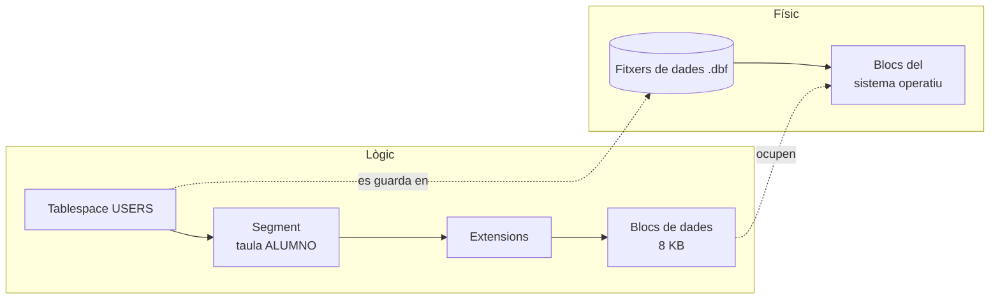
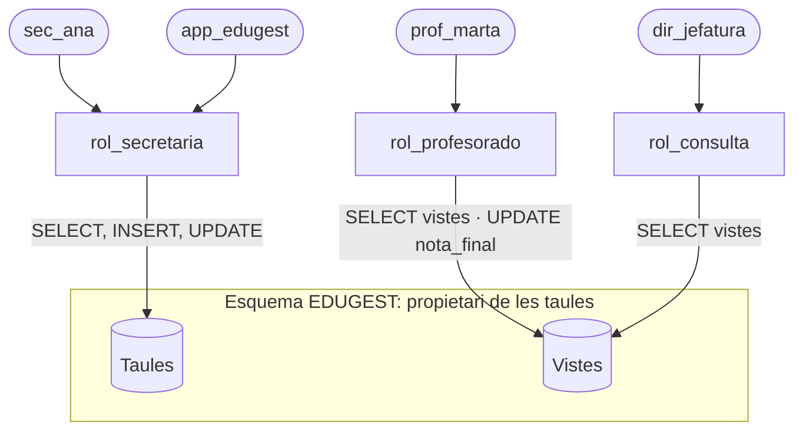

# UD05 · Definició i control de dades (DDL i DCL)

## Resum del tema

Fins ara hem **dissenyat**. En esta unitat **implementem**: convertim l'esquema relacional en taules reals dins d'un SGBD. Per a això usem dos subllenguatges de SQL:

- **DDL** (*Data Definition Language*): crea, modifica i elimina l'estructura (taules, restriccions, índexs, vistes, seqüències).
- **DCL** (*Data Control Language*): controla qui pot fer què (usuaris, rols i privilegis).

Tots els exemples usen **Oracle AI Database 26ai Free**. Quan una característica siga pròpia d'Oracle o d'una versió concreta, s'indica.



### Temporalització

La unitat ocupa **17 hores d'aula** (9 de teoria i 8 de pràctica).


items:
  - {h: 1, tipo: T, t: "SQL i Oracle. Emmagatzematge de la informació", ref: "§1 i §2"}
  - {h: 2, tipo: T, t: "Tipus de dades d'Oracle", ref: "§3 · calculadora de NUMBER(p, s)"}
  - {h: 2, tipo: T, t: "CREATE TABLE i restriccions d'integritat", ref: "§4 i §5 · constructor de CREATE TABLE"}
  - {h: 2, tipo: P, t: "Primeres taules i restriccions en Oracle", ref: "Pràctica 5.1"}
  - {h: 2, tipo: P, t: "Del diagrama de Chen al DDL", ref: "Pràctica 5.2"}
  - {h: 1, tipo: T, t: "Modificar i eliminar l'estructura (ALTER, DROP)", ref: "§6"}
  - {h: 1, tipo: P, t: "Evolució de l'esquema amb ALTER", ref: "Pràctica 5.5"}
  - {h: 1, tipo: T, t: "Seqüències, identitat, índexs i vistes", ref: "§7, §8 i §9"}
  - {h: 1, tipo: P, t: "Índexs, vistes i seqüències en EduGest", ref: "Pràctica 5.6"}
  - {h: 2, tipo: T, t: "Usuaris, rols i privilegis. Diccionari de dades i eines", ref: "§10 a §12 · taller de privilegis"}
  - {h: 1, tipo: P, t: "Usuaris, rols i privilegis en EduGest", ref: "Pràctica 5.7"}
  - {h: 1, tipo: P, t: "Implementació d'EduGest", ref: "Projecte EduGest-5"}
autonomo:
  - "Pràctica 5.3 (biblioteca: script complet i bateria de proves)"
  - "Pràctica 5.4 (sis casos per a implementar)"
  - "Pràctica 5.8 (depurar un script defectuós)"


> [!IMPORTANT]
> En esta unitat passes del paper al SGBD. **Executa cada sentència** mentres llegixes: un `CREATE TABLE` que no has provat és només una hipòtesi. Els ginys interactius simulen el comportament d'Oracle amb finalitats didàctiques, però **no substituïxen** un SGBD real.

### Objectius d'aprenentatge

En acabar esta unitat seràs capaç de:

- Explicar com emmagatzema Oracle la informació (blocs, segments, *tablespaces*).
- Triar el tipus de dades adequat per a cada columna.
- Crear taules amb totes les restriccions del disseny lògic: claus primàries, alienes i alternatives, `NOT NULL` i `CHECK`.
- Modificar i eliminar objectes de manera segura.
- Crear seqüències, columnes identitat, índexs i vistes.
- Crear usuaris i rols, i assignar privilegis aplicant el principi de mínim privilegi.
- Consultar el diccionari de dades per a comprovar allò que has creat.
- Usar assistents i eines gràfiques sense dependre'n.

---

SQL, Oracle i emmagatzematge

{}
Abans de ser una empresa de bases de dades, Larry Ellison, Bob Miner i Ed Oates van treballar en un projecte per a la CIA amb el nom en clau **Oracle**. Quan van fundar la seua pròpia companyia el 1977 (aleshores Software Development Laboratories) van reutilitzar el nom per al producte.
{}

## 1. SQL i Oracle

### 1.1 Subllenguatges de SQL

| Subllenguatge | Sentències | Per a què | Unitat |
|---|---|---|---|
| **DDL** | `CREATE`, `ALTER`, `DROP`, `TRUNCATE`, `RENAME`, `COMMENT` | Definir l'estructura | UD05 |
| **DCL** | `GRANT`, `REVOKE` | Controlar l'accés | UD05 |
| **DML** | `SELECT`, `INSERT`, `UPDATE`, `DELETE`, `MERGE` | Consultar i modificar dades | UD06 a UD08 |
| **TCL** | `COMMIT`, `ROLLBACK`, `SAVEPOINT` | Controlar transaccions | UD08 |

> [!WARNING]
> En Oracle, **cada sentència DDL executa un `COMMIT` implícit** abans i després d'executar-se. Si tenies canvis de dades pendents i llances un `CREATE TABLE`, eixos canvis queden confirmats i ja no podràs desfer-los amb `ROLLBACK`.

### 1.2 SQL estàndard enfront de dialectes

SQL és un estàndard ISO/IEC 9075, però cada SGBD n'implementa una part i afig **extensions**. Per això un script de MySQL no sol funcionar en Oracle sense canvis:


{}
```sql
CREATE TABLE producto (
    id_producto  NUMBER(6) GENERATED ALWAYS AS IDENTITY PRIMARY KEY,
    nombre       VARCHAR2(100) NOT NULL,
    precio       NUMBER(8,2) CHECK (precio >= 0),
    activo       BOOLEAN DEFAULT TRUE      -- BOOLEAN des de 23ai
);
```
{}
{}
```sql
CREATE TABLE producto (
    id_producto  INT AUTO_INCREMENT PRIMARY KEY,
    nombre       VARCHAR(100) NOT NULL,
    precio       DECIMAL(8,2) CHECK (precio >= 0),
    activo       BOOLEAN DEFAULT TRUE
) ENGINE = InnoDB;
```
{}
{}
```sql
CREATE TABLE producto (
    id_producto  INTEGER GENERATED ALWAYS AS IDENTITY PRIMARY KEY,
    nombre       VARCHAR(100) NOT NULL,
    precio       NUMERIC(8,2) CHECK (precio >= 0),
    activo       BOOLEAN DEFAULT TRUE
);
```
{}


### 1.3 Regles d'escriptura en Oracle

- Les paraules reservades i els identificadors **no distingeixen majúscules**: `CREATE TABLE Alumno` crea la taula `ALUMNO`. Oracle guarda els noms en majúscules en el diccionari.
- Si escrius un identificador entre **cometes dobles** (`"Alumno"`), Oracle respecta majúscules i espais, i hauràs d'usar sempre les cometes. **Evita-ho.**
- Els identificadors poden tindre fins a **128 bytes** (des d'Oracle 12.2), comencen per lletra i poden contindre lletres, números, `_`, `$` i `#`.
- Cada sentència acaba en `;`. Els blocs PL/SQL (UD09) acaben a més amb `/` en una línia.
- Comentaris: `-- hasta el final de la línea` i `/* de varias líneas */`.
- Les cadenes van entre **cometes simples**: `'DAM'`. Per a incloure una cometa, es duplica: `'Sant Joan d''Alacant'`.

### 1.4 Usuari i esquema

En Oracle, un **esquema** és el conjunt d'objectes (taules, vistes, índexs...) que pertanyen a un usuari, i té el seu mateix nom. En connectar-te com a `EDUGEST` i crear la taula `ALUMNO`, el seu nom complet és `EDUGEST.ALUMNO`. Un altre usuari amb permís la consultaria així:

```sql
SELECT * FROM edugest.alumno;
```

---

## 2. Format d'emmagatzematge de la informació

El criteri RA2.a demana analitzar **com** es guarda la informació. Oracle organitza l'emmagatzematge en dos nivells:



| Estructura | Què és |
|---|---|
| **Bloc de dades** | La unitat mínima de lectura i escriptura (normalment 8 KB). Conté diverses files |
| **Extensió** (*extent*) | Conjunt de blocs contigus que s'assigna d'una vegada |
| **Segment** | Tot l'espai d'un objecte: una taula, un índex... |
| **Tablespace** | Contenidor lògic de segments. `USERS` és el de les dades d'usuari; `SYSTEM` i `SYSAUX`, els del diccionari |
| **Fitxer de dades** | Fitxer físic del sistema operatiu on es guarda un tablespace |

Cada fila té una adreça física única, el **ROWID**, que indica el fitxer, el bloc i la posició dins del bloc. És la forma més ràpida de localitzar una fila i la que usen internament els índexs.

```sql
SELECT ROWID, nombre FROM alumno FETCH FIRST 3 ROWS ONLY;
```

> [!NOTE]
> Una taula normal d'Oracle és una taula **munt** (*heap*): les files es guarden on hi ha espai lliure, **sense cap ordre**. Per això una consulta sense `ORDER BY` pot tornar les files en qualsevol ordre, i eixe ordre pot canviar.

---

Tipus de dades d'Oracle

{}
A diferència de l'estàndard SQL, Oracle tracta `''` (cadena de longitud zero) com a `NULL`. Per això `WHERE nombre = ''` mai no torna files i cal escriure `WHERE nombre IS NULL`.
{}

## 3. Tipus de dades

Triar bé el tipus de cada columna (RA2.c) evita errors, estalvia espai i permet que el SGBD valide les dades.

### 3.1 Tipus principals d'Oracle

| Categoria | Tipus | Descripció | Exemple d'ús |
|---|---|---|---|
| Text | `VARCHAR2(n)` | Text de longitud **variable**, fins a n bytes (màx. 4000; 32767 amb `MAX_STRING_SIZE=EXTENDED`) | nom, email |
| | `CHAR(n)` | Text de longitud **fixa**: s'omple amb espais | dni, codis de longitud fixa |
| | `NVARCHAR2(n)` | Text Unicode en el joc de caràcters nacional | Rarament necessari amb AL32UTF8 |
| | `CLOB` | Text molt llarg (gigabytes) | observacions, documents |
| Numèric | `NUMBER(p, s)` | Nombre exacte amb `p` dígits en total i `s` decimals | imports, notes, quantitats |
| | `NUMBER` | Sense precisió: qualsevol nombre | evitar-lo en columnes de negoci |
| | `INTEGER` | Sinònim de `NUMBER(38)` | comptadors |
| | `BINARY_DOUBLE` | Coma flotant IEEE 754 | càlculs científics |
| Data i hora | `DATE` | Data **i hora** (fins a segons) | data de naixement, de matrícula |
| | `TIMESTAMP(n)` | Data i hora amb fraccions de segon | registres d'auditoria |
| | `TIMESTAMP WITH TIME ZONE` | Inclou la zona horària | aplicacions internacionals |
| | `INTERVAL DAY TO SECOND` | Durada | temps d'una tasca |
| Lògic | `BOOLEAN` | `TRUE`, `FALSE` o `NULL` (**des de 23ai**) | actiu, justificada |
| Binari | `BLOB`, `RAW(n)` | Dades binàries | fotografies, *hashes* |
| Altres | `JSON` | Document JSON natiu (des de 21c) | dades semiestructurades |
| | `VECTOR` | Vectors per a cerca per similitud (des de 23ai) | aplicacions d'IA |

### 3.2 Precisió i escala de NUMBER

`NUMBER(p, s)`: `p` és el nombre **total** de dígits significatius i `s` quants d'ells van després de la coma.

| Declaració | Rang admés | Valor inserit | Valor guardat |
|---|---|---|---|
| `NUMBER(4,2)` | -99,99 a 99,99 | 7.256 | 7,26 (arredoneix) |
| `NUMBER(4,2)` | | 123.5 | **Error** ORA-01438 |
| `NUMBER(5)` | -99999 a 99999 | 12.7 | 13 |
| `NUMBER(8,2)` | fins a 999 999,99 | 1520.5 | 1520,50 |

### 3.3 Criteris per a triar el tipus

1. **S'hi opera?** Si se suma o es compara numèricament, és `NUMBER`. Si no (DNI, telèfon, codi postal), és **text**: `'03690'` perdria el zero inicial com a número.
2. **Té longitud fixa?** `CHAR` només si **sempre** ocupa el mateix (DNI: `CHAR(9)`). En la resta, `VARCHAR2`.
3. **Necessita decimals exactes?** Els diners es guarden sempre en `NUMBER(p, s)`, mai en coma flotant.
4. **És una data?** Usa `DATE` o `TIMESTAMP`, mai text: així pots ordenar, comparar i calcular.
5. **Dimensiona amb marge raonable**, sense exagerar: `VARCHAR2(4000)` per a un nom dificulta la validació i la lectura del disseny.

### 3.4 Equivalències amb altres SGBD

| Concepte | Oracle | MySQL / MariaDB | PostgreSQL | SQL Server |
|---|---|---|---|---|
| Text variable | `VARCHAR2(n)` | `VARCHAR(n)` | `VARCHAR(n)` | `VARCHAR(n)` |
| Enter | `NUMBER(10)` | `INT` | `INTEGER` | `INT` |
| Decimal exacte | `NUMBER(p,s)` | `DECIMAL(p,s)` | `NUMERIC(p,s)` | `DECIMAL(p,s)` |
| Data sense hora | `DATE` (inclou hora) | `DATE` | `DATE` | `DATE` |
| Autoincrement | `IDENTITY` o seqüència | `AUTO_INCREMENT` | `IDENTITY` o `SERIAL` | `IDENTITY` |
| Lògic | `BOOLEAN` (23ai) | `BOOLEAN` (= `TINYINT(1)`) | `BOOLEAN` | `BIT` |

> [!CAUTION]
> **En Oracle la cadena buida `''` és `NULL`.** `INSERT INTO alumno (..., email) VALUES (..., '')` guarda un `NULL`, i la condició `email = ''` mai no és vertadera. En MySQL i PostgreSQL la cadena buida i `NULL` són coses distintes. És una de les diferències que més errors provoca en migrar.

> [!WARNING]
> El tipus `DATE` d'Oracle **sempre guarda l'hora**. `SYSDATE` torna data i hora actuals. Si compares `fecha_matricula = DATE '2025-09-15'` i la fila es va inserir amb `SYSDATE`, no coincidirà perquè l'hora no és 00:00:00. Ho tractarem a la UD06.

#### Calculadora de `NUMBER(p, s)`

Prova quins valors admet una columna i com els arredoneix Oracle. Observa què passa quan l'escala és negativa o quan el valor excedeix la precisió.




- q: "Què passa en inserir `123.456` en una columna `NUMBER(5,2)`?"
  options: ["Es guarda 123.456", "Es guarda 123.46 (s'arredoneix a l'escala)", "Error ORA-01438 (valor major que la precisió)", "Es guarda 123"]
  answer: 1
  explain: "`NUMBER(5,2)` permet 3 dígits enters i 2 decimals. Oracle **arredoneix** els decimals sobrants. L'error ORA-01438 apareixeria amb `1234.5`, que necessita 4 dígits enters."
- q: "Per a guardar un import en euros amb cèntims, quin tipus és més adequat?"
  options: ["`FLOAT`, per la rapidesa", "`NUMBER(10,2)`", "`VARCHAR2(10)`", "`NUMBER` sense precisió ni escala"]
  answer: 1
  explain: "Els imports exigixen aritmètica decimal exacta: `NUMBER(p,2)`. Els tipus en coma flotant acumulen errors de representació i el text impedix calcular."


---

CREATE TABLE i restriccions

## 4. Creació de taules: `CREATE TABLE`

### 4.1 Finalitat i sintaxi

`CREATE TABLE` crea una taula buida amb les seues columnes i restriccions.

```text
CREATE TABLE [esquema.]nom_taula (
    columna tipus [DEFAULT valor] [restriccions_de_columna],
    columna tipus ...,
    [restriccions_de_taula]
);
```

### 4.2 Exemple senzill, element a element



```sql
CREATE TABLE ciclo (
    cod_ciclo      VARCHAR2(5)    CONSTRAINT pk_ciclo PRIMARY KEY,
    nombre         VARCHAR2(100)  NOT NULL,
    grado          VARCHAR2(8)    DEFAULT 'SUPERIOR' NOT NULL,
    horas_totales  NUMBER(4)
);
```

| Element | Significat |
|---|---|
| `CREATE TABLE ciclo` | Crea una taula anomenada `CICLO` en l'esquema de l'usuari connectat |
| `cod_ciclo VARCHAR2(5)` | Columna de text variable de fins a 5 bytes |
| `CONSTRAINT pk_ciclo PRIMARY KEY` | Restricció **amb nom** `PK_CICLO`: `cod_ciclo` és la clau primària (única i no nul·la) |
| `NOT NULL` | La columna és obligatòria |
| `DEFAULT 'SUPERIOR'` | Valor que s'usa si en l'`INSERT` no s'indica esta columna |
| `NUMBER(4)` | Nombre enter de fins a 4 dígits. Sense `NOT NULL`, admet nuls |

Comprova el resultat amb l'ordre `DESC` del client:

```text
SQL> DESC ciclo
 Name           Null?    Type
 -------------- -------- -------------
 COD_CICLO      NOT NULL VARCHAR2(5)
 NOMBRE         NOT NULL VARCHAR2(100)
 GRADO          NOT NULL VARCHAR2(8)
 HORAS_TOTALES           NUMBER(4)
```

### 4.3 Restriccions de columna i de taula

Una restricció pot escriure's **junt a la columna** o **al final**, com un element més de la taula. Les restriccions que afecten **diverses columnes** (una clau primària composta, un `UNIQUE` de dues columnes o un `CHECK` que compara dues columnes) només poden escriure's **al final**.

```sql
CREATE TABLE imparte (
    id_modulo        NUMBER(5),
    cod_grupo        VARCHAR2(10),
    curso_academico  CHAR(7),
    id_profesor      NUMBER(5)  NOT NULL,
    horas_semanales  NUMBER(2)  NOT NULL,
    -- restriccions de taula
    CONSTRAINT pk_imparte PRIMARY KEY (id_modulo, cod_grupo, curso_academico),
    CONSTRAINT ck_imparte_horas CHECK (horas_semanales BETWEEN 1 AND 12)
);
```

### 4.4 Valors per defecte i columnes especials

| Clàusula | Efecte | Exemple |
|---|---|---|
| `DEFAULT expr` | S'usa si la columna **no apareix** en l'`INSERT` | `fecha_alta DATE DEFAULT SYSDATE` |
| `DEFAULT ON NULL expr` | S'usa també si s'inserix **explícitament** `NULL` | `convocatoria NUMBER(1) DEFAULT ON NULL 1` |
| `GENERATED ALWAYS AS IDENTITY` | Oracle genera el valor; no se'n pot inserir un de propi | `id NUMBER GENERATED ALWAYS AS IDENTITY` |
| `GENERATED BY DEFAULT ON NULL AS IDENTITY` | Oracle genera el valor si no s'indica o si és `NULL` | Usat en `ALUMNO` d'EduGest |
| `GENERATED ALWAYS AS (expr) VIRTUAL` | Columna **virtual**: es calcula, no s'emmagatzema | `total NUMBER GENERATED ALWAYS AS (cantidad * precio) VIRTUAL` |

---

## 5. Restriccions d'integritat

Les restriccions implanten en la base de dades les regles del disseny lògic (RA2.d, RA2.e, RA6.f). El SGBD **rebutja** qualsevol operació que les incomplisca, vinga de l'aplicació que vinga.

### 5.1 Resum de restriccions

| Restricció | Garantix | Prefix del nom | Error si s'incompleix |
|---|---|---|---|
| `NOT NULL` | La columna té valor | `nn_` | ORA-01400 *cannot insert NULL* |
| `PRIMARY KEY` | Identificació única i no nul·la de cada fila | `pk_` | ORA-00001 *unique constraint violated* |
| `UNIQUE` | No hi ha valors repetits (admet diversos `NULL`) | `uq_` | ORA-00001 |
| `FOREIGN KEY` | El valor existix en la taula referenciada | `fk_` | ORA-02291 *parent key not found* / ORA-02292 *child record found* |
| `CHECK` | Es complix una condició sobre la fila | `ck_` | ORA-02290 *check constraint violated* |

> [!TIP]
> **Posa sempre nom a les restriccions.** Si no ho fas, Oracle s'inventa un com `SYS_C008123`. Quan un usuari reba l'error `ORA-02290: check constraint (EDUGEST.CK_MATRICULA_NOTA) violated`, sabrà exactament quina regla ha incomplit.

### 5.2 Clau primària i claus alternatives

```sql
CREATE TABLE profesor (
    id_profesor  NUMBER(5)     CONSTRAINT pk_profesor PRIMARY KEY,
    dni          CHAR(9)       CONSTRAINT nn_profesor_dni NOT NULL,
    email        VARCHAR2(100) NOT NULL,
    ...
    CONSTRAINT uq_profesor_dni   UNIQUE (dni),
    CONSTRAINT uq_profesor_email UNIQUE (email)
);
```

Una clau **candidata** no triada com a primària s'implanta com a `UNIQUE` + `NOT NULL`. Oracle crea automàticament un **índex** per a cada `PRIMARY KEY` i cada `UNIQUE`.

### 5.3 Claus alienes

```sql
CONSTRAINT fk_matricula_alumno FOREIGN KEY (id_alumno)
    REFERENCES alumno (id_alumno)
    ON DELETE CASCADE
```

| Component | Significat |
|---|---|
| `FOREIGN KEY (id_alumno)` | Columna (o columnes) d'**esta** taula |
| `REFERENCES alumno (id_alumno)` | Taula i columna referenciades: han de ser la seua `PRIMARY KEY` o un `UNIQUE` |
| `ON DELETE CASCADE` | En esborrar l'alumne, s'esborren les seues matrícules |
| `ON DELETE SET NULL` | En esborrar la fila pare, la columna es posa a `NULL` |
| *(res)* | Es **rebutja** l'esborrat del pare si té fills |

> [!IMPORTANT]
> - La taula referenciada ha d'**existir abans**. Crea primer les taules «pare» o afig la clau aliena després amb `ALTER TABLE` (és el que fa EduGest amb el cap de departament, perquè `DEPARTAMENTO` i `PROFESOR` es referencien mútuament).
> - Una clau aliena **admet `NULL`** llevat que afigques `NOT NULL`. Una fila amb la clau aliena a `NULL` no es comprova.
> - Oracle **no** crea índexs sobre les claus alienes. Crea'ls tu (apartat 8).

### 5.4 Restriccions CHECK

Un `CHECK` és una condició que ha de ser **vertadera o desconeguda** (`NULL`) per a cada fila:

```sql
CONSTRAINT ck_matricula_nota  CHECK (nota_final BETWEEN 0 AND 10),
CONSTRAINT ck_grupo_turno     CHECK (turno IN ('M', 'T')),
CONSTRAINT ck_falta_horas     CHECK (horas BETWEEN 1 AND 6),
CONSTRAINT ck_matricula_curso CHECK (REGEXP_LIKE(curso_academico, '^[0-9]{4}-[0-9]{2}$')),
CONSTRAINT ck_reserva_fechas  CHECK (fecha_salida > fecha_entrada)
```

> [!WARNING]
> Si `nota_final` és `NULL`, la condició `nota_final BETWEEN 0 AND 10` és **desconeguda** i el `CHECK` **l'accepta**. Si la columna ha de tindre valor, afig `NOT NULL`.
>
> Un `CHECK` **no** pot usar subconsultes, ni consultar altres taules, ni cridar `SYSDATE`. Les regles que ho necessiten són restriccions no representables (UD03, apartat 6) i s'implementen amb triggers (UD09).

### 5.5 Consultar les restriccions en el diccionari

```sql
SELECT constraint_name, constraint_type, search_condition, r_constraint_name, delete_rule
FROM   user_constraints
WHERE  table_name = 'MATRICULA'
ORDER  BY constraint_type;

SELECT constraint_name, column_name, position
FROM   user_cons_columns
WHERE  table_name = 'MATRICULA'
ORDER  BY constraint_name, position;
```

`constraint_type`: **P** = clau primària, **U** = única, **R** = referencial (clau aliena), **C** = `CHECK` (també `NOT NULL`).

#### Constructor de `CREATE TABLE`

Defineix columnes, tipus i restriccions i observa l'script que genera. Les restriccions porten **sempre nom** (`pk_`, `fk_`, `uq_`, `ck_`, `nn_`), la qual cosa facilita interpretar els errors d'Oracle.



> [!TIP]
> Canvia a l'exemple **MATRICULA** i localitza la clau primària composta i les dues claus alienes. Després elimina una d'elles i raona quina integritat perds.


- q: "Què fa Oracle amb una cadena buida `''` en una columna `VARCHAR2` amb `NOT NULL`?"
  options: ["L'accepta com a cadena buida", "La tracta com a `NULL` i rebutja la fila (ORA-01400)", "La convertix en un espai", "Depén del `NLS_LANG`"]
  answer: 1
  explain: "En Oracle la cadena buida **és** `NULL`. És una diferència amb l'estàndard SQL i amb altres SGBD, i una font clàssica d'errors."
- q: "Quantes claus primàries pot tindre una taula i quantes `UNIQUE`?"
  options: ["Una primària i una `UNIQUE`", "Una primària (pot ser composta) i tantes `UNIQUE` com es necessiten", "Diverses primàries i una `UNIQUE`", "Il·limitades d'ambdues"]
  answer: 1
  explain: "La clau primària és única per taula, encara que pot constar de diverses columnes. Les claus alternatives es defineixen amb `UNIQUE` i poden ser diverses."


---

Modificar i eliminar l'estructura

{}
En Oracle, cada sentència DDL (`CREATE`, `ALTER`, `DROP`) fa un `COMMIT` implícit abans i després. No es pot desfer amb `ROLLBACK`: per això es prova primer en un esquema de proves.
{}

## 6. Modificar i eliminar l'estructura

### 6.1 `ALTER TABLE`



```sql
-- Afegir columnes (en Oracle no s'escriu la paraula COLUMN)
ALTER TABLE alumno ADD (fecha_alta DATE DEFAULT SYSDATE);

-- Canviar el tipus, la grandària o l'obligatorietat
ALTER TABLE alumno MODIFY (telefono VARCHAR2(20));
ALTER TABLE alumno MODIFY (localidad NOT NULL);   -- falla si hi ha files amb NULL

-- Renomenar i eliminar columnes
ALTER TABLE alumno RENAME COLUMN telefono TO telefono_movil;
ALTER TABLE alumno DROP COLUMN fecha_alta;

-- Afegir i eliminar restriccions
ALTER TABLE alumno ADD CONSTRAINT ck_alumno_email CHECK (email LIKE '%@%');
ALTER TABLE alumno DROP CONSTRAINT ck_alumno_email;

-- Desactivar temporalment una restricció (per exemple, en una càrrega massiva)
ALTER TABLE matricula DISABLE CONSTRAINT fk_matricula_modulo;
ALTER TABLE matricula ENABLE CONSTRAINT fk_matricula_modulo;

-- Renomenar una taula
RENAME alumno_tmp TO alumno_historico;
```

> [!TIP]
> Quan **actives** una restricció, Oracle comprova totes les files existents. Si alguna l'incompleix, l'`ENABLE` falla. Amb `ENABLE NOVALIDATE` només es comproven les files noves, però aleshores la taula pot contindre dades incorrectes.

### 6.2 `DROP TABLE`, paperera i `TRUNCATE`

```sql
DROP TABLE matricula;                       -- va a la paperera de reciclatge
FLASHBACK TABLE matricula TO BEFORE DROP;   -- la recupera

DROP TABLE matricula PURGE;                 -- esborrat definitiu
DROP TABLE alumno CASCADE CONSTRAINTS;      -- esborra també les FK que apunten a ALUMNO
DROP TABLE IF EXISTS alumno_tmp;            -- sense error si no existeix (23ai i posteriors)

TRUNCATE TABLE falta_asistencia;            -- buida la taula; no es pot desfer
```

| Sentència | Esborra | Estructura | Es pot desfer? |
|---|---|---|---|
| `DELETE FROM t` (DML, UD08) | Files (totes o algunes) | Es manté | Sí, amb `ROLLBACK` |
| `TRUNCATE TABLE t` | Totes les files | Es manté | **No** (és DDL) |
| `DROP TABLE t` | Taula i dades | Desapareix | Només des de la paperera |
| `DROP TABLE t PURGE` | Taula i dades | Desapareix | **No** |

> [!CAUTION]
> `TRUNCATE` i `DROP ... PURGE` no es poden desfer. En un servidor de producció, abans d'executar-los: comprova **a quina base de dades** estàs connectat, fes una **còpia de seguretat** i, si és possible, que una altra persona revise l'ordre.

### 6.3 Documentar el disseny amb comentaris

```sql
COMMENT ON TABLE  matricula IS 'Matrícula de un alumno en un módulo para un curso académico';
COMMENT ON COLUMN matricula.nota_final IS 'NULL = sin calificar';

SELECT column_name, comments FROM user_col_comments WHERE table_name = 'MATRICULA';
```

---

Seqüències, identitat, índexs i vistes

## 7. Seqüències i columnes identitat

Per a generar identificadors artificials (claus subrogades) hi ha dos mecanismes:


{}
```sql
CREATE TABLE incidencia (
    id_incidencia NUMBER(8) GENERATED ALWAYS AS IDENTITY (START WITH 1 INCREMENT BY 1)
                  CONSTRAINT pk_incidencia PRIMARY KEY,
    descripcion   VARCHAR2(200) NOT NULL
);

INSERT INTO incidencia (descripcion) VALUES ('Proyector del aula 12 averiado');
```
Oracle crea internament una seqüència associada a la columna. És l'opció més senzilla des d'Oracle 12c.
{}
{}
```sql
CREATE SEQUENCE seq_incidencia START WITH 1 INCREMENT BY 1 NOCACHE;

CREATE TABLE incidencia (
    id_incidencia NUMBER(8) DEFAULT seq_incidencia.NEXTVAL
                  CONSTRAINT pk_incidencia PRIMARY KEY,
    descripcion   VARCHAR2(200) NOT NULL
);

SELECT seq_incidencia.NEXTVAL FROM dual;   -- següent valor
SELECT seq_incidencia.CURRVAL FROM dual;   -- últim valor obtingut en esta sessió
```
Una seqüència és un objecte independent: pot compartir-se entre diverses taules.
{}


> [!NOTE]
> Les seqüències **no garantixen valors consecutius**: un `ROLLBACK`, la caché o un reinici poden deixar buits. Un identificador artificial només ha de ser **únic**, no correlatiu. Si el negoci exigix números de factura sense buits, cal implementar-ho d'una altra manera.

---

## 8. Índexs

Un **índex** és una estructura addicional, normalment un **arbre B+**, que permet localitzar files sense recórrer tota la taula, igual que l'índex alfabètic d'un llibre.

```sql
-- Índex simple sobre una clau aliena
CREATE INDEX ix_alumno_grupo ON alumno (cod_grupo);

-- Índex compost: útil per a cerques per cognoms i nom
CREATE INDEX ix_alumno_apellidos_nombre ON alumno (apellidos, nombre);

-- Índex únic (equival a la restricció UNIQUE, però és preferible la restricció)
CREATE UNIQUE INDEX ux_modulo_codigo_ciclo ON modulo (codigo, cod_ciclo);

-- Índex basat en funció: cerques sense distingir majúscules
CREATE INDEX ix_alumno_email_upper ON alumno (UPPER(email));

DROP INDEX ix_alumno_apellidos_nombre;
```

| Convé indexar | No convé indexar |
|---|---|
| Claus alienes (s'usen en els `JOIN` i en esborrar en la taula pare) | Taules molt xicotetes |
| Columnes molt usades en `WHERE` amb valors molt selectius | Columnes amb pocs valors distints (`turno`: M/T) |
| Columnes usades per a ordenar resultats grans | Columnes que es modifiquen constantment |

> [!IMPORTANT]
> Un índex **accelera les lectures** però **alenteix les escriptures**: cada `INSERT`, `UPDATE` o `DELETE` ha d'actualitzar també tots els índexs de la taula, i a més ocupa espai. Indexar és una decisió de **disseny físic**: la UD07 ensenya a comprovar amb el pla d'execució si un índex s'usa.

---

### Laboratori: quant ajuda un índex?

Mou el lliscador per a veure quants blocs llig una cerca amb índex i sense.



## 9. Vistes

Una **vista** és una consulta guardada amb nom que s'usa com si fora una taula. No emmagatzema dades: cada vegada que es consulta, executa el seu `SELECT` (RA2.f).

### 9.1 Per a què servixen

- **Seguretat:** mostrar només algunes columnes o files a certs usuaris.
- **Simplicitat:** ocultar consultes complexes (diverses taules, càlculs).
- **Independència lògica:** si canvia l'estructura de les taules, s'adapta la vista i les aplicacions continuen funcionant.

### 9.2 Creació

```sql
-- El professorat necessita el llistat d'alumnes, però no el seu DNI ni el seu telèfon
CREATE OR REPLACE VIEW v_alumno_listado AS
    SELECT id_alumno, nia, nombre, apellidos, email, cod_grupo
    FROM   alumno;

-- Vista de només lectura per a tutoria: alumnat d'un grup concret
CREATE OR REPLACE VIEW v_alumno_1dam AS
    SELECT id_alumno, nombre, apellidos, email
    FROM   alumno
    WHERE  cod_grupo = '1DAM'
    WITH READ ONLY;

-- Vista actualitzable que impedix «traure» files del seu àmbit
CREATE OR REPLACE VIEW v_matricula_abierta AS
    SELECT id_matricula, id_alumno, id_modulo, curso_academico, nota_final
    FROM   matricula
    WHERE  curso_academico = '2026-27'
    WITH CHECK OPTION CONSTRAINT ck_v_matricula_abierta;

SELECT * FROM v_alumno_listado WHERE cod_grupo = '2DAW';
DROP VIEW v_alumno_1dam;
```

| Clàusula | Efecte |
|---|---|
| `OR REPLACE` | Si la vista existix, la substituïx sense perdre els privilegis concedits |
| `WITH READ ONLY` | No permet `INSERT`, `UPDATE` ni `DELETE` a través de la vista |
| `WITH CHECK OPTION` | Només permet inserir o modificar files que **continuen complint** el `WHERE` de la vista |

> [!NOTE]
> Una vista sobre **una sola taula**, sense agrupacions, `DISTINCT` ni columnes calculades, sol ser **actualitzable**: un `UPDATE` sobre la vista modifica la taula base. Les vistes amb `JOIN` només ho són parcialment. Una **vista materialitzada** (`CREATE MATERIALIZED VIEW`) sí que emmagatzema el resultat i es refresca periòdicament: és una eina de rendiment per a informes.

---

Usuaris, rols i privilegis

## 10. Control de dades: usuaris, privilegis i rols

### 10.1 El principi de mínim privilegi

Cada usuari ha de tindre **només** els permisos imprescindibles per al seu treball i **només** durant el temps que els necessita. Si una aplicació es connecta com a administrador i patix una injecció SQL, l'atacant obté control total de la base de dades.



### 10.2 Usuaris

 (connectat com a `SYSTEM` a `FREEPDB1`)

```sql
CREATE USER prof_marta IDENTIFIED BY "Cambiar_2026"
    DEFAULT TABLESPACE users
    QUOTA 0 ON users          -- no podrà crear objectes que ocupen espai
    PASSWORD EXPIRE;          -- haurà de canviar la contrasenya en entrar

ALTER USER prof_marta IDENTIFIED BY "Nueva_Clave_2026";
ALTER USER prof_marta ACCOUNT LOCK;     -- bloquejar (baixa temporal)
ALTER USER prof_marta ACCOUNT UNLOCK;
DROP USER prof_marta CASCADE;           -- CASCADE esborra també els seus objectes
```

### 10.3 Privilegis de sistema i d'objecte

| Tipus | Què permet | Exemples |
|---|---|---|
| **De sistema** | Realitzar una acció en la base de dades | `CREATE SESSION`, `CREATE TABLE`, `CREATE VIEW`, `CREATE ANY TABLE`, `SELECT ANY TABLE` |
| **D'objecte** | Realitzar una acció sobre un objecte concret | `SELECT`, `INSERT`, `UPDATE`, `DELETE` sobre una taula o vista; `EXECUTE` sobre un procediment; `REFERENCES` |

```sql
-- Privilegi de sistema: poder connectar-se
GRANT CREATE SESSION TO prof_marta;

-- Privilegis d'objecte (els concedeix el propietari, EDUGEST, o un administrador)
GRANT SELECT ON edugest.v_alumno_listado TO prof_marta;
GRANT SELECT, UPDATE (nota_final) ON edugest.matricula TO prof_marta;   -- només eixa columna

-- Retirar privilegis
REVOKE UPDATE ON edugest.matricula FROM prof_marta;
```

| Opció | Significat | Risc |
|---|---|---|
| `WITH ADMIN OPTION` (privilegis de sistema i rols) | El receptor pot concedir el privilegi a altres | En revocar-lo, **no** es revoca en cascada a qui el va rebre |
| `WITH GRANT OPTION` (privilegis d'objecte) | El receptor pot concedir el privilegi sobre l'objecte | En revocar-lo, **sí** es revoca en cascada |

> [!WARNING]
> Evita els privilegis `ANY` (`SELECT ANY TABLE`, `DROP ANY TABLE`...): s'apliquen a **tots els esquemes** de la base de dades, inclosos els d'altres aplicacions.
>
> Des d'**Oracle 23ai** existixen els **privilegis d'esquema**, que limiten l'`ANY` a un esquema concret: `GRANT SELECT ANY TABLE ON SCHEMA edugest TO dir_jefatura;`. Inclouen també les taules que es creen en el futur en eixe esquema.

### 10.4 Rols

Un **rol** és un conjunt de privilegis amb nom. S'assignen privilegis al rol i el rol als usuaris: així, quan arriba una professora nova basta amb una ordre.

```sql
CREATE ROLE rol_profesorado;
GRANT CREATE SESSION TO rol_profesorado;
GRANT SELECT ON edugest.v_alumno_listado TO rol_profesorado;
GRANT SELECT, UPDATE (nota_final) ON edugest.matricula TO rol_profesorado;
GRANT SELECT, INSERT, UPDATE ON edugest.falta_asistencia TO rol_profesorado;

GRANT rol_profesorado TO prof_marta;
REVOKE rol_profesorado FROM prof_marta;
DROP ROLE rol_profesorado;
```

| Rol predefinit | Contingut | Ús |
|---|---|---|
| `CONNECT` | `CREATE SESSION` | Usuaris que només es connecten |
| `RESOURCE` | Crear taules, seqüències, procediments, triggers, tipus | Heretat de versions antigues |
| `DB_DEVELOPER_ROLE` (23ai) | Els privilegis habituals d'un desenvolupador | Comptes de desenvolupament, com `EDUGEST` |
| `DBA` | Tots els privilegis d'administració | Només administradors. Mai per a aplicacions |

### 10.5 Polítiques de contrasenyes: perfils

```sql
CREATE PROFILE perfil_personal LIMIT
    FAILED_LOGIN_ATTEMPTS 5       -- bloqueig després de 5 intents fallits
    PASSWORD_LOCK_TIME    1/24    -- durant 1 hora
    PASSWORD_LIFE_TIME    180     -- caducitat en dies
    PASSWORD_REUSE_MAX    5;      -- no repetir les 5 últimes

ALTER USER prof_marta PROFILE perfil_personal;
```

### 10.6 Consultar usuaris i privilegis

| Vista | Informació |
|---|---|
| `USER_SYS_PRIVS`, `USER_ROLE_PRIVS` | Privilegis de sistema i rols de l'usuari connectat |
| `USER_TAB_PRIVS` | Privilegis d'objecte concedits o rebuts per l'usuari |
| `ROLE_TAB_PRIVS`, `ROLE_SYS_PRIVS` | Privilegis continguts en els rols |
| `SESSION_PRIVS`, `SESSION_ROLES` | Privilegis actius en la sessió actual |
| `DBA_USERS`, `DBA_ROLE_PRIVS` | (Administració) tots els usuaris i els seus rols |

### 10.7 Altres mesures de protecció

- **Autenticació robusta:** contrasenyes llargues, perfils amb caducitat i bloqueig, i comptes personals (res d'usuaris compartits).
- **Protecció de credencials:** mai escriguis contrasenyes en el codi font ni les pugis a Git. Usa variables d'entorn o gestors de secrets.
- **Connexions segures:** xifra el trànsit amb TLS (en Oracle, *Native Network Encryption* o TCPS).
- **Exposició del servei:** el port 1521 **no** ha d'estar accessible des d'Internet; només des dels servidors d'aplicació.
- **Còpies de seguretat:** Oracle Data Pump (`expdp`/`impdp`) per a exportar esquemes i RMAN per a còpies físiques. Una còpia que no s'ha provat de restaurar no és una còpia.
- **Dades personals:** vistes i privilegis per columna per a complir la **minimització** del RGPD (UD01).

#### Taller de rols i privilegis

Dissenya un rol, assigna'l a un usuari i comprova quines sentències pot executar. Els errors (`ORA-01031`, `ORA-00942`, `ORA-01045`) són els que torna Oracle.



> [!WARNING]
> `SELECT ANY TABLE` i `GRANT ... WITH ADMIN OPTION` són privilegis molt amplis. Concedix-los només quan existisca una raó justificada i documentada: el **mínim privilegi** és una bona pràctica de seguretat i un requisit de protecció de dades.


- q: "Un usuari té `SELECT` sobre `ALUMNO` però rep ORA-01045 en connectar-se. Què falta?"
  options: ["El privilegi `SELECT ANY TABLE`", "El privilegi de sistema `CREATE SESSION`", "Un `COMMIT`", "Un sinònim públic"]
  answer: 1
  explain: "ORA-01045 indica que l'usuari no té `CREATE SESSION`: sense ell no pot connectar-se, tinga els privilegis d'objecte que tinga."
- q: "Quin avantatge principal té agrupar privilegis en un rol?"
  options: ["Les consultes s'executen més ràpid", "Es gestionen els permisos per funció, no usuari a usuari", "Evita la necessitat de contrasenyes", "Permet saltar-se el mínim privilegi"]
  answer: 1
  explain: "Amb rols es concedix o revoca un conjunt coherent de permisos alhora, reduint errors i facilitant l'auditoria."


---

## 11. Diccionari de dades

El diccionari és el catàleg del SGBD: descriu tots els objectes. És la forma de **comprovar** allò que s'ha creat.

| Prefix | Mostra | Exemple |
|---|---|---|
| `USER_` | Els objectes **del teu esquema** | `USER_TABLES` |
| `ALL_` | Els objectes als quals **tens accés** | `ALL_TABLES` |
| `DBA_` | **Tots** els objectes (requerix privilegis) | `DBA_TABLES` |

```sql
SELECT table_name FROM user_tables ORDER BY 1;
SELECT column_name, data_type, data_length, data_precision, data_scale, nullable
FROM   user_tab_columns WHERE table_name = 'ALUMNO' ORDER BY column_id;
SELECT index_name, index_type, uniqueness FROM user_indexes WHERE table_name = 'ALUMNO';
SELECT view_name, text FROM user_views;
SELECT object_name, object_type, status FROM user_objects ORDER BY object_type;
```

---

## 12. Assistents i eines gràfiques

El criteri RA2.h demana usar **assistents, eines gràfiques i els llenguatges DDL i DCL**.

| Tasca | En SQL Developer | Allò que has de revisar |
|---|---|---|
| Crear una taula | Clic dret en *Taules* → *Nova taula* (mode avançat per a restriccions) | Pestanya **DDL**: el codi que s'executarà |
| Veure l'estructura | Doble clic sobre la taula → pestanyes *Columnes*, *Restriccions*, *Índexs*, *DDL* | Noms de les restriccions |
| Crear un usuari | Finestra *DBA* → *Seguretat* → *Usuaris* → *Crear* | Privilegis mínims |
| Generar l'esquema complet | *Data Modeler* → model relacional → *Generar DDL* | Ordre de creació i noms |

> [!TIP]
> Usa l'assistent per a **aprendre** la sintaxi i per a tasques puntuals, però guarda sempre l'**script SQL** que genera. Un script es versiona en Git, es revisa, es pot repetir en un altre servidor i documenta exactament què es va fer. Un clic, no.

---

## 13. Errors freqüents

| Error | Missatge | Causa i solució |
|---|---|---|
| Crear una FK cap a una taula que no existix | ORA-00942 *table or view does not exist* | Crea abans la taula pare o afig la FK amb `ALTER TABLE` |
| Clau aliena cap a una columna sense PK/UNIQUE | ORA-02270 *no matching unique or primary key* | La columna referenciada ha de ser PK o UNIQUE |
| Tipus distints entre FK i PK | Funciona, però provoca conversions i errors | Declara la FK amb **el mateix tipus i grandària** que la PK |
| Esborrar una taula referenciada | ORA-02449 *unique/primary keys referenced by foreign keys* | `DROP TABLE ... CASCADE CONSTRAINTS` o esborra abans les filles |
| Usar `ADD COLUMN` | ORA-00904 *invalid identifier* | En Oracle és `ALTER TABLE t ADD (col tipo)` |
| Nom de restricció repetit | ORA-02264 *name already used by an existing constraint* | Els noms de restricció són únics en tot l'esquema |
| Cadena buida en una columna `NOT NULL` | ORA-01400 | En Oracle `''` és `NULL` |

---


- t: "DDL"
  d: "Llenguatge de definició de dades: CREATE, ALTER, DROP."
- t: "DCL"
  d: "Llenguatge de control de dades: GRANT i REVOKE."
- t: "Clau primària"
  d: "Restricció que identifica cada fila: única i no nul·la."
- t: "Clau aliena"
  d: "Restricció que obliga que el valor existisca en la taula referenciada."
- t: "CHECK"
  d: "Restricció que valida una condició sobre els valors de la fila."
- t: "Vista"
  d: "Consulta guardada amb nom que s'usa com si fora una taula."
- t: "Mínim privilegi"
  d: "Donar a cada usuari només els permisos que necessita."


## 14. Resum

- El DDL defineix l'estructura i el DCL controla l'accés. En Oracle, cada sentència DDL confirma la transacció en curs.
- Oracle emmagatzema les taules en segments dins de *tablespaces*, en blocs de dades; cada fila té un `ROWID`.
- Tria els tipus pel seu ús: `VARCHAR2`, `CHAR`, `NUMBER(p,s)`, `DATE`/`TIMESTAMP` i, des de 23ai, `BOOLEAN`. En Oracle, `''` és `NULL`.
- Implanta totes les restriccions del disseny **amb nom**: `PRIMARY KEY`, `UNIQUE`, `FOREIGN KEY`, `NOT NULL` i `CHECK`.
- `ALTER TABLE` modifica l'estructura; `DROP` i `TRUNCATE` són destructius.
- Les columnes identitat i les seqüències generen claus artificials; els índexs acceleren les cerques a canvi d'escriptures més lentes.
- Les vistes simplifiquen i protegixen l'accés. Els usuaris, privilegis i rols apliquen el principi de mínim privilegi.
- El diccionari de dades permet comprovar tot allò creat.

---

## 15. Autoavaluació


- q: "Quin tipus de dades és més adequat per a un codi postal espanyol com 03690?"
  options: ["NUMBER(5)", "CHAR(5)", "BINARY_DOUBLE", "DATE"]
  answer: 1
  explain: "No s'hi opera i té longitud fixa. Com a número es perdria el **zero inicial**."
- q: "S'inserix el valor 123.456 en una columna NUMBER(5,2). Què passa?"
  options: ["Es guarda 123.46", "Es guarda 123", "Error: el valor és massa gran", "Es guarda 123.456"]
  answer: 0
  explain: "NUMBER(5,2) admet fins a 999,99. El valor cap i s'**arredoneix** a dos decimals: 123,46."
- q: "Després d'executar un INSERT sense confirmar, s'executa CREATE TABLE i després ROLLBACK. Què passa amb l'INSERT?"
  options: ["Es desfà", "Queda confirmat pel COMMIT implícit del DDL", "Queda pendent", "Provoca un error"]
  answer: 1
  explain: "En Oracle, cada sentència DDL fa un **COMMIT implícit**. L'INSERT ja no es pot desfer."
- q: "Quina restricció permet diversos valors NULL però cap valor repetit?"
  options: ["PRIMARY KEY", "UNIQUE", "NOT NULL", "FOREIGN KEY"]
  answer: 1
  explain: "UNIQUE impedix repetir valors no nuls. Per això `id_tutor` en GRUPO és UNIQUE: pot haver-hi diversos grups sense tutor."
- q: "Un CHECK (nota BETWEEN 0 AND 10) i s'inserix una fila amb nota NULL. Què passa?"
  options: ["Error ORA-02290", "S'inserix: la condició és desconeguda i el CHECK l'accepta", "S'inserix amb nota 0", "Error ORA-01400"]
  answer: 1
  explain: "Un CHECK només rebutja les files per a les quals la condició és **falsa**. Si ha de ser obligatòria, cal NOT NULL."
- q: "Quina és la sintaxi correcta en Oracle per a afegir una columna?"
  options: ["ALTER TABLE alumno ADD COLUMN apodo VARCHAR2(30);", "ALTER TABLE alumno ADD (apodo VARCHAR2(30));", "UPDATE TABLE alumno ADD apodo;", "ALTER alumno INSERT apodo VARCHAR2(30);"]
  answer: 1
  explain: "Oracle no usa la paraula COLUMN en ADD. Els parèntesis permeten afegir diverses columnes alhora."
- q: "Què fa WITH CHECK OPTION en una vista?"
  options: ["Fa la vista de només lectura", "Impedix inserir o modificar files que no complisquen el WHERE de la vista", "Comprova les claus alienes", "Crea un índex"]
  answer: 1
  explain: "Garantix que les files modificades a través de la vista continuen sent visibles en ella."
- q: "Una aplicació web només necessita consultar i inserir matrícules. Quina opció aplica el mínim privilegi?"
  options: ["Connectar-la com a SYSTEM", "Donar-li el rol DBA", "Crear un usuari amb SELECT i INSERT sobre les taules necessàries", "Donar-li SELECT ANY TABLE i INSERT ANY TABLE"]
  answer: 2
  explain: "Només els privilegis d'objecte imprescindibles, sobre els objectes concrets. Els privilegis ANY afecten tots els esquemes."
- q: "Quina diferència hi ha entre WITH ADMIN OPTION i WITH GRANT OPTION en revocar?"
  options: ["Cap", "Revocar un privilegi amb GRANT OPTION es propaga en cascada; amb ADMIN OPTION no", "ADMIN OPTION s'usa per a taules i GRANT OPTION per a rols", "GRANT OPTION no es pot revocar"]
  answer: 1
  explain: "Els privilegis d'objecte concedits amb GRANT OPTION es revoquen en cascada. Els de sistema o rols concedits amb ADMIN OPTION, no."
- q: "Per què convé crear un índex sobre una clau aliena en Oracle?"
  options: ["Perquè Oracle no permet claus alienes sense índex", "Perquè Oracle no el crea automàticament i accelera els JOIN i els esborrats en la taula pare", "Perquè convertix la clau aliena en única", "No convé mai"]
  answer: 1
  explain: "Oracle indexa automàticament PK i UNIQUE, però no les FK. Sense índex, cada esborrat en la taula pare recorre la taula filla completa i bloqueja més del necessari."


## Referències

- [Oracle AI Database 26ai: SQL Language Reference](https://docs.oracle.com/en/database/oracle/oracle-database/26/sqlrf/).
- [Oracle AI Database 26ai: Database Concepts, *Logical Storage Structures*](https://docs.oracle.com/en/database/oracle/oracle-database/26/cncpt/).
- [Oracle AI Database 26ai: Security Guide](https://docs.oracle.com/en/database/oracle/oracle-database/26/dbseg/).
