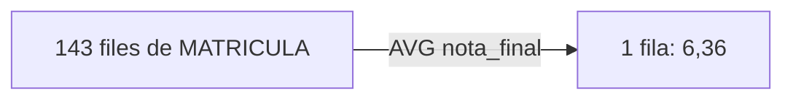
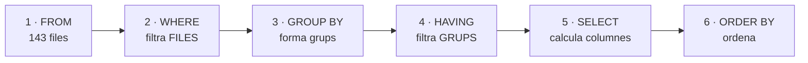
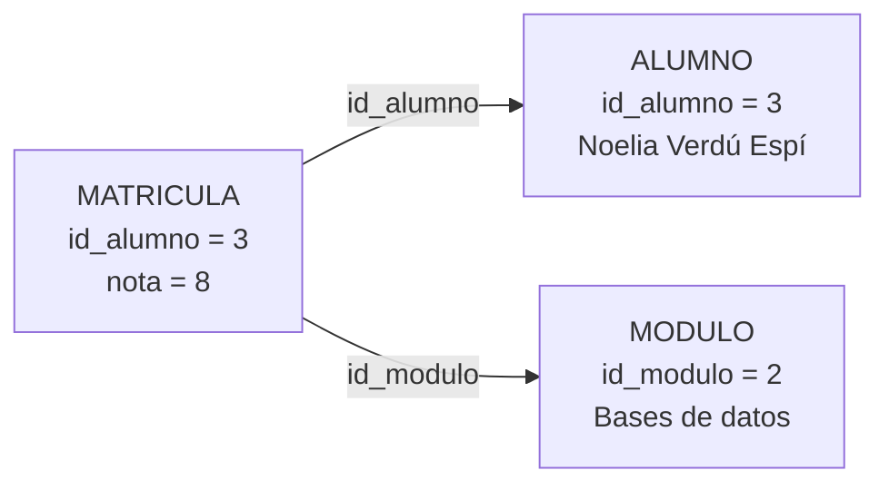
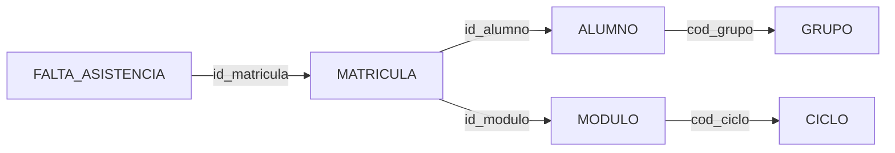
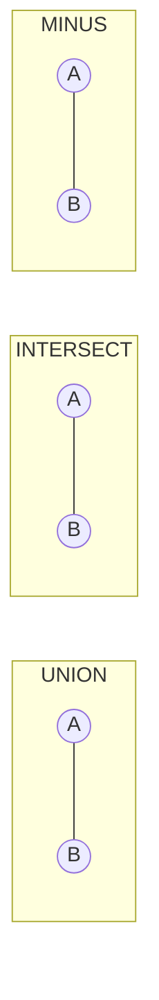

# UD07 · Consultes avançades: composicions, resums i subconsultes

## Resum del tema

A la UD06 vas aprendre a consultar **una** taula. Però una base de dades ben dissenyada reparteix la informació entre moltes taules: el nom de l'alumne està a `ALUMNO`, la seua nota a `MATRICULA` i el nom del mòdul a `MODULO`. Quasi cap pregunta real del centre es respon amb una sola taula. Esta unitat ensenya a **tornar a juntar** el que el disseny va separar (composicions o *joins*), a **resumir** moltes files en poques (funcions d'agregat i `GROUP BY`) i a **encadenar consultes** unes dins d'altres (subconsultes).

El recorregut és acumulatiu. Primer es resumix una sola taula, perquè agrupar és més fàcil d'entendre sense composicions pel mig. Després es combinen taules, primer de forma interna (només les files que emparellen) i després externa (conservant també les que no emparellen: el grup sense tutor, el cicle sense grups). A continuació s'usen subconsultes per a preguntes que necessiten dos passos («qui està per damunt de la mitjana del seu mòdul»). Finalment es guarden les consultes útils com a **vistes**, es combinen resultats amb `UNION`, `INTERSECT` i `MINUS`, i s'introduïxen les **funcions analítiques** i l'**optimització** amb el pla d'execució.

Esta és la unitat que converteix l'SQL en una eina professional: en acabar-la seràs capaç de contestar pràcticament qualsevol pregunta que secretaria, cap d'estudis o l'equip docent li puguen fer a EduGest. A la UD08 reutilitzaràs quasi tot el d'ací, perquè `UPDATE` i `DELETE` admeten subconsultes, i a la UD09 encapsularàs estes consultes en procediments i vistes més elaborades.

Tots els exemples s'executen sobre l'esquema de referència **EDUGEST** amb les dades del curs **2025-26** carregades amb els [scripts del projecte](/guia/proyecto-edugest#4-scripts-descarregables): 5 departaments, 12 professors, 4 cicles, 24 mòduls, 6 grups, 32 alumnes, 143 matrícules, 24 assignacions docents i 46 faltes d'assistència.



### Objectius d'aprenentatge

En acabar esta unitat seràs capaç de:

- Resumir el contingut d'una taula amb funcions d'agregat, raonant com afecten els valors nuls.
- Formar grups amb `GROUP BY` i filtrar-los amb `HAVING`, distingint el seu paper del de `WHERE`.
- Combinar diverses taules amb composicions internes seguint el camí de les claus alienes.
- Decidir quan una pregunta exigix una composició externa i escriure-la sense anul·lar-la amb un filtre mal col·locat.
- Resoldre amb autocomposicions les preguntes en què una taula es relaciona amb si mateixa.
- Escriure subconsultes d'una fila, de diverses files, correlacionades i amb `EXISTS`, i substituir-les per una clàusula `WITH` quan millore la llegibilitat.
- Crear vistes que encapsulen composicions i valorar quan són actualitzables.
- Combinar resultats de diverses consultes amb `UNION`, `UNION ALL`, `INTERSECT` i `MINUS`.
- Utilitzar funcions analítiques per a comparar cada fila amb el seu grup sense perdre el detall.
- Obtindre i interpretar el pla d'execució d'una consulta i aplicar criteris d'optimització.

### Temporalització

La unitat ocupa **17 hores d'aula** (10 de teoria i 7 de pràctica). Les composicions
i les subconsultes són el nucli del RA3: convé no avançar fins que cada consulta
es puga escriure sense consultar els apunts.


items:
  - {h: 2, tipo: T, t: "Funcions d'agregat, GROUP BY i HAVING", ref: "§1 i §2 · laboratori d'agrupament"}
  - {h: 1, tipo: P, t: "Consultes resum", ref: "Pràctica 7.1"}
  - {h: 2, tipo: T, t: "Composicions internes: INNER JOIN i diverses taules", ref: "§3 · laboratori de composicions"}
  - {h: 2, tipo: P, t: "Composicions pas a pas", ref: "Pràctica 7.2"}
  - {h: 2, tipo: T, t: "Composicions externes i autocomposició", ref: "§4 i §5"}
  - {h: 1, tipo: P, t: "Informes per a cap d'estudis", ref: "Pràctica 7.3"}
  - {h: 2, tipo: T, t: "Subconsultes, EXISTS i WITH", ref: "§6"}
  - {h: 1, tipo: P, t: "Subconsultes", ref: "Pràctica 7.4"}
  - {h: 1, tipo: T, t: "Vistes amb composicions i operadors de conjunts", ref: "§7 i §8"}
  - {h: 1, tipo: P, t: "Múltiples seleccions i vistes", ref: "Pràctica 7.5"}
  - {h: 1, tipo: T, t: "Funcions analítiques i optimització de consultes", ref: "§9 i §10"}
  - {h: 1, tipo: P, t: "Optimització: mesurar abans i després", ref: "Pràctica 7.6"}
autonomo:
  - "Pràctica 7.7 (repte: el quadre de comandament)"
  - "Projecte EduGest · UD07 (informes de secretaria i cap d'estudis)"
  - "Ampliació de funcions analítiques"


> [!IMPORTANT]
> Estudia esta unitat amb la base de dades oberta i amb un mètode fix per a cada consulta:
>
> 1. Escriu en castellà la pregunta que vols respondre.
> 2. Decidix **quines taules** la contenen i **per quines claus** s'enllacen.
> 3. **Prediu** quantes files ha de tornar i de quin tipus.
> 4. Executa i compara amb la teua predicció. Si no coincidix, l'error està en el teu model mental, no en Oracle: esbrina on.
>
> Si una consulta torna moltes més files de les esperades, quasi sempre falta una condició de composició. Si en torna menys, quasi sempre sobra un filtre o falta una composició externa.

---

Funcions d'agregat, GROUP BY i HAVING

## 1. Funcions d'agregat

### 1.1 Quin problema resolen

Les funcions de fila de la UD06 (`UPPER`, `ROUND`, `TO_CHAR`…) tornen **un valor per cada fila**: entren 143 files i en isen 143. Però moltes preguntes no demanen files, demanen **un número que resumisca** les files: «quantes matrícules hi ha?», «quina és la nota mitjana?», «quina és la nota més alta?».

Per a això estan les **funcions d'agregat** (també anomenades funcions de grup o de columna): reben un conjunt de files i tornen **un únic valor**.





| Funció | Torna | Admet `DISTINCT` | Tipus admesos |
|---|---|---|---|
| `COUNT(*)` | Nombre de **files** del grup | No | — |
| `COUNT(expr)` | Nombre de files en què `expr` **no és nul·la** | Sí | qualsevol |
| `SUM(expr)` | Suma | Sí | numèrics |
| `AVG(expr)` | Mitjana aritmètica | Sí | numèrics |
| `MIN(expr)` / `MAX(expr)` | Valor menor / major | No (no aporta) | numèrics, text, dates |
| `STDDEV(expr)` / `VARIANCE(expr)` | Desviació típica / variància | Sí | numèrics |
| `MEDIAN(expr)` | Mediana | No | numèrics, dates |
| `LISTAGG(expr, sep)` | Concatena els valors del grup en una cadena | Sí | text |

> [!NOTE]
> `COUNT`, `SUM`, `AVG`, `MIN` i `MAX` són SQL estàndard i existixen en tots els SGBD. `STDDEV`, `VARIANCE`, `MEDIAN` i `LISTAGG` són extensions d'Oracle (algunes estan també en PostgreSQL amb un altre nom). `MEDIAN` i `LISTAGG` es tracten com a ampliació: l'avaluable del RA3.e són les cinc primeres.

### 1.2 Exemple senzill: comptar

```sql
SELECT COUNT(*)                    AS matriculas,
       COUNT(nota_final)           AS calificadas,
       COUNT(*) - COUNT(nota_final) AS sin_calificar,
       COUNT(DISTINCT id_alumno)   AS alumnos_distintos,
       COUNT(DISTINCT id_modulo)   AS modulos_distintos
FROM   matricula;
```

| MATRICULAS | CALIFICADAS | SIN_CALIFICAR | ALUMNOS_DISTINTOS | MODULOS_DISTINTOS |
|---|---|---|---|---|
| 143 | 137 | 6 | 29 | 24 |

*1 fila*

Element a element:

| Element | Significat |
|---|---|
| `COUNT(*)` | Compta **files**, sense mirar el seu contingut: 143 matrícules |
| `COUNT(nota_final)` | Compta les files en què `nota_final` **té valor**: 137 |
| `COUNT(*) - COUNT(nota_final)` | Les 6 matrícules sense qualificar |
| `COUNT(DISTINCT id_alumno)` | Valors distints d'`id_alumno`: 29 alumnes tenen matrícula (dels 32) |

> [!IMPORTANT]
> **Totes les funcions d'agregat excepte `COUNT(*)` ignoren els nuls.** No els compten, no els sumen i no els tenen en compte en la mitjana. Esta és la causa número u de resultats «rars» en les consultes resum, i la raó per la qual `COUNT(*)` i `COUNT(columna)` donen números distints.

### 1.3 Exemple aplicat: estadístics de les notes

```sql
SELECT COUNT(nota_final)            AS calificadas,
       ROUND(AVG(nota_final), 2)    AS media,
       MIN(nota_final)              AS minima,
       MAX(nota_final)              AS maxima,
       SUM(nota_final)              AS suma,
       ROUND(SUM(nota_final) / COUNT(*), 2) AS media_incorrecta
FROM   matricula;
```

| CALIFICADAS | MEDIA | MINIMA | MAXIMA | SUMA | MEDIA_INCORRECTA |
|---|---|---|---|---|---|
| 137 | 6.36 | 1.5 | 10 | 871 | 6.09 |

*1 fila*

L'última columna és deliberadament errònia i convé entendre-la bé:

- `AVG(nota_final)` calcula 871 / **137** = 6,36: dividix entre les matrícules **qualificades**.
- `SUM(nota_final) / COUNT(*)` calcula 871 / **143** = 6,09: dividix entre **totes** les matrícules, incloses les sis sense nota, com si foren zeros.

> [!WARNING]
> Les dos xifres responen a preguntes distintes i **cap és més correcta que l'altra en abstracte**: depén del que et demanen. «Nota mitjana dels alumnes qualificats» és 6,36. «Nota mitjana considerant els no presentats com un zero» és 6,09, i llavors convé escriure-ho explícitament amb `AVG(NVL(nota_final, 0))` perquè el lector veja la decisió. El que mai ha de passar és prendre una per l'altra sense adonar-se'n.

### 1.4 MIN i MAX no són només per a números

`MIN` i `MAX` funcionen amb text (ordre alfabètic segons `NLS_SORT`) i amb dates, on `MIN` és la més antiga:

```sql
SELECT MIN(fecha_nacimiento) AS mayor_edad,
       MAX(fecha_nacimiento) AS menor_edad,
       MIN(apellidos)        AS primero_alfabetico
FROM   alumno;
```

| MAYOR_EDAD | MENOR_EDAD | PRIMERO_ALFABETICO |
|---|---|---|
| 07/08/2000 | 25/12/2006 | Agulló Cerdá |

*1 fila*

### 1.5 Comptar condicions: SUM amb CASE

Una tècnica molt habitual en informes és comptar quantes files complixen una condició **dins** del mateix resum, en compte de llançar una consulta per cada condició:

```sql
SELECT COUNT(*)                                            AS matriculas,
       SUM(CASE WHEN nota_final >= 5 THEN 1 ELSE 0 END)     AS aprobadas,
       SUM(CASE WHEN nota_final <  5 THEN 1 ELSE 0 END)     AS suspensas,
       COUNT(*) - COUNT(nota_final)                         AS sin_calificar,
       ROUND(100 * SUM(CASE WHEN nota_final >= 5 THEN 1 ELSE 0 END)
             / COUNT(nota_final), 1)                        AS pct_aprobados
FROM   matricula;
```

| MATRICULAS | APROBADAS | SUSPENSAS | SIN_CALIFICAR | PCT_APROBADOS |
|---|---|---|---|---|
| 143 | 110 | 27 | 6 | 80.3 |

*1 fila*

Fixa't en el denominador del percentatge: `COUNT(nota_final)`, no `COUNT(*)`. El percentatge d'aprovats es calcula sobre els **qualificats**.

> [!TIP]
> En lloc de `SUM(CASE WHEN … THEN 1 ELSE 0 END)` també funciona `COUNT(CASE WHEN … THEN 1 END)`: com que `COUNT` ignora els nuls i el `CASE` sense `ELSE` torna `NULL` quan no es complix, l'efecte és el mateix. Usa la forma que et resulte més llegible, però **sigues coherent** dins d'un mateix informe.

### 1.6 Errors habituals amb els agregats

```sql
-- (a) Barrejar una columna normal amb un agregat sense GROUP BY
SELECT localidad, COUNT(*) FROM alumno;
-- ORA-00937: not a single-group group function

-- (b) Usar un agregat al WHERE
SELECT localidad FROM alumno WHERE COUNT(*) > 3 GROUP BY localidad;
-- ORA-00934: group function is not allowed here

-- (c) Aniuar agregats sense GROUP BY intermedi
SELECT MAX(AVG(nota_final)) FROM matricula;
-- ORA-00978: nested group function without GROUP BY
```

L'error (a) és el més freqüent: si demanes una columna normal junt amb un agregat, Oracle no sap **quina** localitat posar al costat d'un recompte de 32 alumnes. La solució és el `GROUP BY` de l'apartat següent.

---

## 2. Agrupament: GROUP BY i HAVING

### 2.1 Com es formen els grups

`GROUP BY` dividix les files en **grups** que compartixen el mateix valor en les columnes indicades, i després aplica les funcions d'agregat **a cada grup per separat**. El resultat té **una fila per grup**.

```sql
SELECT cod_grupo, COUNT(*) AS alumnos
FROM   alumno
GROUP  BY cod_grupo
ORDER  BY cod_grupo;
```

| COD_GRUPO | ALUMNOS |
|---|---|
| 1ASIR | 5 |
| 1DAM | 7 |
| 1DAW | 6 |
| 2DAM | 6 |
| 2DAW | 5 |
| (null) | 3 |

*6 files*

Observacions importants:

- Hi ha **sis** files perquè hi ha cinc valors distints de `cod_grupo` més el grup dels nuls.
- `GROUP BY` **reunix tots els nuls en un únic grup** (al contrari que l'operador `=`, que mai considera iguals dos nuls). Eixos són els 3 alumnes sense grup assignat.
- La suma dels recomptes és 32: cap fila es perd i cap es compta dos voltes.
- Els `NULL` apareixen al final perquè `ORDER BY … ASC` els col·loca al final en Oracle.

> [!NOTE]
> `GROUP BY` **no garantix l'ordre** del resultat, encara que a vegades ho semble. Si l'ordre importa, escriu `ORDER BY`. És un error clàssic confiar que els grups isquen ordenats.

### 2.2 Què pot aparéixer al SELECT

Esta és la regla que més errors provoca del tema:

> [!IMPORTANT]
> En una consulta amb `GROUP BY`, el `SELECT` només pot contindre:
>
> 1. les **columnes o expressions que apareixen al `GROUP BY`**,
> 2. **funcions d'agregat**,
> 3. constants i expressions calculades a partir d'1 i 2.
>
> Qualsevol altra columna provoca `ORA-00979: not a GROUP BY expression`.

```sql
-- Incorrecta: nombre no està al GROUP BY i no és un agregat
SELECT localidad, nombre, COUNT(*)
FROM   alumno
GROUP  BY localidad;
-- ORA-00979: not a GROUP BY expression
```

La consulta no té sentit: el grup «Alacant» conté 13 alumnes amb 13 noms distints; quin hauria de mostrar? Tens tres eixides possibles, segons el que realment vulgues:

| El que vols | Solució |
|---|---|
| Una fila per localitat, sense el nom | Lleva `nombre` del `SELECT` |
| Una fila per localitat **i** nom | Afig `nombre` al `GROUP BY` |
| Una fila per localitat amb **un** nom representatiu | `MIN(nombre)` o `MAX(nombre)` |
| Una fila per localitat amb **tots** els noms en una cel·la | `LISTAGG(nombre, ', ') WITHIN GROUP (ORDER BY nombre)` |

```sql
SELECT localidad,
       COUNT(*) AS alumnos,
       MIN(apellidos) AS primero,
       LISTAGG(nombre, ', ') WITHIN GROUP (ORDER BY nombre) AS nombres
FROM   alumno
WHERE  localidad IN ('Elche', 'El Campello')
GROUP  BY localidad
ORDER  BY localidad;
```

| LOCALIDAD | ALUMNOS | PRIMERO | NOMBRES |
|---|---|---|---|
| El Campello | 3 | Alemany Pérez | Daniel, Elena, Jorge |
| Elche | 3 | Iborra Ferri | Rubén, Sofía, Víctor |

*2 files*

{}
{}
Es construïx el conjunt de files de partida unint les taules indicades.
{}
{}
Filtra files **abans** d'agrupar. No pot usar funcions d'agregat.
{}
{}
Forma els grups amb les files que queden.
{}
{}
Filtra grups **després** d'agrupar. Ací sí que es poden usar `COUNT`, `AVG`…
{}
{}
Calcula les expressions i els àlies del resultat.
{}
{}
Ordena. És l'única fase que veu els àlies del SELECT.
{}
{}
Limita el nombre de files tornades.
{}
{}

### 2.3 Ordre d'avaluació: WHERE enfront de HAVING

Ja coneixes l'ordre lògic de les clàusules; ara es completa amb `GROUP BY` i `HAVING`:

```text
FROM  →  WHERE  →  GROUP BY  →  HAVING  →  SELECT  →  ORDER BY
  1        2          3            4         5           6
```



D'este ordre es deriven totes les regles pràctiques:

| Pregunta | Resposta | Perquè… |
|---|---|---|
| Puc usar un agregat al `WHERE`? | **No** (ORA-00934) | El `WHERE` s'avalua abans de formar els grups |
| Puc usar un agregat al `HAVING`? | **Sí** | El `HAVING` s'avalua després d'agrupar |
| Puc usar un àlies del `SELECT` al `HAVING`? | **No** en Oracle | El `SELECT` s'avalua després del `HAVING` |
| Puc usar un àlies del `SELECT` a l'`ORDER BY`? | **Sí** | L'`ORDER BY` és l'últim |
| Filtre per `nota_final < 5` al `WHERE` o al `HAVING`? | Al **`WHERE`** | És una condició sobre files, no sobre grups |

Les dos clàusules es combinen amb freqüència, i cadascuna fa una feina distinta:

```sql
-- Mòduls amb 3 suspesos o més: qui està suspés es decidix fila a fila
-- (WHERE); quants suspesos té el grup es decidix després (HAVING).
SELECT id_modulo,
       COUNT(*)                  AS suspensos,
       ROUND(AVG(nota_final), 2) AS media_de_los_suspensos
FROM   matricula
WHERE  nota_final < 5
GROUP  BY id_modulo
HAVING COUNT(*) >= 3
ORDER  BY suspensos DESC, id_modulo;
```

| ID_MODULO | SUSPENSOS | MEDIA_DE_LOS_SUSPENSOS |
|---|---|---|
| 3 | 4 | 3.81 |
| 18 | 3 | 3 |

*2 files*

{}
No és possible escriure-la tal qual: `HAVING nota_final < 5` dona `ORA-00979`, perquè `nota_final` no està al `GROUP BY`. Si l'escrius com `HAVING MIN(nota_final) < 5`, la consulta és vàlida però respon a **una altra** pregunta: «mòduls en què hi ha almenys un suspés», i el `COUNT(*)` comptaria **totes** les matrícules del mòdul, no només les suspeses.

Regla pràctica: **si la condició es pot decidir mirant una sola fila, va al `WHERE`**. Si necessita veure el grup sencer, va al `HAVING`. A més, filtrar al `WHERE` és més eficient, perquè es descarten files abans d'agrupar.
{}

### 2.4 Agrupar per diverses columnes i per expressions

El `GROUP BY` pot contindre diverses columnes: llavors es forma un grup per cada **combinació** de valors present en les dades (mai s'inventen combinacions que no existisquen).

```sql
SELECT curso_academico, convocatoria,
       COUNT(*)                  AS matriculas,
       COUNT(nota_final)         AS calificadas,
       ROUND(AVG(nota_final), 2) AS media
FROM   matricula
GROUP  BY curso_academico, convocatoria
ORDER  BY curso_academico, convocatoria;
```

| CURSO_ACADEMICO | CONVOCATORIA | MATRICULAS | CALIFICADAS | MEDIA |
|---|---|---|---|---|
| 2025-26 | 1 | 140 | 134 | 6.38 |
| 2025-26 | 2 | 3 | 3 | 5.25 |

*2 files*

També es pot agrupar per una **expressió**, sempre que la mateixa expressió aparega al `GROUP BY`:

```sql
SELECT CASE WHEN nota_final IS NULL THEN 'Sin calificar'
            WHEN nota_final < 5     THEN 'Insuficiente'
            WHEN nota_final < 7     THEN 'Suficiente / Bien'
            WHEN nota_final < 9     THEN 'Notable'
            ELSE                         'Sobresaliente'
       END      AS tramo,
       COUNT(*) AS matriculas
FROM   matricula
GROUP  BY CASE WHEN nota_final IS NULL THEN 'Sin calificar'
               WHEN nota_final < 5     THEN 'Insuficiente'
               WHEN nota_final < 7     THEN 'Suficiente / Bien'
               WHEN nota_final < 9     THEN 'Notable'
               ELSE                         'Sobresaliente'
          END
ORDER  BY matriculas DESC;
```

| TRAMO | MATRICULAS |
|---|---|
| Suficiente / Bien | 52 |
| Notable | 49 |
| Insuficiente | 27 |
| Sobresaliente | 9 |
| Sin calificar | 6 |

*5 files*

> [!TIP]
> Repetir el `CASE` complet és incòmode i propens a errors. En Oracle **no** es pot escriure `GROUP BY tramo` usant l'àlies, però sí que es pot donar nom al càlcul amb una **subconsulta al `FROM`** o amb una clàusula `WITH` (apartat 6.6):
>
> ```sql
> WITH clasificadas AS (
>     SELECT CASE WHEN nota_final IS NULL THEN 'Sin calificar'
>                 WHEN nota_final < 5     THEN 'Insuficiente'
>                 ELSE                         'Aprobada'
>            END AS tramo
>     FROM   matricula)
> SELECT tramo, COUNT(*) AS matriculas
> FROM   clasificadas
> GROUP  BY tramo
> ORDER  BY matriculas DESC;
> ```

### 2.5 Subtotals: ROLLUP, CUBE i GROUPING SETS

Un informe sol necessitar, a més del detall per grup, una **fila de totals**. `GROUP BY ROLLUP(...)` l'afig automàticament:



```sql
SELECT id_modulo,
       COUNT(*)                  AS matriculas,
       COUNT(nota_final)         AS calificadas,
       ROUND(AVG(nota_final), 2) AS media,
       GROUPING(id_modulo)       AS es_total
FROM   matricula
WHERE  id_modulo IN (16, 17, 18, 19)
GROUP  BY ROLLUP(id_modulo)
ORDER  BY GROUPING(id_modulo), id_modulo;
```

| ID_MODULO | MATRICULAS | CALIFICADAS | MEDIA | ES_TOTAL |
|---|---|---|---|---|
| 16 | 5 | 4 | 6.38 | 0 |
| 17 | 5 | 5 | 5.8 | 0 |
| 18 | 5 | 5 | 4.9 | 0 |
| 19 | 5 | 5 | 6.75 | 0 |
| (null) | 20 | 19 | 5.93 | 1 |

*5 files*

| Clàusula | Què afig |
|---|---|
| `ROLLUP(a, b)` | Subtotals per `a` i un total general: jerarquia d'esquerra a dreta |
| `CUBE(a, b)` | **Totes** les combinacions de subtotals: per `a`, per `b` i total |
| `GROUPING SETS((a), (b))` | Exactament els subtotals que indiques |
| `GROUPING(col)` | Torna 1 si la fila és un subtotal respecte de `col`, i 0 si no |

> [!WARNING]
> A les files de subtotal, la columna agrupada val `NULL`. Si la columna **ja tenia** valors nuls propis (com `cod_grupo` a `ALUMNO`), no podràs distingir «els alumnes sense grup» de «el total» mirant la columna: necessites `GROUPING(cod_grupo)`. Per a presentar-ho es combina amb `CASE`: `CASE WHEN GROUPING(cod_grupo) = 1 THEN 'TOTAL' ELSE NVL(cod_grupo, '(sin grupo)') END`.
>
> `ROLLUP`, `CUBE` i `GROUPING SETS` són SQL estàndard i existixen en Oracle, SQL Server i PostgreSQL; en MySQL només hi ha `WITH ROLLUP`. Ací són **ampliació**: resol primer els informes sense subtotals.

### 2.6 Laboratori d'agrupament

Al laboratori següent treballes amb les **143 matrícules reals** d'EduGest (hi ha 6 notes sense posar, dos d'elles al mòdul 0490). Tria la columna d'agrupament, la funció d'agregat i, si vols, una condició `HAVING`, i observa tres coses alhora: quines files formen cada grup, què torna l'agregat i quin SQL estàs construint en realitat.

Presta atenció especialment a dos experiments:

1. Agrupa per `id_modulo` i compara `COUNT(*)` amb `COUNT(nota_final)` al mòdul 0490: hi ha dos matrícules sense nota.
2. Marca la casella **«afegir `id_alumno` al SELECT»**: veuràs l'error `ORA-00979`, que és el que més voltes apareix als primers exercicis del tema.




- q: "La taula `MATRICULA` té 143 files i 6 tenen `nota_final` a `NULL`. Què torna `SELECT COUNT(*), COUNT(nota_final) FROM matricula`?"
  options: ["143 i 143", "143 i 137", "137 i 137", "137 i 143"]
  answer: 1
  explain: "`COUNT(*)` compta files (143) i `COUNT(columna)` compta valors no nuls (137). Totes les funcions d'agregat excepte `COUNT(*)` ignoren els nuls."
- q: "Per què falla `SELECT localidad, nombre, COUNT(*) FROM alumno GROUP BY localidad`?"
  options: ["Perquè `COUNT(*)` no admet `GROUP BY`", "Perquè `nombre` no està al `GROUP BY` ni és un agregat: ORA-00979", "Perquè falta `ORDER BY`", "Perquè `localidad` admet nuls"]
  answer: 1
  explain: "Cada grup conté diversos noms distints i Oracle no pot triar-ne un. Caldria afegir `nombre` al `GROUP BY`, llevar-lo del `SELECT` o resumir-lo amb `MIN`, `MAX` o `LISTAGG`."
- q: "Vols els mòduls la nota mitjana dels quals supera 6, calculada només amb les matrícules de primera convocatòria. On va cada condició?"
  options: ["Les dos al `WHERE`", "Les dos al `HAVING`", "`convocatoria = 1` al `WHERE` i `AVG(nota_final) > 6` al `HAVING`", "`convocatoria = 1` al `HAVING` i `AVG(nota_final) > 6` al `WHERE`"]
  answer: 2
  explain: "La convocatòria es decidix mirant una sola fila, així que filtra al `WHERE` (i a més reduïx les files abans d'agrupar). La mitjana només existix una vegada format el grup: va al `HAVING`."


---

Composicions internes: INNER JOIN

## 3. Composicions internes: INNER JOIN

### 3.1 Quin problema resolen

La normalització (UD04) reparteix la informació per a no repetir-la: a `MATRICULA` no es guarda el nom de l'alumne, sinó el seu `id_alumno`. És el disseny correcte, però deixa un problema pràctic: l'acta d'avaluació necessita el **nom**, no l'identificador.

Una **composició** (*join*) és l'operació que torna a unir eixa informació: combina files de dues o més taules emparellant-les per una condició, normalment la igualtat entre una clau aliena i la clau primària a la qual apunta.



{}
Un `FROM a, b` sense condició d'unió combina cada fila de `a` amb cada fila de `b`. Amb dues taules de 1.000 files n'ixen **1.000.000**, i amb tres de 1.000 files, mil milions. Per això oblidar la condició del `JOIN` és un dels errors que més tarden a executar-se.
{}

### 3.2 El punt de partida: el producte cartesià

Si escrius dues taules al `FROM` **sense condició**, Oracle combina **cada** fila de la primera amb **cada** fila de la segona. Això és el **producte cartesià**, i en SQL modern s'escriu `CROSS JOIN`:

```sql
SELECT (SELECT COUNT(*) FROM grupo) AS grupos,
       (SELECT COUNT(*) FROM ciclo) AS ciclos,
       (SELECT COUNT(*) FROM grupo g CROSS JOIN ciclo c) AS producto
FROM   dual;
```

| GRUPOS | CICLOS | PRODUCTO |
|---|---|---|
| 6 | 4 | 24 |

*1 fila*

El producte cartesià de `GRUPO` i `CICLO` té **24 files**: 6 × 4. Predir este número és just el que cal aprendre a fer. Les primeres files, ordenades, deixen veure el problema:

```sql
SELECT g.cod_grupo, g.cod_ciclo AS ciclo_del_grupo, c.cod_ciclo AS ciclo_de_la_tabla
FROM   grupo g CROSS JOIN ciclo c
ORDER  BY g.cod_grupo, c.cod_ciclo
FETCH FIRST 8 ROWS ONLY;
```

| COD_GRUPO | CICLO_DEL_GRUPO | CICLO_DE_LA_TABLA |
|---|---|---|
| 1ASIR | ASIR | ASIR |
| 1ASIR | ASIR | DAM |
| 1ASIR | ASIR | DAW |
| 1ASIR | ASIR | SMR |
| 1DAM | DAM | ASIR |
| 1DAM | DAM | DAM |
| 1DAM | DAM | DAW |
| 1DAM | DAM | SMR |

*8 files*

De les quatre files de cada grup, **només una té sentit**: la que empareja el grup amb *el seu* cicle. Una composició interna és exactament el producte cartesià **més la condició** que selecciona eixes files amb sentit.

> [!CAUTION]
> El producte cartesià creix multiplicant. Amb les 143 matrícules i les 46 faltes d'EduGest són 6 578 files; amb dues taules d'un milió de files serien un bilió. Si una consulta tarda moltíssim o torna un nombre absurd de files, el primer que cal sospitar és **una condició de composició oblidada**.

### 3.3 Sintaxi `JOIN … ON`



```text
SELECT columnas
FROM   tabla1 alias1
       [INNER] JOIN tabla2 alias2 ON condició_d_emparellament
       [INNER] JOIN tabla3 alias3 ON condició_d_emparellament
WHERE  condicions_de_filtrat
```

| Element | Significat |
|---|---|
| `JOIN tabla2` | Taula que s'afig a la composició |
| `ON condición` | Com s'emparellen les files; és **obligatòria** en `JOIN` |
| `INNER` | Opcional: `JOIN` sense més és sempre una composició **interna** |
| `alias` | Nom curt de la taula; imprescindible per a qualificar les columnes |

Exemple senzill, cada mòdul amb el nom complet del seu cicle:

```sql
SELECT mo.codigo, mo.nombre AS modulo, c.nombre AS ciclo, mo.curso, mo.horas
FROM   modulo mo
       JOIN ciclo c ON c.cod_ciclo = mo.cod_ciclo
WHERE  mo.cod_ciclo = 'ASIR'
ORDER  BY mo.codigo;
```

| CODIGO | MODULO | CICLO | CURSO | HORAS |
|---|---|---|---|---|
| 0369 | Implantación de sistemas operativos | Administración de Sistemas Informáticos en Red | 1 | 224 |
| 0370 | Planificación y administración de redes | Administración de Sistemas Informáticos en Red | 1 | 192 |
| 0371 | Fundamentos de hardware | Administración de Sistemas Informáticos en Red | 1 | 96 |
| 0372 | Gestión de bases de datos | Administración de Sistemas Informáticos en Red | 1 | 160 |
| 0373 | Lenguajes de marcas y sistemas de gestión de información | Administración de Sistemas Informáticos en Red | 1 | 96 |

*5 files*

Resultat esperat: **5 files**, les mateixes que mòduls d'ASIR. Una composició per clau aliena cap a una clau primària **no pot multiplicar files**: cada mòdul té exactament un cicle. Esta és la comprovació més útil del tema.

> [!IMPORTANT]
> **Usa sempre àlies de taula i qualifica totes les columnes.** No és una qüestió estètica:
>
> - `MODULO` i `CICLO` tenen les dos una columna `nombre`. Sense qualificar, `SELECT nombre` donaria `ORA-00918: column ambiguously defined`.
> - Quan llegisques la consulta mesos després, `c.nombre` diu d'on ix la dada; `nombre` no.
> - Si algú afig una columna a una taula, una consulta sense qualificar pot tornar-se ambigua de sobte i deixar de compilar.

### 3.4 Composició de tres i quatre taules

Les composicions s'encadenen. El mètode és sempre el mateix: **traçar el camí de claus alienes** des de la taula que té la dada que busques fins a la que té la dada que vols mostrar.



Tres taules: alumnat de 2DAM amb el seu grup i el nom del cicle.

```sql
SELECT a.apellidos || ', ' || a.nombre AS alumno,
       g.cod_grupo, g.turno, c.nombre AS ciclo
FROM   alumno a
       JOIN grupo g ON g.cod_grupo = a.cod_grupo
       JOIN ciclo c ON c.cod_ciclo = g.cod_ciclo
WHERE  g.cod_grupo = '2DAM'
ORDER  BY a.apellidos;
```

| ALUMNO | COD_GRUPO | TURNO | CICLO |
|---|---|---|---|
| Alemany Vidal, Martina | 2DAM | M | Desarrollo de Aplicaciones Multiplataforma |
| Belda Quiles, Lucía | 2DAM | M | Desarrollo de Aplicaciones Multiplataforma |
| Brotons Iborra, Hugo | 2DAM | M | Desarrollo de Aplicaciones Multiplataforma |
| Cerdá Tomás, Nerea | 2DAM | M | Desarrollo de Aplicaciones Multiplataforma |
| Domènech Quiles, María | 2DAM | M | Desarrollo de Aplicaciones Multiplataforma |
| Ripoll Agulló, Iván | 2DAM | M | Desarrollo de Aplicaciones Multiplataforma |

*6 files*

Quatre taules: l'assignació docent de 2DAM, que creua `IMPARTE` amb `MODULO`, `GRUPO` i `PROFESOR`.

```sql
SELECT g.cod_grupo, mo.codigo, mo.nombre AS modulo,
       p.apellidos AS profesor, i.horas_semanales
FROM   imparte i
       JOIN modulo mo   ON mo.id_modulo   = i.id_modulo
       JOIN grupo g     ON g.cod_grupo    = i.cod_grupo
       JOIN profesor p  ON p.id_profesor  = i.id_profesor
WHERE  i.cod_grupo = '2DAM'
ORDER  BY mo.codigo;
```

| COD_GRUPO | CODIGO | MODULO | PROFESOR | HORAS_SEMANALES |
|---|---|---|---|---|
| 2DAM | 0486 | Acceso a datos | Ferrándiz Mora | 4 |
| 2DAM | 0488 | Desarrollo de interfaces | Navarro Ruiz | 4 |
| 2DAM | 0489 | Programación multimedia y dispositivos móviles | Cano Vidal | 3 |
| 2DAM | 0490 | Programación de servicios y procesos | Ferrándiz Mora | 2 |
| 2DAM | 0491 | Sistemas de gestión empresarial | Pastor Gil | 3 |

*5 files*

> [!TIP]
> **Construïx les composicions d'una en una.** Afig una taula, executa `SELECT COUNT(*)`, comprova que el número és el que esperes i passa a la següent. Així, quan el número se'n vaja de mare, sabràs exactament quin `JOIN` l'ha causat. La pràctica 7.2 està muntada sobre esta tècnica.

### 3.5 Composicions i agrupaments junts

Allò habitual en un informe és compondre i després resumir. L'ordre lògic no canvia: primer `FROM` (amb les seues composicions), després `WHERE`, després `GROUP BY`.

```sql
SELECT c.cod_ciclo, c.nombre AS ciclo,
       COUNT(m.id_matricula)     AS matriculas,
       COUNT(m.nota_final)       AS calificadas,
       ROUND(AVG(m.nota_final), 2) AS media
FROM   ciclo c
       JOIN modulo mo    ON mo.cod_ciclo = c.cod_ciclo
       JOIN matricula m  ON m.id_modulo  = mo.id_modulo
GROUP  BY c.cod_ciclo, c.nombre
ORDER  BY c.cod_ciclo;
```

| COD_CICLO | CICLO | MATRICULAS | CALIFICADAS | MEDIA |
|---|---|---|---|---|
| ASIR | Administración de Sistemas Informáticos en Red | 25 | 24 | 7.07 |
| DAM | Desarrollo de Aplicaciones Multiplataforma | 68 | 65 | 6.29 |
| DAW | Desarrollo de Aplicaciones Web | 50 | 48 | 6.09 |

*3 files*

Falta un dels quatre cicles: **SMR no apareix** perquè no té mòduls i, per tant, cap fila sobreviu a la composició interna. Eixe és precisament el problema que resol l'apartat 4.

> [!NOTE]
> Al `GROUP BY` s'han posat `c.cod_ciclo` **i** `c.nombre`, encara que el nom depenga funcionalment del codi. Oracle exigix al `GROUP BY` totes les columnes no agregades del `SELECT`. Quan agrupes per una entitat, inclou la seua clau primària al `GROUP BY`: garantix que no es fonguen dues entitats amb el mateix nom.

### 3.6 Sintaxi antiga i altres formes de composició

#### Sintaxi amb comes (heretada)

Abans de l'estàndard SQL-92, la condició de composició s'escrivia al `WHERE`:

```sql
-- Sintaxi antiga: NO l'uses en codi nou
SELECT mo.codigo, c.nombre
FROM   modulo mo, ciclo c
WHERE  c.cod_ciclo = mo.cod_ciclo
AND    mo.curso = 2;
```

Torna exactament el mateix que la versió amb `JOIN … ON`, però té dos problemes greus que expliquen per què la norma professional és no usar-la:

1. **Barreja** les condicions de composició amb les de filtrat: en una consulta de sis taules i deu condicions és impossible veure d'un colp d'ull si falta un emparellament.
2. Si **oblides** una condició, no hi ha cap error: obtens silenciosament un producte cartesià parcial amb resultats erronis.

Has de saber llegir-la perquè apareix en moltíssim codi heretat i en documentació antiga d'Oracle, però escriu sempre `JOIN … ON`.

#### `USING`

Quan les columnes que s'emparellen tenen **el mateix nom** a les dues taules, `USING` abreuja:

```sql
SELECT codigo, cod_ciclo, nombre_ciclo
FROM   (SELECT mo.codigo, mo.cod_ciclo, c.nombre AS nombre_ciclo
        FROM   modulo mo JOIN ciclo c USING (cod_ciclo))
FETCH FIRST 3 ROWS ONLY;
```

> [!WARNING]
> `USING` té una peculiaritat que sorprén: la columna comuna **deixa de pertànyer a una taula concreta** i no es pot qualificar. `SELECT mo.cod_ciclo … USING (cod_ciclo)` dona `ORA-25154: column part of USING clause cannot have qualifier`. Cal escriure `cod_ciclo` sense àlies.

#### `NATURAL JOIN`

`NATURAL JOIN` empareja automàticament per **totes** les columnes que tinguen el mateix nom a les dues taules. Sona còmode i és perillós:

```sql
SELECT COUNT(*) FROM modulo NATURAL JOIN ciclo;
```

| COUNT(*) |
|---|
| 0 |

*1 fila*

Zero files. `MODULO` i `CICLO` compartixen **dos** noms de columna: `cod_ciclo` **i** `nombre`. El `NATURAL JOIN` exigix que coincidisquen els dos, i cap mòdul es diu igual que el seu cicle.

> [!CAUTION]
> **No uses `NATURAL JOIN` en codi real.** La composició depén dels noms de les columnes, així que afegir una columna anomenada `nombre`, `fecha_alta` o `observaciones` a una taula pot canviar en silenci el resultat de consultes que portaven anys funcionant. Escriu sempre la condició explícitament a l'`ON`.

#### Condicions a l'`ON` o al `WHERE`

En una composició **interna** és igual posar una condició de filtrat a l'`ON` o al `WHERE`: el resultat és idèntic, i l'optimitzador d'Oracle ho reorganitza igual.

```sql
-- Equivalents (composició interna)
FROM modulo mo JOIN ciclo c ON c.cod_ciclo = mo.cod_ciclo AND mo.curso = 2
FROM modulo mo JOIN ciclo c ON c.cod_ciclo = mo.cod_ciclo WHERE mo.curso = 2
```

En una composició **externa** **no** són equivalents, i la diferència és una de les trampes més repetides del mòdul: s'analitza a l'apartat 4.4. Convenció recomanada: a l'`ON`, només el que empareja; al `WHERE`, el que filtra.

### 3.7 Laboratori de composicions

El laboratori següent compon dues taules reals d'EduGest: els 6 **grups** (un d'ells, 2ASIR, sense tutor assignat) i 7 **professors** (dos dels quals no són tutors de cap grup). Canvia el tipus de composició i observa tres coses: l'SQL que es genera, quines files es conserven i quantes files ixen.

Abans de tocar res, prediu els números: quantes files hauria de tornar cada tipus de composició? Després comprova-ho. Usa també les dos caselles inferiors, que reproduïxen els dos errors clàssics del tema: el filtre al `WHERE` que anul·la una composició externa i la diferència entre posar una condició a l'`ON` o al `WHERE`.




- q: "`FALTA_ASISTENCIA` té 46 files i `MATRICULA` 143. Quantes files torna `SELECT * FROM falta_asistencia f JOIN matricula m ON m.id_matricula = f.id_matricula`?"
  options: ["46", "143", "189", "6578"]
  answer: 0
  explain: "Cada falta apunta a exactament una matrícula mitjançant una clau aliena obligatòria, així que cap fila es duplica ni es perd: 46. Les 6578 files (46 × 143) serien el producte cartesià, el que eixiria si oblidàrem l'`ON`."
- q: "Per què `SELECT nombre FROM modulo mo JOIN ciclo c ON c.cod_ciclo = mo.cod_ciclo` dona ORA-00918?"
  options: ["Perquè falta `INNER`", "Perquè `nombre` existix a les dues taules i no s'ha qualificat", "Perquè `cod_ciclo` admet nuls", "Perquè cal usar `USING`"]
  answer: 1
  explain: "ORA-00918 és *column ambiguously defined*. Cal escriure `mo.nombre` o `c.nombre`. És la raó per la qual es qualifiquen sempre totes les columnes."
- q: "Una consulta que compon `ALUMNO` amb `MATRICULA` torna 143 files en lloc de 32. Què passa?"
  options: ["Hi ha un error: hauria de tornar 32", "És correcte: un alumne té diverses matrícules, així que la seua fila es repetix una vegada per matrícula", "Falta un `DISTINCT`", "Falta una composició externa"]
  answer: 1
  explain: "En compondre pel costat «molts» d'una relació 1:N, la fila del costat «un» apareix repetida. És el comportament esperat; si vols una fila per alumne hauràs d'agrupar."


---

Composicions externes i autocomposició

## 4. Composicions externes: LEFT, RIGHT i FULL JOIN

### 4.1 Quin problema resolen

Una composició interna només torna les files que **emparellen**. Això fa desaparéixer silenciosament informació que moltes vegades és la més important de l'informe:

| Pregunta d'EduGest | El que la composició interna oculta |
|---|---|
| Quants grups té cada cicle? | SMR, que no en té cap |
| Qui és el tutor de cada grup? | 2ASIR, que encara no té tutor |
| Quants alumnes té cada grup? | 2ASIR, sense alumnat matriculat |
| Quin professorat hi ha en cada departament? | Matemàtiques, sense professorat assignat |
| Quins alumnes tenen matrícula? | Els 3 alumnes sense grup ni matrícula |

En tots estos casos, la fila «sense parella» és justament la que cal detectar i resoldre. Una **composició externa** conserva les files d'una taula encara que no troben parella en l'altra, omplint amb `NULL` les columnes que falten.

| Tipus | Conserva | Quan usar-lo |
|---|---|---|
| `A LEFT [OUTER] JOIN B` | **Totes** les files d'`A` | «Tots els grups, amb el seu tutor si en tenen» |
| `A RIGHT [OUTER] JOIN B` | **Totes** les files de `B` | El mateix al contrari; poc usat a la pràctica |
| `A FULL [OUTER] JOIN B` | Totes les d'`A` **i** totes les de `B` | Conciliar dos llistats: detectar orfes en ambdós costats |

La paraula `OUTER` és opcional: `LEFT JOIN` i `LEFT OUTER JOIN` són el mateix.

### 4.2 `LEFT JOIN`: el cas habitual

```sql
SELECT g.cod_grupo, g.cod_ciclo, g.turno, g.id_tutor,
       p.apellidos || ', ' || p.nombre AS tutor
FROM   grupo g
       LEFT JOIN profesor p ON p.id_profesor = g.id_tutor
ORDER  BY g.cod_grupo;
```

| COD_GRUPO | COD_CICLO | TURNO | ID_TUTOR | TUTOR |
|---|---|---|---|---|
| 1ASIR | ASIR | M | 105 | Brotons Sala, Elena |
| 1DAM | DAM | M | 103 | Ferrándiz Mora, Lucía |
| 1DAW | DAW | T | 106 | Cano Vidal, Raúl |
| 2ASIR | ASIR | M | (null) | (null) |
| 2DAM | DAM | M | 104 | Navarro Ruiz, Andrés |
| 2DAW | DAW | T | 107 | Gómez Pérez, Nuria |

*6 files*

Resultat esperat: **les 6 files de `GRUPO`**, perquè `GRUPO` està a l'esquerra. La fila de 2ASIR es conserva amb totes les columnes de `PROFESOR` a `NULL`. Per a presentar-ho es combina amb les funcions de la UD06:

```sql
SELECT g.cod_grupo,
       NVL(p.apellidos || ', ' || p.nombre, '(sin tutor asignado)') AS tutor
FROM   grupo g
       LEFT JOIN profesor p ON p.id_profesor = g.id_tutor
ORDER  BY g.cod_grupo;
```

Un altre cas clàssic, amb la composició en el sentit 1:N. Tots els cicles, amb els seus grups:

```sql
SELECT c.cod_ciclo, c.nombre AS ciclo, g.cod_grupo, g.turno
FROM   ciclo c
       LEFT JOIN grupo g ON g.cod_ciclo = c.cod_ciclo
ORDER  BY c.cod_ciclo, g.cod_grupo;
```

| COD_CICLO | CICLO | COD_GRUPO | TURNO |
|---|---|---|---|
| ASIR | Administración de Sistemas Informáticos en Red | 1ASIR | M |
| ASIR | Administración de Sistemas Informáticos en Red | 2ASIR | M |
| DAM | Desarrollo de Aplicaciones Multiplataforma | 1DAM | M |
| DAM | Desarrollo de Aplicaciones Multiplataforma | 2DAM | M |
| DAW | Desarrollo de Aplicaciones Web | 1DAW | T |
| DAW | Desarrollo de Aplicaciones Web | 2DAW | T |
| SMR | Sistemas Microinformáticos y Redes | (null) | (null) |

*7 files*

Set files: les sis parelles reals més SMR, que apareix **una vegada** amb les columnes de grup nul·les.

### 4.3 COUNT en una composició externa: COUNT(*) enfront de COUNT(columna)

Ací els dos conceptes del tema es creuen i produïxen l'error més subtil de la unitat:

```sql
SELECT g.cod_grupo,
       COUNT(*)           AS filas_del_grupo,
       COUNT(a.id_alumno) AS alumnos
FROM   grupo g
       LEFT JOIN alumno a ON a.cod_grupo = g.cod_grupo
GROUP  BY g.cod_grupo
ORDER  BY g.cod_grupo;
```

| COD_GRUPO | FILAS_DEL_GRUPO | ALUMNOS |
|---|---|---|
| 1ASIR | 5 | 5 |
| 1DAM | 7 | 7 |
| 1DAW | 6 | 6 |
| 2ASIR | **1** | **0** |
| 2DAM | 6 | 6 |
| 2DAW | 5 | 5 |

*6 files*

> [!IMPORTANT]
> En una composició externa, la fila sense parella **existix** (per això `COUNT(*)` val 1 per a 2ASIR) però **no té dades** de la taula opcional (per això `COUNT(a.id_alumno)` val 0). En un `LEFT JOIN`, compta sempre una **columna de la taula opcional**, mai `COUNT(*)`, si el que vols és «quants fills té cada pare». El mateix val per a `SUM`, que tornarà `NULL` en compte de 0: embolica'l en `NVL(SUM(...), 0)`.

### 4.4 La trampa del WHERE: com anul·lar una composició externa

```sql
-- (a) INCORRECTA: el WHERE descarta la fila nul·la que acaba de crear el LEFT JOIN
SELECT g.cod_grupo, p.apellidos AS tutor
FROM   grupo g LEFT JOIN profesor p ON p.id_profesor = g.id_tutor
WHERE  p.id_departamento = 1;
-- 5 files: 2ASIR desapareix

-- (b) CORRECTA: la condició sobre la taula opcional va a l'ON
SELECT g.cod_grupo, p.apellidos AS tutor
FROM   grupo g LEFT JOIN profesor p
       ON p.id_profesor = g.id_tutor AND p.id_departamento = 1;
-- 6 files: 2ASIR apareix amb tutor nul
```

L'explicació està en l'ordre d'avaluació: el `LEFT JOIN` crea la fila de 2ASIR amb `p.id_departamento` a `NULL`; després, el `WHERE` avalua `NULL = 1`, que és `UNKNOWN`, i descarta la fila. Un `WHERE` sobre una columna de la taula opcional **converteix un `LEFT JOIN` en un `INNER JOIN`**.

> [!WARNING]
> **Regla per a recordar:** en una composició externa, les condicions sobre la **taula opcional** van a l'`ON`; les condicions sobre la **taula conservada** poden anar al `WHERE`.
>
> Hi ha una excepció deliberada: `WHERE columna_opcional IS NULL`, que és just el contrari, com es veu a l'apartat següent.

### 4.5 Anticomposició: buscar el que NO existix

Si el que vols són precisament les files **sense parella**, el patró és composició externa + `IS NULL` sobre una columna de la taula opcional. Es diu *anti-join*:

```sql
-- Alumnat sense cap matrícula
SELECT a.id_alumno, a.nombre, a.apellidos, a.cod_grupo
FROM   alumno a
       LEFT JOIN matricula m ON m.id_alumno = a.id_alumno
WHERE  m.id_matricula IS NULL
ORDER  BY a.id_alumno;
```

| ID_ALUMNO | NOMBRE | APELLIDOS | COD_GRUPO |
|---|---|---|---|
| 30 | Zoe | Iborra Valero | (null) |
| 31 | Lucas | Agulló Cerdá | (null) |
| 32 | Irene | Belda Iborra | (null) |

*3 files*

Són els tres alumnes que ni tenen grup ni estan matriculats: una dada de qualitat de dades que secretaria ha de revisar abans de tancar la matrícula.

> [!TIP]
> Tria per a l'`IS NULL` una columna de la taula opcional **que no admeta nuls** en la seua taula (normalment la seua clau primària). Si triares una columna que sí que admet nuls, no podries distingir «no hi ha parella» de «hi ha parella amb eixe valor nul».

### 4.6 `FULL OUTER JOIN`

Conserva les files de les dues taules. És l'eina per a **conciliar** dos llistats:

```sql
-- Conciliació grup ↔ tutor: grups sense tutor i professorat que no tutoritza
SELECT g.cod_grupo, p.id_profesor, p.apellidos
FROM   grupo g
       FULL OUTER JOIN profesor p ON p.id_profesor = g.id_tutor
WHERE  g.cod_grupo IS NULL OR p.id_profesor IS NULL
ORDER  BY g.cod_grupo, p.id_profesor;
```

| COD_GRUPO | ID_PROFESOR | APELLIDOS |
|---|---|---|
| 2ASIR | (null) | (null) |
| (null) | 101 | Soler Ivars |
| (null) | 102 | Pastor Gil |
| (null) | 108 | Lillo Martí |
| (null) | 109 | Ortiz Llorca |
| (null) | 110 | Ramos Climent |
| (null) | 111 | Vicent Ribes |
| (null) | 112 | Esteve Juan |

*8 files*

Un grup sense tutor i set professors que no són tutors de cap grup. Sense el `WHERE`, la composició tornaria 13 files: 5 parelles + 1 + 7.

### 4.7 Nota històrica: l'operador `(+)` d'Oracle

Abans de SQL-92, Oracle expressava les composicions externes amb l'operador `(+)` junt a la columna de la taula **que pot quedar sense dades**:



```sql
-- Sintaxi propietària antiga: equivalent a GRUPO LEFT JOIN PROFESOR
SELECT g.cod_grupo, p.apellidos
FROM   grupo g, profesor p
WHERE  p.id_profesor(+) = g.id_tutor;
```

Oracle la continua admetent per compatibilitat, però la mateixa documentació recomana la sintaxi estàndard: `(+)` no és portable, no permet `FULL OUTER JOIN`, no es pot combinar lliurement amb `OR` ni amb `IN`, i en consultes de diverses taules és molt difícil de llegir. Has de reconéixer-la en llegir codi antic i **no** escriure-la.

{}
```sql
SELECT c.cod_ciclo, COUNT(g.cod_grupo) AS grupos
FROM   ciclo c LEFT JOIN grupo g ON g.cod_ciclo = c.cod_ciclo
WHERE  g.turno = 'M'
GROUP  BY c.cod_ciclo;
```

Torna **dues** files (ASIR amb 2 i DAM amb 2), no quatre. El `WHERE g.turno = 'M'` elimina les files en què `g.turno` és nul, és a dir, la fila de SMR creada pel `LEFT JOIN`, i també DAW, els dos grups del qual són de vesprada. La composició externa ha quedat anul·lada per a SMR.

Per a obtindre els quatre cicles amb el nombre de grups **de matí** de cadascun, la condició ha d'anar a l'`ON`:

```sql
SELECT c.cod_ciclo, COUNT(g.cod_grupo) AS grupos
FROM   ciclo c LEFT JOIN grupo g
       ON g.cod_ciclo = c.cod_ciclo AND g.turno = 'M'
GROUP  BY c.cod_ciclo
ORDER  BY c.cod_ciclo;
```

Ara ixen 4 files: ASIR 2, DAM 2, DAW **0**, SMR **0**.
{}

---

## 5. Autocomposició i altres composicions

### 5.1 Autocomposició (*self join*)

Una taula també es pot compondre **amb si mateixa**. Ocorre sempre que una relació s'establix entre files de la mateixa taula: el cap d'un empleat, el prerequisit d'un mòdul, el professor que dirigix un departament del qual forma part.

La clau tècnica és que **calen dos àlies distints** perquè Oracle (i el lector) sàpia de quina «còpia» de la taula es parla.

A EduGest, cada professor pertany a un departament i cada departament té un cap que és, al seu torn, un professor. Per a posar al costat de cada docent el nom de la seua cap de departament, `PROFESOR` apareix **dues voltes**:

```sql
SELECT p.apellidos || ', ' || p.nombre AS profesor,
       d.nombre                        AS departamento,
       NVL(j.apellidos || ', ' || j.nombre, '(vacante)') AS jefe_departamento,
       CASE WHEN j.id_profesor = p.id_profesor THEN 'Sí' ELSE 'No' END AS es_el_jefe
FROM   profesor p
       JOIN departamento d  ON d.id_departamento = p.id_departamento
       LEFT JOIN profesor j ON j.id_profesor     = d.id_jefe
WHERE  d.id_departamento IN (2, 3, 5)
ORDER  BY d.nombre, p.apellidos;
```

| PROFESOR | DEPARTAMENTO | JEFE_DEPARTAMENTO | ES_EL_JEFE |
|---|---|---|---|
| Esteve Juan, David | Administración y Gestión | Esteve Juan, David | Sí |
| Ortiz Llorca, Carmen | Formación y Orientación Laboral | Ortiz Llorca, Carmen | Sí |
| Ramos Climent, Sergio | Formación y Orientación Laboral | Ortiz Llorca, Carmen | No |
| Vicent Ribes, Laura | Inglés | Vicent Ribes, Laura | Sí |

*4 files*

Observa els dos àlies de `PROFESOR`: `p` és «el docent» i `j` és «el seu cap de departament». El `LEFT JOIN` és necessari perquè un departament pot tindre la cap vacant.

> [!IMPORTANT]
> En una autocomposició, els àlies no són opcionals: sense ells, `WHERE id_jefe = id_profesor` seria ambigu i Oracle donaria `ORA-00918`. Tria àlies que diguen **el paper** que juga cada còpia (`p`/`j`, `empleado`/`jefe`, `modulo`/`prerrequisito`), no `t1`/`t2`.

### 5.2 Autocomposició per a comparar files entre si

L'altre ús de l'autocomposició és comparar files de la mateixa taula: duplicats, parelles, coincidències.

```sql
-- Parelles d'alumnes del mateix grup que viuen a la mateixa localitat
SELECT a.cod_grupo, a.localidad,
       a.apellidos AS alumno_1, b.apellidos AS alumno_2
FROM   alumno a
       JOIN alumno b ON b.cod_grupo = a.cod_grupo
                    AND b.localidad = a.localidad
                    AND b.id_alumno > a.id_alumno
WHERE  a.cod_grupo = '1DAM'
ORDER  BY a.localidad, a.apellidos, b.apellidos;
```

| COD_GRUPO | LOCALIDAD | ALUMNO_1 | ALUMNO_2 |
|---|---|---|---|
| 1DAM | Alicante | Brotons Soriano | Cerdá Pérez |
| 1DAM | Alicante | Ferri Baeza | Brotons Soriano |
| 1DAM | Alicante | Ferri Baeza | Brotons Soriano |
| 1DAM | Alicante | Ferri Baeza | Cerdá Pérez |
| 1DAM | Alicante | Ferri Baeza | Cerdá Pérez |
| 1DAM | Alicante | Ferri Baeza | Ferri Baeza |
| 1DAM | Sant Joan d'Alacant | Verdú Espí | Quiles Marco |

*7 files*

Dos detalls imprescindibles:

- La condició `b.id_alumno > a.id_alumno` evita que un alumne s'emparelle **amb si mateix** i que cada parella isca **dues voltes** (A-B i B-A). Si la lleves, les 7 files es convertixen en 22.
- A 1DAM hi ha dos alumnes distints que tenen per cognom «Ferri Baeza» (Adrián i Paula), cosa que explica les files aparentment repetides: són parelles diferents amb cognoms iguals. És un bon recordatori que **el cognom no identifica una persona**: per això la clau primària és `id_alumno`.

### 5.3 `CROSS JOIN` legítim: construir una graella completa

El producte cartesià de l'apartat 3.2 semblava només una font d'errors, però té un ús professional important: **generar totes les combinacions possibles** perquè en un informe apareguen també les cel·les amb valor zero.

Un exemple real: el part trimestral de faltes demana, per a **cada grup**, les faltes justificades i les no justificades. Si es calcula amb composicions normals, els grups sense cap falta simplement no apareixen, i les combinacions sense faltes tampoc:

```sql
-- Sense graella: només apareixen les combinacions que existixen -> 10 files
SELECT a.cod_grupo, f.justificada, COUNT(*) AS faltas, SUM(f.horas) AS horas
FROM   falta_asistencia f
       JOIN matricula m ON m.id_matricula = f.id_matricula
       JOIN alumno a    ON a.id_alumno    = m.id_alumno
GROUP  BY a.cod_grupo, f.justificada
ORDER  BY a.cod_grupo, f.justificada;
```

Amb `CROSS JOIN` es construïx primer la graella «6 grups × 2 tipus de falta» i després es pengen les dades amb composicions externes:

```sql
SELECT g.cod_grupo, t.justificada,
       COUNT(f.id_falta)    AS faltas,
       NVL(SUM(f.horas), 0) AS horas
FROM   grupo g
       CROSS JOIN (SELECT 'N' AS justificada FROM dual
                   UNION ALL
                   SELECT 'S'                FROM dual) t
       LEFT JOIN alumno a           ON a.cod_grupo    = g.cod_grupo
       LEFT JOIN matricula m        ON m.id_alumno    = a.id_alumno
       LEFT JOIN falta_asistencia f ON f.id_matricula = m.id_matricula
                                   AND f.justificada  = t.justificada
GROUP  BY g.cod_grupo, t.justificada
ORDER  BY g.cod_grupo, t.justificada;
```

| COD_GRUPO | JUSTIFICADA | FALTAS | HORAS |
|---|---|---|---|
| 1ASIR | N | 4 | 6 |
| 1ASIR | S | 5 | 5 |
| 1DAM | N | 7 | 13 |
| 1DAM | S | 2 | 5 |
| 1DAW | N | 5 | 9 |
| 1DAW | S | 2 | 5 |
| 2ASIR | N | 0 | 0 |
| 2ASIR | S | 0 | 0 |
| 2DAM | N | 6 | 14 |
| 2DAM | S | 6 | 11 |
| 2DAW | N | 5 | 8 |
| 2DAW | S | 4 | 5 |

*12 files*

Ara hi ha **12 files** (6 × 2) en compte de 10, i 2ASIR apareix amb zeros explícits, que és el que cap d'estudis necessita veure en un part.

> [!NOTE]
> Fixa't en la combinació de tècniques: un `CROSS JOIN` **deliberat** per a la graella, `LEFT JOIN` per a no perdre les cel·les buides, la condició `f.justificada = t.justificada` a l'**`ON`** (si estiguera al `WHERE` perdríem de nou 2ASIR), `COUNT` d'una columna de la taula opcional i `NVL` sobre el `SUM`. Les quatre regles dels apartats anteriors actuant juntes.

### 5.4 Compondre amb una subconsulta o amb una vista

Una composició no exigix que els dos operands siguen taules: pot ser una **vista** (apartat 7) o una **subconsulta al `FROM`**, també anomenada *taula en línia* o *vista en línia*. Això permet resumir primer i compondre després:

```sql
-- Resum per mòdul (subconsulta) compost amb el catàleg de mòduls
SELECT mo.codigo, mo.cod_ciclo, mo.nombre AS modulo,
       r.calificadas, ROUND(r.media, 2) AS media
FROM   (SELECT id_modulo,
               COUNT(nota_final) AS calificadas,
               AVG(nota_final)   AS media
        FROM   matricula
        GROUP  BY id_modulo) r
       JOIN modulo mo ON mo.id_modulo = r.id_modulo
WHERE  r.media < 6
ORDER  BY r.media, mo.codigo;
```

| CODIGO | COD_CICLO | MODULO | CALIFICADAS | MEDIA |
|---|---|---|---|---|
| 0614 | DAW | Despliegue de aplicaciones web | 5 | 4.9 |
| 0488 | DAM | Desarrollo de interfaces | 6 | 5.42 |
| 0485 | DAM | Programación | 8 | 5.56 |
| 0483 | DAW | Sistemas informáticos | 6 | 5.71 |
| 0613 | DAW | Desarrollo web en entorno servidor | 5 | 5.8 |
| 0484 | DAW | Bases de datos | 6 | 5.92 |
| 0484 | DAM | Bases de datos | 7 | 5.93 |

*7 files*

Els set mòduls amb nota mitjana inferior a 6. Observa que el codi 0484 apareix dues voltes, una per cicle: a EduGest el mateix mòdul oficial existix en DAM i en DAW amb `id_modulo` distint, i per això la columna `cod_ciclo` és imprescindible per a interpretar l'informe.

---

Subconsultes, EXISTS i WITH

## 6. Subconsultes

### 6.1 Quin problema resolen

Hi ha preguntes que no es poden respondre d'una vegada perquè necessiten **una dada que al seu torn cal calcular**: «els mòduls amb més hores que la mitjana» exigix calcular primer la mitjana. Una **subconsulta** és una consulta `SELECT` escrita dins d'una altra, entre parèntesis, el resultat de la qual usa la consulta exterior.

Segons **on** s'escriga i **quantes files** torne, es comporta de forma distinta:

| Posició | Nom | Ha de tornar | Exemple d'ús |
|---|---|---|---|
| Al `WHERE` / `HAVING` | Subconsulta d'**una fila** | 1 fila, 1 columna | `horas > (SELECT AVG(horas) …)` |
| Al `WHERE` / `HAVING` | Subconsulta de **diverses files** | N files, 1 columna | `id_alumno IN (SELECT …)` |
| Al `FROM` | Taula en línia | N files, N columnes | Resumir abans de compondre |
| Al `SELECT` | Subconsulta **escalar** | 1 fila, 1 columna | Una dada calculada per fila |
| Amb `EXISTS` | Subconsulta d'**existència** | El que siga | «Hi ha alguna fila que…?» |

### 6.2 Subconsultes d'una fila

S'usen amb els operadors de comparació normals (`=`, `<>`, `>`, `<`, `>=`, `<=`). La subconsulta ha de tornar **exactament una fila i una columna**; normalment ho garantix una funció d'agregat sense `GROUP BY`.

```sql
-- Mitjana d'hores dels mòduls de DAM: 132
SELECT codigo, nombre, horas
FROM   modulo
WHERE  cod_ciclo = 'DAM'
AND    horas > (SELECT AVG(horas) FROM modulo WHERE cod_ciclo = 'DAM')
ORDER  BY horas DESC, codigo;
```

| CODIGO | NOMBRE | HORAS |
|---|---|---|
| 0485 | Programación | 256 |
| 0483 | Sistemas informáticos | 160 |
| 0484 | Bases de datos | 160 |

*3 files*

> [!WARNING]
> Si una subconsulta d'una fila en torna **més d'una**, Oracle llança `ORA-01427: single-row subquery returns more than one row`. És l'error típic de `WHERE horas > (SELECT horas FROM modulo WHERE cod_ciclo = 'DAM')`: hi ha 10 mòduls de DAM, així que hi ha 10 valors. La solució és o resumir (`AVG`, `MAX`…) o usar un operador de diverses files (`ANY`, `ALL`, `IN`).

Les subconsultes també funcionen al `HAVING`, quan la condició sobre el grup es compara amb un valor global:

```sql
-- Mòduls la nota mitjana dels quals supera la mitjana general del centre (6,36)
SELECT id_modulo, COUNT(nota_final) AS calificadas, ROUND(AVG(nota_final), 2) AS media
FROM   matricula
GROUP  BY id_modulo
HAVING AVG(nota_final) > (SELECT AVG(nota_final) FROM matricula)
ORDER  BY media DESC
FETCH FIRST 5 ROWS ONLY;
```

| ID_MODULO | CALIFICADAS | MEDIA |
|---|---|---|
| 21 | 4 | 8 |
| 20 | 5 | 7.4 |
| 5 | 7 | 7.21 |
| 24 | 5 | 6.85 |
| 22 | 5 | 6.8 |

*5 files*

### 6.3 Subconsultes de diverses files: IN, ANY i ALL

| Operador | Significat | Equivalent |
|---|---|---|
| `IN (subconsulta)` | Igual a **algun** dels valors | `= ANY` |
| `NOT IN (subconsulta)` | Distint de **tots** els valors | `<> ALL` |
| `> ANY (subconsulta)` | Major que **almenys un**: major que el **mínim** | `> MIN(…)` |
| `> ALL (subconsulta)` | Major que **tots**: major que el **màxim** | `> MAX(…)` |
| `< ANY` / `< ALL` | Menor que el màxim / menor que el mínim | |

```sql
-- Alumnat matriculat en Bases de dades (codi 0484, en qualsevol cicle)
SELECT a.id_alumno, a.apellidos || ', ' || a.nombre AS alumno, a.cod_grupo
FROM   alumno a
WHERE  a.id_alumno IN (SELECT m.id_alumno
                       FROM   matricula m
                              JOIN modulo mo ON mo.id_modulo = m.id_modulo
                       WHERE  mo.codigo = '0484')
ORDER  BY a.cod_grupo, a.apellidos;
```

| ID_ALUMNO | ALUMNO | COD_GRUPO |
|---|---|---|
| 5 | Brotons Soriano, Andrea | 1DAM |
| 6 | Cerdá Pérez, Tomás | 1DAM |
| 1 | Ferri Baeza, Adrián | 1DAM |
| 4 | Ferri Baeza, Paula | 1DAM |
| 2 | Iborra Ferri, Rubén | 1DAM |
| 7 | Quiles Marco, Valeria | 1DAM |
| 3 | Verdú Espí, Noelia | 1DAM |
| 18 | Alemany Pérez, Daniel | 1DAW |
| 16 | Espí Marco, Julia | 1DAW |
| 17 | Iborra Alemany, Jorge | 1DAW |
| 15 | Soriano Domènech, Manuel | 1DAW |
| 19 | Torregrosa Planelles, Alba | 1DAW |
| 14 | Valero Cerdá, Carla | 1DAW |

*13 files*

```sql
-- Mòduls de DAW amb més hores que el mòdul més curt d'ASIR (96 h)
SELECT codigo, nombre, horas
FROM   modulo
WHERE  cod_ciclo = 'DAW'
AND    horas > ANY (SELECT horas FROM modulo WHERE cod_ciclo = 'ASIR')
ORDER  BY horas, codigo;
```

| CODIGO | NOMBRE | HORAS |
|---|---|---|
| 0615 | Diseño de interfaces web | 120 |
| 0373 | Lenguajes de marcas y sistemas de gestión de información | 128 |
| 0612 | Desarrollo web en entorno cliente | 140 |
| 0483 | Sistemas informáticos | 160 |
| 0484 | Bases de datos | 160 |
| 0613 | Desarrollo web en entorno servidor | 160 |
| 0485 | Programación | 256 |

*7 files*

> [!TIP]
> `ANY` i `ALL` són difícils de llegir. Tradueix sempre a la forma amb agregat abans d'escriure'ls: `> ANY` és `> (SELECT MIN(...))` i `> ALL` és `> (SELECT MAX(...))`. Si dubtes, escriu la versió amb `MIN`/`MAX`: és equivalent i molt més clara. L'única diferència pràctica apareix amb subconsultes buides.

### 6.4 La trampa de NOT IN amb nuls

```sql
-- Professorat que NO és tutor de cap grup
SELECT COUNT(*) AS filas
FROM   profesor
WHERE  id_profesor NOT IN (SELECT id_tutor FROM grupo);
```

| FILAS |
|---|
| 0 |

*1 fila*

Zero files, quan sabem que hi ha set professors sense tutoria. **No és un error d'Oracle**: és la lògica de tres valors de la UD06. La subconsulta torna sis valors, i un d'ells és `NULL` (2ASIR no té tutor). Llavors:

```text
id_profesor NOT IN (105, 103, 106, NULL, 104, 107)
   ≡  id_profesor <> 105 AND … AND id_profesor <> NULL
   ≡  TRUE AND … AND UNKNOWN
   ≡  UNKNOWN   →  el WHERE no deixa passar cap fila
```

Hi ha dues formes correctes d'escriure-ho:

```sql
-- (a) Excloure els nuls de la subconsulta
SELECT id_profesor, apellidos
FROM   profesor
WHERE  id_profesor NOT IN (SELECT id_tutor FROM grupo WHERE id_tutor IS NOT NULL)
ORDER  BY id_profesor;

-- (b) NOT EXISTS: immune als nuls (recomanada)
SELECT p.id_profesor, p.apellidos || ', ' || p.nombre AS profesor
FROM   profesor p
WHERE  NOT EXISTS (SELECT 1 FROM grupo g WHERE g.id_tutor = p.id_profesor)
ORDER  BY p.id_profesor;
```

| ID_PROFESOR | PROFESOR |
|---|---|
| 101 | Soler Ivars, Marta |
| 102 | Pastor Gil, Javier |
| 108 | Lillo Martí, Pablo |
| 109 | Ortiz Llorca, Carmen |
| 110 | Ramos Climent, Sergio |
| 111 | Vicent Ribes, Laura |
| 112 | Esteve Juan, David |

*7 files*

> [!CAUTION]
> **`NOT IN` sobre una subconsulta que puga tornar `NULL` és un error de disseny esperant a ocórrer.** El dia que algú deixe una clau aliena a nul, la consulta deixarà de tornar files sense donar cap error. Usa `NOT EXISTS` o afig `IS NOT NULL` a la subconsulta. `IN` (afirmatiu) no patix este problema: amb nuls simplement no empareja.

### 6.5 Subconsultes correlacionades i EXISTS

Una subconsulta és **correlacionada** quan fa referència a una columna de la consulta exterior. Conceptualment s'avalua **una vegada per cada fila** de la consulta exterior, amb el valor d'eixa fila.

```sql
-- Matrícules de 2DAW la nota de les quals supera la mitjana del SEU mòdul
SELECT a.apellidos || ', ' || a.nombre AS alumno, mo.codigo, m.nota_final,
       (SELECT ROUND(AVG(m2.nota_final), 2)
        FROM   matricula m2
        WHERE  m2.id_modulo = m.id_modulo) AS media_del_modulo
FROM   matricula m
       JOIN alumno a  ON a.id_alumno  = m.id_alumno
       JOIN modulo mo ON mo.id_modulo = m.id_modulo
WHERE  a.cod_grupo = '2DAW'
AND    m.nota_final > (SELECT AVG(m2.nota_final)
                       FROM   matricula m2
                       WHERE  m2.id_modulo = m.id_modulo)
ORDER  BY mo.codigo, m.nota_final DESC;
```

| ALUMNO | CODIGO | NOTA_FINAL | MEDIA_DEL_MODULO |
|---|---|---|---|
| Carbonell Soriano, Elena | 0612 | 8.75 | 6.38 |
| Sala Brotons, Mateo | 0612 | 6.5 | 6.38 |
| Carbonell Soriano, Elena | 0613 | 7.25 | 5.8 |
| Amorós Guillem, Sara | 0613 | 6 | 5.8 |
| Verdú Castelló, Nicolás | 0614 | 8 | 4.9 |
| Sala Brotons, Mateo | 0614 | 7.5 | 4.9 |
| Sala Brotons, Mateo | 0615 | 9.25 | 6.75 |
| Amorós Guillem, Sara | 0615 | 7.25 | 6.75 |
| Planelles Marco, Sofía | 0615 | 7 | 6.75 |

*9 files*

La correlació està en `m2.id_modulo = m.id_modulo`: `m` és la fila exterior i `m2` recorre totes les matrícules d'**eixe** mòdul. Sense la correlació, la mitjana seria la general del centre i el resultat un altre.

**`EXISTS`** és un operador que només pregunta si la subconsulta torna **almenys una fila**; no mira els valors. Per això dins s'escriu `SELECT 1` (o `SELECT *`): és igual.

```sql
-- Alumnat amb almenys una falta no justificada
SELECT a.id_alumno, a.apellidos || ', ' || a.nombre AS alumno, a.cod_grupo
FROM   alumno a
WHERE  EXISTS (SELECT 1
               FROM   falta_asistencia f
                      JOIN matricula m ON m.id_matricula = f.id_matricula
               WHERE  m.id_alumno    = a.id_alumno
               AND    f.justificada  = 'N')
ORDER  BY a.cod_grupo, a.apellidos
FETCH FIRST 6 ROWS ONLY;
```

| ID_ALUMNO | ALUMNO | COD_GRUPO |
|---|---|---|
| 25 | Iborra Torregrosa, Diego | 1ASIR |
| 27 | Tomás Vidal, Álex | 1ASIR |
| 6 | Cerdá Pérez, Tomás | 1DAM |
| 1 | Ferri Baeza, Adrián | 1DAM |
| 7 | Quiles Marco, Valeria | 1DAM |
| 3 | Verdú Espí, Noelia | 1DAM |

*6 files*

| Tècnica | Quan preferir-la |
|---|---|
| `JOIN` | Necessites **mostrar** columnes de l'altra taula |
| `IN (subconsulta)` | Només filtres, la subconsulta és xicoteta i no torna nuls |
| `EXISTS` | Només filtres, la subconsulta és gran o correlacionada; o hi ha nuls |
| `NOT EXISTS` | «No n'hi ha cap que…»: sempre preferible a `NOT IN` |
| `LEFT JOIN … IS NULL` | Igual que `NOT EXISTS`; tria la que el teu equip llegisca millor |

> [!NOTE]
> Una composició pot **duplicar** files si l'altra taula té diverses coincidències; `EXISTS` mai ho fa, perquè només pregunta si n'hi ha alguna. Si una consulta amb `JOIN` et torna files repetides i el que volies era només filtrar, canvia-la per `EXISTS` en lloc d'afegir un `DISTINCT`.

### 6.6 Posar nom als passos: la clàusula WITH (CTE)

Quan una consulta necessita dos o tres passos intermedis, aniuar subconsultes la fa il·legible. La clàusula `WITH`, també anomenada **expressió de taula comuna** (*Common Table Expression*, CTE), permet **posar nom** a cada pas i escriure'ls en l'ordre en què es pensen.



```text
WITH nom1 AS (SELECT …),
     nom2 AS (SELECT … FROM nom1 …)
SELECT … FROM nom2 …
```

La mateixa consulta de l'apartat 5.4, reescrita:

```sql
WITH resumen_modulo AS (
    SELECT id_modulo,
           COUNT(nota_final) AS calificadas,
           AVG(nota_final)   AS media
    FROM   matricula
    GROUP  BY id_modulo
)
SELECT mo.codigo, mo.cod_ciclo, mo.nombre AS modulo,
       r.calificadas, ROUND(r.media, 2) AS media
FROM   resumen_modulo r
       JOIN modulo mo ON mo.id_modulo = r.id_modulo
WHERE  r.media < 6
ORDER  BY r.media, mo.codigo;
```

Torna exactament les **7 files** de l'apartat 5.4. El que canvia és la llegibilitat:

| Subconsulta aniuada | Clàusula `WITH` |
|---|---|
| Es llig de dins cap a fora | Es llig d'amunt a avall, en l'ordre del raonament |
| El pas intermedi no té nom | `resumen_modulo` documenta què és |
| Si es necessita dues voltes, cal repetir-la | S'escriu una vegada i s'usa diverses |
| Difícil de depurar | Pots executar la CTE sola per a comprovar-la |

Un exemple amb dos passos, on l'avantatge és evident:

```sql
WITH media_alumno AS (
    SELECT a.id_alumno, a.cod_grupo,
           a.apellidos || ', ' || a.nombre AS alumno,
           AVG(m.nota_final) AS media
    FROM   alumno a
           JOIN matricula m ON m.id_alumno = a.id_alumno
    WHERE  a.cod_grupo IS NOT NULL
    GROUP  BY a.id_alumno, a.cod_grupo, a.apellidos, a.nombre
),
media_grupo AS (
    SELECT cod_grupo, AVG(media) AS media_del_grupo
    FROM   media_alumno
    GROUP  BY cod_grupo
)
SELECT ma.cod_grupo, ma.alumno,
       ROUND(ma.media, 2)                      AS media_alumno,
       ROUND(mg.media_del_grupo, 2)            AS media_grupo,
       ROUND(ma.media - mg.media_del_grupo, 2) AS diferencia
FROM   media_alumno ma
       JOIN media_grupo mg ON mg.cod_grupo = ma.cod_grupo
WHERE  ma.cod_grupo = '2DAM'
ORDER  BY ma.media DESC;
```

| COD_GRUPO | ALUMNO | MEDIA_ALUMNO | MEDIA_GRUPO | DIFERENCIA |
|---|---|---|---|---|
| 2DAM | Alemany Vidal, Martina | 8.4 | 6.18 | 2.22 |
| 2DAM | Cerdá Tomás, Nerea | 6.42 | 6.18 | 0.24 |
| 2DAM | Ripoll Agulló, Iván | 5.94 | 6.18 | -0.24 |
| 2DAM | Brotons Iborra, Hugo | 5.8 | 6.18 | -0.38 |
| 2DAM | Belda Quiles, Lucía | 5.38 | 6.18 | -0.8 |
| 2DAM | Domènech Quiles, María | 5.15 | 6.18 | -1.03 |

*6 files*

> [!NOTE]
> `media_grupo` és ací la **mitjana de les mitjanes** dels alumnes del grup: **6,18**. No coincidix amb la mitjana de totes les notes de 2DAM, que és **6,17** (`AVG` sobre les 31 notes del grup), perquè els alumnes no tenen el mateix nombre de matrícules i la mitjana de mitjanes pondera igual a tots. La diferència és xicoteta amb estes dades, però és real: és una decisió de càlcul que cal **documentar** a l'informe, perquè en estadística escolar s'usen les dos xifres i confondre-les és un error habitual.
>
> `WITH` és SQL estàndard i està en Oracle des de la versió 9i. Oracle admet a més CTE **recursives** (`WITH … UNION ALL` amb referència a si mateixa) per a recórrer jerarquies; és matèria d'ampliació, igual que la clàusula propietària `CONNECT BY`.


- q: "Per què `SELECT nombre FROM profesor WHERE id_profesor NOT IN (SELECT id_tutor FROM grupo)` no torna cap fila?"
  options: ["Perquè tots els professors són tutors", "Perquè la subconsulta torna un `NULL` i la comparació es torna `UNKNOWN` per a totes les files", "Perquè falta un `DISTINCT` a la subconsulta", "Perquè `NOT IN` no admet subconsultes"]
  answer: 1
  explain: "2ASIR no té tutor, així que la subconsulta inclou `NULL`. `x <> NULL` és `UNKNOWN` i la conjunció mai arriba a `TRUE`. Es corregix amb `WHERE id_tutor IS NOT NULL` a la subconsulta o, millor, amb `NOT EXISTS`."
- q: "Quin error torna Oracle a `WHERE horas > (SELECT horas FROM modulo WHERE cod_ciclo = 'DAM')`?"
  options: ["ORA-00979: not a GROUP BY expression", "ORA-01427: single-row subquery returns more than one row", "ORA-00918: column ambiguously defined", "Cap: compara amb la primera fila"]
  answer: 1
  explain: "La subconsulta torna 10 valors i l'operador `>` n'espera un de sol. Cal resumir amb `AVG`/`MAX` o usar `> ANY` / `> ALL`."
- q: "Quin és l'avantatge principal d'una clàusula `WITH` enfront de la mateixa subconsulta aniuada?"
  options: ["Sempre s'executa més ràpid", "Permet nomenar i reutilitzar els passos intermedis, i es llig en l'ordre del raonament", "Evita haver d'usar `GROUP BY`", "És l'única forma d'usar un agregat al `WHERE`"]
  answer: 1
  explain: "L'avantatge és de llegibilitat, reutilització i depuració. El rendiment depén de l'optimitzador: una CTE pot materialitzar-se o integrar-se en la consulta, i no és automàticament més ràpida."


---

Vistes amb composicions i operadors de conjunts

## 7. Vistes amb composicions

### 7.1 De la consulta útil a la vista

A la UD05 vas crear vistes sobre una sola taula. El seu veritable valor apareix ara: una vista pot **encapsular una composició de diverses taules** i oferir-la a la resta del centre com si fora una taula senzilla.

| Avantatge | A la pràctica |
|---|---|
| **Reutilització** | L'acta s'escriu una vegada; secretaria, tutoria i cap d'estudis la consulten |
| **Simplicitat** | Qui consulta no necessita conéixer les claus alienes ni els `JOIN` |
| **Seguretat** | Es concedix `SELECT` sobre la vista, no sobre les taules: el DNI no s'exposa |
| **Independència lògica** | Si canvia l'estructura de les taules, s'adapta la vista i les aplicacions continuen funcionant |
| **Coherència** | La regla «aprovat és nota ≥ 5» està escrita en **un** lloc, no en cada informe |

### 7.2 La vista `v_acta`

L'acta d'avaluació d'un mòdul és l'informe més usat del centre: alumne, mòdul, nota i qualificació. Necessita tres taules (`MATRICULA`, `ALUMNO` i `MODULO`), i la qualificació és una regla de negoci que no convé repetir en cada consulta.



```sql
CREATE OR REPLACE VIEW v_acta AS
    SELECT m.id_matricula,
           a.cod_grupo,
           a.id_alumno,
           a.nia,
           a.apellidos || ', ' || a.nombre AS alumno,
           mo.codigo                       AS cod_modulo,
           mo.nombre                       AS modulo,
           m.curso_academico,
           m.convocatoria,
           m.nota_final                    AS nota,
           CASE WHEN m.nota_final IS NULL THEN 'NC'
                WHEN m.nota_final >= 5    THEN 'APTO'
                ELSE                           'NO APTO'
           END                             AS calificacion
    FROM   matricula m
           JOIN alumno a  ON a.id_alumno  = m.id_alumno
           JOIN modulo mo ON mo.id_modulo = m.id_modulo
WITH READ ONLY;
```

| Element | Per què hi és |
|---|---|
| `OR REPLACE` | Permet corregir la vista sense perdre els privilegis ja concedits |
| Àlies `AS alumno`, `AS cod_modulo`… | Tota columna calculada **necessita** àlies: sense ell, `CREATE VIEW` falla amb `ORA-00998` |
| `CASE … 'NC'` | `NC` (no qualificat) es distingix de `NO APTO`: un no presentat no és un suspés |
| El `CASE` pregunta primer per `NULL` | Si no, `NULL >= 5` seria `UNKNOWN` i cauria a l'`ELSE`, marcant com a `NO APTO` qui no s'ha presentat |
| `WITH READ ONLY` | És un informe: ningú ha de modificar notes a través d'ell |

Consultar-la és com consultar una taula:

```sql
-- Acta de Bases de dades (0484) del grup 1DAM
SELECT nia, alumno, nota, calificacion
FROM   v_acta
WHERE  cod_grupo = '1DAM' AND cod_modulo = '0484'
ORDER  BY alumno;
```

| NIA | ALUMNO | NOTA | CALIFICACION |
|---|---|---|---|
| 10450185 | Brotons Soriano, Andrea | 5.75 | APTO |
| 10450222 | Cerdá Pérez, Tomás | 5.25 | APTO |
| 10450037 | Ferri Baeza, Adrián | 4.75 | NO APTO |
| 10450148 | Ferri Baeza, Paula | 6.5 | APTO |
| 10450074 | Iborra Ferri, Rubén | 4.75 | NO APTO |
| 10450259 | Quiles Marco, Valeria | 6.5 | APTO |
| 10450111 | Verdú Espí, Noelia | 8 | APTO |

*7 files*

I, sobretot, es pot **agrupar** com qualsevol taula. El resum de la sessió d'avaluació de 1DAW:

```sql
SELECT cod_modulo, modulo,
       SUM(CASE WHEN calificacion = 'APTO'    THEN 1 ELSE 0 END) AS aptos,
       SUM(CASE WHEN calificacion = 'NO APTO' THEN 1 ELSE 0 END) AS no_aptos,
       SUM(CASE WHEN calificacion = 'NC'      THEN 1 ELSE 0 END) AS nc
FROM   v_acta
WHERE  cod_grupo = '1DAW'
GROUP  BY cod_modulo, modulo
ORDER  BY cod_modulo;
```

| COD_MODULO | MODULO | APTOS | NO_APTOS | NC |
|---|---|---|---|---|
| 0373 | Lenguajes de marcas y sistemas de gestión de información | 5 | 1 | 0 |
| 0483 | Sistemas informáticos | 4 | 2 | 0 |
| 0484 | Bases de datos | 6 | 0 | 0 |
| 0485 | Programación | 4 | 2 | 0 |
| 0487 | Entornos de desarrollo | 5 | 0 | 1 |

*5 files*

Compara la grandària d'esta consulta amb la que faria falta sense la vista: tres composicions, el `CASE` repetit tres voltes i la regla d'aprovat escrita una altra vegada. Eixa reducció és la raó de ser de les vistes.

> [!TIP]
> Nomena les vistes amb un prefix (`v_`) i documenta la seua finalitat al diccionari de dades:
>
> ```sql
> COMMENT ON TABLE v_acta IS 'Acta de evaluación: una fila por matrícula con su calificación APTO/NO APTO/NC';
> ```

### 7.3 Vistes actualitzables

Una vista no emmagatzema dades, però en alguns casos es pot **modificar a través d'ella** i Oracle trasllada el canvi a la taula base. Per a això, la vista ha de tindre una **taula amb clau preservada**: Oracle ha de poder identificar sense ambigüitat quina fila de quina taula correspon a cada fila de la vista.

| Una vista **no** és actualitzable si conté | Error típic |
|---|---|
| `GROUP BY`, `DISTINCT` o funcions d'agregat | `ORA-01732: data manipulation operation not legal on this view` |
| Operadors de conjunts (`UNION`, `INTERSECT`, `MINUS`) | `ORA-01732` |
| Columnes calculades (si s'intenta modificar eixa columna) | `ORA-01733: virtual column not allowed here` |
| `WITH READ ONLY` | `ORA-42399: cannot perform a DML operation on a read-only view` |

En una vista amb composicions, només són modificables les columnes de les taules la clau de les quals es preserva:

```sql
-- v_acta té WITH READ ONLY: este UPDATE falla (ORA-42399)
UPDATE v_acta SET nota = 7 WHERE id_matricula = 10001;
```

Si volguérem permetre al professorat posar notes a través d'una vista, caldria crear-la **sense** `WITH READ ONLY` i comprovar que `MATRICULA` conserva la seua clau:

```sql
CREATE OR REPLACE VIEW v_notas_1dam AS
    SELECT m.id_matricula, m.id_alumno, m.id_modulo, m.nota_final, a.cod_grupo
    FROM   matricula m
           JOIN alumno a ON a.id_alumno = m.id_alumno
    WHERE  a.cod_grupo = '1DAM'
WITH CHECK OPTION CONSTRAINT ck_v_notas_1dam;

-- Comprovar quines columnes són actualitzables
SELECT column_name, updatable, insertable, deletable
FROM   user_updatable_columns
WHERE  table_name = 'V_NOTAS_1DAM';
```

| Clàusula | Efecte |
|---|---|
| `WITH READ ONLY` | Prohibix `INSERT`, `UPDATE` i `DELETE` a través de la vista |
| `WITH CHECK OPTION` | Permet modificar, però **rebutja** els canvis que farien que la fila deixara de complir el `WHERE` de la vista (`ORA-01402`) |
| *(cap)* | Es permet el que Oracle considere actualitzable |

> [!IMPORTANT]
> **Criteri professional:** una vista d'**informe** es crea sempre `WITH READ ONLY`. És una decisió de seguretat gratuïta que evita modificacions accidentals i documenta la intenció de la vista. Només s'omet quan la vista existix precisament per a permetre modificacions controlades, i llavors s'afig `WITH CHECK OPTION`.

### 7.4 Consultar les vistes al diccionari

```sql
SELECT view_name, read_only, text_length
FROM   user_views
ORDER  BY view_name;

-- Veure el SELECT que definix una vista
SELECT text FROM user_views WHERE view_name = 'V_ACTA';

-- De quines taules depén cada vista (útil abans d'un ALTER TABLE)
SELECT name, referenced_name, referenced_type
FROM   user_dependencies
WHERE  name = 'V_ACTA';

DROP VIEW v_notas_1dam;
```

> [!WARNING]
> Si s'elimina o es modifica una taula de la qual depén una vista, la vista queda **invàlida** (`status = 'INVALID'` en `USER_OBJECTS`) i qualsevol consulta falla amb `ORA-04063: view has errors`. Abans d'un `ALTER TABLE` o d'un `DROP TABLE`, consulta `USER_DEPENDENCIES`. Oracle **no** impedix esborrar una taula perquè tinga vistes damunt: les vistes no són restriccions.

---

## 8. Múltiples seleccions: UNION, INTERSECT i MINUS

### 8.1 Quin problema resolen

Les composicions combinen taules **a l'ample** (afigen columnes). Els **operadors de conjunts** les combinen **a l'alt**: prenen els resultats de dues o més consultes i els apilen, els creuen o els resten. Són l'eina quan la pregunta té forma de «açò **i a més** allò», «el que està en els dos» o «el que està ací **però no** allà».

| Operador | Torna | Duplicats | Estàndard |
|---|---|---|---|
| `UNION` | Files de les dues consultes | Els **elimina** | Sí |
| `UNION ALL` | Files de les dues consultes | Els **conserva** | Sí |
| `INTERSECT` | Només les files que estan en **ambdues** | Els elimina | Sí |
| `MINUS` | Files de la primera que **no** estan en la segona | Els elimina | `EXCEPT` en l'estàndard i en PostgreSQL i SQL Server |



> [!NOTE]
> `MINUS` és el nom històric d'Oracle. Des d'**Oracle 21c** s'admet també `EXCEPT`, que és el nom de l'estàndard i el que usen PostgreSQL i SQL Server. En este curs s'escriu `MINUS`, que funciona en totes les versions d'Oracle, i s'indica ací l'equivalència.

### 8.2 Requisits de compatibilitat

Per a combinar dues consultes amb un operador de conjunts:

1. Han de tindre el **mateix nombre de columnes**. Si no: `ORA-01789: query block has incorrect number of result columns`.
2. Les columnes han de tindre tipus **compatibles**, en el **mateix ordre**. Si no: `ORA-01790: expression must have same datatype as corresponding expression`.
3. Els **noms** de les columnes els posa la **primera** consulta.
4. L'`ORDER BY` va **una sola vegada, al final**, i es referix a les columnes del resultat (per nom de la primera consulta o per posició).

### 8.3 `UNION ALL` y `UNION`

```sql
-- Directori del grup 1DAM: alumnat i el seu tutor en un sol llistat
SELECT 'Alumno' AS tipo, a.apellidos || ', ' || a.nombre AS persona, a.email
FROM   alumno a
WHERE  a.cod_grupo = '1DAM'
UNION ALL
SELECT 'Tutor', p.apellidos || ', ' || p.nombre, p.email
FROM   profesor p
       JOIN grupo g ON g.id_tutor = p.id_profesor
WHERE  g.cod_grupo = '1DAM'
ORDER  BY tipo, persona;
```

| TIPO | PERSONA | EMAIL |
|---|---|---|
| Alumno | Brotons Soriano, Andrea | andreabrotons5@alu.edugest.es |
| Alumno | Cerdá Pérez, Tomás | tomascerda6@alu.edugest.es |
| Alumno | Ferri Baeza, Adrián | adrianferri1@alu.edugest.es |
| Alumno | Ferri Baeza, Paula | paulaferri4@alu.edugest.es |
| Alumno | Iborra Ferri, Rubén | rubeniborra2@alu.edugest.es |
| Alumno | Quiles Marco, Valeria | valeriaquiles7@alu.edugest.es |
| Alumno | Verdú Espí, Noelia | noeliaverdu3@alu.edugest.es |
| Tutor | Ferrándiz Mora, Lucía | lferrandiz@edugest.es |

*8 files*

La columna literal `'Alumno'` / `'Tutor'` és un recurs molt útil: **etiqueta l'origen** de cada fila en el resultat combinat.

La diferència entre `UNION` i `UNION ALL` es veu amb els duplicats:

```sql
-- UNION ALL: 13 files (6 + 7), amb localitats repetides
SELECT localidad FROM alumno WHERE cod_grupo = '1DAM'
UNION ALL
SELECT localidad FROM alumno WHERE cod_grupo = '1DAW';

-- UNION: 5 files, cada localitat una sola vegada
SELECT localidad FROM alumno WHERE cod_grupo = '1DAM'
UNION
SELECT localidad FROM alumno WHERE cod_grupo = '1DAW'
ORDER  BY 1;
```

| LOCALIDAD |
|---|
| Alicante |
| El Campello |
| Elche |
| Mutxamel |
| Sant Joan d'Alacant |

*5 files*

> [!TIP]
> **Usa `UNION ALL` excepte que necessites eliminar duplicats.** Per a eliminar-los, `UNION` ha d'ordenar o aplicar un *hash* a tot el resultat, cosa que costa temps i memòria. I si les dues consultes són disjuntes per construcció (alumnat i professorat, dos cursos acadèmics distints), `UNION` fa eixe treball **per a res**.

### 8.4 `INTERSECT` y `MINUS`

```sql
-- Codis de mòdul que existixen tant en DAM com en ASIR
SELECT codigo FROM modulo WHERE cod_ciclo = 'DAM'
INTERSECT
SELECT codigo FROM modulo WHERE cod_ciclo = 'ASIR'
ORDER  BY 1;
```

| CODIGO |
|---|
| 0373 |

*1 fila*

Un sol mòdul transversal, *Llenguatges de marques* (0373), comú als dos cicles.

```sql
-- Mòduls propis d'ASIR: els que NO existixen en DAM
SELECT codigo FROM modulo WHERE cod_ciclo = 'ASIR'
MINUS
SELECT codigo FROM modulo WHERE cod_ciclo = 'DAM'
ORDER  BY 1;
```

| CODIGO |
|---|
| 0369 |
| 0370 |
| 0371 |
| 0372 |

*4 files*

> [!IMPORTANT]
> `MINUS` **no és simètric**: `A MINUS B` i `B MINUS A` tornen coses distintes. Ací `DAM MINUS ASIR` donaria 9 codis. Abans d'escriure'l, digues en veu alta quin és «el que vull» i quin «el que descarte».

### 8.5 Operador de conjunts o composició?

Moltes preguntes es poden resoldre de les dues formes, i convé saber triar:

| Pregunta | Amb conjunts | Alternativa | Quina preferir |
|---|---|---|---|
| Localitats de DAM **o** de DAW | `UNION` | `WHERE cod_ciclo IN ('DAM','DAW')` + `DISTINCT` | L'alternativa: una sola passada |
| Localitats de DAM **i** de DAW | `INTERSECT` | `EXISTS` doble | `INTERSECT`, més llegible |
| Codis d'ASIR que no estan en DAM | `MINUS` | `NOT EXISTS` | `MINUS` si són llistes, `NOT EXISTS` si cal mostrar més columnes |
| Apilar dos informes amb columnes distintes | `UNION ALL` amb etiqueta | — | `UNION ALL` |

El criteri general: si les dues consultes són **estructuralment distintes** (taules distintes, filtres distints), els operadors de conjunts guanyen en claredat. Si només canvia una condició, sol ser millor una sola consulta amb `IN` o amb `OR`.

---

Funcions analítiques i optimització

{}
Oracle va incorporar les funcions analítiques (`RANK`, `LAG`, `SUM … OVER`) en la versió 8i, cap a 1999. L'estàndard SQL no les va arreplegar fins a SQL:2003.
{}

## 9. Funcions analítiques

> [!NOTE]
> Este apartat és **ampliació professional**. No forma part del contingut mínim del RA3, però apareix en quasi qualsevol informe real i en les ofertes d'ocupació, i resol amb una línia el que d'una altra manera exigix dues subconsultes. Està en el currículum de forma implícita, a través de les consultes resum i de l'optimització.

### 9.1 El problema: resumir sense perdre el detall

`GROUP BY` resumix, però **destrueix** el detall: si agrupes per mòdul per a calcular la mitjana, perds les notes individuals. Si vols veure **cada nota junt amb la mitjana del seu mòdul**, amb `GROUP BY` necessites una subconsulta correlacionada (apartat 6.5) o una CTE i una composició.

Les **funcions analítiques** (o funcions de finestra) resolen això: calculen un agregat sobre un conjunt de files relacionades, però **tornen un valor per fila**, sense col·lapsar-les.

```text
función(argumentos) OVER ( [PARTITION BY columnas] [ORDER BY columnas] )
```

| Clàusula | Significat |
|---|---|
| `OVER (...)` | Marca la funció com a analítica en lloc d'agregada |
| `PARTITION BY` | Dividix les files en particions (l'equivalent al `GROUP BY`, però sense col·lapsar) |
| `ORDER BY` | Ordena dins de cada partició: imprescindible per a rangs, `LAG` i `LEAD` |

### 9.2 `AVG` analític enfront d'`AVG` agrupat

```sql
-- Notes de Programació (0485) en 1DAW, cadascuna junt amb la mitjana del mòdul
SELECT a.apellidos                           AS alumno,
       mo.codigo,
       m.nota_final,
       ROUND(AVG(m.nota_final) OVER (PARTITION BY m.id_modulo), 2) AS media_modulo,
       ROUND(m.nota_final
             - AVG(m.nota_final) OVER (PARTITION BY m.id_modulo), 2) AS diferencia
FROM   matricula m
       JOIN alumno a  ON a.id_alumno  = m.id_alumno
       JOIN modulo mo ON mo.id_modulo = m.id_modulo
WHERE  a.cod_grupo = '1DAW' AND mo.codigo = '0485'
ORDER  BY m.nota_final DESC, a.apellidos;
```

| ALUMNO | CODIGO | NOTA_FINAL | MEDIA_MODULO | DIFERENCIA |
|---|---|---|---|---|
| Alemany Pérez | 0485 | 7.25 | 6 | 1.25 |
| Espí Marco | 0485 | 7.25 | 6 | 1.25 |
| Torregrosa Planelles | 0485 | 7.25 | 6 | 1.25 |
| Soriano Domènech | 0485 | 6 | 6 | 0 |
| Valero Cerdá | 0485 | 4.25 | 6 | -1.75 |
| Iborra Alemany | 0485 | 4 | 6 | -2 |

*6 files*

Sis files de detall **i** la mitjana repetida en cadascuna. Amb `GROUP BY` el resultat tindria una sola fila. Sense `PARTITION BY`, la mitjana seria la de totes les files del resultat (la mateixa, en este cas, perquè només hi ha un mòdul).

### 9.3 Rangs: `ROW_NUMBER`, `RANK` i `DENSE_RANK`

Les tres numeren les files dins de cada partició segons l'`ORDER BY`, però tracten els **empats** de forma distinta:

```sql
-- Classificació de Programació de 1r de DAM (id_modulo 3)
SELECT a.apellidos || ', ' || a.nombre AS alumno, m.nota_final,
       ROW_NUMBER() OVER (ORDER BY m.nota_final DESC, a.apellidos) AS fila,
       RANK()       OVER (ORDER BY m.nota_final DESC)              AS rango,
       DENSE_RANK() OVER (ORDER BY m.nota_final DESC)              AS rango_denso
FROM   matricula m
       JOIN alumno a ON a.id_alumno = m.id_alumno
WHERE  m.id_modulo = 3
ORDER  BY fila;
```

| ALUMNO | NOTA_FINAL | FILA | RANGO | RANGO_DENSO |
|---|---|---|---|---|
| Quiles Marco, Valeria | 8 | 1 | 1 | 1 |
| Cerdá Pérez, Tomás | 7.25 | 2 | 2 | 2 |
| Ferri Baeza, Adrián | 7.25 | 3 | 2 | 2 |
| Verdú Espí, Noelia | 6.75 | 4 | 4 | 3 |
| Brotons Soriano, Andrea | 4.75 | 5 | 5 | 4 |
| Iborra Ferri, Rubén | 4.5 | 6 | 6 | 5 |
| Ferri Baeza, Paula | 3.25 | 7 | 7 | 6 |
| Belda Quiles, Lucía | 2.75 | 8 | 8 | 7 |

*8 files*

| Funció | Amb dos empatats al lloc 2 | Quan usar-la |
|---|---|---|
| `ROW_NUMBER()` | 2 i 3 (tria arbitràriament) | Paginar, triar **una** fila per grup |
| `RANK()` | 2 i 2, i el següent és **4** | Classificacions esportives o acadèmiques |
| `DENSE_RANK()` | 2 i 2, i el següent és **3** | «Posicions distintes de nota» |

> [!WARNING]
> `ROW_NUMBER()` és **no determinista** si l'`ORDER BY` de l'`OVER` no distingix les files empatades: cada execució pot assignar els números al revés. Si el resultat es va a publicar o comparar, afig sempre un criteri de desempat (ací, `a.apellidos`).
>
> Lucía Belda Quiles és de 2DAM i apareix en la classificació d'un mòdul de primer: està **repetint** el mòdul en segona convocatòria. Les dades reals tenen estos casos, i convé no donar per fet que «mòdul de primer» equival a «alumnat de primer».

### 9.4 Els millors de cada grup

Una funció analítica no es pot usar al `WHERE` (s'avalua **després**, junt amb el `SELECT`). Per a filtrar pel seu resultat cal embolicar-la en una subconsulta o en una CTE. Este és el patró estàndard del *top-N per grup*:

```sql
WITH clasificacion AS (
    SELECT a.cod_grupo,
           a.apellidos || ', ' || a.nombre AS alumno,
           AVG(m.nota_final)                                                   AS media,
           RANK() OVER (PARTITION BY a.cod_grupo ORDER BY AVG(m.nota_final) DESC) AS puesto
    FROM   alumno a
           JOIN matricula m ON m.id_alumno = a.id_alumno
    WHERE  a.cod_grupo IS NOT NULL
    GROUP  BY a.cod_grupo, a.id_alumno, a.apellidos, a.nombre
)
SELECT cod_grupo, puesto, alumno, ROUND(media, 2) AS media
FROM   clasificacion
WHERE  puesto <= 2
ORDER  BY cod_grupo, puesto;
```

| COD_GRUPO | PUESTO | ALUMNO | MEDIA |
|---|---|---|---|
| 1ASIR | 1 | Pascual Brotons, Aitana | 8.4 |
| 1ASIR | 2 | Tomás Guillem, Víctor | 7.85 |
| 1DAM | 1 | Cerdá Pérez, Tomás | 6.95 |
| 1DAM | 2 | Brotons Soriano, Andrea | 6.7 |
| 1DAW | 1 | Espí Marco, Julia | 7.05 |
| 1DAW | 2 | Torregrosa Planelles, Alba | 6.85 |
| 2DAM | 1 | Alemany Vidal, Martina | 8.4 |
| 2DAM | 2 | Cerdá Tomás, Nerea | 6.42 |
| 2DAW | 1 | Sala Brotons, Mateo | 7.13 |
| 2DAW | 2 | Verdú Castelló, Nicolás | 6 |

*10 files*

Fixa't que la funció analítica s'aplica **sobre un agregat** (`AVG(m.nota_final)`): primer s'agrupa per alumne i després es classifica dins del grup. És perfectament vàlid, perquè les funcions analítiques s'avaluen després del `GROUP BY`.

### 9.5 `LAG` i `LEAD`: mirar la fila anterior i la següent

```sql
-- Historial de faltes de Martina Alemany Vidal (id_alumno 9) i dies entre faltes
SELECT f.fecha, f.horas, f.justificada,
       LAG(f.fecha) OVER (ORDER BY f.fecha)            AS falta_anterior,
       f.fecha - LAG(f.fecha) OVER (ORDER BY f.fecha)  AS dias_desde_la_anterior
FROM   falta_asistencia f
       JOIN matricula m ON m.id_matricula = f.id_matricula
WHERE  m.id_alumno = 9
ORDER  BY f.fecha;
```

| FECHA | HORAS | JUSTIFICADA | FALTA_ANTERIOR | DIAS_DESDE_LA_ANTERIOR |
|---|---|---|---|---|
| 25/02/2026 | 3 | N | (null) | (null) |
| 11/03/2026 | 1 | S | 25/02/2026 | 14 |
| 29/04/2026 | 3 | N | 11/03/2026 | 49 |

*3 files*

La primera fila té `NULL` perquè no hi ha fila anterior. `LAG(expr, n, valor_por_defecto)` admet un desplaçament i un valor per a eixe cas: `LAG(f.fecha, 1, f.fecha)` donaria 0 dies en la primera. `LEAD` fa el mateix mirant cap avant.

| Funció analítica útil | Per a què |
|---|---|
| `SUM(x) OVER (ORDER BY f)` | Acumulat (total a data) |
| `COUNT(*) OVER (PARTITION BY g)` | Grandària del grup junt amb cada fila |
| `LAG` / `LEAD` | Comparar amb el període anterior o següent |
| `FIRST_VALUE` / `LAST_VALUE` | El millor i el pitjor de la partició |
| `NTILE(4)` | Repartir en quartils |
| `RATIO_TO_REPORT(x)` | Percentatge de cada fila sobre el total de la seua partició |

---

## 10. Optimització de consultes i pla d'execució

### 10.1 Què significa optimitzar

El criteri RA3.h demana aplicar criteris d'optimització. Optimitzar **no** és escriure la consulta més curta: és aconseguir que el SGBD lligc **menys dades** per a respondre la mateixa pregunta, i comprovar-ho amb mesuraments.

A Oracle, qui decidix **com** s'executa una consulta és l'**optimitzador basat en costos** (CBO). Tu escrius *què* vols (SQL és declaratiu) i ell tria el pla: quina taula llegir primer, si usar un índex i quin algorisme de composició aplicar. Les seues decisions es basen en les **estadístiques** de les taules (nombre de files, valors distints, distribució). Si les estadístiques estan obsoletes, el pla pot ser roïssim.

### 10.2 Obtindre el pla d'execució



```sql
-- Opció 1: EXPLAIN PLAN (no executa la consulta, només l'analitza)
EXPLAIN PLAN FOR
SELECT a.cod_grupo, COUNT(*) AS matriculas
FROM   matricula m JOIN alumno a ON a.id_alumno = m.id_alumno
GROUP  BY a.cod_grupo;

SELECT * FROM TABLE(DBMS_XPLAN.DISPLAY);
```

```sql
-- Opció 2: AUTOTRACE en SQLcl o SQL*Plus (executa i mostra pla + estadístiques reals)
SET AUTOTRACE ON EXPLAIN STATISTICS
SET TIMING ON
SELECT ... ;
SET AUTOTRACE OFF
```

| Eina | Com | Què dona |
|---|---|---|
| **SQL Developer / VS Code** | *Explicar pla* (`F10`) | Pla estimat, en arbre |
| **SQL Developer** | *Autotrace* (`F6`) | Pla **real** més lectures i ordenacions |
| **SQLcl / SQL\*Plus** | `EXPLAIN PLAN` + `DBMS_XPLAN.DISPLAY` | Pla en text, fàcil de guardar com a evidència |
| **Qualsevol** | `DBMS_XPLAN.DISPLAY_CURSOR` | Pla realment usat en l'última execució |

### 10.3 Llegir un pla

Un pla té este aspecte (els valors exactes de `Rows`, `Bytes`, `Cost` i `Time` depenen de les estadístiques, de la versió i de l'equip, per la qual cosa **els teus no seran idèntics**):

```text
-------------------------------------------------------------------------------
| Id | Operation            | Name      | Rows | Bytes | Cost (%CPU)| Time     |
-------------------------------------------------------------------------------
|  0 | SELECT STATEMENT     |           |    5 |    65 |     7  (15)| 00:00:01 |
|  1 |  HASH GROUP BY       |           |    5 |    65 |     7  (15)| 00:00:01 |
|* 2 |   HASH JOIN          |           |  143 |  1859 |     6   (0)| 00:00:01 |
|  3 |    TABLE ACCESS FULL | ALUMNO    |   32 |   288 |     3   (0)| 00:00:01 |
|  4 |    TABLE ACCESS FULL | MATRICULA |  143 |   572 |     3   (0)| 00:00:01 |
-------------------------------------------------------------------------------
```

Com es llig:

- **De dins cap a fora i d'amunt a avall**: primer les operacions més indentades (3 i 4), després la que les usa (2), i així fins a la 0.
- **`Rows`** és la **cardinalitat estimada**: quantes files creu l'optimitzador que tornarà aquest pas. Si l'estimació s'allunya molt de la realitat, les estadístiques són roïns i el pla serà roí.
- **`Cost`** és una estimació **relativa** de l'esforç (lectures de disc i CPU). Servix per a comparar dos plans de la **mateixa** consulta; no és un temps ni es pot comparar entre consultes distintes.

Operacions que has de reconéixer:

| Operació | Què fa | Quan és bon senyal |
|---|---|---|
| `TABLE ACCESS FULL` | Llig **tota** la taula | Taules xicotetes, o quan es necessita gran part de les files |
| `INDEX UNIQUE SCAN` | Localitza **una** fila per un índex únic | Cerca per clau primària: òptim |
| `INDEX RANGE SCAN` | Recorre un tram de l'índex | Filtre selectiu: quasi sempre és el desitjable |
| `TABLE ACCESS BY INDEX ROWID` | Va a la taula a buscar les files que ha assenyalat l'índex | Normal després d'un `RANGE SCAN` |
| `INDEX FAST FULL SCAN` | Llig l'índex sencer en compte de la taula | Quan l'índex ja té totes les columnes demanades |
| `NESTED LOOPS` | Per a cada fila d'A, busca en B (normalment per índex) | A torna poques files i B està indexada |
| `HASH JOIN` | Construïx una taula *hash* amb la taula xicoteta i recorre la gran | Composició de taules grans: el normal i eficient |
| `MERGE JOIN` | Ordena les dos entrades i les recorre en paral·lel | Quan ja venen ordenades |
| `SORT ORDER BY` / `HASH GROUP BY` | Ordena / agrupa | Normal; vigila si gasta molta memòria |

> [!NOTE]
> A EduGest, amb 32 alumnes i 143 matrícules, **el correcte és que aparega `TABLE ACCESS FULL`**. Llegir una taula de 143 files completa costa una sola lectura de blocs; usar un índex costaria més. Que l'optimitzador ignore els teus índexs en taules menudes no és una fallada: és la decisió encertada. Per a veure diferències mesurables fa falta volum, i això és el que construïx la **pràctica 7.6** amb una taula de 500 000 files.

### 10.4 Índexs i composicions

Oracle crea índexs automàticament per a `PRIMARY KEY` i `UNIQUE`, però **no** per a les claus alienes. Com que les claus alienes són justament les columnes per les quals es compon, indexar-les és la primera mesura d'optimització de qualsevol esquema. EduGest ja ho fa en l'script 01:

```sql
CREATE INDEX ix_matricula_modulo ON matricula (id_modulo);
CREATE INDEX ix_alumno_grupo     ON alumno (cod_grupo);
CREATE INDEX ix_imparte_profesor ON imparte (id_profesor);
```

| Convé indexar | No convé indexar |
|---|---|
| Claus alienes usades en composicions | Taules molt xicotetes |
| Columnes molt selectives al `WHERE` | Columnes amb pocs valors distints (`turno`, `justificada`) |
| Columnes d'`ORDER BY` sobre resultats grans | Columnes que s'actualitzen constantment |
| Conjunts de columnes d'una consulta crítica (índex de cobertura) | «Per si de cas»: cada índex alenteix els `INSERT` |

### 10.5 Com espatllar un índex sense adonar-se'n

Un índex sobre `columna` només es pot usar si el `WHERE` compara **la columna tal qual**. Si li apliques una funció o una operació, l'índex queda inservible perquè Oracle hauria d'avaluar la funció en totes les files per a saber quines complixen:

```sql
-- (a) NO pot usar un índex sobre fecha_matricula: hi ha una funció damunt
SELECT * FROM matricula WHERE TRUNC(fecha_matricula) = DATE '2025-09-15';

-- (b) SÍ que pot: la columna apareix sense modificar, el rang és equivalent
SELECT * FROM matricula
WHERE  fecha_matricula >= DATE '2025-09-15'
AND    fecha_matricula <  DATE '2025-09-16';
```

```sql
-- (c) Conversió implícita: nia és CHAR(8) i es compara amb un número
SELECT * FROM alumno WHERE nia = 10450037;    -- no usa l'índex
SELECT * FROM alumno WHERE nia = '10450037';  -- sí que el usa
```

Altres destructors d'índexs habituals:

| Patró | Per què no usa l'índex | Alternativa |
|---|---|---|
| `UPPER(email) = 'A@B.ES'` | Funció sobre la columna | Índex basat en funció: `CREATE INDEX … ON alumno (UPPER(email))` |
| `LIKE '%web%'` | El comodí inicial impedix recórrer l'arbre | Cerca de text (`Oracle Text`) o replantejar la dada |
| `nota_final + 1 > 6` | Operació sobre la columna | `nota_final > 5` |
| `cod_grupo <> '1DAM'` | Poc selectiu: torna quasi tot | Sol ser correcte l'accés complet |
| `WHERE col IS NULL` | Els índexs B\*Tree no indexen files amb totes les columnes nul·les | Índex compost o basat en funció |

> [!IMPORTANT]
> Que una condició puga usar un índex es diu que siga **«sargable»**. La regla pràctica és: **deixa la columna sola a un costat de l'operador** i mou tots els càlculs a l'altre costat.

### 10.6 Estadístiques

```sql
-- Recalcular les estadístiques d'una taula (necessari després d'una càrrega massiva)
EXEC DBMS_STATS.GATHER_TABLE_STATS(USER, 'MATRICULA');

-- Tot l'esquema
EXEC DBMS_STATS.GATHER_SCHEMA_STATS(USER);

-- Comprovar quan es van arreplegar i què creu Oracle que hi ha en la taula
SELECT table_name, num_rows, blocks, last_analyzed
FROM   user_tables
ORDER  BY table_name;
```

Oracle arreplega estadístiques automàticament en una finestra de manteniment nocturna, però **després de carregar o esborrar moltes files cal arreplegar-les a mà**: si l'optimitzador creu que la taula té 0 files i en realitat en té mig milió, triarà un `NESTED LOOPS` catastròfic.

### 10.7 Abans i després: un exemple mesurable

Este és l'experiment de la pràctica 7.6, resumit. Sobre una taula `ACCESO_PORTAL` amb **500 000 files** generades, la consulta `SELECT COUNT(*) FROM acceso_portal WHERE id_alumno = 1234` torna **100 files**, és a dir, el 0,02 % de la taula: un filtre molt selectiu.

| Situació | Operació del pla | Blocs llegits | Interpretació |
|---|---|---|---|
| **Sense índex** | `TABLE ACCESS FULL ACCESO_PORTAL` | Tota la taula | Llig 500 000 files per a quedar-se amb 100 |
| **Amb índex** `ix_acceso_alumno (id_alumno)` | `INDEX RANGE SCAN ix_acceso_alumno` | Uns pocs blocs de l'índex | Només recorre el tram de l'índex; com es demana `COUNT(*)`, ni visita la taula |

El cost estimat baixa en dues ordres de magnitud, i el temps també. Però el mateix índex **no** ajuda en `WHERE seccion = 'NOTAS'`, que torna el 20 % de les files: ací l'optimitzador prefereix l'accés complet, i fa bé, perquè anar i tornar a l'índex 100 000 voltes és més car que llegir la taula d'una passada.

> [!WARNING]
> Mesura sempre **dos o tres voltes** cada consulta i queda't amb les últimes: la primera execució carrega els blocs a la memòria cau d'Oracle i és artificialment lenta. I recorda que `Cost` és una **estimació**, no un temps: la prova definitiva és el temps de resposta i el nombre de blocs llegits (`SET AUTOTRACE ON STATISTICS`).

### Gràfic: lectures de bloc amb i sense índex



Provar el model amb altres grandàries:



### 10.8 Llista de comprovació abans de donar per bona una consulta

- [ ] Torna el nombre de files que havia predit.
- [ ] Totes les taules del `FROM` tenen la seua condició d'emparellament: cap producte cartesià involuntari.
- [ ] Les composicions externes no estan anul·lades per un filtre al `WHERE`.
- [ ] Els `COUNT` i `SUM` sobre taules opcionals usen una columna d'eixa taula i estan protegits amb `NVL` si cal.
- [ ] Només es demanen les columnes necessàries; res de `SELECT *` en un informe.
- [ ] Els filtres s'apliquen com més prompte millor (al `WHERE`, no al `HAVING`).
- [ ] Les condicions del `WHERE` deixen la columna sola: no hi ha funcions ni conversions implícites sobre columnes indexades.
- [ ] `UNION ALL` en lloc d'`UNION` quan no pot haver-hi duplicats.
- [ ] Hi ha índexs sobre les claus alienes que participen en les composicions.
- [ ] S'ha mirat el pla d'execució i s'entén cada operació.
- [ ] La consulta porta un comentari amb la pregunta que respon i el nombre de files esperat.

---

## 11. Errors freqüents

| Símptoma | Causa | Solució |
|---|---|---|
| `ORA-00979: not a GROUP BY expression` | Una columna del `SELECT` no està al `GROUP BY` ni és un agregat | Afig-la al `GROUP BY`, lleva-la del `SELECT` o resumix-la amb `MIN`, `MAX` o `LISTAGG` |
| `ORA-00937: not a single-group group function` | Es barreja una columna normal amb un agregat **sense** `GROUP BY` | Afig el `GROUP BY` o elimina la columna |
| `ORA-00934: group function is not allowed here` | Un agregat al `WHERE`, al `GROUP BY` o en una restricció | Les condicions sobre agregats van al `HAVING` |
| `ORA-00918: column ambiguously defined` | Una columna amb el mateix nom en dues taules compostes, sense qualificar | Usa àlies de taula i qualifica **totes** les columnes |
| `ORA-00904: invalid identifier` | Àlies del `SELECT` usat al `WHERE` o al `HAVING`, o columna mal escrita | Repetix l'expressió, o posa-li nom amb una clàusula `WITH` |
| `ORA-01427: single-row subquery returns more than one row` | Subconsulta comparada amb `=`, `>`… que torna diverses files | Resumix amb `AVG`/`MAX`, o usa `IN`, `ANY` o `ALL` |
| `ORA-00933: SQL command not properly ended` | `ORDER BY` en el mig d'un `UNION`, o clàusules desordenades | L'`ORDER BY` va una sola vegada, al final del conjunt |
| `ORA-01789: query block has incorrect number of result columns` | Les consultes d'un `UNION`/`MINUS` no tenen el mateix nombre de columnes | Iguala el nombre i el tipus de columnes, en el mateix ordre |
| `ORA-25154: column part of USING clause cannot have qualifier` | S'ha qualificat la columna comuna d'un `USING` | Escriu-la sense àlies, o canvia a `JOIN … ON` |
| `ORA-01732: data manipulation operation not legal on this view` | `UPDATE`/`INSERT` sobre una vista amb `GROUP BY`, `DISTINCT` o agregats | Modifica la taula base, o redissenya la vista |
| La consulta torna **moltíssimes més** files de les esperades | Falta una condició de composició (producte cartesià) | Comprova que hi ha N−1 condicions `ON` per a N taules |
| Una composició externa «no funciona» | Un filtre al `WHERE` sobre la taula opcional l'ha convertida en interna | Mou la condició a l'`ON` |
| Un `COUNT` val 1 on hauria de valer 0 | `COUNT(*)` en un `LEFT JOIN` compta la fila sense parella | Compta una columna de la taula opcional |
| `NOT IN` no torna res i no dona error | La subconsulta conté un `NULL` | Usa `NOT EXISTS` o afig `IS NOT NULL` a la subconsulta |

---

## 12. Bones pràctiques

- **Escriu la pregunta abans que l'SQL.** Una consulta sense una pregunta clara darrere no es pot comprovar ni revisar.
- **Prediu el nombre de files** abans d'executar i compara'l després. És la comprovació més rendible que existix.
- **Construïx les composicions d'una en una**, verificant el recompte en cada pas.
- **Usa sempre `JOIN … ON`**, mai la sintaxi amb comes ni `(+)`, i mai `NATURAL JOIN`.
- **Àlies de taula curts i significatius**, i totes les columnes qualificades.
- **A l'`ON`, el que empareja; al `WHERE`, el que filtra.** En composicions externes esta separació no és estil: canvia el resultat.
- **Filtra com més prompte millor:** al `WHERE`, no al `HAVING`; i no filtres en l'aplicació el que pot filtrar el SGBD.
- **Compte amb els nuls en els agregats.** Decidix i documenta si un no presentat compta com a zero o no compta.
- **Prefereix `NOT EXISTS` a `NOT IN`** quan la subconsulta puga tornar nuls.
- **Posa nom als passos intermedis amb `WITH`** tan prompte com la consulta passe de dos nivells d'aniuament.
- **Encapsula en vistes els informes recurrents**, amb `WITH READ ONLY` i un comentari que explique la seua finalitat.
- **Nomena les columnes calculades** amb àlies comprensibles: és el que veurà qui lligca l'informe.
- **Mira el pla d'execució** de qualsevol consulta que vaja a executar-se de forma habitual, i guarda'l com a evidència quan optimitzes.
- **Comenta les consultes que lliures**: què responen, quines decisions has pres i quantes files tornen.

---


- t: "INNER JOIN"
  d: "Torna només les files que tenen parella en ambdues taules."
- t: "LEFT JOIN"
  d: "Conserva totes les files de la taula esquerra, amb NULL si no hi ha parella."
- t: "HAVING"
  d: "Filtre que s'aplica als grups, després de GROUP BY."
- t: "Subconsulta correlacionada"
  d: "Subconsulta que usa columnes de la consulta externa i s'avalua fila a fila."
- t: "CTE (WITH)"
  d: "Consulta amb nom que es definix abans de la principal i la fa més llegible."
- t: "UNION ALL"
  d: "Unix resultats sense eliminar duplicats (més ràpid que UNION)."
- t: "Funció analítica"
  d: "Calcula sobre un conjunt de files sense reduir-les a una sola (OVER)."


## 13. Resum

| Concepte | Idea clau | Sintaxi essencial |
|---|---|---|
| Funcions d'agregat | Convertixen moltes files en un valor; **ignoren els nuls** excepte `COUNT(*)` | `COUNT`, `SUM`, `AVG`, `MIN`, `MAX` |
| `GROUP BY` | Una fila per grup; al `SELECT`, només el que està agrupat o agregat | `GROUP BY col1, col2` |
| `HAVING` | Filtra **grups**; `WHERE` filtra **files** | `HAVING COUNT(*) >= 3` |
| Ordre lògic | `FROM → WHERE → GROUP BY → HAVING → SELECT → ORDER BY` | — |
| Producte cartesià | Totes les combinacions; involuntari = error, deliberat = graella | `CROSS JOIN` |
| Composició interna | Només les files que emparellen | `JOIN t ON cond` |
| Composició externa | Conserva les files sense parella, amb `NULL` | `LEFT` / `RIGHT` / `FULL OUTER JOIN` |
| Anticomposició | Buscar el que no existix | `LEFT JOIN … WHERE t.pk IS NULL` |
| Autocomposició | Una taula amb si mateixa, amb **dos àlies** | `FROM profesor p JOIN profesor j ON …` |
| Subconsulta | Un `SELECT` dins d'un altre; d'una fila, de diverses o correlacionada | `IN`, `ANY`, `ALL`, `EXISTS` |
| `WITH` (CTE) | Posa nom als passos intermedis i millora la llegibilitat | `WITH paso AS (…) SELECT …` |
| Vistes | Consulta guardada; reutilització, simplicitat i seguretat | `CREATE OR REPLACE VIEW … WITH READ ONLY` |
| Operadors de conjunts | Combinen resultats a l'alt | `UNION`, `UNION ALL`, `INTERSECT`, `MINUS` |
| Funcions analítiques | Resum **sense perdre** el detall | `AVG(x) OVER (PARTITION BY g ORDER BY f)` |
| Optimització | Llegir menys dades; mesurar-ho amb el pla | `EXPLAIN PLAN FOR` + `DBMS_XPLAN.DISPLAY` |

Idees que convé endur-se ben gravades:

1. Si una consulta torna més files de les esperades, **falta una condició de composició**.
2. Si en torna menys, **sobra un filtre** o **falta una composició externa**.
3. `COUNT(*)` i `COUNT(columna)` no són el mateix, i en un `LEFT JOIN` la diferència és just el que vols.
4. `NULL` continua sent la causa de la meitat de les sorpreses: en `AVG`, en `NOT IN` i en les composicions externes.

---

## 14. Autoavaluació


- q: "`MATRICULA` té 143 files, 6 amb `nota_final` nul·la. Quina parella de valors torna `SELECT AVG(nota_final), SUM(nota_final)/COUNT(*) FROM matricula`?"
  options: ["Els dos el mateix valor", "6,36 i 6,09: `AVG` dividix entre 137 i l'expressió entre 143", "6,09 i 6,36", "`AVG` dona error perquè hi ha nuls"]
  answer: 1
  explain: "`AVG` ignora els nuls i dividix entre les 137 matrícules qualificades; `COUNT(*)` compta les 143 files, així que la segona expressió tracta els no presentats com a zeros. Són respostes a preguntes distintes."
- q: "Quina d'estes consultes és correcta en Oracle?"
  options: ["`SELECT cod_grupo, nombre, COUNT(*) FROM alumno GROUP BY cod_grupo`", "`SELECT cod_grupo, COUNT(*) FROM alumno WHERE COUNT(*) > 3 GROUP BY cod_grupo`", "`SELECT cod_grupo, COUNT(*) AS n FROM alumno GROUP BY cod_grupo HAVING COUNT(*) > 3 ORDER BY n`", "`SELECT cod_grupo, COUNT(*) AS n FROM alumno GROUP BY cod_grupo HAVING n > 3`"]
  answer: 2
  explain: "La primera dona ORA-00979 (`nombre` no està agrupat); la segona, ORA-00934 (agregat al `WHERE`); la quarta falla perquè l'àlies `n` encara no existix quan s'avalua el `HAVING`. A l'`ORDER BY`, que és l'últim, sí que es pot usar."
- q: "`CICLO` té 4 files i `GRUPO` 6, i els 6 grups pertanyen a 3 dels cicles. Quantes files torna `SELECT * FROM ciclo c LEFT JOIN grupo g ON g.cod_ciclo = c.cod_ciclo`?"
  options: ["4", "6", "7", "24"]
  answer: 2
  explain: "Les 6 parelles reals més una fila per a SMR, que no té grups, amb les columnes de `GRUPO` a `NULL`: 7. Les 24 files serien el producte cartesià (4 × 6)."
- q: "Per què `SELECT g.cod_grupo, p.apellidos FROM grupo g LEFT JOIN profesor p ON p.id_profesor = g.id_tutor WHERE p.id_departamento = 1` perd el grup sense tutor?"
  options: ["Perquè `LEFT JOIN` no conserva les files sense parella", "Perquè la condició del `WHERE` s'avalua després de la composició i `NULL = 1` és `UNKNOWN`", "Perquè falta `OUTER`", "Perquè `id_departamento` és clau aliena"]
  answer: 1
  explain: "El `LEFT JOIN` crea la fila amb les columnes de `PROFESOR` a `NULL`, i el `WHERE` la descarta perquè la condició no és `TRUE`. Per a conservar-la, la condició sobre la taula opcional ha d'anar a l'`ON`."
- q: "En `GROUP BY g.cod_grupo` sobre un `GRUPO LEFT JOIN ALUMNO`, què torna `COUNT(*)` per a un grup sense alumnes?"
  options: ["0", "1, perquè la fila existix encara que no tinga dades d'ALUMNO", "NULL", "Depén de la versió d'Oracle"]
  answer: 1
  explain: "La composició externa genera una fila per a eixe grup, així que `COUNT(*)` val 1. Per a obtindre 0 cal comptar una columna de la taula opcional: `COUNT(a.id_alumno)`."
- q: "Què cal per a escriure una consulta que empareje cada professor amb el cap del seu departament?"
  options: ["Un `FULL OUTER JOIN`", "Una autocomposició: `PROFESOR` apareix dues voltes amb àlies distints", "Una vista materialitzada", "Un `UNION` de dues consultes"]
  answer: 1
  explain: "És una autocomposició a través de `DEPARTAMENTO`: un àlies representa el docent i un altre la seua cap. Sense dos àlies, les columnes serien ambigües (ORA-00918)."
- q: "Quan és preferible `EXISTS` a un `JOIN`?"
  options: ["Sempre: `EXISTS` és més ràpid", "Quan només es vol filtrar i no mostrar columnes de l'altra taula, sobretot si podria duplicar files", "Quan l'altra taula té clau primària composta", "Mai: `EXISTS` és sintaxi antiga"]
  answer: 1
  explain: "`EXISTS` només comprova si hi ha alguna fila coincident, així que no duplica files ni obliga a afegir `DISTINCT`. Si necessites **mostrar** dades de l'altra taula, cal un `JOIN`."
- q: "Quina diferència hi ha entre `UNION` i `UNION ALL`?"
  options: ["`UNION ALL` només admet dues consultes", "`UNION` elimina les files duplicades (i per això ha d'ordenar o fer un hash); `UNION ALL` les conserva i és més ràpid", "`UNION` requerix el mateix nombre de files en les dues consultes", "No hi ha diferència pràctica"]
  answer: 1
  explain: "`UNION` fa un treball addicional per a eliminar duplicats. Si per construcció no pot haver-hi duplicats, `UNION ALL` dona el mateix resultat amb menys cost."
- q: "Quina és la diferència entre `RANK()` i `DENSE_RANK()` quan dues files empaten en el lloc 2?"
  options: ["`RANK` assigna 2 i 3; `DENSE_RANK`, 2 i 2", "Les dos assignen 2 i 2, però la fila següent rep 4 amb `RANK` i 3 amb `DENSE_RANK`", "`DENSE_RANK` no admet empats", "Són sinònims"]
  answer: 1
  explain: "Ambdues donen el mateix rang als empatats. `RANK` deixa un buit (el següent és 4) i `DENSE_RANK` no (el següent és 3). `ROW_NUMBER` sí que donaria 2 i 3, de forma no determinista si no hi ha desempat."
- q: "Una consulta sobre una taula de 500 000 files usa `WHERE TRUNC(fecha_hora) = DATE '2024-03-15'` i el pla mostra `TABLE ACCESS FULL` malgrat existir un índex sobre `fecha_hora`. Per què?"
  options: ["Perquè l'índex està danyat", "Perquè la funció `TRUNC` s'aplica sobre la columna i l'índex indexa la columna sense modificar", "Perquè falten estadístiques", "Perquè `DATE` no es pot indexar"]
  answer: 1
  explain: "Una funció sobre la columna impedix usar l'índex: caldria avaluar-la en totes les files. Es corregix amb un rang de dates (`>= … AND < …`) o creant un índex basat en la funció `TRUNC(fecha_hora)`."


## Referències

- [Oracle AI Database 26ai: SQL Language Reference, *SELECT*](https://docs.oracle.com/en/database/oracle/oracle-database/26/sqlrf/SELECT.html) — sintaxi completa de `JOIN`, `GROUP BY`, `HAVING`, subconsultes i operadors de conjunts.
- [Oracle AI Database 26ai: SQL Language Reference, *Aggregate Functions*](https://docs.oracle.com/en/database/oracle/oracle-database/26/sqlrf/Aggregate-Functions.html).
- [Oracle AI Database 26ai: SQL Language Reference, *Analytic Functions*](https://docs.oracle.com/en/database/oracle/oracle-database/26/sqlrf/Analytic-Functions.html).
- [Oracle AI Database 26ai: SQL Language Reference, *CREATE VIEW*](https://docs.oracle.com/en/database/oracle/oracle-database/26/sqlrf/CREATE-VIEW.html).
- [Oracle AI Database 26ai: SQL Tuning Guide](https://docs.oracle.com/en/database/oracle/oracle-database/26/tgsql/) — optimitzador, plans d'execució, índexs i estadístiques.
- [Oracle AI Database 26ai: Database PL/SQL Packages and Types Reference, *DBMS_XPLAN*](https://docs.oracle.com/en/database/oracle/oracle-database/26/arpls/DBMS_XPLAN.html).
- [Real Decreto 405/2023, de 29 de mayo](https://www.boe.es/buscar/act.php?id=BOE-A-2023-13221) — ensenyaments mínims del mòdul 0484 Bases de dades (RA3 i RA2).
