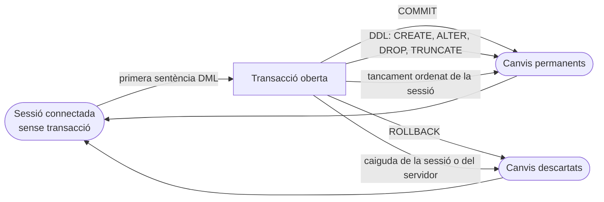
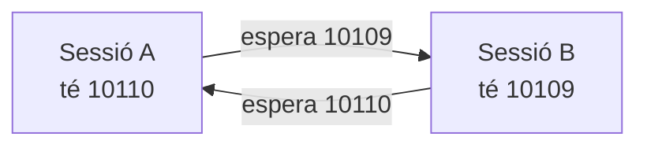

# UD08 · Manipulació de dades, transaccions i concurrència

## Resum del tema

Fins ací hem **dissenyat** (UD02 a UD04), **implementat** l'estructura (UD05) i **consultat** les dades (UD06 i UD07). En esta unitat aprenem a **modificar** el contingut de la base de dades: donar d'alta, canviar i esborrar files, carregar en una taula el resultat d'una consulta i fusionar dades que arriben d'un fitxer extern.

Una consulta mal escrita torna un resultat incorrecte: es corregix i es torna a executar. Una modificació mal escrita **destruïx informació real**, i el SGBD no demana confirmació. Per això la segona meitat de la unitat no tracta de sentències noves, sinó de la xarxa de seguretat que les envolta: la **transacció**. Una transacció permet agrupar diverses modificacions perquè s'apliquen **totes o cap**, desfer-les si alguna cosa va mal i aïllar el nostre treball del de les altres persones que estan usant la base de dades en eixe mateix moment.

La unitat reutilitza intensament el que s'ha après a la UD07: dins d'un `UPDATE` o d'un `DELETE` escriurem les mateixes composicions i subconsultes que usàvem al `SELECT`. I prepara la UD09: quan un guió de manteniment es repetix cada curs, deixa de ser un fitxer `.sql` i es convertix en un **procediment emmagatzemat** amb control d'errors.

Tots els exemples s'executen sobre l'esquema de referència **EDUGEST** carregat amb els [scripts del projecte](/guia/proyecto-edugest#4-scripts-descarregables) i sobre les seues dades del curs 2025-26 (32 alumnes, 143 matrícules, 46 faltes). Cada exemple indica el nombre de files afectades que has d'obtindre.



### Objectius d'aprenentatge

En acabar esta unitat seràs capaç de:

- Identificar les eines i les sentències que modifiquen el contingut d'una base de dades.
- Inserir, modificar i esborrar files amb SQL comprovant sempre el nombre de files afectades.
- Escriure modificacions les condicions i valors de les quals provenen d'altres taules mitjançant subconsultes.
- Bolcar en una taula el resultat d'una consulta i fusionar dades externes amb `MERGE`.
- Explicar què és una transacció i les quatre propietats ACID sobre un cas real.
- Confirmar i desfer, total o parcialment, els canvis d'una transacció amb `COMMIT`, `ROLLBACK` i `SAVEPOINT`.
- Reconéixer els problemes de l'accés concurrent i els efectes de les polítiques de bloqueig d'Oracle.
- Diagnosticar i previndre esperes per bloqueig i interbloquejos.
- Dissenyar guions de manteniment transaccionals, verificables i repetibles.

### Temporalització

La unitat ocupa **9 hores d'aula** (5 de teoria i 4 de pràctica). És la unitat més
curta del curs en relació amb la seua importància professional: aprofita les sessions
pràctiques, que requerixen **dues sessions d'Oracle obertes alhora**.


items:
  - {h: 2, tipo: T, t: "DML: INSERT, UPDATE, DELETE i TRUNCATE", ref: "§1 a §4"}
  - {h: 1, tipo: P, t: "Altes, canvis i baixes en EduGest", ref: "Pràctica 8.1"}
  - {h: 1, tipo: T, t: "INSERT … SELECT i MERGE", ref: "§5"}
  - {h: 1, tipo: P, t: "Còpies, històrics i càrrega de notes amb MERGE", ref: "Pràctiques 8.2 i 8.6"}
  - {h: 1, tipo: T, t: "Transaccions, ACID i SAVEPOINT", ref: "§6 i §7 · laboratori de transaccions"}
  - {h: 1, tipo: P, t: "Laboratori de transaccions", ref: "Pràctica 8.4"}
  - {h: 1, tipo: T, t: "Concurrència, bloquejos, interbloquejos i restriccions diferides", ref: "§8 a §10"}
  - {h: 1, tipo: P, t: "Dues sessions, una dada: concurrència i bloquejos", ref: "Pràctica 8.5"}
autonomo:
  - "Pràctica 8.3 (modificacions amb subconsultes)"
  - "Pràctica 8.7 (repte: guió de promoció de curs)"
  - "Projecte EduGest · UD08 (guions de manteniment)"


> [!IMPORTANT]
> Estudia esta unitat amb **dues sessions d'Oracle obertes**. La meitat dels conceptes (bloquejos, esperes, interbloquejos, consistència de lectura) només s'entenen veient com una sessió afecta l'altra. I adquirix des d'hui un reflex professional: **abans de cada `UPDATE` o `DELETE`, executa el `SELECT` amb el mateix `WHERE`**. Si el `SELECT` no torna exactament el que esperes, la modificació tampoc ho farà.

---

DML: INSERT, UPDATE, DELETE i TRUNCATE

## 1. Modificar dades: eines i responsabilitat

### 1.1 El llenguatge de manipulació de dades

El **DML** (*Data Manipulation Language*) és la part de SQL que treballa amb el **contingut** de les taules, no amb la seua estructura:

| Sentència | Què fa | Unitat |
|---|---|---|
| `SELECT` | Consulta files (no les modifica) | UD06, UD07 |
| `INSERT` | Afig files noves | §2, §5 |
| `UPDATE` | Canvia valors de files existents | §3 |
| `DELETE` | Elimina files | §4 |
| `MERGE` | Inserix, actualitza o esborra segons si la fila existix | §5 |

Al seu costat està el **TCL** (*Transaction Control Language*): `COMMIT`, `ROLLBACK`, `SAVEPOINT` i `SET TRANSACTION`, que decidixen **quan** els canvis es tornen definitius (§6 i §7).

### 1.2 Per què una modificació és més perillosa que una consulta

Compara estes dues sentències, que es diferencien en una sola paraula:

```sql
SELECT * FROM matricula WHERE id_alumno = 7;   -- 5 files: informació
DELETE FROM matricula WHERE id_alumno = 7;     -- 5 files: menys informació
```

Un `SELECT` equivocat **no deixa rastre**. Un `DELETE` equivocat:

- no demana confirmació: Oracle executa exactament el que li demanes;
- pot arrossegar files d'altres taules per les claus alienes `ON DELETE CASCADE` (§4.5);
- si una altra persona executa un `COMMIT` des de la seua eina gràfica, es torna **irreversible**;
- i en una taula gran pot tardar prou perquè bloquege tota l'aplicació (§8).

L'error més car de tots és també el més fàcil de cometre: **oblidar el `WHERE`**.

```sql
UPDATE matricula SET nota_final = 5;   -- 143 files: totes les notes del centre a 5
```

> [!CAUTION]
> `UPDATE` i `DELETE` **sense `WHERE`** afecten **totes** les files de la taula. No és un error de sintaxi, així que Oracle no avisa: és SQL perfectament vàlid. En un servidor de producció, este descuit és un incident que es comunica a direcció.

### 1.3 La regla professional: primer el SELECT

Abans d'escriure una modificació, escriu la consulta que **selecciona les mateixes files** i comprova que són les que creus:

```sql
-- 1. Quines files vaig a esborrar? (comprovació prèvia)
SELECT id_falta, id_matricula, fecha, horas, justificada
FROM   falta_asistencia
WHERE  justificada = 'S'
AND    fecha < DATE '2025-11-01'
ORDER  BY id_falta;
```



| ID_FALTA | ID_MATRICULA | FECHA | HORAS | JUSTIFICADA |
|---|---|---|---|---|
| 1 | 10060 | 31/10/2025 | 2 | S |
| 17 | 10136 | 10/10/2025 | 1 | S |
| 31 | 10143 | 29/10/2025 | 1 | S |
| 36 | 10129 | 29/09/2025 | 1 | S |
| 39 | 10099 | 18/09/2025 | 1 | S |

*5 files*

```sql
-- 2. La modificació, amb el MATEIX WHERE
DELETE FROM falta_asistencia
WHERE  justificada = 'S'
AND    fecha < DATE '2025-11-01';
-- 5 files suprimides

-- 3. Comprovació posterior
SELECT COUNT(*) FROM falta_asistencia;   -- 41 (eren 46)
```

Si el nombre de files afectades **no coincidix** amb el de la comprovació prèvia, no confirmes: fes `ROLLBACK` i revisa la condició.

> [!TIP]
> Converteix un `SELECT` en `DELETE` sense reescriure res: escriu primer el `SELECT ... FROM ... WHERE ...`, prova'l i després substituïx només `SELECT lista FROM` per `DELETE FROM`. Per a un `UPDATE`, mantín el `WHERE` intacte i afig el `SET`. És la forma més fiable de no equivocar-se en la condició.

### 1.4 Eines

El criteri RA4.a demana identificar les **eines i sentències** per a modificar dades. A Oracle les habituals són:

| Eina | Com es modifiquen les dades | Què has de vigilar |
|---|---|---|
| **Full de treball SQL** (SQL Developer, VS Code amb *Oracle SQL Developer Extension*) | Escrivint DML i executant amb `Ctrl+Intro` | L'estat de l'*autoconfirmació* i el comptador de files afectades |
| **Pestanya *Dades*** d'una taula (edició en reixeta) | Escrivint directament sobre les cel·les, com en un full de càlcul; `F11` confirma, `F12` desfà | Que l'eina genera DML per tu: revisa'l al *Log de sentències* |
| **Assistent d'importació** (*Importar dades* des de CSV o Excel) | Genera `INSERT` o càrrega per lots | El tipus de cada columna i les files rebutjades |
| **SQLcl / SQL\*Plus** | Guions `.sql` executats amb `@fichero` | `WHENEVER SQLERROR`, `SPOOL` i el `COMMIT` explícit |
| **Data Pump** (`expdp`, `impdp`) | Càrrega i descàrrega massiva d'esquemes complets | És una operació d'administració, no d'ús diari |

L'edició en reixeta és còmoda per a corregir una dada puntual, però **no és traçable**: ningú pot revisar-la, repetir-la en un altre servidor ni posar-la sota control de versions. Tot canvi que forme part d'un procediment del centre ha d'estar en un guió `.sql` (§11).

> [!WARNING]
> **Desactiva l'autoconfirmació.** En SQL Developer: *Eines → Preferències → Base de dades → Full de treball → Confirmació automàtica*. Amb l'autoconfirmació activada, cada sentència es confirma sola i **`ROLLBACK` deixa de servir-te de res**: perds la xarxa de seguretat just quan més la necessites. En SQLcl es comprova amb `SHOW AUTOCOMMIT` i es desactiva amb `SET AUTOCOMMIT OFF`.

### 1.5 Entorn de proves i còpia prèvia

| Abans de modificar… | Pregunta't |
|---|---|
| A quina base de dades estic connectat? | `SELECT sys_context('USERENV','DB_NAME'), user FROM dual;` |
| Tinc una còpia de les files que vaig a tocar? | `CREATE TABLE bak_matricula AS SELECT * FROM matricula;` (§5.2) |
| He provat el guió en un entorn de proves? | Mai estrenes un guió en producció |
| Puc desfer-ho? | Mentre no hi haja `COMMIT`, sí; després, només amb la còpia o amb *Flashback* |
| L'ha revisat una altra persona? | En canvis massius, la revisió per parells evita incidents |

{}
Oracle oferix **Flashback Query**, que consulta l'estat passat d'una taula mentre la informació de desfer (*undo*) continue disponible:

```sql
SELECT * FROM matricula AS OF TIMESTAMP SYSTIMESTAMP - INTERVAL '10' MINUTE
WHERE  id_alumno = 7;
```

Amb eixa consulta es poden reinserir les files perdudes. També existix `FLASHBACK TABLE matricula TO TIMESTAMP ...`, que requerix `ROW MOVEMENT` activat i privilegis. **No és una còpia de seguretat**: depén de la grandària i la retenció del *tablespace* d'*undo* i, passat eixe temps, les dades ja no es poden recuperar (§7.5).
{}

---

## 2. Inserir files: `INSERT`

### 2.1 Finalitat i sintaxi

`INSERT` afig files a una taula. Té dues formes: una fila amb valors literals (`VALUES`) o tantes files com torne una consulta (`SELECT`, §5.1).

```text
INSERT INTO taula [(columna1, columna2, ...)]
VALUES (valor1, valor2, ...);
```

| Component | Significat |
|---|---|
| `INSERT INTO tabla` | Taula (o vista actualitzable) que rep la fila |
| `(columna1, ...)` | **Llista de columnes** que s'ompliran, en l'ordre que vulgues |
| `VALUES (...)` | Un valor per cada columna de la llista, en el mateix ordre i del tipus adequat |
| columnes omeses | Prenen el seu `DEFAULT` si en tenen i `NULL` si no |

### 2.2 Exemple senzill: amb llista de columnes



```sql
INSERT INTO alumno (nia, dni, nombre, apellidos, fecha_nacimiento,
                    email, localidad, cod_grupo)
VALUES ('10452001', '48123456J', 'Marina', 'López Ortega', DATE '2007-03-14',
        'marinalopez@alu.edugest.es', 'Alicante', '1DAM');
-- 1 fila creada

SELECT id_alumno, nia, nombre, apellidos, telefono, cod_grupo
FROM   alumno
WHERE  nia = '10452001';
```

| ID_ALUMNO | NIA | NOMBRE | APELLIDOS | TELEFONO | COD_GRUPO |
|---|---|---|---|---|---|
| 1001 | 10452001 | Marina | López Ortega | *(null)* | 1DAM |

*1 fila*

Fixa't en dos coses:

1. **No hem indicat `id_alumno`** i, tanmateix, la fila té el valor `1001`. És la **columna identitat** d'EduGest, declarada a la UD05 com `GENERATED BY DEFAULT ON NULL AS IDENTITY (START WITH 1001)`: Oracle genera l'identificador. Les dades d'exemple usen els números 1 a 32 perquè es van carregar amb identificadors explícits, i la seqüència interna continua en 1001.
2. **`telefono` ha quedat a `NULL`**, perquè no apareix a la llista de columnes i no té valor per defecte.

> [!IMPORTANT]
> En codi professional la **llista de columnes és obligatòria**, encara que SQL permeta ometre-la. Sense ella, l'`INSERT` depén de l'ordre físic de les columnes: el dia que algú afegisca una columna amb `ALTER TABLE`, totes les insercions de l'aplicació deixaran de funcionar o, pitjor, guardaran els valors en les columnes equivocades.

### 2.3 Sense llista de columnes

```sql
-- Vàlid, però fràgil: cal donar un valor per a TOTES les columnes, en el seu ordre exacte
INSERT INTO ciclo VALUES ('COME', 'Comercio Internacional', 'SUPERIOR', 2000);
-- 1 fila creada
```

Només és acceptable en guions de càrrega inicial generats automàticament, on l'ordre està garantit.

### 2.4 Valors per defecte, `DEFAULT` i `NULL`

La taula `MATRICULA` d'EduGest té tres columnes amb comportament propi: `id_matricula` (identitat des de 20001), `fecha_matricula` (`DEFAULT SYSDATE`) i `convocatoria` (`DEFAULT 1`).

```sql
INSERT INTO matricula (id_alumno, id_modulo, curso_academico)
VALUES (1001, 2, '2026-27');
-- 1 fila creada: id_matricula = 20001, fecha_matricula = hui,
--                convocatoria = 1, nota_final = NULL
```

| Forma d'escriure-ho | Resultat |
|---|---|
| Ometre la columna | S'aplica el `DEFAULT`; si no en té, `NULL` |
| `DEFAULT` com a valor | S'aplica el `DEFAULT` explícitament: `VALUES (..., DEFAULT, ...)` |
| `NULL` com a valor | Es guarda `NULL` **encara que la columna tinga `DEFAULT`**… |
| …excepte amb `DEFAULT ON NULL` | Llavors un `NULL` explícit també activa el valor per defecte |

```sql
-- convocatoria explícitament nul·la: ORA-01400, perquè la columna és NOT NULL
INSERT INTO matricula (id_alumno, id_modulo, curso_academico, convocatoria)
VALUES (1001, 3, '2026-27', NULL);
-- ORA-01400: cannot insert NULL into ("EDUGEST"."MATRICULA"."CONVOCATORIA")

-- Forma correcta de demanar el valor per defecte
INSERT INTO matricula (id_alumno, id_modulo, curso_academico, convocatoria)
VALUES (1001, 3, '2026-27', DEFAULT);
-- 1 fila creada: convocatoria = 1
```

> [!WARNING]
> `DEFAULT` i `NULL` no són equivalents. `DEFAULT SYSDATE` només actua si la columna **no apareix** a l'`INSERT`. Si escrius `NULL`, Oracle guarda el nul i, si la columna és `NOT NULL`, la sentència falla amb **ORA-01400**. Recorda a més que en Oracle la cadena buida `''` **és** `NULL` (UD05): `VALUES (..., '')` en una columna obligatòria produïx el mateix ORA-01400.

### 2.5 Buscar la clau aliena amb una subconsulta

Escriure `id_modulo = 2` funciona, però obliga a conéixer de memòria els identificadors artificials. És més robust obtindre'ls de les dades:

```sql
INSERT INTO matricula (id_alumno, id_modulo, curso_academico, fecha_matricula)
VALUES ((SELECT id_alumno FROM alumno WHERE nia = '10452001'),
        (SELECT id_modulo FROM modulo WHERE codigo = '0484' AND cod_ciclo = 'DAM'),
        '2026-27', DATE '2026-09-10');
-- 1 fila creada
```

Les dues subconsultes són **escalars**: han de tornar exactament una fila i una columna. Si en tornaren diverses, Oracle donaria `ORA-01427: single-row subquery returns more than one row`. Per això és important que `(codigo, cod_ciclo)` siga una clau alternativa `UNIQUE` del disseny (UD05).

### 2.6 Inserir diverses files d'una vegada: `INSERT ALL`

SQL estàndard permet `INSERT INTO t (...) VALUES (...), (...), (...)`, però **Oracle no admet eixa sintaxi**. El seu equivalent és `INSERT ALL`:



```sql
-- Tres faltes d'assistència en una sola sentència
INSERT ALL
    INTO falta_asistencia (id_matricula, fecha, horas)
         VALUES (10110, DATE '2026-03-02', 2)
    INTO falta_asistencia (id_matricula, fecha, horas)
         VALUES (10110, DATE '2026-03-09', 1)
    INTO falta_asistencia (id_matricula, fecha, horas)
         VALUES (10109, DATE '2026-03-10', 3)
SELECT * FROM dual;
-- 3 files creades
```

La clàusula `SELECT * FROM dual` és obligatòria: `INSERT ALL` és en realitat una **inserció multitaula** alimentada per una consulta, i `DUAL` aporta l'única fila que necessita. Com que és **una sola sentència**, si una de les tres files incompleix una restricció, **cap** s'insereix (§6.3).

> [!NOTE]
> En MySQL i PostgreSQL l'equivalent és `INSERT INTO t (c1, c2) VALUES (1, 'a'), (2, 'b');`. És una de les diferències de dialecte que cal tindre presents en portar un guió.

### 2.7 Recuperar la clau generada: `RETURNING … INTO`

Quan la clau primària la genera Oracle, l'aplicació necessita conéixer-la per a inserir les files filles. La clàusula `RETURNING` torna valors de la fila recentment inserida; requerix un context PL/SQL (una variable on guardar-los), així que s'usa des d'un bloc o des d'una variable d'enllaç del client:



```sql
VARIABLE v_id NUMBER

BEGIN
    INSERT INTO alumno (nia, nombre, apellidos, fecha_nacimiento, cod_grupo)
    VALUES ('10452002', 'Hugo', 'Server Lledó', DATE '2007-01-09', '1DAW')
    RETURNING id_alumno INTO :v_id;
END;
/

PRINT v_id
-- V_ID
-- ----
-- 1002

-- Ara ja es pot matricular sense tornar a consultar la taula
INSERT INTO matricula (id_alumno, id_modulo, curso_academico)
VALUES (:v_id, 12, '2026-27');
```

L'alternativa artesanal (`SELECT MAX(id_alumno) FROM alumno`) **és incorrecta** tan prompte hi ha dues sessions inserint alhora: l'altra sessió pot haver inserit la seua fila entre el teu `INSERT` i el teu `SELECT`. A la UD09 veuràs la mateixa idea dins d'un procediment emmagatzemat.

### 2.8 Errors habituals de l'`INSERT`

| Error d'Oracle | Significat | Causa típica a EduGest |
|---|---|---|
| `ORA-00001: unique constraint (EDUGEST.UQ_MATRICULA) violated` | Clau primària o única repetida | Matricular dos voltes el mateix alumne en el mateix mòdul i curs |
| `ORA-01400: cannot insert NULL into (...)` | Falta un valor obligatori | Oblidar `nia`, `fecha_nacimiento` o escriure `''` |
| `ORA-02291: integrity constraint (EDUGEST.FK_MATRICULA_MODULO) violated - parent key not found` | La fila pare no existix | `id_modulo = 99`, o inserir la matrícula abans que l'alumne |
| `ORA-02290: check constraint (EDUGEST.CK_MATRICULA_CURSO) violated` | Incompleix un `CHECK` | `curso_academico = '2026/27'` en lloc de `'2026-27'` |
| `ORA-12899: value too large for column "EDUGEST"."ALUMNO"."NIA" (actual: 9, maximum: 8)` | Text més llarg que la columna | NIA de 9 xifres en una columna `CHAR(8)` |
| `ORA-01438: value larger than specified precision allowed for this column` | Número amb massa dígits enters | `nota_final = 100` en `NUMBER(4,2)` |
| `ORA-00947: not enough values` / `ORA-00913: too many values` | La llista de columnes i la de valors no coincidixen | Afegir una columna i oblidar el seu valor |
| `ORA-01858: a non-numeric character was found where a numeric was expected` | Conversió implícita de data fallida | `'14/03/2007'` amb un altre `NLS_DATE_FORMAT`; usa `DATE '2007-03-14'` |


- q: "Quin valor tindrà `convocatoria` després de `INSERT INTO matricula (id_alumno, id_modulo, curso_academico) VALUES (1001, 2, '2026-27')`?"
  options: ["`NULL`, perquè no s'indica", "1, pel `DEFAULT 1` de la columna", "0, perquè és numèrica", "Error ORA-01400"]
  answer: 1
  explain: "En ometre la columna s'aplica el seu `DEFAULT`. Si en lloc d'ometre-la escriguérem `NULL` explícitament sí que tindríem ORA-01400, perquè la columna és `NOT NULL` i el seu `DEFAULT` no és `ON NULL`."
- q: "Per què `INSERT INTO alumno VALUES ('10452003', ...)` és una mala pràctica encara que funcione?"
  options: ["Perquè Oracle no ho admet", "Perquè depén de l'ordre físic de les columnes i es trenca en canviar la taula", "Perquè no permet inserir dates", "Perquè sempre genera ORA-00947"]
  answer: 1
  explain: "Sense llista de columnes l'`INSERT` queda lligat a l'ordre del `CREATE TABLE`. Un `ALTER TABLE ... ADD` posterior el trenca, o —molt pitjor— guarda les dades en columnes equivocades sense donar error."


---

## 3. Modificar files: `UPDATE`

### 3.1 Finalitat i sintaxi

`UPDATE` canvia els valors d'una o més columnes en les files que complixen una condició.

```text
UPDATE taula
SET    columna1 = expressió1,
       columna2 = expressió2, ...
[WHERE condició];
```

| Component | Significat |
|---|---|
| `SET columna = expresión` | Nou valor. L'expressió pot usar columnes de **la pròpia fila**, funcions i subconsultes |
| `WHERE condición` | Files que es modifiquen. **Si falta, es modifiquen totes** |
| files afectades | El client informa: *«n files actualitzades»*. Comprova-ho sempre |

### 3.2 Exemple senzill i diverses columnes alhora



```sql
-- Una columna d'una fila
UPDATE alumno
SET    telefono = '612345678'
WHERE  id_alumno = 1001;
-- 1 fila actualitzada

-- Diverses columnes en una sola sentència (millor que dos UPDATE seguits)
UPDATE alumno
SET    localidad = 'Elche',
       email     = 'marinalopez@alu.edugest.es',
       cod_grupo = '1DAW'
WHERE  nia = '10452001';
-- 1 fila actualitzada
```

Les assignacions del `SET` s'avaluen **totes sobre els valors anteriors** de la fila: l'ordre en què les escrius no importa i no es «veuen» entre elles.

### 3.3 Expressions que usen el valor anterior

Esta és la diferència essencial entre decidir el valor **dins** o **fora** de la base de dades (hi tornarem en §8.4):

```sql
-- Comprovació prèvia
SELECT id_modulo, codigo, nombre, horas
FROM   modulo
WHERE  cod_ciclo = 'DAW' AND curso = 2
ORDER  BY id_modulo;
```

| ID_MODULO | CODIGO | NOMBRE | HORAS |
|---|---|---|---|
| 16 | 0612 | Desarrollo web en entorno cliente | 140 |
| 17 | 0613 | Desarrollo web en entorno servidor | 160 |
| 18 | 0614 | Despliegue de aplicaciones web | 80 |
| 19 | 0615 | Diseño de interfaces web | 120 |

*4 files*

```sql
-- Pujada del 10 % de les hores, arredonida a l'enter
UPDATE modulo
SET    horas = ROUND(horas * 1.1)
WHERE  cod_ciclo = 'DAW' AND curso = 2;
-- 4 files actualitzades
```

| ID_MODULO | CODIGO | HORAS |
|---|---|---|
| 16 | 0612 | 154 |
| 17 | 0613 | 176 |
| 18 | 0614 | 88 |
| 19 | 0615 | 132 |

*4 files*

```sql
-- Un altre exemple: pujar 0,25 a les notes del mòdul 0615 de DAW
UPDATE matricula
SET    nota_final = nota_final + 0.25
WHERE  id_modulo = 19;
-- 5 files actualitzades
```

| ID_MATRICULA | ANTES | DESPUÉS |
|---|---|---|
| 10102 | 9.25 | 9.5 |
| 10106 | 4.25 | 4.5 |
| 10110 | 7 | 7.25 |
| 10114 | 7.25 | 7.5 |
| 10118 | 6 | 6.25 |

*5 files*

> [!WARNING]
> Si alguna fila tinguera `nota_final` a `NULL`, `NULL + 0.25` seria `NULL` (UD06): la fila s'«actualitzaria» a nul sense error. Protegix-te amb `WHERE nota_final IS NOT NULL` o amb `NVL`. I recorda que `nota_final + 0.25` no pot superar 10: la restricció `CK_MATRICULA_NOTA` ho rebutjaria amb ORA-02290.

### 3.4 `UPDATE` amb subconsulta al `SET`

L'expressió d'un `SET` pot ser una **subconsulta escalar**. Així es porten valors d'altres taules sense escriure identificadors a mà:

```sql
-- Assignar com a tutor de 2ASIR l'únic professor d'Informàtica que no impartix classe
UPDATE grupo
SET    id_tutor = (SELECT p.id_profesor
                   FROM   profesor p
                   WHERE  p.id_departamento = 1
                   AND    NOT EXISTS (SELECT 1 FROM imparte i
                                      WHERE  i.id_profesor = p.id_profesor))
WHERE  cod_grupo = '2ASIR';
-- 1 fila actualitzada

SELECT g.cod_grupo, p.nombre || ' ' || p.apellidos AS tutor
FROM   grupo g JOIN profesor p ON p.id_profesor = g.id_tutor
WHERE  g.cod_grupo = '2ASIR';
```

| COD_GRUPO | TUTOR |
|---|---|
| 2ASIR | Pablo Lillo Martí |

*1 fila*

> [!CAUTION]
> Si la subconsulta del `SET` **no torna cap fila**, no dona error: torna `NULL` i la columna es posa a nul. És una forma silenciosa d'esborrar dades. Afig sempre al `WHERE` una condició que garantisca que la subconsulta troba alguna cosa, per exemple `WHERE EXISTS (…)`.

La forma **correlacionada** copia, fila a fila, un valor d'una altra taula. És el patró de restauració des d'una còpia:

```sql
UPDATE matricula m
SET    nota_final = (SELECT b.nota_final FROM bak_matricula b
                     WHERE  b.id_matricula = m.id_matricula)
WHERE  EXISTS        (SELECT 1 FROM bak_matricula b
                      WHERE  b.id_matricula = m.id_matricula);
-- 143 files actualitzades
```

Oracle admet a més actualitzar **diverses columnes amb una sola subconsulta**:

```sql
UPDATE matricula m
SET   (nota_final, convocatoria) = (SELECT b.nota_final, b.convocatoria
                                    FROM   bak_matricula b
                                    WHERE  b.id_matricula = m.id_matricula)
WHERE  m.curso_academico = '2025-26';
```

### 3.5 `UPDATE` amb subconsulta al `WHERE`

La condició també pot dependre d'altres taules. Ací la sintaxi és la mateixa que ja coneixes de la UD07:

```sql
-- Pujar a 5 les notes de Bases de dades de DAM compreses en [4,5 , 5)
SELECT id_matricula, id_alumno, nota_final          -- comprovació prèvia
FROM   matricula
WHERE  nota_final >= 4.5 AND nota_final < 5
AND    id_modulo = (SELECT id_modulo FROM modulo
                    WHERE  codigo = '0484' AND cod_ciclo = 'DAM');
```

| ID_MATRICULA | ID_ALUMNO | NOTA_FINAL |
|---|---|---|
| 10002 | 1 | 4.75 |
| 10007 | 2 | 4.75 |

*2 files*

```sql
UPDATE matricula
SET    nota_final = 5
WHERE  nota_final >= 4.5 AND nota_final < 5
AND    id_modulo = (SELECT id_modulo FROM modulo
                    WHERE  codigo = '0484' AND cod_ciclo = 'DAM');
-- 2 files actualitzades
```

Amb `IN` o `EXISTS` s'arriba a taules més llunyanes. Les faltes no guarden l'alumne: cal passar per la matrícula.

```sql
-- Justificar totes les faltes de Martina Alemany Vidal
UPDATE falta_asistencia
SET    justificada = 'S'
WHERE  id_matricula IN (SELECT m.id_matricula
                        FROM   matricula m JOIN alumno a ON a.id_alumno = m.id_alumno
                        WHERE  a.apellidos = 'Alemany Vidal' AND a.nombre = 'Martina');
-- 3 files actualitzades
```

| ID_FALTA | ID_MATRICULA | FECHA | JUSTIFICADA (abans) | JUSTIFICADA (després) |
|---|---|---|---|---|
| 2 | 10045 | 25/02/2026 | N | S |
| 12 | 10044 | 29/04/2026 | N | S |
| 33 | 10044 | 11/03/2026 | S | S |

*3 files*

{}
Perquè el `WHERE` no exclou les ja justificades: Oracle actualitza les tres i compta tres files afectades, encara que en una d'elles el valor nou coincidisca amb el vell. Si afigs `AND justificada = 'N'` s'actualitzen **2 files** i el resultat final és idèntic.

La versió amb `AND justificada = 'N'` és preferible per tres raons: el recompte reflectix el treball real, s'escriu menys informació en el fitxer de *redo* i es bloquegen menys files (§8.3). És el mateix criteri que aplicarem al `MERGE` en §5.4.
{}

### 3.6 Errors habituals de l'`UPDATE`

```sql
-- Posar a NULL una columna obligatòria
UPDATE alumno SET nia = NULL WHERE id_alumno = 1001;
-- ORA-01407: cannot update ("EDUGEST"."ALUMNO"."NIA") to NULL

-- Canviar una clau primària que té files filles
UPDATE grupo SET cod_grupo = '1DAM-A' WHERE cod_grupo = '1DAM';
-- ORA-02292: integrity constraint (EDUGEST.FK_ALUMNO_GRUPO) violated
--            - child record found
```

| Error | Significat |
|---|---|
| `ORA-01407` | `UPDATE` que posa a `NULL` una columna `NOT NULL` |
| `ORA-02290` | El nou valor incompleix un `CHECK` (`nota_final = 11`) |
| `ORA-02291` | El nou valor d'una clau aliena no existix en la taula pare |
| `ORA-02292` | Es modifica una clau referenciada que té files filles |
| `ORA-01438` / `ORA-12899` | El nou valor no cap en el tipus de la columna |
| `ORA-01722: invalid number` | Comparació o assignació entre text i número |

> [!IMPORTANT]
> **Oracle no implementa `ON UPDATE CASCADE`.** En la definició d'una clau aliena només admet `ON DELETE CASCADE` i `ON DELETE SET NULL`. Si necessites canviar el valor d'una clau primària referenciada tens tres opcions:
>
> 1. **No necessitar-ho**: usa claus primàries artificials i immutables (és el que fa EduGest amb `id_alumno`, `id_modulo` o `id_matricula`). Un identificador que mai canvia no cal propagar-lo.
> 2. Fer-ho **en una transacció** amb la restricció declarada `DEFERRABLE INITIALLY DEFERRED` (§10): s'actualitza el pare, s'actualitzen els fills i la comprovació s'ajorna al `COMMIT`.
> 3. Desactivar la restricció (`ALTER TABLE ... DISABLE CONSTRAINT`), actualitzar i tornar a activar-la. És l'opció menys recomanable: durant eixe interval la base de dades admet dades inconsistents, i l'`ENABLE` fallarà si queda alguna fila òrfena.

---

## 4. Esborrar files: `DELETE` i `TRUNCATE`

### 4.1 `DELETE`

```text
DELETE FROM taula [WHERE condició];
```

`DELETE` elimina files **completes**: no es pot «esborrar una columna» d'una fila (això és un `UPDATE` que posa `NULL`).

```sql
-- Baixa d'un professor que no impartix classe ni és tutor ni cap de departament
SELECT id_profesor, nombre, apellidos FROM profesor WHERE id_profesor = 108;
DELETE FROM profesor WHERE id_profesor = 108;
-- 1 fila suprimida
```

### 4.2 `DELETE` condicionat per una subconsulta

```sql
-- Esborrar les faltes d'una alumna concreta
DELETE FROM falta_asistencia
WHERE  id_matricula IN (SELECT m.id_matricula
                        FROM   matricula m JOIN alumno a ON a.id_alumno = m.id_alumno
                        WHERE  a.nia = '10450333');
-- 3 files suprimides
```

```sql
-- Esborrar les matrícules de mòduls que ja no s'ofereixen en el cicle
DELETE FROM matricula m
WHERE  NOT EXISTS (SELECT 1 FROM imparte i
                   WHERE  i.id_modulo = m.id_modulo
                   AND    i.curso_academico = m.curso_academico);
```

> [!TIP]
> `NOT EXISTS` és més segur que `NOT IN` quan la subconsulta pot tornar `NULL`: `x NOT IN (1, NULL)` mai és vertader i la sentència **no esborra res** sense avisar (UD06, lògica de tres valors). Si una sentència d'esborrat afecta 0 files quan n'esperaves diverses, eixe és el primer sospitós.

### 4.3 `DELETE` enfront de `TRUNCATE`

| | `DELETE FROM tabla` | `TRUNCATE TABLE tabla` |
|---|---|---|
| Subllenguatge | **DML** | **DDL** |
| Files que esborra | Les del `WHERE`, o totes | **Sempre totes** |
| Transaccional | Sí: `ROLLBACK` ho desfà | **No**: du `COMMIT` implícit |
| Disparadors (UD09) | Llança els `BEFORE/AFTER DELETE` | **No** els llança |
| Espai alliberat | Manté l'espai assignat a la taula | Allibera les extensions i baixa la *marca d'aigua* |
| Velocitat en taules grans | Lenta: escriu *undo* i *redo* fila a fila | Molt ràpida: no registra fila a fila |
| Claus alienes | Respecta `ON DELETE CASCADE` | **Falla** si hi ha FK actives apuntant a la taula |
| Torna a zero una identitat | No | Només amb `TRUNCATE TABLE t ... ` i `ALTER TABLE t MODIFY (id GENERATED ... START WITH 1)` |

```sql
TRUNCATE TABLE matricula;
-- ORA-02266: unique/primary keys in table referenced by enabled foreign keys
```

L'error apareix perquè `FALTA_ASISTENCIA` té una clau aliena activa cap a `MATRICULA`. Per a buidar-la caldria truncar primer la taula filla, o desactivar la restricció:

```sql
TRUNCATE TABLE falta_asistencia;   -- primer la filla
TRUNCATE TABLE matricula;          -- ara sí
```

> [!CAUTION]
> `TRUNCATE` **no es pot desfer**: és DDL i confirma la transacció en curs. Usa'l només per a buidar taules de treball, de càrrega o de prova, mai «perquè va més ràpid» en una taula amb dades reals. I recorda que, en ser DDL, també confirma qualsevol `INSERT` o `UPDATE` que tingueres pendent (§6.4).

### 4.4 Diferències amb `DROP`

| Sentència | Files | Estructura | Reversible? |
|---|---|---|---|
| `DELETE FROM t WHERE ...` | Algunes | Es manté | Sí, amb `ROLLBACK` |
| `DELETE FROM t` | Totes | Es manté | Sí, amb `ROLLBACK` |
| `TRUNCATE TABLE t` | Totes | Es manté | No |
| `DROP TABLE t` | Totes | Desapareix | Només des de la paperera (`FLASHBACK TABLE ... TO BEFORE DROP`) |
| `DROP TABLE t PURGE` | Totes | Desapareix | No |

### 4.5 Esborrat en cascada a EduGest

A la UD05 vam declarar dues claus alienes amb `ON DELETE CASCADE` i una amb `ON DELETE SET NULL`:

```sql
-- matricula
CONSTRAINT fk_matricula_alumno FOREIGN KEY (id_alumno)
    REFERENCES alumno (id_alumno) ON DELETE CASCADE
-- falta_asistencia
CONSTRAINT fk_falta_matricula FOREIGN KEY (id_matricula)
    REFERENCES matricula (id_matricula) ON DELETE CASCADE
-- grupo
CONSTRAINT fk_grupo_tutor FOREIGN KEY (id_tutor)
    REFERENCES profesor (id_profesor) ON DELETE SET NULL
```

Això convertix un `DELETE` d'una sola fila en un esborrat **en dos nivells**:


```sql
-- Comprovació prèvia: quantes files desapareixeran de cada taula?
SELECT 'matricula' AS tabla, COUNT(*) AS filas FROM matricula WHERE id_alumno = 1
UNION ALL
SELECT 'falta_asistencia', COUNT(*)
FROM   falta_asistencia f JOIN matricula m ON m.id_matricula = f.id_matricula
WHERE  m.id_alumno = 1;
```

| TABLA | FILAS |
|---|---|
| matricula | 5 |
| falta_asistencia | 3 |

*2 files*

```sql
DELETE FROM alumno WHERE id_alumno = 1;
-- 1 fila suprimida   (però han desaparegut 1 + 5 + 3 = 9 files)

SELECT COUNT(*) FROM matricula;          -- 138 (eren 143)
SELECT COUNT(*) FROM falta_asistencia;   --  43 (eren 46)
```

> [!CAUTION]
> El comptador del client diu **«1 fila suprimida»** perquè només compta les files de la taula a la qual has apuntat. Les 8 files esborrades en cascada **no es compten i no s'avisen**. Abans d'esborrar una fila pare, consulta sempre `USER_CONSTRAINTS` per a saber quines cascades existixen:
>
> ```sql
> SELECT table_name, constraint_name, delete_rule
> FROM   user_constraints
> WHERE  r_constraint_name = 'PK_ALUMNO';
> ```

El cas d'`ON DELETE SET NULL` és distint: no es perden files, es perd una referència.

```sql
DELETE FROM profesor WHERE id_profesor = 105;
-- ORA-02292: integrity constraint (EDUGEST.FK_IMPARTE_PROFESOR) violated
--            - child record found
```

La clau aliena d'`IMPARTE` **no** té regla d'esborrat, així que protegix el professor: cal reassignar abans les seues tres assignacions docents. Si ho férem i després l'esborràrem, la fila del grup `1ASIR` del qual és tutor **no s'esborraria**: el seu `id_tutor` passaria a `NULL`.

> [!IMPORTANT]
> **Criteri professional:** en un sistema de gestió acadèmica no s'esborra l'alumnat. Un expedient és un document amb valor administratiu i terminis legals de conservació. El correcte és la **baixa lògica**: afegir una columna `fecha_baja` i filtrar per ella a les vistes. El `DELETE` es reserva per a corregir errors de gravació recents.


- q: "S'executa `DELETE FROM alumno WHERE id_alumno = 1;` i el client informa d'«1 fila suprimida». Quantes files han desaparegut realment de la base de dades?"
  options: ["1", "6", "9, per les cascades de MATRICULA i FALTA_ASISTENCIA", "Cap fins al COMMIT"]
  answer: 2
  explain: "`ON DELETE CASCADE` propaga l'esborrat en dos nivells: 1 alumne + 5 matrícules + 3 faltes. El comptador només compta la taula indicada al `DELETE`. Els canvis existixen des del `DELETE`, encara que siguen reversibles fins al `COMMIT`."
- q: "Quina d'estes afirmacions sobre `TRUNCATE` és correcta en Oracle?"
  options: ["Es pot desfer amb `ROLLBACK` perquè esborra files", "Admet una clàusula `WHERE`", "És DDL: confirma la transacció en curs i no es pot desfer", "Llança els disparadors `AFTER DELETE`"]
  answer: 2
  explain: "`TRUNCATE` és DDL: du `COMMIT` implícit, no admet `WHERE` i no dispara *triggers* de fila. Eixa és precisament la raó per la qual és ràpid i per la qual és perillós."


---

INSERT … SELECT i MERGE

## 5. Inserir des de consultes i `MERGE`

El criteri RA4.c demana **incloure en una taula la informació resultant de l'execució d'una consulta**. És una operació quotidiana: còpies de seguretat, històrics, taules de resum per a informes i càrregues de dades que arriben d'un altre sistema.

### 5.1 `INSERT … SELECT`

```text
INSERT INTO taula_destí (columnes)
SELECT  expressions
FROM    ...;
```

La consulta pot ser tan complexa com vulgues (composicions, agrupacions, subconsultes), però ha de tornar **tantes columnes com les de la llista, en el mateix ordre i amb tipus compatibles**. La taula destí **ha d'existir**.



```sql
-- Taula d'històric, amb el seu propi disseny desnormalitzat per a consulta ràpida
CREATE TABLE historico_nota (
    curso_academico  CHAR(7),
    nia              CHAR(8),
    alumno           VARCHAR2(130),
    cod_ciclo        VARCHAR2(5),
    cod_modulo       CHAR(4),
    nota_final       NUMBER(4,2),
    fecha_archivo    DATE DEFAULT SYSDATE,
    CONSTRAINT pk_historico_nota PRIMARY KEY (curso_academico, nia, cod_ciclo, cod_modulo)
);

INSERT INTO historico_nota (curso_academico, nia, alumno, cod_ciclo, cod_modulo, nota_final)
SELECT m.curso_academico,
       a.nia,
       a.apellidos || ', ' || a.nombre,
       mo.cod_ciclo,
       mo.codigo,
       m.nota_final
FROM   matricula m
       JOIN alumno a  ON a.id_alumno  = m.id_alumno
       JOIN modulo mo ON mo.id_modulo = m.id_modulo
WHERE  m.curso_academico = '2025-26';
-- 143 files creades

COMMIT;
```

La clau primària de l'històric fa el procés **segur davant de repeticions**: si algú executa l'arxivat dos voltes, la segona falla amb `ORA-00001` en lloc de duplicar el curs sencer. Inclou `cod_ciclo` perquè el mòdul `0484` existix en DAM i en DAW: sense ell, dues files distintes tindrien la mateixa clau.

### 5.2 `CREATE TABLE … AS SELECT` (CTAS)

Quan la taula destí **no existix encara**, Oracle pot crear-la i omplir-la en una sola sentència:

```sql
-- Còpia de seguretat ràpida abans d'un canvi delicat
CREATE TABLE bak_matricula AS SELECT * FROM matricula;
SELECT COUNT(*) FROM bak_matricula;   -- 143
```

| Què copia CTAS | Què **no** copia |
|---|---|
| Noms, tipus i grandàries de les columnes | Clau primària, `UNIQUE`, claus alienes i `CHECK` |
| Les restriccions `NOT NULL` | Els valors `DEFAULT` |
| Les dades que torna el `SELECT` | Índexs, disparadors, comentaris i privilegis |

```sql
CREATE TABLE bak_matricula_vacia AS SELECT * FROM matricula WHERE 1 = 0;  -- només estructura
```

> [!WARNING]
> `CREATE TABLE ... AS SELECT` és **DDL**: confirma implícitament la transacció en curs. Per això **mai** ha d'aparéixer enmig d'un guió transaccional: fes les còpies **abans** d'obrir la transacció (§11). Una còpia CTAS tampoc és una còpia de seguretat del sistema: viu en la mateixa base de dades i desapareix amb ella. Per a això estan Data Pump i RMAN (UD05).

### 5.3 Taules de resum

```sql
CREATE TABLE resumen_modulo (
    id_modulo    NUMBER(5)  CONSTRAINT pk_resumen_modulo PRIMARY KEY,
    matriculas   NUMBER(5)  CONSTRAINT nn_resumen_matriculas NOT NULL,
    aprobadas    NUMBER(5),
    media        NUMBER(4,2),
    calculado    DATE DEFAULT SYSDATE,
    CONSTRAINT fk_resumen_modulo FOREIGN KEY (id_modulo) REFERENCES modulo (id_modulo)
);

INSERT INTO resumen_modulo (id_modulo, matriculas, aprobadas, media)
SELECT id_modulo,
       COUNT(*),
       COUNT(CASE WHEN nota_final >= 5 THEN 1 END),
       ROUND(AVG(nota_final), 2)
FROM   matricula
GROUP  BY id_modulo;
-- 24 files creades

SELECT * FROM resumen_modulo WHERE id_modulo BETWEEN 16 AND 19 ORDER BY id_modulo;
```

| ID_MODULO | MATRICULAS | APROBADAS | MEDIA |
|---|---|---|---|
| 16 | 5 | 4 | 6.38 |
| 17 | 5 | 5 | 5.8 |
| 18 | 5 | 2 | 4.9 |
| 19 | 5 | 4 | 6.75 |

*4 files*

> [!NOTE]
> El mòdul 16 té 5 matrícules però la seua mitjana es calcula amb **4 notes**: `AVG` ignora els nuls, mentre que `COUNT(*)` els compta (UD07). La mitjana exacta és 6,375 i `ROUND(..., 2)` la deixa en **6,38**, perquè Oracle arredoneix el 5 cap amunt en valor absolut. Documenta sempre al diccionari què significa cada columna d'un resum:
> `COMMENT ON COLUMN resumen_modulo.media IS 'Media de las notas no nulas';`
>
> Una **vista materialitzada** (`CREATE MATERIALIZED VIEW ... REFRESH ON DEMAND`) fa el mateix i a més sap refrescar-se sola. Les taules de resum fetes a mà continuen sent útils quan el càlcul és complex o ha de quedar «congelat».

### 5.4 `MERGE`: inserir, actualitzar o esborrar en una sola sentència

`MERGE` (SQL estàndard des de SQL:2003) resol el problema de l'**«insereix si no existix, actualitza si existix»**, conegut com *upsert*. És la sentència natural per a **carregar dades que arriben de fora**: un CSV de notes, un fitxer de matrícula de la conselleria, una exportació d'una altra aplicació.

```text
MERGE INTO taula_destí alias
USING  origen alias_origen            -- taula, vista o subconsulta
ON    (condició d'emparellament)
WHEN MATCHED THEN
     UPDATE SET columna = valor, ...
     [DELETE WHERE condició]
WHEN NOT MATCHED THEN
     INSERT (columnes) VALUES (valors);
```

| Clàusula | Què fa |
|---|---|
| `USING` | D'on vénen les dades noves. Sol ser una subconsulta |
| `ON (...)` | Com es decidix si una fila de l'origen **ja existix** en el destí. Les seues columnes **no es poden modificar** |
| `WHEN MATCHED` | Què fer amb les que existixen: `UPDATE` (opcionalment amb el seu propi `WHERE`) |
| `DELETE WHERE` | Esborra, **després** d'aplicar l'`UPDATE`, les files que complisquen la condició |
| `WHEN NOT MATCHED` | Què fer amb les que no existixen: `INSERT` |

Les dues clàusules `WHEN` són opcionals, però almenys una ha d'aparéixer.

#### Cas real: carregar les notes d'un fitxer

El professorat de Bases de dades de DAW lliura les notes en un CSV. L'importem a una **taula de càrrega** (una taula temporal de treball, sense restriccions, l'únic fi de la qual és rebre el fitxer) i la fusionem.

```sql
CREATE TABLE carga_notas (
    nia   CHAR(8),
    nota  NUMBER(4,2)
);
-- S'omple amb l'assistent «Importar dades» de SQL Developer o amb SQL*Loader
```

| NIA | NOTA (del fitxer) | Nota actual a EduGest | Efecte del `MERGE` |
|---|---|---|---|
| 10450518 | 5.5 | 5 | s'actualitza |
| 10450555 | 6 | 6 | sense canvis |
| 10450592 | 7.25 | 5.5 | s'actualitza |
| 10450629 | 6 | 6 | sense canvis |
| 10450666 | 8 | 7.25 | s'actualitza |
| 10450777 | 5 | *(no està matriculada)* | incidència |

*6 files en el fitxer*

```sql
MERGE INTO matricula m
USING (SELECT mt.id_matricula, c.nota
       FROM   carga_notas c
              JOIN alumno a     ON a.nia        = c.nia
              JOIN matricula mt ON mt.id_alumno = a.id_alumno
              JOIN modulo mo    ON mo.id_modulo = mt.id_modulo
       WHERE  mo.codigo = '0484'
       AND    mo.cod_ciclo = 'DAW'
       AND    mt.curso_academico = '2025-26') o
ON (m.id_matricula = o.id_matricula)
WHEN MATCHED THEN
     UPDATE SET m.nota_final = o.nota
     WHERE  m.nota_final IS NULL OR m.nota_final <> o.nota;
-- 3 files fusionades
```

Resultats:

- **3 files fusionades**, no 5: el `WHERE` de la clàusula `UPDATE` descarta les dues notes que no han canviat. Sense eixe `WHERE` serien 5 files, amb el mateix resultat final però més treball, més *redo* i més files bloquejades.
- **Executar el `MERGE` per segona vegada fusiona 0 files.** Esta propietat es diu **idempotència** i és el que permet rellançar una càrrega interrompuda sense por (§11.3).
- El NIA `10450777` (Elena Carbonell, de 2DAW) **no apareix a l'origen**: la composició amb `MATRICULA` el descarta, perquè no està matriculada en eixe mòdul. El `MERGE` no l'insereix ni avisa, així que la incidència cal buscar-la a part:

```sql
-- Notes del fitxer que no s'han pogut aplicar
SELECT c.nia, c.nota
FROM   carga_notas c
WHERE  NOT EXISTS (SELECT 1
                   FROM   alumno a
                          JOIN matricula mt ON mt.id_alumno = a.id_alumno
                          JOIN modulo mo    ON mo.id_modulo = mt.id_modulo
                   WHERE  a.nia = c.nia
                   AND    mo.codigo = '0484' AND mo.cod_ciclo = 'DAW'
                   AND    mt.curso_academico = '2025-26');
```

| NIA | NOTA |
|---|---|
| 10450777 | 5 |

*1 fila*

> [!IMPORTANT]
> Una càrrega de dades externes **no acaba quan el `MERGE` acaba sense error**. Acaba quan has comprovat tres números: files del fitxer, files fusionades i files rebutjades. Si no sumen, hi ha informació que s'ha perdut en silenci. Deixa eixa comprovació escrita en el propi guió.

#### `MERGE` complet amb `INSERT` i `DELETE`

En un destí que pot créixer, les dues clàusules `WHEN` s'usen juntes. Així es refresca la taula de resum anterior sense tornar a crear-la:

```sql
MERGE INTO resumen_modulo r
USING (SELECT id_modulo,
              COUNT(*)                                    AS matriculas,
              COUNT(CASE WHEN nota_final >= 5 THEN 1 END) AS aprobadas,
              ROUND(AVG(nota_final), 2)                   AS media
       FROM   matricula
       GROUP  BY id_modulo) o
ON (r.id_modulo = o.id_modulo)
WHEN MATCHED THEN
     UPDATE SET r.matriculas = o.matriculas,
                r.aprobadas  = o.aprobadas,
                r.media      = o.media,
                r.calculado  = SYSDATE
     DELETE WHERE o.matriculas = 0
WHEN NOT MATCHED THEN
     INSERT (r.id_modulo, r.matriculas, r.aprobadas, r.media)
     VALUES (o.id_modulo, o.matriculas, o.aprobadas, o.media);
-- 24 files fusionades
```

`DELETE WHERE` actua **sobre les files ja emparellades i després de l'`UPDATE`**: ací eliminaria del resum els mòduls que s'hagueren quedat sense matrícules. No pot esborrar files que la clàusula `ON` no haja emparellat.

#### Quan `MERGE` és millor que dos sentències

| Situació | Solució recomanada |
|---|---|
| Cal decidir fila a fila si existix o no | `MERGE`: una sola passada, una sola transacció, un sol recorregut de l'origen |
| Només cal actualitzar el que existix | `UPDATE` amb subconsulta: més llegible |
| Només cal afegir el que falta | `INSERT … SELECT … WHERE NOT EXISTS` |
| L'origen pot tindre **claus repetides** | Cap de les dues: primer cal deduplicar l'origen |

```sql
-- Si el CSV porta dues notes distintes per al mateix NIA:
-- ORA-30926: unable to get a stable set of rows in the source tables
```

> [!WARNING]
> `ORA-30926` és l'error més habitual del `MERGE` i significa que l'origen conté **més d'una fila per a la mateixa fila del destí**. Oracle no pot decidir quina guanya, així que no n'aplica cap. La solució està en l'origen: agrupa (`GROUP BY` amb `MAX`), filtra per data de modificació o rebutja el fitxer i demana'n un de correcte. Si en canvi intentes modificar una columna que apareix a l'`ON`, l'error serà `ORA-38104: Columns referenced in the ON Clause cannot be updated`.


- q: "S'executa per segona vegada, sense canviar res, el `MERGE` de càrrega de notes. Quantes files es fusionen?"
  options: ["Les mateixes 3", "0, perquè cap nota és distinta de la del fitxer", "6, una per fila del fitxer", "Error ORA-00001"]
  answer: 1
  explain: "El `WHERE` de la clàusula `UPDATE` exigix que la nota siga distinta. Després de la primera execució ja coincidixen, així que no es modifica res: el `MERGE` és **idempotent**. Eixa propietat és la que permet rellançar una càrrega interrompuda."
- q: "Quines restriccions de la taula original conserva `CREATE TABLE bak AS SELECT * FROM matricula`?"
  options: ["Totes", "Cap", "Només les `NOT NULL`", "Només la clau primària"]
  answer: 2
  explain: "CTAS copia els tipus i les restriccions `NOT NULL`, però no la clau primària, ni `UNIQUE`, ni les claus alienes, ni els `CHECK`, ni els `DEFAULT`. Una còpia CTAS admet dades que la taula original rebutjaria."


---

Transaccions, ACID i SAVEPOINT

## 6. Transaccions i propietats ACID

### 6.1 Quin problema resol una transacció

Imagina que matricular una alumna exigix dos modificacions: inserir la matrícula i descomptar una plaça del grup. Suposem que creem la taula que du el compte de les places:



```sql
CREATE TABLE plaza_grupo (
    cod_grupo       VARCHAR2(10) CONSTRAINT pk_plaza_grupo PRIMARY KEY,
    plazas_totales  NUMBER(3)    CONSTRAINT nn_plaza_totales NOT NULL,
    plazas_libres   NUMBER(3)    CONSTRAINT nn_plaza_libres NOT NULL,
    CONSTRAINT ck_plaza_libres CHECK (plazas_libres BETWEEN 0 AND plazas_totales),
    CONSTRAINT fk_plaza_grupo  FOREIGN KEY (cod_grupo) REFERENCES grupo (cod_grupo)
);

INSERT INTO plaza_grupo (cod_grupo, plazas_totales, plazas_libres)
SELECT g.cod_grupo, 30, 30 - COUNT(a.id_alumno)
FROM   grupo g LEFT JOIN alumno a ON a.cod_grupo = g.cod_grupo
GROUP  BY g.cod_grupo;
-- 6 files creades
COMMIT;

SELECT * FROM plaza_grupo ORDER BY cod_grupo;
```

| COD_GRUPO | PLAZAS_TOTALES | PLAZAS_LIBRES |
|---|---|---|
| 1ASIR | 30 | 25 |
| 1DAM | 30 | 23 |
| 1DAW | 30 | 24 |
| 2ASIR | 30 | 30 |
| 2DAM | 30 | 24 |
| 2DAW | 30 | 25 |

*6 files*

Matricular és ara una operació **composta**:

```sql
INSERT INTO alumno (nia, nombre, apellidos, fecha_nacimiento, cod_grupo)
VALUES ('10452010', 'Lucía', 'Server Mas', DATE '2007-05-02', '1DAM');

UPDATE plaza_grupo SET plazas_libres = plazas_libres - 1 WHERE cod_grupo = '1DAM';
```

Què passa si entre les dues sentències es talla la xarxa, cau el servidor o la segona falla perquè no quedaven places? La base de dades queda **inconsistent**: hi ha una alumna en el grup que ningú ha descomptat del comptador. Ningú podrà saber després quina de les dues dades és la correcta.

Una **transacció** és una **unitat lògica de treball**: un conjunt de sentències que s'apliquen **totes o cap**. Mentre no es confirme, els canvis són provisionals; quan es confirma, passen a formar part permanent de la base de dades.

{}
L'acrònim **ACID** el van encunyar Theo Härder i Andreas Reuter en 1983. La teoria de les transaccions es deu en gran part a Jim Gray, que va rebre el Premi Turing en 1998 per este treball.
{}

### 6.2 Les quatre propietats ACID

| Propietat | Què garantix | En el cas de la matrícula |
|---|---|---|
| **A** · Atomicitat | La transacció és indivisible: s'aplica sencera o es descarta sencera | No pot quedar l'alumna sense descomptar la plaça |
| **C** · Consistència | En acabar, la base de dades complix **totes** les seues restriccions | `plazas_libres` mai és negatiu, ni hi ha matrícules sense alumne |
| **I** · Aïllament | Les transaccions concurrents no s'interferixen; el resultat és com si s'haguessen executat una darrere d'una altra | Una altra sessió no veu mitja matrícula a mig fer |
| **D** · Durabilitat | Una vegada confirmada, el canvi sobreviu a un tall de llum | Després del `COMMIT`, la matrícula està garantida encara que el servidor s'apague |

El cas clàssic, el de la **transferència bancària**, és exactament el mateix:

```sql
UPDATE cuenta SET saldo = saldo - 500 WHERE id_cuenta = 'A';   -- càrrec
UPDATE cuenta SET saldo = saldo + 500 WHERE id_cuenta = 'B';   -- abonament
COMMIT;                                                        -- o ROLLBACK
```

Sense atomicitat, els diners podrien eixir d'A i no arribar a B. Sense durabilitat, podrien desaparéixer en reiniciar el servidor. Sense aïllament, un informe de saldos executat pel mig sumaria malament.

> [!NOTE]
> La **durabilitat** s'aconseguix en Oracle amb el *redo log*. En confirmar, Oracle escriu la informació de recuperació en els fitxers de *redo* **abans** de respondre «confirmat», i només després (en un altre moment) guarda els blocs de dades en disc. Si el servidor cau, en arrancar reaplica el *redo* de les transaccions confirmades i desfà les no confirmades amb la informació d'*undo*. Per això un `COMMIT` tarda el que tarda un accés a disc: està comprant una garantia.

### 6.3 Atomicitat de sentència

Oracle garantix l'atomicitat a **dos nivells**, i convé no confondre'ls:

- **Atomicitat de transacció**: `ROLLBACK` desfà tot el fet des de l'inici de la transacció.
- **Atomicitat de sentència**: si una sentència falla a mitat, es desfà **ella sola**; la resta de la transacció roman.

```sql
UPDATE matricula SET nota_final = nota_final + 1;
-- ORA-02290: check constraint (EDUGEST.CK_MATRICULA_NOTA) violated
SELECT COUNT(*) FROM matricula WHERE nota_final > 10;   -- 0: no s'ha aplicat res
```

Encara que la sentència havia començat a modificar files, en arribar a una nota de 10 falla i Oracle **desfà els seus propis canvis**. La transacció, en canvi, continua oberta: si abans havies fet un altre `UPDATE` correcte, **continua pendent de confirmació**.

> [!WARNING]
> L'atomicitat de sentència és la trampa de la qual naixen la meitat de les inconsistències de les aplicacions mal escrites: executen tres sentències, una falla, **no comproven l'error** i llancen `COMMIT`. El resultat és una transacció a mitges confirmada. Tota aplicació ha de comprovar el resultat de cada sentència i decidir `COMMIT` o `ROLLBACK` en conseqüència (pràctica 8.4).

### 6.4 Quan comença i quan acaba una transacció en Oracle

Oracle **no té** una sentència `BEGIN TRANSACTION`: la transacció és implícita.



| La transacció… | …comença amb | …acaba amb |
|---|---|---|
| Implícitament | La primera sentència `INSERT`, `UPDATE`, `DELETE`, `MERGE` o `SELECT … FOR UPDATE` | — |
| Explícitament | `SET TRANSACTION` (per a fixar l'aïllament) | `COMMIT` o `ROLLBACK` |
| Per sorpresa | — | **Qualsevol sentència DDL**, que du `COMMIT` implícit |
| Per desconnexió ordenada | — | `COMMIT` (en SQL\*Plus i SQLcl amb `EXIT`) |
| Per caiguda | — | `ROLLBACK` automàtic en recuperar |

> [!CAUTION]
> **Cada sentència DDL executa un `COMMIT` implícit** (UD05). Per tant:
>
> ```sql
> UPDATE matricula SET nota_final = 10;      -- 143 files, pendents
> CREATE TABLE prueba (x NUMBER);            -- COMMIT implícit: ja està confirmat!
> ROLLBACK;                                  -- no desfà res
> ```
>
> Un `CREATE TABLE`, un `TRUNCATE` o fins i tot un `COMMENT ON` enmig d'un guió de dades converteix en permanent el que creies provisional. **Mai barreges DDL i DML en la mateixa transacció.**

I un últim mecanisme que convé conéixer: l'**autoconfirmació de l'eina**. No és una característica d'Oracle, sinó del client: si està activada, el client llança un `COMMIT` després de cada sentència. Desactiva-la (§1.4).

---

{}
{}
Compte A: **1.000 €**. Compte B: **500 €**. Volem moure 100 € d'A a B.
{}
{}
`UPDATE cuenta SET saldo = saldo - 100 WHERE id = 'A';` Dins de la transacció A val 900 €, però **altres sessions continuen veient 1.000 €** (aïllament).
{}
{}
Abans del segon `UPDATE` es cau la connexió o salta un error. Si no hi haguera transaccions, s'haurien perdut 100 €.
{}
{}
El SGBD desfà el primer `UPDATE`. A torna a **1.000 €** i B continua en **500 €**: la suma total no canvia (atomicitat i consistència).
{}
{}
Si el segon `UPDATE` (B = 600 €) funciona, s'executa `COMMIT`: els dos canvis es confirmen alhora i són **permanents** (durabilitat).
{}
{}

## 7. Control de la transacció: `COMMIT`, `ROLLBACK` i `SAVEPOINT`

### 7.1 `COMMIT` y `ROLLBACK`

| Sentència | Efecte |
|---|---|
| `COMMIT;` | Fa **permanents** tots els canvis de la transacció, els fa visibles a la resta de sessions i **allibera els bloquejos** |
| `ROLLBACK;` | **Descarta** tots els canvis de la transacció i allibera els bloquejos |
| `SAVEPOINT nombre;` | Marca un punt intermedi al qual es podrà tornar |
| `ROLLBACK TO SAVEPOINT nombre;` | Desfà **només** el posterior a eixe punt; la transacció **continua oberta** |

```sql
UPDATE plaza_grupo SET plazas_libres = plazas_libres - 1 WHERE cod_grupo = '1DAM';
SELECT plazas_libres FROM plaza_grupo WHERE cod_grupo = '1DAM';   -- 22 (només jo ho veig)
ROLLBACK;
SELECT plazas_libres FROM plaza_grupo WHERE cod_grupo = '1DAM';   -- 23 una altra vegada
```

### 7.2 `SAVEPOINT` y `ROLLBACK TO SAVEPOINT`

Un punt de guardat permet retrocedir **parcialment**, sense perdre el treball anterior. És el que necessita un guió llarg que ha de poder abandonar un pas opcional:

```sql
-- Pas 1: matrícula (imprescindible)
INSERT INTO matricula (id_alumno, id_modulo, curso_academico)
VALUES (1001, 2, '2026-27');

SAVEPOINT tras_matricula;

-- Pas 2: ajust de places (opcional, pot fallar si no en queden)
UPDATE plaza_grupo SET plazas_libres = plazas_libres - 1 WHERE cod_grupo = '1DAM';

-- Ens hem equivocat de grup: desfem NOMÉS el pas 2
ROLLBACK TO SAVEPOINT tras_matricula;

-- La matrícula continua pendent i es confirma
COMMIT;
```

Regles dels punts de guardat:

- Són **locals a la sessió** i desapareixen en acabar la transacció.
- Tornar a un punt **no el destruïx**: pots retrocedir a ell diverses voltes. Els punts creats **després** sí que es descarten.
- Si reutilitzes un nom, el nou punt substituïx l'anterior.
- `ROLLBACK TO SAVEPOINT s1` sobre un nom que no existix dona `ORA-01086: savepoint 's1' never established in this session or is invalid`.
- Oracle **allibera els bloquejos adquirits després** del punt de guardat i **conserva els anteriors**. Però una sessió que ja estava esperant un d'eixos bloquejos **continua esperant** fins que la transacció acaba amb `COMMIT` o `ROLLBACK`.

#### Laboratori de transaccions i concurrència

Este simulador reprodueix **dues sessions d'Oracle** (A i B) treballant sobre dues matrícules reals d'EduGest: la `10110` (nota 7) i la `10109` (nota 4,5). Executa les sentències per torns i observa en tot moment tres coses distintes: el **valor comprometit** en la base de dades, el que **veu cada sessió** i **qui té bloquejada** cada fila.

Comença per l'escenari **«SAVEPOINT i ROLLBACK parcial»** i continua amb **«Lectura consistent»**. Els escenaris de bloqueig i interbloqueig s'expliquen en §8 i §9.



{}
Perquè l'`UPDATE` d'A **no està confirmat**. Oracle no mostra a ningú les dades no comprometudes d'una altra transacció: reconstruïx per a B l'última versió confirmada a partir de la informació d'*undo*. És la **consistència de lectura multiversió** (§8.2). La conseqüència pràctica és doble: B obté un resultat coherent **sense esperar**, i mai no pot prendre decisions basades en un canvi que després es desfaça.
{}

### 7.3 `SET TRANSACTION`

Abans de la primera sentència d'una transacció es pot fixar el seu comportament:

```sql
SET TRANSACTION READ ONLY;                 -- informe consistent, sense modificar res
SET TRANSACTION ISOLATION LEVEL SERIALIZABLE;
SET TRANSACTION READ WRITE;                -- el valor per omissió
SET TRANSACTION NAME 'promocion_2026_27';  -- nom visible en V$TRANSACTION
```

Una transacció `READ ONLY` veu la base de dades **congelada en l'instant en què va començar**: totes les seues consultes tornen el mateix estat, encara que altres sessions estiguen confirmant canvis. És la forma correcta de traure un informe els totals del qual han de quadrar entre si.

```sql
SET TRANSACTION READ ONLY;
SELECT COUNT(*) FROM matricula;                            -- 143
SELECT COUNT(*) FROM matricula WHERE nota_final >= 5;      -- 110
SELECT COUNT(*) FROM matricula WHERE nota_final <  5;      --  27
SELECT COUNT(*) FROM matricula WHERE nota_final IS NULL;   --   6
COMMIT;   -- tanca la transacció de només lectura
```

Els quatre recomptes quadren (110 + 27 + 6 = 143) **encara que secretaria estiga matriculant alhora**. Sense `READ ONLY`, cada consulta veuria un estat distint i l'informe podria no sumar.

### 7.4 Transaccions llargues: per què són un problema

Una transacció ha de ser **el més curta possible**. Mantenir-la oberta molt de temps —per exemple, perquè l'aplicació espera que una persona òmpliga un formulari— provoca:

| Conseqüència | Per què |
|---|---|
| Bloquejos prolongats | Les files modificades queden bloquejades fins al `COMMIT` i altres sessions esperen (§8.3) |
| Creixement de l'*undo* | Oracle ha de conservar les versions antigues de les dades mentre la transacció viu |
| `ORA-01555` en altres sessions | Les consultes llargues poden no trobar la versió antiga que necessiten |
| Major probabilitat d'interbloqueig | Més temps amb bloquejos = més possibilitats de creuar-se amb una altra sessió (§9) |
| Pèrdua de treball en caure | Una sessió que acaba de forma anòmala fa `ROLLBACK` de tot |

> [!IMPORTANT]
> **Regla professional:** una transacció comença quan es tenen **totes** les dades necessàries i acaba immediatament després. Mai s'obri una transacció i s'espera la interacció d'una persona. Si l'aplicació necessita que ningú toque una dada mentre l'usuari l'edita, no s'usa un bloqueig de base de dades: s'usa **bloqueig optimista** amb una columna de versió (§8.5).

### 7.5 `ORA-01555: snapshot too old`

És la conseqüència més visible de barrejar transaccions llargues amb molta activitat d'escriptura:

```text
ORA-01555: snapshot too old: rollback segment number 7 with name "_SYSSMU7_..." too small
```

Una consulta que porta minuts executant-se necessita veure les dades **tal com estaven en començar**. Per a això Oracle reconstruïx les versions antigues amb la informació d'*undo*. Si mentrestant altres sessions han escrit tant que eixa informació s'ha reutilitzat, la versió antiga ja no existix i la consulta **no pot tornar un resultat consistent**: en lloc de tornar dades barrejades, Oracle prefereix fallar.

| Causa | Mesura |
|---|---|
| Consulta o informe molt llarg | Reduir la seua durada; executar-lo en hores de baixa activitat |
| Retenció d'*undo* insuficient | Augmentar `UNDO_RETENTION` i la grandària del *tablespace* d'*undo* (administració) |
| Bucle que llig i escriu la mateixa taula | Redissenyar-lo: una sola sentència conjunta en lloc de fila a fila (UD09) |
| `COMMIT` dins d'un bucle que recorre un cursor | Mai confirmar dins del bucle que s'està llegint |


- q: "Una sessió executa `UPDATE`, després `SAVEPOINT s1`, després un altre `UPDATE` i finalment `ROLLBACK TO SAVEPOINT s1`. Què queda pendent de confirmació?"
  options: ["Res: la transacció s'ha tancat", "El primer `UPDATE`, i la transacció continua oberta", "Els dos `UPDATE`", "Només el segon `UPDATE`"]
  answer: 1
  explain: "`ROLLBACK TO SAVEPOINT` desfà únicament el posterior al punt de guardat i **no tanca la transacció**: el primer `UPDATE` continua pendent i cal decidir `COMMIT` o `ROLLBACK`."
- q: "Després d'`UPDATE matricula SET nota_final = 10;` s'executa `CREATE INDEX ix_tmp ON alumno (localidad);` i després `ROLLBACK;`. Quines notes queden en la base de dades?"
  options: ["Les originals: el `ROLLBACK` desfà l'`UPDATE`", "Totes a 10: el DDL va confirmar la transacció", "Error: no es pot crear un índex amb canvis pendents", "Depén de l'autoconfirmació del client"]
  answer: 1
  explain: "`CREATE INDEX` és DDL i du `COMMIT` implícit. L'`UPDATE` va quedar confirmat abans d'executar-se l'índex i el `ROLLBACK` arriba tard. És el motiu de no barrejar mai DDL i DML en una mateixa transacció."


---

Concurrència, bloquejos, interbloquejos i restriccions diferides

## 8. Concurrència i bloquejos

A EduGest treballen alhora secretaria, el professorat posant notes, els tutors registrant faltes i cap d'estudis traient informes. El criteri RA4.g demana **identificar els efectes de les distintes polítiques de bloqueig**; el RA4.h, **adoptar mesures per a mantindre la integritat i la consistència**. Les dues coses s'aprenen provocant els problemes a propòsit.

### 8.1 Els quatre problemes de l'accés concurrent

| Problema | En què consistix | Exemple a EduGest |
|---|---|---|
| **Lectura bruta** (*dirty read*) | Una transacció llig un canvi **no confirmat** d'una altra, que després es desfà | Un butlletí imprimix un 9 que després torna a ser 7 |
| **Lectura no repetible** (*non-repeatable read*) | La mateixa consulta, dins de la mateixa transacció, torna valors distints perquè una altra va confirmar un canvi | Un informe calcula la mitjana dues voltes i obté dos resultats |
| **Lectura fantasma** (*phantom read*) | Una consulta repetida torna **files noves** que una altra transacció ha inserit | Un recompte de matriculats creix a mig informe |
| **Actualització perduda** (*lost update*) | Dues sessions lligen la mateixa dada, calculen un valor nou i escriuen: el segon pisa el primer | Dos professors pugen la nota de la mateixa matrícula i només queda un canvi |

{}
Gràcies a la consistència de lectura multiversió, en Oracle les lectures no bloquegen les escriptures ni les escriptures les lectures: una consulta veu una «foto» coherent de les dades de l'instant en què va començar.
{}

### 8.2 Què permet Oracle: consistència de lectura multiversió

Oracle resol estos problemes d'una forma distinta a la d'altres SGBD: en lloc de bloquejar qui llig, **li reconstruïx la versió que li correspon**. De cada bloc modificat conserva, en el *tablespace* d'*undo*, la informació necessària per a reproduir el seu estat anterior.

Les dues conseqüències són el fonament de tot el que ve després:

> [!IMPORTANT]
> 1. **Els lectors no bloquegen els escriptors i els escriptors no bloquegen els lectors.** Un `SELECT` mai espera, mai bloqueja i mai veu dades no comprometudes.
> 2. **Els escriptors sí que es bloquegen entre si** sobre la mateixa fila: només una transacció pot tindre modificada una fila sense confirmar.

A més, la consistència es garantix a dos nivells:

| Nivell | Què veu la consulta | Quan s'usa |
|---|---|---|
| **De sentència** | Les dades confirmades en l'instant en què **la sentència** va començar | Sempre, per omissió (`READ COMMITTED`) |
| **De transacció** | Les dades confirmades en l'instant en què **la transacció** va començar | Amb `SET TRANSACTION READ ONLY` o `ISOLATION LEVEL SERIALIZABLE` |

Per això una consulta que tarda cinc minuts torna un resultat **coherent**, no una barreja de dades d'instants distints.

### 8.3 Nivells d'aïllament

L'estàndard SQL defineix quatre nivells. Oracle n'implementa dos, més el mode de només lectura:

| Nivell | Lectura bruta | Lectura no repetible | Lectura fantasma | A Oracle? |
|---|---|---|---|---|
| `READ UNCOMMITTED` | Possible | Possible | Possible | **No existix**: Oracle mai permet lectures brutes |
| `READ COMMITTED` | Impossible | Possible | Possible | **Sí, per omissió** |
| `REPEATABLE READ` | Impossible | Impossible | Possible | No existix com a tal |
| `SERIALIZABLE` | Impossible | Impossible | Impossible | Sí |
| `READ ONLY` (Oracle) | Impossible | Impossible | Impossible | Sí, però no permet modificar |

```sql
SET TRANSACTION ISOLATION LEVEL SERIALIZABLE;
-- ... sentències ...
-- Si una altra sessió va confirmar un canvi en una fila que esta transacció vol modificar:
-- ORA-08177: can't serialize access for this transaction
```

Amb `SERIALIZABLE`, Oracle no fa esperar: **falla** i l'aplicació ha de reintentar la transacció completa. És el preu de l'aïllament màxim, i per això només s'usa quan el càlcul exigix una foto absolutament estable.

> [!NOTE]
> Cap nivell d'aïllament evita l'**actualització perduda** si l'aplicació llig, calcula fora de la base de dades i escriu un valor absolut. `SERIALIZABLE` la detecta (`ORA-08177`), però en `READ COMMITTED` —el mode normal— cal evitar-la explícitament (§8.5).

### 8.4 Bloqueig de fila automàtic

Tota sentència `INSERT`, `UPDATE`, `DELETE` o `MERGE` adquirix automàticament:

- un **bloqueig exclusiu de fila** (*TX row lock*) sobre cada fila que modifica, que es manté **fins al `COMMIT` o el `ROLLBACK`**;
- un **bloqueig de taula compartit** (mode *row exclusive*), que no destorba altres sentències DML però **impedix el DDL** sobre eixa taula mentre la transacció viu.

Oracle **no** escala els bloquejos de fila a bloquejos de taula, i el nombre de files bloquejades no té límit pràctic: la informació del bloqueig es guarda en el propi bloc de dades.

Què passa quan dues sessions escriuen la mateixa fila:

| t | Sessió A (secretaria) | Sessió B (tutoria) |
|---|---|---|
| 1 | `UPDATE matricula SET nota_final = nota_final + 1 WHERE id_matricula = 10110;` | |
| 2 | | `SELECT nota_final FROM matricula WHERE id_matricula = 10110;` → **7**, sense esperar |
| 3 | | `UPDATE matricula SET nota_final = nota_final + 2 WHERE id_matricula = 10110;` → **queda en espera** |
| 4 | `COMMIT;` | → es desbloqueja, **rellig 8** i escriu 8 + 2 = **10** |
| 5 | | `COMMIT;` |

Observa el que és essencial del pas 4: en desbloquejar-se, B **no** aplica el seu canvi sobre el 7 que va veure abans, sinó que **torna a llegir** el valor actual. Per això `SET nota_final = nota_final + 2` **no perd** l'increment d'A: el resultat és 10 i no 9. Comprova-ho al laboratori de §7.2 amb l'escenari **«Sessió bloquejada»**.

Per a veure qui bloqueja a qui cal una tercera sessió amb privilegis d'administració:

```sql
-- Sessions bloquejades i qui les bloqueja
SELECT sid, username, blocking_session, event, seconds_in_wait
FROM   v$session
WHERE  blocking_session IS NOT NULL;
```

| Vista | Per a què servix |
|---|---|
| `V$SESSION` | Columna `blocking_session` i esdeveniment `enq: TX - row lock contention` |
| `V$LOCK` | Bloquejos concedits (`LMODE`) i sol·licitats (`REQUEST`); tipus `TX` per a transaccions i `TM` per a taules |
| `DBA_BLOCKERS` / `DBA_WAITERS` | Llista directa de sessions bloquejadores i bloquejades |
| `V$TRANSACTION` | Transaccions actives i l'espai d'*undo* que consumixen |

### 8.5 Bloqueig pessimista: `SELECT … FOR UPDATE`

Si l'aplicació necessita llegir una dada **amb la intenció de modificar-la**, pot bloquejar-la ja en la lectura. És el **bloqueig pessimista**: s'assumix que hi haurà conflicte i es prevé.

```sql
-- Bloqueja les files que torna, com si les haguera modificat
SELECT nota_final FROM matricula WHERE id_matricula = 10110 FOR UPDATE;
-- ... l'aplicació calcula ...
UPDATE matricula SET nota_final = 8 WHERE id_matricula = 10110;
COMMIT;                                   -- ací s'allibera el bloqueig
```

| Variant | Comportament si la fila ja està bloquejada |
|---|---|
| `FOR UPDATE` | **Espera** indefinidament |
| `FOR UPDATE NOWAIT` | Falla a l'instant: `ORA-00054: resource busy and acquire with NOWAIT specified or timeout expired` |
| `FOR UPDATE WAIT 5` | Espera 5 segons i després falla: `ORA-30006: resource busy; acquire with WAIT timeout expired` |
| `FOR UPDATE SKIP LOCKED` | **Omet** les files bloquejades i torna la resta: patró de cua de treball |
| `FOR UPDATE OF m.nota_final` | En una consulta amb diverses taules, bloqueja només les files de la taula d'eixa columna |

> [!TIP]
> En una aplicació interactiva, `FOR UPDATE` sense més és quasi sempre un error: deixa una finestra penjada bloquejant files. Usa `NOWAIT` o `WAIT n` i mostra a la persona un missatge comprensible («un altre usuari està editant esta nota, torna-ho a provar en uns segons») en lloc d'una pantalla congelada.

### 8.6 Bloqueig optimista: columna de versió

El **bloqueig optimista** no bloqueja res: supon que el conflicte és rar i es limita a **detectar-lo** en escriure. És l'estratègia de quasi totes les aplicacions web, perquè no manté transaccions obertes entre peticions.

```sql
-- S'afig una columna de versió a la taula
ALTER TABLE matricula ADD (version NUMBER(10) DEFAULT 0 NOT NULL);
```

1. L'aplicació **llig** la dada i la seua versió: `nota_final = 7`, `version = 3`.
2. La persona edita i envia el formulari (poden passar minuts; no hi ha transacció oberta).
3. L'aplicació **escriu comprovant la versió**:

```sql
UPDATE matricula
SET    nota_final = 8,
       version    = version + 1
WHERE  id_matricula = 10110
AND    version = 3;
```

- Si torna **1 fila**, ningú més ha tocat la dada: `COMMIT`.
- Si torna **0 files**, una altra persona la va modificar entre la lectura i l'escriptura. L'aplicació no pisa res: avisa, torna a llegir i oferix reintentar.

```sql
-- Variant sense columna nova: comprovar el valor llegit
UPDATE matricula SET nota_final = 8
WHERE  id_matricula = 10110 AND nota_final = 7;   -- 0 files = conflicte
```

| Estratègia | Quan convé | Inconvenient |
|---|---|---|
| **Pessimista** (`FOR UPDATE`) | Conflicte probable, edició curta, operacions crítiques (reservar l'última plaça) | Bloqueja altres sessions; no servix entre peticions web |
| **Optimista** (versió) | Conflicte poc probable, edició llarga, aplicacions web i mòbils | El treball del segon usuari es perd i s'ha de repetir |
| **Càlcul dins del SGBD** (`SET x = x + 1`) | Sempre que el nou valor es puga expressar en funció de l'anterior | No val si el càlcul necessita lògica externa |

> [!IMPORTANT]
> La tercera opció és la més barata i la més oblidada. `UPDATE plaza_grupo SET plazas_libres = plazas_libres - 1 WHERE cod_grupo = '1DAM' AND plazas_libres > 0` resol d'una vegada el bloqueig, el càlcul i la validació: si torna 0 files, no quedaven places. Sempre que pugues, **deixa que la base de dades lligca el valor que va a modificar**.


- q: "La sessió A fa `UPDATE` sobre la matrícula 10110 i no confirma. Què passa si la sessió B executa `SELECT nota_final FROM matricula WHERE id_matricula = 10110;`?"
  options: ["Espera fins que A confirme", "Torna el valor nou d'A", "Torna l'últim valor comprometut, sense esperar", "Error ORA-00054"]
  answer: 2
  explain: "La consistència de lectura multiversió reconstruïx per a B l'última versió confirmada amb la informació d'*undo*. Els lectors no esperen i mai veuen dades no comprometudes; esperar o llegir el valor nou seria el comportament d'un SGBD amb bloqueig de lectura."
- q: "Dos professors lligen `nota_final = 7` i escriuen, un `SET nota_final = 8` i l'altre `SET nota_final = 9`, confirmant tots dos. Quin problema s'ha produït?"
  options: ["Lectura bruta", "Lectura fantasma", "Actualització perduda", "Interbloqueig"]
  answer: 2
  explain: "És l'**actualització perduda**: el segon `UPDATE` pisa el primer perquè va calcular el valor nou amb una lectura ja obsoleta. Cap nivell d'aïllament d'Oracle ho evita en `READ COMMITTED`: cal usar `FOR UPDATE`, una columna de versió o expressar el càlcul dins de l'`UPDATE`."


---

## 9. Interbloquejos

### 9.1 Què és un interbloqueig

Un **interbloqueig** (*deadlock*) es produïx quan dues transaccions s'esperen l'una a l'altra i cap pot avançar. Cadascuna té el que l'altra necessita.

| t | Sessió A | Sessió B |
|---|---|---|
| 1 | `UPDATE matricula SET nota_final = nota_final + 1 WHERE id_matricula = 10110;` | |
| 2 | | `UPDATE matricula SET nota_final = nota_final + 1 WHERE id_matricula = 10109;` |
| 3 | `UPDATE ... WHERE id_matricula = 10109;` → **espera B** | |
| 4 | | `UPDATE ... WHERE id_matricula = 10110;` → espera A: **cicle** |
| 5 | `ORA-00060: deadlock detected while waiting for resource` | continua esperant |



Al contrari que una espera normal, un interbloqueig **no es resol sol amb el temps**. Per això Oracle el detecta automàticament (en uns segons) i el trenca.

### 9.2 Què fa Oracle exactament

> [!IMPORTANT]
> Oracle desfà **la sentència** d'una de les dues sessions, **no la seua transacció completa**. La sessió triada rep `ORA-00060`, continua tenint la seua transacció oberta i **conserva els bloquejos que ja havia adquirit**. L'altra sessió **continua esperant** fins que la primera faça `COMMIT` o `ROLLBACK`.

Això té una conseqüència pràctica molt important: **rebre `ORA-00060` no et deixa en un estat net**. Si l'aplicació ignora l'error i continua, pot confirmar mitja operació. El tractament correcte és:

1. Capturar l'error.
2. Fer `ROLLBACK` de la transacció completa (així s'allibera l'altra sessió).
3. Reintentar l'operació des del principi, una o dues voltes, amb una xicoteta espera.
4. Si torna a fallar, informar i registrar l'incident.

Oracle escriu a més un **fitxer de traça** en el directori de diagnòstic amb el graf d'espera, les sentències implicades i les files en conflicte. És la primera font que cal consultar quan un interbloqueig es repetix en producció.

### 9.3 Com es preveu

| Mesura | Per què funciona |
|---|---|
| **Accedir als recursos en el mateix ordre** en tota l'aplicació | Si totes les transaccions bloquegen primer la 10109 i després la 10110, no pot formar-se un cicle |
| **Transaccions curtes** | Menys temps amb bloquejos és menys probabilitat de creuar-se |
| Agrupar les modificacions en **una sola sentència** | Una sentència amb un `WHERE` que abaste totes les files adquirix els bloquejos d'una vegada |
| **Indexar les claus alienes** (UD05) | Sense índex, esborrar una fila pare bloqueja la taula filla completa i multiplica els conflictes |
| Evitar interacció humana dins de la transacció | Un formulari obert és un bloqueig obert |
| Usar `NOWAIT` o `WAIT n` on l'espera no siga acceptable | Falla ràpid i de forma controlada en lloc d'acumular esperes |

> [!TIP]
> Per a comprovar la primera mesura, repeteix l'escenari del laboratori fent que **les dues sessions modifiquen primer la 10110 i després la 10109**. L'interbloqueig desapareix: la segona sessió simplement espera. És la demostració que un interbloqueig quasi mai és un problema del SGBD, sinó de l'**ordre** en què l'aplicació toca les dades.

> [!WARNING]
> **No confongues una espera amb un interbloqueig.** Una sessió que porta un minut «penjada» quasi sempre està esperant un bloqueig que algú ha deixat obert sense confirmar (company que se'n va a dinar amb el `COMMIT` pendent, eina gràfica amb una cel·la a mig editar). Això no és `ORA-00060`: es diagnostica amb `V$SESSION.blocking_session` i es resol confirmant o desfent l'altra transacció.

Repeteix l'escenari **«Interbloqueig (ORA-00060)»** del [laboratori de transaccions](#laboratori-de-transaccions-i-concurrència) i llig el registre cronològic pas a pas: fixa't que, després de l'error, la sessió B **continua en espera** i només avança quan A fa `ROLLBACK`.

---

## 10. Integritat referencial i restriccions diferides

El criteri RA6.f (*aplicar regles d'integritat*) i el RA4.h (*mantindre la integritat i la consistència*) es creuen en este apartat: les restriccions que vam declarar a la UD05 actuen **durant** les modificacions d'esta unitat.

### 10.1 Quan comprova Oracle una restricció

Per omissió, les restriccions són **`NOT DEFERRABLE`**: Oracle les comprova **al final de cada sentència**. Si la sentència les incompleix, la desfà sencera (atomicitat de sentència) i la transacció continua.

| Moment de comprovació | Declaració | Si falla |
|---|---|---|
| Al final de cada sentència | `NOT DEFERRABLE` (per omissió) | Falla la **sentència**; la transacció continua oberta |
| En el `COMMIT` | `DEFERRABLE INITIALLY DEFERRED` | Falla el `COMMIT` i es desfà **tota la transacció** |
| Configurable en cada transacció | `DEFERRABLE INITIALLY IMMEDIATE` | Segons com s'haja posat amb `SET CONSTRAINTS` |

### 10.2 Quan són imprescindibles les restriccions diferides

**Cas 1 · Referències circulars.** A EduGest, `DEPARTAMENTO.ID_JEFE` apunta a `PROFESOR` i `PROFESOR.ID_DEPARTAMENTO` apunta a `DEPARTAMENTO`. Per a donar d'alta un departament nou amb el seu cap, amb restriccions immediates cal fer-ho en tres passos:

```sql
-- Amb restriccions immediates: cal inserir el departament sense cap
INSERT INTO departamento (id_departamento, nombre) VALUES (6, 'Comercio y Marketing');
INSERT INTO profesor (id_profesor, dni, nombre, apellidos, email, id_departamento)
VALUES (113, '48777111K', 'Irene', 'Mas Gomis', 'imas@edugest.es', 6);
UPDATE departamento SET id_jefe = 113 WHERE id_departamento = 6;
COMMIT;
```

Funciona perquè `ID_JEFE` admet nuls. Si fora obligatori, **no hi hauria cap ordre vàlid** i les restriccions diferides serien l'única solució:

```sql
ALTER TABLE departamento DROP CONSTRAINT fk_departamento_jefe;
ALTER TABLE departamento ADD CONSTRAINT fk_departamento_jefe
    FOREIGN KEY (id_jefe) REFERENCES profesor (id_profesor)
    DEFERRABLE INITIALLY DEFERRED;

-- Ara l'ordre és igual: la comprovació es fa en el COMMIT
INSERT INTO departamento (id_departamento, nombre, id_jefe)
VALUES (7, 'Imagen y Sonido', 114);                       -- el professor 114 encara no existix
INSERT INTO profesor (id_profesor, dni, nombre, apellidos, email, id_departamento)
VALUES (114, '48777222L', 'Óscar', 'Prats Bou', 'oprats@edugest.es', 7);
COMMIT;                                                   -- tot correcte
```

**Cas 2 · Càrregues massives.** En carregar un fitxer que porta pares i fills barrejats, diferir les claus alienes evita haver d'ordenar-lo prèviament i accelera la càrrega.

**Cas 3 · Reassignació de claus.** En reordenar identificadors (`UPDATE` sobre un pare i sobre els seus fills), diferir permet que la base de dades estiga temporalment inconsistent **dins** de la transacció, mai fora.

### 10.3 `SET CONSTRAINTS`

Una restricció `DEFERRABLE INITIALLY IMMEDIATE` es comporta com una normal, però es pot ajornar quan interesse:

```sql
SET CONSTRAINTS fk_matricula_modulo DEFERRED;
SET CONSTRAINTS ALL DEFERRED;                       -- totes les diferibles de la transacció
SET CONSTRAINTS fk_matricula_modulo IMMEDIATE;      -- comprova ja el fet fins ara
ALTER SESSION SET CONSTRAINTS = DEFERRED;           -- per a tota la sessió
```

`SET CONSTRAINTS ... IMMEDIATE` és molt útil a mitat d'un guió: comprova en eixe punt, i si alguna cosa està mal ho saps abans de continuar, en lloc de descobrir-ho al final.

### 10.4 Què passa si la comprovació diferida falla

```sql
INSERT INTO matricula (id_alumno, id_modulo, curso_academico)
VALUES (1001, 999, '2026-27');      -- el mòdul 999 no existix, però la FK està diferida
-- 1 fila creada  (sense error!)
COMMIT;
-- ORA-02091: transaction rolled back
-- ORA-02291: integrity constraint (EDUGEST.FK_MATRICULA_MODULO) violated - parent key not found
```

> [!CAUTION]
> Fixa't en la diferència: una restricció immediata desfà **la sentència** i et deixa continuar; una restricció diferida que falla en el `COMMIT` desfà **tota la transacció** (`ORA-02091`). Si el teu guió portava quatre hores de càrrega, es perd sencer. Per això, quan difereixes restriccions, executa `SET CONSTRAINTS ALL IMMEDIATE` en punts intermedis per a detectar el problema com més prompte millor.

### 10.5 Altres mesures per a mantindre la integritat

| Mesura | On s'implanta | Exemple a EduGest |
|---|---|---|
| Restriccions declaratives | En l'esquema (UD05) | `UQ_MATRICULA`, `CK_MATRICULA_NOTA`, claus alienes |
| Transaccions | En el guió o l'aplicació | Matrícula + ajust de places |
| Regles que un `CHECK` no pot expressar | Disparadors (UD09) | «Un professor no pot tindre més de 20 hores setmanals» |
| Validació d'entrada | En l'aplicació | Format del NIA abans d'arribar a la base de dades |
| Permisos mínims | DCL (UD05) | El professorat només pot actualitzar `nota_final` |
| Comprovacions periòdiques | Guions d'auditoria (§11) | Buscar faltes sense matrícula, notes fora de rang |

> [!NOTE]
> Una restricció `DEFERRABLE` de tipus `PRIMARY KEY` o `UNIQUE` usa un índex **no únic** (ha d'admetre duplicats temporals dins de la transacció). Això pot canviar els plans d'execució d'algunes consultes, així que no convé declarar diferibles totes les restriccions «per si de cas»: fes-ho només on el disseny ho exigisca.

---

## 11. Guions de manteniment

El criteri RA4.d demana **dissenyar guions de sentències per a dur a terme tasques complexes**. Un guió de manteniment és un fitxer `.sql` que una persona executa en un servidor real: ha de poder-se **llegir, revisar, repetir i auditar**.

### 11.1 Estructura d'un guió professional

```sql
-- =====================================================================
-- Guió     : justificar_faltas_huelga.sql
-- Autor    : Lorena L. Resusta
-- Data     : 2027-05-10
-- Entorn   : FREEPDB1 · esquema EDUGEST
-- Objectiu : Justificar les faltes del 12/03/2026 (vaga de transport)
-- Reversió : ROLLBACK abans del COMMIT final; després, restaurar des de
--            BAK_FALTA_20270510 amb el guió deshacer_faltas_huelga.sql
-- Files esperades: 1 (segons comprovació prèvia del 09/05/2027)
-- =====================================================================

WHENEVER SQLERROR EXIT SQL.SQLCODE ROLLBACK   -- qualsevol error avorta i desfà
SET ECHO ON FEEDBACK ON TIMING ON
SPOOL justificar_faltas_huelga.log

-- 0. On estic? (queda en la traça)
SELECT sys_context('USERENV','DB_NAME') AS bd, user AS esquema, SYSDATE FROM dual;

-- 1. Còpia de seguretat de les files afectades  (DDL: ABANS de la transacció)
CREATE TABLE bak_falta_20270510 AS
SELECT * FROM falta_asistencia WHERE fecha = DATE '2026-03-12';

-- 2. Comprovació prèvia: les files que es van a modificar
SELECT id_falta, id_matricula, fecha, horas, justificada
FROM   falta_asistencia
WHERE  fecha = DATE '2026-03-12' AND justificada = 'N';

-- 3. Transacció
SAVEPOINT antes_de_justificar;

UPDATE falta_asistencia
SET    justificada = 'S'
WHERE  fecha = DATE '2026-03-12'
AND    justificada = 'N';

-- 4. Comprovació posterior: no ha de quedar cap sense justificar
SELECT COUNT(*) AS pendientes
FROM   falta_asistencia
WHERE  fecha = DATE '2026-03-12' AND justificada = 'N';   -- ha de ser 0

-- 5. Registre del que s'ha fet
INSERT INTO log_mantenimiento (guion, filas, observaciones)
VALUES ('justificar_faltas_huelga.sql', SQL%ROWCOUNT,
        'Huelga de transporte del 12/03/2026');

-- 6. Confirmació
COMMIT;

SPOOL OFF
```

| Element | Per a què servix |
|---|---|
| Capçalera amb autor, data, entorn i objectiu | Que qui ho lligca en 2029 sàpia què fa i qui en respon |
| `WHENEVER SQLERROR EXIT ... ROLLBACK` | Que un error **detinga** el guió i no deixe mitges tintes |
| `SPOOL` | Deixar traça de tot l'executat i dels seus resultats: és l'evidència de la intervenció |
| Còpia prèvia amb CTAS | Poder tornar arrere després del `COMMIT` |
| `SELECT` de comprovació prèvia | Verificar les files abans de tocar-les |
| `SAVEPOINT` | Poder retrocedir un pas sense perdre la resta |
| `SELECT` de comprovació posterior | Confirmar que el resultat és l'esperat |
| Registre en una taula d'auditoria | Saber què es va executar, quan i amb quin resultat |
| `COMMIT` **al final i una sola vegada** | Que tot el guió siga una única unitat de treball |

```sql
-- Taula d'auditoria dels guions de manteniment
CREATE TABLE log_mantenimiento (
    id_log         NUMBER(8) GENERATED BY DEFAULT ON NULL AS IDENTITY
                   CONSTRAINT pk_log_mantenimiento PRIMARY KEY,
    guion          VARCHAR2(80) CONSTRAINT nn_log_guion NOT NULL,
    ejecutado      TIMESTAMP DEFAULT SYSTIMESTAMP CONSTRAINT nn_log_fecha NOT NULL,
    usuario        VARCHAR2(30)  DEFAULT USER CONSTRAINT nn_log_usuario NOT NULL,
    filas          NUMBER(8),
    observaciones  VARCHAR2(400)
);
```

> [!WARNING]
> El `CREATE TABLE` del pas 1 és **DDL**: du `COMMIT` implícit. Per això està **abans** de la transacció i mai enmig. Si el col·locares entre l'`UPDATE` i el `COMMIT`, confirmaries l'`UPDATE` sense voler i el `WHENEVER SQLERROR ... ROLLBACK` ja no podria desfer-lo.

### 11.2 Idempotència

Un guió és **idempotent** si executar-lo dues voltes produïx el mateix resultat que executar-lo una. És una propietat valuosíssima: permet rellançar sense por un procés interromput.

| Forma d'aconseguir-la | Exemple |
|---|---|
| Condició que ja no es complix després de la primera passada | `WHERE justificada = 'N'`: la segona vegada afecta 0 files |
| `MERGE` en lloc d'`INSERT` | Actualitza el que ja hi és i afig el que falta (§5.4) |
| `INSERT … WHERE NOT EXISTS` | No duplica les files ja inserides |
| Clau primària que impedix el duplicat | `HISTORICO_NOTA` falla amb `ORA-00001` en el segon arxivat |
| Comprovació de guarda al principi | Si ja existixen matrícules de 2026-27, el guió s'atura |

```sql
-- Guarda: aturar el guió si ja es va executar
DECLARE
    v_n NUMBER;
BEGIN
    SELECT COUNT(*) INTO v_n FROM matricula WHERE curso_academico = '2026-27';
    IF v_n > 0 THEN
        RAISE_APPLICATION_ERROR(-20100, 'Ya existen ' || v_n || ' matrículas de 2026-27');
    END IF;
END;
/
```

### 11.3 Com es prova un guió abans d'executar-lo en producció

- [ ] S'executa en un **entorn de proves** amb una còpia recent de les dades reals.
- [ ] S'anota el nombre de files afectades de **cada** sentència i es compara amb el previst.
- [ ] S'executa **dues voltes** per a comprovar la idempotència.
- [ ] Es provoca un error a mitat (canviant el nom d'una taula, per exemple) i es verifica que **no queda cap canvi** aplicat.
- [ ] Es comprova que existix i funciona el guió de reversió.
- [ ] Es revisa que no hi haja DDL dins de la transacció.
- [ ] S'executa en producció amb `SPOOL` actiu, i el `.log` s'arxiva junt amb el guió.

> [!TIP]
> A la UD09 estos guions es convertiran en **procediments emmagatzemats** amb `EXCEPTION ... WHEN OTHERS THEN ROLLBACK`, paràmetres i control d'errors. La diferència pràctica és gran: un guió l'executa una persona des del seu equip; un procediment pot invocar-lo l'aplicació, un treball programat o un disparador, sempre amb el mateix comportament.

---


- t: "Transacció"
  d: "Seqüència d'operacions que s'executa com una unitat: tot o res."
- t: "COMMIT"
  d: "Confirma els canvis de la transacció i els fa permanents."
- t: "ROLLBACK"
  d: "Desfà tots els canvis no confirmats de la transacció."
- t: "SAVEPOINT"
  d: "Punt intermedi al qual es pot tornar sense desfer tota la transacció."
- t: "Bloqueig"
  d: "Reserva d'una fila perquè una altra sessió no la modifique alhora."
- t: "Interbloqueig"
  d: "Dues sessions que s'esperen mútuament: el SGBD avorta una."


## 12. Errors freqüents

| Símptoma | Causa | Solució |
|---|---|---|
| «He modificat més files de les que volia» | `UPDATE` o `DELETE` sense `WHERE` o amb un `WHERE` massa ampli | `ROLLBACK` immediat. I a partir d'ara, el `SELECT` amb el mateix `WHERE` primer (§1.3) |
| Una altra sessió no veu els meus canvis | Falta el `COMMIT` | `COMMIT` quan hages comprovat el resultat |
| «`ROLLBACK` no desfà res» | Autoconfirmació activada, o hi ha un DDL pel mig | Desactiva l'autoconfirmació (§1.4) i trau el DDL de la transacció |
| La sentència es queda penjada sense error | Espera per un bloqueig de fila d'una altra sessió sense confirmar | `SELECT sid, blocking_session, event FROM v$session WHERE blocking_session IS NOT NULL` i demana a l'altra sessió que confirme |
| `ORA-00060: deadlock detected while waiting for resource` | Dues sessions s'esperen en ordre creuat | `ROLLBACK`, reintentar i revisar l'**ordre** d'accés a les dades (§9.3) |
| `ORA-00054` / `ORA-30006` | `NOWAIT` o `WAIT n` sobre una fila bloquejada | Reintentar més tard; és el comportament buscat |
| `ORA-02291: parent key not found` | Clau aliena cap a una fila que no existix | Inserix primer la fila pare, o corregix el valor |
| `ORA-02292: child record found` | S'esborra o es modifica un pare amb files filles | Esborra o reassigna abans les filles, o declara `ON DELETE CASCADE` si té sentit |
| `ORA-02266` en truncar | Hi ha claus alienes actives apuntant a la taula | Trunca primer les taules filles |
| `ORA-30926: unable to get a stable set of rows in the source tables` | L'origen del `MERGE` té diverses files per cada fila destí | Deduplica l'origen amb `GROUP BY` o rebutja el fitxer |
| `ORA-01555: snapshot too old` | Consulta llarga mentre hi ha molta escriptura | Acurta la consulta; no facis `COMMIT` dins d'un bucle que llig (§7.5) |
| `ORA-02091` + `ORA-02291` en el `COMMIT` | Restricció diferida incomplida | La transacció s'ha desfet sencera: corregix les dades i usa `SET CONSTRAINTS ... IMMEDIATE` en punts intermedis |
| «S'ha perdut el canvi d'un company» | Actualització perduda | Bloqueig pessimista, columna de versió o càlcul dins de l'`UPDATE` (§8.6) |

---

## 13. Bones pràctiques

- **Escriu sempre el `SELECT` abans de l'`UPDATE` o el `DELETE`**, amb la mateixa condició, i compara el nombre de files.
- **No escrigues mai un `UPDATE` o un `DELETE` sense `WHERE`** si no vols afectar tota la taula; si de debò ho vols, deixa-ho comentat i justificat.
- **Llista sempre les columnes** en els `INSERT`, encara que SQL permeta ometre-les.
- **Desactiva l'autoconfirmació** i confirma de forma explícita, quan hages comprovat el resultat.
- **Una transacció = una unitat lògica de treball.** Ni una sentència per transacció, ni un guió sencer sense punts de comprovació.
- **Transaccions curtes i sense interacció humana.** Si cal esperar una persona, usa bloqueig optimista.
- **Mai barreges DDL i DML** en la mateixa transacció: el DDL confirma sense avisar.
- **Accedix a les taules i les files sempre en el mateix ordre** en tota l'aplicació: és la millor prevenció de l'interbloqueig.
- **Deixa que la base de dades lligca el valor que va a modificar** (`SET x = x - 1`) en lloc de calcular-lo fora.
- **Copia abans de modificar** (`CREATE TABLE bak_... AS SELECT ...`) i conserva la còpia fins a haver verificat el resultat.
- **Guions versionats, amb capçalera, `SPOOL`, comprovacions i idempotència.** Res de canvis a mà en la reixeta per a tasques que es repetixen.
- **No esborres informació amb valor administratiu**: usa la baixa lògica i conserva l'expedient.
- **Registra el que fas** en una taula d'auditoria: data, usuari, guió i files afectades.

---

## 14. Resum

| Idea clau | Detall |
|---|---|
| El DML modifica el contingut | `INSERT`, `UPDATE`, `DELETE`, `MERGE`. El TCL decidix quan és definitiu |
| La condició és el crític | Primer el `SELECT` amb el mateix `WHERE`; sense `WHERE`, s'afecta tota la taula |
| `INSERT` | Llista de columnes obligatòria en codi professional; `DEFAULT` ≠ `NULL`; `INSERT ALL` per a diverses files; `RETURNING … INTO` per a la clau generada |
| `UPDATE` | Diverses columnes alhora; expressions sobre el valor anterior; subconsultes en el `SET` i en el `WHERE`. Oracle **no** té `ON UPDATE CASCADE` |
| `DELETE` enfront de `TRUNCATE` | `DELETE` és DML, admet `WHERE` i es desfà; `TRUNCATE` és DDL, buida tot i **no** es desfà |
| Cascades | `ON DELETE CASCADE` esborra files que el comptador no mostra; consulta `USER_CONSTRAINTS` abans d'esborrar un pare |
| Consultes a taules | `INSERT … SELECT` carrega una taula existent; CTAS la crea (però no copia les restriccions) |
| `MERGE` | *Upsert* en una sola sentència; amb `WHERE` en l'`UPDATE` és idempotent; `ORA-30926` avisa d'orígens duplicats |
| Transacció | Unitat lògica de treball amb les propietats **ACID**. En Oracle comença amb la primera DML i acaba amb `COMMIT`, `ROLLBACK` o **qualsevol DDL** |
| Atomicitat de sentència | Una sentència que falla es desfà sola; la transacció continua oberta. Comprova els errors abans de confirmar |
| `SAVEPOINT` | Retrocés parcial; conserva els bloquejos anteriors i no tanca la transacció |
| Consistència de lectura | Multiversió: els lectors no bloquegen els escriptors ni veuen dades no comprometudes. `READ COMMITTED` per omissió; `SERIALIZABLE` i `READ ONLY` disponibles |
| Bloquejos | Exclusius de fila, fins al `COMMIT`. `FOR UPDATE [NOWAIT \| WAIT n \| SKIP LOCKED]` per al bloqueig pessimista; columna de versió per a l'optimista |
| Interbloqueig | `ORA-00060`: Oracle desfà **una sentència**, no la transacció. Es preveu ordenant els accessos i acurtant les transaccions |
| Restriccions diferides | `DEFERRABLE INITIALLY DEFERRED` comprova en el `COMMIT`; si falla, es desfà **tota** la transacció (`ORA-02091`) |
| Guions | Capçalera, còpia prèvia, comprovacions, `SAVEPOINT`, `COMMIT` únic, `SPOOL` i idempotència |

---

## 15. Autoavaluació


- q: "Quina és la comprovació que ha de precedir **sempre** un `DELETE` en una base de dades real?"
  options: ["Comptar les files de la taula", "Executar el `SELECT` amb el mateix `WHERE` i verificar les files", "Fer `COMMIT` per a fixar l'estat", "Crear un índex sobre la columna del `WHERE`"]
  answer: 1
  explain: "El `SELECT` amb la mateixa condició mostra exactament les files que s'esborraran. Fer `COMMIT` abans és just el contrari del desitjable: tanca la porta al `ROLLBACK`."
- q: "`INSERT INTO matricula (id_alumno, id_modulo, curso_academico, fecha_matricula) VALUES (1001, 2, '2026-27', NULL);` sobre l'esquema EduGest…"
  options: ["Guarda la data d'hui pel `DEFAULT SYSDATE`", "Falla amb ORA-01400 perquè la columna és `NOT NULL`", "Guarda `NULL` en la data", "Falla amb ORA-00947"]
  answer: 1
  explain: "`DEFAULT` només actua si la columna **s'omet**. En escriure `NULL` explícitament, Oracle intenta guardar el nul i la restricció `NN_MATRICULA_FECHA` el rebutja. Per a demanar el valor per defecte s'escriu la paraula `DEFAULT` o s'omet la columna."
- q: "Vols pujar un 5 % les hores de quatre mòduls. Quina sentència és correcta i segura?"
  options: ["`UPDATE modulo SET horas = horas * 1.05;`", "`UPDATE modulo SET horas = ROUND(horas * 1.05) WHERE cod_ciclo = 'DAW' AND curso = 2;`", "`UPDATE modulo SET horas = horas + 5;`", "`MERGE INTO modulo USING modulo ...`"]
  answer: 1
  explain: "L'expressió usa el valor anterior de cada fila, arredoneix (la columna és `NUMBER(3)`) i **té `WHERE`**. La primera opció modificaria els 24 mòduls i la tercera sumaria 5 hores, no un 5 %."
- q: "En què es diferencien `DELETE FROM falta_asistencia;` i `TRUNCATE TABLE falta_asistencia;`?"
  options: ["En res: les dues buiden la taula", "`DELETE` és DML i reversible amb `ROLLBACK`; `TRUNCATE` és DDL, confirma i no es pot desfer", "`TRUNCATE` admet `WHERE` i `DELETE` no", "`DELETE` elimina també l'estructura de la taula"]
  answer: 1
  explain: "`TRUNCATE` és DDL: du `COMMIT` implícit, no admet `WHERE`, no llança disparadors i allibera l'espai. `DELETE` escriu *undo* fila a fila i per això es pot desfer."
- q: "S'executa `DELETE FROM profesor WHERE id_profesor = 105;` i Oracle respon ORA-02292. Què significa?"
  options: ["El professor no existix", "Hi ha files filles que el referencien (en `IMPARTE`) i la seua clau aliena no permet l'esborrat", "Falta un `COMMIT`", "La taula està bloquejada per una altra sessió"]
  answer: 1
  explain: "ORA-02292 és *child record found*: existix almenys una fila filla. `FK_IMPARTE_PROFESOR` no té regla d'esborrat, així que protegix la fila pare. El grup del qual és tutor sí que s'hauria resolt, perquè `FK_GRUPO_TUTOR` és `ON DELETE SET NULL`."
- q: "Un `MERGE` porta `WHEN MATCHED THEN UPDATE SET nota_final = o.nota WHERE nota_final <> o.nota`. Què aporta eixe `WHERE`?"
  options: ["Evita l'error ORA-30926", "Fa la sentència idempotent i reduïx les files modificades i bloquejades", "Permet inserir les files que no existixen", "És obligatori en Oracle"]
  answer: 1
  explain: "Només s'actualitza el que realment canvia: la segona execució fusiona 0 files, s'escriu menys *redo* i es bloquegen menys files. `ORA-30926` es deu a orígens duplicats i es corregix en el `USING`."
- q: "La sessió A fa `UPDATE` sobre una fila sense confirmar. La sessió B executa un `UPDATE` sobre **la mateixa** fila. Què passa?"
  options: ["B rep un error immediat", "B sobreescriu el valor d'A", "B queda en espera fins que A faça `COMMIT` o `ROLLBACK`", "B llig el valor no comprometut d'A"]
  answer: 2
  explain: "Els escriptors es bloquegen entre si sobre la mateixa fila. B espera (esdeveniment `enq: TX - row lock contention`) i, en desbloquejar-se, **rellig** el valor actual abans d'aplicar el seu canvi. Amb `NOWAIT` sí que rebria un error immediat (ORA-00054)."
- q: "Oracle detecta un interbloqueig i torna ORA-00060 a la sessió A. Quin estat queda?"
  options: ["La transacció d'A s'ha desfet per complet i els seus bloquejos estan alliberats", "Només s'ha desfet l'última sentència d'A; la seua transacció continua oberta i conserva els bloquejos", "Les dues transaccions s'han desfet", "A continua i l'altra sessió rep l'error"]
  answer: 1
  explain: "Oracle trenca el cicle desfent **una sentència**, no la transacció. Per això l'aplicació ha de capturar ORA-00060 i fer `ROLLBACK` explícit: fins llavors, l'altra sessió continua esperant."
- q: "Quina d'estes estratègies evita l'actualització perduda **sense** mantindre bloquejos entre peticions web?"
  options: ["`SELECT ... FOR UPDATE` en carregar el formulari", "`SET TRANSACTION ISOLATION LEVEL READ COMMITTED`", "Bloqueig optimista: `UPDATE ... WHERE id = :id AND version = :v` i comprovar que afecta 1 fila", "Augmentar `UNDO_RETENTION`"]
  answer: 2
  explain: "El bloqueig optimista detecta el conflicte en escriure (0 files afectades) sense tindre res bloquejat mentre la persona omple el formulari. `FOR UPDATE` seria bloqueig pessimista i deixaria files bloquejades durant minuts."
- q: "Una clau aliena està declarada `DEFERRABLE INITIALLY DEFERRED` i s'insereix una fila òrfena. Quan falla i amb quin abast?"
  options: ["En l'`INSERT`, desfent només eixa sentència", "En el `COMMIT`, desfent **tota** la transacció (ORA-02091)", "Mai: la restricció està desactivada", "En el següent `SELECT` sobre la taula"]
  answer: 1
  explain: "La comprovació s'ajorna al `COMMIT`. Si falla, Oracle no pot desfer només una sentència: desfà la transacció completa (`ORA-02091: transaction rolled back`, acompanyat de l'ORA-02291 concret)."


## Referències

- [Oracle AI Database 26ai: SQL Language Reference, *INSERT*](https://docs.oracle.com/en/database/oracle/oracle-database/26/sqlrf/INSERT.html).
- [Oracle AI Database 26ai: SQL Language Reference, *UPDATE*](https://docs.oracle.com/en/database/oracle/oracle-database/26/sqlrf/UPDATE.html).
- [Oracle AI Database 26ai: SQL Language Reference, *DELETE*](https://docs.oracle.com/en/database/oracle/oracle-database/26/sqlrf/DELETE.html).
- [Oracle AI Database 26ai: SQL Language Reference, *MERGE*](https://docs.oracle.com/en/database/oracle/oracle-database/26/sqlrf/MERGE.html).
- [Oracle AI Database 26ai: SQL Language Reference, *COMMIT*, *ROLLBACK*, *SAVEPOINT* i *SET TRANSACTION*](https://docs.oracle.com/en/database/oracle/oracle-database/26/sqlrf/).
- [Oracle AI Database 26ai: Database Concepts, *Transactions*](https://docs.oracle.com/en/database/oracle/oracle-database/26/cncpt/transactions.html).
- [Oracle AI Database 26ai: Database Concepts, *Data Concurrency and Consistency*](https://docs.oracle.com/en/database/oracle/oracle-database/26/cncpt/data-concurrency-and-consistency.html).
- [Oracle AI Database 26ai: Database Development Guide, *Maintaining Data Integrity in Database Applications*](https://docs.oracle.com/en/database/oracle/oracle-database/26/adfns/maintaining-data-integrity.html).
- [Real Decreto 405/2023, de 29 de mayo (mòdul professional 0484 Bases de dades)](https://www.boe.es/buscar/act.php?id=BOE-A-2023-13221).
