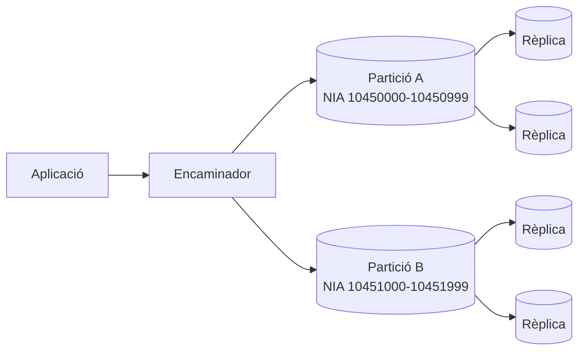
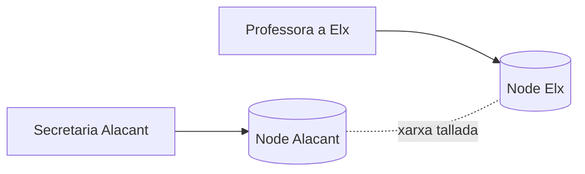
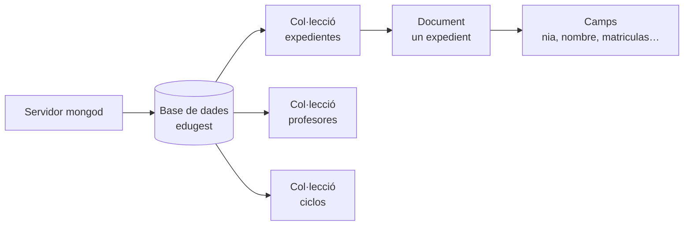
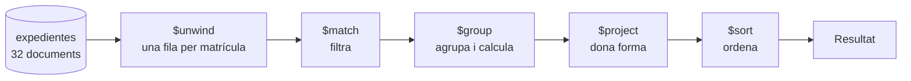
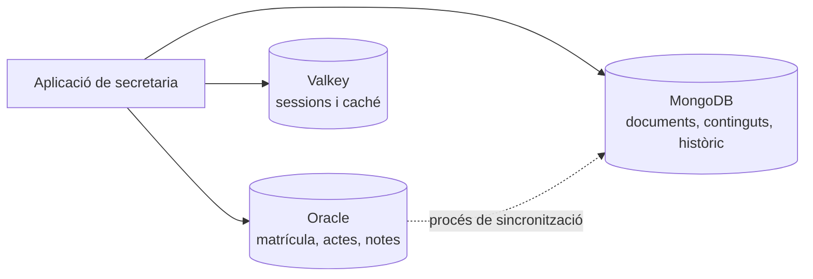

# UD10 · Bases de dades no relacionals (NoSQL)

## Resum del tema

Durant nou unitats has treballat amb un únic model de dades: el **relacional**. Has aprés a analitzar requisits, dibuixar un diagrama entitat/relació, normalitzar, crear taules amb restriccions, consultar, modificar dades dins de transaccions i programar el propi servidor. Esta última unitat no ve a desmuntar res d'això: ve a **ampliar el mapa**. Existixen famílies de sistemes gestors que renuncien deliberadament a algunes garanties del model relacional per a aconseguir altres coses (esquema flexible, escalat horitzontal, latència molt baixa), i un professional ha de saber **quan val la pena eixe intercanvi**.

El terme **NoSQL** agrupa eixos sistemes. Estudiarem les quatre grans famílies (clau-valor, documental, columnar i de grafs) i treballarem en profunditat una base de dades **documental**, **MongoDB Community Server 8.0**, perquè és el tipus més pròxim a allò que ja saps i el més estés en el desenvolupament d'aplicacions. Perquè la comparació siga honesta usarem les **mateixes dades** de sempre: una versió documental d'EduGest amb els 32 expedients del curs 2025-26, de manera que cada consulta de MongoDB es puga posar al costat del seu equivalent en Oracle i comparar resultat a resultat.

El fil conductor de la unitat no és la sintaxi de `mongosh`, sinó el **criteri d'elecció**. En el currículum, el RA7 demana caracteritzar estes bases de dades, avaluar els seus tipus, identificar els seus elements i gestionar la informació amb les eines del gestor; en la pràctica professional, el que se't demanarà és justificar una decisió d'arquitectura. Per això la unitat acaba amb tres casos raonats i amb una conclusió que convé avançar: **per a la gestió acadèmica d'un centre, el model relacional continua sent l'elecció correcta**. Saber per què és, exactament, l'objectiu del tema.

Enllaça amb la **UD01** (models de dades, bases distribuïdes, Big Data i protecció de dades), amb la **UD03** i la **UD04** (el model relacional i la normalització, que ara serviran de contrast), amb la **UD07** (els informes que reescriurem amb el *pipeline* d'agregació) i amb la **UD08** (transaccions i propietats ACID, que ací es discutixen en un entorn distribuït).



### Objectius d'aprenentatge

En acabar esta unitat seràs capaç de:

- Caracteritzar les bases de dades no relacionals i explicar quins problemes van motivar la seua aparició.
- Distingir les propietats ACID de les propietats BASE i raonar el teorema CAP sobre un cas concret.
- Avaluar els quatre tipus principals de bases de dades NoSQL i identificar casos d'ús adequats per a cadascun.
- Identificar els elements d'una base de dades documental: base de dades, col·lecció, document, camp, tipus BSON i `_id`.
- Utilitzar `mongosh` i MongoDB Compass per a gestionar la informació emmagatzemada.
- Realitzar operacions CRUD i consultes sobre subdocuments i arrays, indicant el seu equivalent en SQL.
- Construir pipelines d'agregació i comparar-les amb la consulta SQL que resol el mateix informe.
- Dissenyar un model documental decidint de forma justificada quina informació s'incrusta i quina es referencia.
- Declarar validadors d'esquema i índexs, i comprovar-ne l'efecte.
- Triar entre model relacional i NoSQL argumentant amb criteris tècnics, no amb modes.

### Temporalització

La unitat ocupa **7 hores d'aula** (4 de teoria i 3 de pràctica) i tanca el mòdul.
És una unitat de criteri professional: importa més saber **quan** triar cada model
que memoritzar la sintaxi de `mongosh`.


items:
  - {h: 2, tipo: T, t: "Característiques de NoSQL, BASE i CAP, tipus de bases de dades i elements de MongoDB", ref: "§1 a §4 · traductor SQL ↔ MongoDB"}
  - {h: 1, tipo: P, t: "Posada en marxa de MongoDB i CRUD sobre els expedients", ref: "Pràctiques 10.1 i 10.2"}
  - {h: 1, tipo: T, t: "Operacions CRUD, subdocuments i arrays", ref: "§5 i §6"}
  - {h: 1, tipo: T, t: "Agregacions", ref: "§7"}
  - {h: 1, tipo: P, t: "El mateix informe en SQL i en MongoDB", ref: "Pràctica 10.4"}
  - {h: 1, tipo: P, t: "Modelatge documental i decisió raonada", ref: "Pràctiques 10.5 i 10.7 · §8 a §11"}
autonomo:
  - "Pràctica 10.3 (operadors, subdocuments i arrays)"
  - "Pràctica 10.6 (altres models: clau-valor i grafs)"
  - "Projecte EduGest · UD10 (l'expedient documental)"


> [!IMPORTANT]
> Estudia esta unitat **en paral·lel**: cada vegada que aparega una ordre de `mongosh`, tapa la columna de la dreta i escriu tu la sentència SQL equivalent. Si no saps traduir-la, és que no has entés l'ordre. I quan una operació **no** tinga equivalent directe (en un sentit o en l'altre), apunta per què: ací està la diferència real entre els dos models, i ací es decidix una arquitectura.

---

NoSQL, BASE i CAP, tipus i elements de MongoDB

## 1. Què són les bases de dades NoSQL

### 1.1 El problema que van vindre a resoldre

El model relacional es va dissenyar a principis dels anys setanta per a un escenari concret: un volum de dades moderat, una estructura coneguda i estable, un servidor potent i la necessitat absoluta que les dades foren correctes. En eixe escenari continua sent imbatible.

A partir de la segona meitat dels anys 2000, algunes empreses es van trobar amb escenaris distints:

1. **Volum i velocitat.** Un portal amb milions d'usuaris simultanis genera més escriptures de les que admet un únic servidor, per gran que siga.
2. **Variabilitat de l'esquema.** En un catàleg de comerç electrònic, un portàtil i un ratolí no comparteixen característiques. Modelar-ho amb taules obliga a una taula per tipus de producte, a una taula *entitat-atribut-valor* o a desenes de columnes quasi sempre nul·les.
3. **Dades semiestructurades.** Documents JSON procedents d'API, registres d'activitat, missatges de dispositius: informació amb forma d'arbre que cal trossejar en diverses taules per a guardar-la i recompondre amb `JOIN` per a llegir-la.
4. **Escalat horitzontal.** Resulta més barat i més tolerant a fallades repartir les dades entre vint màquines modestes que comprar una màquina vint vegades més potent.
5. **Desenvolupament àgil.** Si l'esquema canvia cada dos setmanes, cada canvi implica un `ALTER TABLE` i una migració coordinada amb el desplegament de l'aplicació.

> [!NOTE]
> Fixa't que **cap** d'eixos cinc problemes apareix en EduGest. La matrícula d'un centre té un volum xicotet, un esquema estable fixat per normativa, relacions complexes i una exigència màxima d'integritat. Tindre-ho clar des del principi evita la conclusió equivocada que NoSQL és «la versió moderna» de les bases de dades.

### 1.2 Què significa realment «NoSQL»

El nom és desafortunat i té origen històric: es va usar com a etiqueta d'una trobada tècnica en 2009. Hui s'interpreta com **«Not only SQL»** («no només SQL»), i convé precisar què afirma i què no afirma:

| El que **no** significa | El que **sí** sol implicar |
|---|---|
| Que no existisca un llenguatge de consulta | Que el llenguatge no és SQL estàndard, sinó propi del producte (i a vegades s'hi assembla molt: Cypher, CQL, el *pipeline* de MongoDB) |
| Que no hi haja esquema | Que l'esquema **no l'imposa el gestor per defecte**: l'imposa l'aplicació, o un validador que es declara a banda |
| Que no hi haja transaccions ni integritat | Que les garanties són configurables i solen abastar un sol document o agregat, no diverses col·leccions |
| Que substituïsca el model relacional | Que **convisca** amb ell: el normal en una empresa és tindre els dos (*persistència políglota*, §11.4) |

> [!IMPORTANT]
> Una base de dades NoSQL no és una base de dades «sense regles». És una base de dades en la qual **les regles es traslladen de lloc**: de l'esquema declaratiu del SGBD al codi de l'aplicació o a un validador explícit. Eixe trasllat té un cost que cal decidir conscientment.

### 1.3 Esquema flexible enfront d'esquema rígid

En Oracle, l'estructura es declara abans de guardar res: 

```sql
-- Cal decidir ara les columnes, els tipus i les restriccions
CREATE TABLE alumno (
    id_alumno         NUMBER(6)    PRIMARY KEY,
    nia               CHAR(8)      NOT NULL,
    nombre            VARCHAR2(40) NOT NULL,
    fecha_nacimiento  DATE         NOT NULL
);
-- Un INSERT sense fecha_nacimiento falla: ORA-01400
```

En MongoDB, la col·lecció es crea en escriure el primer document i **cada document pot tindre camps distints**: 

```javascript
// Dos documents de la mateixa col·lecció, amb forma diferent
db.expedientes.insertOne({ _id: 1, nia: "10450037", nombre: "Adrián", dni: "55568986C" })
db.expedientes.insertOne({ _id: 5, nia: "10450185", nombre: "Andrea" })   // sense dni: s'accepta
```

Esta flexibilitat resol el problema 2 de l'apartat anterior, però té conseqüències immediates:

- Una consulta pot tornar documents als quals els falta el camp que esperaves. En Oracle el camp estaria present amb valor `NULL`; en MongoDB **no hi és**, i això es consulta d'una altra manera (`$exists`, §5.2).
- Ningú impedix guardar `nota: "siete"` en un document i `nota: 7` en un altre. La comparació `nota: { $gte: 5 }` ignorarà el primer, perquè MongoDB compara **per tipus** abans que per valor.
- L'esquema continua existint: està en el cap de qui programa i en el codi. Si no s'escriu en algun lloc (§9), es degrada en quant l'equip canvia.

> [!WARNING]
> «Esquema flexible» no és «esquema inexistent». En un projecte seriós, una col·lecció de MongoDB du **validador `$jsonSchema`** (§9.1), igual que una taula du restriccions. La diferència és que en MongoDB és **opcional**, i per això cal acordar-ho en l'equip.

### 1.4 La desnormalització com a decisió de disseny

En la UD04 vas aprendre a eliminar la redundància perquè provoca **anomalies**: la mateixa dada guardada en dos llocs acaba sent diferent en els dos llocs. Eixa conclusió era correcta **per al model relacional**, on recompondre la informació amb `JOIN` és barat.

En un sistema distribuït la situació canvia: un `JOIN` entre taules repartides en màquines diferents exigix trànsit de xarxa i coordinació. Per això el modelatge documental **incrusta** (duplica) informació deliberadament, de manera que el que es llig junt es guarde junt i cada lectura toque un sol document i una sola màquina.

| | Model relacional normalitzat | Model documental desnormalitzat |
|---|---|---|
| El nom del mòdul «Bases de dades» | Està **una vegada** en `MODULO` | Es repetix en **cada** matrícula de cada expedient |
| Corregir una errata en eixe nom | Un `UPDATE` d'una fila | Un `updateMany` que recorre tota la col·lecció |
| Llegir l'expedient complet d'un alumne | `JOIN` de tres o quatre taules | Una lectura d'un document |
| Risc d'incoherència | L'elimina el SGBD | Cal evitar-lo des de l'aplicació |

> [!TIP]
> La pregunta que decidix la duplicació és: **esta dada canvia o és pràcticament immutable?** El nom d'un mòdul publicat en el BOE no canviarà durant el curs: duplicar-lo és segur. El tutor d'un grup sí que pot canviar: duplicar-lo en 30 expedients és un problema esperant a ocórrer.

### 1.5 Escalat, rèplica i particionat

| Estratègia | En què consistix | Límit |
|---|---|---|
| **Escalat vertical** (*scale up*) | Posar més CPU, més memòria o discos més ràpids en el **mateix** servidor | Hi ha un topall físic i el preu creix més ràpid que la potència; continua havent-hi un punt únic de fallada |
| **Escalat horitzontal** (*scale out*) | Repartir càrrega i dades entre **més** servidors (nodes) | Exigix coordinació entre nodes; apareixen els problemes del §2 |

Sobre l'escalat horitzontal es construïxen dos mecanismes que ja vas vore en la UD01 amb altres noms:

- **Rèplica** (*replica set* en MongoDB): diversos nodes guarden **una còpia completa** de les dades. Un és el **primari** i rep les escriptures; els **secundaris** les repliquen. Millora la disponibilitat (si cau el primari, se n'elegix un altre) i permet repartir lectures.
- **Particionat** (*sharding*): les dades es **reparteixen** entre diversos conjunts de rèplica segons una **clau de partició** (*shard key*). És la fragmentació horitzontal de la UD01. Permet créixer sense límit teòric, però triar mal la clau concentra la càrrega en un sol node.



> [!NOTE]
> Oracle també escala horitzontalment (Oracle RAC, *Oracle Globally Distributed Database*). La diferència no és que «SQL no escale», sinó el **cost i la complexitat** de fer-ho mantenint totes les garanties transaccionals entre nodes.

### 1.6 Què es guanya i què es perd

| Es guanya | Es perd |
|---|---|
| Esquema flexible: el model evoluciona sense migracions costoses | Integritat referencial **declarativa**: no hi ha `FOREIGN KEY` entre col·leccions |
| Lectura d'un agregat complet en una sola operació | Composicions (`JOIN`) naturals i barates entre qualsevol parell d'entitats |
| Escalat horitzontal senzill i tolerància a fallades | Consultes *ad hoc* no previstes: el model està optimitzat per als accessos que es van dissenyar |
| Model de dades molt pròxim als objectes de l'aplicació | Normalització automàtica contra anomalies d'actualització |
| Latències molt baixes en els accessos per clau | Maduresa i estandardització: SQL és un estàndard ISO; cada producte NoSQL té el seu propi llenguatge |
| Bon ajust a dades semiestructurades o jeràrquiques | Eines d'informes, auditoria i administració menys uniformes |

{}
És freqüent llegir que NoSQL servix per a «dades no estructurades». Convé matisar el vocabulari:

- **Estructurades:** encaixen en files i columnes de tipus coneguts (la matrícula d'EduGest).
- **Semiestructurades:** tenen estructura, però variable i autodescriptiva (JSON, XML). És el terreny natural del model documental.
- **No estructurades:** imatges, àudio, vídeo, text lliure. Cap base de dades els *interpreta*: es guarden com a binaris (o en un magatzem d'objectes) i el que s'indexa són les seues **metadades**, que tornen a ser estructurades o semiestructurades.

Una base documental treballa sobretot amb dades **semiestructurades**.
{}

---

{}
Carlo Strozzi el va usar en 1998 per a una base de dades relacional lleugera que no usava SQL. El significat actual va nàixer en 2009, en una trobada a San Francisco organitzada per Johan Oskarsson sobre bases de dades distribuïdes no relacionals.
{}

## 2. Transaccions distribuïdes: BASE i el teorema CAP

### 2.1 Recordatori: ACID

En la UD08 vas definir una transacció com una unitat de treball que complix quatre propietats: **A**tomicitat (tot o res), **C**onsistència (es passa d'un estat vàlid a un altre vàlid), **A**illament (les transaccions concurrents no es destorben) i **D**urabilitat (el confirmat sobreviu a una caiguda). Oracle les garantix en un servidor sense que calga demanar-ho.

Mantindre ACID **entre diverses màquines** és molt més car: cada confirmació exigix que tots els nodes implicats es posen d'acord (protocols de consens o de confirmació en dues fases), la qual cosa afig latència i, si un node no respon, bloqueja l'operació.

### 2.2 BASE: l'alternativa pragmàtica

Enfront d'ACID, part del món NoSQL va adoptar un conjunt de propietats deliberadament més febles, resumides en l'acrònim **BASE**:

| Propietat | Significat | Què implica |
|---|---|---|
| **B**asically **A**vailable | Bàsicament disponible | El sistema respon sempre, encara que la resposta no siga la més actual o estiga incompleta |
| **S**oft state | Estat tou | L'estat d'un node pot canviar sense que hi haja escriptures noves, només perquè arriba la replicació |
| **E**ventual consistency | Consistència eventual | Si deixen d'arribar escriptures, tots els nodes **acabaran** coincidint; mentrestant, poden discrepar |

L'exemple clàssic és un comptador de «m'agrada»: que durant dos segons un usuari veja 1.034 i un altre 1.035 no té cap conseqüència. El contraexemple clàssic és una nota d'una acta oficial: que dos professors vegen notes distintes del mateix alumne és inadmissible.

### 2.3 El teorema CAP

Formulat per Eric Brewer i demostrat després formalment, el **teorema CAP** afirma que un sistema distribuït no pot garantir simultàniament les tres propietats següents:

- **C**onsistency (consistència): tota lectura torna l'escriptura més recent.
- **A**vailability (disponibilitat): tota petició rep una resposta no errònia.
- **P**artition tolerance (tolerància a particions): el sistema continua funcionant encara que es perden missatges entre nodes.

**Exemple concret.** Imagina EduGest replicat en dos seus, Alacant i Elx, i que es talla la fibra entre elles. Una professora a Elx intenta guardar la nota d'un alumne:



El node d'Elx només pot fer dues coses:

1. **Acceptar** l'escriptura i propagar-la quan torne la xarxa. El sistema continua **disponible** (A), però durant el tall Alacant llig una nota desactualitzada: s'ha sacrificat la **consistència**.
2. **Rebutjar** l'escriptura («no puc garantir que això siga coherent, torna-ho a intentar més tard»). Es manté la **consistència** (C) a costa de la **disponibilitat**.

> [!IMPORTANT]
> Com que en un sistema distribuït les particions de xarxa **ocorren** i no es poden evitar, la **P** no és opcional. L'elecció real de disseny és entre **C i A durant la partició**. Els sistemes que prioritzen C s'anomenen CP (MongoDB amb la seua configuració per defecte, HBase); els que prioritzen A s'anomenen AP (Cassandra, DynamoDB amb lectures eventuals). Un SGBD relacional en un únic servidor **no està en el teorema**: sense diversos nodes no hi ha particions.

### 2.4 Què implica la consistència eventual per a una aplicació

Si el sistema és eventualment consistent, l'aplicació ha d'assumir que:

- Pot **llegir el que acaba d'escriure... o no**. Un usuari guarda el seu perfil, la pantalla següent llig d'un node que encara no el té i pareix que el canvi s'ha perdut. Es mitiga amb la lectura dirigida al node primari (*read your own writes*).
- Dues escriptures simultànies en nodes distints poden **entrar en conflicte**, i algú ha de resoldre-ho: l'última guanya, es guarden les dues versions, es fusionen per regles de negoci...
- Les comprovacions del tipus «no permetes dues matrícules del mateix alumne en el mateix mòdul» **no es poden delegar** en una restricció `UNIQUE` global sense coordinació entre nodes.

### 2.5 Matisació imprescindible: NoSQL no significa «sense ACID»

L'oposició «relacional = ACID, NoSQL = BASE» era raonable al voltant de 2010 i hui és **inexacta**:

- **MongoDB admet transaccions ACID multidocument des de la versió 4.0** (2018) en conjunts de rèplica, i des de la 4.2 també en clústers particionats. En la 8.0 són una característica normal del producte.
- A més, i això és anterior i més important en el dia a dia, **tota operació d'escriptura sobre un únic document és atòmica**, inclosos els subdocuments i arrays que continga. Bona part de les transaccions que en el model relacional abasten diverses taules desapareixen si la informació que canvia junta està en el mateix document.
- En l'altre sentit, Oracle 23ai i 26ai incorporen tipus de dades `JSON`, índexs sobre JSON i **vistes dual JSON-relacional**, amb les quals les mateixes dades relacionals es lligen i modifiquen com a documents. La frontera és cada vegada més difusa.

```javascript
// Transacció multidocument en mongosh (MongoDB 8.0)
const s = db.getMongo().startSession()
s.startTransaction()
try {
  const ex = s.getDatabase("edugest").expedientes
  ex.updateOne({ _id: 1 }, { $push: { matriculas: { modulo: { codigo: "0486" }, curso: "2026-27" } } })
  ex.updateOne({ _id: 1 }, { $inc: { creditosMatriculados: 12 } })
  s.commitTransaction()
} catch (e) {
  s.abortTransaction()
  print("Abortada: " + e.message)
} finally {
  s.endSession()
}
```

> [!TIP]
> Si en dissenyar en MongoDB necessites transaccions multidocument **sovint**, sol ser un senyal que el model documental no està ben plantejat (o que el problema és relacional). Usa-les com a xarxa de seguretat, no com a eina d'ús diari: tenen cost i límits de duració.


- q: "Durant un tall de xarxa entre dos nodes, un sistema **AP** decidix…"
  options: ["Rebutjar les escriptures fins a recuperar la coordinació", "Acceptar les escriptures i reconciliar després, encara que hi haja lectures desactualitzades", "Replicar les dades de forma sincrònica a tots els nodes", "Detindre's per complet fins que l'administrador intervinga"]
  answer: 1
  explain: "Un sistema AP prioritza la disponibilitat: respon sempre i assumix consistència eventual. La primera opció descriu un sistema CP, que és el que fa MongoDB amb la seua configuració per defecte."
- q: "És correcte dir que «MongoDB no té transaccions»?"
  options: ["Sí: cap base NoSQL pot ser ACID", "No: des de la versió 4.0 admet transaccions ACID multidocument, i l'escriptura d'un document sempre va ser atòmica", "Sí, excepte que s'active el mode relacional", "No, però només funcionen en una única col·lecció"]
  answer: 1
  explain: "L'atomicitat per document existix des del principi i les transaccions multidocument estan disponibles des de la 4.0 (4.2 en clústers particionats). L'afirmació «NoSQL = no ACID» està desactualitzada."


---

{}
Eric Brewer el va plantejar com a conjectura l'any 2000 i Seth Gilbert i Nancy Lynch el van demostrar en 2002: un sistema distribuït no pot garantir alhora consistència, disponibilitat i tolerància a particions.
{}

## 3. Tipus de bases de dades NoSQL

### 3.1 Clau-valor

**Estructura.** Una taula *hash* gegant i distribuïda: una **clau** única i un **valor** opac per al gestor (una cadena, un nombre, un binari o una estructura simple). L'accés per clau és pràcticament instantani; sense la clau, no hi ha forma eficient de buscar.

**Producte de referència:** **Valkey** (bifurcació lliure de Redis, usada en la pràctica 10.6), Redis, Amazon DynamoDB, etcd.

```text
SET  sesion:abc123 "id_alumno=1;rol=ALUMNO"
EXPIRE sesion:abc123 1800        # caducitat automàtica en 30 minuts
INCR visitas:portal              # increment atòmic
```

**Casos d'ús reals:** sessions d'usuari de la secretaria virtual (amb caducitat automàtica); caché de les consultes més pesades d'Oracle, per a no repetir-les; comptadors i limitadors de peticions; cues de treballs.

**Límits:** no es pot consultar pel contingut del valor («dóna'm tots els alumnes de 1DAM» és impossible llevat que eixa llista s'haja guardat com una altra clau); no hi ha relacions ni informes; la majoria d'estos sistemes mantenen les dades en memòria, amb persistència opcional, de manera que no són el magatzem principal d'informació que no es pot perdre.

### 3.2 Documental

**Estructura.** Col·leccions de **documents** autodescriptius amb format JSON (BSON en MongoDB), amb camps aniuats i arrays. Admet consultes per qualsevol camp, índexs secundaris i agregacions.

**Producte de referència:** **MongoDB** (el que usarem), CouchDB, Amazon DocumentDB, Elasticsearch (orientat a cerca).

**Casos d'ús reals:** catàlegs de productes amb característiques variables (pràctica 10.5); expedients, historials i continguts editorials on cada fitxa té seccions distintes; perfils d'usuari i configuracions d'aplicació.

**Límits:** sense integritat referencial declarativa entre col·leccions; les consultes que creuen moltes col·leccions són incòmodes i més lentes que un `JOIN` ben indexat; el document té un **límit de 16 MB**, la qual cosa prohibix incrustar col·leccions que creixen sense fi (com les opinions d'un producte).

### 3.3 Columnar (famílies de columnes)

**Estructura.** Files identificades per una **clau de partició** que s'agrupen en *famílies de columnes*; cada fila pot tindre columnes distintes i l'emmagatzematge està orientat a la columna, la qual cosa comprimix molt bé i permet llegir un rang enorme d'una sola columna amb molt poca entrada/eixida. Les escriptures s'afigen al final (*append*), per la qual cosa són molt ràpides.

**Producte de referència:** **Apache Cassandra**, HBase, ScyllaDB; en analítica, les bases de dades columnars pures com ClickHouse.

**Casos d'ús reals:** sèries temporals i telemetria (sensors de CO₂ de les aules mesurant cada 30 segons, pràctica 10.7); registres d'activitat i auditoria a gran escala; sistemes de missatgeria amb escriptures massives.

**Límits:** el model es dissenya **a partir de les consultes** que s'executaran, i consultar per un criteri no previst pot ser inviable; no hi ha `JOIN`; els agregats i la unicitat es gestionen amb molta cura.

### 3.4 Grafs

**Estructura.** **Nodes** (entitats) i **arestes** (relacions), tots dos amb propietats. La relació és un element de primera classe, no una clau aliena: recórrer «amics dels meus amics» no multiplica el cost com ho faria una cadena de `JOIN`.

**Producte de referència:** **Neo4j** (amb el llenguatge Cypher, pràctica 10.6), ArangoDB, Amazon Neptune.

```text
MATCH (a:Alumno {nombre:'Adrián'})-[:MATRICULADO]->(m)<-[:MATRICULADO]-(c:Alumno)
RETURN DISTINCT c.nombre
```

**Casos d'ús reals:** xarxes socials i recomanacions («qui va estudiar el mateix que tu va triar…»); càlcul de rutes i logística; detecció de frau per patrons de relació; anàlisi de dependències i d'arbres de permisos.

**Límits:** mal ajust per a agregacions massives sobre totes les dades o per a informes tabulars; l'escalat horitzontal és més difícil, perquè partir un graf trenca precisament les arestes que es volen recórrer.

### 3.5 Taula resum

| Tipus | Unitat de dades | Es consulta per | Producte | Brilla en | Patix en |
|---|---|---|---|---|---|
| **Clau-valor** | Parell clau → valor | La clau, i poc més | Valkey / Redis | Caché, sessions, comptadors | Qualsevol cerca per contingut |
| **Documental** | Document JSON/BSON | Qualsevol camp, amb índexs | MongoDB | Agregats autocontinguts, esquemes variables | Creuaments entre moltes col·leccions |
| **Columnar** | Fila ampla per clau de partició | Clau de partició i rangs de la clau d'ordenació | Cassandra | Escriptures massives, sèries temporals | Consultes no previstes, `JOIN` |
| **Grafs** | Node i aresta | Recorreguts des d'un node | Neo4j | Relacions profundes i variables | Informes agregats, escalat horitzontal |
| *(referència)* **Relacional** | Fila d'una taula | Qualsevol columna, amb SQL | Oracle 26ai | Integritat, consultes *ad hoc*, informes | Esquemes molt variables, escalat extrem |

### 3.6 La mateixa dada en els cinc models

Per a vore la diferència, prenguem una dada real d'EduGest: **Adrián Ferri Baeza (NIA 10450037) està matriculat en 0484 Bases de dades amb un 4,75 i en 0485 Programació amb un 7,25**.

**Relacional** (el que ja tens en Oracle): la dada viu en tres taules i es recompon amb `JOIN`.

| ALUMNO | | | MATRICULA | | |
|---|---|---|---|---|---|
| ID_ALUMNO | NIA | NOMBRE | ID_ALUMNO | ID_MODULO | NOTA_FINAL |
| 1 | 10450037 | Adrián | 1 | 2 | 4.75 |
| | | | 1 | 3 | 7.25 |

**Documental:** un únic document autocontingut.

```javascript
{ _id: 1, nia: "10450037", nombre: "Adrián",
  matriculas: [ { modulo: "0484", nota: 4.75 }, { modulo: "0485", nota: 7.25 } ] }
```

**Clau-valor:** una clau per cada dada que es vulga recuperar.

```text
alumno:1:nombre          -> "Adrián"
alumno:1:nota:0484       -> "4.75"
alumno:1:nota:0485       -> "7.25"
```

**Columnar:** una fila ampla, amb l'alumne com a clau de partició i el mòdul com a clau d'ordenació.

| clau de partició | 0484 | 0485 |
|---|---|---|
| alumno#1 | nota=4.75 | nota=7.25 |

**Grafs:** dos nodes i una aresta amb propietats per cada matrícula.

```text
(Alumno {nia:'10450037'})-[:MATRICULADO {nota:4.75}]->(Modulo {codigo:'0484'})
(Alumno {nia:'10450037'})-[:MATRICULADO {nota:7.25}]->(Modulo {codigo:'0485'})
```

> [!IMPORTANT]
> La dada és la mateixa; el que canvia és **quina pregunta resulta barata**. El model relacional contesta bé a quasi qualsevol pregunta. El documental contesta instantàniament a «dóna'm l'expedient d'este alumne». El de clau-valor només a «dóna'm este valor concret». El columnar a «dóna'm totes les notes d'este alumne per ordre de mòdul». El de grafs a «quins alumnes compartixen mòduls amb este». Triar el model és triar **quines preguntes vols que siguen barates**.

---

{}
El nom de MongoDB ve de *humongous* («enorme»), en referència al seu plantejament per a manejar grans volums de dades.
{}

## 4. MongoDB: elements i eines

### 4.1 El servidor i les seues eines client

| Component | Què és | Equivalent aproximat en Oracle |
|---|---|---|
| **`mongod`** | El procés **servidor**; escolta en el port **27017** per defecte | La instància de base de dades |
| **`mongosh`** | El *shell* oficial: un intèrpret de **JavaScript** amb accés a la base de dades | SQL\*Plus / SQLcl |
| **MongoDB Compass** | Eina gràfica: explorar col·leccions, analitzar l'esquema real, construir agregacions pas a pas, veure plans d'execució | SQL Developer |
| **Database Tools** | Utilitats de línia d'ordres: `mongodump`, `mongorestore`, `mongoimport`, `mongoexport` | Data Pump, SQL\*Loader |
| **Drivers** | Biblioteques oficials per a Java, Python, C#, Node.js… | JDBC / OCI |

Com que `mongosh` és JavaScript, en ell són vàlides les variables, els bucles i les funcions, la qual cosa resulta molt còmoda per a automatitzar:

```javascript
// Scripting en mongosh: exemple d'ús del llenguatge del client
for (const g of ["1DAM", "1DAW", "1ASIR"]) {
  print(g + ": " + db.expedientes.countDocuments({ "grupo.codigo": g }))
}
```

> [!NOTE]
> `mongosh` va substituir l'antic *shell* `mongo` (retirat en la versió 6.0). Si trobes apunts o respostes en fòrums que usen `mongo` com a ordre, són anteriors a 2021 i és probable que també usen mètodes obsolets (§5).

### 4.2 Base de dades, col·lecció, document i camp

La jerarquia d'elements té quatre nivells, i es correspon quasi terme a terme amb la del model relacional:



| Model relacional | MongoDB | Matís important |
|---|---|---|
| Base de dades / esquema | **Base de dades** | En MongoDB la base de dades es crea en escriure el primer document |
| Taula | **Col·lecció** | La col·lecció no imposa columnes ni tipus |
| Fila (tupla) | **Document** | Un document pot contindre arrays i altres documents: no és pla |
| Columna (atribut) | **Camp** | Cada document té els camps que té; no hi ha «columnes de la col·lecció» |
| Clau primària | Camp **`_id`** | Obligatori, únic, indexat i **no modificable**; si no el poses, el genera el servidor |
| Clau aliena | Referència manual (`_id` d'un altre document) | **No existix** la integritat referencial declarativa |
| `JOIN` | `$lookup` o **document embegut** | El normal és evitar el creuament incrustant les dades |
| Índex | Índex | Mateix concepte i utilitat que en la UD05 i la UD07 |
| Vista | Vista (`db.createView`) | De només lectura, definida amb una pipeline d'agregació |

### 4.3 BSON i els tipus de dades

Els documents s'escriuen com a JSON, però MongoDB els emmagatzema en **BSON** (*Binary JSON*), una codificació binària que afig **tipus** que JSON no té i que permet recórrer el document sense analitzar-lo sencer.

| Tipus BSON | Com s'escriu en `mongosh` | Equivalent en Oracle | Compte |
|---|---|---|---|
| `Double` | `7.25` | `NUMBER` / `BINARY_DOUBLE` | És el tipus per defecte de tot nombre amb decimals: coma flotant |
| `Int32` / `Int64` | `NumberInt(3)` / `NumberLong(…)` | `NUMBER(p)` | Un literal enter com `3` es guarda com `Int32` des de `mongosh` |
| `Decimal128` | `NumberDecimal("7.25")` | `NUMBER(p,s)` | **El tipus correcte per a imports i notes oficials**: decimal exacte |
| `String` | `"Adrián"` | `VARCHAR2` | Sempre UTF-8 |
| `Boolean` | `true` / `false` | `BOOLEAN` (desde 23ai) o `CHAR(1)` | |
| `Date` | `ISODate("2026-05-20")` | `DATE` / `TIMESTAMP` | Mil·lisegons des de 1970 en UTC; **no** guardes dates com a text |
| `ObjectId` | `ObjectId("6710f1…")` | — | 12 bytes: marca de temps + aleatori + comptador. Valor per defecte d'`_id` |
| `Array` | `[1, 2, 3]` | Sense equivalent directe (taula filla) | L'operador de consulta s'aplica a **cada** element |
| `Object` | `{ email: "…", telefono: "…" }` | Sense equivalent directe (columnes o taula filla) | Es consulta amb notació de punt |
| `Null` | `null` | `NULL` | **`null` i «camp absent» no són el mateix** |

> [!WARNING]
> `{ nota: 7.25 }` es guarda com a coma flotant de doble precisió, igual que un `BINARY_DOUBLE` d'Oracle: `0.1 + 0.2` no dona exactament `0.3`. Per a notes, imports o qualsevol valor que se sume i es compare per igualtat, usa `NumberDecimal("7.25")`, que és l'equivalent del `NUMBER(4,2)` d'EduGest. Amb 32 expedients no ho notaràs; en una comptabilitat, sí.

#### El camp `_id`

- És la **clau primària** del document. Si no s'indica, el servidor genera un `ObjectId`.
- Té sempre un índex únic que **no es pot eliminar**.
- És **immutable**: no es pot canviar amb `$set`; caldria esborrar el document i inserir-lo de nou.
- Pot ser de qualsevol tipus escalar. En la versió documental d'EduGest usem `_id: 1 … 32`, **els mateixos valors que `id_alumno`** en Oracle, per a poder comparar els dos sistemes fila a document.

### 4.4 Primeres ordres

```javascript
show dbs                          // bases de dades amb dades (les buides no apareixen)
use edugest                       // selecciona la base de dades; la crea si no existix
db                                // mostra la base de dades activa
show collections                  // col·leccions de la base activa
db.getCollectionNames()           // el mateix, com a array de JavaScript
db.stats()                        // grandària, nombre de col·leccions, d'objectes i d'índexs
db.expedientes.countDocuments()   // 32
db.expedientes.getIndexes()       // només l'índex de _id, creat automàticament
```

```text
edugest> show collections
ciclos
expedientes
profesores
edugest> db.expedientes.countDocuments()
32
```

> [!TIP]
> `use edugest` **no crea res**: la base de dades i la col·lecció apareixen amb la primera escriptura. Per això un error de tecleig (`use edugets`) no dona error i les dades acaben en una base de dades nova. Comprova sempre amb `db` abans d'inserir, i amb `show dbs` després.

En MongoDB 8.0, `db.collection.stats()` continua disponible en `mongosh`, però la forma recomanada d'obtindre estadístiques d'una col·lecció és l'etapa d'agregació `$collStats`:

```javascript
db.expedientes.aggregate([ { $collStats: { storageStats: {} } } ])
```

### 4.5 Convenció de noms

No hi ha una norma oficial, però l'ecosistema seguix convenis molt estables que convé respectar:

| Element | Conveni | Exemple | Observacions |
|---|---|---|---|
| Base de dades | minúscules, sense espais | `edugest` | Màxim 63 caràcters; distingix majúscules |
| Col·lecció | **plural**, minúscules | `expedientes` | Evita `$` i noms que comencen per `system.` |
| Camp | `camelCase` | `fechaNacimiento` | Evita el punt i el `$` inicial: compliquen les rutes de consulta |
| Referència a un altre document | nom + `Id` | `cicloId` | Així es veu que és una referència, no una dada embeguda |

> [!NOTE]
> En Oracle els identificadors **no** distingixen majúscules (`ALUMNO` i `alumno` són la mateixa taula); en MongoDB **sí**: `Expedientes` i `expedientes` serien dues col·leccions distintes, i `db.expedientes.find({ Nombre: "Adrián" })` no torna res si el camp es diu `nombre`. És una de les causes més freqüents de «la meua consulta no torna res».

### 4.6 La col·lecció `expedientes` d'EduGest

Tota la unitat treballa sobre la versió documental d'EduGest que carrega l'script [edugest_mongo.js](../ud10-practicas): tres col·leccions (`expedientes`, `profesores` i `ciclos`) obtingudes de les mateixes taules d'Oracle. Este és el document de l'alumne 1, complet: 

```javascript
db.expedientes.findOne({ _id: 1 })
```

```javascript
{
  _id: 1,
  nia: '10450037',
  dni: '55568986C',
  nombre: 'Adrián',
  apellidos: 'Ferri Baeza',
  fechaNacimiento: ISODate('2006-10-18T00:00:00.000Z'),
  localidad: 'Alicante',
  contacto: { email: 'adrianferri1@alu.edugest.es', telefono: '610608088' },
  grupo: { codigo: '1DAM', ciclo: 'DAM', curso: 1, turno: 'M' },
  matriculas: [
    { curso: '2025-26', convocatoria: 1, nota: 8.75,
      modulo: { codigo: '0483', nombre: 'Sistemas informáticos', ciclo: 'DAM', cursoCiclo: 1, horas: 160 } },
    { curso: '2025-26', convocatoria: 1, nota: 4.75,
      modulo: { codigo: '0484', nombre: 'Bases de datos', ciclo: 'DAM', cursoCiclo: 1, horas: 160 } },
    { curso: '2025-26', convocatoria: 1, nota: 7.25,
      modulo: { codigo: '0485', nombre: 'Programación', ciclo: 'DAM', cursoCiclo: 1, horas: 256 },
      faltas: [ { fecha: ISODate('2026-02-04'), horas: 3, justificada: true },
                { fecha: ISODate('2026-03-19'), horas: 3, justificada: false } ] },
    { curso: '2025-26', convocatoria: 1, nota: 4.75,
      modulo: { codigo: '0487', nombre: 'Entornos de desarrollo', ciclo: 'DAM', cursoCiclo: 1, horas: 96 },
      faltas: [ { fecha: ISODate('2026-05-08'), horas: 2, justificada: true } ] },
    { curso: '2025-26', convocatoria: 1, nota: 6.75,
      modulo: { codigo: '0373', nombre: 'Lenguajes de marcas y sistemas de gestión de información',
                ciclo: 'DAM', cursoCiclo: 1, horas: 128 } }
  ]
}
```

Tres decisions d'esta càrrega convé entendre-les des del principi, perquè expliquen molts resultats:

1. **Els valors absents no es guarden.** L'exportació usa `ABSENT ON NULL`, així que un alumne sense DNI **no té** camp `dni` (ocorre en 4 dels 32 expedients), un alumne sense grup no té `grupo` (3 expedients) i una matrícula sense qualificar no té `nota` (6 matrícules). No hi ha `null`: hi ha absència.
2. **L'array `matriculas` hi és sempre**, encara que estiga buit (`[]`): els alumnes 30, 31 i 32 no tenen matrícula, igual que en Oracle no tenen files en `MATRICULA`.
3. **Hi ha dos camps de nom paregut i significat distint:** `matriculas[].curso` és el **curs acadèmic** (`'2025-26'`, el `CURSO_ACADEMICO` de la taula `MATRICULA`) i `matriculas[].modulo.cursoCiclo` és el **curs del cicle** al qual pertany el mòdul (1 o 2). Com que en un document no hi ha capçalera de taula que aclarisca el significat, els noms de camp han de ser més explícits que els de columna.

#### Traductor SQL ↔ MongoDB

Abans d'escriure una sola ordre, usa el laboratori següent. Treballa sobre una col·lecció reduïda de **6 expedients** (els alumnes 1, 2, 9, 14, 21 i 25, amb les seues matrícules reals simplificades) i, per a cada operació que triïs, mostra tres coses alhora: l'ordre de `mongosh`, la consulta SQL d'Oracle que faria el mateix i el resultat. El botó del final commuta entre vore la dada d'Adrián com a **dues taules relacionals** o com a **un document**.

Fixa't especialment en dues operacions: *«La trampa de l'array»* i *«Reemplaçar el document complet»*. Les dues mostren comportaments que no tenen paral·lel en SQL i que són font habitual d'errors.



> [!WARNING]
> El laboratori és una **simulació didàctica** escrita en JavaScript: reprodueix el comportament i els missatges de MongoDB 8.0 sobre sis documents, però no és un servidor. Els resultats de la unitat i de les pràctiques s'obtenen executant les ordres en el MongoDB que vas instal·lar en la pràctica 10.1.


- q: "Quina d'estes afirmacions sobre `_id` és correcta?"
  options: ["És opcional i, si no s'indica, el document no té clau primària", "És obligatori, únic, indexat i immutable; si no s'indica, el servidor genera un `ObjectId`", "Ha de ser sempre un `ObjectId`", "Es pot modificar amb `$set` com qualsevol altre camp"]
  answer: 1
  explain: "`_id` és sempre la clau primària, du un índex únic que no es pot esborrar i no es pot modificar. Pot ser de qualsevol tipus escalar: en EduGest usem nombres enters iguals a `id_alumno`."
- q: "En la col·lecció `expedientes`, 4 documents no tenen el camp `dni`. Què hi hauria en Oracle?"
  options: ["Les mateixes 4 files, sense la columna DNI", "4 files amb `DNI` a `NULL`, perquè la columna existix per a totes", "Un error en carregar les dades", "4 files amb `DNI` a cadena buida, que en Oracle és distinta de NULL"]
  answer: 1
  explain: "En el model relacional la columna forma part de la taula i el valor desconegut es representa amb `NULL`. En el documental el camp simplement no hi és, i això obliga a consultar amb `$exists` en lloc d'`IS NULL`. (En Oracle la cadena buida **és** `NULL`, però ací la dada senzillament falta.)"


---

Operacions CRUD, subdocuments i arrays

## 5. Operacions CRUD

**CRUD** són les quatre operacions bàsiques sobre dades: *Create*, *Read*, *Update*, *Delete*. En el model relacional són `INSERT`, `SELECT`, `UPDATE` i `DELETE`; en MongoDB, mètodes de la col·lecció. La taula general d'equivalències és esta:

| Operació | MongoDB 8.0 | Oracle 26ai |
|---|---|---|
| Crear | `insertOne`, `insertMany` | `INSERT` |
| Llegir | `find`, `findOne`, `countDocuments`, `aggregate` | `SELECT` |
| Actualitzar | `updateOne`, `updateMany`, `replaceOne`, `findOneAndUpdate` | `UPDATE`, `MERGE` |
| Esborrar | `deleteOne`, `deleteMany` | `DELETE` |
| Buidar / eliminar l'estructura | `db.col.drop()` | `TRUNCATE TABLE`, `DROP TABLE` |
| Confirmar | — (atòmic per document) | `COMMIT` / `ROLLBACK` |

> [!CAUTION]
> Els mètodes **`insert()`, `update()`, `remove()`, `save()` i `count()`** que veuràs en tutorials antics estan obsolets; `save()` ja no existix en `mongosh`. No els uses: no distingixen entre afectar un o molts documents, que és justament l'error més car. Usa sempre els mètodes amb sufix `One` o `Many`, de manera que **l'ordre mateixa diga quants documents pot tocar**.

### 5.1 Crear: insertOne i insertMany

**Finalitat.** Afegir documents a una col·lecció (creant-la si no existix).

**Sintaxi.**

```javascript
db.<coleccion>.insertOne( <documento> )
db.<coleccion>.insertMany( [ <documento>, <documento>, … ], { ordered: true } )
```

**Components.** El document és un objecte JavaScript; si no du `_id`, el servidor afig un `ObjectId`. En `insertMany`, l'opció `ordered: true` (valor per defecte) deté la inserció en el primer error; amb `ordered: false` continua amb la resta i comunica al final els que han fallat.

**Exemple senzill.** Matriculem una alumna nova en 1DAM: 

```javascript
db.expedientes.insertOne({
  _id: 33,
  nia: "10451221",
  dni: "48219376P",
  nombre: "Marina",
  apellidos: "López Server",
  fechaNacimiento: ISODate("2006-03-14"),
  localidad: "Alicante",
  contacto: { email: "marinalopez33@alu.edugest.es", telefono: "612004455" },
  grupo: { codigo: "1DAM", ciclo: "DAM", curso: 1, turno: "M" },
  matriculas: []
})
```

```text
{ acknowledged: true, insertedId: 33 }
```

**Equivalent en Oracle.** Fan falta dues sentències i un `COMMIT`, perquè la informació està repartida en dues taules i el contacte en columnes: 

```sql
INSERT INTO alumno (id_alumno, nia, dni, nombre, apellidos, fecha_nacimiento,
                    email, telefono, localidad, cod_grupo)
VALUES (33, '10451221', '48219376P', 'Marina', 'López Server', DATE '2006-03-14',
        'marinalopez33@alu.edugest.es', '612004455', 'Alicante', '1DAM');
COMMIT;
```

**Exemple aplicat.** Dos alumnes més, una d'elles **sense `_id`**:

```javascript
db.expedientes.insertMany([
  { _id: 34, nia: "10451258", nombre: "Nadia", apellidos: "Ruiz Pastor",
    fechaNacimiento: ISODate("2005-09-30"), localidad: "Elche", matriculas: [] },
  {        nia: "10451295", nombre: "Omar",  apellidos: "Sellés Giner",
    fechaNacimiento: ISODate("2006-01-22"), localidad: "Alicante", matriculas: [] }
])
```

```text
{
  acknowledged: true,
  insertedIds: { '0': 34, '1': ObjectId('6714a3c9f1b2e45d7c0a9e01') }
}
```

**Resultat esperat.** `db.expedientes.countDocuments()` torna ara 35. Observa que el segon document va rebre un `ObjectId` generat pel servidor: una clau primària artificial, com la columna identitat de la UD05, però generada **en el client o en el servidor** sense necessitat de seqüència.

**Errors habituals.**

| Missatge | Causa | Equivalent en Oracle |
|---|---|---|
| `E11000 duplicate key error collection: edugest.expedientes index: _id_ dup key: { _id: 33 }` | Eixe `_id` ja existix | `ORA-00001: restricción única violada` |
| `MongoBulkWriteError` amb `insertedCount` menor que l'esperat | Un document de l'array ha fallat i `ordered: true` ha parat ahí | Equival a parar l'`INSERT ... SELECT` en la primera violació |
| Cap error, però el document no està on esperaves | Vas oblidar `use edugest` i l'has escrit en la base `test` | No ocorre: en Oracle l'esquema el fixa la connexió |

> [!WARNING]
> MongoDB ha acceptat Nadia i Omar **sense DNI, sense grup i sense contacte**. Oracle hauria rebutjat la inserció si faltara una columna `NOT NULL` i l'hauria rebutjat també si `cod_grupo` apuntara a un grup inexistent (`ORA-02291`). Eixa comprovació no desapareix: l'ha de fer l'aplicació, o un validador (§9).

### 5.2 Llegir: find i findOne

**Finalitat.** Recuperar documents que complisquen un filtre, tornant només els camps que interessen.

**Sintaxi.**

```javascript
db.<coleccion>.find( <filtro>, <proyección> )      // devuelve un cursor
db.<coleccion>.findOne( <filtro>, <proyección> )   // devuelve un documento o null
```

El **filtre** és el `WHERE` i la **projecció** és la llista de columnes del `SELECT`: `1` inclou el camp, `0` l'exclou, i `_id` es torna sempre excepte que es demane `_id: 0`.

```javascript
// Les dues parts d'un SELECT, en el mateix ordre conceptual
db.expedientes.find(
  { localidad: "Mutxamel" },                           // WHERE
  { _id: 0, nombre: 1, apellidos: 1, localidad: 1 }    // SELECT
).sort({ apellidos: 1 })                               // ORDER BY
```

```sql
SELECT nombre, apellidos, localidad
FROM   alumno
WHERE  localidad = 'Mutxamel'
ORDER  BY apellidos;
```

| NOMBRE | APELLIDOS | LOCALIDAD |
|---|---|---|
| Martina | Alemany Vidal | Mutxamel |
| Sara | Amorós Guillem | Mutxamel |
| Irene | Belda Iborra | Mutxamel |
| Hugo | Brotons Iborra | Mutxamel |
| Álex | Tomás Vidal | Mutxamel |
| Alba | Torregrosa Planelles | Mutxamel |

*6 files (6 documents)*

#### Operadors de comparació

| MongoDB | Significat | Oracle | Exemple sobre EduGest | Documents |
|---|---|---|---|---|
| `$eq` | Igual (implícit en escriure `campo: valor`) | `=` | `{ localidad: "Alicante" }` | 13 |
| `$ne` | Distint | `<>` | `{ localidad: { $ne: "Alicante" } }` | 19 |
| `$gt`, `$gte` | Major, major o igual | `>`, `>=` | `{ "matriculas.nota": { $gte: 9 } }` | 6 |
| `$lt`, `$lte` | Menor, menor o igual | `<`, `<=` | `{ fechaNacimiento: { $lt: ISODate("2005-01-01") } }` | 10 |
| `$in` | Està en la llista | `IN` | `{ localidad: { $in: ["Elche", "El Campello"] } }` | 6 |
| `$nin` | No està en la llista | `NOT IN` | `{ localidad: { $nin: ["Elche", "El Campello"] } }` | 26 |

> [!IMPORTANT]
> `$ne` i `$nin` **sí** tornen els documents en què el camp **no existix**, mentre que en Oracle `WHERE localidad <> 'Alicante'` **mai** torna les files amb `localidad` a `NULL` (lògica de tres valors, UD06). És una diferència de criteri, no un error de cap dels dos: en MongoDB «no és Alicante» inclou «no se sap».

#### Operadors lògics

| MongoDB | Oracle | Nota |
|---|---|---|
| `$and` | `AND` | Implícit: les condicions d'un mateix objecte filtre es combinen amb `AND` |
| `$or` | `OR` | Necessita un array: `{ $or: [ {…}, {…} ] }` |
| `$not` | `NOT` | S'aplica a un operador, no a una condició completa |
| `$nor` | `NOT (… OR …)` | Cap de les condicions es complix |

```javascript
// Alumnat de 1DAM o de 1DAW nascut en 2006 o després
db.expedientes.find({
  $and: [
    { "grupo.codigo": { $in: ["1DAM", "1DAW"] } },
    { fechaNacimiento: { $gte: ISODate("2006-01-01") } }
  ]
}, { _id: 1, nombre: 1, "grupo.codigo": 1 })
```

```sql
SELECT id_alumno, nombre, cod_grupo
FROM   alumno
WHERE  cod_grupo IN ('1DAM', '1DAW')
AND    fecha_nacimiento >= DATE '2006-01-01';
```

#### Existència i tipus

Amb esquema flexible apareixen dues preguntes que en SQL no tenen sentit: existix el camp? i de quin tipus és?

```javascript
db.expedientes.find({ "contacto.telefono": { $exists: false } }, { _id: 1 })   // 4, 10, 16, 22, 28
db.expedientes.find({ dni: { $exists: false } }, { _id: 1 })                   // 5, 14, 23, 32
db.expedientes.countDocuments({ "matriculas.nota": { $type: "double" } })      // 29
```

```sql
-- L'equivalent relacional de "el camp no existix" és "la columna és nul·la"
SELECT id_alumno FROM alumno WHERE telefono IS NULL;   -- 4, 10, 16, 22, 28
```

*5 documents i 5 files*

> [!NOTE]
> `$type` comprova el tipus BSON real de cada valor: és l'eina per a auditar una col·lecció en la qual algú ha pogut guardar `nota: "7"` en lloc de `nota: 7`. En Oracle eixa comprovació és innecessària perquè el tipus el garantix la columna.

#### Expressions regulars

```javascript
db.expedientes.find({ apellidos: /^Iborra/ }, { _id: 1, apellidos: 1 })
// equivalent explícit: { apellidos: { $regex: "^Iborra" } }
```

| _id | apellidos |
|---|---|
| 2 | Iborra Ferri |
| 17 | Iborra Alemany |
| 25 | Iborra Torregrosa |
| 30 | Iborra Valero |

*4 documents*

```sql
SELECT id_alumno, apellidos FROM alumno WHERE apellidos LIKE 'Iborra%';
```

> [!TIP]
> Una expressió regular **ancorada al principi** (`/^Iborra/`) pot aprofitar un índex, igual que `LIKE 'Iborra%'` en Oracle. Si comença per comodí (`/Iborra/` o `LIKE '%Iborra%'`), els dos sistemes han de recórrer tota la col·lecció o taula. El criteri de la UD07 sobre índexs i comodins s'aplica ací sense canvis.

#### Ordenar, limitar, saltar i comptar

| MongoDB | Oracle | Significat |
|---|---|---|
| `.sort({ campo: 1 })` / `-1` | `ORDER BY campo ASC` / `DESC` | Ordenació |
| `.limit(n)` | `FETCH FIRST n ROWS ONLY` | Primeres *n* |
| `.skip(n).limit(m)` | `OFFSET n ROWS FETCH NEXT m ROWS ONLY` | Paginació |
| `.countDocuments(filtro)` | `SELECT COUNT(*) … WHERE` | Recompte exacte |
| `.estimatedDocumentCount()` | — (s'assembla a llegir les estadístiques) | Recompte aproximat i immediat |

```javascript
// Els tres alumnes més jóvens
db.expedientes.find({}, { _id: 0, nombre: 1, apellidos: 1, fechaNacimiento: 1 })
  .sort({ fechaNacimiento: -1 }).limit(3)
```

```sql
SELECT nombre, apellidos, fecha_nacimiento
FROM   alumno
ORDER  BY fecha_nacimiento DESC
FETCH FIRST 3 ROWS ONLY;
```

| NOMBRE | APELLIDOS | FECHA_NACIMIENTO |
|---|---|---|
| Manuel | Soriano Domènech | 25/12/2006 |
| Alba | Torregrosa Planelles | 21/12/2006 |
| Víctor | Tomás Guillem | 06/12/2006 |

*3 files (3 documents)*

> [!WARNING]
> Sense `sort()` l'ordre dels documents **no està garantit**, exactament igual que sense `ORDER BY` en SQL (UD06). I una paginació amb `skip()` gran és cara en els dos sistemes: el servidor ha de recórrer i descartar tot el que salta.

### 5.3 Actualitzar: updateOne, updateMany i $set

**Finalitat.** Modificar camps de documents existents.

**Sintaxi.**

```javascript
db.<coleccion>.updateOne ( <filtro>, { <operador>: { <campo>: <valor> } }, <opciones> )
db.<coleccion>.updateMany( <filtro>, { <operador>: { <campo>: <valor> } }, <opciones> )
```

**Components.** El segon argument **ha de** començar per un operador d'actualització. Els més usats:

| Operador | Què fa | Equivalent en Oracle |
|---|---|---|
| `$set` | Assigna un valor (crea el camp si no existix) | `SET columna = valor` |
| `$unset` | **Elimina** el camp del document | `SET columna = NULL` (paregut, no igual) |
| `$inc` | Suma (o resta, amb negatiu) | `SET columna = columna + n` |
| `$mul` | Multiplica | `SET columna = columna * n` |
| `$min`, `$max` | Assigna només si el nou valor és menor / major | `SET columna = LEAST(columna, n)` |
| `$rename` | Canvia el nom del camp | `ALTER TABLE … RENAME COLUMN` (és DDL!) |
| `$currentDate` | Posa la data i hora actuals | `SET columna = SYSDATE` |
| `$setOnInsert` | Assigna només si l'`upsert` acaba inserint | Branca `WHEN NOT MATCHED` de `MERGE` |

**Exemple senzill.** Afegir el telèfon que falta a Paula (`_id: 4`): 

```javascript
db.expedientes.updateOne(
  { _id: 4 },
  { $set: { "contacto.telefono": "612345678" } }
)
```

```text
{ acknowledged: true, insertedId: null, matchedCount: 1,
  modifiedCount: 1, upsertedCount: 0 }
```

```sql
UPDATE alumno SET telefono = '612345678' WHERE id_alumno = 4;
COMMIT;
```

> [!IMPORTANT]
> `matchedCount` diu quants documents **ha trobat** el filtre i `modifiedCount` quants **ha canviat**. Si assignes el valor que ja estava, veuràs `matchedCount: 1, modifiedCount: 0`. Oracle informa d'una sola xifra («1 fila actualitzada»), encara que el valor no canvie.

**Exemple aplicat.** Diverses operacions encadenades sobre el curs:

```javascript
// a) Una dada comuna a tot un grup: aula de referència
db.expedientes.updateMany(
  { "grupo.codigo": "1DAM" },
  { $set: { aulaReferencia: "I-12" }, $currentDate: { actualizado: true } }
)
// { matchedCount: 7, modifiedCount: 7 }

// b) Pujar una convocatòria a una matrícula concreta i deixar constància
db.expedientes.updateOne(
  { _id: 1, "matriculas.modulo.codigo": "0484" },
  { $inc: { "matriculas.$.convocatoria": 1 } }
)

// c) Retirar un camp que ja no s'usa, de tota la col·lecció
db.expedientes.updateMany({}, { $unset: { aulaReferencia: "" } })
// { matchedCount: 32, modifiedCount: 7 }   <- només els 7 que el tenien
```

> [!NOTE]
> `$unset` **elimina** el camp; no el deixa a `null`. És la diferència amb `UPDATE … SET telefono = NULL` d'Oracle, on la columna continua existint. Després d'un `$unset`, eixe document respon `true` a `{ campo: { $exists: false } }`.

#### `upsert`: actualitzar o inserir

```javascript
db.expedientes.updateOne(
  { nia: "10451332" },
  { $set: { nombre: "Lara", apellidos: "Ortuño Mas" },
    $setOnInsert: { matriculas: [] } },
  { upsert: true }
)
```

```text
{ acknowledged: true, insertedId: ObjectId('6714a4...'), matchedCount: 0,
  modifiedCount: 0, upsertedCount: 1 }
```

És l'equivalent del `MERGE` d'Oracle: si el filtre troba un document l'actualitza, i si no, n'inserix un de nou amb els camps del filtre i de l'actualització.

```sql
MERGE INTO alumno a
USING (SELECT '10451332' AS nia FROM dual) s
ON (a.nia = s.nia)
WHEN MATCHED THEN UPDATE SET a.nombre = 'Lara', a.apellidos = 'Ortuño Mas'
WHEN NOT MATCHED THEN INSERT (nia, nombre, apellidos) VALUES (s.nia, 'Lara', 'Ortuño Mas');
```

#### `replaceOne`: la diferència conceptual més perillosa

`replaceOne` **substituïx el document sencer** pel que se li passa, conservant únicament `_id`:

```javascript
db.expedientes.replaceOne({ _id: 1 }, { nombre: "Adrián", apellidos: "Ferri Baeza" })
```

```javascript
// El que queda en la col·lecció:
{ _id: 1, nombre: 'Adrián', apellidos: 'Ferri Baeza' }
// Han desaparegut nia, dni, fechaNacimiento, localidad, contacto, grupo i les 5 matrícules
```

> [!CAUTION]
> No hi ha res equivalent en SQL: `UPDATE` només toca les columnes que es nomenen i les altres es queden com estaven. El més paregut seria `DELETE` seguit d'`INSERT`, amb l'agreujant que en EduGest el `DELETE` de l'alumne arrossegaria les seues matrícules (`ON DELETE CASCADE`). **Usa sempre `$set`**; reserva `replaceOne` per a quan vulgues reescriure un document complet a propòsit.

Afortunadament, el controlador protegix de l'oblit més comú:

```javascript
db.expedientes.updateOne({ _id: 1 }, { nombre: "Adrián" })
// MongoInvalidArgumentError: Update document requires atomic operators
```

Eixe missatge significa «falta `$set`». L'antic mètode `update()`, retirat de `mongosh`, **sí** reemplaçava el document silenciosament en esta situació: és la raó que en codi vell es troben documents mutilats.

### 5.4 Esborrar: deleteOne i deleteMany

```javascript
db.expedientes.deleteOne({ _id: 33 })                  // { acknowledged: true, deletedCount: 1 }
db.expedientes.deleteMany({ nia: { $in: ["10451258", "10451295"] } })
db.expedientes.deleteMany({ grupo: { $exists: false } })   // els 3 alumnes sense grup
```

```sql
DELETE FROM alumno WHERE id_alumno = 33;
DELETE FROM alumno WHERE nia IN ('10451258', '10451295');
DELETE FROM alumno WHERE cod_grupo IS NULL;
COMMIT;
```

| Operació | MongoDB | Oracle | Diferència clau |
|---|---|---|---|
| Esborrar documents/files que complixen un filtre | `deleteMany(filtro)` | `DELETE … WHERE` | En Oracle es pot desfer amb `ROLLBACK` mentre no hi haja `COMMIT` |
| Buidar la col·lecció/taula | `deleteMany({})` | `TRUNCATE TABLE` o `DELETE` sense `WHERE` | `TRUNCATE` és DDL, no es desfà i allibera l'espai |
| Eliminar l'estructura | `db.expedientes.drop()` | `DROP TABLE` | `drop()` elimina també els índexs |

> [!CAUTION]
> `deleteMany({})` esborra **tota** la col·lecció sense preguntar i **sense `ROLLBACK` possible**: en MongoDB cada operació es confirma sola. Abans d'esborrar, executa el mateix filtre amb `countDocuments()` i comprova el nombre. En Oracle un `DELETE` mal escrit es pot desfer; ací, no.
>
> I en el model documental **no hi ha `ON DELETE CASCADE`**: si esborres el document d'un cicle al qual apunten 24 mòduls per referència, les referències queden òrfenes i ningú avisa. En Oracle, `ORA-02292` ho hauria impedit.

{}
`{ acknowledged: true, deletedCount: 0 }`. El filtre no troba res perquè el camp ja no existix, així que no esborra res: és un resultat correcte, no un error. Esta és la raó per la qual convé comprovar primer amb `countDocuments()` que el filtre selecciona el que creus. Un filtre mal escrit en un `deleteMany` pot esborrar zero documents... o tots.
{}

---

## 6. Consultes sobre subdocuments i arrays

Ací està la diferència real entre consultar una taula i consultar un document. Un document té **estructura interna**, i els filtres s'apliquen dins d'ella.

### 6.1 Documents embeguts i notació de punt

Per a arribar a un camp aniuat s'usa la **notació de punt**, sempre **entre cometes** (perquè el punt no és vàlid en un nom de propietat de JavaScript):

```javascript
db.expedientes.find({ "grupo.codigo": "1DAW" }, { _id: 0, nombre: 1, "grupo.turno": 1 })
db.expedientes.countDocuments({ "grupo.ciclo": "DAM" })                  // 13
db.expedientes.countDocuments({ "contacto.email": { $exists: true } })   // 29
```

```sql
SELECT COUNT(*) FROM alumno a JOIN grupo g ON g.cod_grupo = a.cod_grupo
WHERE  g.cod_ciclo = 'DAM';     -- 13
```

> [!WARNING]
> Buscar el **subdocument complet** no és el mateix que buscar un camp seu:
>
> ```javascript
> db.expedientes.find({ grupo: { codigo: "1DAM" } })        // 0 documents
> db.expedientes.find({ "grupo.codigo": "1DAM" })           // 7 documents
> ```
>
> La primera forma exigix que el subdocument siga **exactament igual**, amb els mateixos camps, els mateixos valors i **en el mateix ordre**. Com que els `grupo` d'EduGest tenen quatre camps, no coincidix cap. És un error molt freqüent en començar.

### 6.2 Modificar arrays

| Operador | Què fa | Equivalent relacional |
|---|---|---|
| `$push` | Afig un element al final (admet duplicats) | `INSERT` en la taula filla |
| `$addToSet` | Afig **només si no existix** ja | `INSERT` precedit d'una comprovació, o una restricció `UNIQUE` |
| `$pull` | Elimina els elements que complisquen una condició | `DELETE … WHERE` en la taula filla |
| `$pop` | Elimina l'últim (`1`) o el primer (`-1`) element | Sense equivalent: en SQL les files no tenen ordre |
| `$each`, `$slice`, `$sort` | Modificadors de `$push`: diversos elements, retallar i ordenar l'array | — |

```javascript
// Registrar una falta d'assistència en la matrícula de 0484 d'Adrián
db.expedientes.updateOne(
  { _id: 1, "matriculas.modulo.codigo": "0484" },
  { $push: { "matriculas.$.faltas": { fecha: ISODate("2026-05-20"), horas: 2, justificada: false } } }
)

// Mantindre només les 5 faltes més recents d'eixa matrícula
db.expedientes.updateOne(
  { _id: 1, "matriculas.modulo.codigo": "0484" },
  { $push: { "matriculas.$.faltas": { $each: [], $sort: { fecha: -1 }, $slice: 5 } } }
)

// Llevar les faltes justificades de totes les matrícules d'un alumne
db.expedientes.updateOne({ _id: 1 }, { $pull: { "matriculas.$[].faltas": { justificada: true } } })
```

```sql
-- En Oracle, cada falta és una fila d'una altra taula
INSERT INTO falta_asistencia (id_matricula, fecha, horas, justificada)
VALUES (10002, DATE '2026-05-20', 2, 'N');

DELETE FROM falta_asistencia
WHERE  justificada = 'S'
AND    id_matricula IN (SELECT id_matricula FROM matricula WHERE id_alumno = 1);
COMMIT;
```

> [!IMPORTANT]
> Observa el que ha passat: en el model documental, **afegir una falta i llegir l'expedient complet són operacions sobre un sol document**, atòmiques i sense `JOIN`. En el relacional són dues taules i una clau aliena, però a canvi la falta té identitat pròpia, es pot consultar directament («totes les faltes del 20 de maig de tot el centre») i el SGBD garantix que no apunte a una matrícula inexistent.

### 6.3 Consultar arrays

En aplicar un filtre a un camp que és un array, MongoDB el compara **amb cada element**: el document coincidix si **algun** element complix la condició.

```javascript
// Alumnat amb alguna matrícula del mòdul 0484
db.expedientes.countDocuments({ "matriculas.modulo.codigo": "0484" })    // 13
// Alumnat amb alguna nota de 9 o més
db.expedientes.countDocuments({ "matriculas.nota": { $gte: 9 } })        // 6
```

```sql
SELECT COUNT(DISTINCT m.id_alumno)
FROM   matricula m JOIN modulo mo ON mo.id_modulo = m.id_modulo
WHERE  mo.codigo = '0484';      -- 13
```

| Operador | Què comprova | Exemple |
|---|---|---|
| *(implícit)* | **Algun** element complix la condició | `{ "matriculas.nota": { $gte: 9 } }` |
| `$all` | L'array conté **tots** els valors donats | `{ "matriculas.modulo.codigo": { $all: ["0484", "0485"] } }` → 13 |
| `$size` | L'array té **exactament** *n* elements | `{ matriculas: { $size: 6 } }` → 3 (els `_id` 10, 11 i 12) |
| `$elemMatch` | **Un mateix** element complix **totes** les condicions | vegeu davall |
| `$expr` + `$size` | Comparacions sobre la grandària (`$size` només admet igualtat) | `{ $expr: { $gt: [ { $size: "$matriculas" }, 5 ] } }` → 3 |

#### Coincidència exacta enfront de coincidència parcial

```javascript
db.expedientes.find({ "matriculas.modulo.codigo": ["0484", "0485"] })   // 0 documents
db.expedientes.find({ "matriculas.modulo.codigo": { $all: ["0484", "0485"] } })  // 13
```

La primera forma busca un array **exactament igual** a `["0484", "0485"]`, amb eixos dos elements i en eixe ordre. La segona busca arrays que **continguen** els dos valors. La mateixa distinció que vam vore amb els subdocuments.

#### `$elemMatch` i la trampa de l'array

Esta és, probablement, la diferència conceptual que més errors produïx en vindre de SQL:

```javascript
// (A) Pareix: "alguna matrícula amb nota entre 5 i 6"
db.expedientes.countDocuments({ "matriculas.nota": { $gte: 5, $lt: 6 } })        // 26

// (B) Realment volíem això:
db.expedientes.countDocuments({ matriculas: { $elemMatch: { nota: { $gte: 5, $lt: 6 } } } })   // 18
```

*26 documents enfront de 18*

La consulta (A) torna 26 documents perquè les dues condicions **les pot complir un element distint de l'array**: li basta que l'alumne tinga *alguna* nota major o igual que 5 i *alguna* (una altra) menor que 6. La consulta (B) exigix que siga **la mateixa** matrícula.

```sql
-- En SQL el problema no existix: cada fila s'avalua per separat
SELECT COUNT(DISTINCT id_alumno) FROM matricula
WHERE  nota_final >= 5 AND nota_final < 6;      -- 18, igual que (B)
```

> [!IMPORTANT]
> Regla pràctica: **si poses dos o més condicions sobre el mateix array, usa `$elemMatch`**. Amb una sola condició, no cal. La consulta (A) no és un error de MongoDB, és la seua semàntica documentada; l'error és escriure-la pensant en files.

Exemple aplicat: qui ha suspés Bases de dades.

```javascript
db.expedientes.find(
  { matriculas: { $elemMatch: { "modulo.codigo": "0484", nota: { $lt: 5 } } } },
  { _id: 1, nombre: 1, apellidos: 1 }
)
```

| _id | nombre | apellidos |
|---|---|---|
| 1 | Adrián | Ferri Baeza |
| 2 | Rubén | Iborra Ferri |

*2 documents*

```sql
SELECT a.id_alumno, a.nombre, a.apellidos
FROM   alumno a
WHERE  EXISTS (SELECT 1
               FROM   matricula m JOIN modulo mo ON mo.id_modulo = m.id_modulo
               WHERE  m.id_alumno = a.id_alumno
               AND    mo.codigo = '0484' AND m.nota_final < 5);
```

*2 files*

> [!TIP]
> `$elemMatch` és l'**`EXISTS` correlacionat** de la UD07, i la coincidència implícita sobre l'array és l'`IN` amb subconsulta. Si domines eixa parella de la UD07, esta secció és una traducció.

#### L'operador posicional `$`

Per a actualitzar **l'element que ha coincidit amb el filtre** sense saber la seua posició:

```javascript
db.expedientes.updateOne(
  { _id: 1, "matriculas.modulo.codigo": "0484" },   // el filtre localitza l'element
  { $set: { "matriculas.$.nota": 5 } }              // $ = eixe element
)
```

```sql
UPDATE matricula SET nota_final = 5
WHERE  id_alumno = 1
AND    id_modulo = (SELECT id_modulo FROM modulo WHERE codigo = '0484' AND cod_ciclo = 'DAM');
COMMIT;
```

| Operador | Afecta a | Exemple |
|---|---|---|
| `$` | **El primer** element que coincidix amb el filtre | `{ $set: { "matriculas.$.nota": 5 } }` |
| `$[]` | **Tots** els elements de l'array | `{ $inc: { "matriculas.$[].convocatoria": 1 } }` |
| `$[<id>]` | Els elements que complisquen un `arrayFilters` | vegeu davall |

```javascript
// Pujar 0,25 a totes les matrícules suspeses d'un alumne
db.expedientes.updateOne(
  { _id: 14 },
  { $inc: { "matriculas.$[susp].nota": 0.25 } },
  { arrayFilters: [ { "susp.nota": { $lt: 5 } } ] }
)
```

> [!WARNING]
> `$` necessita que el **filtre** incloga una condició sobre l'array; si no, l'error és `The positional operator did not find the match needed from the query`. I actualitza **només el primer** que coincidix: si Adrián tinguera dos matrícules de 0484 (de dues convocatòries), només en canviaria una. Per a les dues, `arrayFilters`.


- q: "`db.expedientes.find({ grupo: { codigo: '1DAM' } })` torna 0 documents. Per què?"
  options: ["Perquè cal escriure el filtre entre cometes", "Perquè compara el subdocument complet i els `grupo` d'EduGest tenen quatre camps", "Perquè `grupo` és un array", "Perquè falta `$elemMatch`"]
  answer: 1
  explain: "Buscar un subdocument literal exigix igualtat exacta de camps, valors i ordre. Per a filtrar per un camp del subdocument s'usa la notació de punt: `{ 'grupo.codigo': '1DAM' }`, que torna 7 documents."
- q: "Quina consulta respon a «alumnat amb alguna matrícula suspesa de 0485»?"
  options: ["`{ 'matriculas.modulo.codigo': '0485', 'matriculas.nota': { $lt: 5 } }`", "`{ matriculas: { $elemMatch: { 'modulo.codigo': '0485', nota: { $lt: 5 } } } }`", "`{ matriculas: { $all: ['0485'] } }`", "`{ 'matriculas.$.nota': { $lt: 5 } }`"]
  answer: 1
  explain: "Sense `$elemMatch`, la primera opció admet que el 0485 estiga en una matrícula i el suspens en una altra distinta. `$all` comprova pertinença de valors i l'operador posicional `$` només s'usa en actualitzacions."


---

Agregacions

## 7. Agregacions

### 7.1 El concepte de canonada

Els `GROUP BY`, `HAVING` i funcions de grup de la UD07 es resolen en MongoDB amb el **marc d'agregació** (*aggregation framework*): una **canonada** (*pipeline*) d'**etapes** per les quals van passant els documents, transformant-se en cada pas.



```javascript
db.<coleccion>.aggregate([ <etapa1>, <etapa2>, … ])
```

La idea és la mateixa que l'ordre d'avaluació d'un `SELECT` (UD06), amb una diferència important: en SQL l'ordre el decidix el llenguatge i **tu no el controles**; en MongoDB **tu escrius l'ordre**, i això té conseqüències de correcció i de rendiment.

### 7.2 Etapes principals i el seu equivalent en SQL

| Etapa | Què fa | Equivalent en SQL |
|---|---|---|
| `$match` | Filtra documents | `WHERE` (o `HAVING`, si va després de `$group`) |
| `$group` | Agrupa per una clau i calcula acumuladors | `GROUP BY` + funcions de grup |
| `$project` | Tria, renombra i calcula camps | Llista de columnes i expressions del `SELECT` |
| `$addFields` / `$set` | Afig camps calculats conservant la resta | Columna calculada addicional |
| `$sort` | Ordena | `ORDER BY` |
| `$limit` / `$skip` | Limita i salta | `FETCH FIRST` / `OFFSET` |
| `$unwind` | Convertix cada element d'un array en un document | Desnormalitzar: el `JOIN` amb la taula filla |
| `$lookup` | Busca documents relacionats en una altra col·lecció | `LEFT OUTER JOIN` |
| `$count` | Compta documents | `COUNT(*)` |
| `$facet` | Executa **diversos** pipelines sobre la mateixa entrada | Diverses consultes amb `UNION ALL` o `WITH` |

Acumuladors de `$group` més usats: `$sum`, `$avg`, `$min`, `$max`, `$count`, `$first`, `$last`, `$push` (arreplega tots els valors en un array) i `$addToSet` (sense repetits). Els quatre primers es corresponen amb `SUM`, `AVG`, `MIN` i `MAX`, i com ells **ignoren els valors absents o no numèrics**.

> [!IMPORTANT]
> L'ordre de les etapes importa. `$match` **al principi** reduïx els documents que recorren la resta del pipeline i pot usar índexs; darrere d'un `$group` ja no hi ha índexs que usar i actua com un `HAVING`. Posa sempre `$match` i `$project` com més prompte millor: és el mateix criteri de la UD07 sobre filtrar abans d'agrupar.

### 7.3 El mateix informe en Oracle i en MongoDB

Resolguem un informe real de cap d'estudis: **nombre de matrícules, matrícules qualificades i nota mitjana de cada mòdul de primer curs del cicle DAM**.



```sql
SELECT mo.codigo,
       mo.nombre,
       COUNT(*)                    AS matriculas,
       COUNT(m.nota_final)         AS calificadas,
       ROUND(AVG(m.nota_final), 2) AS media
FROM   matricula m
       JOIN modulo mo ON mo.id_modulo = m.id_modulo
WHERE  mo.cod_ciclo = 'DAM'
AND    mo.curso = 1
GROUP  BY mo.codigo, mo.nombre
ORDER  BY mo.codigo;
```

| CODIGO | NOMBRE | MATRICULAS | CALIFICADAS | MEDIA |
|---|---|---|---|---|
| 0373 | Lenguajes de marcas y sistemas de gestión de información | 8 | 7 | 7.21 |
| 0483 | Sistemas informáticos | 8 | 8 | 6.38 |
| 0484 | Bases de datos | 7 | 7 | 5.93 |
| 0485 | Programación | 8 | 8 | 5.56 |
| 0487 | Entornos de desarrollo | 7 | 7 | 6.57 |

*5 files*



```javascript
db.expedientes.aggregate([
  { $unwind: "$matriculas" },
  { $match: { "matriculas.modulo.ciclo": "DAM", "matriculas.modulo.cursoCiclo": 1 } },
  { $group: {
      _id:         "$matriculas.modulo.codigo",
      nombre:      { $first: "$matriculas.modulo.nombre" },
      matriculas:  { $sum: 1 },
      calificadas: { $sum: { $cond: [ { $eq: [ { $type: "$matriculas.nota" }, "missing" ] }, 0, 1 ] } },
      media:       { $avg: "$matriculas.nota" } } },
  { $project: { nombre: 1, matriculas: 1, calificadas: 1, media: { $round: ["$media", 2] } } },
  { $sort: { _id: 1 } }
])
```

```javascript
[
  { _id: '0373', nombre: 'Lenguajes de marcas y sistemas de gestión de información',
    matriculas: 8, calificadas: 7, media: 7.21 },
  { _id: '0483', nombre: 'Sistemas informáticos',  matriculas: 8, calificadas: 8, media: 6.38 },
  { _id: '0484', nombre: 'Bases de datos',         matriculas: 7, calificadas: 7, media: 5.93 },
  { _id: '0485', nombre: 'Programación',           matriculas: 8, calificadas: 8, media: 5.56 },
  { _id: '0487', nombre: 'Entornos de desarrollo', matriculas: 7, calificadas: 7, media: 6.57 }
]
```

*5 grups: els mateixos cinc mòduls i les mateixes cinc mitjanes*

Lectura comparada, etapa per etapa:

| Etapa del pipeline | Línia equivalent en SQL | Comentari |
|---|---|---|
| `$unwind: "$matriculas"` | `JOIN matricula m` | Genera 143 documents a partir de 32: un per matrícula |
| `$match: { … ciclo: "DAM" … }` | `WHERE mo.cod_ciclo = 'DAM' AND mo.curso = 1` | Va **després** de l'`$unwind`, perquè filtra per un camp de l'element |
| `$group: { _id: "$…codigo" }` | `GROUP BY mo.codigo` | La clau d'agrupació es diu sempre `_id` |
| `$sum: 1` | `COUNT(*)` | Suma un per document del grup |
| `$avg: "$matriculas.nota"` | `AVG(m.nota_final)` | Les dues ignoren les notes que falten: d'ací la columna `calificadas` |
| `$round: ["$media", 2]` | `ROUND(…, 2)` | Compte: les regles de desempat no són idèntiques (vegeu l'avís) |
| `$sort: { _id: 1 }` | `ORDER BY mo.codigo` | |

> [!WARNING]
> **Dos avisos sobre este informe.**
>
> 1. `$match` va **després** d'`$unwind` perquè la condició és sobre el mòdul de cada matrícula. Si es posara abans, seleccionaria els *alumnes* que tenen alguna matrícula de DAM i després sumaria **totes** les seues matrícules, incloses les d'altres cicles. És el mateix raonament que decidir entre `WHERE` i `HAVING`.
> 2. `AVG` d'Oracle arredonix els empats cap amunt i `$round` de MongoDB els arredonix **al dígit parell**. En la mitjana de 0483 (exactament 6,375) els dos donen 6,38, però no sempre coincidiran; en la pràctica 10.4 s'analitza el cas.

{}
Perquè després de `$group` només existixen els camps que s'hagen declarat en eixa etapa: la clau `_id` i els acumuladors. El nom del mòdul és constant dins de cada grup, però `$group` no ho sap, així que cal arreplegar-lo amb un acumulador (`$first`, `$last` o `$max`).

És exactament el motiu pel qual en SQL `mo.nombre` ha d'aparéixer en el `GROUP BY`: una columna que no està agrupada ni agregada no pot eixir en el resultat (en Oracle, `ORA-00979: not a GROUP BY expression`).
{}

### 7.4 `$lookup`: el `JOIN` que quasi mai volies necessitar

Quan la informació **no** està embeguda, cal creuar col·leccions. `$lookup` fa una composició externa per l'esquerra: per a cada document d'entrada afig un **array** amb els documents relacionats de l'altra col·lecció.

```javascript
db.expedientes.aggregate([
  { $match: { _id: 1 } },
  { $lookup: {
      from: "ciclos",                 // col·lecció a creuar
      localField: "grupo.ciclo",      // camp d'esta col·lecció
      foreignField: "_id",            // camp de l'altra
      as: "cicloInfo" } },            // nom de l'array resultant
  { $unwind: "$cicloInfo" },          // d'array d'1 element a subdocument
  { $project: { _id: 1, nombre: 1, ciclo: "$cicloInfo.nombre", grado: "$cicloInfo.grado" } }
])
```

```javascript
[ { _id: 1, nombre: 'Adrián',
    ciclo: 'Desarrollo de Aplicaciones Multiplataforma', grado: 'SUPERIOR' } ]
```

*1 document*

```sql
SELECT a.id_alumno, a.nombre, c.nombre AS ciclo, c.grado
FROM   alumno a
       JOIN grupo g ON g.cod_grupo = a.cod_grupo
       LEFT JOIN ciclo c ON c.cod_ciclo = g.cod_ciclo
WHERE  a.id_alumno = 1;
```

*1 fila*

| Diferència | Oracle | MongoDB |
|---|---|---|
| Sintaxi | Declarativa: l'optimitzador tria l'algorisme | Imperativa: tu escrius l'etapa i el seu ordre |
| Resultat | Columnes de les dues taules en la mateixa fila | Un **array** aniuat, que normalment cal `$unwind` |
| Tipus de composició | `INNER`, `LEFT`, `RIGHT`, `FULL` | Sempre externa per l'esquerra (es pot simular la interna amb `$match`) |
| Rendiment | Índexs, diversos algorismes de `JOIN`, estadístiques | Convé índex en `foreignField`; no admet particionat en el mateix grau |

> [!TIP]
> Si en el teu disseny documental necessites `$lookup` en la majoria de les consultes, estàs usant MongoDB com una base de dades relacional sense els seus avantatges. O s'incrusta la informació (§8), o el problema era relacional des del principi.

### 7.5 `$facet`: diversos informes d'una sola passada

```javascript
db.expedientes.aggregate([
  { $facet: {
      porLocalidad: [ { $group: { _id: "$localidad", n: { $sum: 1 } } }, { $sort: { n: -1 } } ],
      porCiclo:     [ { $group: { _id: "$grupo.ciclo", n: { $sum: 1 } } } ],
      total:        [ { $count: "documentos" } ] } }
])
```

Torna un únic document amb tres arrays, un per cada subpipeline. En SQL equivaldria a tres consultes o a un `WITH` amb diverses branques. És molt útil per als panells de les aplicacions web, on una sola crida alimenta diversos indicadors.

---

Modelatge documental i decisió raonada

{}
{}
Una comanda es guarda en `PEDIDO` i les seues línies en `LINEA_PEDIDO`; per a vore una comanda completa fa falta un **join**.
{}
{}
En un document, les línies poden anar **dins** de la comanda: `{ _id: 1, cliente: 'Ana', lineas: [ { producto: 'P1', cantidad: 2 } ] }`. Es llig tot en una sola operació.
{}
{}
Quan les dades filles **es lligen sempre junt amb el pare**, són poques i no tenen vida pròpia.
{}
{}
Quan la dada filla és compartida per molts documents (el catàleg de productes) o pot créixer sense límit. Es guarda el seu `_id` i es consulta a banda o amb `$lookup`.
{}
{}
Es dissenya segons **com es consulta**, no segons com es normalitza. En NoSQL és habitual duplicar una mica d'informació a canvi de lectures més ràpides.
{}
{}

## 8. Modelatge d'informació en una base de dades documental

### 8.1 La pregunta central: embegut o referenciat?

En el model relacional, el disseny el decidix la **normalització**: una entitat, una taula; una relació, una clau aliena o una taula intermèdia. El resultat és independent de les consultes que es facen.

En el model documental no hi ha normalització que aplicar: la decisió és **què es guarda junt**, i depén de **com es llegirà i s'escriurà la informació**. Per a cada relació entre dues entitats hi ha dues opcions:

```javascript
// EMBEGUT: les dades de l'altre costat viuen dins del document
{ _id: 1, nombre: "Adrián",
  matriculas: [ { modulo: { codigo: "0484", nombre: "Bases de datos" }, nota: 4.75 } ] }

// REFERENCIAT: es guarda només l'identificador, com una clau aliena manual
{ _id: 1, nombre: "Adrián", matriculaIds: [ 10001, 10002, 10003 ] }
// … i en una altra col·lecció
{ _id: 10002, alumnoId: 1, moduloId: 2, nota: 4.75 }
```

### 8.2 Criteris de decisió

| Criteri | Afavorix **embeure** | Afavorix **referenciar** |
|---|---|---|
| **Cardinalitat** | Un a **pocs** (un alumne, 4-6 matrícules) | Un a **molts** o a **moltíssims** (un mòdul, milers de matrícules històriques) |
| **Grandària** | El document es queda molt per davall dels **16 MB** | L'array creixeria sense límit |
| **Freqüència de lectura conjunta** | Quasi sempre es lligen junts | Es consulten per separat |
| **Volatilitat de la dada duplicada** | És estable (el nom oficial d'un mòdul) | Canvia sovint (el tutor d'un grup) |
| **Accés independent** | La dada no es consulta per si mateixa | Es consulta per si mateixa («totes les faltes d'hui») |
| **Atomicitat** | Cal modificar el conjunt alhora | Cada part es modifica per separat |
| **Duplicació acceptable** | El cost d'actualitzar en diversos llocs és assumible | La duplicació seria ingovernable |

> [!IMPORTANT]
> La regla d'or del modelatge documental és **«el que es llig junt es guarda junt»**, limitada per tres topalls: els 16 MB per document, els arrays que creixen sense fi i les dades volàtils duplicades moltes vegades.

### 8.3 Patrons habituals

| Patró | Quan | Com |
|---|---|---|
| **Un a pocs embegut** | Un alumne i les seues matrícules del curs; una adreça | Array de subdocuments dins del document pare |
| **Un a molts referenciat** | Un mòdul i totes les seues matrícules històriques | Col·lecció a banda amb l'`_id` del pare en cada fill |
| **Molts a molts amb referències als dos costats** | Alumnes i mòduls, si es consulta en els dos sentits | `moduloIds` en l'alumne i `alumnoIds` en el mòdul (amb el risc de desincronització) |
| **Subconjunt** (*subset*) | Un producte amb milers d'opinions, de les quals només es mostren 5 | Totes en una col·lecció a banda **i** les 5 últimes embegudes (pràctica 10.5) |
| **Dada duplicada per rendiment** (*extended reference*) | Mostrar el nom del mòdul sense creuar col·leccions | Copiar els 2-3 camps que es mostren, no el document sencer |
| **Camp calculat** (*computed*) | Nota mitjana de l'expedient, usada en cada llistat | Guardar el valor calculat i actualitzar-lo en cada escriptura |

### 8.4 L'expedient d'EduGest, modelat i comparat

En la nostra versió documental es van prendre estes decisions:

| Informació | Decisió | Per què |
|---|---|---|
| Matrícules de l'alumne | **Embegudes** | Són 4-6 per alumne, es lligen sempre amb l'expedient i s'escriuen una vegada en matricular |
| Dades del mòdul dins de cada matrícula | **Duplicats** (referència estesa) | El nom i les hores no canvien durant el curs i eviten un `$lookup` en cada lectura |
| Faltes d'assistència | **Embegudes en la matrícula** | Són poques per matrícula (46 en tot el centre) i sempre es consulten en el context de la matrícula |
| Grup de l'alumne | **Duplicat el codi, el cicle, el curs i el torn** | Són estables dins del curs acadèmic; el tutor, que **sí** pot canviar, **no** es va duplicar: està en `profesores` |
| Cicles i professorat | **Col·leccions a banda** | Tenen vida pròpia, es consulten per si mateixos i els referencien molts expedients |

**Quines consultes es tornen trivials:**

| Consulta | MongoDB | Oracle |
|---|---|---|
| Expedient complet d'un alumne | `findOne({ _id: 1 })`: una lectura | `JOIN` d'`alumno`, `matricula`, `modulo` i `falta_asistencia` |
| Butlletí de notes per a imprimir | El document **ja té** la forma del butlletí | Cal recompondre la jerarquia en l'aplicació |
| Afegir una matrícula amb les seues dades | Un `updateOne` atòmic | `INSERT` en `matricula` (i comprovacions de clau aliena) |

**Quines consultes es compliquen:**

| Consulta | Oracle | MongoDB |
|---|---|---|
| Nota mitjana per mòdul de tot el centre | `GROUP BY` directe | `$unwind` de tots els expedients i després `$group` |
| Totes les faltes del 20 de maig | `WHERE fecha = DATE '2026-05-20'` sobre una taula indexada | Doble `$unwind` de 32 documents i filtratge posterior |
| Canviar el nom d'un mòdul | `UPDATE modulo SET nombre = …` (una fila) | `updateMany` amb `arrayFilters` sobre tota la col·lecció |
| «Quins alumnes compartixen mòdul amb Adrián?» | `JOIN` de `matricula` amb ella mateixa | Dues consultes, o `$lookup` sobre la mateixa col·lecció |

### 8.5 La integritat que ara és responsabilitat teua

En passar de l'esquema de la UD03 al model documental, estes restriccions **deixen d'estar garantides pel gestor**:

| Restricció d'EduGest | Com la garantix Oracle | Què cal fer en MongoDB |
|---|---|---|
| `nota_final BETWEEN 0 AND 10` | `CHECK` | Validador `$jsonSchema` amb `minimum` i `maximum` (§9) |
| NIA únic | `UNIQUE (nia)` | Índex únic: `createIndex({ nia: 1 }, { unique: true })` |
| `cod_grupo` ha d'existir en `GRUPO` | `FOREIGN KEY` | **Codi de l'aplicació**: comprovar-ho abans d'escriure |
| No matricular dues vegades del mateix mòdul en el mateix curs | `UNIQUE (id_alumno, id_modulo, curso_academico)` | Lògica d'aplicació, o índex únic sobre un camp calculat |
| En esborrar un alumne, esborrar les seues matrícules | `ON DELETE CASCADE` | Automàtic **si estan embegudes**; manual si estan referenciades |
| El nom duplicat del mòdul coincidix amb l'oficial | Impossible que no coincidisca: està una sola vegada | Procés d'actualització que propague el canvi a tota la col·lecció |

> [!CAUTION]
> Esta taula és el vertader cost del model documental, i quasi mai apareix en els tutorials. Cada fila de la dreta és **codi que cal escriure, provar i mantindre**, i que en Oracle són tres paraules de DDL. Abans de triar NoSQL per a un sistema amb moltes regles d'integritat, estima eixa feina.

---

## 9. Validació d'esquema i índexs

### 9.1 Validadors amb `$jsonSchema`

Que MongoDB no exigisca un esquema no significa que no es puga **declarar** un. Un **validador** s'associa a la col·lecció i el servidor el comprova en cada escriptura, igual que les restriccions de la UD05. 

```javascript
db.createCollection("expedientes", {
  validator: {
    $jsonSchema: {
      bsonType: "object",
      title: "Expediente académico",
      required: ["nia", "nombre", "apellidos", "fechaNacimiento", "matriculas"],
      properties: {
        nia:             { bsonType: "string", pattern: "^[0-9]{8}$",
                           description: "8 dígitos, como el CHAR(8) de Oracle" },
        nombre:          { bsonType: "string", maxLength: 40 },
        apellidos:       { bsonType: "string", maxLength: 80 },
        fechaNacimiento: { bsonType: "date" },
        matriculas: {
          bsonType: "array",
          items: {
            bsonType: "object",
            required: ["curso", "modulo", "convocatoria"],
            properties: {
              curso:        { bsonType: "string", pattern: "^[0-9]{4}-[0-9]{2}$" },
              convocatoria: { bsonType: "int", minimum: 1, maximum: 4 },
              nota:         { bsonType: ["double", "int"], minimum: 0, maximum: 10 }
            }
          }
        }
      },
      additionalProperties: true
    }
  },
  validationLevel: "moderate",
  validationAction: "error"
})
```

Comparació amb el DDL que ja coneixes:

| Restricció d'Oracle | Equivalent en `$jsonSchema` |
|---|---|
| `NOT NULL` | El camp en la llista `required` |
| `CHAR(8)` + `REGEXP_LIKE` | `bsonType: "string"` + `pattern` |
| `VARCHAR2(40)` | `maxLength: 40` |
| `CHECK (convocatoria BETWEEN 1 AND 4)` | `minimum: 1, maximum: 4` |
| `NUMBER(4,2) CHECK (nota BETWEEN 0 AND 10)` | `bsonType`, `minimum`, `maximum` |
| `FOREIGN KEY` | **No té equivalent** |

Si una escriptura no complix el validador:

```text
MongoServerError: Document failed validation
Additional information: { failingDocumentId: 40,
  details: { operatorName: '$jsonSchema',
             schemaRulesNotSatisfied: [ { operatorName: 'properties',
               propertiesNotSatisfied: [ { propertyName: 'nia', description: '8 dígitos…' } ] } ] } }
```

Dos paràmetres controlen el rigor:

| Paràmetre | Valors | Efecte |
|---|---|---|
| `validationLevel` | `off` | No valida res |
| | `strict` *(per defecte)* | Valida **totes** les insercions i actualitzacions |
| | `moderate` | Valida les insercions i les actualitzacions de documents **que ja eren vàlids**: permet conviure amb dades històriques incorrectes |
| `validationAction` | `error` *(per defecte)* | Rebutja l'operació |
| | `warn` | L'accepta i ho anota en el registre del servidor |

> [!TIP]
> `validationLevel: "moderate"` amb `validationAction: "warn"` és la configuració per a **introduir** un esquema en una col·lecció que ja té dades: es detecta el que incompleix sense trencar l'aplicació, es corregix i després s'enduix a `strict` i `error`. És la mateixa estratègia que `ENABLE NOVALIDATE` en una restricció d'Oracle (UD05).

### 9.2 Índexs

Els índexs de MongoDB són la mateixa idea de la UD05 i la UD07: una estructura auxiliar (arbre B) que evita recórrer tots els documents, a canvi d'ocupar espai i encarir les escriptures.

```javascript
db.expedientes.createIndex({ nia: 1 }, { unique: true, name: "ux_nia" })  // únic, com UNIQUE
db.expedientes.createIndex({ "grupo.codigo": 1 })                         // simple
db.expedientes.createIndex({ localidad: 1, apellidos: 1 })                // compost
db.expedientes.createIndex({ "matriculas.modulo.codigo": 1 })             // multiclau (array)
db.expedientes.createIndex({ nombre: "text", apellidos: "text" })         // de text
db.expedientes.getIndexes()
db.expedientes.dropIndex("ux_nia")
```

| Tipus | Equivalent en Oracle | Per a què |
|---|---|---|
| Simple | `CREATE INDEX` | Filtres d'igualtat i rang per un camp |
| Compost | Índex sobre diverses columnes | Filtres per diversos camps; **l'ordre importa** i servix també per als prefixos |
| Únic | `UNIQUE` / `CREATE UNIQUE INDEX` | Garantix unicitat (NIA, DNI) |
| **Multiclau** | Sense equivalent directe | Es crea automàticament en indexar un camp array: una entrada per element |
| De text | `CONTEXT` d'Oracle Text | Cerca per paraules amb `$text` |
| TTL (`expireAfterSeconds`) | Tasca programada que esborra files antigues | Caducitat automàtica de documents (sessions, registres) |
| Parcial / dispers | Índex basat en funció amb `CASE`, índex sobre columna nul·la | Indexar només els documents que complixen una condició |

L'índex `_id_` existix sempre i no es pot eliminar, com l'índex que Oracle crea en declarar una clau primària.

### 9.3 Comprovar que s'usa: `explain`

```javascript
db.expedientes.find({ "grupo.codigo": "1DAM" }).explain("executionStats")
```

En l'eixida interessen tres dades, que es lligen igual que un pla d'execució d'Oracle (UD07):

| Camp de l'eixida | Què significa | Equivalent en Oracle |
|---|---|---|
| `stage: "COLLSCAN"` | Ha recorregut **tota** la col·lecció | `TABLE ACCESS FULL` |
| `stage: "IXSCAN"` | Ha usat un índex | `INDEX RANGE SCAN` |
| `totalDocsExamined` | Documents llegits | Files accedides |
| `nReturned` | Documents tornats | Files tornades |
| `executionTimeMillis` | Temps | Temps d'execució |

> [!IMPORTANT]
> El criteri professional és el mateix que en Oracle: el senyal d'alarma no és que aparega `COLLSCAN`, sinó que **`totalDocsExamined` siga molt major que `nReturned`**. Si per a tornar 7 documents n'ha examinat 32, amb 32 documents no passa res; amb 32 milions, és un problema greu. Mesura, no suposes.

---

## 10. Seguretat i usuaris

### 10.1 Autenticació: el problema real

Per defecte, un `mongod` acabat d'instal·lar **no exigix autenticació**: qualsevol que aconseguisca el port 27017 pot llegir, modificar i esborrar-ho tot. Entre 2015 i 2017 desenes de milers de servidors MongoDB van quedar exposats a internet per esta raó, amb filtracions massives de dades personals i extorsions. Des de la versió 3.6, `mongod` escolta només en `127.0.0.1` (paràmetre `bindIp`), la qual cosa reduïx el risc, però moltes guies d'instal·lació continuen recomanant `bindIp: 0.0.0.0` «perquè funcione».

> [!CAUTION]
> **Mai** posis `bindIp: 0.0.0.0` sense activar abans l'autenticació (`--auth` o `security.authorization: enabled` en `mongod.conf`) i sense un tallafocs davant. Un MongoDB sense autenticació accessible des d'internet és una bretxa de seguretat, i si conté dades personals d'alumnat és a més una infracció del RGPD amb obligació de notificació (UD01).

```javascript
// 1) Amb el servidor encara sense --auth, crear l'administrador d'usuaris
use admin
db.createUser({
  user: "adminEdu",
  pwd: passwordPrompt(),                         // mai la contrasenya en l'script
  roles: [ { role: "userAdminAnyDatabase", db: "admin" } ]
})

// 2) Reiniciar mongod amb autenticació i connectar-se
//    mongosh -u adminEdu -p --authenticationDatabase admin

// 3) Crear els usuaris de l'aplicació amb el mínim privilegi necessari
use edugest
db.createUser({ user: "appEdugest", pwd: passwordPrompt(),
                roles: [ { role: "readWrite", db: "edugest" } ] })
db.createUser({ user: "informes",   pwd: passwordPrompt(),
                roles: [ { role: "read",      db: "edugest" } ] })
db.getUsers()
```

### 10.2 Rols integrats

| Rol | Permet | Equivalent aproximat en Oracle (UD05) |
|---|---|---|
| `read` | Llegir totes les col·leccions de la base de dades | `GRANT SELECT` sobre les taules |
| `readWrite` | Llegir i escriure, crear i esborrar col·leccions | `SELECT, INSERT, UPDATE, DELETE` + `CREATE TABLE` |
| `dbAdmin` | Índexs, estadístiques i validadors; **no** llig les dades | Privilegis d'administració de l'esquema |
| `userAdmin` | Crear usuaris i assignar rols en eixa base de dades | `CREATE USER`, `GRANT ANY ROLE` (limitat) |
| `dbOwner` | `readWrite` + `dbAdmin` + `userAdmin` | Propietari de l'esquema |
| `clusterAdmin`, `root` | Administració del clúster; tot | `SYSDBA` |

El **principi de mínim privilegi** és idèntic al de la UD05: l'aplicació web es connecta amb `readWrite` sobre `edugest` i res més; el panell d'informes, amb `read`; ningú treballa a diari amb `root`. I, com allí, els rols personalitzats (`db.createRole`) permeten ajustar permisos per col·lecció i per acció.

### 10.3 Xifratge, còpies i dades personals

| Mesura | En MongoDB | Comentari |
|---|---|---|
| **Xifratge en trànsit** | TLS (`net.tls.mode: requireTLS`) | Sense TLS, les credencials i les dades viatgen en clar per la xarxa |
| **Xifratge en repòs** | Xifratge de l'emmagatzematge (edició Enterprise) o del sistema de fitxers | En Community, es xifra el volum o el disc |
| **Xifratge per camp** | *Client-Side Field Level Encryption* | El servidor mai veu el valor en clar: útil per a dades de salut |
| **Còpies de seguretat** | `mongodump` / `mongorestore` | Equivalen a Data Pump; comprova **sempre** la restauració, no només la còpia |
| **Auditoria** | Registre d'operacions (Enterprise) | En Community, el registre del servidor i la lògica de l'aplicació |

```bash
# Còpia completa de la base de dades i restauració en un altre servidor
mongodump   --uri="mongodb://appEdugest@localhost:27017/edugest" --out=/backup/2026-06-08
mongorestore --uri="mongodb://appEdugest@localhost:27017" /backup/2026-06-08
```

> [!IMPORTANT]
> El RGPD i la LOPDGDD (UD01) s'apliquen **igual** siga l'emmagatzematge relacional o documental: minimització de dades, limitació de la finalitat, dret de supressió i seguretat des del disseny. El model documental afig dues dificultats pràctiques: en **duplicar** dades personals en diversos documents, l'esborrament (article 17) ha de recórrer totes les còpies; i en no haver-hi esquema obligatori, és més fàcil que algú afija un camp amb dades personals que ningú ha inventariat en el registre d'activitats de tractament.

---

## 11. SQL enfront de NoSQL: com triar

### 11.1 La taula de decisió, matisada

| Necessitat | Solució habitual | Matís imprescindible |
|---|---|---|
| Dades molt estructurades i estables | **Relacional** | Si a més són poques, no hi ha ni discussió |
| Relacions complexes entre entitats | **Relacional** | Llevat que el que importe siga **recórrer** les relacions en profunditat: aleshores, **grafs** |
| Integritat referencial garantida | **Relacional** | És el criteri més decisiu de tots: cap producte NoSQL oferix claus alienes declaratives |
| Esquema flexible o canviant | **NoSQL documental** | Però declara un validador: flexible no és inexistent |
| Documents amb estructura variable | **Documental** | Alternativa real: una columna `JSON` en Oracle, PostgreSQL o MySQL |
| Grans volums distribuïts | **Dependrà del cas** | Grans de debò? Oracle gestiona terabytes en un servidor. Mesura abans de distribuir |
| Relacions entre nodes, camins | **Grafs** | També es resol en SQL recursiu (`CONNECT BY`, `WITH RECURSIVE`), pitjor però suficient si és ocasional |
| Caché, sessions, comptadors | **Clau-valor** | Quasi sempre **junt** a una base de dades principal, mai en lloc d'ella |
| Sèries temporals, telemetria | **Columnar** o base de dades de sèries temporals | MongoDB té col·leccions de sèries temporals des de la 5.0; Oracle, particionat per rang de dates |
| Informes, quadres de comandament, BI | **Relacional** o magatzem analític | Les eines d'informes parlen SQL |

> [!WARNING]
> Esta taula és un **punt de partida per a l'anàlisi**, no un algorisme. Dos projectes amb la mateixa fila de la taula poden acabar en solucions distintes segons l'equip, el pressupost, la normativa aplicable i la infraestructura existent.

### 11.2 Tres escenaris resolts

**Escenari 1 · Gestió acadèmica d'un centre (EduGest).**

- *Dades:* estructura fixada per normativa, estable durant anys, amb relacions N:M i restriccions legals (convocatòries, notes, actes).
- *Volum:* 32 alumnes en el nostre exemple; 2.000 en un centre gran; algun milió si fóra tota la Comunitat. Res que no càpiga en un servidor.
- *Consultes:* informes imprevisibles (cap d'estudis, inspecció, memòria anual), quasi sempre agregats sobre diverses entitats.
- *Consistència:* una nota d'una acta oficial no admet consistència eventual.
- **Decisió: relacional.** La integritat declarativa i les consultes *ad hoc* són exactament el que demana el problema. *Què perdríem amb MongoDB:* claus alienes, unicitat de combinacions, `JOIN` còmodes i la capacitat de contestar una pregunta que ningú havia previst. *Què guanyaríem:* la lectura de l'expedient complet en un accés, que és útil però no determinant.

**Escenari 2 · Catàleg de productes amb atributs variables (pràctica 10.5).**

- *Dades:* cada família de producte té característiques distintes, i la llista canvia amb cada proveïdor.
- *Consultes:* fitxa del producte, llistat per categoria amb filtres, puntuació mitjana.
- *Consistència:* que l'estoc mostrat siga de fa dos segons és acceptable; l'estoc **real** es comprova en confirmar la comanda.
- **Decisió: documental.** El model relacional obligaria a una taula per tipus de producte, a desenes de columnes nul·les o al patró *entitat-atribut-valor*, que és incòmode i lent. *Què perdríem:* integritat declarativa entre producte i categoria. *Matís honest:* la **comanda i el pagament** d'eixa mateixa botiga haurien de ser relacionals i transaccionals. Dos models en la mateixa aplicació.

**Escenari 3 · Telemetria dels sensors de les aules (pràctica 10.7).**

- *Dades:* 40 aules × 3 magnituds × 2 mesures per minut ≈ 126 milions de files a l'any, immutables i sempre amb la mateixa forma.
- *Consultes:* «mitjana de CO₂ de l'aula I-12 entre les 9:00 i les 14:00 del dijous»: rangs de temps per dispositiu.
- *Consistència:* perdre una mesura aïllada no és greu.
- **Decisió: columnar, base de dades de sèries temporals o col·lecció de sèries temporals de MongoDB.** El patró d'accés (clau de partició = sensor, clau d'ordenació = instant) encaixa amb el model. *Alternativa raonable:* Oracle amb **particionat per rangs de data** i compressió, que per a un sol centre probablement siga més que suficient i evita afegir una tecnologia més al sistema.

### 11.3 El cost que no apareix en els *benchmarks*

En comparar dos tecnologies, a més del rendiment cal posar en la balança:

- **Aprenentatge de l'equip.** SQL el coneix tothom; el *pipeline* d'agregació, molta menys gent. Un sistema que ningú sap mantindre és un risc.
- **Eines.** Informes, quadres de comandament, migracions, auditoria i còpies estan molt més estandarditzats en el món relacional.
- **Operació.** Un conjunt de rèplica amb particionat té més peces que poden fallar que un servidor únic.
- **Reversibilitat.** Passar de relacional a documental és relativament fàcil (hi ha JSON en el propi Oracle). Tornar arrere després de dos anys de documents sense esquema és molt més car.
- **Normativa.** Si hi ha dades personals o actes oficials, la traçabilitat i la retenció pesen tant com la latència.

### 11.4 Persistència políglota

El que és habitual en un sistema real no és triar **una** base de dades, sinó usar cadascuna per al que és bona:



Eixa és la **persistència políglota**. Té una condició i un perill: la condició és que hi haja **una única font de veritat** per a cada dada (en el diagrama, Oracle per a la matrícula); el perill és que cada magatzem afig còpies de seguretat, monitoratge, permisos i coneixement que mantindre.

### 11.5 Conclusió honesta sobre EduGest

Després de tota la unitat, la resposta per al nostre projecte és clara: **la gestió acadèmica d'EduGest ha de continuar en Oracle**. Les dades són estructurades i estables, les regles d'integritat són moltes i legalment exigibles, les consultes són impredictibles i el volum és xicotet. Triar MongoDB ací seria canviar garanties que necessitem per avantatges que no ens fan falta.

I alhora hi ha parts d'un centre educatiu on el model documental encaixa molt bé: el repositori de materials didàctics i programacions, l'històric d'expedients tancats (immutable i consultat com un tot), els continguts del web, els registres d'activitat de la plataforma. Saber **on** posar cada cosa —i saber justificar-ho— és l'aprenentatge d'esta unitat i l'objectiu del RA7.

> [!IMPORTANT]
> La pregunta professional mai és «SQL o NoSQL?». És: **«com són les meues dades, com les consultaré, quines garanties necessite, quant creixeran i amb quin equip les mantindré?»**. Les cinc respostes juntes determinen la tecnologia. Qualsevol recomanació que no vinga precedida d'eixes cinc respostes és una moda, no una decisió tècnica.

---

## 12. Errors freqüents

| Símptoma | Causa | Solució |
|---|---|---|
| `MongoInvalidArgumentError: Update document requires atomic operators` | `updateOne`/`updateMany` sense operador: `{ nombre: "X" }` en lloc de `{ $set: { nombre: "X" } }` | Afegir `$set`. Si de debò vols substituir el document, usar `replaceOne` a consciència |
| `MongoServerError: E11000 duplicate key error … index: _id_` | Insereix un `_id` que ja existix | Usar un altre `_id`, un `upsert` o deixar que el servidor genere l'`ObjectId`. Equival a `ORA-00001` |
| `matchedCount: 0` i «no fa res» | El filtre no coincidix: majúscules (`Nombre` ≠ `nombre`), tipus (`"1"` ≠ `1`) o notació de punt mal escrita | Provar el mateix filtre amb `countDocuments()` abans d'actualitzar |
| Una consulta sobre un array torna més documents dels esperats | Dues condicions sobre el mateix array sense `$elemMatch`: cadascuna la complix un element distint | Embolicar les condicions en `$elemMatch` (§6.3) |
| `{ grupo: { codigo: "1DAM" } }` torna 0 documents | Compara el subdocument **complet**, amb tots els seus camps i en ordre | Usar notació de punt: `{ "grupo.codigo": "1DAM" }` |
| Una agregació dona totals inflats o filtra mal | `$match` col·locat abans d'`$unwind` quan la condició és sobre l'element de l'array | Filtrar després de l'`$unwind`, o abans i després (§7.3) |
| `The positional operator did not find the match needed from the query` | `$` en l'actualització sense condició sobre l'array en el filtre | Incloure la condició en el filtre, o usar `arrayFilters` / `$[]` |
| Les dates no s'ordenen ni es filtren bé | Es van guardar com a text (`"20/05/2026"`) en lloc d'`ISODate(...)` | Convertir a `Date`. És el mateix error que usar `VARCHAR2` per a dates en Oracle (UD01) |
| Les dades apareixen en una base de dades anomenada `test` | Vas oblidar `use edugest`; MongoDB va crear la base al primer `insert` | Comprovar amb `db`, i moure les dades amb `mongodump`/`mongorestore` |
| Un document vàlid ahir és rebutjat hui | S'ha afegit un validador `$jsonSchema` amb `validationLevel: "strict"` | Corregir el document, o passar temporalment a `moderate` / `warn` (§9.1) |
| La consulta funciona però tarda molt amb dades reals | Falta l'índex: `explain` mostra `COLLSCAN` i `totalDocsExamined` enorme | `createIndex` sobre el camp del filtre i comprovar `IXSCAN` (§9.3) |

## 13. Bones pràctiques

- **Dissenya a partir de les consultes**, no de les entitats: en el model documental, el patró d'accés és el requisit principal.
- **Declara l'esquema encara que no siga obligatori**: validador `$jsonSchema` des del primer dia i índexs únics on el model relacional tindria `UNIQUE`.
- **Usa els mètodes actuals** (`insertOne`, `updateMany`, `deleteOne`…) i evita els obsolets: l'ordre mateixa ha de dir a quants documents afecta.
- **Tria el tipus BSON correcte**: `ISODate` per a dates i `NumberDecimal` per a notes i imports; mai text per a cap dels dos.
- **Abans d'un `updateMany` o un `deleteMany`, executa el filtre amb `countDocuments()`**. No hi ha `ROLLBACK` que et salve.
- **Duplica només dades estables** i documenta en el repositori quins camps estan duplicats i quin procés els manté coherents.
- **No incrustes arrays que creixen sense límit**: aplica el patró de subconjunt abans d'acostar-te als 16 MB per document.
- **Mesura amb `explain("executionStats")`** i compara `nReturned` amb `totalDocsExamined`, igual que llegixes un pla d'execució en Oracle.
- **Activa l'autenticació i aplica el mínim privilegi** abans d'exposar el servei, i no escrigues mai contrasenyes en els scripts (`passwordPrompt()`).
- **Prova la restauració** de les còpies de `mongodump`, no només la seua creació.
- **Justifica per escrit l'elecció de tecnologia** amb els cinc criteris del §11.5: és el que et demanaran en una entrevista i en la pràctica 10.7.

---


- t: "Document"
  d: "Registre JSON/BSON amb camps i valors, que pot aniuar altres documents."
- t: "Col·lecció"
  d: "Conjunt de documents; equival a una taula, però sense esquema fix."
- t: "_id"
  d: "Camp obligatori i únic que identifica cada document d'una col·lecció."
- t: "BSON"
  d: "Format binari de JSON que usa MongoDB."
- t: "Embeure"
  d: "Guardar dades relacionades dins del mateix document."
- t: "Pipeline d'agregació"
  d: "Seqüència d'etapes ($match, $group…) que transforma documents."
- t: "CAP"
  d: "Teorema: en una fallada de xarxa cal triar entre consistència i disponibilitat."
- t: "BASE"
  d: "Disponibilitat bàsica, estat flexible i consistència eventual."


## 14. Resum

| Idea clau | Detall |
|---|---|
| NoSQL no substituïx el model relacional | Resol altres problemes: esquema variable, escalat horitzontal, agregats autocontinguts. El normal és la convivència |
| Esquema flexible ≠ sense esquema | L'esquema es trasllada del SGBD a l'aplicació o a un validador `$jsonSchema` |
| La desnormalització és una decisió | Es duplica el que és estable per a llegir junt el que s'usa junt; el volàtil es referencia |
| ACID enfront de BASE | BASE canvia consistència immediata per disponibilitat; el teorema CAP obliga a triar entre C i A quan la xarxa es parteix |
| «NoSQL = sense ACID» és fals | MongoDB és atòmic per document des de sempre i admet transaccions multidocument des de la 4.0 |
| Quatre famílies | Clau-valor (caché, sessions), documental (agregats, catàlegs), columnar (sèries temporals), grafs (relacions profundes) |
| Elements de MongoDB | Base de dades → col·lecció → document → camp, amb `_id` obligatori, únic i immutable, i tipus BSON |
| CRUD | `insertOne`/`insertMany`, `find`/`findOne`, `updateOne`/`updateMany` amb `$set`, `deleteOne`/`deleteMany`. Mai els mètodes obsolets |
| Arrays i subdocuments | Notació de punt; el filtre s'aplica a **cada** element; dues condicions sobre el mateix array exigixen `$elemMatch` |
| Agregació | Pipeline d'etapes: `$match`≈`WHERE`, `$group`≈`GROUP BY`, `$unwind`≈`JOIN` amb la taula filla, `$lookup`≈`LEFT JOIN` |
| Modelatge | Embegut o referenciat segons cardinalitat, grandària (16 MB), lectura conjunta i volatilitat |
| La integritat es trasllada | Claus alienes, unicitat de combinacions i esborrat en cascada passen a ser codi de l'aplicació |
| Seguretat | Autenticació desactivada per defecte: `--auth`, rols integrats, mínim privilegi, TLS i `mongodump` |
| Criteri d'elecció | Estructura de les dades, consultes previstes, garanties necessàries, creixement i equip. Per a EduGest: Oracle |

---

## 15. Autoavaluació


- q: "Quina d'estes afirmacions descriu millor què és una base de dades NoSQL?"
  options: ["Una base de dades sense cap mena d'esquema ni de garanties", "Una família de sistemes que renuncien a algunes garanties o facilitats del model relacional per a obtindre flexibilitat d'esquema, escalat horitzontal o latència molt baixa", "L'evolució moderna que substituïx les bases de dades relacionals", "Una base de dades que no admet cap llenguatge de consulta"]
  answer: 1
  explain: "NoSQL s'interpreta com «not only SQL»: són sistemes amb altres compromisos de disseny, no una versió millorada ni una substitució. Tenen llenguatges de consulta propis i, molts d'ells, esquemes declarables i garanties transaccionals."
- q: "En un sistema distribuït amb una partició de xarxa, què diu el teorema CAP que cal triar?"
  options: ["Entre consistència i tolerància a particions", "Entre disponibilitat i tolerància a particions", "Entre consistència i disponibilitat, perquè la tolerància a particions no és opcional", "Res: amb prou rèpliques es poden garantir les tres"]
  answer: 2
  explain: "Les particions de xarxa ocorren i no es poden evitar, així que la P està donada. La decisió real és si durant la partició el sistema continua responent amb dades possiblement desactualitzades (A) o rebutja operacions per a no perdre coherència (C)."
- q: "Vols guardar les opinions d'un producte del qual n'hi ha milers, i en la fitxa només es mostren les 5 més recents. Quin modelatge és correcte?"
  options: ["Incrustar totes les opinions en el document del producte: així es lligen en un accés", "Guardar-les en una col·lecció a banda i, a més, incrustar en el producte les 5 més recents", "Guardar-les només en una col·lecció a banda i fer sempre `$lookup`", "Crear una base de dades nova per a les opinions"]
  answer: 1
  explain: "És el patró de subconjunt: un array que creix sense límit acabaria topant amb els 16 MB per document, i el `$lookup` en cada visita a la fitxa és innecessari si el que es mostra són només cinc. La tercera opció funciona, però rendix pitjor en la consulta més freqüent."
- q: "`db.expedientes.find({ \"matriculas.nota\": { $gte: 5, $lt: 6 } })` torna 26 dels 32 expedients, quan només 18 alumnes tenen una nota entre 5 i 6. Què passa?"
  options: ["És un error conegut de MongoDB 8.0", "Cada condició la pot complir un element distint de l'array; cal `$elemMatch`", "Falta un índex sobre `matriculas.nota`", "Cal escriure les dues condicions amb `$and`"]
  answer: 1
  explain: "Sobre un array, cada operador s'avalua contra tots els elements de forma independent, així que basta que una nota siga >= 5 i una altra < 6. `$elemMatch` obliga que siga el mateix element. L'índex afecta la velocitat, no el resultat, i `$and` donaria el mateix."
- q: "Quina diferència hi ha entre `$unset: { telefono: \"\" }` en MongoDB i `UPDATE … SET telefono = NULL` en Oracle?"
  options: ["Cap: les dues deixen el valor buit", "`$unset` elimina el camp del document, mentre que en Oracle la columna continua existint amb valor NULL", "`$unset` esborra el document complet", "En Oracle no es pot posar una columna a NULL"]
  answer: 1
  explain: "Després de l'`$unset` el camp no hi és, i eixe document complix `{ telefono: { $exists: false } }`. En el model relacional la columna forma part de la taula i el desconeixement es representa amb NULL, que és consultable amb `IS NULL`."
- q: "En la pipeline d'agregació, on convé col·locar `$match` i per què?"
  options: ["Al final, per a filtrar el resultat ja calculat", "Com més prompte millor, perquè reduïx els documents de les etapes següents i pot usar índexs; després de `$group` actua com a HAVING", "Sempre immediatament després de `$group`", "És indiferent: l'optimitzador reordena les etapes com vol"]
  answer: 1
  explain: "L'ordre l'escriu la persona que programa, i filtrar primer és l'eficient. L'excepció és quan la condició és sobre un camp de l'array i cal esperar l'`$unwind`, o quan es filtra per un valor agregat i aleshores el `$match` posterior fa de HAVING."
- q: "Vas a migrar la taula `MATRICULA` d'EduGest a documents embeguts en l'expedient. Quina restricció deixa d'estar garantida pel gestor?"
  options: ["Que la nota estiga entre 0 i 10", "Que el NIA siga únic", "Que `id_modulo` apunte a un mòdul que existisca", "Cap: MongoDB les comprova totes"]
  answer: 2
  explain: "La integritat referencial declarativa no existix en MongoDB: cal comprovar-la des de l'aplicació. El rang de la nota es pot exigir amb un validador `$jsonSchema` i la unicitat del NIA amb un índex únic."
- q: "Què fa `db.expedientes.replaceOne({ _id: 1 }, { nombre: \"Adrián\" })`?"
  options: ["Canvia només el camp `nombre` i conserva la resta", "Dona un error perquè falta `$set`", "Deixa el document amb `_id: 1` i `nombre`, i elimina tots els altres camps", "Inserix un document nou"]
  answer: 2
  explain: "`replaceOne` substituïx el document complet conservant només `_id`: desapareixen nia, grup, contacte i les matrícules. L'error per falta d'operador el donaria `updateOne`, que és precisament la protecció que evita este destrossa per descuit."
- q: "Un `mongod` acabat d'instal·lar, amb la configuració per defecte, …"
  options: ["Exigix usuari i contrasenya des de la primera arrancada", "No exigix autenticació, i des de la versió 3.6 només escolta en 127.0.0.1", "No exigix autenticació i escolta en totes les interfícies de xarxa", "Només admet connexions xifrades amb TLS"]
  answer: 1
  explain: "L'autorització està desactivada: cal crear l'administrador i reiniciar amb `--auth`. L'escolta limitada a localhost des de la 3.6 mitiga el risc, però moltes guies recomanen obrir-la amb `bindIp: 0.0.0.0` abans d'activar l'autenticació, i d'ací van vindre les grans filtracions de 2015-2017."
- q: "Per a la gestió acadèmica d'un centre (matrícula, notes i actes), l'elecció tècnica raonada és…"
  options: ["MongoDB, perquè l'expedient es llig en una sola operació", "Oracle o un altre SGBD relacional, perquè les dades són estables, les regles d'integritat són moltes i legalment exigibles, i els informes són impredictibles", "Cassandra, pel volum de dades", "Qualsevol: a esta escala dona igual"]
  answer: 1
  explain: "El criteri decisiu no és la comoditat d'una lectura, sinó les garanties necessàries i la varietat de consultes. La lectura de l'expedient en un accés és un avantatge real del model documental, però menor enfront de la integritat declarativa i de les consultes ad hoc que exigix la gestió acadèmica."


## Referències

- [MongoDB Manual (8.0)](https://www.mongodb.com/docs/manual/): documentació oficial del servidor.
- [MongoDB: notes de la versió 8.0](https://www.mongodb.com/docs/manual/release-notes/8.0/).
- [MongoDB: operacions CRUD](https://www.mongodb.com/docs/manual/crud/) i [operadors de consulta](https://www.mongodb.com/docs/manual/reference/operator/query/).
- [MongoDB: pipeline d'agregació](https://www.mongodb.com/docs/manual/core/aggregation-pipeline/) i [etapes disponibles](https://www.mongodb.com/docs/manual/reference/operator/aggregation-pipeline/).
- [MongoDB: tipus BSON](https://www.mongodb.com/docs/manual/reference/bson-types/).
- [MongoDB: modelatge de dades](https://www.mongodb.com/docs/manual/data-modeling/) i [validació d'esquema](https://www.mongodb.com/docs/manual/core/schema-validation/).
- [MongoDB: índexs](https://www.mongodb.com/docs/manual/indexes/) i [transaccions](https://www.mongodb.com/docs/manual/core/transactions/).
- [MongoDB: llista de comprovació de seguretat](https://www.mongodb.com/docs/manual/administration/security-checklist/), [autorització](https://www.mongodb.com/docs/manual/core/authorization/) i [rols integrats](https://www.mongodb.com/docs/manual/reference/built-in-roles/).
- [MongoDB Shell (`mongosh`)](https://www.mongodb.com/docs/mongodb-shell/) i [Database Tools (`mongodump`)](https://www.mongodb.com/docs/database-tools/mongodump/).
- [Oracle AI Database 26ai: *JSON Developer's Guide*](https://docs.oracle.com/en/database/oracle/oracle-database/26/adjsn/index.html): tipus `JSON`, SQL/JSON i vistes duals JSON-relacional.
- [Oracle AI Database 26ai: SQL Language Reference](https://docs.oracle.com/en/database/oracle/oracle-database/26/sqlrf/index.html).
- [Real Decreto 405/2023, de 29 de mayo](https://www.boe.es/buscar/act.php?id=BOE-A-2023-13221): RA7 i els seus criteris d'avaluació del mòdul 0484.
